# Používanie kóde editora: Ovládnite VSCode.dev

Pamätáte si vo *The Matrix*, keď sa Neo musel zapojiť do obrovskej počítačovej konzoly, aby sa dostal do digitálneho sveta? Dnešné nástroje na webový vývoj sú celkom naopak – neuveriteľne výkonné možnosti dostupné odkiaľkoľvek. VSCode.dev je editor kódu založený na prehliadači, ktorý prináša profesionálne vývojové nástroje na akékoľvek zariadenie s pripojením na internet.

Rovnako ako tlačiarenský lis sprístupnil knihy všetkým, nielen písaťom v kláštoroch, VSCode.dev demokratizuje kódovanie. Môžete pracovať na projektoch z knižničného počítača, školského laboratória alebo kdekoľvek máte prístup k prehliadaču. Žiadne inštalácie, žiadne obmedzenia typu „potrebujem svoje špecifické nastavenie“.

Na konci tejto lekcie budete vedieť, ako sa orientovať vo VSCode.dev, otvoriť GitHub repozitáre priamo vo vašom prehliadači a používať Git na verziový manažment – všetko zručnosti, na ktoré sa profesionálni vývojári spoliehajú denne.

## ⚡ Čo môžete urobiť za najbližších 5 minút

**Rýchla cesta pre zaneprázdnených vývojárov**


- **Minúta 1**: Prejdite na [vscode.dev](https://vscode.dev) – žiadna inštalácia nie je potrebná
- **Minúta 2**: Prihláste sa cez GitHub na prepojenie vašich repozitárov
- **Minúta 3**: Vyskúšajte trik s URL: v akomkoľvek URL s repozitárom zmeňte `github.com` na `vscode.dev/github`
- **Minúta 4**: Vytvorte nový súbor a sledujte, ako sa automaticky zapne zvýrazňovanie syntaxe
- **Minúta 5**: Vykonajte zmenu a potvrďte ju cez panel Zdrojového ovládania

**Rýchly test URL**:
```
# Transform this:
github.com/microsoft/Web-Dev-For-Beginners

# Into this:
vscode.dev/github/microsoft/Web-Dev-For-Beginners
```

**Prečo je to dôležité**: Za 5 minút pocítite slobodu kódovania odkiaľkoľvek s profesionálnymi nástrojmi. Toto predstavuje budúcnosť vývoja – dostupnú, výkonnú a okamžitú.

## 🗺️ Vaša vzdelávacia cesta cez cloudový vývoj

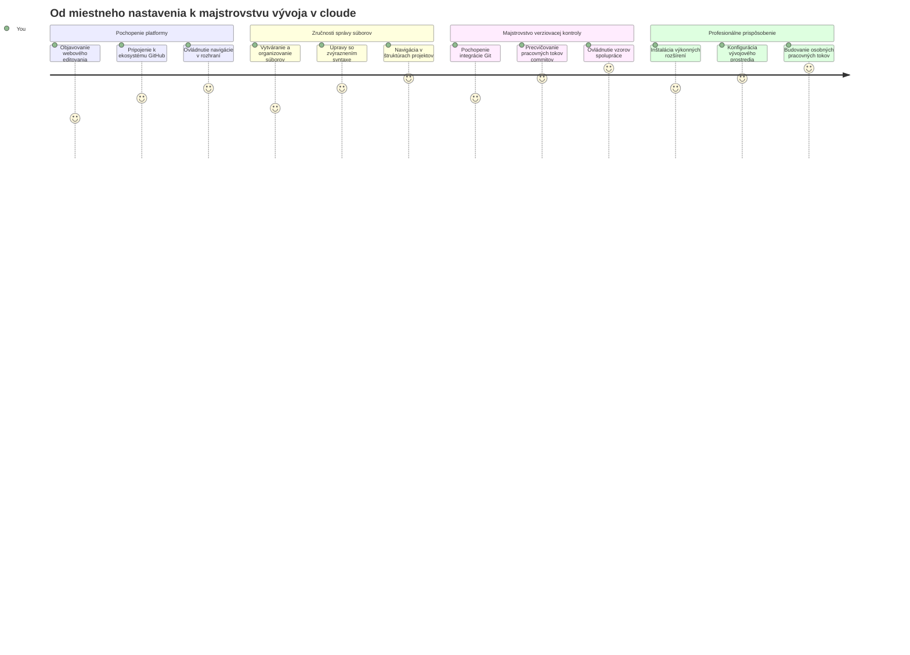
**Vaša cieľová destinácia**: Na konci tejto lekcie ovládnete profesionálne cloudové vývojové prostredie, ktoré funguje na každom zariadení a umožní vám kódovať s rovnakými nástrojmi, aké používajú vývojári vo veľkých technologických spoločnostiach.

## Čo sa naučíte

Po spoločnom prechode budete schopní:

- Orientovať sa vo VSCode.dev, akoby to bol váš druhý domov – nájdete všetko, čo potrebujete, bez zblúdenia
- Otvoriť akýkoľvek GitHub repozitár priamo vo vašom prehliadači a okamžite začať upravovať (toto je naozaj magické!)
- Používať Git na sledovanie zmien a ukladanie pokroku ako profi
- Vylepšiť editor rozšíreniami, ktoré zrýchľujú a spríjemňujú kódovanie
- Sebavedome vytvárať a organizovať projektové súbory

## Čo budete potrebovať

Požiadavky sú jednoduché:

- Bezplatný [GitHub účet](https://github.com) (ak ho nemáte, prevedieme vás jeho vytvorením)
- Základná znalosť webových prehliadačov
- Lekcia GitHub Basics poskytuje užitočný základ, nie je však nevyhnutná

> 💡 **Nový na GitHub?** Vytvorenie účtu je zadarmo a zaberie len pár minút. Rovnako ako knižničná karta vám umožní prístup ku knihám po celom svete, GitHub účet otvára dvere ku kódovacím repozitárom po internete.

## 🧠 Prehľad cloudového vývojového ekosystému

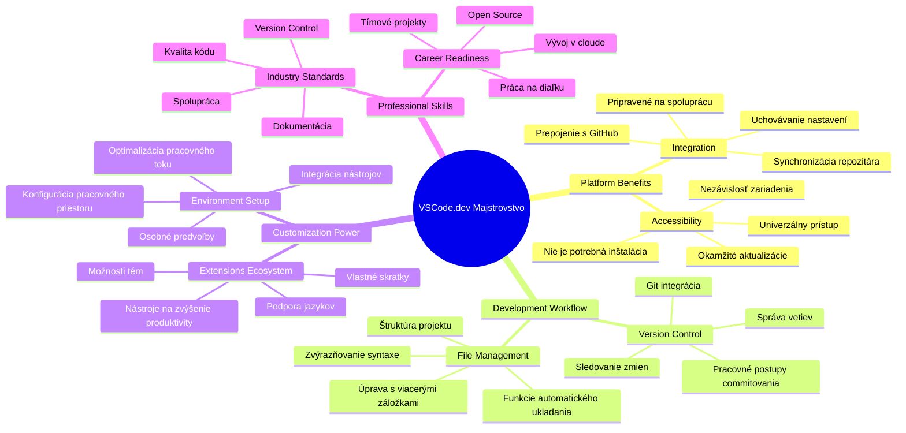
**Jadrový princíp**: Cloudové vývojové prostredia predstavujú budúcnosť kódovania – poskytujú profesionálne nástroje, ktoré sú dostupné, spolupracujúce a nezávislé od platformy.

## Prečo sú dôležité webové editory kódu

Pred internetom vedci na rôznych univerzitách nemohli jednoducho zdieľať svoje výskumy. Potom prišiel ARPANET v 60. rokoch, ktorý spájal počítače na diaľku. Webové editory kódu nasledujú rovnaký princíp – robia výkonné nástroje dostupné bez ohľadu na vašu fyzickú polohu či zariadenie.

Editor kódu slúži ako vaše pracovisko na vývoj, kde píšete, upravujete a organizujete kódové súbory. Na rozdiel od jednoduchých textových editorov profesionálne editory poskytujú zvýrazňovanie syntaxe, detekciu chýb a funkcie na správu projektov.

VSCode.dev prináša tieto schopnosti priamo do vášho prehliadača:

**Výhody webového editovania:**

| Funkcia | Popis | Praktický prínos |
|---------|-------------|----------|
| **Nezávislosť platformy** | Funguje na akomkoľvek zariadení s prehliadačom | Plynulá práca na rôznych počítačoch |
| **Žiadna inštalácia potrebná** | Prístup cez webové URL | Obídete obmedzenia pri inštalácii softvéru |
| **Automatické aktualizácie** | Vždy beží najnovšia verzia | Prístup k novým funkciám bez manuálnych aktualizácií |
| **Integrácia s repozitármi** | Priame prepojenie na GitHub | Úprava kódu bez správy lokálnych súborov |

**Praktické dôsledky:**
- Pokračovanie v práci cez rôzne prostredia
- Konzistentné rozhranie bez ohľadu na operačný systém
- Okamžité možnosti spolupráce
- Menej požiadaviek na miestne úložisko

## Preskúmavanie VSCode.dev

Rovnako ako laboratórium Marie Curie obsahovalo sofistikované zariadenie v relatívne jednoduchom priestore, VSCode.dev balí profesionálne vývojové nástroje do prehliadačového rozhrania. Táto webová aplikácia poskytuje rovnakú základnú funkcionalitu ako desktopové editory kódu.

Začnite tak, že navštívite [vscode.dev](https://vscode.dev) vo vašom prehliadači. Rozhranie sa načíta bez sťahovania alebo inštalácie do systému – priamy príklad princípov cloud computingu.

### Pripojenie vášho GitHub účtu

Rovnako ako telefón Alexandra Grahama Bella spojil vzdialené lokality, prepojenie vášho GitHub účtu spája VSCode.dev s vašimi kódovými repozitármi. Po výzve na prihlásenie cez GitHub odporúčame túto možnosť pripojenia akceptovať.

**Integrácia s GitHubom poskytuje:**
- Priamy prístup k vašim repozitárom v editore
- Synchronizované nastavenia a rozšírenia na rôznych zariadeniach
- Zjednodušený pracovný postup ukladania do GitHubu
- Personalizované vývojové prostredie

### Spoznajte svoje nové pracovisko

Keď sa všetko načíta, uvidíte krásne čisté pracovisko navrhnuté tak, aby ste sa mohli sústrediť na to najdôležitejšie – váš kód!

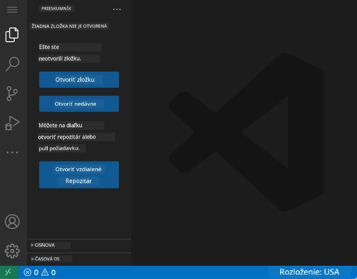

**Tu je prehliadka vašej štvrte:**
- **Aktivitný panel** (ten pásik naľavo): Hlavná navigácia s Explorer 📁, Hľadaním 🔍, Zdrojovým ovládaním 🌿, Rozšíreniami 🧩 a Nastaveniami ⚙️
- **Bočný panel** (panel vedľa neho): Mení sa a ukazuje relevantné informácie podľa toho, čo máte vybraté
- **Editor Area** (veľký priestor v strede): Tu sa deje kúzlo – hlavná časť pre kódovanie

**Chvíľku preskúmajte:**
- Klikajte na ikony v Aktivitnom paneli a všimnite si, čo jednotlivé robia
- Všimnite si, ako sa bočný panel mení podľa zobrazených informácií – celkom fajn, však?
- Pohľad Explorer (📁) je pravdepodobne miestom, kde strávite najviac času, tak si zvykajte

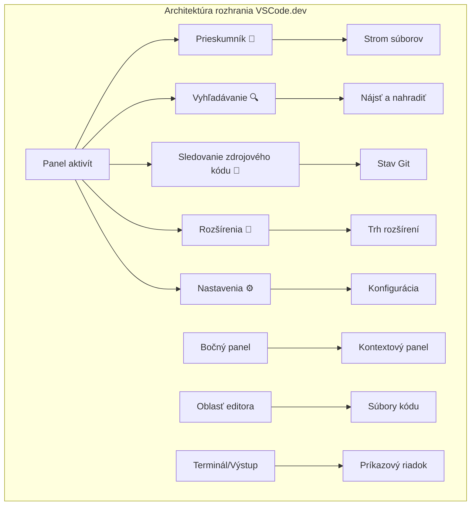
## Otváranie GitHub repozitárov

Pred internetom museli výskumníci cestovať do knižníc osobne, aby získali dokumenty. GitHub repozitáre fungujú podobne – sú to zbierky kódu uložené na diaľku. VSCode.dev zrušil tradičný krok sťahovania repozitárov do lokálneho počítača pred úpravami.

Táto funkcia umožňuje okamžitý prístup ku každému verejnému repozitáru na prehliadanie, úpravy alebo príspevky. Tu sú dva spôsoby, ako otvoriť repozitár:

### Metóda 1: Klikni a vyber

Táto je ideálna, keď začínate vo VSCode.dev a chcete otvoriť konkrétny repozitár. Je jednoduchá a priateľská pre začiatočníkov:

**Postup:**

1. Choďte na [vscode.dev](https://vscode.dev), ak tam ešte nie ste
2. Na uvítacej obrazovke kliknite na tlačidlo „Open Remote Repository“

   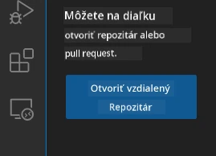

3. Vložte URL ľubovoľného GitHub repozitára (vyskúšajte napríklad: `https://github.com/microsoft/Web-Dev-For-Beginners`)
4. Stlačte Enter a sledujte, ako sa otvorí!

**Profesionálny tip – skratka Command Palette:**

Chcete sa cítiť ako kúzelník kódovania? Vyskúšajte túto klávesovú skratku: Ctrl+Shift+P (alebo Cmd+Shift+P na Macu) pre otvorenie Command Paletty:

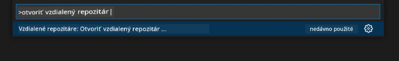

**Command Palette je ako vyhľadávač na všetko, čo môžete urobiť:**
- Napíšte „open remote“ a nájde vám otvárač repozitárov
- Pamätá si repozitáre, ktoré ste nedávno otvárali (veľmi praktické!)
- Ak si na to zvyknete, budete kódovať bleskovou rýchlosťou
- Je to vlastne VSCode.dev verzia „Hej Siri, ale na kódovanie“

### Metóda 2: Zmena URL technikou

Rovnako ako HTTP a HTTPS používajú odlišné protokoly pri zachovaní tej istej štruktúry domény, VSCode.dev používa URL vzorec, ktorý sa zrkadlí s adresovaním GitHubu. Každé GitHub URL repozitára možno upraviť, aby sa priamo otvorilo vo VSCode.dev.

**Vzorec transformácie URL:**

| Typ repozitára | GitHub URL | VSCode.dev URL |
|----------------|---------------------|----------------|
| **Verejný repozitár** | `github.com/microsoft/Web-Dev-For-Beginners` | `vscode.dev/github/microsoft/Web-Dev-For-Beginners` |
| **Osobný projekt** | `github.com/your-username/my-project` | `vscode.dev/github/your-username/my-project` |
| **Akýkoľvek dostupný repozitár** | `github.com/their-username/awesome-repo` | `vscode.dev/github/their-username/awesome-repo` |

**Implementácia:**
- Nahradíte `github.com` za `vscode.dev/github`
- Ostatné časti URL nemeníte
- Funguje pre akýkoľvek verejne dostupný repozitár
- Poskytuje okamžitý prístup na úpravy

> 💡 **Život meniaci tip**: Pridajte si do záložiek VSCode.dev verzie vašich obľúbených repozitárov. Mám záložky ako „Editovať moje portfolio“ a „Opraviť dokumentáciu“, ktoré ma priamo vezmú do režimu úprav!

**Ktorú metódu použiť?**
- **Rozhranie**: Skvelé, keď si chcete prehliadať alebo neviete presné názvy repozitárov
- **Trik s URL**: Perfektný na bleskovo rýchly prístup, keď presne viete, kam idete

### 🎯 Pedagogická kontrola: Prístup k cloudovému vývoju

**Zastavte sa a zamyslite sa**: Práve ste sa naučili dva spôsoby, ako pristupovať k repozitárom kódu cez webový prehliadač. Toto predstavuje zásadnú zmenu vo fungovaní vývoja.

**Rýchle sebahodnotenie:**
- Dokážete vysvetliť, prečo webové editovanie eliminuje tradičné „nastavenie vývojového prostredia“?
- Aké výhody má technika modifikácie URL oproti lokálnemu git klonovaniu?
- Ako táto metóda mení spôsob, akým by ste mohli prispievať do open source projektov?

**Spojenie s realitou**: Veľké spoločnosti ako GitHub, GitLab a Replit vybudovali svoje vývojové platformy na týchto cloudových princípoch. Učíte sa rovnaké workflow, aké používajú profesionálne vývojové tímy po celom svete.

**Výzva**: Ako by mohlo cloudové vývojové prostredie zmeniť spôsob výučby kódovania v školách? Zamyslite sa nad požiadavkami na zariadenia, správu softvéru a možnosti spolupráce.

## Práca so súbormi a projektmi

Teraz, keď máte otvorený repozitár, poďme začať stavať! VSCode.dev vám poskytuje všetko potrebné na vytváranie, úpravu a organizovanie vašich kódových súborov. Predstavte si to ako svoju digitálnu dielňu – každý nástroj je presne tam, kde ho potrebujete.

Ponoríme sa do každodenných úloh, ktoré budú tvoriť väčšinu vášho pracovného toku pri kódovaní.

### Vytváranie nových súborov

Rovnako ako organizovanie plánov v kancelárii architekta, tvorba súborov vo VSCode.dev nasleduje štruktúrovaný prístup. Systém podporuje všetky štandardné typy webových súborov.

**Proces vytvárania súboru:**

1. Prejdite do cieľového priečinka v paneli Explorer
2. Najeďte myšou na meno priečinka a zobrazí sa ikona „Nový súbor“ (📄+)
3. Zadajte názov súboru vrátane prípony (`style.css`, `script.js`, `index.html`)
4. Stlačte Enter pre vytvorenie súboru

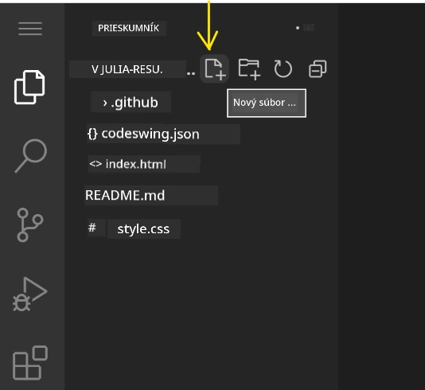

**Názvoslovie:**
- Používajte popisné mená, ktoré naznačujú účel súboru
- Zahrňte prípony súborov pre správne zvýrazňovanie syntaxe
- Dodržujte konzistentné vzory názvov v projektoch
- Používajte malé písmená a pomlčky namiesto medzier

### Úprava a ukladanie súborov

Tu začína pravé zábavné kódovanie! Editor VSCode.dev je nabitý užitočnými funkciami, ktoré robia kódovanie hladkým a intuitívnym. Je to ako mať veľmi múdreho asistenta písania, ale pre kód.

**Váš pracovný tok pri úprave:**

1. Kliknite na ľubovoľný súbor v Explorer na otvorenie v hlavnej oblasti
2. Začnite písať a sledujte, ako vám VSCode.dev pomáha farbami, návrhmi a odhaľovaním chýb
3. Uložte svoju prácu pomocou Ctrl+S (Windows/Linux) alebo Cmd+S (Mac) – aj keď editor automaticky ukladá!

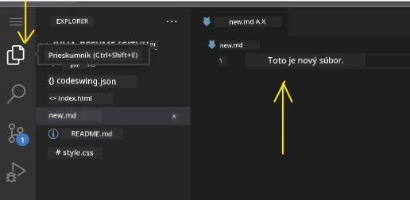

**Skvelé veci, ktoré sa dejú počas kódovania:**
- Váš kód je krásne farebne zvýraznený, takže sa ľahko číta
- VSCode.dev vám navrhuje dokončenia, zatiaľ čo píšete (ako automatická oprava, ale oveľa inteligentnejšia)
- Zachytáva preklepy a chyby ešte skôr, než uložíte
- Môžete mať otvorených viac súborov na kartách, rovnako ako v prehliadači
- Všetko sa automaticky ukladá na pozadí

> ⚠️ **Rýchly tip**: Aj keď má automatické ukladanie pod kontrolou, stlačenie Ctrl+S alebo Cmd+S je stále dobrým zvykom. Okamžite uloží všetko a spustí niektoré extra užitočné funkcie, ako kontrolu chýb.

### Verziový manažment s Gitom

Rovnako ako archeológovia vytvárajú detailné záznamy o vrstvách vykopávok, Git sleduje zmeny vo vašom kóde v priebehu času. Tento systém uchováva históriu projektu a umožňuje vám vrátiť sa k predchádzajúcim verziám, keď je to potrebné. VSCode.dev obsahuje integrovanú Git funkcionalitu.

**Rozhranie Zdrojového ovládania:**

1. Pristúpte k panelu Zdrojového ovládania cez ikonu 🌿 v Aktivitnom paneli
2. Upravené súbory sa zobrazujú v sekcii „Changes“
3. Farebné kódovanie označuje typ zmien: zelená pre prírastky, červená pre zmazania

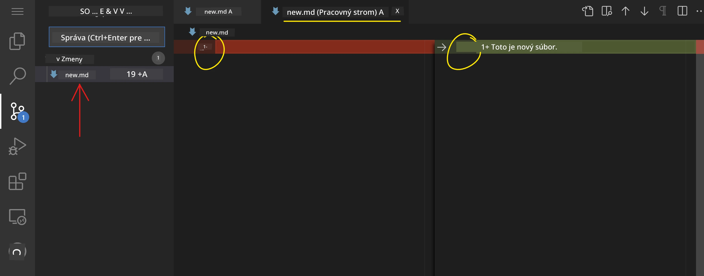

**Ukladanie práce (workflow commitovania):**

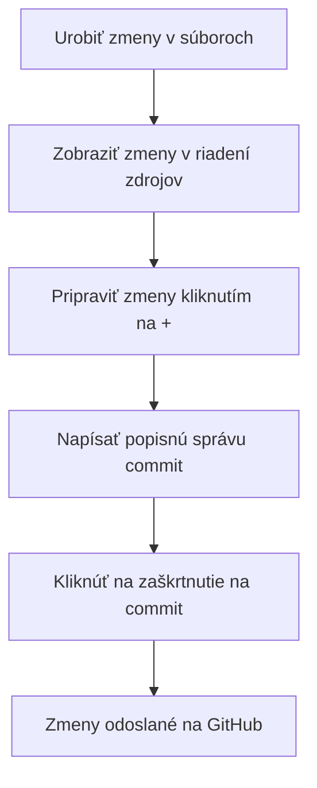
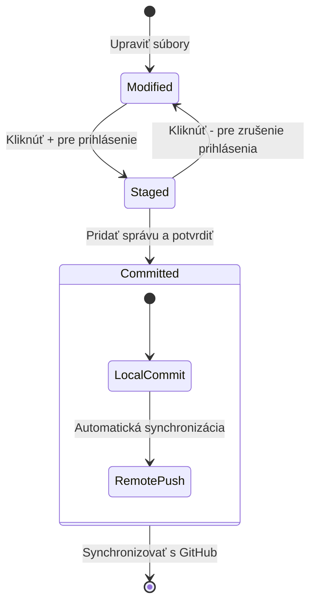
**Tu je váš krok za krokom proces:**
- Kliknite na ikonu „+“ vedľa súborov, ktoré chcete uložiť (tým ich „pridáte na staged“)
- Dvojitá kontrola, či ste spokojní so všetkými svojimi pripravenými zmenami
- Napíšte krátku poznámku vysvetľujúcu, čo ste urobili (toto je vaša „správa o commite“)
- Kliknite na tlačidlo so začiarknutím na uloženie všetkého do GitHubu
- Ak si to rozmyslíte, ikona odvolania umožňuje zahodiť zmeny

**Písanie dobrých commit správ (je to jednoduchšie, než si myslíte!):**
- Jednoducho popíšte, čo ste urobili, napríklad „Pridať kontaktný formulár“ alebo „Opraviť nefungujúcu navigáciu“
- Držte sa stručnosti – myslite na dĺžku tweetu, nie eseje
- Začnite akčnými slovami ako „Pridať“, „Opraviť“, „Aktualizovať“ alebo „Odstrániť“
- **Dobré príklady**: „Pridať responzívne navigačné menu“, „Opraviť problémy s mobilným rozložením“, „Aktualizovať farby pre lepšiu prístupnosť“

> 💡 **Rýchla navigačná rada**: Použite hamburger menu (☰) vľavo hore na preskočenie späť do vášho GitHub repozitára a zobrazenie vašich commitovaných zmien online. Je to ako portál medzi vaším editačným prostredím a domovom vášho projektu na GitHube!

## Vylepšenie funkcií pomocou rozšírení

Rovnako ako dielňa remeselníka obsahuje špecializované nástroje pre rôzne úlohy, VSCode.dev môžete prispôsobiť rozšíreniami, ktoré pridávajú konkrétne schopnosti. Tieto rozšírenia vyvinuté komunitou riešia bežné vývojové potreby ako formátovanie kódu, živý náhľad a rozšírenú integráciu Git.

Trhovisko rozšírení hostí tisíce bezplatných nástrojov vytvorených vývojármi z celého sveta. Každé rozšírenie rieši konkrétne výzvy pracovného postupu, čo vám umožňuje vytvoriť si personalizované vývojové prostredie prispôsobené vašim konkrétnym potrebám a preferenciám.

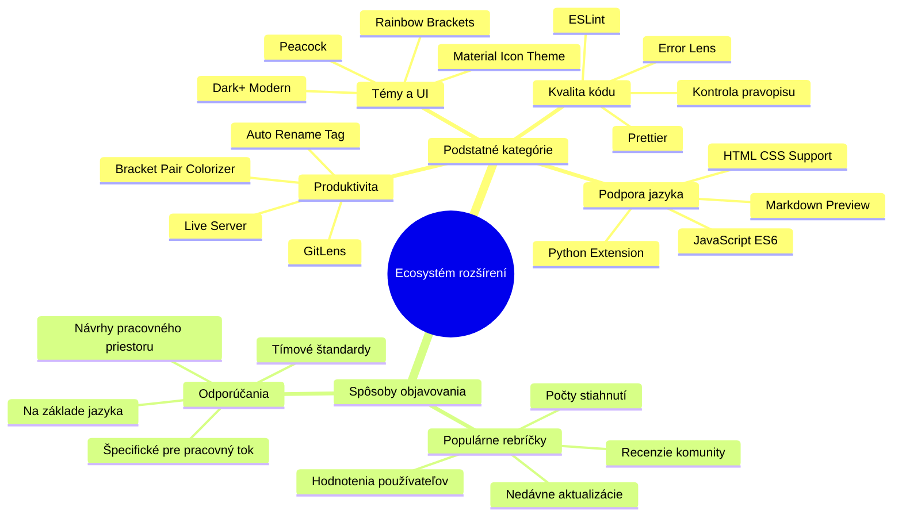
### Ako nájsť ideálne rozšírenia

Trhovisko rozšírení je veľmi dobre usporiadané, takže sa nestratíte pri hľadaní toho, čo potrebujete. Je navrhnuté tak, aby vám pomohlo objaviť špecifické nástroje aj zaujímavé veci, o ktorých ste ani nevedeli!

**Ako sa dostať na trhovisko:**

1. Kliknite na ikonu Rozšírenia (🧩) v paneli Aktivít
2. Prehliadajte si alebo vyhľadajte niečo konkrétne
3. Kliknite na čokoľvek zaujímavé, aby ste sa o tom dozvedeli viac

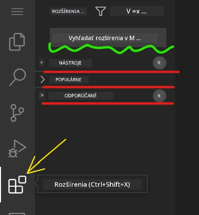

**Čo tam uvidíte:**

| Sekcia | Čo obsahuje | Prečo je to užitočné |
|----------|---------|----------|
| **Inštalované** | Rozšírenia, ktoré ste už pridali | Váš osobný programátorský toolkit |
| **Populárne** | Oblúbené u širokej verejnosti | Čo väčšina vývojárov dôveruje |
| **Odporúčané** | Inteligentné návrhy pre váš projekt | Užitočné odporúčania VSCode.dev |

**Čo uľahčuje prehliadanie:**
- Každé rozšírenie zobrazuje hodnotenia, počet stiahnutí a reálne recenzie používateľov
- Dostanete screenshoty a jasné popisy funkcií každého z nich
- Všetko je prehľadne označené s informáciami o kompatibilite
- Sú navrhované podobné rozšírenia, aby ste si mohli vybrať

### Inštalácia rozšírení (je to veľmi jednoduché!)

Pridanie nových schopností do editora je rovnako jednoduché ako kliknutie na tlačidlo. Rozšírenia sa nainštalujú za pár sekúnd a ihneď začínajú pracovať – bez reštartu alebo čakania.

**Čo všetko potrebujete urobiť:**

1. Vyhľadajte, čo chcete (skúste hľadať "live server" alebo "prettier")
2. Kliknite na vybrané rozšírenie, aby ste videli viac podrobností
3. Prečítajte si, čo robí, a pozrite si hodnotenia
4. Kliknite na modré tlačidlo „Inštalovať“ a máte hotovo!


**Čo sa deje na pozadí:**
- Rozšírenie sa automaticky stiahne a nastaví
- Nové funkcie sa okamžite objavia vo vašom rozhraní
- Všetko začne fungovať okamžite (naozaj, je to také rýchle!)
- Ak ste prihlásený, rozšírenie sa synchronizuje na všetky vaše zariadenia

**Niektoré rozšírenia, ktoré odporúčam na začiatok:**
- **Live Server**: Sledujte aktualizácie svojho webu v reálnom čase počas kódovania (toto je magické!)
- **Prettier**: Automaticky upraví kód tak, aby vyzeral čisto a profesionálne
- **Auto Rename Tag**: Zmena jedného HTML tagu zmení aj jeho pár
- **Bracket Pair Colorizer**: Farebne kóduje zátvorky, aby ste sa nikdy nestratili
- **GitLens**: Vylepšuje vaše Git funkcie pomocou množstva užitočných informácií

### Prispôsobenie rozšírení

Väčšina rozšírení má nastavenia, ktoré môžete upraviť, aby fungovali presne podľa vašich predstáv. Predstavte si to ako nastavenie sedadla a zrkadiel v aute – každý má svoje preferencie!

**Úprava nastavení rozšírenia:**

1. Nájdite nainštalované rozšírenie v paneli Rozšírenia
2. Kliknite na malú ikonu ozubeného kolieska (⚙️) vedľa jeho názvu
3. Vyberte „Nastavenia rozšírenia“ z rozbaľovacej ponuky
4. Upravte veci, kým nebude pracovný tok presne podľa vás

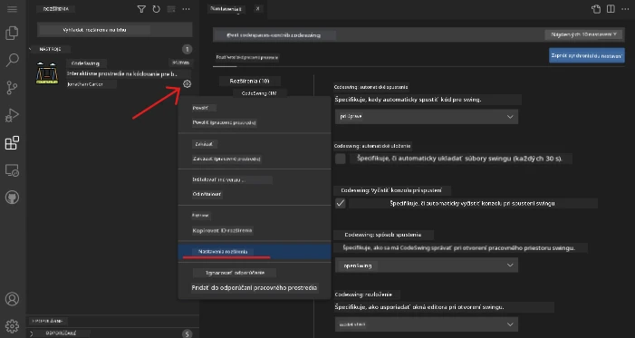

**Bežné veci, ktoré možno budete chcieť upraviť:**
- Ako sa formátuje váš kód (taby vs medzery, dĺžka riadkov a pod.)
- Ktoré klávesové skratky spúšťajú rôzne akcie
- S ktorými typmi súborov má rozšírenie pracovať
- Zapnúť alebo vypnúť konkrétne funkcie pre čisté prostredie

### Udržiavanie poriadku v rozšíreniach

Keď objavíte viac skvelých rozšírení, budete chcieť svoju zbierku udržiavať usporiadanú a bezproblémovú. VSCode.dev to veľmi uľahčuje.

**Možnosti správy rozšírení:**

| Čo môžete robiť | Kedy je to užitočné | Tip |
|--------|---------|----------|
| **Zakázať** | Testovanie, či rozšírenie spôsobuje problémy | Lepšie než odinštalovať, ak ho možno budete chcieť späť |
| **Odinštalovať** | Úplné odstránenie nepotrebných rozšírení | Udržiava vaše prostredie čisté a rýchle |
| **Aktualizovať** | Získať najnovšie funkcie a opravy | Zvyčajne ide automaticky, ale oplatí sa skontrolovať |

**Ako spravujem rozšírenia ja:**
- Každých pár mesiacov kontrolujem, čo mám nainštalované, a odstraňujem, čo nepoužívam
- Neustále aktualizujem rozšírenia, aby som mal najnovšie vylepšenia a bezpečnostné opravy
- Ak sa zdá, že je niečo pomalé, dočasne rozšírenia zakážem, aby som našiel vinníka
- Čítam si poznámky k aktualizáciám, keď dostanú veľké zmeny – niekedy sú tam skvelé nové funkcie!

> ⚠️ **Tip pre výkon**: Rozšírenia sú skvelé, ale príliš veľa ich môže spomaliť celý editor. Sústreďte sa na tie, ktoré vám naozaj uľahčujú prácu, a nebojte sa odinštalovať tie, ktoré nikdy nepoužívate.

### 🎯 Pedagogická kontrola: Prispôsobovanie vývojového prostredia

**Pochopenie architektúry**: Naučili ste sa prispôsobovať profesionálne vývojové prostredie pomocou komunitou vytvorených rozšírení. To zodpovedá tomu, ako podnikové vývojové tímy budujú štandardizované nástroje.

**Kľúčové nadobudnuté koncepty**:
- **Nájdenie rozšírení**: Vyhľadávanie nástrojov, ktoré riešia konkrétne vývojové výzvy
- **Konfigurácia prostredia**: Prispôsobenie nástrojov podľa osobných alebo tímových preferencií
- **Optimalizácia výkonu**: Vyváženie funkčnosti a výkonu systému
- **Spolupráca komunity**: Využívanie nástrojov vytvorených globálnou developerskou komunitou

**Spojenie s priemyslom**: Ekosystémy rozšírení poháňajú hlavné vývojové platformy ako VS Code, Chrome DevTools a moderné IDE. Pochopenie hodnotenia, inštalácie a konfigurácie rozšírení je nevyhnutné pre profesionálne vývojové workflow.

**Reflexná otázka**: Ako by ste pristúpili k nastaveniu štandardizovaného vývojového prostredia pre tím 10 vývojárov? Zvážte konzistenciu, výkon a individuálne preferencie.

## 📈 Vaša časová os majstrovstva cloudového vývoja

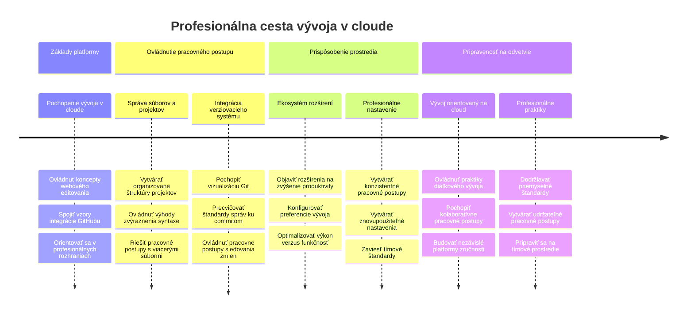
**🎓 Milník ukončenia štúdia**: Úspešne ste zvládli cloudový vývoj pomocou tých istých nástrojov a workflow, aké používajú profesionálni vývojári vo veľkých technologických firmách. Tieto zručnosti predstavujú budúcnosť softvérového vývoja.

**🔄 Schopnosti na ďalšej úrovni**:
- Pripravenosť preskúmať pokročilé cloudové vývojové platformy (Codespaces, GitPod)
- Schopnosť pracovať v distribuovaných vývojových tímoch
- Spôsobilosť prispievať globálne do open source projektov
- Základ pre moderný DevOps a kontinuálnu integráciu

## Výzva GitHub Copilot Agenta 🚀

Ako štruktúrovaný prístup NASA pre vesmírne misie, táto výzva zahŕňa systematické využitie VSCode.dev zručností v kompletnom workflow scenáriu.

**Cieľ:** Preukázať zručnosť v VSCode.dev vytvorením komplexného webového vývojového workflow.

**Požiadavky projektu:** S pomocou režimu Agent dokončite tieto úlohy:
1. Odbočte (forknite) existujúci repozitár alebo vytvorte nový
2. Vytvorte funkčnú projektovú štruktúru s HTML, CSS a JavaScript súbormi
3. Nainštalujte a nakonfigurujte tri rozšírenia na zlepšenie vývoja
4. Precvičte správu verzií s popisnými commit správami
5. Vyskúšajte vytváranie a úpravu funkčných branchí
6. Zdokumentujte proces a zistenia v súbore README.md

Toto cvičenie konsoliduje všetky koncepty VSCode.dev do praktického pracovného postupu, ktorý môžete použiť v budúcich vývojových projektoch.

Viac o [režime agenta](https://code.visualstudio.com/blogs/2025/02/24/introducing-copilot-agent-mode) sa dozviete tu.

## Zadanie

Je čas vyskúšať si tieto zručnosti v praxi! Mám pre vás praktický projekt, ktorý vám umožní precvičiť všetko, čo sme prebrali: [Vytvorte webovú stránku so životopisom pomocou VSCode.dev](./assignment.md)

Toto zadanie vás prevedie vytváraním profesionálnej webovej stránky so životopisom úplne vo vašom prehliadači. Využijete všetky funkcie VSCode.dev, ktoré sme preskúmali, a na konci budete mať príťažlivú webovú stránku a pevné sebavedomie vo vašom novom pracovnom postupe.

## Pokračujte v objavovaní a rozvíjaní zručností

Máte dobrý základ, no je tu ešte veľa skvelých vecí na objavenie! Tu je niekoľko zdrojov a nápadov, ako posunúť vaše zručnosti vo VSCode.dev na vyššiu úroveň:

**Oficiálna dokumentácia hodná uloženia:**
- [VSCode Web Documentation](https://code.visualstudio.com/docs/editor/vscode-web?WT.mc_id=academic-0000-alfredodeza) – Kompletný sprievodca úpravou v prehliadači
- [GitHub Codespaces](https://docs.github.com/en/codespaces) – Pre ešte väčšiu silu v cloude

**Zaujímavé funkcie na experimentovanie:**
- **Klávesové skratky**: Naučte sa kombinácie, ktoré vás premenia na programátorského ninju
- **Nastavenia pracovného priestoru**: Nastavte rôzne prostredia pre rôzne typy projektov
- **Viacnásobné pracovné priestory**: Pracujte naraz na viacerých repozitároch (super praktické!)
- **Integrácia terminálu**: Prístup k príkazovému riadku priamo v prehliadači

**Nápady na precvičovanie:**
- Zapojte sa do open source projektov a prispievajte pomocou VSCode.dev – je to skvelý spôsob, ako pomôcť!
- Vyskúšajte rôzne rozšírenia a nájdite si svoje ideálne nastavenie
- Vytvorte si projektové šablóny pre typy stránok, ktoré tvoríte najčastejšie
- Precvičujte Git workflow ako vetvenie a spájanie – tieto zručnosti sú zlatom v tímových projektoch

---

**Ovládli ste vývoj v prehliadači!** 🎉 Rovnako ako vynález prenosných prístrojov umožnil vedcom vykonávať výskum v odľahlých oblastiach, VSCode.dev umožňuje profesionálne kódovanie z akéhokoľvek zariadenia s pripojením na internet.

Tieto zručnosti odzrkadľujú aktuálne priemyselné postupy – mnohí profesionálni vývojári používajú cloudové vývojové prostredia pre ich flexibilitu a dostupnosť. Naučili ste sa pracovný tok, ktorý škáluje od individuálnych projektov po veľké tímové spolupráce.

Použite tieto techniky pri vašom ďalšom vývojovom projekte! 🚀

---

<!-- CO-OP TRANSLATOR DISCLAIMER START -->
**Zrieknutie sa zodpovednosti**:  
Tento dokument bol preložený pomocou AI prekladateľskej služby [Co-op Translator](https://github.com/Azure/co-op-translator). Hoci sa snažíme o presnosť, vezmite prosím na vedomie, že automatizované preklady môžu obsahovať chyby alebo nepresnosti. Pôvodný dokument v jeho rodnom jazyku by mal byť považovaný za autoritatívny zdroj. Pre dôležité informácie sa odporúča profesionálny ľudský preklad. Nie sme zodpovední za akékoľvek nedorozumenia alebo nesprávne interpretácie vyplývajúce z použitia tohto prekladu.
<!-- CO-OP TRANSLATOR DISCLAIMER END -->