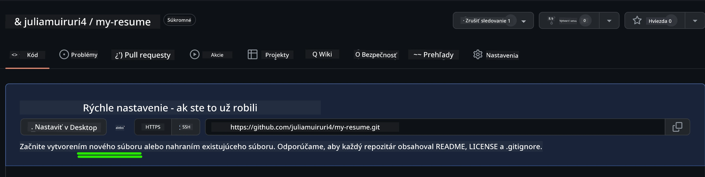
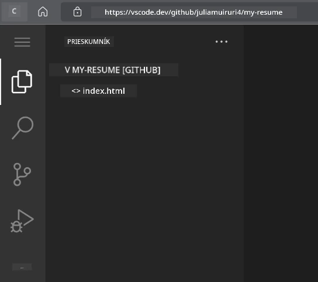
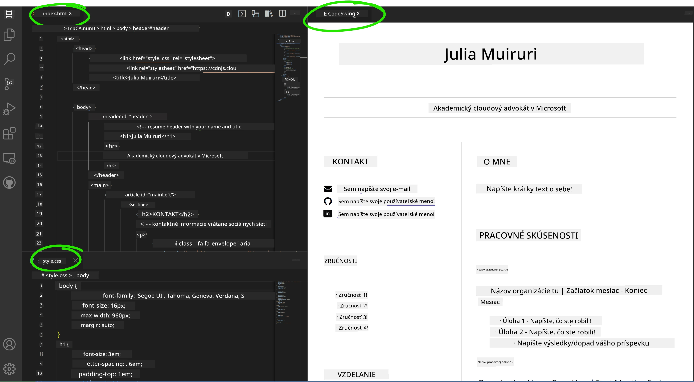

<!--
CO_OP_TRANSLATOR_METADATA:
{
  "original_hash": "effe56ba51c38d7bdfad1ea38288666b",
  "translation_date": "2025-10-24T21:21:03+00:00",
  "source_file": "8-code-editor/1-using-a-code-editor/assignment.md",
  "language_code": "sk"
}
-->
# Vytvorenie webovej stránky životopisu pomocou VSCode.dev

Zlepšite svoje kariérne vyhliadky vytvorením profesionálnej webovej stránky životopisu, ktorá interaktívne a moderne prezentuje vaše zručnosti a skúsenosti. Namiesto posielania tradičných PDF si predstavte, že poskytujete náborovým pracovníkom elegantnú, responzívnu webovú stránku, ktorá demonštruje vaše kvalifikácie aj schopnosti v oblasti webového vývoja.

Táto praktická úloha vám umožní využiť všetky vaše zručnosti z VSCode.dev pri vytváraní niečoho skutočne užitočného pre vašu kariéru. Zažijete kompletný pracovný postup webového vývoja – od vytvorenia repozitára až po nasadenie – všetko v rámci vášho prehliadača.

Po dokončení tohto projektu budete mať profesionálnu online prezentáciu, ktorú môžete ľahko zdieľať s potenciálnymi zamestnávateľmi, aktualizovať podľa rastu vašich zručností a prispôsobiť svojmu osobnému štýlu. Presne takýto praktický projekt demonštruje reálne zručnosti v oblasti webového vývoja.

## Ciele učenia

Po dokončení tejto úlohy budete schopní:

- **Vytvoriť** a spravovať kompletný projekt webového vývoja pomocou VSCode.dev
- **Štruktúrovať** profesionálnu webovú stránku pomocou semantických HTML prvkov
- **Štylizovať** responzívne rozloženia modernými technikami CSS
- **Implementovať** interaktívne funkcie pomocou základných webových technológií
- **Nasadiť** živú webovú stránku dostupnú prostredníctvom zdieľateľného URL
- **Demonštrovať** najlepšie postupy verzovania počas celého vývojového procesu

## Predpoklady

Pred začatím tejto úlohy sa uistite, že máte:

- Účet na GitHub (vytvorte si ho na [github.com](https://github.com/), ak je to potrebné)
- Dokončenú lekciu VSCode.dev o navigácii v rozhraní a základných operáciách
- Základné pochopenie štruktúry HTML a konceptov štýlovania pomocou CSS

## Nastavenie projektu a vytvorenie repozitára

Začnime nastavením základov vášho projektu. Tento proces odráža pracovné postupy reálneho vývoja, kde projekty začínajú správnou inicializáciou repozitára a plánovaním štruktúry.

### Krok 1: Vytvorenie GitHub repozitára

Nastavenie dedikovaného repozitára zabezpečí, že váš projekt bude od začiatku správne organizovaný a verzovaný.

1. **Prejdite** na [GitHub.com](https://github.com) a prihláste sa do svojho účtu
2. **Kliknite** na zelené tlačidlo „New“ alebo na ikonu „+“ v pravom hornom rohu
3. **Pomenujte** svoj repozitár `my-resume` (alebo si vyberte personalizovaný názov, napríklad `john-smith-resume`)
4. **Pridajte** krátky popis: „Profesionálna webová stránka životopisu vytvorená pomocou HTML a CSS“
5. **Vyberte** „Public“, aby bol váš životopis prístupný potenciálnym zamestnávateľom
6. **Zaškrtnite** „Add a README file“, aby ste vytvorili počiatočný popis projektu
7. **Kliknite** na „Create repository“, aby ste dokončili nastavenie

> 💡 **Tip na pomenovanie repozitára**: Používajte popisné, profesionálne názvy, ktoré jasne naznačujú účel projektu. To pomáha pri zdieľaní s zamestnávateľmi alebo počas prehliadok portfólia.

### Krok 2: Inicializácia štruktúry projektu

Keďže VSCode.dev vyžaduje aspoň jeden súbor na otvorenie repozitára, vytvoríme náš hlavný HTML súbor priamo na GitHube predtým, než prejdeme na webový editor.

1. **Kliknite** na odkaz „creating a new file“ vo vašom novom repozitári
2. **Napíšte** `index.html` ako názov súboru
3. **Pridajte** túto počiatočnú HTML štruktúru:

```html
<!DOCTYPE html>
<html lang="en">
<head>
    <meta charset="UTF-8">
    <meta name="viewport" content="width=device-width, initial-scale=1.0">
    <title>Your Name - Professional Resume</title>
</head>
<body>
    <h1>Your Name</h1>
    <p>Professional Resume Website</p>
</body>
</html>
```

4. **Napíšte** správu o potvrdení: „Pridať počiatočnú HTML štruktúru“
5. **Kliknite** na „Commit new file“, aby ste uložili svoje zmeny



**Čo tento počiatočný setup dosahuje:**
- **Zavádza** správnu štruktúru dokumentu HTML5 so semantickými prvkami
- **Zahŕňa** meta tag pre kompatibilitu responzívneho dizajnu
- **Nastavuje** popisný názov stránky, ktorý sa zobrazuje na kartách prehliadača
- **Vytvára** základ pre profesionálnu organizáciu obsahu

## Práca vo VSCode.dev

Teraz, keď je základ vášho repozitára nastavený, prejdime na VSCode.dev pre hlavné vývojové práce. Tento webový editor poskytuje všetky nástroje potrebné pre profesionálny webový vývoj.

### Krok 3: Otvorenie projektu vo VSCode.dev

1. **Prejdite** na [vscode.dev](https://vscode.dev) v novom okne prehliadača
2. **Kliknite** na „Open Remote Repository“ na uvítacej obrazovke
3. **Skopírujte** URL vášho repozitára z GitHubu a vložte ho do vstupného poľa

   Formát: `https://github.com/your-username/my-resume`
   
   *Nahraďte `your-username` svojím skutočným GitHub používateľským menom*

4. **Stlačte** Enter, aby ste načítali váš projekt

✅ **Indikátor úspechu**: Mali by ste vidieť súbory vášho projektu v bočnom paneli Explorer a `index.html` dostupný na úpravu v hlavnej oblasti editora.



**Čo uvidíte v rozhraní:**
- **Bočný panel Explorer**: **Zobrazuje** súbory a štruktúru priečinkov vášho repozitára
- **Oblasť editora**: **Zobrazuje** obsah vybraných súborov na úpravu
- **Panel aktivít**: **Poskytuje** prístup k funkciám ako Source Control a Extensions
- **Stavový panel**: **Indikuje** stav pripojenia a informácie o aktuálnej vetve

### Krok 4: Vytvorenie obsahu životopisu

Nahraďte obsah zástupného textu v `index.html` komplexnou štruktúrou životopisu. Tento HTML poskytuje základ pre profesionálnu prezentáciu vašich kvalifikácií.

<details>
<summary><b>Kompletná HTML štruktúra životopisu</b></summary>

```html
<!DOCTYPE html>
<html lang="en">
<head>
    <meta charset="UTF-8">
    <meta name="viewport" content="width=device-width, initial-scale=1.0">
    <link href="style.css" rel="stylesheet">
    <link rel="stylesheet" href="https://cdnjs.cloudflare.com/ajax/libs/font-awesome/5.15.4/css/all.min.css">
    <title>Your Name - Professional Resume</title>
</head>
<body>
    <header id="header">
        <h1>Your Full Name</h1>
        <hr>
        <p class="role">Your Professional Title</p>
        <hr>
    </header>
    
    <main>
        <article id="mainLeft">
            <section>
                <h2>CONTACT</h2>
                <p>
                    <i class="fa fa-envelope" aria-hidden="true"></i>
                    <a href="mailto:your.email@domain.com">your.email@domain.com</a>
                </p>
                <p>
                    <i class="fab fa-github" aria-hidden="true"></i>
                    <a href="https://github.com/your-username">github.com/your-username</a>
                </p>
                <p>
                    <i class="fab fa-linkedin" aria-hidden="true"></i>
                    <a href="https://linkedin.com/in/your-profile">linkedin.com/in/your-profile</a>
                </p>
            </section>
            
            <section>
                <h2>SKILLS</h2>
                <ul>
                    <li>HTML5 & CSS3</li>
                    <li>JavaScript (ES6+)</li>
                    <li>Responsive Web Design</li>
                    <li>Version Control (Git)</li>
                    <li>Problem Solving</li>
                </ul>
            </section>
            
            <section>
                <h2>EDUCATION</h2>
                <h3>Your Degree or Certification</h3>
                <p>Institution Name</p>
                <p>Start Date - End Date</p>
            </section>
        </article>
        
        <article id="mainRight">
            <section>
                <h2>ABOUT</h2>
                <p>Write a compelling summary that highlights your passion for web development, key achievements, and career goals. This section should give employers insight into your personality and professional approach.</p>
            </section>
            
            <section>
                <h2>WORK EXPERIENCE</h2>
                <div class="job">
                    <h3>Job Title</h3>
                    <p class="company">Company Name | Start Date – End Date</p>
                    <ul>
                        <li>Describe a key accomplishment or responsibility</li>
                        <li>Highlight specific skills or technologies used</li>
                        <li>Quantify impact where possible (e.g., "Improved efficiency by 25%")</li>
                    </ul>
                </div>
                
                <div class="job">
                    <h3>Previous Job Title</h3>
                    <p class="company">Previous Company | Start Date – End Date</p>
                    <ul>
                        <li>Focus on transferable skills and achievements</li>
                        <li>Demonstrate growth and learning progression</li>
                        <li>Include any leadership or collaboration experiences</li>
                    </ul>
                </div>
            </section>
            
            <section>
                <h2>PROJECTS</h2>
                <div class="project">
                    <h3>Project Name</h3>
                    <p>Brief description of what the project accomplishes and technologies used.</p>
                    <a href="#" target="_blank">View Project</a>
                </div>
            </section>
        </article>
    </main>
</body>
</html>
```
</details>

**Pokyny na prispôsobenie:**
- **Nahraďte** všetok zástupný text svojimi skutočnými informáciami
- **Upravte** sekcie podľa úrovne vašich skúseností a zamerania kariéry
- **Pridajte** alebo odstráňte sekcie podľa potreby (napr. Certifikáty, Dobrovoľnícka práca, Jazyky)
- **Zahrňte** odkazy na vaše skutočné profily a projekty

### Krok 5: Vytvorenie podporných súborov

Profesionálne webové stránky vyžadujú organizované štruktúry súborov. Vytvorte CSS štýlový súbor a konfiguračné súbory potrebné pre kompletný projekt.

1. **Prejdite** myšou nad názov priečinka vášho projektu v bočnom paneli Explorer
2. **Kliknite** na ikonu „New File“ (📄+), ktorá sa zobrazí
3. **Vytvorte** tieto súbory jeden po druhom:
   - `style.css` (pre štýlovanie a rozloženie)
   - `codeswing.json` (pre konfiguráciu rozšírenia na náhľad)

**Vytvorenie CSS súboru (`style.css`):**

<details>
<summary><b>Profesionálne CSS štýlovanie</b></summary>

```css
/* Modern Resume Styling */
body {
    font-family: 'Segoe UI', Tahoma, Geneva, Verdana, sans-serif;
    font-size: 16px;
    line-height: 1.6;
    max-width: 960px;
    margin: 0 auto;
    padding: 20px;
    color: #333;
    background-color: #f9f9f9;
}

/* Header Styling */
header {
    text-align: center;
    margin-bottom: 3em;
    padding: 2em;
    background: linear-gradient(135deg, #667eea 0%, #764ba2 100%);
    color: white;
    border-radius: 10px;
    box-shadow: 0 4px 6px rgba(0, 0, 0, 0.1);
}

h1 {
    font-size: 3em;
    letter-spacing: 0.1em;
    margin-bottom: 0.2em;
    font-weight: 300;
}

.role {
    font-size: 1.3em;
    font-weight: 300;
    margin: 1em 0;
}

/* Main Content Layout */
main {
    display: grid;
    grid-template-columns: 35% 65%;
    gap: 3em;
    margin-top: 3em;
    background: white;
    padding: 2em;
    border-radius: 10px;
    box-shadow: 0 2px 10px rgba(0, 0, 0, 0.1);
}

/* Typography */
h2 {
    font-size: 1.4em;
    font-weight: 600;
    margin-bottom: 1em;
    color: #667eea;
    border-bottom: 2px solid #667eea;
    padding-bottom: 0.3em;
}

h3 {
    font-size: 1.1em;
    font-weight: 600;
    margin-bottom: 0.5em;
    color: #444;
}

/* Section Styling */
section {
    margin-bottom: 2.5em;
}

#mainLeft {
    border-right: 1px solid #e0e0e0;
    padding-right: 2em;
}

/* Contact Links */
section a {
    color: #667eea;
    text-decoration: none;
    transition: color 0.3s ease;
}

section a:hover {
    color: #764ba2;
    text-decoration: underline;
}

/* Icons */
i {
    margin-right: 0.8em;
    width: 20px;
    text-align: center;
    color: #667eea;
}

/* Lists */
ul {
    list-style: none;
    padding-left: 0;
}

li {
    margin: 0.5em 0;
    padding: 0.3em 0;
    position: relative;
}

li:before {
    content: "▸";
    color: #667eea;
    margin-right: 0.5em;
}

/* Work Experience */
.job, .project {
    margin-bottom: 2em;
    padding-bottom: 1.5em;
    border-bottom: 1px solid #f0f0f0;
}

.company {
    font-style: italic;
    color: #666;
    margin-bottom: 0.5em;
}

/* Responsive Design */
@media (max-width: 768px) {
    main {
        grid-template-columns: 1fr;
        gap: 2em;
    }
    
    #mainLeft {
        border-right: none;
        border-bottom: 1px solid #e0e0e0;
        padding-right: 0;
        padding-bottom: 2em;
    }
    
    h1 {
        font-size: 2.2em;
    }
    
    body {
        padding: 10px;
    }
}

/* Print Styles */
@media print {
    body {
        background: white;
        color: black;
        font-size: 12pt;
    }
    
    header {
        background: none;
        color: black;
        box-shadow: none;
    }
    
    main {
        box-shadow: none;
    }
}
```
</details>

**Vytvorenie konfiguračného súboru (`codeswing.json`):**

```json
{
    "scripts": [],
    "styles": []
}
```

**Pochopenie funkcií CSS:**
- **Používa** CSS Grid pre responzívnu, profesionálnu štruktúru rozloženia
- **Implementuje** moderné farebné schémy s gradientovými záhlaviami
- **Zahŕňa** efekty pri prechode myšou a plynulé prechody pre interaktivitu
- **Poskytuje** responzívny dizajn, ktorý funguje na všetkých veľkostiach zariadení
- **Pridáva** štýly vhodné na tlač pre generovanie PDF

### Krok 6: Inštalácia a konfigurácia rozšírení

Rozšírenia zlepšujú váš vývojový zážitok poskytovaním funkcií ako živý náhľad a nástroje na zlepšenie pracovného toku. Rozšírenie CodeSwing je obzvlášť užitočné pre projekty webového vývoja.

**Inštalácia rozšírenia CodeSwing:**

1. **Kliknite** na ikonu Rozšírenia (🧩) v paneli aktivít
2. **Vyhľadajte** „CodeSwing“ v vyhľadávacom poli marketplace
3. **Vyberte** rozšírenie CodeSwing z výsledkov vyhľadávania
4. **Kliknite** na modré tlačidlo „Install“


**Čo poskytuje CodeSwing:**
- **Umožňuje** živý náhľad vašej webovej stránky počas úprav
- **Zobrazuje** zmeny v reálnom čase bez manuálneho obnovovania
- **Podporuje** viac typov súborov vrátane HTML, CSS a JavaScriptu
- **Poskytuje** integrovaný vývojový prostredie

**Okamžité výsledky po inštalácii:**
Po inštalácii CodeSwing sa v editore zobrazí živý náhľad vašej webovej stránky životopisu. To vám umožní presne vidieť, ako vaša stránka vyzerá, keď robíte zmeny.



**Pochopenie vylepšeného rozhrania:**
- **Rozdelený pohľad**: **Zobrazuje** váš kód na jednej strane a živý náhľad na druhej
- **Aktualizácie v reálnom čase**: **Odrazí** zmeny okamžite počas písania
- **Interaktívny náhľad**: **Umožňuje** testovať odkazy a interakcie
- **Simulácia mobilu**: **Poskytuje** testovacie možnosti responzívneho dizajnu

### Krok 7: Verzovanie a publikovanie

Teraz, keď je vaša webová stránka životopisu dokončená, použite Git na uloženie svojej práce a sprístupnenie online.

**Potvrdenie vašich zmien:**

1. **Kliknite** na ikonu Source Control (🌿) v paneli aktivít
2. **Skontrolujte** všetky súbory, ktoré ste vytvorili a upravili v sekcii „Changes“
3. **Pridajte** svoje zmeny kliknutím na ikonu „+“ vedľa každého súboru
4. **Napíšte** popisnú správu o potvrdení, napríklad:
   - „Pridať kompletnú webovú stránku životopisu s responzívnym dizajnom“
   - „Implementovať profesionálne štýlovanie a štruktúru obsahu“
5. **Kliknite** na zaškrtávacie políčko (✓), aby ste potvrdili a odoslali svoje zmeny

**Príklady efektívnych správ o potvrdení:**
- „Pridať profesionálny obsah životopisu a štýlovanie“
- „Implementovať responzívny dizajn pre mobilnú kompatibilitu“
- „Aktualizovať kontaktné informácie a odkazy na projekty“

> 💡 **Profesionálny tip**: Dobré správy o potvrdení pomáhajú sledovať vývoj vášho projektu a demonštrovať pozornosť k detailom – vlastnosti, ktoré zamestnávatelia oceňujú.

**Prístup k publikovanej stránke:**
Po potvrdení sa môžete vrátiť do svojho GitHub repozitára pomocou hamburgerového menu (☰) v ľavom hornom rohu. Vaša webová stránka životopisu je teraz verzovaná a pripravená na nasadenie alebo zdieľanie.

## Výsledky a ďalšie kroky

**Gratulujeme! 🎉** Úspešne ste vytvorili profesionálnu webovú stránku životopisu pomocou VSCode.dev. Váš projekt demonštruje:
**Technické zručnosti:**
- **Správa repozitára**: Vytvorenie a organizácia kompletnej štruktúry projektu
- **Webový vývoj**: Vytvorenie responzívnej webovej stránky pomocou moderného HTML5 a CSS3
- **Verzovanie**: Implementácia správneho pracovného toku Git s významnými potvrdeniami
- **Znalosť nástrojov**: Efektívne využitie rozhrania VSCode.dev a systému rozšírení

**Dosiahnuté profesionálne výsledky:**
- **Online prítomnosť**: Zdieľateľné URL, ktoré prezentuje vaše kvalifikácie
- **Moderný formát**: Interaktívna alternatíva k tradičným PDF životopisom
- **Demonštrované zručnosti**: Konkrétny dôkaz vašich schopností v oblasti webového vývoja
- **Jednoduché aktualizácie**: Základ, ktorý môžete neustále vylepšovať a prispôsobovať

### Možnosti nasadenia

Aby bol váš životopis prístupný zamestnávateľom, zvážte tieto možnosti hostingu:

**GitHub Pages (Odporúčané):**
1. Prejdite na nastavenia vášho repozitára na GitHube
2. Posuňte sa na sekciu „Pages“
3. Vyberte „Deploy from a branch“ a zvoľte „main“
4. Vaša stránka bude dostupná na `https://your-username.github.io/my-resume`

**Alternatívne platformy:**
- **Netlify**: Automatické nasadenie s vlastnými doménami
- **Vercel**: Rýchle nasadenie s modernými funkciami hostingu
- **GitHub Codespaces**: Vývojové prostredie s integrovaným náhľadom

### Návrhy na vylepšenie

Pokračujte vo vývoji svojich zručností pridaním týchto funkcií:

**Technické vylepšenia:**
- **Interaktivita pomocou JavaScriptu**: Pridajte plynulé posúvanie alebo interaktívne prvky
- **Prepínač tmavého režimu**: Implementujte prepínanie témy podľa preferencií používateľa
- **Kontaktný formulár**: Umožnite priamu komunikáciu s potenciálnymi zamestnávateľmi
- **SEO optimalizácia**: Pridajte meta tagy a štruktúrované dáta pre lepšiu viditeľnosť vo vyhľadávaní

**Obsahové vylepšenia:**
- **Portfólio projektov**: Odkazy na GitHub repozitáre a živé ukážky
- **Vizualizácia zručností**: Vytvorte grafy pokroku alebo systémy hodnotenia zručností
- **Sekcia odporúčaní**: Zahrňte odporúčania od kolegov alebo inštruktorov
- **Integrácia blogu**: Pridajte sekciu blogu na prezentáciu vašej učebnej cesty

## Výzva GitHub Copilot Agent 🚀

Použite režim Agent na splnenie nasledujúcej výzvy:

**Popis:** Vylepšite svoju webovú stránku životopisu pokročilými funkciami, ktoré demonštrujú profesionálne schopnosti webového vývoja a moderné princípy dizajnu.

**Výzva:** Na základe vašej existujúcej webovej stránky životopisu implementujte tieto pokročilé funkcie:
1. Pridajte prepínač tmavého/svetlého režimu s plyn
- **Prístupnosť**: Naučte sa pokyny WCAG pre inkluzívny webový dizajn  
- **Výkon**: Preskúmajte nástroje ako Lighthouse na optimalizáciu  
- **SEO**: Pochopte základy optimalizácie pre vyhľadávače  

**Profesionálny rozvoj:**  
- **Budovanie portfólia**: Vytvorte ďalšie projekty na prezentáciu rôznorodých zručností  
- **Open Source**: Prispievajte do existujúcich projektov na získanie skúseností s tímovou spoluprácou  
- **Networking**: Zdieľajte svoju webovú stránku životopisu v komunitách vývojárov na získanie spätnej väzby  
- **Neustále vzdelávanie**: Sledujte aktuálne trendy a technológie vo webovom vývoji  

---

**Vaše ďalšie kroky:** Zdieľajte svoju webovú stránku životopisu s priateľmi, rodinou alebo mentormi na získanie spätnej väzby. Použite ich návrhy na vylepšenie a zdokonalenie svojho dizajnu. Pamätajte, tento projekt nie je len životopis – je to ukážka vášho rastu ako webového vývojára!

---

**Zrieknutie sa zodpovednosti**:  
Tento dokument bol preložený pomocou služby AI prekladu [Co-op Translator](https://github.com/Azure/co-op-translator). Aj keď sa snažíme o presnosť, prosím, uvedomte si, že automatizované preklady môžu obsahovať chyby alebo nepresnosti. Pôvodný dokument v jeho rodnom jazyku by mal byť považovaný za autoritatívny zdroj. Pre kritické informácie sa odporúča profesionálny ľudský preklad. Nenesieme zodpovednosť za akékoľvek nedorozumenia alebo nesprávne interpretácie vyplývajúce z použitia tohto prekladu.