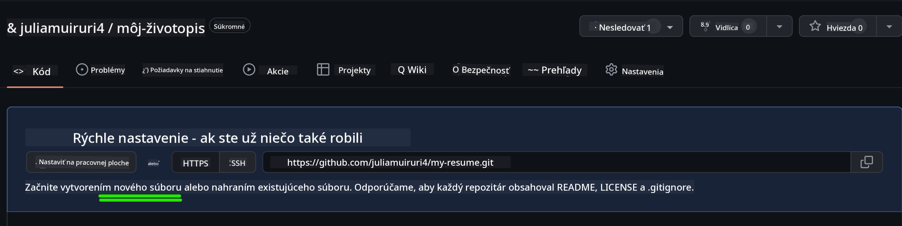
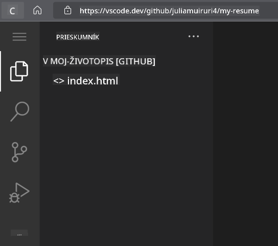
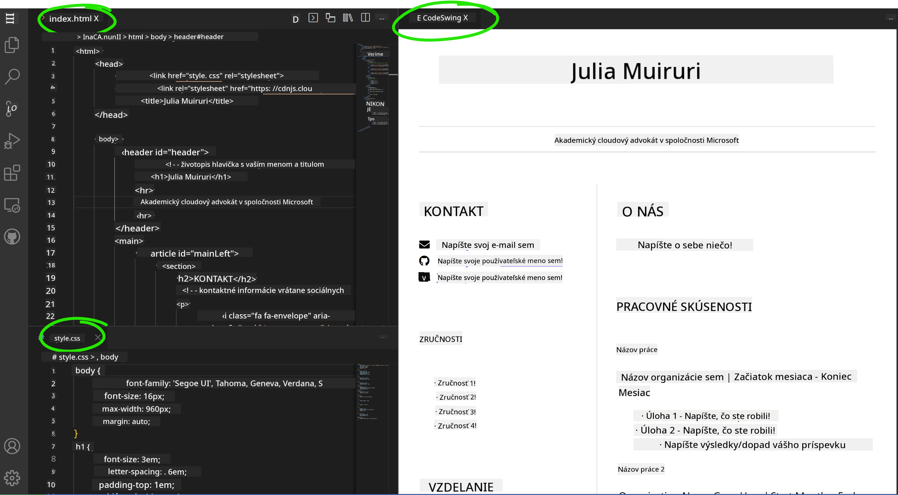

<!--
CO_OP_TRANSLATOR_METADATA:
{
  "original_hash": "2fcb983b8dbadadb1bc2e97f8c12dac5",
  "translation_date": "2025-08-27T22:53:50+00:00",
  "source_file": "8-code-editor/1-using-a-code-editor/assignment.md",
  "language_code": "sk"
}
-->
# Vytvorte webovú stránku životopisu pomocou vscode.dev

_Aké skvelé by bolo, keby si od vás personalista vypýtal životopis a vy by ste mu poslali URL?_ 😎

## Ciele

Po tejto úlohe sa naučíte:

- Vytvoriť webovú stránku na prezentáciu vášho životopisu

### Predpoklady

1. Účet na GitHube. Prejdite na [GitHub](https://github.com/) a vytvorte si účet, ak ho ešte nemáte.

## Kroky

**Krok 1:** Vytvorte nový GitHub repozitár a pomenujte ho `my-resume`

**Krok 2:** Vytvorte súbor `index.html` vo vašom repozitári. Pridáme aspoň jeden súbor priamo na github.com, pretože prázdny repozitár nie je možné otvoriť vo vscode.dev.

Kliknite na odkaz `creating a new file`, zadajte názov `index.html` a vyberte tlačidlo `Commit new file`.



**Krok 3:** Otvorte [VSCode.dev](https://vscode.dev) a vyberte tlačidlo `Open Remote Repository`.

Skopírujte URL adresu repozitára, ktorý ste práve vytvorili pre svoju stránku životopisu, a vložte ju do vstupného poľa:

_Nahraďte `your-username` svojím GitHub používateľským menom._

```
https://github.com/your-username/my-resume
```

✅ Ak bolo všetko úspešné, uvidíte svoj projekt a súbor index.html otvorený v textovom editore v prehliadači.



**Krok 4:** Otvorte súbor `index.html`, vložte do kódu nižšie obsah a uložte ho.

<details>
    <summary><b>HTML kód zodpovedný za obsah vašej webovej stránky životopisu.</b></summary>
    
        <html>

            <head>
                <link href="style.css" rel="stylesheet">
                <link rel="stylesheet" href="https://cdnjs.cloudflare.com/ajax/libs/font-awesome/5.15.4/css/all.min.css">
                <title>Vaše meno sem!</title>
            </head>
            <body>
                <header id="header">
                    <!-- hlavička životopisu s vaším menom a titulom -->
                    <h1>Vaše meno sem!</h1>
                    <hr>
                    Vaša rola!
                    <hr>
                </header>
                <main>
                    <article id="mainLeft">
                        <section>
                            <h2>KONTAKT</h2>
                            <!-- kontaktné informácie vrátane sociálnych sietí -->
                            <p>
                                <i class="fa fa-envelope" aria-hidden="true"></i>
                                <a href="mailto:username@domain.top-level domain">Napíšte sem svoj email</a>
                            </p>
                            <p>
                                <i class="fab fa-github" aria-hidden="true"></i>
                                <a href="github.com/yourGitHubUsername">Napíšte sem svoje používateľské meno!</a>
                            </p>
                            <p>
                                <i class="fab fa-linkedin" aria-hidden="true"></i>
                                <a href="linkedin.com/yourLinkedInUsername">Napíšte sem svoje používateľské meno!</a>
                            </p>
                        </section>
                        <section>
                            <h2>ZRUČNOSTI</h2>
                            <!-- vaše zručnosti -->
                            <ul>
                                <li>Zručnosť 1!</li>
                                <li>Zručnosť 2!</li>
                                <li>Zručnosť 3!</li>
                                <li>Zručnosť 4!</li>
                            </ul>
                        </section>
                        <section>
                            <h2>VZDELANIE</h2>
                            <!-- vaše vzdelanie -->
                            <h3>Napíšte sem svoj kurz!</h3>
                            <p>
                                Napíšte sem svoju inštitúciu!
                            </p>
                            <p>
                                Začiatok - Koniec
                            </p>
                        </section>            
                    </article>
                    <article id="mainRight">
                        <section>
                            <h2>O MNE</h2>
                            <!-- o vás -->
                            <p>Napíšte krátky text o sebe!</p>
                        </section>
                        <section>
                            <h2>PRACOVNÉ SKÚSENOSTI</h2>
                            <!-- vaše pracovné skúsenosti -->
                            <h3>Názov pozície</h3>
                            <p>
                                Názov organizácie sem | Mesiac začiatku – Mesiac konca
                            </p>
                            <ul>
                                    <li>Úloha 1 - Napíšte, čo ste robili!</li>
                                    <li>Úloha 2 - Napíšte, čo ste robili!</li>
                                    <li>Napíšte výsledky/dopad vášho príspevku</li>
                                    
                            </ul>
                            <h3>Názov pozície 2</h3>
                            <p>
                                Názov organizácie sem | Mesiac začiatku – Mesiac konca
                            </p>
                            <ul>
                                    <li>Úloha 1 - Napíšte, čo ste robili!</li>
                                    <li>Úloha 2 - Napíšte, čo ste robili!</li>
                                    <li>Napíšte výsledky/dopad vášho príspevku</li>
                                    
                            </ul>
                        </section>
                    </article>
                </main>
            </body>
        </html>
</details>

Nahraďte _zástupný text_ vo vyššie uvedenom HTML kóde detailmi vášho životopisu.

**Krok 5:** Prejdite na priečinok My-Resume, kliknite na ikonu `New File ...` a vytvorte 2 nové súbory vo vašom projekte: `style.css` a `codeswing.json`.

**Krok 6:** Otvorte súbor `style.css`, vložte do kódu nižšie obsah a uložte ho.

<details>
        <summary><b>CSS kód na formátovanie rozloženia stránky.</b></summary>
            
            body {
                font-family: 'Segoe UI', Tahoma, Geneva, Verdana, sans-serif;
                font-size: 16px;
                max-width: 960px;
                margin: auto;
            }
            h1 {
                font-size: 3em;
                letter-spacing: .6em;
                padding-top: 1em;
                padding-bottom: 1em;
            }

            h2 {
                font-size: 1.5em;
                padding-bottom: 1em;
            }

            h3 {
                font-size: 1em;
                padding-bottom: 1em;
            }
            main { 
                display: grid;
                grid-template-columns: 40% 60%;
                margin-top: 3em;
            }
            header {
                text-align: center;
                margin: auto 2em;
            }

            section {
                margin: auto 1em 4em 2em;
            }

            i {
                margin-right: .5em;
            }

            p {
                margin: .2em auto
            }

            hr {
                border: none;
                background-color: lightgray;
                height: 1px;
            }

            h1, h2, h3 {
                font-weight: 100;
                margin-bottom: 0;
            }
            #mainLeft {
                border-right: 1px solid lightgray;
            }
            
</details>

**Krok 6:** Otvorte súbor `codeswing.json`, vložte do kódu nižšie obsah a uložte ho.

    {
    "scripts": [],
    "styles": []
    }

**Krok 7:** Nainštalujte rozšírenie `Codeswing`, aby ste mohli vizualizovať webovú stránku životopisu v kódovacej oblasti.

Kliknite na ikonu _`Extensions`_ na paneli aktivít a zadajte Codeswing. Buď kliknite na _modré tlačidlo inštalovať_ na rozšírenom paneli aktivít, aby ste ho nainštalovali, alebo použite tlačidlo inštalovať, ktoré sa zobrazí v kódovacej oblasti po výbere rozšírenia na načítanie ďalších informácií. Ihneď po inštalácii rozšírenia si všimnite zmeny vo vašom projekte 😃.


Toto uvidíte na obrazovke po inštalácii rozšírenia.



Ak ste spokojní so zmenami, ktoré ste vykonali, prejdite na priečinok `Changes` a kliknite na tlačidlo `+`, aby ste zmeny pripravili.

Zadajte správu o commite _(Popis zmeny, ktorú ste vykonali v projekte)_ a potvrďte svoje zmeny kliknutím na `check`. Po dokončení práce na projekte vyberte ikonu hamburgerového menu v ľavom hornom rohu, aby ste sa vrátili do repozitára na GitHube.

Gratulujeme 🎉 Práve ste vytvorili svoju webovú stránku životopisu pomocou vscode.dev v niekoľkých krokoch.

## 🚀 Výzva

Otvorte vzdialený repozitár, ku ktorému máte povolenie vykonávať zmeny, a aktualizujte niektoré súbory. Následne skúste vytvoriť novú vetvu so svojimi zmenami a vytvorte Pull Request.

## Recenzia a samoštúdium

Prečítajte si viac o [VSCode.dev](https://code.visualstudio.com/docs/editor/vscode-web?WT.mc_id=academic-0000-alfredodeza) a niektorých jeho ďalších funkciách.

---

**Upozornenie**:  
Tento dokument bol preložený pomocou služby AI prekladu [Co-op Translator](https://github.com/Azure/co-op-translator). Hoci sa snažíme o presnosť, prosím, berte na vedomie, že automatizované preklady môžu obsahovať chyby alebo nepresnosti. Pôvodný dokument v jeho pôvodnom jazyku by mal byť považovaný za autoritatívny zdroj. Pre kritické informácie sa odporúča profesionálny ľudský preklad. Nie sme zodpovední za žiadne nedorozumenia alebo nesprávne interpretácie vyplývajúce z použitia tohto prekladu.