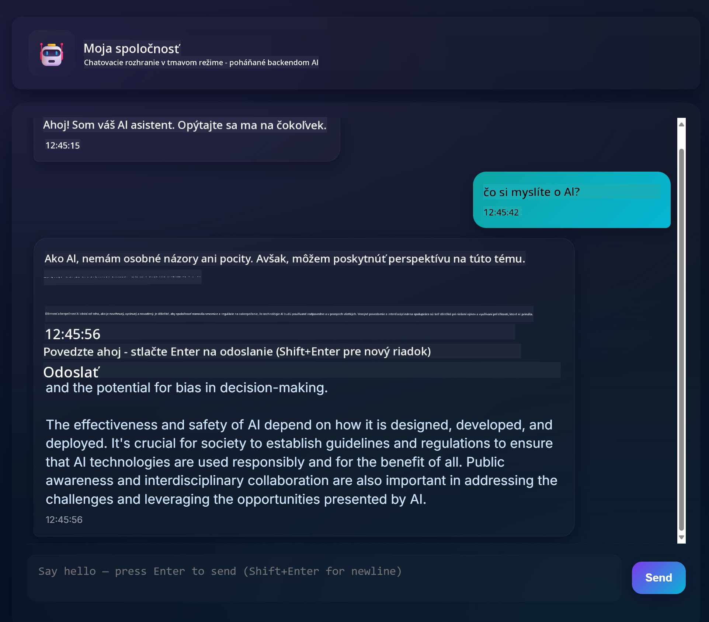
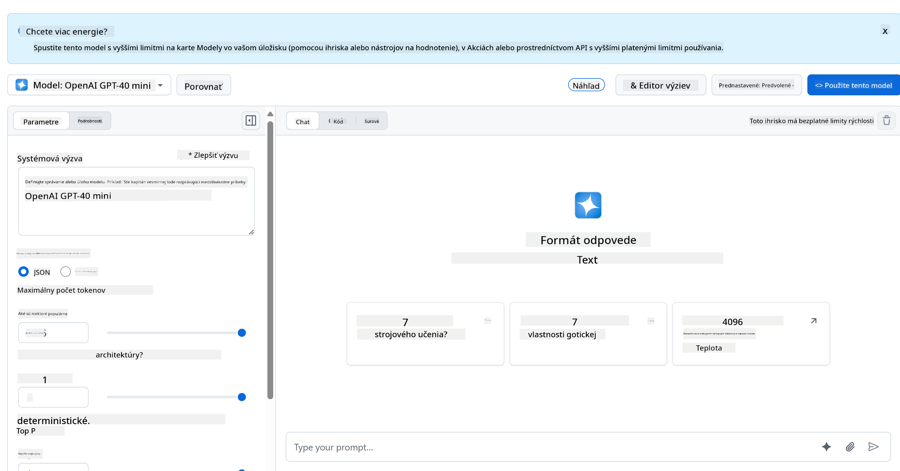
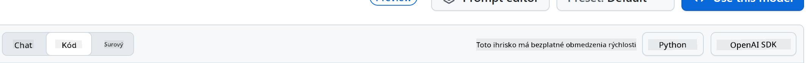
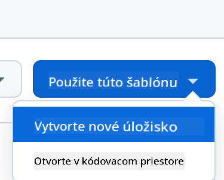
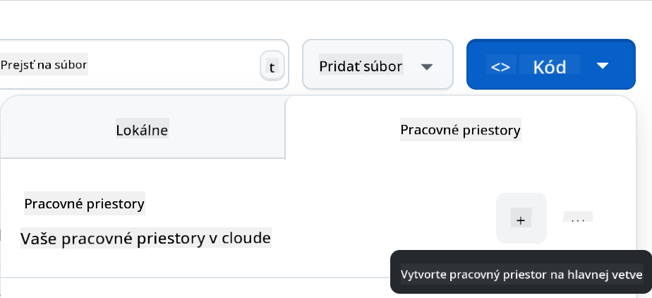

<!--
CO_OP_TRANSLATOR_METADATA:
{
  "original_hash": "11cf36165c243947b6cd85b88cf6faa6",
  "translation_date": "2025-09-01T17:01:13+00:00",
  "source_file": "9-chat-project/README.md",
  "language_code": "sk"
}
-->
# Chat projekt

Tento chat projekt ukazuje, ako vytvoriť Chat Asistenta pomocou GitHub Models.

Takto vyzerá hotový projekt:



Trochu kontextu: vytváranie chat asistentov pomocou generatívnej AI je skvelý spôsob, ako začať s učením o AI. V tejto lekcii sa naučíte, ako integrovať generatívnu AI do webovej aplikácie. Poďme na to.

## Pripojenie ku generatívnej AI

Na backend používame GitHub Models. Je to skvelá služba, ktorá vám umožňuje používať AI zadarmo. Prejdite na jej playground a získajte kód, ktorý zodpovedá vášmu zvolenému backendovému jazyku. Takto to vyzerá na [GitHub Models Playground](https://github.com/marketplace/models/azure-openai/gpt-4o-mini/playground)



Ako sme povedali, vyberte kartu "Code" a váš preferovaný runtime.



### Použitie Pythonu

V tomto prípade vyberáme Python, čo znamená, že použijeme tento kód:

```python
"""Run this model in Python

> pip install openai
"""
import os
from openai import OpenAI

# To authenticate with the model you will need to generate a personal access token (PAT) in your GitHub settings. 
# Create your PAT token by following instructions here: https://docs.github.com/en/authentication/keeping-your-account-and-data-secure/managing-your-personal-access-tokens
client = OpenAI(
    base_url="https://models.github.ai/inference",
    api_key=os.environ["GITHUB_TOKEN"],
)

response = client.chat.completions.create(
    messages=[
        {
            "role": "system",
            "content": "",
        },
        {
            "role": "user",
            "content": "What is the capital of France?",
        }
    ],
    model="openai/gpt-4o-mini",
    temperature=1,
    max_tokens=4096,
    top_p=1
)

print(response.choices[0].message.content)
```

Upravme tento kód tak, aby bol znovu použiteľný:

```python
def call_llm(prompt: str, system_message: str):
    response = client.chat.completions.create(
        messages=[
            {
                "role": "system",
                "content": system_message,
            },
            {
                "role": "user",
                "content": prompt,
            }
        ],
        model="openai/gpt-4o-mini",
        temperature=1,
        max_tokens=4096,
        top_p=1
    )

    return response.choices[0].message.content
```

S touto funkciou `call_llm` teraz môžeme zadať prompt a systémový prompt a funkcia nám vráti výsledok.

### Prispôsobenie AI asistenta

Ak chcete prispôsobiť AI asistenta, môžete špecifikovať, ako sa má správať, vyplnením systémového promptu takto:

```python
call_llm("Tell me about you", "You're Albert Einstein, you only know of things in the time you were alive")
```

## Zverejnenie cez Web API

Skvelé, AI časť máme hotovú, pozrime sa, ako ju môžeme integrovať do Web API. Pre Web API sme si vybrali Flask, ale akýkoľvek webový framework by mal byť vhodný. Pozrime sa na kód:

### Použitie Pythonu

```python
# api.py
from flask import Flask, request, jsonify
from llm import call_llm
from flask_cors import CORS

app = Flask(__name__)
CORS(app)   # *   example.com

@app.route("/", methods=["GET"])
def index():
    return "Welcome to this API. Call POST /hello with 'message': 'my message' as JSON payload"


@app.route("/hello", methods=["POST"])
def hello():
    # get message from request body  { "message": "do this taks for me" }
    data = request.get_json()
    message = data.get("message", "")

    response = call_llm(message, "You are a helpful assistant.")
    return jsonify({
        "response": response
    })

if __name__ == "__main__":
    app.run(host="0.0.0.0", port=5000)
```

Tu vytvárame Flask API a definujeme predvolenú trasu "/" a "/chat". Druhá je určená na použitie naším frontendom na odosielanie otázok.

Na integráciu *llm.py* potrebujeme urobiť nasledovné:

- Importovať funkciu `call_llm`:

   ```python
   from llm import call_llm
   from flask import Flask, request
   ```

- Zavolať ju z trasy "/chat":

   ```python
   @app.route("/hello", methods=["POST"])
   def hello():
      # get message from request body  { "message": "do this taks for me" }
      data = request.get_json()
      message = data.get("message", "")

      response = call_llm(message, "You are a helpful assistant.")
      return jsonify({
         "response": response
      })
   ```

   Tu analyzujeme prichádzajúcu požiadavku, aby sme získali vlastnosť `message` z JSON tela. Následne zavoláme LLM týmto spôsobom:

   ```python
   response = call_llm(message, "You are a helpful assistant")

   # return the response as JSON
   return jsonify({
      "response": response 
   })
   ```

Skvelé, teraz máme všetko, čo potrebujeme.

## Nastavenie Cors

Mali by sme spomenúť, že sme nastavili niečo ako CORS, teda zdieľanie zdrojov medzi rôznymi doménami. To znamená, že keďže náš backend a frontend budú bežať na rôznych portoch, musíme povoliť frontendu volať backend.

### Použitie Pythonu

V súbore *api.py* je kód, ktorý to nastavuje:

```python
from flask_cors import CORS

app = Flask(__name__)
CORS(app)   # *   example.com
```

Momentálne je nastavené povolenie pre všetky domény "*", čo je trochu nebezpečné. Mali by sme to obmedziť, keď prejdeme do produkcie.

## Spustenie projektu

Na spustenie projektu musíte najprv spustiť backend a potom frontend.

### Použitie Pythonu

Dobre, máme *llm.py* a *api.py*, ako to môžeme rozbehnúť s backendom? Potrebujeme urobiť dve veci:

- Nainštalovať závislosti:

   ```sh
   cd backend
   python -m venv venv
   source ./venv/bin/activate

   pip install openai flask flask-cors openai
   ```

- Spustiť API

   ```sh
   python api.py
   ```

   Ak ste v Codespaces, musíte prejsť na Ports v dolnej časti editora, kliknúť pravým tlačidlom a vybrať "Port Visibility" a zvoliť "Public".

### Práca na frontende

Teraz, keď máme API spustené, vytvorme frontend. Začneme s minimálnym frontendom, ktorý budeme postupne vylepšovať. V priečinku *frontend* vytvorte nasledujúce:

```text
backend/
frontend/
index.html
app.js
styles.css
```

Začnime s **index.html**:

```html
<html>
    <head>
        <link rel="stylesheet" href="styles.css">
    </head>
    <body>
      <form>
        <textarea id="messages"></textarea>
        <input id="input" type="text" />
        <button type="submit" id="sendBtn">Send</button>  
      </form>  
      <script src="app.js" />
    </body>
</html>    
```

Toto je absolútne minimum potrebné na podporu chatovacieho okna. Obsahuje textové pole, kde sa budú zobrazovať správy, vstupné pole na písanie správ a tlačidlo na odoslanie správy na backend. Pozrime sa teraz na JavaScript v *app.js*.

**app.js**

```js
// app.js

(function(){
  // 1. set up elements  
  const messages = document.getElementById("messages");
  const form = document.getElementById("form");
  const input = document.getElementById("input");

  const BASE_URL = "change this";
  const API_ENDPOINT = `${BASE_URL}/hello`;

  // 2. create a function that talks to our backend
  async function callApi(text) {
    const response = await fetch(API_ENDPOINT, {
      method: "POST",
      headers: { "Content-Type": "application/json" },
      body: JSON.stringify({ message: text })
    });
    let json = await response.json();
    return json.response;
  }

  // 3. add response to our textarea
  function appendMessage(text, role) {
    const el = document.createElement("div");
    el.className = `message ${role}`;
    el.innerHTML = text;
    messages.appendChild(el);
  }

  // 4. listen to submit events
  form.addEventListener("submit", async(e) => {
    e.preventDefault();
   // someone clicked the button in the form
   
   // get input
   const text = input.value.trim();

   appendMessage(text, "user")

   // reset it
   input.value = '';

   const reply = await callApi(text);

   // add to messages
   appendMessage(reply, "assistant");

  })
})();
```

Prejdime si kód po sekciách:

- 1) Tu získavame referencie na všetky prvky, ktoré budeme neskôr v kóde používať.
- 2) V tejto sekcii vytvárame funkciu, ktorá používa vstavanú metódu `fetch` na volanie nášho backendu.
- 3) `appendMessage` pomáha pridávať odpovede aj správy, ktoré píšete ako používateľ.
- 4) Tu počúvame na udalosť submit, čítame vstupné pole, umiestňujeme správu používateľa do textového poľa, voláme API a zobrazujeme odpoveď v textovom poli.

Pozrime sa na štýlovanie, tu môžete byť kreatívni a prispôsobiť si vzhľad podľa seba, ale tu sú niektoré návrhy:

**styles.css**

```
.message {
    background: #222;
    box-shadow: 0 0 0 10px orange;
    padding: 10px:
    margin: 5px;
}

.message.user {
    background: blue;
}

.message.assistant {
    background: grey;
} 
```

S týmito tromi triedami budete štýlovať správy rôzne podľa toho, či pochádzajú od asistenta alebo od používateľa. Ak chcete inšpiráciu, pozrite sa do priečinka `solution/frontend/styles.css`.

### Zmena základnej URL

Jedna vec, ktorú sme tu nenastavili, bola `BASE_URL`. Táto hodnota nie je známa, kým backend nie je spustený. Na jej nastavenie:

- Ak spúšťate API lokálne, mala by byť nastavená na niečo ako `http://localhost:5000`.
- Ak spúšťate v Codespaces, mala by vyzerať ako "[name]app.github.dev".

## Zadanie

Vytvorte si vlastný priečinok *project* s obsahom, ako je uvedené vyššie:

```text
project/
  frontend/
    index.html
    app.js
    styles.css
  backend/
    ...
```

Skopírujte obsah podľa inštrukcií vyššie, ale pokojne si ho prispôsobte podľa seba.

## Riešenie

[Riešenie](./solution/README.md)

## Bonus

Skúste zmeniť osobnosť AI asistenta.

### Pre Python

Keď voláte `call_llm` v *api.py*, môžete zmeniť druhý argument na to, čo chcete, napríklad:

```python
call_llm(message, "You are Captain Picard")
```

### Frontend

Zmeňte tiež CSS a text podľa seba, teda upravte *index.html* a *styles.css*.

## Zhrnutie

Skvelé, naučili ste sa od základov, ako vytvoriť osobného asistenta pomocou AI. Urobili sme to pomocou GitHub Models, backendu v Pythone a frontendu v HTML, CSS a JavaScripte.

## Nastavenie s Codespaces

- Prejdite na: [Web Dev For Beginners repo](https://github.com/microsoft/Web-Dev-For-Beginners)
- Vytvorte z template (uistite sa, že ste prihlásený do GitHubu) v pravom hornom rohu:

    

- Keď ste vo svojom repozitári, vytvorte Codespace:

    

    Toto by malo spustiť prostredie, s ktorým môžete teraz pracovať.

---

**Upozornenie**:  
Tento dokument bol preložený pomocou služby AI prekladu [Co-op Translator](https://github.com/Azure/co-op-translator). Hoci sa snažíme o presnosť, prosím, berte na vedomie, že automatizované preklady môžu obsahovať chyby alebo nepresnosti. Pôvodný dokument v jeho rodnom jazyku by mal byť považovaný za autoritatívny zdroj. Pre kritické informácie sa odporúča profesionálny ľudský preklad. Nie sme zodpovední za žiadne nedorozumenia alebo nesprávne interpretácie vyplývajúce z použitia tohto prekladu.