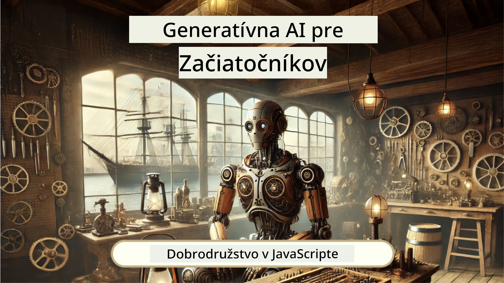
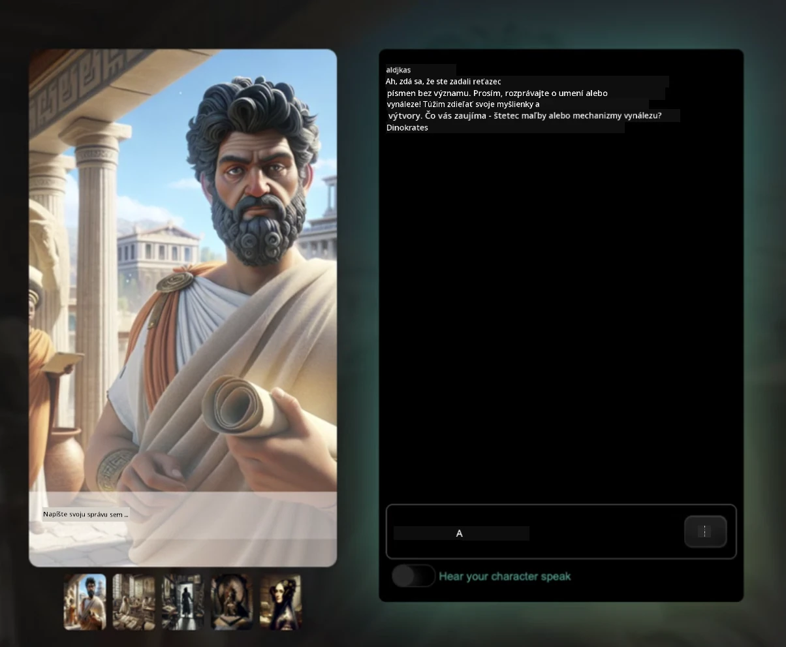
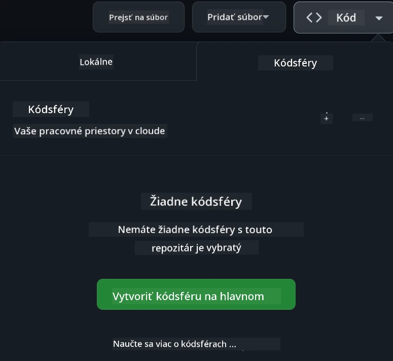

<!--
CO_OP_TRANSLATOR_METADATA:
{
  "original_hash": "fea3a0fceb8ad86fd640c09cf63a2aac",
  "translation_date": "2026-01-07T04:18:16+00:00",
  "source_file": "README.md",
  "language_code": "sk"
}
-->
[](https://github.com/microsoft/Web-Dev-For-Beginners/blob/master/LICENSE)
[](https://GitHub.com/microsoft/Web-Dev-For-Beginners/graphs/contributors/)
[](https://GitHub.com/microsoft/Web-Dev-For-Beginners/issues/)
[](https://GitHub.com/microsoft/Web-Dev-For-Beginners/pulls/)
[](http://makeapullrequest.com)

[](https://GitHub.com/microsoft/Web-Dev-For-Beginners/watchers/)
[](https://GitHub.com/microsoft/Web-Dev-For-Beginners/network/)
[](https://GitHub.com/microsoft/Web-Dev-For-Beginners/stargazers/)

[](https://discord.gg/nTYy5BXMWG)

# Webový vývoj pre začiatočníkov - učebný plán

Naučte sa základy webového vývoja s naším 12-týždňovým komplexným kurzom od Microsoft Cloud Advocates. Každá z 24 lekcií ponorí do JavaScriptu, CSS a HTML cez praktické projekty ako teráriá, rozšírenia prehliadača a vesmírne hry. Zapojte sa do kvízov, diskusií a praktických úloh. Zdokonaľte svoje zručnosti a optimalizujte si uchovávanie vedomostí s našou efektívnou projektovo riadenou pedagogikou. Začnite svoju programátorskú cestu ešte dnes!

Pridajte sa k komunite Azure AI Foundry na Discorde

[](https://discord.gg/nTYy5BXMWG)

Postupujte podľa týchto krokov, aby ste mohli začať využívať tieto zdroje:
1. **Forknite si repozitár**: Kliknite [](https://GitHub.com/microsoft/Web-Dev-For-Beginners/fork)
2. **Naklonujte si repozitár**:   `git clone https://github.com/microsoft/Web-Dev-For-Beginners.git`
3. [**Pridajte sa k Azure AI Foundry Discord a stretnite expertov a ďalších vývojárov**](https://discord.com/invite/ByRwuEEgH4)

### 🌐 Podpora viacerých jazykov

#### Podporované cez GitHub Action (automatické a vždy aktuálne)

<!-- CO-OP TRANSLATOR LANGUAGES TABLE START -->
[Arabčina](../ar/README.md) | [Bengálčina](../bn/README.md) | [Bulharčina](../bg/README.md) | [Barmský (Myanmar)](../my/README.md) | [Čínština (zjednodušená)](../zh/README.md) | [Čínština (tradičná, Hongkong)](../hk/README.md) | [Čínština (tradičná, Macao)](../mo/README.md) | [Čínština (tradičná, Taiwan)](../tw/README.md) | [Chorvátčina](../hr/README.md) | [Čeština](../cs/README.md) | [Dánčina](../da/README.md) | [Holandčina](../nl/README.md) | [Estónčina](../et/README.md) | [Fínčina](../fi/README.md) | [Francúzština](../fr/README.md) | [Nemčina](../de/README.md) | [Gréčtina](../el/README.md) | [Hebrejčina](../he/README.md) | [Hindčina](../hi/README.md) | [Maďarčina](../hu/README.md) | [Indonézčina](../id/README.md) | [Taliančina](../it/README.md) | [Japončina](../ja/README.md) | [Kannadčina](../kn/README.md) | [Kórejčina](../ko/README.md) | [Litovčina](../lt/README.md) | [Malayčina](../ms/README.md) | [Malajálam](../ml/README.md) | [Maratí](../mr/README.md) | [Nepálčina](../ne/README.md) | [Nigérijský pidžin](../pcm/README.md) | [Norwegian](../no/README.md) | [Perzština (Farsi)](../fa/README.md) | [Poľština](../pl/README.md) | [Portugalčina (Brazília)](../br/README.md) | [Portugalčina (Portugalsko)](../pt/README.md) | [Pandžábčina (Gurmukhi)](../pa/README.md) | [Rumunčina](../ro/README.md) | [Ruština](../ru/README.md) | [Srbčina (cyrilika)](../sr/README.md) | [Slovenčina](./README.md) | [Slovinčina](../sl/README.md) | [Španielčina](../es/README.md) | [Swahili](../sw/README.md) | [Švédčina](../sv/README.md) | [Tagalog (Filipíny)](../tl/README.md) | [Tamilčina](../ta/README.md) | [Telugčina](../te/README.md) | [Thajčina](../th/README.md) | [Turečtina](../tr/README.md) | [Ukrajinčina](../uk/README.md) | [Urdčina](../ur/README.md) | [Vietnamčina](../vi/README.md)

> **Radšej by ste klonovali lokálne?**

> Tento repozitár obsahuje viac ako 50 jazykových prekladov, čo výrazne zväčšuje veľkosť stiahnutia. Ak chcete klonovať bez prekladov, použite sparse checkout:
> ```bash
> git clone --filter=blob:none --sparse https://github.com/microsoft/Web-Dev-For-Beginners.git
> cd Web-Dev-For-Beginners
> git sparse-checkout set --no-cone '/*' '!translations' '!translated_images'
> ```
> Toto vám poskytne všetko potrebné na dokončenie kurzu s oveľa rýchlejším sťahovaním.
<!-- CO-OP TRANSLATOR LANGUAGES TABLE END -->

**Ak chcete podporu ďalších prekladových jazykov, sú uvedené [tu](https://github.com/Azure/co-op-translator/blob/main/getting_started/supported-languages.md)**

[](https://open.vscode.dev/microsoft/Web-Dev-For-Beginners)

#### 🧑‍🎓 _Ste študent?_

Navštívte [**Student Hub stránku**](https://docs.microsoft.com/learn/student-hub/?WT.mc_id=academic-77807-sagibbon), kde nájdete začiatočnícke zdroje, študentské balíčky a aj možnosti, ako získať bezplatný certifikátový poukaz. Toto je stránka, ktorú si určite uložte medzi záložky a občas ju skontrolujte, pretože obsah sa mení každý mesiac.

### 📣 Oznámenie - Nové výzvy režimu GitHub Copilot Agent na dokončenie!

Pridaná nová výzva, hľadajte "GitHub Copilot Agent Challenge 🚀" v väčšine kapitol. Ide o novú výzvu, ktorú dokončíte použitím GitHub Copilot a režimu Agent. Ak ste režim Agent ešte nepoužili, je schopný nielen generovať text, ale tiež vytvárať a upravovať súbory, spúšťať príkazy a viac.

### 📣 Oznámenie - _Nový projekt na vybudovanie s použitím Generatívnej AI_

Práve pridaný nový AI asistent projekt, pozrite si [projekt](./9-chat-project/README.md)

### 📣 Oznámenie - _Nový učebný plán_ o Generatívnej AI pre JavaScript práve vydaný

Nezmeškajte náš nový učebný plán Generatívnej AI!

Začnite na [https://aka.ms/genai-js-course](https://aka.ms/genai-js-course)!



- Lekcie pokrývajú všetko od základov po RAG.
- Interakcia s historickými postavami pomocou GenAI a našej sprievodnej aplikácie.
- Zábavný a pútavý príbeh, budete cestovať časom!



Každá lekcia obsahuje úlohu na dokončenie, kontrolu vedomostí aj výzvu, ktoré vás prevedú učením tém ako:
- Promptovanie a inžinierstvo promptov
- Generovanie textových a obrazových aplikácií
- Vyhľadávacie aplikácie

Navštívte [https://aka.ms/genai-js-course](https://aka.ms/genai-js-course) a začnite!


## 🌱 Začíname

> **Učitelia**, pripravili sme [niekoľko návrhov](for-teachers.md), ako tento učebný plán používať. Radi by sme mali vašu spätnú väzbu [na našom diskusnom fóre](https://github.com/microsoft/Web-Dev-For-Beginners/discussions/categories/teacher-corner)!

**[Študenti](https://aka.ms/student-page/?WT.mc_id=academic-77807-sagibbon)**, pre každú lekciu začnite kvízom pred prednáškou, pokračujte čítaním prednáškového materiálu, plnením rôznych aktivít a overte si svoje pochopenie kvízom po prednáške.

Aby ste si zlepšili vzdelávací zážitok, spojte sa s rovesníkmi a pracujte spolu na projektoch! Diskusie sú vítané na našom [diskusnom fóre](https://github.com/microsoft/Web-Dev-For-Beginners/discussions), kde je tím moderátorov pripravený vám pomôcť zodpovedať otázky.

Na ďalšie vzdelávanie vám vrelo odporúčame preskúmať [Microsoft Learn](https://learn.microsoft.com/users/wirelesslife/collections/p1ddcy5jwy0jkm?WT.mc_id=academic-77807-sagibbon) pre doplnkové študijné materiály.

### 📋 Nastavenie vášho vývojového prostredia

Tento učebný plán má pripravené vývojové prostredie! Môžete si vybrať, či kurz spustíte v [Codespace](https://github.com/features/codespaces/) (_prostredie bežiace v prehliadači bez nutnosti inštalácií_) alebo lokálne na vašom počítači pomocou textového editora ako je [Visual Studio Code](https://code.visualstudio.com/?WT.mc_id=academic-77807-sagibbon).

#### Vytvorte si vlastný repozitár
Pre jednoduché uloženie svojej práce sa odporúča vytvoriť si vlastnú kópiu tohto repozitára. Urobíte to kliknutím na tlačidlo **Použiť šablónu** v hornej časti stránky. Tým sa vytvorí nový repozitár vo vašom účte GitHub s kópiou tohto učebného plánu.

Postupujte podľa krokov:
1. **Forknite repozitár**: Kliknite na tlačidlo "Fork" v pravom hornom rohu tejto stránky.
2. **Naklonujte repozitár**:   `git clone https://github.com/microsoft/Web-Dev-For-Beginners.git`

#### Spustenie učebného plánu v Codespace

Vo vašej skopírovanej verzii repozitára kliknite na tlačidlo **Code** a vyberte **Open with Codespaces**. Toto vytvorí nový Codespace, kde budete pracovať.



#### Spustenie učebného plánu lokálne na počítači

Na spustenie tohto učebného plánu lokálne na vašom počítači budete potrebovať textový editor, prehliadač a príkazový riadok. Naša prvá lekcia, [Úvod do programovacích jazykov a nástrojov](../../1-getting-started-lessons/1-intro-to-programming-languages), vás prevedie rôznymi možnosťami pre každý z týchto nástrojov, aby ste si mohli vybrať ten, ktorý vám najviac vyhovuje.

Odporúčame použiť [Visual Studio Code](https://code.visualstudio.com/?WT.mc_id=academic-77807-sagibbon) ako editor, ktorý má tiež zabudovaný [Terminál](https://code.visualstudio.com/docs/terminal/basics/?WT.mc_id=academic-77807-sagibbon). Visual Studio Code si môžete stiahnuť [tu](https://code.visualstudio.com/?WT.mc_id=academic-77807-sagibbon).

1. Naklonujte si svoj repozitár do počítača. Urobíte to kliknutím na tlačidlo **Code** a skopírovaním URL:

    [CodeSpace](./images/createcodespace.png)
Potom otvorte [Terminál](https://code.visualstudio.com/docs/terminal/basics/?WT.mc_id=academic-77807-sagibbon) vo [Visual Studio Code](https://code.visualstudio.com/?WT.mc_id=academic-77807-sagibbon) a spustite nasledujúci príkaz, pričom `<your-repository-url>` nahraďte URL adresou, ktorú ste práve skopírovali:

    ```bash 
    git clone <your-repository-url>
    ```

2. Otvorte priečinok vo Visual Studio Code. Môžete to urobiť kliknutím na **Súbor** > **Otvoriť priečinok** a výberom priečinka, ktorý ste práve sklonovali.

>  Odporúčané rozšírenia Visual Studio Code:
>
> * [Live Server](https://marketplace.visualstudio.com/items?itemName=ritwickdey.LiveServer&WT.mc_id=academic-77807-sagibbon) - na náhľad HTML stránok priamo vo Visual Studio Code
> * [Copilot](https://marketplace.visualstudio.com/items?itemName=GitHub.copilot&WT.mc_id=academic-77807-sagibbon) - na pomoc pri rýchlejšom písaní kódu

## 📂 Každá lekcia obsahuje:

- voliteľnú náčrtnú poznámku
- voliteľné doplnkové video
- kvíz na rozohriatie pred lekciou
- písanú lekciu
- pri lekciách založených na projektoch, podrobné návody ako projekt zostaviť
- kontrolné otázky
- výzvu
- doplnkové čítanie
- úlohu
- [kvíz po lekcii](https://ff-quizzes.netlify.app/web/)

> **Poznámka o kvízoch**: Všetky kvízy sú obsiahnuté v priečinku Quiz-app, celkovo 48 kvízov po troch otázkach. Sú dostupné [tu](https://ff-quizzes.netlify.app/web/), aplikáciu kvízu možno spustiť lokálne alebo nasadiť na Azure; postupujte podľa inštrukcií v priečinku `quiz-app`.

## 🗃️ Lekcie

|     |                       Názov projektu                       |                            Preberané koncepty                             | Ciele učenia                                                                                                                 |                                                         Prepojená lekcia                                                          |         Autor          |
| :-: | :--------------------------------------------------------: | :-----------------------------------------------------------------------: | ---------------------------------------------------------------------------------------------------------------------------- | :--------------------------------------------------------------------------------------------------------------------------------: | :---------------------: |
| 01  |                     Začíname                              |           Úvod do programovania a pracovné nástroje                       | Naučiť sa základné princípy väčšiny programovacích jazykov a softvéru, ktorý profesionálnym vývojárom pomáha v práci         | [Úvod do programovacích jazykov a pracovných nástrojov](./1-getting-started-lessons/1-intro-to-programming-languages/README.md) |         Jasmine         |
| 02  |                     Začíname                              |             Základy GitHubu vrátane práce v tíme                         | Ako používať GitHub vo vašom projekte, ako spolupracovať s inými na kóde                                                      |                            [Úvod do GitHubu](./1-getting-started-lessons/2-github-basics/README.md)                             |          Floor          |
| 03  |                     Začíname                              |                             Prístupnosť                                  | Naučiť sa základy webovej prístupnosti                                                                                        |                       [Základy prístupnosti](./1-getting-started-lessons/3-accessibility/README.md)                       |       Christopher       |
| 04  |                        Základy JS                         |                         Dátové typy JavaScriptu                          | Základy dátových typov v JavaScripte                                                                                          |                                       [Dátové typy](./2-js-basics/1-data-types/README.md)                                        |         Jasmine         |
| 05  |                        Základy JS                         |                         Funkcie a metódy                                | Naučiť sa o funkciách a metódach na riadenie logiky aplikácie                                                                |                              [Funkcie a metódy](./2-js-basics/2-functions-methods/README.md)                               | Jasmine a Christopher   |
| 06  |                        Základy JS                         |                        Rozhodovanie pomocou JS                           | Naučiť sa vytvárať podmienky v kóde pomocou rozhodovacích metód                                                               |                                 [Rozhodovanie](./2-js-basics/3-making-decisions/README.md)                                  |         Jasmine         |
| 07  |                        Základy JS                         |                            Polia a cykly                                | Pracovať s dátami pomocou polí a cyklov v JavaScripte                                                                         |                                   [Polia a cykly](./2-js-basics/4-arrays-loops/README.md)                                    |         Jasmine         |
| 08  |       [Terrárium](./3-terrarium/solution/README.md)       |                            HTML v praxi                                | Vytvoriť HTML pre online terrárium so zameraním na zostavenie rozloženia                                                     |                                 [Úvod do HTML](./3-terrarium/1-intro-to-html/README.md)                                 |           Jen           |
| 09  |       [Terrárium](./3-terrarium/solution/README.md)       |                            CSS v praxi                                 | Vytvoriť CSS na úpravu štýlu online terrária, so zameraním na základy CSS vrátane responzivity stránky                        |                                  [Úvod do CSS](./3-terrarium/2-intro-to-css/README.md)                                  |           Jen           |
| 10  |            [Terrárium](./3-terrarium/solution/README.md)            |                 JavaScript Closures, manipulácia s DOM                 | Vytvoriť JavaScript pre funkčnosť drag/drop terrária, so zameraním na uzávierky a prácu s DOM                                 |                  [JavaScript Closures, manipulácia s DOM](./3-terrarium/3-intro-to-DOM-and-closures/README.md)                   |           Jen           |
| 11  |          [Hra na písanie](./4-typing-game/solution/README.md)          |                          Vytvorenie hry na písanie                      | Naučiť sa používať klávesové udalosti na ovládanie logiky JavaScript aplikácie                                               |                                [Programovanie riadené udalosťami](./4-typing-game/typing-game/README.md)                                |       Christopher       |
| 12  | [Zelené rozšírenie pre prehliadač](./5-browser-extension/solution/README.md) |                         Práca s prehliadačmi                           | Naučiť sa, ako prehliadače fungujú, ich históriu a ako vytvoriť základné prvky rozšírenia prehliadača                        |                               [O prehliadačoch](./5-browser-extension/1-about-browsers/README.md)                                |           Jen           |
| 13  | [Zelené rozšírenie pre prehliadač](./5-browser-extension/solution/README.md) | Vytváranie formuláru, volanie API a ukladanie premenných do miestneho uloženia | Vytvoriť JavaScript prvky pre rozšírenie prehliadača na volanie API pomocou premenných uložených v miestnom úložisku |                [API, formuláre a miestne úložisko](./5-browser-extension/2-forms-browsers-local-storage/README.md)                 |           Jen           |
| 14  | [Zelené rozšírenie pre prehliadač](./5-browser-extension/solution/README.md) |          Pozadie procesov v prehliadači, webový výkon                  | Použiť pozadie procesov pre správu ikony rozšírenia; naučiť sa o webovom výkone a optimalizáciách                             |             [Pozadie procesov a výkon](./5-browser-extension/3-background-tasks-and-performance/README.md)              |           Jen           |
| 15  |           [Vesmírna hra](./6-space-game/solution/README.md)           |             Pokročilejšie tvorenie hier v JavaScriptu                  | Naučiť sa o dedičnosti pomocou tried a kompozície a vzorec Pub/Sub, príprava na tvorbu hry                                  |                      [Úvod do pokročilého vývoja hier](./6-space-game/1-introduction/README.md)                       |          Chris          |
| 16  |           [Vesmírna hra](./6-space-game/solution/README.md)           |                           Kreslenie na plátno                           | Naučiť sa o Canvas API používanom na kreslenie prvkov na obrazovku                                                          |                                [Kreslenie na plátno](./6-space-game/2-drawing-to-canvas/README.md)                                |          Chris          |
| 17  |           [Vesmírna hra](./6-space-game/solution/README.md)           |                   Pohyb prvkov na obrazovke                            | Objaviť, ako prvky získavajú pohyb pomocou karteziánskych súradníc a Canvas API                                              |                           [Pohyb prvkov](./6-space-game/3-moving-elements-around/README.md)                           |          Chris          |
| 18  |           [Vesmírna hra](./6-space-game/solution/README.md)           |                          Detekcia kolízií                             | Zabezpečiť kolízie a reakcie prvkov na seba navzájom použitím klávesových stlačení a funkciou cooldown                        |                              [Detekcia kolízií](./6-space-game/4-collision-detection/README.md)                              |          Chris          |
| 19  |           [Vesmírna hra](./6-space-game/solution/README.md)           |                             Sledovanie skóre                          | Vykonávať matematické výpočty na základe stavu a výkonu hry                                                                |                                    [Sledovanie skóre](./6-space-game/5-keeping-score/README.md)                                    |          Chris          |
| 20  |           [Vesmírna hra](./6-space-game/solution/README.md)           |                     Ukončenie a reštart hry                           | Naučiť sa ukončiť a reštartovať hru vrátane čistenia zdrojov a resetovania premenných                                        |                                [Podmienka ukončenia](./6-space-game/6-end-condition/README.md)                                 |          Chris          |
| 21  |         [Banková aplikácia](./7-bank-project/solution/README.md)          |                 HTML Šablóny a smerovanie v webovej aplikácii          | Naučiť sa vytvárať architektúru viacstránkovej webovej stránky pomocou smerovania a HTML šablón                             |                            [HTML šablóny a smerovanie](./7-bank-project/1-template-route/README.md)                             |          Yohan          |
| 22  |         [Banková aplikácia](./7-bank-project/solution/README.md)          |                  Vytvorenie prihlasovacieho a registračného formulára | Naučiť sa tvoriť formuláre a spracovávať validačné postupy                                                                  |                                           [Formuláre](./7-bank-project/2-forms/README.md)                                           |          Yohan          |
| 23  |         [Banková aplikácia](./7-bank-project/solution/README.md)          |                   Spôsoby získavania a používania dát                  | Ako dáta prichádzajú do aplikácie a odchádzajú z nej, ako ich načítať, ukladať a odstraňovať                                  |                                            [Dáta](./7-bank-project/3-data/README.md)                                            |          Yohan          |
| 24  |         [Banková aplikácia](./7-bank-project/solution/README.md)          |                      Koncepty správy stavu                            | Naučiť sa, ako aplikácia uchováva stav a ako ho programovo riadiť                                                           |                                [Správa stavu](./7-bank-project/4-state-management/README.md)                                |          Yohan          |
| 25 | [Editor kódu/VSCode](../../8-code-editor) | Práca s VSCode | Naučiť sa používať editor kódu | [Použitie VSCode editora kódu](./8-code-editor/1-using-a-code-editor/README.md) | Chris |
| 26 | [AI asistenti](./9-chat-project/README.md) | Práca s AI | Naučiť sa vytvoriť vlastného AI asistenta | [Projekt AI asistenta](./9-chat-project/README.md) | Chris |

## 🏫 Pedagógia

Náš učebný plán je navrhnutý s dvoma kľúčovými pedagogickými princípmi na pamäti:
* učenie založené na projektoch
* časté kvízy

Program učí základy JavaScriptu, HTML a CSS, ako aj najnovšie nástroje a techniky, ktoré dnes používajú weboví vývojári. Študenti budú mať príležitosť získať praktické skúsenosti vytvorením hry na písanie, virtuálneho terrária, ekologického rozšírenia pre prehliadač, hry v štýle space invader a bankovej aplikácie pre podniky. Na konci série získajú pevné základy webového vývoja.

> 🎓 Prvé lekcie tohto kurikula môžete absolvovať ako [Learn Path](https://docs.microsoft.com/learn/paths/web-development-101/?WT.mc_id=academic-77807-sagibbon) na Microsoft Learn!

Zabezpečením zhody obsahu s projektmi sa proces pre študentov stáva zaujímavejším a dochádza k lepšiemu zapamätaniu konceptov. Tiež sme vytvorili niekoľko úvodných lekcií o základoch JavaScriptu s videom zo série "[Začiatočnícka séria: JavaScript](https://channel9.msdn.com/Series/Beginners-Series-to-JavaScript/?WT.mc_id=academic-77807-sagibbon)", ktorej niektorí autori prispeli k tomuto učebnému plánu.

Navyše kvíz s nízkou záťažou pred hodinou nastavuje študentovi cieľ sa naučiť danú tému, zatiaľ čo druhý kvíz po hodine zaručuje ďalšie upevnenie vedomostí. Tento učebný plán je navrhnutý tak, aby bol flexibilný a zábavný, a je možné ho absolvovať celý alebo len jeho časť. Projekty začínajú jednoducho a do konca 12-týždňového cyklu sa postupne komplikujú.

Hoci sme zámerne vynechali predstavenie JavaScript frameworkov, aby sme sa sústredili na základné schopnosti potrebné pre webového vývojára pred osvojením frameworku, dobrou ďalšou fázou po tomto kurikule je naučiť sa Node.js cez ďalšiu kolekciu videí: "[Začiatočnícka séria: Node.js](https://channel9.msdn.com/Series/Beginners-Series-to-Nodejs/?WT.mc_id=academic-77807-sagibbon)".

> Navštívte naše [Zásady správania](CODE_OF_CONDUCT.md) a [Príspevky](CONTRIBUTING.md). Vaša konštruktívna spätná väzba je vítaná!


## 🧭 Prístup offline

Túto dokumentáciu môžete používať offline pomocou [Docsify](https://docsify.js.org/#/). Vforkujte toto repo, [nainštalujte Docsify](https://docsify.js.org/#/quickstart) na svoj lokálny počítač a potom v koreňovom priečinku tohto repozitára zadajte príkaz `docsify serve`. Webová stránka bude dostupná na porte 3000 na vašom localhoste: `localhost:3000`.

## 📘 PDF

PDF všetkých lekcií nájdete [tu](https://microsoft.github.io/Web-Dev-For-Beginners/pdf/readme.pdf).


## 🎒 Iné kurzy
Náš tím vytvára aj ďalšie kurzy! Pozrite sa na:

<!-- CO-OP TRANSLATOR OTHER COURSES START -->
### LangChain
[](https://aka.ms/langchain4j-for-beginners)
[](https://aka.ms/langchainjs-for-beginners?WT.mc_id=m365-94501-dwahlin)

---

### Azure / Edge / MCP / Agents
[](https://github.com/microsoft/AZD-for-beginners?WT.mc_id=academic-105485-koreyst)
[](https://github.com/microsoft/edgeai-for-beginners?WT.mc_id=academic-105485-koreyst)
[](https://github.com/microsoft/mcp-for-beginners?WT.mc_id=academic-105485-koreyst)
[](https://github.com/microsoft/ai-agents-for-beginners?WT.mc_id=academic-105485-koreyst)

---
 
### Generative AI Series
[](https://github.com/microsoft/generative-ai-for-beginners?WT.mc_id=academic-105485-koreyst)
[-9333EA?style=for-the-badge&labelColor=E5E7EB&color=9333EA)](https://github.com/microsoft/Generative-AI-for-beginners-dotnet?WT.mc_id=academic-105485-koreyst)
[-C084FC?style=for-the-badge&labelColor=E5E7EB&color=C084FC)](https://github.com/microsoft/generative-ai-for-beginners-java?WT.mc_id=academic-105485-koreyst)
[-E879F9?style=for-the-badge&labelColor=E5E7EB&color=E879F9)](https://github.com/microsoft/generative-ai-with-javascript?WT.mc_id=academic-105485-koreyst)

---
 
### Core Learning
[](https://aka.ms/ml-beginners?WT.mc_id=academic-105485-koreyst)
[](https://aka.ms/datascience-beginners?WT.mc_id=academic-105485-koreyst)
[](https://aka.ms/ai-beginners?WT.mc_id=academic-105485-koreyst)
[](https://github.com/microsoft/Security-101?WT.mc_id=academic-96948-sayoung)
[](https://aka.ms/webdev-beginners?WT.mc_id=academic-105485-koreyst)
[](https://aka.ms/iot-beginners?WT.mc_id=academic-105485-koreyst)
[](https://github.com/microsoft/xr-development-for-beginners?WT.mc_id=academic-105485-koreyst)

---
 
### Copilot Series
[](https://aka.ms/GitHubCopilotAI?WT.mc_id=academic-105485-koreyst)
[](https://github.com/microsoft/mastering-github-copilot-for-dotnet-csharp-developers?WT.mc_id=academic-105485-koreyst)
[](https://github.com/microsoft/CopilotAdventures?WT.mc_id=academic-105485-koreyst)
<!-- CO-OP TRANSLATOR OTHER COURSES END -->

## Získanie pomoci

Ak sa zaseknete alebo máte otázky ohľadom tvorby AI aplikácií, pridajte sa k ostatným študentom a skúseným vývojárom do diskusií o MCP. Je to podporujúca komunita, kde sú otázky vítané a vedomosti sa slobodne zdieľajú.

[](https://discord.gg/nTYy5BXMWG)

Ak máte spätnú väzbu k produktu alebo nájdete chyby počas tvorby, navštívte:

[](https://aka.ms/foundry/forum)

## Licencia

Toto úložisko je licencované pod licenciou MIT. Viac informácií nájdete v súbore [LICENSE](../../LICENSE).

---

<!-- CO-OP TRANSLATOR DISCLAIMER START -->
**Vylúčenie zodpovednosti**:
Tento dokument bol preložený pomocou AI prekladateľskej služby [Co-op Translator](https://github.com/Azure/co-op-translator). Aj keď usilovne dbáme na presnosť, prosím, vezmite na vedomie, že automatizované preklady môžu obsahovať chyby alebo nepresnosti. Pôvodný dokument v jeho rodnom jazyku by mal byť považovaný za autoritatívny zdroj. Pre kritické informácie sa odporúča profesionálny ľudský preklad. Nezodpovedáme za žiadne nedorozumenia alebo nesprávne výklady vyplývajúce z použitia tohto prekladu.
<!-- CO-OP TRANSLATOR DISCLAIMER END -->