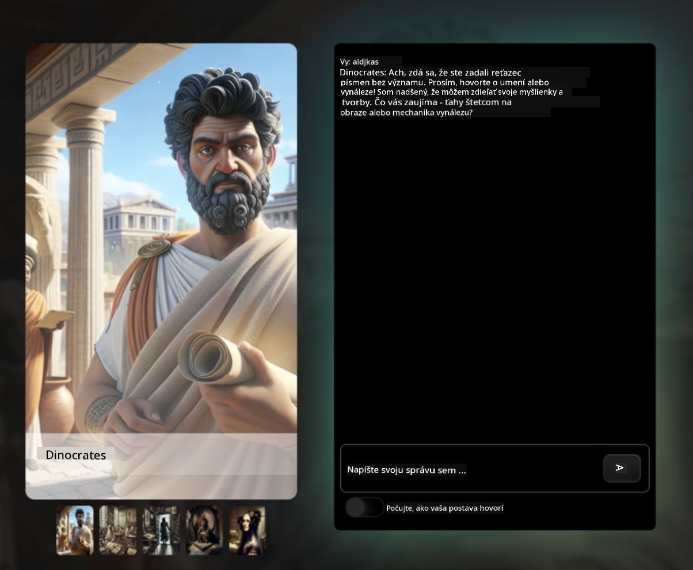

<!--
CO_OP_TRANSLATOR_METADATA:
{
  "original_hash": "8b9d0562ea649b6012d1a67acc630681",
  "translation_date": "2025-10-24T21:15:33+00:00",
  "source_file": "README.md",
  "language_code": "sk"
}
-->
[](https://github.com/microsoft/Web-Dev-For-Beginners/blob/master/LICENSE)
[](https://GitHub.com/microsoft/Web-Dev-For-Beginners/graphs/contributors/)
[](https://GitHub.com/microsoft/Web-Dev-For-Beginners/issues/)
[](https://GitHub.com/microsoft/Web-Dev-For-Beginners/pulls/)
[](http://makeapullrequest.com)

[](https://GitHub.com/microsoft/Web-Dev-For-Beginners/watchers/)
[](https://GitHub.com/microsoft/Web-Dev-For-Beginners/network/)
[](https://GitHub.com/microsoft/Web-Dev-For-Beginners/stargazers/)

[](https://discord.gg/zxKYvhSnVp?WT.mc_id=academic-000002-leestott)

# Web Development for Beginners - Kurikulum

Naučte sa základy webového vývoja prostredníctvom nášho 12-týždňového komplexného kurzu od Microsoft Cloud Advocates. Každá z 24 lekcií sa zaoberá JavaScriptom, CSS a HTML prostredníctvom praktických projektov, ako sú teráriá, rozšírenia prehliadača a vesmírne hry. Zapojte sa do kvízov, diskusií a praktických úloh. Zlepšite svoje zručnosti a optimalizujte si zapamätanie vedomostí pomocou našej efektívnej projektovo orientovanej pedagogiky. Začnite svoju cestu kódovania už dnes!

Pripojte sa k Azure AI Foundry Discord komunite

[](https://discord.com/invite/ByRwuEEgH4)

Postupujte podľa týchto krokov, aby ste mohli začať používať tieto zdroje:
1. **Forknite repozitár**: Kliknite [](https://GitHub.com/microsoft/Web-Dev-For-Beginners/fork)
2. **Klonujte repozitár**:   `git clone https://github.com/microsoft/Web-Dev-For-Beginners.git`
3. [**Pripojte sa k Azure AI Foundry Discord a stretnite sa s odborníkmi a ostatnými vývojármi**](https://discord.com/invite/ByRwuEEgH4)

### 🌐 Podpora viacerých jazykov

#### Podporované prostredníctvom GitHub Action (Automatizované a vždy aktuálne)

<!-- CO-OP TRANSLATOR LANGUAGES TABLE START -->
[Arabčina](../ar/README.md) | [Bengálčina](../bn/README.md) | [Bulharčina](../bg/README.md) | [Barmčina (Mjanmarsko)](../my/README.md) | [Čínština (zjednodušená)](../zh/README.md) | [Čínština (tradičná, Hongkong)](../hk/README.md) | [Čínština (tradičná, Macao)](../mo/README.md) | [Čínština (tradičná, Taiwan)](../tw/README.md) | [Chorvátčina](../hr/README.md) | [Čeština](../cs/README.md) | [Dánčina](../da/README.md) | [Holandčina](../nl/README.md) | [Estónčina](../et/README.md) | [Fínčina](../fi/README.md) | [Francúzština](../fr/README.md) | [Nemčina](../de/README.md) | [Gréčtina](../el/README.md) | [Hebrejčina](../he/README.md) | [Hindčina](../hi/README.md) | [Maďarčina](../hu/README.md) | [Indonézčina](../id/README.md) | [Taliančina](../it/README.md) | [Japončina](../ja/README.md) | [Kórejčina](../ko/README.md) | [Litovčina](../lt/README.md) | [Malajčina](../ms/README.md) | [Maráthčina](../mr/README.md) | [Nepálčina](../ne/README.md) | [Nórčina](../no/README.md) | [Perzština (Farsí)](../fa/README.md) | [Poľština](../pl/README.md) | [Portugalčina (Brazília)](../br/README.md) | [Portugalčina (Portugalsko)](../pt/README.md) | [Pandžábčina (Gurmukhi)](../pa/README.md) | [Rumunčina](../ro/README.md) | [Ruština](../ru/README.md) | [Srbčina (cyrilika)](../sr/README.md) | [Slovenčina](./README.md) | [Slovinčina](../sl/README.md) | [Španielčina](../es/README.md) | [Swahilčina](../sw/README.md) | [Švédčina](../sv/README.md) | [Tagalog (Filipínčina)](../tl/README.md) | [Tamilčina](../ta/README.md) | [Thajčina](../th/README.md) | [Turečtina](../tr/README.md) | [Ukrajinčina](../uk/README.md) | [Urdu](../ur/README.md) | [Vietnamčina](../vi/README.md)
<!-- CO-OP TRANSLATOR LANGUAGES TABLE END -->

**Ak si želáte ďalšie preklady, podporované jazyky sú uvedené [tu](https://github.com/Azure/co-op-translator/blob/main/getting_started/supported-languages.md)**

[](https://open.vscode.dev/microsoft/Web-Dev-For-Beginners)

#### 🧑‍🎓 _Ste študent?_

Navštívte [**stránku Student Hub**](https://docs.microsoft.com/learn/student-hub/?WT.mc_id=academic-77807-sagibbon), kde nájdete zdroje pre začiatočníkov, študentské balíčky a dokonca aj spôsoby, ako získať poukaz na bezplatný certifikát. Táto stránka je ideálna na uloženie do záložiek a pravidelné kontrolovanie, pretože obsah sa mení každý mesiac.

### 📣 Oznámenie - Nové výzvy s režimom GitHub Copilot Agent na dokončenie!

Pridaná nová výzva, hľadajte "GitHub Copilot Agent Challenge 🚀" vo väčšine kapitol. To je nová výzva, ktorú môžete dokončiť pomocou GitHub Copilot a režimu Agent. Ak ste režim Agent ešte nepoužívali, je schopný nielen generovať text, ale aj vytvárať a upravovať súbory, spúšťať príkazy a ďalšie.

### 📣 Oznámenie - _Nový projekt na vytvorenie pomocou generatívnej AI_

Práve pridaný nový projekt AI Assistant, pozrite si [projekt](./09-chat-project/README.md)

### 📣 Oznámenie - _Nový kurikulum_ o generatívnej AI pre JavaScript bol práve vydaný

Nezmeškajte náš nový kurikulum o generatívnej AI!

Navštívte [https://aka.ms/genai-js-course](https://aka.ms/genai-js-course) a začnite!


- Lekcie pokrývajúce všetko od základov po RAG.
- Interakcia s historickými postavami pomocou GenAI a našej sprievodnej aplikácie.
- Zábavný a pútavý príbeh, budete cestovať v čase!



Každá lekcia obsahuje úlohu na dokončenie, kontrolu vedomostí a výzvu, ktorá vás prevedie učením tém, ako sú:
- Tvorba a optimalizácia promptov
- Generovanie textových a obrazových aplikácií
- Vyhľadávacie aplikácie

Navštívte [https://aka.ms/genai-js-course](../../[https:/aka.ms/genai-js-course) a začnite!


## 🌱 Začíname

> **Učitelia**, zahrnuli sme [niekoľko návrhov](for-teachers.md) na to, ako používať tento kurikulum. Radi by sme počuli váš názor [v našom diskusnom fóre](https://github.com/microsoft/Web-Dev-For-Beginners/discussions/categories/teacher-corner)!

**[Študenti](https://aka.ms/student-page/?WT.mc_id=academic-77807-sagibbon)**, pre každú lekciu začnite kvízom pred prednáškou a pokračujte čítaním materiálu prednášky, dokončením rôznych aktivít a overte si svoje porozumenie kvízom po prednáške.

Na zlepšenie vášho vzdelávacieho zážitku sa spojte s vašimi rovesníkmi, aby ste pracovali na projektoch spoločne! Diskusie sú vítané v našom [diskusnom fóre](https://github.com/microsoft/Web-Dev-For-Beginners/discussions), kde bude náš tím moderátorov k dispozícii na zodpovedanie vašich otázok.

Na ďalšie vzdelávanie vám dôrazne odporúčame preskúmať [Microsoft Learn](https://learn.microsoft.com/users/wirelesslife/collections/p1ddcy5jwy0jkm?WT.mc_id=academic-77807-sagibbon) pre ďalšie študijné materiály.

### 📋 Nastavenie vášho prostredia

Tento kurikulum má pripravené vývojové prostredie! Keď začnete, môžete si vybrať, či chcete kurikulum spustiť v [Codespace](https://github.com/features/codespaces/) (_prostredie založené na prehliadači, bez nutnosti inštalácie_), alebo lokálne na vašom počítači pomocou textového editora, ako je [Visual Studio Code](https://code.visualstudio.com/?WT.mc_id=academic-77807-sagibbon).

#### Vytvorte si svoj repozitár
Aby ste si mohli ľahko uložiť svoju prácu, odporúčame vám vytvoriť si vlastnú kópiu tohto repozitára. Môžete to urobiť kliknutím na tlačidlo **Použiť túto šablónu** na vrchu stránky. Tým sa vytvorí nový repozitár vo vašom GitHub účte s kópiou kurikula.

Postupujte podľa týchto krokov:
1. **Forknite repozitár**: Kliknite na tlačidlo "Fork" v pravom hornom rohu tejto stránky.
2. **Klonujte repozitár**:   `git clone https://github.com/microsoft/Web-Dev-For-Beginners.git`

#### Spustenie kurikula v Codespace

Vo vašej kópii tohto repozitára, ktorú ste vytvorili, kliknite na tlačidlo **Code** a vyberte **Open with Codespaces**. Tým sa vytvorí nový Codespace, v ktorom môžete pracovať.


#### Spustenie kurikula lokálne na vašom počítači

Ak chcete spustiť tento kurikulum lokálne na vašom počítači, budete potrebovať textový editor, prehliadač a nástroj príkazového riadku. Naša prvá lekcia, [Úvod do programovacích jazykov a nástrojov](../../1-getting-started-lessons/1-intro-to-programming-languages), vás prevedie rôznymi možnosťami pre každý z týchto nástrojov, aby ste si mohli vybrať, čo vám najviac vyhovuje.

Naše odporúčanie je použiť [Visual Studio Code](https://code.visualstudio.com/?WT.mc_id=academic-77807-sagibbon) ako váš editor, ktorý má tiež zabudovaný [Terminál](https://code.visualstudio.com/docs/terminal/basics/?WT.mc_id=academic-77807-sagibbon). Visual Studio Code si môžete stiahnuť [tu](https://code.visualstudio.com/?WT.mc_id=academic-77807-sagibbon).


1. Klonujte svoj repozitár na váš počítač. Môžete to urobiť kliknutím na tlačidlo **Code** a skopírovaním URL:

    [CodeSpace](./images/createcodespace.png)

    Potom otvorte [Terminál](https://code.visualstudio.com/docs/terminal/basics/?WT.mc_id=academic-77807-sagibbon) vo [Visual Studio Code](https://code.visualstudio.com/?WT.mc_id=academic-77807-sagibbon) a spustite nasledujúci príkaz, pričom `<your-repository-url>` nahradíte URL, ktorú ste práve skopírovali:

    ```bash 
    git clone <your-repository-url>
    ```

2. Otvorte priečinok vo Visual Studio Code. Môžete to urobiť kliknutím na **File** > **Open Folder** a výberom priečinka, ktorý ste práve klonovali.


>  Odporúčané rozšírenia pre Visual Studio Code:
>
> * [Live Server](https://marketplace.visualstudio.com/items?itemName=ritwickdey.LiveServer&WT.mc_id=academic-77807-sagibbon) - na náhľad HTML stránok vo Visual Studio Code
> * [Copilot](https://marketplace.visualstudio.com/items?itemName=GitHub.copilot&WT.mc_id=academic-77807-sagibbon) - na pomoc pri rýchlejšom písaní kódu

## 📂 Každá lekcia obsahuje:

- voliteľné sketchnote
- voliteľné doplnkové video
- kvíz na rozohriatie pred lekciou
- písomnú lekciu
- pre lekcie založené na projektoch, podrobné návody na vytvorenie projektu
- kontrolu znalostí
- výzvu
- doplnkové čítanie
- úlohu
- [kvíz po lekcii](https://ff-quizzes.netlify.app/web/)

> **Poznámka ku kvízom**: Všetky kvízy sú obsiahnuté v priečinku Quiz-app, celkovo 48 kvízov, každý s tromi otázkami. Sú dostupné [tu](https://ff-quizzes.netlify.app/web/) a aplikáciu kvízov je možné spustiť lokálne alebo nasadiť na Azure; postupujte podľa pokynov v priečinku `quiz-app`.

## 🗃️ Lekcie

|     |                       Názov projektu                       |                            Učené koncepty                             | Ciele učenia                                                                                                                 |                                                         Prepojená lekcia                                                          |         Autor          |
| :-: | :------------------------------------------------------: | :--------------------------------------------------------------------: | ----------------------------------------------------------------------------------------------------------------------------------- | :----------------------------------------------------------------------------------------------------------------------------: | :---------------------: |
| 01  |                     Začíname                      |           Úvod do programovania a nástroje pre vývojárov           | Naučte sa základné princípy väčšiny programovacích jazykov a softvér, ktorý pomáha profesionálnym vývojárom vykonávať ich prácu | [Úvod do programovacích jazykov a nástrojov](./1-getting-started-lessons/1-intro-to-programming-languages/README.md) |         Jasmine         |
| 02  |                     Začíname                      |             Základy GitHubu, vrátane práce v tíme             | Ako používať GitHub vo vašom projekte, ako spolupracovať s ostatnými na kódovej základni                                                    |                            [Úvod do GitHubu](./1-getting-started-lessons/2-github-basics/README.md)                             |          Floor          |
| 03  |                     Začíname                      |                             Prístupnosť                              | Naučte sa základy webovej prístupnosti                                                                                               |                       [Základy prístupnosti](./1-getting-started-lessons/3-accessibility/README.md)                       |       Christopher       |
| 04  |                        Základy JS                         |                         Dátové typy v JavaScripte                          | Základy dátových typov v JavaScripte                                                                                                 |                                       [Dátové typy](./2-js-basics/1-data-types/README.md)                                        |         Jasmine         |
| 05  |                        Základy JS                         |                         Funkcie a metódy                          | Naučte sa o funkciách a metódach na riadenie logického toku aplikácie                                                             |                              [Funkcie a metódy](./2-js-basics/2-functions-methods/README.md)                               | Jasmine a Christopher |
| 06  |                        Základy JS                         |                        Rozhodovanie s JS                        | Naučte sa vytvárať podmienky vo vašom kóde pomocou metód rozhodovania                                                           |                                 [Rozhodovanie](./2-js-basics/3-making-decisions/README.md)                                  |         Jasmine         |
| 07  |                        Základy JS                         |                            Polia a cykly                            | Práca s dátami pomocou polí a cyklov v JavaScripte                                                                                 |                                   [Polia a cykly](./2-js-basics/4-arrays-loops/README.md)                                    |         Jasmine         |
| 08  |       [Terárium](./3-terrarium/solution/README.md)       |                            HTML v praxi                            | Vytvorte HTML na vytvorenie online terária, zamerajte sa na vytvorenie rozloženia                                                         |                                 [Úvod do HTML](./3-terrarium/1-intro-to-html/README.md)                                 |           Jen           |
| 09  |       [Terárium](./3-terrarium/solution/README.md)       |                            CSS v praxi                             | Vytvorte CSS na štýlovanie online terária, zamerajte sa na základy CSS vrátane vytvorenia responzívnej stránky                     |                                  [Úvod do CSS](./3-terrarium/2-intro-to-css/README.md)                                  |           Jen           |
| 10  |            [Terárium](./3-terrarium/solution/README.md)            |                 Uzávery v JavaScripte, manipulácia s DOM                  | Vytvorte JavaScript na to, aby terárium fungovalo ako rozhranie drag/drop, zamerajte sa na uzávery a manipuláciu s DOM             |                  [Uzávery v JavaScripte, manipulácia s DOM](./3-terrarium/3-intro-to-DOM-and-closures/README.md)                   |           Jen           |
| 11  |          [Hra na písanie](./4-typing-game/solution/README.md)          |                          Vytvorenie hry na písanie                           | Naučte sa používať udalosti klávesnice na riadenie logiky vašej JavaScript aplikácie                                                          |                                [Programovanie riadené udalosťami](./4-typing-game/typing-game/README.md)                                |       Christopher       |
| 12  | [Rozšírenie prehliadača Green](./5-browser-extension/solution/README.md) |                         Práca s prehliadačmi                          | Naučte sa, ako fungujú prehliadače, ich históriu a ako vytvoriť prvé prvky rozšírenia prehliadača                               |                               [O prehliadačoch](./5-browser-extension/1-about-browsers/README.md)                                |           Jen           |
| 13  | [Rozšírenie prehliadača Green](./5-browser-extension/solution/README.md) | Vytvorenie formulára, volanie API a ukladanie premenných do lokálneho úložiska | Vytvorte JavaScript prvky vášho rozšírenia prehliadača na volanie API pomocou premenných uložených v lokálnom úložisku                      |                [API, formuláre a lokálne úložisko](./5-browser-extension/2-forms-browsers-local-storage/README.md)                 |           Jen           |
| 14  | [Rozšírenie prehliadača Green](./5-browser-extension/solution/README.md) |          Procesy na pozadí v prehliadači, výkon webu          | Použite procesy na pozadí prehliadača na správu ikony rozšírenia; naučte sa o výkone webu a niektorých optimalizáciách na zlepšenie   |             [Úlohy na pozadí a výkon](./5-browser-extension/3-background-tasks-and-performance/README.md)              |           Jen           |
| 15  |           [Vesmírna hra](./6-space-game/solution/README.md)           |             Pokročilý vývoj hier s JavaScriptom             | Naučte sa o dedičnosti pomocou tried a kompozície a o vzore Pub/Sub, ako prípravu na vytvorenie hry              |                      [Úvod do pokročilého vývoja hier](./6-space-game/1-introduction/README.md)                       |          Chris          |
| 16  |           [Vesmírna hra](./6-space-game/solution/README.md)           |                           Kreslenie na plátno                            | Naučte sa o API plátna, ktoré sa používa na kreslenie prvkov na obrazovku                                                                       |                                [Kreslenie na plátno](./6-space-game/2-drawing-to-canvas/README.md)                                |          Chris          |
| 17  |           [Vesmírna hra](./6-space-game/solution/README.md)           |                   Pohyb prvkov po obrazovke                    | Zistite, ako môžu prvky získať pohyb pomocou karteziánskych súradníc a API plátna                                            |                           [Pohyb prvkov](./6-space-game/3-moving-elements-around/README.md)                           |          Chris          |
| 18  |           [Vesmírna hra](./6-space-game/solution/README.md)           |                          Detekcia kolízií                           | Umožnite prvkom zrážať sa a reagovať na seba pomocou stlačení klávesov a poskytnite funkciu cooldown na zabezpečenie výkonu hry    |                              [Detekcia kolízií](./6-space-game/4-collision-detection/README.md)                              |          Chris          |
| 19  |           [Vesmírna hra](./6-space-game/solution/README.md)           |                             Udržiavanie skóre                              | Vykonávajte matematické výpočty na základe stavu a výkonu hry                                                                |                                    [Udržiavanie skóre](./6-space-game/5-keeping-score/README.md)                                    |          Chris          |
| 20  |           [Vesmírna hra](./6-space-game/solution/README.md)           |                     Ukončenie a reštartovanie hry                     | Naučte sa o ukončení a reštartovaní hry, vrátane čistenia zdrojov a resetovania hodnôt premenných                              |                                [Podmienka ukončenia](./6-space-game/6-end-condition/README.md)                                 |          Chris          |
| 21  |         [Banková aplikácia](./7-bank-project/solution/README.md)          |                 HTML šablóny a trasy vo webovej aplikácii                 | Naučte sa, ako vytvoriť štruktúru architektúry webovej stránky s viacerými stránkami pomocou trasovania a HTML šablón                             |                            [HTML šablóny a trasy](./7-bank-project/1-template-route/README.md)                             |          Yohan          |
| 22  |         [Banková aplikácia](./7-bank-project/solution/README.md)          |                  Vytvorenie prihlasovacieho a registračného formulára                   | Naučte sa vytvárať formuláre a spracovávať rutiny validácie                                                                          |                                           [Formuláre](./7-bank-project/2-forms/README.md)                                           |          Yohan          |
| 23  |         [Banková aplikácia](./7-bank-project/solution/README.md)          |                   Metódy získavania a používania dát                   | Ako dáta prúdia do vašej aplikácie a z nej, ako ich získavať, ukladať a spracovávať                                                 |                                            [Dáta](./7-bank-project/3-data/README.md)                                            |          Yohan          |
| 24  |         [Banková aplikácia](./7-bank-project/solution/README.md)          |                      Koncepty správy stavu                      | Naučte sa, ako vaša aplikácia uchováva stav a ako ho programovo spravovať                                                              |                                [Správa stavu](./7-bank-project/4-state-management/README.md)                                |          Yohan          |
| 25 | [Prehliadač/VScode kód](../../8-code-editor) | Práca s VScode | Naučte sa používať editor kódu| [Použitie editora kódu VScode](./8-code-editor/1-using-a-code-editor/README.md) | Chris |
| 26 | [AI asistenti](./9-chat-project/README.md) | Práca s AI | Naučte sa vytvoriť vlastného AI asistenta | [Projekt AI asistenta](./9-chat-project/README.md) | Chris |

## 🏫 Pedagogika

Náš učebný plán je navrhnutý s ohľadom na dva kľúčové pedagogické princípy:
* učenie založené na projektoch
* časté kvízy

Program učí základy JavaScriptu, HTML a CSS, ako aj najnovšie nástroje a techniky, ktoré používajú dnešní weboví vývojári. Študenti budú mať možnosť získať praktické skúsenosti vytvorením hry na písanie, virtuálneho terária, ekologického rozšírenia prehliadača, hry v štýle vesmírnych invázií a bankovej aplikácie pre podniky. Na konci série študenti získajú solídne pochopenie webového vývoja.

> 🎓 Prvé lekcie tohto učebného plánu si môžete prejsť ako [Learn Path](https://docs.microsoft.com/learn/paths/web-development-101/?WT.mc_id=academic-77807-sagibbon) na Microsoft Learn!

Zabezpečením, že obsah je v súlade s projektmi, sa proces stáva pre študentov pútavejším a zlepšuje sa uchovávanie konceptov. Napísali sme tiež niekoľko úvodných lekcií o základoch JavaScriptu na predstavenie konceptov, spojených s videom zo série "[Beginners Series to: JavaScript](https://channel9.msdn.com/Series/Beginners-Series-to-JavaScript/?WT.mc_id=academic-77807-sagibbon)" kolekcie video tutoriálov, ktorých autori prispeli k tomuto učebnému plánu.

Okrem toho, nízko stresový kvíz pred hodinou nastaví úmysel študenta na učenie sa témy, zatiaľ čo druhý kvíz po hodine zabezpečí ďalšie uchovanie. Tento učebný plán bol navrhnutý tak, aby bol flexibilný a zábavný a môže byť absolvovaný ako celok alebo čiastočne. Projekty začínajú malé a postupne sa stávajú zložitejšími na konci 12-týždňového cyklu.

Aj keď sme sa zámerne vyhli zavádzaniu JavaScript frameworkov, aby sme sa sústredili na základné zručnosti potrebné ako webový vývojár pred prijatím frameworku, dobrým ďalším krokom po dokončení tohto učebného plánu by bolo učenie sa o Node.js prostredníctvom inej kolekcie videí: "[Beginner Series to: Node.js](https://channel9.msdn.com/Series/Beginners-Series-to-Nodejs/?WT.mc_id=academic-77807-sagibbon)".

> Navštívte naše [Pravidlá správania](CODE_OF_CONDUCT.md) a pokyny pre [Prispievanie](CONTRIBUTING.md). Uvítame vašu konštruktívnu spätnú väzbu!


## 🧭 Offline prístup

Túto dokumentáciu môžete spustiť offline pomocou [Docsify](https://docsify.js.org/#/). Forknite tento repozitár, [nainštalujte Docsify](https://docsify.js.org/#/quickstart) na váš lokálny počítač a potom v koreňovom priečinku tohto repozitára zadajte `docsify serve`. Webová stránka bude dostupná na porte 3000 na vašom localhoste: `localhost:3000`.

## 📘 PDF

PDF všetkých lekcií nájdete [tu](https://microsoft.github.io/Web-Dev-For-Beginners/pdf/readme.pdf).


## 🎒 Ďalšie kurzy

Náš tím vytvára aj ďalšie kurzy! Pozrite si:

### Azure / Edge / MCP / Agents
[](https://github.com/microsoft/AZD-for-beginners?WT.mc_id=academic-105485-koreyst)
[](https://github.com/microsoft/edgeai-for-beginners?WT.mc_id=academic-105485-koreyst)  
[](https://github.com/microsoft/mcp-for-beginners?WT.mc_id=academic-105485-koreyst)  
[](https://github.com/microsoft/ai-agents-for-beginners?WT.mc_id=academic-105485-koreyst)  

---

### Generatívna AI séria  
[](https://github.com/microsoft/generative-ai-for-beginners?WT.mc_id=academic-105485-koreyst)  
[-9333EA?style=for-the-badge&labelColor=E5E7EB&color=9333EA)](https://github.com/microsoft/Generative-AI-for-beginners-dotnet?WT.mc_id=academic-105485-koreyst)  
[-C084FC?style=for-the-badge&labelColor=E5E7EB&color=C084FC)](https://github.com/microsoft/generative-ai-for-beginners-java?WT.mc_id=academic-105485-koreyst)  
[-E879F9?style=for-the-badge&labelColor=E5E7EB&color=E879F9)](https://github.com/microsoft/generative-ai-with-javascript?WT.mc_id=academic-105485-koreyst)  

---

### Základné učenie  
[](https://aka.ms/ml-beginners?WT.mc_id=academic-105485-koreyst)  
[](https://aka.ms/datascience-beginners?WT.mc_id=academic-105485-koreyst)  
[](https://aka.ms/ai-beginners?WT.mc_id=academic-105485-koreyst)  
[](https://github.com/microsoft/Security-101?WT.mc_id=academic-96948-sayoung)  
[](https://aka.ms/webdev-beginners?WT.mc_id=academic-105485-koreyst)  
[](https://aka.ms/iot-beginners?WT.mc_id=academic-105485-koreyst)  
[](https://github.com/microsoft/xr-development-for-beginners?WT.mc_id=academic-105485-koreyst)  

---

### Séria Copilot  
[](https://aka.ms/GitHubCopilotAI?WT.mc_id=academic-105485-koreyst)  
[](https://github.com/microsoft/mastering-github-copilot-for-dotnet-csharp-developers?WT.mc_id=academic-105485-koreyst)  
[](https://github.com/microsoft/CopilotAdventures?WT.mc_id=academic-105485-koreyst)  

## Získanie pomoci  

Ak sa zaseknete alebo máte otázky ohľadom vytvárania AI aplikácií, pridajte sa:  

[](https://aka.ms/foundry/discord)  

Ak máte spätnú väzbu k produktom alebo narazíte na chyby pri vývoji, navštívte:  

[](https://aka.ms/foundry/forum)  

## Licencia  

Tento repozitár je licencovaný pod licenciou MIT. Viac informácií nájdete v súbore [LICENSE](../../LICENSE).  

---

**Zrieknutie sa zodpovednosti**:  
Tento dokument bol preložený pomocou služby AI prekladu [Co-op Translator](https://github.com/Azure/co-op-translator). Hoci sa snažíme o presnosť, prosím, berte na vedomie, že automatizované preklady môžu obsahovať chyby alebo nepresnosti. Pôvodný dokument v jeho rodnom jazyku by mal byť považovaný za autoritatívny zdroj. Pre kritické informácie sa odporúča profesionálny ľudský preklad. Nenesieme zodpovednosť za akékoľvek nedorozumenia alebo nesprávne interpretácie vyplývajúce z použitia tohto prekladu.