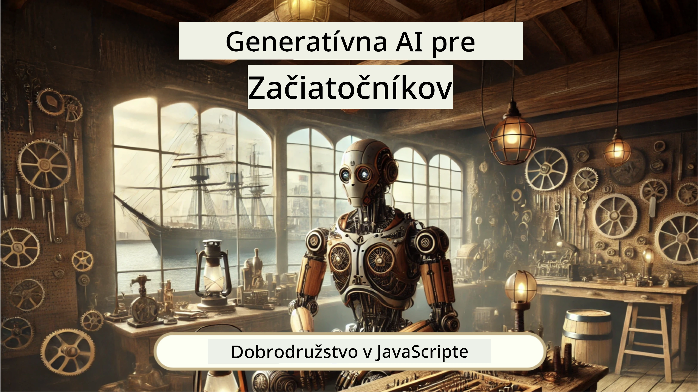
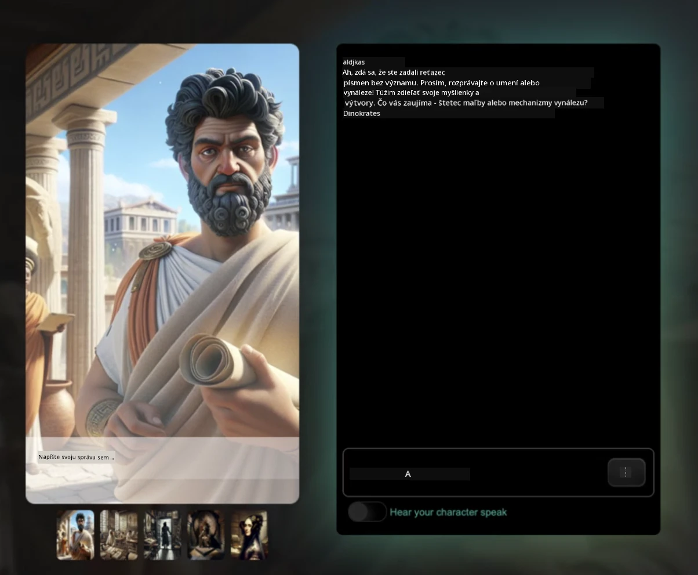
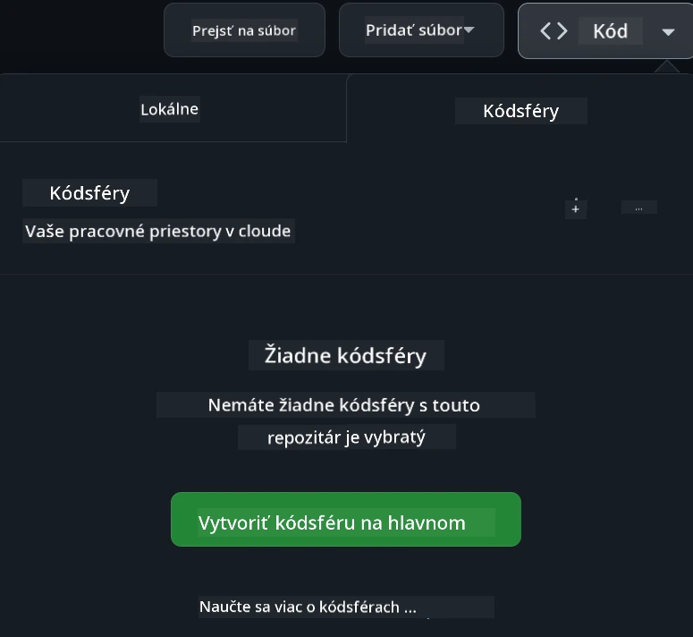

# Web Development pre začiatočníkov - Kurz

Naučte sa základy webového vývoja v rámci nášho 12-týždňového komplexného kurzu od Microsoft Cloud Advocates. Každá z 24 lekcií skúma JavaScript, CSS a HTML prostredníctvom praktických projektov ako teráriá, rozšírenia pre prehliadače a vesmírne hry. Zúčastnite sa kvízov, diskusií a praktických úloh. Zlepšite svoje zručnosti a optimalizujte si udržanie vedomostí s našou efektívnou projektovo orientovanou pedagogikou. Začnite svoju programátorskú cestu ešte dnes!

Pridajte sa do komunity Azure AI Foundry Discord

Nasledujte tieto kroky, aby ste začali používať tieto zdroje:  
1. **Vytvorte Fork úložiska**: Kliknite na [](https://GitHub.com/microsoft/Web-Dev-For-Beginners/fork)  
2. **Naklonujte úložisko**:   `git clone https://github.com/microsoft/Web-Dev-For-Beginners.git`  
3. [**Pridajte sa do Azure AI Foundry Discord a spoznajte odborníkov a ostatných vývojárov**](https://discord.com/invite/ByRwuEEgH4)

### 🌐 Podpora viacerých jazykov

#### Podporované cez GitHub Action (automatizované a vždy aktuálne)

> **Radšej klonovať lokálne?**  
>  
> Toto úložisko obsahuje viac ako 50 jazykových prekladov, ktoré výrazne zväčšujú veľkosť sťahovania. Pre klonovanie bez prekladov použite sparse checkout:  
>  
> **Bash / macOS / Linux:**  
> > ```bash
> git clone --filter=blob:none --sparse https://github.com/microsoft/Web-Dev-For-Beginners.git
> cd Web-Dev-For-Beginners
> git sparse-checkout set --no-cone '/*' '!translations' '!translated_images'
> ```
>  
> **CMD (Windows):**  
> > ```cmd
> git clone --filter=blob:none --sparse https://github.com/microsoft/Web-Dev-For-Beginners.git
> cd Web-Dev-For-Beginners
> git sparse-checkout set --no-cone "/*" "!translations" "!translated_images"
> ```
>  
> Táto možnosť vám umožní získať všetko potrebné na dokončenie kurzu s oveľa rýchlejším sťahovaním.  

**Ak chcete pridať ďalšie prekladové jazyky, podporované jazyky nájdete [tu](https://github.com/Azure/co-op-translator/blob/main/getting_started/supported-languages.md)**

#### 🧑‍🎓 _Ste študent?_

Navštívte [**Student Hub stránku**](https://docs.microsoft.com/learn/student-hub/?WT.mc_id=academic-77807-sagibbon), kde nájdete zdroje pre začiatočníkov, balíčky pre študentov a dokonca možnosti získať bezplatný certifikát. Túto stránku si uložíte do záložiek a občas skontrolujte, pretože každý mesiac meníme obsah.

### 📣 Oznámenie - Nové výzvy GitHub Copilot Agent módu na dokončenie!

Pridaná nová výzva, nájdete ju pod názvom "GitHub Copilot Agent Challenge 🚀" v niektorých kapitolách. Ide o novú výzvu, ktorú môžete splniť použitím GitHub Copilot a Agent módu. Ak ste Agent mód ešte nepoužili, vie nielen generovať text, ale aj vytvárať a upravovať súbory, spúšťať príkazy a ďalšie.

### 📣 Oznámenie - _Nový projekt na vývoj pomocou generatívnej AI_ 

Práve bol pridaný nový projekt AI asistenta, pozrite si ho [projekt](./9-chat-project/README.md)

### 📣 Oznámenie - _Nový kurz_ o generatívnej AI pre JavaScript práve vydaný

Nezmeškajte náš nový kurz o generatívnej AI!

Navštívte [https://aka.ms/genai-js-course](https://aka.ms/genai-js-course) a začnite!



- Lekcie pokrývajú všetko od základov až po RAG.  
- Interagujte s historickými postavami pomocou GenAI a našej doplnkovej aplikácie.  
- Zábavný a pútavý príbeh, budete cestovať časom!



Každá lekcia obsahuje úlohu na dokončenie, test vedomostí a výzvu, ktorá vás prevedie témami ako:  
- Vytváranie promptov a prompt engineering  
- Generovanie textových a obrazových aplikácií  
- Vyhľadávacie aplikácie

Navštívte [https://aka.ms/genai-js-course](https://aka.ms/genai-js-course) a začnite!

## 🌱 Začíname

> **Učitelia**, pripravili sme [niekoľko návrhov](for-teachers.md) na používanie tohto kurikula. Budeme radi za vaše pripomienky [v našom diskusnom fóre](https://github.com/microsoft/Web-Dev-For-Beginners/discussions/categories/teacher-corner)!

**[Študenti](https://aka.ms/student-page/?WT.mc_id=academic-77807-sagibbon)**, ku každej lekcii začnite kvízom pred prednáškou, prečítajte si prednáškový materiál, dokončite rôzne aktivity a overte si porozumenie pomocou kvízu po prednáške.

Pre lepší zážitok z učenia sa spojte so svojimi rovesníkmi a pracujte na projektoch spoločne! Diskusie sú vítané v našom [diskusnom fóre](https://github.com/microsoft/Web-Dev-For-Beginners/discussions), kde sú dostupní naši moderátori, ktorí vám radi zodpovedia otázky.

Pre ďalšie štúdium vám vrelo odporúčame preskúmať [Microsoft Learn](https://learn.microsoft.com/users/wirelesslife/collections/p1ddcy5jwy0jkm?WT.mc_id=academic-77807-sagibbon) pre doplnkové študijné materiály.

### 📋 Nastavenie prostredia

Tento kurz má pripravené vývojové prostredie! Na začiatku si môžete vybrať spustenie kurzu v prostredí [Codespace](https://github.com/features/codespaces/) (_prostredie v prehliadači bez potreby inštalácie_), alebo lokálne na vašom počítači pomocou textového editora ako je [Visual Studio Code](https://code.visualstudio.com/?WT.mc_id=academic-77807-sagibbon).

#### Vytvorte si vlastné úložisko

Pre jednoduché ukladanie vašej práce sa odporúča vytvoriť si vlastnú kópiu tohto úložiska. Môžete to spraviť kliknutím na tlačidlo **Použiť túto šablónu** v hornej časti stránky. Takto sa vytvorí nové úložisko vo vašom GitHub konte s kópiou kurikula.

Postupujte podľa týchto krokov:  
1. **Vytvorte Fork úložiska**: Kliknite na tlačidlo "Fork" v pravom hornom rohu tejto stránky.  
2. **Naklonujte úložisko**:   `git clone https://github.com/microsoft/Web-Dev-For-Beginners.git`

#### Spustenie kurzu v Codespace

Vo vašej kópii úložiska kliknite na tlačidlo **Code** a vyberte **Open with Codespaces**. Týmto vytvoríte nový Codespace, v ktorom môžete pracovať.



#### Spustenie kurzu lokálne na počítači

Na spustenie kurzu lokálne budete potrebovať textový editor, prehliadač a nástroj príkazového riadku. Naša prvá lekcia, [Úvod do programovacích jazykov a nástrojov](../../1-getting-started-lessons/1-intro-to-programming-languages), vás prevedie rôznymi možnosťami pre tieto nástroje, aby ste si mohli vybrať, čo vám najviac vyhovuje.

Odporúčame použiť [Visual Studio Code](https://code.visualstudio.com/?WT.mc_id=academic-77807-sagibbon) ako editor, ktorý obsahuje aj zabudovaný [Terminál](https://code.visualstudio.com/docs/terminal/basics/?WT.mc_id=academic-77807-sagibbon). Visual Studio Code si môžete stiahnuť [tu](https://code.visualstudio.com/?WT.mc_id=academic-77807-sagibbon).
1. Naklonujte si svoj repozitár do počítača. Môžete to urobiť kliknutím na tlačidlo **Code** a skopírovaním URL:

    [CodeSpace](./images/createcodespace.png)

    Potom otvorte [Terminál](https://code.visualstudio.com/docs/terminal/basics/?WT.mc_id=academic-77807-sagibbon) v rámci [Visual Studio Code](https://code.visualstudio.com/?WT.mc_id=academic-77807-sagibbon) a spustite nasledujúci príkaz, pričom `<your-repository-url>` nahraďte URL, ktorú ste práve skopírovali:

    ```bash 
    git clone <your-repository-url>
    ```

2. Otvorte priečinok vo Visual Studio Code. Môžete to urobiť kliknutím na **File** > **Open Folder** a výberom práve naklonovaného priečinka.


>  Odporúčané rozšírenia pre Visual Studio Code:
>
> * [Live Server](https://marketplace.visualstudio.com/items?itemName=ritwickdey.LiveServer&WT.mc_id=academic-77807-sagibbon) - na náhľad HTML stránok priamo vo Visual Studio Code
> * [Copilot](https://marketplace.visualstudio.com/items?itemName=GitHub.copilot&WT.mc_id=academic-77807-sagibbon) - na rýchlejšie písanie kódu

## 📂 Každá lekcia obsahuje:

- voliteľnú skicovaciu poznámku
- voliteľné doplnkové video
- rozcvičku pred lekciou formou kvízu
- písanú lekciu
- pre lekcie založené na projektoch, krok za krokom návody, ako projekt vybudovať
- kontroly vedomostí
- výzvu
- doplnkové čítanie
- zadanie
- [kvíz po lekcii](https://ff-quizzes.netlify.app/web/)

> **Poznámka o kvízoch**: Všetky kvízy sú uložené v priečinku Quiz-app, celkovo 48 kvízov so štyrmi otázkami každý. Sú dostupné [tu](https://ff-quizzes.netlify.app/web/), kvízová aplikácia môže byť spustená lokálne alebo nasadená na Azure; postupujte podľa inštrukcií v priečinku `quiz-app`.

## 🗃️ Lekcie

|     |                       Názov projektu                       |                            Konzepte vyučované                             | Ciele učenia                                                                                                                 |                                                         Prepojená lekcia                                                          |         Autor          |
| :-: | :--------------------------------------------------------: | :-----------------------------------------------------------------------: | ---------------------------------------------------------------------------------------------------------------------------- | :----------------------------------------------------------------------------------------------------------------------------: | :---------------------: |
| 01  |                     Začínáme                      |           Úvod do programovania a nástroje remesla           | Naučte sa základné princípy väčšiny programovacích jazykov a o softvéri, ktorý pomáha profesionálnym vývojárom pri práci | [Úvod do programovacích jazykov a nástrojov](./1-getting-started-lessons/1-intro-to-programming-languages/README.md) |         Jasmine         |
| 02  |                     Začínáme                      |             Základy GitHubu, vrátane práce v tíme             | Ako používať GitHub vo svojom projekte, ako spolupracovať s inými na kóde                                                    |                            [Úvod do GitHubu](./1-getting-started-lessons/2-github-basics/README.md)                             |          Floor          |
| 03  |                     Začínáme                      |                             Prístupnosť                              | Naučte sa základy prístupnosti webu                                                                                               |                       [Základy prístupnosti](./1-getting-started-lessons/3-accessibility/README.md)                       |       Christopher       |
| 04  |                        Základy JS                         |                         Typy dát v JavaScript                           | Základy typov dát v JavaScript                                                                                                 |                                       [Typy dát](./2-js-basics/1-data-types/README.md)                                        |         Jasmine         |
| 05  |                        Základy JS                         |                         Funkcie a metódy                           | Naučte sa o funkciách a metódach na riadenie logiky aplikácie                                                             |                              [Funkcie a metódy](./2-js-basics/2-functions-methods/README.md)                               | Jasmine a Christopher |
| 06  |                        Základy JS                         |                        Tvorba rozhodnutí v JS                        | Naučte sa vytvárať podmienky vo svojom kóde pomocou rozhodovacích metód                                                           |                                 [Tvorba rozhodnutí](./2-js-basics/3-making-decisions/README.md)                                  |         Jasmine         |
| 07  |                        Základy JS                         |                            Polia a cykly                            | Práca s dátami pomocou polí a cyklov v JavaScript                                                                                 |                                   [Polia a cykly](./2-js-basics/4-arrays-loops/README.md)                                    |         Jasmine         |
| 08  |       [Terrárium](./3-terrarium/solution/README.md)       |                            HTML v praxi                            | Vytvorte HTML pre online terrárium, zamerajte sa na tvorbu rozloženia                                                         |                                 [Úvod do HTML](./3-terrarium/1-intro-to-html/README.md)                                 |           Jen           |
| 09  |       [Terrárium](./3-terrarium/solution/README.md)       |                            CSS v praxi                             | Vytvorte CSS pre štýlovanie online terrária, naučte sa základy CSS vrátane responzívneho návrhu stránky                     |                                  [Úvod do CSS](./3-terrarium/2-intro-to-css/README.md)                                  |           Jen           |
| 10  |            [Terrárium](./3-terrarium/solution/README.md)            |                 Uzávierky JavaScriptu, manipulácia s DOMom                  | Vytvorte JavaScript, ktorý umožní terráriu fungovať ako drag/drop rozhranie, zamerajte sa na uzávierky a manipuláciu s DOMom             |                  [Uzávierky JavaScriptu, manipulácia s DOMom](./3-terrarium/3-intro-to-DOM-and-closures/README.md)                   |           Jen           |
| 11  |          [Hra na písanie](./4-typing-game/solution/README.md)          |                          Vytvorte hru na písanie                           | Naučte sa používať udalosti klávesnice na riadenie logiky vašej JavaScriptovej aplikácie                                                          |                                [Programovanie založené na udalostiach](./4-typing-game/typing-game/README.md)                                |       Christopher       |
| 12  | [Rozšírenie pre prehliadač Green](./5-browser-extension/solution/README.md) |                         Práca s prehliadačmi                          | Naučte sa, ako fungujú prehliadače, ich históriu a ako vytvoriť základné prvky rozšírenia prehliadača                               |                               [O prehliadačoch](./5-browser-extension/1-about-browsers/README.md)                                |           Jen           |
| 13  | [Rozšírenie pre prehliadač Green](./5-browser-extension/solution/README.md) | Vytvorenie formulára, volanie API a uchovávanie premenných v lokálnom úložisku | Vytvorte JavaScriptové prvky rozšírenia prehliadača na volanie API pomocou premenných uložených v lokálnom úložisku                      |                [API, formuláre a lokálne úložisko](./5-browser-extension/2-forms-browsers-local-storage/README.md)                 |           Jen           |
| 14  | [Rozšírenie pre prehliadač Green](./5-browser-extension/solution/README.md) |          Systémové procesy na pozadí v prehliadači, výkon webu          | Použite systémové procesy prehliadača na správu ikony rozšírenia; učte sa o výkone webu a niektorých optimalizáciách               |             [Úlohy na pozadí a výkon](./5-browser-extension/3-background-tasks-and-performance/README.md)              |           Jen           |
| 15  |           [Hra v priestore](./6-space-game/solution/README.md)           |            Pokročilý vývoj hier v JavaScripte             | Naučte sa o dedičnosti pomocou tried a kompozície a o vzore Pub/Sub, ako prípravu na tvorbu hry              |                      [Úvod k pokročilému vývoju hier](./6-space-game/1-introduction/README.md)                       |          Chris          |
| 16  |           [Hra v priestore](./6-space-game/solution/README.md)           |                           Kreslenie na plátno                            | Naučte sa o Canvas API používanom na kreslenie prvkov na obrazovku                                                                       |                                [Kreslenie na plátno](./6-space-game/2-drawing-to-canvas/README.md)                                |          Chris          |
| 17  |           [Hra v priestore](./6-space-game/solution/README.md)           |                   Pohyb prvkov po obrazovke                    | Objavte, ako môžu prvky získať pohyb pomocou kartézskych súradníc a Canvas API                                            |                           [Pohyb prvkov](./6-space-game/3-moving-elements-around/README.md)                           |          Chris          |
| 18  |           [Hra v priestore](./6-space-game/solution/README.md)           |                          Detekcia kolízií                           | Urobte, aby sa prvky zrážali a reagovali na seba pomocou stlačenia kláves a zabezpečte funkciu cooldown pre výkon hry    |                              [Detekcia kolízií](./6-space-game/4-collision-detection/README.md)                              |          Chris          |
| 19  |           [Hra v priestore](./6-space-game/solution/README.md)           |                             Uchovávanie skóre                              | Vykonávajte matematické výpočty na základe stavu a výkonu hry                                                                |                                    [Uchovávanie skóre](./6-space-game/5-keeping-score/README.md)                                    |          Chris          |
| 20  |           [Hra v priestore](./6-space-game/solution/README.md)           |                     Ukončenie a reštart hry                     | Naučte sa o ukončení a reštarte hry vrátane čistenia zdrojov a resetovania premenných                              |                                [Podmienka ukončenia](./6-space-game/6-end-condition/README.md)                                 |          Chris          |
| 21  |         [Banková aplikácia](./7-bank-project/solution/README.md)          |                 HTML šablóny a routovanie vo webovej aplikácii                 | Naučte sa vytvoriť kostru viacstránkovej webovej architektúry pomocou routovania a HTML šablón                             |                            [HTML šablóny a routovanie](./7-bank-project/1-template-route/README.md)                             |          Yohan          |
| 22  |         [Banková aplikácia](./7-bank-project/solution/README.md)          |                  Vytvorenie prihlasovacieho a registračného formulára                   | Naučte sa vytvárať formuláre a spracovávať validačné rutiny                                                                          |                                           [Formuláre](./7-bank-project/2-forms/README.md)                                           |          Yohan          |
| 23  |         [Banková aplikácia](./7-bank-project/solution/README.md)          |                   Spôsoby získavania a používania dát                   | Ako dáta prúdia dovnútra a von z vašej aplikácie, ako ich získavať, ukladať a likvidovať                                                 |                                            [Dáta](./7-bank-project/3-data/README.md)                                            |          Yohan          |
| 24  |         [Banková aplikácia](./7-bank-project/solution/README.md)          |                      Koncepty správy stavu                      | Naučte sa, ako si vaša aplikácia udržiava stav a ako ho programovo spravovať                                                              |                                [Správa stavu](./7-bank-project/4-state-management/README.md)                                |          Yohan          |
| 25 | [Prehliadač/VScode Kód](../../8-code-editor) | Práca s VScode | Naučte sa používať kódový editor| [Použitie VScode kódového editora](./8-code-editor/1-using-a-code-editor/README.md) | Chris |
| 26 | [AI asistenti](./9-chat-project/README.md) | Práca s AI | Naučte sa vytvoriť vlastného AI asistenta | [Projekt AI asistenta](./9-chat-project/README.md) | Chris |

## 🏫 Pedagogika

Naše učebné osnovy sú navrhnuté so dvoma kľúčovými pedagogickými princípmi:
* učenie založené na projektoch
* časté kvízy

Program učí základy JavaScriptu, HTML a CSS, ako aj najnovšie nástroje a techniky, ktoré používajú dnešní weboví vývojári. Študenti budú mať príležitosť získať praktické skúsenosti tým, že vyvinú hru na písanie, virtuálne terárium, ekologické rozšírenie prehliadača, hru v štýle vesmírneho dobyvateľa a bankovú aplikáciu pre podniky. Na konci série budú mať pevné pochopenie webového vývoja.

> 🎓 Prvé lekcie tohto kurzu môžete absolvovať ako [Learn Path](https://docs.microsoft.com/learn/paths/web-development-101/?WT.mc_id=academic-77807-sagibbon) na Microsoft Learn!

Zabezpečením zladenia obsahu s projektmi je proces pre študentov pútavejší a uchovávanie konceptov sa zlepší. Tiež sme napísali niekoľko úvodných lekcií v základoch JavaScriptu, ktoré predstavujú koncepty, sprevádzané videom zo série "[Začiatočnícka séria: JavaScript](https://channel9.msdn.com/Series/Beginners-Series-to-JavaScript/?WT.mc_id=academic-77807-sagibbon)", ktorého niektorí autori prispeli do týchto osnov.

Okrem toho nízko náročný kvíz pred triedou nastavuje študentovi zámer učiť sa danú tému, zatiaľ čo druhý kvíz po hodine zabezpečuje ďalšie uchovanie vedomostí. Tento kurz bol navrhnutý tak, aby bol flexibilný a zábavný a môže byť absolvovaný celý alebo čiastočne. Projekty začínajú jednoducho a do 12-týždňového cyklu sú čoraz zložitejšie.

Zatiaľ čo sme zámerne vynechali zavedenie JavaScriptových frameworkov, aby sme sa sústredili na základné zručnosti potrebné ako webový vývojár pred prijatím frameworku, dobrým ďalším krokom po dokončení tohto kurzu by bolo naučiť sa Node.js prostredníctvom inej kolekcie videí: "[Začiatočnícka séria: Node.js](https://channel9.msdn.com/Series/Beginners-Series-to-Nodejs/?WT.mc_id=academic-77807-sagibbon)".

> Navštívte naše pravidlá správania [Code of Conduct](CODE_OF_CONDUCT.md) a zásady prispievania [Contributing](CONTRIBUTING.md). Vitajte vašu konštruktívnu spätnú väzbu!


## 🧭 Prístup offline

Môžete spustiť túto dokumentáciu offline pomocou [Docsify](https://docsify.js.org/#/). Forknite tento repozitár, [nainštalujte Docsify](https://docsify.js.org/#/quickstart) na svojom lokálnom počítači a potom v koreňovom priečinku tohto repozitára zadajte `docsify serve`. Webová stránka bude dostupná na porte 3000 na vašom localhoste: `localhost:3000`.

## 📘 PDF
PDF so všetkými lekciami nájdete [tu](https://microsoft.github.io/Web-Dev-For-Beginners/pdf/readme.pdf).


## 🎒 Iné kurzy

Náš tím produkuje aj iné kurzy! Pozrite si:

<!-- CO-OP TRANSLATOR OTHER COURSES START -->
### LangChain
[](https://aka.ms/langchain4j-for-beginners)
[](https://aka.ms/langchainjs-for-beginners?WT.mc_id=m365-94501-dwahlin)
[](https://github.com/microsoft/langchain-for-beginners?WT.mc_id=m365-94501-dwahlin)
---

### Azure / Edge / MCP / Agenti
[](https://github.com/microsoft/AZD-for-beginners?WT.mc_id=academic-105485-koreyst)
[](https://github.com/microsoft/edgeai-for-beginners?WT.mc_id=academic-105485-koreyst)
[](https://github.com/microsoft/mcp-for-beginners?WT.mc_id=academic-105485-koreyst)
[](https://github.com/microsoft/ai-agents-for-beginners?WT.mc_id=academic-105485-koreyst)

---
 
### Generatívna AI séria
[](https://github.com/microsoft/generative-ai-for-beginners?WT.mc_id=academic-105485-koreyst)
[-9333EA?style=for-the-badge&labelColor=E5E7EB&color=9333EA)](https://github.com/microsoft/Generative-AI-for-beginners-dotnet?WT.mc_id=academic-105485-koreyst)
[-C084FC?style=for-the-badge&labelColor=E5E7EB&color=C084FC)](https://github.com/microsoft/generative-ai-for-beginners-java?WT.mc_id=academic-105485-koreyst)
[-E879F9?style=for-the-badge&labelColor=E5E7EB&color=E879F9)](https://github.com/microsoft/generative-ai-with-javascript?WT.mc_id=academic-105485-koreyst)

---
 
### Základné učenie
[](https://aka.ms/ml-beginners?WT.mc_id=academic-105485-koreyst)
[](https://aka.ms/datascience-beginners?WT.mc_id=academic-105485-koreyst)
[](https://aka.ms/ai-beginners?WT.mc_id=academic-105485-koreyst)
[](https://github.com/microsoft/Security-101?WT.mc_id=academic-96948-sayoung)
[](https://aka.ms/webdev-beginners?WT.mc_id=academic-105485-koreyst)
[](https://aka.ms/iot-beginners?WT.mc_id=academic-105485-koreyst)
[](https://github.com/microsoft/xr-development-for-beginners?WT.mc_id=academic-105485-koreyst)

---
 
### Copilot séria
[](https://aka.ms/GitHubCopilotAI?WT.mc_id=academic-105485-koreyst)
[](https://github.com/microsoft/mastering-github-copilot-for-dotnet-csharp-developers?WT.mc_id=academic-105485-koreyst)
[](https://github.com/microsoft/CopilotAdventures?WT.mc_id=academic-105485-koreyst)
<!-- CO-OP TRANSLATOR OTHER COURSES END -->

## Získanie pomoci

Ak sa zaseknete alebo máte otázky ohľadom budovania AI aplikácií. Pridajte sa k ostatným študentom a skúseným vývojárom v diskusiách o MCP. Je to podporná komunita, kde sú otázky vítané a vedomosti sa slobodne zdieľajú.

[](https://discord.gg/nTYy5BXMWG)

Ak máte spätnú väzbu k produktu alebo narazíte na chyby pri vývoji, navštívte:

[](https://aka.ms/foundry/forum)

## Licencia

Táto repozitár je licencovaný pod licenciou MIT. Viac informácií nájdete v súbore [LICENSE](../../LICENSE).

---

<!-- CO-OP TRANSLATOR DISCLAIMER START -->
**Zrieknutie sa zodpovednosti**:  
Tento dokument bol preložený pomocou AI prekladateľskej služby [Co-op Translator](https://github.com/Azure/co-op-translator). Aj keď sa snažíme o presnosť, berte prosím na vedomie, že automatické preklady môžu obsahovať chyby alebo nepresnosti. Originálny dokument v jeho rodnom jazyku by mal byť považovaný za autoritatívny zdroj. Pre kritické informácie sa odporúča profesionálny ľudský preklad. Nie sme zodpovední za akékoľvek nedorozumenia alebo nesprávne interpretácie vyplývajúce z použitia tohto prekladu.
<!-- CO-OP TRANSLATOR DISCLAIMER END -->