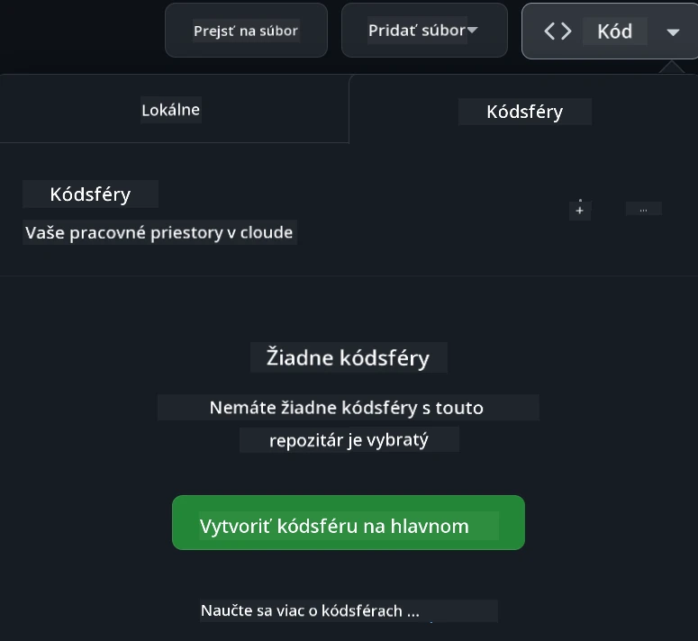

# Vývoj webu pre začiatočníkov - učebný plán

Naučte sa základy vývoja webu s naším komplexným 12-týždňovým kurzom od Microsoft Cloud Advocates. Každá zo 24 lekcií sa venuje JavaScriptu, CSS a HTML prostredníctvom praktických projektov ako teráriá, rozšírenia prehliadača a vesmírne hry. Zapojte sa do kvízov, diskusií a praktických úloh. Zlepšite svoje schopnosti a optimalizujte si osvojenie vedomostí efektívnou projektovo orientovanou pedagogikou. Začnite svoju programátorskú cestu ešte dnes!

Pridajte sa k Discordu Azure AI Foundry a stretnite sa s odborníkmi a ďalšími vývojármi.

Nasledujte tieto kroky, aby ste začali využívať tieto zdroje:
1. **Forknite si repozitár**: Kliknite na [](https://GitHub.com/microsoft/Web-Dev-For-Beginners/fork)
2. **Naklonujte si repozitár**: `git clone https://github.com/microsoft/Web-Dev-For-Beginners.git`
3. [**Pridajte sa k Discordu Azure AI Foundry a stretnite sa s odborníkmi a ďalšími vývojármi**](https://discord.com/invite/ByRwuEEgH4)

### 🌐 Podpora viacerých jazykov

#### Podporované cez GitHub Action (automatické a vždy aktuálne)

> **Preferujete klonovať lokálne?**
>
> Tento repozitár obsahuje viac ako 50 jazykových prekladov, čo výrazne zväčšuje veľkosť na stiahnutie. Ak chcete klonovať bez prekladov, použite sparse checkout:
>
> **Bash / macOS / Linux:**
> ```bash
> git clone --filter=blob:none --sparse https://github.com/microsoft/Web-Dev-For-Beginners.git
> cd Web-Dev-For-Beginners
> git sparse-checkout set --no-cone '/*' '!translations' '!translated_images'
> ```
>
> **CMD (Windows):**
> ```cmd
> git clone --filter=blob:none --sparse https://github.com/microsoft/Web-Dev-For-Beginners.git
> cd Web-Dev-For-Beginners
> git sparse-checkout set --no-cone "/*" "!translations" "!translated_images"
> ```
>
> Takto získate všetko potrebné na dokončenie kurzu oveľa rýchlejším stiahnutím.

**Ak chcete mať ďalšie preklady, podporované jazyky sú uvedené tu. [tu](https://github.com/Azure/co-op-translator/blob/main/getting_started/supported-languages.md)**

#### 🧑‍🎓 _Ste študent?_

Navštívte [**študentský portál**](https://docs.microsoft.com/learn/student-hub/?WT.mc_id=academic-77807-sagibbon), kde nájdete zdroje pre začiatočníkov, študentské balíčky a dokonca možnosti, ako získať poukaz na bezplatný certifikát. Túto stránku si odporúčame uložiť medzi obľúbené a občas skontrolovať, pretože mesačne aktualizujeme obsah.

### 📣 Oznámenie - Nové výzvy s režimom GitHub Copilot Agent!

Pridaná nová výzva, hľadajte "GitHub Copilot Agent Challenge 🚀" v niektorých kapitolách. Je to nová výzva, ktorú dokončíte pomocou GitHub Copilot a režimu Agent. Ak ste režim Agent ešte nepoužívali, dokáže nielen generovať text, ale aj vytvárať a upravovať súbory, spúšťať príkazy a viac.

### 📣 Oznámenie - _Nový projekt na tvorbu pomocou Generatívnej AI_

Pridaný nový projekt AI asistenta, pozrite si ho [projekt](./9-chat-project/README.md)

### 📣 Oznámenie - _Nový učebný plán_ o Generatívnej AI pre JavaScript práve vydaný

Nezmeškajte náš nový učebný plán Generatívnej AI!

Začnite na [https://aka.ms/genai-js-course](https://aka.ms/genai-js-course)!

- Lekcie pokrývajú všetko od základov po RAG.
- Interagujte s historickými postavami pomocou GenAI a našej sprievodnej aplikácie.
- Zábavný a pútavý príbeh, zažijete cestovanie časom!

Každá lekcia obsahuje úlohu na dokončenie, kontrolu vedomostí a výzvu, ktorá vás prevedie témami ako:
- Promptovanie a návrh promptov
- Generovanie textových a obrazových aplikácií
- Vyhľadávacie aplikácie

Začnite na [https://aka.ms/genai-js-course](https://aka.ms/genai-js-course)!

## 🌱 Začíname

> **Učitelia**, pripravili sme [niekoľko odporúčaní](for-teachers.md), ako tento učebný plán využiť. Radi uvítame vaše názory [v našom diskusnom fóre](https://github.com/microsoft/Web-Dev-For-Beginners/discussions/categories/teacher-corner)!

**[Študenti](https://aka.ms/student-page/?WT.mc_id=academic-77807-sagibbon)**, ku každej lekcii začnite prednáškovým kvízom, pokračujte čítaním materiálov, plnením rôznych aktivít a svoju znalosť si overte záverečným kvízom.

Pre lepší zážitok z učenia sa spojte so spolužiakmi a pracujte na projektoch spoločne! Diskusie sú vítané v našom [diskusnom fóre](https://github.com/microsoft/Web-Dev-For-Beginners/discussions), kde sú naši moderátori pripravení odpovedať na vaše otázky.

Pre ďalšie vzdelávanie odporúčame preskúmať [Microsoft Learn](https://learn.microsoft.com/users/wirelesslife/collections/p1ddcy5jwy0jkm?WT.mc_id=academic-77807-sagibbon) pre doplnkové študijné materiály.

### 📋 Nastavenie prostredia

Tento učebný plán je pripravený na spustenie vývojového prostredia! Na začiatku si môžete vybrať spustenie v [Codespace](https://github.com/features/codespaces/) (_prostredie v prehliadači bez nutnosti inštalácie_) alebo lokálne na počítači v textovom editore ako je [Visual Studio Code](https://code.visualstudio.com/?WT.mc_id=academic-77807-sagibbon).

#### Vytvorte si svoj repozitár

Pre jednoduché ukladanie práce je odporúčané vytvoriť si vlastnú kópiu tohto repozitára. Urobíte to kliknutím na tlačidlo **Use this template** v hornej časti stránky. Tým sa vám vytvorí nový repozitár vo vašom GitHub konte s kópiou učebného plánu.

Postupujte podľa týchto krokov:
1. **Forknite repozitár**: Kliknite na tlačidlo „Fork“ v pravom hornom rohu tejto stránky.
2. **Naklonujte repozitár**: `git clone https://github.com/microsoft/Web-Dev-For-Beginners.git`

#### Spustenie učebného plánu v Codespace

Vo svojej kópii repozitára kliknite na tlačidlo **Code** a vyberte **Open with Codespaces**. Tým sa vytvorí nový Codespace, v ktorom môžete pracovať.



#### Spustenie učebného plánu lokálne na vašom počítači

Na spustenie učebného plánu na počítači budete potrebovať textový editor, prehliadač a príkazový riadok. Naša prvá lekcia, [Úvod do programovacích jazykov a nástrojov remesla](../../1-getting-started-lessons/1-intro-to-programming-languages), vás prevedie rôznymi možnosťami pre tieto nástroje, aby ste si vybrali, čo vám najviac vyhovuje.

Odporúčame použiť [Visual Studio Code](https://code.visualstudio.com/?WT.mc_id=academic-77807-sagibbon) ako editor, ktorý obsahuje aj vstavaný [Terminál](https://code.visualstudio.com/docs/terminal/basics/?WT.mc_id=academic-77807-sagibbon). Visual Studio Code si môžete stiahnuť [tu](https://code.visualstudio.com/?WT.mc_id=academic-77807-sagibbon).
1. Klonujte si svoje úložisko do počítača. Môžete to urobiť kliknutím na tlačidlo **Code** a skopírovaním URL adresy:

    [CodeSpace](./images/createcodespace.png)

    Potom otvorte [Terminál](https://code.visualstudio.com/docs/terminal/basics/?WT.mc_id=academic-77807-sagibbon) v [Visual Studio Code](https://code.visualstudio.com/?WT.mc_id=academic-77807-sagibbon) a spustite nasledujúci príkaz, pričom `<your-repository-url>` nahradíte URL, ktorú ste práve skopírovali:

    ```bash 
    git clone <your-repository-url>
    ```

2. Otvorte priečinok vo Visual Studio Code. Môžete to urobiť kliknutím na **File** > **Open Folder** a výberom práve sklonovaného priečinka.


>  Odporúčané rozšírenia Visual Studio Code:
>
> * [Live Server](https://marketplace.visualstudio.com/items?itemName=ritwickdey.LiveServer&WT.mc_id=academic-77807-sagibbon) - na náhľad HTML stránok priamo vo Visual Studio Code
> * [Copilot](https://marketplace.visualstudio.com/items?itemName=GitHub.copilot&WT.mc_id=academic-77807-sagibbon) - na rýchlejšie písanie kódu

## 📂 Každá lekcia obsahuje:

- voliteľnú náčrtok (sketchnote)
- voliteľné doplnkové video
- rozcvičku pred lekciou (warmup quiz)
- písanú lekciu
- pre projektové lekcie podrobné návody krok za krokom, ako projekt vytvoriť
- kontrolu vedomostí
- výzvu
- doplnkové čítanie
- zadanie úlohy
- [test po lekcii](https://ff-quizzes.netlify.app/web/)

> **Poznámka k testom:** Všetky testy sa nachádzajú v priečinku Quiz-app, spolu 48 testov so štruktúrou troch otázok v každom. Sú dostupné [tu](https://ff-quizzes.netlify.app/web/), aplikáciu testu možno spustiť lokálne alebo nasadiť do Azure; postupujte podľa inštrukcií v priečinku `quiz-app`.

## 🗃️ Lekcie

|     |                       Názov projektu                      |                            Učené koncepty                             | Učebné ciele                                                                                                                     |                                                         Prepojená lekcia                                                          |         Autor          |
| :-: | :------------------------------------------------------: | :------------------------------------------------------------------: | -------------------------------------------------------------------------------------------------------------------------------- | :----------------------------------------------------------------------------------------------------------------------------: | :---------------------: |
| 01  |                     Začíname                              |           Úvod do programovania a nástroje remesla                  | Naučiť sa základné princípy väčšiny programovacích jazykov a softvér, ktorý pomáha profesionálnym vývojárom                      | [Úvod do programovacích jazykov a nástrojov](./1-getting-started-lessons/1-intro-to-programming-languages/README.md) |         Jasmine         |
| 02  |                     Začíname                              |             Základy GitHubu, vrátane práce v tíme                   | Ako používať GitHub v projekte a spolupracovať s ostatnými na kóde                                                               |                            [Úvod do GitHubu](./1-getting-started-lessons/2-github-basics/README.md)                             |          Floor          |
| 03  |                     Začíname                              |                             Prístupnosť                             | Naučiť sa základy prístupnosti webu                                                                                              |                       [Základy prístupnosti](./1-getting-started-lessons/3-accessibility/README.md)                       |       Christopher       |
| 04  |                        Základy JS                         |                         Typy údajov v JavaScripte                  | Základy typov údajov v JavaScripte                                                                                               |                                       [Typy údajov](./2-js-basics/1-data-types/README.md)                                        |         Jasmine         |
| 05  |                        Základy JS                         |                         Funkcie a metódy                           | Naučiť sa o funkciách a metódach na riadenie logiky aplikácie                                                                   |                              [Funkcie a metódy](./2-js-basics/2-functions-methods/README.md)                               | Jasmine a Christopher |
| 06  |                        Základy JS                         |                        Rozhodovanie v JS                            | Naučiť sa vytvárať podmienky v kóde pomocou metód rozhodovania                                                                   |                                 [Rozhodovanie](./2-js-basics/3-making-decisions/README.md)                                  |         Jasmine         |
| 07  |                        Základy JS                         |                            Polia a cykly                            | Pracovať s údajmi pomocou polí a cyklov v JavaScripte                                                                           |                                   [Polia a cykly](./2-js-basics/4-arrays-loops/README.md)                                    |         Jasmine         |
| 08  |       [Terárium](./3-terrarium/solution/README.md)       |                            HTML v praxi                            | Vytvoriť HTML pre online terárium so zameraním na tvorbu rozloženia                                                             |                                 [Úvod do HTML](./3-terrarium/1-intro-to-html/README.md)                                 |           Jen           |
| 09  |       [Terárium](./3-terrarium/solution/README.md)       |                            CSS v praxi                             | Vytvoriť CSS na štýlovanie online terária so zameraním na základy CSS vrátane responzívneho dizajnu                              |                                  [Úvod do CSS](./3-terrarium/2-intro-to-css/README.md)                                  |           Jen           |
| 10  |            [Terárium](./3-terrarium/solution/README.md)            |                 JavaScriptové uzávierky, manipulácia s DOM         | Vytvoriť JavaScript pre terárium, aby fungovalo ako drag/drop rozhranie, so zameraním na uzávierky a manipuláciu s DOM           |                  [JavaScriptové uzávierky a manipulácia s DOM](./3-terrarium/3-intro-to-DOM-and-closures/README.md)                   |           Jen           |
| 11  |          [Hra na písanie](./4-typing-game/solution/README.md)          |                          Vytváranie hry na písanie                  | Naučiť sa používať udalosti z klávesnice na riadenie logiky JavaScriptovej aplikácie                                              |                                [Programovanie na základe udalostí](./4-typing-game/typing-game/README.md)                                |       Christopher       |
| 12  | [Zelené rozšírenie prehliadača](./5-browser-extension/solution/README.md) |                         Práca s prehliadačmi                       | Naučiť sa, ako pracujú prehliadače, ich históriu, a ako vytvoriť prvé elementy rozšírenia prehliadača                            |                               [O prehliadačoch](./5-browser-extension/1-about-browsers/README.md)                                |           Jen           |
| 13  | [Zelené rozšírenie prehliadača](./5-browser-extension/solution/README.md) | Vytváranie formulára, volanie API a ukladanie premenných lokálne    | Vytvoriť JavaScriptové prvky rozšírenia prehliadača na volanie API pomocou premenných uložených v lokálnom úložisku             |                [API, formuláre a lokálne úložisko](./5-browser-extension/2-forms-browsers-local-storage/README.md)                 |           Jen           |
| 14  | [Zelené rozšírenie prehliadača](./5-browser-extension/solution/README.md) |          Pozadie procesov v prehliadači, výkon webu                 | Použiť pozadie procesov prehliadača na správu ikony rozšírenia; naučiť sa o výkone webu a optimalizáciách                        |             [Pozadie úloh a výkon](./5-browser-extension/3-background-tasks-and-performance/README.md)              |           Jen           |
| 15  |           [Hra vo vesmíre](./6-space-game/solution/README.md)           |             Pokročilejší vývoj hier s JavaScriptom                  | Naučiť sa o dedičnosti pomocou tried a kompozície a o vzore Pub/Sub, na prípravu tvorby hry                                      |                      [Úvod do pokročilého vývoja hier](./6-space-game/1-introduction/README.md)                       |          Chris          |
| 16  |           [Hra vo vesmíre](./6-space-game/solution/README.md)           |                           Kreslenie na plátno                       | Naučiť sa o API Canvas na kreslenie prvkov na obrazovku                                                                           |                                [Kreslenie na plátno](./6-space-game/2-drawing-to-canvas/README.md)                                |          Chris          |
| 17  |           [Hra vo vesmíre](./6-space-game/solution/README.md)           |                   Pohybovanie prvkov na obrazovke                   | Objaviť, ako môžu prvky získať pohyb pomocou kartézskych súradníc a Canvas API                                                   |                           [Pohybovanie prvkov](./6-space-game/3-moving-elements-around/README.md)                           |          Chris          |
| 18  |           [Hra vo vesmíre](./6-space-game/solution/README.md)           |                          Detekcia kolízie                           | Zabezpečiť kolízie a reakcie prvkov na seba navzájom pomocou stláčania kláves a poskytnúť cooldown funkciu pre zabezpečenie výkonu |                              [Detekcia kolízie](./6-space-game/4-collision-detection/README.md)                              |          Chris          |
| 19  |           [Hra vo vesmíre](./6-space-game/solution/README.md)           |                             Udržiavanie skóre                        | Vykonať matematické výpočty na základe stavu a výkonu hry                                                                        |                                    [Udržiavanie skóre](./6-space-game/5-keeping-score/README.md)                                    |          Chris          |
| 20  |           [Hra vo vesmíre](./6-space-game/solution/README.md)           |                     Ukončenie a restartovanie hry                    | Naučiť sa o ukončení a reštartovaní hry vrátane čistenia zdrojov a resetovania premenných                                         |                                [Ukončenie hry](./6-space-game/6-end-condition/README.md)                                 |          Chris          |
| 21  |         [Banková aplikácia](./7-bank-project/solution/README.md)          |                 HTML šablóny a trasy v webovej aplikácii            | Naučiť sa vytvárať skelet viacstránkovej webovej architektúry pomocou routingu a HTML šablón                                      |                            [HTML šablóny a trasy](./7-bank-project/1-template-route/README.md)                             |          Yohan          |
| 22  |         [Banková aplikácia](./7-bank-project/solution/README.md)          |                  Vytváranie prihlasovacieho a registračného formulára | Naučiť sa o tvorbe formulárov a spracovaní validačných rutin                                                                     |                                           [Formuláre](./7-bank-project/2-forms/README.md)                                           |          Yohan          |
| 23  |         [Banková aplikácia](./7-bank-project/solution/README.md)          |                   Spôsoby získavania a používania údajov            | Ako údaje prúdia dnu a von z aplikácie, ako ich načítať, uložiť a odstrániť                                                    |                                            [Údaje](./7-bank-project/3-data/README.md)                                            |          Yohan          |
| 24  |         [Banková aplikácia](./7-bank-project/solution/README.md)          |                      Koncepty správy stavu                          | Naučiť sa, ako vaša aplikácia uchováva stav a ako s ním programovo pracovať                                                     |                                [Správa stavu](./7-bank-project/4-state-management/README.md)                                |          Yohan          |
| 25 | [Browser/VScode kód](../../8-code-editor) | Práca s VScode | Naučiť sa používať kódový editor | [Použitie kódového editoru VScode](./8-code-editor/1-using-a-code-editor/README.md) | Chris |
| 26 | [AI asistenti](./9-chat-project/README.md) | Práca s AI | Naučiť sa vytvoriť vlastného AI asistenta | [Projekt AI asistenta](./9-chat-project/README.md) | Chris |

## 🏫 Pedagógia

Naše vzdelávacie programy sú navrhnuté s ohľadom na dva kľúčové pedagogické princípy:
* učenie založené na projektoch
* časté testy

Program vyučuje základy JavaScriptu, HTML a CSS, ako aj najnovšie nástroje a techniky, ktoré dnes používajú weboví vývojári. Študenti budú mať príležitosť získať praktické skúsenosti tvorbou hry na písanie, virtuálneho terária, ekologického rozšírenia prehliadača, hry v štýle Space Invaders a bankovej aplikácie pre firmy. Na konci série študenti získajú pevné základy webového vývoja.

> 🎓 Prvé lekcie v tomto kurze si môžete prejsť ako [Learn Path](https://docs.microsoft.com/learn/paths/web-development-101/?WT.mc_id=academic-77807-sagibbon) na Microsoft Learn!

Zabezpečením prepojenia obsahu s projektmi sa proces výučby stáva zábavnejší pre študentov a zvyšuje sa ich zapamätateľnosť. Tiež sme napísali niekoľko úvodných lekcií o základoch JavaScriptu na predstavenie konceptov, doplnených videom zo série "[Beginners Series to: JavaScript](https://channel9.msdn.com/Series/Beginners-Series-to-JavaScript/?WT.mc_id=academic-77807-sagibbon)", ktorej niektorí autori prispeli do tohto kurikula.

Okrem toho nízko náročný test pred triedou nastavuje študentom zámer učiť sa danú tému, zatiaľ čo druhý test po hodine zabezpečuje lepšie zapamätanie. Tento kurz bol navrhnutý tak, aby bol flexibilný a zábavný a možno ho absolvovať celý alebo po častiach. Projekty sa začínajú malé a postupne sa stávajú zložitejšími do konca 12-týždňového cyklu.

Hoci sme zámerne vynechali zavedenie JavaScriptových frameworkov, aby sme sa sústredili na základné zručnosti potrebné ako webový vývojár pred prijatím frameworku, dobrou ďalšou voľbou na dokončenie tohto kurikula je naučiť sa o Node.js prostredníctvom ďalšej zbierky videí: "[Beginner Series to: Node.js](https://channel9.msdn.com/Series/Beginners-Series-to-Nodejs/?WT.mc_id=academic-77807-sagibbon)".

> Navštívte naše pravidlá [Code of Conduct](CODE_OF_CONDUCT.md) a pokyny [Contributing](CONTRIBUTING.md). Tešíme sa na vaše konštruktívne názory!


## 🧭 Offline prístup

Túto dokumentáciu si môžete prezerať offline pomocou [Docsify](https://docsify.js.org/#/). Forknite si tento repozitár, [nainštalujte Docsify](https://docsify.js.org/#/quickstart) na vašom lokálnom počítači a potom v koreňovom priečinku repozitára zadajte príkaz `docsify serve`. Webová stránka bude sprístupnená na porte 3000 na vašom localhoste: `localhost:3000`.

## 📘 PDF
PDF so všetkými lekciami nájdete [tu](https://microsoft.github.io/Web-Dev-For-Beginners/pdf/readme.pdf).


## 🎒 Iné kurzy

Náš tím produkuje aj iné kurzy! Pozrite sa:

<!-- CO-OP TRANSLATOR OTHER COURSES START -->
### LangChain
[](https://aka.ms/langchain4j-for-beginners)
[](https://aka.ms/langchainjs-for-beginners?WT.mc_id=m365-94501-dwahlin)
[](https://github.com/microsoft/langchain-for-beginners?WT.mc_id=m365-94501-dwahlin)
---

### Azure / Edge / MCP / Agentov
[](https://github.com/microsoft/AZD-for-beginners?WT.mc_id=academic-105485-koreyst)
[](https://github.com/microsoft/edgeai-for-beginners?WT.mc_id=academic-105485-koreyst)
[](https://github.com/microsoft/mcp-for-beginners?WT.mc_id=academic-105485-koreyst)
[](https://github.com/microsoft/ai-agents-for-beginners?WT.mc_id=academic-105485-koreyst)

---
 
### Séria Generatívne AI
[](https://github.com/microsoft/generative-ai-for-beginners?WT.mc_id=academic-105485-koreyst)
[-9333EA?style=for-the-badge&labelColor=E5E7EB&color=9333EA)](https://github.com/microsoft/Generative-AI-for-beginners-dotnet?WT.mc_id=academic-105485-koreyst)
[-C084FC?style=for-the-badge&labelColor=E5E7EB&color=C084FC)](https://github.com/microsoft/generative-ai-for-beginners-java?WT.mc_id=academic-105485-koreyst)
[-E879F9?style=for-the-badge&labelColor=E5E7EB&color=E879F9)](https://github.com/microsoft/generative-ai-with-javascript?WT.mc_id=academic-105485-koreyst)

---
 
### Základné učenie
[](https://aka.ms/ml-beginners?WT.mc_id=academic-105485-koreyst)
[](https://aka.ms/datascience-beginners?WT.mc_id=academic-105485-koreyst)
[](https://aka.ms/ai-beginners?WT.mc_id=academic-105485-koreyst)
[](https://github.com/microsoft/Security-101?WT.mc_id=academic-96948-sayoung)
[](https://aka.ms/webdev-beginners?WT.mc_id=academic-105485-koreyst)
[](https://aka.ms/iot-beginners?WT.mc_id=academic-105485-koreyst)
[](https://github.com/microsoft/xr-development-for-beginners?WT.mc_id=academic-105485-koreyst)

---
 
### Séria Copilot
[](https://aka.ms/GitHubCopilotAI?WT.mc_id=academic-105485-koreyst)
[](https://github.com/microsoft/mastering-github-copilot-for-dotnet-csharp-developers?WT.mc_id=academic-105485-koreyst)
[](https://github.com/microsoft/CopilotAdventures?WT.mc_id=academic-105485-koreyst)
<!-- CO-OP TRANSLATOR OTHER COURSES END -->

## Získanie pomoci

Ak ste uviazli alebo máte otázky ohľadom tvorby AI aplikácií. Pridajte sa k ďalším študentom a skúseným vývojárom do diskusií o MCP. Je to podporná komunita, kde sú otázky vítané a vedomosti sa voľne zdieľajú.

[](https://discord.gg/nTYy5BXMWG)

Ak máte spätnú väzbu alebo chyby pri vývoji navštívte:

[](https://aka.ms/foundry/forum)

## Licencia

Tento repozitár je licencovaný pod licenciou MIT. Viac informácií nájdete v súbore [LICENSE](../../LICENSE).

---

<!-- CO-OP TRANSLATOR DISCLAIMER START -->
**Zrieknutie sa zodpovednosti**:  
Tento dokument bol preložený pomocou AI prekladateľskej služby [Co-op Translator](https://github.com/Azure/co-op-translator). Aj keď sa snažíme o presnosť, berte, prosím, na vedomie, že automatické preklady môžu obsahovať chyby alebo nepresnosti. Pôvodný dokument v jeho pôvodnom jazyku by mal byť považovaný za autoritatívny zdroj. Pre kritické informácie sa odporúča profesionálny ľudský preklad. Nie sme zodpovední za akékoľvek nedorozumenia alebo nesprávne výklady vyplývajúce z používania tohto prekladu.
<!-- CO-OP TRANSLATOR DISCLAIMER END -->