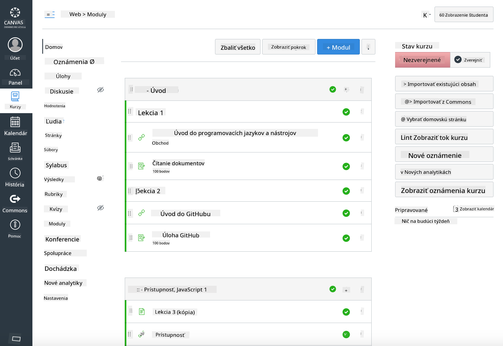

<!--
CO_OP_TRANSLATOR_METADATA:
{
  "original_hash": "71009af209f81cc01a1f2d324200375f",
  "translation_date": "2025-10-03T10:38:28+00:00",
  "source_file": "for-teachers.md",
  "language_code": "sk"
}
-->
### Pre pedagógov

Radi vás privítame, ak použijete tento učebný plán vo svojej triede. Funguje bez problémov s GitHub Classroom a poprednými platformami LMS, a môže byť použitý aj ako samostatné úložisko pre vašich študentov.

### Použitie s GitHub Classroom

Na správu lekcií a úloh pre jednotlivé skupiny vytvorte jedno úložisko na každú lekciu, aby GitHub Classroom mohol priradiť každú úlohu nezávisle.

- Forknite toto úložisko do svojej organizácie.
- Vytvorte samostatné úložisko pre každú lekciu extrahovaním každého priečinka lekcie do vlastného úložiska.
  - Možnosť A: Vytvorte prázdne úložiská (jedno na lekciu) a skopírujte obsah priečinka lekcie do každého.
  - Možnosť B: Použite prístup zachovávajúci históriu Git (napr. rozdelenie priečinka do nového úložiska), ak potrebujete zachovať pôvod.
- V GitHub Classroom vytvorte úlohu na každú lekciu a nasmerujte ju na príslušné úložisko lekcie.
- Odporúčané nastavenia:
  - Viditeľnosť úložiska: súkromné pre prácu študentov.
  - Použite štartovací kód z predvoleného branchu úložiska lekcie.
  - Pridajte šablóny pre problémy a pull requesty na kvízy a odovzdania.
  - Voliteľne nakonfigurujte automatické hodnotenie a testy, ak vaše lekcie obsahujú tieto prvky.
- Užitočné konvencie:
  - Názvy úložísk ako lesson-01-intro, lesson-02-html, atď.
  - Štítky: kvíz, úloha, potrebuje-revíziu, oneskorené, opätovné odovzdanie.
  - Tagy/verzie pre jednotlivé skupiny (napr. v2025-term1).

Tip: Vyhnite sa ukladaniu úložísk do synchronizovaných priečinkov (napr. OneDrive/Google Drive), aby ste predišli konfliktom Git na Windows.

### Použitie s Moodle, Canvas alebo Blackboard

Tento učebný plán obsahuje importovateľné balíky pre bežné pracovné postupy LMS.

- Moodle: Použite súbor na nahranie do Moodle [Moodle upload file](../../../../../../../teaching-files/webdev-moodle.mbz) na načítanie celého kurzu.
- Common Cartridge: Použite súbor Common Cartridge [Common Cartridge file](../../../../../../../teaching-files/webdev-common-cartridge.imscc) pre širšiu kompatibilitu LMS.
- Poznámky:
  - Moodle Cloud má obmedzenú podporu Common Cartridge. Uprednostnite vyššie uvedený súbor Moodle, ktorý je možné nahrať aj do Canvas.
  - Po importe skontrolujte moduly, termíny a nastavenia kvízov, aby zodpovedali vášmu rozvrhu.

> Učebný plán v Moodle triede

> Učebný plán v Canvas

### Použitie úložiska priamo (bez Classroom)

Ak preferujete nepoužívať GitHub Classroom, môžete kurz spustiť priamo z tohto úložiska.

- Synchronné/online formáty (Zoom/Teams):
  - Vykonajte krátke úvodné cvičenia vedené mentorom; použite breakout miestnosti na kvízy.
  - Oznámte časové okno na kvízy; študenti odovzdávajú odpovede ako GitHub Issues.
  - Pri spoluprácach na úlohách študenti pracujú vo verejných úložiskách lekcií a otvárajú pull requesty.
- Súkromné/asynchrónne formáty:
  - Študenti si forkne každú lekciu do svojich **súkromných** úložísk a pridajú vás ako spolupracovníka.
  - Odovzdávajú cez Issues (kvízy) a Pull Requesty (úlohy) na vašom úložisku triedy alebo ich súkromných forkoch.

### Najlepšie postupy

- Poskytnite orientačnú lekciu o základoch Git/GitHub, Issues a PRs.
- Používajte kontrolné zoznamy v Issues na viacstupňové kvízy/úlohy.
- Pridajte CONTRIBUTING.md a CODE_OF_CONDUCT.md na nastavenie noriem v triede.
- Pridajte poznámky o prístupnosti (alt text, titulky) a ponúknite tlačiteľné PDF.
- Verzionujte svoj obsah podľa termínu a zmrazte úložiská lekcií po publikovaní.

### Spätná väzba a podpora

Chceme, aby tento učebný plán fungoval pre vás a vašich študentov. Prosím, otvorte nový Issue v tomto úložisku pre chyby, požiadavky alebo vylepšenia, alebo začnite diskusiu v Teacher Corner.

---

**Upozornenie**:  
Tento dokument bol preložený pomocou služby AI prekladu [Co-op Translator](https://github.com/Azure/co-op-translator). Hoci sa snažíme o presnosť, upozorňujeme, že automatizované preklady môžu obsahovať chyby alebo nepresnosti. Pôvodný dokument v jeho rodnom jazyku by mal byť považovaný za autoritatívny zdroj. Pre kritické informácie sa odporúča profesionálny ľudský preklad. Nenesieme zodpovednosť za akékoľvek nedorozumenia alebo nesprávne interpretácie vyplývajúce z použitia tohto prekladu.