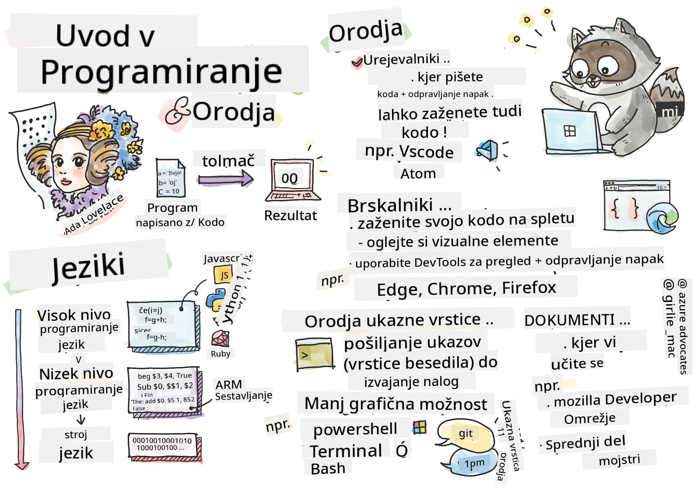

<!--
CO_OP_TRANSLATOR_METADATA:
{
  "original_hash": "2581528206a2a01c3a0b9c88e039b7bc",
  "translation_date": "2025-10-03T10:59:22+00:00",
  "source_file": "1-getting-started-lessons/1-intro-to-programming-languages/README.md",
  "language_code": "sl"
}
-->
# Uvod v programske jezike in orodja za razvijalce

Ta lekcija zajema osnove programskih jezikov. Teme, obravnavane tukaj, veljajo za večino sodobnih programskih jezikov. V razdelku 'Orodja za razvijalce' boste spoznali uporabno programsko opremo, ki vam pomaga kot razvijalcu.


> Sketchnote avtorja [Tomomi Imura](https://twitter.com/girlie_mac)

## Predhodni kviz
[Predhodni kviz](https://forms.office.com/r/dru4TE0U9n?origin=lprLink)

## Uvod

V tej lekciji bomo obravnavali:

- Kaj je programiranje?
- Vrste programskih jezikov
- Osnovni elementi programa
- Uporabna programska oprema in orodja za profesionalne razvijalce

> To lekcijo lahko opravite na [Microsoft Learn](https://docs.microsoft.com/learn/modules/web-development-101/introduction-programming/?WT.mc_id=academic-77807-sagibbon)!

## Kaj je programiranje?

Programiranje (znano tudi kot kodiranje) je proces pisanja navodil za napravo, kot je računalnik ali mobilna naprava. Ta navodila pišemo s programskim jezikom, ki ga nato naprava interpretira. Ta sklop navodil ima lahko različna imena, kot so *program*, *računalniški program*, *aplikacija (app)* in *izvedljiva datoteka*.

*Program* je lahko karkoli, kar je napisano s kodo; spletne strani, igre in aplikacije za telefone so programi. Čeprav je mogoče ustvariti program brez pisanja kode, je osnovna logika interpretirana s strani naprave, ta logika pa je bila najverjetneje napisana s kodo. Program, ki *deluje* ali *izvaja* kodo, izvaja navodila. Naprava, na kateri berete to lekcijo, izvaja program, da jo prikaže na vašem zaslonu.

✅ Raziskujte: kdo velja za prvega računalniškega programerja na svetu?

## Programski jeziki

Programski jeziki omogočajo razvijalcem pisanje navodil za napravo. Naprave razumejo le binarno kodo (1 in 0), kar za *večino* razvijalcev ni učinkovit način komunikacije. Programski jeziki so sredstvo komunikacije med ljudmi in računalniki.

Programski jeziki so na voljo v različnih formatih in lahko služijo različnim namenom. Na primer, JavaScript se primarno uporablja za spletne aplikacije, medtem ko se Bash uporablja predvsem za operacijske sisteme.

*Nizkonivojski jeziki* običajno zahtevajo manj korakov kot *visokonivojski jeziki*, da naprava interpretira navodila. Vendar pa so visokonivojski jeziki priljubljeni zaradi svoje berljivosti in podpore. JavaScript velja za visokonivojski jezik.

Naslednja koda prikazuje razliko med visokonivojskim jezikom (JavaScript) in nizkonivojskim jezikom (ARM assembly koda).

```javascript
let number = 10
let n1 = 0, n2 = 1, nextTerm;

for (let i = 1; i <= number; i++) {
    console.log(n1);
    nextTerm = n1 + n2;
    n1 = n2;
    n2 = nextTerm;
}
```

```c
 area ascen,code,readonly
 entry
 code32
 adr r0,thumb+1
 bx r0
 code16
thumb
 mov r0,#00
 sub r0,r0,#01
 mov r1,#01
 mov r4,#10
 ldr r2,=0x40000000
back add r0,r1
 str r0,[r2]
 add r2,#04
 mov r3,r0
 mov r0,r1
 mov r1,r3
 sub r4,#01
 cmp r4,#00
 bne back
 end
```

Verjeli ali ne, *obe kodi počneta isto*: izpisujeta Fibonacci zaporedje do 10.

✅ Fibonacci zaporedje je [definirano](https://en.wikipedia.org/wiki/Fibonacci_number) kot niz števil, kjer je vsako število vsota dveh predhodnih, začenši z 0 in 1. Prvih 10 števil v Fibonacci zaporedju je 0, 1, 1, 2, 3, 5, 8, 13, 21 in 34.

## Elementi programa

Posamezno navodilo v programu se imenuje *izjava* in običajno vsebuje znak ali presledek, ki označuje, kje se navodilo konča ali *zaključi*. Način zaključevanja programa se razlikuje glede na jezik.

Izjave v programu se lahko zanašajo na podatke, ki jih zagotovi uporabnik ali drug vir, da izvedejo navodila. Podatki lahko spremenijo vedenje programa, zato programski jeziki omogočajo začasno shranjevanje podatkov za kasnejšo uporabo. To se imenujejo *spremenljivke*. Spremenljivke so izjave, ki napravi naročijo, naj podatke shrani v svoj pomnilnik. Spremenljivke v programih so podobne spremenljivkam v algebri, kjer imajo edinstveno ime in se njihova vrednost lahko spreminja skozi čas.

Obstaja možnost, da nekatere izjave naprava ne bo izvedla. To je običajno načrtovano s strani razvijalca ali pa se zgodi po naključju, ko pride do nepričakovane napake. Ta vrsta nadzora nad aplikacijo jo naredi bolj robustno in vzdržljivo. Običajno se te spremembe v nadzoru zgodijo, ko so izpolnjeni določeni pogoji. Pogosta izjava, ki se uporablja v sodobnem programiranju za nadzor delovanja programa, je `if..else` izjava.

✅ Več o tej vrsti izjave boste izvedeli v naslednjih lekcijah.

## Orodja za razvijalce

[](https://youtube.com/watch?v=69WJeXGBdxg "Orodja za razvijalce")

> 🎥 Kliknite zgornjo sliko za video o orodjih

V tem razdelku boste spoznali nekaj programske opreme, ki jo boste morda našli zelo uporabno, ko začnete svojo profesionalno pot kot razvijalec.

**Razvojno okolje** je edinstven nabor orodij in funkcij, ki jih razvijalec pogosto uporablja pri pisanju programske opreme. Nekatera od teh orodij so prilagojena specifičnim potrebam razvijalca in se lahko sčasoma spremenijo, če razvijalec spremeni prioritete pri delu, osebnih projektih ali ko uporablja drug programski jezik. Razvojna okolja so tako edinstvena kot razvijalci, ki jih uporabljajo.

### Urejevalniki

Eden najpomembnejših orodij za razvoj programske opreme je urejevalnik. Urejevalniki so mesta, kjer pišete svojo kodo in včasih tudi izvajate svojo kodo.

Razvijalci se zanašajo na urejevalnike iz več razlogov:

- *Odpravljanje napak* pomaga odkriti hrošče in napake z analizo kode, vrstico za vrstico. Nekateri urejevalniki imajo zmožnosti odpravljanja napak; te funkcije je mogoče prilagoditi in dodati za specifične programske jezike.
- *Označevanje sintakse* dodaja barve in oblikovanje besedila v kodo, kar jo naredi bolj berljivo. Večina urejevalnikov omogoča prilagoditev označevanja sintakse.
- *Razširitve in integracije* so specializirana orodja za razvijalce, ki jih razvijalci ustvarijo. Ta orodja niso vgrajena v osnovni urejevalnik. Na primer, mnogi razvijalci dokumentirajo svojo kodo, da pojasnijo, kako deluje. Morda namestijo razširitev za preverjanje črkovanja, da pomagajo najti tipkarske napake v dokumentaciji. Večina razširitev je namenjena uporabi znotraj specifičnega urejevalnika, večina urejevalnikov pa omogoča iskanje razpoložljivih razširitev.
- *Prilagoditev* omogoča razvijalcem ustvarjanje edinstvenega razvojnega okolja, ki ustreza njihovim potrebam. Večina urejevalnikov je izjemno prilagodljiva in omogoča tudi razvijalcem ustvarjanje lastnih razširitev.

#### Priljubljeni urejevalniki in razširitve za spletni razvoj

- [Visual Studio Code](https://code.visualstudio.com/?WT.mc_id=academic-77807-sagibbon)
  - [Code Spell Checker](https://marketplace.visualstudio.com/items?itemName=streetsidesoftware.code-spell-checker)
  - [Live Share](https://marketplace.visualstudio.com/items?itemName=MS-vsliveshare.vsliveshare)
  - [Prettier - Code formatter](https://marketplace.visualstudio.com/items?itemName=esbenp.prettier-vscode)
- [Atom](https://atom.io/)
  - [spell-check](https://atom.io/packages/spell-check)
  - [teletype](https://atom.io/packages/teletype)
  - [atom-beautify](https://atom.io/packages/atom-beautify)
  
- [Sublimetext](https://www.sublimetext.com/)
  - [emmet](https://emmet.io/)
  - [SublimeLinter](http://www.sublimelinter.com/en/stable/)

### Brskalniki

Drugo ključno orodje je brskalnik. Spletni razvijalci se zanašajo na brskalnik, da vidijo, kako njihova koda deluje na spletu. Uporablja se tudi za prikaz vizualnih elementov spletne strani, ki so napisani v urejevalniku, kot je HTML.

Mnogi brskalniki imajo *orodja za razvijalce* (DevTools), ki vsebujejo nabor uporabnih funkcij in informacij, ki pomagajo razvijalcem zbirati in zajemati pomembne informacije o njihovi aplikaciji. Na primer: Če ima spletna stran napake, je včasih koristno vedeti, kdaj so se pojavile. DevTools v brskalniku je mogoče konfigurirati za zajemanje teh informacij.

#### Priljubljeni brskalniki in DevTools

- [Edge](https://docs.microsoft.com/microsoft-edge/devtools-guide-chromium/?WT.mc_id=academic-77807-sagibbon)
- [Chrome](https://developers.google.com/web/tools/chrome-devtools/)
- [Firefox](https://developer.mozilla.org/docs/Tools)

### Orodja ukazne vrstice

Nekateri razvijalci imajo raje manj grafični pogled za svoje vsakodnevne naloge in se zanašajo na ukazno vrstico, da to dosežejo. Pisanje kode zahteva veliko tipkanja, nekateri razvijalci pa raje ne prekinjajo svojega toka na tipkovnici. Uporabljajo bližnjice na tipkovnici za preklapljanje med okni na namizju, delo na različnih datotekah in uporabo orodij. Večino nalog je mogoče opraviti z miško, vendar je ena od prednosti uporabe ukazne vrstice ta, da je mogoče veliko opraviti z orodji ukazne vrstice, ne da bi bilo treba preklapljati med miško in tipkovnico. Druga prednost ukazne vrstice je, da so konfigurabilne, kar omogoča shranjevanje prilagojene konfiguracije, njeno kasnejšo spremembo in uvoz na druge razvojne računalnike. Ker so razvojna okolja tako edinstvena za vsakega razvijalca, nekateri ne uporabljajo ukazne vrstice, nekateri se nanjo popolnoma zanašajo, nekateri pa imajo raje kombinacijo obojega.

### Priljubljene možnosti ukazne vrstice

Možnosti ukazne vrstice se razlikujejo glede na operacijski sistem, ki ga uporabljate.

*💻 = prednameščeno v operacijskem sistemu.*

#### Windows

- [Powershell](https://docs.microsoft.com/powershell/scripting/overview?view=powershell-7/?WT.mc_id=academic-77807-sagibbon) 💻
- [Command Line](https://docs.microsoft.com/windows-server/administration/windows-commands/windows-commands/?WT.mc_id=academic-77807-sagibbon) (znan tudi kot CMD) 💻
- [Windows Terminal](https://docs.microsoft.com/windows/terminal/?WT.mc_id=academic-77807-sagibbon)
- [mintty](https://mintty.github.io/)
  
#### MacOS

- [Terminal](https://support.apple.com/guide/terminal/open-or-quit-terminal-apd5265185d-f365-44cb-8b09-71a064a42125/mac) 💻
- [iTerm](https://iterm2.com/)
- [Powershell](https://docs.microsoft.com/powershell/scripting/install/installing-powershell-core-on-macos?view=powershell-7/?WT.mc_id=academic-77807-sagibbon)

#### Linux

- [Bash](https://www.gnu.org/software/bash/manual/html_node/index.html) 💻
- [KDE Konsole](https://docs.kde.org/trunk5/en/konsole/konsole/index.html)
- [Powershell](https://docs.microsoft.com/powershell/scripting/install/installing-powershell-core-on-linux?view=powershell-7/?WT.mc_id=academic-77807-sagibbon)

#### Priljubljena orodja ukazne vrstice

- [Git](https://git-scm.com/) (💻 na večini operacijskih sistemov)
- [NPM](https://www.npmjs.com/)
- [Yarn](https://classic.yarnpkg.com/en/docs/cli/)

### Dokumentacija

Ko želi razvijalec izvedeti nekaj novega, se najverjetneje obrne na dokumentacijo, da se nauči, kako to uporabljati. Razvijalci se pogosto zanašajo na dokumentacijo, da jih vodi skozi pravilno uporabo orodij in jezikov ter da pridobijo globlje razumevanje, kako delujejo.

#### Priljubljena dokumentacija o spletnem razvoju

- [Mozilla Developer Network (MDN)](https://developer.mozilla.org/docs/Web), od Mozille, založnika brskalnika [Firefox](https://www.mozilla.org/firefox/)
- [Frontend Masters](https://frontendmasters.com/learn/)
- [Web.dev](https://web.dev), od Googla, založnika brskalnika [Chrome](https://www.google.com/chrome/)
- [Microsoftova dokumentacija za razvijalce](https://docs.microsoft.com/microsoft-edge/#microsoft-edge-for-developers), za [Microsoft Edge](https://www.microsoft.com/edge)
- [W3 Schools](https://www.w3schools.com/where_to_start.asp)

✅ Raziskujte: Zdaj, ko poznate osnove okolja spletnega razvijalca, primerjajte in kontrastirajte z okoljem spletnega oblikovalca.

---

## 🚀 Izziv

Primerjajte nekaj programskih jezikov. Katere so nekatere edinstvene značilnosti JavaScripta v primerjavi z Javo? Kaj pa COBOL v primerjavi z Go?

## Kviz po predavanju
[Kviz po predavanju](https://ff-quizzes.netlify.app/web/)

## Pregled in samostojno učenje

Preučite različne jezike, ki so na voljo programerju. Poskusite napisati vrstico v enem jeziku in jo nato prepisati v dveh drugih. Kaj ste se naučili?

## Naloga

[Branje dokumentacije](assignment.md)

> Opomba: Pri izbiri orodij za nalogo ne izbirajte urejevalnikov, brskalnikov ali orodij ukazne vrstice, ki so že navedeni zgoraj.

---

**Omejitev odgovornosti**:  
Ta dokument je bil preveden z uporabo storitve AI za prevajanje [Co-op Translator](https://github.com/Azure/co-op-translator). Čeprav si prizadevamo za natančnost, vas prosimo, da upoštevate, da lahko avtomatizirani prevodi vsebujejo napake ali netočnosti. Izvirni dokument v njegovem izvirnem jeziku je treba obravnavati kot avtoritativni vir. Za ključne informacije priporočamo profesionalni človeški prevod. Ne prevzemamo odgovornosti za morebitna nesporazumevanja ali napačne razlage, ki izhajajo iz uporabe tega prevoda.