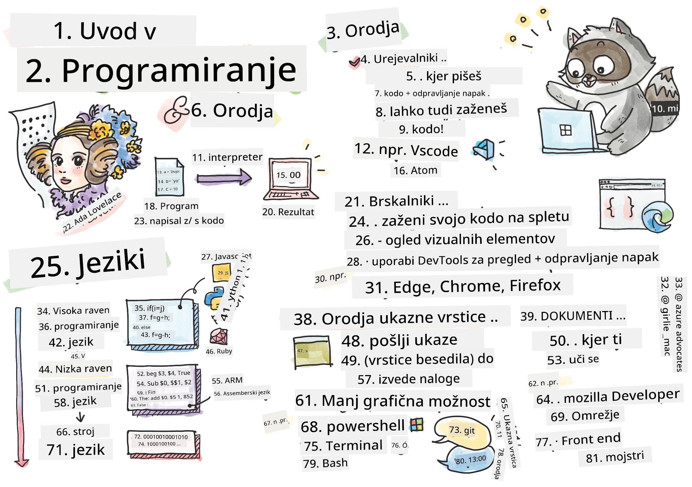
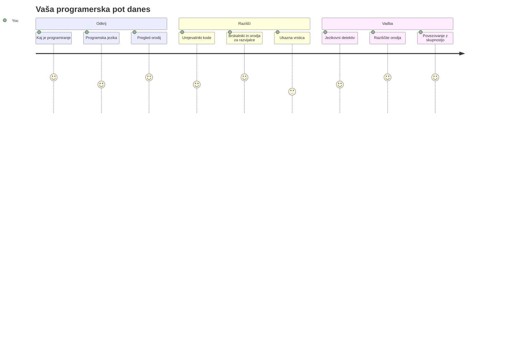
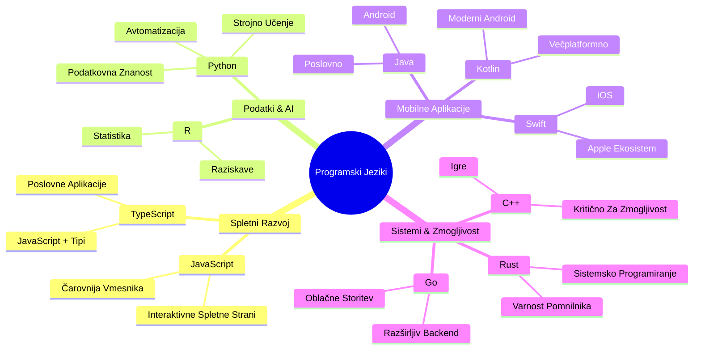
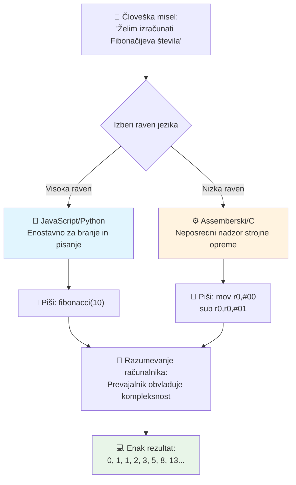
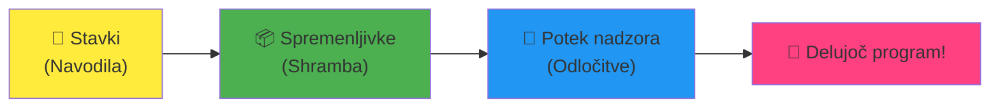
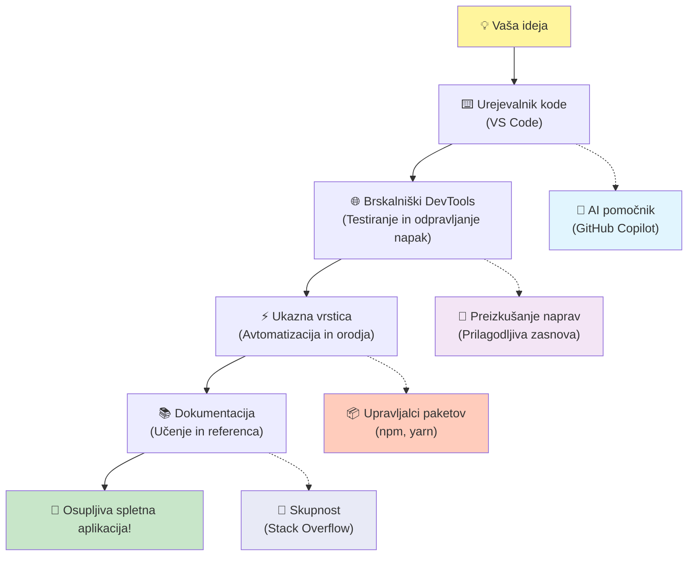
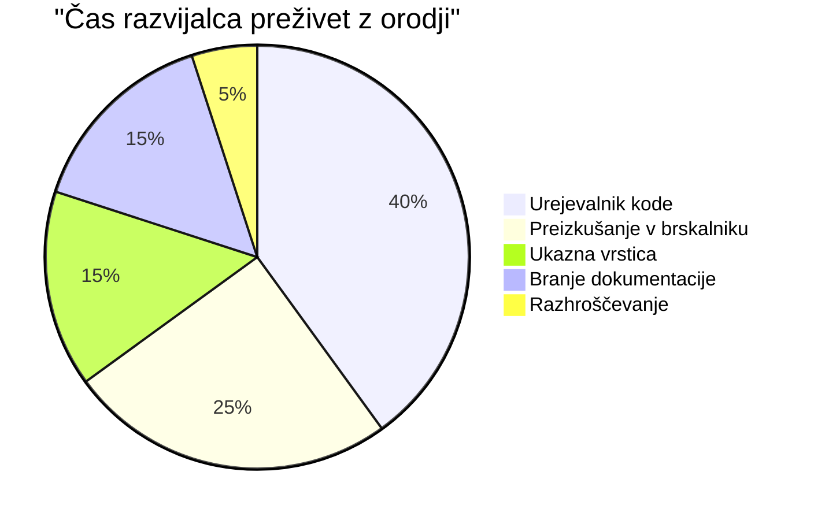
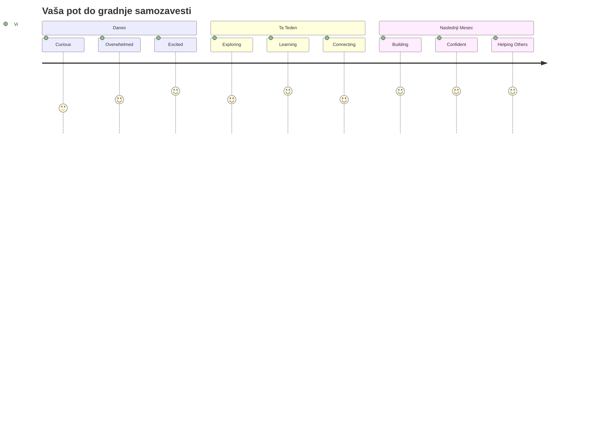

# Uvod v programske jezike in sodobna razvojna orodja

Živjo, bodoči razvijalec! 👋 Lahko ti povem nekaj, kar mi še vsak dan povzroči mravljince? Pravkar boš odkril, da programiranje ni samo za računalnike – gre za resnične supermoč, da svoje najbolj divje ideje oživiš!

Poznaš tisti trenutek, ko uporabljaš svojo najljubšo aplikacijo in vse preprosto popolno steče? Ko pritisneš gumb in se zgodi nekaj prav magičnega, da rečeš "vau, kako so TO naredili?" No, nekdo prav tak kot ti – verjetno sedi v svoji najljubši kavarni ob 2. zjutraj s tretjo espressom – je napisal kodo, ki je ustvarila to magijo. In tukaj boš ostal brez besed: do konca te lekcije ne boš le razumel, kako so to naredili, ampak boš komaj čakal, da to tudi sam preizkusiš!

Poglej, popolnoma razumem, če se ti programiranje zdaj zdi strašljivo. Ko sem začel, sem iskreno mislil, da moraš biti nekakšen matematični genij ali programirati od petega leta starosti. Toda to, kar je popolnoma spremenilo moj pogled: programiranje je pravzaprav kot učenje pogovorov v novem jeziku. Začneš z "zdravo" in "hvala", nato naročaš kavo, in preden se zavedaš, vodiš globoke filozofske pogovore! Le da v tem primeru vodiš pogovore z računalniki, in iskreno? So najnežnejši sogovorniki, kar jih boš kadarkoli imel – nikoli ne obsojajo tvojih napak in vedno so navdušeni, da poskusiš znova!

Danes bomo raziskali neverjetna orodja, zaradi katerih sodobni spletni razvoj ni le mogoč, ampak tudi resnično zasvojen. Govorim o točno teh urejevalnikih, brskalnikih in potekih dela, ki jih razvijalci pri Netflixu, Spotifyju in tvoji najljubši indie aplikacijski študiii uporabljajo vsak dan. In tukaj je del, ki te bo spravil v veselo plesanje: večina teh profesionalnih, industrijsko standardnih orodij je popolnoma brezplačnih!


> Sketchnote avtorja [Tomomi Imura](https://twitter.com/girlie_mac)


## Poglejmo, kaj že veš!

Preden skočimo v zabavne stvari, me zanima – kaj že veš o tem programerskem svetu? In poslušaj, če gledaš ta vprašanja in misliš "nimam prav nič pojma o tem," ni samo v redu, je popolno! To pomeni, da si prišel točno tja, kamor moraš. Ta kviz si predstavljaj kot raztezanje pred vadbo – pravkar ogrevamo možganske mišice!

[Reši kviz pred lekcijo](https://forms.office.com/r/dru4TE0U9n?origin=lprLink)


## Pustolovščina, na katero se bomo skupaj podali

V redu, resnično komaj čakam, da raziskujemo danes! Iskreno, rad bi videl tvoj obraz, ko ti bodo nekateri koncepti kliknili. Tukaj je neverjetno potovanje, na katerega se podajamo skupaj:

- **Kaj programiranje pravzaprav je (in zakaj je najbolj kul stvar ever!)** – Odkrijemo, kako je koda dobesedno nevidna magija, ki poganja vse okoli tebe, od tistega alarma, ki nekako ve, da je ponedeljek zjutraj, do algoritma, ki popolnoma izbere tvoje Netflix priporočila
- **Programski jeziki in njihove osupljive osebnosti** – Predstavljaj si, da prideš na zabavo, kjer ima vsak povsem različne supermoči in načine reševanja problemov. Tako je s svetom programskih jezikov in zaljubil se boš v njihovo spoznavanje!
- **Temeljni gradniki, ki ustvarjajo digitalno magijo** – Predstavljaj si jih kot ultimativni ustvarjalni LEGO komplet. Ko razumeš, kako se ti kosi povezujejo, boš spoznal, da lahko dobesedno zgradiš karkoli, kar tvoja domišljija sanja
- **Profesionalna orodja, zaradi katerih se boš počutil, kot da si pravkar dobil čarobno paličico** – Ne dramatiziram – ta orodja te bodo zares naredila, da se počutiš kot, da imaš supermoči, in najboljši del? To so ista orodja, ki jih uporabljajo profesionalci!

> 💡 **Tukaj je stvar**: Danes sploh ne razmišljaj o memoriziranju vsega! Trenutno želim samo, da začutiš tisto iskrico navdušenja glede vsega možnega. Podrobnosti se bodo naravno sprijele, ko bomo vadi skupaj – tako se zgodi pravo učenje!

> To lekcijo lahko opraviš na [Microsoft Learn](https://docs.microsoft.com/learn/modules/web-development-101/introduction-programming/?WT.mc_id=academic-77807-sagibbon)!

## Kaj pravzaprav *je* programiranje?

V redu, lotimo se milijonskega vprašanja: kaj je programiranje, resnično?

Povedal ti bom zgodbo, ki je popolnoma spremenila, kako razmišljam o tem. Prejšnji teden sem poskušal mami razložiti, kako uporabiti naš nov daljinski upravljalnik za pametni TV. Ujel sem se, da govorim stvari kot "Pritisni rdeči gumb, ampak ne velikega rdečega gumba, majhnega rdečega gumba na levi... ne, tvoje drugi levi... v redu, zdaj drži dve sekundi, ne eno, ne tri..." Zveni znano? 😅

To je programiranje! Je umetnost dajanja neverjetno podrobnih navodil po korakih nečemu, kar je zelo močno, a mora imeti vse natančno povedano. Razlika je, da ne razlagaš mami (ki lahko vpraša "kateri rdeči gumb?!"), ampak razlagaš računalniku (ki počne natanko to, kar rečeš, tudi če to, kar si rekel, ni čisto to, kar si mislil).

Tukaj je nekaj, kar me je osupnilo, ko sem to prvič izvedel: računalniki so v bistvu precej preprosti v svoji srži. Razumejo le dve stvari – 1 in 0, kar je v bistvu samo "da" in "ne" oz. "vklopljeno" in "izklopljeno". To je vse! A tukaj postane magično – ne moramo govoriti v 1 in 0, kot da smo v Matrici. Tu pridejo na pomoč **programski jeziki**. So kot najboljši prevajalec na svetu, ki vzame tvoje povsem običajne človeške misli in jih pretvori v računalniški jezik.

In tukaj je nekaj, kar mi še vedno povzroči mravljince vsako jutro, ko se zbudim: dobesedno *vse* digitalno v tvojem življenju se je začelo z nekom, prav takšnim kot ti, verjetno v pižami s skodelico kave, ki je tipkal kodo na prenosniku. Ta Instagram filter, ki te naredi brezhibnega? Nekdo ga je skriptal. Priporočilo, ki te je pripeljalo do nove najljubše pesmi? Razvijalec je zgradil ta algoritem. Aplikacija, ki ti pomaga deliti račune za večerjo s prijatelji? Ja, nekdo si je rekel "to je nadležno, prepričan sem, da lahko popravim to" in potem... je to naredil!

Ko se naučiš programirati, ne pridobivaš samo nove veščine – postaneš del te neverjetne skupnosti reševalcev problemov, ki preživijo dneve razmišljajoč: "Kaj če bi lahko zgradil nekaj, kar nekomu malo izboljša dan?" Resno, ali je kaj bolj kul od tega?

✅ **Zabavno dejstvo:** Tukaj je nekaj super kul, kar lahko pogledaš, ko boš imel trenutek – kdo misliš, da je bil prvi računalniški programer na svetu? Daj ti namig: morda ni to, kar pričakuješ! Zgodba o tej osebi je izjemno fascinantna in pokaže, da je programiranje vedno bilo o ustvarjalnem reševanju problemov in razmišljanju zunaj okvirjev.

### 🧠 **Čas za preverjanje: Kako se počutiš?**

**Vzemi trenutek za razmislek:**
- Ali ti zdaj ideja "dati navodila računalnikom" omogoča smisel?
- Se lahko spomniš vsakodnevne naloge, ki bi jo rad avtomatiziral s programiranjem?
- Katere vprašanja se ti vrtijo po glavi glede celotne te stvari s programiranjem?

> **Zapomni si**: popolnoma normalno je, če so nekateri koncepti zdaj zamegljeni. Učenje programiranja je kot učenje novega jezika – potrebuje čas, da tvoj možgani vzpostavijo te nevronske povezave. Odlično delaš!

## Programske jezike lahko primerjamo z različnimi okusi magije

V redu, to bo zvenelo čudno, a vztrajaj – programski jeziki so zelo podobni različnim zvrstem glasbe. Pomisli: imaš jazz, ki je gladek in improvizacijski, rock, ki je močan in neposreden, klasiko, ki je eleganten in strukturiran, in hip-hop, ki je ustvarjalen in izrazen. Vsak slog ima svoj vibe, svojo skupnost strastnih oboževalcev in vsak je popoln za različna razpoloženja in priložnosti.

Programski jeziki delujejo povsem enako! Ne bi uporabil istega jezika za izdelavo zabavne mobilne igre, kot bi ga za obdelavo ogromnih količin klimatskih podatkov, tako kot ne bi igral death metal na jogo (no, vsaj v večini joga urnikov ne! 😄).

Ampak to, kar me vedno preseneča: ti jeziki so kot najbolj potrpežljiv, briljanten tolmač na svetu, ki sedi poleg tebe. Izraziš svoje ideje na način, ki je tvojemu človeškemu umu povsem naraven, oni pa opravijo vso izjemno kompleksno delo pretvorbe tega v 1 in 0, ki jih računalnik dejansko govori. Je kot prijatelj, ki je popolnoma tekoč v obeh: "človeška ustvarjalnost" in "računalniška logika" – pa se nikoli ne utrudi, ne potrebuje kavnih odmorov in te nikoli ne obsoja, če vprašaš isto vprašanje dvakrat!

### Priljubljeni programski jeziki in njihove uporabe


| Jezik | Najbolj za | Zakaj je priljubljen |
|----------|----------|------------------|
| **JavaScript** | Spletni razvoj, uporabniški vmesniki | Teče v brskalnikih in poganja interaktivne spletne strani |
| **Python** | Znanost podatkov, avtomatizacija, AI | Enostaven za branje in učenje, zmogljive knjižnice |
| **Java** | Poslovne aplikacije, Android aplikacije | Neodvisen od platforme, robusten za velike sisteme |
| **C#** | Windows aplikacije, razvoj iger | Močna Microsoftova ekosistem podpora |
| **Go** | Oblak storitve, backend sistemi | Hiter, preprost, zasnovan za sodobno računalništvo |

### Jeziki višje ravni proti nižji ravni

V redu, to je bil iskreno koncept, ki mi je prvič zmešal možgane, zato bom delil analogijo, ki mi je končno odprla oči – in res upam, da pomaga tudi tebi!

Predstavljaj si, da si obiskoval država, kjer ne znaš jezika in obupno potrebuješ najbližjo stranišče (vsi smo že bili tam, kajne? 😅):

- **Programiranje na nizki ravni** je kot učenje lokalnega narečja tako dobro, da lahko klepetaš s staro mamo, ki na vogalu prodaja sadje, uporabiš kulturne reference, domače besede in notranje šale, ki jih razume samo nekdo, ki je tam odraščal. Super impresivno in zelo učinkovito... če si slučajno tekoč! A precej zmedeno, če le iščeš stranišče.

- **Programiranje na visoki ravni** je kot imeti odličnega lokalnega prijatelja, ki te povsem razume. Lahko rečeš "Res nujno rabim stranišče" v običajni angleščini, on pa poskrbi za vso kulturno prevajanje in ti da napotke, ki popolnoma ustrezajo tvojemu nemestnemu umu.

V programerskih izrazih:
- **Jeziki nizke ravni** (kot Assembly ali C) ti dovoljujejo izjemno podrobne pogovore z dejansko strojno opremo računalnika, vendar moraš razmišljati kot stroj, kar je... no, rekel bom, da je prava velika sprememba načina razmišljanja!
- **Jeziki visoke ravni** (kot JavaScript, Python ali C#) ti dovoljujejo razmišljati kot človek, medtem ko oni skrbijo za ves računalniški žargon v ozadju. Poleg tega imajo zelo prijazne skupnosti, polne ljudi, ki si zapomnijo, kako je bilo biti nov, in resnično želijo pomagati!

Uganil boš, katere ti bom predlagal za začetek? 😉 Jeziki visoke ravni so kot pomožne kolesce, ki jih nikoli ne želiš sneti, ker naredijo celotno izkušnjo tako veliko bolj prijetno!


### Naj ti pokažem, zakaj so jeziki visoke ravni toliko bolj prijazni

V redu, pokazal ti bom nekaj, kar popolnoma razloži, zakaj sem se zaljubil v jezike visoke ravni, a najprej – obljubi mi nekaj. Ko boš videl prvi primer kode, ne paničari! Namenjeno je, da izgleda zastrašujoče. Točno to hočem povedati!

Pogledali bomo isto nalogo, napisano v dveh popolnoma različnih stilih. Oba ustvarjata t.i. Fibonacci zaporedje – to je ta čudoviti matematični vzorec, kjer je vsak naslednji člen vsota dveh prejšnjih: 0, 1, 1, 2, 3, 5, 8, 13 ... (zabavno dejstvo: ta vzorec najdeš povsod v naravi – spirale sončničnih semen, vzorce storžev, celo oblikovanje galaksij!)

Pripravljen za razliko? Gremo!

**Jezik visoke ravni (JavaScript) – Prijazen do ljudi:**

```javascript
// 1. korak: Osnovna nastavitev Fibonaccija
const fibonacciCount = 10;
let current = 0;
let next = 1;

console.log('Fibonacci sequence:');
```

**To koda naredi:**
- **Definira** konstanto za določitev, koliko Fibonacci števil želimo generirati
- **Inicializira** dve spremenljivki za sledenje trenutnim in naslednjim številom v zaporedju
- **Nastavi** začetne vrednosti (0 in 1), ki določata Fibonacci vzorec
- **Prikaže** glavno sporočilo za identifikacijo izhoda

```javascript
// Korak 2: Ustvari zaporedje s pomočjo zanke
for (let i = 0; i < fibonacciCount; i++) {
  console.log(`Position ${i + 1}: ${current}`);
  
  // Izračunaj naslednjo številko v zaporedju
  const sum = current + next;
  current = next;
  next = sum;
}
```

**Razčlenitev dogajanja tukaj:**
- **Zanka** za vsak položaj v zaporedju s pomočjo `for` zanke
- **Prikaže** vsak člen z njegovo pozicijo z uporabo oblikovanja predloge niza
- **Izračuna** naslednje Fibonacci število z dodajanjem trenutne in naslednje vrednosti
- **Posodobi** spremenljivke za sledenje, da se premaknemo na naslednji korak

```javascript
// Korak 3: Sodobni funkcionalni pristop
const generateFibonacci = (count) => {
  const sequence = [0, 1];
  
  for (let i = 2; i < count; i++) {
    sequence[i] = sequence[i - 1] + sequence[i - 2];
  }
  
  return sequence;
};

// Primer uporabe
const fibSequence = generateFibonacci(10);
console.log(fibSequence);
```

**V zgornjem smo:**
- **Ustvarili** ponovno uporabno funkcijo z uporabo moderne sintakse puščice
- **Zgradili** polje za shranjevanje celotnega zaporedja namesto prikazovanja po posameznih členih
- **Uporabili** indeksiranje polja za izračunavanje vsakega novega člena iz prejšnjih vrednosti
- **Vrnil** celotno zaporedje za prilagodljivo uporabo v drugih delih programa

**Jezik nizke ravni (ARM Assembly) – Prijazen do računalnika:**

```assembly
 area ascen,code,readonly
 entry
 code32
 adr r0,thumb+1
 bx r0
 code16
thumb
 mov r0,#00
 sub r0,r0,#01
 mov r1,#01
 mov r4,#10
 ldr r2,=0x40000000
back add r0,r1
 str r0,[r2]
 add r2,#04
 mov r3,r0
 mov r0,r1
 mov r1,r3
 sub r4,#01
 cmp r4,#00
 bne back
 end
```

Opazi, kako verzija JavaScript bere skoraj kot angleška navodila, medtem ko verzija Assembly uporablja skrivnostne ukaze, ki neposredno nadzorujejo procesor računalnika. Oba opravita enako nalogo, a je jezik visoke ravni veliko lažji za ljudi za razumevanje, pisanje in vzdrževanje.

**Ključne razlike, ki jih boš opazil:**
- **Berljivost**: JavaScript uporablja opisna imena kot `fibonacciCount`, medtem ko Assembly uporablja skrivnostne oznake kot `r0`, `r1`
- **Komentarji**: Visokonivojski jeziki spodbujajo pojasnjevalne komentarje, ki naredijo kodo samodokumentirajočo
- **Struktura**: Logični tok JavaScripta sovpada s tem, kako ljudje razmišljajo o problemih korak za korakom
- **Vzdrževanje**: Posodabljanje JavaScript različice za različne zahteve je preprosto in jasno

✅ **O zaporedju Fibonaccijevih števil**: Ta popolnoma čudovit vzorec števil (kjer je vsako število vsota dveh predhodnih: 0, 1, 1, 2, 3, 5, 8...) se doslovno pojavlja *povsod* v naravi! Najdete ga v spiralah sončnic, vzorcih storžev, načinu zvijanja školjk nautilus in celo v rasti vej dreves. Res je osupljivo, kako nam matematika in koda pomagata razumeti in ustvarjati vzorce, ki jih narava uporablja za ustvarjanje lepote!


## Gradniki, ki ustvarjajo čarovnijo

Prav, zdaj ko ste videli, kako programski jeziki izgledajo v akciji, razčlenimo temeljne dele, ki sestavljajo doslovno vsak program, kar je bil kdaj napisan. Predstavljajte si jih kot bistvene sestavine v vaši najljubši jedi – ko boste razumeli, kaj vsaka po vrsti počne, boste znali brati in pisati kodo v skoraj vsakem jeziku!

To je nekako kot učenje slovnice programiranja. Se spomnite šolskih dni, ko ste se učili o samostalnikih, glagolih in kako sestaviti stavke? Programiranje ima svojo različico slovnice, in iskreno, je veliko bolj logična in odpuščajoča kot kdajkoli angleška slovnica! 😄

### Ukazi: Navodila korak za korakom

Začnimo z **ukazi** – ti so kot posamezni stavki v pogovoru z vašim računalnikom. Vsak ukaz računalniku sporoči, naj naredi eno specifično stvar, podobno kot da bi dajali navodila: "Zavij levo tukaj," "Ustavi na rdeči luči," "Parkiraj na tistem mestu."

Kar obožujem pri ukazih je, kako običajno berljivi so. Poglejte tole:

```javascript
// Osnovne izjave, ki izvajajo posamezna dejanja
const userName = "Alex";                    
console.log("Hello, world!");              
const sum = 5 + 3;                         
```

**To koda naredi:**
- **Deklairira** konstanto za shranjevanje uporabnikovega imena
- **Prikaže** pozdravno sporočilo na konzoli
- **Izračuna** in shrani rezultat matematične operacije

```javascript
// Izjave, ki sodelujejo z spletnimi stranmi
document.title = "My Awesome Website";      
document.body.style.backgroundColor = "lightblue";
```

**Korak za korakom, kar se dogaja:**
- **Spremeni** naslov spletne strani, ki se prikaže v zavihku brskalnika
- **Zamenja** barvo ozadja celotnega telesa strani

### Spremenljivke: Sistem pomnjenja vašega programa

Prav, **spremenljivke** so iskreno ena mojih najljubših konceptov za poučevati, ker so tako podobne stvarem, ki jih vsak dan že uporabljate!

Pomislite za trenutek na seznam stikov v telefonu. Ne pomnite vseh telefonskih številk na pamet – raje shranite "Mami," "Najboljši prijatelj" ali "Picerija, ki dostavlja do 2. ure zjutraj" in vaš telefon si zapomni prave številke. Spremenljivke delujejo na povsem enak način! So kot označene posode, kamor vaš program lahko shrani informacije in jih pozneje pridobi z imenom, ki ima smisel.

Tukaj je res kul: spremenljivke se lahko spreminjajo med tekom programa (od tod tudi ime "spremenljivka" – vidite, kaj so naredili?). Tako kot lahko posodobite kontakt pizzerije, ko odkrijete še boljšo možnost, se spremenljivke lahko posodabljajo, ko vaš program pridobiva nove podatke ali ko se situacije spreminjajo!

Poglejmo, kako lepo preprosto je to lahko:

```javascript
// Korak 1: Ustvarjanje osnovnih spremenljivk
const siteName = "Weather Dashboard";        
let currentWeather = "sunny";               
let temperature = 75;                       
let isRaining = false;                      
```

**Razumevanje teh konceptov:**
- **Shranjuje** nespremenljive vrednosti v `const` spremenljivkah (kot je ime strani)
- **Uporablja** `let` za vrednosti, ki se lahko spreminjajo skozi program
- **Dodeli** različne podatkovne tipe: nize (besedilo), številke in boolean (true/false)
- **Izbere** opisna imena, ki pojasnijo, kaj posamezna spremenljivka vsebuje

```javascript
// Korak 2: Delo z objekti za združevanje sorodnih podatkov
const weatherData = {                       
  location: "San Francisco",
  humidity: 65,
  windSpeed: 12
};
```

**V zgornjem primeru smo:**
- **Ustvarili** objekt za skupno upravljanje povezanih vremenskih podatkov
- **Organizirali** več podatkov pod enim imenom spremenljivke
- **Uporabili** pare ključ-vrednost za jasno označevanje posameznih informacij

```javascript
// Korak 3: Uporaba in posodabljanje spremenljivk
console.log(`${siteName}: Today is ${currentWeather} and ${temperature}°F`);
console.log(`Wind speed: ${weatherData.windSpeed} mph`);

// Posodabljanje spremenljivk, ki se lahko spreminjajo
currentWeather = "cloudy";                  
temperature = 68;                          
```

**Razumimo posamezen del:**
- **Prikazali** informacije s predlogami nizov z `${}` sintakso
- **Dostopali** do lastnosti objekta z notacijo s piko (`weatherData.windSpeed`)
- **Posodobili** spremenljivke deklarirane z `let`, da odražajo spreminjajoče se pogoje
- **Združili** več spremenljivk za ustvarjanje smiselnim sporočil

```javascript
// Korak 4: Moderna destrukturacija za čistejšo kodo
const { location, humidity } = weatherData; 
console.log(`${location} humidity: ${humidity}%`);
```

**Kar morate vedeti:**
- **Izluščite** specifične lastnosti iz objektov z razstavljanjem (destructuring assignment)
- **Ustvarite** nove spremenljivke samodejno z enakimi imeni kot ključi objekta
- **Poenostavite** kodo z izogibanjem ponavljajoči se notaciji s piko

### Krmilni tok: Učite svoj program razmišljati

Prav, tukaj programiranje postane resnično osupljivo! **Krmilni tok** je osnovno učenje programa, kako sprejemati pametne odločitve, enako kot jih vi vsak dan sprejemate, ne da bi sploh razmišljali.

Predstavljajte si: danes zjutraj ste verjetno razmišljali nekaj v stilu "Če dežuje, vzamem dežnik. Če je hladno, oblečem jakno. Če se mudi, preskočim zajtrk in vzamem kavo na poti." Vaš možgani avtomatično sledijo tej logiki če-potem desetinekrat na dan!

To je tisto, kar programe naredi inteligentne in žive, namesto da bi zgolj sledili dolgočasnemu, predvidljivemu skriptu. Lahko zares pogledajo situacijo, ocenijo, kaj se dogaja, in ustrezno reagirajo. Kot da programu podarite možgane, ki se lahko prilagajajo in sprejemajo odločitve!

Želite videti, kako lepo to deluje? Poglejte:

```javascript
// Korak 1: Osnovna pogojna logika
const userAge = 17;

if (userAge >= 18) {
  console.log("You can vote!");
} else {
  const yearsToWait = 18 - userAge;
  console.log(`You'll be able to vote in ${yearsToWait} year(s).`);
}
```

**Ta koda naredi:**
- **Preveri**, ali uporabnikova starost izpolnjuje zahtevo za glasovanje
- **Izvede** različne bloke kode glede na rezultat pogoja
- **Izračuna** in prikaže čas do upravičenosti glasovanja, če je pod 18 let
- **Nudi** specifične, koristne povratne informacije za vsak primer

```javascript
// Korak 2: Več pogojev z logičnimi operatorji
const userAge = 17;
const hasPermission = true;

if (userAge >= 18 && hasPermission) {
  console.log("Access granted: You can enter the venue.");
} else if (userAge >= 16) {
  console.log("You need parent permission to enter.");
} else {
  console.log("Sorry, you must be at least 16 years old.");
}
```

**Razčlenitev dogajanja:**
- **Združi** več pogojev z operatorjem `&&` (in)
- **Ustvari** hierarhijo pogojev z `else if` za več scenarijev
- **Obravnava** vse možne primere z zadnjim `else` stavkom
- **Nudi** jasne in uporabne povratne informacije za vsako situacijo

```javascript
// Korak 3: Jedrnat pogoj z ternarnim operatorjem
const votingStatus = userAge >= 18 ? "Can vote" : "Cannot vote yet";
console.log(`Status: ${votingStatus}`);
```

**Kar si morate zapomniti:**
- **Uporabite** ternarni operator (`? :`) za preproste dve možnosti
- **Najprej napišete** pogoj, nato `?`, sledita resnični vrednosti in `:`, ki ji sledi vrednost za napačen pogoj
- **Uporabite** ta vzorec za dodeljevanje vrednosti glede na pogoje

```javascript
// Korak 4: Obdelava več specifičnih primerov
const dayOfWeek = "Tuesday";

switch (dayOfWeek) {
  case "Monday":
  case "Tuesday":
  case "Wednesday":
  case "Thursday":
  case "Friday":
    console.log("It's a weekday - time to work!");
    break;
  case "Saturday":
  case "Sunday":
    console.log("It's the weekend - time to relax!");
    break;
  default:
    console.log("Invalid day of the week");
}
```

**Ta koda doseže naslednje:**
- **Primerja** vrednost spremenljivke z več specifičnimi primeri
- **Skupini** podobne primere (delovni dnevi proti vikendom)
- **Izvede** ustrezen blok kode, ko najde ujemanje
- **Vključi** `default` primer za nepričakovane vrednosti
- **Uporabi** `break` stavke, da prepreči nadaljevanje kode v naslednjem primeru

> 💡 **Resnični primer**: Razmislite o krmilnem toku kot o najbolj potrpežljivem GPS-u na svetu, ki vam daje navodila. Lahko bi rekli: "Če je promet na Glavni ulici, pojdi po avtocesti. Če gradbeni posegi zapirajo avtocesto, poskusi po panoramski poti." Programi uporabljajo isto vrsto pogojne logike, da inteligentno odzovejo na različne situacije in vedno uporabnikom zagotovijo najboljšo možno izkušnjo.

### 🎯 **Preverjanje koncepta: Mojstrstvo gradnikov**

**Poglejmo, kako dobro razumeš osnove:**
- Ali znaš v svojih besedah pojasniti razliko med spremenljivko in ukazom?
- Pomisli na realen primer, kjer bi uporabil odločitev če-potem (kot naš primer z glasovanjem)
- Kaj te je eno o programerski logiki najbolj presenetilo?

**Hitro povečanje samozavesti:**

✅ **Kaj sledi:** Kmalu se bomo skupaj poglobili v te koncepte in imel boš pravo veselje! Za zdaj se osredotoči samo na tisti občutek navdušenja nad vsemi čudovitimi možnostmi, ki te čakajo. Specifične veščine in tehnike se bodo naravno razvijale, ko bomo skupaj vadili – obljubim, da bo to veliko bolj zabavno, kot si morda predstavljaš!

## Orodja stroke

Prav, tukaj resnično poželim, da ne bi mogel zadržati navdušenja! 🚀 Slovarili bomo o neverjetnih orodjih, ki ti bodo dala občutek, kot da so ti pravkar izročili ključe do digitalnega vesoljskega plovila.

Veš, kako ima kuhar svoje popolno uravnotežene nože, ki so kot podaljški njegovih rok? Ali kako ima glasbenik tisto posebno kitaro, ki začne peti takoj, ko jo prime? No, razvijalci imamo svoje različice teh čarobnih orodij, in tukaj je nekaj, kar ti bo popolnoma odpihnilo pamet – večina je povsem brezplačnih!

Skoraj ne morem sedeti pri miru, ko razmišljam o tem, da jih delim s tabo, ker so popolnoma spremenila način, kako gradimo programsko opremo. Govorimo o AI-podprtih pomočnikih za pisanje kode (resno!), oblačnih okoljih, kjer lahko razvijaš celotne aplikacije pravzaprav od kjerkoli, kjer je Wi-Fi, in orodjih za odpravljanje napak, ki so tako sofisticirana, da so kot rentgenski pogled v tvoje programe.

In tukaj pride del, ki mi še vedno požene mravljince: to niso orodja samo za začetnike, ki jih boš kmalu prerastel. To so ista profesionalna orodja, ki jih trenutno uporabljajo razvijalci v Googlu, Netflixu in tudi v mali neodvisni studio aplikacije, ki jo obožuješ. Uporaba teh orodij te bo naredila za pravega profesionalca!


### Urejevalniki kode in IDE: tvoji novi digitalni najboljši prijatelji

Govorimo o urejevalnikih kode – ti bodo kmalu postali tvoja najljubša mesta za druženje! Predstavi si jih kot svoj osebni kotiček za kodiranje, kjer boš preživel največ časa ustvarjanja in izpopolnjevanja svojih digitalnih stvaritev.

Pa poglej, kaj je pri sodobnih urejevalnikih najbolj čarobno: niso le navadni urejevalniki besedila. So kot najbolj briljantni, podpirajoči mentor kode, ki sedi poleg tebe 24/7. Ujameta tipkarske napake še preden jih opaziš, predlagata izboljšave, zaradi katerih zgledaš kot genij, pomagata razumeti, kaj vsak del kode počne, nekateri pa celo predvidijo, kaj boš napisal, in ponudijo, da dokončajo tvoje misli!

Spomnim se, ko sem prvič odkril samodejno dopolnjevanje – imel sem občutek, da živim v prihodnosti. Začneš s pisanjem, pa ti urejevalnik reče: "Hej, si morda mislil to funkcijo, ki počne točno to, kar rabiš?" Kot da imaš bralca misli kot svojega kodiranja prijatelja!

**Zakaj so ti urejevalniki tako neverjetni?**

Sodobni urejevalniki kode ponujajo impresiven nabor funkcij, ki povečajo tvojo produktivnost:

| Funkcija | Kaj počne | Zakaj pomaga |
|---------|--------------|--------------|
| **Poudarjanje sintakse** | Barva različne dele kode | Olajša branje kode in odkrivanje napak |
| **Samodejno dopolnjevanje** | Predlaga kodo med pisanjem | Pospeši kodiranje in zmanjša tipkarske napake |
| **Orodja za odpravljanje napak** | Pomaga najti in popraviti napake | Prihrani ure odpravljanja težav |
| **Razširitve** | Dodajajo specializirane funkcije | Prilagodi urejevalnik za katerokoli tehnologijo |
| **AI pomočniki** | Predlagajo kodo in pojasnila | Pospešujejo učenje in produktivnost |

> 🎥 **Video vir**: Želiš videti ta orodja v akciji? Oglej si [Video Orodja stroke](https://youtube.com/watch?v=69WJeXGBdxg) za celovit pregled.

#### Priporočeni urejevalniki za spletni razvoj

**[Visual Studio Code](https://code.visualstudio.com/?WT.mc_id=academic-77807-sagibbon)** (brezplačen)
- Najbolj priljubljen med spletnimi razvijalci
- Odličen ekosistem razširitev
- Vgrajen terminal in integracija z Gitom
- **Nepogrešljive razširitve**:
  - [GitHub Copilot](https://marketplace.visualstudio.com/items?itemName=GitHub.copilot) - AI-podprti predlogi kode
  - [Live Share](https://marketplace.visualstudio.com/items?itemName=MS-vsliveshare.vsliveshare) - Sodelovanje v realnem času
  - [Prettier](https://marketplace.visualstudio.com/items?itemName=esbenp.prettier-vscode) - Samodejno oblikovanje kode
  - [Code Spell Checker](https://marketplace.visualstudio.com/items?itemName=streetsidesoftware.code-spell-checker) - Preprečevanje tipkarskih napak v kodi

**[JetBrains WebStorm](https://www.jetbrains.com/webstorm/)** (plačljivo, brezplačno za študente)
- Napredna orodja za odpravljanje napak in testiranje
- Inteligentno dopolnjevanje kode
- Vgrajen nadzor različic

**Oblačni IDE-ji** (različne cene)
- [GitHub Codespaces](https://github.com/features/codespaces) - Celoten VS Code v brskalniku
- [Replit](https://replit.com/) - Odlično za učenje in deljenje kode
- [StackBlitz](https://stackblitz.com/) - Trenutni, poln spletni razvoj

> 💡 **Nasvet za začetek**: Začni z Visual Studio Code – je brezplačen, široko uporablja industrija in ima ogromno skupnost, ki ustvarja koristne vodiče in razširitve.


### Spletni brskalniki: tvoja skrivna razvojna laboratorija

Pripravi se, da ti bo misel povsem odpihnila! Veš, kako si brskalnike uporabljal za brskanje po družbenih omrežjih in gledanje videov? Izkaže se, da so ves ta čas skrivali neizmerno skrivno razvojno laboratorijo, ki samo čaka, da jo odkriješ!

Vsakič, ko z desnim klikom klikneš na spletno stran in izbereš "Inspect Element" (Preveri element), odpreš skriti svet razvojnih orodij, ki so iskreno močnejša kot neka draga programska oprema, za katero sem nekdaj plačeval stotine evrov. To je kot odkriti, da je tvoja običajna kuhinja skrivala profesionalni kuharski laboratorij za skrivnim panelom!
Prvič, ko mi je nekdo pokazal brskalniška DevTools orodja, sem preživel kar tri ure, ko sem samo klikoval naokoli in govoril: "POČAKAJ, TO LAHKO TUDI?!" Lahko namreč v realnem času urejaš katerokoli spletno stran, vidiš točno, kako hitro se vse nalaga, preizkusiš, kako tvoja stran izgleda na različnih napravah, in celo odpraviš napake v JavaScriptu kot pravi strokovnjak. To je naravnost osupljivo!

**Zakaj so brskalniki tvoja skrivna orožja:**

Ko ustvarjaš spletno stran ali spletno aplikacijo, moraš videti, kako izgleda in deluje v resničnem svetu. Brskalniki ne prikazujejo samo tvojega dela, ampak nudijo tudi podrobne povratne informacije o zmogljivosti, dostopnosti in morebitnih težavah.

#### Brskalniška orodja za razvijalce (DevTools)

Sodobni brskalniki vključujejo celovite razvojne pakete:

| Kategorija orodja | Kaj počne | Primer uporabe |
|-------------------|-----------|----------------|
| **Pregledovalnik elementov** | Ogled in urejanje HTML/CSS v realnem času | Prilagajanje slogov za takojšen rezultat |
| **Konzola** | Ogled sporočil o napakah in testiranje JavaScripta | Odpravljanje napak in eksperimentiranje s kodo |
| **Nadzornik omrežja** | Sledenje nalaganju virov | Optimizacija zmogljivosti in časov nalaganja |
| **Preverjevalnik dostopnosti** | Testiranje vključujočega oblikovanja | Zagotavljanje delovanja strani za vse uporabnike |
| **Simulator naprav** | Predogled na različnih velikostih zaslona | Preizkušanje odzivnega oblikovanja brez več naprav |

#### Priporočeni brskalniki za razvoj

- **[Chrome](https://developers.google.com/web/tools/chrome-devtools/)** - Industrijski standard DevTools z obsežno dokumentacijo
- **[Firefox](https://developer.mozilla.org/docs/Tools)** - Odlična orodja za CSS Grid in dostopnost
- **[Edge](https://docs.microsoft.com/microsoft-edge/devtools-guide-chromium/?WT.mc_id=academic-77807-sagibbon)** - Zgrajen na Chromiumu z Microsoftovimi razvojnimi viri

> ⚠️ **Pomemben nasvet za testiranje**: Vedno svoje spletne strani preizkusi v več brskalnikih! Kar popolno deluje v Chrome, lahko v Safariju ali Firefoxu izgleda drugače. Profesionalni razvijalci testirajo v vseh glavnih brskalnikih, da zagotovijo dosledno uporabniško izkušnjo.


### Orodja ukazne vrstice: tvoja pot do razvijalskih supermoč

Prav, pojdimo do popolnoma iskrenega trenutka o ukazni vrstici, ker želim, da to slišiš od nekoga, ki res razume. Ko sem jo prvič videl – samo ta strašni črni zaslon z utripajočim besedilom – sem si dejal: "Ne, nikakor ne! To izgleda kot nekaj iz hekerskega filma iz 80-ih in zagotovo nisem dovolj pameten za to!" 😅

Ampak tukaj je, kar bi si želel, da bi mi takrat nekdo rekel in ti govorim zdaj: ukazna vrstica ni strašljiva – pravzaprav je kot neposreden pogovor s tvojim računalnikom. Pomisli nanjo kot na razliko med naročanjem hrane preko elegantne aplikacije s slikami in meniji (kar je lepo in enostavno) ter vstopom v tvojo najljubšo lokalno restavracijo, kjer kuhar natanko ve, kaj imaš rad, in ti pripravi nekaj popolnega, samo če rečeš "preseneti me z nečim neverjetnim."

Ukazna vrstica je mesto, kjer razvijalci dobijo občutek, da so pravi čarovniki. Vpišeš nekaj na videz magičnih besed (okej, to so samo ukazi, ampak se zdijo magični!), pritisneš enter in BOOM – ustvariš celotno strukturo projekta, namestiš močna orodja z vsega sveta ali zaženeš svojo aplikacijo na internetu za milijone ljudi. Ko poskusiš prvič to moč, postaneš pošteno zasvojen!

**Zakaj bo ukazna vrstica tvoj najljubši pripomoček:**

Medtem ko so grafični vmesniki odlični za veliko nalog, ukazna vrstica blesti pri avtomatizaciji, natančnosti in hitrosti. Mnogi razvojni pripomočki delujejo predvsem prek ukaznih vmesnikov, in učenje njihove učinkovite uporabe lahko močno izboljša tvojo produktivnost.

```bash
# Korak 1: Ustvarite in se premaknite v imenik projekta
mkdir my-awesome-website
cd my-awesome-website
```

**Tukaj je, kaj ta koda počne:**
- **Ustvari** novo mapo z imenom "my-awesome-website" za tvoj projekt
- **Vstopi** v pravkar ustvarjeno mapo, da začneš delati

```bash
# Korak 2: Inicializirajte projekt z datoteko package.json
npm init -y

# Namestite sodobna razvojna orodja
npm install --save-dev vite prettier eslint
npm install --save-dev @eslint/js
```

**Korak za korakom, kaj se dogaja:**
- **Inicializira** nov Node.js projekt z privzetimi nastavitvami z `npm init -y`
- **Namesti** Vite kot sodobno orodje za gradnjo za hiter razvoj in produktivne gradnje
- **Doda** Prettier za samodejno oblikovanje kode in ESLint za preverjanje kakovosti kode
- **Uporabi** zastavico `--save-dev` za označitev teh kot razvojnih odvisnosti

```bash
# Korak 3: Ustvarite strukturo projekta in datoteke
mkdir src assets
echo '<!DOCTYPE html><html><head><title>My Site</title></head><body><h1>Hello World</h1></body></html>' > index.html

# Zaženite razvojni strežnik
npx vite
```

**Zgoraj smo:**
- **Organizirali** svoj projekt z ustvarjanjem ločenih map za izvorno kodo in sredstva
- **Generirali** osnovno HTML datoteko z ustrezno strukturo dokumenta
- **Zagnali** razvojni strežnik Vite za živo osveževanje in zamenjavo modulov v živo

#### Ključna orodja ukazne vrstice za spletni razvoj

| Orodje | Namen | Zakaj ga potrebuješ |
|--------|-------|--------------------|
| **[Git](https://git-scm.com/)** | Upravljanje različic | Sledi spremembam, sodeluj z drugimi, varnostno kopiraj delo |
| **[Node.js & npm](https://nodejs.org/)** | JavaScript okolje izvajanja & upravljanje paketov | Zaženi JavaScript zunaj brskalnikov, namesti sodobna razvojna orodja |
| **[Vite](https://vitejs.dev/)** | Orodje za gradnjo & razvojni strežnik | Izjemno hiter razvoj z zamenjavo modulov v živo |
| **[ESLint](https://eslint.org/)** | Kakovost kode | Samodejno najdi in odpravi težave v tvojem JavaScriptu |
| **[Prettier](https://prettier.io/)** | Oblikovanje kode | Ohrani svojo kodo dosledno oblikovano in berljivo |

#### Platformno specifične možnosti

**Windows:**
- **[Windows Terminal](https://docs.microsoft.com/windows/terminal/?WT.mc_id=academic-77807-sagibbon)** - Sodobni, z mnogimi funkcijami bogat terminal
- **[PowerShell](https://docs.microsoft.com/powershell/?WT.mc_id=academic-77807-sagibbon)** 💻 - Močno skriptno okolje
- **[Command Prompt](https://docs.microsoft.com/windows-server/administration/windows-commands/?WT.mc_id=academic-77807-sagibbon)** 💻 - Tradicionalna ukazna vrstica Windows

**macOS:**
- **[Terminal](https://support.apple.com/guide/terminal/)** 💻 - Vgrajena terminalska aplikacija
- **[iTerm2](https://iterm2.com/)** - Izboljšan terminal z naprednimi funkcijami

**Linux:**
- **[Bash](https://www.gnu.org/software/bash/)** 💻 - Standardni Linux lupina
- **[KDE Konsole](https://docs.kde.org/trunk5/en/konsole/konsole/index.html)** - Napreden terminalski emulator

> 💻 = Prednameščeno v operacijskem sistemu

> 🎯 **Pot učenja**: Začni z osnovnimi ukazi kot so `cd` (sprememba mape), `ls` ali `dir` (seznam datotek) in `mkdir` (ustvari mapo). Vadite z modernimi ukazi za delo kot `npm install`, `git status` in `code .` (odpre trenutno mapo v VS Code). Ko boš bolj vešč, boš naravno osvojil naprednejše ukaze in tehnike avtomatizacije.


### Dokumentacija: tvoj vedno dostopen učni mentor

Naj ti zaupam eno skrivnost, ki ti bo resnično olajšala občutek začetnika: tudi najbolj izkušeni razvijalci preživijo ogromno časa z branjem dokumentacije. In to ni zato, ker ne vedo, kaj delajo – pravzaprav je to znak modrosti!

Dokumentacijo si predstavljaj kot dostop do najbolj potrpežljivih, izkušenih učiteljev na svetu, ki so ti na voljo 24/7. Zaglaviš pri problemu ob 2. uri zjutraj? Dokumentacija je tam z virtualnim toplim objemom in točno pravim odgovorom, ki ga potrebuješ. Želiš izvedeti nekaj o novi zanimivi funkciji, o kateri vsi govorijo? Dokumentacija te podpira z jasnimi primeri korak za korakom. Poskušaš razumeti, zakaj nekaj deluje tako, kot deluje? Uganil si – dokumentacija je pripravljena, da ti razloži na način, ki ti bo končno odprl oči!

Nekaj, kar mi je popolnoma spremenilo pogled: spletni razvoj se odvija neverjetno hitro in nihče (mislim, nihče!) si ne zapomni vsega. Videl sem starejše razvijalce z več kot 15 leti izkušenj, kako iščejo osnovno sintakso in veš kaj? To ni sramotno – to je pametno! Ni stvar popolnega spomina, temveč vedeti, kje čim hitreje najti zanesljive odgovore in kako jih uporabiti.

**Tu se zgodi prava čarovnija:**

Profesionalni razvijalci veliko časa preživijo z branjem dokumentacije – ne zato, ker ne vedo, kaj delajo, ampak zato, ker se področje spletnega razvoja tako hitro razvija, da je potrebno stalno učenje, da ostanejo na tekočem. Izvrstna dokumentacija ti pomaga razumeti ne samo *kako* uporabiti nekaj, ampak tudi *zakaj* in *kdaj* to uporabiti.

#### Ključni viri dokumentacije

**[Mozilla Developer Network (MDN)](https://developer.mozilla.org/docs/Web)**
- Zlati standard za dokumentacijo spletnih tehnologij
- Celoviti vodiči za HTML, CSS in JavaScript
- Vključuje informacije o združljivosti brskalnikov
- Ponuja praktične primere in interaktivne demonstracije

**[Web.dev](https://web.dev)** (Google)
- Najboljše prakse sodobnega spletnega razvoja
- Vodiči za optimizacijo zmogljivosti
- Načela dostopnosti in vključujočega oblikovanja
- Primeri iz resničnih projektov

**[Microsoft Developer Documentation](https://docs.microsoft.com/microsoft-edge/#microsoft-edge-for-developers)**
- Razvojni viri za brskalnik Edge
- Vodiči za progresivne spletne aplikacije
- Vpogledi v razvoj prek platform

**[Frontend Masters Learning Paths](https://frontendmasters.com/learn/)**
- Strukture učnih poti
- Video tečaji strokovnjakov iz industrije
- Praktične vaje s kodo

> 📚 **Strategija učenja**: Ne poskušaj na pamet naučiti dokumentacije – raje se nauči, kako jo učinkovito uporabljati. Dodaj si zaznamke pogosto uporabljenih referenc in vadite iskanje specifičnih informacij po ključnih besedah.

### 🔧 **Preverjanje obvladovanja orodij: Kaj te najbolj nagovarja?**

**Vzemimo trenutek za razmislek:**
- Katero orodje te najbolj vznemirja, da ga preizkusiš najprej? (Ni napačnih odgovorov!)
- Ali ti ukazna vrstica še vedno deluje zastrašujoče ali si radoveden zanjo?
- Se lahko predstaviš, da uporabljaš brskalniška DevTools orodja za pogled za kulise svojih najljubših spletnih strani?


> **Zabavna ugotovitev**: Večina razvijalcev približno 40 % časa preživi v urejevalniku kode, a opazi, koliko časa gre za testiranje, učenje in reševanje težav. Programiranje ni samo pisanje kode – gre za ustvarjanje izkušenj!

✅ **Misli za povrh**: Tukaj je nekaj za razmislek – kako misliš, da so orodja za izdelavo spletnih strani (razvoj) lahko drugačna od orodij za oblikovanje njihovega videza (dizajn)? To je kot razlika med arhitektom, ki načrtuje čudovito hišo, in izvajalcem, ki jo dejansko zgradi. Oba sta ključna, a potrebujeta različne nabore orodij! Takšen način razmišljanja ti bo res pomagal videti širšo sliko, kako spletne strani zaživijo.

## Izziv GitHub Copilot agenta 🚀

Uporabi način Agent, da dokončaš naslednji izziv:

**Opis:** Razišči funkcije sodobnega urejevalnika kode ali IDE in pokaži, kako lahko izboljša tvoj potek dela kot spletni razvijalec.

**Nalaganje:** Izberi urejevalnik kode ali IDE (npr. Visual Studio Code, WebStorm ali IDE v oblaku). Naštej tri funkcije ali razširitve, ki ti pomagajo pisati, odpravljati napake ali vzdrževati kodo bolj učinkovito. Za vsako podaj kratek opis, kako izboljša tvoj potek dela.

---

## 🚀 Izziv

**Prav, detektiv, pripravljen na svoj prvi primer?**

Zdaj, ko imaš odlično osnovo, imam za tebe pustolovščino, ki ti bo pomagala razumeti, kako neverjetno raznolik in fascinanten je svet programiranja. In poslušaj – to še ni pisanje kode, tako da brez pritiska! Predstavljaj si, da si detektiv programskih jezikov na svojem prvem vznemirljivem primeru!

**Tvoja naloga, če se je odločiš sprejeti:**
1. **Postani raziskovalec jezikov**: Izberi tri programske jezike iz povsem različnih svetov – morda enega za izdelavo spletnih strani, enega za ustvarjanje mobilnih aplikacij in enega za znanstveno obdelavo podatkov. Poišči primere enake preproste naloge zapisane v vsakem jeziku. Obljubim, da boš navdušen, kako različni so lahko, medtem ko delajo točno isto stvar!

2. **Razkrij njihove zgodbe izvora**: Kaj naredi vsak jezik poseben? Tukaj je zanimiv podatek – vsak programski jezik je nastal, ker je nekdo pomislil: "Veš kaj? Moral bi obstajati boljši način za rešitev te specifične težave." Ali lahko ugotoviš, katere težave so bile to? Nekatere od teh zgodb so res fascinantne!

3. **Spoznaj skupnosti**: Oglej si, kako odprta in strastna so skupnost posameznih jezikov. Nekatere imajo milijone razvijalcev, ki delijo znanje in si pomagajo, druge so manjše, a neverjetno povezane in podporne. Rada boš videla različne osebnosti teh skupnosti!

4. **Sledi svojemu občutku**: Kateri jezik ti zdaj najbolj ustreza? Ne obremenjuj se z izbiro "pravega" – samo zaupaš svojim instinktom! Res ni napačnega odgovora in vedno lahko kasneje raziščeš druge.

**Bonus detektivska naloga**: Poskusi izvedeti, s katerimi večjimi spletnimi mesti ali aplikacijami so zgrajeni ti jeziki. Zagotavljam ti, da boš presenečen, kaj poganja Instagram, Netflix ali tisto mobilno igro, ki je ne moreš nehati igrati!

> 💡 **Zapomni si**: Ne poskušaš danes postati strokovnjak za katerega koli izmed teh jezikov. Raje spoznavaš sosesko, preden se odločiš, kje želiš "postaviti šotor". Vzemi si čas, zabavaj se in dovoli svoji radovednosti, da te vodi!

## Praznujmo tisto, kar si odkril!

O, moj bog, danes si absorbil tako veliko neverjetnih informacij! Resnično sem navdušen, da vidim, koliko tega neverjetnega popotovanja ti je ostalo v spominu. In ne pozabi – to ni test, kjer moraš biti popoln. To je bolj praznovanje vseh kul stvari, ki si jih izvedel o tem fascinantnem svetu, v katerega se boš poglobil!

[Reši kviz po lekciji](https://ff-quizzes.netlify.app/web/)
## Pregled in samostojno učenje

**Vzemite si čas za raziskovanje in zabavo!**

Danes ste prehodili veliko poti, in na to ste lahko ponosni! Zdaj sledi zabavni del – raziskovanje tem, ki so vzbudile vašo radovednost. Ne pozabite, to ni domača naloga – to je pustolovščina!

**Poglobite se v to, kar vas navdušuje:**

**Preizkusite se v programskih jezikih:**
- Obiščite uradne spletne strani 2-3 jezikov, ki so pritegnili vašo pozornost. Vsak ima svojo osebnost in zgodbo!
- Preizkusite spletne kode za igranje, kot so [CodePen](https://codepen.io/), [JSFiddle](https://jsfiddle.net/) ali [Replit](https://replit.com/). Ne bojte se eksperimentirati – nič ne morete pokvariti!
- Preberite, kako je nastal vaš najljubši jezik. Resno, nekatere izvorne zgodbe so fascinantne in vam bodo pomagale razumeti, zakaj jeziki delujejo tako, kot delujejo.

**Spoznajte nove orodje:**
- Prenesite Visual Studio Code, če ga še niste – je brezplačen in ga boste oboževali!
- Preživet nekaj minut z brskanjem po Trgovini razširitev. Je kot trgovina z aplikacijami za vaš urejevalnik kode!
- Odprite Orodja za razvijalce v vašem brskalniku in klikajte okrog. Ne skrbite, če ne razumete vsega – samo spoznajte, kaj je tam.

**Pridružite se skupnosti:**
- Sledite nekaterim razvijalskim skupnostim na [Dev.to](https://dev.to/), [Stack Overflow](https://stackoverflow.com/) ali [GitHub](https://github.com/). Programerska skupnost je izjemno prijazna do novincev!
- Poglejte nekaj videov za začetnike na YouTube-u. Obstaja veliko odličnih ustvarjalcev, ki se spomnijo, kako je bilo začeti.
- Razmislite o pridružitvi lokalnim srečanjem ali spletnim skupnostim. Verjemite mi, razvijalci radi pomagajo novincem!

> 🎯 **Poslušajte, tukaj je, kar želite zapomniti**: Od vas ne pričakujemo, da boste preko noči čarovnik v kodiranju! Trenutno se samo spoznavate s tem neverjetnim novim svetom, ki vam je na voljo. Vzemite si čas, uživajte na poti in ne pozabite – vsak razvijalec, ki ga občudujete, je nekoč sedel natanko tam, kjer ste vi zdaj, začuden in morda malo preobremenjen. To je povsem normalno, in to pomeni, da delate prav!

## Naloga

[Reading the Docs](assignment.md)

> 💡 **Mali namig za vašo nalogo**: Zelo bi rad videl, da raziščete nekaj orodij, ki jih še nismo obravnavali! Izpustite urejevalnike, brskalnike in orodja ukazne vrstice, o katerih smo že govorili – tam je cel čudovit svet neverjetnih razvojnih orodij, ki čakajo, da jih odkrijete. Iščite tiste, ki so aktivno vzdrževani in imajo živahne, prijazne skupnosti (ti imajo ponavadi najboljše vodiče in najbolj podporne ljudi, ko boste neizogibno naleteli na težave in potrebovali prijazno pomoč).

---

## 🚀 Časovnica vaše programerske poti

### ⚡ **Kaj lahko naredite v naslednjih 5 minutah**
- [ ] Dodajte med zaznamke spletne strani 2-3 programskih jezikov, ki so pritegnili vašo pozornost
- [ ] Prenesite Visual Studio Code, če ga še niste
- [ ] Odprite DevTools v brskalniku (F12) in klikajte po katerikoli spletni strani
- [ ] Pridružite se eni programerski skupnosti (Dev.to, Reddit r/webdev ali Stack Overflow)

### ⏰ **Kaj lahko dosežete v eni uri**
- [ ] Dokončajte kviz po lekciji in premislite o svojih odgovorih
- [ ] Nastavite VS Code z razširitvijo GitHub Copilot
- [ ] Preizkusite primer "Hello World" v dveh različnih programskih jezikih na spletu
- [ ] Oglejte si video "Dan v življenju razvijalca" na YouTube-u
- [ ] Začnite raziskovati svojo programsko jezikovno detektivko (iz izziva)

### 📅 **Vaša tedenska pustolovščina**
- [ ] Dokončajte nalogo in raziščite 3 nova razvojna orodja
- [ ] Sledite 5 razvijalcem ali programerskim računom na družbenih omrežjih
- [ ] Poskusite ustvariti nekaj majhnega v CodePen ali Replit (tudi samo "Hello, [Vaše ime]!")
- [ ] Preberite en blog zapis razvijalca o njegovi programerski poti
- [ ] Pridružite se virtualnemu srečanju ali si oglejte programerski govor
- [ ] Začnite se učiti izbran jezik z spletnimi učnimi gradivi

### 🗓️ **Vaša mesečna preobrazba**
- [ ] Izdelajte svoj prvi majhen projekt (tudi preprosta spletna stran šteje!)
- [ ] Prispevajte k odprtokodnemu projektu (začnite z izboljšavami dokumentacije)
- [ ] Mentorirajte nekoga, ki šele začenja s programersko potjo
- [ ] Ustvarite svojo spletno stran s portfeljem razvijalca
- [ ] Povežite se z lokalnimi razvijalskimi skupinami ali učnimi skupinami
- [ ] Začnite načrtovati svoj naslednji učni mejnik

### 🎯 **Zaključna refleksija**

**Preden nadaljujete, vzemite trenutek za praznovanje:**
- Kaj vas je danes pri programiranju najbolj navdušilo?
- Katero orodje ali koncept želite raziskati najprej?
- Kako se počutite ob začetku te programerske poti?
- Kakšno vprašanje bi zdaj želeli zastaviti razvijalcu?


> 🌟 **Zapomnite si**: Vsak strokovnjak je bil nekoč začetnik. Vsak izkušen razvijalec se je nekoč počutil natanko tako kot vi zdaj – navdušen, morda malo preobremenjen in zagotovo radoveden, kaj je mogoče. Ste v odlični družbi in ta pot bo neverjetna. Dobrodošli v čudovitem svetu programiranja! 🎉

---

<!-- CO-OP TRANSLATOR DISCLAIMER START -->
**Omejitev odgovornosti**:
Ta dokument je bil preveden z uporabo storitve za avtomatski prevod AI [Co-op Translator](https://github.com/Azure/co-op-translator). Čeprav si prizadevamo za natančnost, upoštevajte, da avtomatizirani prevodi lahko vsebujejo napake ali netočnosti. Izvirni dokument v njegovem izvirnem jeziku velja za avtoritativni vir. Za pomembne informacije priporočamo strokovni človeški prevod. Za morebitne nesporazume ali napačne interpretacije, ki izhajajo iz uporabe tega prevoda, ne odgovarjamo.
<!-- CO-OP TRANSLATOR DISCLAIMER END -->