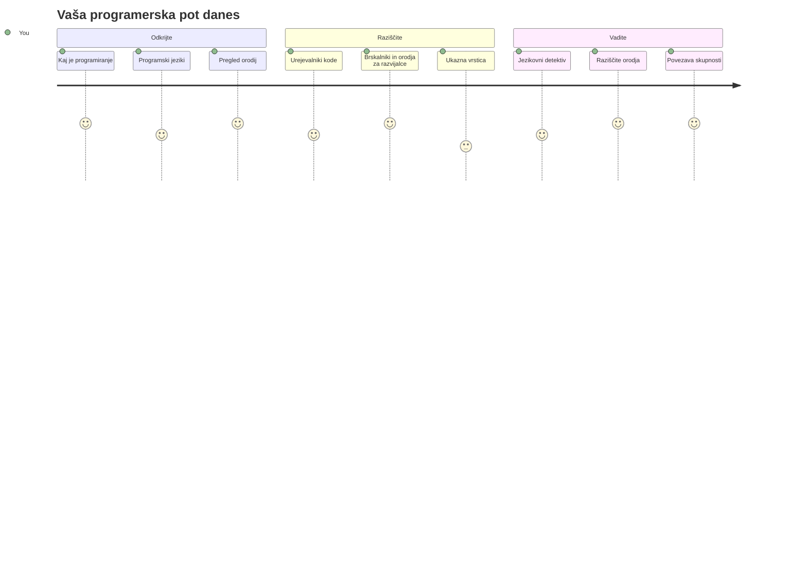
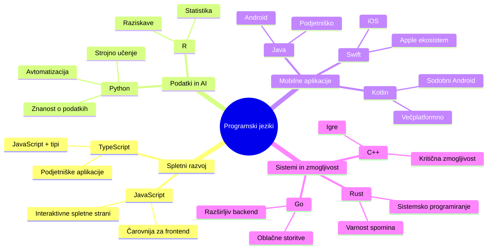
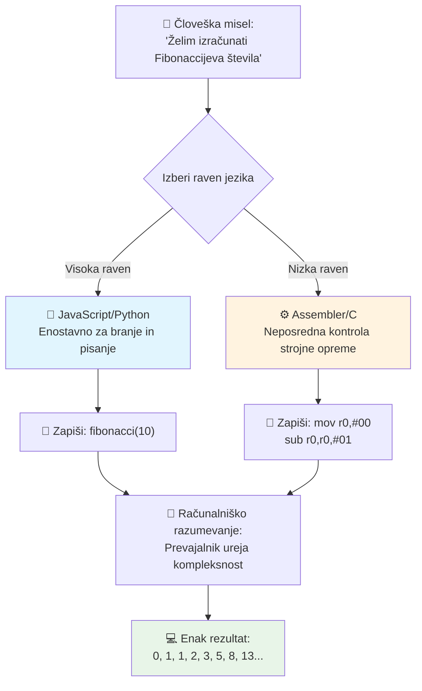
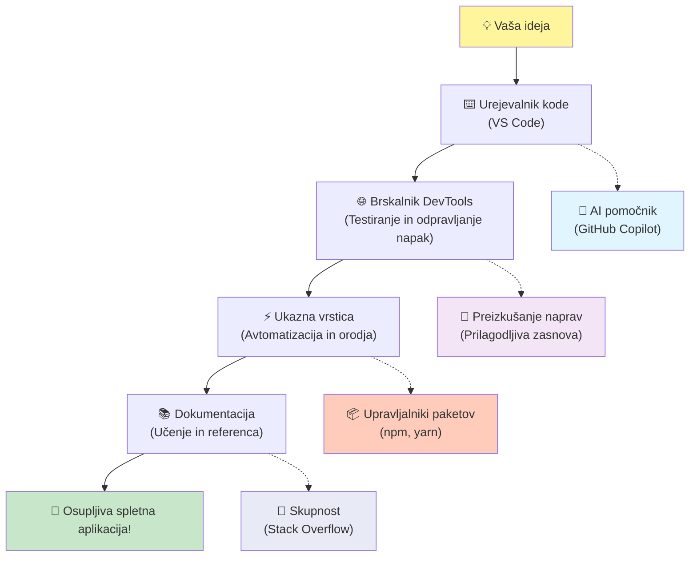
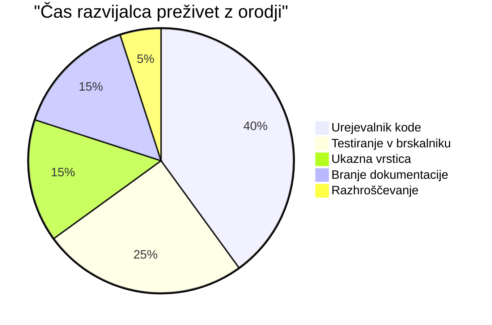
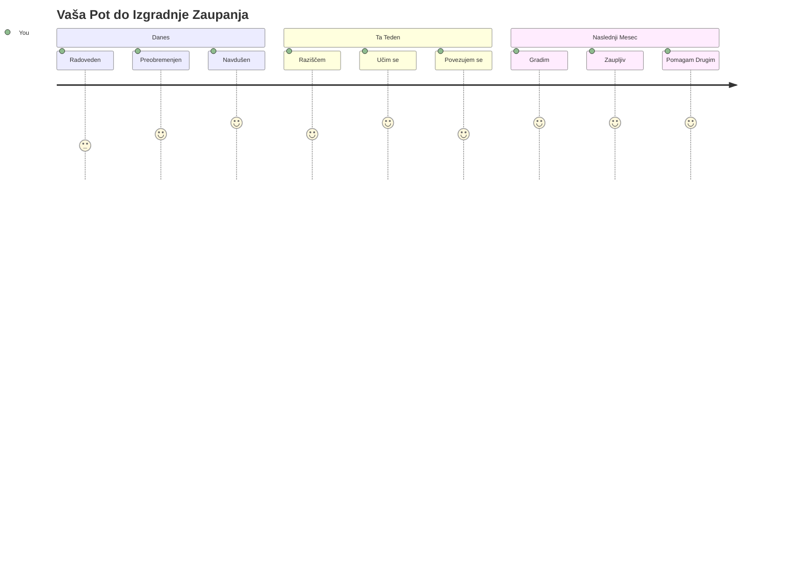

# Uvod v programske jezike in sodobna razvojna orodja

Živjo, bodoči razvijalec! 👋 Lahko ti zaupam nekaj, kar mi vsak dan znova jemlje dih? Pravkar boš spoznal, da programiranje ni samo o računalnikih – gre za pravo supermoč, s katero lahko oživiš svoje najbolj nore ideje!

Poznaš tisti trenutek, ko uporabljaš svojo najljubšo aplikacijo in vse popolnoma steče? Ko pritisneš gumb in se zgodi nekaj čarobnega, zaradi česar rečeš "wow, kako so to naredili?" No, nekdo prav takšen kot ti – verjetno sedi v svoji najljubši kavarnici ob 2. zjutraj s tretjo espressom – je napisal kodo, ki je ustvarila to čarovnijo. In zdaj pa pazi, kaj te bo navdušilo: do konca te lekcije ne boš le razumel, kako so to naredili, ampak boš komaj čakal, da poskusiš sam!

Poglej, popolnoma razumem, če se ti zdi programiranje zdaj zastrašujoče. Ko sem začel, sem po resnici povedano mislil, da moraš biti nekakšen matematični genij ali pa kodirati že od petega leta starosti. Ampak nekaj, kar je popolnoma spremenilo moj pogled: programiranje je natanko tako kot učenje pogovarjanja v novem jeziku. Začneš s "zdravo" in "hvala", nato naročaš kavo, preden pa se zavedaš, pa vodiš globoke filozofske razprave! V tem primeru pa se pogovarjaš z računalniki in iskreno? Oni so najbolj potrpežljivi sogovorniki, kar jih boš kdaj imel – nikoli ne obsojajo tvojih napak in so vedno pripravljeni poskusiti znova!

Danes bomo raziskali neverjetna orodja, ki spletni razvoj dandanes ne naredijo le možen, ampak ga naredijo resnično zasvojljivega. Govorim o enakih urejevalnikih, brskalnikih in potekih dela, ki jih vsak dan uporabljajo razvijalci pri Netflixu, Spotifyju in tvoji najljubši neodvisni aplikacijski studio. In tukaj je del, zaradi katerega boš z veseljem zaplesal: večina teh profesionalnih orodij, ki so standard v industriji, je popolnoma brezplačnih!


> Sketchnote avtorja [Tomomi Imura](https://twitter.com/girlie_mac)


```mermaid
journey
    title Vaša programerska pot danes
    section Odkrijte
      Kaj je programiranje: 5: You
      Programski jeziki: 4: You
      Pregled orodij: 5: You
    section Raziščite
      Urejevalniki kode: 4: You
      Brskalniki in orodja za razvijalce: 5: You
      Ukazna vrstica: 3: You
    section Vadite
      Jezikovni detektiv: 4: You
      Raziščite orodja: 5: You
      Povezava skupnosti: 5: You
```
## Poglejmo, kaj že veš!

Preden skočimo v zabavne dele, me zanima – kaj že veš o tem programerskem svetu? In poslušaj, če gledaš na ta vprašanja in misliš "o tem nimam pojma," to ni samo v redu, to je popolno! To pomeni, da si na pravem mestu. Pomisli na ta kviz kot na razgibavanje pred vadbo – samo ogrevamo možganske mišice!

[Reši kviz pred lekcijo](https://ff-quizzes.netlify.app/web/)


## Pustolovščina, na katero se odpravljava skupaj

Prav, iskreno sem navdušen nad tem, kar bova danes raziskala! Resno, rad bi videl tvoj obraz, ko ti bo nekaj teh pojmov kliknilo. To je neverjetno potovanje, na katero se podajava skupaj:

- **Kaj je programiranje (in zakaj je najbolj kul stvar ever!)** – Odkrivali bomo, kako je koda dobesedno nevidna magija, ki poganja vse okoli tebe, od tistega alarma, ki nekako ve, da je ponedeljek zjutraj, do algoritma, ki popolnoma prilagaja tvoje priporočila na Netflixu
- **Programski jeziki in njihove neverjetne osebnosti** – Predstavljaj si, da vstopiš na zabavo, kjer ima vsak povsem drugačne supermoči in načine reševanja problemov. Tak svet je svet programskih jezikov in zagotovo jih boš rad spoznal!
- **Temeljni gradniki, ki ustvarjajo digitalno magijo** – Razumi jih kot ultimativni ustvarjalni LEGO set. Ko boš razumel, kako se ti deli med seboj povezujejo, boš videl, da lahko dobesedno ustvariš karkoli, kar sanja tvoja domišljija
- **Profesionalna orodja, zaradi katerih boš imel občutek, kot da držiš čarovniško palico** – Ne pretiravam – ta orodja te bodo resnično naredila, da se boš počutil kot nekdo z nadnaravnimi sposobnostmi, najboljše pri vsem pa je, da so to ista orodja, kot jih uporabljajo profesionalci!

> 💡 **Tukaj je stvar:** Ne poskušaj danes vsega zapomniti na pamet! Zdaj želim, da začutiš to iskrico navdušenja nad tem, kar je mogoče. Detajli se bodo avtomatično utrdili, ko bova skupaj prakticirala – tako se zgodi pravo učenje!

> To lekcijo lahko opraviš tudi na [Microsoft Learn](https://learn.microsoft.com/en-us/learn/modules/web-development-101/introduction-programming/?WT.mc_id=academic-77807-sagibbon)!

## Kaj pa je pravzaprav *programiranje*?

V redu, lotimo se milijonskega vprašanja: kaj je programiranje, resnično?

Povedal ti bom zgodbo, ki je popolnoma spremenila moj pogled na to. Prejšnji teden sem svoji mami poskušal razložiti, kako uporabi naš novi pametni daljinec za televizijo. Pri sebi sem rekel stvari kot "Pritisni rdeči gumb, ampak ne velik rdeči gumb, ampak majhen rdeči gumb na levi... ne, na tvoji drugi levi... okej, zdaj ga drži dve sekundi, ne eno, ne tri..." Zveni znano? 😅

To je programiranje! Je umetnost dajanja izjemno podrobnih, korak po koraku navodil nečemu zelo močnemu, ki pa mora imeti vse natančno določeno. Razlika je v tem, da namesto da bi to razlagal mami (ki lahko vpraša "kateri rdeči gumb?!"), razlagaš računalniku (ki naredi natanko to, kar rečeš, tudi če to, kar si rekel, ni točno to, kar si mislil).

To me je popolnoma navdušilo, ko sem to prvič izvedel: računalniki so pravzaprav zelo preprosti v jedru. Razumejo namreč le dve stvari – 1 in 0, kar je v bistvu "da" in "ne" ali "vklopljeno" in "izklopljeno." To je vse! Ampak tukaj postane res magično – ne moramo govoriti v 1 in 0 kot v filmu Matriks. Tu pridejo na pomoč **programski jeziki**. To so nekakšni najboljši prevajalci na svetu, ki tvoje povsem običajne ljudske misli pretvorijo v računalniški jezik.

In to me še danes zjutraj ponavadi požene po koži: dobesedno *vse* digitalno v tvojem življenju se je začelo pri nekem človeku, prav takšnem kot si ti, ki je verjetno sedel v pižami s skodelico kave in tipkal kodo na svojem prenosniku. Tisti Instagramov filter, ki te naredi brezhibnega? Nekdo je to zakodiral. Priporočilo, ki te je pripeljalo do tvoje nove najljubše pesmi? Razvijalec je napisal ta algoritem. Aplikacija, ki pomaga razdeliti račun za večerjo s prijatelji? Ja, nekdo je pomislil "to je nadležno, mislim, da lahko to popravim" in potem... je to storil!

Ko se naučiš programirati, ne pridobiš le nove veščine – postaneš del te neverjetne skupnosti reševalcev problemov, ki vsak dan razmišljajo: "Kaj, če bi lahko zgradil nekaj, kar bi nekomu naredilo dan vsaj malo boljši?" Iskreno, obstaja kaj bolj kul od tega?

✅ **Zabaven iskalni izziv**: Tukaj je nekaj zelo zanimivega, kar lahko poiščeš, ko boš imel prost trenutek – kdo misliš, da je bil prvi programer na svetu? Namig: morda ni tisti, ki ga pričakuješ! Zgodba o tej osebi je izjemno fascinantna in pokaže, da je programiranje vedno bilo o ustvarjalnem reševanju problemov in razmišljanju izven okvirov.

### 🧠 **Čas za preverjanje: Kako se počutiš?**

**Vzemi trenutek za razmislek:**
- Ali ti zdaj ideja "dati računalnikom navodila" deluje smiselno?
- Se lahko spomniš kakšne vsakdanje naloge, ki bi jo rad avtomatiziral s programiranjem?
- Katere vprašanja ti vrtijo po glavi glede tega celotnega programiranja?

> **Spomni se:** Popolnoma normalno je, če se ti nekateri pojmi zdaj zdijo megleni. Učenje programiranja je kot učenje novega jezika – možgane moraš postopoma naučiti novih povezav. Opravljaš odlično!

## Programske jezike lahko primerjamo z različnimi okusi magije

V redu, morda bo zvenelo čudno, a ostani z mano – programski jeziki so zelo podobni različnim glasbenim zvrstem. Pomisli: imaš jazz, ki je gladek in improviziran, rock, ki je močan in neposreden, klasično glasbo, ki je elegantna in strukturirana, ter hip-hop, ki je ustvarjalen in izrazen. Vsak slog ima svoj značaj, svojo skupnost navdušenih oboževalcev in vsak je kot nalašč za različna razpoloženja in priložnosti.

Tako programiranje pravzaprav deluje! Ne bi uporabil istega jezika za izdelavo zabavne mobilne igre in za obdelavo ogromnih količin podatkov o podnebju, tako kot ne bi igral death metala v razredu joge (no, vsaj večina jih ne! 😄).

Ampak nekaj, kar me vedno znova navduši: ti jeziki so kot najbolj potrpežljiv in briljanten tolmač na svetu, ki sedi prav ob tebi. Svoje ideje lahko izražaš na način, ki je naraven tvojemu človeškemu umu, oni pa opravijo vse izjemno zapleteno delo pretvorbe tega v 1 in 0, v katerem računalniki dejansko govorijo. To je kot imeti prijatelja, ki je popolnoma tekoč tako v "človeški ustvarjalnosti" kot v "računalniški logiki" – in nikoli ni utrujen, nikoli ne potrebuje pavz za kavo in te nikoli ne obsoja, če postaviš isto vprašanje dvakrat!

### Priljubljeni programski jeziki in njihova uporaba


```mermaid
mindmap
  root((Programski jeziki))
    Spletni razvoj
      JavaScript
        Čarovnija za frontend
        Interaktivne spletne strani
      TypeScript
        JavaScript + tipi
        Podjetniške aplikacije
    Podatki in AI
      Python
        Znanost o podatkih
        Strojno učenje
        Avtomatizacija
      R
        Statistika
        Raziskave
    Mobilne aplikacije
      Java
        Android
        Podjetniško
      Swift
        iOS
        Apple ekosistem
      Kotlin
        Sodobni Android
        Večplatformno
    Sistemi in zmogljivost
      C++
        Igre
        Kritična zmogljivost
      Rust
        Varnost spomina
        Sistemsko programiranje
      Go
        Oblačne storitve
        Razširljiv backend
```
| Jezik | Najbolj za | Zakaj je priljubljen |
|----------|----------|------------------|
| **JavaScript** | Spletni razvoj, uporabniški vmesniki | Teče v brskalnikih in poganja interaktivne strani |
| **Python** | Podatkovna znanost, avtomatizacija, AI | Enostaven za branje in učenje, močne knjižnice |
| **Java** | Podjetniške aplikacije, Android aplikacije | Neodvisen od platforme, robusten za velike sisteme |
| **C#** | Windows aplikacije, razvoj iger | Močna podpora Microsoft ekosistema |
| **Go** | Oblak storitve, zaledni sistemi | Hiter, enostaven, zasnovan za sodobno računalništvo |

### Visokonivojski vs. niskonivojski jeziki

Prav, ta pojem mi je iskreno malo zmešal možgane, ko sem ga prvič spoznal, zato delim analogijo, ki mi je končno omogočila razumevanje – upam, da ti bo tudi pomagala!

Predstavljaj si, da si v državi, kjer ne govoriš jezika, in nujno potrebuješ najbližji WC (to se nam je vsem že zgodilo, kajne? 😅):

- **Niskonivojsko programiranje** je kot učenje lokalnega narečja tako dobro, da se lahko pogovarjaš z babico, ki prodaja sadje na vogalu, z uporabo kulturnih izrazov, lokalnega žargona in notranjih šale, ki jih razume le nekdo, ki je tam odraščal. Res impresivno in zelo učinkovito... če si tečnar in govoriš tekoče! Vendar pa je malo preveč, če samo iščeš WC.

- **Visokonivojsko programiranje** je kot imeti čudovitega lokalnega prijatelja, ki te popolnoma razume. Poveš mu "Res rabim najti stranišče" v preprosti angleščini, on pa poskrbi za cel prevod in ti v jeziku, ki je razumljiv tvojemu tujskemu umu, poda navodila.

V programerskih izrazih:
- **Niskonivojski jeziki** (kot Assembly ali C) ti dovolijo imeti izjemno podrobne pogovore s strojno opremo računalnika, a moraš razmišljati kot stroj, kar je... pa saj veš, velik preskok v miselnosti!
- **Visokonivojski jeziki** (kot JavaScript, Python ali C#) ti dovolijo razmišljati kot človek, medtem ko oni za teboj prevajajo v strojni jezik. Poleg tega imajo te jezike izjemno prijazne skupnosti ljudi, ki se spomnijo, kako je bilo biti začetnik in resnično želijo pomagati!

Ugani, katere ti bom priporočil za začetek? 😉 Visokonivojski jeziki so kot pomožna kolesa, ki jih nikoli ne želiš sneti, ker naredijo celotno izkušnjo mnogo bolj prijetno!


```mermaid
flowchart TB
    A["👤 Človeška misel:<br/>'Želim izračunati Fibonaccijeva števila'"] --> B{Izberi raven jezika}
    
    B -->|Visoka raven| C["🌟 JavaScript/Python<br/>Enostavno za branje in pisanje"]
    B -->|Nizka raven| D["⚙️ Assembler/C<br/>Neposredna kontrola strojne opreme"]
    
    C --> E["📝 Zapiši: fibonacci(10)"]
    D --> F["📝 Zapiši: mov r0,#00<br/>sub r0,r0,#01"]
    
    E --> G["🤖 Računalniško razumevanje:<br/>Prevajalnik ureja kompleksnost"]
    F --> G
    
    G --> H["💻 Enak rezultat:<br/>0, 1, 1, 2, 3, 5, 8, 13..."]
    
    style C fill:#e1f5fe
    style D fill:#fff3e0
    style H fill:#e8f5e8
```
### Naj ti pokažem, zakaj so visokonivojski jeziki prijaznejši

V redu, pravkar ti bom pokazal nekaj, kar popolnoma dokazuje, zakaj sem se zaljubil v visokonivojske jezike, a najprej – obljubi mi nekaj. Ko vidiš prvi primer kode, ne paničaraj! Namenjena je, da je videti zastrašujoče. Točno to hočem pokazati!

Poglejmo popolnoma isto nalogo, napisano na dva povsem različna načina. Oboje ustvari tisto, kar imenujemo Fibonaccijevo zaporedje – to je čudovit matematični vzorec, kjer je vsako število vsota dveh prejšnjih: 0, 1, 1, 2, 3, 5, 8, 13... (zabavna zanimivost: ta vzorec najdeš dobesedno povsod v naravi – spiralno razporeditev sončničnih semen, vzorce storžev, celo obliko galaksij!)

Pripravljen na primerjavo? Gremo!

**Visokonivojski jezik (JavaScript) – po človeško:**

```javascript
// Korak 1: Osnovna nastavitev Fibonaccija
const fibonacciCount = 10;
let current = 0;
let next = 1;

console.log('Fibonacci sequence:');
```

**To koda počne:**
- **Deklarira** konstanto, ki določa, koliko Fibonaccijevih števil želimo ustvariti
- **Inicializira** dve spremenljivki za sledenje trenutnega in naslednjega števila v zaporedju
- **Nastavi** začetne vrednosti (0 in 1), ki definirajo Fibonaccijev vzorec
- **Prikaže** naslovno sporočilo za identifikacijo izpisa

```javascript
// Korak 2: Generirajte zaporedje z zanko
for (let i = 0; i < fibonacciCount; i++) {
  console.log(`Position ${i + 1}: ${current}`);
  
  // Izračunajte naslednjo številko v zaporedju
  const sum = current + next;
  current = next;
  next = sum;
}
```

**Kaj se dogaja tukaj:**
- **Zanka** skozi vsak položaj v zaporedju z uporabo `for` zanke
- **Prikazuje** vsako število s svojo pozicijo z oblikovanjem preko predloge
- **Izračunava** naslednje Fibonaccijevo število z dodajanjem trenutnega in naslednjega
- **Posodablja** sledilne spremenljivke za premik v naslednjo iteracijo

```javascript
// Korak 3: Sodobni funkcionalni pristop
const generateFibonacci = (count) => {
  const sequence = [0, 1];
  
  for (let i = 2; i < count; i++) {
    sequence[i] = sequence[i - 1] + sequence[i - 2];
  }
  
  return sequence;
};

// Primer uporabe
const fibSequence = generateFibonacci(10);
console.log(fibSequence);
```

**V zgornjem primeru smo:**
- **Ustvarili** ponovljivo funkcijo z moderno sintakso puščic
- **Zgradili** tabelo za shranjevanje celotnega zaporedja namesto prikaza enega po enega
- **Uporabljali** indeksiranje tabele za izračun vsakega novega števila iz prejšnjih vrednosti
- **Vrnil** celotno zaporedje za fleksibilno uporabo drugje v programu

**Niskonivojski jezik (ARM Assembly) – računalniku prijazno:**

```assembly
 area ascen,code,readonly
 entry
 code32
 adr r0,thumb+1
 bx r0
 code16
thumb
 mov r0,#00
 sub r0,r0,#01
 mov r1,#01
 mov r4,#10
 ldr r2,=0x40000000
back add r0,r1
 str r0,[r2]
 add r2,#04
 mov r3,r0
 mov r0,r1
 mov r1,r3
 sub r4,#01
 cmp r4,#00
 bne back
 end
```

Opazite, kako JavaScript verzija skoraj bere kot navodila v angleščini, medtem ko Assembly uporablja skrivnostne ukaze, ki neposredno nadzorujejo procesor računalnika. Oba izvedeta isto nalogo, vendar je visokonivojski jezik veliko bolj prijazen za ljudi, da ga razumejo, pišejo in vzdržujejo.

**Ključne razlike, ki jih boš opazil:**
- **Berljivost**: JavaScript uporablja opisna imena, kot je `fibonacciCount`, medtem ko asembler uporablja skrivnostne oznake, kot so `r0`, `r1`
- **Komentarji**: Visoko raven jeziki spodbujajo pojasnjujoče komentarje, ki naredijo kodo samodokumentirajočo
- **Struktura**: Logični tok JavaScripta sledi načinu, kako ljudje razmišljajo o problemih korak za korakom
- **Vzdrževanje**: Posodabljanje JavaScript različice za različne zahteve je preprosto in jasno

✅ **O Fibonaccijevem zaporedju**: Ta absolutno čudovit številčni vzorec (kjer je vsako število vsota dveh predhodnih: 0, 1, 1, 2, 3, 5, 8...) se pojavlja doslovno *povsod* v naravi! Najdete ga v spiralah sončnic, vzorcih storžev, v tem, kako se kodra lastovke lupine, pa tudi v načinu rasti drevesnih vej. Res je neverjetno, kako matematika in koda pomagata razumeti in znova ustvariti vzorce, ki jih narava uporablja za ustvarjanje lepote!


## Gradniki, ki ustvarjajo čarovnijo

Dobro, zdaj ko ste videli, kako programski jeziki izgledajo v akciji, razčlenimo temeljne dele, ki sestavljajo prav vsak program, kar je bil kdaj napisan. Pomislite na to kot na bistvene sestavine v vaši najljubši recepturi – ko boste razumeli, kaj vsak od njih počne, boste lahko brali in pisali kodo v skoraj vsakem jeziku!

To je nekako kot učenje slovnice programiranja. Se spomnite, kako smo se v šoli učili o samostalnikih, glagolih in sestavljanju stavkov? Programiranje ima svojo različico slovnice, in iskreno, ta je veliko bolj logična in odpuščajoča kot slovnica angleščine! 😄

### Izjave: Navodila korak za korakom

Začnimo z **izjavami** – te so kot posamezni stavki v pogovoru z vašim računalnikom. Vsaka izjava računalniku pove, naj naredi eno specifično stvar, nekako kot da dajete navodila: "Zavij levo tukaj," "Ustavi se na rdeči luči," "Parkiraj na tistem mestu."

Všeč mi je, kako berljive so izjave običajno. Poglejte to:

```javascript
// Osnovne izjave, ki izvajajo posamezna dejanja
const userName = "Alex";                    
console.log("Hello, world!");              
const sum = 5 + 3;                         
```

**Tukaj je, kaj ta koda počne:**
- **Določi** konstanto za shranjevanje uporabnikovega imena
- **Prikaže** pozdravno sporočilo v konzoli
- **Izračuna** in shrani rezultat matematične operacije

```javascript
// Izjave, ki komunicirajo s spletnimi stranmi
document.title = "My Awesome Website";      
document.body.style.backgroundColor = "lightblue";
```

**Korak za korakom, tu se dogaja:**
- **Spremeni** naslov spletne strani, ki se prikaže v zavihku brskalnika
- **Zameni** barvo ozadja celotnega telesa strani

### Spremenljivke: Spominski sistem vašega programa

Prav, **spremenljivke** so iskreno ena mojih najljubših konceptov za poučevanje, ker so zelo podobne stvarem, ki jih uporabljate vsak dan!

Pomislite za trenutek na imenik v telefonu. Ne pomnite si vseh telefonskih številk – namesto tega shranite "Mami", "Najboljši prijatelj" ali "Picerija, ki dostavlja do 2 ure zjutraj" in pustite, da telefon shrani prave številke. Spremenljivke delujejo popolnoma enako! So kot označeni vsebniki, kjer vaš program lahko shrani informacije in jih pozneje poišče po imenu, ki ima smisel.

Tukaj je res kul stvar: spremenljivke se lahko spreminjajo med izvajanjem programa (od tod ime "spremenljivka" – veste, kaj so naredili?). Tako kot lahko posodobite stik za pico, ko odkrijete še boljšo picerijo, lahko spremenljivke posodabljate, ko vaš program pridobiva nove informacije ali se okoliščine spreminjajo!

Pokažem vam, kako enostavno je to lahko:

```javascript
// Korak 1: Ustvarjanje osnovnih spremenljivk
const siteName = "Weather Dashboard";        
let currentWeather = "sunny";               
let temperature = 75;                       
let isRaining = false;                      
```

**Razumevanje teh konceptov:**
- **Shranjajte** nespremenljive vrednosti v `const` spremenljivkah (kot je ime strani)
- **Uporabite** `let` za vrednosti, ki se lahko spreminjajo skozi program
- **Dodelite** različne tipe podatkov: nizi (besedilo), številke in boolean (true/false)
- **Izberite** opisna imena, ki razložijo, kaj posamezna spremenljivka vsebuje

```javascript
// Korak 2: Delo z objekti za združevanje povezanih podatkov
const weatherData = {                       
  location: "San Francisco",
  humidity: 65,
  windSpeed: 12
};
```

**Zgoraj smo:**
- **Ustvarili** objekt za skupinsko urejanje povezanih vremenskih informacij
- **Organizirali** več kosov podatkov pod enim imenom spremenljivke
- **Uporabljali** ključ-vrednost pare za jasno označevanje vsake informacije

```javascript
// Korak 3: Uporaba in posodabljanje spremenljivk
console.log(`${siteName}: Today is ${currentWeather} and ${temperature}°F`);
console.log(`Wind speed: ${weatherData.windSpeed} mph`);

// Posodabljanje spremenljivk, ki se lahko spreminjajo
currentWeather = "cloudy";                  
temperature = 68;                          
```

**Poglejmo vsak del posebej:**
- **Prikazujemo** informacije s predlogi nizov s sintakso `${}`
- **Dostopamo** do lastnosti objekta z dot notacijo (`weatherData.windSpeed`)
- **Posodabljamo** spremenljivke, deklarirane z `let`, da odražajo spreminjajoče se pogoje
- **Združujemo** več spremenljivk v smiselna sporočila

```javascript
// Korak 4: Sodobno razstavljanje za čistejšo kodo
const { location, humidity } = weatherData; 
console.log(`${location} humidity: ${humidity}%`);
```

**Kaj morate vedeti:**
- **Izvlecite** specifične lastnosti iz objektov z destrukturiranjem
- **Ustvarite** nove spremenljivke samodejno z istimi imeni kot ključi objekta
- **Poenostavite** kodo s tem, da se izognete ponavljajoči se dot notaciji

### Nadzor toka: Poučevanje programa razmišljanja

Prav, tukaj programiranje postane resnično osupljivo! **Nadzor toka** pomeni, da naučite svoj program pametno sprejemati odločitve, tako kot jih vi sprejemate vsak dan, ne da bi sploh pomislili.

Predstavljajte si: danes zjutraj ste verjetno šli skozi nekaj takega: "Če dežuje, vzamem dežnik. Če je hladno, oblečem jopico. Če zamujam, izpustim zajtrk in vzamem kavo s poti." Vaš možgan nenehno sledijo tej if-then logiki na desetine krat dnevno!

To je tisto, kar naredi programe pametne in žive, namesto da bi samo sledili dolgočasnemu, predvidljivemu scenariju. Programi lahko pogledajo situacijo, ocenijo, kaj se dogaja, in odgovorijo primerno. Tako kot, da bi dali programu možgane, ki se prilagodijo in sprejemajo odločitve!

Želite videti, kako lepo to deluje? Pokažem vam:

```javascript
// Korak 1: Osnovna pogojna logika
const userAge = 17;

if (userAge >= 18) {
  console.log("You can vote!");
} else {
  const yearsToWait = 18 - userAge;
  console.log(`You'll be able to vote in ${yearsToWait} year(s).`);
}
```

**Kaj ta koda počne:**
- **Preveri**, ali starost uporabnika ustreza volilnim pogojem
- **Izvede** različne bloke kode glede na rezultat pogoja
- **Izračuna** in prikaže čas do upravičenosti do glasovanja, če je uporabnik mlajši od 18
- **Nudi** natančne, koristne povratne informacije za vsak scenarij

```javascript
// Korak 2: Več pogojev z logičnimi operatorji
const userAge = 17;
const hasPermission = true;

if (userAge >= 18 && hasPermission) {
  console.log("Access granted: You can enter the venue.");
} else if (userAge >= 16) {
  console.log("You need parent permission to enter.");
} else {
  console.log("Sorry, you must be at least 16 years old.");
}
```

**Razčlenjevanje dogajanja tukaj:**
- **Združi** več pogojev z uporabo `&&` (in) operaterja
- **Ustvari** hierarhijo pogojev z `else if` za več scenarijev
- **Obravnava** vse možne primere z zaključnim `else`
- **Nudi** jasne in uporabne povratne informacije za vsako situacijo

```javascript
// Korak 3: Jedrnat pogoj z ternarnim operatorjem
const votingStatus = userAge >= 18 ? "Can vote" : "Cannot vote yet";
console.log(`Status: ${votingStatus}`);
```

**Kar morate zapomniti:**
- **Uporabite** ternarnega operaterja (`? :`) za preproste pogoje z dvema možnostma
- **Najprej napišite** pogoj, nato `?`, potem resničen rezultat, nato `:`, nato napačen rezultat
- **Uporabite** ta vzorec, kadar morate vrednosti dodeliti glede na pogoje

```javascript
// Korak 4: Obdelava več specifičnih primerov
const dayOfWeek = "Tuesday";

switch (dayOfWeek) {
  case "Monday":
  case "Tuesday":
  case "Wednesday":
  case "Thursday":
  case "Friday":
    console.log("It's a weekday - time to work!");
    break;
  case "Saturday":
  case "Sunday":
    console.log("It's the weekend - time to relax!");
    break;
  default:
    console.log("Invalid day of the week");
}
```

**Ta koda izvede naslednje:**
- **Ujemanje** vrednosti spremenljivke z več specifičnimi primeri
- **Združevanje** podobnih primerov skupaj (delovni in vikend dnevi)
- **Izvajanje** ustreznega bloka kode, ko je najdeno ujemanje
- **Vključitev** `default` primera za nepričakovane vrednosti
- **Uporaba** `break` stavkov, da preprečijo nadaljevanje kode v naslednji primer

> 💡 **Praktična primerjava**: Nadzor toka je kot najbolj potrpežljiv GPS na svetu, ki vam daje navodila. Morda reče: "Če je na Main Street promet, pojdi avtocesto. Če je zaradi gradnje avtocesta zaprta, poskusi slikovito pot." Programi uporabljajo enako tip logike z pogoji, da inteligentno odgovorijo na razne situacije in vedno uporabnikom zagotovijo najboljšo možno izkušnjo.

### 🎯 **Preverjanje razumevanja: Mojstrstvo gradnikov**

**Poglejmo, kako vam gre s temelji:**
- Ali z lastnimi besedami lahko razložite razliko med spremenljivko in izjavo?
- Pomislite na resničen primer, kjer bi uporabili if-then odločitev (kot naš primer glasovanja)
- Kaj vas je najbolj presenetilo pri logiki programiranja?

**Hiter dvig samozavesti:**

```mermaid
flowchart LR
    A["📝 Izjave<br/>(Navodila)"] --> B["📦 Spremenljivke<br/>(Shranjevanje)"] --> C["🔀 Krmilni Tok<br/>(Odločitve)"] --> D["🎉 Delujoč Program!"]
    
    style A fill:#ffeb3b
    style B fill:#4caf50
    style C fill:#2196f3
    style D fill:#ff4081
```
✅ **Kaj sledi:** Imeli bomo resnično zabavno potovanje z globljim spoznavanjem teh konceptov! Zdaj pa se osredotočite samo na to navdušenje nad vsemi čudovitimi možnostmi, ki so pred vami. Specifične veščine in tehnike se bodo naučile same naravno, ko bomo skupaj vadili – obljubim, da bo to veliko bolj zabavno, kot ste pričakovali!

## Orodja obrti

Prav, tukaj pa sem res navdušen, komaj se držim! 🚀 Govorili bomo o neverjetnih orodjih, zaradi katerih se boste počutili, kot da ste ravnokar prejeli ključe digitalnega vesoljskega plovila.

Veš, kako kuhar ima tiste popolnoma uravnotežene nože, ki se zdijo kot podaljšek njegovih rok? Ali kako glasbenik ima to edinstveno kitaro, ki takoj začne peti, ko jo primete? No, razvijalci imamo svojo različico teh čarobnih orodij, in tukaj je nekaj, kar vam bo popolnoma pomešalo misli – večina jih je popolnoma brezplačnih!

Skoraj skačem od navdušenja, ko pomislim, da vam jih lahko pokažem, ker so popolnoma revolucionirala način, kako gradimo programsko opremo. Govorimo o AI-pogojenih pomočnikih za kodiranje, ki lahko pomagajo pisati vašo kodo (iskreno, ne hecam se!), oblakih, kjer lahko gradite celotne aplikacije s kateregakoli kraja s povezavo Wi-Fi, in orodjih za odpravljanje napak, ki so tako sofisticirana, kot da imate rentgenski vid za vaše programe.

In tukaj je del, ki mi še vedno povzroča mravljince: to niso orodja za začetnike, ki jih boste prerastli. To so točno ista profesionalna orodja, ki jih uporabljajo razvijalci v Googlu, Netflixu in tej indie razvojni skupini aplikacij, ki jo obožujete. Čutili se boste kot pravi profesionalec, ko jih uporabljate!


```mermaid
graph TD
    A["💡 Vaša ideja"] --> B["⌨️ Urejevalnik kode<br/>(VS Code)"] 
    B --> C["🌐 Brskalnik DevTools<br/>(Testiranje in odpravljanje napak)"]
    C --> D["⚡ Ukazna vrstica<br/>(Avtomatizacija in orodja)"]
    D --> E["📚 Dokumentacija<br/>(Učenje in referenca)"]
    E --> F["🚀 Osupljiva spletna aplikacija!"]
    
    B -.-> G["🤖 AI pomočnik<br/>(GitHub Copilot)"]
    C -.-> H["📱 Preizkušanje naprav<br/>(Prilagodljiva zasnova)"]
    D -.-> I["📦 Upravljalniki paketov<br/>(npm, yarn)"]
    E -.-> J["👥 Skupnost<br/>(Stack Overflow)"]
    
    style A fill:#fff59d
    style F fill:#c8e6c9
    style G fill:#e1f5fe
    style H fill:#f3e5f5
    style I fill:#ffccbc
    style J fill:#e8eaf6
```
### Urejevalniki kode in IDE-ji: vaši novi digitalni najboljši prijatelji

Pogovorimo se o urejevalnikih kode – ti bodo kmalu postali vaši najljubši kotički za ustvarjanje! Pomislite na njih kot na osebni zakladi kodiranja, kjer boste preživeli največ časa pri ustvarjanju in izpopolnjevanju svojih digitalnih stvaritev.

Ampak tukaj je nekaj, kar je zares čarobno pri sodobnih urejevalnikih: niso le lepi urejevalniki besedil. So kot najbolj briljanten in podpirajoč mentor programiranja, ki sedi ob vas 24 ur na dan. Ujamete njihove tipkarske napake še preden jih opazite, predlagajo izboljšave, zaradi katerih ste videti kot genij, pomagajo vam razumeti, kaj počne vsak kos kode, nekateri vam celo lahko predvidijo, kaj boste napisali in ponudijo, da dokončajo vaše misli!

Spomnim se, ko sem odkril samodejno dokončanje – res sem imel občutek, kot da živim v prihodnosti. Začnete tipkati nekaj in vaš urejevalnik reče: "Hej, si mislil na to funkcijo, ki počne točno to, kar potrebuješ?" To je kot imeti bralca misli kot kodirnega prijatelja!

**Kaj naredi te urejevalnike tako neverjetne?**

Sodobni urejevalniki kode ponujajo impresiven nabor funkcij, ki povečajo vašo produktivnost:

| Funkcija | Kaj naredi | Zakaj pomaga |
|---------|--------------|--------------|
| **Poudarjanje sintakse** | Barva različne dele vaše kode | Naredi kodo lažjo za branje in zaznavanje napak |
| **Samodokončanje** | Predlaga kodo med tipkanjem | Pospeši kodiranje in zmanjša tipkarske napake |
| **Orodja za odpravljanje napak** | Pomaga najti in popraviti napake | Prihrani ure iskanja napak |
| **Razširitve** | Dodajajo specializirane funkcije | Prilagodite urejevalnik za katero koli tehnologijo |
| **AI pomočniki** | Predlagajo kodo in pojasnila | Pospešijo učenje in produktivnost |

> 🎥 **Video vir**: Želite videti ta orodja v akciji? Oglejte si [video Orodja obrti](https://youtube.com/watch?v=69WJeXGBdxg) za celovit pregled.

#### Priporočeni urejevalniki za spletni razvoj

**[Visual Studio Code](https://code.visualstudio.com/?WT.mc_id=academic-77807-sagibbon)** (Brezplačno)
- Najbolj priljubljen med spletnimi razvijalci
- Odličen ekosistem razširitev
- Vgrajen terminal in integracija Git
- **Neizogibne razširitve**:
  - [GitHub Copilot](https://marketplace.visualstudio.com/items?itemName=GitHub.copilot) - AI-podprti predlogi kode
  - [Live Share](https://marketplace.visualstudio.com/items?itemName=MS-vsliveshare.vsliveshare) - sodelovanje v realnem času
  - [Prettier](https://marketplace.visualstudio.com/items?itemName=esbenp.prettier-vscode) - samodejno oblikovanje kode
  - [Code Spell Checker](https://marketplace.visualstudio.com/items?itemName=streetsidesoftware.code-spell-checker) - zaznavanje tipkarskih napak v kodi

**[JetBrains WebStorm](https://www.jetbrains.com/webstorm/)** (Plačljivo, brezplačno za študente)
- Napredna orodja za odpravljanje napak in testiranje
- Inteligentno samodokončanje kode
- Vgrajeno upravljanje verzij

**Spletna IDE-ji** (različne cene)
- [GitHub Codespaces](https://github.com/features/codespaces) - celoten VS Code v vašem brskalniku
- [Replit](https://replit.com/) - odlično za učenje in deljenje kode
- [StackBlitz](https://stackblitz.com/) - takojšen spletni razvoj celotnih aplikacij

> 💡 **Nasvet za začetek**: Začnite z Visual Studio Code – brezplačen je, široko uporabljen v industriji in ima ogromno skupnost, ki ustvarja koristne vodiče in razširitve.


### Spletni brskalniki: Vaša skrivna razvojna laboratorija

Pripravite se, da vam bo popolnoma odpihnilo um! Več kot le uporabljate brskalnike za brskanje po družbenih omrežjih in gledanje videov? No, izkazalo se je, da so ves čas skrivali neverjeten skrivni laboratorij za razvijalce, ki samo čaka, da ga odkrijete!

Vsakič, ko kliknete z desnim gumbom na spletni strani in izberete »Preglej element«, odprete skriti svet orodij za razvijalce, ki so iskreno močnejša od neke drage programske opreme, za katero sem prej plačeval stotine evrov. To je kot odkriti, da vaša običajna kuhinja skriva profesionalni kuhinjski laboratorij za chefa za tajnim panelom!
Prvič, ko mi je nekdo pokazal brskalniška DevTools, sem preživel kakšne tri ure samo s klikom sem ter tja in govoril: "POSEDI, TO LAHKO TUDI?" Dobesedno lahko v realnem času urejaš katerokoli spletno stran, vidiš natanko, kako hitro se vse nalaga, preizkusiš, kako tvoja stran izgleda na različnih napravah, in celo odpraviš težave z JavaScriptom kot pravi strokovnjak. Popolnoma osupljivo je!

**Tukaj je razlog, zakaj so brskalniki tvoja skrivna orožja:**

Ko ustvariš spletno stran ali spletno aplikacijo, moraš videti, kako izgleda in kako se obnaša v resničnem svetu. Brskalniki ne prikazujejo le tvojega dela, ampak ponujajo tudi podrobne povratne informacije o zmogljivosti, dostopnosti in morebitnih težavah.

#### Razvijalska orodja brskalnika (DevTools)

Sodobni brskalniki vključujejo obsežne razvojne pakete:

| Kategorija orodja | Kaj počne | Primer uporabe |
|-------------------|-----------|----------------|
| **Pregledovalnik elementov** | Ogled in urejanje HTML/CSS v realnem času | Prilagodi stilizacijo in takoj vidi rezultate |
| **Konzola** | Ogled sporočil o napakah in testiranje JavaScripta | Odpravljanje napak in eksperimentiranje s kodo |
| **Mrežni monitor** | Spremljanje nalaganja virov | Optimizacija zmogljivosti in časov nalaganja |
| **Preverjevalnik dostopnosti** | Testiranje vključujočega oblikovanja | Zagotovi, da tvoja stran deluje za vse uporabnike |
| **Simulator naprav** | Predogled na različnih velikostih zaslonov | Testiranje odzivnega oblikovanja brez več naprav |

#### Priporočeni brskalniki za razvoj

- **[Chrome](https://developers.google.com/web/tools/chrome-devtools/)** – industrijski standard DevTools z obsežno dokumentacijo
- **[Firefox](https://developer.mozilla.org/docs/Tools)** – odlična orodja za CSS mrežo in dostopnost
- **[Edge](https://docs.microsoft.com/microsoft-edge/devtools-guide-chromium/?WT.mc_id=academic-77807-sagibbon)** – temelji na Chromiumu s Microsoftovimi razvojnimi viri

> ⚠️ **Pomemben nasvet za testiranje**: Vedno testiraj svoje spletne strani v več brskalnikih! Kar v Chromu deluje popolno, se lahko v Safariju ali Firefoxu prikaže drugače. Profesionalni razvijalci preizkušajo v vseh glavnih brskalnikih, da zagotovijo dosledne uporabniške izkušnje.


### Orodja ukazne vrstice: Tvoja pot do supermoč razvijalca

Prav, bodimo čisto iskreni glede ukazne vrstice, ker želim, da to slišiš od nekoga, ki to res razume. Ko sem jo prvič videl – samo ta strašen črni zaslon z utripajočim besedilom – sem dobesedno pomislil: "Ne, absolutno ne! To izgleda kot nekaj iz hekerskega filma iz 80-ih in jaz zagotovo nisem dovolj pameten za to!" 😅

Ampak tukaj je tisto, kar bi mi nekdo moral takrat povedati in ti prav zdaj: ukazna vrstica ni strašljiva – to je kot da imaš neposreden pogovor s svojim računalnikom. Predstavljaj si razliko med naročanjem hrane preko elegantne aplikacije s slikami in meniji (kar je lepo in enostavno) ter vstopom v tvojo najljubšo lokalno restavracijo, kjer kuhar natančno ve, kaj ti je všeč, in ti lahko pripravi nekaj popolnega, samo z besedami "preseneti me s čim neverjetnim."

Ukazna vrstica je kraj, kjer razvijalci postanejo pravi čarovniki. Vpišeš nekaj navidez magičnih besed (okej, to so ukazi, ampak se zdijo čarobni!), pritisneš enter in BAM – ustvaril si celotno strukturo projekta, namestil močna orodja z vsega sveta ali zagnal svojo aplikacijo na internetu, da jo vidijo milijoni ljudi. Ko enkrat poskusiš to moč, je iskreno kar zasvojljivo!

**Zakaj bo ukazna vrstica tvoja najljubša orodja:**

Medtem ko so grafični vmesniki krasni za mnogo opravil, ukazna vrstica odlično služi avtomatizaciji, natančnosti in hitrosti. Mnog Orodja za razvoj delujejo predvsem prek ukazne vrstice in učenje učinkovite uporabe lahko dramatično izboljša tvojo produktivnost.

```bash
# Korak 1: Ustvarite in pojdite v imenik projekta
mkdir my-awesome-website
cd my-awesome-website
```

**Tukaj je, kaj ta koda počne:**
- **Ustvari** novo mapo z imenom "my-awesome-website" za tvoj projekt
- **Premakne se** v novo ustvarjeno mapo, da začneš z delom

```bash
# Korak 2: Inicializirajte projekt z datoteko package.json
npm init -y

# Namestite sodobna orodja za razvoj
npm install --save-dev vite prettier eslint
npm install --save-dev @eslint/js
```

**Korak za korakom, tukaj se dogaja:**
- **Inicializira** novi Node.js projekt z osnovnimi nastavitvami z `npm init -y`
- **Namesti** Vite kot sodobno orodje za hitro razvijanje in izdelavo produkcijskih graditev
- **Doda** Prettier za samodejno oblikovanje kode in ESLint za preverjanje kakovosti kode
- **Uporabi** zastavico `--save-dev`, da se zadeve označijo kot odvisnosti samo za razvoj

```bash
# Korak 3: Ustvarite strukturo in datoteke projekta
mkdir src assets
echo '<!DOCTYPE html><html><head><title>My Site</title></head><body><h1>Hello World</h1></body></html>' > index.html

# Zaženite razvojni strežnik
npx vite
```

**V zgornjem primeru smo:**
- **Organizirali** projekt z ustvarjanjem ločenih map za izvorno kodo in sredstva
- **Generirali** osnovno HTML datoteko s pravilno strukturo dokumenta
- **Zagnali** Vite razvojni strežnik za živo osveževanje in zamenjavo modulov v živo

#### Nujna orodja ukazne vrstice za spletni razvoj

| Orodje | Namen | Zakaj ga potrebuješ |
|--------|--------|--------------------|
| **[Git](https://git-scm.com/)** | Upravljanje različic | Sledi spremembam, sodeluj z drugimi, varnostno kopiraj delo |
| **[Node.js & npm](https://nodejs.org/)** | JavaScript runtime in upravljanje paketov | Zaženi JavaScript zunaj brskalnikov, namesti sodobna orodja |
| **[Vite](https://vitejs.dev/)** | Orodje za gradnjo in razvojni strežnik | Izjemno hiter razvoj s turbo posodobitvami modulov |
| **[ESLint](https://eslint.org/)** | Kakovost kode | Samodejno najde in odpravi težave v JavaScript kodi |
| **[Prettier](https://prettier.io/)** | Oblikovanje kode | Ohrani kodo dosledno oblikovano in berljivo |

#### Platformno specifične možnosti

**Windows:**
- **[Windows Terminal](https://docs.microsoft.com/windows/terminal/?WT.mc_id=academic-77807-sagibbon)** – moder, bogat s funkcijami terminal
- **[PowerShell](https://docs.microsoft.com/powershell/?WT.mc_id=academic-77807-sagibbon)** 💻 – močno skriptno okolje
- **[Command Prompt](https://docs.microsoft.com/windows-server/administration/windows-commands/?WT.mc_id=academic-77807-sagibbon)** 💻 – tradicionalna ukazna vrstica Windows

**macOS:**
- **[Terminal](https://support.apple.com/guide/terminal/)** 💻 – vgrajena terminalska aplikacija
- **[iTerm2](https://iterm2.com/)** – izboljšan terminal z naprednimi funkcijami

**Linux:**
- **[Bash](https://www.gnu.org/software/bash/)** 💻 – standardna Linux lupina
- **[KDE Konsole](https://docs.kde.org/trunk5/en/konsole/konsole/index.html)** – napredni terminalski emulator

> 💻 = Vnaprej nameščen v operacijskem sistemu

> 🎯 **Pot učenja**: Začni z osnovnimi ukazi, kot so `cd` (zamenjaj mapo), `ls` ali `dir` (prikaži datoteke) in `mkdir` (ustvari mapo). Vadite moderno delo z ukazi, kot so `npm install`, `git status` in `code .` (odpre trenutno mapo v VS Code). Ko boš bolj domač, boš naravno osvojil zahtevnejše ukaze in tehnike avtomatizacije.


### Dokumentacija: Tvoj vedno dostopen učni mentor

Naj ti zaupam majhno skrivnost, ki ti bo dala veliko večjo samozavest kot začetniku: celo najbolj izkušeni razvijalci preživijo velik del svojega časa ob branju dokumentacije. In to ni zato, ker ne vedo, kaj delajo – to je dejansko znak modrosti!

Predstavljaj si dokumentacijo kot dostop do najbolj potrpežljivih, najbolj strokovnih učiteljev na svetu, ki so na voljo 24/7. Zapečen si pri problemu ob 2 zjutraj? Dokumentacija je tukaj z virtualnim toplim objemom in točno tistim odgovorom, ki ga potrebuješ. Želiš izvedeti o novi kul funkciji, o kateri vsi govorijo? Dokumentacija ti stoji ob strani s korak-po-korak primeri. Poskušaš razumeti, zakaj nekaj deluje na določen način? Ugani kaj – dokumentacija je pripravljena to razložiti na način, da ti končno klikne!

Tukaj je nekaj, kar mi je popolnoma spremenilo pogled: svet spletnega razvoja se premika izjemno hitro in nihče (res nihče!) ne zna vsega na pamet. Videl sem starejše razvijalce z več kot 15 leti izkušenj, kako iščejo osnovno sintakso, in veš kaj? Ni sramotno – to je pametno! Ne gre za popoln spomin, ampak za to, da veš, kje hitro najti zanesljive odgovore in kako jih uporabiti.

**Prava magija se zgodi tukaj:**

Profesionalni razvijalci velik del svojega časa namenjajo branju dokumentacije – ne zato, ker ne vedo, kaj počnejo, ampak ker se spletni razvoj hitro spreminja in ohranjanje aktualnosti zahteva neprestano učenje. Odlična dokumentacija ti pomaga razumeti ne samo *kako* nekaj uporabljati, ampak tudi *zakaj* in *kdaj*.

#### Nujni viri dokumentacije

**[Mozilla Developer Network (MDN)](https://developer.mozilla.org/docs/Web)**
- zlati standard za spletno tehnološko dokumentacijo
- obsežni vodiči za HTML, CSS in JavaScript
- vključuje informacije o združljivosti brskalnikov
- vsebuje praktične primere in interaktivne predstavitve

**[Web.dev](https://web.dev)** (Google)
- sodobne najboljše prakse spletnega razvoja
- vodiči za optimizacijo zmogljivosti
- načela dostopnosti in vključujočega oblikovanja
- študije primerov iz resničnih projektov

**[Microsoft Developer Documentation](https://docs.microsoft.com/microsoft-edge/#microsoft-edge-for-developers)**
- razvojni viri za brskalnik Edge
- vodiči za progresivne spletne aplikacije
- vpogledi v razvoj med platformami

**[Frontend Masters Learning Paths](https://frontendmasters.com/learn/)**
- urejene učne poti
- video tečaji strokovnjakov iz industrije
- praktične vaje s kodo

> 📚 **Strategija učenja**: Ne poskušaj si zapomniti dokumentacije – raje se nauči, kako z njo učinkovito brskati. Kljukaj pogosto uporabljene reference in vadite iskanje specifičnih informacij hitro.

### 🔧 **Preverjanje obvladovanja orodij: Kaj te najbolj nagovarja?**

**Vzemite si trenutek za razmislek:**
- Katero orodje si najbolj navdušen, da preizkusiš najprej? (Ni napačnega odgovora!)
- Ali se ti ukazna vrstica še vedno zdi zastrašujoča ali si radoveden z njo?
- Si lahko predstavljaš, da uporabiš brskalniška DevTools, da pokukaš za zaveso svojih najljubših spletnih strani?


```mermaid
pie title "Čas razvijalca preživet z orodji"
    "Urejevalnik kode" : 40
    "Testiranje v brskalniku" : 25
    "Ukazna vrstica" : 15
    "Branje dokumentacije" : 15
    "Razhroščevanje" : 5
```
> **Zanimiva ugotovitev**: Večina razvijalcev preživi približno 40 % svojega časa v urejevalniku kode, a opazi, koliko časa gre za testiranje, učenje in reševanje problemov. Programiranje ni samo pisanje kode – gre za ustvarjanje izkušenj!

✅ **Za razmislek**: Tukaj je nekaj interesantnega – kako misliš, da se orodja za gradnjo spletnih strani (razvoj) razlikujejo od orodij za oblikovanje njihovega videza (design)? Kot je razlika med arhitektom, ki načrtuje čudovito hišo, in izvajalcem, ki jo dejansko zgradi. Obe sta ključni, ampak potrebujeta različne sklope orodij! Ta način razmišljanja ti bo pomagal videti širšo sliko, kako spletne strani oživijo.

## GitHub Copilot Agent izziv 🚀

Uporabi način Agent za izpolnitev naslednjega izziva:

**Opis:** Raziskuj funkcije sodobnega urejevalnika kode ali IDE ter pokaži, kako izboljšuje tvoj delovni tok kot spletni razvijalec.

**Navodilo:** Izberi urejevalnik kode ali IDE (na primer Visual Studio Code, WebStorm ali IDE v oblaku). Naštej tri funkcije ali razširitve, ki ti pomagajo pisati, odkrivati napake ali vzdrževati kodo bolj učinkovito. Za vsako na kratko pojasni, kako pripomore k tvojemu delovnemu toku.

---

## 🚀 Izziv

**Prav, detektiv, pripravljen na prvi primer?**

Zdaj, ko imaš to super osnovo, imam avanturo, ki ti bo pomagala videti, kako neverjetno raznolik in fascinanten je svet programiranja. In poslušaj – to še ni pisanje kode, brez pritiska! Predstavljaj si, da si detektiv programskih jezikov na svojem prvem razburljivem primeru!

**Tvoja misija, če jo sprejmeš:**
1. **Postani raziskovalec jezikov**: Izberi tri programske jezike iz popolnoma različnih svetov – morda enega za izdelavo spletnih strani, enega za mobilne aplikacije in enega za obdelavo podatkov za znanstvenike. Najdi primere iste enostavne naloge napisane v vsakem jeziku posebej. Obljubim, da boš popolnoma navdušen nad razlikami, čeprav delajo isto stvar!

2. **Razkrij njihove zgodbe izvora**: Kaj naredi vsak jezik poseben? Tukaj je kul dejstvo – vsak programski jezik je bil ustvarjen, ker je nekdo pomislil: "Veš kaj? Obstajati mora boljši način za reševanje tega posebnega problema." Ali lahko ugotoviš, kateri problemi so bili? Nekatere zgodbe so zares fascinantne!

3. **Spoznaj skupnosti**: Poglej, kako gostoljubne in strastne so skupnosti okrog vsakega jezika. Nekatere imajo milijone razvijalcev, ki delijo znanje in si pomagajo, druge so manjše, a izjemno povezane in podpirajoče. Spodobi si ogledati različne osebnosti teh skupnosti!

4. **Sledi svojemu občutku**: Kateri jezik se ti zdi zdaj najbolj dostopen? Ne obremenjuj se s popolno izbiro – slediti intuiciji! Iskreno, tukaj ni napačnega odgovora, in vedno lahko kasneje raziskuješ druge.

**Bonus detektivsko delo**: Poskusi izvedeti, katere glavne spletne strani ali aplikacije so narejene v posameznem jeziku. Zagotavljam, da boš presenečen, kaj poganja Instagram, Netflix ali tisto mobilno igro, ki je ne moreš nehat igrati!

> 💡 **Zapomni si**: Danes ne poskušaš postati ekspert v nobenem od teh jezikov. Samo spoznavaš okolico, preden se odločiš, kje se želiš naseliti. Vzemi si čas, uživaj in naj ti radovednost vodi korake!

## Praznujmo, kar si odkril!

O, moj bog, danes si zaužil toliko neverjetnih informacij! Res sem navdušen videti, koliko tega čudovitega potovanja ti je ostalo v spominu. In ne pozabi – to ni preizkus, kjer moraš biti popoln. To je bolj praznovanje vseh kul stvari, ki si se jih naučil o tem fascinantnem svetu, v katerega se boš potopil!

[Reši kviz po lekciji](https://ff-quizzes.netlify.app/web/)

## Pregled in samostojno učenje

**Vzemi si čas za raziskovanje in uživanje!**
Danes ste naredili veliko korakov, na kar ste lahko ponosni! Zdaj pa pride zabavni del – raziskovanje tem, ki so vzbudile vašo radovednost. Ne pozabite, to ni domača naloga – to je avantura!

**Poglobite se v to, kar vas navdušuje:**

**Preizkusite se v programskih jezikih:**
- Obiščite uradne spletne strani 2-3 jezikov, ki so vam pritegnili pozornost. Vsak ima svojo osebnost in zgodbo!
- Preizkusite spletna okolja za kodiranje, kot so [CodePen](https://codepen.io/), [JSFiddle](https://jsfiddle.net/) ali [Replit](https://replit.com/). Ne bojte se eksperimentirati – ničesar ne morete pokvariti!
- Preberite, kako je nastal vaš najljubši jezik. Resno, nekatere izvorne zgodbe so fascinantne in vam bodo pomagale razumeti, zakaj jeziki delujejo tako, kot delujejo.

**Spoznajte svoje nove pripomočke:**
- Prenesite Visual Studio Code, če ga še niste – je brezplačen in vam bo všeč!
- Preživite nekaj minut na tržnici Extensions. To je kot trgovina z aplikacijami za vaš urejevalnik kode!
- Odprite orodja za razvijalce v svojem brskalniku in klikajte naokoli. Ne skrbite, če ne razumete vsega – samo spoznajte, kaj je tam.

**Pridružite se skupnosti:**
- Spremljajte nekaj razvijalskih skupnosti na [Dev.to](https://dev.to/), [Stack Overflow](https://stackoverflow.com/) ali [GitHub](https://github.com/). Programerska skupnost je neverjetno prijazna do novincev!
- Oglejte si začetniško prijazne videoposnetke kodiranja na YouTube. Obstaja toliko odličnih ustvarjalcev, ki se spominjajo, kako je začeti.
- Razmislite o pridružitvi lokalnim srečanjem ali spletnim skupnostim. Verjemite, razvijalci radi pomagajo novincem!

> 🎯 **Poslušajte, to naj si zapomnite**: Od vas ne pričakujem, da boste čez noč postali čarovnik programiranja! Trenutno se le spoznavate s tem neverjetnim novim svetom, v katerem boste delovali. Vzemite si čas, uživajte na poti in ne pozabite – vsak razvijalec, ki ga občudujete, je nekoč sedel točno tam, kjer ste vi zdaj, začuden in morda malo preobremenjen. To je povsem normalno in pomeni, da delate prav!


## Naloga

[Reading the Docs](assignment.md)

> 💡 **Mala spodbuda za vašo nalogo**: Zelo bi mi bilo všeč, če bi raziskali nekaj orodij, ki jih še nismo obravnavali! Preskočite urejevalnike, brskalnike in ukazne vrstice, o katerih smo že govorili – obstaja cel vesolje neverjetnih razvojnih orodij, ki čakajo, da jih odkrijete. Poiščite tista, ki so aktivno vzdrževana in imajo živahne, podporne skupnosti (ti imajo ponavadi najboljše vodiče in najbolj prijazne ljudi, ko se zataknete in potrebujete prijateljsko pomoč).

---

## 🚀 Časovnica vaše programerske poti

### ⚡ **Kaj lahko naredite v naslednjih 5 minutah**
- [ ] Dodajte med zaznamke 2-3 spletne strani programskih jezikov, ki so vam pritegnili pozornost
- [ ] Prenesite Visual Studio Code, če ga še niste
- [ ] Odprite orodja za razvijalce (F12) v brskalniku in klikajte na katerikoli spletni strani
- [ ] Pridružite se eni programerski skupnosti (Dev.to, Reddit r/webdev ali Stack Overflow)

### ⏰ **Kaj lahko dosežete v tej uri**
- [ ] Zaključite kviz po lekciji in razmislite o svojih odgovorih
- [ ] Nastavite VS Code z razširitvijo GitHub Copilot
- [ ] Preizkusite "Hello World" primer v 2 različnih programskih jezikih na spletu
- [ ] Oglejte si video "Dan v življenju razvijalca" na YouTube
- [ ] Začnite detektivsko delo o programskem jeziku (iz izziva)

### 📅 **Vaša tedenska avantura**
- [ ] Izpolnite nalogo in raziščite 3 nova razvojna orodja
- [ ] Spremljajte 5 razvijalcev ali programerskih računov na družbenih omrežjih
- [ ] Poskusite ustvariti nekaj majhnega v CodePen ali Replit (tudi samo "Hello, [vaše ime]!")
- [ ] Preberite en blog zapis razvijalca o njegovi programerski poti
- [ ] Pridružite se virtualnemu srečanju ali si oglejte predavanje o programiranju
- [ ] Začnite se učiti izbran jezik preko spletnih vodičev

### 🗓️ **Vaša mesečna preobrazba**
- [ ] Sestavite svoj prvi majhen projekt (tudi preprosta spletna stran šteje!)
- [ ] Prispevajte v odprtokodni projekt (začnite s popravki dokumentacije)
- [ ] Mentorirajte nekoga, ki šele začenja svojo programersko pot
- [ ] Ustvarite svojo spletno portfelj razvijalca
- [ ] Povežite se z lokalnimi razvijalskimi skupnostmi ali študijskimi skupinami
- [ ] Začnite načrtovati naslednjo učno prelomnico

### 🎯 **Zaključni premislek**

**Preden nadaljujete, si vzemite trenutek za praznovanje:**
- Kaj vas je danes v programiranju najbolj navdušilo?
- Katero orodje ali koncept želite raziskati najprej?
- Kako se počutite ob začetku te programerske poti?
- Kakšno vprašanje bi radi zdaj zastavili razvijalcu?


```mermaid
journey
    title Vaša Pot do Izgradnje Zaupanja
    section Danes
      Radoveden: 3: You
      Preobremenjen: 4: You
      Navdušen: 5: You
    section Ta Teden
      Raziščem: 4: You
      Učim se: 5: You
      Povezujem se: 4: You
    section Naslednji Mesec
      Gradim: 5: You
      Zaupljiv: 5: You
      Pomagam Drugim: 5: You
```
> 🌟 **Ne pozabite**: Vsak strokovnjak je bil nekoč začetnik. Vsak izkušen razvijalec je nekoč čutil točno to, kar čutite vi zdaj – navdušenje, morda nekaj preobremenjenosti in zagotovo radovednost o tem, kaj je mogoče. V odlični ste družbi in ta pot bo čudovita. Dobrodošli v čudovitem svetu programiranja! 🎉

---

<!-- CO-OP TRANSLATOR DISCLAIMER START -->
**Opozorilo**:  
Ta dokument je bil preveden z uporabo storitve umetne inteligence za prevajanje [Co-op Translator](https://github.com/Azure/co-op-translator). Čeprav si prizadevamo za natančnost, upoštevajte, da lahko avtomatizirani prevodi vsebujejo napake ali netočnosti. Izvirni dokument v njegovem izvirnem jeziku velja za avtoritativni vir. Za kritične informacije priporočamo strokovni človeški prevod. Za morebitna nesporazume ali napačne interpretacije, ki izhajajo iz uporabe tega prevoda, ne odgovarjamo.
<!-- CO-OP TRANSLATOR DISCLAIMER END -->