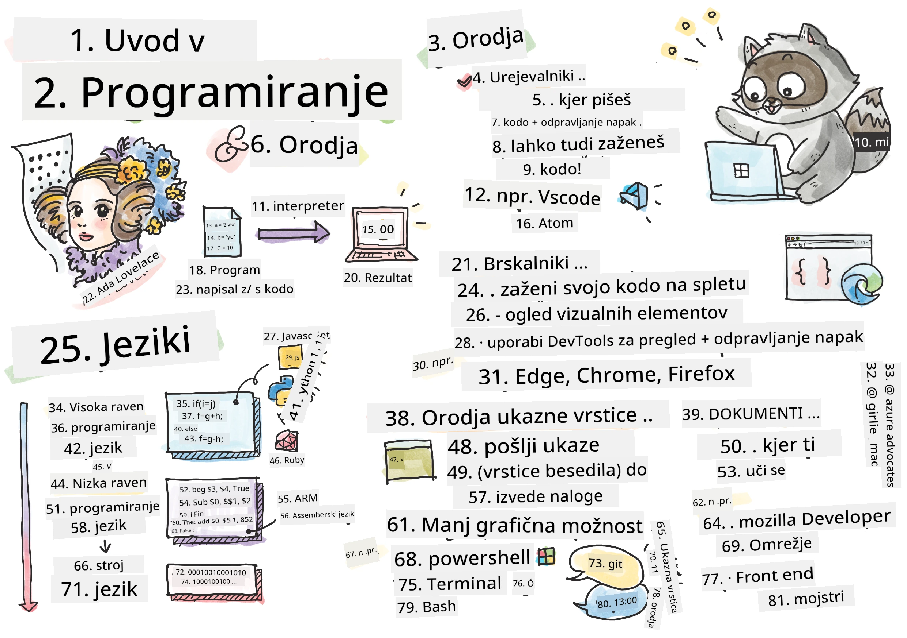
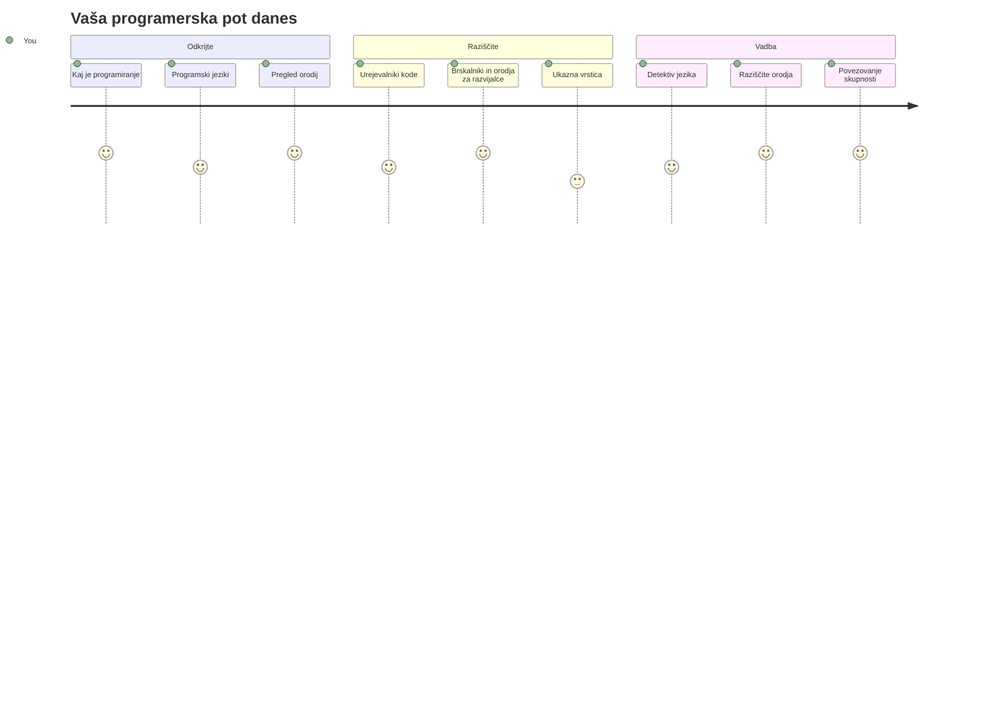
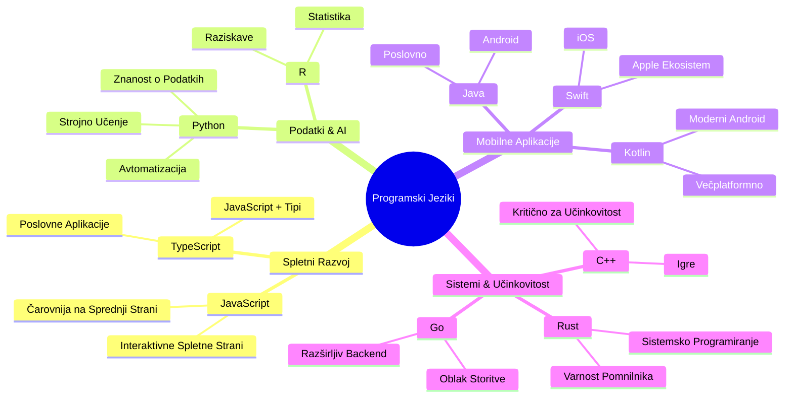
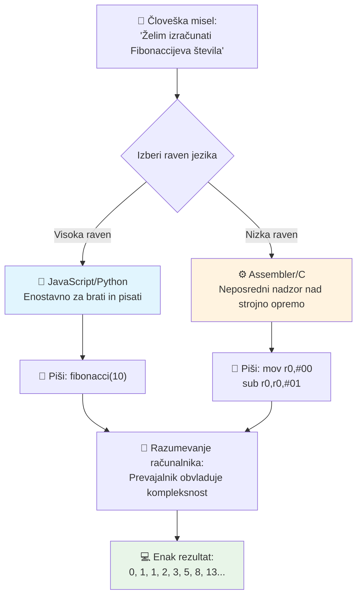
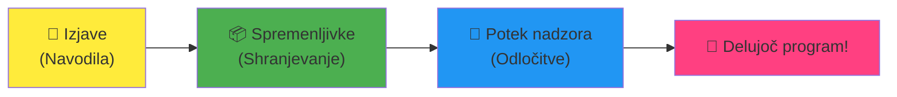
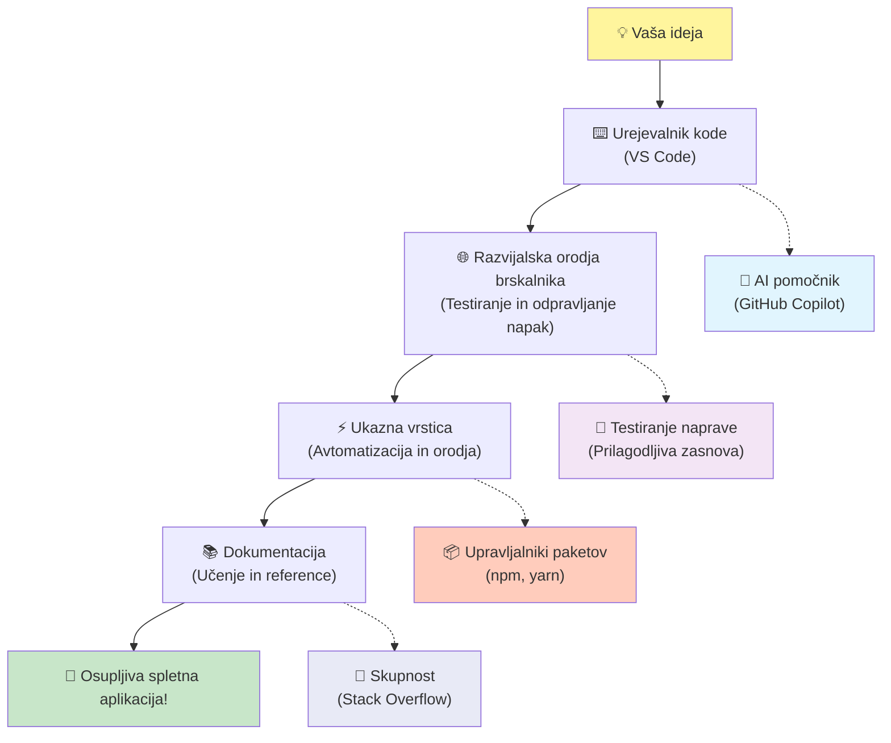
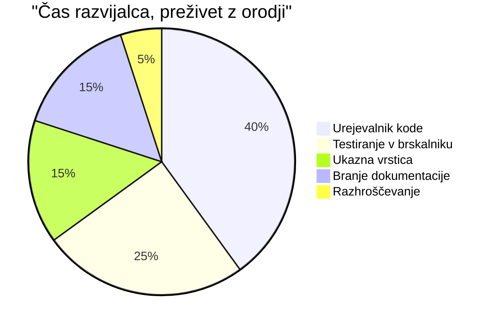
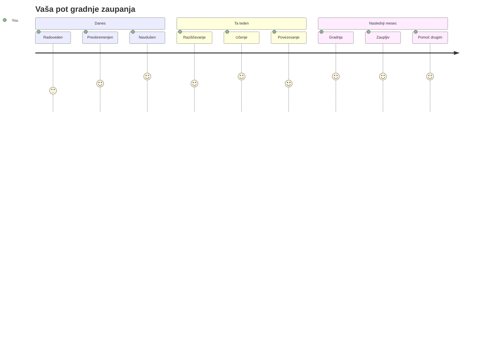

# Uvod v programske jezike in sodobna orodja za razvijalce

Živjo, bodoči razvijalec! 👋 Lahko ti povem nekaj, kar mi še vedno vsak dan privabi mravljince? Kmalu boš odkril, da programiranje ni zgolj o računalnikih – temveč o pravih supermočeh, s katerimi uresničiš svoje najbolj divje ideje!

Poznaš tisti trenutek, ko uporabljaš svojo najljubšo aplikacijo in vse enostavno perfektno funkcionira? Ko pritisneš gumb in se zgodi nekaj povsem čarobnega, da si rečeš: "o, kako pa so TO naredili?" No, nekdo prav takšen kot ti – verjetno sedi v svoji najljubši kavarni ob 2. zjutraj s tretjo espreso – je napisal kodo, ki je ustvarila to magijo. In zdaj pa nekaj, kar ti bo odpihnilo misli: do konca tega poglavja ne boš samo razumel/a, kako so to naredili, ampak boš kar čutil/a željo, da poskusiš sam/a!

Vem, da ti programiranje mogoče zdaj deluje zastrašujoče. Ko sem začel/a, sem res mislil/a, da moraš biti nek matematični genij ali da programiraš že od pete leta starosti. Ampak nekaj, kar je popolnoma spremenilo moj pogled: programiranje je natanko kot učenje pogovora v novem jeziku. Začeneš z "živelj" in "hvala", potem naročiš kavo in predno se zavedaš, vodiš globoke filozofske debate! Razlika je v tem, da se tokrat pogovarjaš z računalniki, ki so res najstrapžljivejši sogovorniki, kar jih lahko imaš – nikoli ne sodijo tvoje napake in vedno so navdušeni, da poskusiš še enkrat!

Danes bomo raziskovali neverjetna orodja, ki sodobni spletni razvoj naredijo ne samo mogoč, ampak res zasvojen. Govorim o točno tistih urejevalnikih, brskalnikih in potekih dela, ki jih vsak dan uporabljajo razvijalci pri Netflixu, Spotifyju in tvoji najljubši indie aplikaciji. In najboljši del? Večina teh profesionalnih orodij je popolnoma brezplačna!


> Sketchnote avtorja [Tomomi Imura](https://twitter.com/girlie_mac)


```mermaid
journey
    title Vaša programerska pot danes
    section Odkrijte
      Kaj je programiranje: 5: You
      Programski jeziki: 4: You
      Pregled orodij: 5: You
    section Raziščite
      Urejevalniki kode: 4: You
      Brskalniki in orodja za razvijalce: 5: You
      Ukazna vrstica: 3: You
    section Vadba
      Detektiv jezika: 4: You
      Raziščite orodja: 5: You
      Povezovanje skupnosti: 5: You
```
## Poglejmo, kaj že veš!

Preden skočimo v zabavne stvari, me zanima – kaj že veš o tem svetu programiranja? In poslušaj, če gledaš ta vprašanja in misliš "o tem nimam popolnoma nobene predstave," to ni samo v redu, to je popolno! To pomeni, da si na pravem mestu. Razmišljaj o tem kvizu kot o raztezanju pred vadbo – samo ogrevamo možganske mišice!

[Reši predhodni kviz](https://ff-quizzes.netlify.app/web/)


## Pustolovščina, na katero bomo šli skupaj

V redu, res sem navdušen/a nad tem, kar bomo danes raziskovali! Resno, rad/a bi videl/a tvoj obraz, ko ti bodo nekatere od teh konceptov kliknili. Tukaj je neverjetno potovanje, ki ga ustvarjamo skupaj:

- **Kaj programiranje pravzaprav je (in zakaj je najkul stvar vseh časov!)** – Odkrijemo, kako je koda dobesedno nevidna magija, ki poganja vse okoli tebe, od tistega alarma, ki nekako ve, da je ponedeljek zjutraj, do algoritma, ki popolno izbira tvoje Netflix priporočila
- **Programski jeziki in njihove čudovite osebnosti** – Predstavljaj si, da prideš na zabavo, kjer ima vsak povsem drugačne supermoči in načine reševanja problemov. Tako je svet programskih jezikov, in ti jih boš naravnost oboževal/a!
- **Temeljni gradniki, ki ustvarijo digitalno magijo** – Predstavljaj si jih kot najkreativnejši LEGO komplet. Ko enkrat razumeš, kako se ti deli povezujejo, boš uvidel/a, da lahko gradiš prav karkoli si tvoja domišljija zamisli
- **Profesionalna orodja, ki ti bodo dala občutek, kot da si ravnokar prejel/a čarovniško palico** – Ne pretiravam – ta orodja ti bodo res dala občutek supermoči, najboljši del? To so ista orodja, ki jih uporabljajo strokovnjaki!

> 💡 **Tukaj je nekaj:** Danes si niti ne predstavljaj, da moraš vse zapomniti! Trenutno želim le, da začutiš iskro navdušenja nad mogočim. Podrobnosti se bodo naravno utrdile, ko bomo skupaj vadili – tako se dejansko uči!

> To lekcijo lahko opraviš tudi na [Microsoft Learn](https://learn.microsoft.com/en-us/learn/modules/web-development-101/introduction-programming/?WT.mc_id=academic-77807-sagibbon)!

## Kaj torej točno *je* programiranje?

V redu, lotimo se milijonskega vprašanja: kaj programiranje pravzaprav je?

Povedal/a ti bom zgodbo, ki je popolnoma spremenila moj pogled. Prejšnji teden sem poskušal/a mami razložiti, kako uporabljati naš novi pametni daljinec. Ujel/a sem se, da govorim nekaj takega: "Pritisni rdeči gumb, ampak ne tistega velikega rdečega, malega rdečega na levi... ne, tvoj drugi levi... zdaj ga zadrži dve sekundi, ne eno, ne tri..." Zveni znano? 😅

To je programiranje! Je umetnost dajanja izjemno podrobnih, korak za korakom navodil nečemu, kar je zelo močno, a potrebuje popolnoma natančna navodila. Razlika je, da ne razlagaš mami (ki lahko vpraša "kateri rdeči gumb?!"), temveč računalniku (ki naredi točno to, kar mu rečeš, tudi če to, kar si rekel/a, ni najbolj točno to, kar si mislil/a).

Najbolj me je šokiralo, ko sem se to naučil/a: računalniki so v svoji jedrni biti pravzaprav zelo preprosti. Razumejo samo dve stvari – 1 in 0, kar je v bistvu "da" in "ne" ali "vklopljeno" in "izklopljeno". To je vse! Ampak tukaj se zgodi čarovnija – ni treba, da govorimo v 1 in 0, kot da smo v Matriksi. Tukaj na pomoč pridejo **programski jeziki**. So kot najboljši prevajalec na svetu, ki vzame tvoje povsem normalne človeške misli in jih pretvori v računalniški jezik.

In nekaj, kar mi še vedno vsak jutro povzroča mravljince: dobesedno *vse* digitalno v tvojem življenju se je začelo z nekom prav takšnim kot ti, verjetno v pižami s skodelico kave, kako tipka kodo na prenosniku. Ta Instagram filter, ki te naredi brezhibnega? Nekdo je to zakodiral. Priporočilo, ki te je spodbudilo k tvoji novi najljubši pesmi? Razvijalec je napisal ta algoritem. Aplikacija, ki ti pomaga deliti račune za večerjo s prijatelji? Ja, nekdo je pomislil "to je nadležno, sigurno lahko to popravim" in potem... je naredil!

Ko se naučiš programirati, ne pridobiš samo nove veščine – postaneš del te neverjetne skupnosti reševalcev problemov, ki preživljajo dneve z vprašanjem: "Kaj če bi lahko zgradil/a nekaj, kar nekoga naredi dan malo boljši?" Resno, ali lahko kaj še bolj kul obstaja?

✅ **Zabavna dejstva**: Tukaj imaš nekaj super zanimivega, ko boš imel/a čas – kdo je bil prvi računalniški programer na svetu? Malce ti napovem: mogoče ni, koga pričakuješ! Zgodba tega človeka je naravnost fascinantna in pokaže, da je programiranje vedno bilo o ustvarjalnem reševanju problemov in razmišljanju izven okvirjev.

### 🧠 **Čas za preverjanje: Kako se počutiš?**

**Vzemi trenutek za razmislek:**
- Ali idea "davanja navodil računalnikom" zdaj nima smisla?
- Se spomniš katerega dnevnega opravila, ki bi ga rad/a avtomatiziral/a s programiranjem?
- Kakšna vprašanja ti že brbotajo po glavi o vsem tem programiranju?

> **Zapomni si**: Popolnoma normalno je, če ti nekateri pojmi zdaj delujejo megleno. Učenje programiranja je kot učenje novega jezika – možgani potrebujejo čas, da vzpostavijo nove povezave. Super delaš!

## Programske jezike lahko primerjamo z različnimi okusi magije

V redu, to bo mogoče zvenelo čudno, a ostani z mano – programski jeziki so kot različni glasbeni stili. Pomisli: imaš jazz, ki je gladek in improvizacijski, rock, ki je močan in neposreden, klasično glasbo, ki je elegantna in strukturirana, in hip-hop, ki je ustvarjalen in izrazit. Vsak stil ima svojo vibracijo, svojo skupnost navdušencev in vsak je primeren za različna razpoloženja in priložnosti.

Programski jeziki delujejo povsem enako! Ne bi uporabil/a istega jezika za izdelavo zabavne mobilne igre kot za obdelavo ogromnih količin podnebnih podatkov, tako kot ne bi predvajal/a death metala na jogi (no, večinoma jogi! 😄).

Ampak tukaj me vedno znova navduši: ti jeziki so kot najbolj potrpežljiv in briljanten tolmač na svetu, ki sedi zraven tebe. Lahko izraziš svoje ideje na način, ki je naraven tvojemu človeškemu umu, oni pa opravijo vse neverjetno zahtevno delo pretvorbe v 1 in 0, ki jih računalniki dejansko govorijo. To je kot imeti prijatelja, ki perfektno govori tako "človeško ustvarjalnost" kot "računalniško logiko" – in nikoli se ne utrudi, nikoli ne potrebuje odmora za kavo in nikoli ne sodi, če vprašaš isto vprašanje dvakrat!

### Priljubljeni programski jeziki in njihove uporabe


```mermaid
mindmap
  root((Programski Jeziki))
    Spletni Razvoj
      JavaScript
        Čarovnija na Sprednji Strani
        Interaktivne Spletne Strani
      TypeScript
        JavaScript + Tipi
        Poslovne Aplikacije
    Podatki & AI
      Python
        Znanost o Podatkih
        Strojno Učenje
        Avtomatizacija
      R
        Statistika
        Raziskave
    Mobilne Aplikacije
      Java
        Android
        Poslovno
      Swift
        iOS
        Apple Ekosistem
      Kotlin
        Moderni Android
        Večplatformno
    Sistemi & Učinkovitost
      C++
        Igre
        Kritično za Učinkovitost
      Rust
        Varnost Pomnilnika
        Sistemsko Programiranje
      Go
        Oblak Storitve
        Razširljiv Backend
```
| Jezik | Najbolj za | Zakaj je priljubljen |
|----------|----------|------------------|
| **JavaScript** | Spletni razvoj, uporabniški vmesniki | Teče v brskalnikih in poganja interaktivne spletne strani |
| **Python** | Podatkovna znanost, avtomatizacija, AI | Enostaven za branje in učenje, močne knjižnice |
| **Java** | Poslovne aplikacije, Android aplikacije | Neodvisen od platforme, zanesljiv za velike sisteme |
| **C#** | Windows aplikacije, razvoj iger | Močna podpora Microsoft ekosistema |
| **Go** | Oblačne storitve, backend sistemi | Hiter, preprost, zasnovan za sodobno računalništvo |

### Visoko-nivojski proti nizko-nivojskim jezikom

V redu, to je bil iskreno koncept, ki mi je zmešal možgane, ko sem začel/a, zato ti bom razložil/a analogijo, ki mi je končno naredila vse jasno – in upam, da ti bo pomagala tudi tebi!

Predstavljaj si, da obiščeš državo, kjer ne govoriš jezika in obupno iščeš najbližji WC (smo bili vsi tam, kajne? 😅):

- **Nizko-nivojsko programiranje** je kot da se naučiš lokalni dialekt tako dobro, da se lahko pogovarjaš z babico, ki prodaja sadje na vogalu, z lokalnimi izrazi, slengom in zafrkancijami, ki jih razume le nekdo, ki je tam odraščal. Zelo impresivno in izjemno učinkovito... če si tekoč! A dokaj zmedeno, če samo iščeš WC.

- **Visoko-nivojsko programiranje** je kot da imaš tega čudovitega lokalnega prijatelja, ki te razume. Lahko rečeš "Res rabim najti stranišče" v čisti angleščini, on pa poskrbi za prevod kulture in ti poda navodila, ki so popolnoma razumljiva tvojemu nemestu umu.

V programerskih izrazih:
- **Nizko-nivojski jeziki** (kot Assembly ali C) ti omogočajo izjemno podrobne pogovore z dejansko strojno opremo računalnika, a moraš razmišljati kot stroj, kar je... no, recimo, velika mentalna sprememba!
- **Visoko-nivojski jeziki** (kot JavaScript, Python ali C#) ti omogočajo razmišljanje kot človek, medtem ko oni skrbijo za vse strojno govorjenje v ozadju. Poleg tega imajo te jezike izjemno gostoljubne skupnosti polne ljudi, ki se spomnijo, kako je bilo biti novinec in resnično želijo pomagati!

Ugani, katere jezike ti bom predlagal/a za začetek? 😉 Visoko-nivojski jeziki so kot pomožni kolesci, ki jih dejansko ne želiš sneti, ker naredijo celotno izkušnjo veliko bolj zabavno!


```mermaid
flowchart TB
    A["👤 Človeška misel:<br/>'Želim izračunati Fibonaccijeva števila'"] --> B{Izberi raven jezika}
    
    B -->|Visoka raven| C["🌟 JavaScript/Python<br/>Enostavno za brati in pisati"]
    B -->|Nizka raven| D["⚙️ Assembler/C<br/>Neposredni nadzor nad strojno opremo"]
    
    C --> E["📝 Piši: fibonacci(10)"]
    D --> F["📝 Piši: mov r0,#00<br/>sub r0,r0,#01"]
    
    E --> G["🤖 Razumevanje računalnika:<br/>Prevajalnik obvladuje kompleksnost"]
    F --> G
    
    G --> H["💻 Enak rezultat:<br/>0, 1, 1, 2, 3, 5, 8, 13..."]
    
    style C fill:#e1f5fe
    style D fill:#fff3e0
    style H fill:#e8f5e8
```
### Dovolite, da ti pokažem, zakaj so visoko-nivojski jeziki tako bolj prijazni

Prav, pokazal/a ti bom nekaj, kar popolnoma prikaže, zakaj sem se zaljubil/a v visoko-nivojske jezike, a najprej – želim, da mi nekaj obljubiš. Ko vidiš prvi primer kode, ne paničari! Namenjeno je, da izgleda zastrašujoče. Točno to hočem povedati!

Ogledali si bomo točno isto nalogo napisano v dveh povsem različnih slogih. Obe ustvarjata tako imenovano Fibonaccijevo zaporedje – to je čudovit matematični vzorec, kjer je vsak naslednji člen vsota dveh prejšnjih: 0, 1, 1, 2, 3, 5, 8, 13... (Zabavna dejstva: ta vzorec najdeš povsod v naravi – spirale sončničnih semen, vzorci storžev, celo kako nastajajo galaksije!)

Pripravljen/a pogleda razliko? Gremo!

**Visoko-nivojski jezik (JavaScript) – Prijazen človeku:**

```javascript
// Korak 1: Osnovna nastavitev Fibonaccijevega zaporedja
const fibonacciCount = 10;
let current = 0;
let next = 1;

console.log('Fibonacci sequence:');
```

**To ta koda naredi:**
- **Določi** konstanto, ki pove, koliko Fibonacci števil želimo ustvariti
- **Inicira** dve spremenljivki za sledenje trenutnemu in naslednjemu številu v zaporedju
- **Nastavi** začetne vrednosti (0 in 1), ki definirajo Fibonacci vzorec
- **Izpiše** naslovno sporočilo za označitev izhoda

```javascript
// Korak 2: Ustvarite zaporedje z zanko
for (let i = 0; i < fibonacciCount; i++) {
  console.log(`Position ${i + 1}: ${current}`);
  
  // Izračunajte naslednje število v zaporedju
  const sum = current + next;
  current = next;
  next = sum;
}
```

**Tukaj se zgodi to:**
- **Ponavlja** skozi vsako pozicijo v zaporedju s pomočjo zanke `for`
- **Izpiše** vsako številko s pozicijo z uporabo predloge za oblikovanje niza
- **Izračuna** naslednje Fibonacci število z seštevanjem trenutnega in naslednjega
- **Posodobi** spremenljivke za sledenje za premik na naslednjo iteracijo

```javascript
// Korak 3: Sodobni funkcionalni pristop
const generateFibonacci = (count) => {
  const sequence = [0, 1];
  
  for (let i = 2; i < count; i++) {
    sequence[i] = sequence[i - 1] + sequence[i - 2];
  }
  
  return sequence;
};

// Primer uporabe
const fibSequence = generateFibonacci(10);
console.log(fibSequence);
```

**V zgornjem smo:**
- **Ustvarili** ponovno uporabno funkcijo z uporabo sodobne sintakse puščic
- **Zgradili** polje, da shranimo celotno zaporedje namesto, da ga izpisujemo eno po eno
- **Uporabili** indeksiranje polja za izračun vsakega novega števila iz prejšnjih vrednosti
- **Vrnil** celotno zaporedje za prilagodljivo uporabo v drugih delih programa

**Nizko-nivojski jezik (ARM Assembly) – Prijazen računalniku:**

```assembly
 area ascen,code,readonly
 entry
 code32
 adr r0,thumb+1
 bx r0
 code16
thumb
 mov r0,#00
 sub r0,r0,#01
 mov r1,#01
 mov r4,#10
 ldr r2,=0x40000000
back add r0,r1
 str r0,[r2]
 add r2,#04
 mov r3,r0
 mov r0,r1
 mov r1,r3
 sub r4,#01
 cmp r4,#00
 bne back
 end
```

Opazi, kako JavaScript različica bere skoraj kot angleška navodila, medtem ko Assembly različica uporablja kriptirane ukaze, ki neposredno upravljajo procesor računalnika. Obe opravita isto nalogo, vendar je visoko-nivojski jezik veliko lažji za razumevanje, pisanje in vzdrževanje ljudi.

**Ključne razlike, ki jih boš opazil/a:**
- **Berljivost**: JavaScript uporablja opisna imena, kot je `fibonacciCount`, medtem ko Assembly uporablja skrivnostne oznake, kot so `r0`, `r1`
- **Komentarji**: Visokoravni jeziki spodbujajo pojasnjujoče komentarje, ki kodo naredijo samodokumentirajočo
- **Struktura**: Logični tok JavaScripta ustreza načinu, kako ljudje razmišljajo o problemih korak za korakom
- **Vzdrževanje**: Posodabljanje različice v JavaScriptu za različne zahteve je preprosto in jasno

✅ **O zaporedju Fibonaccijevih števil**: Ta popolnoma čudovit vzorec števil (kjer je vsako število vsota predhodnih dveh: 0, 1, 1, 2, 3, 5, 8...) se pojavlja prav povsod v naravi! Najdete ga v spiralah sončnic, vzorcih storžev, načinu, kako se zavijajo školjke nautilusa, in celo v tem, kako rastejo veje dreves. Res je neverjetno, kako lahko matematika in koda pomagata razumeti in znova ustvariti vzorce, ki jih narava uporablja za ustvarjanje lepote!

## Gradniki, ki ustvarjajo čarovnijo

V redu, zdaj ko ste videli, kako izgledajo programski jeziki v akciji, razčlenimo osnovne dele, ki sestavljajo prav vsak program, kar jih je bilo kdaj napisano. Predstavljajte si jih kot bistvene sestavine v vašem najljubšem receptu – ko boste razumeli, kaj vsak del počne, boste lahko brali in pisali kodo skoraj v kateremkoli jeziku!

To je nekako kot učenje slovnice programiranja. Spomnite se, ko ste v šoli spoznavali samostalnike, glagole in kako sestaviti stavke? Programiranje ima svojo različico slovnice in iskreno, ta je veliko bolj logična in odpuščajoča kot angleška slovnica! 😄

### Stavki: Navodila korak za korakom

Začnimo s **stavki** – ti so kot posamezni stavki v pogovoru z vašim računalnikom. Vsak stavek računalniku pove, naj naredi eno specifično stvar, nekako kot, ko dajete navodila: "Zavij levo tukaj," "Ustavi se na rdeči luči," "Parkiraj na tistem mestu."

Kar mi je pri stavkih všeč, je, kako berljivi so običajno. Poglejte to:

```javascript
// Osnovne izjave, ki izvajajo enotna dejanja
const userName = "Alex";                    
console.log("Hello, world!");              
const sum = 5 + 3;                         
```

**Tukaj je, kaj ta koda počne:**
- **Deklarira** konstantno spremenljivko za shranjevanje uporabnikovega imena
- **Prikaže** pozdravno sporočilo v konzolnem izhodu
- **Izračuna** in shrani rezultat matematične operacije

```javascript
// Izjave, ki sodelujejo z spletnimi stranmi
document.title = "My Awesome Website";      
document.body.style.backgroundColor = "lightblue";
```

**Korak za korakom, kaj se dogaja:**
- **Spremeni** naslov spletne strani, ki se prikaže v zavihku brskalnika
- **Spremeni** barvo ozadja celotnega telesa strani

### Spremenljivke: Pomnilniški sistem vašega programa

V redu, **spremenljivke** so iskreno eno mojih najljubših konceptov za poučevanje, saj so zelo podobne stvarem, ki jih vsakodnevno uporabljate!

Pomislite za trenutek na svoj seznam stikov v telefonu. Ne pomnite vseh telefonskih številk – raje shranite "Mama," "Najboljši prijatelj," ali "Pizzerija, ki dostavlja do 2. ure zjutraj" in telefon si zapomni dejanske številke. Spremenljivke delujejo natanko tako! So kot označeni zabojniki, kamor vaš program lahko shrani informacije in jih pozneje pridobi z imenom, ki dejansko nekaj pomeni.

Tukaj je nekaj res kul: spremenljivke se lahko spreminjajo, ko vaš program teče (od tod tudi ime "spremenljivka" – vidite, kaj so naredili?). Tako kot lahko posodobite stik za pizzerijo, ko odkrijete še boljšo, lahko spremenljivke posodobite, ko se program nauči novih informacij ali se okoliščine spremenijo!

Dovolite, da vam pokažem, kako lahko to čudovito preprosto izgleda:

```javascript
// Korak 1: Ustvarjanje osnovnih spremenljivk
const siteName = "Weather Dashboard";        
let currentWeather = "sunny";               
let temperature = 75;                       
let isRaining = false;                      
```

**Razumevanje teh konceptov:**
- **Shranjuje** nespremenljive vrednosti v `const` spremenljivkah (na primer ime strani)
- **Uporablja** `let` za vrednosti, ki se skozi program lahko spreminjajo
- **Dodeli** različne tipe podatkov: nize (besedilo), številke in logične vrednosti (true/false)
- **Izbere** opisna imena, ki pojasnjujejo, kaj vsaka spremenljivka vsebuje

```javascript
// Korak 2: Delo z objekti za združevanje povezanih podatkov
const weatherData = {                       
  location: "San Francisco",
  humidity: 65,
  windSpeed: 12
};
```

**V zgornjem primeru smo:**
- **Ustvarili** objekt za skupno združevanje sorodnih vremenskih informacij
- **Organizirali** več podatkov pod eno ime spremenljivke
- **Uporabili** pare ključ-vrednost za jasno označevanje posameznih informacij

```javascript
// Korak 3: Uporaba in posodabljanje spremenljivk
console.log(`${siteName}: Today is ${currentWeather} and ${temperature}°F`);
console.log(`Wind speed: ${weatherData.windSpeed} mph`);

// Posodabljanje spremenljivk, ki jih je mogoče spreminjati
currentWeather = "cloudy";                  
temperature = 68;                          
```

**Razumevanje vsakega dela:**
- **Prikazuje** informacije s pomočjo predlog (template literals) s sintakso `${}`
- **Dostopa** do lastnosti objekta z uporabo pike (`weatherData.windSpeed`)
- **Posodablja** spremenljivke, deklarirane z `let`, da odražajo spreminjajoče se pogoje
- **Kombinira** več spremenljivk za ustvarjanje smiselnih sporočil

```javascript
// Korak 4: Sodobno razstavljanje za čistejšo kodo
const { location, humidity } = weatherData; 
console.log(`${location} humidity: ${humidity}%`);
```

**Kar morate vedeti:**
- **Izvleče** specifične lastnosti iz objektov z uporabo destrukturiranja
- **Ustvari** nove spremenljivke samodejno z enakimi imeni kot ključi v objektu
- **Poenostavi** kodo z izogibanjem ponavljajoči se uporabi pike

### Nadzorni tok: Učenje programa razmišljanja

V redu, tukaj programiranje postane popolnoma osupljivo! **Nadzorni tok** je pravzaprav učenje vašega programa, kako sprejemati pametne odločitve, natanko tako kot to počnete vi vsak dan, ne da bi se tega sploh zavedali.

Predstavljajte si: zjutraj ste verjetno izpeljali nekaj v slogu "Če dežuje, vzamem dežnik. Če je mrzlo, oblečem jakno. Če zamujam, preskočim zajtrk in vzamem kavo na poti." Vaš možgan naravno sledijo tej if-then logiki desetinekrat na dan!

To je tisto, kar programe naredi za pametne in žive, namesto da bi samo sledili kakšnemu dolgočasnemu, predvidljivemu scenariju. Dejansko lahko pogledajo situacijo, ocenijo, kaj se dogaja, in ustrezno reagirajo. To je kot da vašemu programu daste možgane, ki se lahko prilagajajo in sprejemajo odločitve!

Želite videti, kako čudovito to deluje? Dovolite, da vam pokažem:

```javascript
// Korak 1: Osnovna pogojna logika
const userAge = 17;

if (userAge >= 18) {
  console.log("You can vote!");
} else {
  const yearsToWait = 18 - userAge;
  console.log(`You'll be able to vote in ${yearsToWait} year(s).`);
}
```

**Kaj ta koda počne:**
- **Preveri**, ali uporabnikova starost izpolnjuje zahteve za glasovanje
- **Izvede** različne bloke kode glede na rezultat pogoja
- **Izračuna** in prikaže, koliko časa še do dopolnitve 18 let za volilno pravico
- **Ponudi** specifične in koristne povratne informacije za vsako situacijo

```javascript
// Korak 2: Več pogojev z logičnimi operatorji
const userAge = 17;
const hasPermission = true;

if (userAge >= 18 && hasPermission) {
  console.log("Access granted: You can enter the venue.");
} else if (userAge >= 16) {
  console.log("You need parent permission to enter.");
} else {
  console.log("Sorry, you must be at least 16 years old.");
}
```

**Razčlenitev dogajanja:**
- **Združi** več pogojev z uporabo operatorja `&&` (in)
- **Ustvari** hierarhijo pogojev z `else if` za več scenarijev
- **Obravnava** vse možne primere z zadnjim `else` stavkom
- **Ponuja** jasne, uporabne povratne informacije za različne situacije

```javascript
// Korak 3: Jedrnat pogoj z ternarnim operatorjem
const votingStatus = userAge >= 18 ? "Can vote" : "Cannot vote yet";
console.log(`Status: ${votingStatus}`);
```

**Kaj si je treba zapomniti:**
- **Uporabi** ternarni operator (`? :`) za preproste pogoje z dvema možnostma
- **Napiši** pogoj najprej, sledijo `?`, nato resnični rezultat, nato `:`, nato lažni rezultat
- **Uporabi** ta vzorec, kadar moraš dodeliti vrednosti glede na pogoje

```javascript
// Korak 4: Ravnanje z več specifičnimi primeri
const dayOfWeek = "Tuesday";

switch (dayOfWeek) {
  case "Monday":
  case "Tuesday":
  case "Wednesday":
  case "Thursday":
  case "Friday":
    console.log("It's a weekday - time to work!");
    break;
  case "Saturday":
  case "Sunday":
    console.log("It's the weekend - time to relax!");
    break;
  default:
    console.log("Invalid day of the week");
}
```

**Kaj ta koda doseže:**
- **Primerja** vrednost spremenljivke z več specifičnimi primeri
- **Združi** podobne primere skupaj (delavniki proti vikendom)
- **Izvede** ustrezen blok kode, ko je najdeno ujemanje
- **Vključi** `default` primer za nepričakovane vrednosti
- **Uporabi** izjave `break`, da prepreči nadaljevanje kode v naslednji primer

> 💡 **Analogíja iz resničnega sveta**: Nadzorni tok je kot najbolj potrpežljiv GPS na svetu, ki vam daje navodila. Lahko reče: "Če je na Glavni ulici promet, pojdi po avtocesti. Če je avtocesta zaprta zaradi gradnje, pojdi po panoramski poti." Programi uporabljajo prav tako vrsto pogojne logike, da inteligentno odgovarjajo na različne situacije in vedno nudijo uporabnikom najboljšo možno izkušnjo.

### 🎯 **Preverjanje konceptov: Mojstrstvo gradnikov**

**Poglejmo, kako vam gre z osnovami:**
- Ali lahko z lastnimi besedami razložite razliko med spremenljivko in stavkom?
- Pomislite na resnično situacijo, kjer bi uporabili if-then odločitev (kot naš primer glasovanja)
- Kaj vas je pri logiki programiranja najbolj presenetilo?

**Hitri zagon samozavesti:**

```mermaid
flowchart LR
    A["📝 Izjave<br/>(Navodila)"] --> B["📦 Spremenljivke<br/>(Shranjevanje)"] --> C["🔀 Potek nadzora<br/>(Odločitve)"] --> D["🎉 Delujoč program!"]
    
    style A fill:#ffeb3b
    style B fill:#4caf50
    style C fill:#2196f3
    style D fill:#ff4081
```
✅ **Kaj sledi**: Čaka nas nori zabavni potop v te koncepte, ko bomo skupaj nadaljevali to neverjetno popotovanje! Zdaj pa se samo osredotočite na občutek navdušenja nad vsemi čudovitimi možnostmi, ki so vam na voljo. Specifična znanja in tehnike vam bodo pristala naravno, ko jih bomo skupaj vadili – obljubim, da bo to veliko bolj zabavno, kot si morda predstavljate!

## Orodja stroke

V redu, iskreno sem tako navdušen, da se komaj zadržim! 🚀 Pogovarjali se bomo o neverjetnih orodjih, ki vam bodo dali občutek, kot da ste pravkar dobili ključe digitalnega vesoljskega plovila.

Veste, kako ima kuhar te popolnoma izbalansirane nože, ki so kot podaljšek njegovih rok? Ali kako ima glasbenik to posebno kitaro, ki začne pela takoj, ko se je dotakne? No, razvijalci imamo svojo različico teh magičnih orodij, in tukaj je nekaj, kar vam bo popolnoma odpihnilo misli – večina njih je popolnoma brezplačnih!

Praktično skačem na stolu, ko razmišljam o tem, da jih lahko delim z vami, saj so popolnoma spremenila način, kako ustvarjamo programsko opremo. Govorimo o asistenti za pisanje kode, ki jih poganja AI in lahko pomagajo pisati vašo kodo (nisem se šalil!), oblačnih okoljih, kjer lahko ustvarjate celotne aplikacije od povsod s Wi-Fi povezavo, ter orodjih za odpravljanje napak, tako dovršenih, kot da imate rentgenski pogled na vaše programe.

In tukaj je del, ki me še vedno navdušuje: to niso orodja samo za začetnike, ki jih boste hitro prerasli. To so povsem ista profesionalna orodja, kot jih trenutno uporabljajo razvijalci v Googlu, Netflixu in tistem indie studiu za aplikacije, ki jih obožujete. Ob uporabi se boste počutili kot pravi profesionalec!


```mermaid
graph TD
    A["💡 Vaša ideja"] --> B["⌨️ Urejevalnik kode<br/>(VS Code)"] 
    B --> C["🌐 Razvijalska orodja brskalnika<br/>(Testiranje in odpravljanje napak)"]
    C --> D["⚡ Ukazna vrstica<br/>(Avtomatizacija in orodja)"]
    D --> E["📚 Dokumentacija<br/>(Učenje in reference)"]
    E --> F["🚀 Osupljiva spletna aplikacija!"]
    
    B -.-> G["🤖 AI pomočnik<br/>(GitHub Copilot)"]
    C -.-> H["📱 Testiranje naprave<br/>(Prilagodljiva zasnova)"]
    D -.-> I["📦 Upravljalniki paketov<br/>(npm, yarn)"]
    E -.-> J["👥 Skupnost<br/>(Stack Overflow)"]
    
    style A fill:#fff59d
    style F fill:#c8e6c9
    style G fill:#e1f5fe
    style H fill:#f3e5f5
    style I fill:#ffccbc
    style J fill:#e8eaf6
```
### Urejevalniki kode in IDE-ji: Vaši novi digitalni najboljši prijatelji

Pogovorimo se o urejevalnikih kode – ti bodo kmalu postali vaša najljubša mesta za ustvarjanje! Predstavljajte si jih kot svoje osebno zatočišče programiranja, kjer boste preživeli večino svojega časa, ustvarjajoč in izpopolnjujoč svoje digitalne stvaritve.

Toda tukaj je nekaj, kar je popolnoma čarobno pri sodobnih urejevalnikih: niso le navadni urejevalniki besedila. So kot najbolj briljanten, podpornik programiranja, ki sedi ob vas 24/7. Ujamejo vaše tipkarske napake, preden jih sploh opazite, predlagajo izboljšave, ki vam dajo videz genija, pomagajo razumeti, kaj vsak del kode počne, nekateri celo napovedo, kaj boste vtipkali in ponudijo, da dokončajo vaše misli!

Spomnim se, ko sem prvič odkril samodejno dokončevanje – dobesedno sem se počutil, kot da živim v prihodnosti. Začnete tipkati nekaj in vaš urejevalnik reče: "Hej, si mislil na to funkcijo, ki točno počne, kar potrebuješ?" Kot da imate bralca misli za programskega prijatelja!

**Kaj naredi te urejevalnike tako neverjetne?**

Sodobni urejevalniki kode ponujajo impresiven nabor funkcij, ki povečujejo vašo produktivnost:

| Funkcija | Kaj počne | Zakaj pomaga |
|---------|--------------|--------------|
| **Poudarjanje sintakse** | Barva različne dele vaše kode | Olajša branje kode in zaznavanje napak |
| **Samodejno dokončevanje** | Predlaga kodo med tipkanjem | Pospeši pisanje kode in zmanjša tipkarske napake |
| **Orodja za odpravljanje napak** | Pomaga najti in popraviti napake | Prihrani ure reševanja težav |
| **Razširitve** | Dodajo specializirane funkcije | Prilagodite svoj urejevalnik za katero koli tehnologijo |
| **AI asistenti** | Predlaga kodo in pojasnila | Pospeši učenje in produktivnost |

> 🎥 **Video gradivo**: Želite videti ta orodja v akciji? Oglejte si ta [Tools of the Trade video](https://youtube.com/watch?v=69WJeXGBdxg), ki vam ponudi celovit pregled.

#### Priporočeni urejevalniki za spletni razvoj

**[Visual Studio Code](https://code.visualstudio.com/?WT.mc_id=academic-77807-sagibbon)** (brezplačno)  
- Najbolj priljubljen med spletnimi razvijalci  
- Odličen ekosistem razširitev  
- Vgrajen terminal in integracija z Gitom  
- **Obvezne razširitve**:  
  - [GitHub Copilot](https://marketplace.visualstudio.com/items?itemName=GitHub.copilot) - AI-pogona predlogi kode  
  - [Live Share](https://marketplace.visualstudio.com/items?itemName=MS-vsliveshare.vsliveshare) - sodelovanje v realnem času  
  - [Prettier](https://marketplace.visualstudio.com/items?itemName=esbenp.prettier-vscode) - samodejno oblikovanje kode  
  - [Code Spell Checker](https://marketplace.visualstudio.com/items?itemName=streetsidesoftware.code-spell-checker) - zaznavanje tipkarskih napak v kodi

**[JetBrains WebStorm](https://www.jetbrains.com/webstorm/)** (plačljiv, brezplačen za študente)  
- Napredna orodja za odpravljanje napak in testiranje  
- Inteligentno samodejno dokončevanje kode  
- Vgrajen sistem za upravljanje različic

**Oblačni IDE-ji** (različno cenovno)  
- [GitHub Codespaces](https://github.com/features/codespaces) - popoln VS Code v brskalniku  
- [Replit](https://replit.com/) - odličen za učenje in deljenje kode  
- [StackBlitz](https://stackblitz.com/) - takojšnji spletni razvoj celotnih aplikacij

> 💡 **Nasvet za začetek**: Začnite z Visual Studio Code – je brezplačen, široko uporabljen v industriji in ima ogromno skupnost, ki ustvarja koristne vodiče in razširitve.

### Spletni brskalniki: Vaša skrivna razvojna laboratorija

V redu, pripravite se, da vam odpihne razum! Veste, kako ste brskali po družbenih omrežjih in gledali videoposnetke v brskalnikih? No, izkazalo se je, da ves ta čas skrivajo neverjetno skrivno razvojno laboratorijo, ki čaka samo, da jo odkrijete!

Vsakič, ko z desnim klikom kliknete na spletno stran in izberete "Inspect Element" (Preveri element), odpirate skriti svet orodij za razvijalce, ki so iskreno močnejša od nekaterih dragih programov, za katere sem prej plačeval sto tisoče evrov. To je kot odkritje, da vaša stara običajna kuhinja skriva profesionalno kuharsko laboratorijo za skrivnim panelom!
Prvič, ko mi je nekdo pokazal brskalnikova orodja za razvijalce, sem preživel kar tri ure, kako sem klikpal naokoli in govoril: "ČAKAJ, TO LAHKO TUDI TO?!" Dobesedno lahko urejaš katerokoli spletno stran v realnem času, vidiš točno, kako hitro se vse nalaga, testiraš, kako tvoja stran izgleda na različnih napravah, in celo odpraviš napake v JavaScriptu kot pravi profesionalec. To je popolnoma osupljivo!

**Tukaj je razlog, zakaj so brskalniki tvoja skrivna orožja:**

Ko ustvariš spletno stran ali spletno aplikacijo, moraš videti, kako izgleda in se obnaša v resničnem svetu. Brskalniki ne prikazujejo samo tvojega dela, ampak tudi ponujajo podrobne povratne informacije o zmogljivosti, dostopnosti in morebitnih težavah.

#### Orodja za razvijalce v brskalnikih (DevTools)

Sodobni brskalniki vključujejo obsežne razvojne pakete:

| Kategorija orodja | Kaj počne | Primer uporabe |
|-------------------|------------|----------------|
| **Pregledovalnik elementov** | Ogled in urejanje HTML/CSS v realnem času | Prilagajanje sloga za takojšnje rezultate |
| **Konzola** | Ogled sporočil o napakah in testiranje JavaScripta | Odpravljanje težav in eksperimentiranje s kodo |
| **Mrežni monitor** | Sledenje nalaganju virov | Optimizacija zmogljivosti in časa nalaganja |
| **Preverjevalnik dostopnosti** | Testiranje vključujočega oblikovanja | Zagotovitev, da stran deluje za vse uporabnike |
| **Simulator naprav** | Predogled na različnih velikostih zaslona | Testiranje prilagodljivega oblikovanja brez več naprav |

#### Priporočeni brskalniki za razvoj

- **[Chrome](https://developers.google.com/web/tools/chrome-devtools/)** - industrijski standard DevTools z obsežno dokumentacijo
- **[Firefox](https://developer.mozilla.org/docs/Tools)** - odlična orodja za CSS Grid in dostopnost
- **[Edge](https://docs.microsoft.com/microsoft-edge/devtools-guide-chromium/?WT.mc_id=academic-77807-sagibbon)** - zgrajen na Chromiumu z Microsoftovimi razvojnimi viri

> ⚠️ **Pomemben nasvet za testiranje**: Vedno preizkušaj svoje spletne strani v več brskalnikih! Kar deluje popolno v Chromu, je lahko videti drugače v Safariju ali Firefoxu. Profesionalni razvijalci testirajo na vseh glavnih brskalnikih, da zagotovijo dosledno uporabniško izkušnjo.


### Orodja ukazne vrstice: tvoja vrata do razvijalskih supermoči

Prav, bodimo povsem iskreni glede ukazne vrstice, ker želim, da slišite to od nekoga, ki to res razume. Ko sem jo prvič videl – le ta zastrašujoč črni zaslon s svetlečim besedilom – sem dobesedno pomislil: "Ne, prav nič! To je videti kot nekaj iz hekerskega filma iz osemdesetih, in nisem dovolj pameten za to!" 😅

Ampak tukaj je tisto, kar bi si takrat želel, da mi je nekdo povedal, in kar ti pravim zdaj: ukazna vrstica ni strašljiva – pravzaprav je kot neposreden pogovor s tvojim računalnikom. Pomisli nanjo kot razliko med naročilom hrane preko lepe aplikacije s slikami in meniji (kar je prijetno in enostavno) ter vstopom v tvojo najljubšo lokalno restavracijo, kjer kuhar točno ve, kaj ti je všeč, in lahko hitro pripravi nekaj popolnega samo zato, ker rečeš: "Preseneti me s čim neverjetnim."

Ukazna vrstica je prostor, kjer se razvijalci počutijo kot pravi čarovniki. Vpišeš nekaj na videz čarobnih besed (okej, so samo ukazi, ampak se zdijo čarobni!), pritisneš enter in BOOM – ustvaril si celotno strukturo projekta, namestil močna orodja z vsega sveta ali pa svoj app objavil na internetu za milijone ljudi, da ga vidijo. Ko enkrat okušaš to moč, je resnično precej zasvojljivo!

**Zakaj bo ukazna vrstica tvoje najljubše orodje:**

Medtem ko so grafični vmesniki odlični za mnogo opravil, ukazna vrstica izstopa pri avtomatizaciji, natančnosti in hitrosti. Veliko razvojnih orodij deluje predvsem prek ukaznih vmesnikov, in učenje njihove učinkovite uporabe lahko močno izboljša tvojo produktivnost.

```bash
# 1. korak: Ustvarite mapo projekta in se vanjo pomaknite
mkdir my-awesome-website
cd my-awesome-website
```

**Tukaj je, kaj ta koda počne:**
- **Ustvari** novo imenik z imenom "my-awesome-website" za tvoj projekt
- **Vstopi** v novo ustvarjeni imenik, da začneš delati

```bash
# Korak 2: Inicializirajte projekt s package.json
npm init -y

# Namestite sodobna razvojna orodja
npm install --save-dev vite prettier eslint
npm install --save-dev @eslint/js
```

**Korak za korakom, tukaj se dogaja:**
- **Inicializira** nov Node.js projekt z privzetimi nastavitvami z `npm init -y`
- **Namesti** Vite kot moderno orodje za hitro razvojno in produkcijsko gradnjo
- **Doda** Prettier za samodejno oblikovanje kode in ESLint za preverjanje kakovosti kode
- **Uporabi** zastavico `--save-dev`, da označi te kot odvisnosti samo za razvoj

```bash
# Korak 3: Ustvarite strukturo projekta in datoteke
mkdir src assets
echo '<!DOCTYPE html><html><head><title>My Site</title></head><body><h1>Hello World</h1></body></html>' > index.html

# Zaženite razvojni strežnik
npx vite
```

**Zgornje smo:**
- **Organizirali** svoj projekt z ustvarjanjem ločenih map za izvorno kodo in sredstva
- **Ustvarili** osnovno HTML datoteko s pravilno dokumentno strukturo
- **Zagnali** Vite razvojni strežnik za živo osveževanje in vročo zamenjavo modulov

#### Ključna orodja ukazne vrstice za spletni razvoj

| Orodje | Namen | Zakaj ga potrebuješ |
|--------|--------|--------------------|
| **[Git](https://git-scm.com/)** | Nadzor različic | Sledenje spremembam, sodelovanje z drugimi, varnostno kopiranje tvojega dela |
| **[Node.js & npm](https://nodejs.org/)** | JavaScript runtime in upravljanje paketov | Zagon JavaScript izven brskalnikov, namestitev sodobnih razvojnih orodij |
| **[Vite](https://vitejs.dev/)** | Orodje za gradnjo in razvojni strežnik | Strela hitro razvijanje z vročo zamenjavo modulov |
| **[ESLint](https://eslint.org/)** | Kakovost kode | Samodejno iskanje in odpravljanje težav v tvojem JavaScriptu |
| **[Prettier](https://prettier.io/)** | Oblikovanje kode | Ohranjanje dosledne oblike in berljivosti tvoje kode |

#### Platformno-specifične možnosti

**Windows:**
- **[Windows Terminal](https://docs.microsoft.com/windows/terminal/?WT.mc_id=academic-77807-sagibbon)** - sodoben, bogat z funkcijami terminal
- **[PowerShell](https://docs.microsoft.com/powershell/?WT.mc_id=academic-77807-sagibbon)** 💻 - zmogljivo skriptno okolje
- **[Command Prompt](https://learn.microsoft.com/windows-server/administration/windows-commands/windows-commands)** 💻 - tradicionalna Windows ukazna vrstica

**macOS:**
- **[Terminal](https://support.apple.com/guide/terminal/)** 💻 - vgrajena terminalska aplikacija
- **[iTerm2](https://iterm2.com/)** - naprednejši terminal z dodatnimi funkcijami

**Linux:**
- **[Bash](https://www.gnu.org/software/bash/)** 💻 - standardna Linux lupina
- **[KDE Konsole](https://docs.kde.org/trunk5/en/konsole/konsole/index.html)** - napreden emulator terminala

> 💻 = Prednameščeno v operacijskem sistemu

> 🎯 **Pot učenja**: Začni z osnovnimi ukazi, kot so `cd` (spremeni imenik), `ls` ali `dir` (prikaz datotek) in `mkdir` (ustvari mapo). Vadite z ukazi za sodoben potek dela, kot so `npm install`, `git status` in `code .` (odpre trenutno mapo v VS Code). Ko boš bolj vešč, boš naravno osvojil naprednejše ukaze in tehnike avtomatizacije.


### Dokumentacija: tvoj vedno dosegljiv mentor za učenje

Dobro, naj delim majhno skrivnost, zaradi katere se boš počutil veliko bolje kot začetnik: tudi najbolj izkušeni razvijalci preživijo velik del svojega časa z branjem dokumentacije. In to ni zato, ker ne vedo, kaj počnejo – pravzaprav je to znak modrosti!

Dokumentacijo si predstavljaj kot dostop do najbolj potrpežljivih in strokovnih učiteljev na svetu, ki so na voljo 24/7. Zalotiš se pri težavi ob 2. uri zjutraj? Dokumentacija je tam s toplim virtualnim objemom in natanko z odgovorom, ki ga potrebuješ. Hočeš izvedeti kaj o novi zanimivi funkciji, o kateri vsi govorijo? Dokumentacija te pokriva s primeri korak za korakom. Poskušaš razumeti, zakaj nekaj deluje tako, kot deluje? Uganil si – dokumentacija je pripravljena to razložiti na način, ki ti bo končno omogočil razumevanje!

Tukaj je nekaj, kar mi je popolnoma spremenilo pogled na stvari: spletni razvoj se razvija izjemno hitro in nihče (mislim absolutno nihče!) nima vsega v glavi. Videl sem starejše razvijalce z več kot 15 leti izkušenj, kako iščejo osnovno sintakso, in veš kaj? To ni sramotno – to je pametno! Ne gre za popoln spomin; gre za to, da veš, kje hitro najti zanesljive odgovore in kako jih uporabiti.

**Tukaj se dogaja prava čarovnija:**

Profesionalni razvijalci preživijo znatno količino svojega časa z branjem dokumentacije – ne zato, ker ne vedo, kaj počnejo, ampak ker se spletni razvoj spreminja tako hitro, da je zaostajanje potrebno stalno učenje. Odlična dokumentacija ti pomaga razumeti ne samo *kako* nekaj uporabiti, ampak *zakaj* in *kdaj* to uporabiti.

#### Ključni viri dokumentacije

**[Mozilla Developer Network (MDN)](https://developer.mozilla.org/docs/Web)**
- Zlati standard dokumentacije spletnih tehnologij
- Podrobni vodiči za HTML, CSS in JavaScript
- Vključuje informacije o združljivosti brskalnikov
- Vsebuje praktične primere in interaktivne prikaze

**[Web.dev](https://web.dev)** (avtor Google)
- Najboljše prakse sodobnega spletnega razvoja
- Vodiči za optimizacijo zmogljivosti
- Principi dostopnosti in vključujočega oblikovanja
- Študije primerov iz resničnih projektov

**[Microsoft Developer Documentation](https://docs.microsoft.com/microsoft-edge/#microsoft-edge-for-developers)**
- Viri za razvoj v brskalniku Edge
- Vodiči za progresivne spletne aplikacije
- Pogledi na razvoj za več platform

**[Frontend Masters Learning Paths](https://frontendmasters.com/learn/)**
- Strukturirani učni načrti
- Video tečaji s strokovnjaki iz industrije
- Praktične vaje s kodiranjem

> 📚 **Strategija učenja**: Ne poskušaj napamet naučiti dokumentacije – raje se nauči, kako jo učinkovito uporabljati. Označi pogosto uporabljene vire in vadite uporabo iskalnih funkcij za hitro iskanje specifičnih informacij.

### 🔧 **Preverjanje obvladovanja orodij: Kaj te najbolj nagovori?**

**Vzemite si trenutek in premisli:**
- Katero orodje si najbolj navdušen, da ga preizkusiš najprej? (Ni napačnega odgovora!)
- Ali ti je ukazna vrstica še vedno strašljiva ali si že radoveden z njo?
- Si predstavljaš, da bi uporabil brskalnikova DevTools, da pokukaš za zaveso svojih najljubših spletnih strani?


```mermaid
pie title "Čas razvijalca, preživet z orodji"
    "Urejevalnik kode" : 40
    "Testiranje v brskalniku" : 25
    "Ukazna vrstica" : 15
    "Branje dokumentacije" : 15
    "Razhroščevanje" : 5
```
> **Zabaven vpogled**: Večina razvijalcev preživi približno 40 % časa v svojem urejevalniku kode, a opazijo, koliko časa gre za testiranje, učenje in reševanje problemov. Programiranje ni samo pisanje kode – gre za ustvarjanje izkušenj!

✅ **Misli za razmislek**: Tukaj je nekaj zanimivega za premisliti – kako misliš, da se orodja za izdelavo spletnih strani (razvoj) razlikujejo od orodij za načrtovanje njihovega izgleda (oblikovanje)? To je kot razlika med arhitektom, ki oblikuje lep dom, in izvajalcem, ki ga dejansko gradi. Oba sta ključna, a potrebujeta različna nabor orodij! Tak način razmišljanja ti bo res pomagal videti večjo sliko, kako spletne strani zaživijo.

## Izziv GitHub Copilot Agent 🚀

Uporabi način Agenta za dokončanje naslednjega izziva:

**Opis:** Razišči funkcije sodobnega urejevalnika kode ali IDE in pokaži, kako lahko izboljša tvoj delovni tok kot spletni razvijalec.

**Navodilo:** Izberi urejevalnik kode ali IDE (npr. Visual Studio Code, WebStorm ali oblačni IDE). Naštej tri funkcije ali razširitve, ki ti pomagajo pisati, odpravljati napake ali vzdrževati kodo bolj učinkovito. Za vsako podaj kratek opis, kako izboljša tvoj delovni tok.

---

## 🚀 Izziv

**Prav, detektiv, pripravljen na svoj prvi primer?**

Zdaj, ko imaš to odlično osnovo, imam pustolovščino, ki ti bo pokazala, kako neverjetno raznolik in fascinanten je svet programiranja. In poslušaj – ne gre še za pisanje kode, torej brez pritiska! Razmišljaj o sebi kot o detektivu programskih jezikov pri tvojem prvem razburljivem primeru!

**Tvoja naloga, če se je odločiš sprejeti:**
1. **Postani raziskovalec jezikov**: Izberi tri programske jezike iz popolnoma različnih svetov – morda en, ki ustvarja spletne strani, enega za mobilne aplikacije in enega, ki obdeluje podatke za znanstvenike. Poišči primere iste preproste naloge, zapisane v vsakem jeziku. Obljubim, da boš navdušen, kako drugačno lahko izgleda isto opravilo!

2. **Razkrij njihovo poreklo**: Kaj naredi vsak jezik poseben? Tukaj je kul dejstvo – vsak programski jezik je bil ustvarjen, ker je nekdo pomislil: "Veš kaj? Mora obstajati boljši način za reševanje tega specifičnega problema." Ali lahko ugotoviš, kateri problemi so bili to? Nekatere od teh zgodb so res fascinantne!

3. **Spoznaj skupnosti**: Poglej, kako prijazne in strastne so skupnosti vsakega jezika. Nekatere imajo milijone razvijalcev, ki delijo znanje in si pomagajo, druge so manjše, a zelo povezan in podpirajoč okoliš. Všeč ti bo ogled različnih osebnosti teh skupnosti!

4. **Poslušaj svoje občutke**: Kateri jezik ti zdaj najbolj ustreza? Ne stresaj se zaradi "popolne" izbire – samo sledite svojemu instinktu! Tukaj ni napačnega odgovora in vedno lahko kasneje raziskuješ druge.

**Dodatna detektivska naloga**: Poskusi ugotoviti, katere glavne spletne strani ali aplikacije so zgrajene s temi jeziki. Zagotavljam ti, da boš presenečen, ko boš izvedel, kaj poganja Instagram, Netflix ali to mobilno igro, ki je ne moreš nehati igrati!

> 💡 **Zapomni si**: Danes ne poskušaš postati strokovnjak za nobenega od teh jezikov. Samo spoznavaš okolico, preden se odločiš, kje želiš ustvariti svoj dom. Vzemi si čas, zabavaj se in naj te vodi radovednost!

## Praznujmo, kar si odkril!

O, lučka, danes si pa res absorbiral ogromno neverjetnih informacij! Res sem navdušen, da vidim, koliko od tega čudovitega potovanja ti je ostalo v spominu. In ne pozabi – to ni test, kjer moraš vse narediti popolno. To je bolj praznovanje vseh kul stvari, ki si jih spoznal o tem fascinantnem svetu, v katerega se boš kmalu podal!

[Reši kviz po lekciji](https://ff-quizzes.netlify.app/web/)

## Pregled in samostojno učenje

**Vzemi si čas za raziskovanje in zabavo!**
Danes ste prehodili veliko poti, na kar ste lahko ponosni! Zdaj sledi zabavni del – raziskovanje tem, ki so vzbudile vašo radovednost. Ne pozabite, to ni domača naloga – to je pustolovščina!

**Poglobite se v tisto, kar vas navdušuje:**

**Spoznajte programske jezike iz prve roke:**
- Obiščite uradne spletne strani 2-3 jezikov, ki so pritegnili vašo pozornost. Vsak ima svojo osebnost in zgodbo!
- Preizkusite spletne igralnice za programiranje, kot so [CodePen](https://codepen.io/), [JSFiddle](https://jsfiddle.net/) ali [Replit](https://replit.com/). Ne bojte se eksperimentirati – ničesar ne morete pokvariti!
- Preberite si, kako je nastal vaš najljubši jezik. Resno, nekatere zgodbe o nastanku so fascinantne in vam bodo pomagale razumeti, zakaj jeziki delujejo tako, kot delujejo.

**Spoznajte svoja nova orodja:**
- Prenesite Visual Studio Code, če ga še niste – je brezplačen in zagotovo vam bo všeč!
- Vzemite si nekaj minut za brskanje po tržnici Extensions. To je kot trgovina z aplikacijami za vaš urejevalnik kode!
- Odprite orodja za razvijalce v brskalniku in klikajte naokoli. Ne skrbite, če ne razumete vsega – samo spoznajte, kaj je tam.

**Pridružite se skupnosti:**
- Sledite nekaterim razvijalskim skupnostim na [Dev.to](https://dev.to/), [Stack Overflow](https://stackoverflow.com/) ali [GitHub](https://github.com/). Programerska skupnost je neverjetno prijazna do novincev!
- Oglejte si nekaj video posnetkov za začetnike na YouTubu. Obstaja veliko odličnih ustvarjalcev, ki se spomnijo, kako je začeti.
- Razmislite o vključitvi v lokalne srečanja ali spletne skupnosti. Verjemite mi, razvijalci radi pomagajo novincem!

> 🎯 **Poslušajte, to si želim, da si zapomnite**: Od vas ne pričakujem, da boste čez noč postali čarovnik programiranja! Trenutno samo spoznavate ta čudovit nov svet, ki bo postal del vašega življenja. Vzemite si čas, uživajte na poti in ne pozabite – vsak razvijalec, ki ga občudujete, je bil nekoč točno tam, kjer ste vi zdaj, navdušen in morda malo zmeden. To je povsem normalno in pomeni, da delate prav!


## Naloga

[Reading the Docs](assignment.md)

> 💡 **Mali spodbujevalnik za vašo nalogo**: Zelo bi bil vesel, če bi raziskali nekaj orodij, o katerih še nismo govorili! Preskočite urejevalnike, brskalnike in ukazne orodne vrstice, o katerih smo že govorili – tam zunaj obstaja cel svet neverjetnih razvojnih orodij, ki čakajo na odkritje. Poiščite tiste, ki se aktivno vzdržujejo in imajo živahne, prijazne skupnosti (ti imajo ponavadi najboljše vodiče in najbolj podporne ljudi, ko se zataknete in potrebujete prijazno roko).

---

## 🚀 Časovnica vaše programerske poti

### ⚡ **Kaj lahko naredite v naslednjih 5 minutah**
- [ ] Dodajte med zaznamke 2-3 spletne strani programskih jezikov, ki so pritegnile vašo pozornost
- [ ] Prenesite Visual Studio Code, če ga še niste
- [ ] Odprite orodja za razvijalce v brskalniku (F12) in klikajte po poljubni spletni strani
- [ ] Pridružite se eni programski skupnosti (Dev.to, Reddit r/webdev ali Stack Overflow)

### ⏰ **Kaj lahko dosežete v tej uri**
- [ ] Opravite kviz po lekciji in razmislite o svojih odgovorih
- [ ] Nastavite VS Code z razširitvijo GitHub Copilot
- [ ] Preizkusite primer "Hello World" v 2 različnih programskih jezikih na spletu
- [ ] Oglejte si video "Dan v življenju razvijalca" na YouTubu
- [ ] Začnite svojo raziskovalno pot programerskega jezika (iz izziva)

### 📅 **Vaša tedenska pustolovščina**
- [ ] Opravite nalogo in raziščite 3 nova razvojna orodja
- [ ] Sledite 5 razvijalcem ali programerskim računom na družbenih omrežjih
- [ ] Poskusite zgraditi nekaj majhnega v CodePenu ali Replitu (tudi samo "Hello, [Vaše ime]!")
- [ ] Preberite en blog prispevek razvijalca o njegovi programerski poti
- [ ] Pridružite se virtualnemu srečanju ali si oglejte programersko predavanje
- [ ] Začnite se učiti izbranega jezika z spletnimi vodiči

### 🗓️ **Vaša mesečna preobrazba**
- [ ] Zgradite svoj prvi majhen projekt (tudi preprosta spletna stran se šteje!)
- [ ] Prispevajte k odprtokodnemu projektu (začnite z odpravljanjem napak v dokumentaciji)
- [ ] Mentorirajte nekoga, ki šele začenja s programiranjem
- [ ] Ustvarite svojo razvijalsko portfolio spletno stran
- [ ] Povežite se z lokalnimi razvijalskimi skupnostmi ali študijskimi skupinami
- [ ] Začnite načrtovati naslednji mejnik v učenju

### 🎯 **Končni razmislek**

**Preden nadaljujete, si vzemite trenutek za praznovanje:**
- Kaj vas je danes na programiranju najbolj navdušilo?
- Katero orodje ali koncept želite raziskati najprej?
- Kako se počutite ob začetku te programerske poti?
- Katero vprašanje bi radi zdaj postavili razvijalcu?


```mermaid
journey
    title Vaša pot gradnje zaupanja
    section Danes
      Radoveden: 3: You
      Preobremenjen: 4: You
      Navdušen: 5: You
    section Ta teden
      Raziščevanje: 4: You
      Učenje: 5: You
      Povezovanje: 4: You
    section Naslednji mesec
      Gradnja: 5: You
      Zaupljiv: 5: You
      Pomoč drugim: 5: You
```
> 🌟 **Ne pozabite**: Vsak strokovnjak je bil nekoč začetnik. Vsak izkušen razvijalec se je nekoč počutil tako kot vi zdaj – navdušeno, morda malo zmedeno in zagotovo radovedno, kaj je mogoče. Ste v odlični družbi in ta pot bo neverjetna. Dobrodošli v čudoviti svet programiranja! 🎉

---

<!-- CO-OP TRANSLATOR DISCLAIMER START -->
**Omejitev odgovornosti**:  
Ta dokument je bil preveden z uporabo AI prevajalske storitve [Co-op Translator](https://github.com/Azure/co-op-translator). Čeprav si prizadevamo za natančnost, vas prosimo, da upoštevate, da avtomatizirani prevodi lahko vsebujejo napake ali netočnosti. Izvorni dokument v njegovem izvirnem jeziku naj velja za avtoritativni vir. Za kritične informacije priporočamo strokovni človeški prevod. Nismo odgovorni za morebitne nesporazume ali napačne interpretacije, ki izhajajo iz uporabe tega prevoda.
<!-- CO-OP TRANSLATOR DISCLAIMER END -->