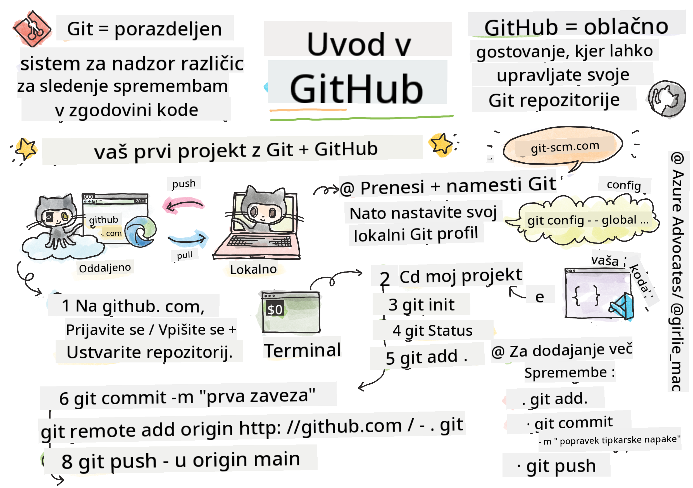
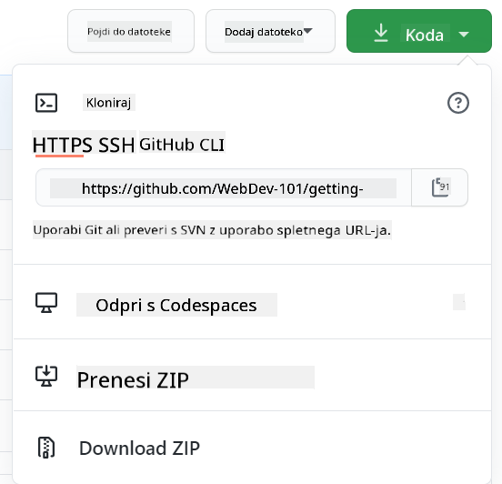

<!--
CO_OP_TRANSLATOR_METADATA:
{
  "original_hash": "361249da70432ddfd4741c917d1a6f50",
  "translation_date": "2025-08-29T12:59:17+00:00",
  "source_file": "1-getting-started-lessons/2-github-basics/README.md",
  "language_code": "sl"
}
-->
# Uvod v GitHub

Ta lekcija zajema osnove GitHuba, platforme za gostovanje in upravljanje sprememb v vaši kodi.


> Sketchnote avtorja [Tomomi Imura](https://twitter.com/girlie_mac)

## Kviz pred predavanjem
[Kviz pred predavanjem](https://ff-quizzes.netlify.app)

## Uvod

V tej lekciji bomo obravnavali:

- sledenje delu, ki ga opravljate na svojem računalniku
- delo na projektih z drugimi
- kako prispevati k odprtokodni programski opremi

### Predpogoji

Preden začnete, preverite, ali imate nameščen Git. V terminal vnesite: 
`git --version`

Če Git ni nameščen, ga [prenesite](https://git-scm.com/downloads). Nato nastavite svoj lokalni Git profil v terminalu:
* `git config --global user.name "vaše-ime"`
* `git config --global user.email "vaš-email"`

Če želite preveriti, ali je Git že konfiguriran, lahko vnesete:
`git config --list`

Potrebovali boste tudi GitHub račun, urejevalnik kode (na primer Visual Studio Code) in odprt terminal (ali ukazno vrstico).

Pojdite na [github.com](https://github.com/), ustvarite račun, če ga še nimate, ali se prijavite in izpolnite svoj profil.

✅ GitHub ni edino skladišče kode na svetu; obstajajo tudi druga, vendar je GitHub najbolj znan.

### Priprava

Potrebovali boste mapo s projektom kode na svojem lokalnem računalniku (prenosniku ali osebnem računalniku) in javno skladišče na GitHubu, ki bo služilo kot primer, kako prispevati k projektom drugih.

---

## Upravljanje kode

Recimo, da imate lokalno mapo s projektom kode in želite začeti slediti svojemu napredku z uporabo git-a – sistema za nadzor različic. Nekateri primerjajo uporabo git-a s pisanjem ljubezenskega pisma svojemu prihodnjemu jazu. Ko boste čez dneve, tedne ali mesece brali svoja sporočila o potrditvah (commit messages), se boste lahko spomnili, zakaj ste sprejeli določeno odločitev, ali pa "razveljavili" spremembo – seveda, če pišete dobra sporočila o potrditvah.

### Naloga: Ustvarite skladišče in potrdite kodo  

> Oglejte si video
> 
> [](https://www.youtube.com/watch?v=9R31OUPpxU4)

1. **Ustvarite skladišče na GitHubu**. Na GitHub.com, v zavihku skladišč ali v zgornji desni navigacijski vrstici poiščite gumb **new repo**.

   1. Dajte svojemu skladišču (mapi) ime.
   1. Izberite **create repository**.

1. **Pomaknite se do svoje delovne mape**. V terminalu preklopite na mapo (imenovano tudi imenik), ki ji želite začeti slediti. Vnesite:

   ```bash
   cd [name of your folder]
   ```

1. **Inicializirajte git skladišče**. V svojem projektu vnesite:

   ```bash
   git init
   ```

1. **Preverite stanje**. Če želite preveriti stanje svojega skladišča, vnesite:

   ```bash
   git status
   ```

   Izhod lahko izgleda nekako takole:

   ```output
   Changes not staged for commit:
   (use "git add <file>..." to update what will be committed)
   (use "git checkout -- <file>..." to discard changes in working directory)

        modified:   file.txt
        modified:   file2.txt
   ```

   Običajno ukaz `git status` pove stvari, kot so, kateri datoteki so pripravljeni za _shranjevanje_ v skladišče ali imajo spremembe, ki jih morda želite ohraniti.

1. **Dodajte vse datoteke za sledenje**  
   To se imenuje tudi postavljanje datotek/dodajanje datotek v območje priprave.

   ```bash
   git add .
   ```

   Ukaz `git add` z argumentom `.` pomeni, da so vse vaše datoteke in spremembe pripravljene za sledenje.

1. **Dodajte izbrane datoteke za sledenje**

   ```bash
   git add [file or folder name]
   ```

   To nam omogoča, da dodamo samo izbrane datoteke v območje priprave, ko ne želimo potrditi vseh datotek hkrati.

1. **Odstranite vse datoteke iz območja priprave**

   ```bash
   git reset
   ```

   Ta ukaz nam omogoča, da odstranimo vse datoteke iz območja priprave hkrati.

1. **Odstranite določeno datoteko iz območja priprave**

   ```bash
   git reset [file or folder name]
   ```

   Ta ukaz nam omogoča, da odstranimo samo določeno datoteko iz območja priprave, ki je ne želimo vključiti v naslednjo potrditev.

1. **Shranjevanje vašega dela**. Na tej točki ste dodali datoteke v tako imenovano _območje priprave_. To je mesto, kjer Git sledi vašim datotekam. Da bi spremembo naredili trajno, morate _potrditi_ datoteke. To storite tako, da ustvarite _potrditev_ z ukazom `git commit`. Potrditev predstavlja točko shranjevanja v zgodovini vašega skladišča. Vnesite naslednje, da ustvarite potrditev:

   ```bash
   git commit -m "first commit"
   ```

   To potrdi vse vaše datoteke in doda sporočilo "first commit". Za prihodnja sporočila o potrditvah boste želeli biti bolj opisni, da boste jasno izrazili, kakšno spremembo ste naredili.

1. **Povežite svoje lokalno Git skladišče z GitHubom**. Git skladišče je uporabno na vašem računalniku, vendar boste na neki točki želeli imeti varnostno kopijo svojih datotek nekje drugje in povabiti druge ljudi, da sodelujejo z vami na vašem skladišču. Odličen kraj za to je GitHub. Spomnite se, da smo že ustvarili skladišče na GitHubu, zato moramo le še povezati naše lokalno Git skladišče z GitHubom. Ukaz `git remote add` bo to storil. Vnesite naslednji ukaz:

   > Opomba: Preden vnesete ukaz, pojdite na stran svojega GitHub skladišča, da poiščete URL skladišča. Uporabili ga boste v spodnjem ukazu. Zamenjajte ```https://github.com/username/repository_name.git``` z vašim GitHub URL-jem.

   ```bash
   git remote add origin https://github.com/username/repository_name.git
   ```

   To ustvari _oddaljeno povezavo_ (remote), imenovano "origin", ki kaže na GitHub skladišče, ki ste ga ustvarili prej.

1. **Pošljite lokalne datoteke na GitHub**. Do zdaj ste ustvarili _povezavo_ med lokalnim skladiščem in GitHub skladiščem. Pošljimo te datoteke na GitHub z naslednjim ukazom `git push`, kot sledi:

   > Opomba: Vaše ime veje je lahko privzeto drugačno od ```main```.

   ```bash
   git push -u origin main
   ```

   To pošlje vaše potrditve v vašo vejo "main" na GitHub.

2. **Dodajanje več sprememb**. Če želite nadaljevati z dodajanjem sprememb in njihovim pošiljanjem na GitHub, boste morali uporabiti naslednje tri ukaze:

   ```bash
   git add .
   git commit -m "type your commit message here"
   git push
   ```

   > Nasvet: Morda boste želeli uporabiti tudi datoteko `.gitignore`, da preprečite, da bi se datoteke, ki jih ne želite slediti, prikazale na GitHubu – na primer beležka, ki jo shranjujete v isti mapi, vendar nima mesta v javnem skladišču. Predloge za `.gitignore` datoteke lahko najdete na [.gitignore templates](https://github.com/github/gitignore).

#### Sporočila o potrditvah

Odličen naslov sporočila o potrditvi Git dopolni naslednji stavek:
Če se uporabi, bo ta potrditev <vaš naslov sporočila tukaj>.

Za naslov uporabite velelnik v sedanjiku: "spremeni" namesto "spremenil" ali "spreminja". 
Kot v naslovu, tudi v telesu (neobvezno) uporabite velelnik v sedanjiku. Telo naj vključuje motivacijo za spremembo in primerjavo s prejšnjim vedenjem. Razlagate `zakaj`, ne `kako`.

✅ Vzemite si nekaj minut in pobrskajte po GitHubu. Ali lahko najdete res odlično sporočilo o potrditvi? Ali lahko najdete res minimalno? Katere informacije se vam zdijo najpomembnejše in najbolj uporabne za posredovanje v sporočilu o potrditvi?

### Naloga: Sodelovanje

Glavni razlog za nalaganje stvari na GitHub je omogočiti sodelovanje z drugimi razvijalci.

## Delo na projektih z drugimi

> Oglejte si video
>
> [](https://www.youtube.com/watch?v=bFCM-PC3cu8)

V svojem skladišču pojdite na `Insights > Community`, da vidite, kako se vaš projekt primerja s priporočenimi standardi skupnosti.

   Tukaj je nekaj stvari, ki lahko izboljšajo vaše GitHub skladišče:
   - **Opis**. Ali ste dodali opis za svoj projekt?
   - **README**. Ali ste dodali README? GitHub ponuja smernice za pisanje [README](https://docs.github.com/articles/about-readmes/?WT.mc_id=academic-77807-sagibbon).
   - **Smernice za prispevanje**. Ali ima vaš projekt [smernice za prispevanje](https://docs.github.com/articles/setting-guidelines-for-repository-contributors/?WT.mc_id=academic-77807-sagibbon)?
   - **Kodeks ravnanja**. Ali ima vaš projekt [kodeks ravnanja](https://docs.github.com/articles/adding-a-code-of-conduct-to-your-project/)?
   - **Licenca**. Morda najpomembneje, ali ima vaš projekt [licenco](https://docs.github.com/articles/adding-a-license-to-a-repository/)?

Vsi ti viri bodo koristili pri vključevanju novih članov ekipe. To so običajno stvari, ki jih novi prispevki pregledajo, preden sploh pogledajo vašo kodo, da ugotovijo, ali je vaš projekt pravo mesto za njihovo sodelovanje.

✅ README datoteke, čeprav zahtevajo čas za pripravo, pogosto zanemarjajo zaposleni vzdrževalci. Ali lahko najdete primer posebej opisnega README-ja? Opomba: Obstajajo nekateri [orodja za pomoč pri ustvarjanju dobrih README-jev](https://www.makeareadme.com/), ki jih morda želite preizkusiti.

### Naloga: Združite nekaj kode

Dokumenti za prispevanje pomagajo ljudem prispevati k projektu. Razložijo, kakšne vrste prispevkov iščete in kako poteka postopek. Prispevki bodo morali opraviti vrsto korakov, da bodo lahko prispevali v vaše skladišče na GitHubu:

1. **Razvejitev vašega skladišča**. Verjetno boste želeli, da ljudje _razvejijo_ vaš projekt. Razvejitev pomeni ustvarjanje kopije vašega skladišča na njihovem GitHub profilu.
1. **Kloniranje**. Od tam bodo projekt klonirali na svoj lokalni računalnik.
1. **Ustvarjanje veje**. Želeli boste, da ustvarijo _vejo_ za svoje delo.
1. **Osredotočanje na eno področje**. Prosite prispevke, naj se osredotočijo na eno stvar naenkrat – tako bodo večje možnosti, da boste lahko _združili_ njihovo delo. Predstavljajte si, da napišejo odpravo napake, dodajo novo funkcijo in posodobijo več testov – kaj, če želite ali lahko implementirate le 2 od 3 ali 1 od 3 sprememb?

✅ Predstavljajte si situacijo, kjer so veje še posebej ključne za pisanje in dostavo dobre kode. Katere primere uporabe si lahko zamislite?

> Opomba: Bodite sprememba, ki jo želite videti v svetu, in ustvarite veje tudi za svoje delo. Vse potrditve, ki jih naredite, bodo narejene na veji, na kateri ste trenutno "prijavljeni". Uporabite `git status`, da vidite, na kateri veji ste.

Pojdimo skozi potek dela prispevka. Predpostavimo, da je prispevek že _razvejal_ in _kloniral_ skladišče, tako da ima Git skladišče pripravljeno za delo na svojem lokalnem računalniku:

1. **Ustvarite vejo**. Uporabite ukaz `git branch`, da ustvarite vejo, ki bo vsebovala spremembe, ki jih nameravate prispevati:

   ```bash
   git branch [branch-name]
   ```

1. **Preklopite na delovno vejo**. Preklopite na določeno vejo in posodobite delovni imenik z `git switch`:

   ```bash
   git switch [branch-name]
   ```

1. **Opravite delo**. Na tej točki želite dodati svoje spremembe. Ne pozabite o tem obvestiti Git z naslednjimi ukazi:

   ```bash
   git add .
   git commit -m "my changes"
   ```

   Poskrbite, da boste svoji potrditvi dali dobro ime, tako za vas kot za vzdrževalca skladišča, ki mu pomagate.

1. **Združite svoje delo z vejo `main`**. Na neki točki ste končali z delom in želite združiti svoje delo z vejo `main`. Veja `main` se je medtem morda spremenila, zato se prepričajte, da jo najprej posodobite na najnovejšo različico z naslednjimi ukazi:

   ```bash
   git switch main
   git pull
   ```

   Na tej točki želite zagotoviti, da se morebitni _konflikti_, situacije, kjer Git ne more enostavno _združiti_ sprememb, zgodijo v vaši delovni veji. Zato zaženite naslednje ukaze:

   ```bash
   git switch [branch_name]
   git merge main
   ```

   To bo prineslo vse spremembe iz `main` v vašo vejo in upajmo, da boste lahko nadaljevali. Če ne, vam bo VS Code pokazal, kje je Git _zmeden_, in preprosto spremenite prizadete datoteke, da poveste, katera vsebina je najbolj točna.

1. **Pošljite svoje delo na GitHub**. Pošiljanje vašega dela na GitHub pomeni dve stvari. Potisnite svojo vejo v svoje skladišče in nato odprite PR (Pull Request).

   ```bash
   git push --set-upstream origin [branch-name]
   ```

   Zgornji ukaz ustvari vejo na vašem razvejanem skladišču.

1. **Odprite PR**. Nato želite odpreti PR. To storite tako, da se pomaknete do razvejanega skladišča na GitHubu. Videli boste oznako na GitHubu, kjer vas vpraša, ali želite ustvariti nov PR, kliknete to in preusmerjeni boste na vmesnik, kjer lahko spremenite naslov sporočila o potrditvi, mu daste bolj ustrezen opis. Zdaj bo vzdrževalec skladišča, ki ste ga razvejali, videl ta PR in _držimo pesti_, da bo cenil in _združil_ vaš PR. Zdaj ste prispevalec, juhu :)

1. **Počistite**. Šteje se za dobro prakso, da _počistite_ po uspešnem združevanju PR. Želite počistiti tako svojo lokalno vejo kot vejo, ki ste jo potisnili na GitHub. Najprej jo izbrišite lokalno z naslednjim ukazom:

   ```bash
   git branch -d [branch-name]
   ```

   Prepričajte se, da greste na stran GitHub za razvejano skladišče in odstranite oddaljeno vejo, ki ste jo pravkar potisnili.
`Pull request` se morda zdi nenavadna besedna zveza, saj v resnici želite potisniti svoje spremembe v projekt. Vendar mora vzdrževalec (lastnik projekta) ali osrednja ekipa najprej preučiti vaše spremembe, preden jih združi z "glavno" vejo projekta, zato v bistvu zahtevate odločitev o spremembi od vzdrževalca.

Pull request je mesto, kjer primerjate in razpravljate o razlikah, ki jih uvaja veja, z ocenami, komentarji, integriranimi testi in še več. Dober pull request sledi približno istim pravilom kot sporočilo ob commitu. Lahko dodate referenco na težavo v sledilniku težav, na primer, ko vaše delo odpravi določeno težavo. To storite z uporabo `#`, ki mu sledi številka vaše težave. Na primer `#97`.

🤞Držimo pesti, da vsi pregledi uspejo in da lastnik(i) projekta združijo vaše spremembe v projekt🤞

Posodobite svojo trenutno lokalno delovno vejo z vsemi novimi commit-i iz ustrezne oddaljene veje na GitHubu:

`git pull`

## Kako prispevati k odprtokodni programski opremi

Najprej poiščimo repozitorij (ali **repo**) na GitHubu, ki vas zanima in h kateremu želite prispevati spremembo. Njegovo vsebino boste želeli kopirati na svoj računalnik.

✅ Dober način za iskanje repozitorijev, prijaznih začetnikom, je [iskanje po oznaki 'good-first-issue'](https://github.blog/2020-01-22-browse-good-first-issues-to-start-contributing-to-open-source/).



Obstaja več načinov za kopiranje kode. Eden od načinov je "kloniranje" vsebine repozitorija z uporabo HTTPS, SSH ali GitHub CLI (Command Line Interface).

Odprite terminal in klonirajte repozitorij na naslednji način:
`git clone https://github.com/ProjectURL`

Za delo na projektu preklopite v ustrezno mapo:
`cd ProjectURL`

Celoten projekt lahko odprete tudi z [Codespaces](https://github.com/features/codespaces), vgrajenim urejevalnikom kode / oblačnim razvojnim okoljem GitHuba, ali z [GitHub Desktop](https://desktop.github.com/).

Nazadnje lahko kodo prenesete v stisnjeni mapi.

### Nekaj zanimivosti o GitHubu

Na GitHubu lahko označite z zvezdico, spremljate ali "forkate" kateri koli javni repozitorij. Svoje označene repozitorije najdete v spustnem meniju zgoraj desno. To je kot zaznamovanje, vendar za kodo.

Projekti imajo sledilnik težav, večinoma na GitHubu v zavihku "Issues", razen če ni navedeno drugače, kjer ljudje razpravljajo o težavah, povezanih s projektom. Zavihek Pull Requests je mesto, kjer ljudje razpravljajo in ocenjujejo spremembe, ki so v teku.

Projekti imajo lahko tudi razprave v forumih, poštnih seznamih ali komunikacijskih kanalih, kot so Slack, Discord ali IRC.

✅ Razglejte se po svojem novem GitHub repozitoriju in preizkusite nekaj stvari, kot so urejanje nastavitev, dodajanje informacij v repozitorij in ustvarjanje projekta (na primer Kanban deske). Možnosti je veliko!

---

## 🚀 Izziv

Sodelujte s prijateljem pri delu na kodi drug drugega. Skupaj ustvarite projekt, forkajte kodo, ustvarite veje in združite spremembe.

## Kviz po predavanju
[Kviz po predavanju](https://ff-quizzes.netlify.app/web/en/)

## Pregled in samostojno učenje

Preberite več o [prispevanju k odprtokodni programski opremi](https://opensource.guide/how-to-contribute/#how-to-submit-a-contribution).

[Git cheatsheet](https://training.github.com/downloads/github-git-cheat-sheet/).

Vadite, vadite, vadite. GitHub ponuja odlične učne poti prek [skills.github.com](https://skills.github.com):

- [Prvi teden na GitHubu](https://skills.github.com/#first-week-on-github)

Na voljo so tudi bolj napredni tečaji.

## Naloga

Dokončajte [tečaj Prvi teden na GitHubu](https://skills.github.com/#first-week-on-github).

---

**Omejitev odgovornosti**:  
Ta dokument je bil preveden z uporabo storitve za strojno prevajanje [Co-op Translator](https://github.com/Azure/co-op-translator). Čeprav si prizadevamo za natančnost, vas opozarjamo, da lahko avtomatizirani prevodi vsebujejo napake ali netočnosti. Izvirni dokument v njegovem izvirnem jeziku je treba obravnavati kot avtoritativni vir. Za ključne informacije priporočamo strokovno človeško prevajanje. Ne prevzemamo odgovornosti za morebitna nesporazumevanja ali napačne razlage, ki bi nastale zaradi uporabe tega prevoda.