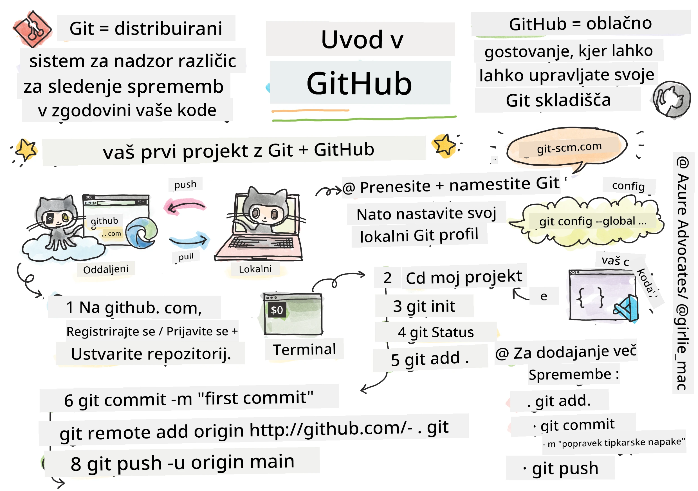
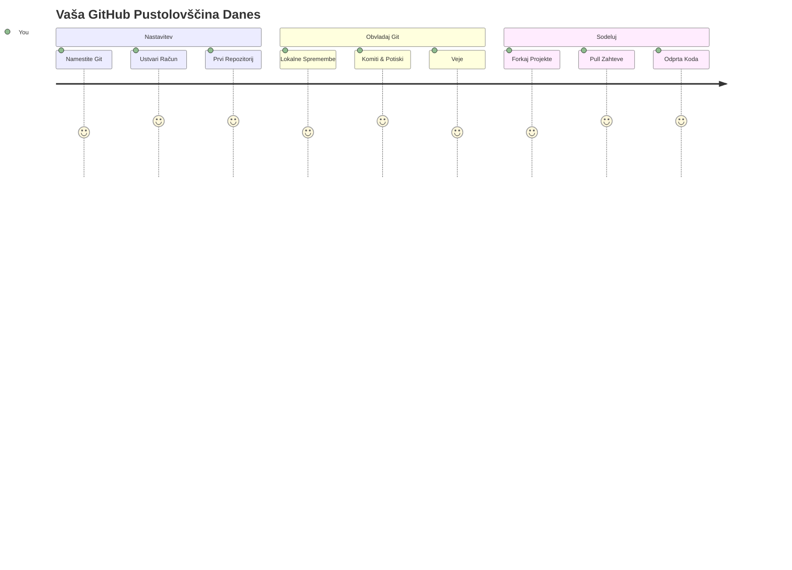
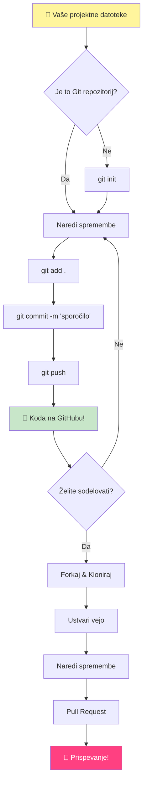
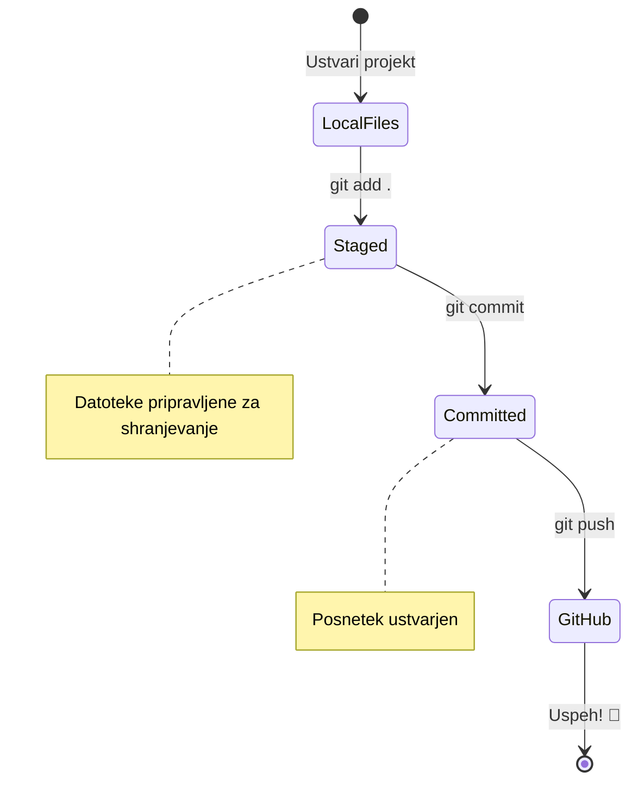
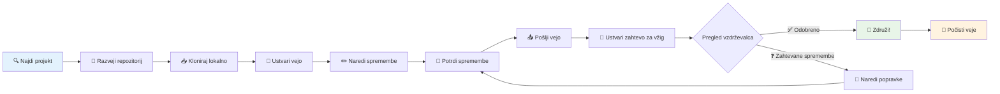
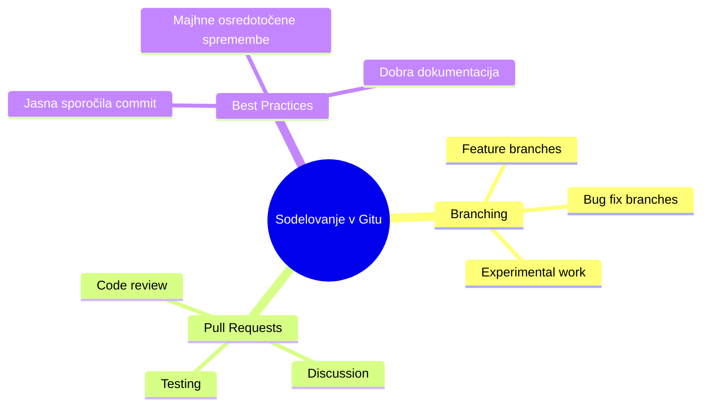
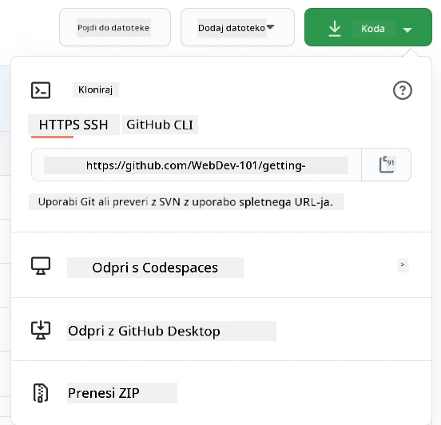
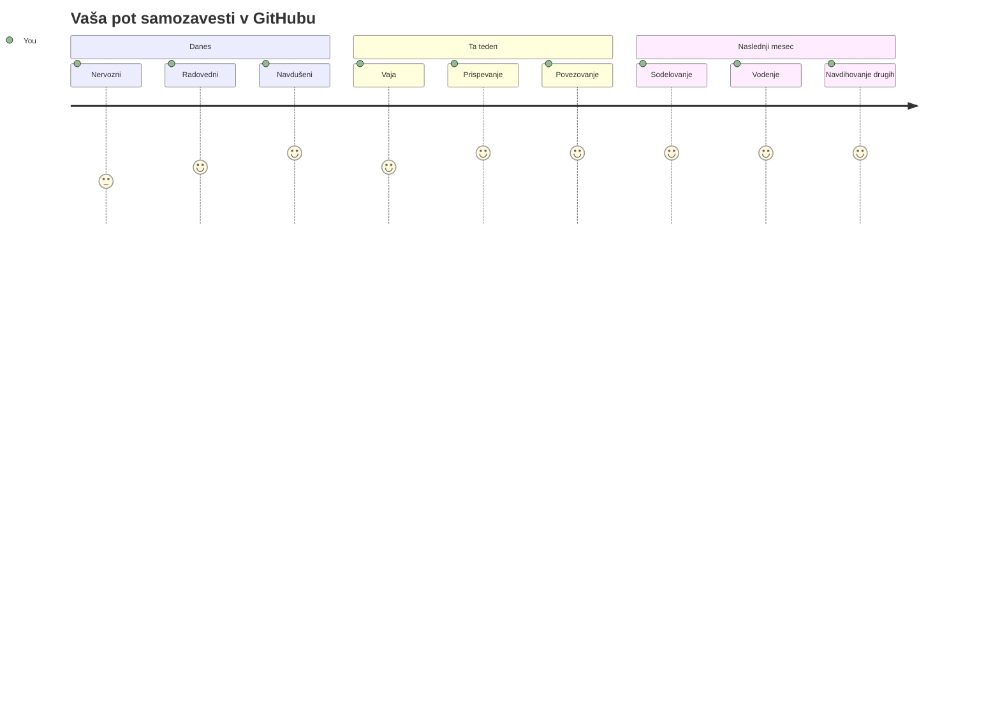

<!--
CO_OP_TRANSLATOR_METADATA:
{
  "original_hash": "5c383cc2cc23bb164b06417d1c107a44",
  "translation_date": "2026-01-07T10:46:03+00:00",
  "source_file": "1-getting-started-lessons/2-github-basics/README.md",
  "language_code": "sl"
}
-->
# Uvod v GitHub

Hej, bodoči razvijalec! 👋 Pripravljen, da se pridružiš milijonom programerjev po vsem svetu? Resnično sem navdušen, da ti predstavim GitHub – pomisli na to kot družbeno medijsko platformo za programerje, ampak namesto da bi delili slike svojega kosila, delimo kodo in skupaj ustvarjamo neverjetne stvari!

To me popolnoma navdušuje: vsaka aplikacija na tvojem telefonu, vsaka spletna stran, ki jo obiščeš, in večina orodij, ki se jih boš naučil uporabljati, so nastala z delom skupin razvijalcev, ki sodelujejo na platformah, kot je GitHub. Tisto glasbeno aplikacijo, ki ti je všeč? Nekdo, kot si ti, je prispeval k njej. Tista igra, ki je ne moreš odložiti? Ja, verjetno je zgrajena z GitHub sodelovanjem. In zdaj boš TI naučil, kako biti del te neverjetne skupnosti!

Vem, da je na začetku morda precej, spomnim se, kako sem strmel v svojo prvo GitHub stran in razmišljal: "Kaj za vraga to sploh pomeni?" Ampak tukaj je stvar: vsak posamezen razvijalec je začel natanko tam, kjer si ti zdaj. Po koncu te lekcije boš imel svoj lasten GitHub repozitorij (pomisli na to kot na svojo osebno razstavo projektov v oblaku), in boš vedel, kako shraniti svoje delo, deliti z drugimi in celo prispevati k projektom, ki jih uporablja milijone ljudi.

To pot bomo prehodili skupaj, korak za korakom. Brez hitenja, brez pritiska – samo ti, jaz in nekaj res kul orodij, ki bodo postali tvoji novi najboljši prijatelji!


> Sketchnote avtorja [Tomomi Imura](https://twitter.com/girlie_mac)


## Predpredavalni kviz
[Predpredavalni kviz](https://ff-quizzes.netlify.app)

## Uvod

Preden se potopimo v res vznemirljive stvari, pripravimo tvoj računalnik na nekaj GitHub magije! Pomisli na to kot urejanje umetniških pripomočkov pred ustvarjanjem umetniškega dela – ko imaš prava orodja pripravljena, je vse veliko lažje in zabavneje.

Osebno te bom popeljal skozi vsak korak nastavitve in obljubim, da ni tako strašljivo, kot se na prvi pogled zdi. Če nekaj ne klikne takoj, je to popolnoma normalno! Spomnim se, ko sem nastavljal svoje prvo razvojno okolje in se počutil, kot da berem starodavne hijeroglife. Vsak razvijalec je bil kdaj povsem na tvojem mestu in se spraševal, ali dela prav. Namig: če si tukaj in se učiš, to počneš prav! 🌟

V tej lekciji bomo obravnavali:

- sledenje tvojemu delu na stroju
- sodelovanje pri projektih z drugimi
- kako prispevati k odprtokodni programski opremi

### Predpogoji

Pripravimo tvoj računalnik na nekaj GitHub magije! Brez skrbi – to nastavljanje potrebuješ narediti samo enkrat, nato pa boš pripravljen za celotno svojo programersko pot.

Prvi korak je temelj! Najprej moramo preveriti, ali imaš na svojem računalniku že nameščen Git. Git je pravzaprav kot iznajdljiv pomočnik, ki si zapomni vsako spremembo tvoje kode – precej boljše kot da vsake toliko časa panikaš in tlačiš Ctrl+S (to smo vsi že izkusili!).

Poglejmo, če je Git že nameščen, tako da v terminal vpišeš to čarobno ukazno vrstico:
`git --version`

Če Git še ni nameščen, brez skrbi! Pojdi na [download Git](https://git-scm.com/downloads) in ga prenesi. Ko ga namestiš, moramo Git pravilno nastaviti zate:

> 💡 **Prvič po nastavitvi**: Ti ukazi Git-u povedo, kdo si. Te informacije bodo dodane vsakemu tvojemu »commit-u«, zato izberi ime in e-pošto, ki ju želiš javno deliti.

```bash
git config --global user.name "your-name"
git config --global user.email "your-email"
```

Če želiš preveriti, če je Git že nastavljen, lahko vpišeš:
```bash
git config --list
```

Potreboval boš tudi GitHub račun, urejevalnik kode (kot je Visual Studio Code) in odprt terminal (ali: ukazni poziv).

Pojdi na [github.com](https://github.com/) in ustvari račun, če ga še nimaš, ali se prijavi in dopolni svoj profil.

💡 **Sodobni nasvet**: Razmisli o nastavitvi [SSH ključev](https://docs.github.com/en/authentication/connecting-to-github-with-ssh) ali uporabi [GitHub CLI](https://cli.github.com/) za lažjo avtentikacijo brez gesel.

✅ GitHub ni edini repozitorij kode na svetu; obstajajo tudi drugi, vendar je GitHub najbolj znan

### Priprava

Potreboval boš mapo z enim projektom s tvoje lokalne naprave (prenosnik ali računalnik) in javni repozitorij na GitHubu, ki bo primer, kako prispevati k projektom drugih.

### Varovanje tvoje kode

Poglejmo za trenutek varnost – ampak brez skrbi, ne bomo te preplavili s strašljivimi stvarmi! Pomisli na te varnostne prakse kot na ključanje avtomobila ali hiše. To so preprosti vzorci, ki postanejo navada in zaščitijo tvoje trdo delo.

Od začetka ti bomo pokazali sodobne in varne načine dela z GitHubom. Tako boš razvil dobre navade, ki ti bodo služile skozi celotno programersko pot.

Pri delu z GitHubom je pomembno slediti najboljšim varnostnim praksam:

| Varno področje           | Najboljša praksa               | Zakaj je pomembno               |
|--------------------------|-------------------------------|--------------------------------|
| **Avtentikacija**        | Uporaba SSH ključev ali osebnih dostopnih žetonov | Gesla so manj varna in jih postopoma ukinjajo |
| **Dvofaktorska avtentikacija** | Omogoči 2FA na svojem GitHub računu | Doda dodatno plast zaščite računa |
| **Varnost repozitorija** | Nikoli ne pošiljaj občutljivih podatkov | API ključi in gesla nikoli ne smejo biti v javnih repozitorijih |
| **Upravljanje odvisnosti** | Omogoči Dependabot za posodobitve | Ohranja tvoje odvisnosti varne in posodobljene |

> ⚠️ **Kritični varnostni opomnik**: Nikoli ne pošiljaj API ključev, gesel ali drugih občutljivih informacij v repozitorije. Uporabi okoljske spremenljivke in `.gitignore` datoteke za zaščito občutljivih podatkov.

**Sodobna nastavitev avtentikacije:**

```bash
# Ustvari SSH ključ (sodobni algoritem ed25519)
ssh-keygen -t ed25519 -C "your_email@example.com"

# Nastavi Git za uporabo SSH
git remote set-url origin git@github.com:username/repository.git
```

> 💡 **Profesionalni nasvet**: SSH ključi odpravljajo potrebo po vnašanju gesel vsakič in so varnejši od tradicionalnih metod avtentikacije.

---

## Upravljanje tvoje kode kot profesionalec

Ok, TU se začne prava zabava! 🎉 Naučili se bomo, kako slediti in upravljati svojo kodo kot profesionalci, in iskreno, to je ena izmed mojih najljubših stvari za poučevanje, ker popolnoma spremeni igro.

Predstavljaj si to: pišeš čudovito zgodbo in želiš slediti vsakemu osnutku, vsaki genialni spremembi in vsakemu »počakaj, to je genialno!« trenutku na tej poti. Točno to Git naredi za tvojo kodo! Je kot najbolj neverjeten časovni zvezek, ki si zapomni VSE – vsak pritisk tipke, vsako spremembo, vsak »ups, vse sem pokvaril« trenutek, ki ga lahko takoj razveljaviš.

Naj bom iskren – to se ti lahko sprva zdi preveč. Ko sem začel, sem mislil »Zakaj pa ne morem samo shraniti svoje datoteke kot običajno?« Ampak verjemi mi: ko ti Git klikne (in bo!), boš doživel tisti »a-ha« moment, ko boš pomislil »Kako sem pa kdaj sploh programiral brez tega?« Je kot odkritje, da lahko letiš, ko si vse življenje hodil peš!

Recimo, da imaš lokalno mapo s kodo nekega projekta in želiš začeti slediti svojemu napredku z uporabo git – sistema kontrole različic. Nekateri primerjajo uporabo git z napisom ljubezenskega pisma svojemu bodočemu sebi. Ko boš po dnevih, tednih ali mesecih bral sporočila svojih commitov, se boš spomnil, zakaj si sprejel določeno odločitev ali pa boš lahko »vrnil spremembo nazaj« – seveda, če pišeš dobre commit poročila.


### Naloga: Ustvari svoj prvi repozitorij!

> 🎯 **Tvoja naloga (in zelo sem navdušen zate!)**: Skupaj bova ustvarila tvoj prvi GitHub repozitorij! Ko bova tukaj končala, boš imel svoj kotiček na internetu, kjer bo tvoja koda živa, in boš naredil svoj prvi »commit« (to je strokovni izraz za pametno shranjevanje svojega dela).
>
> To je res poseben trenutek – pravkar boš uradno postal del globalne skupnosti razvijalcev! Še vedno se spomnim navdušenja, ko sem ustvaril svoj prvi repozitorij in pomislil »Vau, res to počnem!«

Pojdimo to dogodivščino skupaj, korak za korakom. Vzemi si čas pri vsakem delu – ni nagrajevanja za hitenje in obljubim, da bo vsak korak pomenil nekaj. Spomni se, vsak programerski zvezdnik, ki ga občuduješ, je nekoč sedel natanko tam, kjer si ti, tik pred ustvarjanjem prvega repozitorija. Kako kul je to?

> Poglej video
> 
> [](https://www.youtube.com/watch?v=9R31OUPpxU4)

**Pojdimo skupaj:**

1. **Ustvari svoj repozitorij na GitHubu**. Pojdi na GitHub.com in poišči svetlo zelen gumb **New** (ali znak **+** v zgornjem desnem kotu). Klikni nanj in izberi **New repository**.

   To narediš tako:
   1. Repozitoriju daj ime – naj bo zate nekaj pomenljivega!
   1. Po želji dodaj opis (to drugim pomaga razumeti, za kaj je tvoj projekt)
   1. Odloči se, ali bo repozitorij javen (viden vsem) ali zaseben (samo zate)
   1. Priporočam, da označiš polje za dodatek README datoteke – je kot naslovnica tvojega projekta
   1. Klikni **Create repository** in proslavi – pravkar si ustvaril svoj prvi repozitorij! 🎉

2. **Pojdi do svoje mape s projektom**. Odpri svoj terminal (brez skrbi, ni tako strašen kot izgleda!). Povejmo računalniku, kje so tvoje datoteke projekta. Vpiši ta ukaz:

   ```bash
   cd [name of your folder]
   ```

   **Kaj tukaj počnemo:**
   - Pravzaprav pravimo »Hej računalnik, pelji me do moje projektne mape«
   - To je kot odpiranje določene mape na tvoji namizju, ampak to naredimo z ukazi
   - Nadomesti `[name of your folder]` z dejanskim imenom tvoje projektne mape

3. **Pretvori svojo mapo v Git repozitorij**. Tu se zgodi čarovnija! Vpiši:

   ```bash
   git init
   ```

   **To se je ravnokar zgodilo (prave kul stvari!):**
   - Git je pravkar ustvaril skrito `.git` mapo v tvojem projektu – je skrita, ampak tam je!
   - Tvoja redna mapa je zdaj »repozitorij«, ki lahko sledi vsaki spremembi
   - Pomisli na to, kot da daš svoji mapi supermoči, da si vse zapomni

4. **Preveri, kaj se dogaja**. Poglejmo, kaj ti Git zdaj govori o tvojem projektu:

   ```bash
   git status
   ```

   **Razumevanje, kaj ti Git sporoča:**

   Lahko vidiš nekaj takega:

   ```output
   Changes not staged for commit:
   (use "git add <file>..." to update what will be committed)
   (use "git restore <file>..." to discard changes in working directory)

        modified:   file.txt
        modified:   file2.txt
   ```

   **Ne paničari! To pomeni:**
   - Datoteke v **rdeči** so tiste, ki imajo spremembe, vendar še niso pripravljene za shranjevanje
   - Datoteke v **zeleni** (ko jih vidiš) so pripravljene za shranjevanje
   - Git ti prijazno pove, kaj lahko narediš naprej

   > 💡 **Profesionalni nasvet**: Ukaz `git status` je tvoj najboljši prijatelj! Uporabi ga kadarkoli si zmedeni o tem, kaj se dogaja. To je, kot da bi vprašal Git: »Hej, kakšna je trenutno situacija?«

5. **Pripravi svoje datoteke za shranjevanje** (to se imenuje “staging”):

   ```bash
   git add .
   ```

   **Kaj smo pravkar naredili:**
   - Git-u smo rekli »Hej, želim vključiti VSE moje datoteke v naslednje shranjevanje«
   - `.` pomeni »vse v tej mapi«
   - Zdaj so tvoje datoteke »stage-ane« in pripravljene za naslednji korak

   **Želiš biti bolj izbirčen?** Lahko dodaš samo določene datoteke:

   ```bash
   git add [file or folder name]
   ```

   **Zakaj bi to naredil?**
   - Včasih želiš shraniti povezane spremembe skupaj
   - To ti pomaga organizirati delo v logične dele
   - Lažje je razumeti, kaj se je spremenilo in kdaj

   **Si premislil?** Brez skrbi! Datoteke lahko odstraniš iz stage-a takole:

   ```bash
   # Odstrani vse iz pripravljenih datotek
   git reset
   
   # Odstrani iz pripravljenih samo eno datoteko
   git reset [file name]
   ```

   Ne skrbi – delo ti ne bo izbrisano, samo datoteke odstraniš iz »pripravljene za shranjevanje« skupine.

6. **Trajno shrani svoje delo** (naredi svoj prvi commit!):

   ```bash
   git commit -m "first commit"
   ```

   **🎉 Čestitke! Pravkar si naredil svoj prvi commit!**
   
   **Kaj se je pravkar zgodilo:**
   - Git je naredil »posnetek« vseh tvojih stage-anih datotek v tem trenutku
   - Tvoje sporočilo commit-a "first commit" pojasni, za kaj je ta točka shranjevanja
   - Git je temu posnetku dal edinstven ID, da ga lahko vedno najdeš
   - Uradno si začel slediti zgodovini svojega projekta!

   > 💡 **Pri prihodnjih commitih**: Bodi bolj opisni! Namesto "updated stuff", raje napiši "Dodaj kontaktni obrazec na domačo stran" ali "Popravi napako v meniju". Tvoj prihodnji jaz ti bo hvaležen!

7. **Poveži svoj lokalni projekt s GitHubom**. Trenutno tvoj projekt obstaja samo na tvojem računalniku. Povežimo ga s tvojim GitHub repozitorijem, da ga lahko deliš s svetom!

   Najprej pojdi na svojo GitHub stran repozitorija in kopiraj URL. Nato se vrni sem in napiši:

   ```bash
   git remote add origin https://github.com/username/repository_name.git
   ```
   
   (Zamenjaj ta URL z URL-jem svojega repozitorija!)

   **Kaj smo pravkar naredili:**
   - Ustvarili smo povezavo med vašim lokalnim projektom in vašim GitHub repozitorijem
   - "Origin" je le vzdevek za vaš GitHub repozitorij – kot da bi dodali stik v vaš telefon
   - Zdaj vaš lokalni Git ve, kam poslati vašo kodo, ko ste pripravljeni, da jo delite

   💡 **Lažja pot**: Če imate nameščen GitHub CLI, lahko to storite z enim ukazom:
   ```bash
   gh repo create my-repo --public --push --source=.
   ```

8. **Pošljite svojo kodo na GitHub** (veliki trenutek!):

   ```bash
   git push -u origin main
   ```

   **🚀 To je to! Nalagate svojo kodo na GitHub!**
   
   **Kaj se dogaja:**
   - Vaši commiti potujejo iz vašega računalnika na GitHub
   - Zastavica `-u` vzpostavi stalno povezavo, da bodo prihodnji pushi lažji
   - "main" je ime vaše glavne veje (kot glavna mapa)
   - Po tem lahko za prihodnje nalaganje preprosto vpišete `git push`!

   💡 **Hitra opomba**: Če je vaša veja drugače poimenovana (na primer "master"), uporabi to ime. Preverite lahko z `git branch --show-current`.

9. **Vaš novi dnevni ritem kodiranja** (tukaj postane zasvojljivo!):

   Od zdaj naprej, kadar koli naredite spremembe v vašem projektu, imate preprosto plesno rutino v treh korakih:

   ```bash
   git add .
   git commit -m "describe what you changed"
   git push
   ```

   **To postane vaš ritem kodiranja:**
   - Naredite nekaj odličnih sprememb v kodi ✨
   - Pripravite jih z `git add` ("Hej Git, poglej si te spremembe!")
   - Shranite jih z `git commit` in opisnim sporočilom (prihodnji vi vam bo hvaležen!)
   - Delite jih s svetom z `git push` 🚀
   - Ponavljajte – res, to postane tako naravno kot dihanje!

   Ta delovni tok imam rad, ker je kot imeti več shranjevalnih točk v videoigri. Naredili ste spremembo, ki vam je všeč? Commitajte jo! Želite poskusiti nekaj tvegano? Ni problema – vedno se lahko vrnete na zadnji commit, če gre kaj narobe!

   > 💡 **Namig**: Morda boste želeli vzpostaviti `.gitignore` datoteko, da preprečite, da se datoteke, ki jih ne želite spremljati, pojavijo na GitHubu – na primer tistega zvezka, ki ga imate v isti mapi, a nima mesta na javnem repozitoriju. Predloge za `.gitignore` datoteke najdete na [.gitignore templates](https://github.com/github/gitignore) ali pa ustvarite svojo preko [gitignore.io](https://www.toptal.com/developers/gitignore).

### 🧠 **Prvi vnos v repozitorij: Kako se je to zdelo?**

**Vzemite si trenutek za praznovanje in razmislek:**
- Kako se je zdelo videti vašo kodo prvič na GitHubu?
- Kateri korak se vam je zdel najbolj zmeden in kateri presenetljivo enostaven?
- Ali lahko z lastnimi besedami razložite razliko med `git add`, `git commit` in `git push`?


> **Zapomnite si**: Tudi izkušeni razvijalci včasih pozabijo točne ukaze. Da ta delovni tok postane mišični spomin, je potrebna vaja – odlično vam gre!

#### Sodobni Git delovni tokovi

Razmislite o naslednjih sodobnih praksah:

- **Konvencionalni commiti**: Uporabljajte standardiziran format sporočila commita, kot so `feat:`, `fix:`, `docs:` itd. Več na [conventionalcommits.org](https://www.conventionalcommits.org/)
- **Atomski commiti**: Naj vsak commit predstavlja eno logično spremembo
- **Pogosti commiti**: Commita pogosto z opisnimi sporočili namesto velikih, redkih commitov

#### Sporočila commitov

Odlično vrstico zadeve za Git commit dopolni naslednji stavek:
Če bi bil ta commit uporabljen, bo <vaša vrstica zadeve tukaj>

Za zadevo uporabite imperativ, sedanjik: "spremeni", ne "spremenil" ali "spremeni se".
Kot pri zadevi, tudi v telesu (opcijsko) uporabite imperativ, sedanjik. Telo naj vsebuje motivacijo za spremembo in primerjavo s prejšnjim vedenjem. Razlagate *zakaj*, ne *kako*.

✅ Vzemite si nekaj minut za brskanje po GitHubu. Ali najdete res odlično sporočilo commita? Ali najdete kakšno zelo kratko? Katera informacija je po vašem mnenju najpomembnejša in najbolj uporabna za posredovanje v sporočilu commita?

## Delo z drugimi (zabavni del!)

Držite se klobuka, ker TO je trenutek, ko GitHub postane pravljično magičen! 🪄 Obvladali ste upravljanje svoje kode, zdaj pa gremo v moj najljubši del – sodelovanje z neverjetnimi ljudmi z vsega sveta.

Predstavljajte si: zjutraj se zbudite in vidite, da je nekdo v Tokiu izboljšal vašo kodo, medtem ko ste spali. Nato nekdo v Berlinu popravi hrošča, na katerem ste se zataknili. Do popoldneva je razvijalec v São Paulu dodal funkcijo, o kateri niste nikoli niti pomislili. To ni znanstvena fantastika – to je ponedeljek v GitHub vesolju!

Kar me resnično navdušuje, je, da so veščine sodelovanja, ki se jih boste naučili, TOČNO isti delovni procesi, ki jih ekipe v Googlu, Microsoftu in vaših najljubših start-upih uporabljajo vsak dan. Ne učite se samo kul orodja – učite se skrivnega jezika, ki združuje celoten svet programske opreme.

Resno, ko boste doživeli vznemirjenje ob združitvi vašega prvega pull requesta, boste razumeli, zakaj so razvijalci tako navdušeni nad odprto kodo. Kot da bi bili del največjega, najbolj ustvarjalnega ekipnega projekta na svetu!

> Oglejte si video
>
> [](https://www.youtube.com/watch?v=bFCM-PC3cu8)

Glavni razlog za nalaganje stvari na GitHub je bil omogočiti sodelovanje z drugimi razvijalci.


V vašem repozitoriju pojdite na `Insights > Community`, da vidite, kako se vaš projekt primerja s priporočenimi standardi skupnosti.

Želite, da vaš repozitorij izgleda profesionalno in prijazno? Pojdite v repozitorij in kliknite `Insights > Community`. Ta kul funkcija prikaže, kako se vaš projekt primerja s tem, kar skupnost GitHub smatra za "dobre prakse repozitorija".

> 🎯 **Naj projekt zasije**: Dobro organiziran repozitorij z dobro dokumentacijo je kot čist in prijazen izložbeni prostor. Pokaže ljudem, da vam je mar za vaše delo in druge spodbuja k prispevanju!

**To naredi repozitorij odličen:**

| Kaj dodati | Zakaj je pomembno | Kaj vam prinese |
|-------------|-------------------|-----------------|
| **Opis** | Prvi vtis šteje! | Ljudje takoj vedo, kaj vaš projekt počne |
| **README** | Prednja stran vašega projekta | Kot prijazen vodnik za nove obiskovalce |
| **Navodila za prispevanje** | Pokaže, da sprejemate pomoč | Ljudje vedo, kako vam lahko pomagajo |
| **Kodeks vedenja** | Ustvari prijazno okolje | Vsi se počutijo dobrodošle za sodelovanje |
| **Licenca** | Pravna jasnost | Drugi vedo, kako lahko uporabljajo vašo kodo |
| **Varnostna politika** | Pokaže, da ste odgovorni | Izkaže profesionalne prakse |

> 💡 **Profesionalni nasvet**: GitHub nudi predloge za vse te datoteke. Pri ustvarjanju novega repozitorija obkljukajte polja, da se te datoteke samodejno ustvarijo.

**Sodobne GitHub funkcije za raziskovanje:**

🤖 **Avtomatizacija & CI/CD:**
- **GitHub Actions** za avtomatizirano testiranje in nameščanje
- **Dependabot** za samodejne posodobitve odvisnosti

💬 **Skupnost & Upravljanje projektov:**
- **GitHub Discussions** za pogovore skupnosti, ki presegajo vprašanja
- **GitHub Projects** za upravljanje projektov v kanban stilu
- **Pravila zaščite vej** za vzdrževanje kvalitete kode


Vse te vire boste lahko uporabili za uvajanje novih članov ekipe. In prav to so stvari, ki jih novi prispevalci običajno pogledajo preden sploh pogledajo vašo kodo, da preverijo, ali je vaš projekt prava lokacija za njihov čas.

✅ README datoteke, čeprav zahtevajo čas za pripravo, so pogosto zanemarjene pri zaposlenih vzdrževalcih. Ali lahko najdete primer posebej opisne? Opomba: obstajajo [orodja za pomoč pri ustvarjanju dobrih READMEjev](https://www.makeareadme.com/), ki jih morda želite preizkusiti.

### Naloga: Združite nekaj kode

Dokumenti za prispevanje pomagajo ljudem prispevati k projektu. Pojasnjujejo, kakšne vrste prispevkov iščete in kako poteka postopek. Prispevalci morajo izpeljati serijo korakov, da lahko prispevajo k vašem repozitoriju na GitHubu:


1. **Razvejitev vašega repozitorija** Verjetno boste želeli, da ljudje _forkajo_ vaš projekt. Forkanje pomeni, da ustvarijo kopijo vašega repozitorija v svojem GitHub profilu.
1. **Kloniranje**. Nato bodo klonirali projekt na svoj lokalni računalnik.
1. **Ustvarite vejo**. Želeli boste, da ustvarijo _vejo_ za svoje delo.
1. **Osredotočite spremembo na eno področje**. Prosimo prispevalce, da svoje prispevke omejijo na eno stvar naenkrat – tako so večje možnosti, da boste njihovo delo lahko _združili_. Predstavljajte si, da napišejo popravilo hrošča, dodajo novo funkcijo in posodobijo več testov – kaj če boste želeli, ali lahko implementirate le 2 od 3 ali 1 od 3 sprememb?

✅ Predstavljajte si situacijo, kjer so veje še posebej pomembne za pisanje in pošiljanje dobre kode. Katere primere uporabe lahko zamislite?

> Opomba, postanite sprememba, ki jo želite videti v svetu, in ustvarite tudi veje za svoje delo. Vsak commit, ki ga naredite, bo narejen na veji, na kateri ste trenutno "checkirani". Uporabite `git status`, da vidite, katera veja je to.

Pojdimo skozi delovni tok prispevalca. Predpostavimo, da je prispevalec že _forkal_ in _kloniral_ repozitorij, tako da ima svoj Git repozitorij pripravljen za delo, na svojem lokalnem stroju:

1. **Ustvarite vejo**. Uporabite ukaz `git branch`, da ustvarite vejo, ki bo vsebovala spremembe, ki jih namerava prispevati:

   ```bash
   git branch [branch-name]
   ```

   > 💡 **Sodobni pristop**: Novo vejo lahko ustvarite in nanjo preklopite z enim ukazom:
   ```bash
   git switch -c [branch-name]
   ```

1. **Preklopite na delovno vejo**. Preklopite na določeno vejo in posodobite delovno mapo z `git switch`:

   ```bash
   git switch [branch-name]
   ```

   > 💡 **Sodobna opomba**: `git switch` je sodobna zamenjava za `git checkout` pri menjavi vej. Je bolj jasen in varen za začetnike.

1. **Delo**. V tem trenutku želite dodati svoje spremembe. Ne pozabite o njih obvestiti Git z naslednjimi ukazi:

   ```bash
   git add .
   git commit -m "my changes"
   ```

   > ⚠️ **Kakovost sporočila commita**: Poskrbite, da bo vašemu commitu dano dobro ime, tako za vas kot za vzdrževalca repozitorija, na katerem pomagate. Bodite specifični glede tega, kaj ste spremenili!

1. **Združite svoje delo z vejo `main`**. V nekem trenutku končate delo in želite združiti svoje delo z vejo `main`. Vmes se je veja `main` morda spremenila, zato jo najprej posodobite na najnovejšo različico z naslednjimi ukazi:

   ```bash
   git switch main
   git pull
   ```

   V tem trenutku želite poskrbeti, da se kakršnekoli _konflikte_, situacije, kjer Git ne more zlahka _združiti_ sprememb, zgodijo v vaši delovni veji. Zato zaženite naslednje ukaze:

   ```bash
   git switch [branch_name]
   git merge main
   ```

   Ukaz `git merge main` bo pripeljal vse spremembe iz `main` v vašo vejo. Upajmo, da lahko nadaljujete brez težav. Če ne, vam bo VS Code povedal, kje je Git _zmeden_, in vi boste preprosto uredili prizadete datoteke ter povedali, katera vsebina je pravilna.

   💡 **Sodobna alternativa**: Razmislite o uporabi `git rebase` za čistejšo zgodovino:
   ```bash
   git rebase main
   ```
   Ta ponovi vaše commite na vrhu najnovejše veje main, kar ustvari linearno zgodovino.

1. **Pošljite svoje delo na GitHub**. Pošiljanje dela na GitHub pomeni dve stvari. Potisniti svojo vejo v vaš repozitorij in nato odpreti PR, Pull Request.

   ```bash
   git push --set-upstream origin [branch-name]
   ```

   Zgornji ukaz ustvari vejo na vašem razvejenem (fork) repozitoriju.

### 🤝 **Preverjanje veščin sodelovanja: Ste pripravljeni za delo z drugimi?**

**Poglejmo, kako se počutite glede sodelovanja:**
- Ali vam zdaj ideja forkanja in pull requestov daje smisel?
- Kaj je ena stvar pri delu z vejami, ki jo želite bolj vaditi?
- Kako udobno se počutite pri prispevanju k projektu nekoga drugega?


> **Povečajte samozavest**: Vsak razvijalec, ki ga občudujete, je bil nekoč nervozen zaradi svojega prvega pull requesta. GitHub skupnost je neverjetno prijazna do novincev!

1. **Odprite PR**. Nato želite odpreti PR. To storite tako, da greste v razvejen repozitorij na GitHubu. Videli boste na GitHubu opozorilo, kjer vas vpraša, ali želite ustvariti nov PR, kliknete to in odpelje vas v vmesnik, kjer lahko spremenite naslov sporočila commita, podate ustrezen opis. Zdaj bo vzdrževalec repozitorija, ki ste ga forkali, videl ta PR in _držite pesti_, da bo cenil in _združil_ vaš PR. Sedaj ste prispevalec, juhej :)

   💡 **Sodobni nasvet**: PR-je lahko ustvarite tudi z uporabo GitHub CLI:
   ```bash
   gh pr create --title "Your PR title" --body "Description of changes"
   ```

   🔧 **Najboljše prakse za PR-je**:
   - Povežite sorodne težave z uporabo ključnih besed kot so "Fixes #123"
   - Dodajte posnetke zaslona za spremembe uporabniškega vmesnika
   - Zahtevajte specifične recenzente
   - Uporabljajte PR-je v osnutku za delo v teku
   - Poskrbite, da vsi CI testi uspešno opravijo pred zahtevkom za recenzijo
1. **Počisti**. Dobro prakso velja _počistiti_ po uspešnem združitvi PR. Želiš počistiti tako svojo lokalno vejo kot tudi vejo, ki si jo potisnil na GitHub. Najprej jo izbrišimo lokalno z naslednjim ukazom:

   ```bash
   git branch -d [branch-name]
   ```

   Nato pojdi na stran GitHub za forkani repozitorij in odstrani oddaljeno vejo, ki si jo pravkar potisnil nanj.

`Pull request` se zdi smešen izraz, saj pravzaprav želiš potisniti svoje spremembe v projekt. A vzdrževalec (lastnik projekta) ali osrednja ekipa mora pred združitvijo z glavno vejo projekta pregledati tvoje spremembe, zato pravzaprav zahtevaš odločitev o spremembi od vzdrževalca.

Pull request je mesto, kjer primerjaš in razpravljaš o razlikah, uvedenih na veji s pregledi, komentarji, integriranimi testi in še več. Dober pull request približno sledi istim pravilom kot sporočilo commit-a. Lahko dodaš sklic na težavo v sledilniku težav, kadar na primer tvoje delo popravi težavo. To narediš z uporabo `#` in številke tvoje težave. Na primer `#97`.

🤞Držimo pesti, da vse preveritve uspejo in lastnik/ci projekta združi/jo tvoje spremembe v projekt 🤞

Posodobi svojo trenutno lokalno delovno vejo z vsemi novimi commiti s pripadajoče oddaljene veje na GitHub:

`git pull`

## Prispevanje k odprti kodi (Tvoja priložnost za vpliv!)

Si pripravljen na nekaj, kar ti bo popolnoma zmešalo misli? 🤯 Pogovorimo se o prispevanju k odprtokodnim projektom – in kar dobim goosebumps samo ob misli, da to delim s tabo!

To je tvoja priložnost, da postaneš del nečesa res izjemnega. Predstavljaj si, da izboljšuješ orodja, ki jih vsak dan uporablja milijone razvijalcev, ali da odpraviš hrošča v aplikaciji, ki jo imajo tvoji prijatelji radi. To ni le sanje – to je bistvo prispevka k odprti kodi!

Tu je nekaj, kar mi vedno požene mravljince, ko pomislim na to: vsako orodje, ki si ga uporabljal za učenje – tvoj urejevalnik kode, ogrodja, ki jih bomo raziskali, celo brskalnik, v katerem to bereš – se je začelo tako, da je nekdo točno tak kot ti naredil svoj prvi prispevek. Tisti briljantni razvijalec, ki je ustvaril tvojo najljubšo razširitev za VS Code? Tudi on je bil začetnik, ki je na šibkih nogah kliknil "create pull request", tako kot ti zdaj.

In najbolj čudovit del: skupnost odprte kode je kot največji objem na internetu. Večina projektov aktivno išče nove sodelovalce in ima težave označene kot "good first issue" prav za ljudi kot si ti! Vzdrževalci so res navdušeni, ko vidijo nove prispevke, saj se spominjajo svojih prvih korakov.

```mermaid
flowchart TD
    A[🔍 Razišči GitHub] --> B[🏷️ Poišči "dobro prvo nalogo"]
    B --> C[📖 Preberi smernice za prispevanje]
    C --> D[🍴 Razvejaj repozitorij]
    D --> E[💻 Nastavi lokalno okolje]
    E --> F[🌿 Ustvari vejo za funkcijo]
    F --> G[✨ Naredi svoj prispevek]
    G --> H[🧪 Preizkusi spremembe]
    H --> I[📝 Napiši jasen commit]
    I --> J[📤 Potisni in ustvari PR]
    J --> K[💬 Sodeluj z odzivom]
    K --> L[🎉 Združeno! Postal si sodelovalec!]
    L --> M[🌟 Poišči naslednjo nalogo]
    
    style A fill:#e1f5fe
    style L fill:#c8e6c9
    style M fill:#fff59d
```
Tukaj se ne učiš samo kodirati – pripravljaš se, da se pridružiš globalni družini ustvarjalcev, ki vsak dan razmišljajo "Kako lahko digitalni svet naredimo malo boljši?" Dobrodošel v klubu! 🌟

Najprej poišči repozitorij (ali **repo**) na GitHub, ki te zanima in v katerega želiš dodati spremembo. Vsebino boš kopiral na svoj računalnik.

✅ Dober način za iskanje 'prijaznih za začetnike' repozitorijev je [iskanje po oznaki 'good-first-issue'](https://github.blog/2020-01-22-browse-good-first-issues-to-start-contributing-to-open-source/).



Obstaja več načinov za kopiranje kode. Eden izmed načinov je "kloniranje" vsebine repozitorija, preko HTTPS, SSH ali z uporabo GitHub CLI (ukazne vrstice).

Odpri terminal in kloniraj repozitorij tako:
```bash
# Uporaba HTTPS
git clone https://github.com/ProjectURL

# Uporaba SSH (zahteva nastavitev SSH ključa)
git clone git@github.com:username/repository.git

# Uporaba GitHub CLI
gh repo clone username/repository
```

Za delo na projektu se premakni v pravi imenik:
`cd ProjectURL`

Lahko tudi odpreš celoten projekt z:
- **[GitHub Codespaces](https://github.com/features/codespaces)** - GitHubovo oblačno razvojno okolje z VS Code v brskalniku
- **[GitHub Desktop](https://desktop.github.com/)** - GUI aplikacija za Git operacije  
- **[GitHub.dev](https://github.dev)** - Pritisni tipko `.` na kateremkoli GitHub repozitoriju za odprtje VS Code v brskalniku
- **VS Code** z razširitvijo GitHub Pull Requests

Nazadnje lahko preneseš kodo v zipani mapi.

### Še nekaj zanimivosti o GitHubu

Lahko zvezdaš, spremljaš in/ali "forkaš" kateri koli javni repozitorij na GitHubu. Najdeš svoje zvezdane repozitorije v zgornjem desnem padajočem meniju. To je kot zaznamek, ampak za kodo.

Projekti imajo sledilnik težav, večinoma na GitHubu v zavihku "Issues", če ni navedeno drugače, kjer ljudje razpravljajo o težavah povezanih s projektom. Zavihek Pull Requests je tam, kjer ljudje razpravljajo in pregledajo spremembe, ki so v teku.

Projekti imajo lahko tudi razprave v forumih, mailing listah ali klepetalnicah kot so Slack, Discord ali IRC.

🔧 **Sodobne funkcije GitHub:**
- **GitHub Discussions** - Vgrajen forum za pogovore skupnosti
- **GitHub Sponsors** - Finančna podpora vzdrževalcem  
- **Zavihek Security** - Poročila o ranljivostih in varnostna obvestila
- **Zavihek Actions** - Ogled avtomatiziranih delovnih tokov in CI/CD procesov
- **Zavihek Insights** - Analize o sodelavcih, commitih in zdravju projekta
- **Zavihek Projects** - Vgrajena orodja za upravljanje projektov na GitHubu

✅ Razišči svoj novi GitHub repozitorij in preizkusi nekaj stvari, kot urejanje nastavitev, dodajanje informacij v repo, ustvarjanje projekta (na primer Kanban deske) in nastavitev GitHub Actions za avtomatizacijo. Veliko lahko narediš!

---

## 🚀 Izziv

No, čas je, da preizkusiš svoje nove GitHub supermoč v praksi! 🚀 Tukaj je izziv, ki bo vse postavilo na svoje mesto na najbolj zadovoljiv način:

Vzemi prijatelja (ali družinskega člana, ki te vedno sprašuje, kaj počneš s tem "računalniškim početjem") in se podaj v skupno kodersko avanturo! Tukaj se zgodi prava čarovnija – ustvari projekt, dovoli mu, da ga forka, naredita nekaj vej in združujeta spremembe kot profesionalca, ki postajata.

Ne bom lagal – verjetno se bosta na kakšen način nasmejala (še posebej, ko bosta oba poskušala spremeniti isto vrstico), mogoče zabredla v zmedo, a zagotovo bosta doživela tiste neverjetne "aha!" trenutke, ki naredijo ves trud vrednega. Plus, nekaj posebnega je deliti prvo uspešno združitev z nekom drugim – kot majhna slavja dosežka!

Še nimaš koderskega partnerja? Ni problema! Skupnost GitHub je polna izjemno prijaznih ljudi, ki se spominjajo, kako je bilo biti nov. Poišči repozitorije z oznakami "good first issue" – to v bistvu pomeni "Hej začetniki, pridite se učit z nami!" Kako super je to?

## Kviz po predavanju
[Post-lecture quiz](https://ff-quizzes.netlify.app/web/en/)

## Pregled in nadaljnje učenje

Uf! 🎉 Poglej tebe – pravkar si osvojil osnove GitHuba kot pravi prvak! Če se ti zdi, da imaš glavo zdaj polno informacij, je to povsem normalno in pravzaprav dober znak. Pravkar si se naučil orodij, ki so meni vzela tedne, da sem se nanje dobro navadil.

Git in GitHub sta izjemno močna (resnično močna), in vsak razvijalec, ki ga poznam – vključno s tistimi, ki sedaj izgledajo kot čarovniki – se je moral vaditi in spotikati, preden mu je vse kliknilo. Dejstvo, da si prišel skozi to lekcijo, pomeni, da si že na poti, da obvladaš nekatera najpomembnejša orodja v razvojnem okolju.

Tu je nekaj odličnih virov, da lahko vadite in postanete še boljši:

- [Vodnik za prispevanje k odprtokodni programski opremi](https://opensource.guide/how-to-contribute/#how-to-submit-a-contribution) – Tvoja načrt za ustvarjanje razlike
- [Git priročnik](https://training.github.com/downloads/github-git-cheat-sheet/) – Hiter pomočnik za referenco!

In ne pozabi: vaja dela napredek, ne popolnost! Bolj kot uporabljaš Git in GitHub, bolj naravno ti bo. GitHub je ustvaril odlične interaktivne tečaje, kjer lahko vadiš v varnem okolju:

- [Uvod v GitHub](https://github.com/skills/introduction-to-github)
- [Komuniciranje z Markdownom](https://github.com/skills/communicate-using-markdown)
- [GitHub Pages](https://github.com/skills/github-pages)
- [Upravljanje konfliktov pri združevanju](https://github.com/skills/resolve-merge-conflicts)

**Se počutiš pustolovsko? Preizkusi ta sodobna orodja:**
- [Dokumentacija GitHub CLI](https://cli.github.com/manual/) – Da se počutiš kot čarovnik ukazne vrstice
- [Dokumentacija GitHub Codespaces](https://docs.github.com/en/codespaces) – Kodiraj v oblaku!
- [Dokumentacija GitHub Actions](https://docs.github.com/en/actions) – Avtomatiziraj vse stvari
- [Najboljše prakse za Git](https://www.atlassian.com/git/tutorials/comparing-workflows) – Nadgradi svoj delovni proces

## Izziv z GitHub Copilot Agentom 🚀

Uporabi način Agent za dokončanje naslednjega izziva:

**Opis:** Ustvari skupinski spletni razvojni projekt, ki demonstrira celoten GitHub delovni proces, ki si se ga naučil v tej lekciji. Ta izziv ti bo pomagal vaditi ustvarjanje repozitorijev, sodelovalne funkcije in sodobne git delovne tokove v realnem svetu.

**Navodilo:** Ustvari nov javni GitHub repozitorij za preprost projekt "Spletna razvojna orodja". Repozitorij naj vključuje dobro strukturirano datoteko README.md, ki navaja uporabna spletna razvojna orodja in vire, razvrščene po kategorijah (HTML, CSS, JavaScript itd.). Nastavi repozitorij z ustreznimi standardi skupnosti, vključno z licenco, smernicami za prispevanje in kodeksom ravnanja. Ustvari najmanj dve funkcijski veji: eno za dodajanje CSS virov in drugo za JavaScript vire. Naredi commite v vsako vejo z opisnimi sporočili, nato ustvari pull request-e za združitev sprememb nazaj v glavno vejo. Omogoči GitHub funkcije kot so Issues, Discussions in nastavi osnovni GitHub Actions delovni proces za avtomatizirane preglede.

## Naloga

Tvoja naloga, če jo sprejmeš: Zaključi tečaj [Uvod v GitHub](https://github.com/skills/introduction-to-github) na GitHub Skills. Ta interaktivni tečaj ti bo omogočil vadbo vsega naučenega v varnem, vodeni okolju. Plus, ob koncu dobiš kul značko! 🏅

**Se počutiš pripravljenega na več izzivov?**
- Nastavi SSH avtentikacijo za svoj GitHub račun (brez gesel!)
- Poskusi uporabljati GitHub CLI za vsakodnevne Git operacije
- Ustvari repozitorij z GitHub Actions delovnim procesom
- Raziskuj GitHub Codespaces tako, da odpreš prav ta repozitorij v oblačnem urejevalniku

---

## 🚀 Tvoj časovni načrt obvladovanja GitHuba

### ⚡ **Kaj lahko narediš v naslednjih 5 minutah**
- [ ] Zvezdaj ta repozitorij in 3 druge projekte, ki te zanimajo
- [ ] Nastavi dvofaktorsko avtentikacijo na svojem GitHub računu
- [ ] Ustvari enostaven README za svoj prvi repozitorij
- [ ] Sledi 5 razvijalcem, katerih delo te navdihuje

### 🎯 **Kaj lahko dosežeš v tej uri**
- [ ] Zaključi kviz po lekciji in reflektiraj svojo GitHub pot
- [ ] Nastavi SSH ključe za prijavo brez gesel na GitHub
- [ ] Ustvari svoj prvi pomenljiv commit z odlično poročilno vrstico
- [ ] Razišči zavihek "Explore" na GitHubu za odkrivanje aktualnih projektov
- [ ] Vadite forkanje repozitorija in izdelavo majhne spremembe

### 📅 **Tvoja tedenska GitHub avantura**
- [ ] Zaključi GitHub Skills tečaje (Uvod v GitHub, Markdown)
- [ ] Naredi svoj prvi pull request k odprtokodnemu projektu
- [ ] Nastavi spletno stran preko GitHub Pages za predstavitev svojega dela
- [ ] Pridruži se GitHub Discussions projektov, ki te zanimajo
- [ ] Ustvari repozitorij z ustreznimi standardi skupnosti (README, Licenca, ipd.)
- [ ] Preizkusi GitHub Codespaces za razvoj v oblaku

### 🌟 **Tvoja mesečna transformacija**
- [ ] Prispevaj k 3 različnim odprtokodnim projektom
- [ ] Mentoriraj nekoga novega na GitHubu (deli znanje naprej!)
- [ ] Nastavi avtomatizirane delovne tokove z GitHub Actions
- [ ] Ustvari portfelj, ki prikazuje tvoje GitHub prispevke
- [ ] Sodeluj na Hacktoberfest ali podobnih skupnostnih dogodkih
- [ ] Postani vzdrževalec svojega lastnega projekta, h kateremu drugi prispevajo

### 🎓 **Končni pregled obvladovanja GitHub**

**Praznuj, kako daleč si prišel:**
- Kaj je tvoja najljubša stvar pri uporabi GitHuba?
- Katera funkcija sodelovanja te najbolj navdušuje?
- Kako samozavesten se počutiš pri prispevanju k odprti kodi zdaj?
- Kateri projekt želiš kot prvega prispevati?


> 🌍 **Dobrodošel v globalno skupnost razvijalcev!** Sedaj imaš orodja za sodelovanje z milijoni razvijalcev po vsem svetu. Tvoj prvi prispevek se morda zdi majhen, a zapomni si – vsak pomemben odprtokodni projekt se je začel z nekom, ki je naredil svoj prvi commit. Vprašanje ni, ali boš naredil vpliv, ampak kateri neverjetni projekt bo prvi imel korist od tvoje edinstvene perspektive! 🚀

Ne pozabi: vsak strokovnjak je bil nekoč začetnik. Zmoreš! 💪

---

<!-- CO-OP TRANSLATOR DISCLAIMER START -->
**Izjava o omejitvi odgovornosti**:
Ta dokument je bil preveden s pomočjo storitve za avtomatski prevod [Co-op Translator](https://github.com/Azure/co-op-translator). Čeprav si prizadevamo za natančnost, upoštevajte, da avtomatski prevodi lahko vsebujejo napake ali netočnosti. Izvirni dokument v njegovem izvornem jeziku velja za avtoritativni vir. Za ključne informacije priporočamo strokovni človeški prevod. Za morebitna nesporazume ali napačne razlage, ki izhajajo iz uporabe tega prevoda, ne odgovarjamo.
<!-- CO-OP TRANSLATOR DISCLAIMER END -->