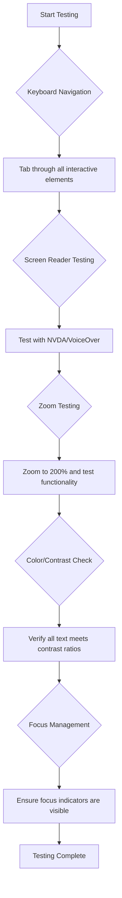
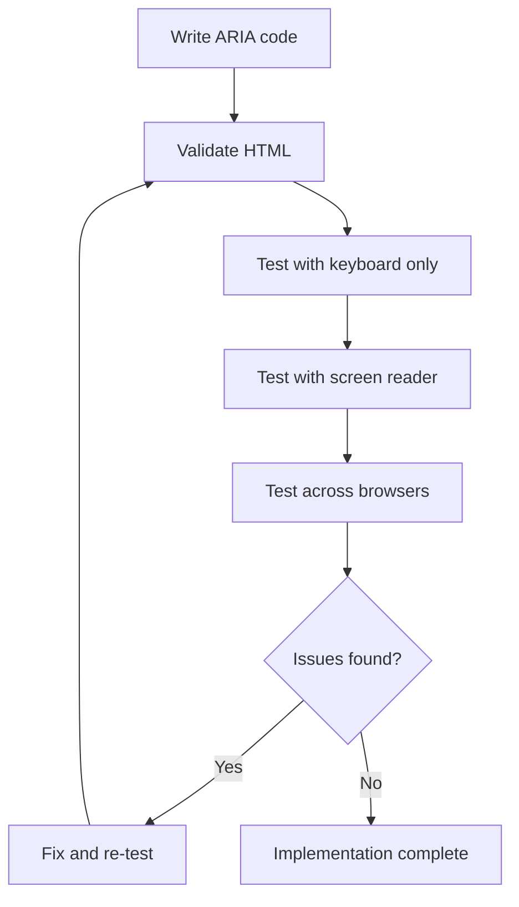

<!--
CO_OP_TRANSLATOR_METADATA:
{
  "original_hash": "90b19cde5b79b29e91babd3138cd8035",
  "translation_date": "2025-10-25T00:24:29+00:00",
  "source_file": "1-getting-started-lessons/3-accessibility/README.md",
  "language_code": "sl"
}
-->
# Ustvarjanje dostopnih spletnih strani


> Sketchnote avtorja [Tomomi Imura](https://twitter.com/girlie_mac)

## Predhodni kviz
[Predhodni kviz](https://ff-quizzes.netlify.app/web/)

> Moč spleta je v njegovi univerzalnosti. Dostop za vse, ne glede na invalidnost, je bistven vidik.
>
> \- Sir Timothy Berners-Lee, direktor W3C in izumitelj svetovnega spleta

Tukaj je nekaj, kar vas morda preseneti: ko gradite dostopne spletne strani, ne pomagate le ljudem z invalidnostmi – dejansko izboljšujete splet za vse!

Ste kdaj opazili tiste klančine na vogalih ulic? Prvotno so bile zasnovane za invalidske vozičke, zdaj pa pomagajo ljudem z vozički za otroke, dostavljavcem s transportnimi vozički, popotnikom s kovčki na kolesih in tudi kolesarjem. Točno tako deluje dostopno oblikovanje spletnih strani – rešitve, ki pomagajo eni skupini, pogosto koristijo vsem. Kul, kajne?

V tej lekciji bomo raziskali, kako ustvariti spletne strani, ki resnično delujejo za vse, ne glede na način brskanja po spletu. Odkrijte praktične tehnike, ki so že vgrajene v spletne standarde, preizkusite orodja za testiranje in spoznajte, kako dostopnost naredi vaše strani bolj uporabne za vse uporabnike.

Do konca te lekcije boste pridobili samozavest, da dostopnost postane naravni del vašega razvojnega procesa. Ste pripravljeni raziskati, kako premišljene oblikovalske odločitve lahko odprejo splet milijardam uporabnikov? Potopimo se!

> To lekcijo lahko opravite na [Microsoft Learn](https://docs.microsoft.com/learn/modules/web-development-101/accessibility/?WT.mc_id=academic-77807-sagibbon)!

## Razumevanje pomožnih tehnologij

Preden se lotimo kodiranja, si vzemimo trenutek za razumevanje, kako ljudje z različnimi sposobnostmi dejansko doživljajo splet. To ni le teorija – razumevanje teh vzorcev navigacije v resničnem svetu vas bo naredilo veliko boljšega razvijalca!

Pomožne tehnologije so neverjetna orodja, ki ljudem z invalidnostmi omogočajo interakcijo s spletnimi stranmi na načine, ki vas lahko presenetijo. Ko enkrat razumete, kako te tehnologije delujejo, postane ustvarjanje dostopnih spletnih izkušenj veliko bolj intuitivno. To je kot da bi se naučili videti svojo kodo skozi oči nekoga drugega.

### Bralniki zaslona

[Bralniki zaslona](https://en.wikipedia.org/wiki/Screen_reader) so precej napredna tehnologija, ki digitalno besedilo pretvori v govor ali izhod v brajici. Čeprav jih primarno uporabljajo ljudje z motnjami vida, so zelo koristni tudi za uporabnike z učnimi težavami, kot je disleksija.

Rad si predstavljam bralnik zaslona kot zelo pametnega pripovedovalca, ki vam bere knjigo. Vsebino bere na glas v logičnem vrstnem redu, napoveduje interaktivne elemente, kot so "gumb" ali "povezava", in ponuja bližnjice na tipkovnici za premikanje po strani. Ampak tukaj je stvar – bralniki zaslona lahko delujejo le, če gradimo spletne strani s pravilno strukturo in smiselno vsebino. Tukaj nastopite vi kot razvijalec!

**Priljubljeni bralniki zaslona na različnih platformah:**
- **Windows**: [NVDA](https://www.nvaccess.org/about-nvda/) (brezplačen in najbolj priljubljen), [JAWS](https://webaim.org/articles/jaws/), [Narrator](https://support.microsoft.com/windows/complete-guide-to-narrator-e4397a0d-ef4f-b386-d8ae-c172f109bdb1/?WT.mc_id=academic-77807-sagibbon) (vgrajen)
- **macOS/iOS**: [VoiceOver](https://support.apple.com/guide/voiceover/welcome/10) (vgrajen in zelo zmogljiv)
- **Android**: [TalkBack](https://support.google.com/accessibility/android/answer/6283677) (vgrajen)
- **Linux**: [Orca](https://wiki.gnome.org/Projects/Orca) (brezplačen in odprtokoden)

**Kako bralniki zaslona navigirajo po spletni vsebini:**

Bralniki zaslona ponujajo več metod navigacije, ki omogočajo učinkovito brskanje za izkušene uporabnike:
- **Sekvenčno branje**: Bere vsebino od zgoraj navzdol, kot bi sledili knjigi
- **Navigacija po mejnikih**: Premikanje med odseki strani (glava, navigacija, glavni del, noga)
- **Navigacija po naslovih**: Preskakovanje med naslovi za razumevanje strukture strani
- **Seznami povezav**: Ustvarjanje seznama vseh povezav za hiter dostop
- **Kontrole obrazcev**: Neposredna navigacija med vnosnimi polji in gumbi

> 💡 **Tukaj je nekaj, kar me je presenetilo**: 68 % uporabnikov bralnikov zaslona navigira primarno po naslovih ([WebAIM Survey](https://webaim.org/projects/screenreadersurvey9/#finding)). To pomeni, da je vaša struktura naslovov kot zemljevid za uporabnike – ko jo pravilno nastavite, dobesedno pomagate ljudem hitreje najti pot po vaši vsebini!

### Gradnja vašega testnega delovnega procesa

Tukaj je dobra novica – učinkovito testiranje dostopnosti ni nujno preobsežno! Želite kombinirati avtomatizirana orodja (odlična so za odkrivanje očitnih težav) z nekaj ročnega testiranja. Tukaj je sistematičen pristop, ki po mojem mnenju ujame največ težav, ne da bi vam vzel ves dan:

**Osnovni ročni testni delovni proces:**



**Kontrolni seznam korakov testiranja:**
1. **Navigacija s tipkovnico**: Uporabljajte le Tab, Shift+Tab, Enter, Space in puščične tipke
2. **Testiranje z bralnikom zaslona**: Omogočite NVDA, VoiceOver ali Narrator in navigirajte z zaprtimi očmi
3. **Testiranje povečave**: Testirajte pri 200 % in 400 % povečavi
4. **Preverjanje barvnega kontrasta**: Preverite ves tekst in UI komponente
5. **Testiranje indikatorja fokusa**: Prepričajte se, da imajo vsi interaktivni elementi vidne fokusne stanja

✅ **Začnite z Lighthouse**: Odprite orodja za razvijalce v brskalniku, izvedite Lighthouse dostopnostni pregled in nato uporabite rezultate za usmerjanje vašega ročnega testiranja.

### Orodja za povečavo in povečevanje

Ste že kdaj na telefonu povečali besedilo, ker je bilo premajhno, ali pa ste se trudili prebrati zaslon prenosnika na močni sončni svetlobi? Mnogi uporabniki se vsak dan zanašajo na orodja za povečevanje, da bi lahko prebrali vsebino. Sem spadajo ljudje s slabim vidom, starejši in vsakdo, ki je kdaj poskušal prebrati spletno stran na prostem.

Sodobne tehnologije za povečavo so se razvile onkraj zgolj povečevanja. Razumevanje, kako ta orodja delujejo, vam bo pomagalo ustvariti odzivne dizajne, ki ostanejo funkcionalni in privlačni na vseh ravneh povečave.

**Sodobne zmogljivosti povečave v brskalnikih:**
- **Povečava strani**: Sorazmerno poveča vso vsebino (besedilo, slike, postavitev) – to je prednostna metoda
- **Povečava samo besedila**: Poveča velikost pisave, medtem ko ohranja prvotno postavitev
- **Povečava s ščipanjem**: Podpora za mobilne geste za začasno povečavo
- **Podpora brskalnikov**: Vsi sodobni brskalniki podpirajo povečavo do 500 % brez motenj funkcionalnosti

**Specializirana programska oprema za povečevanje:**
- **Windows**: [Magnifier](https://support.microsoft.com/windows/use-magnifier-to-make-things-on-the-screen-easier-to-see-414948ba-8b1c-d3bd-8615-0e5e32204198) (vgrajen), [ZoomText](https://www.freedomscientific.com/training/zoomtext/getting-started/)
- **macOS/iOS**: [Zoom](https://www.apple.com/accessibility/mac/vision/) (vgrajen z naprednimi funkcijami)

> ⚠️ **Oblikovalski premislek**: WCAG zahteva, da vsebina ostane funkcionalna, ko je povečana na 200 %. Na tej ravni naj bo horizontalno pomikanje minimalno, vsi interaktivni elementi pa naj ostanejo dostopni.

✅ **Testirajte svoj odzivni dizajn**: Povečajte brskalnik na 200 % in 400 %. Ali se vaša postavitev elegantno prilagaja? Ali lahko še vedno dostopate do vseh funkcij brez pretiranega pomikanja?

## Sodobna orodja za testiranje dostopnosti

Zdaj, ko razumete, kako ljudje navigirajo po spletu s pomožnimi tehnologijami, raziščimo orodja, ki vam pomagajo graditi in testirati dostopne spletne strani.

Pomislite na to tako: avtomatizirana orodja so odlična za odkrivanje očitnih težav (kot je manjkajoče besedilo alt), medtem ko vam ročno testiranje pomaga zagotoviti, da je vaša stran prijetna za uporabo v resničnem svetu. Skupaj vam dajejo zaupanje, da vaše strani delujejo za vse.

### Testiranje barvnega kontrasta

Tukaj je dobra novica: barvni kontrast je ena najpogostejših težav pri dostopnosti, vendar je tudi ena najlažjih za odpravo. Dober kontrast koristi vsem – od uporabnikov z motnjami vida do ljudi, ki poskušajo brati svoje telefone na plaži.

**Zahteve WCAG za kontrast:**

| Tip besedila | WCAG AA (Minimalno) | WCAG AAA (Izboljšano) |
|--------------|---------------------|-----------------------|
| **Navadno besedilo** (manj kot 18pt) | Razmerje kontrasta 4,5:1 | Razmerje kontrasta 7:1 |
| **Veliko besedilo** (18pt+ ali 14pt+ krepko) | Razmerje kontrasta 3:1 | Razmerje kontrasta 4,5:1 |
| **UI komponente** (gumbi, obrobe obrazcev) | Razmerje kontrasta 3:1 | Razmerje kontrasta 3:1 |

**Osnovna orodja za testiranje:**
- [Colour Contrast Analyser](https://www.tpgi.com/color-contrast-checker/) - Namizna aplikacija z izbiro barv
- [WebAIM Contrast Checker](https://webaim.org/resources/contrastchecker/) - Spletno orodje s takojšnjim povratnim informacijami
- [Stark](https://www.getstark.co/) - Vtičnik za oblikovalska orodja, kot so Figma, Sketch, Adobe XD
- [Accessible Colors](https://accessible-colors.com/) - Poiščite dostopne barvne palete

✅ **Ustvarite boljše barvne palete**: Začnite z barvami vaše blagovne znamke in uporabite preverjevalnike kontrasta za ustvarjanje dostopnih različic. Dokumentirajte te barve kot dostopne barvne oznake vašega oblikovalskega sistema.

### Celovito preverjanje dostopnosti

Najbolj učinkovito testiranje dostopnosti združuje več pristopov. Nobeno orodje ne ujame vsega, zato gradnja testne rutine z različnimi metodami zagotavlja temeljito pokritost.

**Testiranje v brskalniku (vgrajeno v orodja za razvijalce):**
- **Chrome/Edge**: Lighthouse dostopnostni pregled + panel za dostopnost
- **Firefox**: Inšpektor dostopnosti s podrobnim pogledom na drevo
- **Safari**: Zavihek za pregled v Web Inspectorju s simulacijo VoiceOver

**Profesionalni testni razširitve:**
- [axe DevTools](https://www.deque.com/axe/devtools/) - Industrijski standard za avtomatizirano testiranje
- [WAVE](https://wave.webaim.org/extension/) - Vizualne povratne informacije z označevanjem napak
- [Accessibility Insights](https://accessibilityinsights.io/) - Microsoftov celovit testni paket

**Ukazna vrstica in integracija CI/CD:**
- [axe-core](https://github.com/dequelabs/axe-core) - JavaScript knjižnica za avtomatizirano testiranje
- [Pa11y](https://pa11y.org/) - Orodje za testiranje dostopnosti prek ukazne vrstice
- [Lighthouse CI](https://github.com/GoogleChrome/lighthouse-ci) - Avtomatizirano ocenjevanje dostopnosti

> 🎯 **Cilj testiranja**: Ciljajte na dostopnostno oceno Lighthouse 95+ kot osnovo. Ne pozabite, da avtomatizirana orodja ujamejo le približno 30–40 % težav z dostopnostjo – ročno testiranje je še vedno nujno!

## Gradnja dostopnosti od začetka

Ključ do uspeha pri dostopnosti je, da jo vključite v temelje že od prvega dne. Vem, da je morda mamljivo razmišljati "dostopnost bom dodal kasneje", vendar je to kot poskušati dodati klančino hiši, ko je že zgrajena. Možno? Da. Enostavno? Ne ravno.

Pomislite na dostopnost kot na načrtovanje hiše – veliko lažje je vključiti dostopnost za invalidske vozičke v začetne arhitekturne načrte, kot pa vse prilagoditi kasneje.

### Načela POUR: Temelj vaše dostopnosti

Smernice za dostopnost spletnih vsebin (WCAG) temeljijo na štirih osnovnih načelih, ki jih označuje kratica POUR. Ne skrbite – to niso suhoparni akademski koncepti! Pravzaprav so praktične smernice za ustvarjanje vsebine, ki deluje za vse.

Ko enkrat razumete načela POUR, postane sprejemanje odločitev glede dostopnosti veliko bolj intuitivno. To je kot imeti mentalni kontrolni seznam, ki vodi vaše oblikovalske odločitve. Poglejmo podrobnosti:

**🔍 Zaznavno**: Informacije morajo biti predstavljene na način, ki ga uporabniki lahko zaznajo s svojimi razpoložljivimi čuti

- Zagotovite besedilne alternative za vsebino brez besedila (slike, videi, zvok)
- Poskrbite za zadosten barvni kontrast za ves tekst in UI komponente
- Ponudite podnapise in prepise za multimedijsko vsebino
- Oblikujte vsebino, ki ostane funkcionalna, ko je povečana do 200 %
- Uporabljajte več senzoričnih značilnosti (ne le barve) za prenos informacij

**🎮 Operativno**: Vse komponente vmesnika morajo biti operativne prek razpoložljivih vhodnih metod

- Poskrbite, da je vsa funkcionalnost dostopna prek navigacije s tipkovnico
- Uporabnikom omogočite dovolj časa za branje in interakcijo z vsebino
- Izogibajte se vsebini, ki povzroča epileptične napade ali vestibularne motnje
- Pomagajte uporabnikom učinkovito navigirati z jasno strukturo in mejniki
- Poskrbite, da imajo interaktivni elementi ustrezne ciljne velikosti (najmanj 44px)

**📖 Razumljivo**: Informacije in delovanje UI morajo biti jasni in razumljivi

- Uporabljajte jasno, preprosto jezikovno izražanje, primerno za vašo ciljno skupino
- Poskrbite, da se vsebina pojavi in deluje na predvidljiv, dosleden način
- Zagotovite jasna navodila in sporočila o napakah za uporabniški vnos
- Pomagajte uporabnikom razumeti in popraviti napake v obrazcih
- Organizirajte vsebino z logičnim vrstnim redom branja in hierarhijo informacij

**💪 Robustno**: Vsebina mora zanesljivo delovati na različnih tehnologijah in pomožnih napravah

- Uporabljajte veljaven, semantičen HTML kot osnovo
- Poskrbite za združljivost s trenutnimi in prihodnjimi pomožnimi tehnologijami
- Sled
Barva je močno komunikacijsko orodje, vendar nikoli ne sme biti edini način za prenos pomembnih informacij. Oblikovanje, ki presega barvo, ustvarja bolj robustne in vključujoče izkušnje, ki delujejo v različnih situacijah.

**Oblikovanje za razlike v barvnem vidu:**

Približno 8 % moških in 0,5 % žensk ima neko obliko razlike v barvnem vidu (pogosto imenovano "barvna slepota"). Najpogostejše vrste so:
- **Deuteranopija**: Težave pri razlikovanju med rdečo in zeleno
- **Protanopija**: Rdeča barva se zdi bolj zatemnjena
- **Tritanopija**: Težave z modro in rumeno (redko)

**Strategije za vključujočo uporabo barv:**

```css
/* ❌ Bad: Using only color to indicate status */
.error { color: red; }
.success { color: green; }

/* ✅ Good: Color plus icons and context */
.error {
  color: #d32f2f;
  border-left: 4px solid #d32f2f;
}
.error::before {
  content: "⚠️";
  margin-right: 8px;
}

.success {
  color: #2e7d32;
  border-left: 4px solid #2e7d32;
}
.success::before {
  content: "✅";
  margin-right: 8px;
}
```

**Preseganje osnovnih zahtev glede kontrasta:**
- Preverite svoje izbire barv z simulatorji barvne slepote
- Uporabite vzorce, teksture ali oblike poleg barvnega kodiranja
- Poskrbite, da bodo interaktivna stanja prepoznavna tudi brez barve
- Upoštevajte, kako vaš dizajn izgleda v načinu visokega kontrasta

✅ **Preverite dostopnost barv**: Uporabite orodja, kot je [Coblis](https://www.color-blindness.com/coblis-color-blindness-simulator/), da vidite, kako vaša stran izgleda uporabnikom z različnimi vrstami barvnega vida.

### Indikatorji fokusa in interakcijsko oblikovanje

Indikatorji fokusa so digitalni ekvivalent kazalca – kažejo uporabnikom tipkovnice, kje na strani se nahajajo. Dobro oblikovani indikatorji fokusa izboljšajo izkušnjo za vse, saj naredijo interakcije jasne in predvidljive.

**Sodobne najboljše prakse za indikatorje fokusa:**

```css
/* Enhanced focus styles that work across browsers */
button:focus-visible {
  outline: 2px solid #0066cc;
  outline-offset: 2px;
  box-shadow: 0 0 0 4px rgba(0, 102, 204, 0.25);
}

/* Remove focus outline for mouse users, preserve for keyboard users */
button:focus:not(:focus-visible) {
  outline: none;
}

/* Focus-within for complex components */
.card:focus-within {
  box-shadow: 0 0 0 3px rgba(74, 144, 164, 0.5);
  border-color: #4A90A4;
}

/* Ensure focus indicators meet contrast requirements */
.custom-focus:focus-visible {
  outline: 3px solid #ffffff;
  outline-offset: 2px;
  box-shadow: 0 0 0 6px #000000;
}
```

**Zahteve za indikatorje fokusa:**
- **Vidnost**: Mora imeti vsaj razmerje kontrasta 3:1 z okoliškimi elementi
- **Širina**: Najmanj 2px debeline okoli celotnega elementa
- **Vztrajnost**: Naj ostane viden, dokler se fokus ne premakne drugam
- **Razlikovanje**: Mora biti vizualno drugačen od drugih stanj uporabniškega vmesnika

> 💡 **Nasvet za oblikovanje**: Odlični indikatorji fokusa pogosto uporabljajo kombinacijo obrobe, senčenja in sprememb barve, da zagotovijo vidnost na različnih ozadjih in v različnih kontekstih.

✅ **Preverite indikatorje fokusa**: Premikajte se po svoji spletni strani s pomočjo tipke Tab in opazujte, kateri elementi imajo jasne indikatorje fokusa. Ali so kateri težko vidni ali popolnoma manjkajo?

### Semantični HTML: Temelj dostopnosti

Semantični HTML je kot GPS sistem za asistivno tehnologijo na vaši spletni strani. Ko uporabljate prave HTML elemente za njihov namen, v bistvu zagotavljate bralnikom zaslona, tipkovnicam in drugim orodjem podroben zemljevid, ki pomaga uporabnikom učinkovito navigirati.

Tukaj je analogija, ki mi je resnično pomagala razumeti: semantični HTML je razlika med dobro organizirano knjižnico z jasnimi kategorijami in koristnimi oznakami ter skladiščem, kjer so knjige razmetane naključno. Obe mesti imata iste knjige, vendar v katerem bi raje iskali nekaj? Točno tako!

**Gradniki dostopne strukture strani:**

```html
<!-- Landmark elements provide page navigation structure -->
<header>
  <h1>Your Site Name</h1>
  <nav aria-label="Main navigation">
    <ul>
      <li><a href="/home">Home</a></li>
      <li><a href="/about">About</a></li>
      <li><a href="/services">Services</a></li>
    </ul>
  </nav>
</header>

<main>
  <article>
    <header>
      <h1>Article Title</h1>
      <p>Published on <time datetime="2024-10-14">October 14, 2024</time></p>
    </header>
    
    <section>
      <h2>First Section</h2>
      <p>Content that relates to this section...</p>
    </section>
    
    <section>
      <h2>Second Section</h2>
      <p>More related content...</p>
    </section>
  </article>
  
  <aside>
    <h2>Related Links</h2>
    <nav aria-label="Related articles">
      <ul>
        <li><a href="/related-1">First related article</a></li>
        <li><a href="/related-2">Second related article</a></li>
      </ul>
    </nav>
  </aside>
</main>

<footer>
  <p>&copy; 2024 Your Site Name. All rights reserved.</p>
  <nav aria-label="Footer links">
    <ul>
      <li><a href="/privacy">Privacy Policy</a></li>
      <li><a href="/contact">Contact Us</a></li>
    </ul>
  </nav>
</footer>
```

**Zakaj semantični HTML izboljšuje dostopnost:**

| Semantični element | Namen | Koristi za bralnik zaslona |
|--------------------|-------|---------------------------|
| `<header>` | Glava strani ali odseka | "Banner landmark" - hitra navigacija na vrh |
| `<nav>` | Navigacijske povezave | "Navigation landmark" - seznam navigacijskih odsekov |
| `<main>` | Glavna vsebina strani | "Main landmark" - neposreden skok na vsebino |
| `<article>` | Samostojna vsebina | Oznanja meje članka |
| `<section>` | Tematske skupine vsebine | Zagotavlja strukturo vsebine |
| `<aside>` | Povezana vsebina stranskega stolpca | "Complementary landmark" |
| `<footer>` | Glava ali odsek strani | "Contentinfo landmark" |

**Supermoči bralnikov zaslona s semantičnim HTML-jem:**
- **Navigacija po mejnikih**: Takojšnji skok med glavnimi odseki strani
- **Orisi naslovov**: Ustvarjanje kazala iz strukture naslovov
- **Seznami elementov**: Ustvarjanje seznamov vseh povezav, gumbov ali kontrolnih elementov obrazcev
- **Zavedanje konteksta**: Razumevanje odnosov med odseki vsebine

> 🎯 **Hitri test**: Poskusite navigirati po svoji strani z bralnikom zaslona z uporabo bližnjic za mejnike (D za mejnik, H za naslov, K za povezavo v NVDA/JAWS). Ali navigacija smiselno deluje?

✅ **Preverite svojo semantično strukturo**: Uporabite panel Dostopnosti v orodjih za razvijalce vašega brskalnika, da si ogledate drevo dostopnosti in preverite, ali vaša oznaka ustvarja logično strukturo.

### Hierarhija naslovov: Ustvarjanje logičnega orisa vsebine

Naslovi so izjemno pomembni za dostopno vsebino – so kot hrbtenica, ki vse drži skupaj. Uporabniki bralnikov zaslona se močno zanašajo na naslove, da razumejo in navigirajo po vaši vsebini. Pomislite na to kot na zagotavljanje kazala za vašo stran.

**Zlato pravilo za naslove:**
Nikoli ne preskakujte ravni. Vedno napredujte logično od `<h1>` do `<h2>` do `<h3>` in tako naprej. Se spomnite, kako ste v šoli delali osnutke? To je popolnoma enako načelo – ne bi preskočili iz "I. Glavna točka" neposredno na "C. Pod-podtočka" brez "A. Podtočke" vmes, kajne?

**Primer popolne strukture naslovov:**

```html
<!-- ✅ Excellent: Logical, hierarchical progression -->
<main>
  <h1>Complete Guide to Web Accessibility</h1>
  
  <section>
    <h2>Understanding Screen Readers</h2>
    <p>Introduction to screen reader technology...</p>
    
    <h3>Popular Screen Reader Software</h3>
    <p>NVDA, JAWS, and VoiceOver comparison...</p>
    
    <h3>Testing with Screen Readers</h3>
    <p>Step-by-step testing instructions...</p>
  </section>
  
  <section>
    <h2>Color and Contrast Guidelines</h2>
    <p>Designing with sufficient contrast...</p>
    
    <h3>WCAG Contrast Requirements</h3>
    <p>Understanding the different contrast levels...</p>
    
    <h3>Testing Tools and Techniques</h3>
    <p>Tools for verifying contrast ratios...</p>
  </section>
</main>
```

```html
<!-- ❌ Problematic: Skipping levels, inconsistent structure -->
<h1>Page Title</h1>
<h3>Subsection</h3> <!-- Skipped h2 -->
<h2>This should come before h3</h2>
<h1>Another main heading?</h1> <!-- Multiple h1s -->
```

**Najboljše prakse za naslove:**
- **En `<h1>` na stran**: Običajno vaš glavni naslov strani ali naslov primarne vsebine
- **Logičen napredek**: Nikoli ne preskakujte ravni (h1 → h2 → h3, ne h1 → h3)
- **Opisna vsebina**: Poskrbite, da so naslovi smiselni, tudi če jih beremo izven konteksta
- **Vizualno oblikovanje s CSS**: Uporabite CSS za videz, ravni HTML pa za strukturo

**Statistika navigacije bralnikov zaslona po naslovih:**
- 68 % uporabnikov bralnikov zaslona navigira po naslovih ([WebAIM Survey](https://webaim.org/projects/screenreadersurvey9/#finding))
- Uporabniki pričakujejo logičen oris naslovov
- Naslovi omogočajo najhitrejše razumevanje strukture strani

> 💡 **Profesionalni nasvet**: Uporabite razširitve brskalnika, kot je "HeadingsMap", da vizualizirate strukturo svojih naslovov. Morala bi izgledati kot dobro organizirano kazalo.

✅ **Preverite strukturo svojih naslovov**: Uporabite navigacijo po naslovih bralnika zaslona (tipka H v NVDA) za skok med naslovi. Ali napredek logično pripoveduje zgodbo vaše vsebine?

### Napredne tehnike vizualne dostopnosti

Poleg osnov kontrasta in barv obstajajo sofisticirane tehnike, ki pomagajo ustvariti resnično vključujoče vizualne izkušnje. Te metode zagotavljajo, da vaša vsebina deluje v različnih pogojih gledanja in z asistivnimi tehnologijami.

**Osnovne strategije vizualne komunikacije:**

- **Večmodalna povratna informacija**: Združite vizualne, besedilne in včasih zvočne namige
- **Postopno razkrivanje**: Predstavite informacije v prebavljivih delih
- **Dosledni vzorci interakcij**: Uporabite znane konvencije uporabniškega vmesnika
- **Odgovorna tipografija**: Prilagodite velikost besedila glede na napravo
- **Stanja nalaganja in napak**: Zagotovite jasno povratno informacijo za vse uporabniške akcije

**CSS pripomočki za izboljšano dostopnost:**

```css
/* Screen reader only text - visually hidden but accessible */
.sr-only {
  position: absolute;
  width: 1px;
  height: 1px;
  padding: 0;
  margin: -1px;
  overflow: hidden;
  clip: rect(0, 0, 0, 0);
  white-space: nowrap;
  border: 0;
}

/* Skip link for keyboard navigation */
.skip-link {
  position: absolute;
  top: -40px;
  left: 6px;
  background: #000000;
  color: #ffffff;
  padding: 8px 16px;
  text-decoration: none;
  border-radius: 4px;
  font-weight: bold;
  transition: top 0.3s ease;
  z-index: 1000;
}

.skip-link:focus {
  top: 6px;
}

/* Reduced motion respect */
@media (prefers-reduced-motion: reduce) {
  .skip-link {
    transition: none;
  }
  
  * {
    animation-duration: 0.01ms !important;
    animation-iteration-count: 1 !important;
    transition-duration: 0.01ms !important;
  }
}

/* High contrast mode support */
@media (prefers-contrast: high) {
  .button {
    border: 2px solid;
  }
}
```

> 🎯 **Vzorec dostopnosti**: "Preskoči povezavo" je bistvena za uporabnike tipkovnice. Biti mora prvi fokusni element na vaši strani in skočiti neposredno na glavno vsebino.

✅ **Implementirajte preskok navigacije**: Dodajte preskočne povezave na svoje strani in jih preizkusite s pritiskom na Tab takoj, ko se stran naloži. Pojaviti se morajo in omogočiti skok na glavno vsebino.

## Oblikovanje smiselnega besedila povezav

Povezave so v bistvu avtoceste spleta, vendar slabo napisano besedilo povezav je kot imeti prometne znake, ki samo pravijo "Kraj" namesto "Središče Chicaga". Ni ravno koristno, kajne?

Tukaj je nekaj, kar me je res presenetilo, ko sem prvič izvedel: bralniki zaslona lahko izločijo vse povezave s strani in jih prikažejo kot en velik seznam. Predstavljajte si, da vam nekdo izroči imenik vseh povezav na vaši strani. Ali bi vsaka imela smisel sama po sebi? To je test, ki ga mora prestati vaše besedilo povezav!

### Razumevanje vzorcev navigacije po povezavah

Bralniki zaslona ponujajo zmogljive funkcije za navigacijo po povezavah, ki se zanašajo na dobro napisano besedilo povezav:

**Metode navigacije po povezavah:**
- **Sekvenčno branje**: Povezave se berejo v kontekstu kot del toka vsebine
- **Generiranje seznama povezav**: Vse povezave na strani so zbrane v iskalnem imeniku
- **Hitra navigacija**: Skok med povezavami z uporabo bližnjic na tipkovnici (K v NVDA)
- **Funkcija iskanja**: Iskanje specifičnih povezav z vnosom delnega besedila

**Zakaj je kontekst pomemben:**
Ko uporabniki bralnikov zaslona ustvarijo seznam povezav, vidijo nekaj takega:
- "Prenesi poročilo"
- "Izvedi več"
- "Klikni tukaj"
- "Politika zasebnosti"
- "Klikni tukaj"

Samo dve od teh povezav nudita koristne informacije, če jih beremo izven konteksta!

> 📊 **Vpliv na uporabnika**: Uporabniki bralnikov zaslona pregledujejo sezname povezav, da hitro razumejo vsebino strani. Splošno besedilo povezav jih prisili, da se vrnejo k vsakemu kontekstu povezave, kar znatno upočasni njihovo izkušnjo brskanja.

### Pogoste napake pri besedilu povezav, ki se jim je treba izogniti

Razumevanje, kaj ne deluje, pomaga prepoznati in odpraviti težave z dostopnostjo v obstoječi vsebini.

**❌ Splošno besedilo povezav, ki ne nudi konteksta:**

```html
<!-- Meaningless when read from a link list -->
<p>Our sustainability efforts are detailed in our recent report. 
   <a href="/sustainability-2024.pdf">Click here</a> to view it.</p>

<!-- Repeated generic text throughout the page -->
<div class="article-card">
  <h3>Web Accessibility Guide</h3>
  <p>Learn the fundamentals...</p>
  <a href="/accessibility-guide">Read more</a>
</div>
<div class="article-card">
  <h3>Color Contrast Tips</h3>
  <p>Improve your design...</p>
  <a href="/color-contrast">Read more</a>
</div>

<!-- URLs as link text (difficult for screen readers to announce) -->
<p>Visit https://www.w3.org/WAI/WCAG21/quickref/ for WCAG guidelines.</p>

<!-- Vague action words -->
<a href="/contact">Go</a> | <a href="/about">See</a> | <a href="/help">View</a>
```

**Zakaj ti vzorci ne delujejo:**
- **"Klikni tukaj"** uporabnikom ne pove ničesar o cilju
- **"Preberi več"** večkrat ponovljeno povzroča zmedo
- **Surovi URL-ji** so težko razumljivi za bralnike zaslona
- **Enobesedne povezave** kot "Pojdi" ali "Glej" nimajo opisnega konteksta

### Pisanje odličnega besedila povezav

Opisno besedilo povezav koristi vsem – vidni uporabniki lahko hitro preberejo povezave, uporabniki bralnikov zaslona pa takoj razumejo cilje.

**✅ Primeri jasnega, opisnega besedila povezav:**

```html
<!-- Descriptive text that explains the destination -->
<p>Our comprehensive <a href="/sustainability-2024.pdf">2024 sustainability report (PDF, 2.1MB)</a> details our environmental initiatives.</p>

<!-- Specific, unique link text for each card -->
<div class="article-card">
  <h3>Web Accessibility Guide</h3>
  <p>Learn the fundamentals of inclusive design...</p>
  <a href="/accessibility-guide">Read our complete web accessibility guide</a>
</div>
<div class="article-card">
  <h3>Color Contrast Tips</h3>
  <p>Improve your design with better color choices...</p>
  <a href="/color-contrast">Explore color contrast best practices</a>
</div>

<!-- Meaningful text instead of raw URLs -->
<p>The <a href="https://www.w3.org/WAI/WCAG21/quickref/">WCAG 2.1 Quick Reference guide</a> provides comprehensive accessibility guidelines.</p>

<!-- Descriptive action links -->
<a href="/contact">Contact our support team</a> | 
<a href="/about">About our company</a> | 
<a href="/help">Get help with your account</a>
```

**Najboljše prakse za besedilo povezav:**
- **Bodite specifični**: "Prenesi četrtletno finančno poročilo" namesto "Prenesi"
- **Vključite vrsto datoteke in velikost**: "(PDF, 1,2 MB)" za datoteke za prenos
- **Omenite, če se povezave odprejo zunaj**: "(odpre se v novem oknu)" kadar je primerno
- **Uporabite aktivni jezik**: "Kontaktirajte nas" namesto "Kontaktna stran"
- **Naj bo jedrnato**: Ciljajte na 2-8 besed, kadar je to mogoče

### Napredni vzorci dostopnosti povezav

Včasih vizualne omejitve oblikovanja ali tehnične zahteve potrebujejo posebne rešitve. Tukaj so sofisticirane tehnike za pogoste izzive:

**Uporaba ARIA za izboljšan kontekst:**

```html
<!-- When button text must be short but needs more context -->
<a href="/report.pdf" 
   aria-label="Download 2024 annual financial report, PDF format, 2.3MB">
  Download Report
</a>

<!-- When the full context comes from surrounding content -->
<h3 id="sustainability-heading">Sustainability Initiative</h3>
<p>Our efforts to reduce environmental impact...</p>
<a href="/sustainability-details" 
   aria-labelledby="sustainability-heading"
   aria-describedby="sustainability-summary">
  Learn more
</a>
<p id="sustainability-summary">Detailed breakdown of our 2024 environmental goals and achievements</p>
```

**Označevanje vrst datotek in zunanjih ciljev:**

```html
<!-- Method 1: Include information in visible link text -->
<a href="/annual-report.pdf">
  Download our 2024 annual report (PDF, 2.3MB)
</a>

<!-- Method 2: Use screen reader-only text for file details -->
<a href="/annual-report.pdf">
  Download our 2024 annual report
  <span class="sr-only">(PDF format, 2.3MB)</span>
</a>

<!-- Method 3: External link indication -->
<a href="https://example.com" 
   target="_blank" 
   aria-describedby="external-link-warning">
  Visit external resource
</a>
<span id="external-link-warning" class="sr-only">
  (opens in new window)
</span>

<!-- Method 4: Using CSS for visual indicators -->
<a href="https://example.com" class="external-link">
  External resource
</a>
```

```css
/* Visual indicator for external links */
.external-link::after {
  content: " ↗";
  font-size: 0.8em;
  color: #666;
}

/* Screen reader announcement for external links */
.external-link::before {
  content: "External link: ";
  position: absolute;
  left: -10000px;
  width: 1px;
  height: 1px;
  overflow: hidden;
}
```

> ⚠️ **Pomembno**: Pri uporabi `target="_blank"` vedno obvestite uporabnike, da se povezava odpre v novem oknu ali zavihku. Nepričakovane spremembe navigacije lahko povzročijo zmedo.

✅ **Preverite kontekst svojih povezav**: Uporabite orodja za razvijalce v brskalniku, da ustvarite seznam vseh povezav na svoji strani. Ali lahko razumete namen vsake povezave brez okoliškega konteksta?

## ARIA: Supermoč za dostopnost HTML-ja

[Accessible Rich Internet Applications (ARIA)](https://developer.mozilla.org/docs/Web/Accessibility/ARIA) je kot univerzalni prevajalnik med vašimi kompleksnimi spletnimi aplikacijami in asistivnimi tehnologijami. Ko sam HTML ne more izraziti vsega, kar počnejo vaši interaktivni elementi, ARIA zapolni te vrzeli.

ARIA si predstavljam kot dodajanje koristnih opomb k vašemu HTML-ju – nekaj podobnega kot režijske opombe v scenariju, ki igralcem pomagajo razumeti njihove vloge in odnose.

**Najpomembnejše pravilo o ARIA**: Vedno najprej uporabite semantični HTML, nato pa dodajte ARIA za izboljšanje. ARIA naj bo kot začimba, ne glavni obrok. Najprej pravilno postavite temelje!

### Strateška implementacija ARIA

ARIA je močna, vendar z močjo prihaja odgovornost. Napačna uporaba ARIA lahko dostopnost poslabša bolj kot njena odsotnost. Tukaj je, kdaj in kako jo učinkovito uporabiti:

**✅ Uporabite ARIA, ko:**
- Ustvarjate prilagojene interaktivne pripomočke (akordeone, zavihke, karusele)
- Gradite dinamično vsebino, ki se spreminja brez ponovnega nalaganja strani
- Zagotavljate dodatni kontekst za kompleksne odnose uporabniškega vmesnika
- Označujete stanja nalaganja ali posodobitve vsebine v živo
- Ustvarjate aplikacije s prilagojenimi kontrolami

**❌ Izogibajte se ARIA, ko:**
- Standardni HTML elementi že zagotavljajo potrebne semantike
- Niste prepričani, kako jo pravilno implementirati
- Podvaja informacije, ki jih že zagotavlja semantični HTML
- Niste testirali z dejansko asistivno tehnologijo

> 🎯 **Zlato pravilo ARIA**: "Ne spreminjajte semantike, razen če je to nujno potrebno, vedno zagotovite dostopnost s tipkovnico in testirajte z resnično asistivno tehnologijo."

**Pet kategorij ARIA:**

1. **Vloge**: Kaj je ta element? (`button`, `tab`, `dialog`)
2. **Lastnosti**: Kakšne so njegove značilnosti? (`aria-required`, `aria-haspopup`)
3. **Stanja**: Kakšno je njegovo trenutno stanje? (`aria-expanded`, `aria-checked`)
4. **Mejniki**: Kje je v strukturi strani? (`banner`, `navigation`, `main`)
5. **Regije v živo**: Kako naj se spremembe oznanjajo? (`aria-live`, `aria-atomic`)

### Osnovni vzorci ARIA za sodobne spletne aplikacije

Ti vzorci rešujejo najpogostejše izzive dostopnosti v interaktivnih spletnih aplikacijah:

**Poimenovanje in opisovanje
5. **Začnite preprosto**: Zapletene ARIA implementacije pogosteje vsebujejo napake

**🔍 Postopek testiranja:**



**🚫 Pogoste napake pri uporabi ARIA, ki se jim je treba izogniti:**

- **Nasprotujoče informacije**: Ne nasprotujte semantiki HTML
- **Prekomerno označevanje**: Preveč informacij ARIA lahko zmede uporabnike
- **Statična ARIA**: Pozabljanje na posodabljanje stanj ARIA, ko se vsebina spremeni
- **Nepreverjene implementacije**: ARIA, ki deluje v teoriji, a ne v praksi
- **Manjkajoča podpora za tipkovnico**: ARIA vloge brez ustreznih interakcij s tipkovnico

> 💡 **Viri za testiranje**: Uporabite orodja, kot je [accessibility-checker](https://www.npmjs.com/package/accessibility-checker) za avtomatizirano validacijo ARIA, vendar vedno testirajte z resničnimi bralniki zaslona za popolno izkušnjo.

✅ **Učite se od strokovnjakov**: Preučite [ARIA Authoring Practices Guide](https://w3c.github.io/aria-practices/) za preverjene vzorce in implementacije zapletenih interaktivnih pripomočkov.

## Dostopnost slik in medijev

Vizualna in zvočna vsebina sta bistvena dela sodobnih spletnih izkušenj, vendar lahko ustvarjata ovire, če nista premišljeno implementirana. Cilj je zagotoviti, da informacije in čustveni učinek vaših medijev dosežejo vsakega uporabnika. Ko se tega navadite, postane to nekaj povsem naravnega.

Različne vrste medijev zahtevajo različne pristope k dostopnosti. To je kot kuhanje—ne bi obravnavali nežne ribe enako kot močno zrezek. Razumevanje teh razlik vam pomaga izbrati pravo rešitev za vsako situacijo.

### Strateška dostopnost slik

Vsaka slika na vaši spletni strani ima svoj namen. Razumevanje tega namena vam pomaga napisati boljše alternativno besedilo in ustvariti bolj vključujoče izkušnje.

**Štiri vrste slik in njihove strategije za alternativno besedilo:**

**Informativne slike** - prenašajo pomembne informacije:
```html

```

**Dekorativne slike** - zgolj vizualne brez informacijske vrednosti:
```html

```

**Funkcionalne slike** - služijo kot gumbi ali kontrolniki:
```html
<button>
  
</button>
```

**Kompleksne slike** - grafikoni, diagrami, infografike:
```html

<div id="chart-description">
  <p>Detailed description: Sales data shows a steady increase across all quarters...</p>
</div>
```

### Dostopnost videa in zvoka

**Zahteve za video:**
- **Podnapisi**: Besedilna različica govorjene vsebine in zvočnih učinkov
- **Zvočni opisi**: Naracija vizualnih elementov za slepe uporabnike
- **Transkripti**: Celotna besedilna različica vse zvočne in vizualne vsebine

```html
<video controls>
  <source src="video.mp4" type="video/mp4">
  <track kind="captions" src="captions.vtt" srclang="en" label="English">
  <track kind="descriptions" src="descriptions.vtt" srclang="en" label="Audio descriptions">
</video>
```

**Zahteve za zvok:**
- **Transkripti**: Besedilna različica vse govorjene vsebine
- **Vizualni indikatorji**: Za vsebino, ki je samo zvočna, zagotovite vizualne namige

### Sodobne tehnike za slike

**Uporaba CSS za dekorativne slike:**
```css
.hero-section {
  background-image: url('decorative-hero.jpg');
  /* Decorative images in CSS don't need alt text */
}
```

**Odgovorne slike z dostopnostjo:**
```html
<picture>
  <source media="(min-width: 800px)" srcset="large-chart.png">
  <source media="(min-width: 400px)" srcset="medium-chart.png">
  
</picture>
```

✅ **Testirajte dostopnost slik**: Uporabite bralnik zaslona za navigacijo po strani s slikami. Ali dobite dovolj informacij za razumevanje vsebine?

## Navigacija s tipkovnico in upravljanje fokusa

Veliko uporabnikov brska po spletu izključno s tipkovnicami. To vključuje ljudi z motoričnimi ovirami, napredne uporabnike, ki se jim zdi tipkovnica hitrejša od miške, in vse, ki jim miška ne deluje. Zagotoviti, da vaša stran dobro deluje z vnosom preko tipkovnice, je bistveno in pogosto naredi vašo stran bolj učinkovito za vse.

### Osnovni vzorci navigacije s tipkovnico

**Standardne interakcije s tipkovnico:**
- **Tab**: Premik fokusa naprej skozi interaktivne elemente
- **Shift + Tab**: Premik fokusa nazaj
- **Enter**: Aktivacija gumbov in povezav
- **Space**: Aktivacija gumbov, označevanje polj
- **Puščične tipke**: Navigacija znotraj skupin komponent (radio gumbi, meniji)
- **Escape**: Zapiranje modalov, spustnih menijev ali preklic operacij

### Najboljše prakse upravljanja fokusa

**Vidni indikatorji fokusa:**
```css
/* Ensure focus is always visible */
button:focus-visible {
  outline: 2px solid #4A90A4;
  outline-offset: 2px;
}

/* Custom focus styles for different components */
.card:focus-within {
  box-shadow: 0 0 0 3px rgba(74, 144, 164, 0.5);
}
```

**Povezave za preskok za učinkovito navigacijo:**
```html
<a href="#main-content" class="skip-link">Skip to main content</a>
<a href="#navigation" class="skip-link">Skip to navigation</a>

<nav id="navigation">
  <!-- navigation content -->
</nav>
<main id="main-content">
  <!-- main content -->
</main>
```

**Pravilni vrstni red tabulatorja:**
```html
<!-- Use semantic HTML for natural tab order -->
<form>
  <label for="name">Name:</label>
  <input type="text" id="name" tabindex="0">
  
  <label for="email">Email:</label>
  <input type="email" id="email" tabindex="0">
  
  <button type="submit" tabindex="0">Submit</button>
</form>
```

### Ujetje fokusa v modalih

Ob odprtju modalnih dialogov mora biti fokus ujet znotraj modala:

```javascript
// Modern focus trap implementation
function trapFocus(element) {
  const focusableElements = element.querySelectorAll(
    'button, [href], input, select, textarea, [tabindex]:not([tabindex="-1"])'
  );
  
  const firstElement = focusableElements[0];
  const lastElement = focusableElements[focusableElements.length - 1];

  element.addEventListener('keydown', (e) => {
    if (e.key === 'Tab') {
      if (e.shiftKey && document.activeElement === firstElement) {
        e.preventDefault();
        lastElement.focus();
      } else if (!e.shiftKey && document.activeElement === lastElement) {
        e.preventDefault();
        firstElement.focus();
      }
    }
    
    if (e.key === 'Escape') {
      closeModal();
    }
  });
  
  // Focus first element when modal opens
  firstElement.focus();
}
```

✅ **Testirajte navigacijo s tipkovnico**: Poskusite navigirati po vaši spletni strani samo s tipko Tab. Ali lahko dosežete vse interaktivne elemente? Ali je vrstni red fokusa logičen? Ali so indikatorji fokusa jasno vidni?

## Dostopnost obrazcev

Obrazci so ključni za interakcijo uporabnikov in zahtevajo posebno pozornost glede dostopnosti.

### Povezava med oznakami in kontrolami obrazca

**Vsaka kontrola obrazca potrebuje oznako:**
```html
<!-- Explicit labeling (preferred) -->
<label for="username">Username:</label>
<input type="text" id="username" name="username" required>

<!-- Implicit labeling -->
<label>
  Password:
  <input type="password" name="password" required>
</label>

<!-- Using aria-label when visual label isn't desired -->
<input type="search" aria-label="Search products" placeholder="Search...">
```

### Obdelava napak in validacija

**Dostopna sporočila o napakah:**
```html
<label for="email">Email Address:</label>
<input type="email" id="email" name="email" 
       aria-describedby="email-error" 
       aria-invalid="true" required>
<div id="email-error" role="alert">
  Please enter a valid email address
</div>
```

**Najboljše prakse validacije obrazcev:**
- Uporabite `aria-invalid` za označevanje neveljavnih polj
- Zagotovite jasna, specifična sporočila o napakah
- Uporabite `role="alert"` za pomembna obvestila o napakah
- Prikazujte napake takoj in ob oddaji obrazca

### Polja in združevanje

**Združite povezane kontrole obrazca:**
```html
<fieldset>
  <legend>Shipping Address</legend>
  <label for="street">Street Address:</label>
  <input type="text" id="street" name="street">
  
  <label for="city">City:</label>
  <input type="text" id="city" name="city">
</fieldset>

<fieldset>
  <legend>Preferred Contact Method</legend>
  <input type="radio" id="contact-email" name="contact" value="email">
  <label for="contact-email">Email</label>
  
  <input type="radio" id="contact-phone" name="contact" value="phone">
  <label for="contact-phone">Phone</label>
</fieldset>
```

## Vaša pot do dostopnosti: Ključne točke

Čestitke! Pravkar ste pridobili osnovno znanje za ustvarjanje resnično vključujočih spletnih izkušenj. To je precej vznemirljivo! Spletna dostopnost ni le preverjanje skladnosti—gre za prepoznavanje raznolikih načinov, kako ljudje interagirajo z digitalno vsebino, in oblikovanje za to neverjetno kompleksnost.

Zdaj ste del rastoče skupnosti razvijalcev, ki razumejo, da odlično oblikovanje deluje za vse. Dobrodošli v klubu!

**🎯 Vaš dostopnostni komplet zdaj vključuje:**

| Osnovno načelo | Implementacija | Vpliv |
|----------------|----------------|---------|
| **Temelj semantičnega HTML** | Uporaba ustreznih HTML elementov za njihov namen | Bralniki zaslona lahko učinkovito navigirajo, tipkovnice delujejo samodejno |
| **Vključujoče vizualno oblikovanje** | Zadosten kontrast, smiselna uporaba barv, vidni indikatorji fokusa | Jasno za vse v vseh svetlobnih pogojih |
| **Opisna vsebina** | Smiselno besedilo povezav, alternativno besedilo, naslovi | Uporabniki razumejo vsebino brez vizualnega konteksta |
| **Dostopnost tipkovnice** | Vrstni red tabulatorja, bližnjice na tipkovnici, upravljanje fokusa | Motorična dostopnost in učinkovitost za napredne uporabnike |
| **Izboljšanje z ARIA** | Strateška uporaba za zapolnitev semantičnih vrzeli | Zapletene aplikacije delujejo z asistivnimi tehnologijami |
| **Celovito testiranje** | Avtomatizirana orodja + ročna preverjanja + testiranje z resničnimi uporabniki | Odkrivanje težav pred vplivom na uporabnike |

**🚀 Vaši naslednji koraki:**

1. **Vključite dostopnost v vaš delovni proces**: Naredite testiranje naravni del vašega razvojnega procesa
2. **Učite se od resničnih uporabnikov**: Poiščite povratne informacije od ljudi, ki uporabljajo asistivne tehnologije
3. **Ostanite na tekočem**: Tehnike dostopnosti se razvijajo z novimi tehnologijami in standardi
4. **Zagovarjajte vključevanje**: Delite svoje znanje in naredite dostopnost prednostno nalogo ekipe

> 💡 **Zapomnite si**: Omejitve dostopnosti pogosto vodijo do inovativnih, elegantnih rešitev, ki koristijo vsem. Klanci, podnapisi in glasovni nadzor so se začeli kot funkcije dostopnosti in postali splošne izboljšave.

**Poslovni razlog je kristalno jasen**: Dostopne spletne strani dosežejo več uporabnikov, se bolje uvrščajo v iskalnikih, imajo nižje stroške vzdrževanja in se izognejo pravnim tveganjem. Ampak iskreno? Pravi razlog za skrb za dostopnost gre veliko globlje. Dostopne spletne strani utelešajo najboljše vrednote spleta—odprtost, vključevanje in idejo, da si vsak zasluži enak dostop do informacij.

Zdaj ste opremljeni za gradnjo vključujočega spleta prihodnosti. Vsaka dostopna stran, ki jo ustvarite, naredi internet bolj prijazen prostor za vse. To je precej neverjetno, če pomislite!

## Dodatni viri

Nadaljujte svojo pot učenja dostopnosti s temi ključnimi viri:

**📚 Uradni standardi in smernice:**
- [WCAG 2.1 Guidelines](https://www.w3.org/WAI/WCAG21/quickref/) - Uradni standard dostopnosti s hitrim referenčnim vodičem
- [ARIA Authoring Practices Guide](https://w3c.github.io/aria-practices/) - Celoviti vzorci za interaktivne pripomočke
- [WebAIM Guidelines](https://webaim.org/) - Praktične, začetnikom prijazne smernice za dostopnost

**🛠️ Orodja in viri za testiranje:**
- [axe DevTools](https://www.deque.com/axe/devtools/) - Industrijski standard za testiranje dostopnosti
- [A11y Project Checklist](https://www.a11yproject.com/checklist/) - Korak za korakom preverjanje dostopnosti
- [Accessibility Insights](https://accessibilityinsights.io/) - Microsoftov celovit testni paket
- [Color Oracle](https://colororacle.org/) - Simulator barvne slepote za testiranje oblikovanja

**🎓 Učenje in skupnost:**
- [WebAIM Screen Reader Survey](https://webaim.org/projects/screenreadersurvey9/) - Resnične preference in vedenje uporabnikov
- [Inclusive Components](https://inclusive-components.design/) - Sodobni vzorci dostopnih komponent
- [A11y Coffee](https://a11y.coffee/) - Hitri nasveti in vpogledi o dostopnosti
- [Web Accessibility Initiative (WAI)](https://www.w3.org/WAI/) - Celoviti viri za dostopnost W3C

**🎥 Praktično učenje:**
- [Accessibility Developer Guide](https://www.accessibility-developer-guide.com/) - Praktični vodič za implementacijo
- [Deque University](https://dequeuniversity.com/) - Profesionalni tečaji dostopnosti

## GitHub Copilot Agent Challenge 🚀

Uporabite način Agent za dokončanje naslednjega izziva:

**Opis:** Ustvarite dostopen modalni dialog komponento, ki demonstrira pravilno upravljanje fokusa, ARIA atribute in vzorce navigacije s tipkovnico.

**Navodilo:** Zgradite popolno modalno dialog komponento z HTML, CSS in JavaScript, ki vključuje: pravilno ujetje fokusa, tipko ESC za zapiranje, klik zunaj za zapiranje, ARIA atribute za bralnike zaslona in vidne indikatorje fokusa. Modal naj vsebuje obrazec z ustreznimi oznakami in obdelavo napak. Zagotovite, da komponenta ustreza standardom WCAG 2.1 AA.


## 🚀 Izziv

Vzemite ta HTML in ga prepišite tako, da bo čim bolj dostopen, glede na strategije, ki ste se jih naučili.

```html
<!DOCTYPE html>
<html lang="en">
  <head>
    <meta charset="UTF-8">
    <meta name="viewport" content="width=device-width, initial-scale=1.0">
    <title>Turtle Ipsum - The World's Premier Turtle Fan Club</title>
    <link href='../assets/style.css' rel='stylesheet' type='text/css'>
  </head>
  <body>
    <header class="site-header">
      <h1 class="site-title">Turtle Ipsum</h1>
      <p class="site-subtitle">The World's Premier Turtle Fan Club</p>
    </header>
    
    <nav class="main-nav" aria-label="Main navigation">
      <h2 class="nav-header">Resources</h2>
      <ul class="nav-list">
        <li><a href="https://www.youtube.com/watch?v=CMNry4PE93Y">"I like turtles" video</a></li>
        <li><a href="https://en.wikipedia.org/wiki/Turtle">Basic turtle information</a></li>
        <li><a href="https://en.wikipedia.org/wiki/Turtles_(chocolate)">Chocolate turtles candy</a></li>
      </ul>
    </nav>
    
    <main class="main-content">
      <article>
        <h1>Welcome to Turtle Ipsum</h1>
        <p class="intro">
          <a href="/about">Learn more about our turtle community</a> and discover fascinating facts about these amazing creatures.
        </p>
        <p class="article-text">
          Turtle ipsum dolor sit amet, consectetur adipiscing elit, sed do eiusmod tempor incididunt ut labore et dolore magna aliqua. Ut enim ad minim veniam, quis nostrud exercitation ullamco laboris nisi ut aliquip ex ea commodo consequat. Duis aute irure dolor in reprehenderit in voluptate velit esse cillum dolore eu fugiat nulla pariatur. Excepteur sint occaecat cupidatat non proident, sunt in culpa qui officia deserunt mollit anim id est laborum.
        </p>
      </article>
    </main>
    
    <footer class="footer">
      <section class="newsletter-signup">
        <h2>Stay Updated</h2>
        <button type="button" onclick="showNewsletterForm()">Sign up for turtle news</button>
      </section>
      
      <nav class="footer-nav" aria-label="Footer navigation">
        <h2>Site Pages</h2>
        <ul>
          <li><a href="../">Home</a></li>
          <li><a href="../semantic">Semantic HTML example</a></li>
        </ul>
      </nav>
      
      <p class="footer-copyright">&copy; 2024 Instrument. All rights reserved.</p>
    </footer>
  </body>
</html>
```

**Ključne izboljšave:**
- Dodana ustrezna semantična struktura HTML
- Popravljena hierarhija naslovov (en sam h1, logično zaporedje)
- Dodano smiselno besedilo povezav namesto "kliknite tukaj"
- Vključeni ustrezni ARIA oznake za navigacijo
- Dodan atribut lang in ustrezne meta oznake
- Uporaba elementa button za interaktivne elemente
- Struktura vsebine v nogi z ustreznimi oznakami

## Kviz po predavanju
[Kviz po predavanju](https://ff-quizzes.netlify.app/web/en/)

## Pregled in samostojno učenje

Mnoge države imajo zakone glede zahtev za dostopnost. Preberite o zakonih o dostopnosti v vaši domači državi. Kaj je zajeto in kaj ni? Primer je [ta vladna spletna stran](https://accessibility.blog.gov.uk/).

## Naloga
 
[Analizirajte nedostopno spletno stran](assignment.md)

Zasluge: [Turtle Ipsum](https://github.com/Instrument/semantic-html-sample) by Instrument

---

**Omejitev odgovornosti**:  
Ta dokument je bil preveden z uporabo storitve za prevajanje z umetno inteligenco [Co-op Translator](https://github.com/Azure/co-op-translator). Čeprav si prizadevamo za natančnost, vas prosimo, da upoštevate, da lahko avtomatizirani prevodi vsebujejo napake ali netočnosti. Izvirni dokument v njegovem maternem jeziku naj se šteje za avtoritativni vir. Za ključne informacije priporočamo profesionalni človeški prevod. Ne odgovarjamo za morebitna nesporazumevanja ali napačne razlage, ki izhajajo iz uporabe tega prevoda.