<!--
CO_OP_TRANSLATOR_METADATA:
{
  "original_hash": "7f2c48e04754724123ea100a822765e5",
  "translation_date": "2026-01-07T10:38:22+00:00",
  "source_file": "1-getting-started-lessons/3-accessibility/README.md",
  "language_code": "sl"
}
-->
# Ustvarjanje dostopnih spletnih strani

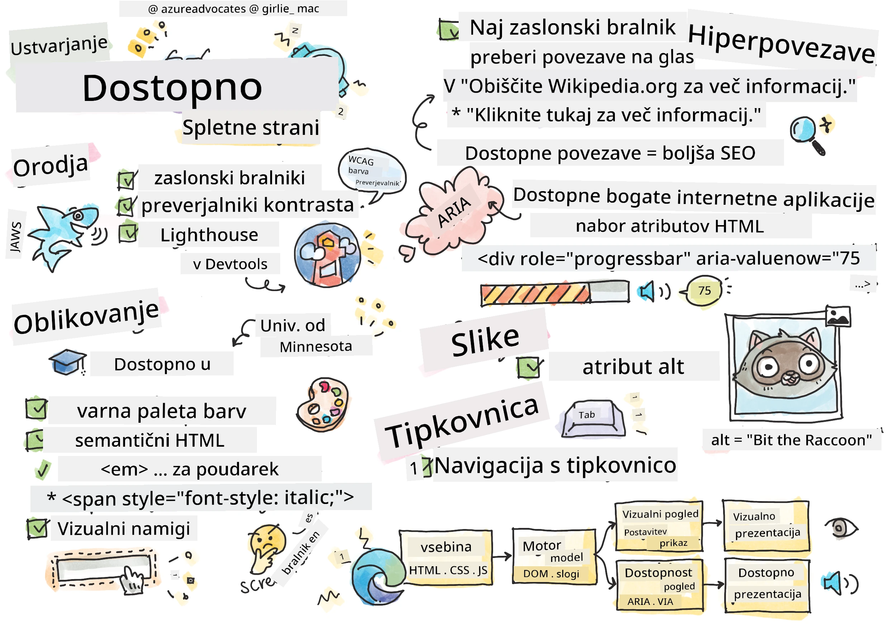
> Sketchnote avtorice [Tomomi Imura](https://twitter.com/girlie_mac)

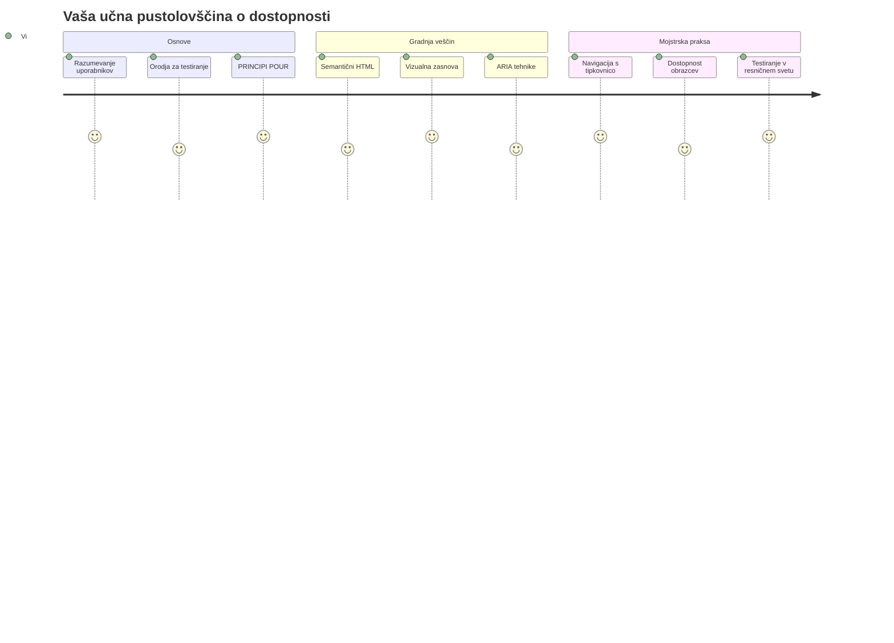
## Predpredavanje Kviza
[Predpredavanje kviza](https://ff-quizzes.netlify.app/web/)

> Moč spleta je v njegovi univerzalnosti. Dostopnost za vse, ne glede na invalidnost, je bistven vidik.
>
> \- Sir Timothy Berners-Lee, direktor W3C in izumitelj svetovnega spleta

Tu je nekaj, kar vas morda preseneti: ko ustvarjate dostopne spletne strani, ne pomagate le osebam z invalidnostmi — pravzaprav izboljšujete splet za vse!

Ste že kdaj opazili tiste stične pragove na vogalih ulic? Sprva so bili zasnovani za invalidske vozičke, zdaj pa pomagajo tudi ljudem z vozički za dojenčke, dostavnikom z vozički, potnikom z valjnimi kovčki in tudi kolesarjem. Tako deluje zasnova dostopnega spleta — rešitve, ki pomagajo eni skupini, pogosto koristijo vsem. Prav kul, kajne?

V tej lekciji bomo raziskali, kako ustvariti spletne strani, ki zares delujejo za vse, ne glede na to, kako brskajo po spletu. Spoznali boste praktične tehnike, že vključene v spletne standarde, preizkusili orodja za testiranje in videli, kako dostopnost naredi vaše strani bolj uporabne za vse uporabnike.

Na koncu lekcije boste samozavestni, da bo dostopnost naravni del vašega razvojnega delovnega procesa. Ste pripravljeni raziskati, kako premišljene oblikovalske odločitve lahko odprejo splet milijardam uporabnikov? Gremo v akcijo!

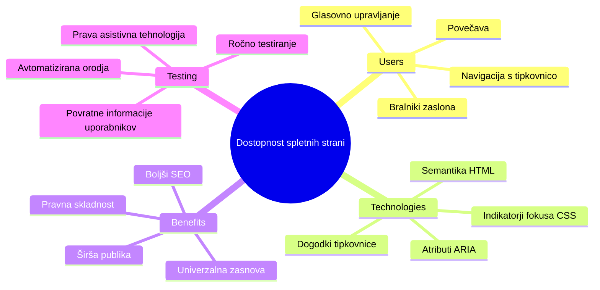
> To lekcijo si lahko ogledate na [Microsoft Learn](https://docs.microsoft.com/learn/modules/web-development-101/accessibility/?WT.mc_id=academic-77807-sagibbon)!

## Razumevanje pomožne tehnologije

Preden se lotimo kodiranja, si vzemimo trenutek za razumevanje, kako ljudje z različnimi sposobnostmi dejansko doživljajo splet. To ni le teorija — razumevanje teh resničnih vzorcev navigacije vas bo naredilo veliko boljšo razvijalca!

Pomožne tehnologije so precej neverjetna orodja, ki pomagajo osebam z invalidnostmi uporabljati spletne strani na načine, ki vas lahko presenetijo. Ko enkrat razumete, kako ta orodja delujejo, postane ustvarjanje dostopnih spletnih izkušenj veliko bolj intuitivno. To je kot učiti se gledati vašo kodo skozi oči nekoga drugega.

### Bralniki zaslona

[Bralniki zaslona](https://en.wikipedia.org/wiki/Screen_reader) so zelo sofisticirane tehnološke naprave, ki pretvarjajo digitalno besedilo v govor ali brajico. Uporabljajo jih predvsem osebe z okvaro vida, a so zelo koristni tudi za uporabnike z učnimi motnjami, kot je disleksija.

Rad si predstavljam bralnik zaslona kot zelo pametnega pripovedovalca, ki vam bere knjigo. Naglas bere vsebino v logičnem zaporedju, napoveduje interaktivne elemente kot na primer "gumb" ali "povezava" in omogoča bližnjice na tipkovnici za hitro premikanje po strani. Toda ključ je v tem — bralniki zaslona lahko delujejo le, če spletne strani zgradimo s pravo strukturo in smiselno vsebino. In tukaj vi nastopite kot razvijalec!

**Priljubljeni bralniki zaslona na različnih platformah:**
- **Windows**: [NVDA](https://www.nvaccess.org/about-nvda/) (brezplačen in najbolj priljubljen), [JAWS](https://webaim.org/articles/jaws/), [Narrator](https://support.microsoft.com/windows/complete-guide-to-narrator-e4397a0d-ef4f-b386-d8ae-c172f109bdb1/?WT.mc_id=academic-77807-sagibbon) (vgrajen)
- **macOS/iOS**: [VoiceOver](https://support.apple.com/guide/voiceover/welcome/10) (vgrajen in zelo zmogljiv)
- **Android**: [TalkBack](https://support.google.com/accessibility/android/answer/6283677) (vgrajen)
- **Linux**: [Orca](https://wiki.gnome.org/Projects/Orca) (brezplačen in odprtokoden)

**Kako bralniki zaslona navigirajo po spletnem vsebini:**

Bralniki zaslona omogočajo več načinov navigacije, ki omogočajo učinkovito brskanje izkušenim uporabnikom:
- **Zaporedno branje**: bere vsebino od zgoraj navzdol, kot bi bral knjigo
- **Navigacija po oznakah**: preskakovanje med deli strani (glava, navigacija, glavni del, noga)
- **Navigacija po naslovih**: preskok med naslovi za razumevanje strukture strani
- **Seznami povezav**: generira seznam vseh povezav za hiter dostop
- **Kontrole obrazcev**: neposredna navigacija med vnosnimi polji in gumbi

> 💡 **Nekaj, kar me je osupnilo**: 68 % uporabnikov bralnikov zaslona uporablja predvsem navigacijo po naslovih ([WebAIM Survey](https://webaim.org/projects/screenreadersurvey9/#finding)). To pomeni, da je vaša struktura naslovov kot zemljevid za uporabnike—ko jo naredite prav, jim dejansko pomagate hitreje najti pot skozi vašo vsebino!

### Gradnja vašega testnega poteka dela

Dobra novica je, da učinkovito testiranje dostopnosti ne mora biti preobremenjujoče! Želeli boste združiti avtomatizirana orodja (ta so odlična za odkrivanje očitnih težav) s praktičnim ročnim testiranjem. Tu je sistematičen pristop, ki po mojih izkušnjah zazna največ težav brez porabe celega dneva:

**Nujni postopki ročnega testiranja:**

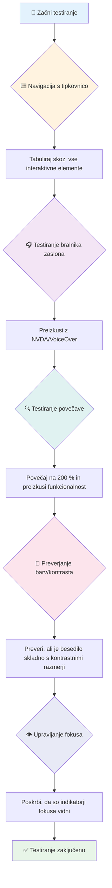
**Korak za korakom kontrolni seznam testiranja:**
1. **Navigacija s tipkovnico**: uporabljajte samo Tab, Shift+Tab, Enter, Space in puščične tipke
2. **Testiranje z bralnikom zaslona**: vklopite NVDA, VoiceOver ali Narrator in navigirajte z zaprtimi očmi
3. **Testiranje povečave**: testirajte na 200 % in 400 % povečavi
4. **Preverjanje kontrasta barv**: preglejte vse besedilo in uporabniški vmesnik
5. **Testiranje indikatorja fokusa**: zagotovite, da imajo vsi interaktivni elementi vidne fokalne stanje

✅ **Začnite z Lighthouse**: Odprite orodja za razvijalce v brskalniku, poženite dostopnostni pregled Lighthouse, nato rezultate uporabite za usmerjanje ročnega testiranja.

### Orodja za povečavo in zoom

Ste kdaj na telefonu zaščepli zaslon, da povečate besedilo, kadar je premajhno, ali pa vidite zaslon prenosnika na svetlem soncu z zamegljenim pogledom? Veliko uporabnikov vsak dan uporablja povečavo, da je vsebina berljiva. To vključuje osebe z nizkim vidom, starejše odrasle in kogar koli, ki je kdajkoli poskušal brati spletno stran na prostem.

Sodobne tehnologije zooma so se razvile onstran zgolj povečevanja velikosti. Razumevanje, kako ta orodja delujejo, vam bo pomagalo ustvariti odzivne zasnove, ki ostanejo funkcionalne in privlačne pri kateri koli stopnji povečave.

**Zmožnosti zooma v sodobnih brskalnikih:**
- **Povečava strani**: vsebina se proporcionalno poveča (besedilo, slike, postavitev) - to je priporočena metoda
- **Povečava samo besedila**: poveča velikost pisave, pri tem pa ohranja izvorno postavitev
- **Povečanje s stiskanjem prstov**: podpora za mobilne geste za začasno povečavo
- **Podpora brskalnika**: vsi sodobni brskalniki podpirajo zoom do 500 % brez izgube funkcionalnosti

**Specializirana programska oprema za povečavo:**
- **Windows**: [Povečevalnik](https://support.microsoft.com/windows/use-magnifier-to-make-things-on-the-screen-easier-to-see-414948ba-8b1c-d3bd-8615-0e5e32204198) (vgrajen), [ZoomText](https://www.freedomscientific.com/training/zoomtext/getting-started/)
- **macOS/iOS**: [Zoom](https://www.apple.com/accessibility/mac/vision/) (vgrajen z naprednimi funkcijami)

> ⚠️ **Oblikovalski premislek**: WCAG zahteva, da vsebina ostane funkcionalna pri 200 % povečavi. Pri tej stopnji bi bilo vodoravno pomikanje minimalno, vsi interaktivni elementi pa dostopni.

✅ **Testirajte svojo odzivno zasnovo**: povečajte brskalnik na 200 % in 400 %. Ali se vaša postavitev lepo prilagaja? Ali imate še vedno dostop do vseh funkcionalnosti brez pretiranega pomikanja?

## Sodobna orodja za testiranje dostopnosti

Zdaj, ko razumete, kako ljudje uporabljajo splet s pomožnimi tehnologijami, si oglejmo orodja, ki vam pomagajo graditi in testirati dostopne spletne strani.

Razmišljajte tako: avtomatizirana orodja so odlična za odkrivanje očitnih težav (kot so manjkajoči alt opisi), medtem ko ročno testiranje zagotovi, da je stran prijetna za uporabo v resničnem svetu. Skupaj vam nudijo samozavest, da strani delujejo za vsakogar.

### Testiranje barvnega kontrasta

Dobra novica je, da je barvni kontrast ena najpogostejših težav z dostopnostjo, a tudi ena najlažjih za odpravo. Dober kontrast koristi vsem — od uporabnikov z okvaro vida do ljudi, ki poskušajo na plaži brati svoje telefone.

**WCAG zahteve glede kontrasta:**

| Vrsta besedila | WCAG AA (minimalno) | WCAG AAA (izboljšano) |
|-----------|-------------------|---------------------|
| **Navadno besedilo** (pod 18 pt) | kontrast 4,5 : 1 | kontrast 7 : 1 |
| **Veliko besedilo** (18 pt+ ali 14 pt+ krepko) | kontrast 3 : 1 | kontrast 4,5 : 1 |
| **UI komponenta** (gumbi, robovi obrazcev) | kontrast 3 : 1 | kontrast 3 : 1 |

**Nujna testna orodja:**
- [Colour Contrast Analyser](https://www.tpgi.com/color-contrast-checker/) - namizna aplikacija z barvnim pipetnikom
- [WebAIM Contrast Checker](https://webaim.org/resources/contrastchecker/) - spletno orodje s takojšnjim povratnim informacijam
- [Stark](https://www.getstark.co/) - dodatki za oblikovalska orodja Figma, Sketch, Adobe XD
- [Accessible Colors](https://accessible-colors.com/) - poiščite dostopne barvne palete

✅ **Ustvarite boljše barvne palete**: Začnite z barvami svoje blagovne znamke in uporabite kontrolnike kontrasta za oblikovanje dostopnih različic. Dokumentirajte jih kot dostopne barvne nyanse v vašem oblikovalskem sistemu.

### Celovito testiranje dostopnosti

Najbolj učinkovito testiranje dostopnosti združuje več pristopov. Nobeno orodje ne ujame vseh težav, zato je dobro razviti rutino z različnimi metodami, da zagotovite temeljito pokritost.

**Testiranje v brskalniku (vgrajeno v orodja za razvijalce):**
- **Chrome/Edge**: Lighthouse hitrostni pregled + Accessibility panel
- **Firefox**: Accessibility Inspector z natančnim drevesnim prikazom
- **Safari**: Zavihek z auditom v Web Inspectorju z VoiceOver simulacijo

**Profesionalni razširitveni dodatki:**
- [axe DevTools](https://www.deque.com/axe/devtools/) - standardna avtomatizirana orodja za testiranje
- [WAVE](https://wave.webaim.org/extension/) - vizualna povratna informacija s poudarjanjem napak
- [Accessibility Insights](https://accessibilityinsights.io/) - Microsoftova celovita testna zbirka

**Ukazna vrstica in integracija CI/CD:**
- [axe-core](https://github.com/dequelabs/axe-core) - JavaScript knjižnica za avtomatizirano testiranje
- [Pa11y](https://pa11y.org/) - orodje za testiranje dostopnosti preko ukazne vrstice
- [Lighthouse CI](https://github.com/GoogleChrome/lighthouse-ci) - avtomatizirano merjenje dostopnosti

> 🎯 **Cilj testiranja**: prizadevajte si za rezultat dostopnosti v Lighthouse nad 95 %. Upoštevajte, da avtomatizirana orodja zaznajo le približno 30-40 % težav — ročno testiranje je še vedno ključnega pomena!

### 🧠 **Preverjanje veščin testiranja: Ste pripravljeni najti težave?**

**Poglejmo, kako se počutite glede testiranja dostopnosti:**
- Kateri način testiranja se vam zdi trenutno najbolj dostopen?
- Se vidite, da bi cel dan uporabljali samo tipkovnico za navigacijo?
- Kakšno dostopnostno oviro ste osebno izkusili na spletu?

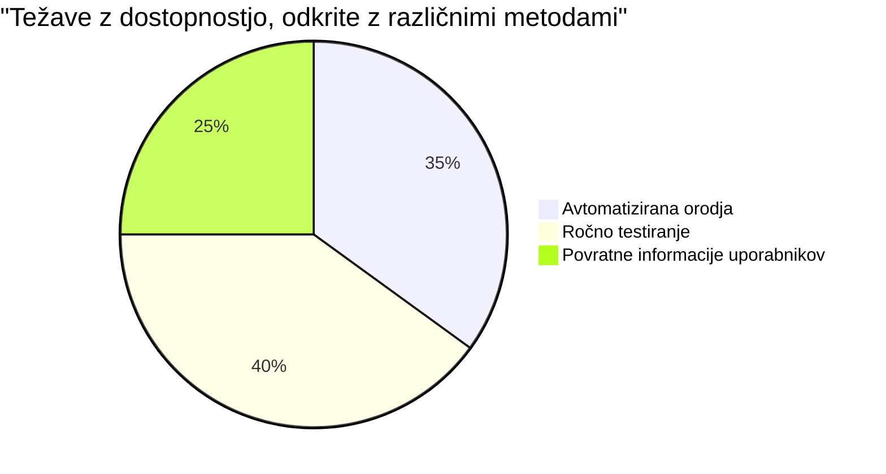
> **Povečanje samozavesti**: Profesionalni testirci dostopnosti uporabljajo to prav to kombinacijo metod. Učite se industrijsko preverjene prakse!

## Gradnja dostopnosti od temeljev naprej

Ključ do uspešne dostopnosti je, da jo vključite v temelje že od prvega dne. Vem, da je mamljivo reči »dostopnost bom dodal pozneje«, a to je kot poskušati dodati rampo hiši, ko je že zgrajena. Možno? Da. Enostavno? Ne ravno.

Dostopnost lahko primerjate z načrtovanjem hiše — veliko lažje je vključiti dostopnost za invalidske vozičke v arhitekturni načrt kot naknadno preurejati stvari.

### PRINCIPI POUR: Osnova vaše dostopnosti

Smernice za dostopnost spletne vsebine (WCAG) temeljijo na štirih osnovnih načelih, ki tvorijo akronim POUR. Brez skrbi — to niso nekakšni akademski pojmi! So praktična vodila za ustvarjanje vsebin, ki delujejo za vse.

Ko enkrat osvojite POUR, sprejemanje odločitev o dostopnosti postane veliko bolj intuitivno. Je kot imeti mentalni kontrolni seznam, ki usmerja vaše oblikovalske izbire. Poglejmo si jih malo bolj podrobno:

```mermaid
flowchart LR
    A[🔍 DOSEGLJIVO<br/>Ali ga uporabniki zaznajo?] --> B[🎮 UPORABLJIVO<br/>Ali ga uporabniki lahko uporabljajo?]
    B --> C[📖 RAZUMLJIVO<br/>Ali ga uporabniki razumejo?]
    C --> D[💪 ODPORNO<br/>Ali deluje povsod?]
    
    A1[Alternativno besedilo<br/>Napisi<br/>Kontrast] --> A
    B1[Dostop do tipkovnice<br/>Brez napadov<br/>Časovne omejitve] --> B
    C1[Jasen jezik<br/>Predvidljivo<br/>Pomoč pri napakah] --> C
    D1[Veljavna koda<br/>Združljivo<br/>Pripravljeno na prihodnost] --> D
    
    style A fill:#e1f5fe
    style B fill:#e8f5e8
    style C fill:#fff3e0
    style D fill:#f3e5f5
```
**🔍 Perceivable (Zaznavno)**: Informacije morajo biti predstavljene na načine, ki jih uporabniki lahko zaznavajo s svojimi razpoložljivimi čutili

- Zagotovite besedilne alternative za nebesedilno vsebino (slike, videoposnetke, avdio)
- Poskrbite za dovolj dober barvni kontrast za vse besedilo in uporabniški vmesnik
- Ponudite podnapise in transkripte za multimedijske vsebine
- Oblikujte vsebino, ki ostane funkcionalna ob povečavi do 200 %
- Uporabite več senzoričnih značilnosti (ne samo barve) za prenašanje informacij

**🎮 Operable (Uporabno)**: Vsi elementi vmesnika morajo biti uporabni z razpoložljivimi načini vnosa

- Naredite vso funkcionalnost dostopno tudi z navigacijo samo prek tipkovnice
- Uporabnikom zagotovite dovolj časa za branje in interakcijo
- Izogibajte se vsebini, ki povzroča napade ali vestibularne motnje
- Pomagajte uporabnikom učinkovito navigirati z jasno strukturo in ozemljitvami
- Zagotovite, da imajo interaktivni elementi dovolj veliko ciljno območje (najmanj 44 px)

**📖 Understandable (Razumljivo)**: Informacije in delovanje uporabniškega vmesnika morajo biti jasni in razumljivi

- Uporabljajte jasen, preprost jezik, primeren za vaše občinstvo
- Poskrbite, da se vsebina pojavlja in deluje na predvidljive in dosledne načine
- Ponudite jasna navodila in sporočila o napakah pri uporabniškem vnosu
- Pomagajte uporabnikom razumeti in popraviti napake v obrazcih
- Organizirajte vsebino z logičnim vrstnim redom branja in hierarhijo informacij

**💪 Robust (Robustno)**: Vsebina mora zanesljivo delovati na različnih tehnologijah in pomožnih napravah

- **Uporabljajte veljaven, semantičen HTML kot svojo osnovo**
- **Zagotovite združljivost z obstoječimi in prihodnjimi pomožnimi tehnologijami**
- **Sledite spletnim standardom in najboljšim praksa za označevanje**
- **Testirajte v različnih brskalnikih, napravah in z asistivnimi orodji**
- **Strukturirajte vsebino tako, da se degradira elegantno, kadar napredne funkcije niso podprte**

### 🎯 **Preverjanje načel POUR: Naj ostanejo v spominu**

**Hitro razmišljanje o temeljih:**
- Se lahko spomnite funkcije spletne strani, ki krši katero od načel POUR?
- Katero načelo vam kot razvijalcu najbolj naravno ustreza?
- Kako bi ta načela izboljšala oblikovanje za vse, ne le za uporabnike z invalidnostmi?

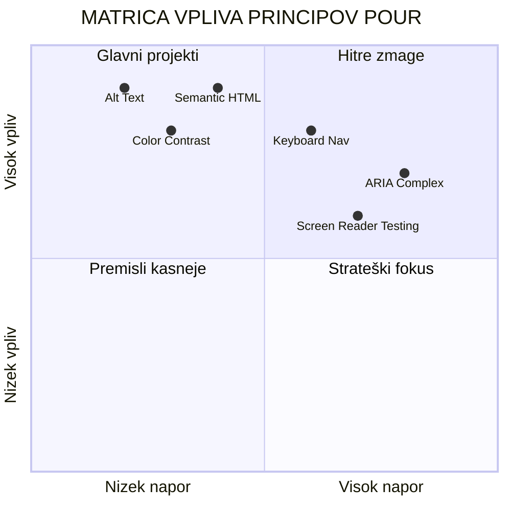
> **Zapomnite si**: Začnite z izboljšavami z velikim učinkom in malo truda. Semantični HTML in alt besedilo vam dajeta največji izboljšavi dostopnosti z najmanj truda!

## Ustvarjanje dostopnega vizualnega oblikovanja

Dobro vizualno oblikovanje in dostopnost gresta z roko v roki. Ko oblikujete z mislijo na dostopnost, pogosto odkrijete, da ti omejitvi vodita do bolj čistih, elegantnih rešitev, ki koristijo vsem uporabnikom.

Raziščimo, kako ustvariti vizualno privlačne zasnove, ki delujejo za vse, ne glede na njihove vidne sposobnosti ali pogoje, v katerih si ogledajo vašo vsebino.

### Strategije za barvo in vizualno dostopnost

Barva je močno komunikacijsko orodje, a nikoli ne sme biti edini način, s katerim posredujete pomembne informacije. Oblikovanje, ki presega barvo, ustvarja bolj robustne, vključujoče izkušnje, ki delujejo v več situacijah.

**Oblikovanje za razlike v barvnem vidu:**

Približno 8 % moških in 0,5 % žensk ima nekakšno obliko barvne slepote (pogosto imenovano "barvna slepota"). Najpogostejše vrste so:
- **Deuteranopija**: Težave z razlikovanjem rdeče in zelene
- **Protanopija**: Rdeča se zdi bolj temna
- **Tritanopija**: Težave z modro in rumeno (redko)

**Vključujoče barvne strategije:**

```css
/* ❌ Bad: Using only color to indicate status */
.error { color: red; }
.success { color: green; }

/* ✅ Good: Color plus icons and context */
.error {
  color: #d32f2f;
  border-left: 4px solid #d32f2f;
}
.error::before {
  content: "⚠️";
  margin-right: 8px;
}

.success {
  color: #2e7d32;
  border-left: 4px solid #2e7d32;
}
.success::before {
  content: "✅";
  margin-right: 8px;
}
```

**Onkraj osnovnih zahtev glede kontrasta:**
- Testirajte svoje barvne izbire s simulatorji barvne slepote
- Uporabljajte vzorce, teksture ali oblike poleg barvnih oznak
- Poskrbite, da bodo interaktivna stanja ostala ločljiva tudi brez barve
- Razmislite, kako vaša zasnova izgleda v načinu visoke kontrastnosti

✅ **Preizkusite dostopnost barv**: Uporabite orodja, kot je [Coblis](https://www.color-blindness.com/coblis-color-blindness-simulator/), da vidite, kako vaša stran izgleda uporabnikom z različnimi vrstami barvnega vida.

### Indikatorji fokusa in oblikovanje interakcije

Indikatorji fokusa so digitalni ekvivalent kazalca – kažejo uporabnikom tipkovnice, kje se nahajajo na strani. Dobro oblikovani indikatorji fokusa izboljšajo izkušnjo za vse z jasnimi in predvidljivimi interakcijami.

**Sodobne dobre prakse indikatorjev fokusa:**

```css
/* Enhanced focus styles that work across browsers */
button:focus-visible {
  outline: 2px solid #0066cc;
  outline-offset: 2px;
  box-shadow: 0 0 0 4px rgba(0, 102, 204, 0.25);
}

/* Remove focus outline for mouse users, preserve for keyboard users */
button:focus:not(:focus-visible) {
  outline: none;
}

/* Focus-within for complex components */
.card:focus-within {
  box-shadow: 0 0 0 3px rgba(74, 144, 164, 0.5);
  border-color: #4A90A4;
}

/* Ensure focus indicators meet contrast requirements */
.custom-focus:focus-visible {
  outline: 3px solid #ffffff;
  outline-offset: 2px;
  box-shadow: 0 0 0 6px #000000;
}
```

**Zahteve za indikator fokusa:**
- **Vidnost**: Mora imeti najmanj razmerje kontrasta 3:1 z okoliškimi elementi
- **Širina**: Minimalna debelina 2px okoli celotnega elementa
- **Vztrajnost**: Mora ostati viden, dokler fokus ne premaknete drugam
- **Razločnost**: Mora se vizualno razlikovati od drugih stanj UI

> 💡 **Nasvet za oblikovanje**: Odlični indikatorji fokusa pogosto uporabljajo kombinacijo obrobe, senc na okvirju in spremembe barve, da zagotovijo vidnost na različnih ozadjih in v različnih kontekstih.

✅ **Preglejte indikatorje fokusa**: Premikajte se s tipko Tab po vaši spletni strani in zabeležite elemente z jasnimi indikatorji fokusa. Ali je kateri težko videti ali popolnoma manjka?

### Semantični HTML: Temelj dostopnosti

Semantični HTML je kot da asistivnim tehnologijam daste navigacijski sistem za vašo spletno stran. Ko uporabite prave HTML elemente za njihov namen, v bistvu ekran čitalcem, tipkovnicam in drugim orodjem zagotovite podroben zemljevid, ki uporabnikom pomaga učinkovito krmariti.

Tu je primerjava, ki mi je res všeč: semantični HTML je razlika med dobro organizirano knjižnico s jasnimi kategorijami in koristnimi oznakami ter skladiščem, kjer so knjige razmetane naokoli. Oba kraja imata iste knjige, a v katerem bi raje iskali nekaj? Točno tako!

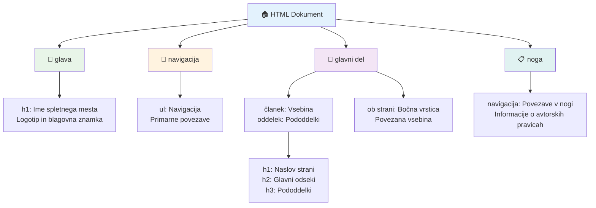
**Gradniki dostopne strukture strani:**

```html
<!-- Landmark elements provide page navigation structure -->
<header>
  <h1>Your Site Name</h1>
  <nav aria-label="Main navigation">
    <ul>
      <li><a href="/home">Home</a></li>
      <li><a href="/about">About</a></li>
      <li><a href="/services">Services</a></li>
    </ul>
  </nav>
</header>

<main>
  <article>
    <header>
      <h1>Article Title</h1>
      <p>Published on <time datetime="2024-10-14">October 14, 2024</time></p>
    </header>
    
    <section>
      <h2>First Section</h2>
      <p>Content that relates to this section...</p>
    </section>
    
    <section>
      <h2>Second Section</h2>
      <p>More related content...</p>
    </section>
  </article>
  
  <aside>
    <h2>Related Links</h2>
    <nav aria-label="Related articles">
      <ul>
        <li><a href="/related-1">First related article</a></li>
        <li><a href="/related-2">Second related article</a></li>
      </ul>
    </nav>
  </aside>
</main>

<footer>
  <p>&copy; 2024 Your Site Name. All rights reserved.</p>
  <nav aria-label="Footer links">
    <ul>
      <li><a href="/privacy">Privacy Policy</a></li>
      <li><a href="/contact">Contact Us</a></li>
    </ul>
  </nav>
</footer>
```

**Zakaj semantični HTML preobraža dostopnost:**

| Semantični element | Namen | Korist za ekran čitalce |
|--------------------|-------|-------------------------|
| `<header>` | Glava strani ali razdelka | "Oznaka pasice" - hitra navigacija na vrh |
| `<nav>` | Navigacijske povezave | "Oznaka navigacije" - seznam navigacijskih razdelkov |
| `<main>` | Glavna vsebina strani | "Glavna oznaka" - preskok neposredno na vsebino |
| `<article>` | Samostojna vsebina | Oznanja meje članka |
| `<section>` | Vsebinski tematski sklopi | Nudi vsebinsko strukturo |
| `<aside>` | Sorodna vsebina na stranski vrstici | "Dopolnilna oznaka" |
| `<footer>` | Noga strani ali razdelka | "Oznaka vsebinskih informacij" |

**Supermoč ekran čitalcev s semantičnim HTML:**
- **Navigacija z oznakami**: Takojšnje preskakovanje med glavnimi deli strani
- **Oris naslovov**: Ustvari kazalo vsebine iz strukture naslovov
- **Seznami elementov**: Ustvari sezname vseh povezav, gumbov ali kontrol obrazcev
- **Zavedanje konteksta**: Razumevanje odnosov med vsebinskimi razdelki

> 🎯 **Hitri preizkus**: Poskusite krmariti po strani z ekran čitalcem z uporabo bližnjic za oznake (D za oznako, H za naslov, K za povezavo v NVDA/JAWS). Ali navigacija ima smisel?

### 🏗️ **Preverjanje mojstrstva semantičnega HTML: Gradnja močnih temeljev**

**Ocenimo vaše razumevanje semantike:**
- Ali lahko prepoznate oznake na spletni strani samo s pogledom na HTML?
- Kako bi prijatelju razložili razliko med `<section>` in `<div>`?
- Kaj bi kot prvo preverili, če uporabnik ekran čitalca prijavi težave z navigacijo?

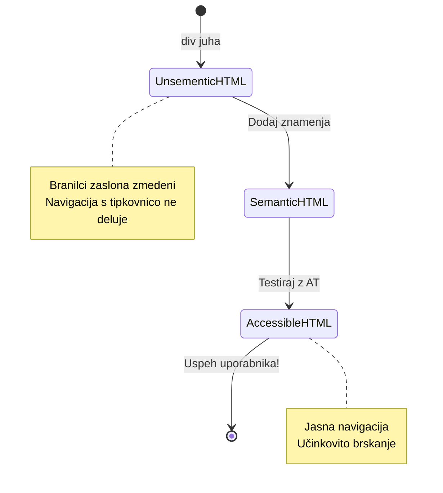
> **Strokovni nasvet**: Dober semantični HTML samodejno reši približno 70 % težav z dostopnostjo. Osvojite ta temelj in ste na dobri poti!

✅ **Preglejte svojo semantično strukturo**: Uporabite ploščo Dostopnosti v orodjih za razvijalce vašega brskalnika, da si ogledate drevo dostopnosti in zagotovite, da vaš označevalnik ustvarja logično strukturo.

### Hierarhija naslovov: Ustvarjanje logične vsebinske strukture

Naslovi so izjemno pomembni za dostopno vsebino – so kot hrbtenica, ki vse drži skupaj. Uporabniki ekran čitalcev se močno zanašajo na naslove, da razumejo in krmarijo po vaši vsebini. Pomislite na to kot na kazalo vsebine vaše strani.

**Tu je zlato pravilo za naslove:**
Nikoli ne preskakujte stopenj. Vedno se logično premikajte od `<h1>` do `<h2>` do `<h3>` in tako dalje. Se spomnite izdelovanja orisov v šoli? Točno ista načela – ne bi preskočili iz "I. Glavna točka" neposredno na "C. Pod-podtočka" brez "A. Podtočke" vmes, kajne?

**Primer popolne strukture naslovov:**

```html
<!-- ✅ Excellent: Logical, hierarchical progression -->
<main>
  <h1>Complete Guide to Web Accessibility</h1>
  
  <section>
    <h2>Understanding Screen Readers</h2>
    <p>Introduction to screen reader technology...</p>
    
    <h3>Popular Screen Reader Software</h3>
    <p>NVDA, JAWS, and VoiceOver comparison...</p>
    
    <h3>Testing with Screen Readers</h3>
    <p>Step-by-step testing instructions...</p>
  </section>
  
  <section>
    <h2>Color and Contrast Guidelines</h2>
    <p>Designing with sufficient contrast...</p>
    
    <h3>WCAG Contrast Requirements</h3>
    <p>Understanding the different contrast levels...</p>
    
    <h3>Testing Tools and Techniques</h3>
    <p>Tools for verifying contrast ratios...</p>
  </section>
</main>
```

```html
<!-- ❌ Problematic: Skipping levels, inconsistent structure -->
<h1>Page Title</h1>
<h3>Subsection</h3> <!-- Skipped h2 -->
<h2>This should come before h3</h2>
<h1>Another main heading?</h1> <!-- Multiple h1s -->
```

**Najboljše prakse za naslove:**
- **En `<h1>` na stran**: Običajno vaš glavni naslov strani ali glavni naslov vsebine
- **Logičen napredek**: Nikoli ne preskakujte stopenj (h1 → h2 → h3, ne h1 → h3)
- **Opisna vsebina**: Naredite naslove smiselne, tudi ko se berejo izven konteksta
- **Vizualno oblikovanje s CSS**: Uporabite CSS za videz, HTML nivoje za strukturo

**Statistika navigacije z ekran čitalcem:**
- 68 % uporabnikov ekran čitalcev krmari po straneh z naslovi ([WebAIM Survey](https://webaim.org/projects/screenreadersurvey9/#finding))
- Uporabniki pričakujejo najti logičen oris naslovov
- Naslovi nudijo najhitrejši način za razumevanje strukture strani

> 💡 **Strokovni nasvet**: Uporabite razširitve brskalnika, kot je "HeadingsMap", da vizualizirate vašo strukturo naslovov. Mora se brati kot dobro organizirano kazalo vsebine.

✅ **Preizkusite strukturo naslovov**: Uporabite navigacijo po naslovih ekran čitalca (tipka H v NVDA), da skočite med naslovi. Ali logično povedo zgodbo vaše vsebine?

### Napredne tehnike vizualne dostopnosti

Onkraj osnov kontrasta in barve obstajajo zapletene tehnike, ki pomagajo ustvariti zares vključujoče vizualne izkušnje. Ti načini zagotavljajo, da vaša vsebina deluje v različnih pogojih gledanja in z asistivnimi tehnologijami.

**Ključne strategije vizualne komunikacije:**

- **Večmodalna povratna informacija**: Združite vizualne, tekstovne in včasih zvočne namige
- **Postopno razkritje**: Prikazujte informacije v prebavljivih delih
- **Konsistentni vzorci interakcije**: Uporabljajte znane UI konvencije
- **Odziven tipografija**: Prilagodite velikost besedila glede na naprave
- **Stanja nalaganja in napak**: Navedite jasno povratno informacijo za vse uporabniške akcije

**CSS pripomočki za izboljšano dostopnost:**

```css
/* Screen reader only text - visually hidden but accessible */
.sr-only {
  position: absolute;
  width: 1px;
  height: 1px;
  padding: 0;
  margin: -1px;
  overflow: hidden;
  clip: rect(0, 0, 0, 0);
  white-space: nowrap;
  border: 0;
}

/* Skip link for keyboard navigation */
.skip-link {
  position: absolute;
  top: -40px;
  left: 6px;
  background: #000000;
  color: #ffffff;
  padding: 8px 16px;
  text-decoration: none;
  border-radius: 4px;
  font-weight: bold;
  transition: top 0.3s ease;
  z-index: 1000;
}

.skip-link:focus {
  top: 6px;
}

/* Reduced motion respect */
@media (prefers-reduced-motion: reduce) {
  .skip-link {
    transition: none;
  }
  
  * {
    animation-duration: 0.01ms !important;
    animation-iteration-count: 1 !important;
    transition-duration: 0.01ms !important;
  }
}

/* High contrast mode support */
@media (prefers-contrast: high) {
  .button {
    border: 2px solid;
  }
}
```

> 🎯 **Vzorčen element dostopnosti**: "Preskoči povezavo" je nujna za uporabnike tipkovnice. Mora biti prvi element, ki ga je mogoče fokusirati na strani in neposredno skočiti na glavno vsebino.

✅ **Implementirajte preskočni menij**: Dodajte preskočne povezave na svoje strani in jih preizkusite s pritiskom na Tab takoj, ko se stran naloži. Pojaviti se morajo in omogočiti skok na glavno vsebino.

## Ustvarjanje pomenljivega besedila povezav

Povezave so v bistvu avtoceste spleta, a slabo napisano besedilo povezav je kot cestni znaki z napisom "Kraj" namesto "Center Chicaga". Ni kaj prida pomagalo, kajne?

Nekaj, kar me je presenetilo, ko sem to prvič izvedel: ekran čitalci lahko izvlečejo vse povezave s strani in jih prikažejo kot en velik seznam. Predstavljajte si, da vam nekdo izroči imenik vseh povezav na vaši strani. Ali bi vsaka smiselno pomenila sama zase? To je test, ki ga mora vaše besedilo povezave prestati!

### Razumevanje vzorcev navigacije po povezavah

Ekran čitalci ponujajo zmogljive funkcije navigacije po povezavah, ki se zanašajo na dobro napisano besedilo povezave:

**Metode navigacije po povezavah:**
- **Zaporedno branje**: Povezave se berejo v kontekstu kot del toka vsebine
- **Generiranje seznama povezav**: Vse povezave strani so sestavljene v iskalni imenik
- **Hitro krmarjenje**: Preskakujte med povezavami z bližnjicami na tipkovnici (K v NVDA)
- **Iskalna funkcija**: Poiščite določene povezave z vnosom delnega besedila

**Zakaj je kontekst pomemben:**
Ko uporabniki ekran čitalcev ustvarijo seznam povezav, vidijo nekaj takega:
- "Prenesi poročilo"
- "Izvedi več"
- "Klikni tukaj"
- "Politika zasebnosti"
- "Klikni tukaj"

Samo dve od teh povezav nudita uporabne informacije, če se preberejo brez konteksta!

> 📊 **Vpliv na uporabnika**: Uporabniki ekran čitalcev pregledujejo sezname povezav, da hitro razumejo vsebino strani. Generično besedilo povezav jih prisili, da se vračajo v kontekst vsake povezave, kar znatno upočasni njihovo brskanje.

### Pogoste napake v besedilu povezav, ki se jim izognite

Razumevanje, kaj ne deluje, vam pomaga prepoznati in odpraviti težave z dostopnostjo v obstoječi vsebini.

**❌ Generično besedilo povezav brez konteksta:**

```html
<!-- Meaningless when read from a link list -->
<p>Our sustainability efforts are detailed in our recent report. 
   <a href="/sustainability-2024.pdf">Click here</a> to view it.</p>

<!-- Repeated generic text throughout the page -->
<div class="article-card">
  <h3>Web Accessibility Guide</h3>
  <p>Learn the fundamentals...</p>
  <a href="/accessibility-guide">Read more</a>
</div>
<div class="article-card">
  <h3>Color Contrast Tips</h3>
  <p>Improve your design...</p>
  <a href="/color-contrast">Read more</a>
</div>

<!-- URLs as link text (difficult for screen readers to announce) -->
<p>Visit https://www.w3.org/WAI/WCAG21/quickref/ for WCAG guidelines.</p>

<!-- Vague action words -->
<a href="/contact">Go</a> | <a href="/about">See</a> | <a href="/help">View</a>
```

**Zakaj ti vzorci ne uspejo:**
- **"Klikni tukaj"** ne pove uporabnikom ničesar o cilju
- **"Preberi več"** večkrat ponovljen povzroča zmedo
- **Surove URL povezave** so težke za pravilno izgovorjavo ekran čitalcev
- **Enojne besede** kot "Pojdi" ali "Oglej si" nimajo opisnega konteksta

### Pisanje odličnega besedila povezav

Opisno besedilo povezave koristi vsem – vidnim uporabnikom omogoča hitro pregledovanje povezav, uporabniki ekran čitalcev pa takoj razumejo cilje.

**✅ Primeri jasnega, opisnega besedila povezav:**

```html
<!-- Descriptive text that explains the destination -->
<p>Our comprehensive <a href="/sustainability-2024.pdf">2024 sustainability report (PDF, 2.1MB)</a> details our environmental initiatives.</p>

<!-- Specific, unique link text for each card -->
<div class="article-card">
  <h3>Web Accessibility Guide</h3>
  <p>Learn the fundamentals of inclusive design...</p>
  <a href="/accessibility-guide">Read our complete web accessibility guide</a>
</div>
<div class="article-card">
  <h3>Color Contrast Tips</h3>
  <p>Improve your design with better color choices...</p>
  <a href="/color-contrast">Explore color contrast best practices</a>
</div>

<!-- Meaningful text instead of raw URLs -->
<p>The <a href="https://www.w3.org/WAI/WCAG21/quickref/">WCAG 2.1 Quick Reference guide</a> provides comprehensive accessibility guidelines.</p>

<!-- Descriptive action links -->
<a href="/contact">Contact our support team</a> | 
<a href="/about">About our company</a> | 
<a href="/help">Get help with your account</a>
```

**Najboljše prakse za besedilo povezav:**
- **Bodite specifični**: "Prenesite četrtletno finančno poročilo" namesto "Prenesi"
- **Vključite tip in velikost datoteke**: "(PDF, 1,2 MB)" za prenosljive datoteke
- **Omenite, če se povezava odpre zunaj**: "(se odpre v novem oknu)", kadar je primerno
- **Uporabite dejaven jezik**: "Kontaktirajte nas" namesto "Kontaktna stran"
- **Bodite jedrnati**: Ciljajte na 2–8 besed, kadar je mogoče

### Napredni vzorci dostopnosti povezav

Včasih vam oblikovalske omejitve ali tehnične zahteve zahtevajo posebne rešitve. Tukaj so izpopolnjene tehnike za pogoste zahtevne primere:

**Uporaba ARIA za izboljšan kontekst:**

```html
<!-- When button text must be short but needs more context -->
<a href="/report.pdf" 
   aria-label="Download 2024 annual financial report, PDF format, 2.3MB">
  Download Report
</a>

<!-- When the full context comes from surrounding content -->
<h3 id="sustainability-heading">Sustainability Initiative</h3>
<p>Our efforts to reduce environmental impact...</p>
<a href="/sustainability-details" 
   aria-labelledby="sustainability-heading"
   aria-describedby="sustainability-summary">
  Learn more
</a>
<p id="sustainability-summary">Detailed breakdown of our 2024 environmental goals and achievements</p>
```

**Nakazovanje tipov datotek in zunanjih destinacij:**

```html
<!-- Method 1: Include information in visible link text -->
<a href="/annual-report.pdf">
  Download our 2024 annual report (PDF, 2.3MB)
</a>

<!-- Method 2: Use screen reader-only text for file details -->
<a href="/annual-report.pdf">
  Download our 2024 annual report
  <span class="sr-only">(PDF format, 2.3MB)</span>
</a>

<!-- Method 3: External link indication -->
<a href="https://example.com" 
   target="_blank" 
   aria-describedby="external-link-warning">
  Visit external resource
</a>
<span id="external-link-warning" class="sr-only">
  (opens in new window)
</span>

<!-- Method 4: Using CSS for visual indicators -->
<a href="https://example.com" class="external-link">
  External resource
</a>
```

```css
/* Visual indicator for external links */
.external-link::after {
  content: " ↗";
  font-size: 0.8em;
  color: #666;
}

/* Screen reader announcement for external links */
.external-link::before {
  content: "External link: ";
  position: absolute;
  left: -10000px;
  width: 1px;
  height: 1px;
  overflow: hidden;
}
```

> ⚠️ **Pomembno**: Ko uporabljate `target="_blank"`, vedno obvestite uporabnike, da se povezava odpre v novem oknu ali zavihku. Nepričakovane spremembe navigacije lahko zmedejo.

✅ **Preizkusite kontekst svojega besedila povezav**: Uporabite orodja za razvijalce brskalnika, da ustvarite seznam vseh povezav na vaši strani. Ali razumete namen vsake povezave brez kakršnegakoli konteksta?

## ARIA: Poživitev dostopnosti HTML

[Accessible Rich Internet Applications (ARIA)](https://developer.mozilla.org/docs/Web/Accessibility/ARIA) je kot univerzalni prevajalec med vašimi zapletenimi spletnimi aplikacijami in asistivnimi tehnologijami. Ko HTML sam ne zmore izraziti vsega, kar počnejo vaši interaktivni komponenti, ARIA zapolni te vrzeli.

Rad razmišljam o ARIA kot o dodajanju koristnih oznak vašemu HTML-ju – nekako kot režijske smernice v dramskem scenariju, ki igralcem pomagajo razumeti svoje vloge in odnose.

**Tukaj je najpomembnejše pravilo o ARIA:** Vedno najprej uporabite semantični HTML, nato dodajte ARIA za izboljšavo. Razmišljajte o ARIA kot začimbi, ne glavnem obroku. Mora pojasniti in izboljšati vašo HTML strukturo, nikoli je ne nadomestiti. Najprej dobro postavite temelje!

### Strateška implementacija ARIA

ARIA je močna, a moč prinaša tudi odgovornost. Napačna uporaba ARIA lahko dostopnost poslabša namesto izboljša. Tukaj je, kdaj in kako jo uporabljati učinkovito:

**✅ Uporabite ARIA, kadar:**
- Gradite lastne interaktivne pripomočke (akordeoni, zavihki, karusel)
- Ustvarjate dinamično vsebino, ki se spreminja brez ponovnega nalaganja strani
- Ponujate dodatni kontekst za zapletene UI odnose
- Kažete stanja nalaganja ali posodobitve vsebine v živo
- Gradite aplikacijske vmesnike z lastnimi kontrolami

**❌ Izogibajte se ARIA, kadar:**
- Standardni HTML elementi že nudijo potrebne semantike
- Niste prepričani, kako jo pravilno implementirati
- Podvaja informacije, že podane s semantičnim HTML-jem
- Niste testirali z dejansko asistivno tehnologijo

> 🎯 **Zlato pravilo za ARIA**: "Ne spreminjajte semantike, razen če je nujno, vedno zagotovite dostopnost s tipkovnico in testirajte z resnično asistivno tehnologijo."
**Pet kategorij ARIA:**

1. **Vloge**: Kaj je ta element? (`button`, `tab`, `dialog`)
2. **Lastnosti**: Kakšne so njegove značilnosti? (`aria-required`, `aria-haspopup`)
3. **Stanja**: Kakšno je njegovo trenutno stanje? (`aria-expanded`, `aria-checked`)
4. **Značilni odseki (Landmarks)**: Kje se nahaja v strukturi strani? (`banner`, `navigation`, `main`)
5. **Žive regije**: Kako naj bodo spremembe sporočene? (`aria-live`, `aria-atomic`)

### Ključni vzorci ARIA za sodobne spletne aplikacije

Ti vzorci rešujejo najpogostejše izzive dostopnosti v interaktivnih spletnih aplikacijah:

**Poimenovanje in opisovanje elementov:**

```html
<!-- aria-label: Provides accessible name when visible text isn't sufficient -->
<button aria-label="Close newsletter subscription dialog">×</button>

<!-- aria-labelledby: References existing text as the accessible name -->
<section aria-labelledby="news-heading">
  <h2 id="news-heading">Latest News</h2>
  <!-- news content -->
</section>

<!-- aria-describedby: Links to additional descriptive text -->
<input type="password" 
       aria-describedby="pwd-requirements pwd-strength"
       required>
<div id="pwd-requirements">
  Password must contain at least 8 characters, including uppercase, lowercase, and numbers.
</div>
<div id="pwd-strength" aria-live="polite">
  <!-- Dynamic password strength indicator -->
</div>
```

**Žive regije za dinamično vsebino:**

```html
<!-- Polite announcements (don't interrupt current speech) -->
<div aria-live="polite" id="status-updates">
  <!-- Status messages appear here -->
</div>

<!-- Assertive announcements (interrupt and announce immediately) -->
<div aria-live="assertive" id="urgent-alerts">
  <!-- Error messages and critical alerts -->
</div>

<!-- Loading states with live regions -->
<button id="submit-btn" aria-describedby="loading-status">
  Submit Application
</button>
<div id="loading-status" aria-live="polite" aria-atomic="true">
  <!-- "Processing your application..." appears here -->
</div>
```

**Primer interaktivnega vtičnika (harmonika):**

```html
<div class="accordion">
  <h3>
    <button aria-expanded="false" 
            aria-controls="panel-1" 
            id="accordion-trigger-1"
            class="accordion-trigger">
      Accessibility Guidelines
    </button>
  </h3>
  <div id="panel-1" 
       role="region"
       aria-labelledby="accordion-trigger-1" 
       hidden>
    <p>WCAG 2.1 provides comprehensive guidelines...</p>
  </div>
</div>
```

```javascript
// JavaScript za upravljanje stanja harmonike
function toggleAccordion(trigger) {
  const panel = document.getElementById(trigger.getAttribute('aria-controls'));
  const isExpanded = trigger.getAttribute('aria-expanded') === 'true';
  
  // Preklopi stanja
  trigger.setAttribute('aria-expanded', !isExpanded);
  panel.hidden = isExpanded;
  
  // Sporoči spremembo bralnikom zaslona
  const status = document.getElementById('status-updates');
  status.textContent = isExpanded ? 'Section collapsed' : 'Section expanded';
}
```

### Najboljše prakse implementacije ARIA

ARIA je zmogljiv, vendar zahteva skrbno implementacijo. Sledenje tem smernicam zagotavlja, da vaša ARIA izboljšuje in ne ovira dostopnosti:

**🛡️ Osnovna načela:**

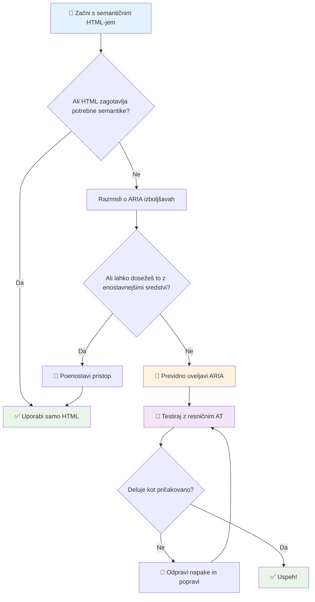
1. **Prednost naj ima semantični HTML**: Vedno raje uporabite `<button>` kot `<div role="button">`
2. **Ne kršite semantike**: Nikoli ne prekoračite obstoječega pomena HTML (izogibajte se `<h1 role="button">`)
3. **Ohranjajte dostopnost na tipkovnici**: Vsi interaktivni elementi z ARIA morajo biti popolnoma dostopni z tipkovnico
4. **Testirajte z resničnimi uporabniki**: Podpora ARIA se močno razlikuje med pomožnimi tehnologijami
5. **Začnite enostavno**: Kompleksne ARIA implementacije imajo več možnosti napak

**🔍 Postopek testiranja:**

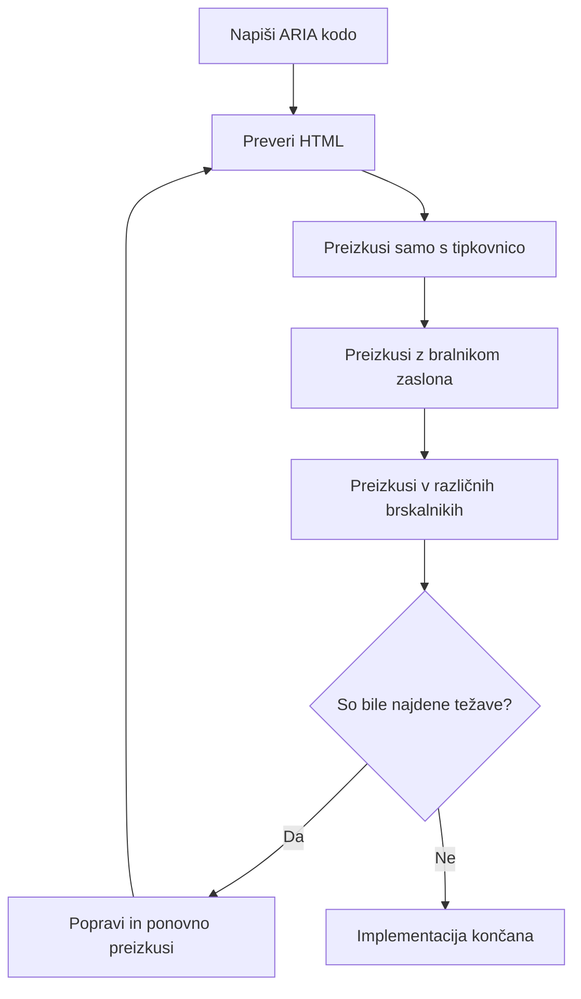
**🚫 Pogoste napake pri ARIA, ki se jim je treba izogniti:**

- **Konfliktne informacije**: Ne nasprotujte semantiki HTML
- **Preveliko označevanje**: Preveč ARIA informacij uporabnike zmede
- **Statična ARIA**: Pozabljanje posodobitve ARIA stanj ob spremembah vsebine
- **Netestirane implementacije**: ARIA, ki v teoriji deluje, v praksi ne
- **Pomanjkanje podpore za tipkovnico**: ARIA vloge brez ustreznih interakcij na tipkovnici

> 💡 **Viri za testiranje**: Uporabite orodja, kot je [accessibility-checker](https://www.npmjs.com/package/accessibility-checker) za avtomatizirano preverjanje ARIA, vendar vedno preizkušajte z resničnimi bralniki zaslona za popolno izkušnjo.

### 🎭 **Preverjanje ARIA veščin: Ste pripravljeni na kompleksne interakcije?**

**Ocenite svojo samozavest pri ARIA:**
- Kdaj bi izbrali ARIA pred semantičnim HTML? (Namig: skoraj nikoli!)
- Ali lahko pojasnite, zakaj je `<div role="button">` običajno slabše kot `<button>`?
- Kaj je najpomembnejša stvar, ki jo je treba zapomniti pri testiranju ARIA?

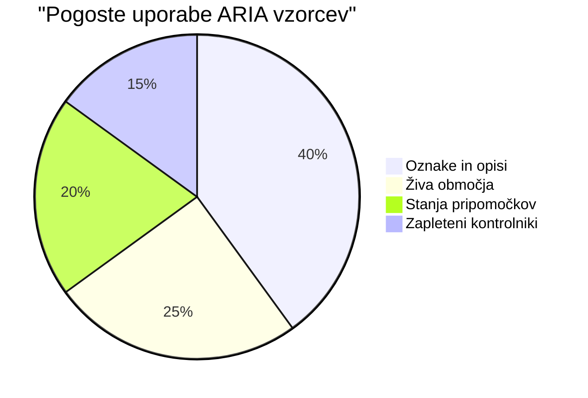
> **Ključna ugotovitev**: Večina uporabe ARIA je za označevanje in opisovanje elementov. Kompleksni vzorci vtičnikov so veliko manj pogosti, kot si morda mislite!

✅ **Učite se od strokovnjakov**: Preučite [ARIA Authoring Practices Guide](https://w3c.github.io/aria-practices/) za preizkušene vzorce in implementacije kompleksnih interaktivnih vtičnikov.

## Dostopnost slik in medijev

Vizualne in avdio vsebine so bistveni deli sodobnih spletnih izkušenj, vendar lahko povzročijo ovire, če niso premislečeno implementirane. Cilj je zagotoviti, da informacije in čustveni vpliv vaših medijev dosežejo vsakega uporabnika. Ko se navadite, to postane druga narava.

Različne vrste medijev potrebujejo različne pristope k dostopnosti. To je kot kuhanje — nežno ribo ne bi obravnavali enako kot bogat zrezek. Razumevanje teh razlik vam pomaga izbrati pravo rešitev za vsako situacijo.

### Strateška dostopnost slik

Vsaka slika na vaši spletni strani služi namenu. Razumevanje tega namena vam pomaga napisati boljši alternativen tekst in ustvariti bolj vključujoče izkušnje.

**Štiri vrste slik in njihove strategije alt besedila:**

**Informativne slike** - posredujejo pomembne informacije:
```html

```

**Dekorativne slike** - samo vizualne, brez informativne vrednosti:
```html

```

**Funkcionalne slike** - služijo kot gumbi ali kontrolniki:
```html
<button>
  
</button>
```

**Kompleksne slike** - grafikoni, diagrami, infografike:
```html

<div id="chart-description">
  <p>Detailed description: Sales data shows a steady increase across all quarters...</p>
</div>
```

### Dostopnost videoposnetkov in avdia

**Zahteve za video:**
- **Podnapisi**: Besedilna različica govorne vsebine in zvočnih učinkov
- **Avdio opisi**: Pripoved vizualnih elementov za slepe uporabnike
- **Prepis**: Polna besedilna različica vse avdio in vizualne vsebine

```html
<video controls>
  <source src="video.mp4" type="video/mp4">
  <track kind="captions" src="captions.vtt" srclang="en" label="English">
  <track kind="descriptions" src="descriptions.vtt" srclang="en" label="Audio descriptions">
</video>
```

**Zahteve za avdio:**
- **Prepis**: Besedilna različica vse govorne vsebine
- **Vizualni indikatorji**: Za avdio vsebino samo z zvokom zagotovite vizualne namige

### Sodobne slikovne tehnike

**Uporaba CSS za dekorativne slike:**
```css
.hero-section {
  background-image: url('decorative-hero.jpg');
  /* Decorative images in CSS don't need alt text */
}
```

**Prilagodljive slike z dostopnostjo:**
```html
<picture>
  <source media="(min-width: 800px)" srcset="large-chart.png">
  <source media="(min-width: 400px)" srcset="medium-chart.png">
  
</picture>
```

✅ **Preizkusite dostopnost slik**: Uporabite bralnik zaslona za navigacijo po strani s slikami. Ali dobite dovolj informacij za razumevanje vsebine?

## Tipkovniška navigacija in upravljanje fokusa

Veliko uporabnikov brska po spletu izključno s tipkovnico. To vključuje ljudi z motoričnimi omejitvami, izkušene uporabnike, ki tipkovnice uporabljajo hitreje kot miške, in vsakogar, katerega miška ne deluje. Zagotavljanje dobrega delovanja vaše strani s tipkovniškim vnosom je ključnega pomena in pogosto naredi splet bolj učinkovit za vse.

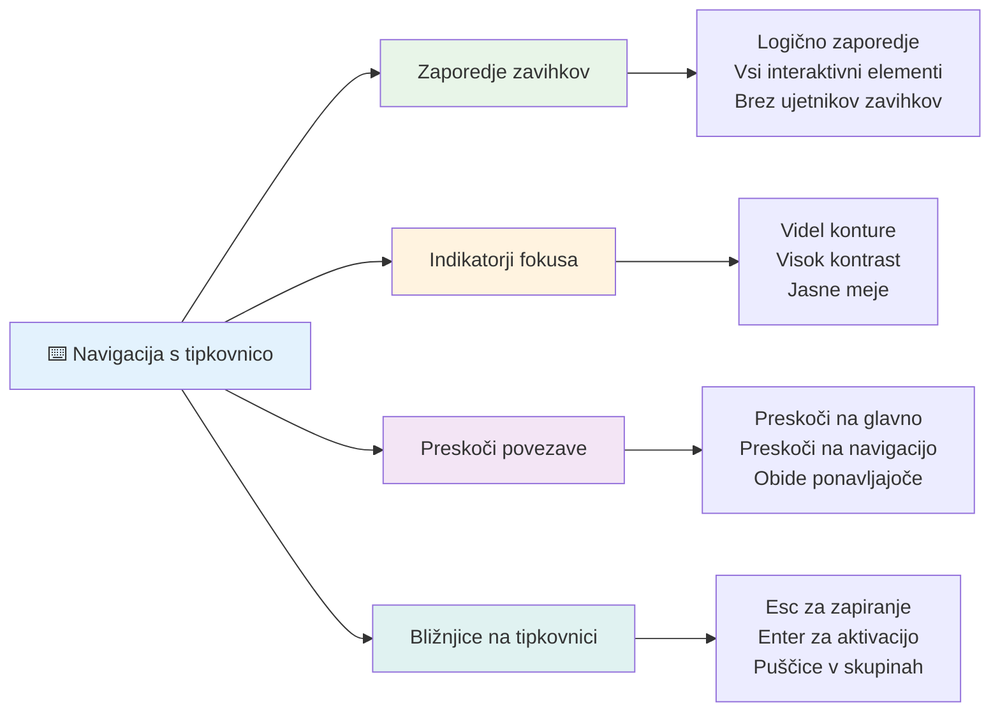
### Ključni vzorci tipkovniške navigacije

**Standardne interakcije s tipkovnico:**
- **Tab**: Premik fokusa naprej med interaktivnimi elementi
- **Shift + Tab**: Premik fokusa nazaj
- **Enter**: Aktivacija gumbov in povezav
- **Space**: Aktivacija gumbov, označevanje potrditvenih polj
- **Puščice**: Navigacija znotraj skupin komponent (radio gumbi, meniji)
- **Escape**: Zapiranje modalov, spustnih seznamov ali preklic operacij

### Najboljše prakse upravljanja fokusa

**Vidni indikatorji fokusa:**
```css
/* Ensure focus is always visible */
button:focus-visible {
  outline: 2px solid #4A90A4;
  outline-offset: 2px;
}

/* Custom focus styles for different components */
.card:focus-within {
  box-shadow: 0 0 0 3px rgba(74, 144, 164, 0.5);
}
```

**Preskakovalne povezave za učinkovito navigacijo:**
```html
<a href="#main-content" class="skip-link">Skip to main content</a>
<a href="#navigation" class="skip-link">Skip to navigation</a>

<nav id="navigation">
  <!-- navigation content -->
</nav>
<main id="main-content">
  <!-- main content -->
</main>
```

**Pravilen red tabulacije:**
```html
<!-- Use semantic HTML for natural tab order -->
<form>
  <label for="name">Name:</label>
  <input type="text" id="name" tabindex="0">
  
  <label for="email">Email:</label>
  <input type="email" id="email" tabindex="0">
  
  <button type="submit" tabindex="0">Submit</button>
</form>
```

### Zajem fokusa v modalih

Ob odpiranju modalnih dialogov je fokus treba omejiti znotraj modala:

```javascript
// Sodobna implementacija fokusne pasti
function trapFocus(element) {
  const focusableElements = element.querySelectorAll(
    'button, [href], input, select, textarea, [tabindex]:not([tabindex="-1"])'
  );
  
  const firstElement = focusableElements[0];
  const lastElement = focusableElements[focusableElements.length - 1];

  element.addEventListener('keydown', (e) => {
    if (e.key === 'Tab') {
      if (e.shiftKey && document.activeElement === firstElement) {
        e.preventDefault();
        lastElement.focus();
      } else if (!e.shiftKey && document.activeElement === lastElement) {
        e.preventDefault();
        firstElement.focus();
      }
    }
    
    if (e.key === 'Escape') {
      closeModal();
    }
  });
  
  // Osredotoči prvo element, ko se odpre modal
  firstElement.focus();
}
```

✅ **Preizkusite tipkovniško navigacijo**: Poskusite brskati po spletni strani samo s tipko Tab. Ali dosežete vse interaktivne elemente? Ali je vrstni red fokusa logičen? Ali so indikatorji fokusa jasno vidni?

## Dostopnost obrazcev

Obrazci so ključni za interakcijo uporabnika in zahtevajo posebno pozornost glede dostopnosti.

### Povezava oznak in kontrol obrazca

**Vsak kontrolni element obrazca potrebuje oznako:**
```html
<!-- Explicit labeling (preferred) -->
<label for="username">Username:</label>
<input type="text" id="username" name="username" required>

<!-- Implicit labeling -->
<label>
  Password:
  <input type="password" name="password" required>
</label>

<!-- Using aria-label when visual label isn't desired -->
<input type="search" aria-label="Search products" placeholder="Search...">
```

### Ravnanje z napakami in validacija

**Dostopna sporočila o napakah:**
```html
<label for="email">Email Address:</label>
<input type="email" id="email" name="email" 
       aria-describedby="email-error" 
       aria-invalid="true" required>
<div id="email-error" role="alert">
  Please enter a valid email address
</div>
```

**Najboljše prakse validacije obrazcev:**
- Uporabite `aria-invalid` za označitev neveljavnih polj
- Zagotovite jasna, specifična sporočila o napakah
- Uporabite `role="alert"` za pomembna sporočila o napakah
- Prikazujte napake takoj in ob oddaji obrazca

### Polja in združevanje

**Združite sorodne kontrolnike obrazca:**
```html
<fieldset>
  <legend>Shipping Address</legend>
  <label for="street">Street Address:</label>
  <input type="text" id="street" name="street">
  
  <label for="city">City:</label>
  <input type="text" id="city" name="city">
</fieldset>

<fieldset>
  <legend>Preferred Contact Method</legend>
  <input type="radio" id="contact-email" name="contact" value="email">
  <label for="contact-email">Email</label>
  
  <input type="radio" id="contact-phone" name="contact" value="phone">
  <label for="contact-phone">Phone</label>
</fieldset>
```

## Vaša pot do dostopnosti: Ključni poudarki

Čestitke! Pravkar ste pridobili temeljno znanje za ustvarjanje resnično vključujočih spletnih izkušenj. To je zelo navdušujoče! Spletna dostopnost ni le preverjanje skladnosti — gre za prepoznavanje različnih načinov, kako ljudje interagirajo z digitalno vsebino, in načrtovanje za to osupljivo kompleksnost.

Sedaj ste del rastoče skupnosti razvijalcev, ki razumejo, da odličen dizajn deluje za vsakogar. Dobrodošli v klubu!

**🎯 Vaš komplet orodij za dostopnost zdaj vključuje:**

| Osnovno načelo             | Implementacija                                   | Vpliv                                                |
|---------------------------|-------------------------------------------------|-----------------------------------------------------|
| **Temelj semantičnega HTML**   | Uporaba pravih HTML elementov za njihov namen     | Bralniki zaslona lahko učinkovito navigirajo, tipkovnice delujejo samodejno |
| **Vključen vizualni dizajn**   | Zadosten kontrast, smiselna uporaba barv, vidni indikatorji fokusa | Jasno za vsakogar v kateri koli svetlobni razmerah |
| **Opisna vsebina**             | Smiselno besedilo povezav, alt besedilo, naslovi  | Uporabniki razumejo vsebino brez vizualnega konteksta |
| **Dostopnost z tipkovnico**    | Red tabulacije, bližnjice na tipkovnici, upravljanje fokusa | Dostopnost za osebe z motoričnimi omejitvami in učinkovita uporaba za izkušene uporabnike |
| **Izboljšanje z ARIA**         | Strateška uporaba za zapolnitev semantičnih vrzeli | Kompleksne aplikacije delujejo s pomožnimi tehnologijami |
| **Obsežno testiranje**         | Avtomatizirana orodja + ročna preverjanja + testiranje z resničnimi uporabniki | Zaznavanje težav pred njihovo uporabo pri uporabnikih |

**🚀 Vaši naslednji koraki:**

1. **Vgradite dostopnost v svoj razvojni proces**: Testiranje naredite za naravni del razvoja
2. **Učite se od resničnih uporabnikov**: Poiščite povratne informacije uporabnikov pomožnih tehnologij
3. **Ostanite na tekočem**: Tehnike dostopnosti se razvijajo z novimi tehnologijami in standardi
4. **Zagovarjajte vključevanje**: Delite svoje znanje in naredite dostopnost ekipo prednostno nalogo

> 💡 **Zapomnite si**: Omejitve dostopnosti pogosto vodijo do inovativnih, elegantnih rešitev, ki koristijo vsem. Rampe za invalide, podnapisi in glasovni nadzor so začeli kot dostopnostni dodatki in postali običajne izboljšave.

**Poslovni razlog je kristalno jasen**: Dostopne spletne strani dosežejo več uporabnikov, se bolje uvrščajo v iskalnikih, imajo nižje stroške vzdrževanja in zmanjšujejo pravne tveganja. A iskreno? Pravi razlog za skrb za dostopnost je veliko globlji. Dostopne spletne strani utelešajo najboljše vrednote spleta — odprtost, vključevanje in zamisel, da si vsakdo zasluži enak dostop do informacij.

Sedaj ste opremljeni za gradnjo vključujočega spleta prihodnosti. Vsaka dostopna stran, ki jo ustvarite, naredi internet bolj prijazen kraj za vse. Res neverjetno, če pomislite!

## Dodatni viri

Nadaljujte svojo pot učenja o dostopnosti s temi ključnimi viri:

**📚 Uradni standardi in smernice:**
- [WCAG 2.1 smernice](https://www.w3.org/WAI/WCAG21/quickref/) - Uradni standard za dostopnost s hitrim pregledom
- [ARIA Authoring Practices Guide](https://w3c.github.io/aria-practices/) - Celostni vzorci za interaktivne vtičnike
- [WebAIM smernice](https://webaim.org/) - Praktične, primerne za začetnike smernice za dostopnost

**🛠️ Orodja in viri za testiranje:**
- [axe DevTools](https://www.deque.com/axe/devtools/) - Industrijski standard za testiranje dostopnosti
- [A11y Project Checklist](https://www.a11yproject.com/checklist/) - Preverjanje dostopnosti korak za korakom
- [Accessibility Insights](https://accessibilityinsights.io/) - Microsoftov celosten testni paket
- [Color Oracle](https://colororacle.org/) - Simulator barvne slepote za testiranje oblikovanja

**🎓 Učenje in skupnost:**
- [WebAIM Screen Reader Survey](https://webaim.org/projects/screenreadersurvey9/) - Resnične preference in vedenja uporabnikov
- [Inclusive Components](https://inclusive-components.design/) - Sodobni vzorci dostopnih komponent
- [A11y Coffee](https://a11y.coffee/) - Hitri nasveti in vpogledi o dostopnosti
- [Web Accessibility Initiative (WAI)](https://www.w3.org/WAI/) - W3C-jevi celostni viri o dostopnosti

**🎥 Praktično učenje:**
- [Accessibility Developer Guide](https://www.accessibility-developer-guide.com/) - Praktične smernice za implementacijo
- [Deque University](https://dequeuniversity.com/) - Profesionalni tečaji o dostopnosti

## Izziv GitHub Copilot Agent 🚀

Uporabite način Agent za dokončanje naslednjega izziva:

**Opis:** Ustvarite dostopen modalni dialog, ki prikazuje pravilno upravljanje fokusa, ARIA atribute in vzorce tipkovniške navigacije.

**Navodilo:** Zgradite popoln modalni dialog z HTML, CSS in JavaScript, ki vključuje: pravilno zajem fokusa, tipka ESC za zapiranje, klik zunaj za zapiranje, ARIA atribute za bralnike zaslona in vidne indikatorje fokusa. Modal naj vsebuje obrazec s pravimi oznakami ter obravnavo napak. Zagotovite skladnost s standardi WCAG 2.1 AA.

## 🚀 Izziv

Vzemite ta HTML in ga prepišite tako, da bo čim bolj dostopen glede na naučene strategije.

```html
<!DOCTYPE html>
<html lang="en">
  <head>
    <meta charset="UTF-8">
    <meta name="viewport" content="width=device-width, initial-scale=1.0">
    <title>Turtle Ipsum - The World's Premier Turtle Fan Club</title>
    <link href='../assets/style.css' rel='stylesheet' type='text/css'>
  </head>
  <body>
    <header class="site-header">
      <h1 class="site-title">Turtle Ipsum</h1>
      <p class="site-subtitle">The World's Premier Turtle Fan Club</p>
    </header>
    
    <nav class="main-nav" aria-label="Main navigation">
      <h2 class="nav-header">Resources</h2>
      <ul class="nav-list">
        <li><a href="https://www.youtube.com/watch?v=CMNry4PE93Y">"I like turtles" video</a></li>
        <li><a href="https://en.wikipedia.org/wiki/Turtle">Basic turtle information</a></li>
        <li><a href="https://en.wikipedia.org/wiki/Turtles_(chocolate)">Chocolate turtles candy</a></li>
      </ul>
    </nav>
    
    <main class="main-content">
      <article>
        <h1>Welcome to Turtle Ipsum</h1>
        <p class="intro">
          <a href="/about">Learn more about our turtle community</a> and discover fascinating facts about these amazing creatures.
        </p>
        <p class="article-text">
          Turtle ipsum dolor sit amet, consectetur adipiscing elit, sed do eiusmod tempor incididunt ut labore et dolore magna aliqua. Ut enim ad minim veniam, quis nostrud exercitation ullamco laboris nisi ut aliquip ex ea commodo consequat. Duis aute irure dolor in reprehenderit in voluptate velit esse cillum dolore eu fugiat nulla pariatur. Excepteur sint occaecat cupidatat non proident, sunt in culpa qui officia deserunt mollit anim id est laborum.
        </p>
      </article>
    </main>
    
    <footer class="footer">
      <section class="newsletter-signup">
        <h2>Stay Updated</h2>
        <button type="button" onclick="showNewsletterForm()">Sign up for turtle news</button>
      </section>
      
      <nav class="footer-nav" aria-label="Footer navigation">
        <h2>Site Pages</h2>
        <ul>
          <li><a href="../">Home</a></li>
          <li><a href="../semantic">Semantic HTML example</a></li>
        </ul>
      </nav>
      
      <p class="footer-copyright">&copy; 2024 Instrument. All rights reserved.</p>
    </footer>
  </body>
</html>
```

**Ključne izboljšave:**
- Dodana pravilna semantična HTML struktura
- Popravljena hierarhija naslovov (en sam h1, logičen potek)
- Dodano smiselno besedilo povezav namesto "klikni tukaj"
- Vključene pravilne ARIA oznake za navigacijo
- Dodan atribut lang in ustrezne meta oznake
- Uporabljen element button za interaktivne elemente
- Natančno strukturirana vsebina noge s pravimi značilnimi odseki

## Kvizek po predavanju
[Kvizek po predavanju](https://ff-quizzes.netlify.app/web/en/)

## Pregled in samostojno učenje

Mnogo vlad ima zakone o zahtevah za dostopnost. Preberite si zakone o dostopnosti v vaši domači državi. Kaj je zajeto in kaj ne? Primer je [ta vladna spletna stran](https://accessibility.blog.gov.uk/).

## Naloga

[Analizirajte nedostopno spletno stran](assignment.md)

Zasluge: [Turtle Ipsum](https://github.com/Instrument/semantic-html-sample) avtor Instrument

---

## 🚀 Vaš časovni načrt za mojstrstvo v dostopnosti

### ⚡ **Kaj lahko storite v naslednjih 5 minutah**
- [ ] Namestite razširitev axe DevTools v vaš brskalnik
- [ ] Zaženite Lighthouse dostopnostni pregled na vaši najljubši spletni strani
- [ ] Poskusite navigirati katerokoli spletno stran samo s tipko Tab
- [ ] Preizkusite vgrajen bralnik zaslona v vašem brskalniku (Narrator/VoiceOver)

### 🎯 **Kaj lahko dosežete v naslednji uri**
- [ ] Dokončajte kviz po lekciji in razmislite o spoznanjih o dostopnosti
- [ ] Vadite pisanje smiselnog alt besedila za 10 različnih slik
- [ ] Preglejte strukturo naslovov spletne strani z razširitvijo HeadingsMap
- [ ] Popravite težave z dostopnostjo najdene v izzivu HTML
- [ ] Preverite barvni kontrast v vašem trenutnem projektu z orodjem WebAIM

### 📅 **Vaša tedenska pot do dostopnosti**
- [ ] Dokončajte nalogo analize nedostopne spletne strani
- [ ] Nastavite razvojno okolje z orodji za testiranje dostopnosti
- [ ] Vadite navigacijo s tipkovnico na 5 različnih zahtevanih spletnih mestih
- [ ] Ustvarite preprost obrazec z ustreznimi oznakami, obravnavo napak in ARIA
- [ ] Pridružite se skupnosti za dostopnost (A11y Slack, forum WebAIM)
- [ ] Oglejte si resnične uporabnike z invalidnostmi, ki navigirajo po spletnih mestih (YouTube ima odlične primere)

### 🌟 **Vaša mesečna preobrazba**
- [ ] Vključite testiranje dostopnosti v svoj razvojni potek
- [ ] Prispevajte k odprtokodnemu projektu z odpravo težav z dostopnostjo
- [ ] Izvedite testiranje uporabnosti z nekom, ki uporablja pomožno tehnologijo
- [ ] Ustvarite knjižnico dostopnih komponent za svojo ekipo
- [ ] Zastopajte dostopnost na delovnem mestu ali v skupnosti
- [ ] Mentorirajte nekoga novega pri konceptih dostopnosti

### 🏆 **Zaključno preverjanje prvaka dostopnosti**

**Praznujte svojo pot do dostopnosti:**
- Kaj je najbolj presenetljivo, kar ste se naučili o tem, kako ljudje uporabljajo splet?
- Kateri princip dostopnosti vam najbolj ustreza v vašem razvojnem slogu?
- Kako vam je učenje o dostopnosti spremenilo pogled na oblikovanje?
- Katero prvo izboljšavo dostopnosti želite uresničiti na resničnem projektu?

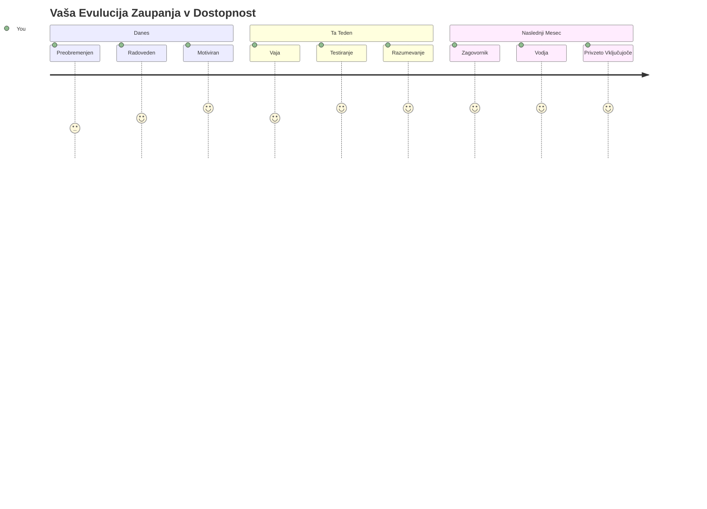
> 🌍 **Zdaj ste prvak dostopnosti!** Razumete, da odlične spletne izkušnje delujejo za vsakogar, ne glede na to, kako dostopajo do spleta. Vsaka dostopna funkcija, ki jo ustvarite, naredi internet bolj vključujoč. Splet potrebuje razvijalce, kot ste vi, ki dostopnosti ne vidijo kot omejitev, ampak kot priložnost za ustvarjanje boljših izkušenj za vse uporabnike. Dobrodošli v gibanje! 🎉

---

<!-- CO-OP TRANSLATOR DISCLAIMER START -->
**Omejitev odgovornosti**:
Ta dokument je bil preveden z uporabo storitve za avtomatski prevod [Co-op Translator](https://github.com/Azure/co-op-translator). Čeprav si prizadevamo za natančnost, upoštevajte, da lahko avtomatizirani prevodi vsebujejo napake ali netočnosti. Izvirni dokument v njegovem maternem jeziku velja za zavezni vir. Za ključne informacije priporočamo strokovni človeški prevod. Za morebitna nesporazume ali napačne interpretacije, ki izhajajo iz uporabe tega prevoda, ne odgovarjamo.
<!-- CO-OP TRANSLATOR DISCLAIMER END -->