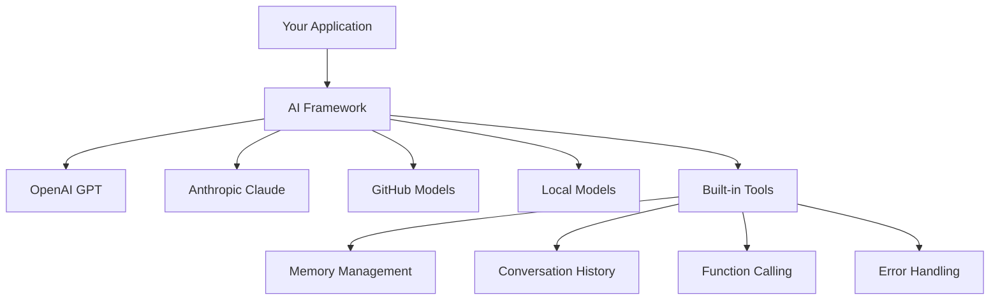
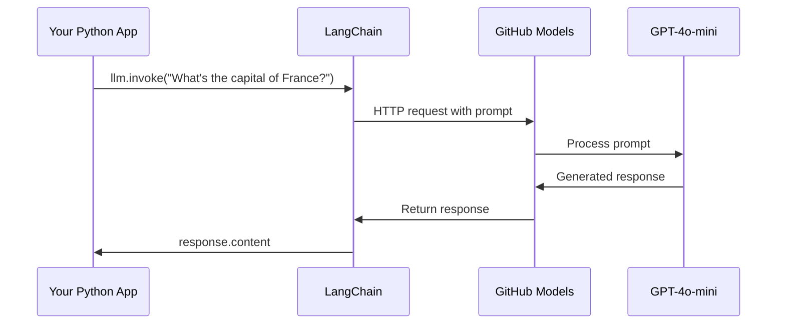
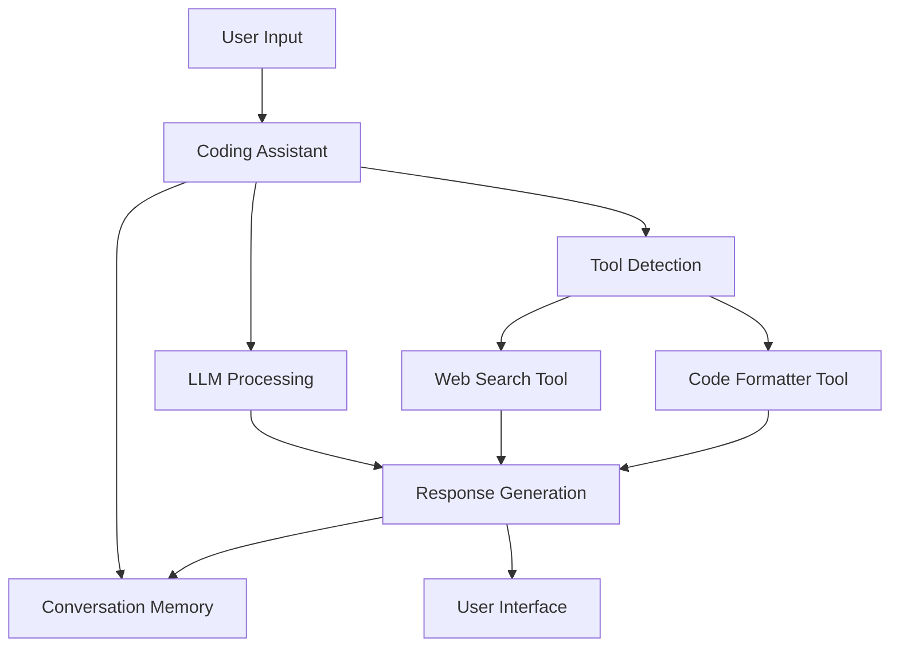
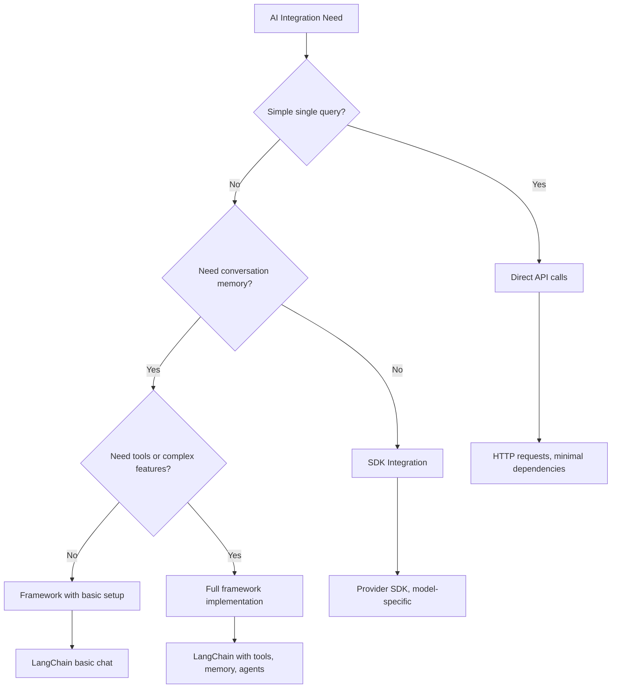

<!--
CO_OP_TRANSLATOR_METADATA:
{
  "original_hash": "e2c4ae5688e34b4b8b09d52aec56c79e",
  "translation_date": "2025-10-25T00:27:30+00:00",
  "source_file": "10-ai-framework-project/README.md",
  "language_code": "sl"
}
-->
# Okvir za umetno inteligenco

Ste se kdaj počutili preobremenjeni, ko ste poskušali zgraditi aplikacije z umetno inteligenco od začetka? Niste edini! Okviri za umetno inteligenco so kot švicarski nož za razvoj AI - močna orodja, ki vam lahko prihranijo čas in glavobole pri gradnji inteligentnih aplikacij. Pomislite na AI okvir kot na dobro organizirano knjižnico: ponuja vnaprej pripravljene komponente, standardizirane API-je in pametne abstrakcije, da se lahko osredotočite na reševanje težav namesto na podrobnosti implementacije.

V tej lekciji bomo raziskali, kako lahko okviri, kot je LangChain, spremenijo nekoč zapletene naloge integracije AI v čisto, berljivo kodo. Odkrijte, kako se spopasti z izzivi iz resničnega sveta, kot so sledenje pogovorom, izvajanje klicev orodij in upravljanje različnih modelov AI prek enotnega vmesnika.

Ko bomo končali, boste vedeli, kdaj uporabiti okvire namesto surovih API klicev, kako učinkovito uporabljati njihove abstrakcije in kako zgraditi AI aplikacije, ki so pripravljene za uporabo v resničnem svetu. Raziskujmo, kaj lahko AI okviri naredijo za vaše projekte.

## Zakaj izbrati okvir?

Torej, pripravljeni ste zgraditi AI aplikacijo - super! Ampak tukaj je stvar: imate več različnih poti, po katerih lahko greste, in vsaka ima svoje prednosti in slabosti. To je nekako tako, kot da bi izbirali med hojo, kolesarjenjem ali vožnjo, da pridete nekam - vse vas bodo pripeljale tja, vendar bo izkušnja (in trud) popolnoma drugačna.

Razčlenimo tri glavne načine, kako lahko vključite AI v svoje projekte:

| Pristop | Prednosti | Najbolj primerno za | Premisleki |
|---------|-----------|---------------------|------------|
| **Neposredni HTTP zahtevki** | Popoln nadzor, brez odvisnosti | Enostavna vprašanja, učenje osnov | Bolj obsežna koda, ročno obravnavanje napak |
| **Integracija SDK** | Manj osnovne kode, optimizacija za specifične modele | Aplikacije z enim modelom | Omejeno na specifične ponudnike |
| **AI okviri** | Enoten API, vgrajene abstrakcije | Aplikacije z več modeli, kompleksni delovni tokovi | Krivulja učenja, možna pretirana abstrakcija |

### Prednosti okvirov v praksi



**Zakaj so okviri pomembni:**
- **Združujejo** več AI ponudnikov pod enoten vmesnik
- **Samodejno upravljajo** spomin pogovorov
- **Ponujajo** vnaprej pripravljena orodja za običajne naloge, kot so vdelave in klicanje funkcij
- **Upravljajo** obravnavanje napak in logiko ponovnih poskusov
- **Pretvarjajo** kompleksne delovne tokove v berljive metode

> 💡 **Nasvet**: Uporabite okvire, ko preklapljate med različnimi AI modeli ali gradite kompleksne funkcije, kot so agenti, spomin ali klicanje orodij. Držite se neposrednih API-jev, ko se učite osnov ali gradite preproste, osredotočene aplikacije.

**Zaključek**: Tako kot izbira med specializiranimi orodji obrtnika in celotno delavnico gre za ujemanje orodja z nalogo. Okviri so odlični za kompleksne, bogate z značilnostmi aplikacije, medtem ko neposredni API-ji dobro delujejo za enostavne primere uporabe.

## Uvod

V tej lekciji se bomo naučili:

- Uporabiti skupni AI okvir.
- Reševati običajne težave, kot so pogovori, uporaba orodij, spomin in kontekst.
- To izkoristiti za gradnjo AI aplikacij.

## Vaš prvi AI poziv

Začnimo z osnovami tako, da ustvarimo vašo prvo AI aplikacijo, ki pošlje vprašanje in prejme odgovor. Tako kot je Arhimed odkril princip izpodrivanja v svoji kopeli, včasih najpreprostejša opažanja vodijo do najmočnejših spoznanj - in okviri omogočajo dostop do teh spoznanj.

### Nastavitev LangChain z modeli GitHub

Uporabili bomo LangChain za povezavo z modeli GitHub, kar je precej super, saj vam omogoča brezplačen dostop do različnih AI modelov. Najboljši del? Za začetek potrebujete le nekaj preprostih konfiguracijskih parametrov:

```python
from langchain_openai import ChatOpenAI
import os

llm = ChatOpenAI(
    api_key=os.environ["GITHUB_TOKEN"],
    base_url="https://models.github.ai/inference",
    model="openai/gpt-4o-mini",
)

# Send a simple prompt
response = llm.invoke("What's the capital of France?")
print(response.content)
```

**Razčlenimo, kaj se tukaj dogaja:**
- **Ustvari** LangChain odjemalca z uporabo razreda `ChatOpenAI` - to je vaš prehod do AI!
- **Konfigurira** povezavo z modeli GitHub z vašim avtentikacijskim žetonom
- **Določi**, kateri AI model uporabiti (`gpt-4o-mini`) - pomislite na to kot na izbiro vašega AI asistenta
- **Pošlje** vaše vprašanje z metodo `invoke()` - tukaj se zgodi čarovnija
- **Izvleče** in prikaže odgovor - in voilà, klepetate z AI!

> 🔧 **Opomba o nastavitvi**: Če uporabljate GitHub Codespaces, imate srečo - `GITHUB_TOKEN` je že nastavljen za vas! Delate lokalno? Brez skrbi, samo ustvariti morate osebni dostopni žeton z ustreznimi dovoljenji.

**Pričakovani izhod:**
```text
The capital of France is Paris.
```



## Gradnja pogovornega AI

Prvi primer prikazuje osnove, vendar je to le en sam izmenjava - postavite vprašanje, dobite odgovor in to je to. V resničnih aplikacijah želite, da si vaš AI zapomni, o čem ste razpravljali, tako kot sta Watson in Holmes gradila svoje raziskovalne pogovore skozi čas.

Tu postane LangChain še posebej uporaben. Ponuja različne vrste sporočil, ki pomagajo strukturirati pogovore in omogočajo, da vaš AI dobi osebnost. Gradili boste izkušnje klepeta, ki ohranjajo kontekst in značaj.

### Razumevanje vrst sporočil

Pomislite na te vrste sporočil kot na različne "klobuke", ki jih udeleženci nosijo v pogovoru. LangChain uporablja različne razrede sporočil za sledenje, kdo kaj govori:

| Vrsta sporočila | Namen | Primer uporabe |
|-----------------|-------|----------------|
| `SystemMessage` | Določa osebnost in vedenje AI | "Vi ste koristen asistent za kodiranje" |
| `HumanMessage` | Predstavlja uporabniški vnos | "Razloži, kako delujejo funkcije" |
| `AIMessage` | Shrani odgovore AI | Prejšnji odgovori AI v pogovoru |

### Ustvarjanje vašega prvega pogovora

Ustvarimo pogovor, kjer naš AI prevzame določeno vlogo. Naj bo to kapitan Picard - lik, znan po svoji diplomatski modrosti in vodstvenih sposobnostih:

```python
messages = [
    SystemMessage(content="You are Captain Picard of the Starship Enterprise"),
    HumanMessage(content="Tell me about you"),
]
```

**Razčlenitev nastavitve pogovora:**
- **Vzpostavi** vlogo in osebnost AI prek `SystemMessage`
- **Ponuja** začetno uporabniško vprašanje prek `HumanMessage`
- **Ustvari** osnovo za večkratni pogovor

Celotna koda za ta primer izgleda takole:

```python
from langchain_core.messages import HumanMessage, SystemMessage
from langchain_openai import ChatOpenAI
import os

llm = ChatOpenAI(
    api_key=os.environ["GITHUB_TOKEN"],
    base_url="https://models.github.ai/inference",
    model="openai/gpt-4o-mini",
)

messages = [
    SystemMessage(content="You are Captain Picard of the Starship Enterprise"),
    HumanMessage(content="Tell me about you"),
]


# works
response  = llm.invoke(messages)
print(response.content)
```

Videti bi morali rezultat, podoben:

```text
I am Captain Jean-Luc Picard, the commanding officer of the USS Enterprise (NCC-1701-D), a starship in the United Federation of Planets. My primary mission is to explore new worlds, seek out new life and new civilizations, and boldly go where no one has gone before. 

I believe in the importance of diplomacy, reason, and the pursuit of knowledge. My crew is diverse and skilled, and we often face challenges that test our resolve, ethics, and ingenuity. Throughout my career, I have encountered numerous species, grappled with complex moral dilemmas, and have consistently sought peaceful solutions to conflicts.

I hold the ideals of the Federation close to my heart, believing in the importance of cooperation, understanding, and respect for all sentient beings. My experiences have shaped my leadership style, and I strive to be a thoughtful and just captain. How may I assist you further?
```

Da ohranite kontinuiteto pogovora (namesto da bi vsakič ponastavili kontekst), morate odgovore dodajati na seznam sporočil. Tako kot ustne tradicije, ki so ohranjale zgodbe skozi generacije, ta pristop gradi trajen spomin:

```python
from langchain_core.messages import HumanMessage, SystemMessage
from langchain_openai import ChatOpenAI
import os

llm = ChatOpenAI(
    api_key=os.environ["GITHUB_TOKEN"],
    base_url="https://models.github.ai/inference",
    model="openai/gpt-4o-mini",
)

messages = [
    SystemMessage(content="You are Captain Picard of the Starship Enterprise"),
    HumanMessage(content="Tell me about you"),
]


# works
response  = llm.invoke(messages)

print(response.content)

print("---- Next ----")

messages.append(response)
messages.append(HumanMessage(content="Now that I know about you, I'm Chris, can I be in your crew?"))

response  = llm.invoke(messages)

print(response.content)

```

Kar kul, kajne? Tukaj se dogaja to, da dvakrat kličemo LLM - najprej samo z našima začetnima dvema sporočiloma, nato pa še enkrat s celotno zgodovino pogovora. To je, kot da AI dejansko sledi našemu klepetu!

Ko zaženete to kodo, boste dobili drugi odgovor, ki zveni nekako takole:

```text
Welcome aboard, Chris! It's always a pleasure to meet those who share a passion for exploration and discovery. While I cannot formally offer you a position on the Enterprise right now, I encourage you to pursue your aspirations. We are always in need of talented individuals with diverse skills and backgrounds. 

If you are interested in space exploration, consider education and training in the sciences, engineering, or diplomacy. The values of curiosity, resilience, and teamwork are crucial in Starfleet. Should you ever find yourself on a starship, remember to uphold the principles of the Federation: peace, understanding, and respect for all beings. Your journey can lead you to remarkable adventures, whether in the stars or on the ground. Engage!
```

To bom vzel kot morda ;)

## Pretakanje odgovorov

Ste že opazili, kako se zdi, da ChatGPT "tipka" svoje odgovore v realnem času? To je pretakanje v akciji. Tako kot opazovanje spretnosti kaligrafa pri delu - videti, kako se znaki pojavljajo potezo za potezo, namesto da se materializirajo takoj - pretakanje naredi interakcijo bolj naravno in zagotavlja takojšnje povratne informacije.

### Implementacija pretakanja z LangChain

```python
from langchain_openai import ChatOpenAI
import os

llm = ChatOpenAI(
    api_key=os.environ["GITHUB_TOKEN"],
    base_url="https://models.github.ai/inference",
    model="openai/gpt-4o-mini",
    streaming=True
)

# Stream the response
for chunk in llm.stream("Write a short story about a robot learning to code"):
    print(chunk.content, end="", flush=True)
```

**Zakaj je pretakanje super:**
- **Prikazuje** vsebino, medtem ko se ustvarja - konec nerodnega čakanja!
- **Uporabniki** imajo občutek, da se nekaj dejansko dogaja
- **Zdi se** hitreje, tudi če tehnično ni
- **Uporabniki** lahko začnejo brati, medtem ko AI še vedno "razmišlja"

> 💡 **Nasvet za uporabniško izkušnjo**: Pretakanje resnično blesti, ko gre za daljše odgovore, kot so razlage kode, ustvarjalno pisanje ali podrobni vodiči. Vaši uporabniki bodo navdušeni, ko bodo videli napredek, namesto da bi strmeli v prazen zaslon!

## Predloge za pozive

Predloge za pozive delujejo kot retorične strukture, uporabljene v klasični retoriki - pomislite, kako bi Ciceron prilagodil svoje vzorce govora za različne občinstva, hkrati pa ohranil enako prepričljivo strukturo. Omogočajo vam ustvarjanje večkrat uporabnih pozivov, kjer lahko zamenjate različne dele informacij, ne da bi morali vse napisati na novo. Ko nastavite predlogo, samo izpolnite spremenljivke z želenimi vrednostmi.

### Ustvarjanje večkrat uporabnih pozivov

```python
from langchain_core.prompts import ChatPromptTemplate

# Define a template for code explanations
template = ChatPromptTemplate.from_messages([
    ("system", "You are an expert programming instructor. Explain concepts clearly with examples."),
    ("human", "Explain {concept} in {language} with a practical example for {skill_level} developers")
])

# Use the template with different values
questions = [
    {"concept": "functions", "language": "JavaScript", "skill_level": "beginner"},
    {"concept": "classes", "language": "Python", "skill_level": "intermediate"},
    {"concept": "async/await", "language": "JavaScript", "skill_level": "advanced"}
]

for question in questions:
    prompt = template.format_messages(**question)
    response = llm.invoke(prompt)
    print(f"Topic: {question['concept']}\n{response.content}\n---\n")
```

**Zakaj boste vzljubili uporabo predlog:**
- **Ohranja** vaše pozive dosledne po celotni aplikaciji
- **Brez več** zmešnjave z združevanjem nizov - samo čiste, preproste spremenljivke
- **Vaš AI** se obnaša predvidljivo, ker struktura ostaja enaka
- **Posodobitve** so enostavne - spremenite predlogo enkrat in je popravljena povsod

## Strukturiran izhod

Ste se kdaj frustrirali, ko ste poskušali razčleniti AI odgovore, ki se vrnejo kot nestrukturirano besedilo? Strukturiran izhod je kot učenje vašega AI, da sledi sistematičnemu pristopu, ki ga je Linnaeus uporabil za biološko klasifikacijo - organizirano, predvidljivo in enostavno za delo. Lahko zahtevate JSON, specifične podatkovne strukture ali katero koli obliko, ki jo potrebujete.

### Določanje shem izhoda

```python
from langchain_core.prompts import ChatPromptTemplate
from langchain_core.output_parsers import JsonOutputParser
from pydantic import BaseModel, Field

class CodeReview(BaseModel):
    score: int = Field(description="Code quality score from 1-10")
    strengths: list[str] = Field(description="List of code strengths")
    improvements: list[str] = Field(description="List of suggested improvements")
    overall_feedback: str = Field(description="Summary feedback")

# Set up the parser
parser = JsonOutputParser(pydantic_object=CodeReview)

# Create prompt with format instructions
prompt = ChatPromptTemplate.from_messages([
    ("system", "You are a code reviewer. {format_instructions}"),
    ("human", "Review this code: {code}")
])

# Format the prompt with instructions
chain = prompt | llm | parser

# Get structured response
code_sample = """
def calculate_average(numbers):
    return sum(numbers) / len(numbers)
"""

result = chain.invoke({
    "code": code_sample,
    "format_instructions": parser.get_format_instructions()
})

print(f"Score: {result['score']}")
print(f"Strengths: {', '.join(result['strengths'])}")
```

**Zakaj je strukturiran izhod prelomnica:**
- **Ni več** ugibanja, v kakšni obliki boste dobili odgovor - vedno je dosleden
- **Neposredno se poveže** z vašimi bazami podatkov in API-ji brez dodatnega dela
- **Zajame** nenavadne AI odgovore, preden pokvarijo vašo aplikacijo
- **Naredi** vašo kodo čistejšo, ker točno veste, s čim delate

## Klicanje orodij

Zdaj pridemo do ene najmočnejših funkcij: orodja. Tako svojemu AI omogočite praktične sposobnosti, ki presegajo pogovor. Tako kot so srednjeveški cehi razvili specializirana orodja za določene obrti, lahko svoj AI opremite s fokusiranimi instrumenti. Opisujete, katera orodja so na voljo, in ko nekdo zahteva nekaj, kar ustreza, lahko vaš AI ukrepa.

### Uporaba Python-a

Dodajmo nekaj orodij, kot je prikazano:

```python
from typing_extensions import Annotated, TypedDict

class add(TypedDict):
    """Add two integers."""

    # Annotations must have the type and can optionally include a default value and description (in that order).
    a: Annotated[int, ..., "First integer"]
    b: Annotated[int, ..., "Second integer"]

tools = [add]

functions = {
    "add": lambda a, b: a + b
}
```

Kaj se tukaj dogaja? Ustvarjamo načrt za orodje, imenovano `add`. Z dedovanjem iz `TypedDict` in uporabo teh elegantnih tipov `Annotated` za `a` in `b` dajemo LLM jasno sliko o tem, kaj to orodje počne in kaj potrebuje. Slovar `functions` je kot naš orodjar - pove naši kodi, kaj točno storiti, ko se AI odloči uporabiti določeno orodje.

Poglejmo, kako naslednjič pokličemo LLM s tem orodjem:

```python
llm = ChatOpenAI(
    api_key=os.environ["GITHUB_TOKEN"],
    base_url="https://models.github.ai/inference",
    model="openai/gpt-4o-mini",
)

llm_with_tools = llm.bind_tools(tools)
```

Tukaj pokličemo `bind_tools` z našim nizom `tools`, s čimer LLM `llm_with_tools` zdaj pozna to orodje.

Za uporabo tega novega LLM lahko vnesemo naslednjo kodo:

```python
query = "What is 3 + 12?"

res = llm_with_tools.invoke(query)
if(res.tool_calls):
    for tool in res.tool_calls:
        print("TOOL CALL: ", functions[tool["name"]](../../../10-ai-framework-project/**tool["args"]))
print("CONTENT: ",res.content)
```

Zdaj, ko pokličemo `invoke` na tem novem LLM, ki ima orodja, se morda lastnost `tool_calls` napolni. Če je tako, ima katero koli identificirano orodje lastnosti `name` in `args`, ki identificirajo, katero orodje naj se pokliče in s katerimi argumenti. Celotna koda izgleda takole:

```python
from langchain_core.messages import HumanMessage, SystemMessage
from langchain_openai import ChatOpenAI
import os
from typing_extensions import Annotated, TypedDict

class add(TypedDict):
    """Add two integers."""

    # Annotations must have the type and can optionally include a default value and description (in that order).
    a: Annotated[int, ..., "First integer"]
    b: Annotated[int, ..., "Second integer"]

tools = [add]

functions = {
    "add": lambda a, b: a + b
}

llm = ChatOpenAI(
    api_key=os.environ["GITHUB_TOKEN"],
    base_url="https://models.github.ai/inference",
    model="openai/gpt-4o-mini",
)

llm_with_tools = llm.bind_tools(tools)

query = "What is 3 + 12?"

res = llm_with_tools.invoke(query)
if(res.tool_calls):
    for tool in res.tool_calls:
        print("TOOL CALL: ", functions[tool["name"]](../../../10-ai-framework-project/**tool["args"]))
print("CONTENT: ",res.content)
```

Ko zaženete to kodo, bi morali videti izhod, podoben:

```text
TOOL CALL:  15
CONTENT: 
```

AI je preučil "Kaj je 3 + 12" in to prepoznal kot nalogo za orodje `add`. Tako kot izkušen knjižničar ve, na kateri vir se obrniti glede na vrsto zastavljenega vprašanja, je to ugotovil na podlagi imena orodja, opisa in specifikacij polja. Rezultat 15 izhaja iz našega slovarja `functions`, ki izvaja orodje:

```python
print("TOOL CALL: ", functions[tool["name"]](../../../10-ai-framework-project/**tool["args"]))
```

### Bolj zanimivo orodje, ki kliče spletni API

Seštevanje številk prikazuje koncept, vendar prava orodja običajno izvajajo bolj zapletene operacije, kot je klicanje spletnih API-jev. Razširimo naš primer, da AI pridobi vsebino z interneta - podobno kot so telegrafisti nekoč povezovali oddaljene lokacije:

```python
class joke(TypedDict):
    """Tell a joke."""

    # Annotations must have the type and can optionally include a default value and description (in that order).
    category: Annotated[str, ..., "The joke category"]

def get_joke(category: str) -> str:
    response = requests.get(f"https://api.chucknorris.io/jokes/random?category={category}", headers={"Accept": "application/json"})
    if response.status_code == 200:
        return response.json().get("value", f"Here's a {category} joke!")
    return f"Here's a {category} joke!"

functions = {
    "add": lambda a, b: a + b,
    "joke": lambda category: get_joke(category)
}

query = "Tell me a joke about animals"

# the rest of the code is the same
```

Zdaj, če zaženete to kodo, boste dobili odgovor, ki pravi nekaj takega:

```text
TOOL CALL:  Chuck Norris once rode a nine foot grizzly bear through an automatic car wash, instead of taking a shower.
CONTENT:  
```

Tukaj je celotna koda:

```python
from langchain_openai import ChatOpenAI
import requests
import os
from typing_extensions import Annotated, TypedDict

class add(TypedDict):
    """Add two integers."""

    # Annotations must have the type and can optionally include a default value and description (in that order).
    a: Annotated[int, ..., "First integer"]
    b: Annotated[int, ..., "Second integer"]

class joke(TypedDict):
    """Tell a joke."""

    # Annotations must have the type and can optionally include a default value and description (in that order).
    category: Annotated[str, ..., "The joke category"]

tools = [add, joke]

def get_joke(category: str) -> str:
    response = requests.get(f"https://api.chucknorris.io/jokes/random?category={category}", headers={"Accept": "application/json"})
    if response.status_code == 200:
        return response.json().get("value", f"Here's a {category} joke!")
    return f"Here's a {category} joke!"

functions = {
    "add": lambda a, b: a + b,
    "joke": lambda category: get_joke(category)
}

llm = ChatOpenAI(
    api_key=os.environ["GITHUB_TOKEN"],
    base_url="https://models.github.ai/inference",
    model="openai/gpt-4o-mini",
)

llm_with_tools = llm.bind_tools(tools)

query = "Tell me a joke about animals"

res = llm_with_tools.invoke(query)
if(res.tool_calls):
    for tool in res.tool_calls:
        # print("TOOL CALL: ", tool)
        print("TOOL CALL: ", functions[tool["name"]](../../../10-ai-framework-project/**tool["args"]))
print("CONTENT: ",res.content)
```

## Vdelave in obdelava dokumentov

Vdelave predstavljajo eno najbolj elegantnih rešitev v sodobni AI. Predstavljajte si, da lahko vsak kos besedila pretvorite v numerične koordinate, ki zajemajo njegov pomen. Točno to počnejo vdelave - pretvarjajo besedilo v točke v večdimenzionalnem prostoru, kjer se podobni koncepti združujejo. To je kot imeti koordinatni sistem za ideje, podobno kot je Mendelejev organiziral periodni sistem po atomskih lastnostih.

### Ustvarjanje in uporaba vdelav

```python
from langchain_openai import OpenAIEmbeddings
from langchain_community.vectorstores import FAISS
from langchain_community.document_loaders import TextLoader
from langchain.text_splitter import CharacterTextSplitter

# Initialize embeddings
embeddings = OpenAIEmbeddings(
    api_key=os.environ["GITHUB_TOKEN"],
    base_url="https://models.github.ai/inference",
    model="text-embedding-3-small"
)

# Load and split documents
loader = TextLoader("documentation.txt")
documents = loader.load()

text_splitter = CharacterTextSplitter(chunk_size=1000, chunk_overlap=0)
texts = text_splitter.split_documents(documents)

# Create vector store
vectorstore = FAISS.from_documents(texts, embeddings)

# Perform similarity search
query = "How do I handle user authentication?"
similar_docs = vectorstore.similarity_search(query, k=3)

for doc in similar_docs:
    print(f"Relevant content: {doc.page_content[:200]}...")
```

### Nalagalniki dokumentov za različne formate

```python
from langchain_community.document_loaders import (
    PyPDFLoader,
    CSVLoader,
    JSONLoader,
    WebBaseLoader
)

# Load different document types
pdf_loader = PyPDFLoader("manual.pdf")
csv_loader = CSVLoader("data.csv")
json_loader = JSONLoader("config.json")
web_loader = WebBaseLoader("https://example.com/docs")

# Process all documents
all_documents = []
for loader in [pdf_loader, csv_loader, json_loader, web_loader]:
    docs = loader.load()
    all_documents.extend(docs)
```

**Kaj lahko storite z vdelavami:**
- **Zgradite** iskanje, ki dejansko razume, kaj mislite, ne le ujemanje ključnih besed
- **Ustvarite** AI, ki lahko odgovarja na vprašanja o vaših dokumentih
- **Naredite** priporočilne sisteme, ki predlagajo resnično relevantno vsebino
- **Samodejno** organizirajte in kategorizirajte svojo vsebino

## Gradnja celovite AI aplikacije

Zdaj bomo združili vse, kar ste se naučili, v celovito aplikacijo - asistenta za kodiranje, ki lahko odgovarja na vprašanja, uporablja orodja in ohranja spomin na pogovor. Tako kot je tiskarski stroj združil obstoječe tehnologije (premični tisk, črnilo, papir in pritisk) v nekaj prelomnega, bomo združili naše AI komponente v nekaj praktičnega in uporabnega.

### Primer celovite aplikacije

```python
from langchain_openai import ChatOpenAI, OpenAIEmbeddings
from langchain_core.prompts import ChatPromptTemplate
from langchain_core.messages import HumanMessage, SystemMessage, AIMessage
from langchain_community.vectorstores import FAISS
from typing_extensions import Annotated, TypedDict
import os
import requests

class CodingAssistant:
    def __init__(self):
        self.llm = ChatOpenAI(
            api_key=os.environ["GITHUB_TOKEN"],
            base_url="https://models.github.ai/inference",
            model="openai/gpt-4o-mini"
        )
        
        self.conversation_history = [
            SystemMessage(content="""You are an expert coding assistant. 
            Help users learn programming concepts, debug code, and write better software.
            Use tools when needed and maintain a helpful, encouraging tone.""")
        ]
        
        # Define tools
        self.setup_tools()
    
    def setup_tools(self):
        class web_search(TypedDict):
            """Search for programming documentation or examples."""
            query: Annotated[str, "Search query for programming help"]
        
        class code_formatter(TypedDict):
            """Format and validate code snippets."""
            code: Annotated[str, "Code to format"]
            language: Annotated[str, "Programming language"]
        
        self.tools = [web_search, code_formatter]
        self.llm_with_tools = self.llm.bind_tools(self.tools)
    
    def chat(self, user_input: str):
        # Add user message to conversation
        self.conversation_history.append(HumanMessage(content=user_input))
        
        # Get AI response
        response = self.llm_with_tools.invoke(self.conversation_history)
        
        # Handle tool calls if any
        if response.tool_calls:
            for tool_call in response.tool_calls:
                tool_result = self.execute_tool(tool_call)
                print(f"🔧 Tool used: {tool_call['name']}")
                print(f"📊 Result: {tool_result}")
        
        # Add AI response to conversation
        self.conversation_history.append(response)
        
        return response.content
    
    def execute_tool(self, tool_call):
        tool_name = tool_call['name']
        args = tool_call['args']
        
        if tool_name == 'web_search':
            return f"Found documentation for: {args['query']}"
        elif tool_name == 'code_formatter':
            return f"Formatted {args['language']} code: {args['code'][:50]}..."
        
        return "Tool execution completed"

# Usage example
assistant = CodingAssistant()

print("🤖 Coding Assistant Ready! Type 'quit' to exit.\n")

while True:
    user_input = input("You: ")
    if user_input.lower() == 'quit':
        break
    
    response = assistant.chat(user_input)
    print(f"🤖 Assistant: {response}\n")
```

**Arhitektura aplikacije:**



**Ključne funkcije, ki smo jih implementirali:**
- **Si zapomni** celoten pogovor za kontinuiteto konteksta
- **Izvaja dejanja** prek klicanja orodij, ne le pogovora
- **Sledi** predvidljivim vzorcem interakcije
- **Samodejno upravlja** obravnavanje napak in kompleksne delovne tokove

## Naloga: Zgradite svojega AI asistenta za učenje

**Cilj**: Ustvarite AI aplikacijo, ki pomaga študentom pri učenju programskih konceptov z zagotavljanjem raz
3. **Personalizirano učenje**: Uporabite sistemska sporočila za prilagoditev odgovorov različnim stopnjam znanja
4. **Oblikovanje odgovorov**: Uvedite strukturiran izhod za vprašanja kviza

### Koraki izvedbe

**Korak 1: Priprava okolja**
```bash
pip install langchain langchain-openai
```

**Korak 2: Osnovna funkcionalnost klepeta**
- Ustvarite razred `StudyAssistant`
- Implementirajte pomnilnik pogovora
- Dodajte konfiguracijo osebnosti za podporo izobraževanju

**Korak 3: Dodajanje izobraževalnih orodij**
- **Razlaga kode**: Razčleni kodo na razumljive dele
- **Generator kvizov**: Ustvari vprašanja o konceptih programiranja
- **Sledilnik napredka**: Spremlja obravnavane teme

**Korak 4: Izboljšane funkcije (neobvezno)**
- Implementirajte pretočne odgovore za boljšo uporabniško izkušnjo
- Dodajte nalaganje dokumentov za vključitev učnih gradiv
- Ustvarite vdelave za iskanje vsebine na podlagi podobnosti

### Merila za ocenjevanje

| Funkcija | Odlično (4) | Dobro (3) | Zadovoljivo (2) | Potrebno izboljšanje (1) |
|----------|-------------|-----------|-----------------|--------------------------|
| **Potek pogovora** | Naravni, kontekstualno zavedni odgovori | Dobro ohranjanje konteksta | Osnovni pogovor | Brez pomnilnika med izmenjavami |
| **Integracija orodij** | Več uporabnih orodij deluje brezhibno | 2+ orodji pravilno implementirani | 1-2 osnovni orodji | Orodja ne delujejo |
| **Kakovost kode** | Čista, dobro dokumentirana, obravnava napake | Dobra struktura, nekaj dokumentacije | Osnovna funkcionalnost deluje | Slaba struktura, brez obravnave napak |
| **Izobraževalna vrednost** | Resnično koristno za učenje, prilagodljivo | Dobra podpora učenju | Osnovne razlage | Omejena izobraževalna korist |

### Vzorec strukture kode

```python
class StudyAssistant:
    def __init__(self, skill_level="beginner"):
        # Initialize LLM, tools, and conversation memory
        pass
    
    def explain_code(self, code, language):
        # Tool: Explain how code works
        pass
    
    def generate_quiz(self, topic, difficulty):
        # Tool: Create practice questions
        pass
    
    def chat(self, user_input):
        # Main conversation interface
        pass

# Example usage
assistant = StudyAssistant(skill_level="intermediate")
response = assistant.chat("Explain how Python functions work")
```

**Dodatni izzivi:**
- Dodajte možnost glasovnega vnosa/iznosa
- Implementirajte spletni vmesnik z uporabo Streamlit ali Flask
- Ustvarite bazo znanja iz učnih gradiv z uporabo vdelav
- Dodajte sledenje napredku in personalizirane učne poti

## Povzetek

🎉 Zdaj ste obvladali osnove razvoja AI okvirjev in se naučili, kako zgraditi sofisticirane AI aplikacije z uporabo LangChain. Kot da bi zaključili celovito vajeništvo, ste pridobili obsežen nabor veščin. Poglejmo, kaj ste dosegli.

### Kaj ste se naučili

**Osnovni koncepti okvirja:**
- **Prednosti okvirja**: Razumevanje, kdaj izbrati okvirje namesto neposrednih API klicev
- **Osnove LangChain**: Nastavitev in konfiguracija povezav z AI modeli
- **Vrste sporočil**: Uporaba `SystemMessage`, `HumanMessage` in `AIMessage` za strukturirane pogovore

**Napredne funkcije:**
- **Klicanje orodij**: Ustvarjanje in integracija prilagojenih orodij za izboljšane AI zmogljivosti
- **Pomnilnik pogovora**: Ohranjanje konteksta skozi več izmenjav v pogovoru
- **Pretočni odgovori**: Implementacija dostave odgovorov v realnem času
- **Predloge za pozive**: Gradnja večkrat uporabnih, dinamičnih pozivov
- **Strukturiran izhod**: Zagotavljanje doslednih, razčlenljivih AI odgovorov
- **Vdelave**: Ustvarjanje semantičnega iskanja in zmožnosti obdelave dokumentov

**Praktične aplikacije:**
- **Gradnja celovitih aplikacij**: Združevanje več funkcij v produkcijsko pripravljene aplikacije
- **Obravnava napak**: Implementacija robustnega upravljanja napak in validacije
- **Integracija orodij**: Ustvarjanje prilagojenih orodij, ki razširjajo zmogljivosti AI

### Ključne točke

> 🎯 **Zapomnite si**: AI okvirji, kot je LangChain, so v bistvu vaši najboljši prijatelji, ki skrivajo kompleksnost in so polni funkcij. Popolni so, ko potrebujete pomnilnik pogovora, klicanje orodij ali želite delati z več AI modeli, ne da bi izgubili razum.

**Odločanje o integraciji AI:**



### Kam naprej?

**Začnite graditi zdaj:**
- Uporabite te koncepte in zgradite nekaj, kar vas navdušuje!
- Preizkusite različne AI modele prek LangChain - to je kot igrišče AI modelov
- Ustvarite orodja, ki rešujejo dejanske težave, s katerimi se soočate pri delu ali projektih

**Pripravljeni na naslednjo stopnjo?**
- **AI agenti**: Zgradite AI sisteme, ki lahko sami načrtujejo in izvajajo kompleksne naloge
- **RAG (Generacija z obogatenim iskanjem)**: Združite AI z lastnimi bazami znanja za super zmogljive aplikacije
- **Multi-modalni AI**: Delajte s tekstom, slikami in zvokom skupaj - možnosti so neskončne!
- **Produkcijska implementacija**: Naučite se, kako razširiti svoje AI aplikacije in jih spremljati v resničnem svetu

**Pridružite se skupnosti:**
- Skupnost LangChain je odlična za spremljanje novosti in učenje najboljših praks
- GitHub Models vam omogoča dostop do najnovejših AI zmogljivosti - popolno za eksperimentiranje
- Nadaljujte z vadbo različnih primerov uporabe - vsak projekt vas bo naučil nekaj novega

Zdaj imate znanje za gradnjo inteligentnih, pogovornih aplikacij, ki lahko ljudem pomagajo reševati resnične težave. Kot renesančni mojstri, ki so združevali umetniško vizijo s tehničnimi veščinami, lahko zdaj združite AI zmogljivosti s praktično uporabo. Vprašanje je: kaj boste ustvarili? 🚀

## Izziv GitHub Copilot Agent 🚀

Uporabite način Agent za dokončanje naslednjega izziva:

**Opis:** Zgradite naprednega AI asistenta za pregled kode, ki združuje več funkcij LangChain, vključno s klicanjem orodij, strukturiranim izhodom in pomnilnikom pogovora, da zagotovi celovite povratne informacije o predloženih kodah.

**Poziv:** Ustvarite razred CodeReviewAssistant, ki implementira:
1. Orodje za analizo kompleksnosti kode in predlaganje izboljšav
2. Orodje za preverjanje kode glede na najboljše prakse
3. Strukturiran izhod z uporabo Pydantic modelov za dosledno obliko pregleda
4. Pomnilnik pogovora za sledenje seansam pregleda
5. Glavni vmesnik za klepet, ki lahko obravnava predložene kode in zagotovi podrobne, izvedljive povratne informacije

Asistent mora biti sposoben pregledati kodo v več programskih jezikih, ohraniti kontekst med več predloženimi kodami v eni seansi in zagotoviti tako povzetke kot podrobne predloge za izboljšave.

Več o [načinu agent](https://code.visualstudio.com/blogs/2025/02/24/introducing-copilot-agent-mode) si preberite tukaj.

---

**Omejitev odgovornosti**:  
Ta dokument je bil preveden z uporabo storitve za prevajanje z umetno inteligenco [Co-op Translator](https://github.com/Azure/co-op-translator). Čeprav si prizadevamo za natančnost, vas prosimo, da upoštevate, da lahko avtomatizirani prevodi vsebujejo napake ali netočnosti. Izvirni dokument v njegovem maternem jeziku naj se šteje za avtoritativni vir. Za ključne informacije priporočamo profesionalni človeški prevod. Ne odgovarjamo za morebitne nesporazume ali napačne razlage, ki bi nastale zaradi uporabe tega prevoda.