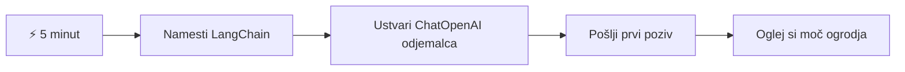
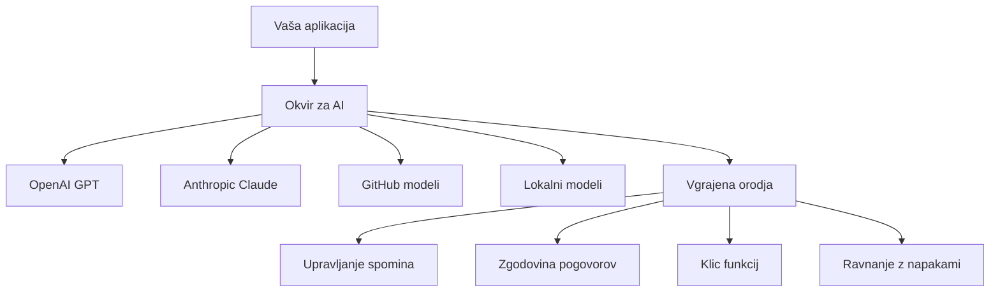
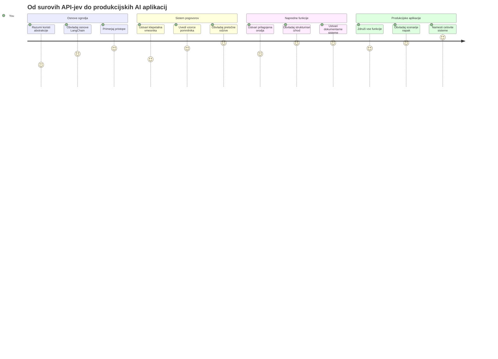
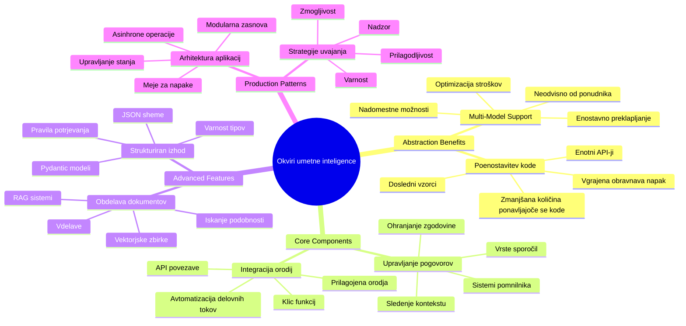
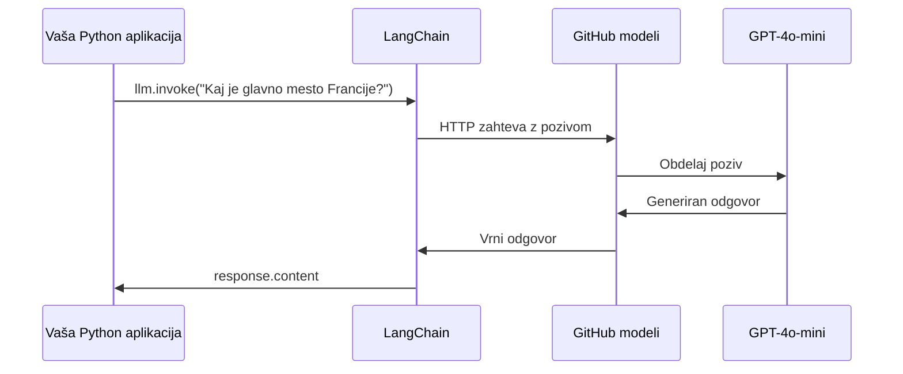
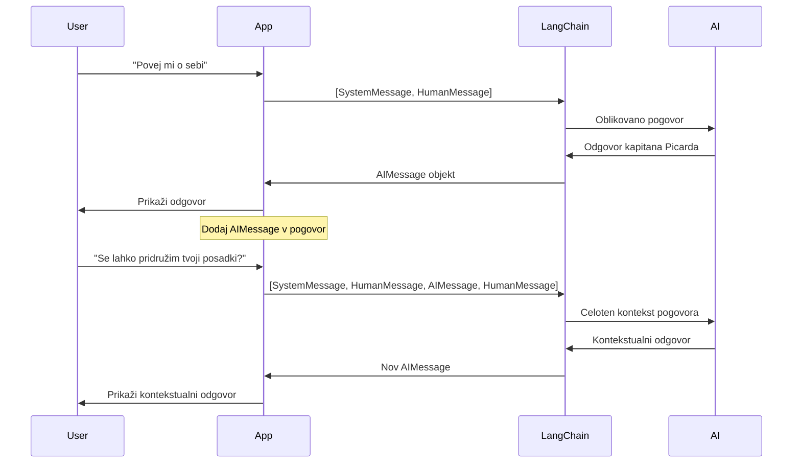
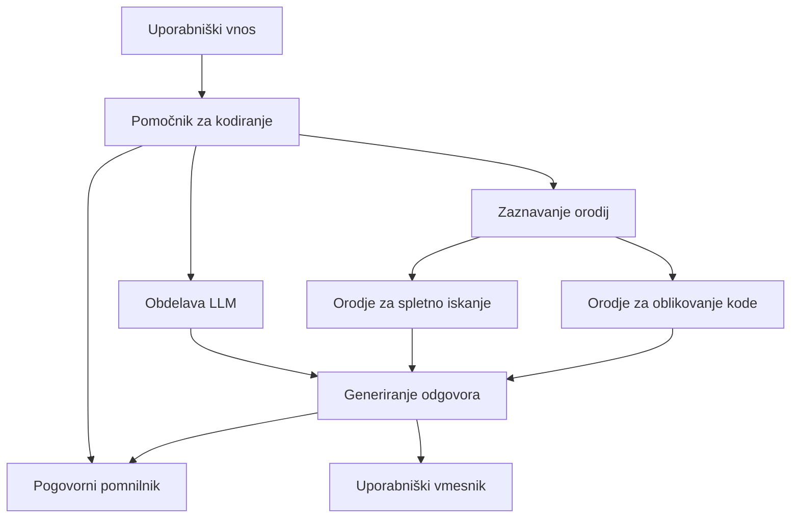
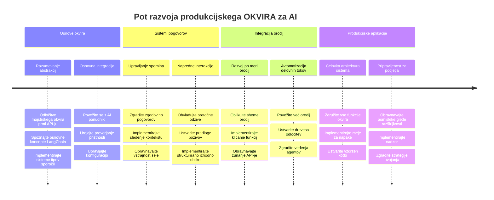
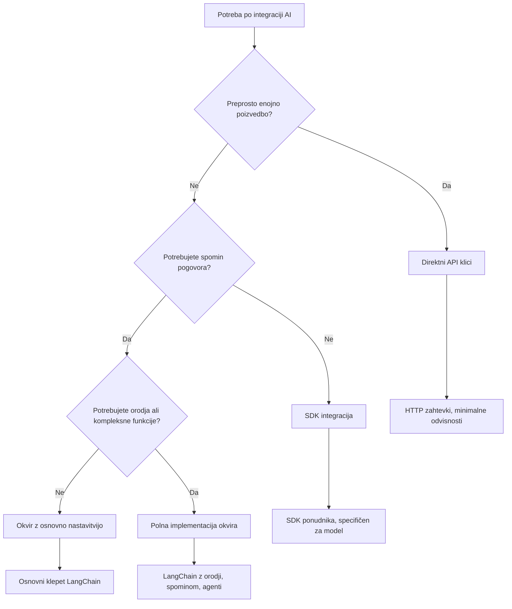

<!--
CO_OP_TRANSLATOR_METADATA:
{
  "original_hash": "3925b6a1c31c60755eaae4d578232c25",
  "translation_date": "2026-01-07T09:43:34+00:00",
  "source_file": "10-ai-framework-project/README.md",
  "language_code": "sl"
}
-->
# Okvir za umetno inteligenco

Ste se kdaj počutili preobremenjene, ko ste poskušali zgraditi aplikacije umetne inteligence od začetka? Niste sami! Okviri za umetno inteligenco so kot švicarski nož za razvoj UI - so zmogljiva orodja, ki vam lahko prihranijo čas in glavobole pri gradnji inteligentnih aplikacij. Okvir za umetno inteligenco si predstavljajte kot dobro organizirano knjižnico: zagotavlja vnaprej izdelane komponente, standardizirane API-je in pametne abstrakcije, tako da se lahko osredotočite na reševanje problemov, namesto da se ukvarjate s podrobnostmi implementacije.

V tej lekciji bomo raziskali, kako lahko okviri, kot je LangChain, kompleksne naloge integracije umetne inteligence spremenijo v čisto, berljivo kodo. Odkrijte, kako se lotiti izzivov iz resničnega sveta, kot so sledenje pogovorom, izvajanje klicev orodij in upravljanje različnih modelov UI prek enotnega vmesnika.

Do konca lekcije boste vedeli, kdaj se je bolje obrniti na okvire namesto neposrednih API klicev, kako učinkovito uporabljati njihove abstrakcije in kako graditi aplikacije umetne inteligence, pripravljene za uporabo v resničnem svetu. Raziščimo, kaj lahko okviri za umetno inteligenco storijo za vaše projekte.

## ⚡ Kaj lahko storite v naslednjih 5 minutah

**Hiter začetek za zaposlene razvijalce**


- **1. minuta**: Namestite LangChain: `pip install langchain langchain-openai`
- **2. minuta**: Nastavite svoj GitHub žeton in uvozite klienta ChatOpenAI
- **3. minuta**: Ustvarite preprost pogovor s sporočili sistema in človeka
- **4. minuta**: Dodajte osnovno orodje (npr. funkcijo seštevanja) in si oglejte klic orodij UI
- **5. minuta**: Izkusite razliko med surovo API klici in abstrakcijo okvira

**Hitri testni koda**:
```python
from langchain_openai import ChatOpenAI
from langchain_core.messages import SystemMessage, HumanMessage

llm = ChatOpenAI(
    api_key=os.environ["GITHUB_TOKEN"],
    base_url="https://models.github.ai/inference",
    model="openai/gpt-4o-mini"
)

response = llm.invoke([
    SystemMessage(content="You are a helpful coding assistant"),
    HumanMessage(content="Explain Python functions briefly")
])
print(response.content)
```

**Zakaj je to pomembno**: V 5 minutah boste izkusili, kako okviri UI preoblikujejo kompleksno integracijo umetne inteligence v preproste metode. To je temelj, ki poganja produkcijske AI aplikacije.

## Zakaj izbrati okvir?

Torej ste pripravljeni zgraditi aplikacijo umetne inteligence - super! A tukaj je stvar: obstaja več različnih poti, ki jih lahko ubrates, vsaka s svojimi prednostmi in slabostmi. To je kot izbirati med hojo, kolesarjenjem ali vožnjo - vse vas bodo pripeljale do cilja, a izkušnja (in trud) bosta povsem različna.

Oglejmo si tri glavne načine, kako lahko integrirate UI v svoje projekte:

| Pristop | Prednosti | Najbolj primerno za | Premisleki |
|---------|------------|---------------------|------------|
| **Neposredni HTTP pozivi** | Poln nadzor, brez odvisnosti | Preprosti poizvedki, učenje osnov | Bolj obsežna koda, ročno upravljanje napak |
| **SDK integracija** | Manj pisanja podvojenega koda, optimizacija za specifične modele | Aplikacije z enim modelom | Omejeno na določene ponudnike |
| **Okviri UI** | Enoten API, vgrajene abstrakcije | Aplikacije z več modeli, kompleksni delovni tokovi | Učna krivulja, potencialna pretirana abstrakcija |

### Prednosti okvirjev v praksi


**Zakaj so okviri pomembni:**
- **Združujejo** več ponudnikov umetne inteligence pod enim vmesnikom
- **Samodejno** upravljajo pomnjenje pogovorov
- **Nudijo** že pripravljena orodja za običajne naloge, kot so vdelave in klici funkcij
- **Upravljajo** ravnanje z napakami in logiko ponovitve
- **Spremenijo** kompleksne delovne tokove v berljive klice metod

> 💡 **Nasvet**: Uporabljajte okvire, ko menjate med različnimi modeli umetne inteligence ali gradite kompleksne funkcije, kot so agenti, pomnjenje ali klic orodij. Pri učenju osnov ali gradnji preprostih, osredotočenih aplikacij pa se držite neposrednih API-jev.

**Zaključek**: Tako kot izbirate med specializiranimi orodji obrtnika in celotno delavnico, je pomembno, da orodje ujemate z nalogo. Okviri se odlično obnesejo pri kompleksnih, bogatih aplikacijah, medtem ko neposredni API-ji dobro delujejo za bolj enostavne primere uporabe.

## 🗺️ Vaša učna pot do mojstrstva okvirov UI


**Cilj vaše poti**: Do konca te lekcije boste obvladali razvoj okvirov UI in znali zgraditi sofisticirane, produkcijsko pripravljene UI aplikacije, ki konkurirajo komercialnim AI asistentom.

## Uvod

V tej lekciji se bomo naučili:

- Uporabljati običajen okvir umetne inteligence.
- Reševati pogoste težave, kot so pogovori, uporaba orodij, pomnjenje in kontekst.
- Izkoristiti to za gradnjo UI aplikacij.

## 🧠 Ekosistem razvoja okvirov umetne inteligence


**Temeljno načelo**: Okviri UI abstraktno poenostavljajo kompleksnost, hkrati pa nudijo močne abstrakcije za upravljanje pogovorov, integracijo orodij in obdelavo dokumentov, kar razvijalcem omogoča gradnjo sofisticiranih UI aplikacij s čisto, vzdrževalno kodo.

## Vaš prvi AI poziv

Začnimo z osnovami tako, da ustvarimo svojo prvo aplikacijo umetne inteligence, ki pošlje vprašanje in prejme odgovor nazaj. Tako kot je Arhimed odkril princip potiska v svoji kopeli, včasih najpreprostejši opaznosti privedejo do najbolj močnih spoznanj - in okviri naredijo ta spoznanja dostopna.

### Nastavitev LangChain z GitHub modeli

Uporabili bomo LangChain za povezavo z GitHub modeli, kar je super, saj vam omogoča brezplačen dostop do različnih modelov UI. Najboljše? Potrebujete le nekaj preprostih konfiguracijskih parametrov za začetek:

```python
from langchain_openai import ChatOpenAI
import os

llm = ChatOpenAI(
    api_key=os.environ["GITHUB_TOKEN"],
    base_url="https://models.github.ai/inference",
    model="openai/gpt-4o-mini",
)

# Pošlji preprost poziv
response = llm.invoke("What's the capital of France?")
print(response.content)
```

**Razčlenimo, kaj se tukaj dogaja:**
- **Ustvari** LangChain klienta z uporabo razreda `ChatOpenAI` - to je vaša vstopna točka v UI!
- **Nastavi** povezavo z GitHub modeli z vašim avtentikacijskim žetonom
- **Določi** kateri model UI se uporablja (`gpt-4o-mini`) - to je kot izbira vašega pomočnika UI
- **Pošlje** vprašanje z metodo `invoke()` - tu se zgodi magija
- **Izvleče** in prikaže odgovor - voilà, klepetate z UI!

> 🔧 **Opomba pri nastavitvi**: Če uporabljate GitHub Codespaces, imate srečo - `GITHUB_TOKEN` je že nastavljen za vas! Delate lokalno? Nič hudega, potrebovali boste ustvariti osebni dostopni žeton z ustreznimi dovoljenji.

**Pričakovan izhod:**
```text
The capital of France is Paris.
```


## Gradnja pogovorne umetne inteligence

Prvi primer prikazuje osnove, toda to je le enkratni izmenjava - postavite vprašanje, prejmete odgovor in to je to. V realnih aplikacijah želite, da si vaša UI zapomni, o čem ste govorili, kot Watson in Holmes, ki sta skozi čas gradila svoje raziskovalne pogovore.

Tukaj LangChain postane še posebej uporaben. Ponuja različne tipe sporočil, ki pomagajo strukturirati pogovore in omogočajo, da svoji UI dodate osebnost. Gradili boste klepetalne izkušnje, ki ohranjajo kontekst in značaj.

### Razumevanje vrst sporočil

Te tipe sporočil si predstavljajte kot različne "kape", ki jih udeleženci nosijo v pogovoru. LangChain uporablja različne razrede sporočil, da spremlja, kdo kaj pravi:

| Vrsta sporočila | Namen | Primer uporabe |
|-----------------|--------|----------------|
| `SystemMessage` | Določa osebnost in vedenje UI | "Si prijazen pomočnik za kodiranje" |
| `HumanMessage` | Predstavlja uporabnikov vnos | "Pojasni, kako delujejo funkcije" |
| `AIMessage` | Shranjuje odgovore UI | Prejšnji odgovori UI v pogovoru |

### Ustvarjanje prvega pogovora

Ustvarimo pogovor, kjer naša UI prevzame določeno vlogo. Naj bo to kapitan Picard – lik, znan po svoji diplomatski modrosti in vodstvu:

```python
messages = [
    SystemMessage(content="You are Captain Picard of the Starship Enterprise"),
    HumanMessage(content="Tell me about you"),
]
```

**Razčlenitev nastavitve pogovora:**
- **Določi** vlogo in osebnost UI prek `SystemMessage`
- **Doda** začetno uporabniško vprašanje skozi `HumanMessage`
- **Ustvari** osnovo za večkratni pogovor

Celotna koda za ta primer izgleda tako:

```python
from langchain_core.messages import HumanMessage, SystemMessage
from langchain_openai import ChatOpenAI
import os

llm = ChatOpenAI(
    api_key=os.environ["GITHUB_TOKEN"],
    base_url="https://models.github.ai/inference",
    model="openai/gpt-4o-mini",
)

messages = [
    SystemMessage(content="You are Captain Picard of the Starship Enterprise"),
    HumanMessage(content="Tell me about you"),
]


# deluje
response  = llm.invoke(messages)
print(response.content)
```

Rezultat bi moral biti podoben:

```text
I am Captain Jean-Luc Picard, the commanding officer of the USS Enterprise (NCC-1701-D), a starship in the United Federation of Planets. My primary mission is to explore new worlds, seek out new life and new civilizations, and boldly go where no one has gone before. 

I believe in the importance of diplomacy, reason, and the pursuit of knowledge. My crew is diverse and skilled, and we often face challenges that test our resolve, ethics, and ingenuity. Throughout my career, I have encountered numerous species, grappled with complex moral dilemmas, and have consistently sought peaceful solutions to conflicts.

I hold the ideals of the Federation close to my heart, believing in the importance of cooperation, understanding, and respect for all sentient beings. My experiences have shaped my leadership style, and I strive to be a thoughtful and just captain. How may I assist you further?
```

Da ohranite kontinuiteto pogovora (namesto da vsakokrat ponastavite kontekst), morate še naprej dodajati odgovore na seznam sporočil. Tako kot so ustne tradicije ohranjale zgodbe skozi generacije, ta pristop gradi trajni spomin:

```python
from langchain_core.messages import HumanMessage, SystemMessage
from langchain_openai import ChatOpenAI
import os

llm = ChatOpenAI(
    api_key=os.environ["GITHUB_TOKEN"],
    base_url="https://models.github.ai/inference",
    model="openai/gpt-4o-mini",
)

messages = [
    SystemMessage(content="You are Captain Picard of the Starship Enterprise"),
    HumanMessage(content="Tell me about you"),
]


# deluje
response  = llm.invoke(messages)

print(response.content)

print("---- Next ----")

messages.append(response)
messages.append(HumanMessage(content="Now that I know about you, I'm Chris, can I be in your crew?"))

response  = llm.invoke(messages)

print(response.content)

```

Kar lepo, kajne? Tukaj se dogaja to, da LLM kličemo dvakrat - najprej le z našima začetnima dvema sporočiloma, nato pa še z celotno zgodovino pogovora. Kot da UI dejansko spremlja naš klepet!

Ko zaženete to kodo, boste dobili drugi odgovor, ki zveni približno takole:

```text
Welcome aboard, Chris! It's always a pleasure to meet those who share a passion for exploration and discovery. While I cannot formally offer you a position on the Enterprise right now, I encourage you to pursue your aspirations. We are always in need of talented individuals with diverse skills and backgrounds. 

If you are interested in space exploration, consider education and training in the sciences, engineering, or diplomacy. The values of curiosity, resilience, and teamwork are crucial in Starfleet. Should you ever find yourself on a starship, remember to uphold the principles of the Federation: peace, understanding, and respect for all beings. Your journey can lead you to remarkable adventures, whether in the stars or on the ground. Engage!
```


To bom vzel kot morda ;)

## Pretakanje odgovorov

Ste že opazili, kako ChatGPT "tipka" svoje odgovore v realnem času? To je pretakanje v akciji. Kot gledati veščega kaligrafa pri delu – opazovati, kako se črke pojavijo zamah za zamahom namesto, da materializirajo naenkrat – pretakanje naredi interakcijo bolj naravno in omogoča takojšnjo povratno informacijo.

### Izvedba pretakanja z LangChain

```python
from langchain_openai import ChatOpenAI
import os

llm = ChatOpenAI(
    api_key=os.environ["GITHUB_TOKEN"],
    base_url="https://models.github.ai/inference",
    model="openai/gpt-4o-mini",
    streaming=True
)

# Tokovno predvajajte odgovor
for chunk in llm.stream("Write a short story about a robot learning to code"):
    print(chunk.content, end="", flush=True)
```

**Zakaj je pretakanje super:**
- **Prikaže** vsebino, medtem ko nastaja – ni več nerodnega čakanja!
- **Uporabnikom daje občutek**, da se nekaj dejansko dogaja
- **Deluje** hitreje, tudi če tehnično ni
- **Uporabnikom omogoča**, da začnejo brati, medtem ko UI še "razmišlja"

> 💡 **Nasvet za uporabniško izkušnjo**: Pretakanje je zlate vredno pri daljših odgovorih, kot so razlage kode, ustvarjalno pisanje ali podrobni vodiči. Vaši uporabniki bodo uživali v opazovanju napredka namesto občudovanja praznega zaslona!

### 🎯 Pedagoška kontrola: Koristi abstrakcije okvirjev

**Ustavite se in premislite**: Pravkar ste izkusili moč abstrakcij AI okvirjev. Primerjajte to s surovimi API klici iz predhodnih lekcij.

**Hitra samoevalvacija**:
- Ali lahko pojasnite, kako LangChain poenostavi upravljanje pogovorov v primerjavi z ročnim sledenjem sporočil?
- Kaj je razlika med metodama `invoke()` in `stream()`, in kdaj bi uporabili katero?
- Kako sistem tipov sporočil okvira izboljša organizacijo kode?

**Povezava z resničnim svetom**: Abstrakcijski vzorci, ki ste jih spoznali (tipi sporočil, pretakanje, pomnjenje pogovorov), se uporabljajo v vseh velikih UI aplikacijah - od vmesnika ChatGPT do pomoči pri kodi GitHub Copilot. Mojstrsko obvladujete iste arhitekturne vzorce, ki jih uporabljajo profesionalne ekipe za razvoj UI.

**Izziv**: Kako bi oblikovali abstrakcijo okvirja za upravljanje različnih ponudnikov modelov UI (OpenAI, Anthropic, Google) z enim samim vmesnikom? Premislite o prednostih in kompromisih.

## Predloge pozivov

Predloge pozivov delujejo kot retorične strukture, uporabljene v klasični govorici - pomislite, kako je Ciceron prilagajal vzorce svojih govorov različnim občinstvom, medtem ko je ohranil isto prepričljivo strukturo. Omogočajo vam ustvarjanje ponovno uporabnih pozivov, kjer lahko preprosto zamenjate različne dele informacij, ne da bi vse prepisovali. Ko nastavite predlogo, le napolnite spremenljivke z vrednostmi, ki jih potrebujete.

### Ustvarjanje ponovno uporabnih pozivov

```python
from langchain_core.prompts import ChatPromptTemplate

# Določite predlogo za razlage kode
template = ChatPromptTemplate.from_messages([
    ("system", "You are an expert programming instructor. Explain concepts clearly with examples."),
    ("human", "Explain {concept} in {language} with a practical example for {skill_level} developers")
])

# Uporabite predlogo z različnimi vrednostmi
questions = [
    {"concept": "functions", "language": "JavaScript", "skill_level": "beginner"},
    {"concept": "classes", "language": "Python", "skill_level": "intermediate"},
    {"concept": "async/await", "language": "JavaScript", "skill_level": "advanced"}
]

for question in questions:
    prompt = template.format_messages(**question)
    response = llm.invoke(prompt)
    print(f"Topic: {question['concept']}\n{response.content}\n---\n")
```

**Zakaj boste oboževali predloge:**
- **Ohranjajo** doslednost vaših pozivov v celotni aplikaciji
- **Nič več** zapletenega združevanja nizov – zgolj čiste, preproste spremenljivke
- **Vaša UI** deluje predvidljivo, ker struktura ostaja enaka
- **Posodobitve** so hitro izvedljive – spremenite predlogo enkrat in je urejeno povsod

## Strukturiran izhod

Ste se že kdaj razburjali, ko ste poskušali razčleniti odgovore UI, ki pridejo kot nestrukturirano besedilo? Strukturiran izhod je kot učenje vaše UI, da sledi sistematičnemu pristopu, ki ga je Linne uporabljal za biološko klasifikacijo – organizirano, predvidljivo in enostavno za delo. Lahko zahtevate JSON, specifične podatkovne strukture ali kateri koli format, ki ga potrebujete.

### Določanje shem izhoda

```python
from langchain_core.prompts import ChatPromptTemplate
from langchain_core.output_parsers import JsonOutputParser
from pydantic import BaseModel, Field

class CodeReview(BaseModel):
    score: int = Field(description="Code quality score from 1-10")
    strengths: list[str] = Field(description="List of code strengths")
    improvements: list[str] = Field(description="List of suggested improvements")
    overall_feedback: str = Field(description="Summary feedback")

# Nastavite razčlenjevalnik
parser = JsonOutputParser(pydantic_object=CodeReview)

# Ustvarite poziv z navodili za format
prompt = ChatPromptTemplate.from_messages([
    ("system", "You are a code reviewer. {format_instructions}"),
    ("human", "Review this code: {code}")
])

# Oblikujte poziv z navodili
chain = prompt | llm | parser

# Pridobite strukturiran odgovor
code_sample = """
def calculate_average(numbers):
    return sum(numbers) / len(numbers)
"""

result = chain.invoke({
    "code": code_sample,
    "format_instructions": parser.get_format_instructions()
})

print(f"Score: {result['score']}")
print(f"Strengths: {', '.join(result['strengths'])}")
```

**Zakaj je strukturiran izhod prava revolucija:**
- **Nič več** ugibanja, kakšen format boste prejeli – vedno je dosleden
- **Neposredno** se poveže z vašimi bazami podatkov in API-ji brez dodatnega dela
- **Zajame** nenavadne odgovore UI, preden pokvarijo vašo aplikacijo
- **Pojasni** vašo kodo, ker točno veste, s čim delate

## Klic orodij

Zdaj pridemo do ene najmočnejših funkcij: orodja. Tako svoji UI daste praktične zmožnosti onkraj samega pogovora. Tako kot so srednjeveške cehi razvili specializirana orodja za specifične obrti, lahko svojo UI opremite s ciljanimi instrumenti. Opisujete, katera orodja so na voljo, in ko nekdo zahteva nekaj, kar ustreza, lahko vaša UI ukrepa.

### Uporaba Pythona

Dodajmo nekaj orodij tako:

```python
from typing_extensions import Annotated, TypedDict

class add(TypedDict):
    """Add two integers."""

    # Oznake morajo imeti tip in lahko po možnosti vključujejo privzeto vrednost in opis (v tem vrstnem redu).
    a: Annotated[int, ..., "First integer"]
    b: Annotated[int, ..., "Second integer"]

tools = [add]

functions = {
    "add": lambda a, b: a + b
}
```

Kaj se tukaj dogaja? Ustvarjamo načrt za orodje imenovano `add`. Z dedovanjem od `TypedDict` in uporabo naprednih tipov `Annotated` za `a` in `b` dajemo LLM jasen pogled, kaj orodje počne in kaj potrebuje. Slovar `functions` je kot naša škatla z orodji - natančno pove kodo, kaj naj naredi, ko se UI odloči uporabiti določeno orodje.

Poglejmo, kako naslednjič kličemo LLM s tem orodjem:

```python
llm = ChatOpenAI(
    api_key=os.environ["GITHUB_TOKEN"],
    base_url="https://models.github.ai/inference",
    model="openai/gpt-4o-mini",
)

llm_with_tools = llm.bind_tools(tools)
```

Tukaj kličemo `bind_tools` z našim poljem `tools` in s tem LLM `llm_with_tools` dobi znanje o tem orodju.

Za uporabo tega novega LLM lahko napišemo naslednjo kodo:

```python
query = "What is 3 + 12?"

res = llm_with_tools.invoke(query)
if(res.tool_calls):
    for tool in res.tool_calls:
        print("TOOL CALL: ", functions[tool["name"]](../../../10-ai-framework-project/**tool["args"]))
print("CONTENT: ",res.content)
```

Zdaj, ko kličemo `invoke` na tem novem LLmu, ki ima orodja, je mogoče lastnost `tool_calls` zapolnjena. Če je tako, ima vsako identificirano orodje lastnost `name` in `args`, ki opredeljujeta, katero orodje naj se pokliče in s kakšnimi argumenti. Celotna koda izgleda tako:

```python
from langchain_core.messages import HumanMessage, SystemMessage
from langchain_openai import ChatOpenAI
import os
from typing_extensions import Annotated, TypedDict

class add(TypedDict):
    """Add two integers."""

    # Oznake morajo imeti tip in lahko opcijsko vključujejo privzeto vrednost ter opis (v tem vrstnem redu).
    a: Annotated[int, ..., "First integer"]
    b: Annotated[int, ..., "Second integer"]

tools = [add]

functions = {
    "add": lambda a, b: a + b
}

llm = ChatOpenAI(
    api_key=os.environ["GITHUB_TOKEN"],
    base_url="https://models.github.ai/inference",
    model="openai/gpt-4o-mini",
)

llm_with_tools = llm.bind_tools(tools)

query = "What is 3 + 12?"

res = llm_with_tools.invoke(query)
if(res.tool_calls):
    for tool in res.tool_calls:
        print("TOOL CALL: ", functions[tool["name"]](../../../10-ai-framework-project/**tool["args"]))
print("CONTENT: ",res.content)
```

Ob zagonu te kode bi morali videti izhod, podoben temu:

```text
TOOL CALL:  15
CONTENT: 
```

UI je pregledala "Kaj je 3 + 12" in prepoznala nalogo za orodje `add`. Tako kot vešč knjižničar ve, kateri vir posvetovati glede na vrsto vprašanja, je to odločitev sprejela na podlagi imena orodja, opisa in specifikacije polj. Rezultat 15 prinaša naš slovar `functions`, ki izvrši orodje:

```python
print("TOOL CALL: ", functions[tool["name"]](../../../10-ai-framework-project/**tool["args"]))
```

### Malo bolj zanimivo orodje, ki kliče spletni API
Dodajanje številk ponazarja koncept, vendar imajo resnična orodja običajno bolj zapletene operacije, na primer klicanje spletnih API-jev. Razširimo naš primer, da bo AI pridobil vsebino iz interneta – podobno kot so telegrafisti nekoč povezovali oddaljene lokacije:

```python
class joke(TypedDict):
    """Tell a joke."""

    # Oznake morajo imeti tip in lahko po želji vključujejo privzeto vrednost ter opis (v tem vrstnem redu).
    category: Annotated[str, ..., "The joke category"]

def get_joke(category: str) -> str:
    response = requests.get(f"https://api.chucknorris.io/jokes/random?category={category}", headers={"Accept": "application/json"})
    if response.status_code == 200:
        return response.json().get("value", f"Here's a {category} joke!")
    return f"Here's a {category} joke!"

functions = {
    "add": lambda a, b: a + b,
    "joke": lambda category: get_joke(category)
}

query = "Tell me a joke about animals"

# preostali del kode je enak
```

Če zdaj zaženete to kodo, boste dobili odziv, ki bo nekaj takega:

```text
TOOL CALL:  Chuck Norris once rode a nine foot grizzly bear through an automatic car wash, instead of taking a shower.
CONTENT:  
```

```mermaid
flowchart TD
    A[Uporabniška poizvedba: "Povej mi vic o živalih"] --> B[Analiza LangChain]
    B --> C{Orodje na voljo?}
    C -->|Da| D[Izberi orodje za vice]
    C -->|Ne| E[Ustvari neposreden odgovor]
    
    D --> F[Izvleci parametre]
    F --> G[Kliči vic(kategorija="živali")]
    G --> H[Zahteva API na chucknorris.io]
    H --> I[Vrnitev vsebine vica]
    I --> J[Prikaz uporabniku]
    
    E --> K[AI-generiran odgovor]
    K --> J
    
    subgraph "Plast definicije orodja"
        L[Shema TypedDict]
        M[Implementacija funkcije]
        N[Preverjanje parametrov]
    end
    
    D --> L
    F --> N
    G --> M
```
Tukaj je koda v celoti:

```python
from langchain_openai import ChatOpenAI
import requests
import os
from typing_extensions import Annotated, TypedDict

class add(TypedDict):
    """Add two integers."""

    # Oznake morajo imeti tip in lahko neobvezno vključujejo privzeto vrednost ter opis (v tem vrstnem redu).
    a: Annotated[int, ..., "First integer"]
    b: Annotated[int, ..., "Second integer"]

class joke(TypedDict):
    """Tell a joke."""

    # Oznake morajo imeti tip in lahko neobvezno vključujejo privzeto vrednost ter opis (v tem vrstnem redu).
    category: Annotated[str, ..., "The joke category"]

tools = [add, joke]

def get_joke(category: str) -> str:
    response = requests.get(f"https://api.chucknorris.io/jokes/random?category={category}", headers={"Accept": "application/json"})
    if response.status_code == 200:
        return response.json().get("value", f"Here's a {category} joke!")
    return f"Here's a {category} joke!"

functions = {
    "add": lambda a, b: a + b,
    "joke": lambda category: get_joke(category)
}

llm = ChatOpenAI(
    api_key=os.environ["GITHUB_TOKEN"],
    base_url="https://models.github.ai/inference",
    model="openai/gpt-4o-mini",
)

llm_with_tools = llm.bind_tools(tools)

query = "Tell me a joke about animals"

res = llm_with_tools.invoke(query)
if(res.tool_calls):
    for tool in res.tool_calls:
        # print("POKLIC ORODJA: ", tool)
        print("TOOL CALL: ", functions[tool["name"]](../../../10-ai-framework-project/**tool["args"]))
print("CONTENT: ",res.content)
```

## Vstavljanja (embeddings) in obdelava dokumentov

Vstavljanja predstavljajo eno najbolj elegantnih rešitev v sodobni umetni inteligenci. Predstavljajte si, da bi lahko kateri koli kos besedila pretvorili v numerične koordinate, ki zajamejo njegov pomen. To natančno počnejo vstavljanja – pretvorijo besedilo v točke v večdimenzionalnem prostoru, kjer se podobni koncepti združujejo. To je kot imeti koordinatni sistem za ideje, ki spominja na to, kako je Mendelejev organiziral periodni sistem glede na atomske lastnosti.

### Ustvarjanje in uporaba vstavljanj

```python
from langchain_openai import OpenAIEmbeddings
from langchain_community.vectorstores import FAISS
from langchain_community.document_loaders import TextLoader
from langchain.text_splitter import CharacterTextSplitter

# Inicializiraj vgradnje
embeddings = OpenAIEmbeddings(
    api_key=os.environ["GITHUB_TOKEN"],
    base_url="https://models.github.ai/inference",
    model="text-embedding-3-small"
)

# Naloži in razdeli dokumente
loader = TextLoader("documentation.txt")
documents = loader.load()

text_splitter = CharacterTextSplitter(chunk_size=1000, chunk_overlap=0)
texts = text_splitter.split_documents(documents)

# Ustvari vektorsko skladišče
vectorstore = FAISS.from_documents(texts, embeddings)

# Izvedi iskanje podobnosti
query = "How do I handle user authentication?"
similar_docs = vectorstore.similarity_search(query, k=3)

for doc in similar_docs:
    print(f"Relevant content: {doc.page_content[:200]}...")
```

### Nalagalniki dokumentov za različne formate

```python
from langchain_community.document_loaders import (
    PyPDFLoader,
    CSVLoader,
    JSONLoader,
    WebBaseLoader
)

# Naloži različne vrste dokumentov
pdf_loader = PyPDFLoader("manual.pdf")
csv_loader = CSVLoader("data.csv")
json_loader = JSONLoader("config.json")
web_loader = WebBaseLoader("https://example.com/docs")

# Obdelaj vse dokumente
all_documents = []
for loader in [pdf_loader, csv_loader, json_loader, web_loader]:
    docs = loader.load()
    all_documents.extend(docs)
```

**Kaj lahko naredite z vstavljanji:**
- **Ustvarite** iskanje, ki res razume, kaj mislite, ne samo ujemanje ključnih besed
- **Naredite** AI, ki lahko odgovarja na vprašanja o vaših dokumentih
- **Izdelate** priporočilne sisteme, ki predlagajo res relevantno vsebino
- **Samodejno** organizirate in kategorizirate vašo vsebino

```mermaid
flowchart LR
    A[Dokumenti] --> B[Razdelilec besedila]
    B --> C[Ustvari odtise]
    C --> D[Skladišče vektorjev]
    
    E[Uporabnikov poizvedba] --> F[Odtis poizvedbe]
    F --> G[Iskanje podobnosti]
    G --> D
    D --> H[Ustrezni dokumenti]
    H --> I[Odgovor AI]
    
    subgraph "Vektorski prostor"
        J[Dokument A: [0.1, 0.8, 0.3...]]
        K[Dokument B: [0.2, 0.7, 0.4...]]
        L[Poizvedba: [0.15, 0.75, 0.35...]]
    end
    
    C --> J
    C --> K
    F --> L
    G --> J
    G --> K
```
## Gradnja celostne AI aplikacije

Zdaj bomo združili vse, kar ste se naučili, v celovito aplikacijo – pomočnika za kodiranje, ki lahko odgovarja na vprašanja, uporablja orodja in vzdržuje spomin pogovora. Tako kot je tiskarski stroj združil obstoječe tehnologije (premične črke, črnilo, papir in pritisk) v nekaj prelomnega, bomo tudi mi združili naše AI komponente v nekaj praktičnega in uporabnega.

### Celovit primer aplikacije

```python
from langchain_openai import ChatOpenAI, OpenAIEmbeddings
from langchain_core.prompts import ChatPromptTemplate
from langchain_core.messages import HumanMessage, SystemMessage, AIMessage
from langchain_community.vectorstores import FAISS
from typing_extensions import Annotated, TypedDict
import os
import requests

class CodingAssistant:
    def __init__(self):
        self.llm = ChatOpenAI(
            api_key=os.environ["GITHUB_TOKEN"],
            base_url="https://models.github.ai/inference",
            model="openai/gpt-4o-mini"
        )
        
        self.conversation_history = [
            SystemMessage(content="""You are an expert coding assistant. 
            Help users learn programming concepts, debug code, and write better software.
            Use tools when needed and maintain a helpful, encouraging tone.""")
        ]
        
        # Določi orodja
        self.setup_tools()
    
    def setup_tools(self):
        class web_search(TypedDict):
            """Search for programming documentation or examples."""
            query: Annotated[str, "Search query for programming help"]
        
        class code_formatter(TypedDict):
            """Format and validate code snippets."""
            code: Annotated[str, "Code to format"]
            language: Annotated[str, "Programming language"]
        
        self.tools = [web_search, code_formatter]
        self.llm_with_tools = self.llm.bind_tools(self.tools)
    
    def chat(self, user_input: str):
        # Dodaj uporabnikovo sporočilo v pogovor
        self.conversation_history.append(HumanMessage(content=user_input))
        
        # Pridobi AI odgovor
        response = self.llm_with_tools.invoke(self.conversation_history)
        
        # Obravnava poklice orodij, če obstajajo
        if response.tool_calls:
            for tool_call in response.tool_calls:
                tool_result = self.execute_tool(tool_call)
                print(f"🔧 Tool used: {tool_call['name']}")
                print(f"📊 Result: {tool_result}")
        
        # Dodaj AI odgovor v pogovor
        self.conversation_history.append(response)
        
        return response.content
    
    def execute_tool(self, tool_call):
        tool_name = tool_call['name']
        args = tool_call['args']
        
        if tool_name == 'web_search':
            return f"Found documentation for: {args['query']}"
        elif tool_name == 'code_formatter':
            return f"Formatted {args['language']} code: {args['code'][:50]}..."
        
        return "Tool execution completed"

# Primer uporabe
assistant = CodingAssistant()

print("🤖 Coding Assistant Ready! Type 'quit' to exit.\n")

while True:
    user_input = input("You: ")
    if user_input.lower() == 'quit':
        break
    
    response = assistant.chat(user_input)
    print(f"🤖 Assistant: {response}\n")
```

**Arhitektura aplikacije:**


**Ključne funkcije, ki smo jih implementirali:**
- **Se spomni** celoten potek pogovora za kontinuiteto konteksta
- **Izvaja ukrepe** preko klicanja orodij, ne samo pogovora
- **Sledi** predvidljivim vzorcem interakcije
- **Samodejno** upravlja z obravnavo napak in zapletenimi delovnimi procesi

### 🎯 Pedagoški pregled: Arhitektura produkcijske AI

**Razumevanje arhitekture**: Zgradili ste celovito AI aplikacijo, ki združuje upravljanje pogovora, klicanje orodij in strukturirane delovne tokove. To predstavlja razvoj AI aplikacij na produkcijski ravni.

**Ključni osvojeni koncepti**:
- **Arhitektura na osnovi razredov**: organizirana, vzdržna struktura AI aplikacije
- **Integracija orodij**: prilagojene funkcije preko orodij
- **Upravljanje spomina**: trajni kontekst pogovora
- **Obravnava napak**: robustno vedenje aplikacije

**Povezava z industrijo**: vzorci arhitekture, ki ste jih uporabili (razredi pogovorov, sistemi orodij, upravljanje spomina) so isti vzorci, kot jih uporabljajo podjetniške AI aplikacije, kot so Slackov AI pomočnik, GitHub Copilot in Microsoft Copilot. Zgradili ste s profesionalnim arhitekturnim pristopom.

**Vprašanje za razmislek**: Kako bi razširili to aplikacijo za več uporabnikov, trajno shranjevanje ali integracijo s zunanjimi podatkovnimi bazami? Razmislite o problemih razširljivosti in upravljanja stanja.

## Naloga: Zgradite svojega AI pomočnika za študij

**Cilj**: Ustvariti AI aplikacijo, ki študentom pomaga pri učenju programskih konceptov z razlagami, primeri kode in interaktivnimi kvizi.

### Zahteve

**Osnovne funkcije (obvezno):**
1. **Vmesnik za pogovor**: Implementirajte klepetalni sistem, ki ohranja kontekst skozi več vprašanj
2. **Izobraževalna orodja**: Ustvarite vsaj dve orodji za pomoč pri učenju:
   - Orodje za razlago kode
   - Generator konceptualnih kvizov
3. **Personalizirano učenje**: Uporabite sistemska sporočila za prilagajanje odgovorov različnim stopnjam znanja
4. **Oblikovanje odgovorov**: Implementirajte strukturiran izhod za vprašanja v kvizu

### Koraki izvedbe

**Korak 1: Nastavite okolje**
```bash
pip install langchain langchain-openai
```

**Korak 2: Osnovna funkcionalnost klepeta**
- Ustvarite razred `StudyAssistant`
- Implementirajte spomin pogovora
- Dodajte konfiguracijo osebnosti za podporo izobraževanju

**Korak 3: Dodajte izobraževalna orodja**
- **Razlagalec kode**: Razčleni kodo v razumljive dele
- **Generator kvizov**: Ustvari vprašanja o programskih konceptih
- **Spremljevalec napredka**: Evidentira preučevane teme

**Korak 4: Izboljšane funkcije (neobvezno)**
- Implementirajte pretočne odgovore za boljšo uporabniško izkušnjo
- Dodajte nalaganje dokumentov za vključevanje študijskega gradiva
- Ustvarite vstavljanja za iskanje vsebin glede na podobnost

### Merila ocenjevanja

| Funkcija | Odlično (4) | Dobro (3) | Zadovoljivo (2) | Potrebuje delo (1) |
|---------|-------------|-----------|-----------------|--------------------|
| **Potek pogovora** | Naravni, kontekstno zavestni odgovori | Dobro ohranjanje konteksta | Osnovni pogovor | Brez shranjenega spomina med izmenjavami |
| **Integracija orodij** | Več uporabnih orodij deluje brezhibno | 2+ orodji pravilno implementirani | 1-2 osnovni orodji | Orodja ne delujejo |
| **Kakovost kode** | Čista, dobro dokumentirana, z obravnavo napak | Dobra struktura, nekaj dokumentacije | Osnovna funkcionalnost deluje | Slaba struktura, brez obravnave napak |
| **Izobraževalna vrednost** | Resnično pomaga pri učenju, prilagojena | Dobra podpora učenju | Osnovne razlage | Omejena izobraževalna vrednost |

### Vzorec strukture kode

```python
class StudyAssistant:
    def __init__(self, skill_level="beginner"):
        # Inicializirajte LLM, orodja in pomnilnik pogovora
        pass
    
    def explain_code(self, code, language):
        # Orodje: Pojasnite, kako koda deluje
        pass
    
    def generate_quiz(self, topic, difficulty):
        # Orodje: Ustvarite vaje vprašanja
        pass
    
    def chat(self, user_input):
        # Glavni uporabniški vmesnik pogovora
        pass

# Primer uporabe
assistant = StudyAssistant(skill_level="intermediate")
response = assistant.chat("Explain how Python functions work")
```

**Bonus izzivi:**
- Dodajte zvočni vnos/izhod
- Implementirajte spletni vmesnik z Streamlit ali Flask
- Ustvarite bazo znanja iz študijskega gradiva z uporabo vstavljanj
- Dodajte sledenje napredku in personalizirane učne poti

## 📈 Vaša časovnica obvladovanja razvoja AI ogrodja


**🎓 Mejniki diplomiranja**: Uspešno ste obvladali razvoj AI ogrodij z uporabo enakih orodij in vzorcev, ki poganjajo sodobne AI aplikacije. Ti veščine predstavljajo vrh razvoja AI aplikacij in vas pripravljajo na gradnjo intelektualnih sistemov na ravni podjetij.

**🔄 Naslednje sposobnosti:**
- Pripravljeni za raziskovanje naprednih AI arhitektur (agenti, večagentni sistemi)
- Pripravljeni za gradnjo RAG sistemov z vektorskimi podatkovnimi bazami
- Opremljeni za izdelavo multimodalnih AI aplikacij
- Postavljen temelj za skaliranje in optimizacijo AI aplikacij

## Povzetek

🎉 Zdaj ste obvladali osnove razvoja AI ogrodij in se naučili, kako zgraditi sofisticirane AI aplikacije z uporabo LangChain. Tako kot zaključek celovitega vajeništva ste pridobili obsežen nabor orodij. Preglejmo, kaj ste dosegli.

### Kaj ste se naučili

**Osnovni koncepti ogrodja:**
- **Prednosti ogrodij**: Razumevanje, kdaj izbrati ogrodja namesto neposrednih klicev API-ja
- **Osnove LangChaina**: Namestitev in konfiguracija povezav s AI modeli
- **Vrste sporočil**: Uporaba `SystemMessage`, `HumanMessage` in `AIMessage` za strukturirane pogovore

**Napredne funkcije:**
- **Klicanje orodij**: Ustvarjanje in integracija prilagojenih orodij za izboljšanje AI zmožnosti
- **Spomin pogovora**: Ohranjanje konteksta skozi več izmenjav
- **Pretok odgovorov**: Implementacija dostave odgovorov v realnem času
- **Predloge pozivov**: Gradnja večkrat uporabnih, dinamičnih pozivov
- **Strukturiran izhod**: Zagotavljanje doslednih, analizirnih odgovorov AI
- **Vstavljanja**: Ustvarjanje semantičnega iskanja in obdelave dokumentov

**Praktične aplikacije:**
- **Gradnja celovitih aplikacij**: Združevanje več funkcij v produkcijsko pripravljene aplikacije
- **Upravljanje napak**: Implementacija robustnega upravljanja in preverjanja napak
- **Integracija orodij**: Ustvarjanje prilagojenih orodij, ki širijo AI kapacitete

### Ključni poudarki

> 🎯 **Zapomnite si**: AI ogrodja, kot je LangChain, so pravzaprav vaši prijatelji, ki skrivajo kompleksnost in imajo obilico funkcij. Popolni so, ko potrebujete spomin pogovora, klicanje orodij ali želite delati z več AI modeli, ne da bi izgubili razum.

**Odločanje o integraciji AI:**


### Kam naprej?

**Začnite graditi zdaj:**
- Vzemite te koncepte in ustvarite nekaj, kar VAS navdušuje!
- Igrajte se z različnimi AI modeli prek LangChaina – to je kot otroško igrišče AI modelov
- Ustvarite orodja, ki rešujejo dejanske probleme, s katerimi se srečujete v delu ali projektih

**Pripravljeni na naslednjo stopnjo?**
- **AI Agenti**: Gradite AI sisteme, ki lahko sami načrtujejo in izvajajo zapletene naloge
- **RAG (Retrieval-Augmented Generation)**: Združite AI z vašimi bazami znanja za izjemno zmogljive aplikacije
- **Multimodalni AI**: Delo z besedilom, slikami in zvokom skupaj – možnosti so neomejene!
- **Produkcijska uporaba**: Naučite se skalirati vaše AI aplikacije in jih spremljati v realnem svetu

**Pridružite se skupnosti:**
- Skupnost LangChain je odlična za ostati na tekočem in se učiti najboljših praks
- GitHub Models vam omogoča dostop do najsodobnejših AI zmogljivosti – kot nalašč za eksperimentiranje
- Nadaljujte z vadbo za različne primere uporabe – vsak projekt vas bo nekaj naučil

Zdaj imate znanje, da ustvarjate inteligentne, pogovorne aplikacije, ki ljudem pomagajo reševati resnične težave. Tako kot renesančni mojstri, ki so združevali umetniško vizijo s tehničnim znanjem, lahko zdaj združite AI zmogljivosti s praktično uporabo. Vprašanje je: kaj boste ustvarili? 🚀

## GitHub Copilot Agent izziv 🚀

Uporabite način Agenta za izpolnitev naslednjega izziva:

**Opis:** Zgradite naprednega AI pomočnika za pregled kode, ki združuje več funkcij LangChain, vključno s klicanjem orodij, strukturiranim izhodom in spominom pogovora, da zagotovi celovite povratne informacije o oddajah kode.

**Poziv:** Ustvarite razred CodeReviewAssistant, ki implementira:
1. Orodje za analizo kompleksnosti kode in predloge za izboljšave
2. Orodje za preverjanje kode glede na najboljše prakse
3. Strukturiran izhod z uporabo Pydantic modelov za dosleden format pregleda
4. Spomin pogovora za sledenje seansam pregleda
5. Glavni klepetalni vmesnik, ki lahko obravnava oddaje kode in nudi podrobne, izvedljive povratne informacije

Pomočnik mora znati pregledovati kodo v več programskih jezikih, ohraniti kontekst skozi več oddaj kode v seji in nuditi tako povzetne ocene kot podrobne predloge za izboljšave.

Več o [načinu agenta](https://code.visualstudio.com/blogs/2025/02/24/introducing-copilot-agent-mode) si preberite tukaj.

---

<!-- CO-OP TRANSLATOR DISCLAIMER START -->
**Omejitev odgovornosti**:
Ta dokument je bil preveden z uporabo AI prevajalske storitve [Co-op Translator](https://github.com/Azure/co-op-translator). Čeprav si prizadevamo za natančnost, vas opozarjamo, da avtomatizirani prevodi lahko vsebujejo napake ali netočnosti. Izvirni dokument v izvirnem jeziku velja za avtoritativni vir. Za pomembne informacije priporočamo strokoven človeški prevod. Za morebitne nesporazume ali napačne interpretacije, ki izhajajo iz uporabe tega prevoda, ne prevzemamo odgovornosti.
<!-- CO-OP TRANSLATOR DISCLAIMER END -->