<!--
CO_OP_TRANSLATOR_METADATA:
{
  "original_hash": "672b0bb6e8b431075f3bdb7130590d2d",
  "translation_date": "2026-01-07T09:54:09+00:00",
  "source_file": "2-js-basics/1-data-types/README.md",
  "language_code": "sl"
}
-->
# Osnove JavaScripta: podatkovne vrste


> Sketchnote avtorice [Tomomi Imura](https://twitter.com/girlie_mac)

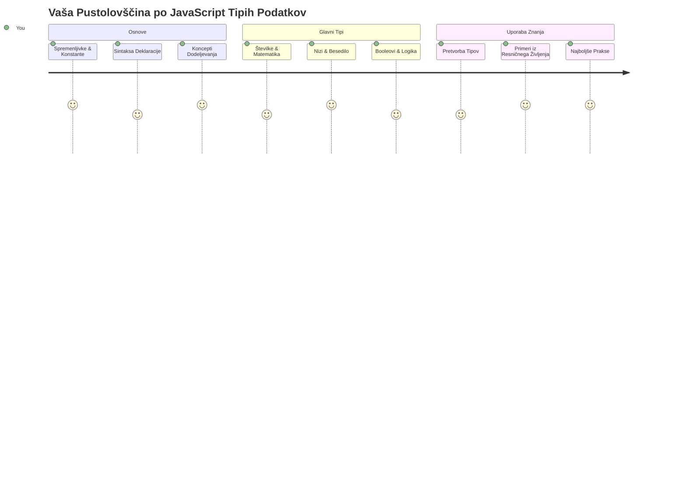
Podatkovne vrste so ena izmed temeljnih pojmov v JavaScriptu, s katerimi se boste srečali v vsakem programu, ki ga napišete. Podatkovne vrste si lahko predstavljate kot sistem arhiviranja, ki so ga uporabljali starodavni knjižničarji v Aleksandriji – imeli so posebna mesta za rokopise s poezijo, matematiko in zgodovinskimi zapisi. JavaScript organizira informacije na podoben način s kategorijami za različne vrste podatkov.

V tej lekciji bomo spoznali osnovne podatkovne vrste, zaradi katerih JavaScript deluje. Naučili se boste, kako rokovati s številkami, besedilom, vrednostmi resnično/napačno in zakaj je izbira prave vrste ključnega pomena za vaše programe. Ti pojmi se sprva morda zdijo abstraktni, a z vajo bodo postali nekaj samoumevnega.

Razumevanje podatkovnih vrst bo naredilo vse ostalo v JavaScriptu veliko bolj jasno. Tako kot arhitekti potrebujejo razumevanje različnih gradbenih materialov, preden zgradijo katedralo, bodo ti temelji podpirali vse, kar boste odslej ustvarjali.

## Predpredavalni kviz
[Predpredavalni kviz](https://ff-quizzes.netlify.app/web/)

Ta lekcija pokriva osnove JavaScripta, jezika, ki zagotavlja interaktivnost na spletu.

> To lekcijo lahko opravite tudi na [Microsoft Learn](https://docs.microsoft.com/learn/modules/web-development-101-variables/?WT.mc_id=academic-77807-sagibbon)!

[](https://youtube.com/watch?v=JNIXfGiDWM8 "Spremenljivke v JavaScriptu")

[](https://youtube.com/watch?v=AWfA95eLdq8 "Podatkovne vrste v JavaScriptu")

> 🎥 Kliknite slike zgoraj za videoposnetke o spremenljivkah in podatkovnih vrstah

Začnimo s spremenljivkami in podatkovnimi vrstami, ki jih te napolnijo!

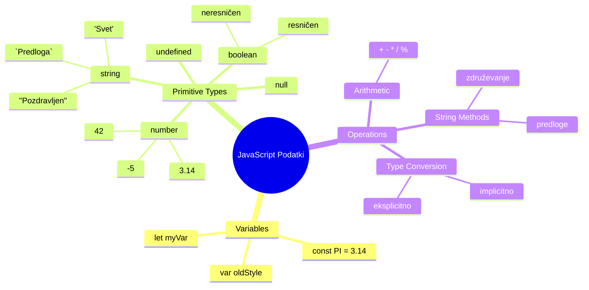
## Spremenljivke

Spremenljivke so temeljni gradniki v programiranju. Tako kot označene posode, ki so jih srednjeveški alkimisti uporabljali za shranjevanje različnih snovi, vam spremenljivke omogočajo, da shranite informacije in jim daste opisno ime, da se nanje lahko sklicujete pozneje. Potrebujete zapomniti nečije leto rojstva? Shranite ga v spremenljivko z imenom `age`. Želite spremljati ime uporabnika? Shranite ga v spremenljivko `userName`.

Osredotočili se bomo na sodoben pristop k ustvarjanju spremenljivk v JavaScriptu. Te tehnike predstavljajo leta razvoja jezika in najboljših praks, ki jih je razvila skupnost programerjev.

Ustvarjanje in **deklariranje** spremenljivke ima naslednjo sintakso: **[ključna beseda] [ime]**. Sestavljeno je iz dveh delov:

- **Ključna beseda**. Uporabite `let` za spremenljivke, ki se lahko spreminjajo, ali `const` za vrednosti, ki ostanejo enake.
- **Ime spremenljivke**, to je opisno ime, ki ga izberete sami.

✅ Ključna beseda `let` je bila uvedena v ES6 in daje vaši spremenljivki tako imenovani _block scope_ (območje znotraj bloka). Priporočljivo je, da uporabljate `let` ali `const` namesto starejše ključne besede `var`. Območja blokov bomo podrobneje obravnavali v prihodnjih delih.

### Naloga – delo s spremenljivkami

1. **Deklarirajte spremenljivko**. Začnimo z ustvarjanjem naše prve spremenljivke:

    ```javascript
    let myVariable;
    ```

   **Kaj to doseže:**
   - JavaScriptu sporoči, naj ustvari prostor za shranjevanje z imenom `myVariable`
   - JavaScript dodeli spomin za to spremenljivko
   - Spremenljivka trenutno nima vrednosti (undefined)

2. **Dajte ji vrednost**. Zdaj nekaj vnesimo v spremenljivko:

    ```javascript
    myVariable = 123;
    ```

   **Kako deluje dodeljevanje:**
   - Operator `=` dodeli vrednost 123 naši spremenljivki
   - Spremenljivka zdaj vsebuje to vrednost namesto undefined
   - To vrednost lahko uporabljate v kodi prek `myVariable`

   > Opomba: uporaba `=` v tej lekciji pomeni, da uporabljamo "operator dodelitve", ki nastavi vrednost spremenljivki. Ne označuje enakosti.

3. **Naredite to pametno**. Pravzaprav združimo ti dve koraka:

    ```javascript
    let myVariable = 123;
    ```

    **Ta pristop je učinkovitejši:**
    - Declarirate spremenljivko in ji istočasno dodelite vrednost z enim stavkom
    - To je standardna praksa med razvijalci
    - Skrajša dolžino kode ob ohranjanju jasnosti

4. **Premislite drugače**. Kaj če hočemo shraniti drugo število?

   ```javascript
   myVariable = 321;
   ```

   **Razumevanje ponovne dodelitve:**
   - Spremenljivka zdaj vsebuje 321 namesto 123
   - Predhodna vrednost je zamenjana – spremenljivke hranijo le eno vrednost naenkrat
   - Ta spreminjajočnost je ključna lastnost spremenljivk, deklariranih z `let`

   ✅ Poskusite! JavaScript lahko pišete kar v brskalniku. Odprite okno brskalnika in pojdite v Orodja za razvijalce. V konzoli najdete poziv; vnesite `let myVariable = 123`, pritisnite enter, nato vnesite `myVariable`. Kaj se zgodi? Več o teh konceptih se boste naučili v nadaljnjih lekcijah.

### 🧠 **Preverjanje znanja spremenljivk: Pridobivanje samozavesti**

**Preverimo, kako se počutite glede spremenljivk:**
- Ali znate razložiti razliko med deklaracijo in dodelitvijo spremenljivke?
- Kaj se zgodi, če poskusite uporabiti spremenljivko pred tem, ko jo deklarirate?
- Kdaj bi izbrali `let` namesto `const` za spremenljivko?

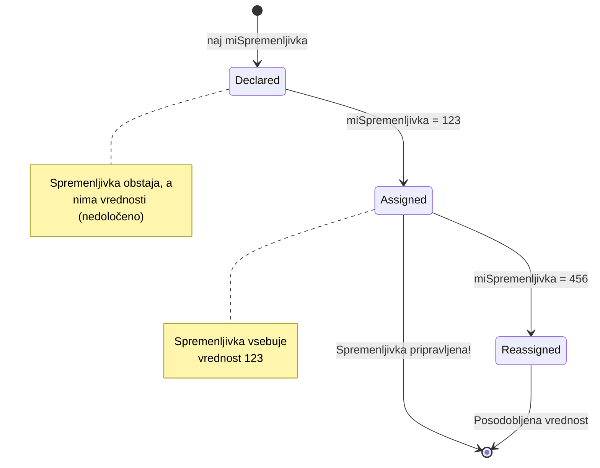
> **Hiter nasvet**: Spremenljivke si predstavljajte kot označene škatle za shranjevanje. Ustvarite škatlo (`let`), vanjo nekaj položite (`=`) in kasneje lahko vsebino zamenjate, če je potrebno!

## Konstantne vrednosti

Včasih je treba shraniti informacije, ki se med izvajanjem programa nikoli ne smejo spremeniti. Konstantne vrednosti lahko primerjamo z matematičnimi principih, ki jih je Evklid vzpostavil v antični Grčiji – ko so bili dokaženi in zapisani, so ostali nespremenjeni za vse prihodnje uporabe.

Konstante delujejo podobno kot spremenljivke, vendar z pomembno omejitvijo: ko jim enkrat dodelite vrednost, je ni mogoče spremeniti. Ta nespremenljivost pomaga preprečiti nenamerne spremembe kritičnih vrednosti v vašem programu.

Deklaracija in inicializacija konstante sledita istim konceptom kot pri spremenljivki, razlika je v ključni besedi `const`. Konstante so običajno deklarirane z velikimi tiskanimi črkami.

```javascript
const MY_VARIABLE = 123;
```

**Kaj ta koda naredi:**
- **Ustvari** konstanto z imenom `MY_VARIABLE` in vrednostjo 123
- **Uporabi** konvencijo poimenovanja z velikimi črkami za konstante
- **Onemogoči** kakršnekoli spremembe te vrednosti v prihodnje

Konstante imajo dve glavni pravili:

- **Takoj jih morate dati vrednost** – prazne konstante niso dovoljene!
- **Te vrednosti nikoli ne morete spremeniti** – JavaScript bo vrgel napako, če to poskusite. Poglejmo primer:

   **Preprosta vrednost** – naslednje NI dovoljeno:
   
      ```javascript
      const PI = 3;
      PI = 4; // ni dovoljeno
      ```

   **Kaj je treba zapomniti:**
   - **Poskusi** ponovne dodelitve konstanti povzročijo napako
   - **Varuje** pomembne vrednosti pred nenamernimi spremembami
   - **Zagotavlja**, da vrednost ostaja skladna skozi program

   **Zaščita reference objekta** – naslednje NI dovoljeno:
   
      ```javascript
      const obj = { a: 3 };
      obj = { b: 5 } // ni dovoljeno
      ```

   **Razumevanje teh pojmov:**
   - **Preprečuje** zamenjavo celotnega objekta z novim
   - **Varuje** referenco na prvotni objekt
   - **Ohranja** identiteto objekta v spominu

    **Vrednost objekta ni zaščitena** – naslednje JE dovoljeno:
    
      ```javascript
      const obj = { a: 3 };
      obj.a = 5;  // dovoljeno
      ```

      **Kaj se tu dogaja:**
      - **Spreminja** vrednost lastnosti znotraj objekta
      - **Ohranja** isto referenco objekta
      - **Pokaže**, da se vsebina objekta lahko spremeni, medtem ko referenca ostaja konstantna

   > Opomba, `const` pomeni, da je referenca zaščitena pred ponovno dodelitvijo. Vrednost ni _nenehno nespremenljiva_ in se lahko spreminja, še posebej, če gre za kompleksen objekt.

## Podatkovne vrste

JavaScript organizira informacije v različne kategorije, imenovane podatkovne vrste. Ta koncept je podoben temu, kako so starodavni učenjaki kategorizirali znanje – Aristotel je razlikoval različne vrste razmišljanja, saj je vedel, da logični principi ne morejo enako veljati za poezijo, matematiko in naravoslovje.

Podatkovne vrste so pomembne, ker različne operacije delujejo z različnimi vrstami informacij. Tako kot ne morete izvajati aritmetike na imenu osebe ali urejati matematične enačbe po abecedi, JavaScript zahteva ustrezno podatkovno vrsto za vsako operacijo. Razumevanje tega preprečuje napake in naredi vašo kodo bolj zanesljivo.

Spremenljivke lahko hranijo različne vrste vrednosti, kot so številke in besedilo. Ti različni tipi vrednosti se imenujejo **podatkovne vrste**. Podatkovne vrste so pomemben del razvoja programske opreme, ker pomagajo razvijalcem odločati, kako naj bo koda napisana in kako naj programska oprema deluje. Poleg tega imajo nekateri podatkovni tipi edinstvene značilnosti, ki pomagajo pretvoriti ali izvleči dodatne informacije iz vrednosti.

✅ Podatkovne vrste se imenujejo tudi JavaScriptovi podatkovni primitivci, saj so osnovni podatkovni tipi, ki jih zagotavlja jezik. Obstaja 7 primitivnih podatkovnih vrst: string, number, bigint, boolean, undefined, null in symbol. Vzemite si trenutek in si predstavljajte, kaj bi vsaka od teh primitivnih vrednosti lahko predstavljala. Kaj je `zebra`? Kaj pa `0`? `true`?

### Števila

Števila so najbolj enostavna podatkovna vrsta v JavaScriptu. Ne glede na to, ali delate s celimi števili, kot je 42, decimalnimi, kot je 3.14, ali negativnimi številkami, kot je -5, JavaScript obi­kno obravnava vse enotno.

Se spomnite naše spremenljivke od prej? Tistih 123, ki smo jih shranili, je pravzaprav bila številčna podatkovna vrsta:

```javascript
let myVariable = 123;
```

**Ključne značilnosti:**
- JavaScript samodejno prepozna številčne vrednosti
- Z njimi lahko izvajate matematične operacije
- Ni potrebna eksplicitna deklaracija tipa

Spremenljivke lahko hranijo vse vrste številk, vključno z decimalnimi ali negativnimi. Števila se lahko uporabljajo tudi z aritmetičnimi operatorji, ki jih bomo obravnavali v [naslednjem poglavju](../../../../2-js-basics/1-data-types).

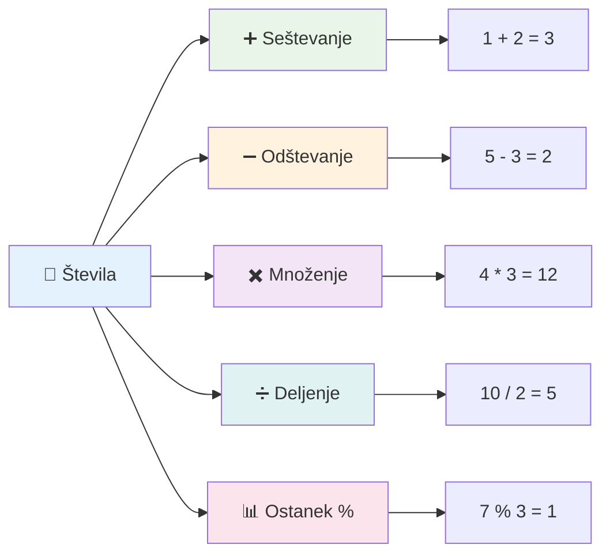
### Aritmetični operatorji

Aritmetični operatorji vam omogočajo izvajanje matematičnih izračunov v JavaScriptu. Ti operatorji sledijo istim pravilom, ki jih uporabljajo matematiki že stoletja – enaki simboli, ki so se pojavljali v delih učenjakov, kot je Al-Khwarizmi, ki je razvil algebraično notacijo.

Operatorji delujejo tako, kot bi pričakovali v tradicionalni matematiki: plus za seštevanje, minus za odštevanje in tako naprej.

Obstaja več vrst operatorjev za aritmetične funkcije; nekaj jih je tukaj:

| Simbol | Opis                                                                    | Primer                          |
| ------ | ------------------------------------------------------------------------ | ------------------------------- |
| `+`    | **Seštevanje**: izračuna vsoto dveh števil                              | `1 + 2 //pričakovan rezultat je 3`   |
| `-`    | **Odštevanje**: izračuna razliko med dvema številoma                    | `1 - 2 //pričakovan rezultat je -1`  |
| `*`    | **Množenje**: izračuna produkt dveh števil                               | `1 * 2 //pričakovan rezultat je 2`   |
| `/`    | **Deljenje**: izračuna količnik dveh števil                              | `1 / 2 //pričakovan rezultat je 0.5` |
| `%`    | **Ostanki**: izračuna ostanek po deljenju dveh števil                   | `1 % 2 //pričakovan rezultat je 1`   |

✅ Poskusite! Poskusite aritmetično operacijo v konzoli vašega brskalnika. Vas rezultati presenetijo?

### 🧮 **Preverjanje matematičnih sposobnosti: Računanje samozavestno**

**Preizkusite svoje znanje aritmetike:**
- Kakšna je razlika med `/` (deljenje) in `%` (ostanek)?
- Ali lahko predvidite, koliko je `10 % 3`? (Namig: ni 3,33...)
- Zakaj bi bil operator za ostanek uporaben v programiranju?

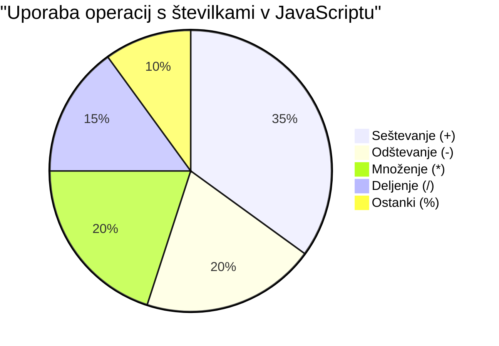
> **Vpogled iz realnega sveta**: Operator za ostanek (%) je zelo uporaben za preverjanje, ali so števila soda/liha, ustvarjanje vzorcev ali ciklični pregled polj!

### Nizi

V JavaScriptu so tekstovni podatki predstavljeni kot nizi (strings). Izraz "string" izvira iz koncepta znakov, ki so povezani v zaporedje, podobno kot so srednjeveški pisarji v samostanih povezovali črke, da so tvorili besede in stavke v svojih rokopisih.

Nizi so temeljnega pomena za spletni razvoj. Vsak kos besedila, ki se prikaže na spletni strani – uporabniška imena, oznake gumbov, sporočila o napakah, vsebina – je obdelan kot niz. Razumevanje nizov je ključno za ustvarjanje funkcionalnih uporabniških vmesnikov.

Nizi so niz znakov, ki so napisani med enojnimi ali dvojnimi narekovaji.

```javascript
'This is a string'
"This is also a string"
let myString = 'This is a string value stored in a variable';
```

**Razumevanje teh konceptov:**
- **Uporablja** lahko enojne `'` ali dvojne `"` narekovaje za definiranje nizov
- **Shranjuje** tekstovne podatke, ki lahko vključujejo črke, številke in simbole
- **Dodeljuje** vrednosti nizov spremenljivkam za kasnejšo uporabo
- **Zahteva** narekovaje, da razlikuje besedilo od imen spremenljivk

Zapomnite si, da morate pri pisanju niza uporabiti narekovaje, sicer bo JavaScript predvideval, da gre za ime spremenljivke.

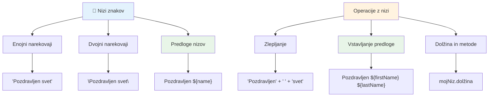
### Oblikovanje nizov

Manipulacija z nizi vam omogoča, da združite besedilne elemente, vključite spremenljivke in ustvarite dinamično vsebino, ki se odziva na stanje programa. Ta tehnika omogoča, da sestavljate besedilo programsko.

Pogosto je treba združiti več nizov skupaj – ta proces imenujemo konkatenacija.
Za **združevanje** dveh ali več nizov, oziroma njihovo združitev, uporabite operator `+`.

```javascript
let myString1 = "Hello";
let myString2 = "World";

myString1 + myString2 + "!"; //Pozdravljen, svet!
myString1 + " " + myString2 + "!"; //Pozdravljen svet!
myString1 + ", " + myString2 + "!"; //Zdravo, svet!
```

**Korak za korakom, to se dogaja:**
- **Združi** več nizov z uporabo operatorja `+`
- **Poveže** nize neposredno skupaj brez presledkov v prvem primeru
- **Doda** znake presledka `" "` med nizi za boljšo berljivost
- **Vstavi** ločila, kot so vejice, za pravilno oblikovanje

✅ Zakaj `1 + 1 = 2` v JavaScript-u, vendar `'1' + '1' = 11`? Razmislite. Kaj pa `'1' + 1`?

**Predloge za nize** so drugačen način oblikovanja nizov, le da namesto narekovajev uporabimo poševno oklepaj `` ` ``. Vse, kar ni navaden tekst, mora biti vključeno v mesta za vstavljanje `${ }`. To vključuje tudi spremenljivke, ki so mogoče nizi.

```javascript
let myString1 = "Hello";
let myString2 = "World";

`${myString1} ${myString2}!` //Pozdravljen svet!
`${myString1}, ${myString2}!` //Pozdravljen, svet!
```

**Razumimo vsako sestavino:**
- **Uporablja** poševne oklepaje `` ` `` namesto običajnih narekovajev za ustvarjanje predlog nizov
- **Vstavi** spremenljivke neposredno z uporabo sintakse `${}`
- **Obdrži** presledke in oblikovanje natanko, kot je napisano
- **Ponuja** čistejši način za ustvarjanje kompleksnih nizov s spremenljivkami

Dosežete lahko svoje cilje oblikovanja z obema metodama, vendar bodo predloge nizov spoštovale vse presledke in prelome vrstic.

✅ Kdaj bi uporabili predlogo niza namesto običajnega niza?

### 🔤 **Preverjanje mojstrstva nizov: Zaupanje pri manipulaciji besedila**

**Ocenite svoje spretnosti z nizi:**
- Ali lahko pojasnite, zakaj `'1' + '1'` daje `'11'` namesto `2`?
- Katero metodo niza imate za bolj berljivo: združevanje ali predloge nizov?
- Kaj se zgodi, če pozabite narekovaje okrog niza?

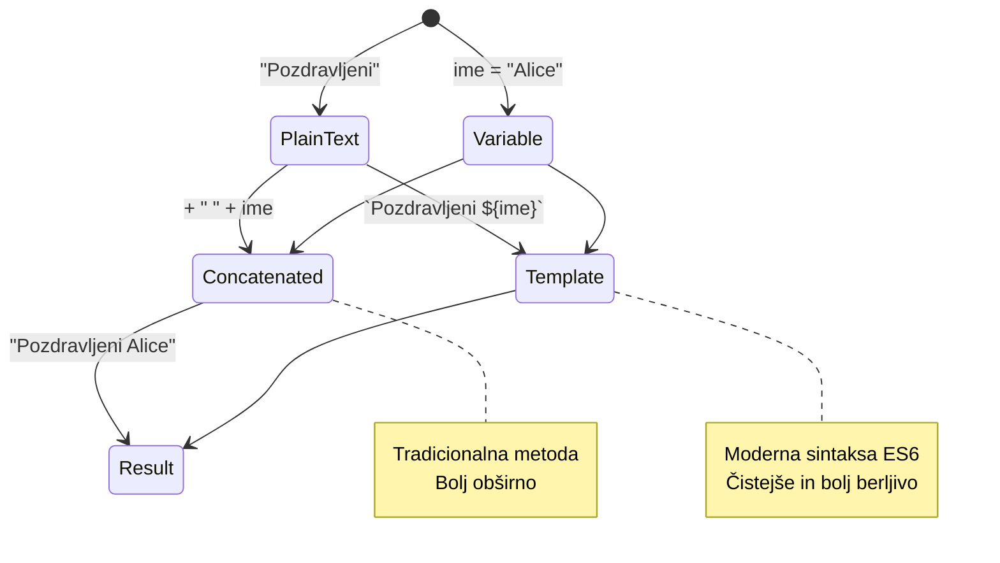
> **Pro namig**: Predloge nizov so običajno bolj priporočljive za kompleksno sestavljanje nizov, ker so bolj berljive in lepo podpirajo večvrstične nize!

### Booleani

Booleani predstavljajo najpreprostejšo obliko podatkov: lahko imajo le eno od dveh vrednosti – `true` ali `false`. Ta binarni logični sistem izhaja iz dela Georgea Boolea, matematik iz 19. stoletja, ki je razvil Booleovo algebro.

Kljub svoji preprostosti so booleani ključni za logiko programov. Omogočajo vaši kodi, da sprejema odločitve na podlagi pogojev – ali je uporabnik prijavljen, ali je bil kliknjen gumb ali ali so izpolnjena določena merila.

Booleani imajo lahko le dve vrednosti: `true` ali `false`. Booleani pomagajo odločiti, katere vrstice kode naj se izvedejo, ko so izpolnjeni določeni pogoji. V mnogih primerih [operatorji](../../../../2-js-basics/1-data-types) pomagajo nastaviti vrednost Boolean in pogosto boste opazili in pisali spremenljivke, ki se inicializirajo ali njihove vrednosti posodabljajo z uporabo operatorja.

```javascript
let myTrueBool = true;
let myFalseBool = false;
```

**Výše jsme:**
- **Ustvarili** spremenljivko, ki shrani Boolean vrednost `true`
- **Prikazali**, kako shraniti Boolean vrednost `false`
- **Uporabili** točne ključne besede `true` in `false` (naričajev ni treba uporabiti)
- **Pripravili** te spremenljivke za uporabo v pogojnih stavkih

✅ Spremenljivko lahko imenujemo 'resnična' (truthy), če se oceni kot boolean `true`. Zanimivo je, da so v JavaScriptu [vse vrednosti resnične, razen če so definirane kot neresnične (falsy)](https://developer.mozilla.org/docs/Glossary/Truthy).

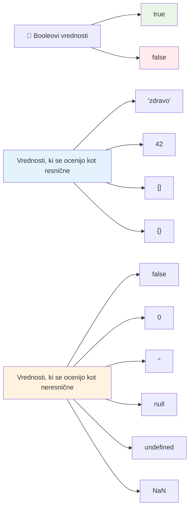
### 🎯 **Preverjanje logike booleanov: Spretnosti odločanja**

**Preizkusite svoje razumevanje booleanov:**
- Zakaj mislite, da ima JavaScript "truthy" in "falsy" vrednosti poleg `true` in `false`?
- Katera od teh vrednosti je falsy: `0`, `"0"`, `[]`, `"false"`?
- Kako so booleani lahko uporabni pri nadzoru toka programa?

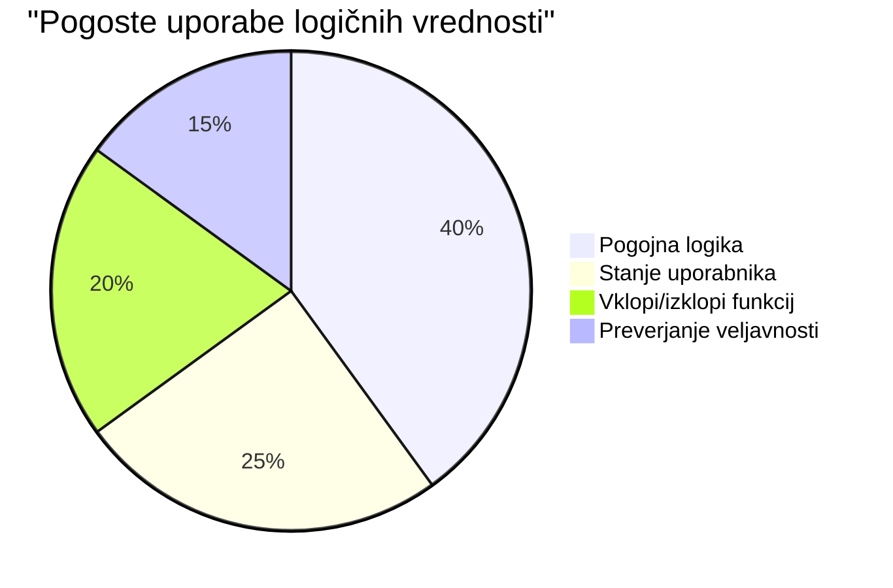
> **Zapomnite si**: V JavaScript-u je le 6 vrednosti falsy: `false`, `0`, `""`, `null`, `undefined` in `NaN`. Vse ostalo je truthy!

---

## 📊 **Povzetek vašega kompleta podatkovnih tipov**

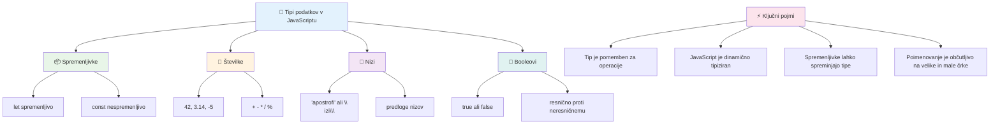
## Izziv GitHub Copilot Agenta 🚀

Uporabite način Agenta za dokončanje naslednjega izziva:

**Opis:** Ustvarite upravitelj osebnih informacij, ki pokaže vse JavaScript podatkovne tipe, ki ste jih spoznali v tej lekciji, medtem ko obravnava scenarije z resničnimi podatki.

**Navodilo:** Napišite JavaScript program, ki ustvari objekt uporabniškega profila, ki vsebuje: ime osebe (niz), starost (številka), status študenta (boolean), najljubše barve kot tabelo in naslov kot objekt z lastnostmi ulice, mesta in poštne številke. Vključite funkcije za prikaz informacij o profilu in posodabljanje posameznih polj. Poskrbite, da boste prikazali združevanje nizov, predloge nizov, aritmetične operacije s starostjo in boolean logiko za status študenta.

Več o [načinu agenta](https://code.visualstudio.com/blogs/2025/02/24/introducing-copilot-agent-mode) izveste tukaj.

## 🚀 Izziv

JavaScript ima nekatere vedenjske posebnosti, ki lahko razvijalce presenetijo. Tukaj je klasičen primer za raziskovanje: poskusite vtipkati v konzolo brskalnika: `let age = 1; let Age = 2; age == Age` in opazujte rezultat. Vrne `false` – lahko ugotovite zakaj?

To je eden od mnogih JavaScript vedenj, ki jih je vredno razumeti. Poznavanje teh posebnosti vam bo pomagalo pisati zanesljivejšo kodo in učinkoviteje odpravljati napake.

## Kviz po predavanju
[Kviz po predavanju](https://ff-quizzes.netlify.app)

## Pregled in samostojno učenje

Oglejte si [ta seznam JavaScript vaj](https://css-tricks.com/snippets/javascript/) in preizkusite eno. Kaj ste se naučili?

## Naloga

[Vaje tipov podatkov](assignment.md)

## 🚀 Vaš časovni načrt za obvladovanje JavaScript podatkovnih tipov

### ⚡ **Kaj lahko naredite v naslednjih 5 minutah**
- [ ] Odprite konzolo brskalnika in ustvarite 3 spremenljivke z različnimi podatkovnimi tipi
- [ ] Poskusite izziv: `let age = 1; let Age = 2; age == Age` in ugotovite, zakaj je rezultat false
- [ ] Vadite združevanje nizov z vašim imenom in najljubšo številko
- [ ] Preizkusite, kaj se zgodi, ko dodate število nizu

### 🎯 **Kaj lahko dosežete v tej uri**
- [ ] Dokončajte kviz po lekciji in preglejte morebitne nejasnosti
- [ ] Ustvarite mini kalkulator, ki sešteva, odšteva, množi in deli dve številki
- [ ] Napišite preprost formatirnik imena z uporabo predlog nizov
- [ ] Raziskujte razlike med `==` in `===` primerjalnimi operatorji
- [ ] Vadite pretvarjanje med različnimi podatkovnimi tipi

### 📅 **Vaša teden dolga osnova za JavaScript**
- [ ] Z zaupanjem in ustvarjalnostjo dokončajte nalogo
- [ ] Ustvarite osebni profil z uporabo vseh naučenih podatkovnih tipov
- [ ] Vadite z [JavaScript vajami s CSS-Tricks](https://css-tricks.com/snippets/javascript/)
- [ ] Napišite preprost validator obrazca z boolean logiko
- [ ] Preizkusite tip podatkov tabel in objektov (predogled prihodnjih lekcij)
- [ ] Pridružite se skupnosti JavaScript in zastavite vprašanja o podatkovnih tipih

### 🌟 **Vaša mesec dni trajajoča preobrazba**
- [ ] Integrirajte znanje o podatkovnih tipih v večje programske projekte
- [ ] Razumite, kdaj in zakaj uporabiti posamezen podatkovni tip v realnih aplikacijah
- [ ] Pomagajte drugim začetnikom razumeti osnove JavaScripta
- [ ] Napišite majhno aplikacijo za upravljanje različnih vrst uporabniških podatkov
- [ ] Raziščite napredne koncepte podatkovnih tipov, kot sta prisilna pretvorba in stroga enakost
- [ ] Prispevajte k odprtokodnim JavaScript projektom z izboljšavami dokumentacije

### 🧠 **Zaključni pregled mojstrstva podatkovnih tipov**

**Praznujte svoje temelje JavaScripta:**
- Kateri podatkovni tip vas je najbolj presenetil glede svojega vedenja?
- Kako udobno se počutite, ko prijatelju razlagate razlike med spremenljivkami in konstantami?
- Kaj je najslabše zanimivo, kar ste odkrili o tipu sistema JavaScripta?
- Katero realno aplikacijo si predstavljate, da bi jo lahko zgradili s temi temelji?

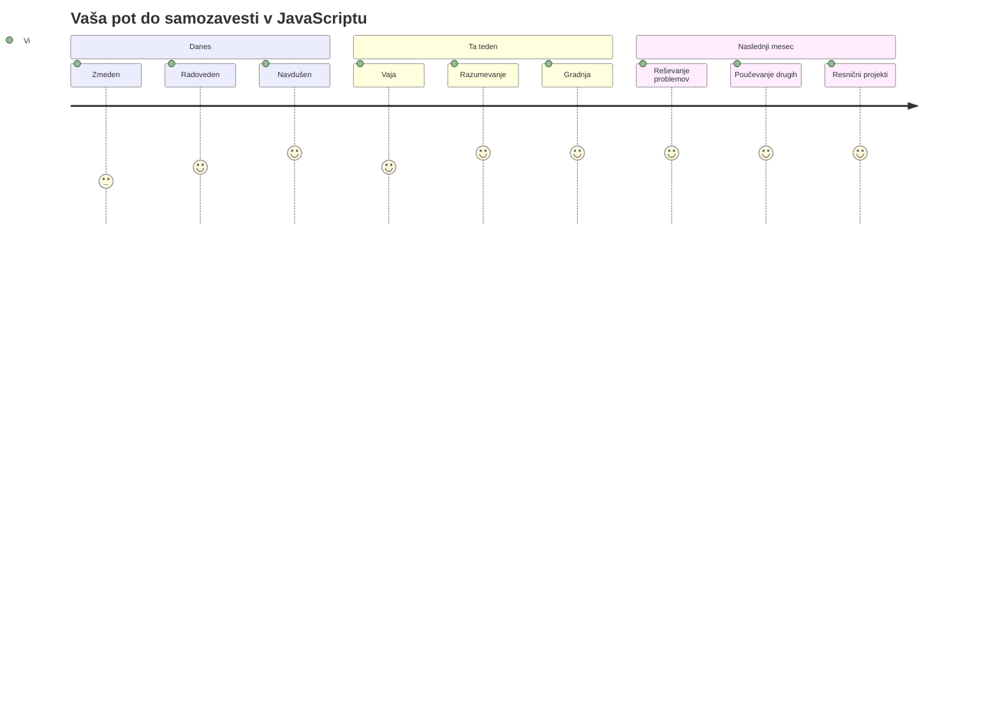
> 💡 **Postavili ste temelje!** Razumevanje podatkovnih tipov je kot učenje abecede pred pisanjem zgodb. Vsak JavaScript program, ki ga boste kdaj napisali, bo uporabil te temeljne koncepte. Zdaj imate gradnike za ustvarjanje interaktivnih spletnih strani, dinamičnih aplikacij in reševanje resničnih problemov s kodo. Dobrodošli v čudoviti svet JavaScripta! 🎉

---

<!-- CO-OP TRANSLATOR DISCLAIMER START -->
**Omejitev odgovornosti**:
Ta dokument je bil preveden z uporabo storitve za prevajanje z umetno inteligenco [Co-op Translator](https://github.com/Azure/co-op-translator). Čeprav si prizadevamo za natančnost, upoštevajte, da avtomatizirani prevodi lahko vsebujejo napake ali netočnosti. Izvirni dokument v njegovem izvirnem jeziku velja za avtoritativni vir. Za pomembne informacije priporočamo strokovni človeški prevod. Za morebitna nesporazume ali napačne interpretacije, ki izhajajo iz uporabe tega prevoda, ne odgovarjamo.
<!-- CO-OP TRANSLATOR DISCLAIMER END -->