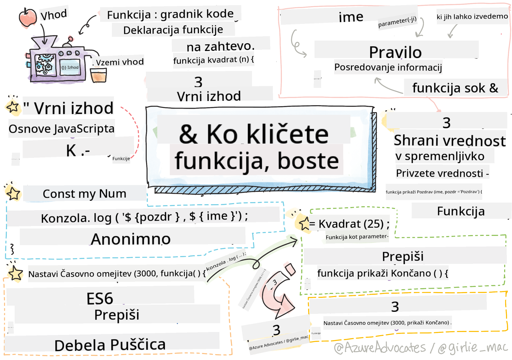

<!--
CO_OP_TRANSLATOR_METADATA:
{
  "original_hash": "b4612bbb9ace984f374fcc80e3e035ad",
  "translation_date": "2025-08-27T22:37:00+00:00",
  "source_file": "2-js-basics/2-functions-methods/README.md",
  "language_code": "sl"
}
-->
# Osnove JavaScripta: Metode in funkcije


> Sketchnote avtorja [Tomomi Imura](https://twitter.com/girlie_mac)

## Predhodni kviz
[Predhodni kviz](https://ashy-river-0debb7803.1.azurestaticapps.net/quiz/9)

Ko razmišljamo o pisanju kode, si vedno želimo zagotoviti, da je naša koda berljiva. Čeprav se to morda sliši nenavadno, je koda prebrana veliko večkrat, kot je napisana. Eden ključnih orodij v razvijalčevem naboru za zagotavljanje vzdržljive kode je **funkcija**.

[](https://youtube.com/watch?v=XgKsD6Zwvlc "Metode in funkcije")

> 🎥 Kliknite zgornjo sliko za video o metodah in funkcijah.

> To lekcijo lahko opravite na [Microsoft Learn](https://docs.microsoft.com/learn/modules/web-development-101-functions/?WT.mc_id=academic-77807-sagibbon)!

## Funkcije

V svojem bistvu je funkcija blok kode, ki ga lahko izvedemo po potrebi. To je idealno za scenarije, kjer moramo večkrat opraviti isto nalogo; namesto da bi logiko podvajali na več mestih (kar bi otežilo posodobitve), jo lahko centraliziramo na enem mestu in jo pokličemo, kadar koli potrebujemo izvedbo operacije – funkcije lahko celo kličete iz drugih funkcij!

Prav tako pomembno je poimenovanje funkcije. Čeprav se to morda zdi nepomembno, ime zagotavlja hiter način dokumentiranja dela kode. To si lahko predstavljate kot nalepko na gumbu. Če kliknem na gumb z napisom "Prekliči časovnik", vem, da bo ustavil delovanje ure.

## Ustvarjanje in klicanje funkcije

Sintaksa za funkcijo je videti takole:

```javascript
function nameOfFunction() { // function definition
 // function definition/body
}
```

Če bi želel ustvariti funkcijo za prikaz pozdrava, bi to izgledalo takole:

```javascript
function displayGreeting() {
  console.log('Hello, world!');
}
```

Kadar koli želimo poklicati (ali sprožiti) našo funkcijo, uporabimo ime funkcije, ki mu sledi `()`. Omeniti velja, da je naša funkcija lahko definirana pred ali po tem, ko jo pokličemo; JavaScript prevajalnik jo bo našel namesto vas.

```javascript
// calling our function
displayGreeting();
```

> **NOTE:** Obstaja posebna vrsta funkcije, znana kot **metoda**, ki ste jo že uporabljali! Pravzaprav smo to videli v naši zgornji predstavitvi, ko smo uporabili `console.log`. Kar razlikuje metodo od funkcije, je to, da je metoda povezana z objektom (v našem primeru `console`), medtem ko je funkcija prosto lebdeča. Veliko razvijalcev te izraze uporablja izmenično.

### Najboljše prakse za funkcije

Pri ustvarjanju funkcij je dobro upoštevati nekaj najboljših praks:

- Kot vedno, uporabljajte opisna imena, da veste, kaj funkcija počne
- Uporabljajte **camelCasing** za združevanje besed
- Naj bodo vaše funkcije osredotočene na določeno nalogo

## Posredovanje informacij funkciji

Da bi funkcija postala bolj uporabna, ji boste pogosto želeli posredovati informacije. Če pogledamo naš primer `displayGreeting`, bo prikazal le **Hello, world!**. To ni najbolj uporabna funkcija, ki bi jo lahko ustvarili. Če jo želimo narediti nekoliko bolj prilagodljivo, na primer omogočiti nekomu, da določi ime osebe, ki jo pozdravljamo, lahko dodamo **parameter**. Parameter (včasih imenovan tudi **argument**) je dodatna informacija, poslana funkciji.

Parametri so navedeni v definiciji znotraj oklepajev in so ločeni z vejicami, kot sledi:

```javascript
function name(param, param2, param3) {

}
```

Našo funkcijo `displayGreeting` lahko posodobimo tako, da sprejme ime in ga prikaže.

```javascript
function displayGreeting(name) {
  const message = `Hello, ${name}!`;
  console.log(message);
}
```

Ko želimo poklicati našo funkcijo in posredovati parameter, ga določimo v oklepajih.

```javascript
displayGreeting('Christopher');
// displays "Hello, Christopher!" when run
```

## Privzete vrednosti

Našo funkcijo lahko naredimo še bolj prilagodljivo z dodajanjem več parametrov. Kaj pa, če ne želimo, da je vsaka vrednost obvezna? Če ostanemo pri našem primeru pozdrava, lahko ime pustimo kot obvezno (potrebujemo vedeti, koga pozdravljamo), vendar želimo omogočiti, da se pozdrav prilagodi po želji. Če nekdo ne želi prilagoditi pozdrava, zagotovimo privzeto vrednost. Privzeto vrednost parametru določimo na podoben način, kot določimo vrednost spremenljivki - `parameterName = 'defaultValue'`. Celoten primer:

```javascript
function displayGreeting(name, salutation='Hello') {
  console.log(`${salutation}, ${name}`);
}
```

Ko pokličemo funkcijo, se lahko odločimo, ali želimo nastaviti vrednost za `salutation`.

```javascript
displayGreeting('Christopher');
// displays "Hello, Christopher"

displayGreeting('Christopher', 'Hi');
// displays "Hi, Christopher"
```

## Vračanje vrednosti

Do zdaj bo funkcija, ki smo jo ustvarili, vedno izpisovala v [konzolo](https://developer.mozilla.org/docs/Web/API/console). Včasih je to točno tisto, kar iščemo, še posebej, ko ustvarjamo funkcije, ki bodo klicale druge storitve. Kaj pa, če želim ustvariti pomožno funkcijo za izvedbo izračuna in vrniti vrednost, da jo lahko uporabim drugje?

To lahko storimo z uporabo **vrnjene vrednosti**. Vrnjena vrednost je vrnjena s funkcijo in jo lahko shranimo v spremenljivko na enak način, kot bi shranili dobesedno vrednost, kot je niz ali število.

Če funkcija nekaj vrne, se uporabi ključna beseda `return`. Ključna beseda `return` pričakuje vrednost ali referenco tistega, kar se vrača, kot sledi:

```javascript
return myVariable;
```  

Lahko ustvarimo funkcijo za ustvarjanje sporočila pozdrava in vrnemo vrednost klicatelju.

```javascript
function createGreetingMessage(name) {
  const message = `Hello, ${name}`;
  return message;
}
```

Ko pokličemo to funkcijo, bomo vrednost shranili v spremenljivko. To je zelo podobno, kot bi nastavili spremenljivko na statično vrednost (na primer `const name = 'Christopher'`).

```javascript
const greetingMessage = createGreetingMessage('Christopher');
```

## Funkcije kot parametri za funkcije

Ko boste napredovali v svoji programerski karieri, boste naleteli na funkcije, ki sprejemajo funkcije kot parametre. Ta zanimiv trik se pogosto uporablja, ko ne vemo, kdaj se bo nekaj zgodilo ali zaključilo, vendar vemo, da moramo izvesti operacijo kot odziv.

Kot primer si oglejmo [setTimeout](https://developer.mozilla.org/docs/Web/API/WindowOrWorkerGlobalScope/setTimeout), ki začne časovnik in bo izvedel kodo, ko se časovnik zaključi. Povedati mu moramo, katero kodo želimo izvesti. Zveni kot popolna naloga za funkcijo!

Če zaženete spodnjo kodo, boste po 3 sekundah videli sporočilo **3 sekunde so pretekle**.

```javascript
function displayDone() {
  console.log('3 seconds has elapsed');
}
// timer value is in milliseconds
setTimeout(displayDone, 3000);
```

### Anonimne funkcije

Poglejmo še enkrat, kaj smo zgradili. Ustvarjamo funkcijo z imenom, ki bo uporabljena samo enkrat. Ko naša aplikacija postane bolj zapletena, si lahko predstavljamo, da bomo ustvarili veliko funkcij, ki bodo uporabljene samo enkrat. To ni idealno. Kot se izkaže, imena vedno ni treba podati!

Ko funkcijo posredujemo kot parameter, lahko preskočimo njeno predhodno ustvarjanje in jo namesto tega zgradimo kot del parametra. Uporabimo isto ključno besedo `function`, vendar jo zgradimo kot parameter.

Prepišimo zgornjo kodo, da uporabimo anonimno funkcijo:

```javascript
setTimeout(function() {
  console.log('3 seconds has elapsed');
}, 3000);
```

Če zaženete našo novo kodo, boste opazili, da dobimo enake rezultate. Ustvarili smo funkcijo, vendar ji nismo morali dati imena!

### Fat arrow funkcije

Ena od bližnjic, ki je pogosta v mnogih programskih jezikih (vključno z JavaScriptom), je možnost uporabe tako imenovane **arrow** ali **fat arrow** funkcije. Uporablja poseben indikator `=>`, ki izgleda kot puščica - od tod tudi ime! Z uporabo `=>` lahko preskočimo ključno besedo `function`.

Prepišimo našo kodo še enkrat, da uporabimo fat arrow funkcijo:

```javascript
setTimeout(() => {
  console.log('3 seconds has elapsed');
}, 3000);
```

### Kdaj uporabiti katero strategijo

Zdaj ste videli tri načine za posredovanje funkcije kot parametra in se morda sprašujete, kdaj uporabiti katerega. Če veste, da boste funkcijo uporabili več kot enkrat, jo ustvarite na običajen način. Če jo boste uporabili samo na enem mestu, je običajno najbolje uporabiti anonimno funkcijo. Ali boste uporabili fat arrow funkcijo ali bolj tradicionalno sintakso `function`, je odvisno od vas, vendar boste opazili, da večina sodobnih razvijalcev raje uporablja `=>`.

---

## 🚀 Izziv

Ali lahko v enem stavku razložite razliko med funkcijami in metodami? Poskusite!

## Kviz po predavanju
[Kviz po predavanju](https://ashy-river-0debb7803.1.azurestaticapps.net/quiz/10)

## Pregled in samostojno učenje

Vredno je [prebrati več o fat arrow funkcijah](https://developer.mozilla.org/docs/Web/JavaScript/Reference/Functions/Arrow_functions), saj se vse pogosteje uporabljajo v kodnih bazah. Vadite pisanje funkcije in jo nato prepišite s to sintakso.

## Naloga

[Zabava s funkcijami](assignment.md)

---

**Omejitev odgovornosti**:  
Ta dokument je bil preveden z uporabo storitve za strojno prevajanje [Co-op Translator](https://github.com/Azure/co-op-translator). Čeprav si prizadevamo za natančnost, vas prosimo, da se zavedate, da lahko avtomatizirani prevodi vsebujejo napake ali netočnosti. Izvirni dokument v njegovem izvirnem jeziku je treba obravnavati kot avtoritativni vir. Za ključne informacije priporočamo strokovno človeško prevajanje. Ne prevzemamo odgovornosti za morebitna nesporazumevanja ali napačne razlage, ki izhajajo iz uporabe tega prevoda.