<!--
CO_OP_TRANSLATOR_METADATA:
{
  "original_hash": "71f7d7dafa1c7194d79ddac87f669ff9",
  "translation_date": "2026-01-07T09:52:27+00:00",
  "source_file": "2-js-basics/2-functions-methods/README.md",
  "language_code": "sl"
}
-->
# Osnove JavaScript: Metode in funkcije

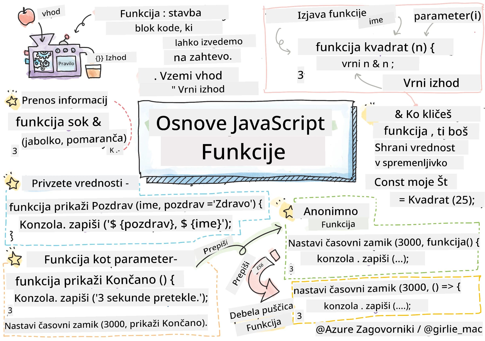
> Sketchnote avtorice [Tomomi Imura](https://twitter.com/girlie_mac)

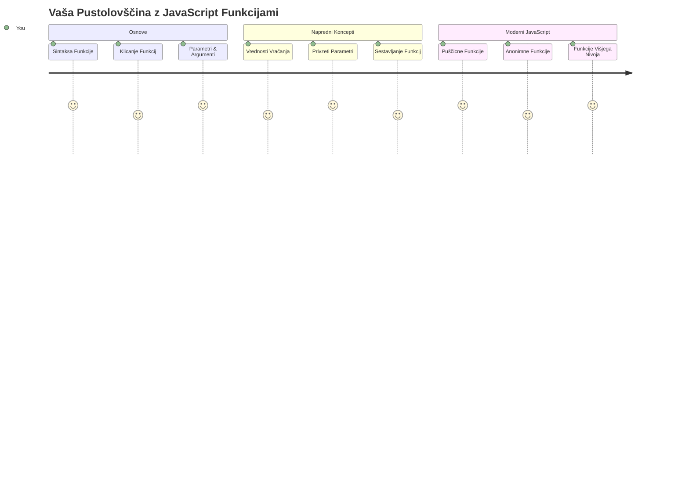
## Predpredavanje Kvizec
[Predpredavanje kvizec](https://ff-quizzes.netlify.app)

Ponovno pisanje iste kode je ena izmed najpogostejših frustracij programiranja. Funkcije rešujejo ta problem tako, da vam omogočajo pakiranje kode v ponovno uporabne bloke. Pomislite na funkcije kot na standardizirane dele, ki so Henryja Forda naredili revolucionarja na proizvodni liniji – ko ustvarite zanesljivo komponento, jo lahko uporabljate kjerkoli brez ponovnega gradjenja od začetka.

Funkcije vam dovoljujejo, da združite dele kode, ki jih lahko ponovno uporabite v celotnem programu. Namesto da povsod kopirate in prilepite isto logiko, lahko funkcijo ustvarite enkrat in jo pokličete, kadar je to potrebno. Ta pristop ohranja vašo kodo organizirano in posodobitve postanejo veliko lažje.

V tem pouku se boste naučili, kako ustvariti svoje funkcije, vanje posredovati informacije in dobiti koristne rezultate nazaj. Spoznali boste razliko med funkcijami in metodami, se naučili sodobnih sintaktičnih pristopov in videli, kako lahko funkcije delujejo z drugimi funkcijami. Te koncepte bomo gradili korak za korakom.

[](https://youtube.com/watch?v=XgKsD6Zwvlc "Metode in funkcije")

> 🎥 Kliknite zgornjo sliko za video o metodah in funkcijah.

> Ta lekcija je na voljo tudi na [Microsoft Learn](https://docs.microsoft.com/learn/modules/web-development-101-functions/?WT.mc_id=academic-77807-sagibbon)!

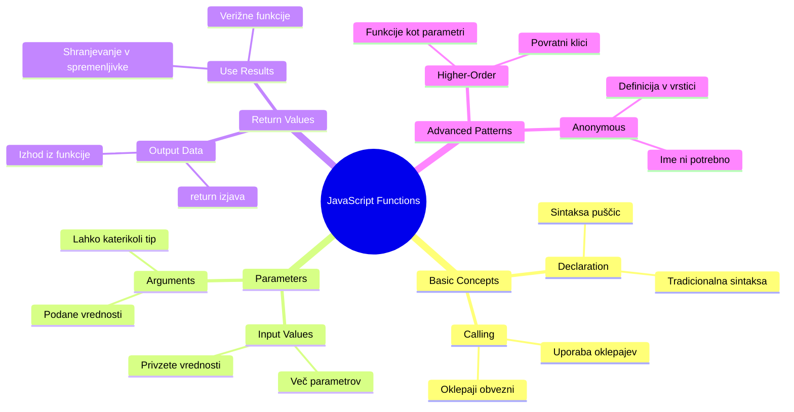
## Funkcije

Funkcija je samostojen blok kode, ki opravlja določen nalogo. Vsebuje logiko, ki jo lahko izvršite kadar koli je to potrebno.

Namesto da pišete isto kodo večkrat v programu, jo lahko zapakirate v funkcijo in to funkcijo pokličete, kadar jo potrebujete. Ta pristop ohranja kodo čisto in olajša posodobitve. Predstavljajte si izziv vzdrževanja, če bi morali spremeniti logiko, ki je razširjena na 20 različnih mestih v vaši kodi.

Pomembno je, da funkcije poimenujete opisno. Dobro poimenovana funkcija jasno pove, kaj počne – ko vidite `cancelTimer()`, takoj razumete, kaj dela, prav tako kot jasno označen gumb povečnočno, kaj se bo zgodilo, ko nanj kliknete.

## Ustvarjanje in klic funkcije

Oglejmo si, kako ustvariti funkcijo. Sintaksa sledi doslednemu vzorcu:

```javascript
function nameOfFunction() { // definicija funkcije
 // definicija/telo funkcije
}
```

Pojasnimo to:
- Ključna beseda `function` JavaScriptu sporoči "Hej, ustvarjam funkcijo!"
- `nameOfFunction` je mesto, kjer funkciji daste opisno ime
- Oklepaji `()` so tam, kjer lahko dodate parametre (k temu bomo kmalu prišli)
- Zavite oklepaje `{}` vsebujejo dejansko kodo, ki se izvede, ko pokličete funkcijo

Ustvarimo enostavno funkcijo za pozdrav, da vidimo to v praksi:

```javascript
function displayGreeting() {
  console.log('Hello, world!');
}
```

Ta funkcija izpiše "Hello, world!" v konzolo. Ko jo definirate, jo lahko uporabite tolikokrat, kolikor potrebujete.

Da izvršite (ali "pokličete") funkcijo, napišete njeno ime za katerim sledijo oklepaji. JavaScript vam omogoča, da funkcijo definirate pred ali po njenem klicu – JavaScript motor bo poskrbel za vrstni red izvrševanja.

```javascript
// klicanje naše funkcije
displayGreeting();
```

Ko zaženete to vrstico, se izvrši vsa koda znotraj vaše funkcije `displayGreeting`, ki prikaže "Hello, world!" v konzoli vašega brskalnika. To funkcijo lahko kličete večkrat.

### 🧠 **Osnove funkcij: Izgradnja prvih funkcij**

**Preverimo, kako vam gre z osnovami funkcij:**
- Ali znate razložiti, zakaj uporabljamo zavite oklepaje `{}` pri definiciji funkcij?
- Kaj se zgodi, če napišete `displayGreeting` brez oklepajev?
- Zakaj bi hoteli isto funkcijo klicati večkrat?

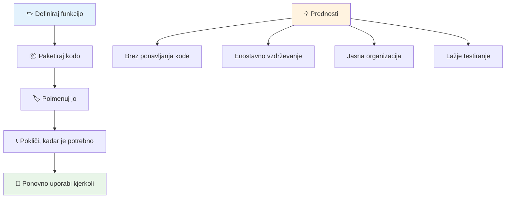
> **Opomba:** V teh lekcijah ste uporabljali **metode**. `console.log()` je metoda – to je funkcija, ki pripada objektu `console`. Ključna razlika je, da so metode vezane na objekte, medtem ko funkcije delujejo samostojno. Veliko programerjev uporablja ta izraza izmenično v vsakodnevnih pogovorih.

### Dobre prakse za funkcije

Tu je nekaj nasvetov, ki vam bodo pomagali pisati odlične funkcije:

- Dajte funkcijam jasna, opisna imena – vaša bodoča različica vam bo hvaležna!
- Uporabljajte **camelCase** za večbesedna imena (npr. `calculateTotal` namesto `calculate_total`)
- Poskrbite, da bo vsaka funkcija osredotočena na to, da opravi eno stvar dobro

## Posredovanje informacij funkciji

Naša funkcija `displayGreeting` je omejena – lahko izpiše le "Hello, world!" za vse. Parametri nam omogočajo, da funkcije naredimo bolj prilagodljive in uporabne.

**Parametri** delujejo kot nadomestna mesta, kamor lahko vstavite različne vrednosti vsakič, ko funkcijo pokličete. Tako ista funkcija lahko dela z različnimi informacijami ob vsakem klicu.

Parametre naštejete znotraj oklepajev, ko definirate funkcijo, pri več parametrih jih ločite z vejicami:

```javascript
function name(param, param2, param3) {

}
```

Vsak parameter deluje kot nadomestno mesto – ko nekdo pokliče vašo funkcijo, poda dejanske vrednosti, ki jih vstavimo na ta mesta.

Posodobimo našo funkcijo za pozdrav, da bo sprejela nečije ime:

```javascript
function displayGreeting(name) {
  const message = `Hello, ${name}!`;
  console.log(message);
}
```

Opazite, da uporabljamo poševni naglas (`` ` ``) in `${}`, da neposredno vstavimo ime v sporočilo – temu pravimo literalni niz (template literal) in je zelo praktičen način za sestavljanje nizov z vključenimi spremenljivkami.

Zdaj, ko kličemo funkcijo, lahko predajamo katerokoli ime:

```javascript
displayGreeting('Christopher');
// prikaže "Pozdravljen, Christopher!" ob zagonu
```

JavaScript vzame niz `'Christopher'`, ga dodeli parametru `name` in ustvari personalizirano sporočilo "Hello, Christopher!"

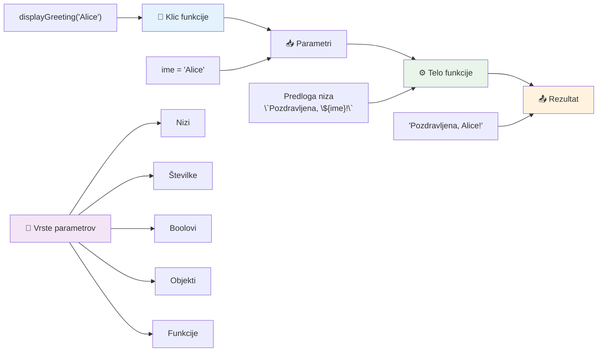
## Privzete vrednosti

Kaj, če želimo nekatere parametre narediti neobvezne? Takrat pridejo prav privzete vrednosti!

Recimo, da želimo, da ljudje lahko prilagodijo pozdravno besedo, a če je ne navedejo, uporabimo privzeto "Hello". Privzete vrednosti nastavimo z enačajem, podobno kot se nastavi spremenljivka:

```javascript
function displayGreeting(name, salutation='Hello') {
  console.log(`${salutation}, ${name}`);
}
```

Tukaj je `name` še vedno obvezen, `salutation` pa ima rezervno vrednost `'Hello'`, če nihče ne poda drugega pozdrava.

Zdaj lahko funkcijo kličemo na dva različna načina:

```javascript
displayGreeting('Christopher');
// prikaže "Pozdravljeni, Christopher"

displayGreeting('Christopher', 'Hi');
// prikaže "Živjo, Christopher"
```

V prvem klicu JavaScript uporabi privzeto "Hello", saj pozdrava nismo določili. V drugem klicu uporabi naš poljubni "Hi". Ta prilagodljivost naredi funkcije primerne za različne situacije.

### 🎛️ **Preverjanje obvladovanja parametrov: Naredimo funkcije prilagodljive**

**Preizkusite svoje znanje o parametrih:**
- Kakšna je razlika med parametrom in argumentom?
- Zakaj so privzete vrednosti uporabne v realnem programiranju?
- Ali lahko napoveste, kaj se zgodi, če podate več argumentov kot je parametrov?

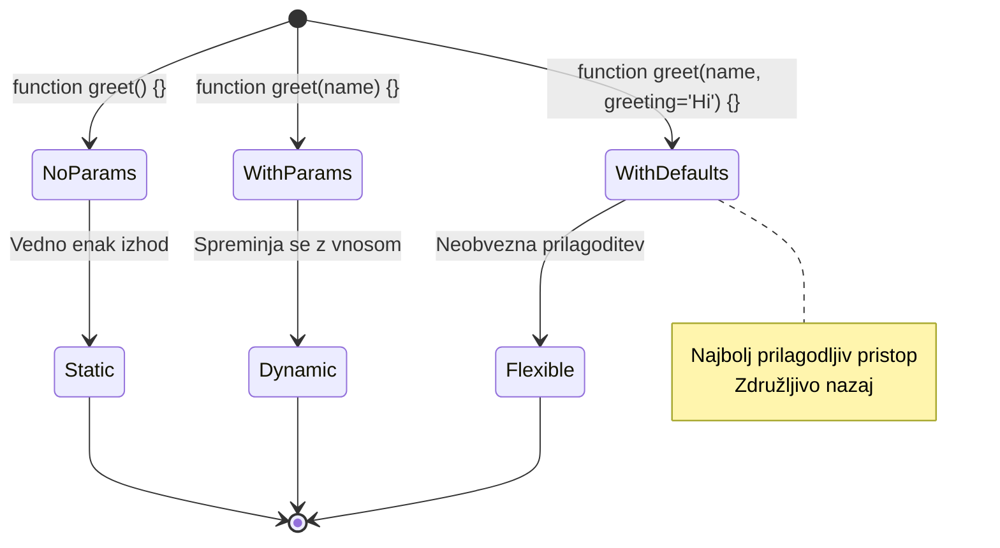
> **Profesionalni nasvet**: Privzeti parametri naredijo vaše funkcije prijaznejše uporabnikom. Uporabniki lahko hitro začnejo z razumljivimi privzetimi vrednostmi, a jih še vedno prilagodijo, kadar želijo!

## Vrednosti vračanja

Doslej so naše funkcije le izpisovale sporočila v konzolo, ampak kaj, če želite, da funkcija izračuna nekaj in vam vrne rezultat?

Tu pridejo v poštev **vrednosti vračanja**. Namesto, da bi nekaj samo prikazala, vam funkcija lahko vrne vrednost, ki jo lahko shranite v spremenljivko ali uporabite v drugih delih kode.

Vrednost vrnete z uporabo ključne besede `return`, za katero napišete, kaj želite vrniti:

```javascript
return myVariable;
```

Pomembno: ko funkcija naleti na `return`, takoj preneha z izvajanjem in pošlje vrednost nazaj tistemu, ki jo je poklical.

Posodobimo našo funkcijo za pozdrav, da nam sporočilo vrne, namesto da ga izpiše:

```javascript
function createGreetingMessage(name) {
  const message = `Hello, ${name}`;
  return message;
}
```

Zdaj ta funkcija ne izpiše pozdrava, ampak ga ustvari in nam ga vrne.

Vrnjeno vrednost lahko shranimo v spremenljivko kot katerokoli drugo vrednost:

```javascript
const greetingMessage = createGreetingMessage('Christopher');
```

Zdaj `greetingMessage` vsebuje "Hello, Christopher" in ga lahko uporabimo kjerkoli v naši kodi – za prikaz na spletni strani, vključno v emailu, ali pa ga posredujemo drugi funkciji.

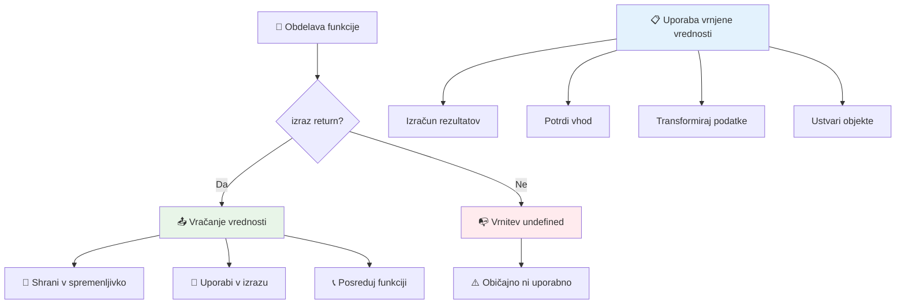
### 🔄 **Preverjanje vrednosti vračanja: Prejemanje rezultatov nazaj**

**Ocenite svoje razumevanje vrednosti vračanja:**
- Kaj se zgodi z ostalo kodo po `return` v funkciji?
- Zakaj je vračanje vrednosti pogosto boljše kot le izpisovanje v konzolo?
- Ali funkcija lahko vrne različne tipe vrednosti (nize, številke, boolove)?

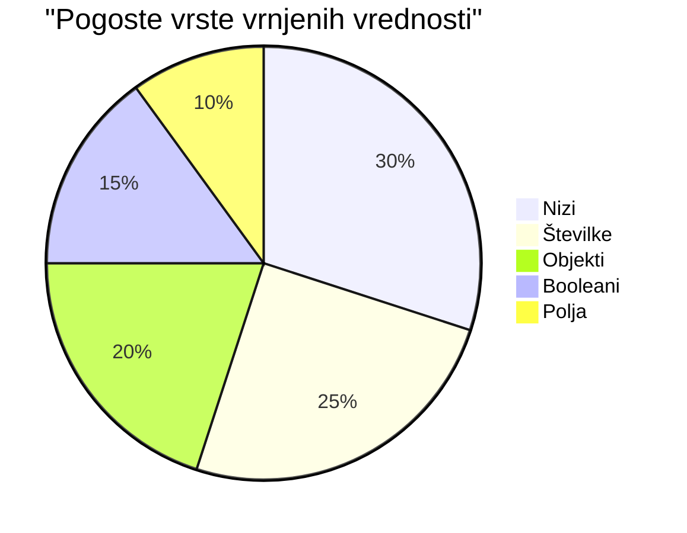
> **Ključni vpogled**: Funkcije, ki vračajo vrednosti, so bolj vsestranske, ker klicatelj odloča, kaj bo s rezultatom naredil. To naredi vašo kodo bolj modularno in ponovno uporabno!

## Funkcije kot parametri za funkcije

Funkcije lahko posredujemo kot parametre drugim funkcijam. Čeprav je ta koncept sprva lahko zapleten, je izjemno zmogljiva lastnost, ki omogoča prilagodljive programske vzorce.

Ta vzorec je zelo pogost, ko želite reči "ko se nekaj zgodi, naredi to drugo stvar". Na primer, "ko timer zmanjka, zaženi to kodo" ali "ko uporabnik klikne gumb, pokliči to funkcijo."

Poglejmo `setTimeout`, ki je vgrajena funkcija, ki počaka določen čas in potem izvede kodo. Moramo ji povedati, katero kodo naj zažene – tu je odlična priložnost, da posredujemo funkcijo!

Poskusite to kodo – po 3 sekundah se prikaže sporočilo:

```javascript
function displayDone() {
  console.log('3 seconds has elapsed');
}
// vrednost časovnika je v milisekundah
setTimeout(displayDone, 3000);
```

Opazite, da `displayDone` posredujemo brez oklepajev v `setTimeout`. Ne kličemo funkcije sami – jo predamo `setTimeout` in rečemo "pokliči to čez 3 sekunde."

### Anonimne funkcije

Včasih potrebujete funkcijo za eno stvar in ji nočete dati imena. Pomislite – če funkcijo uporabljate le enkrat, zakaj bi v kodi zapolnjevali prostor z dodatnim imenom?

JavaScript omogoča ustvarjanje **anonimnih funkcij** – funkcij brez imen, ki jih definirate takoj tam, kjer jih potrebujete.

Tako lahko prepišemo naš primer timerja z anonimno funkcijo:

```javascript
setTimeout(function() {
  console.log('3 seconds has elapsed');
}, 3000);
```

To doseže isti rezultat, le da je funkcija definirana neposredno znotraj klica `setTimeout`, kar odpravlja potrebo po ločeni deklaraciji.

### Debele puščice (arrow functions)

Sodobni JavaScript ima še krajši način pisanja funkcij, imenovan **puščicne funkcije**. Uporabljajo `=>` (izgleda kot puščica – razumete?) in so izjemno priljubljene med razvijalci.

Puščicne funkcije vam dovoljujejo, da izpustite ključne besede `function` in napišete bolj jedrnato kodo.

Tukaj je naš primer timerja s puščicno funkcijo:

```javascript
setTimeout(() => {
  console.log('3 seconds has elapsed');
}, 3000);
```

`()` so tam, kjer bi šli parametri (v tem primeru prazni), sledi puščica `=>`, nato telo funkcije v zavitih oklepajih. To zagotavlja isto funkcionalnost z bolj jedrnatim zapisom.

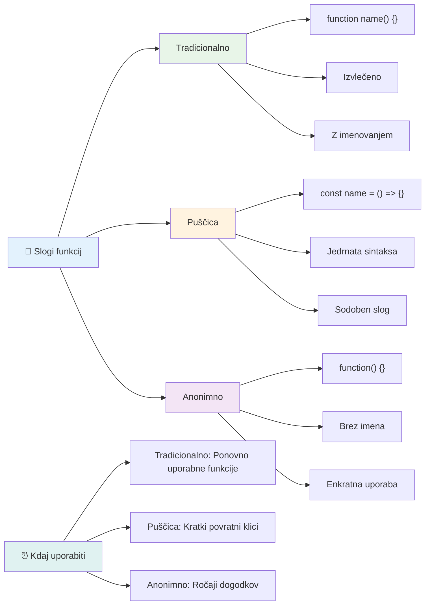
### Kdaj uporabiti kateri pristop

Kdaj uporabiti kateri način? Praktično pravilo pravi: če boste funkcijo uporabljali večkrat, poimenujte jo in definirajte ločeno. Če je za enkratno uporabo, razmislite o anonimni funkciji. Oba načina, tako puščicne kot tradicionalne funkcije, sta pravilna izbira, čeprav so puščicne funkcije pogosto prevladujoč način v sodobnih JavaScript projektih.

### 🎨 **Preverjanje obvladovanja stilov funkcij: Izbira prave sintakse**

**Preizkusite znanje o sintaksi:**
- Kdaj bi raje uporabili puščicne funkcije kot tradicionalne funkcije?
- Kakšna je glavna prednost anonimnih funkcij?
- Ali poznate situacijo, kjer je poimenovana funkcija boljša od anonimne?

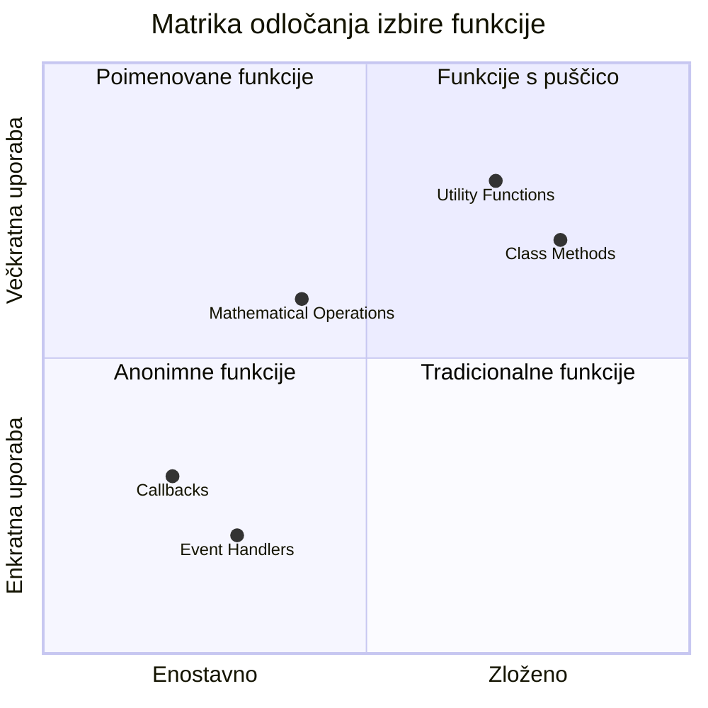
> **Sodobni trend**: Puščicne funkcije postajajo privzeta izbira mnogih razvijalcev zaradi njihove jedrnate sintakse, vendar imajo tradicionalne funkcije še vedno svoj pomen!

---


## 🚀 Izziv

Ali lahko v eni povedi artikulirate razliko med funkcijami in metodami? Poskusite!

## GitHub Copilot Agent Izziv 🚀

Uporabite Agent način za izpolnitev naslednjega izziva:

**Opis:** Ustvarite knjižnico matematičnih funkcij, ki prikazuje različne koncepte funkcij, pokrite v tej lekciji, vključno s parametri, privzetimi vrednostmi, vrednostmi vračanja in puščicnimi funkcijami.

**Navodilo:** Ustvarite datoteko JavaScript z imenom `mathUtils.js`, ki vsebuje naslednje funkcije:
1. Funkcija `add`, ki sprejme dva parametra in vrne njun seštevek
2. Funkcija `multiply` z privzetimi vrednostmi parametrov (drugi parameter privzeto 1)
3. Puščicna funkcija `square`, ki sprejme številko in vrne njen kvadrat
4. Funkcija `calculate`, ki sprejme drugo funkcijo kot parameter in dve številki, nato uporabi funkcijo na teh številkah
5. Prikažite klice vseh funkcij z ustreznimi testnimi primeri

Več o [agent načinu](https://code.visualstudio.com/blogs/2025/02/24/introducing-copilot-agent-mode) si preberite tukaj.

## Kvizec po predavanju
[Kvizec po predavanju](https://ff-quizzes.netlify.app)

## Pregled & Samostojno učenje

Vredno je [prebrati nekaj več o puščicnih funkcijah](https://developer.mozilla.org/docs/Web/JavaScript/Reference/Functions/Arrow_functions), saj se jih vedno bolj uporablja v kodnih zbirkah. Vadite pisanje funkcije in nato njeno prepisovanje s tem zapisom.

## Domača naloga

[Zabava s funkcijami](assignment.md)

---

## 🧰 **Povzetek vašega kompleta orodij JavaScript funkcij**

```mermaid
graph TD
    A["🎯 JavaScript Funkcije"] --> B["📋 Deklaracija funkcije"]
    A --> C["📥 Parametri"]
    A --> D["📤 Vrednosti vrnitve"]
    A --> E["🎨 Sodobna sintaksa"]
    
    B --> B1["function ime() {}"]
    B --> B2["Opisno poimenovanje"]
    B --> B3["Večkrat uporabni bloki kode"]
    
    C --> C1["Vhodni podatki"]
    C --> C2["Privzete vrednosti"]
    C --> C3["Več parametrov"]
    
    D --> D1["izjavi return"]
    D --> D2["Izhod iz funkcije"]
    D --> D3["Prenos podatkov nazaj"]
    
    E --> E1["Puščicna funkcija: () =>"]
    E --> E2["Anonimne funkcije"]
    E --> E3["Funkcije višjega reda"]
    
    F["⚡ Ključne prednosti"] --> F1["Ponavljajoča se uporaba kode"]
    F --> F2["Boljša organizacija"]
    F --> F3["Lažje testiranje"]
    F --> F4["Modularna zasnova"]
    
    style A fill:#e3f2fd
    style B fill:#e8f5e8
    style C fill:#fff3e0
    style D fill:#f3e5f5
    style E fill:#e0f2f1
    style F fill:#fce4ec
```
---

## 🚀 Časovnica za obvladovanje JavaScript funkcij

### ⚡ **Kaj lahko naredite v naslednjih 5 minutah**
- [ ] Napišite enostavno funkcijo, ki vrne vaše najljubše število
- [ ] Ustvarite funkcijo z dvema parametroma, ki ju sešteje skupaj
- [ ] Poskusi pretvoriti tradicionalno funkcijo v sintakso puščic
- [ ] Vadite izziv: pojasnite razliko med funkcijami in metodami

### 🎯 **Kaj lahko dosežete to uro**
- [ ] Dokončajte kviz po lekciji in preglejte morebitne zmedene pojme
- [ ] Zgradite knjižnico matematičnih pripomočkov iz izziva GitHub Copilot
- [ ] Ustvarite funkcijo, ki kot parameter uporablja drugo funkcijo
- [ ] Vadite pisanje funkcij z privzetimi parametri
- [ ] Preizkusite predloge nizov v vrednostih, ki jih funkcije vračajo

### 📅 **Vaša teden dni trajajoča mojstrska vaja funkcij**
- [ ] Dokončajte nalogo "Zabava s funkcijami" s kreativnostjo
- [ ] Preoblikujte nekaj ponavljajoče se kode, ki ste jo napisali, v ponovno uporabne funkcije
- [ ] Zgradite majhen kalkulator, ki uporablja samo funkcije (brez globalnih spremenljivk)
- [ ] Vadite funkcije puščic s metodami polja, kot sta `map()` in `filter()`
- [ ] Ustvarite zbirko pripomočnih funkcij za pogoste naloge
- [ ] Študirajte višje funkcije in koncepte funkcionalnega programiranja

### 🌟 **Vaša mesečna preobrazba**
- [ ] Obvladajte napredne koncepte funkcij, kot so zaprti nabiralniki in doseg
- [ ] Zgradite projekt, ki močno uporablja sestavljanje funkcij
- [ ] Prispevajte k odprtokodnim projektom z izboljšanjem dokumentacije funkcij
- [ ] Poučite nekoga drugega o funkcijah in različnih slogih sintakse
- [ ] Raziščite paradigme funkcionalnega programiranja v JavaScriptu
- [ ] Ustvarite osebno knjižnico ponovno uporabnih funkcij za prihodnje projekte

### 🏆 **Zaključni pregled prvaka funkcij**

**Praznujte svojo mojstrstvo funkcij:**
- Katera je najbolj uporabna funkcija, ki ste jo doslej ustvarili?
- Kako vam je učenje o funkcijah spremenilo način razmišljanja o organizaciji kode?
- Katero sintakso funkcij imate raje in zakaj?
- Katerega resničnega problema bi rešili z napisano funkcijo?

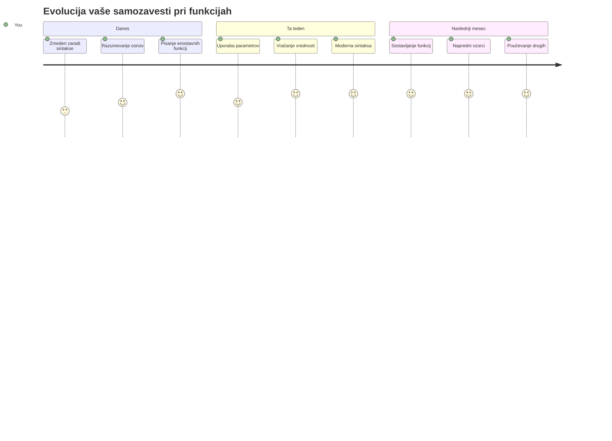
> 🎉 **Obvladali ste enega najmočnejših konceptov programiranja!** Funkcije so gradniki večjih programov. Vsaka aplikacija, ki jo boste kdajkoli ustvarili, bo uporabljala funkcije za organizacijo, ponovno uporabo in strukturiranje kode. Zdaj razumete, kako logiko zapakirati v ponovno uporabne komponente, kar vas naredi bolj učinkovitega in uspešnega programerja. Dobrodošli v svet modularnega programiranja! 🚀

---

<!-- CO-OP TRANSLATOR DISCLAIMER START -->
**Omejitev odgovornosti**:
Ta dokument je bil preveden z uporabo AI prevajalske storitve [Co-op Translator](https://github.com/Azure/co-op-translator). Čeprav si prizadevamo za natančnost, vas opozarjamo, da lahko avtomatski prevodi vsebujejo napake ali netočnosti. Izvirni dokument v njegovem matičnem jeziku naj se šteje za avtoritativni vir. Za ključne informacije je priporočljiv strokovni človeški prevod. Nismo odgovorni za morebitna nesporazume ali napačne razlage, ki izhajajo iz uporabe tega prevoda.
<!-- CO-OP TRANSLATOR DISCLAIMER END -->