<!--
CO_OP_TRANSLATOR_METADATA:
{
  "original_hash": "c688385d15dd3645e924ea0ffee8967f",
  "translation_date": "2026-01-07T09:56:01+00:00",
  "source_file": "2-js-basics/3-making-decisions/README.md",
  "language_code": "sl"
}
-->
# Osnove JavaScript-a: Sprejemanje odločitev


> Sketchnote avtorice [Tomomi Imura](https://twitter.com/girlie_mac)

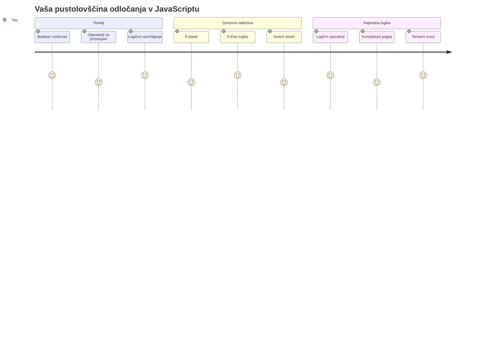
Ste se kdaj spraševali, kako aplikacije sprejemajo pametne odločitve? Na primer, kako navigacijski sistem izbere najhitrejšo pot ali kako termostat odloča, kdaj vključiti ogrevanje? To je temeljni koncept sprejemanja odločitev v programiranju.

Tako kot je bil Analitični stroj Charlesa Babbagea zasnovan za izvajanje različnih zaporedij operacij glede na pogoje, morajo tudi sodobni JavaScript programi sprejemati odločitve glede na različne okoliščine. Ta sposobnost vejitve in sprejemanja odločitev je tista, ki statično kodo spremeni v odzivne, inteligentne aplikacije.

V tej lekciji se boste naučili, kako v svoje programe vključiti pogojno logiko. Raziskali bomo pogojne stavke, primerjalne operatorje in logične izraze, ki vašemu kodu omogočajo, da ovrednoti situacije in se ustrezno odzove.

## Predpredavanja kviz

[Predpredavanja kviz](https://ff-quizzes.netlify.app/web/quiz/11)

Sposobnost sprejemanja odločitev in nadzora poteka programa je temeljni vidik programiranja. Ta razdelek pokriva, kako nadzorovati izvedbeni potek vaših JavaScript programov z uporabo Boolean vrednosti in pogojne logike.

[](https://youtube.com/watch?v=SxTp8j-fMMY "Making Decisions")

> 🎥 Kliknite zgornjo sliko za video o sprejemanju odločitev.

> To lekcijo lahko opravite na [Microsoft Learn](https://docs.microsoft.com/learn/modules/web-development-101-if-else/?WT.mc_id=academic-77807-sagibbon)!

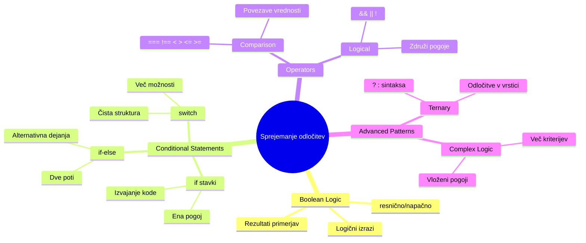
## Kratek pregled Boolean vrednosti

Preden se lotimo sprejemanja odločitev, si osvežimo Boolean vrednosti iz prejšnje lekcije. Poimenovane so po matematiku Georgeu Booleu in predstavljajo binarna stanja – bodisi `true` ali `false`. Ni dvoumnosti, ni srede.

Te binarne vrednosti tvorijo temelj vse računalniške logike. Vsaka odločitev, ki jo vaš program sprejme, se na koncu reducira na Boolean evalvacijo.

Ustvarjanje Boolean spremenljivk je enostavno:

```javascript
let myTrueBool = true;
let myFalseBool = false;
```

Ta ukaz ustvari dve spremenljivki z eksplicitnima Boolean vrednostma.

✅ Boolean vrednosti so poimenovane po angleškem matematiku, filozofu in logiku Georgeu Booleu (1815–1864).

## Primerjalni operatorji in Boolean vrednosti

V praksi redko ročno določaš Boolean vrednosti. Namesto tega jih generiraš z evalvacijo pogojev: "Je to število večje od tistega?" ali "Sta ti dve vrednosti enaki?"

Premveljalni operatorji omogočajo te evalvacije. Primerjajo vrednosti in vrnejo Boolean rezultate glede na odnos med operandoma.

| Simbol | Opis                                                                                                                                                   | Primer             |
| ------ | ------------------------------------------------------------------------------------------------------------------------------------------------------- | ------------------ |
| `<`    | **Manjše od**: Primerja dve vrednosti in vrne `true` Boolean, če je vrednost na levi strani manjša od desne                                      | `5 < 6 // true`    |
| `<=`   | **Manjše ali enako**: Primerja dve vrednosti in vrne `true` Boolean, če je vrednost na levi strani manjša ali enaka desni                         | `5 <= 6 // true`   |
| `>`    | **Večje od**: Primerja dve vrednosti in vrne `true` Boolean, če je vrednost na levi strani večja od desne                                           | `5 > 6 // false`   |
| `>=`   | **Večje ali enako**: Primerja dve vrednosti in vrne `true` Boolean, če je vrednost na levi strani večja ali enaka desni                            | `5 >= 6 // false`  |
| `===`  | **Stroga enakost**: Primerja dve vrednosti in vrne `true` Boolean, če sta vrednosti na levi in desni enaki IN sta istega tipa                       | `5 === 6 // false` |
| `!==`  | **Neenakost**: Primerja dve vrednosti in vrne nasprotno Boolean vrednost od tiste, ki bi jo vrnil strogi operator enakosti                             | `5 !== 6 // true`  |

✅ Preveri svoje znanje tako, da v konzoli brskalnika napišeš nekaj primerjav. Te je katera vrnjena vrednost presenetila?

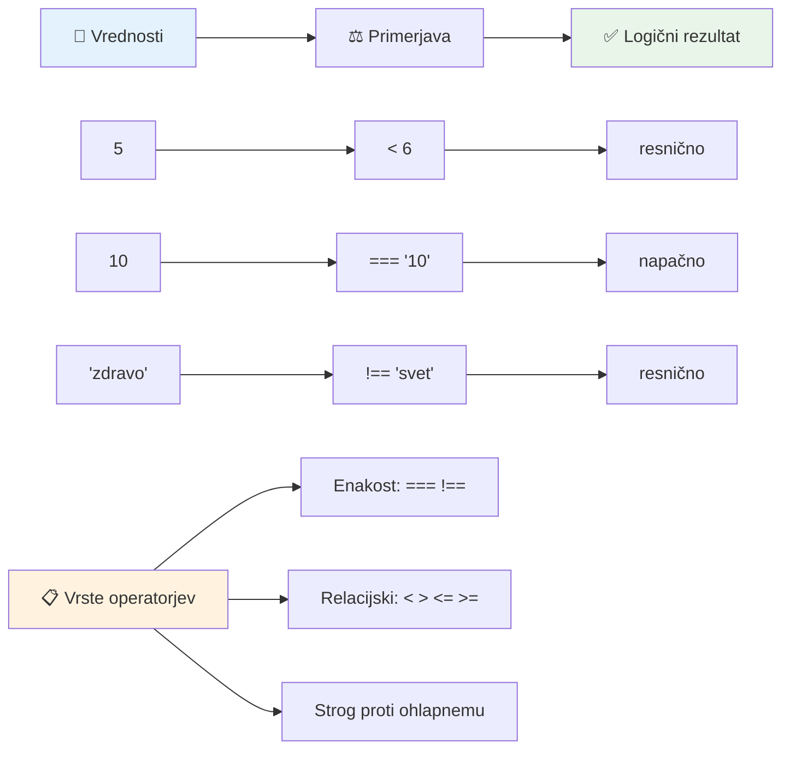
### 🧠 **Preverjanje mojstrstva primerjanja: Razumevanje Boolean logike**

**Preizkusi svoje razumevanje primerjav:**
- Zakaj misliš, da je `===` (stroga enakost) običajno boljša od `==` (mehka enakost)?
- Lahko napoveš, kaj bo vrnilo `5 === '5'`? Kaj pa `5 == '5'`?
- Kakšna je razlika med `!==` in `!=`?

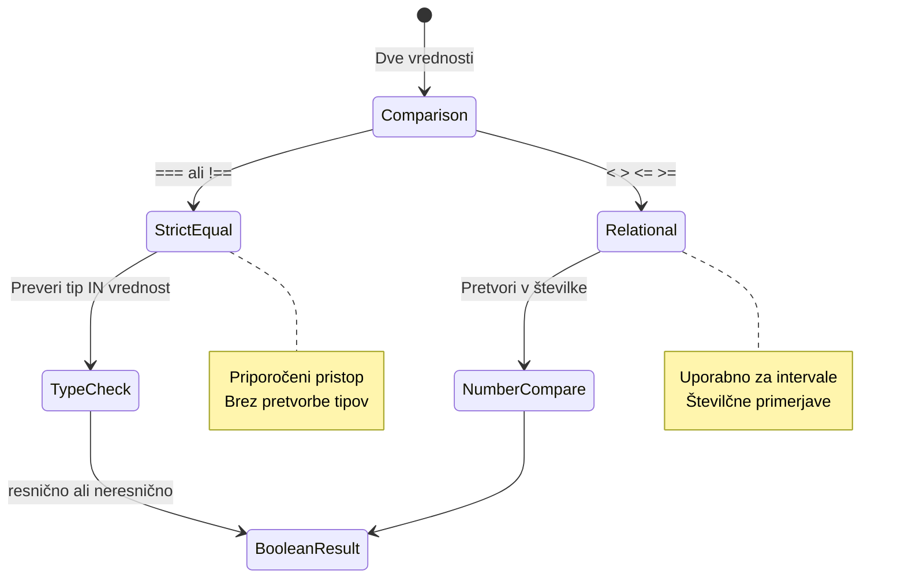
> **Nasvet strokovnjakov**: Vedno uporabljaj `===` in `!==` za preverjanje enakosti, razen če posebej želiš pretvorbo tipa. Tako preprečiš nepričakovano vedenje!

## If stavek

`if` stavek je kot postavljanje vprašanja v tvoji kodi. "Če je ta pogoj resničen, potem naredi to." Verjetno je najpomembnejše orodje za sprejemanje odločitev v JavaScriptu.

Tako deluje:

```javascript
if (condition) {
  // Pogoj je izpolnjen. Koda v tem bloku bo izvedena.
}
```

Pogoj gre v oklepaje, in če je `true`, JavaScript izvede kodo znotraj zavitih oklepajev. Če je `false`, JavaScript ta blok preskoči.

Pogosto boš uporabljal primerjalne operatorje za izdelavo teh pogojev. Poglejmo praktičen primer:

```javascript
let currentMoney = 1000;
let laptopPrice = 800;

if (currentMoney >= laptopPrice) {
  // Pogoji so izpolnjeni. Koda v tem bloku se bo izvedla.
  console.log("Getting a new laptop!");
}
```

Ker `1000 >= 800` vrne `true`, se koda znotraj bloka izvede in v konzolo napiše "Getting a new laptop!".

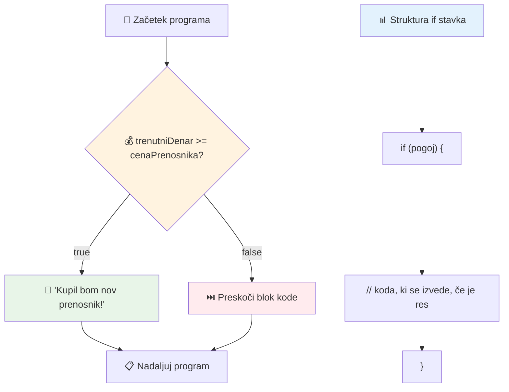
## If..Else stavek

Kaj pa, če želiš, da tvoj program naredi nekaj drugega, ko je pogoj lažen? Tu pride v poštev `else` – kot rezervni načrt.

`else` stavek ti omogoča, da rečeš "če ta pogoj ni resničen, naredi to drugo zadevo."

```javascript
let currentMoney = 500;
let laptopPrice = 800;

if (currentMoney >= laptopPrice) {
  // Pogoj je resničen. Koda v tem bloku se bo izvršila.
  console.log("Getting a new laptop!");
} else {
  // Pogoj je neresničen. Koda v tem bloku se bo izvršila.
  console.log("Can't afford a new laptop, yet!");
}
```

Ker je `500 >= 800` `false`, JavaScript preskoči prvi blok in izvede `else` blok. V konzolo se izpiše "Can't afford a new laptop, yet!".

✅ Preizkusi svoje razumevanje te kode in naslednje tako, da ju izvedeš v konzoli brskalnika. Spremeni vrednosti spremenljivk currentMoney in laptopPrice, da spremeniš vrnjeni `console.log()`.

### 🎯 **Preverjanje If-Else logike: Veje poti**

**Ocenite svoje razumevanje pogojne logike:**
- Kaj se zgodi, če je `currentMoney` natanko enak `laptopPrice`?
- Se ti morda poraja realen primer, kjer bi bila if-else logika uporabna?
- Kako bi lahko razširil to, da zajema več cenovnih razredov?

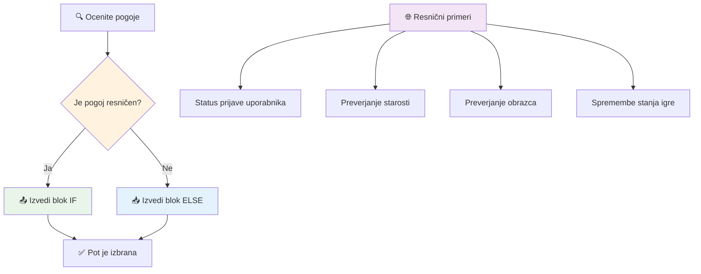
> **Ključni vpogled**: If-else zagotovi, da se izvede točno ena pot. To zagotavlja, da program vedno odgovori na vsak pogoj!

## Switch stavek

Včasih moraš primerjati eno vrednost z več možnostmi. Čeprav lahko zaporedoma uporabiš več `if..else` stavkov, ta pristop postane nepregleden. `switch` stavek ponuja bolj urejeno strukturo za obravnavo več diskretnih vrednosti.

Koncept je podoben mehanskim stikalnim sistemom, ki so jih uporabljali v zgodnjih telefonskih centralah – ena vhodna vrednost določa, katero pot izvaja.

```javascript
switch (expression) {
  case x:
    // blok kode
    break;
  case y:
    // blok kode
    break;
  default:
    // blok kode
}
```

Tako je strukturiran:
- JavaScript enkrat oceni izraz
- Pregleda vsak `case` za ujemanje
- Ko najde ujemanje, izvede ta blok kode
- `break` pove JavaScriptu, naj ustavi in izstopi iz switcha
- Če nima ujemajočih se primerov, se izvede `default` blok (če ga imaš)

```javascript
// Program, ki uporablja stavčno izjavo switch za dan v tednu
let dayNumber = 2;
let dayName;

switch (dayNumber) {
  case 1:
    dayName = "Monday";
    break;
  case 2:
    dayName = "Tuesday";
    break;
  case 3:
    dayName = "Wednesday";
    break;
  default:
    dayName = "Unknown day";
    break;
}
console.log(`Today is ${dayName}`);
```

V tem primeru JavaScript vidi, da je `dayNumber` `2`, najde ustrezen `case 2`, nastavi `dayName` na "Tuesday" in nato izstopi iz switcha. Rezultat? V konzolo se izpiše "Today is Tuesday".

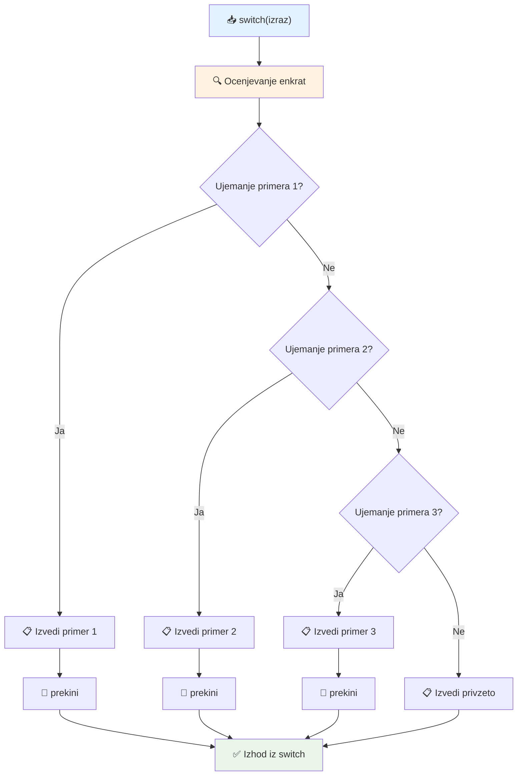
✅ Preizkusi svoje razumevanje te kode in naslednje tako, da ju izvedeš v konzoli brskalnika. Spremeni vrednost spremenljivke a, da spremeniš vrnjeni `console.log()`.

### 🔄 **Mojstrstvo Switch stavka: Več možnosti**

**Preizkusi razumevanje switch stavka:**
- Kaj se zgodi, če pozabiš `break` stavek?
- Kdaj bi uporabljal `switch` namesto več `if-else` stavkov?
- Zakaj je `default` primer uporaben, tudi če misliš, da si pokril vse možnosti?

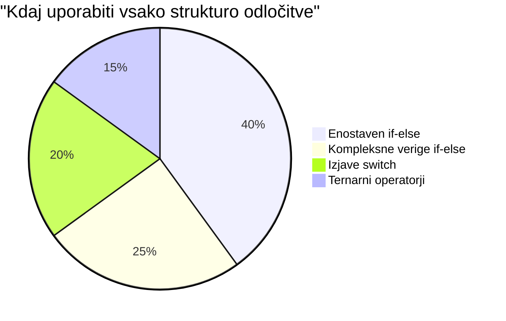
> **Najboljša praksa**: Uporabi `switch` pri primerjanju ene spremenljivke z več specifičnimi vrednostmi. Uporabi `if-else` za pregledovanje intervalov ali zapletenih pogojev!

## Logični operatorji in Boolean vrednosti

Za kompleksne odločitve je pogosto potrebna evalvacija več pogojev hkrati. Tako kot Booleova algebra matematikom omogoča združevanje logičnih izrazov, programiranje ponuja logične operatorje za povezovanje več Boolean pogojov.

Ti operatorji omogočajo sofisticirano pogojno logiko z združevanjem preprostih true/false evaluacij.

| Simbol | Opis                                                                                     | Primer                                                                 |
| ------ | ---------------------------------------------------------------------------------------- | --------------------------------------------------------------------- |
| `&&`   | **Logično IN**: Primerja dva Boolean izraza. Vrne true **samo** če sta oba izraza true  | `(5 > 3) && (5 < 10) // Oba pogoja sta resnična. Vrne true`          |
| `\|\|` | **Logično ALI**: Primerja dva Boolean izraza. Vrne true, če je vsaj eden od pogojev true | `(5 > 10) \|\| (5 < 10) // En pogoj je lažen, drugi resničen. Vrne true` |
| `!`    | **Logično NE**: Vrne nasprotno vrednost Boolean izraza                                  | `!(5 > 10) // 5 ni večje od 10, zato "!" spremeni v true`             |

Ti operatorji ti omogočajo uporabne kombinacije pogojev:
- AND (`&&`) pomeni, da morata biti oba pogoja resnična
- OR (`||`) pomeni, da je dovolj, če je eden od pogojev resničen
- NOT (`!`) spremeni true v false (in obratno)

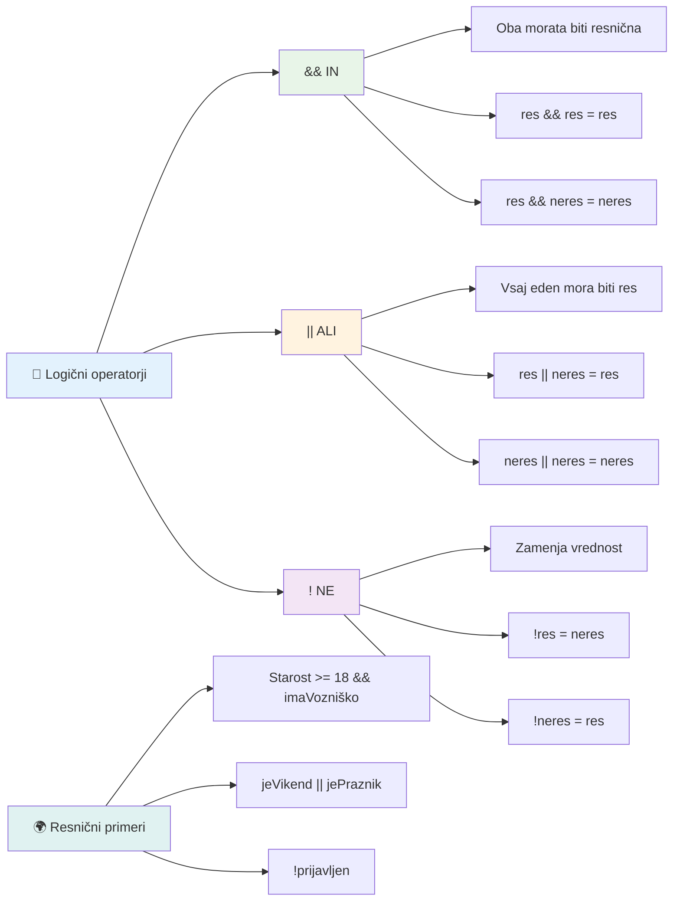
## Pogoji in odločitve z logičnimi operatorji

Poglejmo te logične operatorje v dejstvu z bolj realnim primerom:

```javascript
let currentMoney = 600;
let laptopPrice = 800;
let laptopDiscountPrice = laptopPrice - (laptopPrice * 0.2); // Cena prenosnika z 20 odstotki popusta

if (currentMoney >= laptopPrice || currentMoney >= laptopDiscountPrice) {
  // Pogoj je resničen. Koda v tem bloku se bo izvedla.
  console.log("Getting a new laptop!");
} else {
  // Pogoj je napačen. Koda v tem bloku se bo izvedla.
  console.log("Can't afford a new laptop, yet!");
}
```

V tem primeru izračunamo 20% popustno ceno (640), nato preverimo, ali razpoložljiva sredstva pokrijejo polno ceno ALI popustno ceno. Ker je 600 manj od popustne cene 640, pogoj vrne false.

### 🧮 **Preverjanje logičnih operatorjev: Združevanje pogojev**

**Preizkusi svoje razumevanje logičnih operatorjev:**
- Kaj se zgodi v izrazu `A && B`, če je A lažen? Ali se B sploh oceni?
- Se lahko domisliš situacije, kjer bi rabil vse tri operatorje skupaj (&&, ||, !)?
- Kakšna je razlika med `!user.isActive` in `user.isActive !== true`?

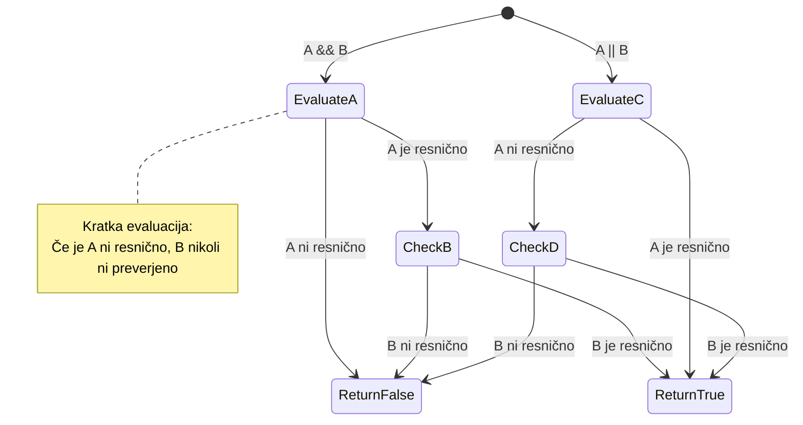
> **Nasvet za zmogljivost**: JavaScript uporablja "kratkocikelno ocenjevanje" – v `A && B` se, če je A lažen, B sploh ne oceni. To lahko izkoristiš sebi v prid!

### Negacijski operator

Včasih je lažje razmišljati o tem, kdaj nekaj NI res. Namesto da se vprašaš "Ali je uporabnik prijavljen?", morda želiš vprašati "Ali uporabnik NI prijavljen?" Operator klicaja (`!`) obrne logiko zate.

```javascript
if (!condition) {
  // se izvede, če je pogoj nepravilen
} else {
  // se izvede, če je pogoj pravilen
}
```

Operator `!` je kot da rečeš "nasprotno od..." – če je nekaj `true`, `!` to spremeni v `false` in obratno.

### Ternarni izrazi

Za preproste pogojne dodelitve JavaScript nudi **ternarni operator**. Ta jedrnat zapis ti omogoči, da napišeš pogojen izraz v eni vrstici, uporaben, kadar moraš dodeliti eno od dveh vrednosti glede na pogoj.

```javascript
let variable = condition ? returnThisIfTrue : returnThisIfFalse;
```

Beri ga kot vprašanje: "Je ta pogoj resničen? Če ja, uporabi to vrednost. Če ne, uporabi tisto vrednost."

Spodaj je bolj konkreten primer:

```javascript
let firstNumber = 20;
let secondNumber = 10;
let biggestNumber = firstNumber > secondNumber ? firstNumber : secondNumber;
```

✅ Posveti nekaj trenutkov za večkratno branje te kode. Razumeš, kako delujejo ti operatorji?

Vrstica pravi: "Je `firstNumber` večji od `secondNumber`? Če da, shrani `firstNumber` v `biggestNumber`. Če ne, shrani `secondNumber` v `biggestNumber`."

Ternarni operator je samo krajši način zapisa tradicionalnega `if..else` stavka:

```javascript
let biggestNumber;
if (firstNumber > secondNumber) {
  biggestNumber = firstNumber;
} else {
  biggestNumber = secondNumber;
}
```

Oba pristopa vrneta enake rezultate. Ternarni operator ponuja jedrnatost, medtem ko je tradicionalna if-else struktura morda bolj berljiva pri zapletenih pogojih.

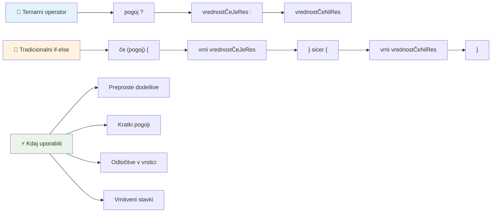
---


## 🚀 Izziv

Ustvari program, ki je najprej napisan z logičnimi operatorji, nato pa ga prepiši z uporabo ternarnega izraza. Kateri zapis ti je ljubši?

---

## Izziv GitHub Copilot agenta 🚀

Uporabi način Agent za dokončanje naslednjega izziva:

**Opis:** Ustvari celovit kalkulator ocen, ki pokaže več konceptov sprejemanja odločitev iz te lekcije, vključno z if-else stavki, switch stavki, logičnimi operatorji in ternarnimi izrazi.

**Napis:** Napiši JavaScript program, ki prejme številčno oceno študenta (0-100) in določi njegovo črkovno oceno po naslednjih kriterijih:
- A: 90-100
- B: 80-89  
- C: 70-79
- D: 60-69
- F: Pod 60

Zahteve:
1. Uporabi if-else stavek za določitev črkovne ocene
2. Uporabite logične operatorje za preverjanje, ali učenec uspe (ocena >= 60) IN ima častno pohvalo (ocena >= 90)
3. Uporabite stavčni blok switch za podajanje specifičnih povratnih informacij za vsako črčno oceno
4. Uporabite ternarni operator za določitev, ali je učenec upravičen do naslednjega predmeta (ocena >= 70)
5. Vključite preverjanje vnosa, da zagotovite, da je rezultat med 0 in 100

Preizkusite svoj program z različnimi ocenami, vključno z robnimi primeri, kot so 59, 60, 89, 90 in neveljavni vnosi.

Več o [načinu agenta](https://code.visualstudio.com/blogs/2025/02/24/introducing-copilot-agent-mode) izveste tukaj.


## Kviz po predavanju

[Kviz po predavanju](https://ff-quizzes.netlify.app/web/quiz/12)

## Pregled in samostojno učenje

Preberite več o številnih operatorjih, ki so na voljo uporabniku [na MDN](https://developer.mozilla.org/docs/Web/JavaScript/Reference/Operators).

Prebrskajte čudovit [pregled operatorjev](https://joshwcomeau.com/operator-lookup/) Josha Comeaua!

## Domača naloga

[Operatorji](assignment.md)

---

## 🧠 **Povzetek vašega orodja za odločanje**

```mermaid
graph TD
    A["🎯 Odločitve v JavaScriptu"] --> B["🔍 Boolean logika"]
    A --> C["📊 Pogojni stavki"]
    A --> D["🔗 Logični operatorji"]
    A --> E["⚡ Napredni vzorci"]
    
    B --> B1["vrednosti true/false"]
    B --> B2["Operatorji primerjave"]
    B --> B3["Koncepti resničnosti"]
    
    C --> C1["if stavki"]
    C --> C2["če-ali verige"]
    C --> C3["switch stavki"]
    
    D --> D1["&& (IN)"]
    D --> D2["|| (ALI)"]
    D --> D3["! (NE)"]
    
    E --> E1["Ternarni operator"]
    E --> E2["Krajša evalvacija"]
    E --> E3["Kompleksni pogoji"]
    
    F["💡 Ključna načela"] --> F1["Jasni berljivi pogoji"]
    F --> F2["Konsistentni primerjalni slog"]
    F --> F3["Pravilna prednost operatorjev"]
    F --> F4["Učinkovit vrstni red evalvacije"]
    
    style A fill:#e3f2fd
    style B fill:#e8f5e8
    style C fill:#fff3e0
    style D fill:#f3e5f5
    style E fill:#e0f2f1
    style F fill:#fce4ec
```
---

## 🚀 Vaš časovni načrt za obvladovanje odločanja v JavaScriptu

### ⚡ **Kaj lahko naredite v naslednjih 5 minutah**
- [ ] Vadite primerjalne operatorje v konzoli brskalnika
- [ ] Napišite preprost stavek if-else, ki preverja vašo starost
- [ ] Preizkusite izziv: prepišite if-else z uporabo ternarnega operatorja
- [ ] Testirajte, kaj se zgodi z različnimi "resničnimi" in "neresničnimi" vrednostmi

### 🎯 **Kaj lahko dosežete v tej uri**
- [ ] Dokončajte kviz po lekciji in pregledajte vse nejasne koncepte
- [ ] Zgradite celoviti kalkulator ocen iz izziva GitHub Copilot
- [ ] Ustvarite preprosto odločitveno drevo za realni scenarij (npr. izbira oblačil)
- [ ] Vadite kombiniranje več pogojev z logičnimi operatorji
- [ ] Eksperimentirajte z uporabo stavčnih blokov switch za različne primere uporabe

### 📅 **Vaše tedensko obvladovanje logike**
- [ ] Dokončajte domačo nalogo o operatorjih s kreativnimi primeri
- [ ] Zgradite mini kviz aplikacijo z uporabo različnih pogojnih struktur
- [ ] Ustvarite validator obrazca, ki preverja več pogojev vnosa
- [ ] Vadite vaje iz [pregleda operatorjev](https://joshwcomeau.com/operator-lookup/) Josha Comeaua
- [ ] Refaktorirajte obstoječo kodo z uporabo bolj primernih pogojnih struktur
- [ ] Študirajte kratkocirkulacijsko vrednotenje in vplive na zmogljivost

### 🌟 **Vaša mesečna preobrazba**
- [ ] Obvladujte kompleksne gnezdene pogoje in ohranjajte berljivost kode
- [ ] Zgradite aplikacijo z zapleteno logiko odločanja
- [ ] Prispevajte k odprtokodnim projektom z izboljšanjem pogojne logike
- [ ] Naučite nekoga drugega o različnih pogojnih strukturah in njihovih uporabah
- [ ] Raziskujte funkcionalne pristope k pogojni logiki
- [ ] Ustvarite osebni referenčni vodič za najboljše prakse pri pogojih

### 🏆 **Zaključni pregled mojstra odločanja**

**Praznujte svoje znanje logičnega razmišljanja:**
- Katera je najbolj kompleksna odločitvena logika, ki ste jo uspešno implementirali?
- Katere pogojne strukture se vam zdijo najnaravnejše in zakaj?
- Kako vam je učenje o logičnih operatorjih spremenilo pristop k reševanju problemov?
- Katera realna aplikacija bi imela koristi od sofisticirane logike odločanja?

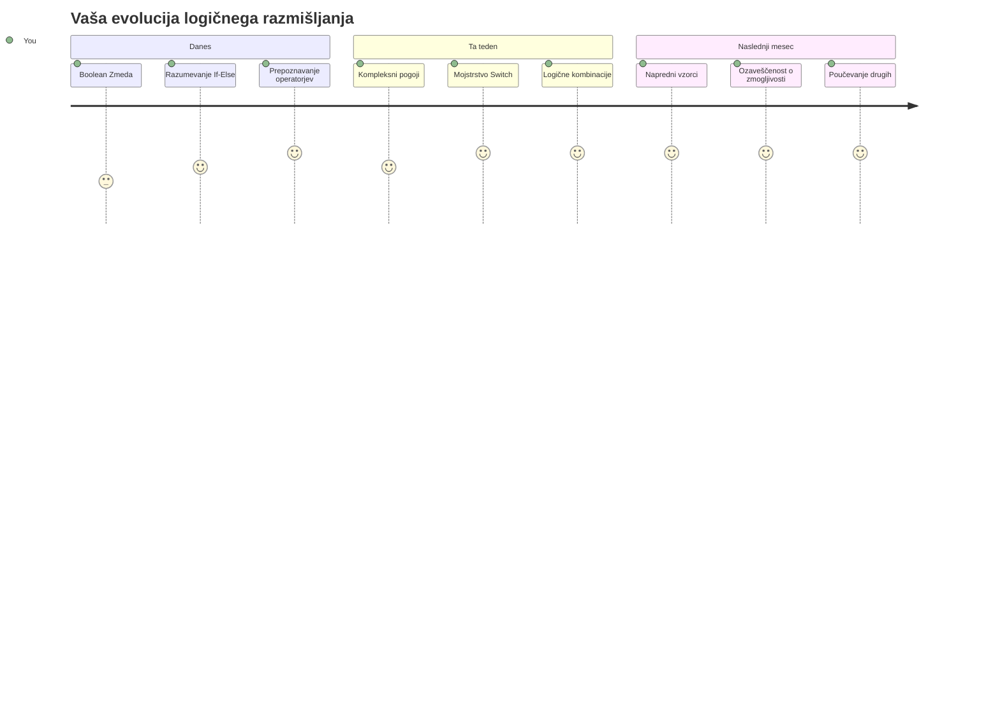
> 🧠 **Obvladali ste umetnost digitalnega odločanja!** Vsaka interaktivna aplikacija se zanaša na pogojno logiko, da inteligentno odgovori na uporabniške akcije in spreminjajoče se pogoje. Zdaj razumete, kako narediti, da vaši programi razmišljajo, ocenjujejo in izbirajo ustrezne odgovore. Ta logična osnova bo poganjala vsako dinamično aplikacijo, ki jo boste ustvarili! 🎉

---

<!-- CO-OP TRANSLATOR DISCLAIMER START -->
**Omejitev odgovornosti**:
Ta dokument je bil preveden z uporabo AI prevajalske storitve [Co-op Translator](https://github.com/Azure/co-op-translator). Čeprav si prizadevamo za natančnost, vas opozarjamo, da lahko avtomatizirani prevodi vsebujejo napake ali netočnosti. Izvorni dokument v izvorni jezik velja za avtoritativni vir. Za ključne informacije priporočamo strokovni človeški prevod. Za kakršnekoli nesporazume ali napačne razlage, ki izhajajo iz uporabe tega prevoda, ne odgovarjamo.
<!-- CO-OP TRANSLATOR DISCLAIMER END -->