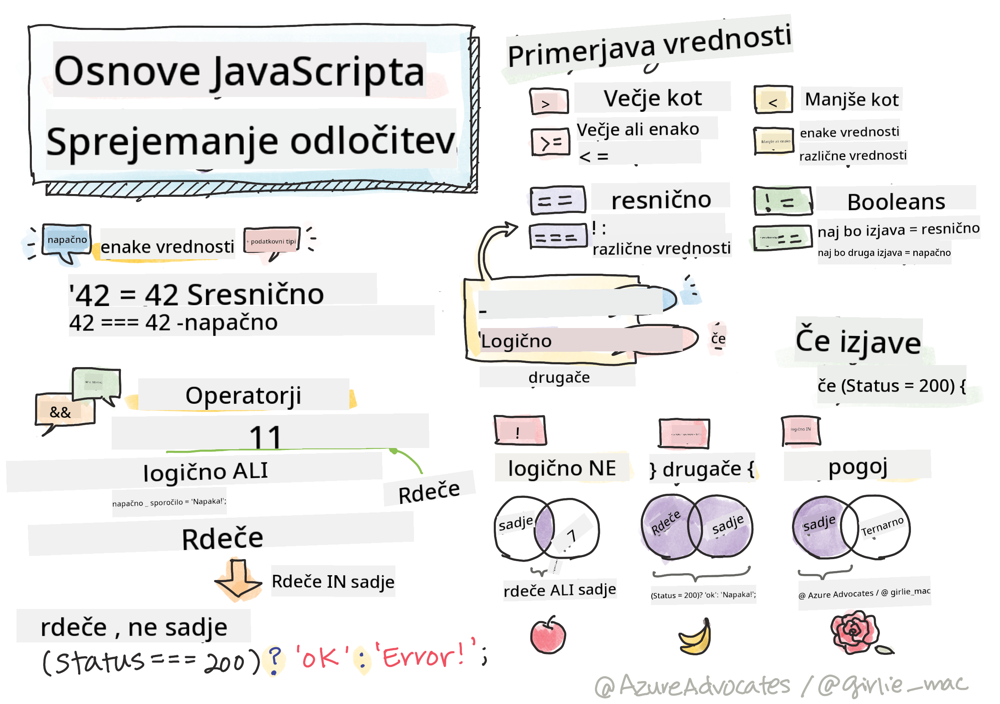

<!--
CO_OP_TRANSLATOR_METADATA:
{
  "original_hash": "f7009631b73556168ca435120a231c98",
  "translation_date": "2025-08-29T12:52:39+00:00",
  "source_file": "2-js-basics/3-making-decisions/README.md",
  "language_code": "sl"
}
-->
# Osnove JavaScripta: Sprejemanje odločitev



> Sketchnote avtorja [Tomomi Imura](https://twitter.com/girlie_mac)

## Predhodni kviz

[Predhodni kviz](https://ff-quizzes.netlify.app/web/quiz/11)

Sprejemanje odločitev in nadzor nad tem, v kakšnem vrstnem redu se izvaja vaša koda, naredi kodo ponovno uporabno in robustno. Ta razdelek zajema sintakso za nadzor pretoka podatkov v JavaScriptu in njen pomen pri uporabi z Boolean podatkovnimi tipi.

[](https://youtube.com/watch?v=SxTp8j-fMMY "Sprejemanje odločitev")

> 🎥 Kliknite zgornjo sliko za video o sprejemanju odločitev.

> To lekcijo lahko opravite na [Microsoft Learn](https://docs.microsoft.com/learn/modules/web-development-101-if-else/?WT.mc_id=academic-77807-sagibbon)!

## Kratek povzetek o Booleanih

Booleani imajo lahko le dve vrednosti: `true` ali `false`. Booleani pomagajo pri sprejemanju odločitev, katere vrstice kode naj se izvedejo, ko so izpolnjeni določeni pogoji.

Boolean nastavite na true ali false takole:

`let myTrueBool = true`  
`let myFalseBool = false`

✅ Booleani so poimenovani po angleškem matematiku, filozofu in logiku Georgeu Booleu (1815–1864).

## Primerjalni operatorji in Booleani

Operatorji se uporabljajo za ocenjevanje pogojev z primerjanjem, ki ustvarijo Boolean vrednost. Spodaj je seznam pogosto uporabljenih operatorjev.

| Simbol | Opis                                                                                                                                                   | Primer             |
| ------ | ------------------------------------------------------------------------------------------------------------------------------------------------------- | ------------------ |
| `<`    | **Manj kot**: Primerja dve vrednosti in vrne Boolean vrednost `true`, če je vrednost na levi strani manjša od vrednosti na desni                        | `5 < 6 // true`    |
| `<=`   | **Manj kot ali enako**: Primerja dve vrednosti in vrne Boolean vrednost `true`, če je vrednost na levi strani manjša ali enaka vrednosti na desni       | `5 <= 6 // true`   |
| `>`    | **Več kot**: Primerja dve vrednosti in vrne Boolean vrednost `true`, če je vrednost na levi strani večja od vrednosti na desni                          | `5 > 6 // false`   |
| `>=`   | **Več kot ali enako**: Primerja dve vrednosti in vrne Boolean vrednost `true`, če je vrednost na levi strani večja ali enaka vrednosti na desni         | `5 >= 6 // false`  |
| `===`  | **Stroga enakost**: Primerja dve vrednosti in vrne Boolean vrednost `true`, če sta vrednosti na desni in levi strani enaki IN sta istega podatkovnega tipa | `5 === 6 // false` |
| `!==`  | **Neenakost**: Primerja dve vrednosti in vrne nasprotno Boolean vrednost od tiste, ki bi jo vrnil operator stroge enakosti                              | `5 !== 6 // true`  |

✅ Preverite svoje znanje tako, da napišete nekaj primerjav v konzoli brskalnika. Vas kakšni vrnjeni podatki presenetijo?

## If stavek

If stavek bo izvedel kodo med svojimi bloki, če je pogoj resničen.

```javascript
if (condition) {
  //Condition is true. Code in this block will run.
}
```

Logični operatorji se pogosto uporabljajo za oblikovanje pogoja.

```javascript
let currentMoney;
let laptopPrice;

if (currentMoney >= laptopPrice) {
  //Condition is true. Code in this block will run.
  console.log("Getting a new laptop!");
}
```

## If..Else stavek

Else stavek bo izvedel kodo med svojimi bloki, ko je pogoj neresničen. Je opcijski pri if stavku.

```javascript
let currentMoney;
let laptopPrice;

if (currentMoney >= laptopPrice) {
  //Condition is true. Code in this block will run.
  console.log("Getting a new laptop!");
} else {
  //Condition is false. Code in this block will run.
  console.log("Can't afford a new laptop, yet!");
}
```

✅ Preizkusite svoje razumevanje te kode in naslednje kode tako, da jo zaženete v konzoli brskalnika. Spremenite vrednosti spremenljivk currentMoney in laptopPrice, da spremenite vrnjeni `console.log()`.

## Switch stavek

Switch stavek se uporablja za izvajanje različnih dejanj na podlagi različnih pogojev. Uporabite switch stavek za izbiro enega od mnogih blokov kode, ki naj se izvedejo.

```javascript
switch (expression) {
  case x:
    // code block
    break;
  case y:
    // code block
    break;
  default:
  // code block
}
```

```javascript
// program using switch statement
let a = 2;

switch (a) {
  case 1:
    a = "one";
    break;
  case 2:
    a = "two";
    break;
  default:
    a = "not found";
    break;
}
console.log(`The value is ${a}`);
```

✅ Preizkusite svoje razumevanje te kode in naslednje kode tako, da jo zaženete v konzoli brskalnika. Spremenite vrednosti spremenljivke a, da spremenite vrnjeni `console.log()`.

## Logični operatorji in Booleani

Odločitve lahko zahtevajo več kot eno primerjavo, ki jih je mogoče povezati z logičnimi operatorji za ustvarjanje Boolean vrednosti.

| Simbol | Opis                                                                                     | Primer                                                                  |
| ------ | ----------------------------------------------------------------------------------------- | ----------------------------------------------------------------------- |
| `&&`   | **Logični AND**: Primerja dva Boolean izraza. Vrne true **samo**, če sta obe strani resnični | `(5 > 6) && (5 < 6 ) //Ena stran je neresnična, druga resnična. Vrne false` |
| `\|\|` | **Logični OR**: Primerja dva Boolean izraza. Vrne true, če je vsaj ena stran resnična     | `(5 > 6) \|\| (5 < 6) //Ena stran je neresnična, druga resnična. Vrne true` |
| `!`    | **Logični NOT**: Vrne nasprotno vrednost Boolean izraza                                   | `!(5 > 6) // 5 ni večji od 6, ampak "!" bo vrnil true`                  |

## Pogoji in odločitve z logičnimi operatorji

Logične operatorje lahko uporabite za oblikovanje pogojev v if..else stavkih.

```javascript
let currentMoney;
let laptopPrice;
let laptopDiscountPrice = laptopPrice - laptopPrice * 0.2; //Laptop price at 20 percent off

if (currentMoney >= laptopPrice || currentMoney >= laptopDiscountPrice) {
  //Condition is true. Code in this block will run.
  console.log("Getting a new laptop!");
} else {
  //Condition is true. Code in this block will run.
  console.log("Can't afford a new laptop, yet!");
}
```

### Operator negacije

Do sedaj ste videli, kako lahko uporabite if...else stavek za ustvarjanje pogojne logike. Vse, kar gre v if, mora biti ocenjeno kot true/false. Z uporabo operatorja `!` lahko _negirate_ izraz. Videti bi bilo takole:

```javascript
if (!condition) {
  // runs if condition is false
} else {
  // runs if condition is true
}
```

### Ternarni izrazi

If...else ni edini način za izražanje logike odločanja. Uporabite lahko tudi nekaj, kar se imenuje ternarni operator. Sintaksa za to je videti takole:

```javascript
let variable = condition ? <return this if true> : <return this if false>
```

Spodaj je bolj konkreten primer:

```javascript
let firstNumber = 20;
let secondNumber = 10;
let biggestNumber = firstNumber > secondNumber ? firstNumber : secondNumber;
```

✅ Vzemite si minuto, da večkrat preberete to kodo. Ali razumete, kako ti operatorji delujejo?

Zgornje pravi:

- če je `firstNumber` večji od `secondNumber`
- potem dodeli `firstNumber` spremenljivki `biggestNumber`
- sicer dodeli `secondNumber`.

Ternarni izraz je le kompaktni način pisanja spodnje kode:

```javascript
let biggestNumber;
if (firstNumber > secondNumber) {
  biggestNumber = firstNumber;
} else {
  biggestNumber = secondNumber;
}
```

---

## 🚀 Izziv

Ustvarite program, ki je najprej napisan z logičnimi operatorji, nato pa ga prepišite z uporabo ternarnega izraza. Katera sintaksa vam je ljubša?

---

## Kviz po predavanju

[Kviz po predavanju](https://ff-quizzes.netlify.app/web/quiz/12)

## Pregled in samostojno učenje

Preberite več o številnih operatorjih, ki so na voljo uporabniku, [na MDN](https://developer.mozilla.org/docs/Web/JavaScript/Reference/Operators).

Prebrskajte čudovit [pregled operatorjev](https://joshwcomeau.com/operator-lookup/) Josha Comeaua!

## Naloga

[Operatorji](assignment.md)

---

**Omejitev odgovornosti**:  
Ta dokument je bil preveden z uporabo storitve za strojno prevajanje [Co-op Translator](https://github.com/Azure/co-op-translator). Čeprav si prizadevamo za natančnost, vas prosimo, da se zavedate, da lahko avtomatizirani prevodi vsebujejo napake ali netočnosti. Izvirni dokument v njegovem izvirnem jeziku je treba obravnavati kot avtoritativni vir. Za ključne informacije priporočamo strokovno človeško prevajanje. Ne prevzemamo odgovornosti za morebitna nesporazumevanja ali napačne razlage, ki izhajajo iz uporabe tega prevoda.