<!--
CO_OP_TRANSLATOR_METADATA:
{
  "original_hash": "1710a50a519a6e4a1b40a5638783018d",
  "translation_date": "2026-01-07T09:57:51+00:00",
  "source_file": "2-js-basics/4-arrays-loops/README.md",
  "language_code": "sl"
}
-->
# Osnove JavaScripta: Tabele in zanke


> Sketchnote avtorice [Tomomi Imura](https://twitter.com/girlie_mac)

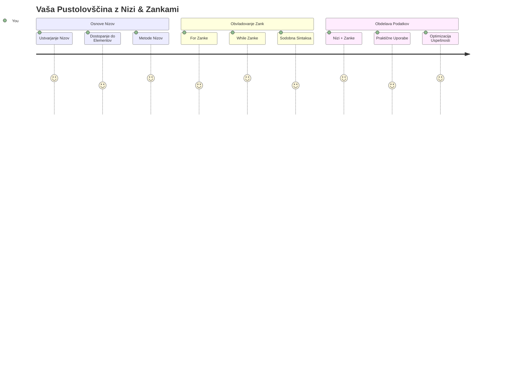
## Predpredavalni kviz
[Predpredavalni kviz](https://ff-quizzes.netlify.app/web/quiz/13)

Ste se kdaj spraševali, kako spletne strani spremljajo izdelke v košarici ali prikazujejo seznam vaših prijateljev? Tu pridejo na vrsto tabele in zanke. Tabele so kot digitalni predalniki, ki hranijo več kosov informacij, zanke pa vam omogočajo učinkovito delo z vsemi temi podatki brez ponavljajoče se kode.

Skupaj ta dva koncepta tvorita osnovo za upravljanje informacij v vaših programih. Naučili se boste, kako preiti od ročnega zapisovanja vsakega koraka do ustvarjanja pametne, učinkovite kode, ki lahko hitro obdela na stotine ali celo tisoče elementov.

Na koncu te lekcije boste razumeli, kako opraviti zapletene podatkovne naloge z le nekaj vrsticami kode. Raziščimo ta osnovna programerska koncepta.

[](https://youtube.com/watch?v=1U4qTyq02Xw "Arrays")

[](https://www.youtube.com/watch?v=Eeh7pxtTZ3k "Loops")

> 🎥 Kliknite slike zgoraj za videoposnetke o tabelah in zankah.

> To lekcijo lahko opravite tudi na [Microsoft Learn](https://docs.microsoft.com/learn/modules/web-development-101-arrays/?WT.mc_id=academic-77807-sagibbon)!

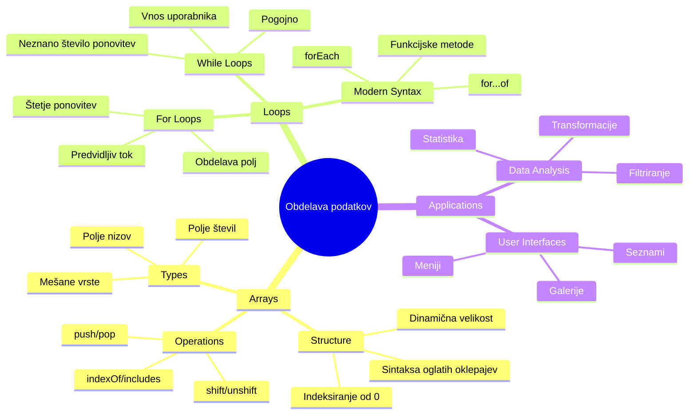
## Tabele

Pomislite na tabele kot na digitalni arhivski predalnik – namesto da bi shranjevali en dokument na predal, lahko organizirate več povezanih predmetov v eni strukturirani vsebniku. V programerskem smislu vam tabele omogočajo shranjevanje več kosov informacij v en urejen paket.

Ne glede na to, ali gradite galerijo slik, upravljate seznam opravil ali spremljate najvišje rezultate v igri, tabele zagotavljajo osnovo za organizacijo podatkov. Poglejmo, kako delujejo.

✅ Tabele so povsod okoli nas! Ali lahko navedete primer tabele iz resničnega sveta, na primer niz sončnih panelov?

### Ustvarjanje tabel

Ustvarjanje tabele je zelo enostavno – uporabite oglate oklepaje!

```javascript
// Prazen niz - kot prazen nakupovalni voziček, ki čaka na predmete
const myArray = [];
```

**Kaj se tukaj dogaja?**
Pravkar ste ustvarili prazen vsebnik z uporabo oglatih oklepajev `[]`. Predstavljajte si ga kot prazen knjižniški regal – pripravljen je sprejeti katere koli knjige, ki jih želite organizirati.

Tabelo lahko tudi takoj napolnite z začetnimi vrednostmi:

```javascript
// Meni okusov vaše sladoledarne
const iceCreamFlavors = ["Chocolate", "Strawberry", "Vanilla", "Pistachio", "Rocky Road"];

// Profilne informacije uporabnika (mešanje različnih vrst podatkov)
const userData = ["John", 25, true, "developer"];

// Testne ocene za vaš najljubši razred
const scores = [95, 87, 92, 78, 85];
```

**Zanimive stvari, ki jih opazite:**
- V tabeli lahko shranjujete besedilo, številke ali celo vrednosti true/false
- Predmete ločite z vejico – enostavno!
- Tabele so idealne za združevanje povezanih informacij

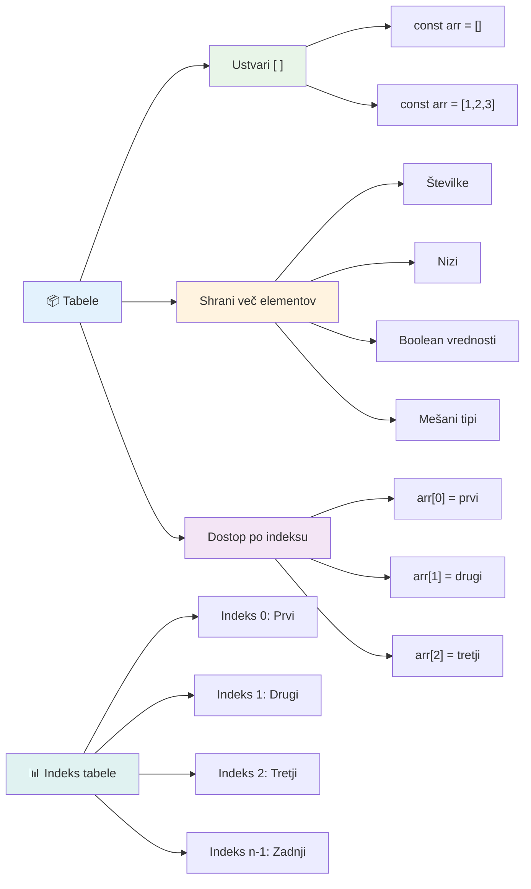
### Indeksiranje tabel

Tukaj je nekaj, kar se na prvi pogled morda zdi nenavadno: tabele številčijo svoje elemente, začenši z 0, ne z 1. To indeksiranje, ki se začne pri nič, ima korenine v računalniškem pomnilniku – je programerska konvencija že od zgodnjih dni programskih jezikov, kot je C. Vsako mesto v tabeli dobi svojo številko naslova, imenovano **indeks**.

| Indeks | Vrednost | Opis |
|-------|-------|-------------|
| 0 | "Čokolada" | Prvi element |
| 1 | "Jagoda" | Drugi element |
| 2 | "Vanilija" | Tretji element |
| 3 | "Pistacija" | Četrti element |
| 4 | "Rocky Road" | Peti element |

✅ Vas preseneča, da tabele začnejo šteti od nič? V nekaterih programskih jezikih indeksi začnejo pri 1. Obstaja zanimiva zgodovina tega, ki jo lahko [preberete na Wikipediji](https://en.wikipedia.org/wiki/Zero-based_numbering).

**Dostop do elementov tabele:**

```javascript
const iceCreamFlavors = ["Chocolate", "Strawberry", "Vanilla", "Pistachio", "Rocky Road"];

// Dostopajte do posameznih elementov z uporabo oglatih oklepajev
console.log(iceCreamFlavors[0]); // "Čokolada" - prvi element
console.log(iceCreamFlavors[2]); // "Vanilija" - tretji element
console.log(iceCreamFlavors[4]); // "Rocky Road" - zadnji element
```

**Razčlenitev, kaj se tukaj dogaja:**
- **Uporablja** oglate oklepaje z indeksom za dostop do elementov
- **Vrne** vrednost na določenem mestu v tabeli
- **Začne** šteti od 0, zato je prvi element indeks 0

**Spreminjanje elementov tabele:**

```javascript
// Spremeni obstoječo vrednost
iceCreamFlavors[4] = "Butter Pecan";
console.log(iceCreamFlavors[4]); // "Butter Pecan"

// Dodaj nov element na konec
iceCreamFlavors[5] = "Cookie Dough";
console.log(iceCreamFlavors[5]); // "Cookie Dough"
```

**V zgornjem primeru smo:**
- **Spremenili** element na indeksu 4 iz "Rocky Road" v "Butter Pecan"
- **Dodali** nov element "Cookie Dough" na indeks 5
- **Samodejno** razširili dolžino tabele pri dodajanju izven obstoječih mej

### Dolžina tabele in pogoste metode

Tabele imajo vgrajene lastnosti in metode, ki delo s podatki močno poenostavijo.

**Iskanje dolžine tabele:**

```javascript
const iceCreamFlavors = ["Chocolate", "Strawberry", "Vanilla", "Pistachio", "Rocky Road"];
console.log(iceCreamFlavors.length); // 5

// Dolžina se samodejno posodablja, ko se polje spremeni
iceCreamFlavors.push("Mint Chip");
console.log(iceCreamFlavors.length); // 6
```

**Glavne točke:**
- **Vrne** število elementov v tabeli
- **Samodejno** se posodobi, ko elemente dodajate ali odstranjujete
- **Nudi** dinamično štetje, uporabno pri zankah in preverjanju

**Osnovne metode tabel:**

```javascript
const fruits = ["apple", "banana", "orange"];

// Dodaj elemente
fruits.push("grape");           // Doda na konec: ["apple", "banana", "orange", "grape"]
fruits.unshift("strawberry");   // Doda na začetek: ["strawberry", "apple", "banana", "orange", "grape"]

// Odstrani elemente
const lastFruit = fruits.pop();        // Odstrani in vrne "grape"
const firstFruit = fruits.shift();     // Odstrani in vrne "strawberry"

// Poišči elemente
const index = fruits.indexOf("banana"); // Vrne 1 (položaj "banana")
const hasApple = fruits.includes("apple"); // Vrne true
```

**Razumevanje teh metod:**
- **Dodaja** elemente z `push()` (na konec) in `unshift()` (na začetek)
- **Odstranjuje** elemente z `pop()` (z konca) in `shift()` (s začetka)
- **Najde** elemente z `indexOf()` in preveri obstoj z `includes()`
- **Vrne** uporabne vrednosti, kot so odstranjeni elementi ali indeks položaja

✅ Poskusite sami! Uporabite konzolo v brskalniku za ustvarjanje in manipulacijo lastne tabele.

### 🧠 **Preverjanje osnov tabel: Organizacija vaših podatkov**

**Preizkusite svoje znanje o tabelah:**
- Zakaj menite, da tabele začnejo šteti pri 0 namesto pri 1?
- Kaj se zgodi, če poskušate dostopati do indeksa, ki ne obstaja (kot `arr[100]` v tabeli s 5 elementi)?
- Ali lahko navedete tri primere iz resničnega sveta, kjer bi tabele bile koristne?

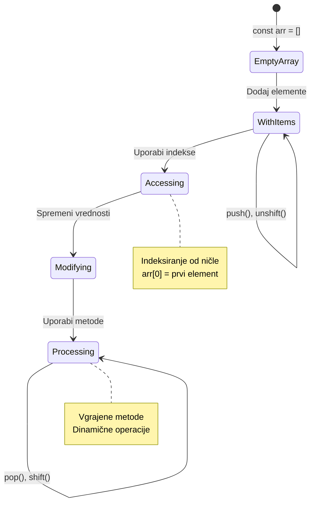
> **Vpogled iz resničnega sveta**: Tabele so povsod v programiranju! Navoji družbenih medijev, nakupovalne košarice, galerije slik, seznami predvajanj – vsi so tabele za kulisami!

## Zanke

Pomislite na znano kazen iz romanov Charlesa Dickensa, kjer so morali učenci ponavljati pisanje vrstic. Predstavljajte si, da lahko nekomu preprosto naročite "napiši ta stavek 100-krat" in to se naredi samodejno. Točno to zanke naredijo za vašo kodo.

Zanke so kot neutrudni pomočnik, ki lahko naloge ponavlja brez napak. Ne glede na to, ali morate preveriti vsak element v košarici ali prikazati vse slike v albumu, zanke učinkovito upravljajo s ponavljanjem.

JavaScript nudi več vrst zank, med katerimi lahko izbirate. Poglejmo si jih in razumemo, kdaj jih uporabljati.

```mermaid
flowchart TD
    A["🔄 Vrste zank"] --> B["For zanka"]
    A --> C["While zanka"]
    A --> D["For...of zanka"]
    A --> E["forEach metoda"]
    
    B --> B1["Znano število ponovitev"]
    B --> B2["Naštevalnik"]
    B --> B3["for(init; pogoj; inkrement)"]
    
    C --> C1["Neznano število ponovitev"]
    C --> C2["Na pogojih"]
    C --> C3["while(pogoj)"]
    
    D --> D1["Moderen ES6+"]
    D --> D2["Ponavljanje po polju"]
    D --> D3["for(element polja)"]
    
    E --> E1["Funkcijski slog"]
    E --> E2["Metoda polja"]
    E --> E3["polje.forEach(klicnaFunkcija)"]
    
    F["⏰ Kdaj uporabiti"] --> F1["For: Štetje, indeksi"]
    F --> F2["While: Vnos uporabnika, iskanje"]
    F --> F3["For...of: Preprosto ponavljanje"]
    F --> F4["forEach: Funkcijsko programiranje"]
    
    style A fill:#e3f2fd
    style B fill:#e8f5e8
    style C fill:#fff3e0
    style D fill:#f3e5f5
    style E fill:#e0f2f1
    style F fill:#fce4ec
```
### For zanka

`for` zanka je kot nastavitev časovnika – točno veste, kolikokrat želite, da se nekaj zgodi. Je zelo organizirana in predvidljiva, zato je idealna, ko delate s tabelami ali morate šteti stvari.

**Struktura for zanke:**

| Sestavni del | Namen | Primer |
|-----------|---------|----------|
| **Inicializacija** | Določi začetno točko | `let i = 0` |
| **Pogoj** | Kdaj nadaljevati | `i < 10` |
| **Prirast** | Kako posodobiti | `i++` |

```javascript
// Štetje od 0 do 9
for (let i = 0; i < 10; i++) {
  console.log(`Count: ${i}`);
}

// Bolj praktičen primer: obdelava rezultatov
const testScores = [85, 92, 78, 96, 88];
for (let i = 0; i < testScores.length; i++) {
  console.log(`Student ${i + 1}: ${testScores[i]}%`);
}
```

**Korak za korakom, tukaj se dogaja:**
- **Inicializira** števec `i` na 0 na začetku
- **Preveri** pogoj `i < 10` pred vsako ponovitvijo
- **Izvede** kodo, če je pogoj resničen
- **Poveča** `i` za 1 po vsakem ciklu z `i++`
- **Ustavi**, ko pogoj postane lažen (ko `i` doseže 10)

✅ Zaženite to kodo v konzoli brskalnika. Kaj se zgodi, če spremenite števec, pogoj ali izraz za iteracijo? Ali jo lahko zaženete tudi v obratni smeri, da ustvarite odštevanje?

### 🗓️ **Preverjanje znanja for zanke: Nadzorovano ponavljanje**

**Ocenite svoje razumevanje for zanke:**
- Kateri so trije deli for zanke in kaj vsak dela?
- Kako bi z zanko šli skozi tabelo od zadaj naprej?
- Kaj se zgodi, če pozabite del za prirast (`i++`)?

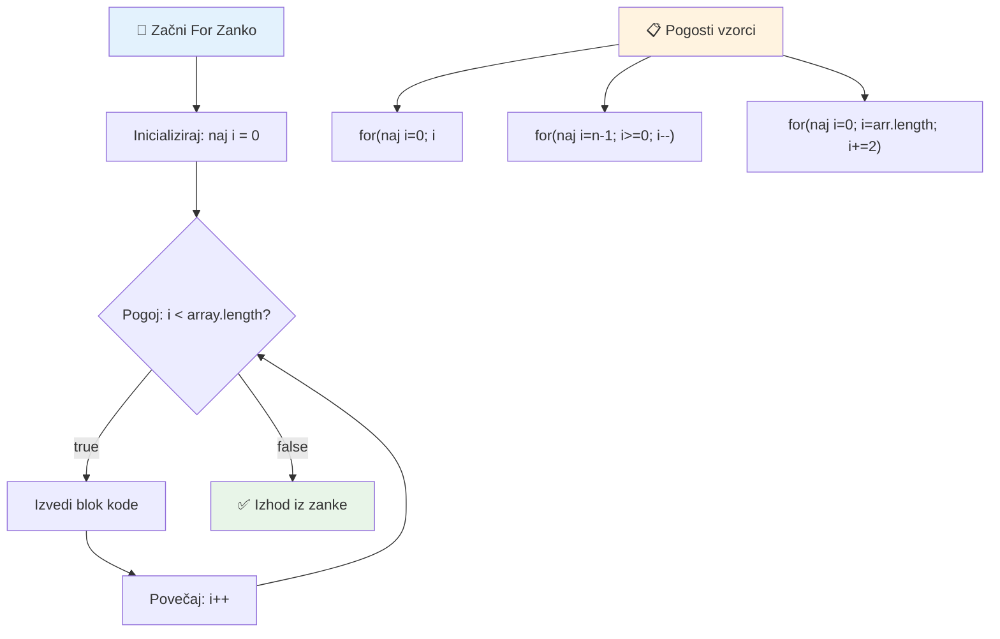
> **Modrost zank**: For zanke so popolne, ko točno veste, kolikokrat morate nekaj ponoviti. So najpogostejša izbira za delo s tabelami!

### While zanka

`while` zanka je kot reči "nadaljuj z delom, dokler..." - morda ne veste natančno, kolikokrat se bo izvedla, a veste, kdaj se mora ustaviti. Primerna je za reči, kot je povpraševanje uporabnika po vnosu, dokler ne dobiš želene vrednosti, ali iskanje v podatkih, dokler ne najdeš tistega, kar iščeš.

**Značilnosti while zanke:**
- **Nadaljuje** izvajanje, dokler je pogoj resničen
- **Zahteva** ročno upravljanje števec spremenljivk
- **Preverja** pogoj pred vsakim ciklom
- **Ogroža** neskončne zanke, če pogoj nikoli ni lažen

```javascript
// Osnovni primer štetja
let i = 0;
while (i < 10) {
  console.log(`While count: ${i}`);
  i++; // Ne pozabi povečati!
}

// Bolj praktičen primer: obdelava vnosa uporabnika
let userInput = "";
let attempts = 0;
const maxAttempts = 3;

while (userInput !== "quit" && attempts < maxAttempts) {
  userInput = prompt(`Enter 'quit' to exit (attempt ${attempts + 1}):`);
  attempts++;
}

if (attempts >= maxAttempts) {
  console.log("Maximum attempts reached!");
}
```

**Razumevanje primerov:**
- **Ročno upravlja** števec `i` znotraj telesa zanke
- **Povečuje** števec, da prepreči neskončne zanke
- **Prikazuje** primer uporabe z uporabniškim vnosom in omejitvijo poskusov
- **Vsebuje** varnostne mehanizme za preprečevanje neskončnega izvajanja

### ♾️ **Preverjanje modrosti while zanke: Ponavljanje po pogojih**

**Preizkusite razumevanje while zanke:**
- Kakšna je glavna nevarnost pri uporabi while zank?
- Kdaj bi raje uporabili while zanko namesto for zanke?
- Kako lahko preprečite neskončne zanke?

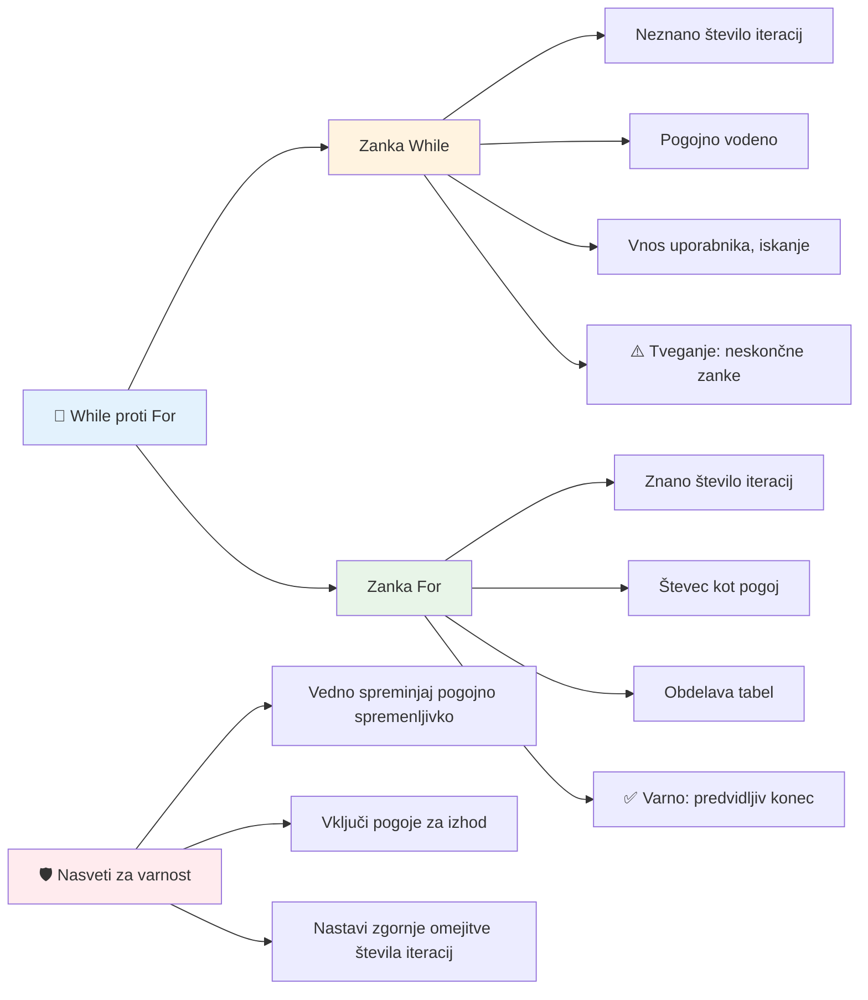
> **Varnost na prvem mestu**: While zanke so močne, a zahtevajo skrbno upravljanje pogojev. Vedno poskrbite, da bo pogoj zanke nazadnje postal lažen!

### Sodobne alternative zankam

JavaScript ponuja sodobno sintakso zank, ki naredi vašo kodo bolj berljivo in manj dovzetno za napake.

**For...of zanka (ES6+):**

```javascript
const colors = ["red", "green", "blue", "yellow"];

// Sodobni pristop - čistejši in varnejši
for (const color of colors) {
  console.log(`Color: ${color}`);
}

// Primerjaj s tradicionalno for zanko
for (let i = 0; i < colors.length; i++) {
  console.log(`Color: ${colors[i]}`);
}
```

**Ključne prednosti for...of:**
- **Odpravlja** upravljanje indeksov in potencialne napake zaradi nepravilnih indeksov
- **Nudi** neposreden dostop do elementov tabele
- **Izboljšuje** berljivost kode in zmanjšuje sintaktično zapletenost

**Metoda forEach:**

```javascript
const prices = [9.99, 15.50, 22.75, 8.25];

// Uporaba forEach za funkcijski programski slog
prices.forEach((price, index) => {
  console.log(`Item ${index + 1}: $${price.toFixed(2)}`);
});

// forEach z puščicnimi funkcijami za preproste operacije
prices.forEach(price => console.log(`Price: $${price}`));
```

**Kaj morate vedeti o forEach:**
- **Izvaja** funkcijo za vsak element tabele
- **Nudi** tako vrednost elementa kot indeks kot parametra
- **Je neprekinljiva** (ne morete jo zgodaj prekiniti, kot pri klasičnih zankah)
- **Vrne** undefined (ne ustvari nove tabele)

✅ Zakaj bi izbrali for zanko namesto while zanke? Na StackOverflow je 17 tisoč gledalcev zastavilo isto vprašanje, nekateri odgovori pa [bi vam lahko bili zanimivi](https://stackoverflow.com/questions/39969145/while-loops-vs-for-loops-in-javascript).

### 🎨 **Preverjanje sodobne sintakse zank: Sprejem ES6+**

**Ocenite svoje znanje sodobnega JavaScripta:**
- Kakšne so prednosti `for...of` v primerjavi s tradicionalnimi for zankami?
- Kdaj še vedno morda raje uporabite tradicionalne for zanke?
- Kakšna je razlika med `forEach` in `map`?

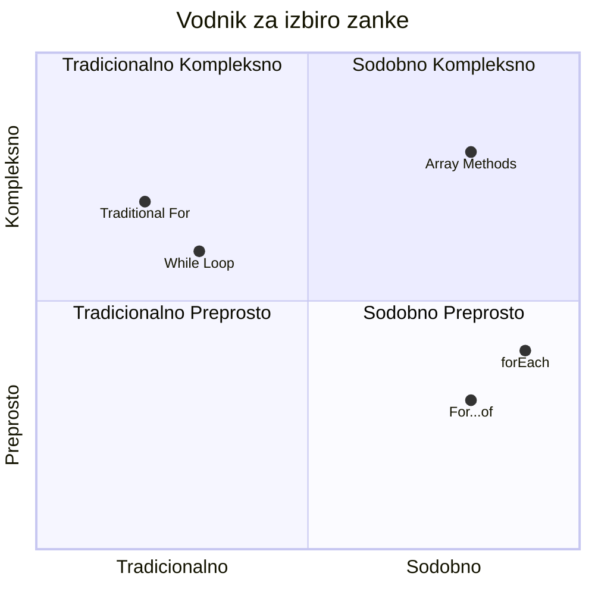
> **Sodobni trend**: Sintaksa ES6+ kot `for...of` in `forEach` postaja priljubljena izbira za iteracijo tabel, saj je čistejša in manj dovzetna za napake!

## Zanke in tabele

Združevanje tabel z zankami ustvarja močne možnosti za obdelavo podatkov. To je osnova mnogih programerskih nalog, od prikaza seznamov do izračuna statistike.

**Tradicionalna obdelava tabel:**

```javascript
const iceCreamFlavors = ["Chocolate", "Strawberry", "Vanilla", "Pistachio", "Rocky Road"];

// Klasičen pristop s for zanko
for (let i = 0; i < iceCreamFlavors.length; i++) {
  console.log(`Flavor ${i + 1}: ${iceCreamFlavors[i]}`);
}

// Sodobni pristop for...of
for (const flavor of iceCreamFlavors) {
  console.log(`Available flavor: ${flavor}`);
}
```

**Razumimo vsak pristop:**
- **Uporablja** lastnost dolžine tabele za določitev meje zanke
- **Dostopa** do elementov po indeksu v tradicionalnih for zankah
- **Omogoča** neposreden dostop do elementov v for...of zankah
- **Obdeluje** vsak element tabele natanko enkrat

**Praktičen primer obdelave podatkov:**

```javascript
const studentGrades = [85, 92, 78, 96, 88, 73, 89];
let total = 0;
let highestGrade = studentGrades[0];
let lowestGrade = studentGrades[0];

// Obravnavajte vse ocene z eno samo zanko
for (let i = 0; i < studentGrades.length; i++) {
  const grade = studentGrades[i];
  total += grade;
  
  if (grade > highestGrade) {
    highestGrade = grade;
  }
  
  if (grade < lowestGrade) {
    lowestGrade = grade;
  }
}

const average = total / studentGrades.length;
console.log(`Average: ${average.toFixed(1)}`);
console.log(`Highest: ${highestGrade}`);
console.log(`Lowest: ${lowestGrade}`);
```

**Tako deluje ta koda:**
- **Inicializira** spremenljivke za sledenje seštevku in ekstremom
- **Obdeluje** vsak podatek o oceni z eno učinkovito zanko
- **Sešteva** skupno za kasnejši izračun povprečja
- **Sledi** najvišjim in najnižjim vrednostim med iteracijo
- **Izračuna** končno statistiko po zaključku zanke

✅ Preizkusite lastno zanko na tabeli v konzoli vašega brskalnika.

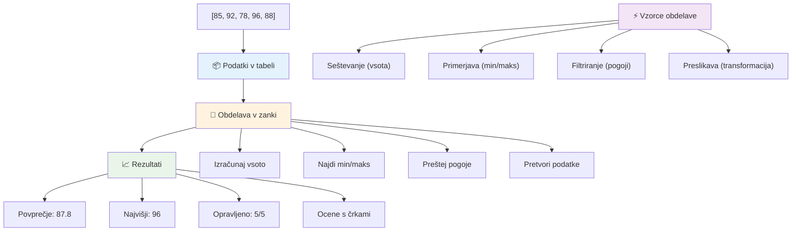
---

## Izziv GitHub Copilot Agent 🚀

Uporabite način Agent za izpolnitev naslednjega izziva:

**Opis:** Zgradite celovito funkcijo za obdelavo podatkov, ki združuje tabele in zanke za analizo množice podatkov in ustvarjanje smiselnih vpogledov.

**Naloga:** Ustvarite funkcijo z imenom `analyzeGrades`, ki prejme tabelo predmetov z ocenami študentov (vsak objekt vsebuje lastnosti ime in ocena) in vrne objekt s statistiko, vključno z najvišjo oceno, najnižjo oceno, povprečno oceno, številom študentov, ki so opravili (ocena >= 70), ter tabelo imen študentov, ki so dosegli nadpovprečno oceno. V rešitvi uporabite vsaj dve različni vrsti zank.

Več o [načinu agent](https://code.visualstudio.com/blogs/2025/02/24/introducing-copilot-agent-mode) si preberite tukaj.

## 🚀 Izziv
JavaScript ponuja več sodobnih metod za tabele, ki lahko nadomestijo tradicionalne zanke za specifične naloge. Raziskujte [forEach](https://developer.mozilla.org/docs/Web/JavaScript/Reference/Global_Objects/Array/forEach), [for-of](https://developer.mozilla.org/docs/Web/JavaScript/Reference/Statements/for...of), [map](https://developer.mozilla.org/docs/Web/JavaScript/Reference/Global_Objects/Array/map), [filter](https://developer.mozilla.org/docs/Web/JavaScript/Reference/Global_Objects/Array/filter) in [reduce](https://developer.mozilla.org/docs/Web/JavaScript/Reference/Global_Objects/Array/reduce). 

**Vaša naloga:** Prenovite primer ocen študentov z uporabo vsaj treh različnih metod tabel. Opazite, kako veliko bolj čist in berljiv postane koda s sodobno JavaScript sintakso.

## Kviz po predavanju
[Kviz po predavanju](https://ff-quizzes.netlify.app/web/quiz/14)


## Pregled in samostojno učenje

Tabele v JavaScriptu imajo veliko metod, ki so izjemno uporabne za manipulacijo podatkov. [Preberite več o teh metodah](https://developer.mozilla.org/docs/Web/JavaScript/Reference/Global_Objects/Array) in preizkusite nekatere izmed njih (kot so push, pop, slice in splice) na tabeli po vaši izbiri.

## Naloga

[Zanka po tabeli](assignment.md)

---

## 📊 **Povzetek vašega nabora orodij za tabele in zanke**

```mermaid
graph TD
    A["🎯 Mojstrstvo tabel in zank"] --> B["📦 Osnove tabel"]
    A --> C["🔄 Vrste zank"]
    A --> D["🔗 Obdelava podatkov"]
    A --> E["🎨 Sodobne tehnike"]
    
    B --> B1["Ustvarjanje: [ ]"]
    B --> B2["Indeksiranje: arr[0]"]
    B --> B3["Metode: push, pop"]
    B --> B4["Lastnosti: dolžina"]
    
    C --> C1["For: poznano število ponovitev"]
    C --> C2["While: pogojevanje"]
    C --> C3["For...of: neposreden dostop"]
    C --> C4["forEach: funkcijsko"]
    
    D --> D1["Izračun statistike"]
    D --> D2["Transformacija podatkov"]
    D --> D3["Filtriranje in iskanje"]
    D --> D4["Obdelava v realnem času"]
    
    E --> E1["Puščične funkcije"]
    E --> E2["Verižna metoda"]
    E --> E3["Destrukturiranje"]
    E --> E4["Predloge nizi"]
    
    F["💡 Ključne prednosti"] --> F1["Učinkovito upravljanje podatkov"]
    F --> F2["Zmanjšano ponavljanje kode"]
    F --> F3["Razširljive rešitve"]
    F --> F4["Čistejša sintaksa"]
    
    style A fill:#e3f2fd
    style B fill:#e8f5e8
    style C fill:#fff3e0
    style D fill:#f3e5f5
    style E fill:#e0f2f1
    style F fill:#fce4ec
```
---

## 🚀 Časovni načrt za obvladovanje tabel in zank

### ⚡ **Kaj lahko naredite v naslednjih 5 minutah**
- [ ] Ustvarite tabelo svojih najljubših filmov in dostopajte do določenih elementov
- [ ] Napišite for zanko, ki šteje od 1 do 10
- [ ] Preizkusite izziv s sodobnimi metodami tabel iz lekcije
- [ ] Vadite indeksiranje tabel v konzoli brskalnika

### 🎯 **Kaj lahko dosežete v tem času**
- [ ] Dokončajte kviz po lekciji in ponovite zahtevnejše koncepte
- [ ] Zgradite obsežnega analizerja ocen iz izziva GitHub Copilot
- [ ] Naredite preprost nakupovalni voziček za dodajanje in odstranjevanje predmetov
- [ ] Vadite pretvarjanje med različnimi tipi zank
- [ ] Eksperimentirajte z metodami tabel, kot so `push`, `pop`, `slice` in `splice`

### 📅 **Vaša tedenska pot obdelave podatkov**
- [ ] Dokončajte nalogo "Zanka po tabeli" z ustvarjalnimi izboljšavami
- [ ] Zgradite aplikacijo seznam opravkov z uporabo tabel in zank
- [ ] Ustvarite preprost kalkulator statistike za številčne podatke
- [ ] Vadite z [MDN metodami tabel](https://developer.mozilla.org/docs/Web/JavaScript/Reference/Global_Objects/Array)
- [ ] Zgradite galerijo fotografij ali vmesnik glasbenega predvajalnika
- [ ] Raziskujte funkcijsko programiranje z `map`, `filter` in `reduce`

### 🌟 **Vaša mesečna preobrazba**
- [ ] Obvladujte napredne operacije s tabelami in optimizacijo zmogljivosti
- [ ] Zgradite popoln nadzorni plošči za vizualizacijo podatkov
- [ ] Prispevajte k odprtokodnim projektom, ki vključujejo obdelavo podatkov
- [ ] Poučite nekoga drugega o tabelah in zankah preko praktičnih primerov
- [ ] Ustvarite osebno knjižnico za večkratno uporabo funkcij obdelave podatkov
- [ ] Raziskujte algoritme in podatkovne strukture, zgrajene na tabelah

### 🏆 **Zaključni pregled mojstrstva obdelave podatkov**

**Praznujte svoje obvladovanje tabel in zank:**
- Katera metoda tabele vam je najbolj koristila za realne primere?
- Kateri tip zanke vam je najbolj naraven in zakaj?
- Kako vam je razumevanje tabel in zank spremenilo pristop k organizaciji podatkov?
- Katero kompleksno nalogo obdelave podatkov bi radi obdelali naslednjo?

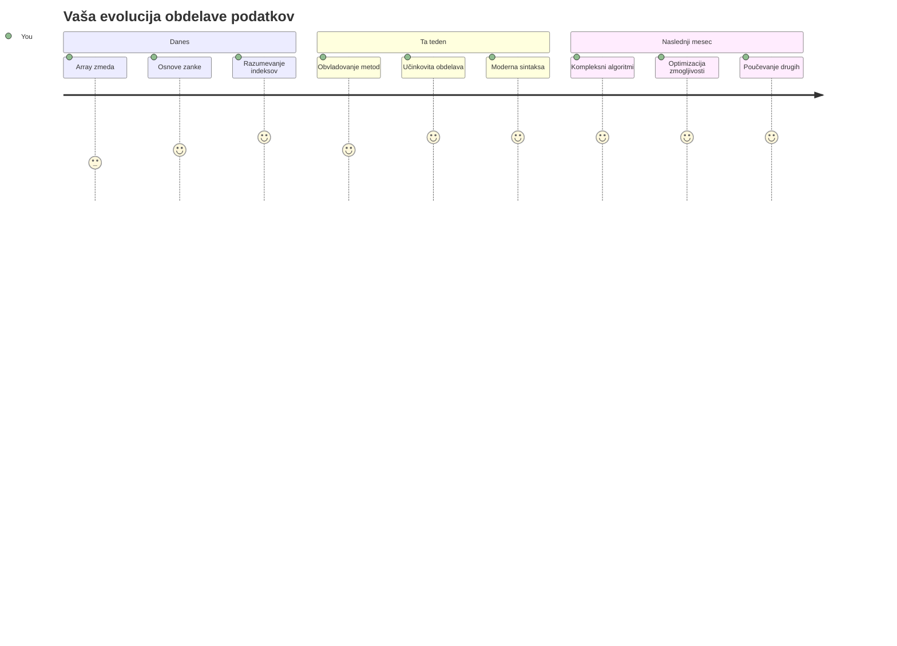
> 📦 **Odklenili ste moč organizacije in obdelave podatkov!** Tabele in zanke so temelj skoraj vsake aplikacije, ki jo boste kdaj zgradili. Od preprostih seznamov do zahtevnih analiz podatkov zdaj imate orodja za učinkovito in elegantno obdelavo informacij. Vsaka dinamična spletna stran, mobilna aplikacija in podatkovno usmerjena aplikacija temelji na teh osnovnih konceptih. Dobrodošli v svet obsežne obdelave podatkov! 🎉

---

<!-- CO-OP TRANSLATOR DISCLAIMER START -->
**Omejitev odgovornosti**:
Ta dokument je bil preveden z uporabo storitve za prevajanje z umetno inteligenco [Co-op Translator](https://github.com/Azure/co-op-translator). Čeprav si prizadevamo za natančnost, vas opozarjamo, da avtomatizirani prevodi lahko vsebujejo napake ali netočnosti. Izvirni dokument v njegovem izvirnem jeziku velja za avtoritativni vir. Za pomembne informacije priporočamo strokovni človeški prevod. Za kakršnekoli nesporazume ali napačne razlage, ki izhajajo iz uporabe tega prevoda, ne odgovarjamo.
<!-- CO-OP TRANSLATOR DISCLAIMER END -->