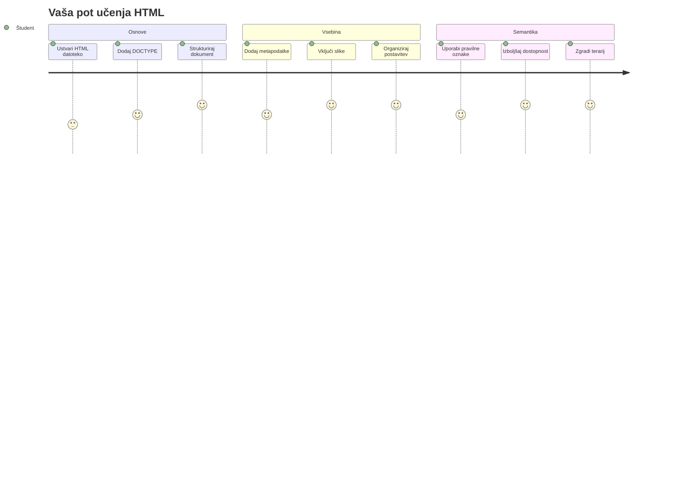
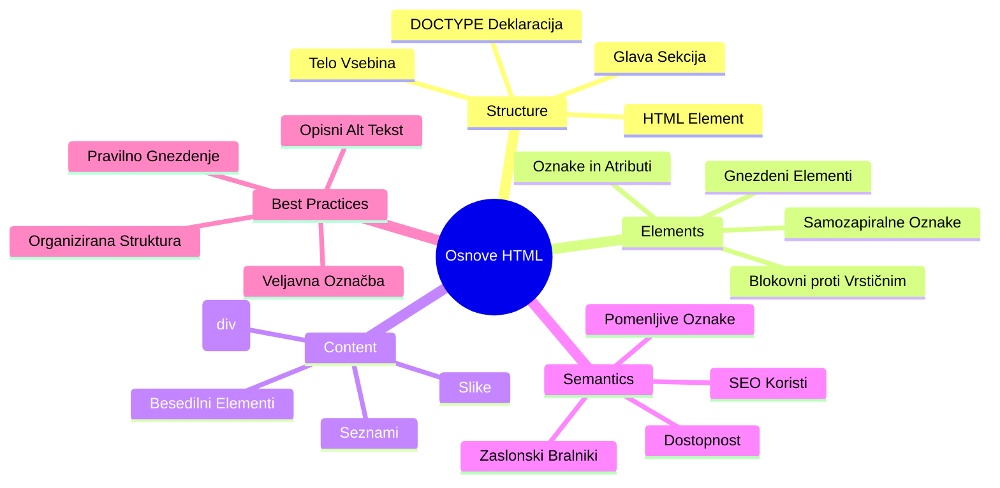
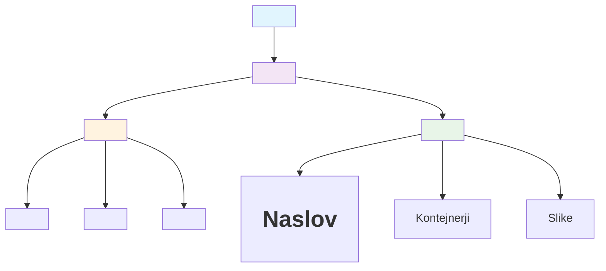
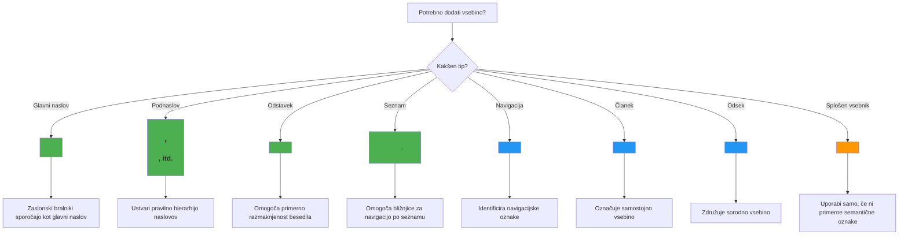
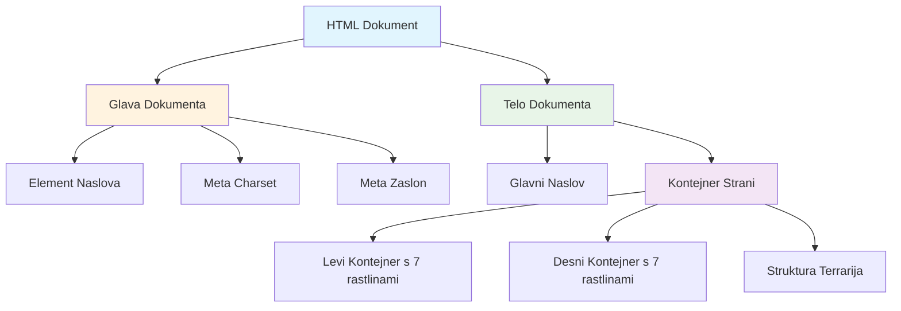
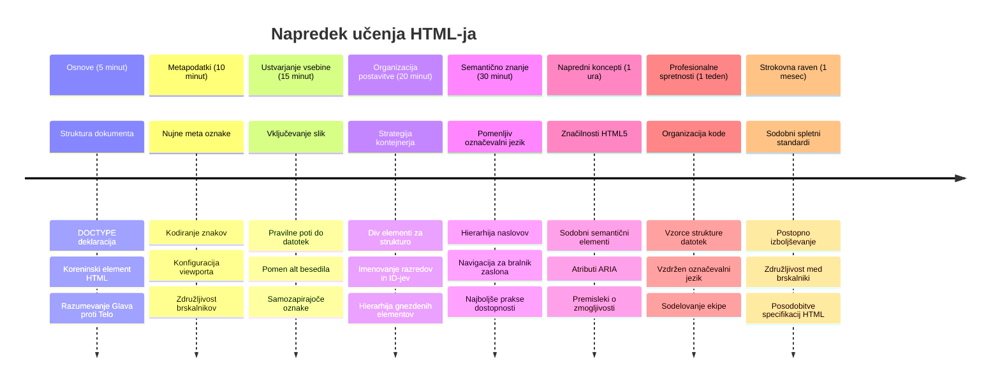

<!--
CO_OP_TRANSLATOR_METADATA:
{
  "original_hash": "3fcfa99c4897e051b558b5eaf1e8cc74",
  "translation_date": "2026-01-07T10:32:07+00:00",
  "source_file": "3-terrarium/1-intro-to-html/README.md",
  "language_code": "sl"
}
-->
# Terrarium Project Part 1: Uvod v HTML



> Sketchnote avtorja [Tomomi Imura](https://twitter.com/girlie_mac)

HTML oziroma HyperText Markup Language je temelj vsake spletne strani, ki ste jo kdaj obiskali. HTML si predstavljajte kot ogrodje, ki daje strukturo spletnim stranem – določa, kam gre vsebina, kako je organizirana in kaj vsak del predstavlja. Medtem ko bo CSS kasneje "oblekel" vaš HTML z barvami in postavitvami, bo JavaScript prinesel interaktivnost, HTML pa zagotavlja osnovno strukturo, ki omogoča vse ostalo.

V tej lekciji boste ustvarili HTML strukturo za vmesnik virtualnega terarija. Ta praktični projekt vas bo naučil osnovnih pojmov HTML, hkrati pa boste zgradili nekaj vizualno zanimivega. Naučili se boste organizirati vsebino z uporabo semantičnih elementov, delati s slikami in ustvariti osnovo za interaktivno spletno aplikacijo.

Na koncu te lekcije boste imeli delujočo HTML stran, ki prikazuje slike rastlin v urejenih stolpcih, pripravljeno za oblikovanje v naslednji lekciji. Ne skrbite, če bo videti osnovno – tako mora HTML izgledati, preden mu CSS doda vizualno dovršenost.


## Predpredavalni kviz

[Predpredavalni kviz](https://ff-quizzes.netlify.app/web/quiz/15)

> 📺 **Glejte in se učite**: Oglejte si ta koristni video pregled
> 
> [](https://www.youtube.com/watch?v=1TvxJKBzhyQ)

## Nastavitev vašega projekta

Preden se poglobimo v HTML kodo, si uredimo primerno delovno okolje za vaš terarijski projekt. Ustvarjanje organizirane strukture datotek že od začetka je ključna navada, ki vam bo koristila skozi celotno pot spletnega razvoja.

### Naloga: Ustvarite strukturo projekta

Ustvarili boste namensko mapo za vaš terarijski projekt in dodali prvo HTML datoteko. Tukaj sta dva načina, ki ju lahko uporabite:

**Možnost 1: Uporaba Visual Studio Code**
1. Odprite Visual Studio Code
2. Kliknite "File" → "Open Folder" ali uporabite `Ctrl+K, Ctrl+O` (Windows/Linux) ali `Cmd+K, Cmd+O` (Mac)
3. Ustvarite novo mapo z imenom `terrarium` in jo izberite
4. V Explorer oknu kliknite na ikono "New File"
5. Vaši datoteki dajte ime `index.html`


**Možnost 2: Uporaba terminalskih ukazov**
```bash
mkdir terrarium
cd terrarium
touch index.html
code index.html
```

**Tukaj je, kaj ti ukazi naredijo:**
- **Ustvari** nov imenik z imenom `terrarium` za vaš projekt
- **Pojde** v mapo terrarium 
- **Ustvari** prazno datoteko `index.html`
- **Odpre** datoteko za urejanje v Visual Studio Code

> 💡 **Koristen nasvet**: Ime datoteke `index.html` je v spletnem razvoju posebno. Ko nekdo obišče spletno stran, brskalniki samodejno iščejo `index.html` kot privzeto stran za prikaz. To pomeni, da bo URL, kot je `https://mysite.com/projects/`, samodejno prikazal datoteko `index.html` iz mape projects, brez potrebe po navedbi imena datoteke v URL-ju.

## Razumevanje strukture HTML dokumenta

Vsak HTML dokument sledi določeni strukturi, ki jo brskalniki potrebujejo, da jo pravilno razumejo in prikažejo. Ta struktura je kot uradno pismo – ima obvezne elemente v določenem vrstnem redu, ki pomagajo prejemniku (v tem primeru brskalniku) pravilno obdelati vsebino.


Začnimo z dodajanjem bistvene osnove, ki jo potrebuje vsak HTML dokument.

### Deklaracija DOCTYPE in korenski element

Prvi dve vrstici katere koli HTML datoteke služita kot "uvod" dokumenta brskalniku:

```html
<!DOCTYPE html>
<html></html>
```

**Razumevanje, kaj ta koda počne:**
- **Deklarira** tip dokumenta kot HTML5 z `<!DOCTYPE html>`
- **Ustvari** korenski element `<html>`, ki bo vseboval vso vsebino strani
- **Vzpostavi** moderne spletne standarde za pravilno upodabljanje v brskalniku
- **Zagotovi** dosleden prikaz v različnih brskalnikih in na napravah

> 💡 **Nasvet za VS Code**: Postavite kurzor nad katerikoli HTML oznako v VS Code, da dobite koristne informacije iz MDN Web Docs, vključno z uporabo in združljivostjo z brskalniki.

> 📚 **Več o tem**: Deklaracija DOCTYPE preprečuje brskalnikom, da bi vstopili v "quirks mode", ki je bil uporabljen za podporo zelo starim spletnim stranem. Sodobni spletni razvoj uporablja preprosto deklaracijo `<!DOCTYPE html>`, da zagotovi [uporabo standardov](https://developer.mozilla.org/docs/Web/HTML/Quirks_Mode_and_Standards_Mode).

### 🔄 **Pedagoški pregled**
**Pavza in premislek**: Pred nadaljevanjem se prepričajte, da razumete:
- ✅ Zakaj vsak HTML dokument potrebuje DOCTYPE deklaracijo
- ✅ Kaj vsebuje korenski element `<html>`
- ✅ Kako ta struktura pomaga brskalnikom pravilno upodabljati strani

**Hitri samopreizkus**: Ali lahko z lastnimi besedami razložite, kaj pomeni "uporabljanje standardom skladnega upodabljanja"?

## Dodajanje bistvenih metapodatkov dokumenta

Odsek `<head>` v HTML dokumentu vsebuje ključne informacije, ki jih brskalniki in iskalniki potrebujejo, vendar jih obiskovalci neposredno ne vidijo na strani. Predstavljajte si ga kot "zakulisne informacije", ki pomagajo, da vaša spletna stran deluje pravilno in se pravilno prikazuje na različnih napravah in platformah.

Ti metapodatki brskalnikom povedo, kako prikazati vašo stran, katero kodiranje znakov uporabiti in kako ravnati z različnimi velikostmi zaslona – vse pomembno za ustvarjanje profesionalnih in dostopnih spletnih strani.

### Naloga: Dodajte glavo dokumenta

Vstavite ta odsek `<head>` med uvodne in zaključne oznake `<html>`:

```html
<head>
	<title>Welcome to my Virtual Terrarium</title>
	<meta charset="utf-8" />
	<meta http-equiv="X-UA-Compatible" content="IE=edge" />
	<meta name="viewport" content="width=device-width, initial-scale=1" />
</head>
```

**Podrobnejša razlaga, kaj vsak element naredi:**
- **Nastavi** naslov strani, ki se pojavi na zavihkih brskalnika in v iskalnikih
- **Specifikira** kodiranje znakov UTF-8 za pravilen prikaz besedila po vsem svetu
- **Zagotovlja** združljivost z modernimi različicami Internet Explorerja
- **Nastavi** odzivno zasnovo z usklajevanjem viewporta z širino naprave
- **Nadzoruje** začetno stopnjo povečave za naraven prikaz vsebine

> 🤔 **Premislite**: Kaj bi se zgodilo, če bi nastavili meta oznako viewport tako: `<meta name="viewport" content="width=600">`? To bi prisililo stran, da je vedno 600 slikovnih pik široka, kar bi pokvarilo odzivno oblikovanje! Več o [ustrezni nastavitvi viewporta](https://developer.mozilla.org/docs/Web/HTML/Viewport_meta_tag).

## Gradnja telesa dokumenta

Element `<body>` vsebuje vso vidno vsebino vaše spletne strani – vse, kar bodo uporabniki videli in s čimer bodo interagirali. Medtem ko je odsek `<head>` dal brskalniku navodila, vsebuje `<body>` dejansko vsebino: besedilo, slike, gumbe in druge elemente, ki oblikujejo vaš uporabniški vmesnik.

Dodajmo strukturo telesa in razumimo, kako HTML oznake skupaj delujejo za ustvarjanje smiselne vsebine.

### Razumevanje strukture HTML oznak

HTML uporablja pari oznak za definiranje elementov. Večina oznak ima začetno oznako, npr. `<p>`, in končno oznako, npr. `</p>`, z vsebino med njima: `<p>Hello, world!</p>`. Tako ustvarijo odsek s tekstom "Hello, world!".

### Naloga: Dodajte element body

Posodobite svojo HTML datoteko, da vključuje element `<body>`:

```html
<!DOCTYPE html>
<html>
	<head>
		<title>Welcome to my Virtual Terrarium</title>
		<meta charset="utf-8" />
		<meta http-equiv="X-UA-Compatible" content="IE=edge" />
		<meta name="viewport" content="width=device-width, initial-scale=1" />
	</head>
	<body></body>
</html>
```

**Kaj ta popolna struktura zagotavlja:**
- **Vzpostavi** osnovno ogrodje HTML5 dokumenta
- **Vključuje** bistvene metapodatke za pravilno upodabljanje v brskalniku
- **Ustvari** prazno telo, pripravljeno za vašo vidno vsebino
- **Sledi** najboljšim praksam sodobnega spletnega razvoja

Zdaj ste pripravljeni dodati vidne elemente vašega terarija. Uporabili bomo elemente `<div>` kot posode za organizacijo različnih sekcij vsebine in elemente `` za prikaz slik rastlin.

### Delo s slikami in posodami za postavitev

Slike so v HTML posebne, saj uporabljajo samozapiralne oznake. V nasprotju z elementi, kot so `<p></p>`, ki obkrožajo vsebino, oznaka `` vsebuje vse informacije znotraj same oznake preko atributov, kot sta `src` (pot do slikovne datoteke) in `alt` (za dostopnost).

Preden dodate slike v svoj HTML, morate ustrezno organizirati datoteke projekta z ustvarjanjem mape za slike in dodajanjem grafike rastlin.

**Najprej uredite svoje slike:**
1. V mapi terarij ustvarite mapo z imenom `images`
2. Prenesite slike rastlin iz [mapo z rešitvijo](../../../../3-terrarium/solution/images) (skupaj 14 slik rastlin)
3. Kopirajte vse slike rastlin v novo mapo `images`

### Naloga: Ustvarite postavitev prikaza rastlin

Sedaj dodajte slike rastlin organizirane v dva stolpca med oznakama `<body></body>`:

```html
<div id="page">
	<div id="left-container" class="container">
		<div class="plant-holder">
			
		</div>
		<div class="plant-holder">
			
		</div>
		<div class="plant-holder">
			
		</div>
		<div class="plant-holder">
			
		</div>
		<div class="plant-holder">
			
		</div>
		<div class="plant-holder">
			
		</div>
		<div class="plant-holder">
			
		</div>
	</div>
	<div id="right-container" class="container">
		<div class="plant-holder">
			
		</div>
		<div class="plant-holder">
			
		</div>
		<div class="plant-holder">
			
		</div>
		<div class="plant-holder">
			
		</div>
		<div class="plant-holder">
			
		</div>
		<div class="plant-holder">
			
		</div>
		<div class="plant-holder">
			
		</div>
	</div>
</div>
```

**Korak za korakom, kaj se dogaja v tej kodi:**
- **Ustvari** glavni vsebnik strani z `id="page"` za vsebino
- **Vzpostavi** dva stolpca: `left-container` in `right-container`
- **Organizira** 7 rastlin v levem stolpcu in 7 rastlin v desnem stolpcu
- **Vsako** sliko rastline obdaja div z razredom `plant-holder` za posamezno pozicioniranje
- **Uporablja** enotna imena razredov za CSS oblikovanje v naslednji lekciji
- **Dodeli** edinstvene ID-je za vsako sliko za kasnejšo interakcijo z JavaScriptom
- **Vsebuje** pravilne poti do slikovne mape

> 🤔 **Premislite**: Opazite, da imajo vse slike trenutno enak alt tekst "plant". To ni idealno za dostopnost. Uporabniki bralnikov zaslona bi slišali "plant" ponovljeno 14-krat, ne da bi vedeli, katera rastlina je prikazana. Ali lahko zamislite boljše, natančnejše alt besedilo za vsako sliko?

> 📝 **Vrste HTML elementov**: Elemente `<div>` imenujemo "blokovni" elementi, zavzamejo polno širino, medtem ko so elementi `<span>` "vločeni" in zavzamejo samo potrebno širino. Kaj mislite, kaj bi se zgodilo, če bi vse te oznake `<div>` zamenjali z oznakami `<span>`?

### 🔄 **Pedagoški pregled**
**Razumevanje strukture**: Vzemite trenutek in pregledajte svojo HTML strukturo:
- ✅ Ali lahko identificirate glavne posode v vaši postavitvi?
- ✅ Ali razumete, zakaj ima vsaka slika edinstven ID?
- ✅ Kako bi opisali namen divov z razredom `plant-holder`?

**Vizualni pregled**: Odprite HTML datoteko v brskalniku. Morali bi videti:
- Osnovni seznam slik rastlin
- Slike organizirane v dveh stolpcih
- Preprosto, brez oblikovanja

**Zapomnite si**: Ta osnovni videz je točno tisto, kar naj bi HTML izgledal pred CSS oblikovanjem!

S tem označevanjem bodo rastline prikazane na zaslonu, čeprav še ne bodo izgledale urejeno – za to bo poskrbel CSS v naslednji lekciji! Za zdaj imate trdno HTML osnovo, ki ustrezno organizira vaše vsebine in sledi najboljšim praksam za dostopnost.

## Uporaba semantičnega HTML za dostopnost

Semantični HTML pomeni izbiro elementov glede na njihov pomen in namen, ne samo na videz. Ko uporabljate semantično označevanje, sporočate strukturo in pomen vaše vsebine brskalnikom, iskalnikom in pripomočkom za pomoč, kot so bralniki zaslona.


Ta pristop naredi vaše spletne strani bolj dostopne uporabnikom z različnimi ovirami in pomaga iskalnikom bolje razumeti vašo vsebino. To je temeljno načelo sodobnega spletnega razvoja, ki ustvarja boljše izkušnje za vse.

### Dodajanje semantičnega naslova strani

Dodajmo ustrezno glavo na vašo stran terarija. Vstavite to vrstico takoj za odpirajočo oznako `<body>`:

```html
<h1>My Terrarium</h1>
```

**Zakaj je semantično označevanje pomembno:**
- **Pomoč** bralnikom zaslona pri navigaciji in razumevanju strukture strani
- **Izboljšanje** optimizacije iskalnikov (SEO) z jasnejšo hierarhijo vsebine
- **Povečanje** dostopnosti za uporabnike z okvarami vida ali kognitivnimi razlikami
- **Ustvarjanje** boljših uporabniških izkušenj na vseh napravah in platformah
- **Sledenje** spletnim standardom in najboljšim praksam za profesionalni razvoj

**Primeri semantičnih in nese-mantičnih izbir:**

| Namen | ✅ Semantična izbira | ❌ Nese-mantična izbira |
|---------|-------------------|------------------------|
| Glavni naslov | `<h1>Naslov</h1>` | `<div class="big-text">Naslov</div>` |
| Navigacija | `<nav><ul><li></li></ul></nav>` | `<div class="menu"><div></div></div>` |
| Gumb | `<button>Klikni me</button>` | `<span onclick="...">Klikni me</span>` |
| Vsebina članka | `<article><p></p></article>` | `<div class="content"><div></div></div>` |

> 🎥 **Poglejte v akciji**: Oglejte si [kako bralniki zaslona navigirajo po spletnih straneh](https://www.youtube.com/watch?v=OUDV1gqs9GA), da boste razumeli, zakaj je semantično označevanje ključno za dostopnost. Opazite, kako ustrezna HTML struktura pomaga uporabnikom učinkovito krmariti.

## Ustvarjanje posode za terarij

Zdaj dodajmo HTML strukturo za sam terarij – stekleno posodo, kamor bodo rastline nekoč postavljene. Ta odsek prikazuje pomemben koncept: HTML zagotavlja strukturo, vendar brez CSS oblikovanja ti elementi še niso vidni.

Kodiranje terarija uporablja opisna imena razredov, ki bodo naredila CSS oblikovanje intuitivno in vzdržno v naslednji lekciji.

### Naloga: Dodajte strukturo terarija

Vstavite to označevanje nad zadnjo oznako `</div>` (pred zaključkom strani vsebnika):

```html
<div id="terrarium">
	<div class="jar-top"></div>
	<div class="jar-walls">
		<div class="jar-glossy-long"></div>
		<div class="jar-glossy-short"></div>
	</div>
	<div class="dirt"></div>
	<div class="jar-bottom"></div>
</div>
```

**Razumevanje te strukture terarija:**
- **Ustvari** glavno posodo terarija z edinstvenim ID-jem za oblikovanje
- **Določa** ločene elemente za vsako vizualno komponento (vrh, stene, zemlja, dno)
- **Vključuje** gnezdene elemente za učinke odseva stekla (sijajni elementi)
- **Uporablja** opisne imenske razrede, ki jasno kažejo namen vsakega elementa
- **Pripravlja** strukturo za CSS stiliranje, ki bo ustvarilo videz steklenega terarija

> 🤔 **Opazite kaj?**: Čeprav ste dodali to označevanje, na strani ne vidite nič novega! To popolnoma ilustrira, kako HTML zagotavlja strukturo, medtem ko CSS zagotavlja videz. Ti elementi `<div>` obstajajo, vendar še nimajo vizualnega stiliranja – to prihaja v naslednji lekciji!


### 🔄 **Pedagoški pregled**
**Obvladovanje HTML strukture**: Preden nadaljujete, zagotovite, da lahko:
- ✅ Pojasnite razliko med HTML strukturo in vizualnim videzom
- ✅ Prepoznate semantične vs. nesemantične HTML elemente
- ✅ Opíšete, kako pravilno označevanje koristi dostopnosti
- ✅ Prepoznate celotno strukturo dokumentnega drevesa

**Preizkusite svoje razumevanje**: Poskusite odpreti svojo HTML datoteko v brskalniku z onemogočenim JavaScriptom in brez CSS. Tako boste videli čisto semantično strukturo, ki ste jo ustvarili!

---

## Izziv GitHub Copilot Agent

Uporabite način Agent za dokončanje naslednjega izziva:

**Opis:** Ustvarite semantično HTML strukturo za razdelek vodnika za nego rastlin, ki bi ga lahko dodali v projekt terarija.

**Zahteva:** Ustvarite semantičen HTML razdelek, ki vključuje glavni naslov "Vodnik za nego rastlin", tri podrazdelke z naslovi "Zalivanje", "Zahteve po svetlobi" in "Nega zemlje", vsak z odstavkom informacij o negi rastlin. Uporabite ustrezne semantične HTML oznake kot so `<section>`, `<h2>`, `<h3>`, in `<p>`, da ustrezno strukturirate vsebino.

Več o [agent načinu](https://code.visualstudio.com/blogs/2025/02/24/introducing-copilot-agent-mode) si oglejte tukaj.

## Izziv Raziskovanje zgodovine HTML

**Učenje o razvoju spletnih tehnologij**

HTML se je od njegovega nastanka, ko je Tim Berners-Lee leta 1990 ustvaril prvi spletni brskalnik v CERN-u, močno razvil. Nekatere starejše oznake, kot je `<marquee>`, so sedaj odsvetovane, ker ne ustrezajo sodobnim standardom dostopnosti in načelom odzivnega oblikovanja.

**Poskusite ta eksperiment:**
1. Začasno ovijte svoj naslov `<h1>` z oznako `<marquee>`: `<marquee><h1>Moj terarij</h1></marquee>`
2. Odprite stran v brskalniku in opazujte efekt premikanja
3. Premislite, zakaj je bila ta oznaka odsvetovana (namig: razmislite o uporabniški izkušnji in dostopnosti)
4. Odstranite oznako `<marquee>` in se vrnite k semantičnemu označevanju

**Vprašanja za razmislek:**
- Kako bi premikajoč se naslov lahko vplival na uporabnike z okvarami vida ali občutljivostjo na gibanje?
- Katere sodobne CSS tehnike bi lahko dosegle podobne vizualne učinke na dostopnejši način?
- Zakaj je pomembno uporabljati aktualne spletne standarde namesto odsvetovanih elementov?

Raziščite več o [zastarelih in odsvetovanih HTML elementih](https://developer.mozilla.org/docs/Web/HTML/Element#Obsolete_and_deprecated_elements), da boste razumeli, kako se spletni standardi razvijajo za izboljšanje uporabniške izkušnje.

## Kvizi po predavanju

[Post-lecture quiz](https://ff-quizzes.netlify.app/web/quiz/16)

## Pregled in samostudij

**Poglobite svoje znanje HTML**

HTML je temelj spleta že več kot 30 let, razvil se je iz preprostega jezika za označevanje dokumentov v zapleteno platformo za izdelavo interaktivnih aplikacij. Razumevanje te evolucije vam pomaga ceniti sodobne spletne standarde in sprejemati boljše razvojne odločitve.

**Priporočene učne poti:**

1. **Zgodovina in razvoj HTML**
   - Raziščite časovnico od HTML 1.0 do HTML5
   - Preglejte, zakaj so bile nekatere oznake odsvetovane (dostopnost, prijaznost na mobilnih napravah, vzdrževanje)
   - Raziskujte nove funkcije in predloge HTML

2. **Poglobljen pregled semantičnega HTML**
   - Preučite celoten seznam [semantičnih elementov HTML5](https://developer.mozilla.org/docs/Web/HTML/Element)
   - Vadite prepoznavanje kdaj uporabiti `<article>`, `<section>`, `<aside>`, in `<main>`
   - Spoznajte atribute ARIA za izboljšano dostopnost

3. **Sodobni spletni razvoj**
   - Raziščite [izgradnjo odzivnih spletnih strani](https://docs.microsoft.com/learn/modules/build-simple-website/?WT.mc_id=academic-77807-sagibbon) na Microsoft Learn
   - Razumite, kako se HTML povezuje s CSS in JavaScriptom
   - Naučite se o spletni učinkovitosti in najboljših praksah SEO

**Vprašanja za razmislek:**
- Katere odsvetovane HTML oznake ste odkrili in zakaj so bile odstranjene?
- Katere nove funkcije HTML so predlagane za prihodnje različice?
- Kako semantični HTML prispeva k spletni dostopnosti in SEO?

### ⚡ **Kaj lahko naredite v naslednjih 5 minutah**
- [ ] Odprite DevTools (F12) in preglejte HTML strukturo vaše najljubše spletne strani
- [ ] Ustvarite preprosto HTML datoteko z osnovnimi oznakami: `<h1>`, `<p>`, in ``
- [ ] Validirajte svoj HTML z uporabo W3C HTML Validator na spletu
- [ ] Poskusite dodati komentar v vaš HTML z `<!-- komentar -->`

### 🎯 **Kaj lahko dosežete v tem času**
- [ ] Dokončajte kviz po lekciji in preglejte koncepte semantičnega HTML
- [ ] Ustvarite preprosto spletno stran o sebi z ustrezno HTML strukturo
- [ ] Eksperimentirajte z različnimi nivoji naslovov in oblikovalnimi oznakami
- [ ] Dodajte slike in povezave za vadbo multimedijske integracije
- [ ] Raziskujte funkcije HTML5, ki jih še niste preizkusili

### 📅 **Vaša tedenska pot HTML učenja**
- [ ] Dokončajte nalogo projekta terarij s semantičnim označevanjem
- [ ] Ustvarite dostopno spletno stran z oznakami in vlogami ARIA
- [ ] Vadite izdelavo obrazcev z različnimi tipi vnosov
- [ ] Raziščite HTML5 API-je, kot so localStorage ali geolokacija
- [ ] Študirajte odzivne HTML vzorce in oblikovanje, usmerjeno na mobilne naprave
- [ ] Preglejte HTML kodo drugih razvijalcev za najboljše prakse

### 🌟 **Vaša mesečna baza za splet**
- [ ] Zgradite portfeljsko spletno stran, ki prikazuje vaše znanje HTML
- [ ] Naučite se HTML predlog z ogrodjem, kot je Handlebars
- [ ] Prispevajte k odprtokodnim projektom z izboljšanjem HTML dokumentacije
- [ ] Obvladajte napredne HTML koncepte, kot so prilagojeni elementi
- [ ] Integrirajte HTML s CSS ogrodji in JavaScript knjižnicami
- [ ] Mentorirajte druge, ki se učijo osnov HTML

## 🎯 Vaša časovnica za obvladovanje HTML


### 🛠️ Povzetek vašega HTML orodjarna

Po zaključku te lekcije imate zdaj:
- **Strukturo dokumenta**: Popolna osnova HTML5 s pravilnim DOCTYPE
- **Semantično označevanje**: Pomenljive oznake, ki izboljšujejo dostopnost in SEO
- **Integracijo slik**: Pravilno organizacijo datotek in uporabo atributa alt
- **Postavitvene vsebnike**: Strategična uporaba div elementov z opisnimi imenskimi razredi
- **Zavedanje dostopnosti**: Razumevanje navigacije za bralnike zaslona
- **Sodobne standarde**: Trenutne prakse HTML5 in znanje o odsvetovanih oznakah
- **Temelj projekta**: Trdna osnova za CSS stiliranje in JavaScript interaktivnost

**Naslednji koraki**: Vaša HTML struktura je pripravljena za CSS stiliranje! Semantična podlaga, ki ste jo zgradili, bo naslednjo lekcijo naredila veliko lažjo za razumevanje.

## Naloga

[Prakticirajte HTML: Ustvarite maketo bloga](assignment.md)

---

<!-- CO-OP TRANSLATOR DISCLAIMER START -->
**Omejitev odgovornosti**:
Ta dokument je bil preveden s pomočjo storitve za avtomatski prevod [Co-op Translator](https://github.com/Azure/co-op-translator). Čeprav si prizadevamo za natančnost, prosimo, upoštevajte, da lahko avtomatizirani prevodi vsebujejo napake ali netočnosti. Izvirni dokument v izvirnem jeziku velja za avtoritativni vir. Za pomembne informacije priporočamo strokovni prevod, opravljen s strani človeka. Ne odgovarjamo za morebitna nesporazume ali napačne interpretacije, ki izhajajo iz uporabe tega prevoda.
<!-- CO-OP TRANSLATOR DISCLAIMER END -->