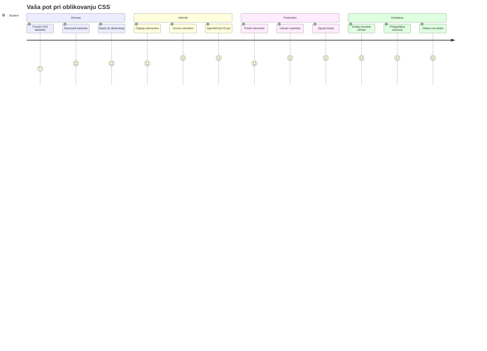
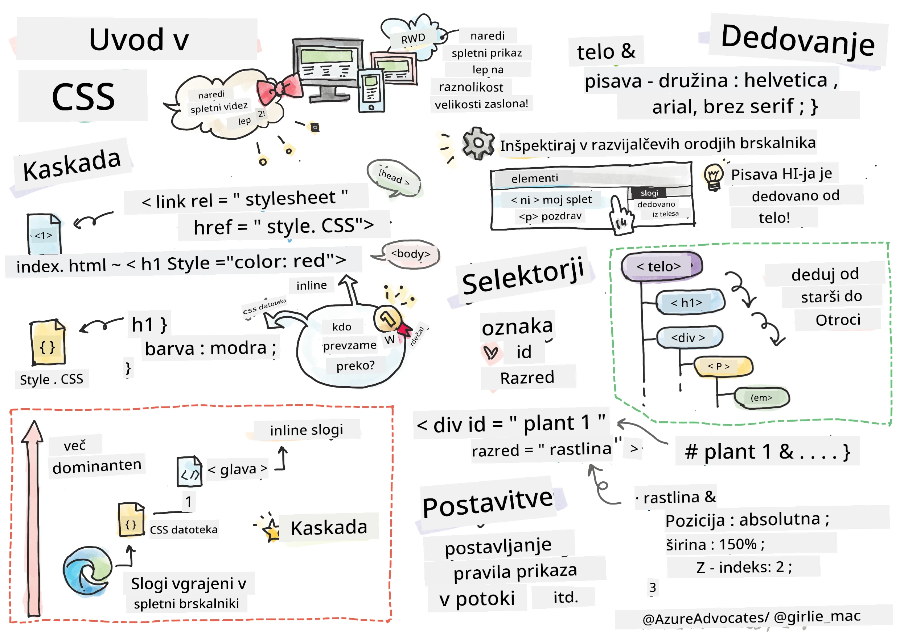
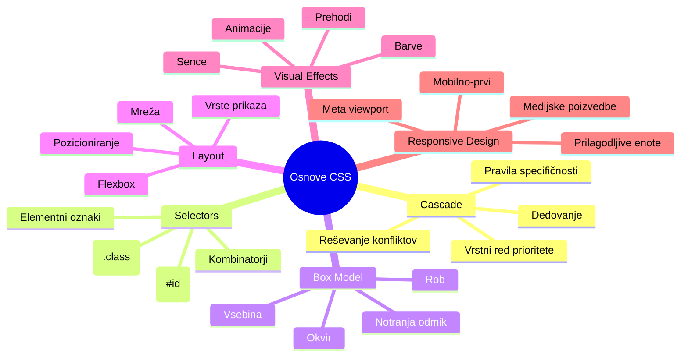
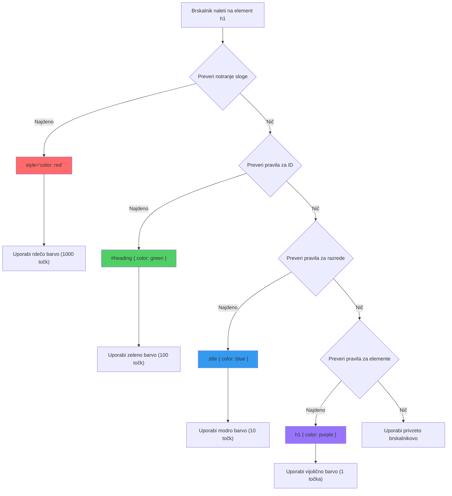
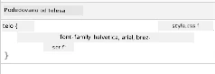
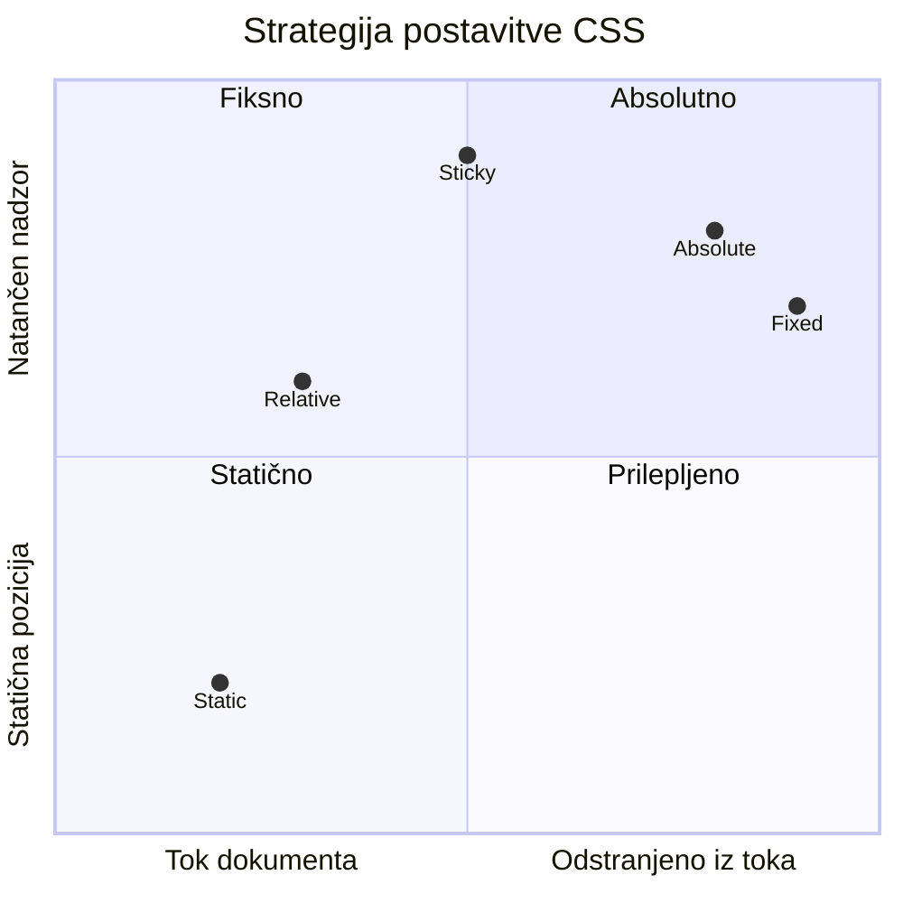
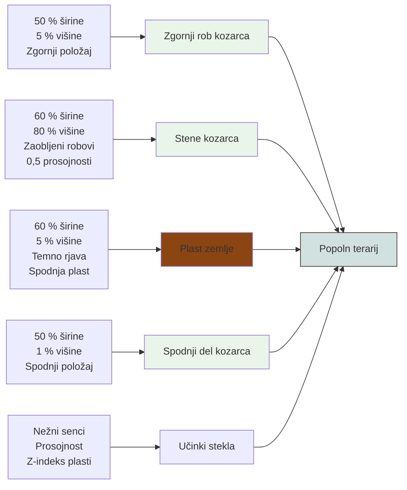
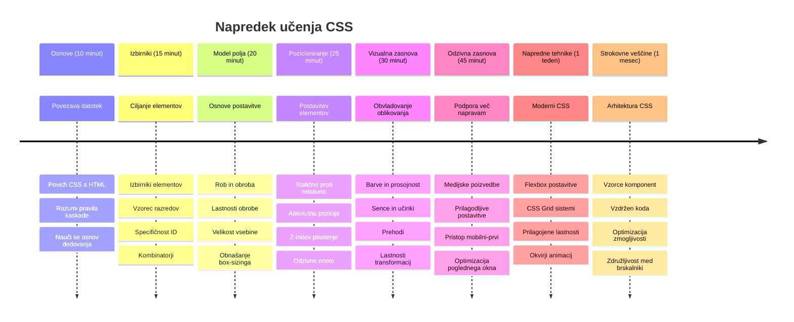

<!--
CO_OP_TRANSLATOR_METADATA:
{
  "original_hash": "e39f3a4e3bcccf94639e3af1248f8a4d",
  "translation_date": "2026-01-07T10:36:29+00:00",
  "source_file": "3-terrarium/2-intro-to-css/README.md",
  "language_code": "sl"
}
-->
# Terrarij Projekt Del 2: Uvod v CSS



> Sketchnote avtorja [Tomomi Imura](https://twitter.com/girlie_mac)

Se spomnite, kako je vaš HTML terrarij izgledal precej osnovno? CSS je tisto, kjer to preprosto strukturo spremenimo v nekaj vizualno privlačnega.

Če je HTML kot gradnja ogrodja hiše, je CSS vse, kar hišo naredi za dom – barve na stenah, razporeditev pohištva, osvetlitev in kako sobe tekoče povezujejo. Pomislite, kako je Dvorec Versailles začel kot preprosta lovska koča, a je skrbna pozornost do dekoracije in postavitve spremenila v eno najbolj veličastnih stavb na svetu.

Danes bomo vaš terrarij preoblikovali iz funkcionalnega v dodelanega. Naučili se boste natančno pozicionirati elemente, narediti postavitve odzivne na različne velikosti zaslonov in ustvariti vizualno privlačnost, ki naredi spletne strani zanimive.

Ob koncu te lekcije boste videli, kako strateški CSS stil lahko bistveno izboljša vaš projekt. Dodajmo vašemu terrariju nekaj sloga.


## Predpredavanje Kviz

[Predpredavanje kviz](https://ff-quizzes.netlify.app/web/quiz/17)

## Začetek s CSS

CSS pogosto mislimo le kot "lepa nečesa naredi," vendar ima bistveno širšo vlogo. CSS je kot režiser filma – nadzorujete ne le, kako vse izgleda, temveč tudi, kako se premika, odgovarja na interakcijo in prilagaja različnim situacijam.

Sodobni CSS je izjemno sposoben. Lahko napišete kodo, ki samodejno prilagaja postavitve za telefone, tablice in namizne računalnike. Lahko ustvarite gladke animacije, ki usmerjajo pozornost uporabnikov tam, kjer je potrebna. Rezultati so lahko zelo impresivni, ko vse deluje skupaj.

> 💡 **Profesionalni Nasvet**: CSS se nenehno razvija z novimi funkcijami in zmogljivostmi. Vedno preverite [CanIUse.com](https://caniuse.com), da potrdite podporo brskalnikov za novejše funkcije CSS, preden jih uporabite v produkcijskih projektih.

**To bomo dosegli v tej lekciji:**
- **Ustvarili** popolno vizualno zasnovo za vaš terrarij z uporabo sodobnih CSS tehnik
- **Raziskali** osnovne pojme, kot so kaskada, dedovanje in CSS selektorji
- **Izvedli** odzivne strategije pozicioniranja in postavitve
- **Zgradili** terrarijev vsebnik z uporabo CSS oblik in stilov

### Predpogoj

Morali bi imeti dokončano HTML strukturo za vaš terrarij iz prejšnje lekcije in jo imeti pripravljeno za stiliziranje.

> 📺 **Video Viri**: Oglejte si ta koristni video vodnik
>
> [](https://www.youtube.com/watch?v=6yIdOIV9p1I)

### Nastavitev datoteke CSS

Preden lahko začnemo s stiliranjem, moramo povezati CSS z našim HTML-jem. Ta povezava brskalniku pove, kje najde navodila za stiliziranje našega terrarija.

V mapi terrarija ustvarite novo datoteko z imenom `style.css`, nato jo povežite v `<head>` delu vašega HTML dokumenta:

```html
<link rel="stylesheet" href="./style.css" />
```

**Kaj ta koda naredi:**
- **Ustvari** povezavo med vašimi HTML in CSS datotekami
- **Pove** brskalniku, naj naloži in uporabi stile iz `style.css`
- **Uporabi** atribut `rel="stylesheet"`, da določi, da gre za CSS datoteko
- **Naved** pot do datoteke z `href="./style.css"`

## Razumevanje CSS kaskade

Ste se kdaj spraševali, zakaj se CSS imenuje "kaskadni" stilni listi? Stili tečejo navzdol kot slap in včasih med seboj konfliktirajo.

Razmislite, kako deluje vojaška hierarhija – generalov ukaz je lahko "vsi vojaki oblečejo zeleno," vendar pa specifičen ukaz vaši enoti morda določa "oblečite modro uniformo za slovesnost." Natančnejše navodilo ima prednost. Tudi CSS sledi podobni logiki, in razumevanje te hierarhije močno olajša odpravljanje napak.

### Eksperimentiranje s prednostjo kaskade

Poglejmo delovanje kaskade tako, da ustvarimo konflikt stilov. Najprej dodajte inline stil v vašo `<h1>` oznako:

```html
<h1 style="color: red">My Terrarium</h1>
```

**Kaj ta koda naredi:**
- **Uporabi** rdečo barvo neposredno na element `<h1>` s pomočjo inline stila
- **Uporabi** atribut `style`, da v HTML vgradi CSS neposredno
- **Ustvari** najvišjo prioritetno pravilo za ta specifični element

Nato dodajte to pravilo v vašo datoteko `style.css`:

```css
h1 {
  color: blue;
}
```

**V zgornjem primeru smo:**
- **Določili** CSS pravilo, ki cilja na vse elemente `<h1>`
- **Nastavili** barvo besedila na modro z uporabo zunanjega stilske datoteke
- **Ustvarili** pravilo z nižjo prioriteto v primerjavi z inline stili

✅ **Preverjanje znanja**: Katera barva se prikaže v vaši spletni aplikaciji? Zakaj ta barva zmaga? Se lahko spomnite primerov, ko bi želeli preglasiti stile?


> 💡 **CSS vrstni red prednosti (od najvišje do najnižje):**
> 1. **Inline stili** (atribut style)
> 2. **ID-ji** (#myId)
> 3. **Razredi** (.myClass) in atributi
> 4. **Selektorji elementov** (h1, div, p)
> 5. **Privzete vrednosti brskalnika**

## Dedovanje (inheritance) v CSS

CSS dedovanje deluje kot genetika – elementi podedujejo določene lastnosti od svojih starševskih elementov. Če nastavite pisavo na element `body`, vsi notranji teksti samodejno uporabijo to isto pisavo. Podobno kot značilna oblika čeljusti Habsburške družine, ki se je pojavljala skozi generacije brez posebnih nastavitev za posameznike.

Vendar pa ni vse podedovano. Stil besedila, kot so pisave in barve, se dedujejo, vendar lastnosti postavitve, kot so robovi in obrobe, ne. Tako kot otroci podedujejo fizične lastnosti, a ne oblačilnega sloga svojih staršev.

### Opazovanje dedovanja pisave

Poglejmo dedovanje v akciji tako, da nastavimo pisavo na `<body>` element:

```css
body {
  font-family: 'Segoe UI', Tahoma, Geneva, Verdana, sans-serif;
}
```

**Kaj se tukaj zgodi:**
- **Nastavi** pisavno družino za celotno stran tako, da cilja na `<body>` element
- **Uporabi** pisavno verigo s rezervnimi pisavami za boljšo združljivost z brskalniki
- **Uporabi** sodobne sistemske pisave, ki izgledajo odlično na vseh operacijskih sistemih
- **Zagotovi**, da vsi otroški elementi podedujejo to pisavo, razen če so posebej preglaseni

Odprite orodja za razvijalce v brskalniku (F12), pojdite na zavihek Elements in preverite `<h1>` element. Videli boste, da podeduje pisavo od `body`:



✅ **Čas za eksperiment**: Poskusite nastaviti druge dedljive lastnosti na `<body>`, kot so `color`, `line-height` ali `text-align`. Kaj se zgodi z vašim naslovom in drugimi elementi?

> 📝 **Dedljive lastnosti vključujejo**: `color`, `font-family`, `font-size`, `line-height`, `text-align`, `visibility`
>
> **Nededične lastnosti vključujejo**: `margin`, `padding`, `border`, `width`, `height`, `position`

### 🔄 **Pedagoški pregled**
**Razumevanje temeljev CSS**: Preden se pomaknete na selektorje, zagotovite, da lahko:
- ✅ Razložite razliko med kaskado in dedovanjem
- ✅ Predvidite, kateri stil bo zmagal pri konfliktu specifičnosti
- ✅ Prepoznate, katere lastnosti se dedujejo od starševskih elementov
- ✅ Pravilno povežete CSS datoteke z HTML-jem

**Hiter test**: Če imate te stile, katere barve bo `<h1>` znotraj `<div class="special">`?
```css
div { color: blue; }
.special { color: green; }
h1 { color: red; }
```
*Odgovor: Rdeča (selektor elementa neposredno cilja h1)*

## Obvladovanje CSS selektorjev

CSS selektorji so način, kako ciljate specifične elemente za stiliziranje. Delujejo kot natančna navodila – namesto da rečete "hiša," boste rekli "modra hiša z rdečimi vrati na Maple Street."

CSS ponuja različne načine za specifičnost, izbira pravega selektorja pa je kot izbira primernega orodja za delo. Včasih morate stilizirati vsaka vrata v soseski, včasih le ena posebna vrata.

### Selektorji elementov (oznake)

Selektorji elementov ciljajo HTML elemente po imenu oznake. So odlični za nastavitev osnovnih stilov, ki se širijo po celotni strani:

```css
body {
  font-family: 'Segoe UI', Tahoma, Geneva, Verdana, sans-serif;
  margin: 0;
  padding: 0;
}

h1 {
  color: #3a241d;
  text-align: center;
  font-size: 2.5rem;
  margin-bottom: 1rem;
}
```

**Kaj naredijo ti slogi:**
- **Nastavljajo** dosledno tipografijo po celotni strani s selektorjem `body`
- **Odstranijo** privzete robove in odvečne prostorčke brskalnika za boljši nadzor
- **Stilizirajo** vse naslove z barvo, poravnavo in razmikom
- **Uporabljajo** enote `rem` za prilagodljivo in dostopno velikost pisave

Medtem ko elementarni selektorji dobro delujejo za splošno stiliziranje, boste potrebovali bolj specifične selektorje za posamezne komponente, kot so rastline v vašem terrariju.

### ID selektorji za unikatne elemente

ID selektorji uporabljajo simbol `#` in ciljajo elemente z edinstvenim atributom `id`. Ker morajo biti ID-ji na strani unikatni, so odlični za posebej stilizirane elemente, kot sta naš levi in desni rastlinski vsebnik.

Ustvarimo stil za stranske vsebnike našega terrarija, kjer bodo rastline:

```css
#left-container {
  background-color: #f5f5f5;
  width: 15%;
  left: 0;
  top: 0;
  position: absolute;
  height: 100vh;
  padding: 1rem;
  box-sizing: border-box;
}

#right-container {
  background-color: #f5f5f5;
  width: 15%;
  right: 0;
  top: 0;
  position: absolute;
  height: 100vh;
  padding: 1rem;
  box-sizing: border-box;
}
```

**Kaj ta koda doseže:**
- **Pozicionira** vsebnike na skrajne levi in desni rob z uporabo `absolute` pozicioniranja
- **Uporablja** enote `vh` (višina viewporta) za odzivno višino, ki se prilagaja velikosti zaslona
- **Uporablja** `box-sizing: border-box`, da je padding vključen v skupno širino
- **Odstrani** nepotrebne enote `px` pri vrednosti nič za čistejšo kodo
- **Nastavi** subtilno barvo ozadja, ki je bolj prijazna za oči kot močno siva

✅ **Izziv kakovosti kode**: Opazite, da ta CSS krši princip DRY (Don't Repeat Yourself - ne ponavljaj se). Ali ga lahko refaktorirate z uporabo tako ID-ja kot razreda?

**Izboljšan pristop:**
```html
<div id="left-container" class="container"></div>
<div id="right-container" class="container"></div>
```

```css
.container {
  background-color: #f5f5f5;
  width: 15%;
  top: 0;
  position: absolute;
  height: 100vh;
  padding: 1rem;
  box-sizing: border-box;
}

#left-container {
  left: 0;
}

#right-container {
  right: 0;
}
```

### Razredni selektorji za večkratno uporabo

Razredni selektorji uporabljajo simbol `.` in so odlični, ko želite uporabiti iste stile za več elementov. Za razliko od ID-jev, ki morajo biti unikatni, se razredi lahko večkrat uporabljajo po celotnem HTML-ju, kar je idealno za dosledno stiliranje.

V našem terrariju vsaka rastlina potrebuje podoben slog, hkrati pa tudi individualno pozicioniranje. Uporabili bomo kombinacijo razredov za skupne stile in ID-jev za unikatno pozicijo.

**Tukaj je HTML struktura za posamezno rastlino:**
```html
<div class="plant-holder">
  
</div>
```

**Ključni elementi pojasnjeni:**
- **Uporablja** `class="plant-holder"` za dosledno stiliziranje vsebnika za vse rastline
- **Uporablja** `class="plant"` za skupno stiliziranje slike in vedenje
- **Vključuje** unikatni `id="plant1"` za individualno pozicioniranje in interakcijo z JavaScriptom
- **Nudi** opisni alt tekst za dostopnost bralnikom zaslona

Zdaj dodajte te stile v vašo datoteko `style.css`:

```css
.plant-holder {
  position: relative;
  height: 13%;
  left: -0.6rem;
}

.plant {
  position: absolute;
  max-width: 150%;
  max-height: 150%;
  z-index: 2;
  transition: transform 0.3s ease;
}

.plant:hover {
  transform: scale(1.05);
}
```

**Razčlenitev teh stilov:**
- **Ustvari** relativno pozicioniranje za držalo rastline, da vzpostavi kontekst pozicioniranja
- **Nastavi** vsako držalo rastline na 13% višine, da vse rastline vertikalno ustrezajo brez drsenja
- **Premakne** držala rahlo levo za boljše centriranje rastlin znotraj njihovih vsebnikov
- **Dovoli** rastlinam, da se odzivno prilagajajo z lastnostmi `max-width` in `max-height`
- **Uporablja** `z-index`, da postavi rastline nad druge elemente v terrariju
- **Doda** subtilen efekt ob premiku miške z CSS prehodi za boljšo uporabniško interakcijo

✅ **Kritično razmišljanje**: Zakaj potrebujemo oba selektorja `.plant-holder` in `.plant`? Kaj bi se zgodilo, če bi uporabili samo enega?

> 💡 **Oblikovalski vzorec**: Vsebnik (`.plant-holder`) nadzoruje postavitev in pozicioniranje, medtem ko vsebina (`.plant`) nadzoruje videz in skaliranje. Takšna ločitev naredi kodo bolj vzdržno in prilagodljivo.

## Razumevanje CSS pozicioniranja

CSS pozicioniranje je kot režiser predstave – usmerjate, kje stoji vsak igralec in kako se premika po odru. Nekateri igralci sledijo standardni postavitvi, drugi pa potrebujejo specifično pozicijo za dramatičen učinek.

Ko enkrat razumete pozicioniranje, je veliko izzivov pri postavitvi lažje rešljivih. Potrebujete navigacijsko vrstico, ki ostaja na vrhu med pomikanjem? Pozicioniranje bo to uredilo. Želite namig, ki se pojavi na določenem mestu? Tudi to je pozicioniranje.

### Pet vrednosti pozicioniranja


| Vrednost pozicije | Vedenje | Primer uporabe |
|----------------|----------|----------|
| `static` | Privzeti tok, ignorira top/left/right/bottom | Normalna postavitev dokumenta |
| `relative` | Pozicionirano glede na normalni položaj | Manjše prilagoditve, ustvarjanje konteksta pozicioniranja |
| `absolute` | Pozicionirano glede na najbližjega pozicioniranega prednika | Natančna umestitev, prekrivanja |
| `fixed` | Pozicionirano glede na viewport | Navigacijske vrstice, lebdeči elementi |
| `sticky` | Preklaplja med relative in fixed glede na drsenje | Glave, ki se ob pomikanju pritrdijo |

### Pozicioniranje v našem terrariju

Naš terrarij uporablja strateško kombinacijo vrst pozicioniranja za ustvarjanje želene postavitve:

```css
/* Container positioning */
.container {
  position: absolute; /* Removes from normal flow */
  /* ... other styles ... */
}

/* Plant holder positioning */
.plant-holder {
  position: relative; /* Creates positioning context */
  /* ... other styles ... */
}

/* Plant positioning */
.plant {
  position: absolute; /* Allows precise placement within holder */
  /* ... other styles ... */
}
```

**Razumevanje strategije pozicioniranja:**
- **Absolutni vsebniki** so odstranjeni iz običajnega toka dokumenta in pritrjeni na robove zaslona
- **Relativna držala rastlin** ustvarjajo kontekst pozicioniranja, hkrati ostajajo v toku dokumenta
- **Absolutne rastline** so lahko natančno pozicionirane znotraj njihovih relativnih vsebnikov
- **Ta kombinacija** omogoča, da se rastline zložijo navpično in hkrati lahko imajo individualno pozicijo

> 🎯 **Zakaj je to pomembno**: Elementi `plant` potrebujejo absolutno pozicioniranje, da bodo v naslednji lekciji lahko povlečeni (draggable). Absolutno pozicioniranje jih odstrani iz normalnega toka postavitve, kar omogoča interakcijo povleci in spusti.

✅ **Čas za eksperiment**: Poskusite spremeniti vrednosti pozicioniranja in opazujte rezultate:
- Kaj se zgodi, če spremenite `.container` z `absolute` na `relative`?
- Kako se spremeni postavitev, če `.plant-holder` uporablja `absolute` namesto `relative`?
- Kaj se zgodi, ko preklopiš `.plant` na `relative` pozicioniranje?

### 🔄 **Pedagoška kontrola**
**Mojstrstvo CSS pozicioniranja**: Ustavi se in preveri svoje razumevanje:
- ✅ Ali lahko razložiš, zakaj rastline potrebujejo absolutno pozicioniranje za povleci-in-spusti?
- ✅ Ali razumeš, kako relativni vsebniki ustvarjajo kontekst pozicioniranja?
- ✅ Zakaj stranski vsebniki uporabljajo absolutno pozicioniranje?
- ✅ Kaj bi se zgodilo, če bi popolnoma odstranil deklaracije pozicije?

**Povezava z resničnim svetom**: Razmisli, kako CSS pozicioniranje odraža postavitev v resničnem svetu:
- **Static**: Knjige na polici (naravni vrstni red)
- **Relative**: Rahlo premikanje knjige, a ohranjanje njenega mesta
- **Absolute**: Postavitev zaznamka na natanko določeno stran
- **Fixed**: Samolepilni list, ki ostane viden, ko prelistuješ strani

## Gradnja terarija s CSS

Zdaj bomo zgradili steklen kozarec samo z uporabo CSS – brez slik ali grafičnih programov.

Ustvarjanje realistično videti stekla, senc in učinkov globine z uporabo pozicioniranja in transparentnosti prikazuje vizualne zmogljivosti CSS. Ta tehnika je podobna, kot so arhitekti Bauhausa uporabljali preproste geometrijske oblike za ustvarjanje kompleksnih in lepih struktur. Ko razumeš te principe, boš prepoznal CSS tehnike, ki stojijo za mnogimi spletnimi oblikami.


### Ustvarjanje komponent steklenega kozarca

Postopek gradnje terarija del za delom. Vsak del uporablja absolutno pozicioniranje in dimenzije v odstotkih za odzivno oblikovanje:

```css
.jar-walls {
  height: 80%;
  width: 60%;
  background: #d1e1df;
  border-radius: 1rem;
  position: absolute;
  bottom: 0.5%;
  left: 20%;
  opacity: 0.5;
  z-index: 1;
  box-shadow: inset 0 0 2rem rgba(0, 0, 0, 0.1);
}

.jar-top {
  width: 50%;
  height: 5%;
  background: #d1e1df;
  position: absolute;
  bottom: 80.5%;
  left: 25%;
  opacity: 0.7;
  z-index: 1;
  border-radius: 0.5rem 0.5rem 0 0;
}

.jar-bottom {
  width: 50%;
  height: 1%;
  background: #d1e1df;
  position: absolute;
  bottom: 0;
  left: 25%;
  opacity: 0.7;
  border-radius: 0 0 0.5rem 0.5rem;
}

.dirt {
  width: 60%;
  height: 5%;
  background: #3a241d;
  position: absolute;
  border-radius: 0 0 1rem 1rem;
  bottom: 1%;
  left: 20%;
  opacity: 0.7;
  z-index: -1;
}
```

**Razumevanje izgradnje terarija:**
- **Uporablja** dimenzije v odstotkih za odzivno skaliranje na vseh velikostih zaslona
- **Pozicionira** elemente absolutno, da jih natančno zloži in poravna
- **Uporablja** različne vrednosti prosojnosti za učinek stekla
- **Izvaja** razporeditev plasti z `z-index`, da so rastline prikazane znotraj kozarca
- **Dodaja** subtilno senco in izbrano radij ukrivljenosti za bolj realističen izgled

### Odzivno oblikovanje z odstotki

Opazuj, kako vse dimenzije uporabljajo odstotke namesto fiksnih pik:

**Zakaj je to pomembno:**
- **Zagotavlja**, da se terarij sorazmerno prilagodi na kateri koli velikosti zaslona
- **Ohranja** vizualne odnose med komponentami kozarca
- **Nudi** konsistentno izkušnjo od mobilnih telefonov do velikih namiznih zaslonov
- **Omogoča** prilagoditev brez razbijanja vizualne postavitve

### CSS enote v praksi

Uporabljamo `rem` enote za `border-radius`, ki skalirajo glede na velikost osnovne pisave. To ustvarja bolj dostopne zasnove, ki spoštujejo uporabniške nastavitve pisav. Več o [relativnih CSS enotah](https://www.w3.org/TR/css-values-3/#font-relative-lengths) najdeš v uradni specifikaciji.

✅ **Vizualno eksperimentiranje**: Poskusi prilagoditi te vrednosti in opazuj učinke:
- Spremeni prosojnost kozarca z 0.5 na 0.8 – kako to vpliva na videz stekla?
- Prilagodi barvo zemlje iz `#3a241d` v `#8B4513` – kakšen je vizualni učinek?
- Spremeni `z-index` zemlje na 2 – kaj se zgodi s plastenjem?

### 🔄 **Pedagoška kontrola**
**Razumevanje vizualnega oblikovanja CSS**: Potrdi svoje znanje vizualnih CSS učinkov:
- ✅ Kako dimenzije v odstotkih omogočajo odzivno oblikovanje?
- ✅ Zakaj prosojnost ustvarja efekt steklene transparentnosti?
- ✅ Kakšno vlogo ima `z-index` pri plastenju elementov?
- ✅ Kako vrednosti `border-radius` oblikujejo obliko kozarca?

**Načelo oblikovanja**: Opazuj, kako gradimo kompleksne vizuale iz preprostih oblik:
1. **Pravokotniki** → **Zaobljeni pravokotniki** → **Komponente kozarca**
2. **Enobarvno** → **Prosojnost** → **Učinek stekla**
3. **Posamezni elementi** → **Slojevita sestava** → **3D izgled**

---

## Izziv GitHub Copilot agenta 🚀

Uporabi način Agenta za dokončanje naslednjega izziva:

**Opis:** Ustvari CSS animacijo, ki nežno premika rastline v terariju sem ter tja, simulirajoč naraven veter. To ti bo pomagalo vaditi CSS animacije, transformacije in ključne sličice (keyframes) ter izboljšati vizualni izgled terarija.

**Navodilo:** Dodaj CSS ključne animacije, da rastline v terariju nežno nihajo levo-desno. Ustvari animacijo nihanja, ki rahlo zavrti vsako rastlino (2-3 stopinje) levo in desno s trajanjem 3-4 sekunde in jo uporabi za razred `.plant`. Zagotovi, da animacija neskončno teče in ima funkcijo olajšanja za naravni gib.

Več o [agent načinu](https://code.visualstudio.com/blogs/2025/02/24/introducing-copilot-agent-mode) si oglej tukaj.

## 🚀 Izziv: Dodajanje steklenih odsevov

Pripravljen, da izboljšaš svoj terarij z realističnimi steklenimi odsevi? Ta tehnika bo dodala globino in realizem zasnovi.

Ustvaril boš subtilne poudarke, ki simulirajo, kako se svetloba odbija od steklenih površin. Ta pristop je podoben, kot so renesančni slikarji, kot je Jan van Eyck, uporabljali svetlobo in odseve, da so naslikano steklo naredili tridimenzionalno. Tukaj je tisto, kar ciljaš:


**Tvoj izziv:**
- **Ustvari** subtilne bele ali svetle ovalne oblike za steklene odseve
- **Pozicioniraj** jih strateško na levi strani kozarca
- **Uporabi** ustrezno prosojnost in zamegljenost za realističen odsev svetlobe
- **Uporabi** `border-radius` za organsko, mehurčkasto obliko
- **Eksperimentiraj** z degradacijami ali sencami za boljši realizem

## Kvizek po predavanju

[Post-lecture quiz](https://ff-quizzes.netlify.app/web/quiz/18)

## Razširi svoje CSS znanje

CSS je sprva lahko zapleten, a razumevanje teh osnovnih konceptov nudi trdno osnovo za naprednejše tehnike.

**Naslednja področja učenja CSS:**
- **Flexbox** – poenostavi poravnavo in razporeditev elementov
- **CSS Grid** – zagotavlja močna orodja za kompleksne postavitve
- **CSS spremenljivke** – zmanjšujejo ponavljanje in izboljšujejo vzdrževanje
- **Odzivno oblikovanje** – zagotavlja dobro delovanje na različnih velikostih zaslonov

### Interaktivni viri za učenje

Vadite te koncepte z uporabo teh zabavnih in praktičnih iger:
- 🐸 [Flexbox Froggy](https://flexboxfroggy.com/) – obvladaj Flexbox z zabavnimi izzivi
- 🌱 [Grid Garden](https://codepip.com/games/grid-garden/) – nauči se CSS Grid s sajenjem virtualnih korenčkov
- 🎯 [CSS Battle](https://cssbattle.dev/) – preizkusi svoje CSS spretnosti z izzivi kodiranja

### Dodatno učenje

Za poglobljeno znanje CSS osnov zaključi modul Microsoft Learn: [Stiliziraj svojo HTML aplikacijo s CSS](https://docs.microsoft.com/learn/modules/build-simple-website/4-css-basics/?WT.mc_id=academic-77807-sagibbon)

### ⚡ **Kaj lahko narediš v naslednjih 5 minutah**
- [ ] Odpri DevTools in preglej CSS sloge na katerikoli spletni strani v panelu Elements
- [ ] Ustvari preprosto CSS datoteko in jo poveži s HTML stranjo
- [ ] Poskusi spreminjati barve z različnimi metodami: hex, RGB, in poimenovane barve
- [ ] Vadite model polja z dodajanjem paddinga in margine na div

### 🎯 **Kaj lahko dosežeš v tem času**
- [ ] Zaključi kviz po lekciji in preglej osnovne pojme CSS
- [ ] Stiliziraj svojo HTML stran s pisavami, barvami in razmiki
- [ ] Ustvari preprosto postavitev s flexbox ali gridom
- [ ] Eksperimentiraj s CSS prehodi za gladke učinke
- [ ] Vadite odzivno oblikovanje z medijskimi poizvedbami

### 📅 **Tvoj tedenski CSS izziv**
- [ ] Zaključi nalogo stilizacije terarija z ustvarjalnim pristopom
- [ ] Obvladaj CSS Grid z gradnjo postavitve fotogalerije
- [ ] Nauči se CSS animacij za oživitev svojih oblik
- [ ] Raziskuj CSS predprocesorje kot sta Sass ali Less
- [ ] Študiraj načela oblikovanja in jih uporabi v CSS
- [ ] Analiziraj in znova ustvari zanimive spletne dizajne

### 🌟 **Tvoj mesečni mojstrski razvoj oblikovanja**
- [ ] Zgradi celoten odziven sistem oblikovanja spletnih strani
- [ ] Nauči se CSS-in-JS ali ogrodij z uporabniško usmerjenim pristopom, kot je Tailwind
- [ ] Prispevaj k odprtokodnim projektom s CSS izboljšavami
- [ ] Obvladaj napredne CSS koncepte kot so lastnosti po meri in containment
- [ ] Ustvari ponovno uporabne knjižnice komponent z modularnim CSS
- [ ] Mentoriraj druge, ki se učijo CSS in deli znanje oblikovanja

## 🎯 Tvoj časovni načrt za mojstrstvo CSS


### 🛠️ Povzetek orodij za CSS

Po zaključku te lekcije imaš zdaj:
- **Razumevanje kaska­de**: Kako stili dedujejo in preglasijo drug drugega
- **Obvladavanje selektorjev**: Natančno ciljanje z elementi, razredi in ID-ji
- **Sposobnosti pozicioniranja**: Strategično postavljanje elementov in plastenje
- **Vizualno oblikovanje**: Ustvarjanje steklenih učinkov, senc in transparentnosti
- **Tehnike odzivnosti**: Postavitve v odstotkih, ki se prilagajajo kateremu koli zaslonu
- **Organizacija kode**: Čista, vzdržljiva CSS struktura
- **Moderne prakse**: Uporaba relativnih enot in dostopnih oblikovalskih vzorcev

**Naslednji koraki**: Tvoj terarij ima zdaj tako strukturo (HTML) kot stil (CSS). Zadnja lekcija bo dodala interaktivnost z JavaScript! 

## Naloga

[CSS Refactoring](assignment.md)

---

<!-- CO-OP TRANSLATOR DISCLAIMER START -->
**Omejitev odgovornosti**:  
Ta dokument je bil preveden z uporabo AI prevajalske storitve [Co-op Translator](https://github.com/Azure/co-op-translator). Čeprav si prizadevamo za natančnost, vas opozarjamo, da lahko avtomatizirani prevodi vsebujejo napake ali netočnosti. Izvirni dokument v izvorni različici je treba upoštevati kot avtoritativni vir. Za pomembne informacije priporočamo strokovni človeški prevod. Nismo odgovorni za morebitna nerazumevanja ali napačne interpretacije, ki izhajajo iz uporabe tega prevoda.
<!-- CO-OP TRANSLATOR DISCLAIMER END -->