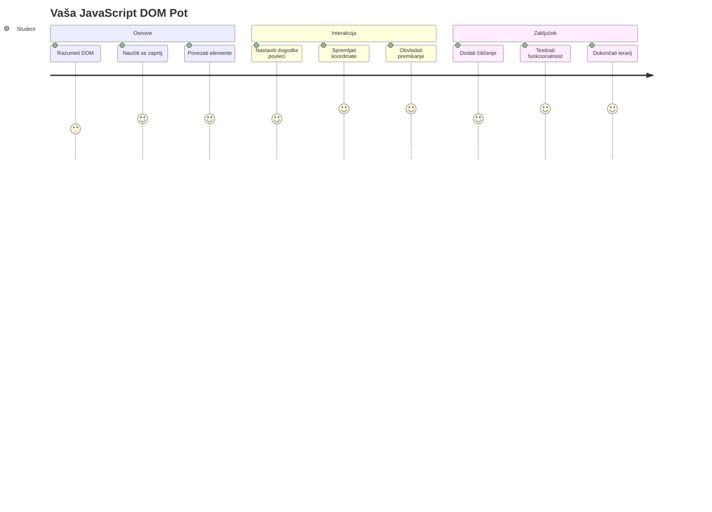
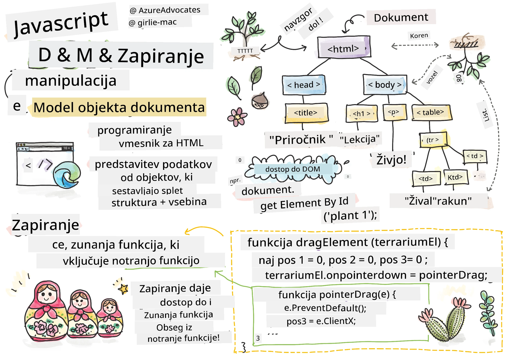
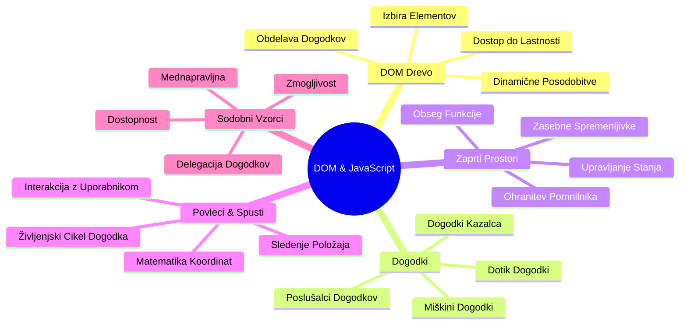
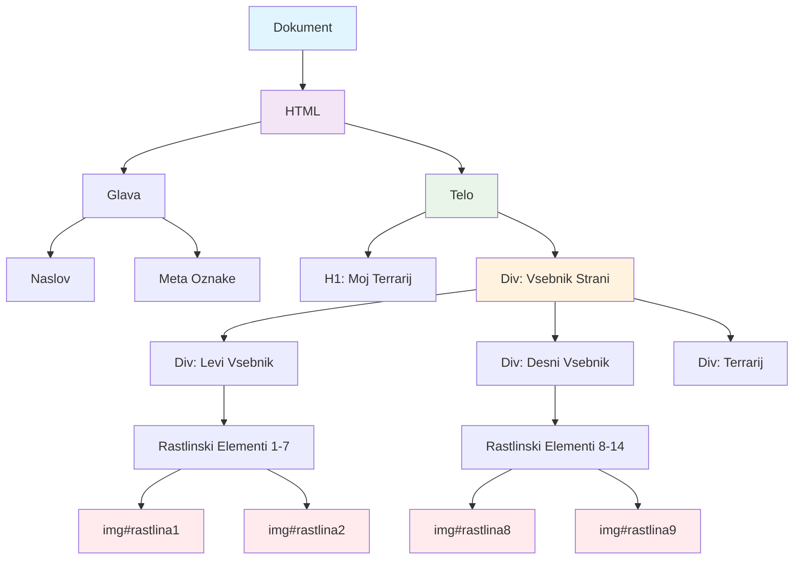
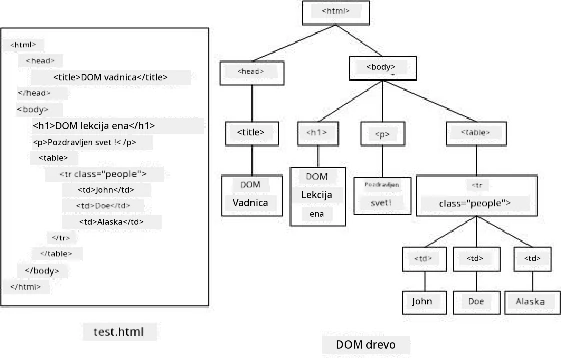
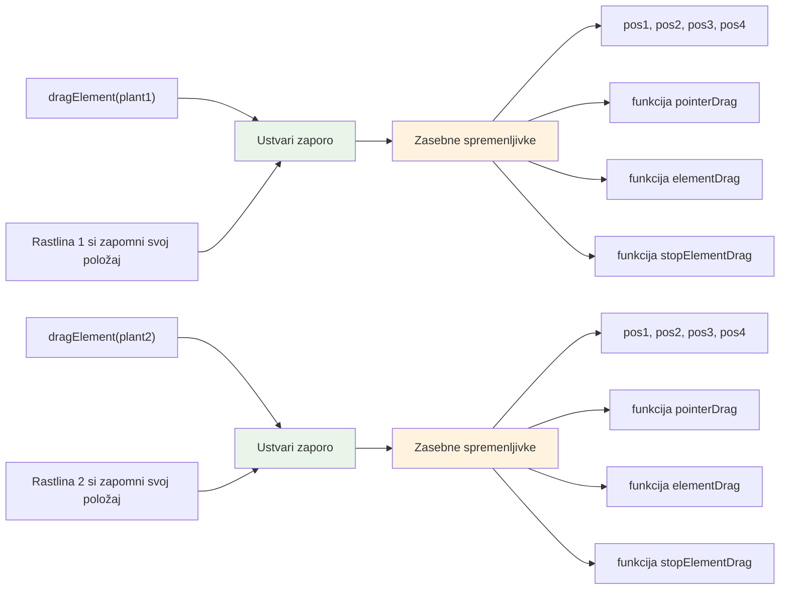
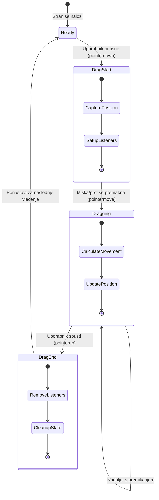
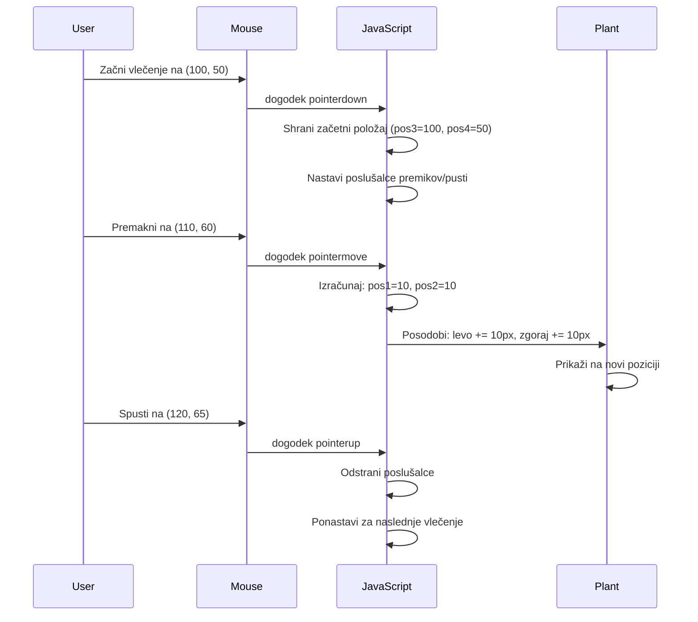
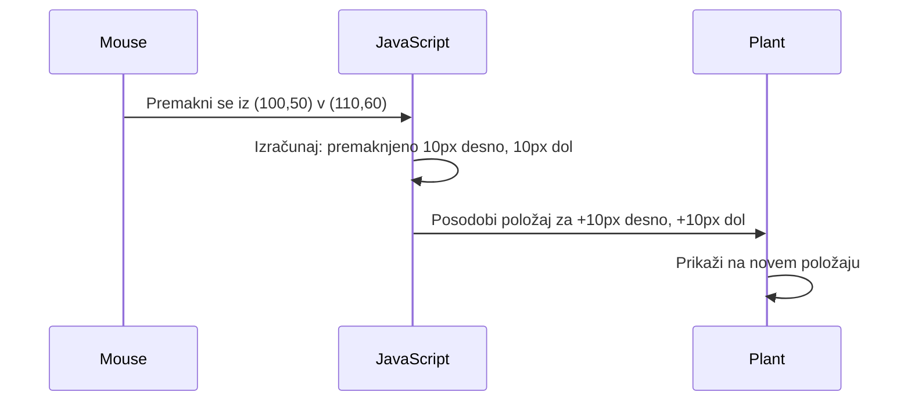
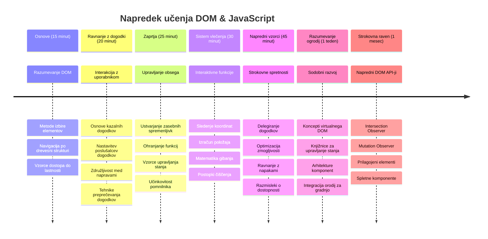

# Projekt Terrarium Del 3: Manipulacija DOM in JavaScript zaprtja



> Sketchnote avtorja [Tomomi Imura](https://twitter.com/girlie_mac)

Dobrodošli v eni najbolj zanimivih vidikov spletnega razvoja - ustvarjanje interaktivnosti! Model dokumenta (DOM) je kot most med vašo HTML in JavaScript, danes ga bomo uporabili, da vašemu terrariju vdihnemo življenje. Ko je Tim Berners-Lee ustvaril prvi spletni brskalnik, si je zamislil splet, kjer so lahko dokumenti dinamični in interaktivni – DOM omogoča uresničitev te vizije.

Ravno tako bomo raziskali JavaScript zaprtja, kar se morda sprva sliši zastrašujoče. Predstavljajte si zaprtja kot ustvarjanje "žepkov spomina", kjer lahko vaše funkcije shranijo pomembne informacije. Tako kot ima vsaka rastlina v vašem terrariju svojo podatkovno kartico za sledenje položaja. Ob koncu te lekcije boste razumeli, kako naravna in uporabna so.

To gradimo: terrarij, kjer lahko uporabniki rastline povlečejo in spustijo kamorkoli želijo. Naučili se boste tehnik manipulacije DOM, ki poganjajo vse od povleci-in-spusti nalaganja datotek do interaktivnih iger. Oživimo vaš terrarij.


## Kviz pred predavanjem

[Kviz pred predavanjem](https://ff-quizzes.netlify.app/web/quiz/19)

## Razumevanje DOM: Vaš prehod do interaktivnih spletnih strani

Model dokumenta (DOM) je način, kako JavaScript komunicira z vašimi HTML elementi. Ko vaš brskalnik naloži HTML stran, ustvari strukturirano predstavitev te strani v pomnilniku – to je DOM. Predstavljajte si ga kot družinsko drevo, kjer je vsak HTML element družinski član, do katerega lahko JavaScript dostopa, ga spreminja ali prerazporeja.

Manipulacija DOM spremeni statične strani v interaktivna spletna mesta. Vsakič, ko vidite, da se gumb ob zadržanju miške obarva drugače, se vsebina posodobi brez osvežitve strani ali lahko elemente povlečete po zaslonu, je to delo DOM manipulacije.




> Predstavitev DOM in HTML označbe, ki nanj kaže. Avtor: [Olfa Nasraoui](https://www.researchgate.net/publication/221417012_Profile-Based_Focused_Crawler_for_Social_Media-Sharing_Websites)

**To je tisto, kar naredi DOM zmogljiv:**
- **Nudi** strukturiran način za dostop do kateregakoli elementa na vaši strani
- **Omogoča** dinamične posodobitve vsebine brez osvežitve strani
- **Dovoli** odziv v realnem času na uporabniške interakcije, kot so kliki in vleki
- **Ustvarja** osnovo za sodobne interaktivne spletne aplikacije

## JavaScript zaprtja: Ustvarjanje organizirane in močne kode

[JavaScript zaprtje](https://developer.mozilla.org/docs/Web/JavaScript/Closures) je kot da bi funkciji dali njeno lastno zasebno delovno območje s trajnim spominom. Pomislite na Darwinove gorjuše na Galapaških otokih, ki so si vsak razvili specializirana kljuna glede na svoj specifični habitat – zaprtja delujejo podobno, saj ustvarjajo specializirane funkcije, ki si "zapomnijo" specifičen kontekst tudi potem, ko je njihova nadrejena funkcija končala.

V našem terrariju zaprtja pomagajo vsaki rastlini, da si samostojno zapomni njen položaj. Ta vzorec se pojavlja povsod v profesionalnem JavaScript razvoju, zato je pomembno razumevanje tega koncepta.


> 💡 **Razumevanje zaprtij**: Zaprtja so pomembna tema v JavaScriptu in veliko razvijalcev jih uporablja več let, preden v celoti razume vse teoretične vidike. Danes se osredotočamo na prakso – zaprtja boste razumeli naravno, ko bomo gradili interaktivne funkcije. Razumevanje se bo razvijalo, ko boste videli, kako rešujejo resnične probleme.


> Predstavitev DOM in HTML označbe, ki nanj kaže. Avtor: [Olfa Nasraoui](https://www.researchgate.net/publication/221417012_Profile-Based_Focused_Crawler_for_Social_Media-Sharing_Websites)

V tej lekciji bomo dokončali naš interaktivni terrarij projekt tako, da bomo ustvarili JavaScript, ki bo uporabniku omogočal manipulacijo rastlin na strani.

## Preden začnemo: Priprava za uspeh

Potrebovali boste svoje HTML in CSS datoteke iz prejšnjih lekcij terrarija - pravkar bomo začeli narediti ta statični dizajn interaktiven. Če se nam pridružujete prvič, je dobro, da najprej dokončate te lekcije, saj nudijo pomemben kontekst.

To bomo zgradili:
- **Gladko povleci-in-spusti** za vse rastline v terrariju
- **Sledenje koordinatam**, da si rastline zapomnijo svoje položaje
- **Popoln interaktivni vmesnik** z uporabo navadnega JavaScripta
- **Čista, organizirana koda** z uporabo vzorcev zaprtij

## Priprava vaše JavaScript datoteke

Ustvarimo JavaScript datoteko, ki bo naredila vaš terrarij interaktiven.

**Korak 1: Ustvarite svojo skriptno datoteko**

V mapi terrarija ustvarite novo datoteko z imenom `script.js`.

**Korak 2: Povežite JavaScript z vašo HTML**

Dodajte to oznako skripte v `<head>` odsek vaše datoteke `index.html`:

```html
<script src="./script.js" defer></script>
```

**Zakaj je atribut `defer` pomemben:**
- **Zagotavlja**, da JavaScript počaka, dokler ni celoten HTML naložen
- **Preprečuje** napake, kjer JavaScript išče elemente, ki še niso pripravljeni
- **Zagotavlja**, da so vsi vaši rastlinski elementi na voljo za interakcijo
- **Nudi** boljšo zmogljivost kot postavljanje skript na dno strani

> ⚠️ **Pomembna opomba**: Atribut `defer` preprečuje pogoste časovne težave. Brez njega bi JavaScript lahko poskušal dostopati do HTML elementov, preden so naloženi, kar povzroči napake.

---

## Povezovanje JavaScripta z vašimi HTML elementi

Preden lahko naredimo elemente povlečljive, mora JavaScript najti te elemente v DOM. Predstavljajte si to kot knjižni katalog – ko imate katalogsko številko, lahko najdete točno tisto knjigo, ki jo potrebujete, in dostopate do vsebine.

Uporabili bomo metodo `document.getElementById()`, da vzpostavimo te povezave. To je kot zelo natančen sistem hranjenja datotek – podate ID in ta najde natanko tisti element v vašem HTML-ju.

### Omogočanje funkcije vlečenja za vse rastline

Dodajte ta koda v vašo datoteko `script.js`:

```javascript
// Omogoči funkcijo povleci za vseh 14 rastlin
dragElement(document.getElementById('plant1'));
dragElement(document.getElementById('plant2'));
dragElement(document.getElementById('plant3'));
dragElement(document.getElementById('plant4'));
dragElement(document.getElementById('plant5'));
dragElement(document.getElementById('plant6'));
dragElement(document.getElementById('plant7'));
dragElement(document.getElementById('plant8'));
dragElement(document.getElementById('plant9'));
dragElement(document.getElementById('plant10'));
dragElement(document.getElementById('plant11'));
dragElement(document.getElementById('plant12'));
dragElement(document.getElementById('plant13'));
dragElement(document.getElementById('plant14'));
```

**Kaj ta koda doseže:**
- **Najde** vsak rastlinski element v DOM z uporabo njegove unikatne ID oznake
- **Pridobi** JavaScript referenco na vsak HTML element
- **Posreduje** vsak element funkciji `dragElement` (ki jo bomo ustvarili naslednjo)
- **Pripravi** vsako rastlino za povleci-in-spusti interakcijo
- **Poveže** vašo HTML strukturo z JavaScript funkcionalnostjo

> 🎯 **Zakaj uporabljamo ID in ne razrede?** ID-ji nudijo unikatne identifikatorje za specifične elemente, medtem ko so CSS razredi namenjeni stiliranju skupin elementov. Ko JavaScript manipulira posamezne elemente, ID-ji zagotavljajo natančnost in učinkovitost.

> 💡 **Nasvet**: Opazite, da kličemo `dragElement()` za vsako rastlino posebej. Ta pristop omogoča, da ima vsaka rastlina svojo samostojno funkcijo vlečenja, kar je ključno za gladko interakcijo uporabnika.

### 🔄 **Pedagoški pregled**
**Razumevanje povezave z DOM**: Pred nadaljevanjem k funkciji vlečenja potrdite, da lahko:
- ✅ Pojasnite, kako `document.getElementById()` najde HTML elemente
- ✅ Razumete, zakaj uporabljamo unikatne ID-je za vsako rastlino
- ✅ Opišete namen atributa `defer` v oznakah skripte
- ✅ Prepoznate, kako JavaScript in HTML povezuje DOM

**Hitri samopreizkus**: Kaj bi se zgodilo, če bi dva elementa imela isti ID? Zakaj `getElementById()` vrne samo en element?
*Odgovor: ID-ji morajo biti unikatni; če sta podvojena, se vrne samo prvi element*

---

## Ustvarjanje funkcije za vlečenje (dragElement) – zaprtje

Zdaj bomo ustvarili srce naše funkcije za vlečenje: zaprtje, ki upravlja z vedenjem vlečenja za vsako rastlino posebej. To zaprtje bo vsebovalo več notranjih funkcij, ki skupaj spremljajo gibanje miške in posodabljajo položaje elementov.

Zaprtja so idealna za to nalogo, saj nam omogočajo ustvarjanje "zasebnih" spremenljivk, ki trajajo med klici funkcij, s tem pa vsaki rastlini dajo samostojen sistem za sledenje koordinat.

### Razumevanje zaprtij s preprostim primerom

Pokažem vam zaprtja s preprostim primerom, ki ilustrira koncept:

```javascript
function createCounter() {
    let count = 0; // To je kot zasebna spremenljivka
    
    function increment() {
        count++; // Notranja funkcija si zapomni zunanjo spremenljivko
        return count;
    }
    
    return increment; // Vračamo notranjo funkcijo
}

const myCounter = createCounter();
console.log(myCounter()); // 1
console.log(myCounter()); // 2
```

**Kaj se dogaja v tem vzorcu zaprtja:**
- **Ustvari** zasebno spremenljivko `count`, ki obstaja samo znotraj tega zaprtja
- **Notranja funkcija** lahko dostopa in spreminja to zunanjo spremenljivko (mehanizem zaprtja)
- **Ko vrnemo** notranjo funkcijo, ta ohranja povezavo do teh zasebnih podatkov
- **Tudi potem, ko** `createCounter()` konča izvajanje, `count` traja in si zapomni svojo vrednost

### Zakaj so zaprtja idealna za funkcionalnost vlečenja

V našem terrariju mora vsaka rastlina zapomniti trenutne koordinate svojega položaja. Zaprtja nudijo popolno rešitev:

**Ključne prednosti za naš projekt:**
- **Ohranjajo** zasebne spremenljivke položaja za vsako rastlino samostojno
- **Shranjujejo** podatke o koordinatah med dogodki vlečenja
- **Preprečujejo** konflikte spremenljivk med različnimi povlečljivimi elementi
- **Ustvarjajo** čisto, organizirano kodo

> 🎯 **Cilj učenja**: Ni potrebno, da zdaj obvladate vse vidike zaprtij. Osredotočite se, kako vam pomagajo organizirati kodo in hraniti stanje za funkcijo vlečenja.


### Ustvarjanje funkcije dragElement

Zdaj zgradimo glavno funkcijo, ki bo upravljala vso logiko vlečenja. Dodajte to funkcijo pod deklaracijo rastlinskih elementov:

```javascript
function dragElement(terrariumElement) {
    // Inicializiraj spremenljivke za sledenje položaju
    let pos1 = 0,  // Prejšnja X pozicija miške
        pos2 = 0,  // Prejšnja Y pozicija miške
        pos3 = 0,  // Trenutna X pozicija miške
        pos4 = 0;  // Trenutna Y pozicija miške
    
    // Nastavi začetni poslušalec za dogodek povleci
    terrariumElement.onpointerdown = pointerDrag;
}
```

**Razumevanje sistema sledenja položaja:**
- **`pos1` in `pos2`**: hranita razliko med staro in novo pozicijo miške
- **`pos3` in `pos4`**: sledita trenutnim koordinatam miške
- **`terrariumElement`**: specifičen rastlinski element, ki ga delamo povlečljivega
- **`onpointerdown`**: dogodek, ki se sproži, ko uporabnik začne vleči

**Tako deluje vzorec zaprtja:**
- **Ustvari** zasebne spremenljivke položaja za vsak element rastline
- **Ohranja** te spremenljivke skozi celotno obdobje vlečenja
- **Zagotavlja**, da vsaka rastlina samostojno sledi svojim koordinatam
- **Nudi** čist vmesnik prek funkcije `dragElement`

### Zakaj uporabljati pointer dogodke?

Morda se sprašujete, zakaj uporabljamo `onpointerdown` namesto bolj znanega `onclick`. Tukaj je obrazložitev:

| Tip dogodka | Najbolj primeren za | Omejitev |
|-------------|--------------------|----------|
| `onclick`   | Preprosti kliki na gumb | Ne podpira vlečenja (samo kliki in sprostitve) |
| `onpointerdown` | Miška in dotik | Novi, a danes dobro podprti |
| `onmousedown` | Samo miška na namizju | Izključi uporabnike mobilnih naprav |

**Zakaj so pointer dogodki idealni za to, kar gradimo:**
- **Delo deluje** tako z miško, prstom ali celo pisalom
- **Izkusite enako** na prenosniku, tablici ali telefonu
- **Upravljajo** dejansko vlečenje (ne samo klikanje)
- **Ustvarjajo** gladko izkušnjo, ki jo uporabniki pričakujejo v sodobnih spletnih aplikacijah

> 💡 **Zaščita za prihodnost**: Pointer dogodki so sodoben način za upravljanje uporabniških interakcij. Namesto pisanja ločene kode za miško in dotik, dobite oboje brez dodatnega truda. Kar lepo, kajne?

### 🔄 **Pedagoški pregled**
**Razumevanje upravljanja dogodkov**: Ustavite se in potrdite razumevanje:
- ✅ Zakaj uporabljamo pointer dogodke namesto dogodkov miške?
- ✅ Kako spremenljivke v zaprtjih trajajo med klici funkcij?
- ✅ Kakšno vlogo ima `preventDefault()` pri gladkem vlečenju?
- ✅ Zakaj poslušalce dogodkov pripenjamo na dokument namesto posameznih elementov?

**Povezava z realnim svetom**: Pomislite na uporabniške vmesnike za povleci-in-spusti, ki jih vsakodnevno uporabljate:
- **Nalagadanje datotek**: Povleci datoteke v okno brskalnika
- **Kanban deske**: Premikanje nalog med stolpci
- **Galerije slik**: Spreminjanje vrstnega reda fotografij
- **Mobilni vmesniki**: Poteg in vleci na zaslonih na dotik

---

## Funkcija pointerDrag: zajem začetka vlečenja

Ko uporabnik pritisne na rastlino (ne glede na to, ali je to klik z miško ali dotik s prstom), se sproži funkcija `pointerDrag`. Ta funkcija zajame začetne koordinate in pripravi sistem za vlečenje.

Dodajte to funkcijo znotraj zaprtja `dragElement`, takoj za vrstico `terrariumElement.onpointerdown = pointerDrag;`:

```javascript
function pointerDrag(e) {
    // Prepreči privzeto vedenje brskalnika (kot je označevanje besedila)
    e.preventDefault();
    
    // Zajemi začetni položaj miške/zaslona na dotik
    pos3 = e.clientX;  // Koordinata X, kjer se je začelo potiskanje
    pos4 = e.clientY;  // Koordinata Y, kjer se je začelo potiskanje
    
    // Nastavi poslušalce dogodkov za postopek potiskanja
    document.onpointermove = elementDrag;
    document.onpointerup = stopElementDrag;
}
```

**Korak za korakom, kaj se dogaja:**
- **Preprečuje** privzete vedenja brskalnika, ki bi lahko motila vlečenje
- **Zabeleži** točne koordinate, kjer je uporabnik začel gesto vlečenja
- **Vzpostavi** poslušalce dogodkov za nadaljnje premike vlečenja
- **Pripravi** sistem, da sledi premikom miške/prsta po celotnem dokumentu

### Razumevanje preprečevanja dogodkov

Vrstica `e.preventDefault()` je ključna za gladko vlečenje:

**Brez preprečitve bi brskalniki lahko:**
- **Označili** besedilo med vlečenjem po strani
- **Sprožili** kontekstne menije pri vlečenju z desnim klikom
- **Motili** naše prilagojeno vedenje vlečenja
- **Ustvarili** vizualne artefakte med vlečenjem

> 🔍 **Preizkus**: Po zaključku te lekcije poskusite odstraniti `e.preventDefault()` in opazujte, kako to vpliva na izkušnjo vlečenja. Hitro boste razumeli pomen te vrstice!

### Sistem sledenja koordinat

Lastnosti `e.clientX` in `e.clientY` nam dajo natančne koordinate miške/dotika:

| Lastnost | Kaj meri | Uporaba |
|----------|----------|---------|
| `clientX` | Horizontalno pozicijo glede na vidno okno | Sledenje premiku levo-desno |
| `clientY` | Vertikalno pozicijo glede na vidno okno | Sledenje premiku gor-dol |
**Razumevanje teh koordinat:**
- **Nudi** natančne informacije o pozicioniranju v pikslih
- **Posodablja** se v realnem času, ko uporabnik premika kazalec
- **Ostaja** dosledno pri različnih velikostih zaslona in zoom nivojih
- **Omogoča** gladke, odzivne interakcije s povleci in spusti

### Nastavitev poslušalcev dogodkov na ravni dokumenta

Opazite, kako pripnemo dogodke premika in zaustavitve na celoten `document`, ne samo na element rastline:

```javascript
document.onpointermove = elementDrag;
document.onpointerup = stopElementDrag;
```

**Zakaj pripeti na dokument:**
- **Nadaljuje** s sledenjem tudi, ko miška zapusti element rastline
- **Preprečuje** prekinitev vlečenja, če uporabnik hitro premakne kazalec
- **Nudi** gladko vlečenje po celotnem zaslonu
- **Obravnava** robne primere, kjer se kazalec premakne izven okna brskalnika

> ⚡ **Opomba o zmogljivosti**: Ko vlečenje preneha, odstranili bomo te poslušalce dogodkov na ravni dokumenta, da preprečimo uhajanje pomnilnika in težave z zmogljivostjo.

## Dokončanje sistema vlečenja: premikanje in čiščenje

Zdaj dodamo dve preostali funkciji, ki upravljata z dejanskim premikanjem pri vlečenju in čiščenjem, ko vlečenje preneha. Ti funkciji sodelujeta za ustvarjanje gladkega in odzivnega premikanja rastline po vašem terariju.

### Funkcija elementDrag: sledenje premiku

Dodajte funkcijo `elementDrag` takoj za zaključnim zavitnim oklepajem `pointerDrag`:

```javascript
function elementDrag(e) {
    // Izračunajte premaknjeno razdaljo od zadnjega dogodka
    pos1 = pos3 - e.clientX;  // Premaknjena horizontalna razdalja
    pos2 = pos4 - e.clientY;  // Premaknjena vertikalna razdalja
    
    // Posodobite trenutno sledenje položaja
    pos3 = e.clientX;  // Nova trenutna X pozicija
    pos4 = e.clientY;  // Nova trenutna Y pozicija
    
    // Uporabi premik na položaj elementa
    terrariumElement.style.top = (terrariumElement.offsetTop - pos2) + 'px';
    terrariumElement.style.left = (terrariumElement.offsetLeft - pos1) + 'px';
}
```

**Razumevanje matematike koordinat:**
- **`pos1` in `pos2`**: Izračunata, koliko se je miška premaknila od zadnje posodobitve
- **`pos3` in `pos4`**: Shrani trenutni položaj miške za naslednji izračun
- **`offsetTop` in `offsetLeft`**: Dobita trenutni položaj elementa na strani
- **Logika odštevanja**: Premakne element za enako količino kot se je premaknila miška


**Tukaj je razčlenitev izračuna premika:**
1. **Izmeri** razliko med starim in novim položajem miške
2. **Izračuna** koliko naj se element premakne glede na premik miške
3. **Posodobi** lastnosti CSS položaja elementa v realnem času
4. **Shrani** nov položaj kot osnovo za naslednji izračun premika

### Vizualna predstavitev matematike


### Funkcija stopElementDrag: čiščenje

Dodajte funkcijo za čiščenje takoj za zaključnim zavitnim oklepajem `elementDrag`:

```javascript
function stopElementDrag() {
    // Odstranite poslušalce dogodkov na ravni dokumenta
    document.onpointerup = null;
    document.onpointermove = null;
}
```

**Zakaj je čiščenje nujno:**
- **Preprečuje** uhajanje pomnilnika zaradi nedokončanih poslušalcev dogodkov
- **Ustavi** vedenje vlečenja, ko uporabnik spusti rastlino
- **Dovoli** drugim elementom neodvisno vlečenje
- **Ponastavi** sistem za naslednjo operacijo vlečenja

**Kaj se zgodi brez čiščenja:**
- Poslušalci dogodkov tečejo tudi po koncu vlečenja
- Zmogljivost se poslabša, ker se poslušalci kopiči
- Pri interakciji z drugimi elementi pride do nepričakovanega vedenja
- Brskalnik porablja vire za nepotrebno obdelavo dogodkov

### Razumevanje CSS lastnosti pozicioniranja

Naš sistem vlečenja manipulira z dvema ključnima CSS lastnostma:

| Lastnost | Kaj nadzoruje | Kako jo uporabljamo |
|----------|---------------|---------------------|
| `top` | Razdalja od zgornjega roba | Vertikalna pozicija med vlečenjem |
| `left` | Razdalja od levega roba | Horizontalna pozicija med vlečenjem |

**Ključne ugotovitve o offset lastnostih:**
- **`offsetTop`**: Trenutna razdalja od vrha pozicioniranega roditeljskega elementa
- **`offsetLeft`**: Trenutna razdalja od levega roba pozicioniranega roditeljskega elementa
- **Kontekst pozicioniranja**: Te vrednosti so relativne na najbližjega pozicioniranega prednika
- **Posodobitve v realnem času**: Spremenijo se takoj, ko spreminjamo CSS lastnosti

> 🎯 **Filozofija oblikovanja**: Ta sistem vlečenja je namenoma prilagodljiv – ne obstajajo "cone odlaganja" ali omejitve. Uporabniki lahko rastline postavijo kjerkoli, kar jim daje popoln ustvarjalni nadzor nad oblikovanjem terarija.

## Vse skupaj: vaš popoln sistem vlečenja

Čestitke! Ravno ste zgradili sofisticiran sistem povleci in spusti z uporabo čistega JavaScript-a. Vaša popolna funkcija `dragElement` sedaj vsebuje zmogljiv closure, ki upravlja:

**Kaj vaš closure doseže:**
- **Vzdržuje** zasebne spremenljivke položaja za vsako rastlino neodvisno
- **Upravlja** celoten življenjski cikel vlečenja od začetka do konca
- **Nudi** gladko, odzivno premikanje po celotnem zaslonu
- **Počisti** vire pravilno, da prepreči uhajanje pomnilnika
- **Ustvari** intuitiven, ustvarjalen vmesnik za oblikovanje terarija

### Preizkusite svoj interaktivni terarij

Zdaj preizkusite svoj interaktivni terarij! Odprite datoteko `index.html` v spletnem brskalniku in preizkusite funkcionalnost:

1. **Kliknite in držite** katerokoli rastlino, da začnete vlečenje
2. **Premikajte miško ali prst** in opazujte, kako rastlina gladko sledi
3. **Spustite** za odlaganje rastline na novi položaj
4. **Eksperimentirajte** z različnimi postavitvami, da raziščete vmesnik

🥇 **Dosežek**: Ustvarili ste popolnoma interaktivno spletno aplikacijo, ki uporablja osnovne koncepte, ki jih profesionalni razvijalci uporabljajo vsakodnevno. Ta povleci in spusti funkcionalnost temelji na istih principih kot nalaganje datotek, kanban table in mnogi drugi interaktivni vmesniki.

### 🔄 **Pedagoška kontrola**
**Popolno razumevanje sistema**: Preverite svoje znanje o celotnem sistemu vlečenja:
- ✅ Kako zapreti vzdržujejo neodvisno stanje za vsako rastlino?
- ✅ Zakaj je matematični izračun koordinat potreben za gladko premikanje?
- ✅ Kaj se zgodi, če pozabimo očistiti poslušalce dogodkov?
- ✅ Kako se ta vzorec razširi na bolj kompleksne interakcije?

**Refleksija kakovosti kode**: Preglejte svojo celotno rešitev:
- **Modularna zasnova**: Vsaka rastlina dobi svoj closure primerek
- **Učinkovitost dogodkov**: Pravilna nastavitev in čiščenje poslušalcev
- **Podpora različnim napravam**: Deluje na namizju in mobilnih napravah
- **Zavedanje o zmogljivosti**: Brez uhajanja pomnilnika ali odvečnih izračunov


---

## Izziv GitHub Copilot Agent 🚀

Uporabite način Agenta, da dokončate naslednji izziv:

**Opis:** Izboljšajte projekt terarija z dodajanjem funkcije ponastavitve, ki vse rastline vrne na njihove začetne položaje z gladkimi animacijami.

**Poziv:** Ustvarite gumb za ponastavitev, ki ob kliku animira vse rastline nazaj na njihove prvotne položaje na stranski vrstici s CSS prehodi. Funkcija naj shrani začetne položaje ob nalaganju strani in gladko premakne rastline nazaj v tiste položaje v roku 1 sekunde, ko je gumb za ponastavitev pritisnjen.

Več o [agent mode](https://code.visualstudio.com/blogs/2025/02/24/introducing-copilot-agent-mode) preberite tukaj.

## 🚀 Dodatni izziv: Razširite svoje spretnosti

Pripravljeni na naslednjo stopnjo vašega terarija? Poskusite uresničiti te izboljšave:

**Ustvarjalne razširitve:**
- **Dvojni klik** na rastlino, da jo pripeljete v ospredje (manipulacija z z-index)
- **Dodajte vizualno povratno informacijo**, kot je subtilen sijaj ob premiku miške nad rastlinami
- **Implementirajte meje**, da preprečite vlečenje rastlin izven terarija
- **Ustvarite funkcijo shranjevanja**, ki pomni položaje rastlin z uporabo localStorage
- **Dodajte zvočne učinke** za dviganje in odlaganje rastlin

> 💡 **Priložnost za učenje**: Vsak od teh izzivov vas bo naučil novih vidikov manipulacije DOM-a, upravljanja dogodkov in oblikovanja uporabniške izkušnje.

## Kvizek po predavanju

[Kviz po predavanju](https://ff-quizzes.netlify.app/web/quiz/20)

## Pregled in samostojno učenje: Poglabljanje razumevanja

Obvladali ste osnove manipulacije DOM-a in closures, a vedno je še več za raziskati! Tukaj so poti za nadaljnje širjenje znanja in spretnosti.

### Alternativni pristopi povleci in spusti

Uporabili smo poPointer dogodke za maksimalno prilagodljivost, a spletni razvoj ponuja več pristopov:

| Pristop | Najbolj za | Vrednost učenja |
|---------|------------|-----------------|
| [HTML Drag and Drop API](https://developer.mozilla.org/docs/Web/API/HTML_Drag_and_Drop_API) | Nalaganje datotek, formalne cone za vlečenje | Razumevanje nativnih zmogljivosti brskalnika |
| [Dotik dogodki (Touch Events)](https://developer.mozilla.org/docs/Web/API/Touch_events) | Specifične mobilne interakcije | Vzorec razvoja, usmerjen na mobilne naprave |
| CSS lastnosti `transform` | Gladke animacije | Tehnike za optimizacijo zmogljivosti |

### Napredne teme manipulacije DOM-a

**Naslednji koraki na vaši poti učenja:**
- **Delegiranje dogodkov**: Učinkovito upravljanje dogodkov za več elementov
- **Intersection Observer**: Zaznavanje vstopa/izstopa elementov iz vidnega polja
- **Mutation Observer**: Sledenje spremembam v strukturi DOM-a
- **Web Components**: Ustvarjanje ponovno uporabnih, enkapsuliranih UI komponent
- **Koncepti virtualnega DOM-a**: Razumevanje, kako ogrodja optimizirajo posodobitve DOM-a

### Bistveni viri za nadaljnje učenje

**Tehnična dokumentacija:**
- [MDN vodnik za Pointer Events](https://developer.mozilla.org/docs/Web/API/Pointer_events) – Izčrpen priročnik za pointer dogodke
- [W3C specifikacija Pointer Events](https://www.w3.org/TR/pointerevents1/) – Uradna dokumentacija standardov
- [Poglobljena razlaga JavaScript closures](https://developer.mozilla.org/docs/Web/JavaScript/Closures) – Napredni vzorci closure-jev

**Združljivost brskalnikov:**
- [CanIUse.com](https://caniuse.com/) – Preverite podporo funkcij v brskalnikih
- [MDN podatki o združljivosti brskalnikov](https://github.com/mdn/browser-compat-data) – Podrobne informacije o združljivosti

**Priložnosti za prakso:**
- **Zgradite** sestavljanko z uporabo podobnih mehanizmov vlečenja
- **Ustvarite** kanban tablo z upravljanjem opravil preko povleci in spusti
- **Oblikujte** slikovno galerijo z razporejanjem fotografij z vlečenjem
- **Preizkusite** dotik geste za mobilne vmesnike

> 🎯 **Strategija učenja**: Najboljši način za utrjevanje teh konceptov je praksa. Poskusite ustvariti različne vmesnike z vlečenjem – vsak projekt vas bo naučil nekaj novega o uporabniški interakciji in manipulaciji DOM-a.

### ⚡ **Kaj lahko naredite v naslednjih 5 minutah**
- [ ] Odprite orodja za razvijalce v brskalniku in v konzolo vpišite `document.querySelector('body')`
- [ ] Poskusite spremeniti besedilo na spletni strani z uporabo `innerHTML` ali `textContent`
- [ ] Dodajte poslušalca dogodka klika na katerikoli gumb ali povezavo na spletni strani
- [ ] Preverite strukturo DOM drevesa z uporabo zavihka Elements

### 🎯 **Kaj lahko dosežete v naslednji uri**
- [ ] Dokončajte kviz po lekciji in preglejte koncepte manipulacije DOM-a
- [ ] Ustvarite interaktivno spletno stran, ki se odziva na uporabniške klike
- [ ] Vadite upravljanje dogodkov z različnimi tipi dogodkov (click, mouseover, keypress)
- [ ] Zgradite preprosto opravilo ali števec z manipulacijo DOM-a
- [ ] Raziskujte povezavo med HTML elementi in JavaScript objekti

### 📅 **Vaša tedenska JavaScript pot**
- [ ] Dokončajte interaktivni terarij z funkcionalnostjo povleci in spusti
- [ ] Obvladajte delegiranje dogodkov za učinkovito upravljanje
- [ ] Naučite se o zanki dogodkov (event loop) in asinhronem JavaScriptu
- [ ] Vadite closures z modulacijo zasebnega stanja
- [ ] Raziskujte sodobne DOM API-je, kot je Intersection Observer
- [ ] Gradite interaktivne komponente brez uporabe ogrodij

### 🌟 **Vaša mesečna JavaScript mojstrska pot**
- [ ] Ustvarite kompleksno enostransko aplikacijo z uporabo čistega JavaScript-a
- [ ] Naučite se sodobnega ogrodja (React, Vue ali Angular) in primerjajte z navadnim DOM-om
- [ ] Prispevajte v odprtokodne JavaScript projekte
- [ ] Obvladajte napredne koncepte, kot so spletne komponente in prilagojeni elementi
- [ ] Gradite zmogljive spletne aplikacije z optimiziranimi vzorci DOM-a
- [ ] Poučujte druge o manipulaciji DOM-a in osnovah JavaScript-a

## 🎯 Časovnica za vašo obvladovanje JavaScript DOM-a


### 🛠️ Povzetek vaše orodjarne JavaScript

Po zaključku te lekcije imate sedaj:
- **Obvladanje DOM-a**: Izbira elementov, manipulacija lastnosti in navigacija po drevesu
- **Strokovnost dogodkov**: Upravljanje interakcij na različnih napravah z uporabo pointer dogodkov
- **Razumevanje closure-jev**: Upravljanje zasebnega stanja in trajanja funkcij
- **Interaktivni sistemi**: Popolna implementacija vleci in spusti od začetka
- **Zavedanje zmogljivosti**: Pravilno čiščenje dogodkov in upravljanje pomnilnika
- **Sodobni vzorci**: Tehnike organizacije kode, ki se uporabljajo v profesionalnem razvoju
- **Uporabniška izkušnja**: Ustvarjanje intuitivnih, odzivnih vmesnikov

**Profesionalne veščine:** Zgradili ste funkcije z uporabo istih tehnik kot:
- **Trello/Kanban table**: Vlečenje kartic med stolpci
- **Sistemi za nalaganje datotek**: Upravljanje datotek z vleči in spusti
- **Galerije slik**: Vmesniki za razporejanje fotografij
- **Mobilne aplikacije**: Vzorec interakcij na dotik

**Naslednja stopnja:** Pripravljeni ste raziskati sodobna ogrodja, kot so React, Vue ali Angular, ki gradijo na teh temeljnih konceptih manipulacije DOM-a!

## Domača naloga

[Še malo dela z DOM](assignment.md)

---

<!-- CO-OP TRANSLATOR DISCLAIMER START -->
**Opozorilo**:
Ta dokument je bil preveden z uporabo AI prevajalske storitve [Co-op Translator](https://github.com/Azure/co-op-translator). Čeprav si prizadevamo za natančnost, upoštevajte, da avtomatizirani prevodi lahko vsebujejo napake ali netočnosti. Izvirni dokument v njegovi izvorni jezikovni različici velja za avtoritativni vir. Za kritične informacije priporočamo strokovni človeški prevod. Za morebitne nesporazume ali napačne razlage, ki izhajajo iz uporabe tega prevoda, ne prevzemamo odgovornosti.
<!-- CO-OP TRANSLATOR DISCLAIMER END -->