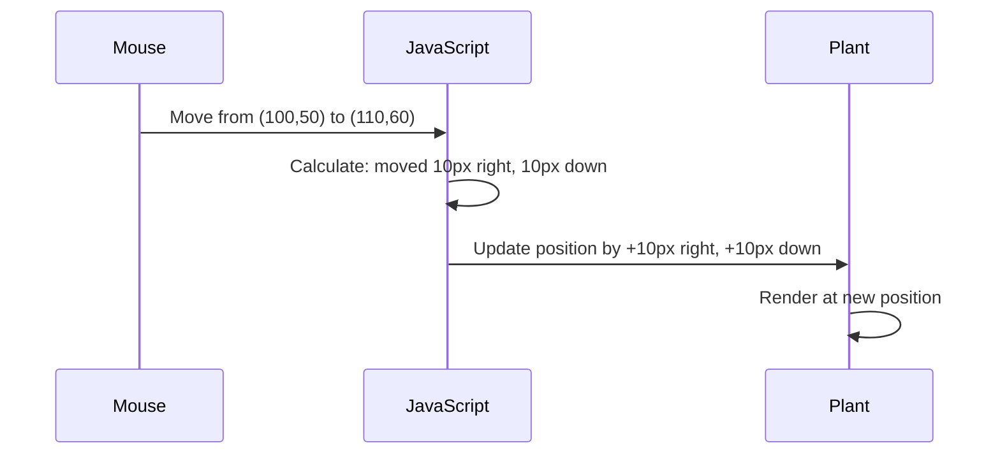

<!--
CO_OP_TRANSLATOR_METADATA:
{
  "original_hash": "bc93f6285423033ebf5b8abeb5282888",
  "translation_date": "2025-10-25T00:32:00+00:00",
  "source_file": "3-terrarium/3-intro-to-DOM-and-closures/README.md",
  "language_code": "sl"
}
-->
# Projekt Terrarij, 3. del: Manipulacija DOM-a in zaprtja v JavaScriptu


> Sketchnote avtorja [Tomomi Imura](https://twitter.com/girlie_mac)

Dobrodošli v enem najbolj zanimivih vidikov spletnega razvoja - interaktivnost! Dokumentni objektni model (DOM) je kot most med vašim HTML-jem in JavaScriptom, danes pa ga bomo uporabili, da vaš terrarij oživi. Ko je Tim Berners-Lee ustvaril prvi spletni brskalnik, si je zamislil splet, kjer bi dokumenti lahko bili dinamični in interaktivni - DOM omogoča uresničitev te vizije.

Raziskali bomo tudi zaprtja v JavaScriptu, ki se morda na začetku zdijo zastrašujoča. Zaprtja si predstavljajte kot "žepke spomina", kjer si vaše funkcije lahko zapomnijo pomembne informacije. To je kot da bi vsaka rastlina v vašem terrariju imela svoj zapis podatkov za sledenje svoji poziciji. Do konca te lekcije boste razumeli, kako naravna in uporabna so.

Tukaj je, kaj bomo ustvarili: terrarij, kjer lahko uporabniki povlečejo in spustijo rastline kamorkoli želijo. Naučili se boste tehnik manipulacije DOM-a, ki omogočajo vse od nalaganja datotek z vlečenjem in spuščanjem do interaktivnih iger. Naj vaš terrarij oživi.

## Predhodni kviz

[Predhodni kviz](https://ff-quizzes.netlify.app/web/quiz/19)

## Razumevanje DOM-a: Vaša vstopnica v interaktivne spletne strani

Dokumentni objektni model (DOM) je način, kako JavaScript komunicira z vašimi HTML elementi. Ko vaš brskalnik naloži HTML stran, ustvari strukturirano predstavitev te strani v pomnilniku - to je DOM. Predstavljajte si ga kot družinsko drevo, kjer je vsak HTML element družinski član, do katerega lahko JavaScript dostopa, ga spreminja ali preureja.

Manipulacija DOM-a pretvori statične strani v interaktivne spletne strani. Vsakič, ko vidite, da se gumb ob premiku miške spremeni barvo, se vsebina posodobi brez osvežitve strani ali elementi, ki jih lahko premikate, je to delo manipulacije DOM-a.


> Predstavitev DOM-a in HTML oznak, ki se nanj nanašajo. Avtor [Olfa Nasraoui](https://www.researchgate.net/publication/221417012_Profile-Based_Focused_Crawler_for_Social_Media-Sharing_Websites)

**Kaj naredi DOM tako močan:**
- **Omogoča** strukturiran dostop do katerega koli elementa na vaši strani
- **Omogoča** dinamične posodobitve vsebine brez osvežitve strani
- **Omogoča** odziv v realnem času na interakcije uporabnikov, kot so kliki in premiki
- **Ustvarja** temelje za sodobne interaktivne spletne aplikacije

## Zaprtja v JavaScriptu: Organizacija in moč kode

[Zaprtje v JavaScriptu](https://developer.mozilla.org/docs/Web/JavaScript/Closures) je kot da bi funkciji dali njen lasten zasebni delovni prostor s trajnim spominom. Pomislite na Darwinove ščinkavce na Galapaških otokih, ki so razvili specializirane kljune glede na svoje specifično okolje - zaprtja delujejo podobno, saj ustvarjajo specializirane funkcije, ki si "zapomnijo" svoj specifičen kontekst, tudi po tem, ko se njihova starševska funkcija zaključi.

V našem terrariju zaprtja pomagajo vsaki rastlini, da si neodvisno zapomni svojo pozicijo. Ta vzorec se pojavlja povsod v profesionalnem razvoju JavaScripta, zato je pomembno, da ga razumemo.

> 💡 **Razumevanje zaprtij**: Zaprtja so pomembna tema v JavaScriptu, mnogi razvijalci pa jih uporabljajo leta, preden popolnoma razumejo vse teoretične vidike. Danes se osredotočamo na praktično uporabo - videli boste, kako se zaprtja naravno pojavijo med gradnjo naših interaktivnih funkcij. Razumevanje se bo razvijalo, ko boste videli, kako rešujejo resnične težave.


> Predstavitev DOM-a in HTML oznak, ki se nanj nanašajo. Avtor [Olfa Nasraoui](https://www.researchgate.net/publication/221417012_Profile-Based_Focused_Crawler_for_Social_Media-Sharing_Websites)

V tej lekciji bomo dokončali naš interaktivni projekt terrarija z ustvarjanjem JavaScripta, ki bo uporabniku omogočil manipulacijo rastlin na strani.

## Preden začnemo: Priprava na uspeh

Potrebovali boste svoje HTML in CSS datoteke iz prejšnjih lekcij o terrariju - zdaj bomo to statično zasnovo naredili interaktivno. Če se pridružujete prvič, bo dokončanje teh lekcij najprej zagotovilo pomemben kontekst.

Tukaj je, kaj bomo ustvarili:
- **Gladko vlečenje in spuščanje** za vse rastline v terrariju
- **Sledenje koordinatam**, da si rastline zapomnijo svoje pozicije
- **Popolnoma interaktiven vmesnik** z uporabo osnovnega JavaScripta
- **Čista, organizirana koda** z uporabo vzorcev zaprtja

## Priprava vaše JavaScript datoteke

Ustvarimo JavaScript datoteko, ki bo vaš terrarij naredila interaktiven.

**Korak 1: Ustvarite svojo skriptno datoteko**

V mapi terrarija ustvarite novo datoteko z imenom `script.js`.

**Korak 2: Povežite JavaScript z vašim HTML-jem**

Dodajte to oznako skripta v razdelek `<head>` vaše datoteke `index.html`:

```html
<script src="./script.js" defer></script>
```

**Zakaj je atribut `defer` pomemben:**
- **Zagotavlja**, da JavaScript počaka, dokler se ne naloži celoten HTML
- **Preprečuje** napake, kjer JavaScript išče elemente, ki še niso pripravljeni
- **Zagotavlja**, da so vsi vaši elementi rastlin na voljo za interakcijo
- **Omogoča** boljšo zmogljivost kot postavitev skriptov na dno strani

> ⚠️ **Pomembna opomba**: Atribut `defer` preprečuje pogoste časovne težave. Brez njega lahko JavaScript poskuša dostopati do HTML elementov, preden so naloženi, kar povzroča napake.

---

## Povezovanje JavaScripta z vašimi HTML elementi

Preden lahko naredimo elemente premikajoče, mora JavaScript najti te elemente v DOM-u. To si predstavljajte kot knjižni sistem katalogizacije - ko imate številko kataloga, lahko najdete točno tisto knjigo, ki jo potrebujete, in dostopate do vseh njenih vsebin.

Uporabili bomo metodo `document.getElementById()`, da vzpostavimo te povezave. To je kot da imate natančen sistem za arhiviranje - podate ID in najde točno tisti element, ki ga potrebujete v vašem HTML-ju.

### Omogočanje funkcionalnosti vlečenja za vse rastline

Dodajte to kodo v vašo datoteko `script.js`:

```javascript
// Enable drag functionality for all 14 plants
dragElement(document.getElementById('plant1'));
dragElement(document.getElementById('plant2'));
dragElement(document.getElementById('plant3'));
dragElement(document.getElementById('plant4'));
dragElement(document.getElementById('plant5'));
dragElement(document.getElementById('plant6'));
dragElement(document.getElementById('plant7'));
dragElement(document.getElementById('plant8'));
dragElement(document.getElementById('plant9'));
dragElement(document.getElementById('plant10'));
dragElement(document.getElementById('plant11'));
dragElement(document.getElementById('plant12'));
dragElement(document.getElementById('plant13'));
dragElement(document.getElementById('plant14'));
```

**Kaj ta koda doseže:**
- **Najde** vsak element rastline v DOM-u z uporabo njegovega edinstvenega ID-ja
- **Pridobi** JavaScript referenco na vsak HTML element
- **Posreduje** vsak element funkciji `dragElement` (ki jo bomo ustvarili naslednje)
- **Pripravi** vsako rastlino za interakcijo z vlečenjem in spuščanjem
- **Poveže** vašo HTML strukturo z JavaScript funkcionalnostjo

> 🎯 **Zakaj uporabljati ID-je namesto razredov?** ID-ji zagotavljajo edinstvene identifikatorje za specifične elemente, medtem ko so CSS razredi namenjeni oblikovanju skupin elementov. Ko JavaScript potrebuje manipulacijo posameznih elementov, ID-ji ponujajo natančnost in zmogljivost, ki ju potrebujemo.

> 💡 **Nasvet**: Opazite, kako kličemo `dragElement()` za vsako rastlino posebej. Ta pristop zagotavlja, da vsaka rastlina dobi svoje neodvisno vedenje pri vlečenju, kar je bistveno za gladko interakcijo uporabnika.

---

## Ustvarjanje zaprtja funkcije dragElement

Zdaj bomo ustvarili srce naše funkcionalnosti vlečenja: zaprtje, ki upravlja vedenje vlečenja za vsako rastlino. To zaprtje bo vsebovalo več notranjih funkcij, ki bodo skupaj sledile premikom miške in posodabljale pozicije elementov.

Zaprtja so popolna za to nalogo, saj nam omogočajo ustvarjanje "zasebnih" spremenljivk, ki ostanejo med klici funkcij, kar vsaki rastlini omogoča, da neodvisno sledi svojim koordinatam.

### Razumevanje zaprtij s preprostim primerom

Naj vam pokažem zaprtja s preprostim primerom, ki ilustrira koncept:

```javascript
function createCounter() {
    let count = 0; // This is like a private variable
    
    function increment() {
        count++; // The inner function remembers the outer variable
        return count;
    }
    
    return increment; // We're giving back the inner function
}

const myCounter = createCounter();
console.log(myCounter()); // 1
console.log(myCounter()); // 2
```

**Kaj se dogaja v tem vzorcu zaprtja:**
- **Ustvari** zasebno spremenljivko `count`, ki obstaja samo znotraj tega zaprtja
- **Notranja funkcija** lahko dostopa do te zunanje spremenljivke in jo spreminja (mehanizem zaprtja)
- **Ko vrnemo** notranjo funkcijo, ohrani povezavo s temi zasebnimi podatki
- **Tudi po tem**, ko se `createCounter()` zaključi, `count` ostane in si zapomni svojo vrednost

### Zakaj so zaprtja popolna za funkcionalnost vlečenja

Za naš terrarij mora vsaka rastlina neodvisno slediti svojim trenutnim koordinatam. Zaprtja ponujajo popolno rešitev:

**Ključne prednosti za naš projekt:**
- **Ohranja** zasebne pozicijske spremenljivke za vsako rastlino neodvisno
- **Shranjuje** podatke o koordinatah med dogodki vlečenja
- **Preprečuje** konflikte spremenljivk med različnimi premikajočimi se elementi
- **Ustvarja** čisto, organizirano strukturo kode

> 🎯 **Cilj učenja**: Ni vam treba takoj obvladati vseh vidikov zaprtij. Osredotočite se na to, kako nam pomagajo organizirati kodo in ohraniti stanje za našo funkcionalnost vlečenja.

### Ustvarjanje funkcije dragElement

Zdaj bomo zgradili glavno funkcijo, ki bo obravnavala vso logiko vlečenja. Dodajte to funkcijo pod deklaracije elementov rastlin:

```javascript
function dragElement(terrariumElement) {
    // Initialize position tracking variables
    let pos1 = 0,  // Previous mouse X position
        pos2 = 0,  // Previous mouse Y position  
        pos3 = 0,  // Current mouse X position
        pos4 = 0;  // Current mouse Y position
    
    // Set up the initial drag event listener
    terrariumElement.onpointerdown = pointerDrag;
}
```

**Razumevanje sistema sledenja pozicij:**
- **`pos1` in `pos2`**: Shranjujeta razliko med starimi in novimi pozicijami miške
- **`pos3` in `pos4`**: Sledita trenutnim koordinatam miške
- **`terrariumElement`**: Specifičen element rastline, ki ga naredimo premikajočega
- **`onpointerdown`**: Dogodek, ki se sproži, ko uporabnik začne vleči

**Kako deluje vzorec zaprtja:**
- **Ustvari** zasebne pozicijske spremenljivke za vsak element rastline
- **Ohranja** te spremenljivke skozi celoten življenjski cikel vlečenja
- **Zagotavlja**, da vsaka rastlina neodvisno sledi svojim koordinatam
- **Omogoča** čisti vmesnik prek funkcije `dragElement`

### Zakaj uporabljati dogodke kazalca?

Morda se sprašujete, zakaj uporabljamo `onpointerdown` namesto bolj znanega `onclick`. Tukaj je razlog:

| Vrsta dogodka | Najboljše za | Pomanjkljivost |
|---------------|--------------|----------------|
| `onclick` | Preprosti kliki na gumb | Ne more obravnavati vlečenja (samo klike in sprostitve) |
| `onpointerdown` | Miška in dotik | Novejši, vendar dobro podprt |
| `onmousedown` | Samo namizna miška | Izpušča mobilne uporabnike |

**Zakaj so dogodki kazalca popolni za to, kar gradimo:**
- **Odlično delujejo**, ne glede na to, ali nekdo uporablja miško, prst ali celo pisalo
- **Občutek je enak** na prenosniku, tablici ali telefonu
- **Obravnava** dejansko gibanje vlečenja (ne samo klik in sprostitev)
- **Ustvarja** gladko izkušnjo, ki jo uporabniki pričakujejo od sodobnih spletnih aplikacij

> 💡 **Priprava na prihodnost**: Dogodki kazalca so sodoben način obravnave interakcij uporabnikov. Namesto da pišete ločeno kodo za miško in dotik, dobite oboje brez dodatnega dela. Zelo priročno, kajne?

---

## Funkcija pointerDrag: Zajem začetka vlečenja

Ko uporabnik pritisne na rastlino (bodisi s klikom miške ali dotikom prsta), funkcija `pointerDrag` začne delovati. Ta funkcija zajame začetne koordinate in vzpostavi sistem vlečenja.

Dodajte to funkcijo znotraj vašega zaprtja `dragElement`, takoj za vrstico `terrariumElement.onpointerdown = pointerDrag;`:

```javascript
function pointerDrag(e) {
    // Prevent default browser behavior (like text selection)
    e.preventDefault();
    
    // Capture the initial mouse/touch position
    pos3 = e.clientX;  // X coordinate where drag started
    pos4 = e.clientY;  // Y coordinate where drag started
    
    // Set up event listeners for the dragging process
    document.onpointermove = elementDrag;
    document.onpointerup = stopElementDrag;
}
```

**Korak za korakom, kaj se dogaja:**
- **Preprečuje** privzeto vedenje brskalnika, ki bi lahko motilo vlečenje
- **Zabeleži** natančne koordinate, kjer je uporabnik začel gesto vlečenja
- **Vzpostavi** poslušalce dogodkov za nadaljnje gibanje vlečenja
- **Pripravi** sistem za sledenje gibanju miške/prsta po celotnem dokumentu

### Razumevanje preprečevanja dogodkov

Vrstica `e.preventDefault()` je ključna za gladko vlečenje:

**Brez preprečevanja bi brskalniki lahko:**
- **Izbrali** besedilo med vlečenjem po strani
- **Sprožili** kontekstne menije ob desnem kliku med vlečenjem
- **Motili** naše prilagojeno vedenje vlečenja
- **Ustvarili** vizualne artefakte med operacijo vlečenja

> 🔍 **Eksperiment**: Po zaključku te lekcije poskusite odstraniti `e.preventDefault()` in opazujte, kako to vpliva na izkušnjo vlečenja. Hitro boste razumeli, zakaj je ta vrstica ključna!

### Sistem sledenja koordinatam

Lastnosti `e.clientX` in `e.clientY` nam dajejo natančne koordinate miške/dotika:

| Lastnost | Kaj meri | Uporaba |
|----------|----------|---------|
| `clientX` | Horizontalni položaj glede na pogled | Sledenje premiku levo-desno |
| `clientY` | Vertikalni položaj glede na pogled | Sledenje premiku gor-dol |

**Razumevanje teh koordinat:**
- **Omogoča** natančne informacije o položaju v slikovnih pikah
- **Posodablja** v realnem času, ko se uporabnik premika s kazalcem
- **Ostaja** dosledno na različnih velikostih zaslona in ravneh povečave
- **Omogoča** gladke, odzivne interakcije z vlečenjem

### Nastavitev poslušalcev dogodkov na ravni dokumenta

Opazite, kako pripnemo dogodke za premikanje in ustavljanje na celoten `document`, ne le na element rastline:

```javascript
document.onpointermove = elementDrag;
document.onpointerup = stopElementDrag;
```

**Zakaj pripeti na dokument:**
- **Nadaljuje** sledenje, tudi ko miška zapusti element rastline
- **Preprečuje** prekinitev vlečenja, če se uporabnik hitro premika
- **Omogoča** gladko vlečenje po celotnem zaslonu
- **Obravnava** robne primere, kjer kazalec zapusti okno brskalnika

> ⚡ **Opomba o zmogljivosti**: Te poslušalce dogodkov na ravni dokumenta bomo odstranili, ko se vlečenje ustavi, da se izognemo težavam z uporabo pomnilnika in zmogljivostjo.

## Zaključek sistema vlečenja: Gibanje in čiščenje

Zdaj bomo dodali preostali dve funkciji, ki obravnavata dejansko gibanje vlečenja in čiščenje, ko se vlečenje ustavi. Te funkcije delujejo skupaj, da ustvarijo gladko, odzivno premikanje rastlin po vašem terrariju.

### Funkcija elementDrag: Sledenje gibanju

Dodajte funkcijo `elementDrag` takoj za zaključnim zavitim oklepajem funkcije `pointerDrag`:

```javascript
function elementDrag(e) {
    // Calculate the distance moved since the last event
    pos1 = pos3 - e.clientX;  // Horizontal distance moved
    pos2 = pos4 - e.clientY;  // Vertical distance moved
    
    // Update the current position tracking
    pos3 = e.clientX;  // New current X position
    pos4 = e.clientY;  // New current Y position
    
    // Apply the movement to the element's position
    terrariumElement.style.top = (terrariumElement.offsetTop - pos2) + 'px';
    terrariumElement.style.left = (terrariumElement.offsetLeft - pos1) + 'px';
}
```

**Razumevanje matematičnih izračunov koordinat:**
- **`pos1` in
- **`pos3` in `pos4`**: Shrani trenutno pozicijo miške za naslednji izračun
- **`offsetTop` in `offsetLeft`**: Pridobi trenutno pozicijo elementa na strani
- **Logika odštevanja**: Premakne element za enako razdaljo, kot se je premaknila miška

**Tukaj je razčlenitev izračuna premikanja:**
1. **Izmeri** razliko med staro in novo pozicijo miške
2. **Izračuna**, koliko premakniti element glede na premik miške
3. **Posodobi** CSS lastnosti pozicije elementa v realnem času
4. **Shrani** novo pozicijo kot osnovo za naslednji izračun premika

### Vizualna predstavitev matematike



### Funkcija stopElementDrag: Čiščenje

Dodajte funkcijo za čiščenje po zaključni zaviti oklepaj funkcije `elementDrag`:

```javascript
function stopElementDrag() {
    // Remove the document-level event listeners
    document.onpointerup = null;
    document.onpointermove = null;
}
```

**Zakaj je čiščenje pomembno:**
- **Preprečuje** uhajanje pomnilnika zaradi ostalih poslušalcev dogodkov
- **Ustavi** vedenje vlečenja, ko uporabnik spusti rastlino
- **Omogoča**, da se drugi elementi vlečejo neodvisno
- **Ponastavi** sistem za naslednjo operacijo vlečenja

**Kaj se zgodi brez čiščenja:**
- Poslušalci dogodkov še naprej delujejo, tudi ko se vlečenje ustavi
- Zmogljivost se poslabša, saj se kopičijo neuporabljeni poslušalci
- Pri interakciji z drugimi elementi se pojavi nepričakovano vedenje
- Brskalnik porablja vire za nepotrebno obdelavo dogodkov

### Razumevanje CSS lastnosti pozicije

Naš sistem vlečenja manipulira z dvema ključnima CSS lastnostma:

| Lastnost | Kaj nadzoruje | Kako jo uporabljamo |
|----------|---------------|---------------------|
| `top` | Razdaljo od zgornjega roba | Navpično pozicioniranje med vlečenjem |
| `left` | Razdaljo od levega roba | Vodoravno pozicioniranje med vlečenjem |

**Ključni vpogledi o lastnostih offset:**
- **`offsetTop`**: Trenutna razdalja od zgornjega roba pozicioniranega nadrejenega elementa
- **`offsetLeft`**: Trenutna razdalja od levega roba pozicioniranega nadrejenega elementa
- **Kontekst pozicioniranja**: Te vrednosti so relativne glede na najbližjega pozicioniranega prednika
- **Posodobitve v realnem času**: Spremembe se zgodijo takoj, ko spremenimo CSS lastnosti

> 🎯 **Filozofija oblikovanja**: Ta sistem vlečenja je namerno prilagodljiv – ni "območij za spuščanje" ali omejitev. Uporabniki lahko rastline postavijo kamorkoli, kar jim omogoča popoln ustvarjalni nadzor nad oblikovanjem terarija.

## Združevanje vsega: Vaš popolni sistem vlečenja

Čestitke! Pravkar ste zgradili sofisticiran sistem za vlečenje in spuščanje z uporabo osnovnega JavaScripta. Vaša popolna funkcija `dragElement` zdaj vsebuje močno zaprtje, ki upravlja:

**Kaj vaše zaprtje doseže:**
- **Vzdržuje** zasebne spremenljivke pozicije za vsako rastlino neodvisno
- **Upravlja** celoten življenjski cikel vlečenja od začetka do konca
- **Omogoča** gladko, odzivno premikanje po celotnem zaslonu
- **Pravilno čisti** vire, da prepreči uhajanje pomnilnika
- **Ustvari** intuitiven, ustvarjalen vmesnik za oblikovanje terarija

### Testiranje vašega interaktivnega terarija

Sedaj preizkusite svoj interaktivni terarij! Odprite datoteko `index.html` v spletnem brskalniku in preizkusite funkcionalnost:

1. **Kliknite in držite** katerokoli rastlino, da začnete vleči
2. **Premaknite miško ali prst** in opazujte, kako rastlina gladko sledi
3. **Spustite**, da rastlino postavite na novo pozicijo
4. **Eksperimentirajte** z različnimi postavitvami, da raziščete vmesnik

🥇 **Dosežek**: Ustvarili ste popolnoma interaktivno spletno aplikacijo z uporabo osnovnih konceptov, ki jih profesionalni razvijalci uporabljajo vsak dan. Ta funkcionalnost vlečenja in spuščanja uporablja enaka načela kot nalaganje datotek, kanban deske in številni drugi interaktivni vmesniki.


---

## Izziv GitHub Copilot Agent 🚀

Uporabite način Agent za dokončanje naslednjega izziva:

**Opis:** Izboljšajte projekt terarija z dodajanjem funkcionalnosti za ponastavitev, ki vrne vse rastline na njihove izvirne pozicije z gladkimi animacijami.

**Navodilo:** Ustvarite gumb za ponastavitev, ki ob kliku animira vse rastline nazaj na njihove izvirne pozicije v stranskem meniju z uporabo CSS prehodov. Funkcija naj shrani izvirne pozicije ob nalaganju strani in gladko premakne rastline nazaj na te pozicije v 1 sekundi, ko je gumb za ponastavitev pritisnjen.

Več o [načinu agent](https://code.visualstudio.com/blogs/2025/02/24/introducing-copilot-agent-mode) si preberite tukaj.

## 🚀 Dodatni izziv: Razširite svoje veščine

Pripravljeni, da svoj terarij dvignete na višjo raven? Poskusite implementirati te izboljšave:

**Ustvarjalne razširitve:**
- **Dvojni klik** na rastlino, da jo premaknete v ospredje (manipulacija z z-index)
- **Dodajte vizualne povratne informacije**, kot je subtilen sijaj ob premikanju miške nad rastlinami
- **Uvedite meje**, da preprečite, da bi rastline bile vlečene izven terarija
- **Ustvarite funkcijo shranjevanja**, ki si zapomni pozicije rastlin z uporabo localStorage
- **Dodajte zvočne učinke** za dviganje in postavljanje rastlin

> 💡 **Priložnost za učenje**: Vsak od teh izzivov vas bo naučil novih vidikov manipulacije DOM-a, obdelave dogodkov in oblikovanja uporabniške izkušnje.

## Kviz po predavanju

[Kviz po predavanju](https://ff-quizzes.netlify.app/web/quiz/20)

## Pregled in samostojno učenje: Poglabljanje razumevanja

Obvladali ste osnove manipulacije DOM-a in zaprtij, vendar je vedno več za raziskati! Tukaj je nekaj poti za širjenje vašega znanja in veščin.

### Alternativni pristopi k vlečenju in spuščanju

Uporabili smo dogodke kazalca za največjo prilagodljivost, vendar spletni razvoj ponuja več pristopov:

| Pristop | Najboljše za | Vrednost učenja |
|---------|--------------|-----------------|
| [HTML Drag and Drop API](https://developer.mozilla.org/docs/Web/API/HTML_Drag_and_Drop_API) | Nalaganje datotek, formalna območja za vlečenje | Razumevanje zmogljivosti brskalnika |
| [Touch Events](https://developer.mozilla.org/docs/Web/API/Touch_events) | Interakcije specifične za mobilne naprave | Vzorce razvoja, osredotočene na mobilne naprave |
| CSS lastnosti `transform` | Gladke animacije | Tehnike optimizacije zmogljivosti |

### Napredne teme manipulacije DOM-a

**Naslednji koraki na vaši učni poti:**
- **Delegacija dogodkov**: Učinkovito obravnavanje dogodkov za več elementov
- **Intersection Observer**: Zaznavanje, kdaj elementi vstopijo/izstopijo iz vidnega polja
- **Mutation Observer**: Opazovanje sprememb v strukturi DOM-a
- **Web Components**: Ustvarjanje večkrat uporabnih, zaprtih UI elementov
- **Koncepti virtualnega DOM-a**: Razumevanje, kako ogrodja optimizirajo posodobitve DOM-a

### Ključni viri za nadaljnje učenje

**Tehnična dokumentacija:**
- [MDN Pointer Events Guide](https://developer.mozilla.org/docs/Web/API/Pointer_events) - Celovit referenčni vodnik za dogodke kazalca
- [W3C Pointer Events Specification](https://www.w3.org/TR/pointerevents1/) - Uradna dokumentacija standardov
- [JavaScript Closures Deep Dive](https://developer.mozilla.org/docs/Web/JavaScript/Closures) - Napredni vzorci zaprtij

**Združljivost brskalnikov:**
- [CanIUse.com](https://caniuse.com/) - Preverite podporo funkcij med brskalniki
- [MDN Browser Compatibility Data](https://github.com/mdn/browser-compat-data) - Podrobne informacije o združljivosti

**Priložnosti za prakso:**
- **Ustvarite** igro sestavljanke z uporabo podobne mehanike vlečenja
- **Ustvarite** kanban desko z upravljanjem nalog z vlečenjem in spuščanjem
- **Oblikujte** galerijo slik z razporejanjem fotografij z vlečenjem
- **Eksperimentirajte** z gestami na dotik za mobilne vmesnike

> 🎯 **Strategija učenja**: Najboljši način za utrditev teh konceptov je praksa. Poskusite zgraditi različice vmesnikov za vlečenje – vsak projekt vas bo naučil nekaj novega o interakciji uporabnika in manipulaciji DOM-a.

## Naloga

[Delajte še malo z DOM-om](assignment.md)

---

**Omejitev odgovornosti**:  
Ta dokument je bil preveden z uporabo storitve za prevajanje z umetno inteligenco [Co-op Translator](https://github.com/Azure/co-op-translator). Čeprav si prizadevamo za natančnost, vas prosimo, da upoštevate, da lahko avtomatizirani prevodi vsebujejo napake ali netočnosti. Izvirni dokument v njegovem maternem jeziku je treba obravnavati kot avtoritativni vir. Za ključne informacije priporočamo profesionalni človeški prevod. Ne prevzemamo odgovornosti za morebitne nesporazume ali napačne razlage, ki izhajajo iz uporabe tega prevoda.