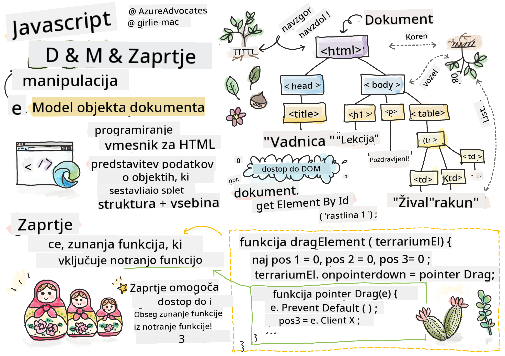

<!--
CO_OP_TRANSLATOR_METADATA:
{
  "original_hash": "61c14b27044861e5e69db35dd52c4403",
  "translation_date": "2025-08-29T12:55:02+00:00",
  "source_file": "3-terrarium/3-intro-to-DOM-and-closures/README.md",
  "language_code": "sl"
}
-->
# Projekt Terrarij, 3. del: Manipulacija DOM-a in zaprtje


> Sketchnote avtorja [Tomomi Imura](https://twitter.com/girlie_mac)

## Predavanje: Kviz pred začetkom

[Kviz pred predavanjem](https://ff-quizzes.netlify.app/web/quiz/19)

### Uvod

Manipulacija DOM-a ali "Document Object Model" je ključen vidik spletnega razvoja. Po navedbah [MDN](https://developer.mozilla.org/docs/Web/API/Document_Object_Model/Introduction) je "Document Object Model (DOM) podatkovna predstavitev objektov, ki sestavljajo strukturo in vsebino dokumenta na spletu." Izzivi pri manipulaciji DOM-a na spletu so pogosto razlog za uporabo JavaScript ogrodij namesto čistega JavaScripta za upravljanje DOM-a, vendar bomo tokrat delali sami!

Poleg tega bo ta lekcija predstavila idejo o [JavaScript zaprtju (closure)](https://developer.mozilla.org/docs/Web/JavaScript/Closures), ki si ga lahko predstavljate kot funkcijo, zaprto znotraj druge funkcije, tako da ima notranja funkcija dostop do obsega zunanje funkcije.

> JavaScript zaprtja so obsežna in zapletena tema. Ta lekcija se dotika osnovne ideje, da boste v kodi za ta terarij našli zaprtje: notranjo funkcijo in zunanjo funkcijo, zasnovani tako, da notranja funkcija dostopa do obsega zunanje funkcije. Za več informacij o tem, kako to deluje, obiščite [obsežno dokumentacijo](https://developer.mozilla.org/docs/Web/JavaScript/Closures).

Uporabili bomo zaprtje za manipulacijo DOM-a.

Predstavljajte si DOM kot drevo, ki predstavlja vse načine, kako je mogoče manipulirati dokument spletne strani. Različni API-ji (Application Program Interfaces) so bili napisani, da programerjem omogočijo dostop do DOM-a in njegovo urejanje, spreminjanje, preurejanje in drugačno upravljanje.


> Predstavitev DOM-a in HTML označbe, ki se nanj nanaša. Avtor: [Olfa Nasraoui](https://www.researchgate.net/publication/221417012_Profile-Based_Focused_Crawler_for_Social_Media-Sharing_Websites)

V tej lekciji bomo dokončali naš interaktivni projekt terarija z ustvarjanjem JavaScript kode, ki bo uporabniku omogočila manipulacijo rastlin na strani.

### Predpogoj

Imeti morate izdelan HTML in CSS za svoj terarij. Do konca te lekcije boste lahko premikali rastline v terarij in iz njega z vlečenjem.

### Naloga

V svoji mapi za terarij ustvarite novo datoteko z imenom `script.js`. To datoteko uvozite v razdelek `<head>`:

```html
	<script src="./script.js" defer></script>
```

> Opomba: uporabite `defer` pri uvažanju zunanje JavaScript datoteke v HTML datoteko, da omogočite izvajanje JavaScripta šele po tem, ko je HTML datoteka popolnoma naložena. Lahko bi uporabili tudi atribut `async`, ki omogoča izvajanje skripte med analiziranjem HTML datoteke, vendar je v našem primeru pomembno, da so HTML elementi popolnoma na voljo za vlečenje, preden omogočimo izvajanje skripte za vlečenje.
---

## Elementi DOM-a

Najprej morate ustvariti reference na elemente, ki jih želite manipulirati v DOM-u. V našem primeru gre za 14 rastlin, ki trenutno čakajo v stranskih vrsticah.

### Naloga

```html
dragElement(document.getElementById('plant1'));
dragElement(document.getElementById('plant2'));
dragElement(document.getElementById('plant3'));
dragElement(document.getElementById('plant4'));
dragElement(document.getElementById('plant5'));
dragElement(document.getElementById('plant6'));
dragElement(document.getElementById('plant7'));
dragElement(document.getElementById('plant8'));
dragElement(document.getElementById('plant9'));
dragElement(document.getElementById('plant10'));
dragElement(document.getElementById('plant11'));
dragElement(document.getElementById('plant12'));
dragElement(document.getElementById('plant13'));
dragElement(document.getElementById('plant14'));
```

Kaj se tukaj dogaja? Sklicujete se na dokument in iščete njegov DOM, da najdete element z določenim Id-jem. Se spomnite, da ste v prvi lekciji o HTML-ju vsakemu slikovnemu elementu rastline dodelili posamezen Id (`id="plant1"`)? Zdaj boste to delo uporabili. Po identifikaciji vsakega elementa ta element posredujete funkciji `dragElement`, ki jo boste ustvarili čez trenutek. Tako bo element v HTML-ju omogočen za vlečenje ali pa bo to kmalu.

✅ Zakaj se sklicujemo na elemente po Id-ju? Zakaj ne po njihovem CSS razredu? Morda se vrnite na prejšnjo lekcijo o CSS-ju, da odgovorite na to vprašanje.

---

## Zaprtje

Zdaj ste pripravljeni ustvariti zaprtje `dragElement`, ki je zunanja funkcija, ki zapira notranjo funkcijo ali funkcije (v našem primeru bomo imeli tri).

Zaprtja so uporabna, kadar ena ali več funkcij potrebuje dostop do obsega zunanje funkcije. Tukaj je primer:

```javascript
function displayCandy(){
	let candy = ['jellybeans'];
	function addCandy(candyType) {
		candy.push(candyType)
	}
	addCandy('gumdrops');
}
displayCandy();
console.log(candy)
```

V tem primeru funkcija `displayCandy` obdaja funkcijo, ki potisne novo vrsto sladkarije v že obstoječi niz v funkciji. Če bi zagnali to kodo, bi bil niz `candy` nedoločen, saj je lokalna spremenljivka (lokalna za zaprtje).

✅ Kako lahko naredite niz `candy` dostopen? Poskusite ga premakniti izven zaprtja. Tako bo niz postal globalen, namesto da bi ostal dostopen le v lokalnem obsegu zaprtja.

### Naloga

Pod deklaracijami elementov v `script.js` ustvarite funkcijo:

```javascript
function dragElement(terrariumElement) {
	//set 4 positions for positioning on the screen
	let pos1 = 0,
		pos2 = 0,
		pos3 = 0,
		pos4 = 0;
	terrariumElement.onpointerdown = pointerDrag;
}
```

`dragElement` dobi svoj objekt `terrariumElement` iz deklaracij na vrhu skripte. Nato nastavite nekaj lokalnih položajev na `0` za objekt, posredovan funkciji. To so lokalne spremenljivke, ki bodo manipulirane za vsak element, ko boste dodali funkcionalnost vlečenja in spuščanja znotraj zaprtja za vsak element. Terrarij bo napolnjen s temi vlečenimi elementi, zato mora aplikacija slediti, kje so postavljeni.

Poleg tega je `terrariumElement`, ki je posredovan tej funkciji, dodeljen dogodek `pointerdown`, ki je del [web API-jev](https://developer.mozilla.org/docs/Web/API), zasnovanih za pomoč pri upravljanju DOM-a. `onpointerdown` se sproži, ko je gumb pritisnjen ali, v našem primeru, ko je dotaknjen vlečljiv element. Ta obravnalnik dogodkov deluje tako na [spletnih kot mobilnih brskalnikih](https://caniuse.com/?search=onpointerdown), z nekaj izjemami.

✅ [Obravnalnik dogodkov `onclick`](https://developer.mozilla.org/docs/Web/API/GlobalEventHandlers/onclick) ima veliko večjo podporo v različnih brskalnikih; zakaj ga tukaj ne bi uporabili? Razmislite o točnem tipu interakcije zaslona, ki jo želite ustvariti.

---

## Funkcija Pointerdrag

`terrariumElement` je pripravljen za vlečenje; ko se sproži dogodek `onpointerdown`, se pokliče funkcija `pointerDrag`. Dodajte to funkcijo takoj pod to vrstico: `terrariumElement.onpointerdown = pointerDrag;`:

### Naloga 

```javascript
function pointerDrag(e) {
	e.preventDefault();
	console.log(e);
	pos3 = e.clientX;
	pos4 = e.clientY;
}
```

Dogaja se več stvari. Najprej preprečite privzete dogodke, ki se običajno zgodijo ob `pointerdown`, z uporabo `e.preventDefault();`. Tako imate več nadzora nad vedenjem vmesnika.

> Vrnite se k tej vrstici, ko boste popolnoma zgradili datoteko skripte, in jo poskusite brez `e.preventDefault()` - kaj se zgodi?

Drugič, odprite `index.html` v oknu brskalnika in preglejte vmesnik. Ko kliknete rastlino, lahko vidite, kako je dogodek 'e' zajet. Raziščite dogodek, da vidite, koliko informacij je zbranih z enim dogodkom pointerdown!  

Nato opazite, kako sta lokalni spremenljivki `pos3` in `pos4` nastavljeni na e.clientX. Te vrednosti zajamejo x in y koordinate rastline v trenutku, ko jo kliknete ali se je dotaknete. Potrebovali boste natančen nadzor nad vedenjem rastlin, ko jih kliknete in vlečete, zato sledite njihovim koordinatam.

✅ Ali postaja bolj jasno, zakaj je celotna aplikacija zgrajena z enim velikim zaprtjem? Če ne bi bila, kako bi ohranili obseg za vsako od 14 vlečljivih rastlin?

Dokončajte začetno funkcijo z dodajanjem še dveh manipulacij dogodkov pointer pod `pos4 = e.clientY`:

```html
document.onpointermove = elementDrag;
document.onpointerup = stopElementDrag;
```
Zdaj označujete, da želite, da se rastlina premika skupaj s kazalcem, ko ga premikate, in da se vlečenje ustavi, ko rastlino odznačite. `onpointermove` in `onpointerup` sta del istega API-ja kot `onpointerdown`. Vmesnik bo zdaj metalo napake, saj še niste definirali funkcij `elementDrag` in `stopElementDrag`, zato jih zgradite naslednje.

## Funkciji elementDrag in stopElementDrag

Dokončali boste svoje zaprtje z dodajanjem še dveh notranjih funkcij, ki bosta upravljali, kaj se zgodi, ko vlečete rastlino in ko prenehate vleči. Želite, da lahko kadar koli vlečete katero koli rastlino in jo postavite kamor koli na zaslon. Ta vmesnik je precej neomejen (na primer ni območja za spuščanje), da vam omogoči oblikovanje terarija točno tako, kot želite, z dodajanjem, odstranjevanjem in prestavljanjem rastlin.

### Naloga

Dodajte funkcijo `elementDrag` takoj za zapiralno zavito oklepaj funkcije `pointerDrag`:

```javascript
function elementDrag(e) {
	pos1 = pos3 - e.clientX;
	pos2 = pos4 - e.clientY;
	pos3 = e.clientX;
	pos4 = e.clientY;
	console.log(pos1, pos2, pos3, pos4);
	terrariumElement.style.top = terrariumElement.offsetTop - pos2 + 'px';
	terrariumElement.style.left = terrariumElement.offsetLeft - pos1 + 'px';
}
```
V tej funkciji veliko urejate začetne položaje 1-4, ki ste jih nastavili kot lokalne spremenljivke v zunanji funkciji. Kaj se tukaj dogaja?

Med vlečenjem ponovno dodelite `pos1`, tako da ga nastavite na `pos3` (ki ste ga prej nastavili kot `e.clientX`) minus trenutno vrednost `e.clientX`. Podobno operacijo izvedete za `pos2`. Nato ponastavite `pos3` in `pos4` na nove X in Y koordinate elementa. Te spremembe lahko spremljate v konzoli med vlečenjem. Nato manipulirate s slogom CSS rastline, da nastavite njen novi položaj na podlagi novih položajev `pos1` in `pos2`, pri čemer izračunate zgornje in leve X in Y koordinate rastline na podlagi primerjave njenega odmika s temi novimi položaji.

> `offsetTop` in `offsetLeft` sta lastnosti CSS, ki nastavljata položaj elementa glede na njegov nadrejeni element; njegov nadrejeni element je lahko kateri koli element, ki ni pozicioniran kot `static`. 

Vse to ponovno izračunavanje položajev vam omogoča natančno prilagoditev vedenja terarija in njegovih rastlin.

### Naloga 

Zadnja naloga za dokončanje vmesnika je dodajanje funkcije `stopElementDrag` za zapiralni zaviti oklepaj funkcije `elementDrag`:

```javascript
function stopElementDrag() {
	document.onpointerup = null;
	document.onpointermove = null;
}
```

Ta majhna funkcija ponastavi dogodka `onpointerup` in `onpointermove`, tako da lahko znova začnete premikati rastlino ali začnete premikati novo rastlino.

✅ Kaj se zgodi, če teh dogodkov ne nastavite na null?

Zdaj ste dokončali svoj projekt!

🥇Čestitke! Dokončali ste svoj čudovit terarij. 

---

## 🚀Izziv

Dodajte nov obravnalnik dogodkov v svoje zaprtje, da naredite nekaj več z rastlinami; na primer, z dvojnim klikom na rastlino jo premaknite v ospredje. Bodite ustvarjalni!

## Kviz po predavanju

[Kviz po predavanju](https://ff-quizzes.netlify.app/web/quiz/20)

## Pregled in samostojno učenje

Čeprav se zdi vlečenje elementov po zaslonu trivialno, obstaja veliko načinov za to in veliko pasti, odvisno od učinka, ki ga želite doseči. Pravzaprav obstaja celoten [API za vlečenje in spuščanje](https://developer.mozilla.org/docs/Web/API/HTML_Drag_and_Drop_API), ki ga lahko preizkusite. Nismo ga uporabili v tem modulu, ker je bil učinek, ki smo ga želeli, nekoliko drugačen, vendar poskusite ta API na svojem projektu in preverite, kaj lahko dosežete.

Poiščite več informacij o dogodkih kazalca v [dokumentaciji W3C](https://www.w3.org/TR/pointerevents1/) in na [MDN spletni dokumentaciji](https://developer.mozilla.org/docs/Web/API/Pointer_events).

Vedno preverite zmogljivosti brskalnika z uporabo [CanIUse.com](https://caniuse.com/).

## Naloga

[Delajte še malo z DOM-om](assignment.md)

---

**Omejitev odgovornosti**:  
Ta dokument je bil preveden z uporabo storitve za prevajanje z umetno inteligenco [Co-op Translator](https://github.com/Azure/co-op-translator). Čeprav si prizadevamo za natančnost, vas prosimo, da upoštevate, da lahko avtomatizirani prevodi vsebujejo napake ali netočnosti. Izvirni dokument v njegovem izvirnem jeziku je treba obravnavati kot avtoritativni vir. Za ključne informacije priporočamo profesionalni človeški prevod. Ne prevzemamo odgovornosti za morebitna nesporazumevanja ali napačne razlage, ki bi nastale zaradi uporabe tega prevoda.