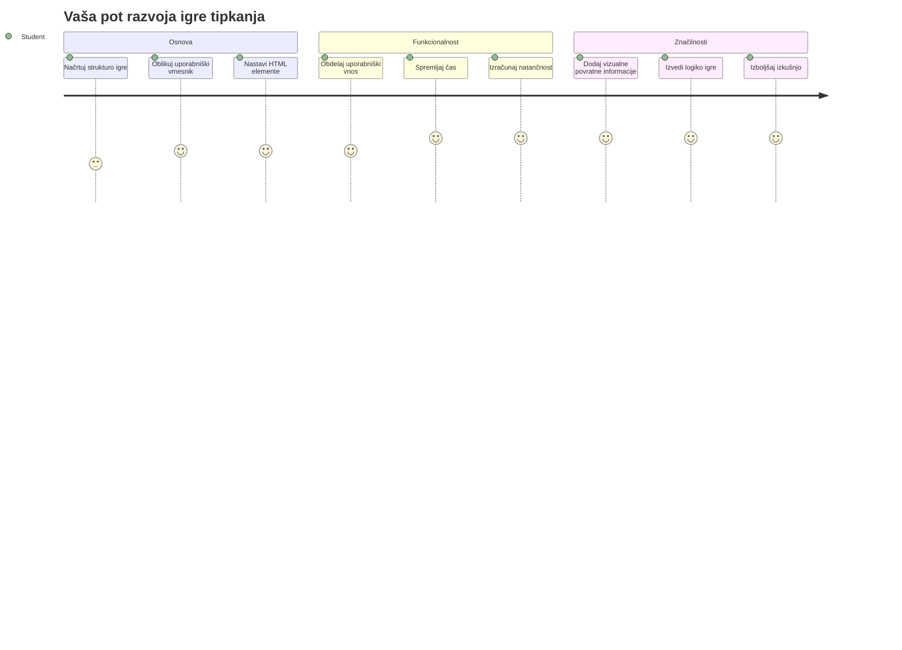
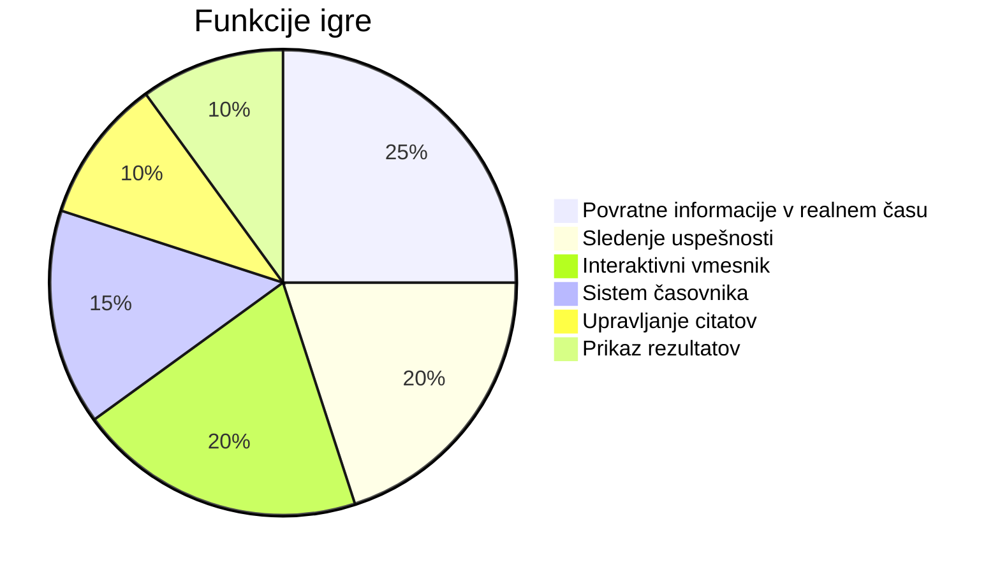
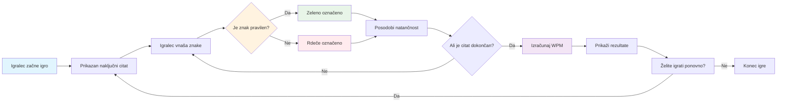
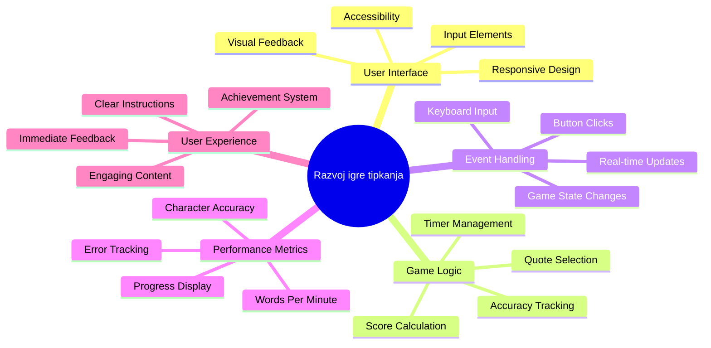
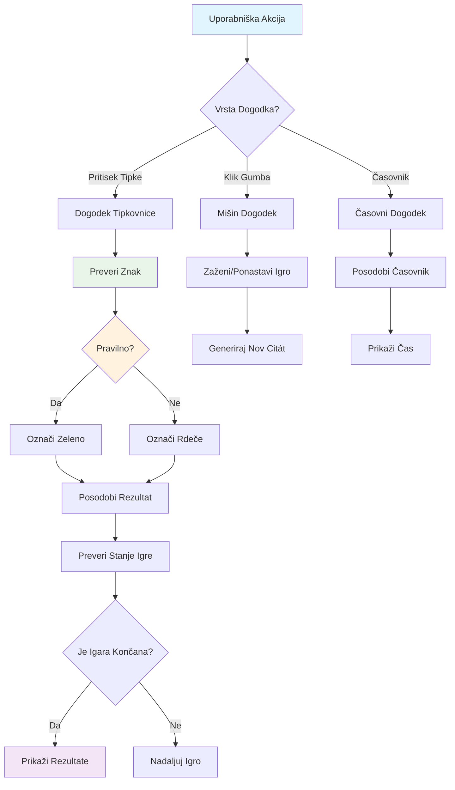
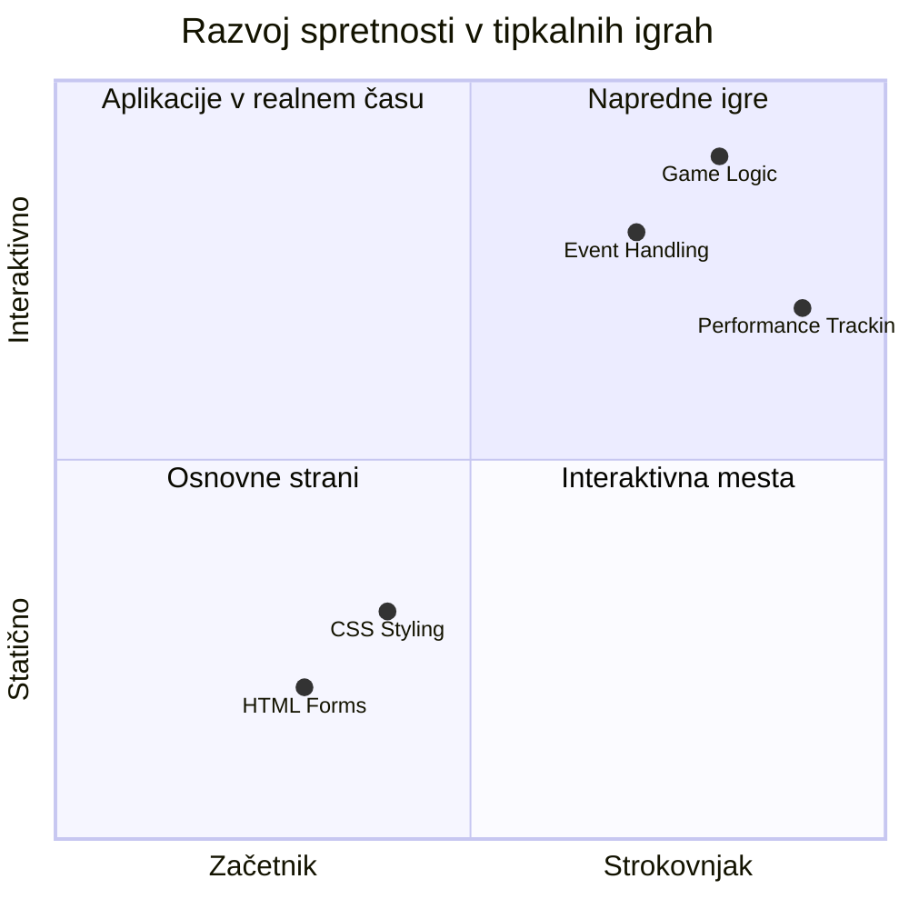
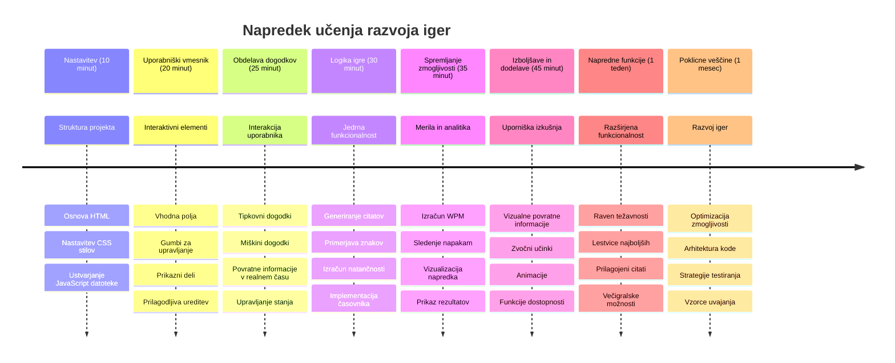

<!--
CO_OP_TRANSLATOR_METADATA:
{
  "original_hash": "efa2ab875b8bb5a7883816506da6b6d2",
  "translation_date": "2026-01-07T09:46:14+00:00",
  "source_file": "4-typing-game/README.md",
  "language_code": "sl"
}
-->
# Programiranje na dogodek - Naredi igro tipkanja

## Uvod

Tukaj je nekaj, kar vsak razvijalec ve, a redko govori o tem: hitro tipkanje je supermoč! 🚀 Pomisli - čim hitreje lahko svoje ideje preneseš iz možganov v urejevalnik kode, tem bolje lahko tvoja ustvarjalnost teče. To je kot da bi imel neposredno povezavo med svojimi mislimi in zaslonom.

Želiš vedeti enega najboljših načinov, da to veščino izboljšaš? Uganil si - zgradili bomo igro!

> Skupaj ustvarimo odlično igro tipkanja!

Pripravljen, da uporabiš vse tiste veščine JavaScript, HTML in CSS, ki si jih pridobil? Zgradili bomo igro tipkanja, ki te bo izzivala z naključnimi citati legendarnega detektiva [Sherlocka Holmesa](https://en.wikipedia.org/wiki/Sherlock_Holmes). Igra bo spremljala, kako hitro in natančno lahko tipkaš - in verjemi, bolj je zasvojljiva, kot si misliš!

## Kaj moraš znati

Preden začnemo, poskrbi, da ti ti koncepti niso tuji (brez skrbi, če potrebuješ hitro osvežitev - vsi smo bili tam!):

- Ustvarjanje tekstovnih vnosov in gumbov
- CSS in nastavljanje stilov s pomočjo razredov  
- Osnove JavaScript-a
  - Ustvarjanje polja (array)
  - Ustvarjanje naključne številke
  - Pridobivanje trenutnega časa

Če ti je katera od teh stvari nekoliko pozabljena, nič hudega! Včasih je najboljši način, da utrdiš znanje, da se lotiš projekta in stvari rešuješ sproti.

### 🔄 **Pedagoški pregled**
**Preverjanje osnov**: Pred začetkom razvoja preveri, če razumeš:
- ✅ Kako delujejo HTML obrazci in vhodni elementi
- ✅ CSS razredi in dinamično oblikovanje
- ✅ JavaScript poslušalci dogodkov in obdelovalci
- ✅ Manipulacija polj in naključen izbor
- ✅ Merjenje časa in izračuni

**Hiter samopreizkus**: Lahko pojasniš, kako ti koncepti sodelujejo v interaktivni igri?
- **Dogodki** se sprožijo, ko uporabniki sodelujejo z elementi
- **Obdelovalci** obdelujejo dogodke in posodabljajo stanje igre
- **CSS** ponuja vizualno povratno informacijo za uporabniška dejanja
- **Časovna meritev** omogoča merjenje uspešnosti in napredovanje igre

## Gremo zgradit to stvar!

[Ustvarjanje igre tipkanja z uporabo programiranja na dogodke](./typing-game/README.md)

### ⚡ **Kaj lahko narediš v naslednjih 5 minutah**
- [ ] Odpri konzolo brskalnika in poslušaj dogodke tipkovnice z `addEventListener`
- [ ] Ustvari preprosto HTML stran z vhodnim poljem in preizkusi zaznavanje tipkanja
- [ ] Vadite manipulacijo nizov z primerjavo vtipkanega besedila z ciljanim besedilom
- [ ] Eksperimentiraj z `setTimeout`, da razumeš časovne funkcije

### 🎯 **Kaj lahko dosežeš v tem času**
- [ ] Zaključi kviz po lekciji in razumi programiranje na dogodke
- [ ] Zgradi osnovno različico igre tipkanja z validacijo besed
- [ ] Dodaj vizualno povratno informacijo za pravilno in nepravilno tipkanje
- [ ] Izvedi preprost sistem točkovanja glede na hitrost in natančnost
- [ ] Oblikuj svojo igro s CSS, da bo vizualno privlačna

### 📅 **Tvoj tedenski razvoj igre**
- [ ] Dokončaj celotno igro tipkanja z vsemi funkcijami in dodelavo
- [ ] Dodaj stopnje težavnosti z različno kompleksnostjo besed
- [ ] Izvedi sledenje statistikam uporabnika (WPM, natančnost skozi čas)
- [ ] Ustvari zvočne učinke in animacije za boljšo uporabniško izkušnjo
- [ ] Naredi igro občutljivo na mobilne naprave za naprave na dotik
- [ ] Deli igro na spletu in zberi povratne informacije uporabnikov

### 🌟 **Tvoj mesečni interaktivni razvoj**
- [ ] Zgradi več iger, ki raziskujejo različne vzorce interakcije
- [ ] Nauči se o igračnih zankah, upravljanju stanja in optimizaciji zmogljivosti
- [ ] Prispevaj k odprtokodnim projektom za razvoj iger
- [ ] Obvladaj napredne časovne koncepte in gladke animacije
- [ ] Ustvari portfelj, ki prikazuje različne interaktivne aplikacije
- [ ] Mentoriraj druge, ki jih zanima razvoj iger in uporabniške interakcije

## 🎯 Tvoj načrt obvladovanja igre tipkanja

### 🛠️ Povzetek orodij za razvoj tvoje igre

Po zaključku tega projekta boš obvladal:
- **Programiranje na dogodke**: odzivni uporabniški vmesniki, ki reagirajo na vnos
- **Povratne informacije v realnem času**: trenutno vizualno in zmogljivostno posodabljanje
- **Merjenje zmogljivosti**: natančni časovni in točkovni sistemi
- **Upravljanje stanja igre**: nadzor poteka aplikacije in uporabniške izkušnje
- **Interaktivni dizajn**: ustvarjanje privlačnih, zasvojljivih uporabniških izkušenj
- **Sodobni spletni vmesniki API**: uporaba zmožnosti brskalnika za bogate interakcije
- **Vzorce dostopnosti**: vključujoč dizajn za vse uporabnike

**Praktične uporabe**: Te veščine so neposredno uporabne za:
- **Spletne aplikacije**: vsak interaktivni vmesnik ali nadzorna plošča
- **Izobraževalna programska oprema**: učne platforme in orodja za ocenjevanje znanja
- **Produktivnostna orodja**: urejevalniki besedil, IDE-ji in programska oprema za sodelovanje
- **Industrija iger**: brskalniške igre in interaktivna zabava
- **Mobilni razvoj**: vmesniki na dotik in upravljanje gest

**Naslednji korak**: Pripravljen si raziskati napredne igre okvire, sistem za večigralstvo v realnem času ali zahtevne interaktivne aplikacije!

## Zahvale

Napisal z ♥️ [Christopher Harrison](http://www.twitter.com/geektrainer)

---

<!-- CO-OP TRANSLATOR DISCLAIMER START -->
**Omejitev odgovornosti**:
Ta dokument je bil preveden z uporabo storitve za avtomatski prevod AI [Co-op Translator](https://github.com/Azure/co-op-translator). Čeprav si prizadevamo za natančnost, vas opozarjamo, da avtomatski prevodi lahko vsebujejo napake ali netočnosti. Originalni dokument v izvirnem jeziku velja za uradni vir. Za ključne informacije priporočamo strokovni človeški prevod. Ne odgovarjamo za morebitne nesporazume ali napačne razlage, ki izhajajo iz uporabe tega prevoda.
<!-- CO-OP TRANSLATOR DISCLAIMER END -->