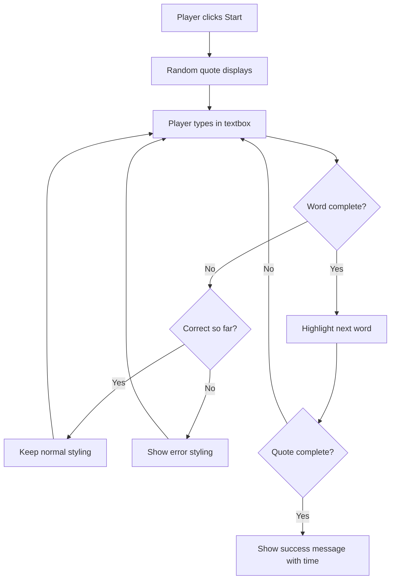
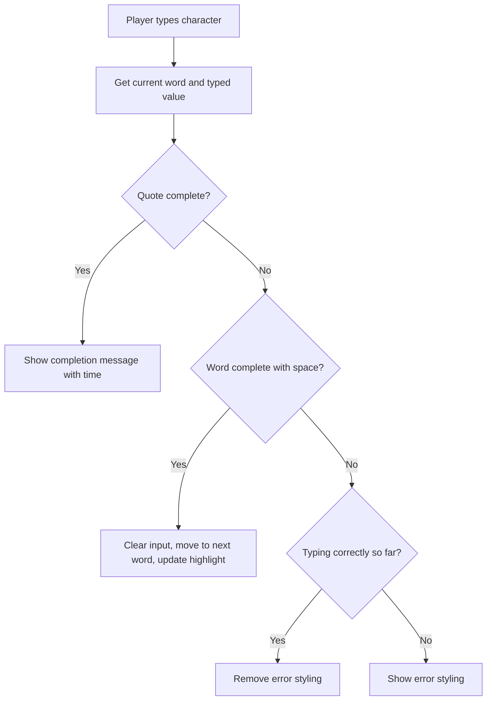

<!--
CO_OP_TRANSLATOR_METADATA:
{
  "original_hash": "e6b75e5b8caae906473a8a09d77b7121",
  "translation_date": "2025-10-25T00:40:15+00:00",
  "source_file": "4-typing-game/typing-game/README.md",
  "language_code": "sl"
}
-->
# Ustvarjanje igre z dogodki

Ste se kdaj spraševali, kako spletne strani vedo, kdaj kliknete gumb ali vnesete besedilo v polje? To je čar programiranja, ki temelji na dogodkih! Kaj je boljši način za učenje te ključne veščine kot ustvarjanje nečesa uporabnega - igre za merjenje hitrosti tipkanja, ki se odziva na vsak vaš pritisk tipke.

Videli boste iz prve roke, kako spletni brskalniki "komunicirajo" z vašo kodo JavaScript. Vsakič, ko kliknete, tipkate ali premaknete miško, brskalnik pošlje majhna sporočila (imenujemo jih dogodki) vaši kodi, vi pa se odločite, kako se nanje odzvati!

Ko bomo končali, boste ustvarili pravo igro tipkanja, ki bo spremljala vašo hitrost in natančnost. Še pomembneje pa je, da boste razumeli temeljne koncepte, ki poganjajo vsako interaktivno spletno stran, ki ste jo kdaj uporabili. Začnimo!

## Predhodni kviz

[Predhodni kviz](https://ff-quizzes.netlify.app/web/quiz/21)

## Programiranje, ki temelji na dogodkih

Pomislite na svojo najljubšo aplikacijo ali spletno stran - kaj jo naredi živo in odzivno? Vse je odvisno od tega, kako se odziva na vaše dejanje! Vsak dotik, klik, poteg ali pritisk tipke ustvari tisto, kar imenujemo "dogodek", in tukaj se začne prava čarovnija spletnega razvoja.

Tukaj je tisto, kar programiranje za splet naredi tako zanimivo: nikoli ne vemo, kdaj bo nekdo kliknil tisti gumb ali začel tipkati v besedilno polje. Morda bo kliknil takoj, čakal pet minut ali pa sploh ne bo kliknil! Ta nepredvidljivost pomeni, da moramo razmišljati drugače o tem, kako pišemo kodo.

Namesto da pišemo kodo, ki se izvaja od zgoraj navzdol kot recept, pišemo kodo, ki potrpežljivo čaka, da se nekaj zgodi. To je podobno kot telegrafisti v 19. stoletju, ki so sedeli ob svojih napravah, pripravljeni odgovoriti v trenutku, ko je sporočilo prispelo po žici.

Kaj točno je "dogodek"? Preprosto povedano, to je nekaj, kar se zgodi! Ko kliknete gumb - to je dogodek. Ko vnesete črko - to je dogodek. Ko premaknete miško - to je še en dogodek.

Programiranje, ki temelji na dogodkih, nam omogoča, da nastavimo kodo, da posluša in se odziva. Ustvarimo posebne funkcije, imenovane **poslušalci dogodkov**, ki potrpežljivo čakajo na določene dogodke, nato pa se aktivirajo, ko se ti zgodijo.

Pomislite na poslušalce dogodkov kot na zvonec za vašo kodo. Nastavite zvonec (`addEventListener()`), poveste, na kakšen zvok naj posluša (na primer 'klik' ali 'pritisk tipke'), nato pa določite, kaj naj se zgodi, ko nekdo pozvoni (vaša prilagojena funkcija).

**Kako delujejo poslušalci dogodkov:**
- **Poslušajo** določena dejanja uporabnika, kot so kliki, pritiski tipk ali premiki miške
- **Izvedejo** vašo prilagojeno kodo, ko se zgodi določen dogodek
- **Odzivajo** se takoj na interakcije uporabnika, kar ustvarja brezhibno izkušnjo
- **Obravnavajo** več dogodkov na istem elementu z različnimi poslušalci

> **NOTE:** Pomembno je poudariti, da obstaja veliko načinov za ustvarjanje poslušalcev dogodkov. Uporabite lahko anonimne funkcije ali ustvarite poimenovane. Uporabite lahko različne bližnjice, kot je nastavitev lastnosti `click`, ali pa uporabite `addEventListener()`. V naši vaji se bomo osredotočili na `addEventListener()` in anonimne funkcije, saj je to verjetno najpogostejša tehnika, ki jo uporabljajo spletni razvijalci. Prav tako je najbolj prilagodljiva, saj `addEventListener()` deluje za vse dogodke, ime dogodka pa je mogoče podati kot parameter.

### Pogosti dogodki

Medtem ko spletni brskalniki ponujajo na desetine različnih dogodkov, ki jih lahko poslušate, večina interaktivnih aplikacij temelji le na peščici ključnih dogodkov. Razumevanje teh osnovnih dogodkov vam bo dalo temelje za gradnjo sofisticiranih uporabniških interakcij.

Obstaja [na desetine dogodkov](https://developer.mozilla.org/docs/Web/Events), ki jih lahko poslušate pri ustvarjanju aplikacije. V bistvu vse, kar uporabnik naredi na strani, sproži dogodek, kar vam daje veliko moči, da zagotovite želeno izkušnjo. Na srečo boste običajno potrebovali le majhno število dogodkov. Tukaj je nekaj pogostih (vključno z dvema, ki ju bomo uporabili pri ustvarjanju naše igre):

| Dogodek | Opis | Pogoste uporabe |
|---------|------|-----------------|
| `click` | Uporabnik je nekaj kliknil | Gumbi, povezave, interaktivni elementi |
| `contextmenu` | Uporabnik je kliknil z desnim gumbom miške | Prilagojeni meniji z desnim klikom |
| `select` | Uporabnik je označil nekaj besedila | Urejanje besedila, operacije kopiranja |
| `input` | Uporabnik je vnesel nekaj besedila | Validacija obrazcev, iskanje v realnem času |

**Razumevanje teh vrst dogodkov:**
- **Sprožijo** se, ko uporabniki interagirajo z določenimi elementi na vaši strani
- **Ponujajo** podrobne informacije o uporabnikovem dejanju prek objektov dogodkov
- **Omogočajo** ustvarjanje odzivnih, interaktivnih spletnih aplikacij
- **Delujejo** dosledno v različnih brskalnikih in napravah

## Ustvarjanje igre

Zdaj, ko razumete, kako delujejo dogodki, uporabimo to znanje v praksi in ustvarimo nekaj uporabnega. Ustvarili bomo igro za merjenje hitrosti tipkanja, ki prikazuje obdelavo dogodkov in hkrati pomaga razviti pomembno veščino razvijalca.

Ustvarili bomo igro, da raziščemo, kako dogodki delujejo v JavaScriptu. Naša igra bo preizkusila tipkarsko spretnost igralca, kar je ena najbolj podcenjenih veščin, ki bi jo moral imeti vsak razvijalec. Zanimivost: postavitev tipkovnice QWERTY, ki jo uporabljamo danes, je bila dejansko zasnovana v 1870-ih za pisalne stroje - in dobre tipkarske veščine so še danes enako dragocene za programerje! Splošen potek igre bo videti takole:



**Kako bo naša igra delovala:**
- **Začne se**, ko igralec klikne gumb za začetek in prikaže naključen citat
- **Sledi** napredku tipkanja igralca besedo za besedo v realnem času
- **Označi** trenutno besedo, da usmeri igralčevo pozornost
- **Nudi** takojšnje vizualne povratne informacije o napakah pri tipkanju
- **Izračuna** in prikaže skupni čas, ko je citat dokončan

Zgradimo našo igro in se naučimo o dogodkih!

### Struktura datotek

Preden začnemo s kodiranjem, se organizirajmo! Čista struktura datotek od začetka vam bo prihranila glavobole kasneje in naredila vaš projekt bolj profesionalen. 😊

Ohranili bomo preprostost s samo tremi datotekami: `index.html` za strukturo naše strani, `script.js` za vso logiko igre in `style.css`, da bo vse videti odlično. To je klasična trojica, ki poganja večino spleta!

**Ustvarite novo mapo za svoje delo tako, da odprete konzolo ali terminal in vnesete naslednji ukaz:**

```bash
# Linux or macOS
mkdir typing-game && cd typing-game

# Windows
md typing-game && cd typing-game
```

**Kaj ti ukazi naredijo:**
- **Ustvarijo** novo mapo z imenom `typing-game` za vaše projektne datoteke
- **Samodejno preklopijo** v novo ustvarjeno mapo
- **Nastavijo** čisto delovno okolje za razvoj vaše igre

**Odprite Visual Studio Code:**

```bash
code .
```

**Ta ukaz:**
- **Zažene** Visual Studio Code v trenutni mapi
- **Odpre** vašo projektno mapo v urejevalniku
- **Omogoča** dostop do vseh orodij za razvoj, ki jih potrebujete

**Dodajte tri datoteke v mapo v Visual Studio Code z naslednjimi imeni:**
- `index.html` - Vsebuje strukturo in vsebino vaše igre
- `script.js` - Upravlja vso logiko igre in poslušalce dogodkov
- `style.css` - Določa vizualni videz in oblikovanje

## Ustvarite uporabniški vmesnik

Zdaj zgradimo oder, na katerem se bo odvijala vsa akcija naše igre! Pomislite na to kot na oblikovanje nadzorne plošče za vesoljsko ladjo - poskrbeti moramo, da je vse, kar naši igralci potrebujejo, tam, kjer to pričakujejo.

Razmislimo, kaj naša igra dejansko potrebuje. Če bi igrali igro tipkanja, kaj bi želeli videti na zaslonu? Tukaj je, kaj bomo potrebovali:

| UI Element | Namen | HTML Element |
|------------|-------|-------------|
| Prikaz citata | Prikazuje besedilo za tipkanje | `<p>` z `id="quote"` |
| Območje sporočil | Prikazuje status in sporočila o uspehu | `<p>` z `id="message"` |
| Vnos besedila | Kjer igralci vnašajo citat | `<input>` z `id="typed-value"` |
| Gumb za začetek | Začne igro | `<button>` z `id="start"` |

**Razumevanje strukture UI:**
- **Logično organizira** vsebino od zgoraj navzdol
- **Dodeli** edinstvene ID-je elementom za ciljanje v JavaScriptu
- **Nudi** jasno vizualno hierarhijo za boljšo uporabniško izkušnjo
- **Vključuje** semantične HTML elemente za dostopnost

Vsak od teh elementov bo potreboval ID-je, da bomo lahko z njimi delali v našem JavaScriptu. Dodali bomo tudi reference na datoteke CSS in JavaScript, ki jih bomo ustvarili.

Ustvarite novo datoteko z imenom `index.html`. Dodajte naslednji HTML:

```html
<!-- inside index.html -->
<html>
<head>
  <title>Typing game</title>
  <link rel="stylesheet" href="style.css">
</head>
<body>
  <h1>Typing game!</h1>
  <p>Practice your typing skills with a quote from Sherlock Holmes. Click **start** to begin!</p>
  <p id="quote"></p> <!-- This will display our quote -->
  <p id="message"></p> <!-- This will display any status messages -->
  <div>
    <input type="text" aria-label="current word" id="typed-value" /> <!-- The textbox for typing -->
    <button type="button" id="start">Start</button> <!-- To start the game -->
  </div>
  <script src="script.js"></script>
</body>
</html>
```

**Razčlenitev, kaj ta struktura HTML doseže:**
- **Povezuje** CSS slogovno datoteko v `<head>` za oblikovanje
- **Ustvari** jasen naslov in navodila za uporabnike
- **Vzpostavi** nadomestne odstavke s specifičnimi ID-ji za dinamično vsebino
- **Vključuje** vnosno polje z atributi za dostopnost
- **Nudi** gumb za začetek igre
- **Naloži** datoteko JavaScript na koncu za optimalno delovanje

### Zagon aplikacije

Pogosto testiranje vaše aplikacije med razvojem vam pomaga zgodaj odkriti težave in videti vaš napredek v realnem času. Live Server je neprecenljivo orodje, ki samodejno osveži vaš brskalnik, kadar koli shranite spremembe, kar naredi razvoj veliko bolj učinkovit.

Vedno je najbolje razvijati postopoma, da vidite, kako stvari izgledajo. Zaženimo našo aplikacijo. Obstaja čudovita razširitev za Visual Studio Code, imenovana [Live Server](https://marketplace.visualstudio.com/items?itemName=ritwickdey.LiveServer&WT.mc_id=academic-77807-sagibbon), ki bo gostila vašo aplikacijo lokalno in osvežila brskalnik vsakič, ko shranite.

**Namestite [Live Server](https://marketplace.visualstudio.com/items?itemName=ritwickdey.LiveServer&WT.mc_id=academic-77807-sagibbon) tako, da sledite povezavi in kliknete Namesti:**

**Kaj se zgodi med namestitvijo:**
- **Pozove** vaš brskalnik, da odpre Visual Studio Code
- **Vodi** vas skozi postopek namestitve razširitve
- **Morda zahteva** ponovni zagon Visual Studio Code za dokončanje nastavitve

**Ko je nameščen, v Visual Studio Code pritisnite Ctrl-Shift-P (ali Cmd-Shift-P) za odprtje ukazne palete:**

**Razumevanje ukazne palete:**
- **Omogoča** hiter dostop do vseh ukazov VS Code
- **Išče** ukaze med tipkanjem
- **Ponuja** bližnjice za hitrejši razvoj

**Vnesite "Live Server: Open with Live Server":**

**Kaj Live Server naredi:**
- **Zažene** lokalni razvojni strežnik za vaš projekt
- **Samodejno** osveži brskalnik, ko shranite datoteke
- **Streže** vaše datoteke z lokalnega URL-ja (običajno `localhost:5500`)

**Odprite brskalnik in pojdite na `https://localhost:5500`:**

Zdaj bi morali videti stran, ki ste jo ustvarili! Dodajmo nekaj funkcionalnosti.

## Dodajanje CSS

Zdaj pa poskrbimo, da bo vse videti dobro! Vizualna povratna informacija je bila ključna za uporabniške vmesnike že od zgodnjih dni računalništva. V 80-ih letih so raziskovalci odkrili, da takojšnja vizualna povratna informacija dramatično izboljša zmogljivost uporabnikov in zmanjša napake. To je točno tisto, kar bomo ustvarili.

Naša igra mora biti kristalno jasna glede tega, kaj se dogaja. Igralci morajo takoj vedeti, katero besedo morajo tipkati, in če naredijo napako, jo morajo takoj videti. Ustvarimo nekaj preprostega, a učinkovitega oblikovanja:

Ustvarite novo datoteko z imenom `style.css` in dodajte naslednjo sintakso.

```css
/* inside style.css */
.highlight {
  background-color: yellow;
}

.error {
  background-color: lightcoral;
  border: red;
}
```

**Razumevanje teh CSS razredov:**
- **Označi** trenutno besedo z rumenim ozadjem za jasno vizualno usmeritev
- **Signalizira** napake pri tipkanju z barvo svetlo koralnega ozadja
- **Nudi** takojšnjo povratno informacijo brez motenja uporabnikovega tipkanja
- **Uporablja** kontrastne barve za dostopnost in jasno vizualno komunikacijo

✅ Ko gre za CSS, lahko postavite svojo stran, kakor želite. Vzemite si nekaj časa in naredite stran bolj privlačno:

- Izberite drugačno pisavo
- Obarvajte naslove
- Spremenite velikost elementov

## JavaScript

Zdaj pa postane zanimivo! 🎉 Imamo strukturo HTML in oblikovanje CSS, vendar je naša igra trenutno kot lep avto brez motorja. JavaScript bo ta motor - to je tisto, kar bo vse skupaj dejansko delovalo in se odzivalo na dejanja igralcev.

Tukaj boste videli, kako vaša stvaritev zaživi. To bomo obravnavali korak za korakom, da nič ne bo preveč zapleteno:

| Korak | Namen | Kaj se boste naučili |
|-------|-------|-----------------------|
| [Ustvarjanje konstant](../../../../4-typing-game/typing-game) | Nastavitev citatov in referenc DOM | Upravljanje spremenljivk in izbira DOM |
| [Poslušalec dogodkov za začetek igre](../../../../4-typing-game/typing-game) | Upravljanje inicializacije igre | Obdelava dogodkov in posodobitve UI |
| [Poslušalec dogodkov za tipkanje](../../../../4-typing-game/typing-game) | Obdelava uporabniškega vnosa v realnem času | Validacija vnosa in dinamična povratna informacija |

**Ta strukturiran pristop vam pomaga:**
- **Organizirati** kodo v logične, obvladljive dele
- **Postopoma graditi** funkcionalnost za lažje odpravljanje napak
- **Razumeti**, kako različni deli vaše aplikacije delujejo skupaj
- **Ustvariti** ponovno uporabne vzorce za prihodnje projekte

Najprej pa ustvarite novo datoteko z imenom `script.js`.

### Dodajanje konstant

Preden se lotimo akcije, zberimo vse naše vire! Tako kot NASA pred izstrelitvijo pripravi vse svoje nadzorne sisteme, je veliko lažje, ko imate vse pripravljeno in na voljo. To nas reši iskanja stvari kasneje in pomaga preprečiti napake.

Tukaj je,
| Tabela citatov | Shrani vse možne citate za igro | `['Citat 1', 'Citat 2', ...]` |
| Tabela besed | Razdeli trenutni citat na posamezne besede | `['Ko', 'imaš', 'ti', ...]` |
| Indeks besed | Sledi, katero besedo igralec tipka | `0, 1, 2, 3...` |
| Začetni čas | Izračunaj pretečen čas za točkovanje | `Date.now()` |

**Potrebovali bomo tudi reference na naše elemente uporabniškega vmesnika:**
| Element | ID | Namen |
|---------|----|-------|
| Vnos besedila | `typed-value` | Kjer igralci tipkajo |
| Prikaz citata | `quote` | Prikazuje citat za tipkanje |
| Območje sporočil | `message` | Prikazuje posodobitve stanja |

```javascript
// inside script.js
// all of our quotes
const quotes = [
    'When you have eliminated the impossible, whatever remains, however improbable, must be the truth.',
    'There is nothing more deceptive than an obvious fact.',
    'I ought to know by this time that when a fact appears to be opposed to a long train of deductions it invariably proves to be capable of bearing some other interpretation.',
    'I never make exceptions. An exception disproves the rule.',
    'What one man can invent another can discover.',
    'Nothing clears up a case so much as stating it to another person.',
    'Education never ends, Watson. It is a series of lessons, with the greatest for the last.',
];
// store the list of words and the index of the word the player is currently typing
let words = [];
let wordIndex = 0;
// the starting time
let startTime = Date.now();
// page elements
const quoteElement = document.getElementById('quote');
const messageElement = document.getElementById('message');
const typedValueElement = document.getElementById('typed-value');
```

**Razčlenitev, kaj doseže ta začetna koda:**
- **Shrani** tabelo citatov Sherlocka Holmesa z uporabo `const`, saj se citati ne bodo spreminjali
- **Inicializira** sledilne spremenljivke z `let`, saj se te vrednosti med igro spreminjajo
- **Zajame** reference na DOM elemente z uporabo `document.getElementById()` za učinkovitejši dostop
- **Postavi temelje** za vse funkcionalnosti igre z jasnimi in opisnimi imeni spremenljivk
- **Organizira** povezane podatke in elemente logično za lažje vzdrževanje kode

✅ Dodajte še več citatov v svojo igro

> 💡 **Koristen nasvet**: Elemente lahko kadar koli v kodi pridobimo z uporabo `document.getElementById()`. Ker bomo te elemente pogosto uporabljali, se bomo izognili tipkarskim napakam pri nizih z uporabo konstant. Okviri, kot sta [Vue.js](https://vuejs.org/) ali [React](https://reactjs.org/), vam lahko pomagajo bolje upravljati centralizacijo vaše kode.
>
**Zakaj ta pristop deluje tako dobro:**
- **Preprečuje** tipkarske napake pri večkratnem sklicevanju na elemente
- **Izboljša** berljivost kode z opisnimi imeni konstant
- **Omogoča** boljšo podporo IDE z avtomatskim dopolnjevanjem in preverjanjem napak
- **Olajša** refaktoriranje, če se ID-ji elementov kasneje spremenijo

Vzemite si trenutek in si oglejte video o uporabi `const`, `let` in `var`.

[](https://youtube.com/watch?v=JNIXfGiDWM8 "Vrste spremenljivk")

> 🎥 Kliknite zgornjo sliko za video o spremenljivkah.

### Dodajte logiko za začetek

Tu se vse sestavi! 🚀 Zdaj boste napisali svoj prvi pravi poslušalec dogodkov, in nekaj je zelo zadovoljivega v tem, da vidite, kako vaša koda reagira na klik gumba.

Pomislite: nekje tam zunaj bo igralec kliknil gumb "Začni", vaša koda pa mora biti pripravljena nanj. Ne vemo, kdaj bo kliknil - morda takoj, morda po tem, ko si privošči kavo - toda ko to stori, se vaša igra zažene.

Ko uporabnik klikne `start`, moramo izbrati citat, pripraviti uporabniški vmesnik ter nastaviti sledenje trenutni besedi in času. Spodaj je JavaScript, ki ga morate dodati; o njem razpravljamo takoj po bloku skripte.

```javascript
// at the end of script.js
document.getElementById('start').addEventListener('click', () => {
  // get a quote
  const quoteIndex = Math.floor(Math.random() * quotes.length);
  const quote = quotes[quoteIndex];
  // Put the quote into an array of words
  words = quote.split(' ');
  // reset the word index for tracking
  wordIndex = 0;

  // UI updates
  // Create an array of span elements so we can set a class
  const spanWords = words.map(function(word) { return `<span>${word} </span>`});
  // Convert into string and set as innerHTML on quote display
  quoteElement.innerHTML = spanWords.join('');
  // Highlight the first word
  quoteElement.childNodes[0].className = 'highlight';
  // Clear any prior messages
  messageElement.innerText = '';

  // Setup the textbox
  // Clear the textbox
  typedValueElement.value = '';
  // set focus
  typedValueElement.focus();
  // set the event handler

  // Start the timer
  startTime = new Date().getTime();
});
```

**Razčlenimo kodo na logične dele:**

**📊 Nastavitev sledenja besedam:**
- **Izbere** naključni citat z uporabo `Math.floor()` in `Math.random()` za raznolikost
- **Pretvori** citat v tabelo posameznih besed z uporabo `split(' ')`
- **Ponastavi** `wordIndex` na 0, saj igralci začnejo s prvo besedo
- **Pripravi** stanje igre za nov krog

**🎨 Nastavitev in prikaz uporabniškega vmesnika:**
- **Ustvari** tabelo `<span>` elementov, ki ovije vsako besedo za individualno oblikovanje
- **Združi** span elemente v en sam niz za učinkovito posodabljanje DOM-a
- **Označi** prvo besedo z dodajanjem CSS razreda `highlight`
- **Počisti** morebitna prejšnja sporočila igre za čist začetek

**⌨️ Priprava vnosnega polja:**
- **Počisti** obstoječe besedilo v vnosnem polju
- **Postavi fokus** na vnosno polje, da lahko igralci takoj začnejo tipkati
- **Pripravi** območje vnosa za novo sejo igre

**⏱️ Inicializacija časovnika:**
- **Zajame** trenutni časovni žig z uporabo `new Date().getTime()`
- **Omogoči** natančen izračun hitrosti tipkanja in časa dokončanja
- **Začne** sledenje uspešnosti za sejo igre

### Dodajte logiko tipkanja

Tu se lotimo srca naše igre! Ne skrbite, če se vam na začetku zdi veliko - prehodili bomo vsak del, in na koncu boste videli, kako logično je vse skupaj.

Kar tukaj gradimo, je precej sofisticirano: vsakič, ko nekdo vtipka črko, bo naša koda preverila, kaj je vnesel, mu podala povratne informacije in se odločila, kaj naj se zgodi naprej. To je podobno kot zgodnji urejevalniki besedil, kot je bil WordStar v 70-ih letih, ki so tipkarjem zagotavljali povratne informacije v realnem času.

```javascript
// at the end of script.js
typedValueElement.addEventListener('input', () => {
  // Get the current word
  const currentWord = words[wordIndex];
  // get the current value
  const typedValue = typedValueElement.value;

  if (typedValue === currentWord && wordIndex === words.length - 1) {
    // end of sentence
    // Display success
    const elapsedTime = new Date().getTime() - startTime;
    const message = `CONGRATULATIONS! You finished in ${elapsedTime / 1000} seconds.`;
    messageElement.innerText = message;
  } else if (typedValue.endsWith(' ') && typedValue.trim() === currentWord) {
    // end of word
    // clear the typedValueElement for the new word
    typedValueElement.value = '';
    // move to the next word
    wordIndex++;
    // reset the class name for all elements in quote
    for (const wordElement of quoteElement.childNodes) {
      wordElement.className = '';
    }
    // highlight the new word
    quoteElement.childNodes[wordIndex].className = 'highlight';
  } else if (currentWord.startsWith(typedValue)) {
    // currently correct
    // highlight the next word
    typedValueElement.className = '';
  } else {
    // error state
    typedValueElement.className = 'error';
  }
});
```

**Razumevanje poteka logike tipkanja:**

Ta funkcija uporablja pristop "slap", preverja pogoje od najbolj specifičnih do najbolj splošnih. Razčlenimo vsak scenarij:



**🏁 Dokončan citat (Scenarij 1):**
- **Preveri**, ali vnesena vrednost ustreza trenutni besedi IN ali smo na zadnji besedi
- **Izračuna** pretečen čas z odštevanjem začetnega časa od trenutnega časa
- **Pretvori** milisekunde v sekunde z deljenjem z 1.000
- **Prikaže** čestitno sporočilo s časom dokončanja

**✅ Dokončana beseda (Scenarij 2):**
- **Zazna** dokončanje besede, ko vnos konča s presledkom
- **Preveri**, da obrezan vnos natančno ustreza trenutni besedi
- **Počisti** vnosno polje za naslednjo besedo
- **Napreduje** na naslednjo besedo z inkrementiranjem `wordIndex`
- **Posodobi** vizualno označevanje z odstranitvijo vseh razredov in označevanjem nove besede

**📝 Tipkanje v teku (Scenarij 3):**
- **Preveri**, ali trenutna beseda začne z vnesenim besedilom
- **Odstrani** morebitno napako pri oblikovanju, da pokaže, da je vnos pravilen
- **Dovoli** nadaljevanje tipkanja brez prekinitve

**❌ Stanje napake (Scenarij 4):**
- **Sproži**, ko vneseno besedilo ne ustreza pričakovanemu začetku besede
- **Uporabi** CSS razred za napako, da zagotovi takojšnjo vizualno povratno informacijo
- **Pomaga** igralcem hitro prepoznati in popraviti napake

## Testirajte svojo aplikacijo

Poglejte, kaj ste dosegli! 🎉 Pravkar ste iz nič zgradili pravo delujočo igro tipkanja z uporabo programiranja, ki temelji na dogodkih. Vzemite si trenutek, da to cenite - to ni majhen dosežek!

Zdaj sledi faza testiranja! Ali bo delovalo, kot je pričakovano? Smo kaj spregledali? Tukaj je stvar: če nekaj ne deluje popolnoma takoj, je to povsem normalno. Tudi izkušeni razvijalci redno najdejo napake v svoji kodi. To je del razvojnega procesa!

Kliknite na `start` in začnite tipkati! Videti bi moralo biti podobno animaciji, ki smo jo videli prej.


**Kaj testirati v vaši aplikaciji:**
- **Preverite**, da klik na Start prikaže naključni citat
- **Potrdite**, da tipkanje pravilno označi trenutno besedo
- **Preverite**, da se pri napačnem tipkanju prikaže oblikovanje napake
- **Preverite**, da dokončanje besed pravilno premakne označevanje
- **Testirajte**, da dokončanje citata prikaže sporočilo o dokončanju s časom

**Pogosti nasveti za odpravljanje napak:**
- **Preverite** konzolo brskalnika (F12) za napake v JavaScriptu
- **Preverite**, da se vsa imena datotek popolnoma ujemajo (občutljivo na velike in male črke)
- **Prepričajte se**, da Live Server deluje in se pravilno osvežuje
- **Testirajte** različne citate, da preverite, ali naključna izbira deluje

---

## Izziv GitHub Copilot Agent 🎮

Uporabite način Agent za dokončanje naslednjega izziva:

**Opis:** Razširite igro tipkanja z implementacijo sistema težavnosti, ki prilagaja igro glede na uspešnost igralca. Ta izziv vam bo pomagal vaditi napredno obdelavo dogodkov, analizo podatkov in dinamične posodobitve uporabniškega vmesnika.

**Naloga:** Ustvarite sistem za prilagajanje težavnosti igre tipkanja, ki:
1. Sledi hitrosti tipkanja igralca (besede na minuto) in odstotek natančnosti
2. Samodejno prilagodi tri stopnje težavnosti: Lahka (preprosti citati), Srednja (trenutni citati), Težka (zapleteni citati s ločili)
3. Prikaže trenutno stopnjo težavnosti in statistiko igralca na uporabniškem vmesniku
4. Implementira števec uspešnosti, ki poveča težavnost po treh zaporednih dobrih rezultatih
5. Doda vizualno povratno informacijo (barve, animacije) za označevanje sprememb težavnosti

Dodajte potrebne HTML elemente, CSS sloge in JavaScript funkcije za implementacijo te funkcije. Vključite ustrezno obravnavo napak in poskrbite, da bo igra ostala dostopna z ustreznimi ARIA oznakami.

Več o [načinu agent](https://code.visualstudio.com/blogs/2025/02/24/introducing-copilot-agent-mode) si preberite tukaj.

## 🚀 Izziv

Pripravljeni, da svojo igro tipkanja dvignete na višjo raven? Poskusite implementirati te napredne funkcije, da poglobite svoje razumevanje obdelave dogodkov in manipulacije DOM-a:

**Dodajte več funkcionalnosti:**

| Funkcija | Opis | Veščine, ki jih boste vadili |
|----------|------|-----------------------------|
| **Nadzor vnosa** | Onemogočite poslušalec dogodkov `input` ob dokončanju in ga ponovno omogočite, ko je gumb kliknjen | Upravljanje dogodkov in nadzor stanja |
| **Upravljanje stanja UI** | Onemogočite vnosno polje, ko igralec dokonča citat | Manipulacija lastnosti DOM-a |
| **Modalno okno** | Prikažite modalno okno s sporočilom o uspehu | Napredni vzorci UI in dostopnost |
| **Sistem najboljših rezultatov** | Shranite najboljše rezultate z uporabo `localStorage` | API-ji za shranjevanje v brskalniku in trajnost podatkov |

**Nasveti za implementacijo:**
- **Raziskujte** `localStorage.setItem()` in `localStorage.getItem()` za trajno shranjevanje
- **Vadite** dinamično dodajanje in odstranjevanje poslušalcev dogodkov
- **Raziskujte** HTML elemente dialog ali CSS vzorce za modalna okna
- **Razmislite** o dostopnosti pri onemogočanju in omogočanju kontrol obrazca

## Kviz po predavanju

[Kviz po predavanju](https://ff-quizzes.netlify.app/web/quiz/22)

## Pregled in samostojno učenje

Preberite več o [vseh dogodkih](https://developer.mozilla.org/docs/Web/Events), ki so na voljo razvijalcem prek spletnega brskalnika, in razmislite o scenarijih, v katerih bi uporabili vsakega od njih.

## Naloga

[Ustvarite novo igro tipkanja](assignment.md)

---

**Omejitev odgovornosti**:  
Ta dokument je bil preveden z uporabo storitve za prevajanje AI [Co-op Translator](https://github.com/Azure/co-op-translator). Čeprav si prizadevamo za natančnost, vas prosimo, da upoštevate, da lahko avtomatizirani prevodi vsebujejo napake ali netočnosti. Izvirni dokument v njegovem maternem jeziku naj se šteje za avtoritativni vir. Za ključne informacije priporočamo profesionalni človeški prevod. Ne prevzemamo odgovornosti za morebitne nesporazume ali napačne razlage, ki bi nastale zaradi uporabe tega prevoda.