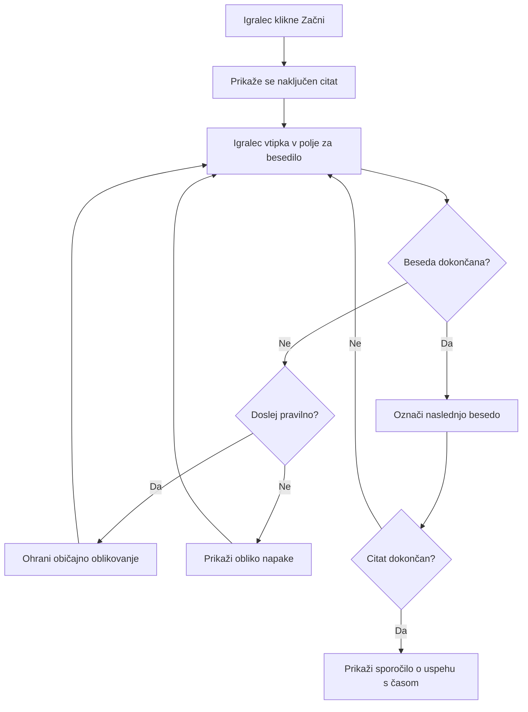
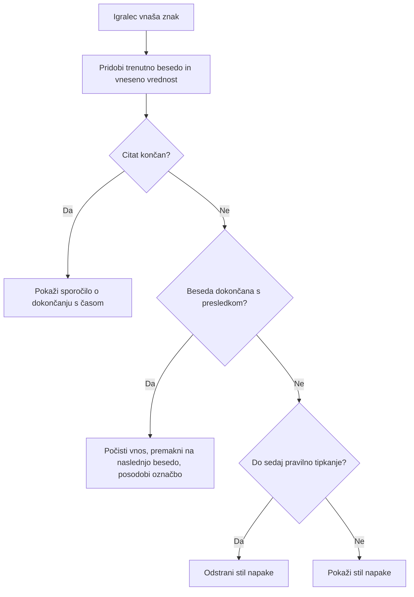
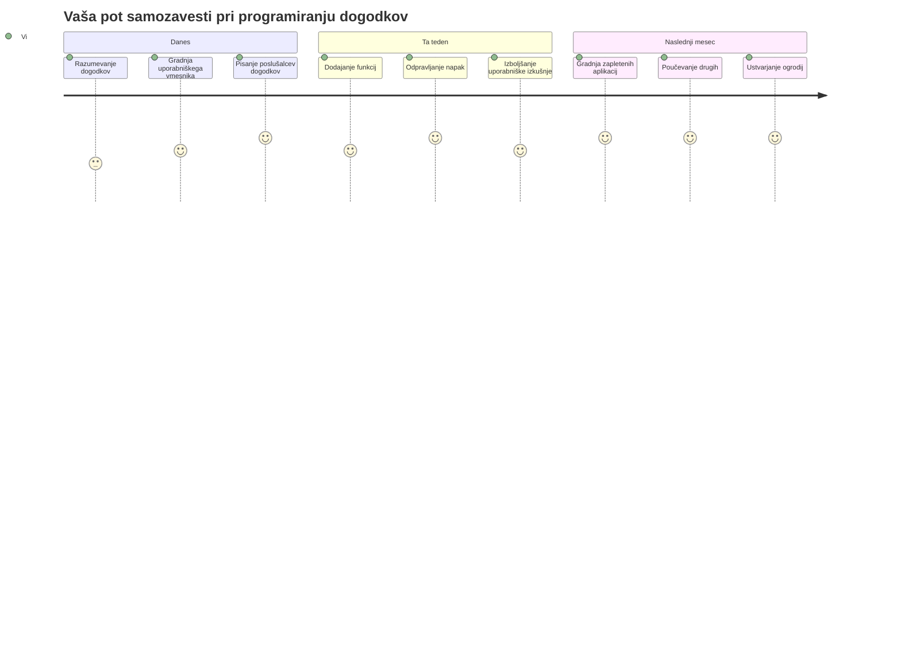

# Ustvarjanje igre z dogodki

Ste se kdaj spraševali, kako spletna mesta vedo, kdaj kliknete gumb ali vtipkate nekaj v besedilno polje? To je čar programiranja, ki temelji na dogodkih! Kaj bi bilo boljše, kot se naučiti tega bistvenega znanja z izdelavo nečesa uporabnega - igre za merjenje hitrosti tipkanja, ki reagira na vsak vaš pritisk tipke.

Na lastne oči boste videli, kako spletni brskalniki "komunicirajo" z vašo JavaScript kodo. Vsakič, ko kliknete, tipkate ali premaknete miško, brskalnik pošlje majhna sporočila (imenovana dogodki) vaši kodi, vi pa odločate, kako boste nanje reagirali!

Do konca tega poglavja boste ustvarili pravo igro tipkanja, ki spremlja vašo hitrost in natančnost. Še pomembneje, razumeli boste osnovne koncepte, ki poganjajo vsako interaktivno spletno stran, ki ste jo kdaj uporabili. Gremo!

## Predpredavalni kviz

[Predpredavalni kviz](https://ff-quizzes.netlify.app/web/quiz/21)

## Programiranje, ki temelji na dogodkih

Pomislite na vašo najljubšo aplikacijo ali spletno stran - kaj ji daje občutek živosti in odzivnosti? Vse je odvisno od tega, kako reagira na vaše dejanja! Vsak dotik, klik, poteg ali pritisk tipke ustvarja t.i. "dogodek" in tu se zgodi prava čarovnija spletnega razvoja.

Zanimivo pri programiranju za splet je, da nikoli ne vemo, kdaj bo nekdo kliknil gumb ali začel tipkati v besedilno polje. Lahko kliknejo takoj, počakajo pet minut ali pa morda sploh nikoli! Ta nepredvidljivost pomeni, da moramo drugače razmišljati o pisanju kode.

Namesto da pišemo kodo, ki teče od vrha do dna, kot recept, pišemo kodo, ki potrpežljivo čaka, da se nekaj zgodi. Podobno kot telegrafisti v 1800-ih, ki so sedeli ob svojih napravah in bili pripravljeni odgovoriti takoj, ko je prišlo sporočilo po žici.

Kaj torej je "dogodek"? Preprosto povedano, je nekaj, kar se zgodi! Ko kliknete gumb - to je dogodek. Ko vtipkate črko - to je dogodek. Ko premaknete miško - to je še en dogodek.

Programiranje, ki temelji na dogodkih, nam omogoča, da nastavite kodo tako, da posluša in reagira. Ustvarimo posebne funkcije, imenovane **poslušalci dogodkov**, ki potrpežljivo čakajo, da se zgodijo določene stvari, nato pa ukrepajo.

Pomislite na poslušalce dogodkov kot na zvonec za vašo kodo. Nastavite zvonec (`addEventListener()`), določite, na kateri zvok naj se odzove (kot je 'click' ali 'keypress'), in nato določite, kaj se naj zgodi, ko nekdo zvoni (vaša prilagojena funkcija).

**Tako delujejo poslušalci dogodkov:**
- **Poslušajo** določena uporabniška dejanja, kot so kliki, pritiski tipk ali premiki miške
- **Izvedejo** vašo prilagojeno kodo, ko se zgodi določen dogodek
- **Neposredno** reagirajo na uporabniške interakcije, ustvarjajo brezhibno izkušnjo
- **Obravnavajo** več dogodkov na istem elementu z različnimi poslušalci

> **OPOMBA:** Vredno je poudariti, da obstaja več načinov ustvarjanja poslušalcev dogodkov. Uporabite lahko anonimne funkcije ali poimenujete funkcije. Lahko uporabljate različne bližnjice, kot nastavitev lastnosti `click` ali uporabo `addEventListener()`. V naši vaji se bomo osredotočili na `addEventListener()` in anonimne funkcije, saj je to verjetno najpogostejša tehnika med spletnimi razvijalci. Je tudi najbolj prilagodljiva, saj `addEventListener()` deluje za vse dogodke, ime dogodka pa lahko posredujete kot parameter.

### Pogosti dogodki

Čeprav spletni brskalniki ponujajo na desetine različnih dogodkov, ki jih lahko poslušate, se večina interaktivnih aplikacij opira na le nekaj bistvenih dogodkov. Razumevanje teh osnovnih dogodkov vam bo dalo temelje za izdelavo zahtevnih uporabniških interakcij.

Na voljo je [na desetine dogodkov](https://developer.mozilla.org/docs/Web/Events), ki jih lahko poslušate pri ustvarjanju aplikacije. Pravzaprav skoraj vse, kar uporabnik naredi na strani, sproži dogodek, kar vam daje veliko moči za zagotavljanje želenih izkušenj. Na srečo boste običajno potrebovali le nekaj osnovnih dogodkov. Tukaj je nekaj pogostih (vključno z dvema, ki ju bomo uporabili pri ustvarjanju naše igre):

| Dogodek | Opis | Pogoste uporabe |
|---------|-------|-----------------|
| `click` | Uporabnik je kliknil nekaj | Gumbi, povezave, interaktivni elementi |
| `contextmenu` | Uporabnik je kliknil z desnim gumbom miške | Prilagojeni meniji za desni klik |
| `select` | Uporabnik je označil nekaj besedila | Urejanje besedila, kopiranje |
| `input` | Uporabnik je vnesel besedilo | Preverjanje obrazcev, iskanje v realnem času |

**Razumevanje teh vrst dogodkov:**
- **Sproži** se, ko uporabniki delujejo z določenimi elementi na vaši strani
- **Nudi** podrobne informacije o dejanju uporabnika prek objektov dogodkov
- **Omogoča** ustvarjanje odzivnih, interaktivnih spletnih aplikacij
- **Deluje** dosledno na različnih brskalnikih in napravah

## Ustvarjanje igre

Zdaj, ko razumete, kako dogodki delujejo, preizkusimo to znanje v praksi z izdelavo nečesa uporabnega. Ustvarili bomo igro hitrega tipkanja, ki prikazuje obdelavo dogodkov in hkrati pomaga razviti pomembno veščino razvijalca.

Naredili bomo igro za raziskovanje delovanja dogodkov v JavaScriptu. Naša igra bo testirala igralčevo spretnost tipkanja, kar je ena najbolj podcenjenih veščin, ki bi jih moral imeti vsak razvijalec. Zabavna dejstva: postavitev tipkovnice QWERTY, ki jo danes uporabljamo, je bila dejansko zasnovana v 1870-ih za pisalne stroje - in dobre veščine tipkanja so še vedno zelo dragocene za programerje danes! Splošna potek igre bo izgledala takole:


**Tako bo delovala naša igra:**
- **Začne** se, ko igralec klikne gumb za začetek in prikaže naključen citat
- **Spremlja** napredek tipkanja igralca besedo za besedo v realnem času
- **Označi** trenutno besedo, da usmeri fokus igralca
- **Nudi** takojšnje vizualno povratno informacijo za napake pri tipkanju
- **Izračuna** in prikaže skupni čas ob zaključku citata

Ustvarimo igro in se naučimo o dogodkih!

### Struktura datotek

Preden začnemo s kodiranjem, naj se uredimo! Imamo čisto strukturo datotek že od začetka, s čimer si kasneje prihranimo preglavice in naredimo projekt bolj profesionalen. 😊

Ohranili bomo stvari preproste z le tremi datotekami: `index.html` za strukturo strani, `script.js` za vso logiko igre in `style.css` za lep videz. To je klasična trojica, ki poganja večino spleta!

**Ustvarite novo mapo za svoje delo tako, da odprete konzolo ali terminal in vnesete naslednji ukaz:**

```bash
# Linux ali macOS
mkdir typing-game && cd typing-game

# Windows
md typing-game && cd typing-game
```

**Tukaj je, kaj ti ukazi naredijo:**
- **Ustvarijo** novo mapo imenovano `typing-game` za vaše projektne datoteke
- **Samodejno** preidejo v pravkar ustvarjeno mapo
- **Pripravijo** čisto delovno okolje za razvoj vaše igre

**Odprite Visual Studio Code:**

```bash
code .
```

**Ta ukaz:**
- **Zažene** Visual Studio Code v trenutni mapi
- **Odpre** vašo projektno mapo v urejevalniku
- **Omogoči** dostop do vseh razvojnih orodij, ki jih potrebujete

**Dodajte tri datoteke v mapo v Visual Studio Code z naslednjimi imeni:**
- `index.html` - Vsebuje strukturo in vsebino vaše igre
- `script.js` - Upravlja vso logiko igre in poslušalce dogodkov
- `style.css` - Določa videz in oblikovanje

## Ustvarite uporabniški vmesnik

Zgradimo oder, na katerem se bo odvijala vsebina naše igre! Pomislite nanj kot na nadzorno ploščo vesoljske ladje - poskrbeti moramo, da je vse, kar igralci potrebujejo, točno tam, kjer to pričakujejo.

Ugotovimo, kaj naša igra pravzaprav potrebuje. Če bi igrali igro tipkanja, kaj bi želeli videti na zaslonu? Tukaj je, kaj bomo potrebovali:

| Element UI | Namen | HTML element |
|------------|-------|--------------|
| Prikaz citata | Prikaže besedilo za tipkanje | `<p>` z `id="quote"` |
| Področje za sporočila | Prikazuje stanje in sporočila o uspehu | `<p>` z `id="message"` |
| Besedilno polje | Kjer igralci tipkajo citat | `<input>` z `id="typed-value"` |
| Gumb za začetek | Začne igro | `<button>` z `id="start"` |

**Razumevanje strukture UI:**
- **Urejeno** logično od zgoraj navzdol
- **Dodeli** unikatne ID-je elementom za ciljano upravljanje z JavaScriptom
- **Nudi** jasno vizualno hierarhijo za boljšo uporabniško izkušnjo
- **Vključuje** semantične HTML elemente za dostopnost

Za vsakega bo treba dodati ID, da bomo lahko z njimi upravljali v našem JavaScriptu. Dodali bomo tudi povezave do CSS in JavaScript datotek, ki jih bomo ustvarili.

Ustvarite novo datoteko z imenom `index.html`. Dodajte naslednji HTML:

```html
<!-- inside index.html -->
<html>
<head>
  <title>Typing game</title>
  <link rel="stylesheet" href="style.css">
</head>
<body>
  <h1>Typing game!</h1>
  <p>Practice your typing skills with a quote from Sherlock Holmes. Click **start** to begin!</p>
  <p id="quote"></p> <!-- This will display our quote -->
  <p id="message"></p> <!-- This will display any status messages -->
  <div>
    <input type="text" aria-label="current word" id="typed-value" /> <!-- The textbox for typing -->
    <button type="button" id="start">Start</button> <!-- To start the game -->
  </div>
  <script src="script.js"></script>
</body>
</html>
```

**Razčlenitev, kaj ta struktura HTML doseže:**
- **Povezuje** CSS slogovno datoteko v `<head>` za oblikovanje
- **Ustvari** jasen naslov in navodila za uporabnike
- **Vzpostavi** nadomestne odstavke z določenimi ID-ji za dinamično vsebino
- **Vključuje** vhodno polje z atributi za dostopnost
- **Nudi** gumb za začetek igre
- **Naloži** JavaScript datoteko na koncu za optimalno delovanje

### Zaženite aplikacijo

Pogosto testiranje aplikacije med razvojem vam pomaga zgodaj odkriti težave in videti napredek v realnem času. Live Server je neprecenljivo orodje, ki samodejno osveži brskalnik vsakič, ko shranite spremembe, kar močno izboljša učinkovitost razvoja.

Vedno je najbolje razvijati postopoma, da vidite, kako stvari izgledajo. Zaženimo aplikacijo. Obstaja čudovit dodatek za Visual Studio Code z imenom [Live Server](https://marketplace.visualstudio.com/items?itemName=ritwickdey.LiveServer&WT.mc_id=academic-77807-sagibbon), ki gostuje vašo aplikacijo lokalno in osveži brskalnik vsakič, ko shranite.

**Namestite [Live Server](https://marketplace.visualstudio.com/items?itemName=ritwickdey.LiveServer&WT.mc_id=academic-77807-sagibbon) tako, da sledite povezavi in kliknete Namesti:**

**To se zgodi med namestitvijo:**
- **Brskalnik** vas pozove, da odprete Visual Studio Code
- **Vodnik** vas popelje skozi namestitev vtičnika
- **Morda** bo potrebno ponovno zagnati Visual Studio Code za dokončanje nastavitve

**Ko je nameščen, v Visual Studio Code pritisnite Ctrl-Shift-P (ali Cmd-Shift-P) za odprtje palete ukazov:**

**Razumevanje palete ukazov:**
- **Omogoča** hiter dostop do vseh ukazov v VS Code
- **Išče** ukaze med tipkanjem
- **Nudi** bližnjice na tipkovnici za hitrejši razvoj

**Vtipkajte "Live Server: Open with Live Server":**

**Kaj naredi Live Server:**
- **Zažene** lokalni razvojni strežnik za vaš projekt
- **Samodejno** osvežuje brskalnik ob shranjevanju datotek
- **Gosti** vaše datoteke iz lokalnega URL-ja (ponavadi `localhost:5500`)

**Odprite brskalnik in pojdite na `https://localhost:5500`:**

Zdaj bi morali videti stran, ki ste jo ustvarili! Dodajmo nekaj funkcionalnosti.

## Dodajmo CSS

Zdaj naredimo, da stvari izgledajo lepo! Vizualna povratna informacija je bila ključna za uporabniške vmesnike že od začetkov računalništva. V 80. letih so raziskovalci odkrili, da takojšnja vizualna povratna informacija dramatično izboljša uporabniške zmogljivosti in zmanjša napake. Točno to bomo ustvarili.

Naša igra mora biti popolnoma jasna glede tega, kaj se dogaja. Igralci morajo takoj vedeti, katero besedo naj tipkajo, in če naredijo napako, jo morajo videti takoj. Ustvarimo preprosto, a učinkovito oblikovanje:

Ustvarite novo datoteko z imenom `style.css` in dodajte naslednji zapis.

```css
/* inside style.css */
.highlight {
  background-color: yellow;
}

.error {
  background-color: lightcoral;
  border: red;
}
```

**Razumevanje teh CSS razredov:**
- **Označi** trenutno besedo z rumeno ozadje za jasno vizualno usmeritev
- **Opozori** na napake pri tipkanju z nežno koralno barvo ozadja
- **Nudi** takojšnjo povratno informacijo brez motenja toka tipkanja
- **Uporablja** kontrastne barve za dostopnost in jasno vizualno komunikacijo

✅ Kar se tiče CSS-ja, lahko postavitev strani uredite po želji. Vzemite si malo časa in naredite stran bolj privlačno:

- Izberite drugačno pisavo
- Pobarvajte naslove
- Spremenite velikost elementov

## JavaScript

Zdaj postane zanimivo! 🎉 Imamo HTML strukturo in CSS oblikovanje, a naša igra je zdaj kot lep avto brez motorja. JavaScript bo ta motor - to je tisto, kar vse sproži in omogoča interakcijo z igralci.

Tu boste videli, kako vaša kreacija zaživi. Potrudili se bomo korak za korakom, da ne bo preveč zmedeno:

| Korak | Namen | Kaj se boste naučili |
|-------|-------|----------------------|
| [Dodaj konstantne vrednosti](../../../../4-typing-game/typing-game) | Nastavitev citatov in DOM referenc | Upravljanje spremenljivk in izbira v DOM |
| [Poslušalec dogodka za začetek igre](../../../../4-typing-game/typing-game) | Upravljanje z inicializacijo igre | Obdelava dogodkov in posodobitev UI |
| [Poslušalec dogodka za tipkanje](../../../../4-typing-game/typing-game) | Obravnava uporabniškega vnosa v realnem času | Preverjanje vnosa in dinamična povratna informacija |

**Ta strukturiran pristop vam pomaga:**
- **Organizirati** kodo v logične, obvladljive dele
- **Graditi** funkcionalnost postopoma za lažje odpravljanje napak
- **Razumeti** kako delujejo različni deli vaše aplikacije skupaj
- **Ustvariti** ponovno uporabne vzorce za prihodnje projekte

Najprej pa ustvarite novo datoteko z imenom `script.js`.

### Dodaj konstantne vrednosti

Preden se lotimo akcije, zberimo vse naše vire! Tako kot NASA-ji kontrolni center pripravi vse svoje spremljevalne sisteme pred izstrelitvijo, je precej lažje, če imate vse pripravljeno. To nas reši iskanja stvari kasneje in prepreči tipkarske napake.

Tukaj je, kar moramo najprej nastaviti:

| Tip podatkov | Namen | Primer |
|--------------|-------|--------|
| Array citatov | Shrani vse možne citate za igro | `['Quote 1', 'Quote 2', ...]` |
| Array besed | Razdeli trenutni citat na posamezne besede | `['When', 'you', 'have', ...]` |
| Index besede | Sledi kateri besedi igralec tipka | `0, 1, 2, 3...` |
| Začetni čas | Izračunaj pretečen čas za točkovanje | `Date.now()` |

**Potrebovali bomo tudi reference na naše elemente uporabniškega vmesnika:**
| Element | ID | Namen |
|---------|----|---------|
| Besedilni vnos | `typed-value` | Kjer igralci tipkajo |
| Prikaz citata | `quote` | Prikazuje citat, ki ga je treba tipkati |
| Območno sporočilo | `message` | Prikazuje statusna posodobitev |

```javascript
// znotraj script.js
// vsi naši citati
const quotes = [
    'When you have eliminated the impossible, whatever remains, however improbable, must be the truth.',
    'There is nothing more deceptive than an obvious fact.',
    'I ought to know by this time that when a fact appears to be opposed to a long train of deductions it invariably proves to be capable of bearing some other interpretation.',
    'I never make exceptions. An exception disproves the rule.',
    'What one man can invent another can discover.',
    'Nothing clears up a case so much as stating it to another person.',
    'Education never ends, Watson. It is a series of lessons, with the greatest for the last.',
];
// shranite seznam besed in indeks besede, ki jo igralec trenutno tipka
let words = [];
let wordIndex = 0;
// začetni čas
let startTime = Date.now();
// elementi strani
const quoteElement = document.getElementById('quote');
const messageElement = document.getElementById('message');
const typedValueElement = document.getElementById('typed-value');
```

**Razčlenimo, kaj ta začetna koda počne:**
- **Shranjuje** array Sherlock Holmes citatov s `const`, ker se citati ne bodo spreminjali
- **Inicializira** spremenljivke za sledenje s `let`, ker se bodo te vrednosti med igro spreminjale
- **Zajema** reference na DOM elemente z `document.getElementById()` za učinkovit dostop
- **Vzpostavlja** osnovo za vse funkcionalnosti igre s jasnimi, opisnimi imeni spremenljivk
- **Organizira** povezane podatke in elemente logično za lažje vzdrževanje kode

✅ Nadaljujte in dodajte v svojo igro več citatov

> 💡 **Nasvet strokovnjaka**: Elemente lahko kadar koli pridobimo v kodi z uporabo `document.getElementById()`. Ker bomo na te elemente pogosto sklicevali, se bomo izognili tipkarskim napakam pri nizih tako, da uporabimo konstante. Okviri, kot so [Vue.js](https://vuejs.org/) ali [React](https://reactjs.org/), vam lahko pomagajo bolje upravljati centralizacijo vaše kode.
>
**Zakaj je ta pristop tako učinkovit:**
- **Preprečuje** pravopisne napake pri večkratnem sklicevanju na elemente
- **Izboljšuje** berljivost kode z opisnimi konstantnimi imeni
- **Omogoča** boljšo podporo IDE z avtomatskim dopolnjevanjem in preverjanjem napak
- **Olajša** refaktoring, če se ID-ji elementov kasneje spremenijo

Vzemi si minuto za ogled videa o uporabi `const`, `let` in `var`

[](https://youtube.com/watch?v=JNIXfGiDWM8 "Vrste spremenljivk")

> 🎥 Kliknite zgornjo sliko za video o spremenljivkah.

### Dodaj začetno logiko

Tukaj vse začne klikati! 🚀 Zdaj boste napisali svoj prvi pravi poslušalec dogodkov, in je nekaj zelo zadovoljivega v tem, videti, kako vaša koda odziva na klik gumba.

Pomislite: nekje tam zunaj bo igralec kliknil gumb "Start" in vaša koda mora biti pripravljena nanj. Ne vemo, kdaj bo kliknil - lahko takoj, lahko po kavi - a ko klikne, se igra zažene.

Ko uporabnik klikne `start`, moramo izbrati citat, pripraviti uporabniški vmesnik in nastaviti sledenje trenutni besedi ter času. Spodaj je JavaScript, ki ga morate dodati; pod njem ga podrobno razložimo.

```javascript
// na koncu script.js
document.getElementById('start').addEventListener('click', () => {
  // pridobi citat
  const quoteIndex = Math.floor(Math.random() * quotes.length);
  const quote = quotes[quoteIndex];
  // Postavi citat v polje besed
  words = quote.split(' ');
  // ponastavi indeks besede za sledenje
  wordIndex = 0;

  // posodobitve uporabniškega vmesnika
  // Ustvari polje elementov span, da lahko nastavimo razred
  const spanWords = words.map(function(word) { return `<span>${word} </span>`});
  // Pretvori v niz in nastavi kot innerHTML na prikazu citata
  quoteElement.innerHTML = spanWords.join('');
  // Poudari prvo besedo
  quoteElement.childNodes[0].className = 'highlight';
  // Počisti morebitna prejšnja sporočila
  messageElement.innerText = '';

  // Nastavi polje za vnos
  // Počisti polje za vnos
  typedValueElement.value = '';
  // nastavi fokus
  typedValueElement.focus();
  // nastavi upravljalca dogodkov

  // Začni števec časa
  startTime = new Date().getTime();
});
```

**Razčlenimo kodo na logične dele:**

**📊 Nastavitev sledenja besedam:**
- **Izbere** naključni citat z `Math.floor()` in `Math.random()` za raznolikost
- **Pretvori** citat v array posameznih besed z `split(' ')`
- **Ponastavi** `wordIndex` na 0, saj igralci začnejo s prvo besedo
- **Pripravi** stanje igre za svežo rundo

**🎨 Nastavitev UI in prikaz:**
- **Ustvari** array `<span>` elementov, okoli vsake besede za individualno stilizacijo
- **Združi** span elemente v en niz za učinkovit posodobitev DOM-a
- **Označi** prvo besedo z dodajanjem CSS razreda `highlight`
- **Počisti** prejšnja sporočila igre za čist začetek

**⌨️ Priprava besedilnega polja:**
- **Počisti** kjerkoli obstoječe besedilo v vhodnem polju
- **Nastavi fokus** na textbox, da lahko igralci takoj začnejo tipkati
- **Pripravi** vhodno območje za novo sejo igre

**⏱️ Inicializacija časovnika:**
- **Zajame** trenutni čas z `new Date().getTime()`
- **Omogoči** natančen izračun hitrosti tipkanja in časa zaključka
- **Zažene** sledenje zmogljivosti za sejo igre

### Dodaj logiko tipkanja

Tukaj se lotimo srca naše igre! Ne skrbi, če se sprva zdi veliko - bomo šli skozi vsak del posebej in na koncu bo jasno, kako logično vse deluje.

Kar gradimo, je precej zapleteno: vsakič, ko nekdo vnese črko, naša koda preveri, kaj je napisal, mu da povratno informacijo in odloči, kaj sledi. Podobno kot so zgodnji urejevalniki besed, kot je WordStar v 70. letih, nudili povratne informacije tipkacem v realnem času.

```javascript
// na koncu script.js
typedValueElement.addEventListener('input', () => {
  // Dobi trenutni besedo
  const currentWord = words[wordIndex];
  // dobi trenutno vrednost
  const typedValue = typedValueElement.value;

  if (typedValue === currentWord && wordIndex === words.length - 1) {
    // konec stavka
    // Prikaz uspeha
    const elapsedTime = new Date().getTime() - startTime;
    const message = `CONGRATULATIONS! You finished in ${elapsedTime / 1000} seconds.`;
    messageElement.innerText = message;
  } else if (typedValue.endsWith(' ') && typedValue.trim() === currentWord) {
    // konec besede
    // počisti typedValueElement za novo besedo
    typedValueElement.value = '';
    // premakni se na naslednjo besedo
    wordIndex++;
    // ponastavi ime razreda za vse elemente v citatu
    for (const wordElement of quoteElement.childNodes) {
      wordElement.className = '';
    }
    // poudari novo besedo
    quoteElement.childNodes[wordIndex].className = 'highlight';
  } else if (currentWord.startsWith(typedValue)) {
    // trenutno pravilno
    // poudari naslednjo besedo
    typedValueElement.className = '';
  } else {
    // stanje napake
    typedValueElement.className = 'error';
  }
});
```

**Razumevanje poteka logike tipkanja:**

Ta funkcija uporablja efekt "waterfall", preverja pogoje od najbolj specifičnih do splošnih. Razčlenimo vsak scenarij:


**🏁 Citat dokončan (Scenarij 1):**
- **Preveri** ali je vnos enak trenutni besedi IN smo na zadnji besedi
- **Izračuna** pretečeni čas tako, da od trenutnega časa odšteje začetek
- **Pretvori** milisekunde v sekunde z deljenjem s 1.000
- **Prikaže** čestitko s časom dokončanja

**✅ Beseda dokončana (Scenarij 2):**
- **Zazna** dokončanje besede, ko vnos konča s presledkom
- **Preveri**, da se obrezani vnos popolnoma ujema s trenutno besedo
- **Počisti** polje za vnos za naslednjo besedo
- **Napreduje** do naslednje besede z inkrementacijo `wordIndex`
- **Posodobi** vizualno označitev, odstrani vse razrede in označi novo besedo

**📝 Tipkanje v teku (Scenarij 3):**
- **Preveri** ali trenutna beseda začne z že napisanimi znaki
- **Odstrani** morebitno napako v stilizaciji, da pokaže pravilen vnos
- **Dovoli** nadaljevanje tipkanja brez prekinitve

**❌ Napaka (Scenarij 4):**
- **Sproži** se, kadar vnos ne ustreza pričakovanemu začetku besede
- **Doda** CSS razred za napako za takojšnjo vizualno povratno informacijo
- **Pomaga** igralcem hitro prepoznati in popraviti napake

## Preizkusi svojo aplikacijo

Poglej, kaj si dosegel! 🎉 Pravkar si sestavil pravo, delujočo igro tipkanja od nič s programiranjem na osnovi dogodkov. Vzemi trenutek in to cenite - to ni majhen dosežek!

Zdaj sledi testiranje! Bo delovalo, kot pričakovano? Ali smo kaj zgrešili? Poglejte, če kaj ne deluje povsem takoj, je to povsem normalno. Tudi izkušeni razvijalci redno naletijo na hrošče v svoji kodi. To je del procesa razvoja!

Klikni `start` in začni tipkati! Moralo bi izgledati malo podobno animaciji, ki smo jo videli prej.


**Kaj testirati v vaši aplikaciji:**
- **Preveri**, da klik na Start prikaže naključni citat
- **Potrdi**, da tipkanje pravilno označi trenutno besedo
- **Preveri**, da se pojavi stilizacija napake pri napačnem tipkanju
- **Zagotovi**, da dokončanje besed pravilno premakne označbo
- **Preizkusi**, da ob dokončanju citata prikaže sporočilo o času

**Pogosti nasveti za odpravljanje napak:**
- **Preveri** konzolo brskalnika (F12) za JavaScript napake
- **Preveri**, da so imena datotek popolnoma enaka (občutljivo na velike/male črke)
- **Poskrbi**, da je Live Server zagnan in se pravilno osvežuje
- **Preizkusi** različne citate za preverjanje naključnega izbora

---

## Izziv GitHub Copilot agenta 🎮

Uporabi način Agent za dokončanje naslednjega izziva:

**Opis:** Razširi igro tipkanja z implementacijo sistema težavnosti, ki prilagaja igro glede na uspešnost igralca. Ta izziv ti bo pomagal vaditi napredno upravljanje dogodkov, analizo podatkov in dinamične posodobitve UI.

**Naloga:** Ustvari sistem prilagajanja težavnosti za igro tipkanja, ki:
1. Spremlja hitrost tipkanja igralca (besede na minuto) in odstotek natančnosti
2. Samodejno prilagaja med tremi stopnjami težavnosti: Lahko (enostavni citati), Srednje (trenutni citati), Težko (zahtevni citati s ločili)
3. Prikaže trenutno stopnjo težavnosti in statistiko igralca v uporabniškem vmesniku
4. Uvede števec zaporednih uspešnih poskusov, ki po 3 zaporednih dobrih nastavitvah poveča težavnost
5. Doda vizualne povratne informacije (barve, animacije) za označbo sprememb težavnosti

Dodaj potrebne HTML elemente, CSS stile in JavaScript funkcije za to funkcionalnost. Vključi pravilno obdelavo napak ter zagotovi, da igra ostane dostopna z ustreznimi ARIA oznakami.

Več o [agent modu](https://code.visualstudio.com/blogs/2025/02/24/introducing-copilot-agent-mode) lahko prebereš tukaj.

## 🚀 Izziv

Pripravljen, da svojo igro tipkanja popelješ na višjo raven? Poskusi implementirati te napredne funkcionalnosti za poglobitev znanja upravljanja dogodkov in manipulacije DOM:

**Dodaj več funkcionalnosti:**

| Funkcija | Opis | Veščine, ki jih boš vadil |
|---------|-------------|------------------------|
| **Nadzor vnosa** | Onemogoči poslušalca dogodka `input` ob zaključku in ga ponovno omogoči ob kliku na gumb | Upravljanje dogodkov in kontrola stanja |
| **Upravljanje stanja UI** | Onemogoči besedilno polje, ko igralec dokonča citat | Manipulacija lastnosti DOM |
| **Modalni dialog** | Prikaži modalno okno s sporočilom o uspehu | Napredni UI vzorci in dostopnost |
| **Sistem rekordov** | Shrani rekorde z uporabo `localStorage` | API-ji za shranjevanje v brskalniku in trajnost podatkov |

**Nasveti za izvedbo:**
- **Raziskuj** `localStorage.setItem()` in `localStorage.getItem()` za trajno shranjevanje
- **Vadite** dinamično dodajanje in odstranjevanje poslušalcev dogodkov
- **Razišči** HTML dialog elemente ali CSS modalne vzorce
- **Upoštevaj** dostopnost pri onemogočanju in omogočanju kontrol obrazca

## Kviz po predavanju

[Kviz po predavanju](https://ff-quizzes.netlify.app/web/quiz/22)

---

## 🚀 Tvoj načrt za obvladovanje igre tipkanja

### ⚡ **Kaj lahko narediš v naslednjih 5 minutah**
- [ ] Testiraj svojo igro tipkanja z različnimi citati, da zagotoviš nemoteno delovanje
- [ ] Eksperimentiraj s CSS stilizacijo - poskusi spreminjati poudarjanje in barve napak
- [ ] Odpri razvojna orodja brskalnika (F12) in opazuj konzolo med igranjem
- [ ] Preizkusi izziv: zaključi citat čim hitreje

### ⏰ **Kaj lahko dosežeš v tem času**
- [ ] Dodaj več citatov v array (morda iz tvojih najljubših knjig ali filmov)
- [ ] Implementiraj sistem rekordov v localStorage iz izzivnega dela
- [ ] Ustvari števec besed na minuto, ki se prikaže po vsaki igri
- [ ] Dodaj zvočne učinke za pravilno tipkanje, napake in dokončanje

### 📅 **Tvoj teden dni dolg projekt**
- [ ] Ustvari večigralško različico, kjer se prijatelji lahko pomerijo ena proti drugi
- [ ] Uvedi različne stopnje težavnosti z raznoliko kompleksnostjo citatov
- [ ] Dodaj vrstico napredka, ki prikazuje koliko citata je že dokončanega
- [ ] Implementiraj uporabniške račune z osebnim sledenjem statistike
- [ ] Oblikuj lastne teme in omogoči uporabnikom izbiro želenega stila

### 🗓️ **Tvoj mesečni razvoj**
- [ ] Ustvari tečaj tipkanja z lekcijami, ki postopoma učijo pravilno namestitev prstov
- [ ] Ustvari analitiko, ki pokaže, katere črke ali besede povzročajo največ napak
- [ ] Dodaj podporo za različne jezike in postavitve tipkovnice
- [ ] Integriraj izobraževalne API-je za pridobivanje citatov iz knjižnih baz podatkov
- [ ] Objavi svojo izboljšano igro tipkanja za uporabo in uživanje drugih

### 🎯 **Končna refleksija**

**Preden nadaljuješ, si vzemi trenutek za praznovanje:**
- Kateri je bil najbolj zadovoljujoč trenutek med izdelavo te igre?
- Kako se zdaj počutiš glede programiranja na osnovi dogodkov v primerjavi z začetkom?
- Katera funkcija te najbolj navdušuje za dodajanje, da bo igra res nekaj tvojega?
- Kako bi lahko koncept upravljanja dogodkov uporabil v drugih projektih?


> 🌟 **Zapomni si**: Pravkar si obvladal enega od osrednjih konceptov, ki poganjajo vsako interaktivno spletno stran in aplikacijo. Programiranje, ki temelji na dogodkih, naredi splet živ in odziven. Vsakič, ko vidiš izbirni meni, obrazec, ki preverja vnos med tipkanjem, ali igro, ki se odziva na tvoje klike, zdaj razumeš magijo za tem. Ne učiš se samo programirati - učiš se ustvarjati izkušnje, ki so intuitivne in privlačne! 🎉

---

## Pregled in samostojno učenje

Preberi o [vseh razpoložljivih dogodkih](https://developer.mozilla.org/docs/Web/Events) v brskalniku in premisli o scenarijih, kdaj bi katerega uporabil.

## Naloga

[Ustvari novo tipkovniško igro](assignment.md)

---

<!-- CO-OP TRANSLATOR DISCLAIMER START -->
**Omejitev odgovornosti**:
Ta dokument je bil preveden z uporabo storitve za prevajanje z umetno inteligenco [Co-op Translator](https://github.com/Azure/co-op-translator). Čeprav si prizadevamo za natančnost, upoštevajte, da avtomatizirani prevodi lahko vsebujejo napake ali netočnosti. Originalni dokument v njegovem izvirnem jeziku velja za verodostojen vir. Za pomembne informacije priporočamo strokovni človeški prevod. Nismo odgovorni za morebitna nesporazume ali napačne interpretacije, ki izhajajo iz uporabe tega prevoda.
<!-- CO-OP TRANSLATOR DISCLAIMER END -->