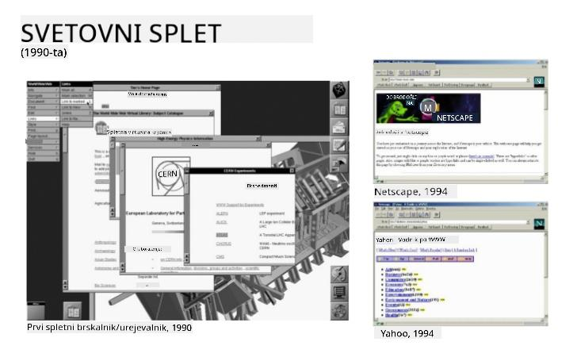
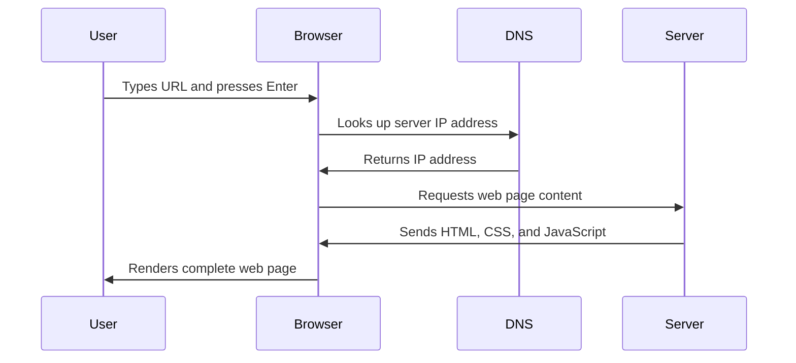
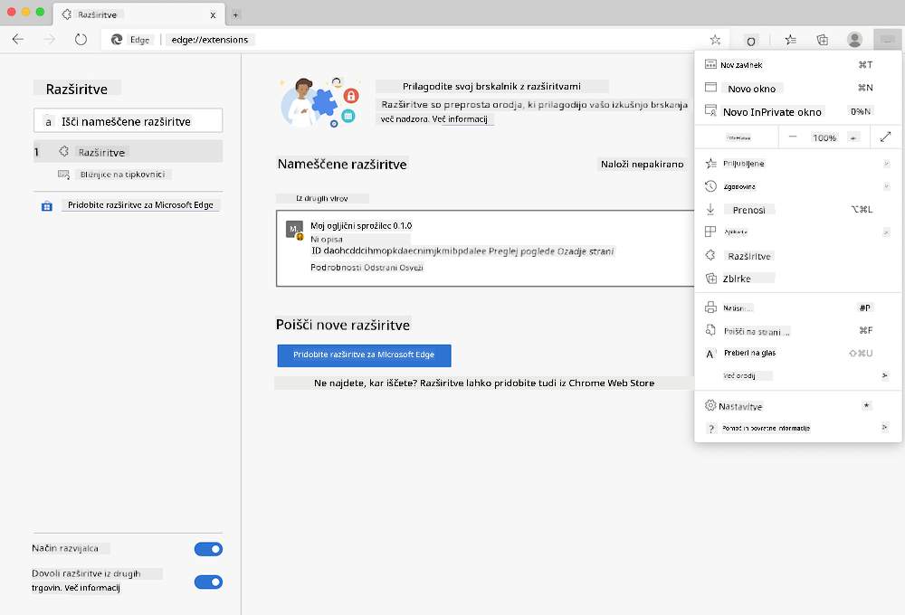
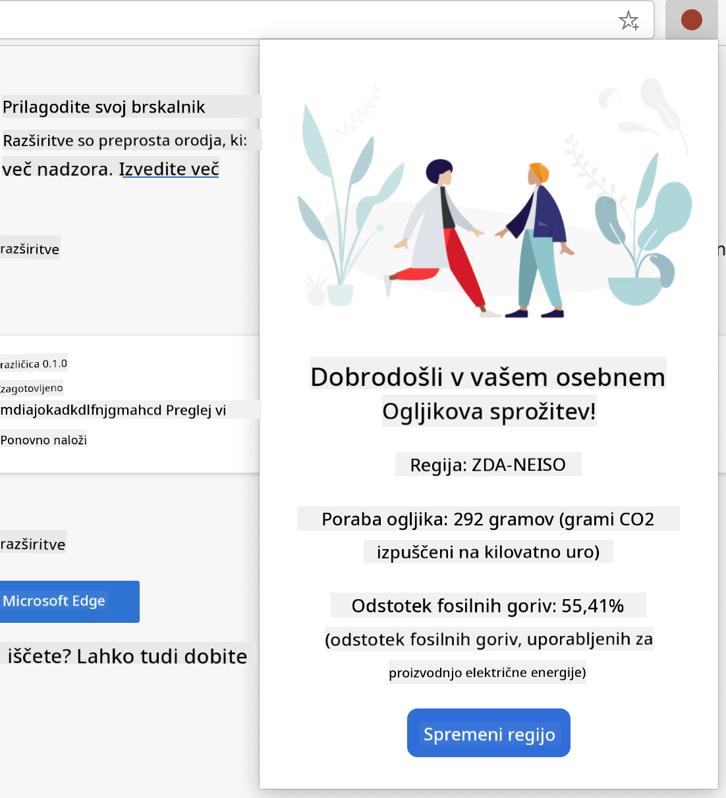

<!--
CO_OP_TRANSLATOR_METADATA:
{
  "original_hash": "33a875c522f237a2026e4653240dfc07",
  "translation_date": "2025-10-25T00:46:41+00:00",
  "source_file": "5-browser-extension/1-about-browsers/README.md",
  "language_code": "sl"
}
-->
# Projekt razširitve brskalnika, 1. del: Vse o brskalnikih


> Skica avtorja [Wassim Chegham](https://dev.to/wassimchegham/ever-wondered-what-happens-when-you-type-in-a-url-in-an-address-bar-in-a-browser-3dob)

## Predhodni kviz pred predavanjem

[Predhodni kviz pred predavanjem](https://ff-quizzes.netlify.app/web/quiz/23)

### Uvod

Razširitve brskalnika so mini aplikacije, ki izboljšajo vašo izkušnjo brskanja po spletu. Tako kot je bila prvotna vizija Tima Berners-Leeja interaktivni splet, razširitve razširijo zmogljivosti brskalnika onkraj preprostega ogledovanja dokumentov. Od upravljalnikov gesel, ki ohranjajo vaše račune varne, do izbirnikov barv, ki oblikovalcem pomagajo najti popolne odtenke, razširitve rešujejo vsakodnevne izzive pri brskanju.

Preden začnemo graditi vašo prvo razširitev, se moramo naučiti, kako delujejo brskalniki. Tako kot je Alexander Graham Bell moral razumeti prenos zvoka, preden je izumil telefon, vam bo poznavanje osnov brskalnikov pomagalo ustvariti razširitve, ki se brezhibno integrirajo z obstoječimi sistemi brskalnika.

Do konca te lekcije boste razumeli arhitekturo brskalnika in začeli graditi svojo prvo razširitev.

## Razumevanje spletnih brskalnikov

Spletni brskalnik je v bistvu sofisticiran tolmač dokumentov. Ko v naslovno vrstico vnesete "google.com", brskalnik izvede zapleten niz operacij - zahteva vsebino s strežnikov po vsem svetu, nato pa analizira in upodobi kodo v interaktivne spletne strani, ki jih vidite.

Ta proces je podoben temu, kako je bil prvi spletni brskalnik, WorldWideWeb, zasnovan leta 1990 s strani Tima Berners-Leeja, da bi hiperlinkane dokumente naredil dostopne vsem.

✅ **Malo zgodovine**: Prvi brskalnik se je imenoval 'WorldWideWeb' in ga je leta 1990 ustvaril Sir Timothy Berners-Lee.


> Nekateri zgodnji brskalniki, prek [Karen McGrane](https://www.slideshare.net/KMcGrane/week-4-ixd-history-personal-computing)

### Kako brskalniki obdelujejo spletno vsebino

Proces med vnosom URL-ja in prikazom spletne strani vključuje več usklajenih korakov, ki se zgodijo v nekaj sekundah:



**Kaj ta proces doseže:**
- **Prevede** človeško berljiv URL v IP naslov strežnika prek iskanja DNS
- **Vzpostavi** varno povezavo s spletnim strežnikom z uporabo protokolov HTTP ali HTTPS
- **Zahteva** specifično vsebino spletne strani od strežnika
- **Prejme** HTML oznake, CSS slogovne datoteke in JavaScript kodo od strežnika
- **Upodobi** vso vsebino v interaktivno spletno stran, ki jo vidite

### Osnovne funkcije brskalnika

Sodobni brskalniki ponujajo številne funkcije, ki jih lahko razvijalci razširitev izkoristijo:

| Funkcija | Namen | Priložnosti za razširitve |
|----------|-------|---------------------------|
| **Upodabljalni motor** | Prikazuje HTML, CSS in JavaScript | Spreminjanje vsebine, vbrizgavanje slogov |
| **JavaScript motor** | Izvaja JavaScript kodo | Prilagojeni skripti, interakcije z API-ji |
| **Lokalno shranjevanje** | Shranjuje podatke lokalno | Nastavitve uporabnika, predpomnjeni podatki |
| **Omrežni sklad** | Upravljanje spletnih zahtev | Spremljanje zahtev, analiza podatkov |
| **Varnostni model** | Zaščita uporabnikov pred zlonamerno vsebino | Filtriranje vsebine, izboljšave varnosti |

**Razumevanje teh funkcij vam pomaga:**
- **Prepoznati**, kje lahko vaša razširitev doda največjo vrednost
- **Izbrati** prave API-je brskalnika za funkcionalnost vaše razširitve
- **Oblikovati** razširitve, ki učinkovito delujejo z brskalniškimi sistemi
- **Zagotoviti**, da vaša razširitev sledi najboljšim varnostnim praksam brskalnika

### Razmisleki o razvoju za različne brskalnike

Različni brskalniki izvajajo standarde z manjšimi razlikami, podobno kot različni programski jeziki obravnavajo isti algoritem na različne načine. Chrome, Firefox in Safari imajo vsak svoje značilnosti, ki jih morajo razvijalci upoštevati med razvojem razširitev.

> 💡 **Nasvet**: Uporabite [caniuse.com](https://www.caniuse.com) za preverjanje, katere spletne tehnologije so podprte v različnih brskalnikih. To je neprecenljivo pri načrtovanju funkcij vaše razširitve!

**Ključni vidiki razvoja razširitev:**
- **Testirajte** svojo razširitev v brskalnikih Chrome, Firefox in Edge
- **Prilagodite** različnim API-jem razširitev brskalnikov in formatom manifestov
- **Obravnavajte** različne značilnosti zmogljivosti in omejitve
- **Zagotovite** rešitve za funkcije, specifične za brskalnik, ki morda niso na voljo

✅ **Vpogled v analitiko**: Ugotovite, katere brskalnike vaši uporabniki najpogosteje uporabljajo, tako da v svoje projekte spletnega razvoja namestite analitične pakete. Ti podatki vam pomagajo določiti prioritete, katere brskalnike najprej podpreti.

## Razumevanje razširitev brskalnika

Razširitve brskalnika rešujejo pogoste izzive pri brskanju po spletu z dodajanjem funkcionalnosti neposredno v vmesnik brskalnika. Namesto da bi zahtevale ločene aplikacije ali zapletene delovne tokove, razširitve omogočajo takojšen dostop do orodij in funkcij.

Ta koncept je podoben temu, kako so zgodnji računalniški pionirji, kot je bil Douglas Engelbart, predvideli povečanje človeških sposobnosti s tehnologijo - razširitve povečujejo osnovno funkcionalnost vašega brskalnika.

**Priljubljene kategorije razširitev in njihove prednosti:**
- **Orodja za produktivnost**: Upravljalniki nalog, aplikacije za beleženje in sledilci časa, ki vam pomagajo ostati organizirani
- **Izboljšave varnosti**: Upravljalniki gesel, blokatorji oglasov in orodja za zasebnost, ki ščitijo vaše podatke
- **Orodja za razvijalce**: Oblikovalci kode, izbirniki barv in orodja za odpravljanje napak, ki poenostavijo razvoj
- **Izboljšanje vsebine**: Načini branja, prenosniki videov in orodja za zajem zaslona, ki izboljšajo vašo spletno izkušnjo

✅ **Vprašanje za razmislek**: Katere so vaše najljubše razširitve brskalnika? Katere specifične naloge opravljajo in kako izboljšujejo vašo izkušnjo brskanja?

## Namestitev in upravljanje razširitev

Razumevanje postopka namestitve razširitev vam pomaga predvideti uporabniško izkušnjo, ko ljudje nameščajo vašo razširitev. Postopek namestitve je standardiziran v sodobnih brskalnikih, z manjšimi razlikami v oblikovanju vmesnika.



> **Pomembno**: Pri testiranju lastnih razširitev se prepričajte, da omogočite način za razvijalce in dovoljujete razširitve iz drugih trgovin.

### Postopek namestitve razširitve med razvojem

Ko razvijate in testirate svoje razširitve, sledite temu postopku:

```bash
# Step 1: Build your extension
npm run build
```

**Kaj ta ukaz doseže:**
- **Prevede** vašo izvorno kodo v datoteke, pripravljene za brskalnik
- **Združi** JavaScript module v optimizirane pakete
- **Ustvari** končne datoteke razširitve v mapi `/dist`
- **Pripravi** vašo razširitev za namestitev in testiranje

**Korak 2: Odprite upravljanje razširitev v brskalniku**
1. **Odprite** stran za upravljanje razširitev v vašem brskalniku
2. **Kliknite** gumb "Nastavitve in več" (ikona `...`) v zgornjem desnem kotu
3. **Izberite** "Razširitve" iz spustnega menija

**Korak 3: Naložite svojo razširitev**
- **Za nove namestitve**: Izberite `load unpacked` in izberite svojo mapo `/dist`
- **Za posodobitve**: Kliknite `reload` poleg že nameščene razširitve
- **Za testiranje**: Omogočite "Način za razvijalce", da dostopate do dodatnih funkcij za odpravljanje napak

### Namestitev razširitve za produkcijo

> ✅ **Opomba**: Ta navodila za razvoj so specifična za razširitve, ki jih sami ustvarite. Za namestitev objavljenih razširitev obiščite uradne trgovine z razširitvami brskalnikov, kot je [Microsoft Edge Add-ons store](https://microsoftedge.microsoft.com/addons/Microsoft-Edge-Extensions-Home).

**Razumevanje razlike:**
- **Namestitve med razvojem** vam omogočajo testiranje neobjavljenih razširitev med razvojem
- **Namestitve iz trgovine** zagotavljajo preverjene, objavljene razširitve z avtomatskimi posodobitvami
- **Stranska namestitev** omogoča namestitev razširitev zunaj uradnih trgovin (zahteva način za razvijalce)

## Gradnja razširitve za ogljični odtis

Ustvarili bomo razširitev brskalnika, ki prikazuje ogljični odtis porabe energije v vaši regiji. Ta projekt prikazuje osnovne koncepte razvoja razširitev, hkrati pa ustvarja praktično orodje za ozaveščanje o okolju.

Ta pristop sledi načelu "učenja skozi prakso", ki se je izkazalo za učinkovito že od izobraževalnih teorij Johna Deweyja - združuje tehnične veščine s smiselnimi aplikacijami v resničnem svetu.

### Zahteve projekta

Pred začetkom razvoja zberimo potrebne vire in odvisnosti:

**Potrebni dostopi do API-jev:**
- **[CO2 Signal API ključ](https://www.co2signal.com/)**: Vnesite svoj e-poštni naslov, da prejmete brezplačen API ključ
- **[Koda regije](http://api.electricitymap.org/v3/zones)**: Poiščite kodo svoje regije z uporabo [Electricity Map](https://www.electricitymap.org/map) (na primer, Boston uporablja 'US-NEISO')

**Orodja za razvoj:**
- **[Node.js in NPM](https://www.npmjs.com)**: Orodje za upravljanje paketov za namestitev odvisnosti projekta
- **[Začetna koda](../../../../5-browser-extension/start)**: Prenesite mapo `start` za začetek razvoja

✅ **Več o tem**: Izboljšajte svoje veščine upravljanja paketov s tem [celovitim modulom za učenje](https://docs.microsoft.com/learn/modules/create-nodejs-project-dependencies/?WT.mc_id=academic-77807-sagibbon)

### Razumevanje strukture projekta

Razumevanje strukture projekta pomaga učinkovito organizirati razvojno delo. Tako kot je bila Aleksandrijska knjižnica organizirana za enostavno iskanje znanja, dobro strukturirana koda omogoča učinkovitejši razvoj:

```
project-root/
├── dist/                    # Built extension files
│   ├── manifest.json        # Extension configuration
│   ├── index.html           # User interface markup
│   ├── background.js        # Background script functionality
│   └── main.js              # Compiled JavaScript bundle
└── src/                     # Source development files
    └── index.js             # Your main JavaScript code
```

**Razčlenitev, kaj doseže posamezna datoteka:**
- **`manifest.json`**: **Določa** metapodatke razširitve, dovoljenja in vstopne točke
- **`index.html`**: **Ustvari** uporabniški vmesnik, ki se prikaže, ko uporabniki kliknejo na vašo razširitev
- **`background.js`**: **Upravlja** naloge v ozadju in poslušalce dogodkov brskalnika
- **`main.js`**: **Vsebuje** končno združeno JavaScript kodo po procesu gradnje
- **`src/index.js`**: **Vsebuje** vašo glavno razvojno kodo, ki se prevede v `main.js`

> 💡 **Nasvet za organizacijo**: Shranite svoj API ključ in kodo regije v varno beležko za enostavno referenco med razvojem. Te vrednosti boste potrebovali za testiranje funkcionalnosti vaše razširitve.

✅ **Opomba o varnosti**: Nikoli ne shranjujte API ključev ali občutljivih poverilnic v svojem repozitoriju kode. V naslednjih korakih vam bomo pokazali, kako jih varno obravnavati.

## Ustvarjanje vmesnika razširitve

Zdaj bomo zgradili komponente uporabniškega vmesnika. Razširitev uporablja dvostranski pristop: zaslon za konfiguracijo za začetno nastavitev in zaslon z rezultati za prikaz podatkov.

To sledi načelu postopnega razkrivanja, ki se uporablja pri oblikovanju vmesnikov že od zgodnjih dni računalništva - razkrivanje informacij in možnosti v logičnem zaporedju, da se uporabniki ne počutijo preobremenjene.

### Pregled pogledov razširitve

**Pogled za nastavitev** - Konfiguracija za prve uporabnike:


**Pogled rezultatov** - Prikaz podatkov o ogljičnem odtisu:


### Gradnja obrazca za konfiguracijo

Obrazec za nastavitev zbira podatke o konfiguraciji uporabnika ob prvi uporabi. Ko je konfiguriran, se te informacije shranijo v shrambo brskalnika za prihodnje seje.

V datoteko `/dist/index.html` dodajte to strukturo obrazca:

```html
<form class="form-data" autocomplete="on">
    <div>
        <h2>New? Add your Information</h2>
    </div>
    <div>
        <label for="region">Region Name</label>
        <input type="text" id="region" required class="region-name" />
    </div>
    <div>
        <label for="api">Your API Key from tmrow</label>
        <input type="text" id="api" required class="api-key" />
    </div>
    <button class="search-btn">Submit</button>
</form>
```

**Kaj ta obrazec doseže:**
- **Ustvari** semantično strukturo obrazca z ustreznimi oznakami in povezavami vnosov
- **Omogoča** funkcionalnost samodejnega dopolnjevanja brskalnika za izboljšano uporabniško izkušnjo
- **Zahteva**, da sta obe polji izpolnjeni pred oddajo z uporabo atributa `required`
- **Organizira** vnose z opisnimi imeni razredov za enostavno oblikovanje in ciljanje z JavaScriptom
- **Ponuja** jasna navodila za uporabnike, ki prvič nastavljajo razširitev

### Gradnja prikaza rezultatov

Nato ustvarite območje rezultatov, ki bo prikazovalo podatke o ogljičnem odtisu. Dodajte ta HTML pod obrazec:

```html
<div class="result">
    <div class="loading">loading...</div>
    <div class="errors"></div>
    <div class="data"></div>
    <div class="result-container">
        <p><strong>Region: </strong><span class="my-region"></span></p>
        <p><strong>Carbon Usage: </strong><span class="carbon-usage"></span></p>
        <p><strong>Fossil Fuel Percentage: </strong><span class="fossil-fuel"></span></p>
    </div>
    <button class="clear-btn">Change region</button>
</div>
```

**Razčlenitev, kaj ta struktura omogoča:**
- **`loading`**: **Prikaže** sporočilo o nalaganju med pridobivanjem podatkov iz API-ja
- **`errors`**: **Prikaže** sporočila o napakah, če klici API ne uspejo ali so podatki neveljavni
- **`data`**: **Hrani** surove podatke za odpravljanje napak med razvojem
- **`result-container`**: **Predstavi** formatirane informacije o ogljičnem odtisu uporabnikom
- **`clear-btn`**: **Omogoča** uporabnikom, da spremenijo svojo regijo in ponovno konfigurirajo razširitev

### Nastavitev procesa gradnje

Zdaj namestimo odvisnosti projekta in preizkusimo proces gradnje:

```bash
npm install
```

**Kaj doseže ta proces namestitve:**
- **Prenese** Webpack in druge razvojne odvisnosti, določene v `package.json`
- **Konfigurira** orodje za gradnjo za prevajanje sodobnega JavaScripta
- **Pripravi** razvojno okolje za gradnjo in testiranje razširitve
- **Omogoča** združevanje kode, optimizacijo
**Opis:** Izboljšajte razširitev brskalnika z dodajanjem funkcij za validacijo obrazcev in povratne informacije uporabnikom, da izboljšate uporabniško izkušnjo pri vnosu API ključev in kod regij.

**Navodilo:** Ustvarite funkcije za validacijo v JavaScriptu, ki preverjajo, ali polje za API ključ vsebuje vsaj 20 znakov in ali koda regije ustreza pravilni obliki (na primer 'US-NEISO'). Dodajte vizualne povratne informacije tako, da spremenite barvo obrobe vnosnih polj v zeleno za veljavne vnose in rdečo za neveljavne. Prav tako dodajte funkcijo za preklop prikaza/skritja API ključa zaradi varnosti.

Več o [načinu agent](https://code.visualstudio.com/blogs/2025/02/24/introducing-copilot-agent-mode) si lahko preberete tukaj.

## 🚀 Izziv

Oglejte si trgovino z razširitvami za brskalnik in namestite eno v svoj brskalnik. Datoteke razširitve lahko preučite na zanimive načine. Kaj odkrijete?

## Kviz po predavanju

[Kviz po predavanju](https://ff-quizzes.netlify.app/web/quiz/24)

## Pregled in samostojno učenje

V tej lekciji ste se naučili nekaj o zgodovini spletnih brskalnikov; izkoristite to priložnost, da se naučite več o tem, kako so izumitelji svetovnega spleta zamišljali njegovo uporabo, tako da preberete več o njegovi zgodovini. Nekaj uporabnih spletnih strani vključuje:

[Zgodovina spletnih brskalnikov](https://www.mozilla.org/firefox/browsers/browser-history/)

[Zgodovina spleta](https://webfoundation.org/about/vision/history-of-the-web/)

[Intervju s Timom Berners-Leejem](https://www.theguardian.com/technology/2019/mar/12/tim-berners-lee-on-30-years-of-the-web-if-we-dream-a-little-we-can-get-the-web-we-want)

## Naloga 

[Preoblikujte svojo razširitev](assignment.md)

---

**Omejitev odgovornosti**:  
Ta dokument je bil preveden z uporabo storitve za prevajanje z umetno inteligenco [Co-op Translator](https://github.com/Azure/co-op-translator). Čeprav si prizadevamo za natančnost, vas prosimo, da upoštevate, da lahko avtomatski prevodi vsebujejo napake ali netočnosti. Izvirni dokument v njegovem maternem jeziku je treba obravnavati kot avtoritativni vir. Za ključne informacije priporočamo profesionalni človeški prevod. Ne prevzemamo odgovornosti za morebitna nesporazumevanja ali napačne razlage, ki izhajajo iz uporabe tega prevoda.