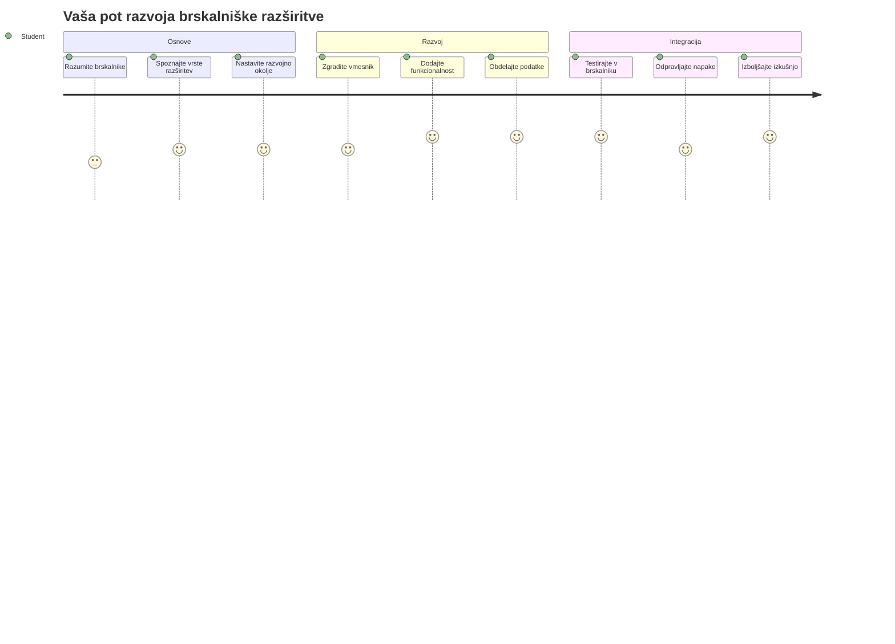
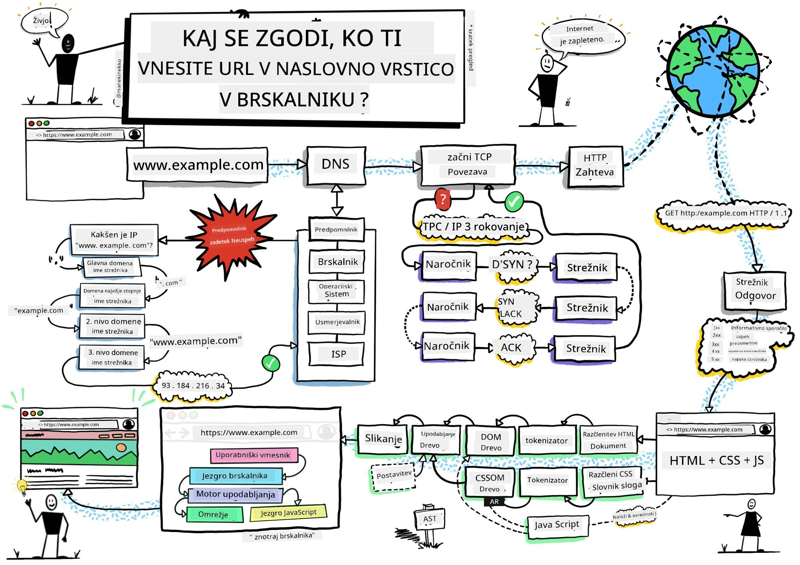
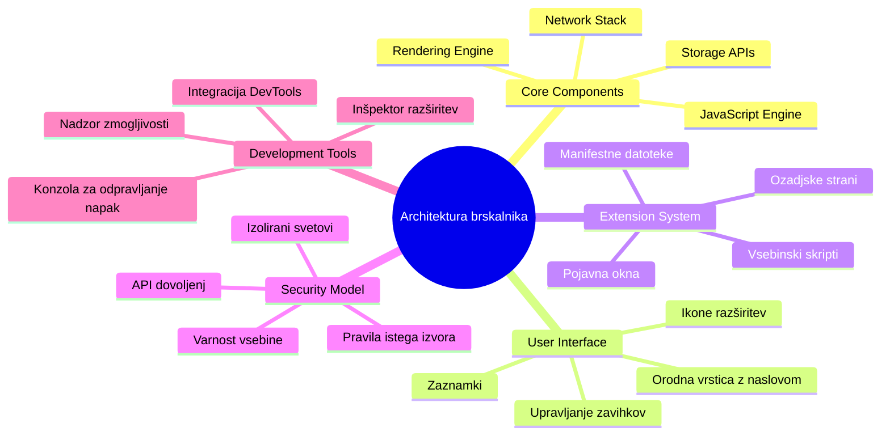
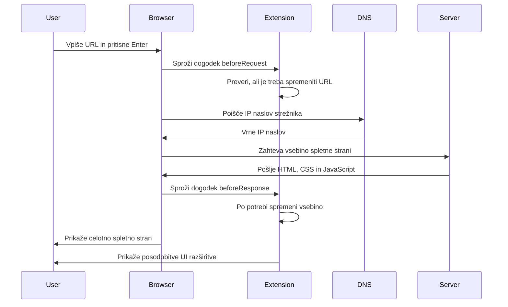
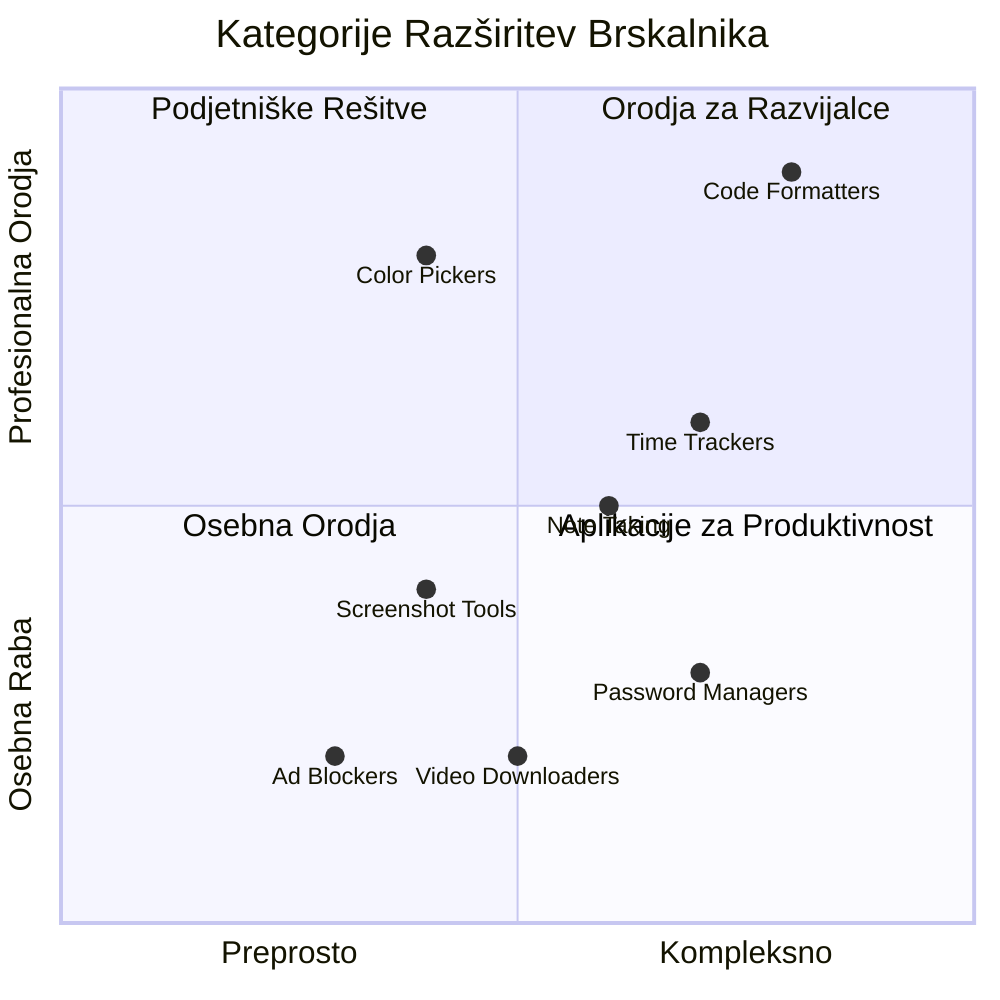
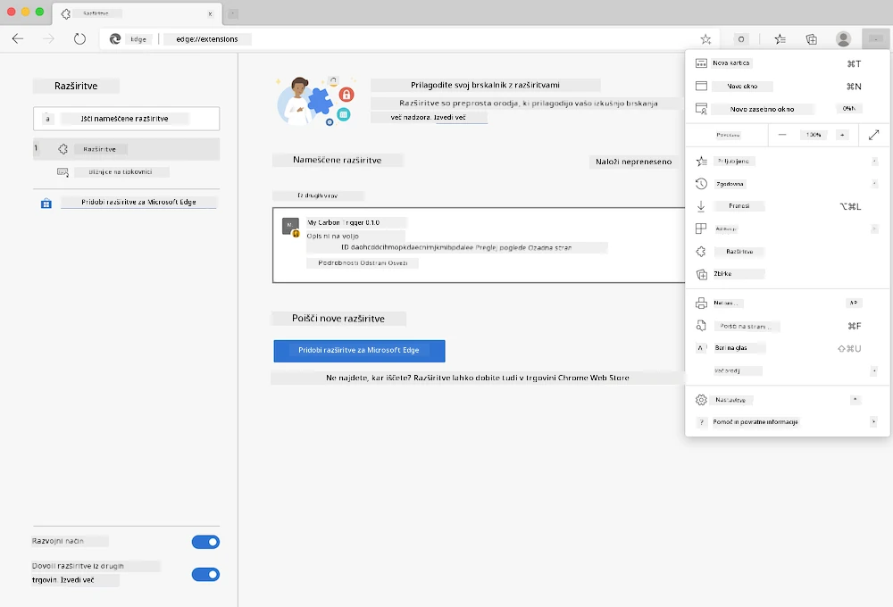
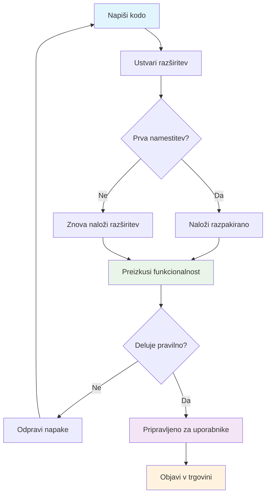
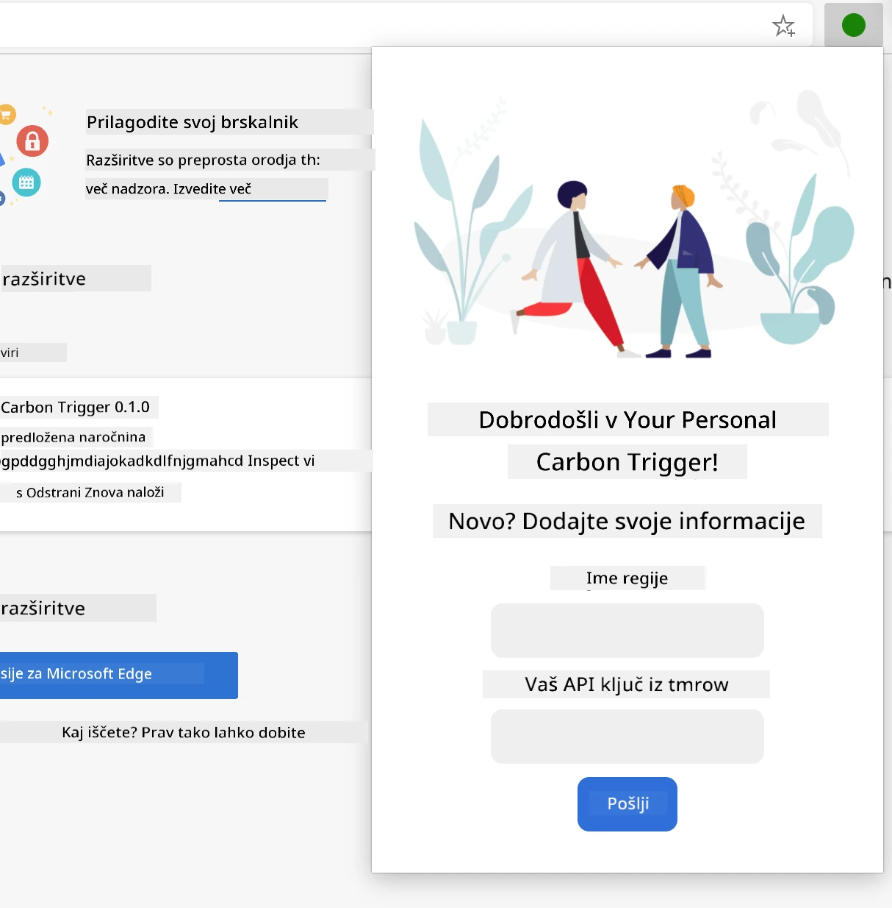
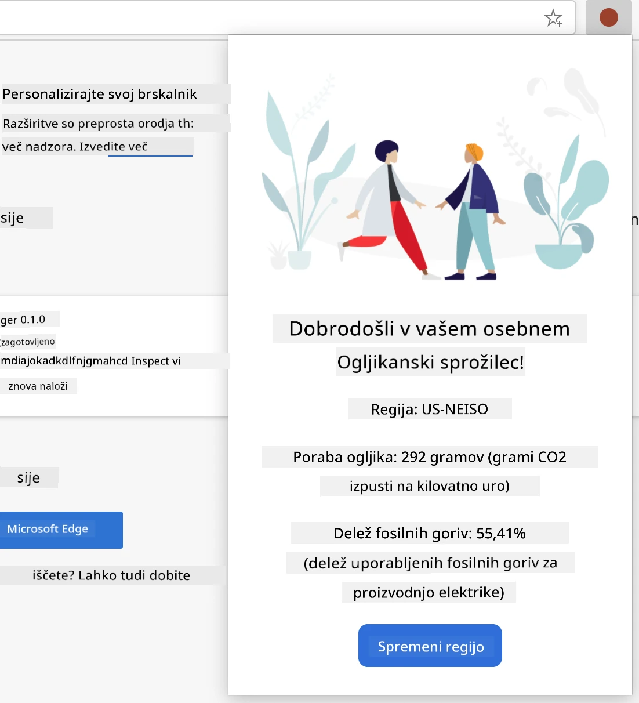
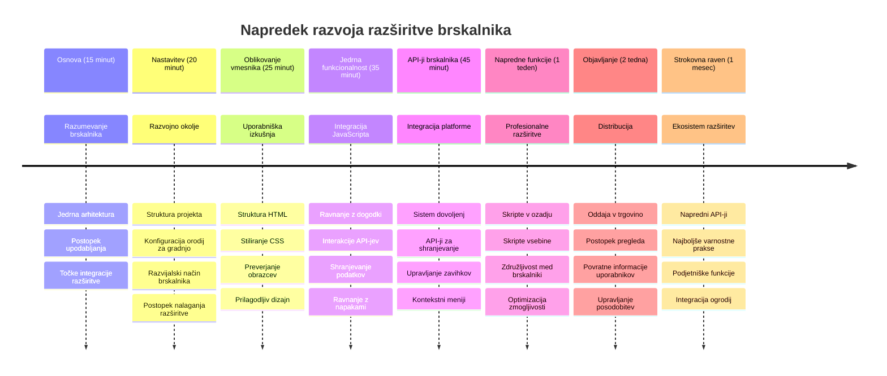

<!--
CO_OP_TRANSLATOR_METADATA:
{
  "original_hash": "00aa85715e1efd4930c17a23e3012e69",
  "translation_date": "2026-01-07T10:17:00+00:00",
  "source_file": "5-browser-extension/1-about-browsers/README.md",
  "language_code": "sl"
}
-->
# Razširitev brskalnika, projekt del 1: Vse o brskalnikih



> Sketchnote avtorja [Wassim Chegham](https://dev.to/wassimchegham/ever-wondered-what-happens-when-you-type-in-a-url-in-an-address-bar-in-a-browser-3dob)

## Predpredavanje Kviz

[Predpredavanje kviz](https://ff-quizzes.netlify.app/web/quiz/23)

### Uvod

Razširitve brskalnika so mini-aplikacije, ki izboljšajo vašo izkušnjo brskanja po spletu. Tako kot izvirna vizija Tima Berners-Leeja o interaktivnem spletu, razširitve razširjajo zmogljivosti brskalnika onkraj preprostega pregleda dokumentov. Od upravljalnikov gesel, ki varujejo vaše račune, do izbirnikov barv, ki oblikovalcem pomagajo zajeti popolne odtenke - razširitve rešujejo vsakdanje izzive pri brskanju.

Preden zgradimo vašo prvo razširitev, razumimo, kako brskalniki delujejo. Tako kot je Alexander Graham Bell moral razumeti prenos zvoka preden je izumil telefon, vam bo poznavanje osnov brskalnikov pomagalo ustvariti razširitve, ki se brezhibno integrirajo z obstoječimi sistemi brskalnikov.

Na koncu te lekcije boste razumeli arhitekturo brskalnika in začeli graditi svojo prvo razširitev.


## Razumevanje spletnih brskalnikov

Spletni brskalnik je v bistvu sofisticiran tolmač dokumentov. Ko v naslovno vrstico vtipkate "google.com", brskalnik izvede kompleksen niz operacij – zahteva vsebino s strežnikov po vsem svetu, nato analizira in prikaže to kodo kot interaktivne spletne strani, ki jih vidite.

Ta proces odraža, kako je prvi spletni brskalnik, WorldWideWeb, načrtoval Tim Berners-Lee leta 1990, da bi omogočil dostop do hiperpovezanih dokumentov vsem.

✅ **Malo zgodovine**: Prvi brskalnik se je imenoval 'WorldWideWeb' in ga je leta 1990 ustvaril Sir Timothy Berners-Lee.


> Nekateri zgodnji brskalniki, preko [Karen McGrane](https://www.slideshare.net/KMcGrane/week-4-ixd-history-personal-computing)

### Kako brskalniki obdelujejo spletno vsebino

Proces od vnosa URL-ja do ogleda spletne strani vključuje več usklajenih korakov, ki se zgodijo v nekaj sekundah:


**Tukaj je, kaj ta proces doseže:**
- **Prevede** URL, berljiv ljudem, v IP naslov strežnika preko DNS poizvedbe
- **Vzpostavi** varno povezavo s spletnim strežnikom z uporabo protokolov HTTP ali HTTPS
- **Zahteva** vsebino določene spletne strani s strežnika
- **Prejme** HTML označevanje, CSS stiliranje in JavaScript kodo s strežnika
- **Prikaže** vsebino kot interaktivno spletno stran, ki jo vidite

### Glavne funkcije brskalnika

Sodobni brskalniki nudijo številne funkcije, ki jih razvijalci razširitev lahko izkoristijo:

| Funkcija | Namen | Možnosti za razširitve |
|---------|---------|------------------------|
| **Grafični pogon (Rendering Engine)** | Prikazuje HTML, CSS in JavaScript | Spreminjanje vsebine, vbrizgavanje stilov |
| **JavaScript pogon** | Izvaja JavaScript kodo | Po meri skripte, API interakcije |
| **Lokalni pomnilnik** | Shrani podatke lokalno | Nastavitve uporabnikov, predpomnjeni podatki |
| **Mrežni sloj** | Obravnava spletne zahteve | Spremljanje zahtev, analiza podatkov |
| **Varnostni model** | Ščiti uporabnike pred zlonamerno vsebino | Filtriranje vsebine, varnostne izboljšave |

**Razumevanje teh funkcij vam pomaga:**
- **Prepoznati** kje lahko vaša razširitev največ prispeva
- **Izbrati** prave brskalniške API-je za funkcionalnosti vaše razširitve
- **Oblikovati** razširitve, ki učinkovito delujejo s sistemi brskalnika
- **Zagotavljati** varnostne prakse brskalnikov pri razširitvah

### Upoštevanje razvoja za različne brskalnike

Različni brskalniki standarde izvajajo z rahlimi razlikami, podobno kot različni programski jeziki lahko isto algoritmično nalogo obravnavajo drugače. Chrome, Firefox in Safari imajo vsak svoje posebnosti, ki jih morajo razvijalci upoštevati pri razvoju razširitev.

> 💡 **Nasvet**: Uporabite [caniuse.com](https://www.caniuse.com) za preverjanje, katere spletne tehnologije so podprte v različnih brskalnikih. To je neprecenljivo pri načrtovanju funkcij vaše razširitve!

**Ključna ozira za razvoj razširitev:**
- **Preizkusite** razširitev v Chrome, Firefox in Edge
- **Prilagajajte** se različnim API-jem in manifest formatom brskalnikov
- **Obravnavajte** razlike v zmogljivostih in omejitvah
- **Nudite** nadomestke za brskalniško specifične funkcije, ki morda niso na voljo

✅ **Vpogled v analitiko**: S pomočjo analitičnih paketov v spletnem razvoju lahko ugotovite, katere brskalnike uporabniki raje uporabljajo. To vam pomaga določiti, katere brskalnike podpirati najprej.

## Razumevanje razširitev brskalnika

Razširitve brskalnika rešujejo pogoste izzive spletnega brskanja tako, da dodajo funkcionalnost neposredno v uporabniški vmesnik brskalnika. Namesto uporabe ločenih aplikacij ali kompleksnih delovnih tokov omogočajo takojšen dostop do orodij in funkcij.

Ta koncept odraža, kako so zgodnji računalniški pionirji, kot je Douglas Engelbart, zamišljali nadgradnjo človeških zmogljivosti s tehnologijo – razširitve nadgradijo osnovno funkcionalnost vašega brskalnika.


**Priljubljene kategorije razširitev in njihove koristi:**
- **Orodja za produktivnost**: Upravljalniki nalog, aplikacije za zapisovanje in merjenje časa, ki pomagajo ostati organizirani
- **Varnostne izboljšave**: Upravljalniki gesel, blokatorji oglasov in orodja za zasebnost, ki varujejo vaše podatke
- **Orodja za razvijalce**: Oblikovalniki kode, izbirniki barv in razhroščevalna orodja, ki poenostavljajo razvoj
- **Izboljšave vsebine**: Načini branja, prenašalniki videoposnetkov in orodja za zajem zaslona, ki izboljšajo spletno izkušnjo

✅ **Vprašanje za razmislek**: Katere so vaše najljubše razširitve brskalnika? Katere naloge specifično opravljajo in kako izboljšajo vašo izkušnjo brskanja?

### 🔄 **Pedagoški pregled**
**Razumevanje arhitekture brskalnika**: Pred razvojem razširitev se prepričajte, da lahko:
- ✅ Razložite, kako brskalniki obdelujejo spletne zahteve in prikazujejo vsebino
- ✅ Prepoznate glavne komponente arhitekture brskalnika
- ✅ Razumete, kako se razširitve integrirajo z zmogljivostmi brskalnika
- ✅ Prepoznate varnostni model, ki ščiti uporabnike

**Hiter samopreizkus**: Ali lahko sledite poti od vnosa URL-ja do prikaza spletne strani?
1. **DNS poizvedba** pretvori URL v IP naslov
2. **HTTP zahteva** pridobi vsebino s strežnika
3. **Analiza** obdeluje HTML, CSS in JavaScript
4. **Prikaz** prikaže končno spletno stran
5. **Razširitve** lahko spreminjajo vsebino na več korakih

## Namestitev in upravljanje razširitev

Razumevanje procesa namestitve razširitev vam pomaga predvideti uporabniško izkušnjo, ko ljudje namestijo vašo razširitev. Proces namestitve je standardiziran v sodobnih brskalnikih, z manjšimi razlikami v oblikovanju vmesnika.



> **Pomembno**: Prepričajte se, da pri testiranju svojih razširitev omogočite razvojni način in dovolite razširitve iz drugih trgovin.

### Postopek namestitve razširitve med razvojem

Ko razvijate in testirate svoje razširitve, sledite temu postopku:


```bash
# Korak 1: Zgradite svojo razširitev
npm run build
```

**Kaj ta ukaz naredi:**
- **Prevede** vašo izvorno kodo v datoteke, pripravljene za brskalnik
- **Združi** JavaScript module v optimirane pakete
- **Ustvari** končne datoteke razširitve v mapi `/dist`
- **Pripravi** vašo razširitev za namestitev in testiranje

**Korak 2: Odprite stran z razširitvami brskalnika**
1. **Odprite** stran za upravljanje razširitev v vašem brskalniku
2. **Kliknite** gumb "Nastavitve in več" (ikona `...`) zgoraj desno
3. **Izberite** "Razširitve" iz spustnega menija

**Korak 3: Naložite svojo razširitev**
- **Za nove namestitve**: Izberite `load unpacked` in izberite svojo mapo `/dist`
- **Za posodobitve**: Kliknite `reload` zraven že nameščene razširitve
- **Za testiranje**: Omogočite "Razvojni način" za dostop do dodatnih funkcij za razhroščevanje

### Namestitev razširitev v produkciji

> ✅ **Opomba**: Ta navodila za razvoj so namenjena specifično razširitvam, ki jih sami razvijate. Za namestitev objavljenih razširitev obiščite uradne trgovine z razširitvami brskalnikov, kot je [Microsoft Edge Trgovina z razširitvami](https://microsoftedge.microsoft.com/addons/Microsoft-Edge-Extensions-Home).

**Razumevanje razlik:**
- **Namestitve med razvojem** omogočajo testiranje neobjavljenih razširitev med razvojem
- **Namestitve iz trgovine** zagotavljajo preverjene, objavljene razširitve z avtomatskimi posodobitvami
- **Sideloading** omogoča namestitev razširitev zunaj uradnih trgovin (zahteva razvojni način)

## Gradnja razširitve za ogljični odtis

Ustvarili bomo razširitev brskalnika, ki prikazuje ogljični odtis porabe električne energije v vaši regiji. Ta projekt ponazarja bistvene koncepte razvoja razširitev, hkrati pa ustvarja praktično orodje za okoljsko ozaveščenost.

Ta pristop sledi načelu "učenja skozi delo", ki se je izkazalo za učinkovito že od John Deweyjevih izobraževalnih teorij – združevanje tehničnih veščin z realnimi, pomembnimi aplikacijami.

### Zahteve projekta

Pred začetkom razvoja zberimo potrebne vire in odvisnosti:

**Zahtevan dostop do API-ja:**
- **[CO2 Signal API ključ](https://www.co2signal.com/)**: Vnesite svoj elektronski naslov za prejem brezplačnega API ključa
- **[Šifra regije](http://api.electricitymap.org/v3/zones)**: Najdite kodo svoje regije z uporabo [Electricity Map](https://www.electricitymap.org/map) (na primer, Boston uporablja 'US-NEISO')

**Razvojna orodja:**
- **[Node.js in NPM](https://www.npmjs.com)**: Orodje za upravljanje paketov za namestitev odvisnosti projekta
- **[Začetna koda](../../../../5-browser-extension/start)**: Prenesite mapo `start` za začetek razvoja

✅ **Izboljšajte veščine**: Nadgradite svoje upravljanje paketov s tem [celovitim Learn modulom](https://docs.microsoft.com/learn/modules/create-nodejs-project-dependencies/?WT.mc_id=academic-77807-sagibbon)

### Razumevanje strukture projekta

Razumevanje strukture projekta pomaga učinkovito organizirati razvojno delo. Tako kot je bila Aleksandrijska knjižnica organizirana za lažje pridobivanje znanja, tudi dobro strukturirana koda omogoča učinkovitejši razvoj:

```
project-root/
├── dist/                    # Built extension files
│   ├── manifest.json        # Extension configuration
│   ├── index.html           # User interface markup
│   ├── background.js        # Background script functionality
│   └── main.js              # Compiled JavaScript bundle
├── src/                     # Source development files
│   └── index.js             # Your main JavaScript code
├── package.json             # Project dependencies and scripts
└── webpack.config.js        # Build configuration
```

**Kaj vsaka datoteka omogoča:**
- **`manifest.json`**: **Določa** metapodatke razširitve, dovoljenja in vhodne točke
- **`index.html`**: **Ustvari** uporabniški vmesnik, ki se pojavi, ko uporabniki kliknejo vašo razširitev
- **`background.js`**: **Upravlja** ozadna opravila in poslušalce dogodkov brskalnika
- **`main.js`**: **Vsebuje** končni združeni JavaScript po gradnji
- **`src/index.js`**: **Vsebuje** vašo glavno razvojno kodo, ki se prevede v `main.js`

> 💡 **Organizacijski nasvet**: Shranite svoj API ključ in kodo regije v varno beležko za lažji dostop med razvojem. Te vrednosti boste potrebovali za testiranje funkcionalnosti razširitve.

✅ **Varnostni nasvet**: Nikoli ne shranjujte API ključev ali občutljivih poverilnic v repozitorij kode. V naslednjih korakih vam bomo pokazali, kako to varno upravljati.

## Ustvarjanje uporabniškega vmesnika razširitve

Zdaj bomo zgradili uporabniške komponente vmesnika. Razširitev uporablja pristop z dvema zaslonoma: zaslon za nastavitev ob prvi uporabi in zaslon za prikaz rezultatov.

To sledi principu postopnega razkrivanja, ki se uporablja že od zgodnjih dni računalništva – informacije in možnosti se prikazujejo v logičnem zaporedju, da ne preobremenijo uporabnikov.

### Pregled pogledov razširitve

**Pogled nastavitve** - konfiguracija ob prvi uporabi:


**Pogled rezultatov** - prikaz podatkov o ogljičnem odtisu:


### Izdelava obrazca za nastavitve

Obrazec nastavitve zbira podatke o konfiguraciji uporabnika ob prvi uporabi. Ko je nastavljen, ti podatki ostanejo shranjeni v pomnilnik brskalnika za prihodnje seje.

V datoteko `/dist/index.html` dodajte to strukturo obrazca:

```html
<form class="form-data" autocomplete="on">
    <div>
        <h2>New? Add your Information</h2>
    </div>
    <div>
        <label for="region">Region Name</label>
        <input type="text" id="region" required class="region-name" />
    </div>
    <div>
        <label for="api">Your API Key from tmrow</label>
        <input type="text" id="api" required class="api-key" />
    </div>
    <button class="search-btn">Submit</button>
</form>
```

**Kaj ta obrazec doseže:**
- **Ustvari** semantično strukturo obrazca z ustreznimi oznakami in povezavami vnosa
- **Omogoči** avtomatsko izpolnjevanje brskalnika za boljšo uporabniško izkušnjo
- **Zahteva** izpolnitev obeh polj pred oddajo z atributom `required`
- **Organizira** vhodna polja z opisnimi imeni razredov za lažje stiliranje in ciljanje v JavaScriptu
- **Nudi** jasna navodila za uporabnike, ki razširitev nastavljajo prvič

### Izdelava prikaza rezultatov

Nato ustvarite območje za prikaz rezultatov, kjer bodo prikazani podatki o ogljičnem odtisu. Dodajte ta HTML pod obrazec:

```html
<div class="result">
    <div class="loading">loading...</div>
    <div class="errors"></div>
    <div class="data"></div>
    <div class="result-container">
        <p><strong>Region: </strong><span class="my-region"></span></p>
        <p><strong>Carbon Usage: </strong><span class="carbon-usage"></span></p>
        <p><strong>Fossil Fuel Percentage: </strong><span class="fossil-fuel"></span></p>
    </div>
    <button class="clear-btn">Change region</button>
</div>
```

**Kaj ta struktura omogoča:**
- **`loading`**: **Prikaže** sporočilo o nalaganju med pridobivanjem podatkov API-ja
- **`errors`**: **Prikaže** sporočila o napakah, če klici API-ja spodletijo ali so podatki neveljavni
- **`data`**: **Vsebuje** surove podatke za potrebe razhroščevanja med razvojem
- **`result-container`**: **Prikaže** formatirane informacije o ogljičnem odtisu uporabnikom
- **`clear-btn`**: **Omogoča** uporabnikom spremembo regije in ponastavitev razširitve

### Nastavitev procesa gradnje

Zdaj namestimo odvisnosti projekta in preizkusimo proces gradnje:

```bash
npm install
```

**Kaj ta postopek namestitve doseže:**
- **Prenese** Webpack in druge razvojne odvisnosti iz `package.json`
- **Konfigurira** orodja za prevajanje sodobnega JavaScripta
- **Pripravi** razvojno okolje za gradnjo in testiranje razširitve
- **Omogoči** združevanje, optimizacijo in funkcije združljivosti za brskalnike

> 💡 **Vpogled v proces gradnje**: Webpack združuje vašo izvorno kodo iz `/src/index.js` v `/dist/main.js`. Ta proces optimizira vašo kodo za produkcijo in zagotavlja združljivost z brskalniki.

### Testiranje napredka

V tem trenutku lahko preizkusite svojo razširitev:
1. **Zaženite** ukaz za sestavo, da prevedete svojo kodo  
2. **Naložite** razširitev v svoj brskalnik z uporabo načina za razvijalce  
3. **Preverite**, ali obrazec prikazuje pravilno in izgleda strokovno  
4. **Preverite**, ali so vsi elementi obrazca pravilno poravnani in funkcionalni  

**Kar ste dosegli:**  
- **Ustvarili** ste osnovno strukturo HTML za vašo razširitev  
- **Oblikovali** ste vmesnike za konfiguracijo in rezultate z ustrezno semantično označbo  
- **Vzpostavili** ste sodoben razvojni potek z uporabo industrijskih orodij  
- **Pripravili** ste podlago za dodajanje interaktivne funkcionalnosti z JavaScriptom  

### 🔄 **Pedagoški pregledi**  
**Napredek razvoja razširitve**: Preverite svoje razumevanje, preden nadaljujete:  
- ✅ Ali znate pojasniti namen vsake datoteke v strukturi projekta?  
- ✅ Ali razumete, kako proces sestavljanja pretvori vašo izvorno kodo?  
- ✅ Zakaj ločujemo konfiguracijo in rezultate v različne dele uporabniškega vmesnika?  
- ✅ Kako struktura obrazca podpira tako uporabnost kot tudi dostopnost?  

**Razumevanje razvojnega poteka**: Zdaj bi morali znati:  
1. **Prilagoditi** HTML in CSS za vmesnik vaše razširitve  
2. **Zagnati** ukaz za sestavo, da prevedete svoje spremembe  
3. **Ponovno naložiti** razširitev v brskalniku za testiranje posodobitev  
4. **Odpravljati napake** z orodji za razvijalce v brskalniku  

Zaključili ste prvo fazo razvoja razširitve za brskalnik. Tako kot sta bratca Wright najprej morala razumeti aerodinamiko, preden sta dosegla let, vas razumevanje teh osnovnih konceptov pripravi na ustvarjanje bolj zapletenih interaktivnih funkcij v naslednji lekciji.  

## Izziv GitHub Copilot Agenta 🚀  

Uporabite način Agent za dokončanje naslednjega izziva:  

**Opis:** Izboljšajte brskalniško razširitev tako, da dodate preverjanje obrazca in funkcije povratnih informacij uporabniku, da izboljšate uporabniško izkušnjo pri vnosu API ključev in regijskih kod.  

**Navodilo:** Ustvarite JavaScript funkcije za preverjanje, ki preverijo, ali polje za API ključ vsebuje vsaj 20 znakov in ali regijska koda sledi pravilnemu formatu (npr. 'US-NEISO'). Dodajte vizualne povratne informacije s spremembo barve obrobe vnosa na zeleno za veljavne vnose in rdečo za neveljavne. Prav tako dodajte možnost preklopa prikaza/skritja API ključa za varnostne namene.  

Več o [agent načinu](https://code.visualstudio.com/blogs/2025/02/24/introducing-copilot-agent-mode) si preberite tukaj.  

## 🚀 Izziv  

Oglejte si trgovino z razširitvami za brskalnik in namestite eno v svoj brskalnik. Njene datoteke lahko zanimivo preučite. Kaj odkrijete?  

## Kvizi po lekciji  

[Kvizi po lekciji](https://ff-quizzes.netlify.app/web/quiz/24)  

## Pregled in samostojno učenje  

V tej lekciji ste se nekaj naučili o zgodovini spletnih brskalnikov; izkoristite priložnost in se poglobite v zgodovino izuma svetovnega spleta. Nekaj uporabnih virov:  

[Zgodovina spletnih brskalnikov](https://www.mozilla.org/firefox/browsers/browser-history/)  

[Zgodovina spleta](https://webfoundation.org/about/vision/history-of-the-web/)  

[Intervju s Timom Berners-Leejem](https://www.theguardian.com/technology/2019/mar/12/tim-berners-lee-on-30-years-of-the-web-if-we-dream-a-little-we-can-get-the-web-we-want)  

### ⚡ **Kaj lahko naredite v naslednjih 5 minutah**  
- [ ] Odprite stran z razširitvami za Chrome/Edge (chrome://extensions) in si oglejte, kaj imate nameščeno  
- [ ] Ogled tabule Mreža (Network) v orodjih za razvijalce vašega brskalnika med nalaganjem spletne strani  
- [ ] Poskusite si ogledati izvorno kodo strani (Ctrl+U), da vidite HTML strukturo  
- [ ] Preglejte poljuben element spletne strani in spremenite njegov CSS v DevTools  

### 🎯 **Kaj lahko dosežete v tem času ure**  
- [ ] Rešite kvize po lekciji in razumite osnove brskalnikov  
- [ ] Ustvarite osnovno datoteko manifest.json za brskalniško razširitev  
- [ ] Naredite preprosto razširitev "Hello World", ki prikazuje pojavno okno  
- [ ] Preizkusite nalaganje vaše razširitve v načinu za razvijalce  
- [ ] Raziščite dokumentacijo o razširitvah za vaš ciljni brskalnik  

### 📅 **Vaša tedenska pot razširitve**  
- [ ] Dokončajte funkcionalno brskalniško razširitev z resnično uporabnostjo  
- [ ] Naučite se o vsebinskih skriptah, ozadju in pojavni interakciji  
- [ ] Obvladajte brskalniške API-je, kot so shranjevanje, zavihki in sporočanje  
- [ ] Oblikujte uporabniku prijazne vmesnike za vašo razširitev  
- [ ] Testirajte razširitev na različnih spletnih straneh in scenarijih  
- [ ] Objavite svojo razširitev v trgovini z razširitvami brskalnika  

### 🌟 **Vaš mesečni razvoj brskalnika**  
- [ ] Naredite več razširitev, ki rešujejo različne uporabniške težave  
- [ ] Naučite se naprednih brskalniških API-jev in varnostnih praks  
- [ ] Prispevajte k odprtokodnim projektom brskalniških razširitev  
- [ ] Obvladajte kompatibilnost med brskalniki in progresivne izboljšave  
- [ ] Ustvarjajte razvojna orodja in predloge za razširitve za druge  
- [ ] Postanite strokovnjak za brskalniške razširitve, ki pomaga drugim razvijalcem  

## 🎯 Časovni načrt za obvladovanje brskalniške razširitve  


### 🛠️ Povzetek vašega kompleta orodij za razvoj razširitve  

Po zaključku te lekcije imate zdaj:  
- **Znanje brskalniške arhitekture**: Razumevanje mehanizmov upodabljanja, varnostnih modelov in integracije razširitev  
- **Razvojno okolje**: Sodobno orodje s Webpackom, NPM-jem in možnostmi za odpravljanje napak  
- **Osnove UI/UX**: Semantična HTML struktura s postopnim razkrivanjem vsebine  
- **Varnostno zavedanje**: Razumevanje dovoljenj v brskalniku in varnih razvojnih praks  
- **Koncepti za več brskalnikov**: Znanje o združljivosti in testiranju na različnih brskalnikih  
- **Integracija API-jev**: Podlaga za delo z zunanjimi viri podatkov  
- **Profesionalni razvojni potek**: Standardni industrijski postopki razvoja in testiranja  

**Praktične uporabe:** Te veščine neposredno koristijo za:  
- **Spletni razvoj**: Enostranske aplikacije in progresivne spletne aplikacije  
- **Namizne aplikacije**: Electron in spletne namizne rešitve  
- **Mobilni razvoj**: Hibridne aplikacije in mobilne spletne rešitve  
- **Podjetniška orodja**: Notranje produktivne aplikacije in avtomatizacija procesov  
- **Odprta koda**: Prispevanje k projektom brskalniških razširitev in spletnim standardom  

**Naslednji nivo:** Pripravljeni ste za dodajanje interaktivnosti, delo z brskalniškimi API-ji in ustvarjanje razširitev, ki rešujejo resnične uporabniške težave!  

## Naloga  

[Spremeni stil tvoje razširitve](assignment.md)

---

<!-- CO-OP TRANSLATOR DISCLAIMER START -->
**Omejitev odgovornosti**:  
Ta dokument je bil preveden z uporabo storitve za prevajanje AI [Co-op Translator](https://github.com/Azure/co-op-translator). Čeprav si prizadevamo za natančnost, vas želimo opozoriti, da lahko avtomatizirani prevodi vsebujejo napake ali netočnosti. Izvirni dokument v njegovi izvorni jezikovni verziji naj velja za avtoritativni vir. Za ključne informacije priporočamo profesionalni človeški prevod. Za kakršna koli nesporazume ali napačne interpretacije, ki izhajajo iz uporabe tega prevoda, ne prevzemamo odgovornosti.
<!-- CO-OP TRANSLATOR DISCLAIMER END -->