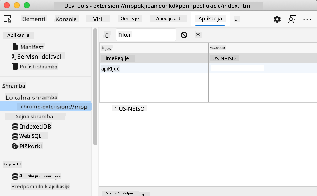

<!--
CO_OP_TRANSLATOR_METADATA:
{
  "original_hash": "e10f168beac4e7b05e30e0eb5c92bf11",
  "translation_date": "2025-08-27T22:24:21+00:00",
  "source_file": "5-browser-extension/2-forms-browsers-local-storage/README.md",
  "language_code": "sl"
}
-->
# Projekt razširitve brskalnika, 2. del: Klic API-ja, uporaba lokalne shrambe

## Predhodni kviz

[Predhodni kviz](https://ff-quizzes.netlify.app/web/quiz/25)

### Uvod

V tej lekciji boste poklicali API tako, da boste oddali obrazec razširitve brskalnika in prikazali rezultate v razširitvi. Poleg tega se boste naučili, kako shraniti podatke v lokalno shrambo brskalnika za prihodnjo uporabo.

✅ Sledite oštevilčenim segmentom v ustreznih datotekah, da boste vedeli, kam postaviti kodo.

### Priprava elementov za manipulacijo v razširitvi:

Do sedaj ste že ustvarili HTML za obrazec in `<div>` za prikaz rezultatov v razširitvi brskalnika. Od zdaj naprej boste delali v datoteki `/src/index.js` in postopoma gradili razširitev. Oglejte si [prejšnjo lekcijo](../1-about-browsers/README.md) za nastavitev projekta in proces gradnje.

V datoteki `index.js` začnite z ustvarjanjem nekaj `const` spremenljivk za shranjevanje vrednosti, povezanih z različnimi polji:

```JavaScript
// form fields
const form = document.querySelector('.form-data');
const region = document.querySelector('.region-name');
const apiKey = document.querySelector('.api-key');

// results
const errors = document.querySelector('.errors');
const loading = document.querySelector('.loading');
const results = document.querySelector('.result-container');
const usage = document.querySelector('.carbon-usage');
const fossilfuel = document.querySelector('.fossil-fuel');
const myregion = document.querySelector('.my-region');
const clearBtn = document.querySelector('.clear-btn');
```

Vsa ta polja so referencirana prek njihovih CSS razredov, kot ste jih nastavili v HTML-ju v prejšnji lekciji.

### Dodajanje poslušalcev dogodkov

Nato dodajte poslušalce dogodkov za obrazec in gumb za ponastavitev, ki ponastavi obrazec, tako da se ob oddaji obrazca ali kliku na gumb zgodi nekaj, ter dodajte klic za inicializacijo aplikacije na dnu datoteke:

```JavaScript
form.addEventListener('submit', (e) => handleSubmit(e));
clearBtn.addEventListener('click', (e) => reset(e));
init();
```

✅ Opazite skrajšano obliko za poslušanje dogodkov oddaje ali klika ter kako se dogodek posreduje funkcijama `handleSubmit` ali `reset`. Ali lahko napišete ekvivalent te skrajšane oblike v daljši obliki? Katera vam je ljubša?

### Izdelava funkcij `init()` in `reset()`:

Zdaj boste izdelali funkcijo za inicializacijo razširitve, imenovano `init()`:

```JavaScript
function init() {
	//if anything is in localStorage, pick it up
	const storedApiKey = localStorage.getItem('apiKey');
	const storedRegion = localStorage.getItem('regionName');

	//set icon to be generic green
	//todo

	if (storedApiKey === null || storedRegion === null) {
		//if we don't have the keys, show the form
		form.style.display = 'block';
		results.style.display = 'none';
		loading.style.display = 'none';
		clearBtn.style.display = 'none';
		errors.textContent = '';
	} else {
        //if we have saved keys/regions in localStorage, show results when they load
        displayCarbonUsage(storedApiKey, storedRegion);
		results.style.display = 'none';
		form.style.display = 'none';
		clearBtn.style.display = 'block';
	}
};

function reset(e) {
	e.preventDefault();
	//clear local storage for region only
	localStorage.removeItem('regionName');
	init();
}

```

V tej funkciji je nekaj zanimive logike. Ko jo preberete, lahko vidite, kaj se zgodi?

- Dva `const` preverjata, ali je uporabnik shranil APIKey in kodo regije v lokalni shrambi.
- Če je katera od teh vrednosti `null`, prikažite obrazec tako, da spremenite njegov slog na 'block'.
- Skrijte območje rezultatov, nalaganje in gumb za ponastavitev ter nastavite besedilo napake na prazno vrednost.
- Če obstajata ključ in regija, začnite rutino za:
  - klic API-ja za pridobitev podatkov o porabi ogljika,
  - skrivanje območja rezultatov,
  - skrivanje obrazca,
  - prikaz gumba za ponastavitev.

Preden nadaljujete, je koristno spoznati zelo pomemben koncept, ki je na voljo v brskalnikih: [LocalStorage](https://developer.mozilla.org/docs/Web/API/Window/localStorage). LocalStorage je uporaben način za shranjevanje nizov v brskalniku kot par `ključ-vrednost`. Ta vrsta spletne shrambe se lahko manipulira z JavaScriptom za upravljanje podatkov v brskalniku. LocalStorage ne poteče, medtem ko se SessionStorage, druga vrsta spletne shrambe, izbriše ob zaprtju brskalnika. Različne vrste shrambe imajo prednosti in slabosti pri uporabi.

> Opomba - razširitev brskalnika ima svojo lokalno shrambo; glavno okno brskalnika je ločena instanca in deluje neodvisno.

APIKey nastavite na vrednost niza, na primer, in lahko vidite, da je nastavljen v Edgeu, če "pregledate" spletno stran (z desnim klikom na brskalnik lahko pregledate) in odprete zavihek Applications za ogled shrambe.



✅ Razmislite o situacijah, kjer NE bi želeli shraniti nekaterih podatkov v LocalStorage. Na splošno je shranjevanje API ključev v LocalStorage slaba ideja! Vidite, zakaj? V našem primeru, ker je naša aplikacija namenjena zgolj učenju in ne bo objavljena v trgovini z aplikacijami, bomo uporabili to metodo.

Opazite, da uporabljate Web API za manipulacijo LocalStorage, bodisi z uporabo `getItem()`, `setItem()` ali `removeItem()`. Podprto je v večini brskalnikov.

Preden zgradite funkcijo `displayCarbonUsage()`, ki se kliče v `init()`, zgradite funkcionalnost za obravnavo začetne oddaje obrazca.

### Obravnava oddaje obrazca

Ustvarite funkcijo `handleSubmit`, ki sprejme argument dogodka `(e)`. Ustavite propagacijo dogodka (v tem primeru želimo ustaviti osvežitev brskalnika) in pokličite novo funkcijo `setUpUser`, ki ji posredujete argumente `apiKey.value` in `region.value`. Na ta način uporabite dve vrednosti, ki sta pridobljeni prek začetnega obrazca, ko sta ustrezni polji izpolnjeni.

```JavaScript
function handleSubmit(e) {
	e.preventDefault();
	setUpUser(apiKey.value, region.value);
}
```

✅ Osvežite spomin - HTML, ki ste ga nastavili v prejšnji lekciji, ima dve vnosni polji, katerih `vrednosti` so zajete prek `const`, ki ste jih nastavili na vrhu datoteke, in obe sta `required`, zato brskalnik prepreči uporabnikom vnos praznih vrednosti.

### Nastavitev uporabnika

Nadaljujte z funkcijo `setUpUser`, kjer nastavite vrednosti lokalne shrambe za apiKey in regionName. Dodajte novo funkcijo:

```JavaScript
function setUpUser(apiKey, regionName) {
	localStorage.setItem('apiKey', apiKey);
	localStorage.setItem('regionName', regionName);
	loading.style.display = 'block';
	errors.textContent = '';
	clearBtn.style.display = 'block';
	//make initial call
	displayCarbonUsage(apiKey, regionName);
}
```

Ta funkcija prikaže sporočilo o nalaganju, medtem ko se kliče API. Na tej točki ste prišli do ustvarjanja najpomembnejše funkcije te razširitve brskalnika!

### Prikaz porabe ogljika

Končno je čas za poizvedbo API-ja!

Preden nadaljujete, se pogovorimo o API-jih. API-ji ali [Application Programming Interfaces](https://www.webopedia.com/TERM/A/API.html) so ključni element v orodjarni spletnega razvijalca. Zagotavljajo standardne načine za interakcijo in povezovanje programov med seboj. Na primer, če gradite spletno stran, ki mora poizvedovati bazo podatkov, je morda nekdo ustvaril API, ki ga lahko uporabite. Medtem ko obstaja veliko vrst API-jev, je eden najbolj priljubljenih [REST API](https://www.smashingmagazine.com/2018/01/understanding-using-rest-api/).

✅ Izraz 'REST' pomeni 'Representational State Transfer' in vključuje uporabo različno konfiguriranih URL-jev za pridobivanje podatkov. Raziskujte različne vrste API-jev, ki so na voljo razvijalcem. Katera oblika vam je najbolj všeč?

V tej funkciji je nekaj pomembnih stvari. Najprej opazite ključni izraz [`async`](https://developer.mozilla.org/docs/Web/JavaScript/Reference/Statements/async_function). Pisanje funkcij tako, da delujejo asinhrono, pomeni, da počakajo na dokončanje dejanja, kot je vrnitev podatkov, preden nadaljujejo.

Tukaj je kratek video o `async`:

[](https://youtube.com/watch?v=YwmlRkrxvkk "Async in Await za upravljanje obljub")

> 🎥 Kliknite zgornjo sliko za video o async/await.

Ustvarite novo funkcijo za poizvedbo API-ja C02Signal:

```JavaScript
import axios from '../node_modules/axios';

async function displayCarbonUsage(apiKey, region) {
	try {
		await axios
			.get('https://api.co2signal.com/v1/latest', {
				params: {
					countryCode: region,
				},
				headers: {
					'auth-token': apiKey,
				},
			})
			.then((response) => {
				let CO2 = Math.floor(response.data.data.carbonIntensity);

				//calculateColor(CO2);

				loading.style.display = 'none';
				form.style.display = 'none';
				myregion.textContent = region;
				usage.textContent =
					Math.round(response.data.data.carbonIntensity) + ' grams (grams C02 emitted per kilowatt hour)';
				fossilfuel.textContent =
					response.data.data.fossilFuelPercentage.toFixed(2) +
					'% (percentage of fossil fuels used to generate electricity)';
				results.style.display = 'block';
			});
	} catch (error) {
		console.log(error);
		loading.style.display = 'none';
		results.style.display = 'none';
		errors.textContent = 'Sorry, we have no data for the region you have requested.';
	}
}
```

To je velika funkcija. Kaj se tukaj dogaja?

- Po najboljših praksah uporabite ključni izraz `async`, da funkcija deluje asinhrono. Funkcija vsebuje blok `try/catch`, saj bo vrnila obljubo, ko API vrne podatke. Ker nimate nadzora nad hitrostjo odziva API-ja (morda se sploh ne odzove!), morate to negotovost obravnavati z asinhronim klicem.
- Poizvedujete API co2signal za pridobitev podatkov o regiji, pri čemer uporabljate svoj API ključ. Za uporabo tega ključa morate uporabiti vrsto avtentikacije v parametrih glave.
- Ko se API odzove, dodelite različne elemente njegovih podatkov odziva delom zaslona, ki ste jih nastavili za prikaz teh podatkov.
- Če pride do napake ali ni rezultata, prikažete sporočilo o napaki.

✅ Uporaba asinhronih vzorcev programiranja je še eno zelo uporabno orodje v vaši orodjarni. Preberite [o različnih načinih](https://developer.mozilla.org/docs/Web/JavaScript/Reference/Statements/async_function), kako lahko konfigurirate to vrsto kode.

Čestitke! Če zgradite svojo razširitev (`npm run build`) in jo osvežite v podoknu razširitev, imate delujočo razširitev! Edina stvar, ki ne deluje, je ikona, in to boste popravili v naslednji lekciji.

---

## 🚀 Izziv

V teh lekcijah smo obravnavali več vrst API-jev. Izberite spletni API in podrobno raziščite, kaj ponuja. Na primer, si oglejte API-je, ki so na voljo v brskalnikih, kot je [HTML Drag and Drop API](https://developer.mozilla.org/docs/Web/API/HTML_Drag_and_Drop_API). Kaj po vašem mnenju naredi odličen API?

## Zaključni kviz

[Zaključni kviz](https://ff-quizzes.netlify.app/web/quiz/26)

## Pregled in samostojno učenje

V tej lekciji ste se naučili o LocalStorage in API-jih, oboje zelo uporabno za profesionalnega spletnega razvijalca. Ali lahko razmislite, kako ti dve stvari delujeta skupaj? Razmislite, kako bi zasnovali spletno stran, ki bi shranjevala elemente za uporabo API-ja.

## Naloga

[Posvojite API](assignment.md)

---

**Omejitev odgovornosti**:  
Ta dokument je bil preveden z uporabo storitve za prevajanje z umetno inteligenco [Co-op Translator](https://github.com/Azure/co-op-translator). Čeprav si prizadevamo za natančnost, vas prosimo, da upoštevate, da lahko avtomatizirani prevodi vsebujejo napake ali netočnosti. Izvirni dokument v njegovem izvirnem jeziku je treba obravnavati kot avtoritativni vir. Za ključne informacije priporočamo profesionalni človeški prevod. Ne prevzemamo odgovornosti za morebitna nesporazumevanja ali napačne razlage, ki bi nastale zaradi uporabe tega prevoda.