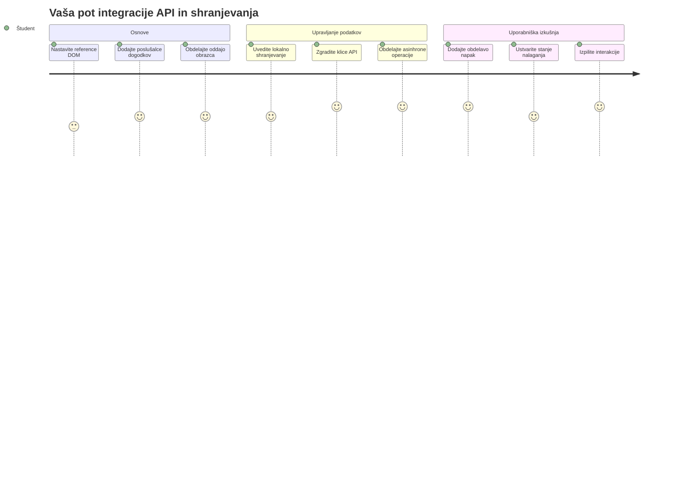
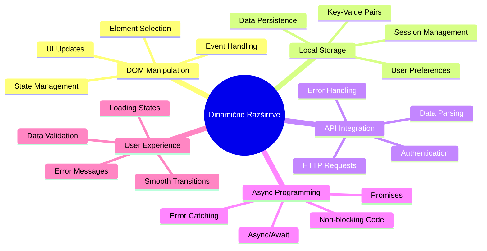
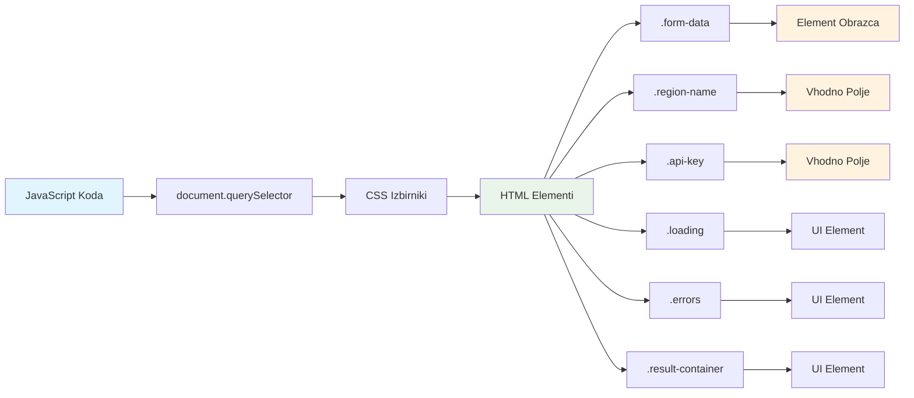
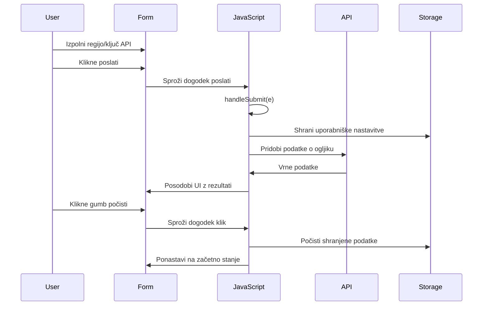
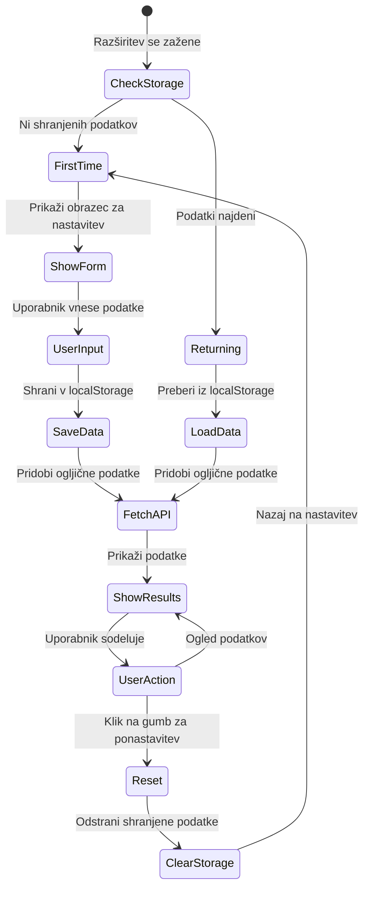
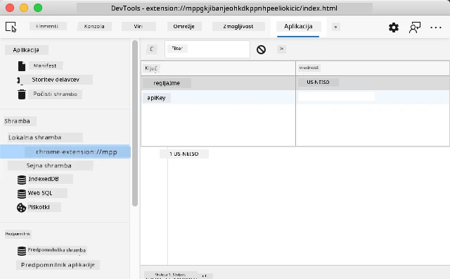
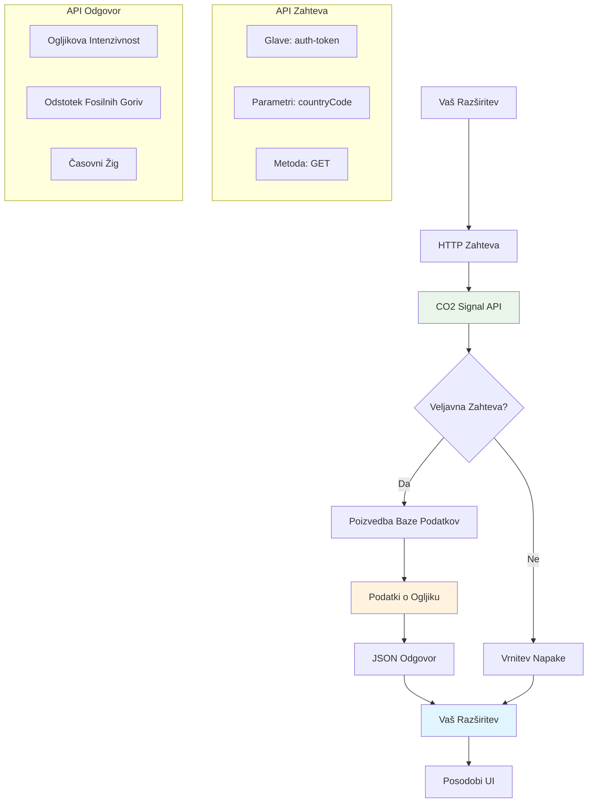
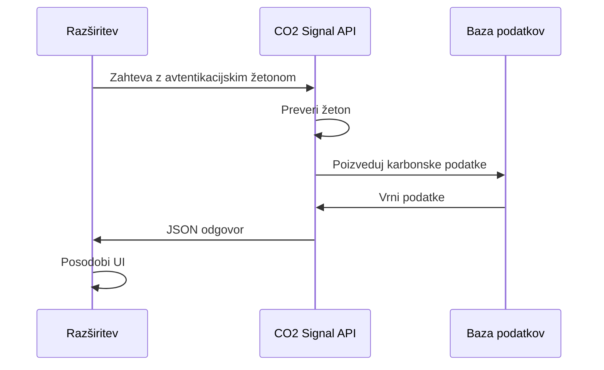
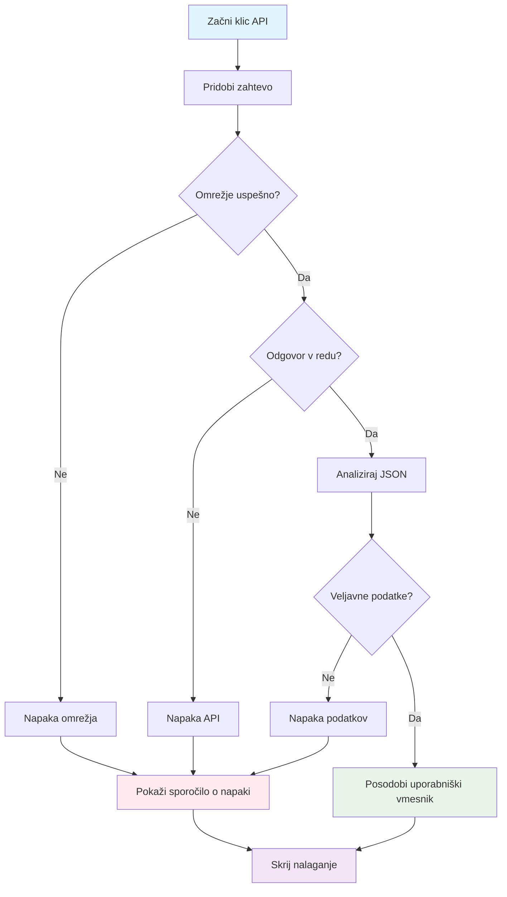
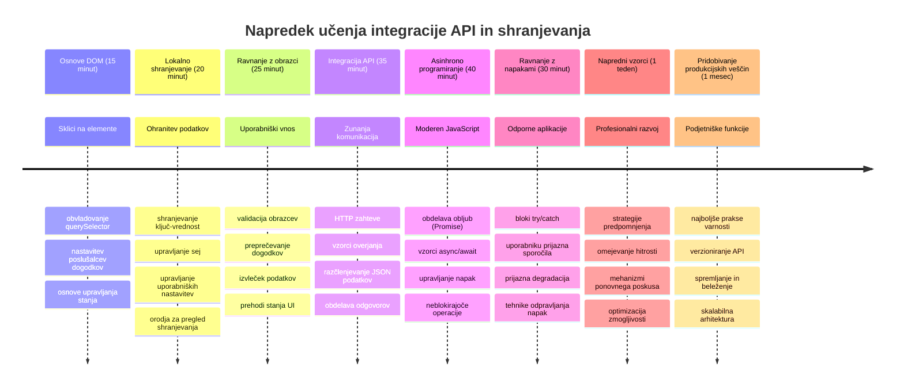

# Razširitev brskalnika, del 2: Klic API-ja, uporaba lokalne shrambe


## Predpredavanje kviz

[Predpredavanje kviz](https://ff-quizzes.netlify.app/web/quiz/25)

## Uvod

Se spomnite tiste razširitve brskalnika, ki ste jo začeli graditi? Trenutno imate lepo oblikovan obrazec, vendar je dejansko statičen. Danes jo bomo oživili tako, da jo povežemo z resničnimi podatki in ji omogočili pomnjenje.

Pomislite na računalnike nadzornega centra misije Apollo – niso prikazovali samo fiksnih informacij. Neprestano so komunicirali s plovili, posodabljali telemetrične podatke in si zapomnili ključne parametre misije. Takšno dinamično vedenje bomo gradili danes. Vaša razširitev bo dostopala do interneta, pridobila resnične okoljske podatke in zapomnila vaše nastavitve za naslednjič.

Integracija API-jev se morda zdi zapletena, a pomeni le, da naučimo vašo kodo, kako komunicirati z drugimi storitvami. Ne glede na to, ali pridobivate vremenske podatke, vsebine s socialnih omrežij ali podatke o ogljičnem odtisu, kot bomo danes, gre za vzpostavitev teh digitalnih povezav. Raziskali bomo tudi, kako brskalniki hranijo informacije – podobno kot knjižnice uporabljajo kartoteke, da si zapomnijo, kje pripadajo knjige.

Ob koncu te lekcije boste imeli razširitev brskalnika, ki pridobiva realne podatke, shranjuje uporabniške nastavitve in zagotavlja tekoče delovanje. Začnimo!


✅ Sledite številčnim segmentom v ustreznih datotekah, da veste, kam postaviti svojo kodo

## Nastavite elemente za manipulacijo v razširitvi

Preden lahko vaš JavaScript manipulira z vmesnikom, potrebuje reference na specifične HTML elemente. Pomislite, kot da teleskop usmerjate v določene zvezde – preden je Galileo lahko proučeval Jupitrove lune, je moral najprej locirati in fokusirati Jupiter.

V vaši datoteki `index.js` bomo ustvarili `const` spremenljivke, ki zajamejo reference na vsak pomemben obrazec element. To je podobno kot znanstveniki označujejo svojo opremo – namesto da bi vsakič iskali po celem laboratoriju, lahko neposredno dostopajo do potrebnega.


```javascript
// obrazci polja
const form = document.querySelector('.form-data');
const region = document.querySelector('.region-name');
const apiKey = document.querySelector('.api-key');

// rezultati
const errors = document.querySelector('.errors');
const loading = document.querySelector('.loading');
const results = document.querySelector('.result-container');
const usage = document.querySelector('.carbon-usage');
const fossilfuel = document.querySelector('.fossil-fuel');
const myregion = document.querySelector('.my-region');
const clearBtn = document.querySelector('.clear-btn');
```

**To kodo naredi naslednje:**
- **Zajame** elemente obrazca z `document.querySelector()` in CSS izbirniki razreda
- **Ustvari** reference na vhodna polja za ime regije in API ključ
- **Vzpostavi** povezave do elementov za prikaz rezultatov glede uporabe ogljika
- **Nastavi** dostop do UI elementov, kot so indikatorji nalaganja in sporočila o napakah
- **Shrani** vsak element v `const` spremenljivko za lahko ponovno uporabo v kodi

## Dodajte poslušalce dogodkov

Zdaj bomo vašo razširitev naredili odzivno na uporabniške akcije. Poslušalci dogodkov so način, kako vaša koda spremlja interakcije uporabnika. Pomislite nanje kot na operaterje v zgodnjih telefonskih zvezi – poslušali so dohodne klice in povezovali ustrezne vezave, ko je nekdo želel vzpostaviti povezavo.


```javascript
form.addEventListener('submit', (e) => handleSubmit(e));
clearBtn.addEventListener('click', (e) => reset(e));
init();
```

**Pomen teh konceptov:**
- **Pripne** poslušalca za oddajo na obrazec, ki sproži dogodek, ko uporabniki pritisnejo Enter ali kliknejo oddaj
- **Poveže** poslušalca klika z gumbom za čiščenje za ponastavitev obrazca
- **Posreduje** objekt dogodka `(e)` funkcijam za dodatno kontrolo
- **Kliče** funkcijo `init()` takoj, da nastavi začetno stanje razširitve

✅ Opazite uporabo skrajšane sintakse puščic – ta sodobni JavaScript pristop je čistejši kot klasične funkcijske izraze, a oba pristopa delujeta enako dobro!

### 🔄 **Pedagoški pregled**
**Razumevanje dogodkov:** Pred začetkom inicializacije poskrbite, da razumete:
- ✅ Kako `addEventListener` povezuje uporabniška dejanja s funkcijami v JavaScriptu
- ✅ Zakaj posredujemo objekt dogodka `(e)` funkcijam obdelave
- ✅ Razliko med dogodkoma `submit` in `click`
- ✅ Kdaj in zakaj se zažene funkcija `init()`

**Hitri samopreizkus:** Kaj se zgodi, če pozabite `e.preventDefault()` pri oddaji obrazca?
*Odgovor: Stran se osveži, kar izgubi ves JavaScript stanje in prekine uporabniško izkušnjo*

## Ustvarite inicializacijsko in reset funkcijo

Ustvarimo logiko inicializacije vaše razširitve. Funkcija `init()` je kot navigacijski sistem ladje, ki preverja instrumente – določi trenutno stanje in prilagodi vmesnik. Pregleda, ali je nekdo že prej uporabljal vašo razširitev in naloži prejšnje nastavitve.

Funkcija `reset()` omogoča uporabnikom nov začetek – podobno kot znanstveniki ponastavijo instrumente med eksperimenti, da zagotovijo čiste podatke.

```javascript
function init() {
	// Preveri, ali je uporabnik prej shranil poverilnice API
	const storedApiKey = localStorage.getItem('apiKey');
	const storedRegion = localStorage.getItem('regionName');

	// Nastavi ikono razširitve na generično zeleno (začasni znak za prihodnji lekcijo)
	// TODO: Izvedi posodobitev ikone v naslednji lekciji

	if (storedApiKey === null || storedRegion === null) {
		// Prvič uporabnik: prikaži obrazec za nastavitev
		form.style.display = 'block';
		results.style.display = 'none';
		loading.style.display = 'none';
		clearBtn.style.display = 'none';
		errors.textContent = '';
	} else {
		// Vrnitev uporabnika: samodejno naloži njihove shranjene podatke
		displayCarbonUsage(storedApiKey, storedRegion);
		results.style.display = 'none';
		form.style.display = 'none';
		clearBtn.style.display = 'block';
	}
}

function reset(e) {
	e.preventDefault();
	// Počisti shranjeno regijo, da uporabnik lahko izbere novo lokacijo
	localStorage.removeItem('regionName');
	// Ponovno zaženi postopek inicializacije
	init();
}
```

**Kaj se tukaj zgodi:**
- **Pridobi** shranjeni API ključ in regijo iz lokalne shrambe brskalnika
- **Preveri**, ali gre za novega uporabnika (brez shranjenih podatkov) ali vračajočega se
- **Prikaže** obrazec za nastavitev novim uporabnikom in skrije ostale elemente
- **Samodejno naloži** shranjene podatke vračajočim se uporabnikom in prikaže možnost ponastavitve
- **Upravljaj** stanje uporabniškega vmesnika glede na razpoložljive podatke

**Ključni koncepti Lokalnega shranjevanja:**
- **Ohranja** podatke med sejami brskalnika (za razliko od sejnega shranjevanja)
- **Shranjuje** podatke kot par ključ-vrednost z `getItem()` in `setItem()`
- **Vrne** `null`, če za določen ključ ni podatkov
- **Omogoča** enostavno zapomnitev uporabniških nastavitev in preferenc

> 💡 **Razumevanje shranjevanja v brskalniku**: [LocalStorage](https://developer.mozilla.org/docs/Web/API/Window/localStorage) je kot da bi vaši razširitvi dali trajni spomin. Pomislite, kako je starodavna Aleksandrijska knjižnica hranila zvitke – informacije so bile na voljo tudi, ko so učenjaki odšli in se vrnili.
>
> **Ključne lastnosti:**
> - **Ohranja** podatke tudi po zaprtju brskalnika
> - **Preživi** ponovno zagon računalnika in zrušitve brskalnika
> - **Ponudi** veliko prostora za shranjevanje uporabniških nastavitev
> - **Omogoča** takojšen dostop brez zamud zaradi omrežja

> **Pomembna opomba**: Vaša razširitev brskalnika ima svoj izoliran local storage, ločen od običajnih spletnih strani. To zagotavlja varnost in preprečuje konflikte z drugimi spletnimi stranmi.

Shranjene podatke lahko vidite v orodjih za razvijalce brskalnika (F12), na zavihku **Application**, z razširitvijo razdelka **Local Storage**.




> ⚠️ **Varnostno opozorilo**: V produkcijskih aplikacijah hranjenje API ključev v LocalStorage predstavlja varnostno tveganje, saj lahko JavaScript dostopa do teh podatkov. Za namene učenja je ta pristop sprejemljiv, v resničnih aplikacijah pa je treba občutljive poverilnice hraniti varno na strežniški strani.

## Obravnava oddaje obrazca

Zdaj obravnavamo, kaj se zgodi, ko nekdo odda vaš obrazec. Privzeto brskalniki ob oddaji obrazcev osvežijo stran, a to vedenje bomo prestregli, da zagotovimo tekoče delovanje.

Ta pristop posnema, kako nadzor misije upravlja komunikacijo s plovili – namesto da bi za vsako sporočilo ponastavili celoten sistem, ohranjajo neprekinjeno delovanje in hkrati obdelujejo nove informacije.

Ustvarite funkcijo, ki zajame dogodek oddaje obrazca in pridobi uporabniški vnos:

```javascript
function handleSubmit(e) {
	e.preventDefault();
	setUpUser(apiKey.value, region.value);
}
```

**V zgornjem primeru:**
- **Preprečuje** privzeto oddajo obrazca, ki bi osvežila stran
- **Pridobi** vrednosti uporabniškega vnosa iz polj za API ključ in regijo
- **Posreduje** podatke obrazca funkciji `setUpUser()` za nadaljnjo obdelavo
- **Ohranja** vedenje aplikacije ene strani z izogibanjem osvežitev strani

✅ Ne pozabite, da vaša HTML obrazec polja vsebujejo atribut `required`, zato brskalnik samodejno preveri, da sta API ključ in regija vneta, preden se ta funkcija izvede.

## Nastavitev uporabniških preferenc

Funkcija `setUpUser` je odgovorna za shranjevanje uporabniških poverilnic in inicializacijo prvega klica API-ja. To zagotovi tekoč prehod iz nastavitve do prikaza rezultatov.

```javascript
function setUpUser(apiKey, regionName) {
	// Shranite uporabniške poverilnice za prihodnje seje
	localStorage.setItem('apiKey', apiKey);
	localStorage.setItem('regionName', regionName);
	
	// Posodobite uporabniški vmesnik za prikaz stanja nalaganja
	loading.style.display = 'block';
	errors.textContent = '';
	clearBtn.style.display = 'block';
	
	// Pridobite podatke o porabi ogljika z uporabniškimi poverilnicami
	displayCarbonUsage(apiKey, regionName);
}
```

**Korak za korakom, kaj se zgodi:**
- **Shrani** API ključ in ime regije v lokalno shrambo za prihodnjo rabo
- **Prikaže** indikator nalaganja, da uporabniki vedo, da se podatki pridobivajo
- **Počisti** morebitna prejšnja sporočila o napakah z zaslona
- **Razkrije** gumb za čiščenje, da uporabniki lahko kasneje ponastavijo nastavitve
- **Zainicira** klic API-ja za pridobivanje dejanskih podatkov o uporabi ogljika

Ta funkcija ustvari brezhibno uporabniško izkušnjo z upravljanjem shranjevanja podatkov in posodobitvijo vmesnika v enem koordiniranem koraku.

## Prikaz podatkov o porabi ogljika

Zdaj bomo povezali vašo razširitev z zunanjimi podatkovnimi viri prek API-jev. S tem vaša razširitev ne bo več samostojno orodje, ampak bo dostopala do realnočasovnih informacij z interneta.

**Razumevanje API-jev**

[API-ji](https://www.webopedia.com/TERM/A/API.html) so način, kako različne aplikacije komunicirajo med seboj. Lahko si jih predstavljate kot telegrafski sistem, ki je v 19. stoletju povezoval oddaljena mesta – operaterji so pošiljali zahteve oddaljenim postajam in prejeli odgovore z zahtevanimi informacijami. Vsakič, ko preverite socialna omrežja, zastavite vprašanje glasovnemu asistentu ali uporabite aplikacijo za dostavo, API-ji omogočajo ta prenos podatkov.


**Ključni koncepti REST API-jev:**
- **REST** pomeni 'Representational State Transfer' (prenos stanja predstavitve)
- **Uporablja** standardne HTTP metode (GET, POST, PUT, DELETE) za interakcijo s podatki
- **Vrne** podatke v predvidljivih formatih, običajno JSON
- **Nudi** konsistentne, URL osnovane končne točke za različne vrste zahtev

✅ [CO2 Signal API](https://www.co2signal.com/), ki ga bomo uporabili, zagotavlja podatke v realnem času o intenzivnosti ogljika iz električnih omrežij po svetu. To uporabnikom pomaga razumeti vpliv njihove porabe električne energije na okolje!

> 💡 **Razumevanje asinhronega JavaScripta**: Ključna beseda [`async`](https://developer.mozilla.org/docs/Web/JavaScript/Reference/Statements/async_function) omogoča vaši kodi hkratno upravljanje več operacij. Ko zahtevate podatke strežnika, ne želite, da se vaša razširitev popolnoma zmrzne - to bi bilo kot nadzorni stolp letališča, ki bi ustavil vse operacije, medtem ko čaka na odgovor enega letala.
>
> **Ključne prednosti:**
> - **Ohranja** odzivnost razširitve med nalaganjem podatkov
> - **Dovoli** drugi kodi nadaljevati izvajanje med omrežnimi zahtevami
> - **Izboljša** berljivost kode v primerjavi s tradicionalnimi povratnimi klici
> - **Omogoča** lepo upravljanje napak pri omrežnih težavah

Tukaj je kratek video o `async`:

[](https://youtube.com/watch?v=YwmlRkrxvkk "Async in Await za upravljanje obljub")

> 🎥 Kliknite zgornjo sliko za ogled videa o async/await.

### 🔄 **Pedagoški pregled**
**Razumevanje asinhronega programiranja:** Preden skočite v funkcijo API-ja, preverite, da razumete:
- ✅ Zakaj uporabljamo `async/await` namesto blokiranja celotne razširitve
- ✅ Kako `try/catch` bloki elegantno ravnajo z omrežnimi napakami
- ✅ Razliko med sinhronimi in asinhronimi operacijami
- ✅ Zakaj lahko API klici spodletijo in kako ravnamo s temi napakami

**Povezava z resničnim svetom:** Premislite o teh vsakodnevnih asinhronih primerih:
- **Naročanje hrane**: Ne čakate v kuhinji, prejmete račun in nadaljujete z drugimi aktivnostmi
- **Pošiljanje elektronske pošte**: Vaša aplikacija ne zamrzne med pošiljanjem, lahko pišete nove e-maile
- **Nalaganje spletnih strani**: Slike se nalagajo postopoma, medtem ko lahko že berete besedilo

**Potek avtorizacije API-ja:**

Ustvarite funkcijo za pridobivanje in prikaz podatkov o porabi ogljika:

```javascript
// Sodobni pristop z uporabo fetch API (brez zunanjih odvisnosti)
async function displayCarbonUsage(apiKey, region) {
	try {
		// Pridobite podatke o intenzivnosti ogljika iz CO2 Signal API
		const response = await fetch('https://api.co2signal.com/v1/latest', {
			method: 'GET',
			headers: {
				'auth-token': apiKey,
				'Content-Type': 'application/json'
			},
			// Dodajte poizvedbene parametre za določen regijo
			...new URLSearchParams({ countryCode: region }) && {
				url: `https://api.co2signal.com/v1/latest?countryCode=${region}`
			}
		});

		// Preverite, ali je bil API zahtevek uspešen
		if (!response.ok) {
			throw new Error(`API request failed: ${response.status}`);
		}

		const data = await response.json();
		const carbonData = data.data;

		// Izračunajte zaokroženo vrednost intenzivnosti ogljika
		const carbonIntensity = Math.round(carbonData.carbonIntensity);

		// Posodobite uporabniški vmesnik s pridobljenimi podatki
		loading.style.display = 'none';
		form.style.display = 'none';
		myregion.textContent = region.toUpperCase();
		usage.textContent = `${carbonIntensity} grams (grams CO₂ emitted per kilowatt hour)`;
		fossilfuel.textContent = `${carbonData.fossilFuelPercentage.toFixed(2)}% (percentage of fossil fuels used to generate electricity)`;
		results.style.display = 'block';

		// TODO: calculateColor(carbonIntensity) - izvedite v naslednji lekciji

	} catch (error) {
		console.error('Error fetching carbon data:', error);
		
		// Prikažite prijazno sporočilo o napaki uporabniku
		loading.style.display = 'none';
		results.style.display = 'none';
		errors.textContent = 'Sorry, we couldn\'t fetch data for that region. Please check your API key and region code.';
	}
}
```

**Analiza dogajanja tukaj:**
- **Uporablja** sodoben `fetch()` API namesto zunanjih knjižnic, kot je Axios, za čistejšo, brezodvisno kodo
- **Izvaja** ustrezno preverjanje napak z `response.ok`, da zgodaj zazna morebitne napake API-ja
- **Ravnanje** z asinhronimi operacijami z `async/await` za bolj berljiv potek kode
- **Avtorizira** se pri CO2 Signal API-ju z `auth-token` glavo
- **Pretvori** zajete JSON podatke in izlušči informacije o intenzivnosti ogljika
- **Posodobi** več UI elementov z oblikovanimi okoljskimi podatki
- **Zagotovi** prijazna sporočila o napakah, ko klici API ne uspejo

**Ključni sodobni JavaScript koncepti, prikazani tukaj:**
- **Predloge nizov** z `${}` sintakso za čisto oblikovanje vrstic
- **Upravljanje z napakami** s try/catch bloki za robustne aplikacije
- **Vzorec async/await** za elegantno upravljanje omrežnih zahtev
- **Destrukturiranje objektov** za izluščenje specifičnih podatkov iz odgovorov API
- **Metodni verižni klici** za večkratne manipulacije DOM elementov

✅ Ta funkcija prikazuje več pomembnih konceptov spletnega razvoja – komuniciranje z zunanjimi strežniki, upravljanje avtorizacije, obdelavo podatkov, posodobitev vmesnika in elegantno upravljanje napak. To so temeljne veščine, ki jih profesionalni razvijalci redno uporabljajo.


### 🔄 **Pedagoški pregled**
**Popolno razumevanje sistema:** Preverite svoje znanje celotnega poteka:
- ✅ Kako DOM reference omogočajo JavaScriptu nadzor nad vmesnikom
- ✅ Zakaj lokalna shramba omogoča ohranjanje podatkov med sejami brskalnika
- ✅ Kako async/await omogoča klice API brez zamrznitve razširitve
- ✅ Kaj se zgodi, ko API klici spodletijo, in kako so napake obravnavane
- ✅ Zakaj uporabniška izkušnja vključuje nalagalne statuse in sporočila o napakah

🎉 **Dosegli ste to:** Ustvarili ste razširitev brskalnika, ki:
- **Povezuje** se z internetom in pridobiva realne okoljske podatke
- **Ohranja** uporabniške nastavitve med sejami
- **Ravnanje** z napakami na eleganten način, namesto da bi aplikacija crknila
- **Omogoča** tekočo in profesionalno uporabniško izkušnjo

Preizkusite svoje delo z ukazom `npm run build` in osvežite razširitev v brskalniku. Imate funkcionalen sledilnik ogljičnega odtisa. Naslednja lekcija bo dodala dinamično funkcijo ikone za dokončanje razširitve.

---

## Izziv agenta GitHub Copilot 🚀

Uporabite način Agent, da dokončate naslednji izziv:
**Opis:** Izboljšajte razširitev brskalnika z dodatnimi izboljšavami za obravnavo napak in funkcijami za uporabniško izkušnjo. Ta izziv vam bo pomagal vaditi delo z API-ji, lokalnim shranjevanjem in manipulacijo DOM z uporabo sodobnih vzorcev JavaScript.

**Zahteva:** Ustvarite izboljšano različico funkcije displayCarbonUsage, ki vključuje: 1) Mehanizem ponovnega poskusa za neuspešne klice API s eksponentnim zamikom, 2) Preverjanje veljavnosti vnosa za kodo regije pred klicem API, 3) Animacijo nalaganja z indikatorji napredka, 4) Predpomnjenje odgovorov API v localStorage z datumom poteka (predpomnjenje 30 minut), in 5) Funkcijo za prikaz zgodovinskih podatkov prejšnjih klicev API. Prav tako dodajte ustrezne JSDoc komentarje v slogu TypeScript za dokumentacijo vseh parametrov funkcije in tipov vrnjene vrednosti.

Več o [agent mode](https://code.visualstudio.com/blogs/2025/02/24/introducing-copilot-agent-mode) si lahko preberete tukaj.

## 🚀 Izziv

Razširite svoje poznavanje API-jev s tem, da raziskujete bogastvo API-jev, ki so na voljo v brskalniku za spletni razvoj. Izberite enega od teh brskalniških API-jev in zgradite kratek demonstracijski primer:

- [Geolocation API](https://developer.mozilla.org/docs/Web/API/Geolocation_API) - Pridobite trenutno lokacijo uporabnika
- [Notification API](https://developer.mozilla.org/docs/Web/API/Notifications_API) - Pošljite namizna obvestila
- [HTML Drag and Drop API](https://developer.mozilla.org/docs/Web/API/HTML_Drag_and_Drop_API) - Ustvarite interaktivne vmesnike z vlečenjem
- [Web Storage API](https://developer.mozilla.org/docs/Web/API/Web_Storage_API) - Napredne tehnike lokalnega shranjevanja
- [Fetch API](https://developer.mozilla.org/docs/Web/API/Fetch_API) - Sodobna alternativa XMLHttpRequest

**Raziskovalna vprašanja za razmislek:**
- Katere težave iz resničnega sveta rešuje ta API?
- Kako API obravnava napake in robne primere?
- Kakšni varnostni kompromisi obstajajo pri uporabi tega API-ja?
- Kako široko je ta API podprt v različnih brskalnikih?

Po raziskavi ugotovite, katere značilnosti naredijo API prijazen za razvijalce in zanesljiv.

## Kvizek po predavanju

[Kviz po predavanju](https://ff-quizzes.netlify.app/web/quiz/26)

## Pregled in samoštudij

V tej lekciji ste se naučili o LocalStorage in API-jih, oboje zelo uporabno za profesionalnega spletnega razvijalca. Razmislite, kako delujeta oba skupaj. Premislite, kako bi zasnovali spletno stran, ki shranjuje podatke za uporabo z API.

### ⚡ **Kaj lahko storite v naslednjih 5 minutah**
- [ ] Odprite zavihka DevTools Application in raziščite localStorage na poljubni spletni strani
- [ ] Ustvarite preprost HTML obrazec in testirajte validacijo obrazca v brskalniku
- [ ] Poskusite shranjevati in pridobivati podatke preko localStorage v konzoli brskalnika
- [ ] Preglejte podatke obrazca, ki se pošiljajo, z uporabo zavihka Network

### 🎯 **Kaj lahko dosežete v tem času**
- [ ] Dokončajte kviz po lekciji in razumite koncepte upravljanja obrazcev
- [ ] Zgradite razširitev brskalnika z obrazcem, ki shranjuje uporabniške nastavitve
- [ ] Implementirajte validacijo obrazcev na strani odjemalca z uporabnimi sporočili o napakah
- [ ] Vadite uporabo chrome.storage API za ohranjanje podatkov razširitve
- [ ] Ustvarite uporabniški vmesnik, ki se odziva na shranjene nastavitve uporabnika

### 📅 **Vaša tedenska gradnja razširitve**
- [ ] Dokončajte polno funkcionalno razširitev brskalnika z upravljanjem obrazcev
- [ ] Obvladujte različne možnosti shranjevanja: lokalno, sinhronizirano in sejo
- [ ] Implementirajte napredne funkcije obrazcev, kot so samodejno dokončanje in validacija
- [ ] Dodajte funkcijo uvoza/izvoza uporabniških podatkov
- [ ] Temeljito testirajte vašo razširitev v različnih brskalnikih
- [ ] Izboljšajte uporabniško izkušnjo in obravnavo napak vaše razširitve

### 🌟 **Vaša mesečna mojstrska obvladovanje spletnih API-jev**
- [ ] Zgradite kompleksne aplikacije z uporabo različnih API-jev za shranjevanje v brskalniku
- [ ] Naučite se vzorcev razvoja, ki temeljijo na delu brez povezave (offline-first)
- [ ] Sodelujte v odprtokodnih projektih, ki upravljajo z vzdrževanjem podatkov
- [ ] Obvladajte razvoj, osredotočen na zasebnost in skladnost z GDPR
- [ ] Ustvarjajte ponovno uporabne knjižnice za upravljanje obrazcev in podatkov
- [ ] Delite znanje o spletnih API-jih in razvoju razširitev

## 🎯 Časovni načrt mojstrstva razvoja vaše razširitve


### 🛠️ Povzetek vašega kompleta orodij za full-stack razvoj

Po zaključku te lekcije imate zdaj:
- **Obvladovanje DOM**: Natančno ciljanje in manipulacija elementov
- **Strokovnost na področju shranjevanja**: Upravljanje trajnih podatkov z localStorage
- **Integracija API**: Pridobivanje podatkov v realnem času in avtentikacija
- **Asinhrono programiranje**: Neblokirajoče operacije z moderno JavaScript
- **Obravnava napak**: Robustne aplikacije, ki elegantno upravljajo z neuspehi
- **Uporabniška izkušnja**: Stanja nalaganja, validacija in gladke interakcije
- **Sodobni vzorci**: fetch API, async/await in funkcije ES6+

**Pridobljene profesionalne veščine**: Uporabili ste vzorce v:
- **Spletnih aplikacijah**: Enostranske aplikacije z zunanjimi viri podatkov
- **Mobilnem razvoju**: API-jem vodene aplikacije z delovanjem brez povezave
- **Namizni programski opremi**: Electron aplikacije s trajnim shranjevanjem
- **Podjetniških sistemih**: Avtentikacija, predpomnjenje in obravnava napak
- **Sodobnih okvirih**: Vzorci upravljanja podatkov v React/Vue/Angular

**Naslednja raven**: Pripravljeni ste raziskati napredne teme, kot so strategije predpomnjenja, povezave WebSocket v realnem času ali kompleksno upravljanje stanja!

## Naloga

[Posvojite API](assignment.md)

---

<!-- CO-OP TRANSLATOR DISCLAIMER START -->
**Omejitev odgovornosti**:
Ta dokument je bil preveden z uporabo storitve za avtomatski prevod AI [Co-op Translator](https://github.com/Azure/co-op-translator). Čeprav si prizadevamo za natančnost, upoštevajte, da lahko avtomatizirani prevodi vsebujejo napake ali netočnosti. Izvirni dokument v njegovem izvirnem jeziku velja za avtoritativni vir. Za pomembne informacije priporočamo strokovni človeški prevod. Ne odgovarjamo za morebitne nesporazume ali napačne interpretacije, ki nastanejo zaradi uporabe tega prevoda.
<!-- CO-OP TRANSLATOR DISCLAIMER END -->