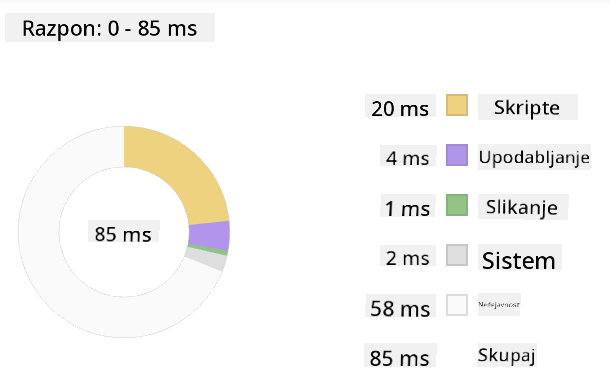
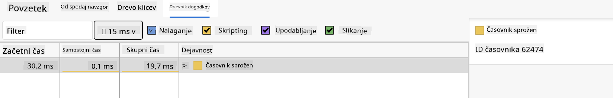

<!--
CO_OP_TRANSLATOR_METADATA:
{
  "original_hash": "eb358f3f4c2c082f9f3a4f98efa1d337",
  "translation_date": "2025-10-25T00:45:03+00:00",
  "source_file": "5-browser-extension/3-background-tasks-and-performance/README.md",
  "language_code": "sl"
}
-->
# Projekt razširitve brskalnika, 3. del: Spoznajte ozadna opravila in zmogljivost

Ste se kdaj spraševali, zakaj so nekatere razširitve brskalnika hitre in odzivne, medtem ko se druge zdijo počasne? Skrivnost se skriva v dogajanju v ozadju. Medtem ko uporabniki klikajo po vmesniku vaše razširitve, v ozadju potekajo procesi, ki tiho upravljajo pridobivanje podatkov, posodabljanje ikon in sistemskih virov.

To je naša zadnja lekcija v seriji o razširitvah brskalnika, v kateri bomo poskrbeli, da bo vaš sledilnik ogljičnega odtisa deloval gladko. Dodali boste dinamične posodobitve ikon in se naučili prepoznati težave z zmogljivostjo, preden postanejo problem. To je kot nastavljanje dirkalnega avtomobila - majhne optimizacije lahko naredijo veliko razliko pri delovanju.

Ko bomo končali, boste imeli izpopolnjeno razširitev in razumeli načela zmogljivosti, ki ločujejo dobre spletne aplikacije od odličnih. Potopimo se v svet optimizacije brskalnika.

## Predavanje - kviz

[Predavanje - kviz](https://ff-quizzes.netlify.app/web/quiz/27)

### Uvod

V prejšnjih lekcijah ste ustvarili obrazec, ga povezali z API-jem in se spopadli z asinhronim pridobivanjem podatkov. Vaša razširitev se lepo oblikuje.

Zdaj moramo dodati zadnje podrobnosti - na primer, da se ikona razširitve spremeni barvo glede na podatke o ogljiku. To me spominja na to, kako je NASA morala optimizirati vsak sistem na vesoljskem plovilu Apollo. Niso si mogli privoščiti nobenega izgubljenega cikla ali pomnilnika, ker je od zmogljivosti odvisno življenje. Čeprav naša razširitev brskalnika ni tako kritična, veljajo enaka načela - učinkovita koda ustvarja boljšo uporabniško izkušnjo.

## Osnove spletne zmogljivosti

Ko vaša koda deluje učinkovito, ljudje dejansko *čutijo* razliko. Poznate tisti trenutek, ko se stran naloži takoj ali animacija teče gladko? To je dobra zmogljivost v praksi.

Zmogljivost ni le hitrost - gre za ustvarjanje spletnih izkušenj, ki se zdijo naravne, namesto okorne in frustrirajoče. V zgodnjih dneh računalništva je Grace Hopper na svoji mizi hranila nanosekundo (kos žice, dolg približno eno nogo), da bi pokazala, kako daleč svetloba potuje v eni milijardinki sekunde. To je bil njen način razlage, zakaj je vsaka mikrosekunda pomembna v računalništvu. Raziščimo orodja za odkrivanje težav, ki vam pomagajo ugotoviti, kaj upočasnjuje delovanje.

> "Zmogljivost spletne strani je odvisna od dveh stvari: kako hitro se stran naloži in kako hitro se koda na njej izvaja." -- [Zack Grossbart](https://www.smashingmagazine.com/2012/06/javascript-profiling-chrome-developer-tools/)

Tema, kako narediti vaše spletne strani izjemno hitre na vseh vrstah naprav, za vse vrste uporabnikov, v vseh vrstah situacij, je pričakovano obsežna. Tukaj je nekaj točk, ki jih je treba upoštevati pri gradnji standardnega spletnega projekta ali razširitve brskalnika.

Prvi korak pri optimizaciji vaše strani je razumevanje, kaj se dejansko dogaja v ozadju. Na srečo ima vaš brskalnik vgrajena zmogljiva orodja za odkrivanje težav.

Če želite odpreti Orodja za razvijalce v Edge, kliknite tri pike v zgornjem desnem kotu, nato pojdite na Več orodij > Orodja za razvijalce. Ali pa uporabite bližnjico na tipkovnici: `Ctrl` + `Shift` + `I` na Windows ali `Option` + `Command` + `I` na Mac. Ko ste tam, kliknite na zavihek Zmogljivost - tukaj boste izvajali svoje raziskave.

**Tukaj je vaš detektivski komplet za zmogljivost:**
- **Odprite** Orodja za razvijalce (kot razvijalec jih boste uporabljali nenehno!)
- **Pojdite** na zavihek Zmogljivost - pomislite nanj kot na sledilnik kondicije vaše spletne aplikacije
- **Pritisnite** gumb za snemanje in opazujte delovanje vaše strani
- **Preučite** rezultate, da ugotovite, kaj upočasnjuje delovanje

Poskusimo to. Odprite spletno stran (Microsoft.com je dobra izbira) in kliknite gumb 'Snemaj'. Zdaj osvežite stran in opazujte, kako profiler zajame vse, kar se dogaja. Ko končate snemanje, boste videli podroben razčlenitev, kako brskalnik 'skripta', 'upodablja' in 'slika' stran. To me spominja na to, kako nadzor misije spremlja vsak sistem med izstrelitvijo rakete - dobite podatke v realnem času o tem, kaj se dogaja in kdaj.

✅ [Microsoftova dokumentacija](https://docs.microsoft.com/microsoft-edge/devtools-guide/performance/?WT.mc_id=academic-77807-sagibbon) vsebuje veliko več podrobnosti, če želite raziskati globlje.

> Nasvet: Pred testiranjem počistite predpomnilnik brskalnika, da vidite, kako se vaša stran obnaša za obiskovalce, ki jo obiščejo prvič - to je običajno precej drugače kot pri ponovnih obiskih!

Izberite elemente časovnice profila, da povečate dogodke, ki se zgodijo med nalaganjem vaše strani.

Pridobite posnetek zmogljivosti vaše strani tako, da izberete del časovnice profila in si ogledate povzetek:



Preverite ploščo dnevnika dogodkov, da vidite, ali je kateri koli dogodek trajal dlje kot 15 ms:



✅ Spoznajte svoj profiler! Odprite orodja za razvijalce na tej strani in preverite, ali obstajajo kakršne koli ozka grla. Kateri element se nalaga najpočasneje? Kateri najhitreje?

## Kaj iskati pri profiliranju

Zagon profilerja je šele začetek - prava veščina je vedeti, kaj vam ti barvni grafikoni dejansko sporočajo. Ne skrbite, sčasoma se boste naučili, kako jih brati. Izkušeni razvijalci so se naučili prepoznati opozorilne znake, preden postanejo resni problemi.

Pogovorimo se o običajnih osumljencih - težavah z zmogljivostjo, ki se pogosto prikradejo v spletne projekte. Tako kot je Marie Curie morala skrbno spremljati ravni sevanja v svojem laboratoriju, moramo mi paziti na določene vzorce, ki nakazujejo težave. Če jih odkrijemo zgodaj, si prihranimo (in našim uporabnikom) veliko frustracij.

**Velikost datotek**: Spletne strani so skozi leta postale "težje", veliko te dodatne teže pa prihaja iz slik. Kot da bi v naše digitalne kovčke zlagali vedno več.

✅ Oglejte si [Internet Archive](https://httparchive.org/reports/page-weight), da vidite, kako so se velikosti strani skozi čas povečevale - zelo razkrivajoče.

**Kako ohraniti optimizirane datoteke:**
- **Stisnite** slike! Sodobni formati, kot je WebP, lahko drastično zmanjšajo velikost datotek
- **Pošljite** pravo velikost slike za vsako napravo - ni potrebe po pošiljanju velikih slik za namizne računalnike na telefone
- **Minimizirajte** CSS in JavaScript - vsak bajt šteje
- **Uporabite** leno nalaganje, da se slike prenesejo le, ko se uporabniki dejansko pomaknejo do njih

**Prehodi po DOM-u**: Brskalnik mora zgraditi svoj model dokumenta (DOM) na podlagi kode, ki jo napišete, zato je v interesu dobre zmogljivosti strani, da ohranite oznake minimalne, pri čemer uporabljate in oblikujete le tisto, kar stran potrebuje. Na primer, odvečna CSS, povezana s stranjo, bi lahko bila optimizirana; slogi, ki jih je treba uporabiti samo na eni strani, ni treba vključiti v glavno slogovno datoteko.

**Ključne strategije za optimizacijo DOM-a:**
- **Minimizirajte** število elementov HTML in ravni gnezdenja
- **Odstranite** neuporabljena pravila CSS in učinkovito združite slogovne datoteke
- **Organizirajte** CSS tako, da se naloži le tisto, kar je potrebno za vsako stran
- **Strukturirajte** HTML semantično za boljše razčlenjevanje brskalnika

**JavaScript**: Vsak razvijalec JavaScripta bi moral paziti na 'skripte, ki blokirajo upodabljanje', ki jih je treba naložiti, preden se lahko prehodi in nariše preostali DOM. Razmislite o uporabi `defer` pri svojih vgrajenih skriptah (kot je to storjeno v modulu Terrarium).

**Sodobne tehnike optimizacije JavaScripta:**
- **Uporabite** atribut `defer` za nalaganje skript po razčlenjevanju DOM-a
- **Izvedite** razdelitev kode za nalaganje le potrebnega JavaScripta
- **Uporabite** leno nalaganje za funkcionalnosti, ki niso kritične
- **Minimizirajte** uporabo težkih knjižnic in ogrodij, kadar je to mogoče

✅ Preizkusite nekaj strani na [spletni strani za testiranje hitrosti strani](https://www.webpagetest.org/), da se naučite več o običajnih preverjanjih, ki se izvajajo za določanje zmogljivosti strani.

Zdaj, ko imate predstavo o tem, kako brskalnik upodablja datoteke, ki mu jih pošljete, si oglejmo zadnje stvari, ki jih morate narediti, da dokončate svojo razširitev:

### Ustvarite funkcijo za izračun barve

Zdaj bomo ustvarili funkcijo, ki pretvori številčne podatke v smiselne barve. Pomislite nanjo kot na sistem semaforja - zelena za čisto energijo, rdeča za visoko intenzivnost ogljika.

Ta funkcija bo vzela podatke o CO2 iz našega API-ja in določila, katera barva najbolje predstavlja vpliv na okolje. Podobno kot znanstveniki uporabljajo barvno kodiranje v toplotnih zemljevidih za vizualizacijo kompleksnih vzorcev podatkov - od temperatur oceanov do nastajanja zvezd. Dodajmo to v `/src/index.js`, takoj za tistimi `const` spremenljivkami, ki smo jih nastavili prej:

```javascript
function calculateColor(value) {
	// Define CO2 intensity scale (grams per kWh)
	const co2Scale = [0, 150, 600, 750, 800];
	// Corresponding colors from green (clean) to dark brown (high carbon)
	const colors = ['#2AA364', '#F5EB4D', '#9E4229', '#381D02', '#381D02'];

	// Find the closest scale value to our input
	const closestNum = co2Scale.sort((a, b) => {
		return Math.abs(a - value) - Math.abs(b - value);
	})[0];
	
	console.log(`${value} is closest to ${closestNum}`);
	
	// Find the index for color mapping
	const num = (element) => element > closestNum;
	const scaleIndex = co2Scale.findIndex(num);

	const closestColor = colors[scaleIndex];
	console.log(scaleIndex, closestColor);

	// Send color update message to background script
	chrome.runtime.sendMessage({ action: 'updateIcon', value: { color: closestColor } });
}
```

**Razčlenimo to pametno funkcijo:**
- **Nastavi** dve polji - eno za ravni CO2, drugo za barve (zelena = čista, rjava = umazana!)
- **Najde** najbližjo ujemajočo vrednost našemu dejanskemu CO2 z uporabo pametnega razvrščanja polja
- **Zgrabi** ustrezno barvo z metodo findIndex()
- **Pošlje** sporočilo v ozadni skript Chrome z izbrano barvo
- **Uporablja** predloge nizov (tiste nazaj obrnjene narekovaje) za čistejše oblikovanje nizov
- **Ohranja** vse organizirano z deklaracijami const

API `chrome.runtime` [API](https://developer.chrome.com/extensions/runtime) je kot živčni sistem vaše razširitve - upravlja vso komunikacijo in opravila v ozadju:

> "Uporabite API chrome.runtime za pridobitev ozadnih strani, vrnitev podrobnosti o manifestu ter poslušanje in odzivanje na dogodke v življenjskem ciklu aplikacije ali razširitve. Ta API lahko uporabite tudi za pretvorbo relativne poti URL-jev v popolnoma kvalificirane URL-je."

**Zakaj je API Chrome Runtime tako uporaben:**
- **Omogoča** komunikacijo med različnimi deli vaše razširitve
- **Upravlja** delo v ozadju brez zamrznitve uporabniškega vmesnika
- **Upravlja** dogodke življenjskega cikla vaše razširitve
- **Olajša** pošiljanje sporočil med skripti

✅ Če razvijate to razširitev brskalnika za Edge, vas morda preseneti, da uporabljate API Chrome. Novejše različice brskalnika Edge delujejo na pogonu brskalnika Chromium, zato lahko izkoristite te funkcije.

> **Nasvet**: Če želite profilirati razširitev brskalnika, odprite orodja za razvijalce znotraj same razširitve, saj je to ločen primer brskalnika. Tako boste imeli dostop do specifičnih metrik zmogljivosti razširitve.

### Nastavite privzeto barvo ikone

Preden začnemo pridobivati prave podatke, dajmo naši razširitvi začetno točko. Nihče ne mara gledati prazne ali pokvarjene ikone. Začeli bomo z zeleno barvo, da uporabniki vedo, da razširitev deluje od trenutka, ko jo namestijo.

V funkciji `init()` nastavite privzeto zeleno ikono:

```javascript
chrome.runtime.sendMessage({
	action: 'updateIcon',
	value: {
		color: 'green',
	},
});
```

**Kaj doseže ta inicializacija:**
- **Nastavi** nevtralno zeleno barvo kot privzeto stanje
- **Omogoči** takojšnjo vizualno povratno informacijo ob nalaganju razširitve
- **Vzpostavi** komunikacijski vzorec z ozadnim skriptom
- **Zagotovi**, da uporabniki vidijo funkcionalno razširitev, preden se naložijo podatki

### Pokličite funkcijo, izvedite klic

Zdaj povežimo vse skupaj, da se bo ob prihodu svežih podatkov o CO2 vaša ikona samodejno posodobila z ustrezno barvo. To je kot povezovanje zadnjega vezja v elektronski napravi - nenadoma vsi posamezni deli delujejo kot en sistem.

Dodajte to vrstico takoj po pridobitvi podatkov o CO2 iz API-ja:

```javascript
// After retrieving CO2 data from the API
// let CO2 = data.data[0].intensity.actual;
calculateColor(CO2);
```

**Kaj doseže ta integracija:**
- **Poveže** tok podatkov API-ja s sistemom vizualnih indikatorjev
- **Samodejno sproži** posodobitve ikon, ko prispejo novi podatki
- **Zagotovi** vizualno povratno informacijo v realnem času na podlagi trenutne intenzivnosti ogljika
- **Ohranja** ločitev odgovornosti med pridobivanjem podatkov in logiko prikaza

In končno, v `/dist/background.js`, dodajte poslušalca za te klice akcij v ozadju:

```javascript
// Listen for messages from the content script
chrome.runtime.onMessage.addListener(function (msg, sender, sendResponse) {
	if (msg.action === 'updateIcon') {
		chrome.action.setIcon({ imageData: drawIcon(msg.value) });
	}
});

// Draw dynamic icon using Canvas API
// Borrowed from energy lollipop extension - nice feature!
function drawIcon(value) {
	// Create an offscreen canvas for better performance
	const canvas = new OffscreenCanvas(200, 200);
	const context = canvas.getContext('2d');

	// Draw a colored circle representing carbon intensity
	context.beginPath();
	context.fillStyle = value.color;
	context.arc(100, 100, 50, 0, 2 * Math.PI);
	context.fill();

	// Return the image data for the browser icon
	return context.getImageData(50, 50, 100, 100);
}
```

**Kaj počne ta ozadni skript:**
- **Posluša** sporočila iz vašega glavnega skripta (kot receptor, ki sprejema klice)
- **Obdeluje** zahteve 'updateIcon' za spremembo ikone orodne vrstice
- **Ustvarja** nove ikone sproti z uporabo API-ja Canvas
- **Riše** preprost barvni krog, ki prikazuje trenutno intenzivnost ogljika
- **Posodablja** orodno vrstico brskalnika z novo ikono
- **Uporablja** OffscreenCanvas za gladko zmogljivost (brez blokiranja UI)

✅ Več o API-ju Canvas boste izvedeli v lekcijah [Space Game](../../6-space-game/2-drawing-to-canvas/README.md).

**Čas za testiranje vaše razširitve:**
- **Zgradite** vse z `npm run build`
- **Osvežite** svojo razširitev v brskalniku (ne pozabite na ta korak)
- **Odprite** svojo razširitev in opazujte, kako se ikona spreminja
- **Preverite**, kako se odziva na resnične podatke o ogljiku z vsega sveta

Zdaj boste na prvi pogled vedeli, ali je pravi čas za pranje perila ali pa je bolje počakati na čistejšo energijo. Pravkar ste ustvarili nekaj resnično uporabnega in se ob tem naučili o zmogljivosti brskalnika.

## GitHub Copilot Agent izziv 🚀

Uporabite način Agent za dokončanje naslednjega izziva:

**Opis:** Izboljšajte zmogljivostno spremljanje razširitve brskalnika z dodajanjem funkcije, ki sledi in prikazuje čase nalaganja za različne komponente razširitve.

**Navodilo:** Ustvarite sistem za spremljanje zmogljivosti razširitve brskalnika, ki meri in beleži čas, potreben za
Tukaj je zanimiva detektivska naloga: izberite nekaj odprtokodnih spletnih strani, ki obstajajo že več let (na primer Wikipedia, GitHub ali Stack Overflow), in preučite njihovo zgodovino sprememb. Ali lahko opazite, kje so izboljšali zmogljivost? Katere težave so se nenehno pojavljale?

**Vaš pristop k preiskavi:**
- **Poiščite** sporočila o spremembah z besedami, kot so "optimizacija," "zmogljivost" ali "hitreje"
- **Opazujte** vzorce - ali nenehno odpravljajo iste vrste težav?
- **Prepoznajte** pogoste vzroke, ki upočasnjujejo spletne strani
- **Delite** svoja odkritja - drugi razvijalci se učijo iz resničnih primerov

## Kviz po predavanju

[Kviz po predavanju](https://ff-quizzes.netlify.app/web/quiz/28)

## Pregled in samostojno učenje

Razmislite o prijavi na [novičnik o zmogljivosti](https://perf.email/)

Raziskujte nekatere načine, kako brskalniki ocenjujejo spletno zmogljivost, tako da pregledate zavihke za zmogljivost v njihovih orodjih za spletne razvijalce. Ali opazite kakšne večje razlike?

## Naloga

[Analizirajte zmogljivost spletne strani](assignment.md)

---

**Omejitev odgovornosti**:  
Ta dokument je bil preveden z uporabo storitve AI za prevajanje [Co-op Translator](https://github.com/Azure/co-op-translator). Čeprav si prizadevamo za natančnost, vas prosimo, da upoštevate, da lahko avtomatizirani prevodi vsebujejo napake ali netočnosti. Izvirni dokument v njegovem maternem jeziku naj se šteje za avtoritativni vir. Za ključne informacije je priporočljivo profesionalno človeško prevajanje. Ne odgovarjamo za morebitne nesporazume ali napačne razlage, ki izhajajo iz uporabe tega prevoda.