<!--
CO_OP_TRANSLATOR_METADATA:
{
  "original_hash": "b275fed2c6fc90d2b9b6661a3225faa2",
  "translation_date": "2026-01-07T10:14:55+00:00",
  "source_file": "5-browser-extension/3-background-tasks-and-performance/README.md",
  "language_code": "sl"
}
-->
# Razširitev brskalnika, del 3: Spoznajte ozadna opravila in zmogljivost

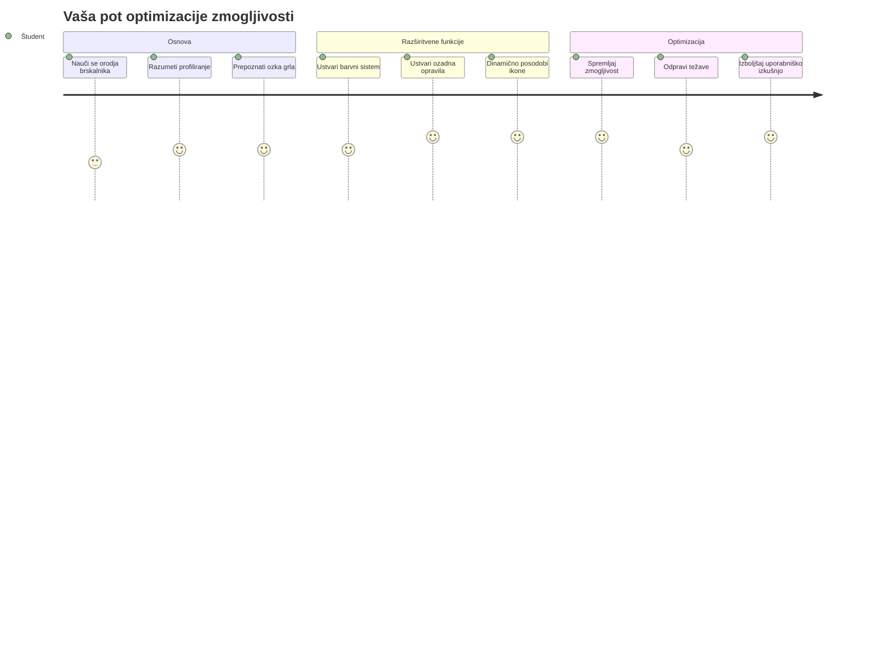
Ste se kdaj spraševali, kaj naredi nekatere razširitve brskalnika tako odzivne in hitre, medtem ko se druge zdijo počasne? Skrivnost je v tistem, kar se dogaja za kulisami. Medtem ko uporabniki klikajo po vmesniku vaše razširitve, obstaja cel svet ozadnih procesov, ki tiho upravljajo zajem podatkov, posodobitve ikon in sistemske vire.

To je naša zadnja lekcija v seriji o razširitvah brskalnika in naredili bomo, da vaš sledilnik ogljičnega odtisa deluje gladko. Dodali boste dinamične posodobitve ikon in se naučili, kako prepoznati težave z zmogljivostjo, preden postanejo problemi. To je kot uglaševanje dirkalnega avtomobila - majhne optimizacije lahko naredijo ogromno razliko pri delovanju vsega.

Ko bomo končali, boste imeli dodelano razširitev in razumeli principe zmogljivosti, ki ločijo dobre spletne aplikacije od odličnih. Potopimo se v svet optimizacije brskalnika.

## Predpredavalni kviz

[Predpredavalni kviz](https://ff-quizzes.netlify.app/web/quiz/27)

### Uvod

V prejšnjih lekcijah ste zgradili obrazec, ga povezali z API-jem ter se spopadli z asinhronim zajemom podatkov. Vaša razširitev dobiva lepo obliko.

Zdaj moramo dodati še končne popravke - na primer, da ikona razširitve spremeni barve glede na podatke o ogljiku. To me spominja na to, kako je NASA morala optimizirati vsak sistem na vesoljski ladji Apollo. Niso si mogli privoščiti izgubljenih ciklov ali pomnilnika, ker je zmogljivost odločala o življenjih. Čeprav naša razširitev ni tako kritična, enaki principi veljajo - učinkovit koda ustvarja boljšo uporabniško izkušnjo.

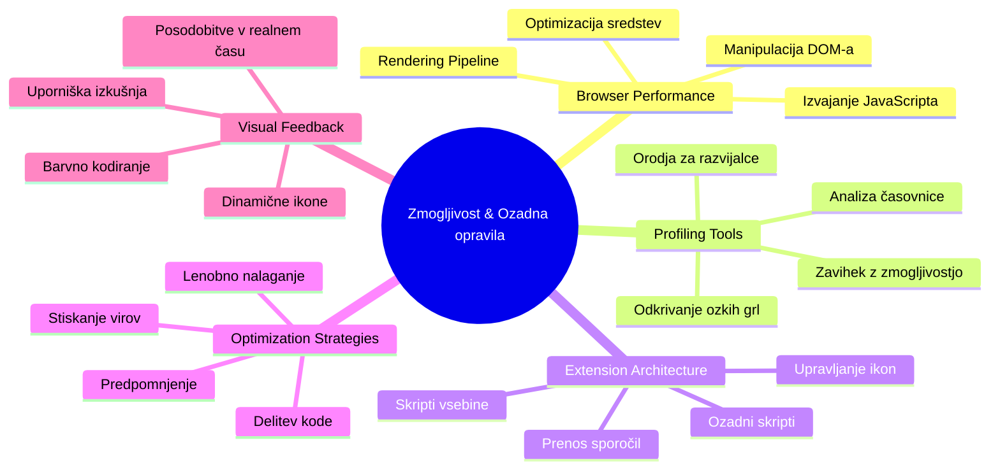
## Osnove spletne zmogljivosti

Ko vaša koda deluje učinkovito, ljudje to lahko dejansko *občutijo*. Poznate tisti trenutek, ko se stran naloži takoj ali animacija teče gladko? To je dobra zmogljivost v akciji.

Zmogljivost ne pomeni samo hitrosti - gre za ustvarjanje spletnih izkušenj, ki se zdijo naravne, ne okorne in frustrirajoče. V zgodnjih dneh računalništva je Grace Hopper znano imela na svoji mizi nanosekundo (kos žice dolžine približno 30 cm), da je pokazala, kako daleč svetloba prepotuje v eno milijardinko sekunde. Bil je njen način razlage, zakaj šteje vsak mikrosekund v računalništvu. Raziščimo detektivska orodja, ki vam pomagajo ugotoviti, kaj povzroča počasnost.

> "Zmogljivost spletne strani je sestavljena iz dveh stvari: kako hitro se stran naloži in kako hitro na njej teče koda." -- [Zack Grossbart](https://www.smashingmagazine.com/2012/06/javascript-profiling-chrome-developer-tools/)

Tema, kako narediti vaše spletne strani izjemno hitre na vseh vrstah naprav, za vse vrste uporabnikov, v vseh vrstah situacij, je na srečo obsežna. Tukaj je nekaj točk, ki jih imejte v mislih, ko gradite standardni spletni projekt ali razširitev brskalnika.

Prvi korak pri optimizaciji vaše strani je razumevanje, kaj se dejansko dogaja v ozadju. Na srečo ima vaš brskalnik zmogljiva detektivska orodja že vgrajena.

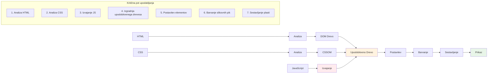
Če želite odpreti Orodja za razvijalce v Edge, kliknite na tiste tri pikice zgoraj desno, nato pojdite na Več orodij > Orodja za razvijalce. Ali uporabite bližnjico na tipkovnici: `Ctrl` + `Shift` + `I` v Windows ali `Option` + `Command` + `I` na Macu. Ko ste tam, kliknite na zavihek Performance - tukaj boste opravili svojo preiskavo.

**Tukaj je vaš detektivski komplet za zmogljivost:**
- **Odprite** Orodja za razvijalce (te boste kot razvijalec uporabljali nenehno!)
- **Pojdite** na zavihek Performance - mislite nanj kot na fitnes sledilec vaše spletne aplikacije
- **Pritisnite** gumb Record in opazujte vašo stran v akciji
- **Preučite** rezultate, da odkrijete, kaj upočasnjuje stvari

Poskusimo to. Odprite spletno stran (Microsoft.com je primerna) in kliknite tisti gumb 'Record'. Zdaj osvežite stran in opazujte, kako profiler zajema vse, kar se dogaja. Ko prenehate snemati, boste videli podroben pregled, kako brskalnik 'skriptira', 'renderira' in 'riše' stran. Spomni me na to, kako nadzor misije spremlja vsak sistem med izstrelitvijo rakete - dobite podatke v realnem času o tem, kaj se dogaja in kdaj.

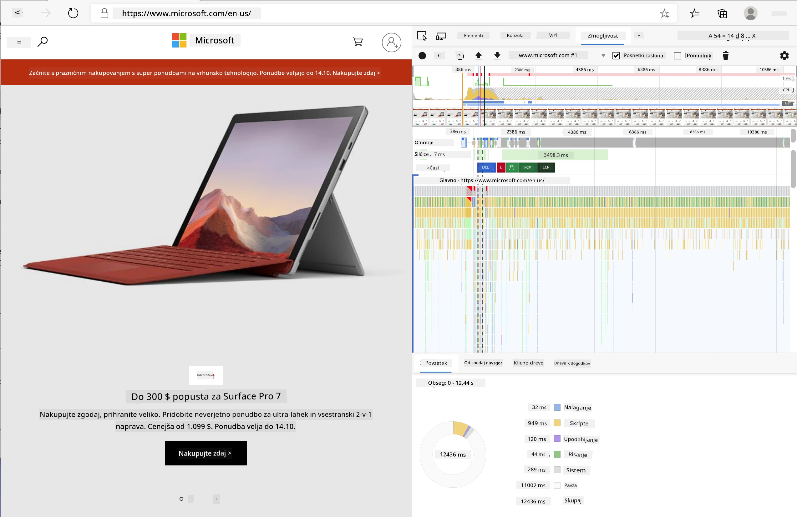

✅ [Microsoftova dokumentacija](https://docs.microsoft.com/microsoft-edge/devtools-guide/performance/?WT.mc_id=academic-77807-sagibbon) ima še veliko več podrobnosti, če želite poglobiti znanje

> Namig strokovnjaka: Pred testiranjem počistite predpomnilnik brskalnika, da vidite, kako vaša stran deluje za prve obiskovalce - ponavadi je precej drugače kot pri ponovnih obiskih!

Izberite elemente časovnice profila, da povečate dogodke, ki se zgodijo med nalaganjem strani.

Dobite posnetek zmogljivosti strani tako, da izberete del časovnice in pogledate povzetek:

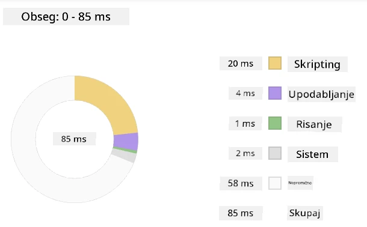

Preverite podokno Dnevnik dogodkov, da vidite, ali je kateri dogodek trajal dlje od 15 ms:

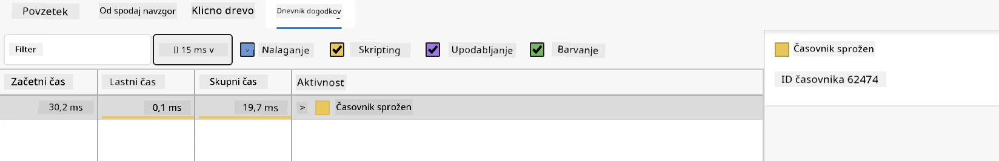

✅ Spoznajte svoj profiler! Odprite orodja za razvijalce na tej strani in preverite, ali obstajajo ozka grla. Katera datoteka se nalaga najpočasneje? Najhitrejše?

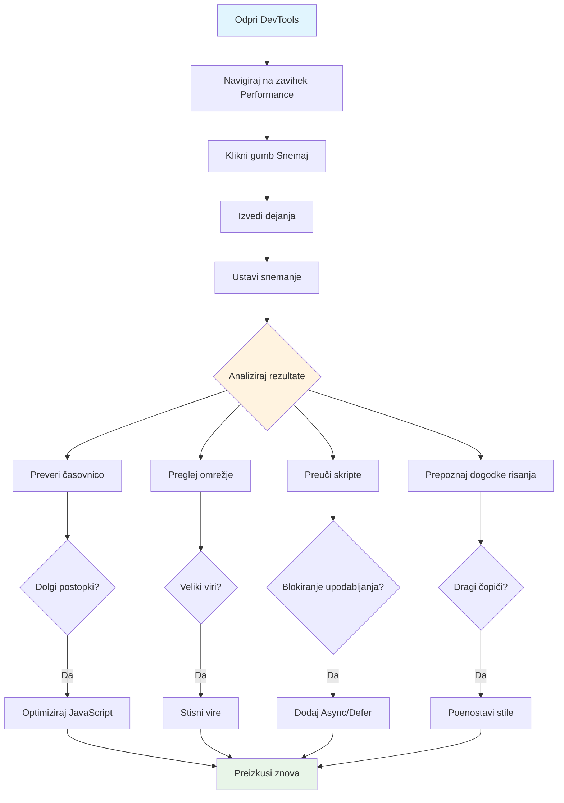
## Kaj iskati pri profiliranju

Zagon profila je šele začetek - prava veščina je vedeti, kaj vam ti pisani grafi dejansko sporočajo. Brez skrbi, naučili se boste njih brati. Izkušeni razvijalci so se naučili prepoznati opozorilne znake, preden postanejo polni problemi.

Pogovorimo se o običajnih osumljencih - povzročiteljih težav z zmogljivostjo, ki se radi prikradejo v spletne projekte. Tako kot je Marie Curie skrbno nadzorovala raven sevanja v svojem laboratoriju, moramo tudi mi paziti na nekatere vzorce, ki kažejo na težave, ki se kuhajo. Zgodnje odkrivanje vam bo prihranilo veliko frustracij (vam in uporabnikom).

**Velikost sredstev**: Spletne strani so skozi čas postajale "težje", in veliko dodatne teže prihaja iz slik. To je kot da bi v digitalne kovčke dodajali vedno več in več.

✅ Oglejte si [Internet Archive](https://httparchive.org/reports/page-weight), da vidite, kako so se velikosti strani skozi čas povečevale - presenetljivo.

**Tukaj je, kako ohraniti sredstva optimizirana:**
- **Stisnite** slike! Sodobni formati, kot je WebP, lahko drastično zmanjšajo velikost datotek
- **Ponudite** pravo velikost slike za vsako napravo - ni potrebe po pošiljanju velikih namiznih slik na telefone
- **Minificirajte** CSS in JavaScript - vsak bajt šteje
- **Uporabite** leno nalaganje, da se slike prenesejo le, ko uporabniki dejansko drsijo do njih

**Prehodi DOM**: Brskalnik mora zgraditi svoj Dokumentni objektni model na podlagi kode, ki jo napišete, zato je v interesu dobre zmogljivosti strani, da so vaši oznaki minimalni, uporabljate in oblikujete samo tisto, kar stran potrebuje. V tem smislu bi bilo možno optimizirati odvečen CSS, posebej tisti, ki ga je treba uporabiti samo na eni strani, ni ga treba vključevati v glavni slogovni list.

**Ključne strategije za optimizacijo DOM:**
- **Zmanjšajte** število HTML elementov in globino gnezdenja
- **Odstranite** neuporabljena pravila CSS in učinkovito združite slogovne liste
- **Organizirajte** CSS tako, da se naloži samo, kar je potrebno za vsako stran
- **Strukturirajte** HTML semantično za boljše razčlenjevanje brskalnika

**JavaScript**: Vsak JavaScript razvijalec naj pazi na 'render-blocking' skripte, ki jih je treba naložiti, preden se lahko preostanek DOM prehodi in nariše brskalnik. Razmislite o uporabi `defer` v svojih vstavljenih skriptah (kot je to narejeno v modulu Terrarium).

**Sodobne tehnike optimizacije JavaScript:**
- **Uporaba** atributa `defer` za nalaganje skript po parsiranju DOM
- **Implementacija** delitve kode za nalaganje samo potrebnega JavaScript
- **Uporaba** lenega nalaganja za nekritične funkcionalnosti
- **Zmanjševanje** uporabe velikih knjižnic in ogrodij, kjer je mogoče

✅ Preizkusite nekaj strani na [Site Speed Test spletni strani](https://www.webpagetest.org/), da se naučite več o pogostih preverjanjih zmogljivosti strani.

### 🔄 **Pedagoški pregled**
**Razumevanje zmogljivosti**: Pred gradnjo funkcij razširitve poskrbite, da lahko:
- ✅ Razložite kritično pot upodabljanja od HTML do slikovnih pik
- ✅ Prepoznate pogosta ozka grla zmogljivosti v spletnih aplikacijah
- ✅ Uporabite brskalniška orodja za razvijalce za profiliranje zmogljivosti strani
- ✅ Razumete, kako velikost sredstev in kompleksnost DOM vplivata na hitrost

**Hiter samopreizkus**: Kaj se zgodi, ko imate JavaScript, ki blokira upodabljanje?
*Odgovor: Brskalnik mora prenesti in zagnati skript, preden lahko nadaljuje s parsiranjem HTML in upodabljanjem strani*

**Vpliv na zmogljivost v resničnem svetu**:
- **100 ms zakašnjevanja**: uporabniki opazijo upočasnitev
- **1 sekunda**: uporabniki začnejo izgubljati osredotočenost
- **3+ sekunde**: 40 % uporabnikov zapusti stran
- **Mobilna omrežja**: zmogljivost postane še pomembnejša

Zdaj, ko imate predstavo, kako brskalnik upodablja sredstva, ki jih pošljete, poglejmo zadnje stvari, ki jih morate narediti, da dokončate svojo razširitev:

### Ustvarite funkcijo za izračun barve

Zdaj bomo ustvarili funkcijo, ki pretvori številčne podatke v smiselne barve. Predstavljajte si to kot sistem semaforja - zeleno za čisto energijo, rdeče za visoko ogljično intenzivnost.

Ta funkcija bo vzela CO2 podatke iz našega API in določila, katera barva najbolje predstavlja okoljski vpliv. Podobno kot znanstveniki uporabljajo barvno kodiranje na toplotnih zemljevidih za vizualizacijo zapletenih vzorcev podatkov - od temperaturnih vzorcev oceanov do tvorbe zvezd. Dodajmo to v `/src/index.js`, takoj za tistimi `const` spremenljivkami, ki smo jih definirali prej:

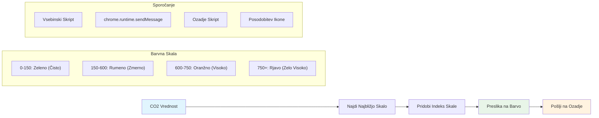
```javascript
function calculateColor(value) {
	// Določite lestvico intenzivnosti CO2 (grami na kWh)
	const co2Scale = [0, 150, 600, 750, 800];
	// Ustrezne barve od zelene (čista) do temno rjave (visoka vsebnost ogljika)
	const colors = ['#2AA364', '#F5EB4D', '#9E4229', '#381D02', '#381D02'];

	// Poiščite najbližjo vrednost lestvice naši vhodni vrednosti
	const closestNum = co2Scale.sort((a, b) => {
		return Math.abs(a - value) - Math.abs(b - value);
	})[0];
	
	console.log(`${value} is closest to ${closestNum}`);
	
	// Poiščite indeks za barvno preslikavo
	const num = (element) => element > closestNum;
	const scaleIndex = co2Scale.findIndex(num);

	const closestColor = colors[scaleIndex];
	console.log(scaleIndex, closestColor);

	// Pošljite sporočilo o posodobitvi barve ozadju skripte
	chrome.runtime.sendMessage({ action: 'updateIcon', value: { color: closestColor } });
}
```

**Poglejmo si to pametno majhno funkcijo:**
- **Nastavi** dva niza - enega za ravni CO2, drugega za barve (zeleno = čisto, rjavo = umazano!)
- **Najde** najbližje ujemanje z našo dejansko CO2 vrednostjo z uporabo ureditev polja
- **Pridobi** ujemajočo barvo z uporabo metode findIndex()
- **Pošlje** sporočilo Chromovemu skriptu v ozadju z izbrano barvo
- **Uporabi** predloge nizov (tiste nazaj obrnjene vejice) za čistejše oblikovanje niza
- **Ohranja** organiziranost z uporabo const deklaracij

`chrome.runtime` [API](https://developer.chrome.com/extensions/runtime) je kot živčni sistem vaše razširitve - upravlja z vsemi komunikacijami in opravili za kulisami:

> "Uporabite chrome.runtime API za pridobivanje ozadnega strani, vračanje podrobnosti o manifestu ter poslušanje in odzivanje na dogodke v življenjskem ciklu aplikacije ali razširitve. Prav tako lahko ta API uporabite za pretvorbo relativnih poti URL-jev v popolnoma kvalificirane URL-je."

**Zakaj je Chrome Runtime API tako uporaben:**
- **Omogoča**, da različni deli vaše razširitve komunicirajo med seboj
- **Upravlja** delo v ozadju brez zmrzovanja uporabniškega vmesnika
- **Obvladuje** življenjske dogodke vaše razširitve
- **Poenostavi** pošiljanje sporočil med skripti

✅ Če razvijate to razširitev za Edge, vas lahko preseneti, da uporabljate chrome API. Novejše različice brskalnika Edge tečejo na Chromium jedru, zato lahko izkoristite ta orodja.

```mermaid
architecture-beta
    group browser(logos:chrome)[Brskalnik]
    
    service popup(logos:html5)[Vnosno Okno] in browser
    service content(logos:javascript)[Vsebinski Skript] in browser
    service background(database)[Ozadje Skripta] in browser
    service api(logos:api)[Zunanji API] in browser
    
    popup:R -- L:content
    content:R -- L:background
    background:T -- B:api
    content:T -- B:api
    
    junction junctionCenter in browser
    popup:R -- L:junctionCenter
    junctionCenter:R -- L:background
```
> **Namig strokovnjaka**: Če želite profilirati razširitev brskalnika, zaženite orodja za razvijalce znotraj same razširitve, saj je to njen ločen brskalniški primer. Tako boste imeli dostop do zmogljivostnih meritev, specifičnih za razširitev.

### Nastavite privzeto barvo ikone

Preden začnemo z zbiranjem pravih podatkov, dajmo naši razširitvi izhodišče. Nihče ne mara gledati prazne ali pokvarjene ikone. Začeli bomo z zeleno barvo, da uporabniki vedo, da razširitev deluje takoj, ko jo namestijo.

V funkciji `init()` nastavite to privzeto zeleno ikono:

```javascript
chrome.runtime.sendMessage({
	action: 'updateIcon',
	value: {
		color: 'green',
	},
});
```

**Kaj ta inicializacija doseže:**
- **Nastavi** nevtralno zeleno barvo kot privzeto stanje
- **Nudi** takojšen vizualni odziv ob nalaganju razširitve
- **Vzpostavi** vzorec komunikacije z ozadnim skriptom
- **Zagotovi**, da uporabniki vidijo delujočo razširitev pred nalaganjem podatkov
### Pokličite funkcijo, izvedite klic

Zdaj vse povežimo skupaj, da se ko prispejo sveži podatki o CO2, vaša ikona samodejno posodobi z ustrezno barvo. To je kot povezovanje zadnjega vezja v elektronski napravi - nenadoma vsi posamezni deli delujejo kot en sistem.

Dodajte to vrstico takoj za pridobitvijo podatkov CO2 iz API-ja:

```javascript
// Po pridobitvi podatkov o CO2 iz API-ja
// naj bo CO2 = data.data[0].intensity.actual;
calculateColor(CO2);
```

**Ta integracija doseže:**
- **Poveže** tok podatkov API-ja s sistemom vizualnih indikatorjev
- **Sproži** samodejne posodobitve ikone, ko prispejo novi podatki
- **Zagotovi** vizualni odziv v realnem času glede na trenutno ogljično intenzivnost
- **Ohranja** ločenost med zajemom podatkov in logiko prikaza

In nazadnje v `/dist/background.js` dodajte poslušalca za te klice ozadnih opravil:

```javascript
// Poslušaj sporočila iz vsebinskega skripta
chrome.runtime.onMessage.addListener(function (msg, sender, sendResponse) {
	if (msg.action === 'updateIcon') {
		chrome.action.setIcon({ imageData: drawIcon(msg.value) });
	}
});

// Nariši dinamično ikono z uporabo Canvas API
// Posojeno iz razširitve energy lollipop - lepa funkcija!
function drawIcon(value) {
	// Ustvari platno brez zaslona za boljšo zmogljivost
	const canvas = new OffscreenCanvas(200, 200);
	const context = canvas.getContext('2d');

	// Nariši barvni krog, ki predstavlja ogljično intenzivnost
	context.beginPath();
	context.fillStyle = value.color;
	context.arc(100, 100, 50, 0, 2 * Math.PI);
	context.fill();

	// Vrni podatke slike za ikono brskalnika
	return context.getImageData(50, 50, 100, 100);
}
```

**Tukaj je, kaj počne ta ozadni skript:**
- **Posluša** sporočila iz glavnega skripta (kot receptor, ki sprejema klice)
- **Obravnava** zahteve 'updateIcon' za spremembo ikonke v orodni vrstici
- **Ustvari** nove ikone sproti z uporabo Canvas API-ja
- **Nariše** preprost obarvan krog, ki kaže trenutno ogljično intenzivnost
- **Posodobi** orodno vrstico brskalnika z novo ikono
- **Uporablja** OffscreenCanvas za gladko zmogljivost (brez blokiranja UI)

✅ Več o Canvas API-ju se boste naučili v [Space Game lekcijah](../../6-space-game/2-drawing-to-canvas/README.md).

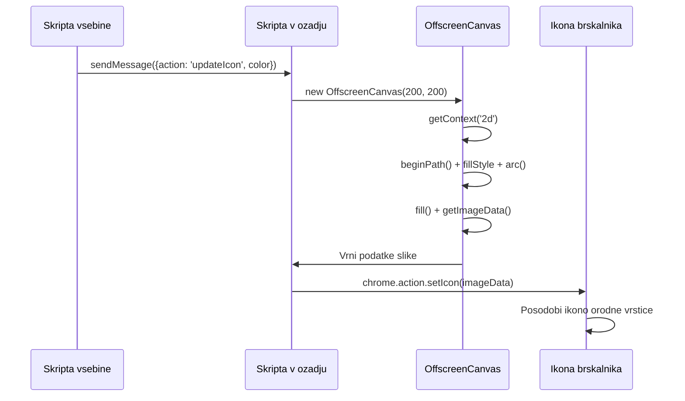
### 🔄 **Pedagoški pregled**
**Celostno razumevanje razširitve**: Preverite svoje znanje celotnega sistema:
- ✅ Kako poteka pošiljanje sporočil med različnimi skripti razširitve?
- ✅ Zakaj uporabljamo OffscreenCanvas namesto običajnega Canvas za zmogljivost?
- ✅ Kakšno vlogo ima Chrome Runtime API v arhitekturi razširitve?
- ✅ Kako algoritem za izračun barv preslika podatke v vizualne povratne informacije?

**Upoštevanje zmogljivosti**: Vaša razširitev zdaj prikazuje:
- **Učinkovito sporočanje**: Čista komunikacija med skriptnimi konteksti
- **Optimizirano upodabljanje**: OffscreenCanvas preprečuje blokiranje uporabniškega vmesnika
- **Posodobitve v realnem času**: Dinamične spremembe ikone glede na žive podatke
- **Upravljanje pomnilnika**: Pravilno čiščenje in upravljanje virov

**Čas je za testiranje vaše razširitve:**
- **Zgradite** vse z `npm run build`
- **Ponovno naložite** vašo razširitev v brskalniku (ne pozabite tega koraka)
- **Odprite** vašo razširitev in opazujte, kako ikona spreminja barve
- **Preverite**, kako se odziva na dejanske podatke o ogljiku z vsega sveta

Zdaj boste na prvi pogled vedeli, ali je pravi čas za pranje perila ali počakati na čistejšo energijo. Pravkar ste ustvarili nekaj res uporabnega in se pri tem naučili o zmogljivosti brskalnika.

## Izziv GitHub Copilot agenta 🚀

Uporabite način Agent za dokončanje naslednjega izziva:

**Opis:** Izboljšajte zmogljivost spremljanja vaše brskalniške razširitve z dodajanjem funkcije, ki sledi in prikazuje čas nalaganja različnih komponent razširitve.

**Navodilo:** Ustvarite sistem za spremljanje zmogljivosti brskalniške razširitve, ki meri in beleži čas, potreben za pridobivanje podatkov o CO2 iz API-ja, izračun barv in posodobitev ikone. Dodajte funkcijo `performanceTracker`, ki uporablja Performance API za merjenje teh operacij in prikazuje rezultate v konzoli brskalnika s časovnimi žigi in metrikami trajanja.

Več o [načinu agent](https://code.visualstudio.com/blogs/2025/02/24/introducing-copilot-agent-mode) izveste tukaj.

## 🚀 Izziv

Tukaj je zanimiva detektivska misija: izberite nekaj odprtokodnih spletnih mest, ki delujejo že leta (recimo Wikipedia, GitHub ali Stack Overflow) in preglejte njihovo zgodovino commitov. Ali lahko ugotovite kje so naredili izboljšave zmogljivosti? Katere težave so se ponavljale?

**Vaš pristop k preiskavi:**
- **Iščite** sporočila commitov po besedah kot so "optimiziraj", "zmogljivost" ali "hitreje"
- **Poglejte** za vzorce - ali popravljajo iste vrste težav?
- **Prepoznajte** pogoste vzroke, ki upočasnjujejo spletna mesta
- **Delite** svoja odkritja - drugi razvijalci se učijo iz primerov iz resničnega sveta

## Kviz po predavanju

[Post-lecture quiz](https://ff-quizzes.netlify.app/web/quiz/28)

## Pregled & Samostojno učenje

Razmislite o naročnini na [novičnik o zmogljivosti](https://perf.email/)

Preučite nekatere načine, kako brskalniki merijo spletno zmogljivost, tako da pogledate zavihke za zmogljivost v njihovih orodjih za razvijalce. Ali opazite kakšne večje razlike?

### ⚡ **Kaj lahko storite v naslednjih 5 minutah**
- [ ] Odprite Upravljalnik opravil brskalnika (Shift+Esc v Chromu) in si oglejte uporabo virov razširitve
- [ ] Uporabite zavihek Performance v DevTools za zajem in analizo zmogljivosti spletne strani
- [ ] Preverite stran z razširitvami v brskalniku, katere razširitve vplivajo na čas zagona
- [ ] Poskusite začasno onemogočiti razširitve, da vidite spremembe zmogljivosti

### 🎯 **Posebno za ta časovni okvir**
- [ ] Dokončajte kviz po lekciji in razumite koncepte zmogljivosti
- [ ] Implementirajte ozadni skript za vašo razširitev brskalnika
- [ ] Naučite se uporabljati browser.alarms za učinkovita opravila v ozadju
- [ ] Vaja v prenosu sporočil med vsebinskimi in ozadnimi skripti
- [ ] Merite in optimizirajte rabo virov vaše razširitve

### 📅 **Vaše tedensko potovanje do zmogljivosti**
- [ ] Dokončajte zmogljivo razširitev za brskalnik z ozadnimi funkcionalnostmi
- [ ] Obvladujte storitvene delavce in sodobno arhitekturo razširitev
- [ ] Implementirajte učinkovite strategije sinhronizacije podatkov in predpomnjenja
- [ ] Naučite se naprednih tehnik odpravljanja napak za zmogljivost razširitev
- [ ] Optimizirajte vašo razširitev za funkcionalnost in učinkovitost virov
- [ ] Ustvarite celovite teste za scenarije zmogljivosti razširitev

### 🌟 **Vaša mesečna mojstrska optimizacija**
- [ ] Zgradite razširitve za brskalnike na nivoju podjetij z optimalno zmogljivostjo
- [ ] Spoznajte Web Workers, Service Workers in sodobno spletno zmogljivost
- [ ] Prispevajte k odprtokodnim projektom, osredotočenim na optimizacijo zmogljivosti
- [ ] Obvladajte notranjost brskalnikov in napredne tehnike odpravljanja napak
- [ ] Ustvarite orodja za spremljanje zmogljivosti in vodiče za najboljše prakse
- [ ] Postanite strokovnjak za zmogljivost, ki pomaga optimizirati spletne aplikacije

## 🎯 Časovnica mojstrstva vaše razširitve za brskalnik

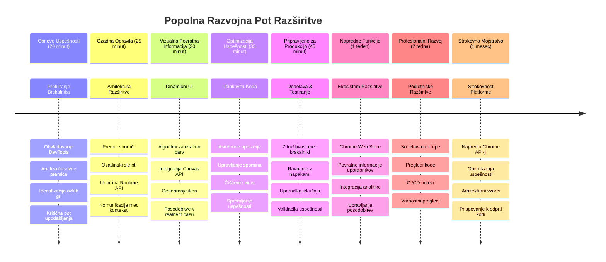
### 🛠️ Vaše popolno orodje za razvoj razširitev

Po zaključku te trilogije ste obvladali:
- **Arhitekturo brskalnika**: Globoko razumevanje, kako se razširitve povezujejo z brskalniškimi sistemi
- **Profiliranje zmogljivosti**: Sposobnost prepoznavanja in odpravljanja ozkih grl z uporabo orodij za razvijalce
- **Asinhrono programiranje**: Sodobne vzorce JavaScripta za odzivne, neblokirne operacije
- **Integracija API-jev**: Pridobivanje zunanjih podatkov z avtentikacijo in obravnavo napak
- **Vizualni dizajn**: Dinamične posodobitve uporabniškega vmesnika in generiranje grafike na podlagi Canvas
- **Prenos sporočil**: Komunikacija med skriptami v arhitekturah razširitev
- **Uporabniška izkušnja**: Naložni stanja, obravnava napak in intuitivna interakcija
- **Produkcijske veščine**: Testiranje, odpravljanje napak in optimizacija za realno uporabo

**Uporabnost v resničnem svetu**: Vaše veščine razvoja razširitev so neposredno uporabne pri:
- **Progresivnih spletnh aplikacijah**: Podobna arhitektura in vzorci zmogljivosti
- **Electron namiznih aplikacijah**: Večplatformne aplikacije, ki uporabljajo spletne tehnologije
- **Mobilnih hibridnih aplikacijah**: Razvoj Cordova/PhoneGap z uporabo spletnih API-jev
- **Podjetniških spletnh aplikacijah**: Kompleksna orodja za nadzorne plošče in produktivnost
- **Razširitvah za Chrome DevTools**: Napredna orodja za razvijalce in odpravljanje napak
- **Integraciji spletnih API-jev**: Katerekoli aplikacije, ki komunicirajo z zunanjimi storitvami

**Poklicni vpliv**: Zdaj lahko:
- **Zgradite** razširitve za brskalnike, pripravljene za proizvodnjo, od koncepta do uvedbe
- **Optimizirate** zmogljivost spletnih aplikacij z uporabo industrijsko priznanih orodij za profiliranje
- **Arhitektirate** razširljive sisteme z ustreznim ločevanjem odgovornosti
- **Odpravljate napake** kompleksnih asinhronih operacij in komunikacije med konteksti
- **Prispevate** k odprtokodnim razširitvenim projektom in standardom brskalnikov

**Priložnosti za naslednjo stopnjo:**
- **Razvijalec v Chrome Web Store**: Objavite razširitve za milijone uporabnikov
- **Inženir spletne zmogljivosti**: Specializirajte se za optimizacijo in uporabniško izkušnjo
- **Razvijalec platforme brskalnika**: Prispevajte k razvoju pogona brskalnika
- **Ustvarjalec ogrodja za razširitve**: Gradite orodja, ki pomagajo drugim razvijalcem
- **Odnosi z razvijalci**: Delite znanje v obliki izobraževanja in ustvarjanja vsebin

🌟 **Dosežek odklenjen**: Zgradili ste popolno, funkcionalno razširitev za brskalnik, ki prikazuje profesionalne razvojne prakse in sodobne spletne standarde!

## Naloga

[Analizirajte spletno mesto za zmogljivost](assignment.md)

---

<!-- CO-OP TRANSLATOR DISCLAIMER START -->
**Omejitev odgovornosti**:
Ta dokument je bil preveden z uporabo AI prevajalske storitve [Co-op Translator](https://github.com/Azure/co-op-translator). Čeprav si prizadevamo za natančnost, upoštevajte, da avtomatizirani prevodi lahko vsebujejo napake ali netočnosti. Izvirni dokument v njegovem izvorni jeziku velja za verodostojen vir. Za ključne informacije priporočamo strokovni človeški prevod. Ne odgovarjamo za morebitna nesporazume ali napačne interpretacije, ki izhajajo iz uporabe tega prevoda.
<!-- CO-OP TRANSLATOR DISCLAIMER END -->