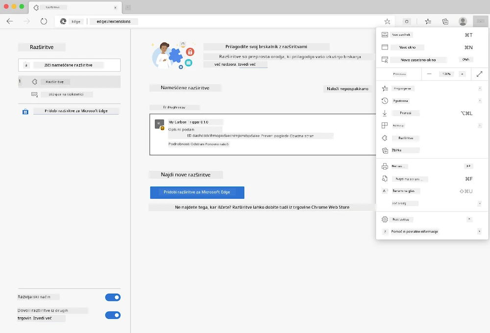

<!--
CO_OP_TRANSLATOR_METADATA:
{
  "original_hash": "dd58ae1b7707034f055718c1b68bc8de",
  "translation_date": "2025-08-27T22:18:56+00:00",
  "source_file": "5-browser-extension/solution/translation/README.hi.md",
  "language_code": "sl"
}
-->
# Carbon Trigger Brskalni vtičnik: Končna koda

Uporaba tmrow API-ja C02 Signal za sledenje porabi električne energije, izdelava brskalnega vtičnika, ki vas opomni, kako obremenjena je poraba električne energije v vašem območju. Uporaba tega vtičnika vam bo pomagala sprejemati odločitve o vaših dejavnostih na podlagi teh informacij.


## Začetek

Namestiti morate [npm](https://npmjs.com). Prenesite kopijo te kode v mapo na vašem računalniku.

Namestite vse potrebne pakete:

```
npm install
```

Ustvarite vtičnik z uporabo Webpacka:

```
npm run build
```

Za namestitev v Edge uporabite meni 'tri pike' v zgornjem desnem kotu brskalnika, da poiščete ploščo za vtičnike. Od tam izberite 'Naloži nepakiran' za nalaganje novega vtičnika. V pozivu odprite mapo 'dist' in vtičnik bo naložen. Za uporabo boste potrebovali API ključ za CO2 Signal ([pridobite ga tukaj preko e-pošte](https://www.co2signal.com/) - vnesite svoj e-poštni naslov v polje na tej strani) in [kodo za vaše območje](http://api.electricitymap.org/v3/zones) [električni zemljevid](https://www.electricitymap.org/map) (na primer, v Bostonu uporabljam 'US-NEISO').



Ko so API ključ in območje vneseni v vmesnik vtičnika, bi se morala barvna pika v vrstici brskalnega vtičnika spremeniti, da odraža porabo energije v vašem območju, in vam dati indikator, katere energijsko intenzivne dejavnosti so primerne za vaše delovanje. Koncept te 'pikaste' sistema mi je bil navdihnjen z [Energy Lollipop vtičnikom](https://energylollipop.com/) za emisije v Kaliforniji.

---

**Omejitev odgovornosti**:  
Ta dokument je bil preveden z uporabo storitve za prevajanje z umetno inteligenco [Co-op Translator](https://github.com/Azure/co-op-translator). Čeprav si prizadevamo za natančnost, vas prosimo, da upoštevate, da lahko avtomatizirani prevodi vsebujejo napake ali netočnosti. Izvirni dokument v njegovem maternem jeziku je treba obravnavati kot avtoritativni vir. Za ključne informacije priporočamo profesionalni človeški prevod. Ne prevzemamo odgovornosti za morebitna napačna razumevanja ali napačne interpretacije, ki bi nastale zaradi uporabe tega prevoda.