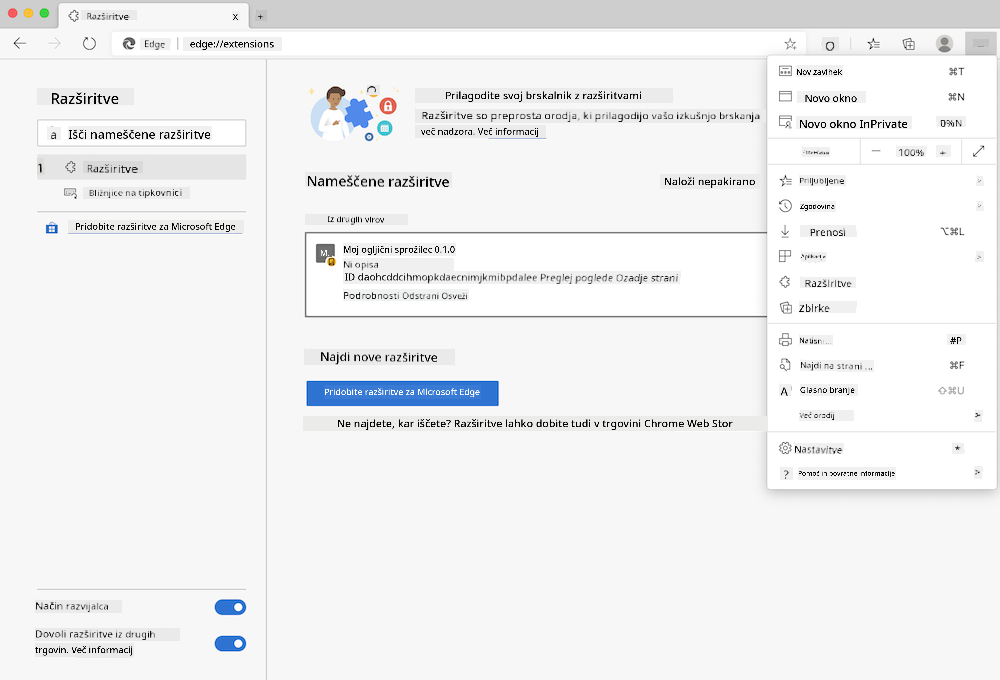

<!--
CO_OP_TRANSLATOR_METADATA:
{
  "original_hash": "26fd39046d264ba185dcb086d3a8cf3e",
  "translation_date": "2025-08-27T22:17:52+00:00",
  "source_file": "5-browser-extension/start/README.md",
  "language_code": "sl"
}
-->
# Carbon Trigger Browser Extension: Začetna koda

Z uporabo tmrow API-ja C02 Signal za spremljanje porabe električne energije ustvarite razširitev za brskalnik, ki vam bo v brskalniku služila kot opomnik o tem, kako obremenjena je poraba električne energije v vaši regiji. Občasna uporaba te razširitve vam bo pomagala sprejemati odločitve o vaših dejavnostih na podlagi teh informacij.


## Začetek

Potrebovali boste nameščen [npm](https://npmjs.com). Prenesite kopijo te kode v mapo na vašem računalniku.

Namestite vse potrebne pakete:

```
npm install
```

Razširitev sestavite z uporabo webpacka:

```
npm run build
```

Za namestitev v Edge uporabite meni 'tri pike' v zgornjem desnem kotu brskalnika, da odprete ploščo z razširitvami. Tam izberite 'Naloži nepakirano', da naložite novo razširitev. Na pozivu odprite mapo 'dist' in razširitev se bo naložila. Za uporabo boste potrebovali API ključ za CO2 Signal API ([pridobite ga tukaj preko e-pošte](https://www.co2signal.com/) - vnesite svoj e-poštni naslov v polje na tej strani) in [kodo za vašo regijo](http://api.electricitymap.org/v3/zones), ki ustreza [Electricity Map](https://www.electricitymap.org/map) (na primer v Bostonu uporabljam 'US-NEISO').



Ko vmesnik razširitve vnesete API ključ in regijo, bi se morala barvna pika v vrstici razširitev brskalnika spremeniti, da odraža porabo energije v vaši regiji, ter vam dati namig, katere dejavnosti, ki porabijo veliko energije, bi bile primerne za izvedbo. Koncept za ta sistem 'pik' sem dobil pri [Energy Lollipop razširitvi](https://energylollipop.com/) za emisije v Kaliforniji.

---

**Omejitev odgovornosti**:  
Ta dokument je bil preveden z uporabo storitve za prevajanje z umetno inteligenco [Co-op Translator](https://github.com/Azure/co-op-translator). Čeprav si prizadevamo za natančnost, vas prosimo, da upoštevate, da lahko avtomatizirani prevodi vsebujejo napake ali netočnosti. Izvirni dokument v njegovem izvirnem jeziku je treba obravnavati kot avtoritativni vir. Za ključne informacije priporočamo profesionalni prevod s strani človeka. Ne prevzemamo odgovornosti za morebitne nesporazume ali napačne razlage, ki bi nastale zaradi uporabe tega prevoda.