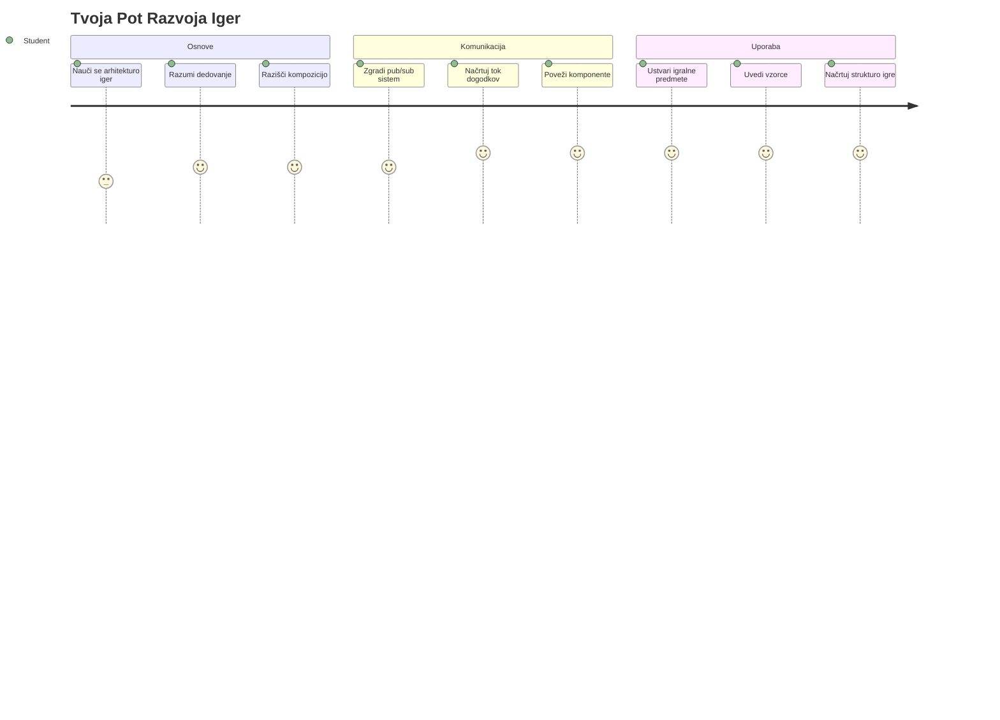
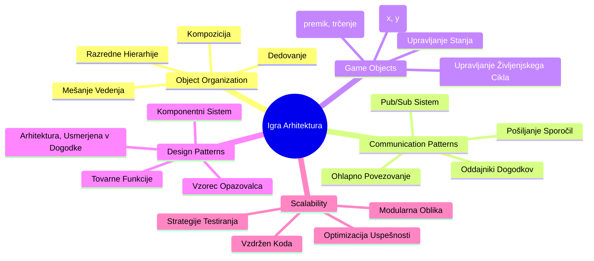
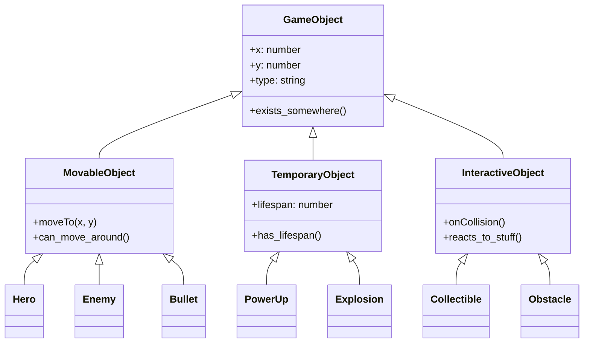
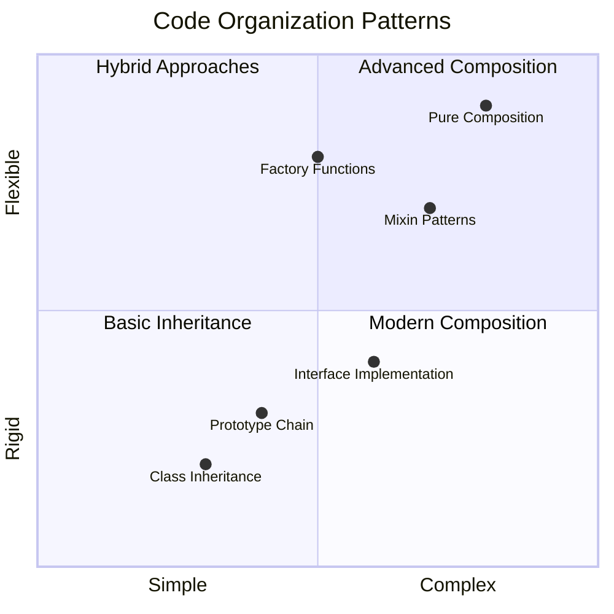
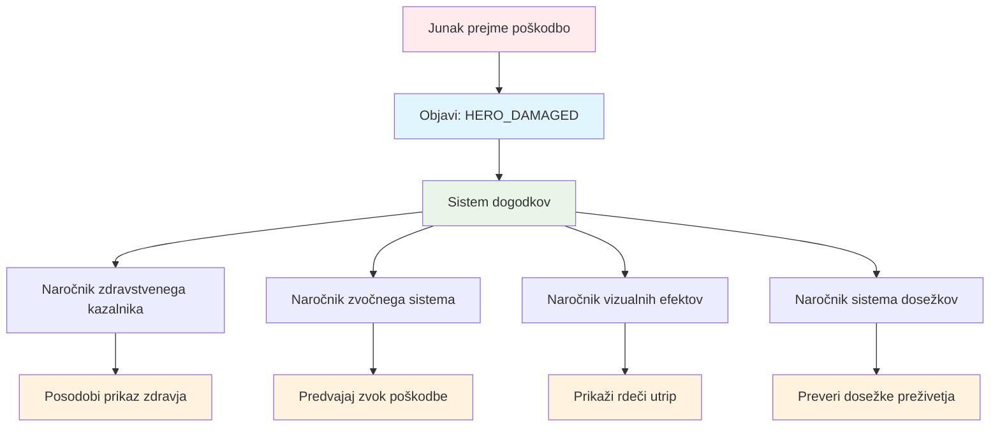
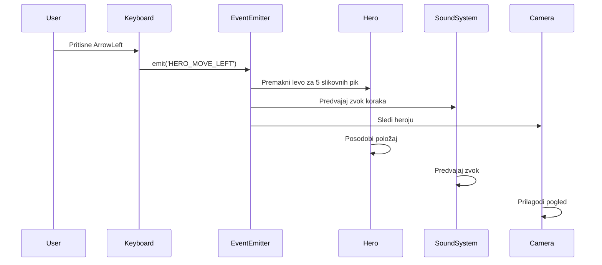
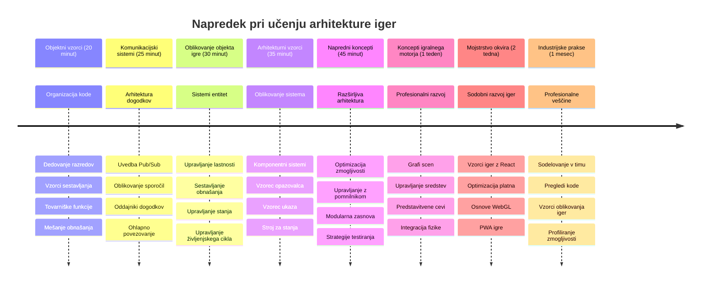

<!--
CO_OP_TRANSLATOR_METADATA:
{
  "original_hash": "a6332a7bb4d0be3bfd24199c83993777",
  "translation_date": "2026-01-07T10:08:48+00:00",
  "source_file": "6-space-game/1-introduction/README.md",
  "language_code": "sl"
}
-->
# Ustvarjanje vesoljske igre, del 1: Uvod




Tako kot misijski nadzor NASA usklajuje več sistemov med izstrelitvijo v vesolje, bomo ustvarili vesoljsko igro, ki bo prikazala, kako različni deli programa lahko sodelujejo brezhibno. Med tem, ko boste ustvarjali nekaj, kar lahko tudi zaigrate, boste spoznali osnovne programske koncepte, ki veljajo za vsak programski projekt.

Raziskali bomo dva osnovna pristopa za organizacijo kode: dedovanje in kompozicijo. To niso le akademski koncepti – gre za iste vzorce, ki poganjajo vse od video iger do bančnih sistemov. Uvedli bomo tudi sistem komunikacije, imenovan pub/sub, ki deluje podobno kot komunikacijska omrežja v vesoljskih plovilih, in omogoča različnim komponentam, da delijo informacije brez ustvarjanja odvisnosti.

Na koncu te serije boste razumeli, kako ustvariti aplikacije, ki lahko rastejo in se razvijajo – ne glede na to, ali razvijate igre, spletne aplikacije ali kakršenkoli drug programski sistem.


## Predpredavanje kviz

[Predpredavanje kviz](https://ff-quizzes.netlify.app/web/quiz/29)

## Dedovanje in kompozicija v razvoju iger

Ko projekti rastejo v kompleksnosti, postane organizacija kode ključna. To, kar se začne kot enostaven skript, je lahko težko vzdrževati brez ustrezne strukture – podobno kot so misije Apollo zahtevale skrbno koordinacijo med tisočimi komponentami.

Raziskali bomo dva osnovna pristopa za organizacijo kode: dedovanje in kompozicijo. Vsak ima svoje prednosti, in razumevanje obeh vam pomaga izbrati pravi pristop za različne situacije. Te koncepte bomo prikazali na naši vesoljski igri, kjer morajo junaki, sovražniki, močvirniki in drugi predmeti učinkovito sodelovati.

✅ Ena najbolj znanih programerskih knjig se nanaša na [vzorce načrtovanja](https://en.wikipedia.org/wiki/Design_Patterns).

V vsaki igri imate `igre objekte` – interaktivne elemente, ki napolnjujejo vaš igrivi svet. Junaki, sovražniki, močvirniki in vizualni učinki so vsi igrivi objekti. Vsak obstaja na določenih zaslonskih koordinatah z vrednostmi `x` in `y`, podobno kot točke na koordinatnem sistemu.

Kljub njihovim vizualnim razlikam ti predmeti pogosto delijo osnovna vedenja:

- **Obstajajo nekje** – vsak predmet ima x in y koordinate, da igra ve, kje ga narisati
- **Veliko se jih lahko premika** – junaki tečejo, sovražniki lovijo, krogle letijo po zaslonu
- **Imajo življenjski cikel** – nekateri ostanejo za vedno, drugi (kot eksplozije) se pojavijo za kratek čas in izginejo
- **Se odzivajo na dogajanje** – ko se stvari trčijo, močvirniki pridobijo, vrstica zdravja se posodobi

✅ Pomislite na igro, kot je Pac-Man. Ali lahko prepoznate štiri vrste zgoraj naštetih predmetov v tej igri?


### Izražanje vedenja s kodo

Zdaj, ko razumete skupna vedenja, ki jih imajo igralni predmeti, poglejmo, kako jih implementirati v JavaScript. Vedenje objekta lahko izrazite preko metod, pritrjenih na razrede ali posamezne objekte, za kar obstaja več pristopov.

**Pristop na osnovi razredov**

Razredi in dedovanje nudijo strukturiran način za organizacijo igralnih predmetov. Tako kot taksonomski sistem, ki ga je razvil Carl Linnaeus, začnete z osnovnim razredom, ki vsebuje skupne lastnosti, nato pa ustvarite specializirane razrede, ki dedujejo te osnovne lastnosti in hkrati dodajo specifične zmožnosti.

✅ Dedovanje je pomemben koncept za razumevanje. Več o tem preberite v [MDN članku o dedovanju](https://developer.mozilla.org/docs/Web/JavaScript/Inheritance_and_the_prototype_chain).

Tako lahko implementirate igralne predmete z uporabo razredov in dedovanja:

```javascript
// Korak 1: Ustvarite osnovno razredno GameObject
class GameObject {
  constructor(x, y, type) {
    this.x = x;
    this.y = y;
    this.type = type;
  }
}
```

**Razdelimo to korak za korakom:**
- Ustvarjamo osnovni predlogo, ki jo lahko uporabi vsak igralni predmet
- Konstruktor shrani, kje predmet je (`x`, `y`) in kakšne vrste je
- To postane temelj, na katerem bodo gradili vsi vaši igralni predmeti

```javascript
// Korak 2: Dodajte možnost gibanja prek dedovanja
class Movable extends GameObject {
  constructor(x, y, type) {
    super(x, y, type); // Pokličite konstruktor nadrazreda
  }

  // Dodajte možnost premika na novo mesto
  moveTo(x, y) {
    this.x = x;
    this.y = y;
  }
}
```

**V zgornjem primeru smo:**
- **Razširili** razred GameObject, da dodamo funkcionalnost premikanja
- **Poklicali** konstruktor nadrazreda z `super()`, da inicializiramo dedovane lastnosti
- **Dodali** metodo `moveTo()`, ki posodobi pozicijo predmeta

```javascript
// Korak 3: Ustvarite določene vrste igralnih objektov
class Hero extends Movable {
  constructor(x, y) {
    super(x, y, 'Hero'); // Nastavite vrsto samodejno
  }
}

class Tree extends GameObject {
  constructor(x, y) {
    super(x, y, 'Tree'); // Drevesa ne potrebujejo gibanja
  }
}

// Korak 4: Uporabite svoje igralne objekte
const hero = new Hero(0, 0);
hero.moveTo(5, 5); // Junak se lahko premika!

const tree = new Tree(10, 15);
// tree.moveTo() bi povzročil napako - drevesa se ne morejo premikati
```

**Razumevanje teh konceptov:**
- **Ustvarja** specializirane tipe predmetov, ki dedujejo ustrezna vedenja
- **Prikazuje**, kako dedovanje omogoča selektivno vključevanje lastnosti
- **Pokaže**, da se lahko junaki premikajo, medtem ko drevesa ostanejo mirna
- **Prikazuje**, kako hierarhija razredov preprečuje neustrezna dejanja

✅ Vzemite si nekaj minut in ponovno zamislite junaka Pac-Man (na primer Inkyja, Pinkyja ali Blinkyja) in kako bi ga napisali v JavaScriptu.

**Pristop s kompozicijo**

Kompozicija sledi filozofiji modularnega oblikovanja, podobno kot inženirji oblikujejo vesoljska plovila z zamenljivimi komponentami. Namesto dedovanja od nadrazreda kombinirate specifična vedenja, da ustvarite predmete z natanko tisto funkcionalnostjo, ki jo potrebujejo. Ta pristop ponuja fleksibilnost brez stroge hierarhije.

```javascript
// Korak 1: Ustvarite osnovne predmete vedenja
const gameObject = {
  x: 0,
  y: 0,
  type: ''
};

const movable = {
  moveTo(x, y) {
    this.x = x;
    this.y = y;
  }
};
```

**Kaj ta koda počne:**
- **Določi** osnovni `gameObject` z lastnostmi položaja in tipa
- **Ustvari** ločen objekt vedenja `movable` s funkcionalnostjo premikanja
- **Loči** skrbi tako, da ohrani podatke o položaju in logiko premikanja neodvisne

```javascript
// Korak 2: Sestavite objekte z združevanjem vedenj
const movableObject = { ...gameObject, ...movable };

// Korak 3: Ustvarite tovarniške funkcije za različne tipe objektov
function createHero(x, y) {
  return {
    ...movableObject,
    x,
    y,
    type: 'Hero'
  };
}

function createStatic(x, y, type) {
  return {
    ...gameObject,
    x,
    y,
    type
  };
}
```

**V zgornjem primeru smo:**
- **Združili** osnovne lastnosti objekta z vedenjem premikanja preko razširjanja (spread syntax)
- **Ustvarili** pogodarske funkcije, ki vračajo prilagojene objekte
- **Omogočili** fleksibilno ustvarjanje objektov brez stroge hierarhije razredov
- **Dovolili** objektom, da imajo natanko tista vedenja, ki jih potrebujejo

```javascript
// Korak 4: Ustvarite in uporabite svoje sestavljene objekte
const hero = createHero(10, 10);
hero.moveTo(5, 5); // Deluje popolnoma!

const tree = createStatic(0, 0, 'Tree');
// tree.moveTo() ni definirano - ni bil sestavljen noben vedenjski premik
```

**Ključne točke za zapomniti:**
- **Sestavlja** objekte z mešanjem vedenj namesto dedovanja
- **Nudi** večjo fleksibilnost kot stroge dedne hierarhije
- **Dovoli**, da imajo objekti točno tiste funkcije, ki jih potrebujejo
- **Uporablja** sodobno JavaScriptovo sintakso razširjanja za čisto združevanje objektov

```

**Which Pattern Should You Choose?**

**Which Pattern Should You Choose?**



> 💡 **Pameten nasvet**: Obe metodi imata svoj prostor v sodobnem JavaScriptu. Razredi so primerni za jasno definirane hierarhije, medtem ko kompozicija najbolj pride do izraza, ko potrebujete največjo prilagodljivost.
> 
**Kdaj uporabiti katero metodo:**
- **Izberite** dedovanje, kadar imate jasne odnose "je tipa" (Hero* je tip* premikajočega se objekta)
- **Izberite** kompozicijo, kadar imate odnose "ima" (Hero *ima* zmožnosti premikanja)
- **Upoštevajte** preference vaše ekipe in zahteve projekta
- **Ne pozabite**, da lahko oba pristopa zmešate v isti aplikaciji

### 🔄 **Pedagoški pregled**
**Razumevanje organizacije predmetov**: Preden nadaljujete s komunikacijskimi vzorci, poskrbite, da lahko:
- ✅ Razložite razliko med dedovanjem in kompozicijo
- ✅ Prepoznate, kdaj uporabiti razrede in kdaj fabrikske funkcije
- ✅ Razumete, kako deluje ključna beseda `super()` pri dedovanju
- ✅ Spoznate prednosti obe metodi za razvoj iger

**Hitri samopreizkus**: Kako bi ustvarili letečega sovražnika, ki se lahko premika in leti?
- **Dedovanje:** `class FlyingEnemy extends Movable`
- **Kompozicija:** `{ ...movable, ...flyable, ...gameObject }`

**Povezava z realnostjo**: Ti vzorci se pojavijo povsod:
- **React komponente:** Props (kompozicija) proti dedovanju razredov
- **Igralniški motorji:** Sistemi zbirka-komponent uporabljajo kompozicijo
- **Mobilne aplikacije:** UI ogrodja pogosto uporabljajo dedno hierarhijo

## Komunikacijski vzorci: sistem Pub/Sub

Ko aplikacije postanejo zapletene, je upravljanje komunikacije med komponentami zahtevno. Vzorec objavi-naroči se (pub/sub) rešuje ta problem s principih, podobnim radijskemu oddajanju – en oddajnik lahko doseže več prejemnikov, ne da bi vedel, kdo neposredno posluša.

Pomislite, kaj se zgodi, ko junak prejme poškodbo: vrstica zdravja se posodobi, zazvoni zvok, pojavi se vizualni povratni signal. Namesto neposrednega povezovanja junaka s temi sistemi, pub/sub omogoča junaku, da odda sporočilo "poškodba prejeta". Vsak sistem, ki mora nanj reagirati, se lahko naroči na ta tip sporočila in odzove.

✅ **Pub/Sub** pomeni 'publish-subscribe' (objavi-naroči se)


### Razumevanje arhitekture Pub/Sub

Vzorec pub/sub ohranja različne dele vaše aplikacije ohlapno povezane, kar pomeni, da lahko sodelujejo brez neposredne odvisnosti drug od drugega. Ta ločitev naredi vašo kodo bolj vzdržno, testno in prilagodljivo za spremembe.

**Ključni igralci v pub/sub:**
- **Sporočila** – Preprosti tekstovni oznaki, kot `'PLAYER_SCORED'`, ki opisujejo dogajanje (in morebitne dodatne informacije)
- **Izdajatelji** – Objekti, ki kričijo "Nekaj se je zgodilo!" vsem poslušalcem
- **Naročniki** – Objekti, ki rečejo "Zanimam se za ta dogodek" in se odzovejo, ko se zgodi
- **Dogodkovni sistem** – Posrednik, ki zagotavlja, da sporočila pridejo do pravih poslušalcev

### Ustvarjanje dogodkovnega sistema

Ustvarimo preprost, a močan dogodekni sistem, ki prikazuje te koncepte:

```javascript
// Korak 1: Ustvarite razred EventEmitter
class EventEmitter {
  constructor() {
    this.listeners = {}; // Shranite vse poslušalce dogodkov
  }
  
  // Registrirajte poslušalca za določen tip sporočila
  on(message, listener) {
    if (!this.listeners[message]) {
      this.listeners[message] = [];
    }
    this.listeners[message].push(listener);
  }
  
  // Pošljite sporočilo vsem registriranim poslušalcem
  emit(message, payload = null) {
    if (this.listeners[message]) {
      this.listeners[message].forEach(listener => {
        listener(message, payload);
      });
    }
  }
}
```

**Analiza dogajanja tukaj:**
- **Ustvari** centralni sistem za upravljanje dogodkov z uporabo preprostega razreda
- **Shranjuje** poslušalce v objekt organiziran po tipu sporočila
- **Registrira** nove poslušalce z metodo `on()`
- **Oddaja** sporočila vsem zainteresiranim poslušalcem z metodo `emit()`
- **Podpira** večkratne prenosne podatke za sporočanje pomembnih informacij

### Vse skupaj: praktičen primer

Poglejmo, kako to deluje! Ustvarili bomo preprost sistem za premikanje, ki pokaže, kako čist in prilagodljiv je pub/sub:

```javascript
// Korak 1: Določite svoje vrste sporočil
const Messages = {
  HERO_MOVE_LEFT: 'HERO_MOVE_LEFT',
  HERO_MOVE_RIGHT: 'HERO_MOVE_RIGHT',
  ENEMY_SPOTTED: 'ENEMY_SPOTTED'
};

// Korak 2: Ustvarite svoj sistem dogodkov in igralne objekte
const eventEmitter = new EventEmitter();
const hero = createHero(0, 0);
```

**Kaj ta koda počne:**
- **Določi** objekt s konstantami, da prepreči tipkarske napake pri imenih sporočil
- **Ustvari** instanco event emitterja za obdelavo vse komunikacije
- **Inicializira** junaka na začetnem položaju

```javascript
// Korak 3: Nastavite poslušalce dogodkov (naročnike)
eventEmitter.on(Messages.HERO_MOVE_LEFT, () => {
  hero.moveTo(hero.x - 5, hero.y);
  console.log(`Hero moved to position: ${hero.x}, ${hero.y}`);
});

eventEmitter.on(Messages.HERO_MOVE_RIGHT, () => {
  hero.moveTo(hero.x + 5, hero.y);
  console.log(`Hero moved to position: ${hero.x}, ${hero.y}`);
});
```

**V zgornjem primeru smo:**
- **Registrirali** poslušalce dogodkov, ki reagirajo na premike
- **Posodobili** položaj junaka glede na smer premikanja
- **Dodali** izpise v konzolo za sledenje spremembam položaja junaka
- **Ločili** logiko premikanja od upravljanja vnosa

```javascript
// Korak 4: Povežite vnos z tipkovnice z dogodki (izdajatelji)
window.addEventListener('keydown', (event) => {
  switch(event.key) {
    case 'ArrowLeft':
      eventEmitter.emit(Messages.HERO_MOVE_LEFT);
      break;
    case 'ArrowRight':
      eventEmitter.emit(Messages.HERO_MOVE_RIGHT);
      break;
  }
});
```

**Razumevanje konceptov:**
- **Povezuje** vnos z tipkovnice z igralnimi dogodki brez tesne povezave
- **Omogoča** sistemu vhodov, da komunicira z igralnimi predmeti posredno
- **Dovoli**, da več sistemov reagira na iste dogodke z tipkovnice
- **Poenostavi** spremembo tipk ali dodajanje novih načinov vnosa


> 💡 **Pameten nasvet**: Lepota tega vzorca je njegova prilagodljivost! Z lahkoto lahko dodate zvočne učinke, tresenje zaslona ali delce, tako da preprosto dodate več poslušalcev dogodkov – ni potrebe po spreminjanju obstoječe kode za tipkovnico ali premikanje.
> 
**Zakaj boste ljubili ta pristop:**
- Dodajanje novih funkcij je zelo enostavno – samo poslušajte za dogodke, ki so vam pomembni
- Več stvari lahko reagira na isti dogodek brez medsebojnega motenja
- Testiranje je veliko lažje, ker vsak del deluje samostojno
- Če se kaj pokvari, natančno veste, kje iskati

### Zakaj pub/sub učinkovito skalira

Vzorec pub/sub ohranja preprostost, ko aplikacije rastejo v kompleksnosti. Ne glede na upravljanje desetine sovražnikov, dinamične posodobitve vmesnika ali zvočne sisteme, vzorec obvladuje rast brez sprememb v arhitekturi. Nove funkcije se vključijo v obstoječi dogodekni sistem brez poseganja v že uveljavljeno funkcionalnost.

> ⚠️ **Pogosta napaka**: Ne ustvarjajte preveč posebnih vrst sporočil prezgodaj. Začnite s širokimi kategorijami in jih natančneje določite, ko se potrebe igre jasneje oblikujejo.
> 
**Najboljše prakse:**
- **Združuje** sorodna sporočila v logične skupine
- **Uporablja** opisna imena, ki jasno kažejo, kaj se je zgodilo
- **Ohranja** podatke v sporočilih preproste in ciljno usmerjene
- **Dokumentira** vaše tipe sporočil za sodelovanje ekipe

### 🔄 **Pedagoški pregled**
**Razumevanje arhitekture na osnovi dogodkov**: Preverite svoje znanje o celotnem sistemu:
- ✅ Kako vzorec pub/sub preprečuje tesno povezavo med komponentami?
- ✅ Zakaj je lažje dodajati nove funkcije z arhitekturo, ki temelji na dogodkih?
- ✅ Kakšno vlogo ima EventEmitter v komunikacijskem toku?
- ✅ Kako konstantne vrednosti sporočil preprečujejo napake in izboljšujejo vzdržljivost?

**Izziv oblikovanja**: Kako bi z uporabo pub/sub obravnavali te situacije v igri?
1. **Sovražnik umre**: Posodobitev točk, predvajanje zvoka, pojavljanje močvirnika, odstranjevanje s zaslona
2. **Nivo končan**: Ustavitev glasbe, prikaz vmesnika, shranjevanje napredka, nalaganje naslednjega nivoja
3. **Zbran močvirnik**: Izboljšanje sposobnosti, posodobitev vmesnika, predvajanje učinka, začetek časovnika

**Poklicna povezava**: Ta vzorec se pojavlja v:
- **Frontend ogrodjih**: Sistemi dogodkov v React/Vue
- **Backend storitvah**: Komunikacija mikroservisov
- **Igralnih motorjih**: Dogodkovni sistem Unityja
- **Mobilnem razvoju**: Sistemi obvestil iOS/Android

---

## Izziv GitHub Copilot agenta 🚀

Uporabite agentni način za dokončanje naslednjega izziva:

**Opis:** Ustvarite preprost sistem igralnih predmetov z uporabo dedovanja in vzorca pub/sub. Implementirali boste osnovno igro, v kateri lahko različni predmeti komunicirajo preko dogodkov, ne da bi neposredno vedeli drug za drugega.

**Navodila:** Ustvarite JavaScript sistem igre z naslednjimi zahtevami: 1) Ustvarite osnovni razred GameObject s koordinatami x, y in lastnostjo tipa. 2) Ustvarite razred Hero, ki podeduje GameObject in se lahko premika. 3) Ustvarite razred Enemy, ki podeduje GameObject in lahko zasleduje junaka. 4) Implementirajte razred EventEmitter za vzorec pub/sub. 5) Nastavite poslušalce dogodkov, da ko se junak premakne, bližnji sovražniki prejmejo dogodek 'HERO_MOVED' in posodobijo svojo pozicijo, da se premaknejo proti junaku. Vključite izpise v konzolo, ki prikazujejo komunikacijo med predmeti.

Več o [agent načinu](https://code.visualstudio.com/blogs/2025/02/24/introducing-copilot-agent-mode) izveste tukaj.

## 🚀 Izziv
Razmislite, kako lahko vzorec pub-sub izboljša arhitekturo igre. Določite, kateri elementi naj oddajajo dogodke in kako naj sistem nanje odgovori. Oblikujte koncept igre in načrtujte komunikacijske vzorce med njenimi komponentami.

## Kvizek po predavanju

[Kvizek po predavanju](https://ff-quizzes.netlify.app/web/quiz/30)

## Pregled in samostojno učenje

Več o Pub/Sub se naučite [z branjem o tem](https://docs.microsoft.com/azure/architecture/patterns/publisher-subscriber/?WT.mc_id=academic-77807-sagibbon).

### ⚡ **Kaj lahko storite v naslednjih 5 minutah**
- [ ] Odprite poljubno HTML5 igro na spletu in si oglejte njeno kodo z orodji DevTools
- [ ] Ustvarite enostaven element HTML5 Canvas in narišite osnovno obliko
- [ ] Poskusite uporabiti `setInterval` za ustvarjanje enostavne animacijske zanke
- [ ] Raziščite dokumentacijo Canvas API in preizkusite metodo risanja

### 🎯 **Kaj lahko dosežete v tem času**
- [ ] Dokončajte kviz po pouku in razumite koncepte razvoja iger
- [ ] Nastavite strukturo vašega projekt igre z datotekami HTML, CSS in JavaScript
- [ ] Ustvarite osnovno zanko igre, ki se nenehno posodablja in upodablja
- [ ] Narišite svoje prve igralne like na platno
- [ ] Implementirajte osnovno nalaganje sredstev za slike in zvoke

### 📅 **Vaša enotedenska izdelava igre**
- [ ] Dokončajte celotno vesoljsko igro z vsemi načrtovanimi funkcijami
- [ ] Dodajte izpiljeno grafiko, zvočne učinke in gladke animacije
- [ ] Implementirajte stanja igre (začetni zaslon, igranje, konec igre)
- [ ] Ustvarite sistem točkovanja in sledenje napredku igralca
- [ ] Naredite igro odzivno in dostopno na različnih napravah
- [ ] Delite svojo igro na spletu in pridobite povratne informacije igralcev

### 🌟 **Vaša mesečna razvojna pot igre**
- [ ] Razvijte več iger, ki raziskujejo različne zvrsti in mehanizme
- [ ] Naučite se ogrodja za razvoj iger, kot sta Phaser ali Three.js
- [ ] Sodelujte v odprtokodnih projektih za razvoj iger
- [ ] Obvladajte napredne vzorce programiranja iger in optimizacijo
- [ ] Ustvarite portfelj, ki prikazuje vaše razvijalske sposobnosti
- [ ] Mentorirajte druge, ki jih zanima razvoj iger in interaktivnih medijev

## 🎯 Časovni načrt vašega obvladovanja razvoja iger


### 🛠️ Povzetek vašega orodja za arhitekturo igre

Po zaključku tega tečaja imate zdaj:
- **Obvladovanje vzorcev oblikovanja**: Razumevanje kompromisov med dedovanjem in kompozicijo
- **Arhitektura, vodena z dogodki**: Implementacija pub/sub za razširljivo komunikacijo
- **Objektno usmerjen dizajn**: Hierarhije razredov in kompozicija vedenja
- **Sodobni JavaScript**: Tovarniške funkcije, sintaksa razširitve in vzorci ES6+
- **Razširljiva arhitektura**: Načela ohlapne povezanosti in modularnega oblikovanja
- **Osnove razvoja iger**: Sistemi entitet in vzorci komponent
- **Profesionalni vzorci**: Industrijski standardi za organizacijo kode

**Uporabe v resničnem svetu**: Ti vzorci se neposredno uporabljajo na:
- **Frontend ogrodja**: React/Vue arhitektura komponent in upravljanje stanja
- **Backend storitve**: Komunikacija mikroservisov in sistemi, vodeni z dogodki
- **Mobilni razvoj**: Arhitektura aplikacij za iOS/Android in sistemi obveščanja
- **Igralne pogone**: Unity, Unreal in spletni razvoj iger
- **Podjetniške programske rešitve**: Dogodkovno virjenje in porazdeljene sisteme
- **API oblikovanje**: RESTful storitve in komunikacija v realnem času

**Pridobljene profesionalne veščine**: Zdaj lahko:
- **Oblikujete** razširljive programske arhitekture z dokazanimi vzorci
- **Implementirate** sisteme, vodene z dogodki, ki obvladujejo kompleksne interakcije
- **Izbirate** ustrezne strategije organizacije kode za različne scenarije
- **Lahko odpravljate napake** in vzdržujete ohlapno povezane sisteme učinkovito
- **Komunicirate** tehnične odločitve z industrijsko standardno terminologijo

**Naslednji nivo**: Pripravljeni ste implementirati te vzorce v resnični igri, raziskovati napredne teme razvoja iger ali uporabiti te arhitekturne koncepte v spletnih aplikacijah!

🌟 **Dosežek odklenjen**: Obvladali ste temeljne vzorce programske arhitekture, ki poganjajo vse od enostavnih iger do zapletenih podjetniških sistemov!

## Naloga

[Pripravi osnutek igre](assignment.md)

---

<!-- CO-OP TRANSLATOR DISCLAIMER START -->
**Omejitev odgovornosti**:  
Ta dokument je bil preveden z uporabo AI prevajalske storitve [Co-op Translator](https://github.com/Azure/co-op-translator). Čeprav si prizadevamo za natančnost, vas opozarjamo, da avtomatizirani prevodi lahko vsebujejo napake ali netočnosti. Izvirni dokument v njegovem izvirnem jeziku velja za avtoritativni vir. Za kritične informacije priporočamo strokovni človeški prevod. Ne odgovarjamo za morebitne nesporazume ali napačne razlage, ki izhajajo iz uporabe tega prevoda.
<!-- CO-OP TRANSLATOR DISCLAIMER END -->