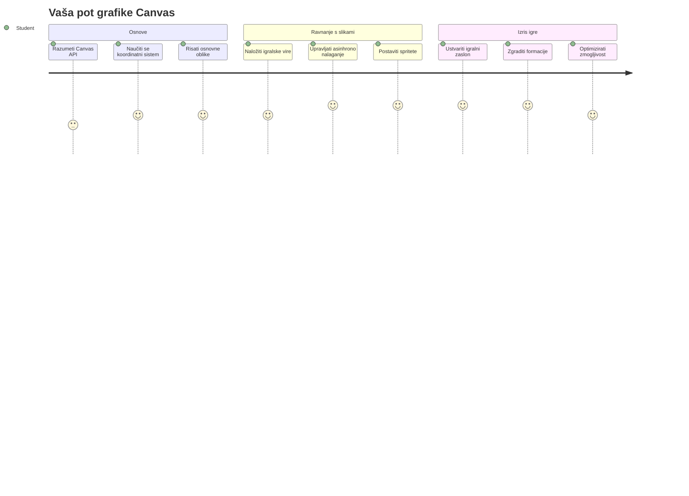
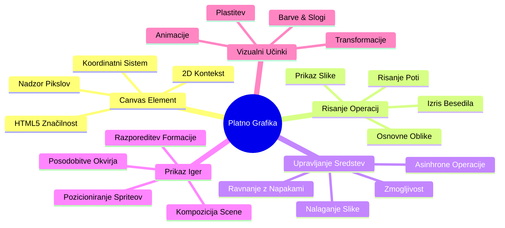
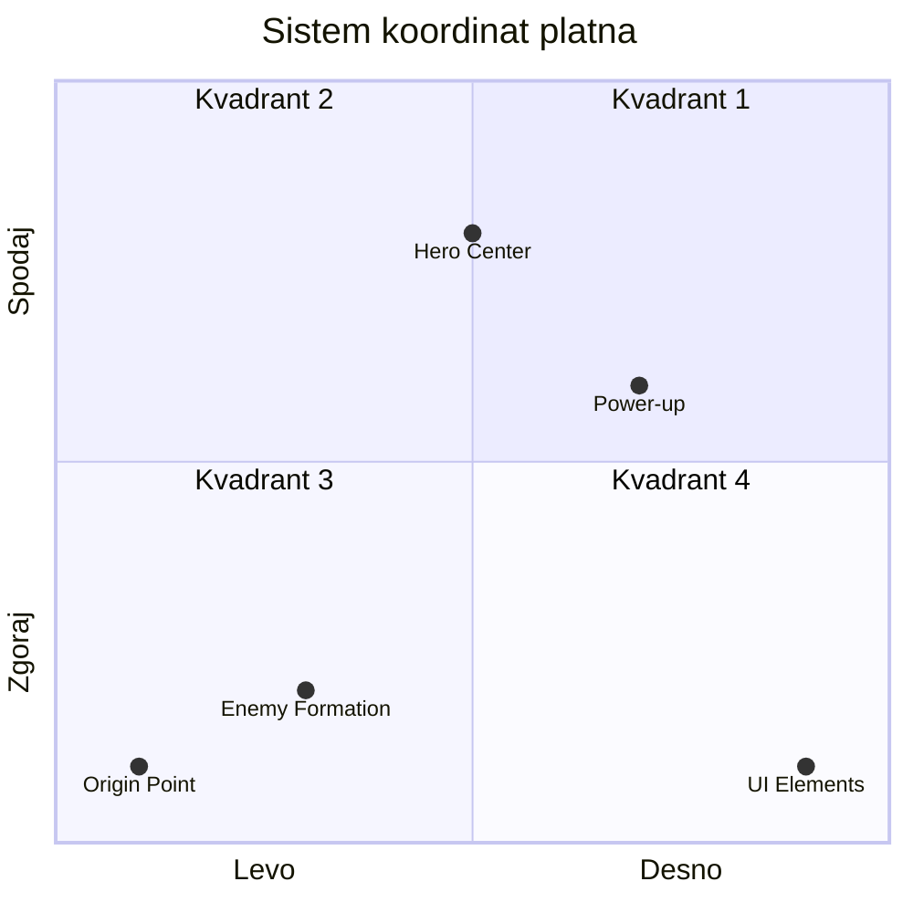
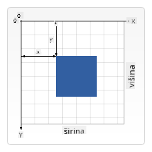
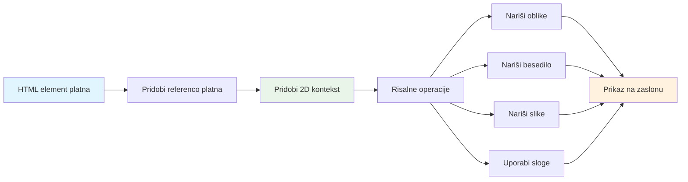
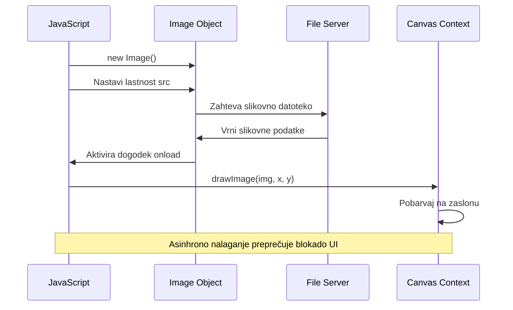
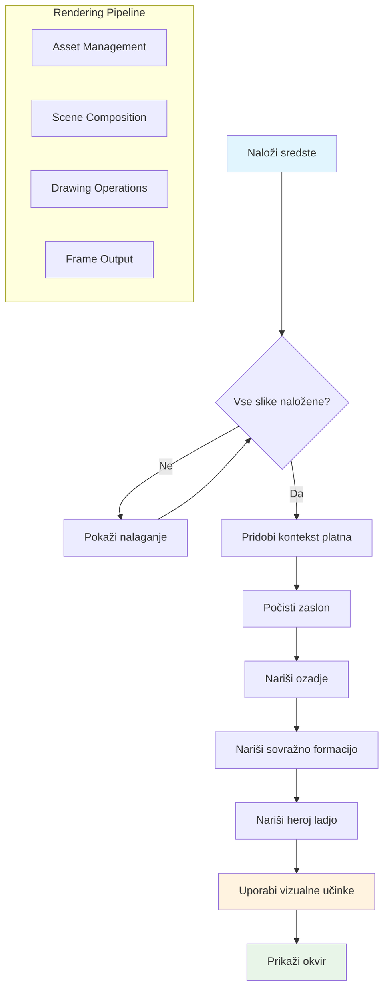
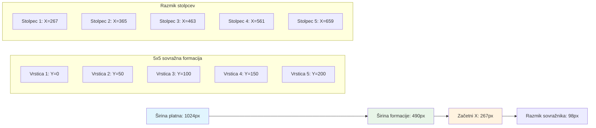
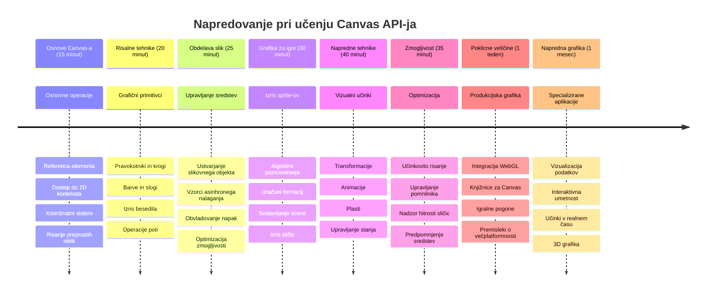

<!--
CO_OP_TRANSLATOR_METADATA:
{
  "original_hash": "7994743c5b21fdcceb36307916ef249a",
  "translation_date": "2026-01-07T10:03:52+00:00",
  "source_file": "6-space-game/2-drawing-to-canvas/README.md",
  "language_code": "sl"
}
-->
# Zgradi vesoljsko igro, del 2: Nariši junaka in pošasti na platno


Canvas API je ena izmed najmočnejših funkcij spletnega razvoja za ustvarjanje dinamičnih, interaktivnih grafičnih vsebin neposredno v vašem brskalniku. V tej lekciji bomo spremenili prazni HTML `<canvas>` element v svet igre, poln junakov in pošasti. Platno si predstavljajte kot svojo digitalno umetniško desko, kjer koda postane vidna.

Nadgrajujemo tisto, kar ste se naučili v prejšnji lekciji, in zdaj se bomo poglobili v vizualne vidike. Naučili se boste, kako naložiti in prikazati igrače sprite, natančno postaviti elemente ter ustvariti vizualno osnovo za vašo vesoljsko igro. To premošča vrzel med statičnimi spletnimi stranmi in dinamičnimi, interaktivnimi izkušnjami.

Na koncu te lekcije boste imeli popolno igrišče s pravilno postavljeno ladjo junaka in sovražnimi formacijami pripravljenimi na boj. Razumeli boste, kako sodobne igre prikazujejo grafiko v brskalnikih in pridobili veščine za ustvarjanje lastnih interaktivnih vizualnih izkušenj. Raziščimo grafiko na platnu in obudimo vašo vesoljsko igro!


## Predpredavanja kviz

[Predpredavanja kviz](https://ff-quizzes.netlify.app/web/quiz/31)

## Platno

Torej, kaj pravzaprav je ta element `<canvas>`? To je HTML5 rešitev za ustvarjanje dinamične grafike in animacij v spletnih brskalnikih. Za razliko od navadnih statičnih slik ali videov platno omogoča nadzor nad vsakim pikslom, ki se prikaže na zaslonu. To ga naredi popolnega za igre, vizualizacije podatkov in interaktivno umetnost. Predstavljajte si ga kot programabilno risalno površino, kjer JavaScript postane vaš čopič.

Privzeto element platna izgleda kot prazen, prozoren pravokotnik na vaši strani. A prav tam se skriva potencial! Njegova prava moč pride na plano, ko z JavaScriptom rišete oblike, nalagate slike, ustvarjate animacije in omogočite odziv na interakcije uporabnikov. To je podobno kot pionirji računalniške grafike iz Bell Labs v šestdesetih letih prejšnjega stoletja, ki so morali programirati vsak piksel, da so ustvarili prve digitalne animacije.

✅ Preberite [več o Canvas API](https://developer.mozilla.org/docs/Web/API/Canvas_API) na MDN.

Tako ga običajno definiramo kot del telesa strani:

```html
<canvas id="myCanvas" width="200" height="100"></canvas>
```

**Kaj ta koda počne:**
- **Nastavi** atribut `id`, da lahko točno na ta element platna sklicujete v JavaScriptu
- **Določi** širino v piksljih, da nadzorujete horizontalno velikost platna
- **Vzpostavi** višino v piksljih, da določite vertikalne dimenzije platna

## Risanje preproste geometrije

Zdaj, ko veste, kaj je element platna, poglejmo, kako na njem dejansko risati! Platno uporablja koordinatni sistem, ki je lahko znan iz matematičnega pouka, vendar obstaja ena pomembna posebnost, ki velja za računalniško grafiko.

Platno uporablja kartezične koordinate z osjo x (vodoravno) in osjo y (navpično) za pozicioniranje vsega, kar rišete. Toda tukaj je ključna razlika: za razliko od matematičnega sistema se izhodišče `(0,0)` začne v zgornjem levem kotu, vrednosti x rastejo v desno, vrednosti y rastejo navzdol. Ta pristop izhaja iz začetkov računalniških zaslonov, kjer so elektronski žarki skenirali od zgoraj navzdol, zato je zgornji levi kot naravna začetna točka.



> Slika iz [MDN](https://developer.mozilla.org/docs/Web/API/Canvas_API/Tutorial/Drawing_shapes)

Za risanje na element platna boste sledili istemu tristožnemu postopku, ki tvori osnovo vse grafike na platnu. Ko to storite nekajkrat, postane druga narava:


1. **Pridobite referenco** na vaš Canvas element iz DOM-a (tako kot za vsak HTML element)
2. **Pridobite 2D kontekst risanja** – ta nudi vse metode za risanje
3. **Začnite risati!** Uporabite vgrajene metode konteksta za ustvarjanje grafike

Tako to izgleda v kodi:

```javascript
// Korak 1: Pridobi element platna
const canvas = document.getElementById("myCanvas");

// Korak 2: Pridobi 2D kontekst risanja
const ctx = canvas.getContext("2d");

// Korak 3: Nastavi barvo polnila in nariši pravokotnik
ctx.fillStyle = 'red';
ctx.fillRect(0, 0, 200, 200); // x, y, širina, višina
```

**Razčlenimo to po korakih:**
- Pridobimo element platna z njegovo ID in ga shranimo v spremenljivko
- Dobimo 2D kontekst risanja – to je naša zbirka orodij za risanje
- Povejemo platnu, da želimo stvari zapolniti z rdečo barvo z lastnostjo `fillStyle`
- Narišemo pravokotnik, ki se začne v zgornjem levem kotu (0,0) in je širok ter visok 200 pikslov

✅ Canvas API se osredotoča predvsem na 2D oblike, ampak lahko tudi rišete 3D elemente na spletno stran; za to lahko uporabite [WebGL API](https://developer.mozilla.org/docs/Web/API/WebGL_API).

Z Canvas API lahko rišete vse vrste stvari, kot so:

- **Geometrijske oblike**, že smo pokazali, kako narisati pravokotnik, ampak je še mnogo več, kar lahko narišete.
- **Besedilo**, lahko narišete besedilo s katerokoli pisavo in barvo, ki jo želite.
- **Slike**, lahko narišete sliko na podlagi slikovne datoteke, kot je .jpg ali .png, na primer.

✅ Poskusite! Znate narisati pravokotnik, ali lahko narišete krog na stran? Oglejte si nekaj zanimivih risb na platnu na CodePen. Tukaj je [še posebej impresiven primer](https://codepen.io/dissimulate/pen/KrAwx).

### 🔄 **Pedagoški pregled**
**Razumevanje osnov platna**: Preden nadaljujete z nalaganjem slik, preverite, da:
- ✅ Razložite, kako se koordinatni sistem platna razlikuje od matematičnega koordinatnega sistema
- ✅ Razumete tristožni postopek risanja na platno
- ✅ Prepoznate, kaj nudi 2D kontekst risanja
- ✅ Opisujete, kako fillStyle in fillRect delujeta skupaj

**Hiter samopreizkus**: Kako bi narisali moder krog na položaju (100, 50) s polmerom 25?
```javascript
ctx.fillStyle = 'blue';
ctx.beginPath();
ctx.arc(100, 50, 25, 0, 2 * Math.PI);
ctx.fill();
```

**Metode risanja na platnu, ki jih zdaj poznate**:
- **fillRect()**: Riše napolnjene pravokotnike
- **fillStyle**: Nastavlja barve in vzorce
- **beginPath()**: Začne nove poti risanja
- **arc()**: Ustvari kroge in krivulje

## Naloži in nariši slikovno sredstvo

Risanje osnovnih oblik je uporabno za začetek, a večina iger potrebuje dejanske slike! Sprite, ozadja in teksture dajejo igram vizualno privlačnost. Nalaganje in prikazovanje slik na platnu deluje drugače kot risanje geometrijskih oblik, ampak je enostavno, ko razumete postopek.

Potrebujemo ustvariti objekt `Image`, naložiti datoteko slike (to se zgodi asinhrono, kar pomeni »v ozadju«) in jo nato narisati na platno, ko je pripravljena. Ta pristop zagotavlja, da se vaše slike pravilno prikažejo, ne da bi blokirale aplikacijo med nalaganjem.


### Osnovno nalaganje slik

```javascript
const img = new Image();
img.src = 'path/to/my/image.png';
img.onload = () => {
  // Slika naložena in pripravljena za uporabo
  console.log('Image loaded successfully!');
};
```

**Kaj se dogaja v tej kodi:**
- Ustvarimo nov objekt Image za naš sprite ali teksturo
- Povežemo ga z izvorno potjo datoteke slike
- Poslušamo dogodek nalaganja, da natančno vemo, kdaj je slika pripravljena za uporabo

### Boljši način nalaganja slik

Tukaj je bolj robusten način za nalaganje slik, ki ga pogosto uporabljajo profesionalni razvijalci. Združimo nalaganje slike v funkcijo, ki se zanaša na Promise – ta pristop, priljubljen z uvedbo JavaScript Promises standarda ES6, naredi vašo kodo bolj organizirano in elegantno obvladuje napake:

```javascript
function loadAsset(path) {
  return new Promise((resolve, reject) => {
    const img = new Image();
    img.src = path;
    img.onload = () => {
      resolve(img);
    };
    img.onerror = () => {
      reject(new Error(`Failed to load image: ${path}`));
    };
  });
}

// Sodobna uporaba z async/await
async function initializeGame() {
  try {
    const heroImg = await loadAsset('hero.png');
    const monsterImg = await loadAsset('monster.png');
    // Slike so zdaj pripravljene za uporabo
  } catch (error) {
    console.error('Failed to load game assets:', error);
  }
}
```

**Kaj smo tukaj naredili:**
- Vse to logiko nalaganja smo zavili v Promise, da jo lažje obvladujemo
- Dodali smo obravnavo napak, ki nam pove, kdaj gre kaj narobe
- Uporabili moderno sintakso async/await, ker je branje kode tako čistejše
- Vključili smo bloka try/catch za elegantno upravljanje morebitnih težav pri nalaganju

Ko so vaše slike naložene, je njihovo risanje na platno pravzaprav precej preprosto:

```javascript
async function renderGameScreen() {
  try {
    // Naloži igralne vire
    const heroImg = await loadAsset('hero.png');
    const monsterImg = await loadAsset('monster.png');

    // Pridobi platno in kontekst
    const canvas = document.getElementById("myCanvas");
    const ctx = canvas.getContext("2d");

    // Nariši slike na določene položaje
    ctx.drawImage(heroImg, canvas.width / 2, canvas.height / 2);
    ctx.drawImage(monsterImg, 0, 0);
  } catch (error) {
    console.error('Failed to render game screen:', error);
  }
}
```

**Pojdimo korak za korakom:**
- Naložimo slike junaka in pošasti v ozadju z await
- Pridobimo element platna in 2D kontekst risanja, ki ga potrebujemo
- Postavimo sliko junaka točno na sredino z nekaj hitro matematično računico
- Sliko pošasti položimo v zgornji levi kot, da začnemo sovražno formacijo
- Ujamemo morebitne napake, ki lahko nastanejo med nalaganjem ali risanjem


## Čas je, da začnete graditi svojo igro

Zdaj bomo vse sestavili skupaj, da ustvarimo vizualno osnovo vaše vesoljske igre. Imate trdno razumevanje osnov platna in tehnik nalaganja slik, zato vas bo ta praktični del vodil skozi izdelavo popolnega igralnega zaslona s pravilno postavljenimi spriti.

### Kaj zgraditi

Zgradili boste spletno stran z elementom Canvas. Prikazal bo črno ozadje velikosti `1024*768`. Zagotovili smo vam dve sliki:

- Ladja junaka

   

- 5×5 pošasti

   

### Priporočeni koraki za začetek razvoja

Poiščite začetne datoteke, ki so bile ustvarjene za vas v podmapi `your-work`. Vaša struktura projekta mora vsebovati:

```bash
your-work/
├── assets/
│   ├── enemyShip.png
│   └── player.png
├── index.html
├── app.js
└── package.json
```

**To imate za delo:**
- **Igralski sprite-i** so v mapi `assets/`, da ostane vse organizirano
- **Vaša glavna HTML datoteka** nastavi element platna in pripravi vse
- **JavaScript datoteka**, kjer boste napisali vse čarovnijo prikaza igre
- **package.json**, ki nastavi razvojni strežnik, da lahko preizkušate lokalno

Odprite to mapo v Visual Studio Code za začetek razvoja. Potrebujete lokalno razvojno okolje z Visual Studio Code, NPM in Node.js. Če nimate `npm` nameščenega na računalniku, [tukaj je navodilo za namestitev](https://www.npmjs.com/get-npm).

Zaženite razvojni strežnik tako, da odprete mapo `your-work`:

```bash
cd your-work
npm start
```

**Ta ukaz naredi nekaj zelo uporabnega:**
- **Zažene** lokalni strežnik na `http://localhost:5000`, da lahko testirate igro
- **Streže** vse vaše datoteke pravilno, da jih brskalnik lahko naloži
- **Nadzoruje** vaše datoteke za spremembe, da lahko nemoteno razvijate
- **Nudi vam** profesionalno razvojno okolje za testiranje

> 💡 **Opomba**: Sprva bo vaš brskalnik prikazal prazno stran – to je pričakovano! Ko dodajate kodo, osvežite brskalnik, da vidite spremembe. Ta iterativni razvojni pristop je podoben načinu, kako je NASA gradila računalnik Apollo za vodenje – testirali so vsak del posebej pred integracijo v sistem.

### Dodajte kodo

Dodajte zahtevano kodo v `your-work/app.js`, da dokončate naslednje naloge:

1. **Nariši platno s črnim ozadjem**
   > 💡 **Tako naredite**: Poiščite TODO v `/app.js` in dodajte le dve vrstici. Nastavite `ctx.fillStyle` na črno, nato uporabite `ctx.fillRect()` z začetkom na (0,0) in dimenzijami platna. Enostavno!

2. **Naložite teksture igre**
   > 💡 **Tako naredite**: Uporabite `await loadAsset()` za nalaganje slik igralca in sovražnika. Shranite jih v spremenljivke, da jih boste lahko pozneje uporabili. Pomnite – slike se ne bodo pokazale, dokler jih ne narišete!

3. **Nariši ladjo junaka na sredino spodaj**
   > 💡 **Tako naredite**: Uporabite `ctx.drawImage()` za pozicioniranje junaka. Za x koordinato uporabite `canvas.width / 2 - 45`, da ga centrirate, za y koordinato pa uporabite `canvas.height - canvas.height / 4`, da ga postavite na spodnji del.

4. **Nariši 5×5 formacijo sovražnih ladij**
   > 💡 **Tako naredite**: Poiščite funkcijo `createEnemies` in postavite gnezdene zanke. Potrebovali boste nekaj matematike za razmike in pozicioniranje, a brez skrbi – pokazal vam bom točno, kako!

Najprej določite konstante za pravilno obliko sovražnikov:

```javascript
const ENEMY_TOTAL = 5;
const ENEMY_SPACING = 98;
const FORMATION_WIDTH = ENEMY_TOTAL * ENEMY_SPACING;
const START_X = (canvas.width - FORMATION_WIDTH) / 2;
const STOP_X = START_X + FORMATION_WIDTH;
```

**Kaj delajo te konstante:**
- Nastavimo 5 sovražnikov na vrstico in 5 po stolpcu (lep 5×5 raster)
- Določimo, koliko prostora damo med sovražnike, da ne bodo stisnjeni
- Izračunamo, kako široka bo cela formacija
- Ugotovimo, kje začeti in končati, da bo formacija videti centrirana


Nato ustvarite gnezdene zanke za risanje sovražne formacije:

```javascript
for (let x = START_X; x < STOP_X; x += ENEMY_SPACING) {
  for (let y = 0; y < 50 * 5; y += 50) {
    ctx.drawImage(enemyImg, x, y);
  }
}
```

**Kaj ta gnezdena zanka počne:**
- Zunanja zanka se premika od leve proti desni čez formacijo
- Notranja zanka gre od vrha navzdol in ustvarja urejene vrstice
- Narišemo vsakega sovražnika na natančnih koordinatah x,y, ki smo jih izračunali
- Vse je enakomerno razporejeno, da izgleda profesionalno in organizirano

### 🔄 **Pedagoški pregled**
**Obvladovanje prikaza igre**: Preverite svoje razumevanje celotnega sistema prikaza:
- ✅ Kako asinhrono nalaganje slik preprečuje blokiranje uporabniškega vmesnika med zagonom igre?
- ✅ Zakaj izračunavamo položaje formacije sovražnikov z uporabo konstant namesto s trdo kodiranimi vrednostmi?
- ✅ Kaj je vloga 2D konteksta risanja pri risarskih operacijah?
- ✅ Kako gnezdene zanke ustvarijo organizirane formacije spritov?

**Upoštevanje zmogljivosti**: Vaša igra sedaj prikazuje:
- **Učinkovito nalaganje sredstev**: Upravljanje slik s pomočjo Promises
- **Organizirano risanje**: Strukturirane operacije risanja
- **Matematično pozicioniranje**: Izračunano postavljanje spritov
- **Upravljanje napak**: Elegantno obvladovanje neuspehov

**Koncepti vizualnega programiranja**: Naučili ste se:
- **Koordinatni sistemi**: Pretvarjanje matematike v pozicije na zaslonu  
- **Upravljanje s podobami**: Nalaganje in prikazovanje grafike igre  
- **Algoritmi formacije**: Matematični vzorci za organizirane razporeditve  
- **Asinhrone operacije**: Sodobni JavaScript za gladko uporabniško izkušnjo  

## Rezultat

Končni rezultat naj bo videti tako:


## Rešitev

Najprej poskusi rešiti sam, če pa se zatakneš, si oglej [rešitev](../../../../6-space-game/2-drawing-to-canvas/solution/app.js)

---

## Izziv GitHub Copilot Agenta 🚀

Uporabi način Agenta za dokončanje naslednjega izziva:

**Opis:** Izboljšaj svoj vesoljski zaslon igre z dodajanjem vizualnih učinkov in interaktivnih elementov s tehnikami Canvas API, ki si jih osvojil.

**Navodilo:** Ustvari novo datoteko `enhanced-canvas.html` s platnom, ki v ozadju prikazuje animirane zvezde, utripajoč zdravje za junaka na ladji in sovražne ladje, ki počasi padajo navzdol. Vključi JavaScript kodo, ki riše utripače zvezde z uporabo naključnih položajev in prosojnosti, implementira zdravje, ki spreminja barvo glede na nivo zdravja (zelena > rumena > rdeča) ter animira sovražne ladje, da se premikajo po zaslonu navzdol z različnimi hitrostmi.

Več o [načinu agent](https://code.visualstudio.com/blogs/2025/02/24/introducing-copilot-agent-mode) si preberi tukaj.

## 🚀 Izziv

Naučil si se risati z 2D-osredotočenim Canvas API; oglej si [WebGL API](https://developer.mozilla.org/docs/Web/API/WebGL_API) in poskusi narisati 3D objekt.

## Kviz po predavanju

[Kviz po predavanju](https://ff-quizzes.netlify.app/web/quiz/32)

## Pregled & Samostojno učenje

Več o Canvas API si preberi na [tej strani](https://developer.mozilla.org/docs/Web/API/Canvas_API).

### ⚡ **Kaj lahko narediš v naslednjih 5 minutah**
- [ ] Odpri konzolo brskalnika in ustvari platno z `document.createElement('canvas')`
- [ ] Poskusi narisati pravokotnik z uporabo `fillRect()` na kontekstu platna
- [ ] Eksperimentiraj z različnimi barvami s pomočjo lastnosti `fillStyle`
- [ ] Nariši preprost krog z metodo `arc()`

### 🎯 **Kaj lahko dosežeš v tem času**
- [ ] Zaključi kviz po lekciji in razumi osnove platna
- [ ] Ustvari aplikacijo za risanje na platnu z več oblikami in barvami
- [ ] Implementiraj nalaganje slik in upodabljanje podob za svojo igro
- [ ] Zgradi preprosto animacijo, ki premika predmete po platnu
- [ ] Vaditi transformacije platna, kot so skaliranje, rotacija in translacija

### 📅 **Tvoj tedenski načrt učenja platna**
- [ ] Dokončaj vesoljsko igro s poliranimi grafikami in animacijami podob
- [ ] Obvladaj napredne tehnike platna, kot so prelivi, vzorci in sloji
- [ ] Ustvari interaktivne vizualizacije z uporabo platna za prikaz podatkov
- [ ] Nauči se tehnik optimizacije platna za gladko delovanje
- [ ] Zgradi risalni ali slikarski program z različnimi orodji
- [ ] Raziskuj ustvarjalne kode in generativno umetnost s platnom

### 🌟 **Tvoj mesečni načrt mojstrstva grafike**
- [ ] Zgradi zahtevne vizualne aplikacije z uporabo Canvas 2D in WebGL
- [ ] Nauči se konceptov grafičnega programiranja in osnov senčilnikov
- [ ] Prispevaj v odprtokodne knjižnice grafike in orodja za vizualizacijo
- [ ] Obvladaj optimizacijo zmogljivosti za grafično intenzivne aplikacije
- [ ] Ustvari izobraževalne vsebine o programiranju platna in računalniški grafiki
- [ ] Postani strokovnjak grafičnega programiranja, ki pomaga drugim ustvarjati vizualne izkušnje

## 🎯 Časovnica tvojega mojstrstva v grafiki s platnem


### 🛠️ Povzetek tvojega nabor orodij za Canvas Graphics

Po zaključku te lekcije imaš zdaj:
- **Obvladovanje Canvas API**: Popolno razumevanje programiranja 2D grafike  
- **Matematika koordinat**: Natančno pozicioniranje in algoritmi razporeditve  
- **Upravljanje sredstev**: Profesionalno nalaganje slik in obvladovanje napak  
- **Renderiranje**: Strukturiran pristop k sestavi scene  
- **Grafika igre**: Pozicioniranje podob in izračuni formacij  
- **Asinhrono programiranje**: Sodobni JavaScript vzorci za gladko delovanje  
- **Vizualno programiranje**: Pretvarjanje matematičnih pojmov v grafiko na zaslonu  

**Praktične uporabe:** Tvoje veščine platna neposredno uporabijo za:  
- **Vizualizacijo podatkov:** Grafikoni, diagrama in interaktivne nadzorne plošče  
- **Razvoj iger:** 2D igre, simulacije in interaktivne izkušnje  
- **Digitalna umetnost:** Ustvarjalno kodiranje in generativni umetniški projekti  
- **Oblikovanje UI/UX:** Prilagojena grafika in interaktivni elementi  
- **Izobraževalna programska oprema:** Vizualna učna orodja in simulacije  
- **Spletne aplikacije:** Dinamična grafika in vizualizacije v realnem času  

**Pridobljene strokovne veščine:** Zdaj lahko:  
- **Zgradiš** prilagojene grafične rešitve brez zunanjih knjižnic  
- **Optimiziraš** zmogljivost upodabljanja za gladko uporabniško izkušnjo  
- **Odpraviš napake** pri kompleksnih vizualnih problemih z orodji za razvijalce v brskalniku  
- **Načrtuješ** razširljive grafične sisteme z matematičnimi načeli  
- **Integriraš** grafiko Canvas z modernimi spletnimi ogrodji  

**Canvas API metode, ki si jih obvladal:**  
- **Upravljanje elementov:** getElementById, getContext  
- **Risarske operacije:** fillRect, drawImage, fillStyle  
- **Nalaganje sredstev:** Objekti Image, vzorci Promise  
- **Matematično pozicioniranje:** Izračuni koordinat, algoritmi formacije  

**Naslednji nivo:** Pripravljen si dodati animacije, uporabniške interakcije, zaznavanje trkov ali raziskovati WebGL za 3D grafiko!

🌟 **Dosežek odkljukano:** Zgradiš celoten sistem za upodabljanje igre z uporabo osnovnih tehnik Canvas API!

## Naloga

[Igraj se z Canvas API](assignment.md)

---

<!-- CO-OP TRANSLATOR DISCLAIMER START -->
**Omejitev odgovornosti**:
Ta dokument je bil preveden z uporabo AI prevajalske storitve [Co-op Translator](https://github.com/Azure/co-op-translator). Čeprav si prizadevamo za natančnost, vas prosimo, da upoštevate, da lahko avtomatizirani prevodi vsebujejo napake ali netočnosti. Izvirni dokument v njegovem maternem jeziku velja za avtoritativni vir. Za ključne informacije priporočamo strokovni človeški prevod. Nismo odgovorni za morebitna nesporazume ali napačne interpretacije, ki izhajajo iz uporabe tega prevoda.
<!-- CO-OP TRANSLATOR DISCLAIMER END -->