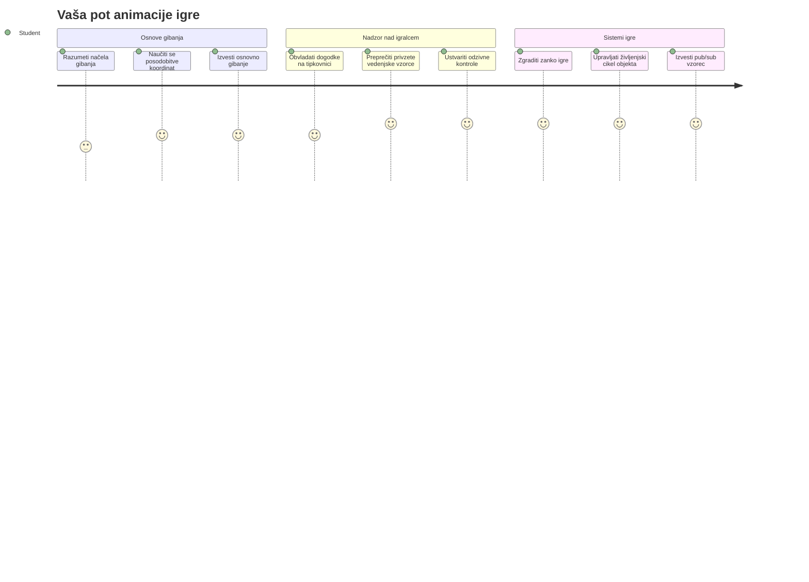
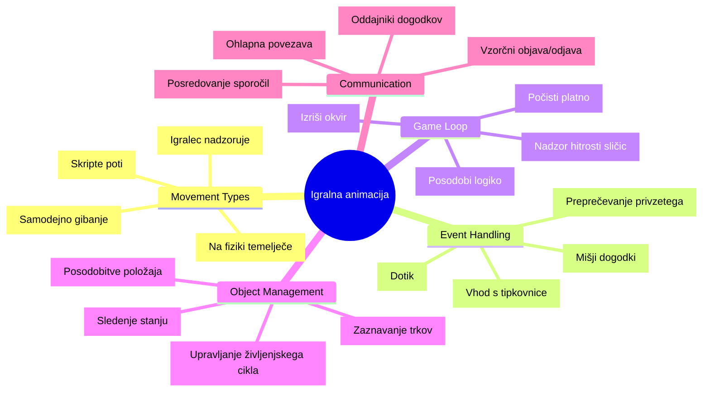
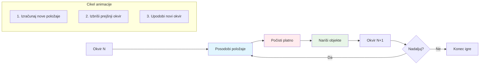
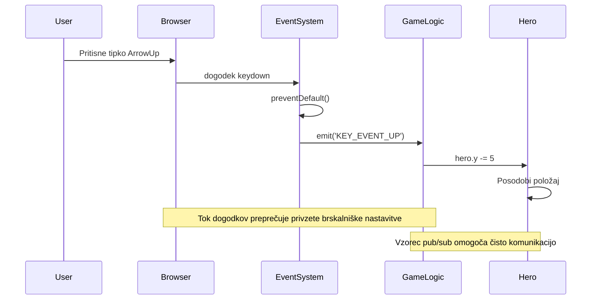
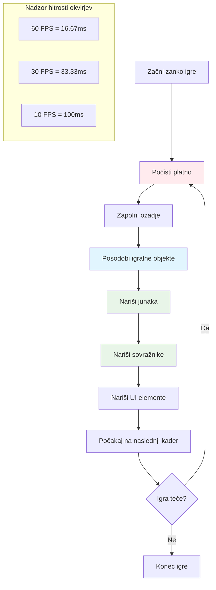
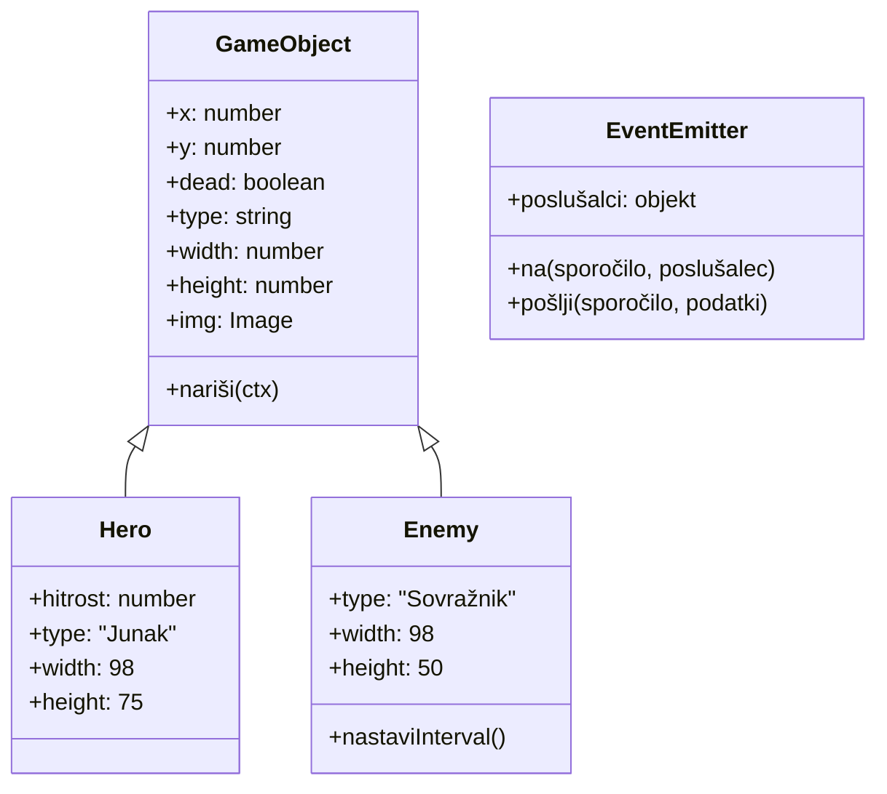
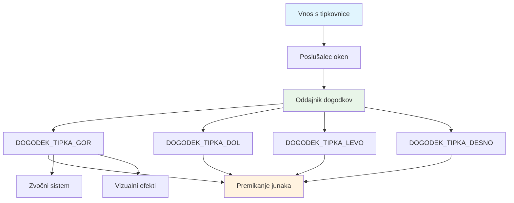
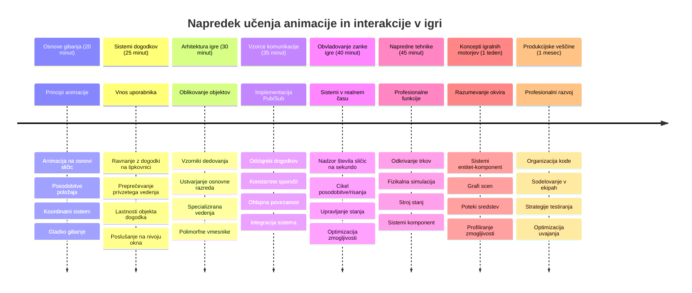

<!--
CO_OP_TRANSLATOR_METADATA:
{
  "original_hash": "8c55a2bd4bc0ebe4c88198fd563a9e09",
  "translation_date": "2026-01-07T10:10:35+00:00",
  "source_file": "6-space-game/3-moving-elements-around/README.md",
  "language_code": "sl"
}
-->
# Sestavi vesoljsko igro, del 3: Dodajanje gibanja


Pomisli na svoje najljubše igre – tisto, kar jih naredi zanimive, niso samo lepe grafike, ampak način, kako se vse premika in odziva na tvoje ukaze. Zdaj je tvoja vesoljska igra kot čudovita slika, vendar bomo zdaj dodali gibanje, ki jo bo oživilo.

Ko so inženirji NASA programirali vodilni računalnik za misije Apollo, so se srečali s podobnim izzivom: kako narediti, da se plovilo odziva na pilotove ukaze, hkrati pa samodejno izvaja korekcije smeri? Načela, ki se jih bomo danes naučili, odmevajo teh istih konceptov – upravljanje gibanja, ki ga obvladuje igralec, skupaj z avtomatskim delovanjem sistema.

V tej lekciji se boš naučil, kako narediti, da vesoljska plovila drsijo po zaslonu, se odzivajo na ukaze igralca in ustvarjajo gladke vzorce gibanja. Vse bomo razdelili na obvladljive koncepte, ki se naravno gradijo drug na drugega.

Do konca boš imel igralce, ki letijo s svojim plovilom po zaslonu, medtem ko sovražna plovila patruljirajo nad njimi. Še pomembneje pa boš razumel osnovna načela, ki poganjajo sisteme gibanja v igrah.


## Predavanje - kviz

[Predavanje - kviz](https://ff-quizzes.netlify.app/web/quiz/33)

## Razumevanje gibanja v igri

Igre oživijo, ko se stvari začnejo premikati, in osnovno obstajata dva načina, kako se to zgodi:

- **Gibanje, ki ga kontrolira igralec**: Ko pritisneš tipko ali klikneš miško, se nekaj premakne. To je neposredna povezava med tabo in svetom igre.
- **Avtomatsko gibanje**: Ko igra sama odloči, da se nekaj premakne – kot tista sovražna plovila, ki morajo patruljirati po zaslonu, ne glede na to, ali nekaj počneš ali ne.

Premikanje predmetov na računalniškem zaslonu je lažje, kot si morda misliš. Se spomniš teh x in y koordinat iz matematike? To je točno tisto, s čimer delamo tukaj. Ko je Galileo leta 1610 spremljal Jupitrove lune, je v bistvu delal isto – risal položaje skozi čas, da bi razumel vzorce gibanja.

Premikanje stvari po zaslonu je kot ustvarjanje flipbook animacije – moraš slediti tem trem preprostim korakom:


1. **Posodobi položaj** – Spremeni, kje naj bo tvoj predmet (morda ga premakni za 5 pikslov desno)
2. **Izbriši prejšnji okvir** – Počisti zaslon, da ne vidiš pošasti sledi povsod
3. **Nariši nov okvir** – Postavi predmet na novo mesto

Če to počneš dovolj hitro, bum! Dobiš gladko gibanje, ki igralcem deluje naravno.

Tako izgleda v kodi:

```javascript
// Nastavi lokacijo junaka
hero.x += 5;
// Počisti pravokotnik, kjer je junak
ctx.clearRect(0, 0, canvas.width, canvas.height);
// Znova nariši ozadje igre in junaka
ctx.fillRect(0, 0, canvas.width, canvas.height);
ctx.fillStyle = "black";
ctx.drawImage(heroImg, hero.x, hero.y);
```

**Tako ta koda deluje:**
- **Posodobi** x-koordinato junaka za 5 pikslov, da ga premakne vodoravno
- **Počisti** celotno površino platna, da odstrani prejšnji okvir
- **Napolni** platno s črno barvo ozadja
- **Nariše** sliko junaka na njegovi novi lokaciji

✅ Se ti poraja razlog, zakaj bi lahko risanje junaka večkrat na sekundo povzročalo stroške glede zmogljivosti? Preberi o [alternativah temu vzorcu](https://developer.mozilla.org/en-US/docs/Web/API/Canvas_API/Tutorial/Optimizing_canvas).

## Upravljanje dogodkov na tipkovnici

Tu povezujemo ukaze igralca z dejanji v igri. Ko nekdo pritisne preslednico za izstrelitev laserja ali tapne puščično tipko za izogib asteroidu, mora tvoja igra zaznati in se odzvati na ta ukaz.

Dogodki na tipkovnici se zgodijo na ravni okna, kar pomeni, da tvoj celoten brskalnikov zaslon posluša te pritiske tipk. Klik miške pa je mogoče vezati na določene elemente (kot klik na gumb). Za našo vesoljsko igro se bomo osredotočili na kontrole z tipkovnico, saj lahko tako igralcem ponudimo tisti klasični arkadni občutek.

To me spominja na telegrafske operaterje v 1800-ih, ki so morali pretvarjati morski kod v smiselna sporočila – počnemo nekaj podobnega, pretvarjamo pritiske tipk v ukaze igre.

Za upravljanje dogodka uporabi metodo `addEventListener()` okna in ji podaj dva vhodna parametra. Prvi parameter je ime dogodka, na primer `keyup`. Drugi parameter je funkcija, ki naj se sproži kot posledica dogodka.

Tukaj je primer:

```javascript
window.addEventListener('keyup', (evt) => {
  // evt.key = nizovna reprezentacija tipke
  if (evt.key === 'ArrowUp') {
    // naredi nekaj
  }
});
```

**Razčlenitev, kaj se tukaj zgodi:**
- **Posluša** dogodke na tipkovnici na celotnem oknu
- **Zajame** objekt dogodka, ki vsebuje informacije, katera tipka je bila pritisnjena
- **Preveri**, ali pritisnjena tipka ustreza določeni (v tem primeru puščici gor)
- **Izvede** kodo, ko je pogoj izpolnjen

Za dogodke tipkovnice obstajata dve lastnosti objekta dogodka, s katerima lahko preveriš, katera tipka je bila pritisnjena:

- `key` - to je nizovni prikaz pritisnjene tipke, na primer `'ArrowUp'`
- `keyCode` - to je številčni prikaz, na primer `37`, ki ustreza `ArrowLeft`

✅ Manipulacija dogodkov tipkovnice je koristna tudi izven razvoja iger. Kateri drugi uporabi te tehnike lahko pojmujete?


### Posebne tipke: opozorilo!

Nekatere tipke imajo vgrajena vedenja brskalnika, ki lahko motijo tvojo igro. Puščice rolajo stran, preslednica pa skoči navzdol – vedenje, ki ga ne želiš, ko nekdo pilotira svoje vesoljsko plovilo.

Lahko preprečimo ta privzeta vedenja in dovolimo naši igri, da namesto tega obravnava vhod. To je podobno, kot so zgodnji programerji morali preklicati sistemske prekinitve, da so ustvarili lastna vedenja – mi to počnemo na ravni brskalnika. Tako:

```javascript
const onKeyDown = function (e) {
  console.log(e.keyCode);
  switch (e.keyCode) {
    case 37:
    case 39:
    case 38:
    case 40: // Puščične tipke
    case 32:
      e.preventDefault();
      break; // Presledek
    default:
      break; // ne blokiraj drugih tipk
  }
};

window.addEventListener('keydown', onKeyDown);
```

**Razumevanje te kode za preprečevanje:**
- **Preveri** posebne kode tipk, ki bi lahko povzročile nezaželeno vedenje brskalnika
- **Prepreči** privzeto dejanje brskalnika za puščice in preslednico
- **Dovoli** drugim tipkam, da delujejo normalno
- **Uporabi** `e.preventDefault()`, da ustavi vgrajeno vedenje brskalnika

### 🔄 **Pedagoška kontrola**
**Razumevanje upravljanja dogodkov**: Preden nadaljujemo z avtomatskim gibanjem, poskrbi, da lahko:
- ✅ Razložiš razliko med dogodkoma `keydown` in `keyup`
- ✅ Razumeš, zakaj preprečujemo privzeta vedenja brskalnika
- ✅ Opisuješ, kako dogodkovni poslušalci povezujejo uporabniški vhod z logiko igre
- ✅ Prepoznaš, katere tipke lahko motijo kontrole igre

**Hiter samopreizkus**: Kaj bi se zgodilo, če ne bi preprečil privzetega vedenja za puščice?
*Odgovor: Brskalnik bi pomikal stran, kar bi motilo gibanje v igri*

**Arhitektura dogodkovnega sistema**: Zdaj razumeš:
- **Poslušanje na ravni okna**: Zajemanje dogodkov na ravni brskalnika
- **Lastnosti objekta dogodka**: nizi `key` proti številkam `keyCode`
- **Preprečevanje privzetega**: Ustavljanje nezaželenih vedenj brskalnika
- **Pogojna logika**: Odzivanje na posebne kombinacije tipk

## Gibanje, ki ga povzroči igra

Zdaj govorimo o predmetih, ki se premikajo brez ukazov igralca. Pomisli na sovražne ladje, ki plujejo preko zaslona, krogle, ki letijo v ravnih linijah, ali oblake, ki se pomikajo v ozadju. To avtonomno gibanje daje tvojemu svetu igre občutek življenja, tudi ko nihče ne upravlja kontrol.

Uporabljamo vgrajene JavaScript štoparice za redno posodabljanje položajev. Ta koncept je podoben kot delovanje nihajnih ur – redni mehanizem, ki sproža poenotene in časovno določene aktivnosti. Tako enostavno je:

```javascript
const id = setInterval(() => {
  // Premaknite sovražnika po osi y
  enemy.y += 10;
}, 100);
```

**Tako ta koda za gibanje deluje:**
- **Ustvari** časovnik, ki teče vsakih 100 milisekund
- **Posodobi** y-koordinato sovražnika za 10 pikslov vsakokrat
- **Shrani** ID intervala, da ga lahko po potrebi ustavimo kasneje
- **Samodejno premakne** sovražnika navzdol po zaslonu

## Zanka igre

Tu je koncept, ki vse poveže skupaj – zanka igre. Če bi bila tvoja igra film, bi bila zanka igre projektor filma, ki prikazuje sličico za sličico tako hitro, da vse deluje kot gladko gibanje.

Vsaka igra ima takšno zanko, ki teče v ozadju. Je funkcija, ki posodablja vse predmete v igri, znova riše zaslon in ta proces ponavlja neprekinjeno. Tako sledimo za tvojim junakom, vsemi sovražniki, laserji, ki letijo okoli – celotnemu stanju igre.

Ta koncept me spominja, kako so zgodnji filmski animatorji kot Walt Disney morali risati like sličico za sličico, da so ustvarili iluzijo gibanja. Mi počnemo isto, samo da namesto s svinčniki uporabljamo kodo.

Tako običajno izgleda zanka igre, izražena v kodi:


```javascript
const gameLoopId = setInterval(() => {
  function gameLoop() {
    ctx.clearRect(0, 0, canvas.width, canvas.height);
    ctx.fillStyle = "black";
    ctx.fillRect(0, 0, canvas.width, canvas.height);
    drawHero();
    drawEnemies();
    drawStaticObjects();
  }
  gameLoop();
}, 200);
```

**Razumevanje strukture zanke igre:**
- **Počisti** celotno platno, da odstrani prejšnji okvir
- **Napolni** ozadje z enobarvno barvo
- **Nariše** vse predmete igre na njihovih trenutnih položajih
- **Ponovi** postopek vsakih 200 milisekund, da ustvari gladko animacijo
- **Upravljaj** hitrost sličic z nadzorom intervala

## Nadaljujmo vesoljsko igro

Zdaj bomo dodali gibanje statični sceni, ki si jo ustvaril prej. Pretvorili jo bomo iz zaslonske slike v interaktivno izkušnjo. Delali bomo korak za korakom, da bo vsak kos naravno nudil ugodje za naslednjega.

Vzemi kodo iz tam, kjer smo končali v prejšnji lekciji (ali začni s kodo v mapi [Part II- starter](../../../../6-space-game/3-moving-elements-around/your-work), če potrebuješ svež začetek).

**Tukaj je, kaj danes gradimo:**
- **Kontrola junaka**: Puščične tipke bodo pilotirale tvoje vesoljsko plovilo po zaslonu
- **Gibanje sovražnika**: Tista tuja plovila bodo začela svoj napad

Začnimo z izvajanjem teh funkcij.

## Priporočeni koraki

Poišči datoteke, ki so bile ustvarjene zate v podmapi `your-work`. Morala bi vsebovati naslednje:

```bash
-| assets
  -| enemyShip.png
  -| player.png
-| index.html
-| app.js
-| package.json
```

Projekt začneš v mapi `your-work` tako, da vtipkaš:

```bash
cd your-work
npm start
```

**Kaj ta ukaz naredi:**
- **Se premakne** v tvoj projektni imenik
- **Zažene** HTTP strežnik na naslovu `http://localhost:5000`
- **Postreže** tvoje igralne datoteke, da jih lahko preizkusiš v brskalniku

Zgoraj omenjeni ukaz bo zagnal HTTP strežnik na naslovu `http://localhost:5000`. Odpri brskalnik in vneseš ta naslov; trenutno bi moral prikazati junaka in vse sovražnike; nič še ne giblje – še!

### Dodaj kodo

1. **Dodaj namensko** objekta `hero` in `enemy` in `game object`, ki morajo imeti lastnosti `x` in `y`. (Spomni se poglavja o [Dediščini ali kompoziciji](../README.md)).

   *NAMIG* `game object` je tisti z `x` in `y` in z možnostjo risanja samega sebe na platno.

   > **Namig**: Začni z dodajanjem nove klase `GameObject` z spodaj opredeljenim konstruktorjem in nato jo nariši na platno:

    ```javascript
    class GameObject {
      constructor(x, y) {
        this.x = x;
        this.y = y;
        this.dead = false;
        this.type = "";
        this.width = 0;
        this.height = 0;
        this.img = undefined;
      }
    
      draw(ctx) {
        ctx.drawImage(this.img, this.x, this.y, this.width, this.height);
      }
    }
    ```

    **Razumevanje te osnovne klase:**
    - **Določa** skupne lastnosti, ki jih imajo vsi predmeti igre (položaj, velikost, slika)
    - **Vključuje** zastavico `dead`, da spremlja, ali je predmet treba odstraniti
    - **Ponudi** metodo `draw()`, ki zgradi predmet na platnu
    - **Nastavi** privzete vrednosti za vse lastnosti, ki jih lahko otroške razrede prekrijejo


    Zdaj podaljšaj ta `GameObject` za ustvarjanje `Hero` in `Enemy`:
    
    ```javascript
    class Hero extends GameObject {
      constructor(x, y) {
        super(x, y);
        this.width = 98;
        this.height = 75;
        this.type = "Hero";
        this.speed = 5;
      }
    }
    ```

    ```javascript
    class Enemy extends GameObject {
      constructor(x, y) {
        super(x, y);
        this.width = 98;
        this.height = 50;
        this.type = "Enemy";
        const id = setInterval(() => {
          if (this.y < canvas.height - this.height) {
            this.y += 5;
          } else {
            console.log('Stopped at', this.y);
            clearInterval(id);
          }
        }, 300);
      }
    }
    ```

    **Ključni pojmi v teh razredih:**
    - **Dediči** iz `GameObject` z uporabo ključne besede `extends`
    - **Pokliče** konstruktor nadrejene z `super(x, y)`
    - **Nastavi** posebne dimenzije in lastnosti za vsak tip objekta
    - **Izvede** avtomatsko gibanje sovražnikov z uporabo `setInterval()`

2. **Dodaj upravljalce dogodkov tipk** za navigacijo po tipkah (premik junaka gor/dol levo/desno)

   *SPOMNI SE*, da gre za kartezični sistem, zgornji levi kot je `0,0`. Prav tako ne pozabi dodati kode za ustavitev *privzetega vedenja*

   > **Namig**: Ustvari svojo funkcijo `onKeyDown` in jo pripni na okno:

   ```javascript
   const onKeyDown = function (e) {
     console.log(e.keyCode);
     // Dodajte kodo iz zgornje lekcije, da preprečite privzeto vedenje
     switch (e.keyCode) {
       case 37:
       case 39:
       case 38:
       case 40: // Puščične tipke
       case 32:
         e.preventDefault();
         break; // Preslednica
       default:
         break; // ne blokirajte drugih tipk
     }
   };

   window.addEventListener("keydown", onKeyDown);
   ```
    
   **Kaj ta upravljalec dogodkov počne:**
   - **Posluša** dogodke `keydown` na celotnem oknu
   - **Zabeleži** kodo tipke za lažje odpravljanje napak pri pritisnjenih tipkah
   - **Preprečuje** privzeto vedenje brskalnika za puščice in preslednico
   - **Dovoili** drugim tipkam, da delujejo normalno
   
   Preveri svoj brskalnikov konzolo zdaj in opazuj zabeležene pritiske tipk.

3. **Izvedi** [Pub sub vzorec](../README.md), ki bo ohranil čisto kodo, ko boš sledil preostalim delom.

   Publish-Subscribe vzorec pomaga organizirati kodo z ločevanjem zaznavanja dogodkov od njihove obdelave. To naredi kodo bolj modularno in lažje vzdrževano.

   Za ta zadnji del lahko:

   1. **Dodaj dogodek poslušalec** na oknu:

       ```javascript
       window.addEventListener("keyup", (evt) => {
         if (evt.key === "ArrowUp") {
           eventEmitter.emit(Messages.KEY_EVENT_UP);
         } else if (evt.key === "ArrowDown") {
           eventEmitter.emit(Messages.KEY_EVENT_DOWN);
         } else if (evt.key === "ArrowLeft") {
           eventEmitter.emit(Messages.KEY_EVENT_LEFT);
         } else if (evt.key === "ArrowRight") {
           eventEmitter.emit(Messages.KEY_EVENT_RIGHT);
         }
       });
       ```

   **Kaj ta sistem dogodkov počne:**
   - **Zazna** tipkovni vhod in ga pretvori v prilagojene dogodke igre
   - **Loči** zaznavanje vhoda od logike igre
   - **Omogoča** enostavno spreminjanje kontrol pozneje brez vpliva na kodo igre
   - **Dovoli** več sistemom, da se odzovejo na isti vhod


   2. **Ustvari razred EventEmitter** za objavo in naročanje sporočil:

       ```javascript
       class EventEmitter {
         constructor() {
           this.listeners = {};
         }
       
         on(message, listener) {
           if (!this.listeners[message]) {
             this.listeners[message] = [];
           }
           this.listeners[message].push(listener);
         }
       
   3. **Dodaj konstante** in pripravi EventEmitter:

       ```javascript
       const Messages = {
         KEY_EVENT_UP: "KEY_EVENT_UP",
         KEY_EVENT_DOWN: "KEY_EVENT_DOWN",
         KEY_EVENT_LEFT: "KEY_EVENT_LEFT",
         KEY_EVENT_RIGHT: "KEY_EVENT_RIGHT",
       };
       
       let heroImg, 
           enemyImg, 
           laserImg,
           canvas, ctx, 
           gameObjects = [], 
           hero, 
           eventEmitter = new EventEmitter();
       ```

   **Razumevanje nastavitve:**
   - **Določa** konstante sporočil, da se izogneš tipkarskim napakam in olajšaš refaktoriranje
   - **Deklarira** spremenljivke za slike, kontekst platna in stanje igre
   - **Ustvari** globalnega emitterja dogodkov za pub-sub sistem
   - **Inicializira** polje za shranjevanje vseh igralnih objektov

   4. **Inicializiraj igro**

       ```javascript
       function initGame() {
         gameObjects = [];
         createEnemies();
         createHero();
       
         eventEmitter.on(Messages.KEY_EVENT_UP, () => {
           hero.y -= 5;
         });
       
         eventEmitter.on(Messages.KEY_EVENT_DOWN, () => {
           hero.y += 5;
         });
       
         eventEmitter.on(Messages.KEY_EVENT_LEFT, () => {
           hero.x -= 5;
         });
       
4. **Nastavi zanko igre**

   Prenovite funkcijo `window.onload`, da inicializira igro in nastavi zanko igre na ustreznem intervalu. Dodali boste tudi laserski žarek:

    ```javascript
    window.onload = async () => {
      canvas = document.getElementById("canvas");
      ctx = canvas.getContext("2d");
      heroImg = await loadTexture("assets/player.png");
      enemyImg = await loadTexture("assets/enemyShip.png");
      laserImg = await loadTexture("assets/laserRed.png");
    
      initGame();
      const gameLoopId = setInterval(() => {
        ctx.clearRect(0, 0, canvas.width, canvas.height);
        ctx.fillStyle = "black";
        ctx.fillRect(0, 0, canvas.width, canvas.height);
        drawGameObjects(ctx);
      }, 100);
    };
    ```

   **Razumevanje nastavitve igre:**
   - **Čaka**, da se stran popolnoma naloži pred začetkom
   - **Pridobi** element canvas in njegov 2D kontekst za risanje
   - **Naloži** vse slikovne vire asinhrono z uporabo `await`
   - **Zažene** zanko igre z intervalom 100 ms (10 FPS)
   - **Počisti** in ponovno nariše celoten zaslon vsako sličico

5. **Dodaj kodo** za premikanje sovražnikov v določenih intervalih

    Prenovite funkcijo `createEnemies()` za ustvarjanje sovražnikov in jih dodajte v nov razred gameObjects:

    ```javascript
    function createEnemies() {
      const MONSTER_TOTAL = 5;
      const MONSTER_WIDTH = MONSTER_TOTAL * 98;
      const START_X = (canvas.width - MONSTER_WIDTH) / 2;
      const STOP_X = START_X + MONSTER_WIDTH;
    
      for (let x = START_X; x < STOP_X; x += 98) {
        for (let y = 0; y < 50 * 5; y += 50) {
          const enemy = new Enemy(x, y);
          enemy.img = enemyImg;
          gameObjects.push(enemy);
        }
      }
    }
    ```

    **Kaj počne ustvarjanje sovražnikov:**
    - **Izračuna** položaje za centriranje sovražnikov na zaslonu
    - **Ustvari** mrežo sovražnikov z uporabo gnezdenih zank
    - **Dodeli** sliko sovražnika vsakemu sovražniku
    - **Doda** vsakega sovražnika v globalno polje igralnih objektov
    
    in dodajte funkcijo `createHero()`, ki opravi podoben postopek za heroja.
    
    ```javascript
    function createHero() {
      hero = new Hero(
        canvas.width / 2 - 45,
        canvas.height - canvas.height / 4
      );
      hero.img = heroImg;
      gameObjects.push(hero);
    }
    ```

    **Kaj počne ustvarjanje heroja:**
    - **Postavi** heroja na spodnji sredini zaslona
    - **Dodeli** sliko heroju
    - **Doda** heroja v polje igralnih objektov za risanje

    in nazadnje dodajte funkcijo `drawGameObjects()` za začetek risanja:

    ```javascript
    function drawGameObjects(ctx) {
      gameObjects.forEach(go => go.draw(ctx));
    }
    ```

    **Razumevanje risalne funkcije:**
    - **Iterira** skozi vse igralne objekte v polju
    - **Pokliče** metodo `draw()` vsakega objekta
    - **Posreduje** kontekst canvas, da se objekti lahko narišejo sami

    ### 🔄 **Pedagoški pregled**
    **Celostno razumevanje sistema igre**: Preverite svoje znanje celotne arhitekture:
    - ✅ Kako dedovanje omogoča Heroju in Enemyju skupne lastnosti GameObjecta?
    - ✅ Zakaj model pub/sub naredi vašo kodo bolj vzdržljivo?
    - ✅ Kakšno vlogo ima zanka igre pri ustvarjanju gladke animacije?
    - ✅ Kako dogodkovni poslušalci povezujejo uporabniški vnos z vedenjem igralnih objektov?

    **Integracija sistema**: Vaša igra zdaj prikazuje:
    - **Objektno usmerjen dizajn**: Osnovni razredi z specializiranim dedovanjem
    - **Dogodkovno vodeno arhitekturo**: Model pub/sub za ohlapno povezavo
    - **Animacijski okvir**: Zanko igre z doslednimi osvežitvami sličic
    - **Obravnavo vnosa**: Dogodke tipkovnice z zaviranjem privzetega vedenja
    - **Upravljanje virov**: Nalaganje slik in risanje sprite-ov

    **Profesionalni vzorci**: Implementirali ste:
    - **Ločevanje skrbi**: Ločena logika igre in risanje
    - **Polimorfizem**: Vsi igralni objekti imajo skupni risalni vmesnik
    - **Prenos sporočil**: Čista komunikacija med komponentami
    - **Upravljanje virov**: Učinkovito upravljanje sprite-ov in animacij

    Vaši sovražniki naj začnejo napredovati proti vašemu herojski vesoljski ladji!
      }
    }
    ```
    
    and add a `createHero()` function to do a similar process for the hero.
    
    ```javascript
    function createHero() {
      hero = new Hero(
        canvas.width / 2 - 45,
        canvas.height - canvas.height / 4
      );
      hero.img = heroImg;
      gameObjects.push(hero);
    }
    ```

    in nazadnje dodajte funkcijo `drawGameObjects()` za začetek risanja:

    ```javascript
    function drawGameObjects(ctx) {
      gameObjects.forEach(go => go.draw(ctx));
    }
    ```

    Vaši sovražniki naj začnejo napredovati proti vašemu herojski vesoljski ladji!

---

## Izziv GitHub Copilot Agent 🚀

Tukaj je izziv, ki bo izboljšal dovršenost vaše igre: dodajanje mej in gladkih kontrol. Trenutno lahko vaš junak zapusti zaslon, gibanje pa je lahko neenakomerno.

**Vaša naloga:** Naredite, da se vaša vesoljska ladja zdi bolj realistična z implementacijo zaslonskih mej in tekočega gibanja. To je podobno sistemom NASA za nadzor letenja, ki preprečujejo, da bi vesoljske ladje presegle varne delovne parametre.

**Kaj morate zgraditi:** Ustvarite sistem, ki bo držal junaka na zaslonu in naredite krmiljenje gladko. Ko igralci držijo puščično tipko, naj ladja drsi neprekinjeno namesto, da se premika v diskretnih korakih. Razmislite o dodajanju vizualne povratne informacije, ko ladja doseže rob zaslona – morda diskreten učinek, ki nakazuje rob igralnega območja.

Več o [agent mode](https://code.visualstudio.com/blogs/2025/02/24/introducing-copilot-agent-mode) si preberite tukaj.

## 🚀 Izziv

Organizacija kode postaja vse pomembnejša, ko projekti rastejo. Morda ste opazili, da je vaša datoteka polna funkcij, spremenljivk in razredov zmešanih skupaj. Spominja me na inženirje, ki so organizirali kodo za Apollonovo misijo in morali ustvariti jasne, vzdržljive sisteme, na katerih so lahko sočasno delale več skupin.

**Vaša naloga:**
Razmišljajte kot programski arhitekt. Kako bi organizirali svojo kodo, da bi jo lahko čez šest mesecev vi (ali sodelavec) razumeli? Tudi če vse ostane v eni datoteki, lahko ustvarite boljšo organizacijo:

- **Skupinjenje sorodnih funkcij** skupaj pod jasnimi komentarji
- **Ločevanje skrbi** – ločite logiko igre od risanja
- **Uporaba konsistentnih imen** za spremenljivke in funkcije
- **Ustvarjanje modulov** ali imenikov za organizacijo različnih delov igre
- **Dodajanje dokumentacije**, ki pojasnjuje namen posameznih večjih delov

**Vprašanja za razmislek:**
- Kateri deli vaše kode so najtežji za razumevanje, ko se k njej vrnete?
- Kako bi lahko organizirali kodo, da bi nekomu drugemu olajšali prispevanje?
- Kaj bi se zgodilo, če bi želeli dodati nove funkcije, kot so power-upi ali različne vrste sovražnikov?

## Kvizi po predavanju

[Post-lecture quiz](https://ff-quizzes.netlify.app/web/quiz/34)

## Pregled in samostojno učenje

Gradili smo vse od začetka, kar je odlično za učenje, ampak tukaj je majhna skrivnost – obstajajo odlični JavaScript ogrodja, ki lahko opravijo veliko težkega dela za vas. Ko se boste počutili udobno z osnovami, ki smo jih pokrili, je vredno [raziskati, kaj je na voljo](https://github.com/collections/javascript-game-engines).

Ogrodja si lahko predstavljate kot dobro založen set orodij, namesto da bi vsako orodje izdelali sami. Rešujejo mnoge izzive pri organizaciji kode, ki smo jih omenili, pa tudi ponujajo funkcionalnosti, ki bi vam vzemale tedne dela.

**Stvari, ki jih je vredno raziskati:**
- Kako igre razporejajo kodo – navdušili se boste nad domiselnimi vzorci
- Triki za izboljšanje zmogljivosti, da igre na canvasu tečejo gladko  
- Sodobne JavaScript funkcionalnosti, ki lahko vašo kodo naredijo čistejšo in bolj vzdržljivo
- Različni pristopi k upravljanju igralnih objektov in njihovih odnosov

## 🎯 Vaš časovni načrt obvladovanja animacije igre


### 🛠️ Povzetek vašega kompleta orodij za razvoj iger

Po končanju te lekcije ste osvojili:
- **Principi animacije**: Gibanje na sličice in gladke prehode
- **Dogodkovno vodeno programiranje**: Obvladovanje vnosa s tipkovnice z ustreznim upravljanjem dogodkov
- **Objektno usmerjen dizajn**: Dedovanje in polimorfni vmesniki
- **Vzorce komunikacije**: Arhitektura pub/sub za vzdržljivo kodo
- **Arhitektura zanke igre**: Realno-časovni cikel posodobitev in risanja
- **Sistemi vnosa**: Preslikava uporabniškega nadzora s preprečevanjem privzetega vedenja
- **Upravljanje virov**: Nalaganje sprite-ov in učinkovite risalne tehnike

### ⚡ **Kaj lahko naredite v naslednjih 5 minutah**
- [ ] Odprite konzolo brskalnika in poskusite `addEventListener('keydown', console.log)` za spremljanje dogodkov tipkovnice
- [ ] Ustvarite preprost div element in ga premikajte z uporabo puščičnih tipk
- [ ] Preizkusite `setInterval` za ustvarjanje neprekinjenega gibanja
- [ ] Poskusite preprečiti privzeto vedenje z `event.preventDefault()`

### 🎯 **Kaj lahko dosežete v naslednji uri**
- [ ] Dokončajte kviz po lekciji in razumite dogodkovno programiranje
- [ ] Ustvarite premikajočo se heroj vesoljsko ladjo z popolnim upravljanjem s tipkovnico
- [ ] Implementirajte gladke vzorce gibanja sovražnikov
- [ ] Dodajte meje, da preprečite, da bi igralni objekti zapustili zaslon
- [ ] Ustvarite osnovno zaznavanje trkov med igralnimi objekti

### 📅 **Vaša tedenska animacijska potovanja**
- [ ] Dokončajte celotno vesoljsko igro z dovršenim gibanjem in interakcijami
- [ ] Dodajte napredne vzorce gibanja, kot so krivulje, pospeševanja in fizika
- [ ] Implementirajte gladke prehode in funkcije omiljevanja
- [ ] Ustvarite učinke delcev in sisteme vizualne povratne informacije
- [ ] Optimizirajte delovanje igre za gladkih 60fps
- [ ] Dodajte mobilne dotik upravljalnike in odziven dizajn

### 🌟 **Vaš mesečni interaktivni razvoj**
- [ ] Zgradite kompleksne interaktivne aplikacije z naprednimi animacijskimi sistemi
- [ ] Naučite se animacijskih knjižnic, kot je GSAP, ali pa ustvarite svoj animacijski motor
- [ ] Prispevajte k odprtokodnim igram in animacijskim projektom
- [ ] Obvladajte optimizacijo zmogljivosti za grafično zahtevne aplikacije
- [ ] Ustvarjajte izobraževalne vsebine o razvoju iger in animaciji
- [ ] Zgradite portfelj, ki prikazuje napredno interaktivno programiranje

**Uporaba v resničnem svetu**: Vaše spretnosti animacije iger so primerne za:
- **Interaktivne spletne aplikacije**: Dinamični nadzorni plošči in vmesniki v realnem času
- **Vizualizacijo podatkov**: Animirani grafi in interaktivna grafika
- **Izobraževalno programsko opremo**: Interaktivne simulacije in učna orodja
- **Mobilni razvoj**: Igre na dotik in upravljanje z gibi
- **Namizne aplikacije**: Electron aplikacije z gladkimi animacijami
- **Spletne animacije**: CSS in JavaScript animacijske knjižnice

**Pridobljene profesionalne veščine**: Zdaj lahko:
- **Arhitektirate** dogodkovno vodene sisteme, ki rastejo s kompleksnostjo
- **Implementirate** gladke animacije z matematičnimi načeli
- **Odpravljate napake** v zapletenih interakcijskih sistemih z razvijalskimi orodji brskalnika
- **Optimizirate** delovanje igre za različne naprave in brskalnike
- **Načrtujete** vzdržljive kode s preverjenimi vzorci

**Obvladani koncepti razvoja iger**:
- **Upravljanje s frekvenco sličic**: Razumevanje FPS in časovnih kontrol
- **Obvladovanje vnosa**: Prečnoplatformni sistemi tipkovnice in dogodkov
- **Življenjski cikel objekta**: Vzorci ustvarjanja, posodobitve in uničenja
- **Sinhronizacija stanja**: Ohranjanje doslednosti stanja igre med sličicami
- **Dogodkovna arhitektura**: Ohlapno povezana komunikacija med sistemi igre

**Naslednja stopnja**: Pripravljeni ste dodati zaznavanje trkov, točkovne sisteme, zvočne učinke ali raziskovati sodobna ogrodja za igre, kot sta Phaser ali Three.js!

🌟 **Dosežek odklepan**: Ustvarili ste popoln interaktivni sistem igre s profesionalnimi arhitekturnimi vzorci!

## Naloga

[Comentirajte svojo kodo](assignment.md)

---

<!-- CO-OP TRANSLATOR DISCLAIMER START -->
**Omejitev odgovornosti**:
Ta dokument je bil preveden z uporabo storitve za avtomatski prevod [Co-op Translator](https://github.com/Azure/co-op-translator). Čeprav si prizadevamo za natančnost, upoštevajte, da lahko avtomatizirani prevodi vsebujejo napake ali netočnosti. Izvirni dokument v njegovem izvirnem jeziku velja za zavezujoč vir. Za ključne informacije priporočamo strokovni prevod s strani človeka. Ne odgovarjamo za morebitna nesporazume ali napačne interpretacije, ki izhajajo iz uporabe tega prevoda.
<!-- CO-OP TRANSLATOR DISCLAIMER END -->