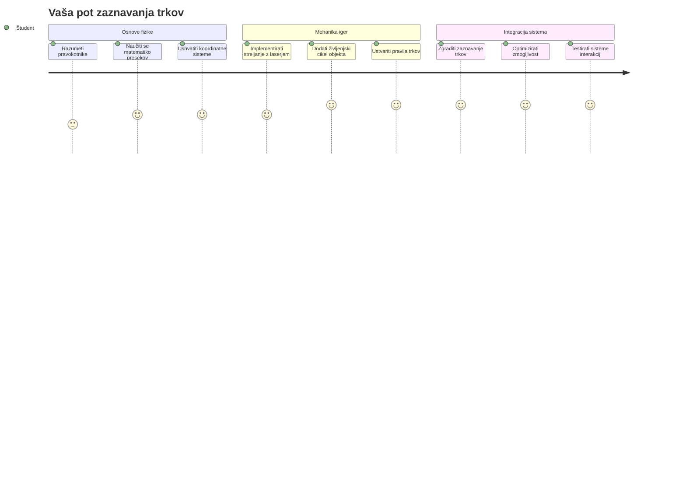
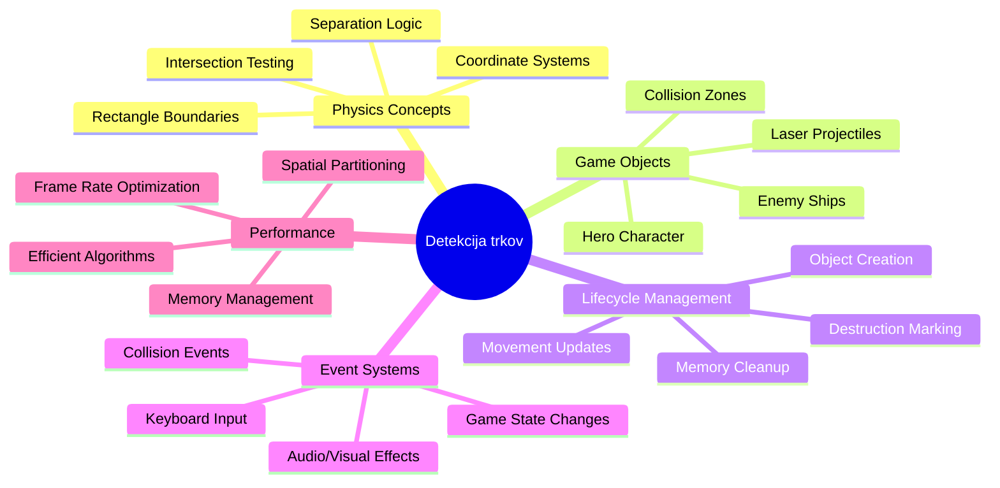
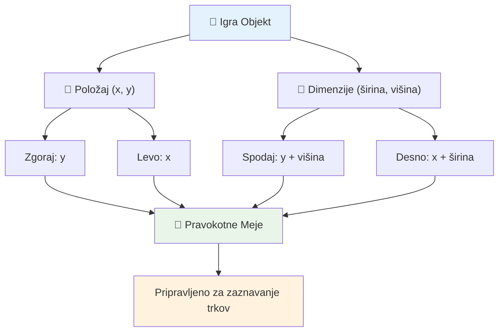
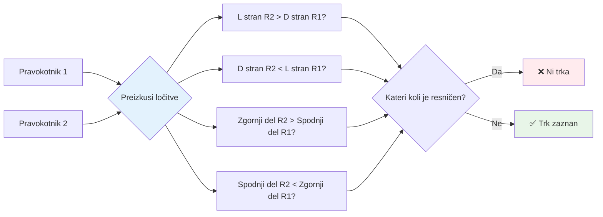
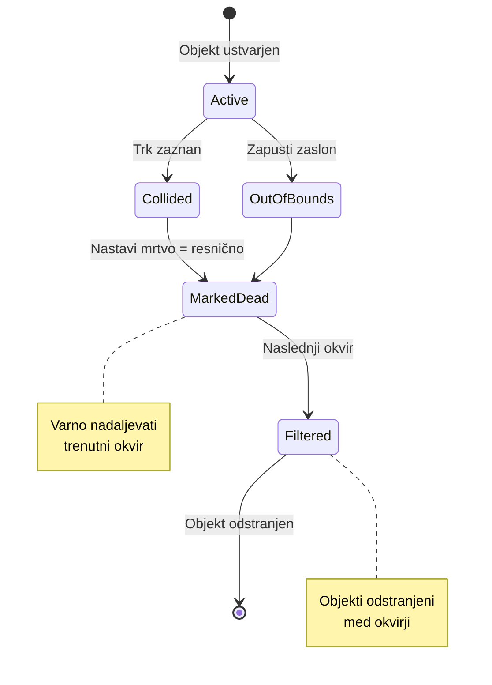
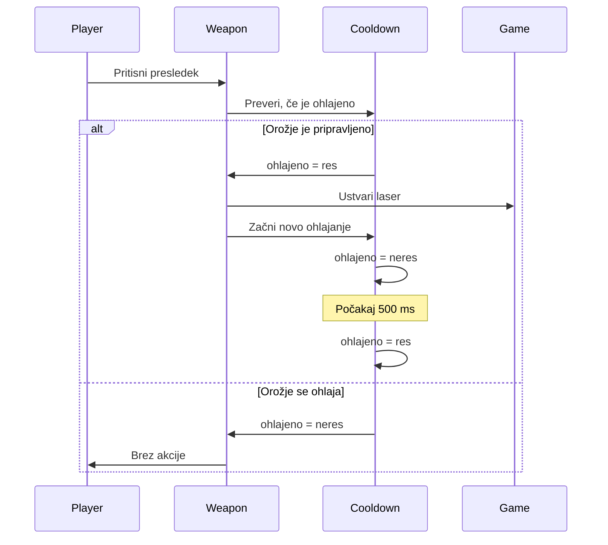
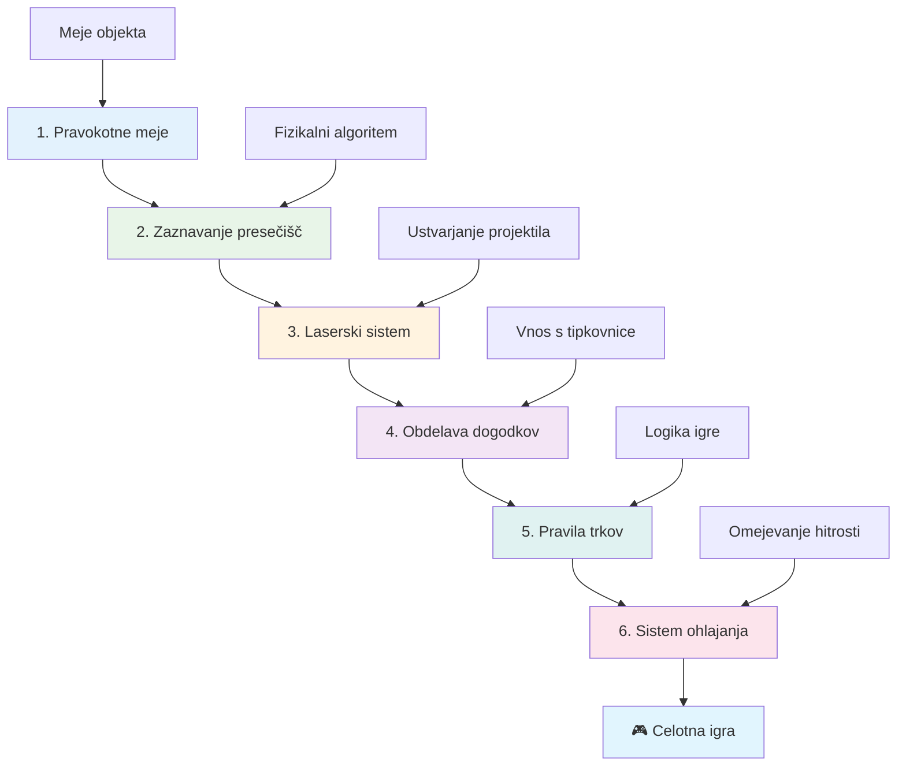
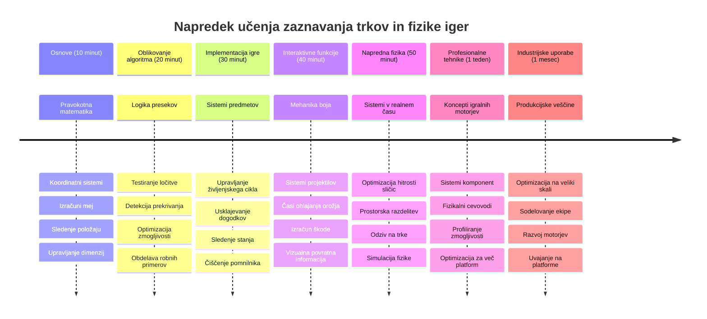

# Zgradite vesoljsko igro, del 4: Dodajanje laserja in zaznavanje trkov


## Predpredavanje kviz

[Predpredavanje kviz](https://ff-quizzes.netlify.app/web/quiz/35)

Pomislite na trenutek v Vojnah zvezd, ko Lukeovi protonski torpedni zadenejo izpuh Smrtonosne zvezde. Prav ta natančna zaznava trka je spremenila usodo galaksije! V igrah zaznava trka deluje enako - določi, kdaj se objekti srečajo in kaj se nato zgodi.

V tej lekciji boste v svojo vesoljsko igro dodali lasersko orožje in izvedli zaznavanje trkov. Tako kot načrtovalci misij NASA izračunavajo poti vesoljskih plovil, da se izognejo ostankom, boste tudi vi izučili zaznavati, kdaj se igralni objekti sekajo. Razdelili bomo ta proces v obvladljive korake, ki se med seboj nadgrajujejo.

Na koncu boste imeli delujoč bojevni sistem, kjer laserji uničujejo sovražnike in trki sprožajo igralne dogodke. Enaki principi zaznavanja trkov se uporabljajo v vseh sistemih, od fizikalnih simulacij do interaktivnih spletnih vmesnikov.


✅ Malo razišči prva računalniška igra na svetu. Kakšna je bila njena funkcionalnost?

## Zaznavanje trkov

Zaznavanje trkov deluje podobno kot senzorji bližine na lunarnem modulu Apollo - nenehno preverja razdalje in sproži opozorila, ko so objekti preblizu. V igrah ta sistem določi, kdaj se objekti srečajo in kaj naj se zgodi naprej.

Pristop, ki ga bomo uporabili, obravnava vsak igralni objekt kot pravokotnik, podobno kot sistemi za zračni nadzor, ki uporabljajo poenostavljene geometrijske oblike za sledenje letal. Ta pravokotna metoda se morda zdi osnovna, a je računsko učinkovita in dobro deluje za večino igralnih scenarijev.

### Predstavitev pravokotnika

Vsak igralni objekt potrebuje koordinate mej, podobno kot je mali vozni rover Mars Pathfinder določal svojo lokacijo na površju Marsa. Tako definiramo te mejne koordinate:


```javascript
rectFromGameObject() {
  return {
    top: this.y,
    left: this.x,
    bottom: this.y + this.height,
    right: this.x + this.width
  }
}
```

**Razčlenimo to:**
- **Zgornja meja**: To je točno mesto, kjer se tvoj objekt začne navpično (njegova y pozicija)
- **Leva meja**: Kjer se začne horizontalno (njegova x pozicija)
- **Spodnja meja**: Dodamo višino k y poziciji - zdaj vemo, kje konča!
- **Desna meja**: Dodamo širino k x poziciji - in dobimo popolne meje

### Algoritem preseka

Zaznavanje preseka pravokotnikov uporablja logiko podobno, kot Vesoljski teleskop Hubble ugotavlja, ali si nebesni objekti med seboj prekrivajo v svojem vidnem polju. Algoritem preverja ločitev:


```javascript
function intersectRect(r1, r2) {
  return !(r2.left > r1.right ||
    r2.right < r1.left ||
    r2.top > r1.bottom ||
    r2.bottom < r1.top);
}
```

**Preizkus ločitve deluje kot radarski sistemi:**
- Je pravokotnik 2 povsem desno od pravokotnika 1?
- Je pravokotnik 2 povsem levo od pravokotnika 1?
- Je pravokotnik 2 povsem spodaj pod pravokotnikom 1?
- Je pravokotnik 2 povsem zgoraj nad pravokotnikom 1?

Če noben od teh pogojev ni resničen, se pravokotniki prekrivajo. Ta pristop odseva način, kako radarski operaterji ugotavljajo, ali sta dve letali na varni oddaljenosti.

## Upravljanje življenjskega cikla objektov

Ko laser zadane sovražnika, je treba oba objekta odstraniti iz igre. Vendar pa brisanje objektov sredi zanke povzroči zrušitve - lekcija, ki so se je naučili že zgodnji računalniški sistemi, kot je Apollo Guidance Computer. Namesto tega uporabljamo pristop "označi za brisanje", ki varno odstrani objekte med okvirji.


Tako nekaj označimo za odstranitev:

```javascript
// Označi objekt za odstranitev
enemy.dead = true;
```

**Zakaj ta pristop deluje:**
- Objekta označimo kot "mrtev", a ga takoj ne izbrišemo
- To omogoči varen zaključek trenutnega igralnega okvirja
- Ni zrušitev zaradi uporabe nečesa, česar ni več!

Nato pred naslednjim ciklom upodabljanja odstranimo označene objekte:

```javascript
gameObjects = gameObjects.filter(go => !go.dead);
```

**Kaj ta filtriranje naredi:**
- Ustvari nov seznam le s "živimi" objekti
- Izloči vse, ki so označeni kot mrtvi
- Ohranja gladko delovanje igre
- Preprečuje kopičenje uničenih objektov in zapolnjevanje pomnilnika

## Implementacija mehanike laserja

Laserski projektili v igrah delujejo po enakem principu kot fotonski torpedi v Zvezdnih stezah - so diskretni objekti, ki potujejo po ravnih tirnicah, dokler ne zadenejo nečesa. Vsak pritisk tipke preslednice ustvari nov laserski objekt, ki se premika čez zaslon.

Da to deluje, moramo uskladiti nekaj različnih delov:

**Ključni deli za implementacijo:**
- **Ustvari** laserske objekte, ki izvirajo iz položaja junaka
- **Obdelaj** tipkovni vnos za sprožitev ustvarjanja laserja
- **Upravljaj** premikanje laserjev in njihov življenjski cikel
- **Izvedi** vizualno predstavitev laserskih projektilov

## Implementacija omejitve hitrosti streljanja

Neomejena hitrost streljanja bi preobremenila igralni motor in igranje naredila prelahko. Resnični orožni sistemi se soočajo s podobnimi omejitvami - celo fazerji USS Enterprise so potrebovali čas za polnjenje med streli.

Izvedli bomo sistem ohlajanja, ki preprečuje pospešeno streljanje, hkrati pa ohranja odzivne kontrole:


```javascript
class Cooldown {
  constructor(time) {
    this.cool = false;
    setTimeout(() => {
      this.cool = true;
    }, time);
  }
}

class Weapon {
  constructor() {
    this.cooldown = null;
  }
  
  fire() {
    if (!this.cooldown || this.cooldown.cool) {
      // Ustvari laserski projektil
      this.cooldown = new Cooldown(500);
    } else {
      // Orožje se še vedno ohlaja
    }
  }
}
```

**Kako deluje ohlajanje:**
- Ko je orožje ustvarjeno, je "vroče" (še ne more streljati)
- Po obdobju čakanja postane "hladno" (pripravljeno za streljanje)
- Pred streljanjem preverimo: "Ali je orožje hladno?"
- To preprečuje prehitro klikanje, obenem pa ohranja odzivnost

✅ Glejte lekcijo 1 v seriji vesoljskih iger, da se spomnite o ohlajanju.

## Gradnja sistema zaznavanja trkov

Razširili boste obstoječo kodo vaše vesoljske igre z ustvarjanjem sistema za zaznavanje trkov. Tako kot Avtomatizirani sistem za izogibanje trkov Mednarodne vesoljske postaje, bo vaša igra neprestano spremljala položaje objektov in reagirala na preseke.

Začeli boste iz kode iz prejšnje lekcije in dodali zaznavanje trkov s posebnimi pravili, ki urejajo interakcije objektov.

> 💡 **Nasvet strokovnjaka**: Laserjev sprite je že vključen v vašo mapo z viri in je omenjen v vaši kodi, pripravljen za implementacijo.

### Pravila trkov za implementacijo

**Igralne mehanike, ki jih dodamo:**
1. **Laser zadane sovražnika**: Sovražnikov objekt je uničen, ko ga zadene laserski projektil
2. **Laser zadane rob zaslona**: Laser se odstrani, ko doseže zgornji rob zaslona
3. **Trk sovražnika in junaka**: Oba objekta uničena ob preseku
4. **Sovražnik doseže dno**: Pogoj za konec igre, ko sovražniki dosežejo dno zaslona

### 🔄 **Pedagoški pregled**
**Osnove zaznavanja trkov**: Pred implementacijo se prepričajte, da razumete:
- ✅ Kako pravokotne meje definirajo območja trka
- ✅ Zakaj je test ločitve učinkovitejši od izračuna preseka
- ✅ Pomen upravljanja življenjskega cikla objektov v igralnih zankah
- ✅ Kako dogodkovno usmerjeni sistemi usklajujejo odzive na trk

**Hitri samopreizkus**: Kaj bi se zgodilo, če bi objekte takoj brisali namesto označevali?
*Odgovor: Brisanje sredi zanke lahko povzroči zrušitve ali preskakovanje objektov v iteraciji*

**Razumevanje fizike**: Zdaj obvladate:
- **Sistemi koordinat**: Kako položaj in dimenzije ustvarjajo meje
- **Logika preseka**: Matematični principi za zaznavanje trkov
- **Optimizacija zmogljivosti**: Zakaj so učinkoviti algoritmi pomembni za sisteme v realnem času
- **Upravljanje pomnilnika**: Varnostni vzorci življenjskega cikla objektov za stabilnost

## Nastavitev razvojnega okolja

Dobre novice - največji del temeljev smo že pripravili za vas! Vsi viri igre in osnovna struktura so v mapi `your-work`, pripravljeni za dodajanje kul funkcij zaznavanja trkov.

### Struktura projekta

```bash
-| assets
  -| enemyShip.png
  -| player.png
  -| laserRed.png
-| index.html
-| app.js
-| package.json
```

**Razumevanje strukture datotek:**
- **Vsebuje** vse slike sprite, potrebne za igralne objekte
- **Vključuje** glavno HTML datoteko in JavaScript aplikacijo
- **Nudi** konfiguracijo paketa za lokalni razvojni strežnik

### Zagon razvojnega strežnika

Pojdite v mapo projekta in zaženite lokalni strežnik:

```bash
cd your-work
npm start
```

**Ta zaporedje ukazov:**
- **Zamenja** imenik v delovno mapo projekta
- **Zažene** lokalni HTTP strežnik na `http://localhost:5000`
- **Postreže** datoteke vaše igre za testiranje in razvoj
- **Omogoči** živ razvoj z avtomatskim ponovno nalaganjem

Odprite brskalnik in pojdite na `http://localhost:5000` ter si oglejte trenutno stanje igre z upodobljenim junakom in sovražniki na zaslonu.

### Korak za korakom implementacija

Kot je NASA sistematično programirala plovilo Voyager, bomo tudi mi metodološko implementirali zaznavanje trkov, gradnjo vsakega dela postopoma.


#### 1. Dodajte pravokotne meje trkov

Najprej naučimo igralne objekte, kako opisati svoje meje. Dodajte to metodo v svojo razred `GameObject`:

```javascript
rectFromGameObject() {
    return {
      top: this.y,
      left: this.x,
      bottom: this.y + this.height,
      right: this.x + this.width,
    };
  }
```

**Ta metoda doseže:**
- **Ustvari** pravokotnik z natančnimi koordinatami mej
- **Izračuna** spodnjo in desno mejo z uporabo položaja in dimenzij
- **Vrne** objekt pripravljen za algoritme zaznavanja trkov
- **Nudi** standardiziran vmesnik za vse objekte igre

#### 2. Implementirajte zaznavanje preseka

Zdaj ustvarimo našega trkalnega detektiva - funkcijo, ki pove, kdaj se dva pravokotnika prekrivata:

```javascript
function intersectRect(r1, r2) {
  return !(
    r2.left > r1.right ||
    r2.right < r1.left ||
    r2.top > r1.bottom ||
    r2.bottom < r1.top
  );
}
```

**Ta algoritem deluje tako:**
- **Preizkusi** štiri pogoje ločitve med pravokotniki
- **Vrne** `false`, če je katerikoli pogoj ločitve resničen
- **Označi** trk, če ločitve ni
- **Uporablja** negacijsko logiko za učinkovito testiranje preseka

#### 3. Implementirajte sistem streljanja laserja

Tukaj stvari postanejo zanimive! Nastavimo sistem streljanja laserjev.

##### Konstantne sporočil

Najprej definirajmo nekaj vrst sporočil, da lahko različni deli igre med seboj komunicirajo:

```javascript
KEY_EVENT_SPACE: "KEY_EVENT_SPACE",
COLLISION_ENEMY_LASER: "COLLISION_ENEMY_LASER",
COLLISION_ENEMY_HERO: "COLLISION_ENEMY_HERO",
```

**Te konstante zagotavljajo:**
- **Standardizirane** imena dogodkov po celotni aplikaciji
- **Omogočajo** dosledno komunikacijo med igralnimi sistemi
- **Preprečujejo** napake pri registraciji obdelovalcev dogodkov

##### Obdelava vhodov z tipkovnice

Dodajte zaznavanje pritiska tipke preslednice v svoj poslušalec dogodkov:

```javascript
} else if(evt.keyCode === 32) {
  eventEmitter.emit(Messages.KEY_EVENT_SPACE);
}
```

**Ta obdelovalec vnosa:**
- **Prepozna** pritisk tipke preslednica s keyCode 32
- **Odda** standardizirano sporočilo dogodka
- **Omogoča** ločeno logiko sprožitve streljanja

##### Nastavitev poslušalca dogodkov

Registrirajte obnašanje streljanja v svoji funkciji `initGame()`:

```javascript
eventEmitter.on(Messages.KEY_EVENT_SPACE, () => {
 if (hero.canFire()) {
   hero.fire();
 }
});
```

**Ta poslušalec dogodkov:**
- **Odgovori** na dogodke pritiska preslednice
- **Preveri** stanje ohlajanja streljanja
- **Sproži** ustvarjanje laserja, ko je dovoljeno

Dodajte obdelavo trka za interakcije laser–sovražnik:

```javascript
eventEmitter.on(Messages.COLLISION_ENEMY_LASER, (_, { first, second }) => {
  first.dead = true;
  second.dead = true;
});
```

**Ta obdelovalec trkov:**
- **Prejme** podatke o trku z obema objektoma
- **Označi** oba objekta za odstranitev
- **Zagotovi** pravilno čiščenje po trku

#### 4. Ustvarite razred Laser

Izvedite laserski projektil, ki se premika navzgor in upravlja svoj življenjski cikel:

```javascript
class Laser extends GameObject {
  constructor(x, y) {
    super(x, y);
    this.width = 9;
    this.height = 33;
    this.type = 'Laser';
    this.img = laserImg;
    
    let id = setInterval(() => {
      if (this.y > 0) {
        this.y -= 15;
      } else {
        this.dead = true;
        clearInterval(id);
      }
    }, 100);
  }
}
```

**Ta implementacija razreda:**
- **Dedi** od GameObject za osnovno funkcionalnost
- **Nastavi** ustrezne dimenzije za laserski sprite
- **Ustvari** samodejni premik navzgor s `setInterval()`
- **Upravi** samouničenje ob dosegu zgornjega roba zaslona
- **Upravljaj** svojo animacijo in čiščenje

#### 5. Implementirajte sistem zaznavanja trkov

Ustvarite celovito funkcijo za zaznavo trkov:

```javascript
function updateGameObjects() {
  const enemies = gameObjects.filter(go => go.type === 'Enemy');
  const lasers = gameObjects.filter(go => go.type === "Laser");
  
  // Preizkus trkov med laserjem in sovražnikom
  lasers.forEach((laser) => {
    enemies.forEach((enemy) => {
      if (intersectRect(laser.rectFromGameObject(), enemy.rectFromGameObject())) {
        eventEmitter.emit(Messages.COLLISION_ENEMY_LASER, {
          first: laser,
          second: enemy,
        });
      }
    });
  });

  // Odstrani uničene objekte
  gameObjects = gameObjects.filter(go => !go.dead);
}
```

**Ta sistem zaznavanja trkov:**
- **Filtrira** igralne objekte po tipu za učinkovito testiranje
- **Preizkusi** vsak laser proti vsakemu sovražniku za preseke
- **Odda** dogodke trkov, kjer so preseki zaznani
- **Očisti** uničene objekte po obdelavi trkov

> ⚠️ **POMEMBNO**: Dodajte `updateGameObjects()` v glavno igralno zanko v `window.onload` za omogočanje zaznavanja trkov.

#### 6. Dodajte sistem ohlajanja v razred Hero

Izboljšajte razred Hero z mehaniko streljanja in omejitvijo hitrosti:

```javascript
class Hero extends GameObject {
  constructor(x, y) {
    super(x, y);
    this.width = 99;
    this.height = 75;
    this.type = "Hero";
    this.speed = { x: 0, y: 0 };
    this.cooldown = 0;
  }
  
  fire() {
    gameObjects.push(new Laser(this.x + 45, this.y - 10));
    this.cooldown = 500;

    let id = setInterval(() => {
      if (this.cooldown > 0) {
        this.cooldown -= 100;
      } else {
        clearInterval(id);
      }
    }, 200);
  }
  
  canFire() {
    return this.cooldown === 0;
  }
}
```

**Razumevanje izboljšanega razreda Hero:**
- **Inicializira** števec ohladitve na ničlo (pripravljen za streljanje)
- **Ustvari** laserske objekte, ki nastanejo nad ladjo junaka
- **Nastavi** obdobje ohladitve za preprečitev hitrega streljanja
- **Zmanjša** števec ohladitve z intervalskimi posodobitvami
- **Nudi** preverjanje pripravljenosti za streljanje preko metode `canFire()`

### 🔄 **Pedagoški pregled**
**Popolno razumevanje sistema**: Preverite svoje obvladovanje sistema zaznavanja trkov:
- ✅ Kako pravokotne meje omogočajo učinkovito zaznavanje trkov?
- ✅ Zakaj je upravljanje življenjskega cikla ključnega pomena za stabilnost igre?
- ✅ Kako sistem ohlajanja preprečuje težave z zmogljivostjo?
- ✅ Kakšno vlogo ima dogodkovno usmerjena arhitektura pri obdelavi trkov?

**Integracija sistema**: Zaznavanje trkov dokazuje:
- **Matematično natančnost**: Algoritmi za presek pravokotnikov
- **Optimizacijo zmogljivosti**: Učinkoviti vzorci testiranja trkov
- **Upravljanje pomnilnika**: Varna ustvarjanja in uničenja objektov
- **Koordinacijo dogodkov**: Ločeno sistemsko komuniciranje
- **Obdelavo v realnem času**: Posodobitve na osnovi okvirjev

**Profesionalni vzorci**: Implementirali ste:
- **Ločitev skrbi**: Fizika, upodabljanje in vhod ločeni
- **Objektno usmerjeno programiranje**: Dedovanje in polimorfizem
- **Upravljanje stanja**: Življenjski cikli objektov in stanje igre
- **Optimizacijo delovanja**: Učinkoviti algoritmi za realni čas

### Preskus vaših implementacij

Vaša vesoljska igra zdaj vključuje celoten sistem zaznavanja trkov in bojevno mehaniko. 🚀 Preizkusite te nove zmožnosti:
- **Premikajte se** z vogalnimi tipkami, da preverite nadzor nad premikanjem
- **Streljajte laserje** s preslednico – opazujte, kako ohlajanje preprečuje prehitro klikanje
- **Opazujte trke**, ko laserji zadanejo sovražnike in sprožijo odstranitev
- **Preverite čiščenje** objekti, uničeni po trkih, izginejo iz igre

Uspešno ste implementirali sistem zaznavanja trkov z uporabo enakih matematičnih principov, ki usmerjajo navigacijo vesoljskih plovil in robotiko.

### ⚡ **Kaj lahko naredite v naslednjih 5 minutah**
- [ ] Odprite DevTools svojega brskalnika in nastavite zanke v funkciji zaznavanja trkov
- [ ] Poskusite spremeniti hitrost laserja ali gibanje sovražnika ter opazujte učinke trkov
- [ ] Eksperimentirajte z različnimi vrednostmi ohlajanja za testiranje hitrosti streljanja
- [ ] Dodajte izjave `console.log` za spremljanje dogodkov trkov v realnem času

### 🎯 **Kaj lahko dosežete v tej uri**
- [ ] Dokončajte kviz po lekciji in razumite algoritme zaznavanja trkov
- [ ] Dodajte vizualne učinke, kot so eksplozije, ko pride do trkov
- [ ] Izvedite različne vrste izstrelkov z različnimi lastnostmi
- [ ] Ustvarite power-up-e, ki začasno izboljšajo igralčeve sposobnosti
- [ ] Dodajte zvočne učinke, da bodo trki bolj zadovoljivi

### 📅 **Vaše tedensko programiranje fizike**
- [ ] Dokončajte celotno vesoljsko igro z dodelanimi sistemi trkov
- [ ] Izvedite napredne oblike trkov, ne samo pravokotnikov ( krogi, mnogokotniki)
- [ ] Dodajte delovne sisteme za realistično prikazovanje eksplozij
- [ ] Ustvarite kompleksno vedenje sovražnikov z izogibanjem trkom
- [ ] Optimizirajte zaznavanje trkov za boljšo zmogljivost s številnimi objekti
- [ ] Dodajte simulacijo fizike, kot so zagon in realističen gib

### 🌟 **Vaše mesečno obvladovanje fizike v igrah**
- [ ] Zgradite igre z naprednimi fizikalnimi mehanizmi in realističnimi simulacijami
- [ ] Naučite se 3D zaznavanja trkov in algoritmov prostorskega razdeljevanja
- [ ] Prispevajte k odprtokodnim knjižnicam fizike in igralnim mehanizmom
- [ ] Obvladujte optimizacijo zmogljivosti za zahtevne grafične aplikacije
- [ ] Ustvarite izobraževalno vsebino o fiziki iger in zaznavanju trkov
- [ ] Zgradite portfelj, ki prikazuje napredne veščine programiranja fizike

## 🎯 Časovnica vašega obvladovanja zaznavanja trkov


### 🛠️ Povzetek vašega nabora orodij za fiziko igre

Po zaključku te lekcije ste sedaj obvladali:
- **Matematika trkov**: Algoritmi za presečišča pravokotnikov in koordinatni sistemi
- **Optimizacija zmogljivosti**: Učinkovito zaznavanje trkov za aplikacije v realnem času
- **Upravljanje življenjskega cikla objektov**: Varni vzorci ustvarjanja, posodabljanja in uničevanja
- **Arhitektura na osnovi dogodkov**: Ločeni sistemi za odziv na trke
- **Integracija v zanki igre**: Fizikalne posodobitve in usklajevanje upodabljanja s frekvenco sličic
- **Vhodni sistemi**: Odzivni nadzor z omejevanjem hitrosti in povratnimi informacijami
- **Upravljanje pomnilnika**: Učinkovito upravljanje skupin objektov in čiščenje

**Uporaba v resničnem svetu**: Vaše veščine zaznavanja trkov so neposredno uporabne za:
- **Interaktivne simulacije**: Znanstveno modeliranje in izobraževalna orodja
- **Oblikovanje uporabniškega vmesnika**: Interakcije povleci-in-spusti in zaznavanje dotika
- **Vizualizacija podatkov**: Interaktivni grafikoni in klikabilni elementi
- **Mobilni razvoj**: Prepoznavanje dotikov in obdelava trkov
- **Programiranje robotike**: Načrtovanje poti in izogibanje oviram
- **Računalniška grafika**: Sledenje žarkom in prostorski algoritmi

**Pridobljene poklicne veščine**: Sedaj lahko:
- **Načrtujete** učinkovite algoritme za zaznavanje trkov v realnem času
- **Izvedete** fizikalne sisteme, ki se prilagajajo kompleksnosti objektov
- **Odpravljate napake** v kompleksnih interakcijskih sistemih z matematičnimi načeli
- **Optimizirate** zmogljivost za različne strojne in brskalniške zmogljivosti
- **Arhitektirate** vzdržljive igralne sisteme z dokazanimi oblikovnimi vzorci

**Obvladani koncepti razvoja iger**:
- **Simulacija fizike**: Zaznavanje in odziv na trke v realnem času
- **Inženiring zmogljivosti**: Optimizirani algoritmi za interaktivne aplikacije
- **Sistemi dogodkov**: Ločena komunikacija med igralnimi komponentami
- **Upravljanje objektov**: Učinkoviti vzorci življenjskega cikla za dinamično vsebino
- **Obdelava vhodov**: Odziven nadzor z ustreznimi povratnimi informacijami

**Naslednja raven**: Pripravljen ste za raziskovanje naprednih fizikalnih mehanizmov, kot je Matter.js, izvajanje 3D zaznavanja trkov ali gradnjo kompleksnih delčnih sistemov!

🌟 **Dosežek odklenjen**: Zgradili ste celovit sistem interakcije, ki temelji na fiziki, z profesionalnim zaznavanjem trkov!

## Izziv GitHub Copilot agenta 🚀

Uporabite način Agent za dokončanje naslednjega izziva:

**Opis:** Izboljšajte sistem zaznavanja trkov z izvedbo power-upov, ki se naključno pojavijo in igralcu omogočajo začasne sposobnosti, ko jih hero ladja zbere.

**Naloga:** Ustvarite razred PowerUp, ki razširi GameObject in izvedite zaznavanje trkov med herojem in power-up-i. Dodajte najmanj dve vrsti power-upov: enega ki poveča hitrost streljanja (skrajša čas med streli) in drugega, ki ustvari začasni ščit. Vključite logiko nastanka power-upov na naključnih intervalih in položajih.

---


## 🚀 Izziv

Dodajte eksplozijo! Oglejte si igralne vire v [the Space Art repo](../../../../6-space-game/solution/spaceArt/readme.txt) in poskusite dodati eksplozijo, ko laser zadene tujca

## Kviz po predavanju

[Post-lecture quiz](https://ff-quizzes.netlify.app/web/quiz/36)

## Pregled in samostojno učenje

Eksperimentirajte z intervali v vaši igri do sedaj. Kaj se zgodi, če jih spremenite? Preberite več o [JavaScript časovnih dogodkih](https://www.freecodecamp.org/news/javascript-timing-events-settimeout-and-setinterval/).

## Naloga

[Raziskujte trke](assignment.md)

---

<!-- CO-OP TRANSLATOR DISCLAIMER START -->
**Omejitev odgovornosti**:  
Ta dokument je bil preveden z uporabo AI prevajalske storitve [Co-op Translator](https://github.com/Azure/co-op-translator). Čeprav si prizadevamo za natančnost, vas opozarjamo, da avtomatizirani prevodi lahko vsebujejo napake ali netočnosti. Izvirni dokument v njegovem maternem jeziku velja za avtoritativni vir. Za pomembne informacije priporočamo strokovni prevod, opravljen s strani človeka. Ne odgovarjamo za morebitna nesporazume ali napačne interpretacije, ki izhajajo iz uporabe tega prevoda.
<!-- CO-OP TRANSLATOR DISCLAIMER END -->