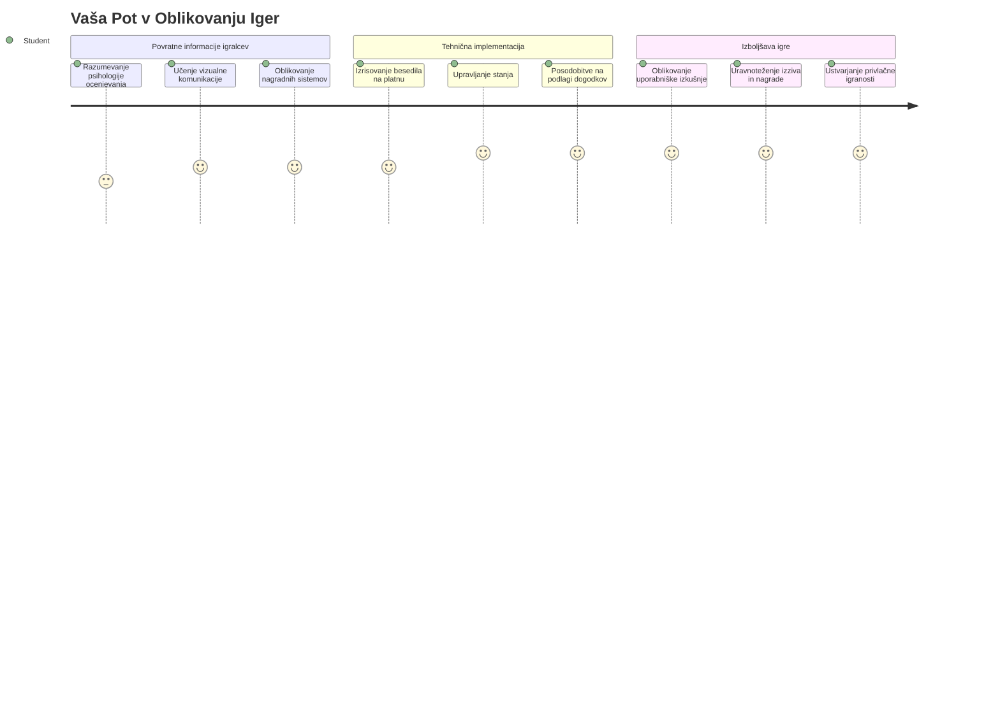
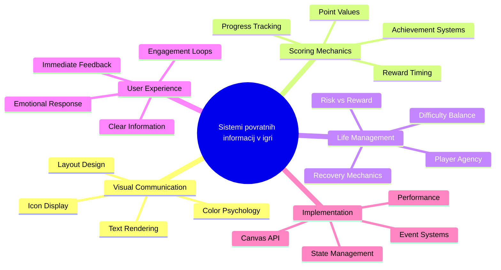
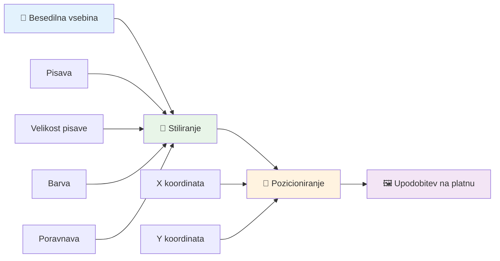
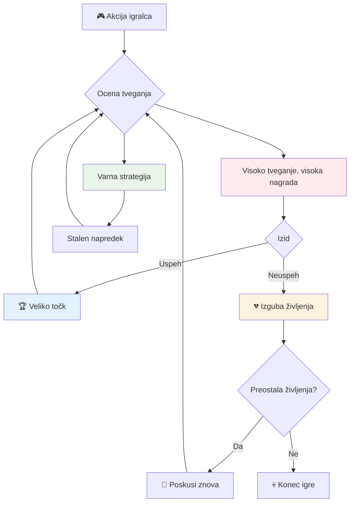
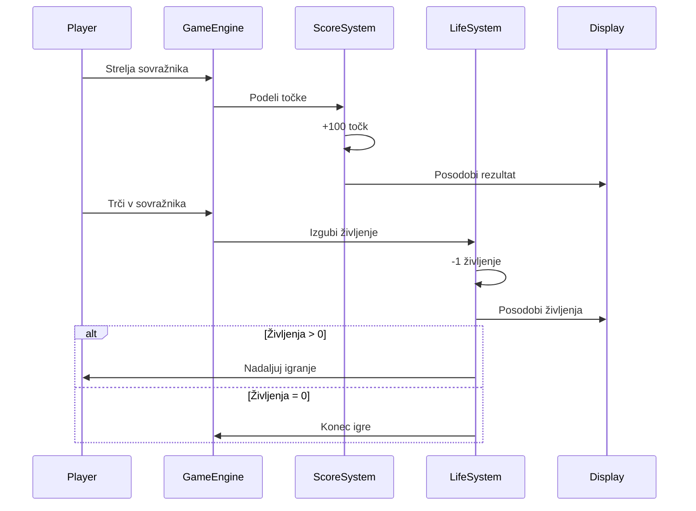
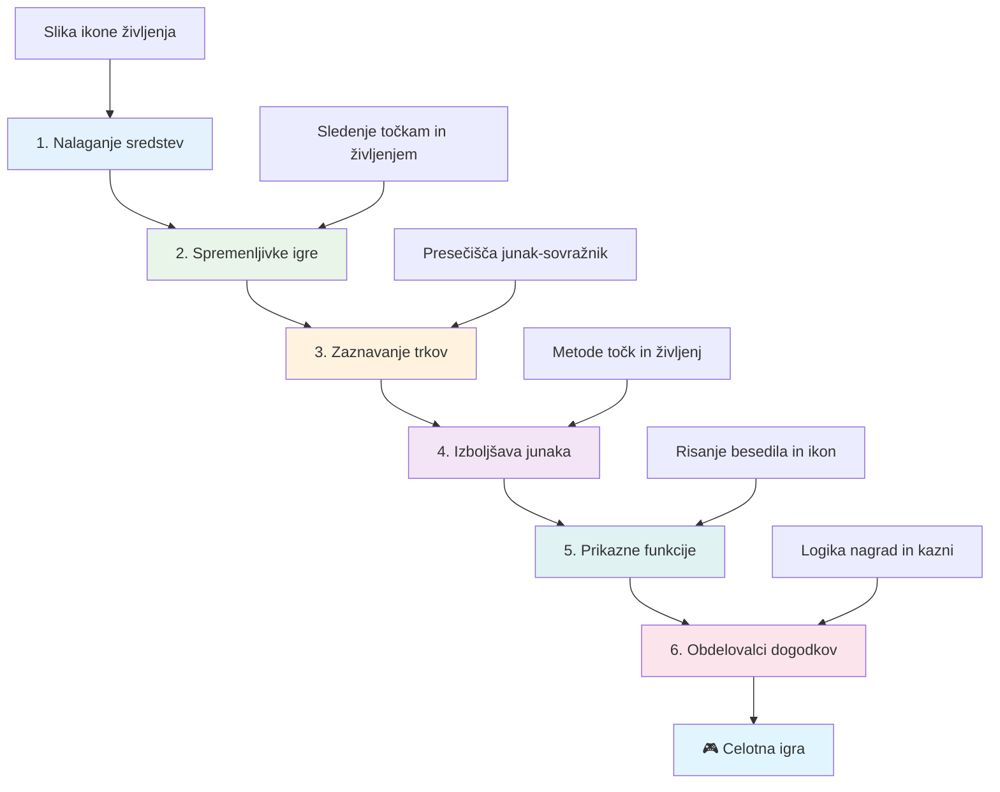
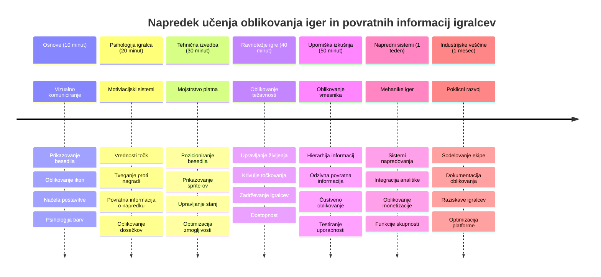

# Ustvari vesoljsko igro, del 5: Točkovanje in življenja


## Predpredavanja kviz

[Predpredavanja kviz](https://ff-quizzes.netlify.app/web/quiz/37)

Ste pripravljeni, da vaša vesoljska igra resnično deluje kot igra? Dodajmo točkovanje in upravljanje življenja – osnovne mehanike, ki so zgodnje arkadne igre, kot je Space Invaders, spremenile iz preprostih demonstracij v zasvojljivo zabavo. Tukaj vaša igra postane zares igralna.


## Risanje besedila na zaslon - glas vaše igre

Za prikaz vaše ocene se moramo naučiti, kako upodobiti besedilo na platnu (canvas). Metoda `fillText()` je vaše osnovno orodje za to – ista tehnika, ki so jo uporabljale klasične arkadne igre za prikaz rezultatov in statusnih informacij.


Imate popoln nadzor nad izgledom besedila:

```javascript
ctx.font = "30px Arial";
ctx.fillStyle = "red";
ctx.textAlign = "right";
ctx.fillText("show this on the screen", 0, 0);
```

✅ Poglobite se v [dodajanje besedila na platno](https://developer.mozilla.org/docs/Web/API/Canvas_API/Tutorial/Drawing_text) – morda boste presenečeni, kako ustvarjalni ste lahko z izbiro pisav in slogom!

## Življenja – več kot le število

V oblikovanju iger "življenje" predstavlja igralčev prostor za napake. Ta koncept sega nazaj do pinball avtomatov, kjer ste imeli več žog za igro. V zgodnjih videoigrah, kot so Asteroids, so življenja igralcem omogočala tveganje in učenje iz napak.


Vizualna predstavitev ima velik pomen – prikaz ikon ladij namesto zgolj “Življenja: 3” takoj ustvari vizualno prepoznavnost, podobno kot so zgodnji arkadni avtomati uporabljali ikonografijo za komunikacijo preko jezikovnih ovir.

## Gradimo nagradni sistem vaše igre

Zdaj bomo izvedli osnovne povratne sisteme, ki igralce ohranjajo vključene:


- **Sistem točkovanja**: Vsaka uničena sovražna ladja prinese 100 točk (zaokrožene številke so igralcem lažje za mentalni izračun). Rezultat se prikazuje v spodnjem levem kotu.
- **Števec življenj**: Vaš junak začne s tremi življenji – standard, ki so ga vzpostavile zgodnje arkadne igre za uravnoteženje izziva s igranjem. Vsak srečanje z nasprotnikom stane eno življenje. Preostala življenja bodo prikazana v spodnjem desnem kotu z ikonami ladij .

## Začnimo!

Najprej pripravite svoje delovno okolje. Pojdite do datotek v podmapi `your-work`. Videli bi morali te datoteke:

```bash
-| assets
  -| enemyShip.png
  -| player.png
  -| laserRed.png
-| index.html
-| app.js
-| package.json
```

Za testiranje igre zaženite razvojni strežnik iz mape `your_work`:

```bash
cd your-work
npm start
```

To zažene lokalni strežnik na `http://localhost:5000`. Odprite ta naslov v vašem brskalniku, da si ogledate igro. Testirajte kontrole s puščičnimi tipkami in poskusite streljati na sovražnike, da potrdite, da vse deluje.


### Čas za kodiranje!

1. **Pridobite vizualne elemente, ki jih boste potrebovali.** Kopirajte datoteko `life.png` iz mape `solution/assets/` v vašo mapo `your-work`. Nato dodajte `lifeImg` v funkcijo `window.onload`:

    ```javascript
    lifeImg = await loadTexture("assets/life.png");
    ```

1. Ne pozabite dodati `lifeImg` na vaš seznam sredstev:

    ```javascript
    let heroImg,
    ...
    lifeImg,
    ...
    eventEmitter = new EventEmitter();
    ```
  
2. **Nastavite spremenljivke vaše igre.** Dodajte nekaj kode za sledenje skupnemu rezultatu (začetek na 0) in preostalim življenjem (začetek na 3). Te vrednosti bomo prikazali na zaslonu, da bodo igralci vedno vedeli, kako stojijo.

3. **Implementirajte zaznavanje trkov.** Razširite funkcijo `updateGameObjects()`, da zazna, ko sovražniki trčijo z vašim junakom:

    ```javascript
    enemies.forEach(enemy => {
        const heroRect = hero.rectFromGameObject();
        if (intersectRect(heroRect, enemy.rectFromGameObject())) {
          eventEmitter.emit(Messages.COLLISION_ENEMY_HERO, { enemy });
        }
      })
    ```

4. **Dodajte sledenje življenj in točk vašemu junaku.** 
   1. **Inicializirajte števce.** Pod `this.cooldown = 0` v vaši `Hero` razredu nastavite življenja in točke:

        ```javascript
        this.life = 3;
        this.points = 0;
        ```

   1. **Pokažite te vrednosti igralcu.** Ustvarite funkcije za risanje teh vrednosti na zaslon:

        ```javascript
        function drawLife() {
          // NAREDITI, 35, 27
          const START_POS = canvas.width - 180;
          for(let i=0; i < hero.life; i++ ) {
            ctx.drawImage(
              lifeImg, 
              START_POS + (45 * (i+1) ), 
              canvas.height - 37);
          }
        }
        
        function drawPoints() {
          ctx.font = "30px Arial";
          ctx.fillStyle = "red";
          ctx.textAlign = "left";
          drawText("Points: " + hero.points, 10, canvas.height-20);
        }
        
        function drawText(message, x, y) {
          ctx.fillText(message, x, y);
        }

        ```

   1. **Povežite vse v vašo igralno zanko.** Dodajte te funkcije v funkcijo `window.onload` takoj za `updateGameObjects()`:

        ```javascript
        drawPoints();
        drawLife();
        ```

### 🔄 **Pedagoški pregled**
**Razumevanje oblikovanja iger**: Preden implementirate posledice, se prepričajte, da razumete:
- ✅ Kako vizualna povratna informacija sporoča stanje igre igralcem
- ✅ Zakaj dosledna postavitev UI elementov izboljša uporabnost
- ✅ Psihologijo za vrednostmi točk in upravljanjem življenj
- ✅ Kako se razlikuje risanje besedila na platnu v primerjavi s HTML besedilom

**Hiter samopreizkus**: Zakaj arkadne igre običajno uporabljajo zaokrožene številke za vrednosti točk?
*Odgovor: Zaokrožene številke je igralcem lažje izračunati v mislih in ustvarjajo zadovoljive psihološke nagrade*

**Principi uporabniške izkušnje**: Zdaj uporabljate:
- **Vizualna hierarhija**: Pomembne informacije so izpostavljene
- **Takojšnja povratna informacija**: Posodobitve v realnem času glede na igralčeve akcije
- **Kognitivna obremenitev**: Preprosta, jasna predstavitev informacij
- **Čustveni dizajn**: Ikone in barve, ki vzpostavijo povezavo z igralcem

1. **Implementirajte posledice in nagrade v igri.** Zdaj bomo dodali povratne sisteme, ki igralčeve akcije naredijo pomembne:

   1. **Trki stanejo življenja.** Vsakič, ko vaš junak trči z nasprotnikom, izgubite eno življenje.
   
      Dodajte to metodo v vaš razred `Hero`:

        ```javascript
        decrementLife() {
          this.life--;
          if (this.life === 0) {
            this.dead = true;
          }
        }
        ```

   2. **Streljanje sovražnikov prinaša točke.** Vsak uspešen zadetek prinese 100 točk in ponuja takojšnjo pozitivno povratno informacijo za natančno streljanje.

      Razširite vaš razred Hero s to metodo za povečevanje:
    
        ```javascript
          incrementPoints() {
            this.points += 100;
          }
        ```

        Zdaj povežite te funkcije z vašimi dogodki trkov:

        ```javascript
        eventEmitter.on(Messages.COLLISION_ENEMY_LASER, (_, { first, second }) => {
           first.dead = true;
           second.dead = true;
           hero.incrementPoints();
        })

        eventEmitter.on(Messages.COLLISION_ENEMY_HERO, (_, { enemy }) => {
           enemy.dead = true;
           hero.decrementLife();
        });
        ```

✅ Zanima vas, katere druge igre so ustvarjene z JavaScriptom in Canvasom? Raziščite možnosti – morda boste presenečeni, kaj je mogoče!

Po implementaciji teh funkcij testirajte igro in si oglejte celoten sistem povratnih informacij v akciji. Videli boste ikone življenj v spodnjem desnem kotu, rezultat v spodnjem levem kotu in opazovali, kako trki zmanjšujejo življenja, uspešni zadetki pa povečujejo vaš rezultat.

Vaša igra zdaj vsebuje ključne mehanike, zaradi katerih so bile zgodnje arkadne igre tako privlačne – jasni cilji, takojšnja povratna informacija in pomembne posledice za igralčeve akcije.

### 🔄 **Pedagoški pregled**
**Popoln sistem oblikovanja igre**: Preverite svoje obvladovanje sistemov povratnih informacij igralcev:
- ✅ Kako mehanika točkovanja ustvarja motivacijo in angažiranost igralcev?
- ✅ Zakaj je vizualna doslednost pomembna za oblikovanje uporabniškega vmesnika?
- ✅ Kako sistem življenj uravnava izzive in zadrževanje igralcev?
- ✅ Kakšno vlogo ima takojšnja povratna informacija pri ustvarjanju zadovoljive igralske izkušnje?

**Integracija sistema**: Vaš sistem povratnih informacij prikazuje:
- **Oblikovanje uporabniške izkušnje**: Jasna vizualna komunikacija in hierarhija informacij
- **Dogodkovno usmerjena arhitektura**: Odzivne posodobitve glede na igralčeve akcije
- **Upravljanje stanja**: Sledenje in prikaz dinamičnih podatkov igre
- **Obvladovanje platna (Canvas)**: Risanje besedila in pozicioniranje sprite-ov
- **Psihologija igre**: Razumevanje motivacije in angažiranosti igralcev

**Profesionalni vzorci**: Implementirali ste:
- **MVC arhitekturo**: Ločevanje logike igre, podatkov in predstavitve
- **Opazovalni vzorec**: Dogodkovno usmerjene posodobitve za spremembe stanja igre
- **Oblikovanje komponent**: Ponovno uporabne funkcije za risanje in logiko
- **Optimizacijo zmogljivosti**: Učinkovito risanje v igralnih zankah

### ⚡ **Kaj lahko naredite v naslednjih 5 minutah**
- [ ] Eksperimentirajte z različnimi velikostmi pisav in barvami za prikaz rezultata
- [ ] Poskusite spremeniti vrednosti točk in opazite, kako to vpliva na občutek igranja
- [ ] Dodajte stavke console.log za spremljanje sprememb točk in življenj
- [ ] Testirajte mejne primere, kot so izguba vseh življenj ali doseganje visokih rezultatov

### 🎯 **Kaj lahko dosežete v tej uri**
- [ ] Dokončajte kviz po učnem delu in razumite psihologijo oblikovanja iger
- [ ] Dodajte zvočne učinke za točkovanje in izgubo življenj
- [ ] Implementirajte sistem najboljših rezultatov z uporabo localStorage
- [ ] Ustvarite različne vrednosti točk za različne vrste sovražnikov
- [ ] Dodajte vizualne učinke, kot je tresenje zaslona ob izgubi življenja

### 📅 **Vaša tedenska pot oblikovanja iger**
- [ ] Dokončajte celotno vesoljsko igro z izpopolnjenimi povratnimi sistemi
- [ ] Implementirajte napredne mehanike točkovanja, kot so množenje combo vrednosti
- [ ] Dodajte dosežke in odklenljivo vsebino
- [ ] Ustvarite sisteme progresije težavnosti in uravnoteženja
- [ ] Oblikujte uporabniške vmesnike za menije in zaslone po koncu igre
- [ ] Študirajte druge igre za razumevanje mehanizmov angažiranosti

### 🌟 **Vaša mesečna mojstrska pot razvoja iger**
- [ ] Ustvarjajte popolne igre z sofisticiranimi sistemi napredovanja
- [ ] Naučite se analitike iger in merjenja vedenja igralcev
- [ ] Prispevajte k odprtokodnim projektom razvoja iger
- [ ] Obvladajte napredne vzorce oblikovanja iger in monetizacije
- [ ] Ustvarjajte izobraževalne vsebine o oblikovanju iger in uporabniški izkušnji
- [ ] Izdelajte portfolio, ki prikazuje spretnosti oblikovanja in razvoja iger

## 🎯 Časovnica vašega mojstrstva oblikovanja iger


### 🛠️ Povzetek vašega orodjarna za oblikovanje iger

Po tem, ko ste končali lekcijo, ste obvladali:
- **Igralčevo psihologijo**: Razumevanje motivacije, tveganja/nagrade in angažiranosti
- **Vizualno komunikacijo**: Učinkovit dizajn UI s pomočjo besedila, ikon in postavitve
- **Sisteme povratnih informacij**: Odziv v realnem času na igralčeve akcije in dogodke igre
- **Upravljanje stanja**: Učinkovito sledenje in prikazovanje dinamičnih podatkov igre
- **Risanje besedila na platno**: Profesionalni prikaz besedila s slogom in pozicioniranjem
- **Integracijo dogodkov**: Povezovanje uporabniških dejanj z pomembnimi posledicami v igri
- **Uravnoteženje igre**: Oblikovanje krivulj težavnosti in sistemov napredovanja igralcev

**Uporaba v resničnem svetu**: Vaše spretnosti oblikovanja iger se neposredno uporabljajo za:
- **Oblikovanje uporabniških vmesnikov**: Ustvarjanje privlačnih in intuitivnih vmesnikov
- **Razvoj izdelkov**: Razumevanje motivacije uporabnikov in povratnih zank
- **Izobraževalno tehnologijo**: Gamifikacija in sistem angažiranosti za učenje
- **Vizualizacijo podatkov**: Dostopna in privlačna predstavitev kompleksnih informacij
- **Razvoj mobilnih aplikacij**: Mehanike zadržanja uporabnikov in dizajn izkušnje
- **Marketinško tehnologijo**: Razumevanje vedenja uporabnikov in optimizacijo konverzij

**Pridobljene profesionalne spretnosti**: Zdaj lahko:
- **Oblikujete** uporabniške izkušnje, ki motivirajo in angažirajo uporabnike
- **Implementirate** sisteme povratnih informacij, ki učinkovito usmerjajo vedenje uporabnikov
- **Uravnotežite** izziv in dostopnost v interaktivnih sistemih
- **Ustvarjate** vizualno komunikacijo, ki deluje med različnimi skupinami uporabnikov
- **Analizirate** vedenje uporabnikov in ponavljate izboljšave dizajna

**Obvladani koncepti razvoja iger**:
- **Motivacija igralcev**: Razumevanje, kaj spodbuja angažiranost in zadržanje igralcev
- **Vizualni dizajn**: Ustvarjanje jasnih, privlačnih in funkcionalnih vmesnikov
- **Integracija sistemov**: Povezovanje mnogih sistemov igre za skladno izkušnjo
- **Optimizacija zmogljivosti**: Učinkovito risanje in upravljanje stanja
- **Dostopnost**: Oblikovanje za različne ravni spretnosti in potrebe igralcev

**Naslednja stopnja**: Pripravljeni ste raziskovati napredne vzorce oblikovanja iger, implementirati analitične sisteme ali študirati monetizacijo in strategije zadrževanja igralcev!

🌟 **Dosežek odklenjen**: Ustvarili ste popoln sistem povratnih informacij igralcev z profesionalnimi načeli oblikovanja iger!

---

## GitHub Copilot Agent izziv 🚀

Uporabite način Agenta za dokončanje naslednjega izziva:

**Opis:** Izboljšajte sistem točkovanja vesoljske igre z implementacijo sistema najboljših rezultatov s trajnim shranjevanjem in bonus točkovanjem.

**Navodilo:** Ustvarite sistem najboljših rezultatov, ki shrani najboljši rezultat igralca v localStorage. Dodajte bonus točke za zaporedne uničene sovražnike (combo sistem) in implementirajte različne vrednosti točk za različne vrste sovražnikov. Vključite vizualni indikator, ko igralec doseže nov najboljši rezultat, in prikažite trenutni najboljši rezultat na zaslonu igre.


## 🚀 Izziv

Zdaj imate funkcionalno igro s točkovanjem in življenji. Razmislite, katere dodatne funkcije bi lahko izboljšale igralno izkušnjo.

## Kvizi po predavanju

[Po-predavanja kviz](https://ff-quizzes.netlify.app/web/quiz/38)

## Pregled in samostojno učenje

Želite raziskati več? Raziščite različne pristope k sistemom točkovanja in življenj v igrah. Obstajajo fascinantni igralni motorji, kot je [PlayFab](https://playfab.com), ki upravljajo točkovanje, lestvice in napredovanje igralcev. Kako bi integracija nečesa takšnega lahko popeljala vašo igro na višjo raven?

## Naloga

[Ustvari igro s točkovanjem](assignment.md)

---

<!-- CO-OP TRANSLATOR DISCLAIMER START -->
**Opozorilo**:
Ta dokument je bil preveden z uporabo storitve za avtomatski prevod [Co-op Translator](https://github.com/Azure/co-op-translator). Čeprav si prizadevamo za natančnost, vas opozarjamo, da avtomatizirani prevodi lahko vsebujejo napake ali netočnosti. Izvirni dokument v njegovem izvirnem jeziku velja za avtoritativni vir. Za pomembne informacije priporočamo strokovni človeški prevod. Ne odgovarjamo za morebitna nesporazume ali napačne razlage, ki nastanejo zaradi uporabe tega prevoda.
<!-- CO-OP TRANSLATOR DISCLAIMER END -->