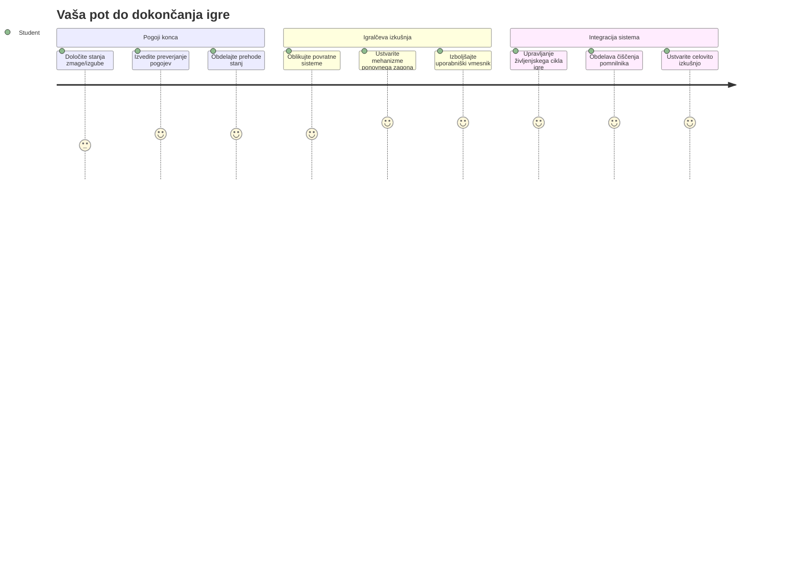
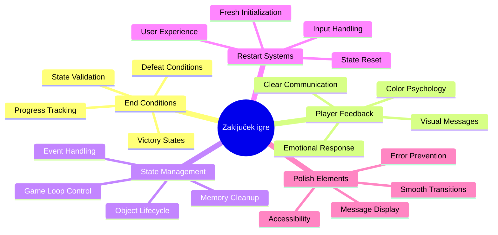
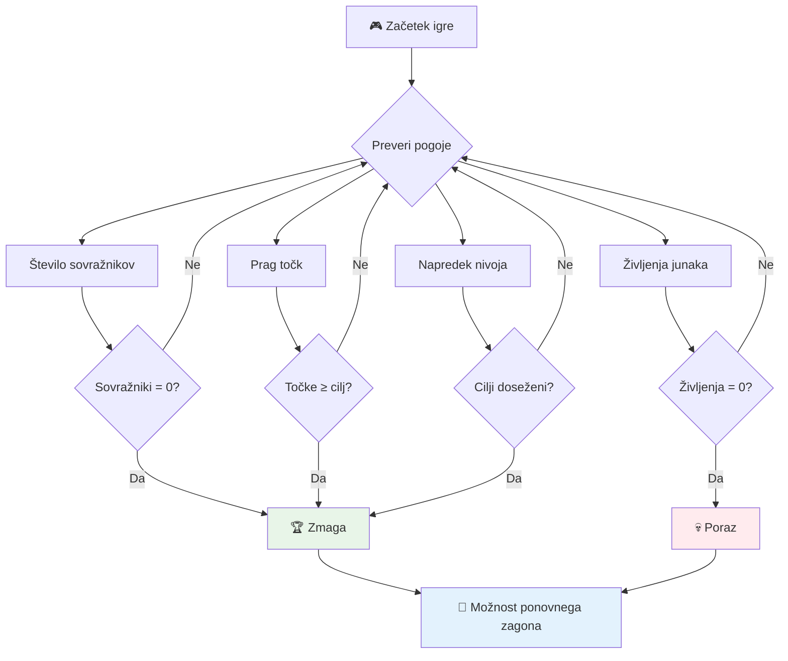
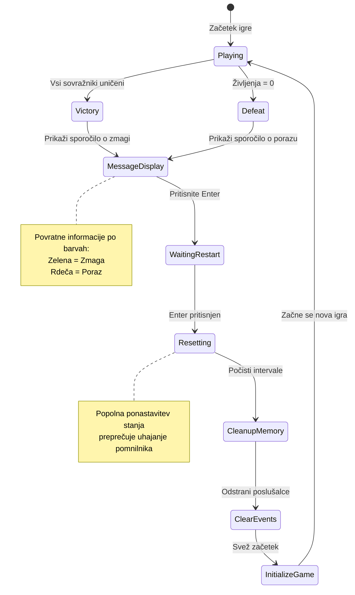
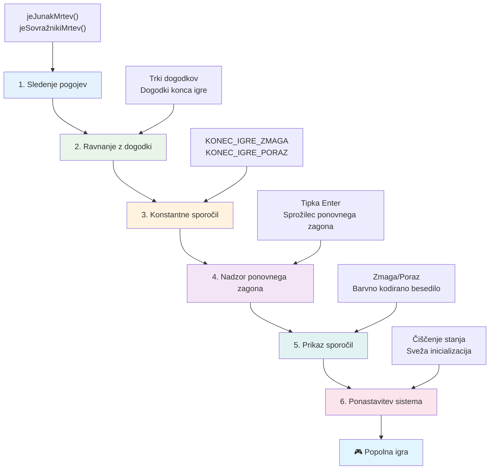
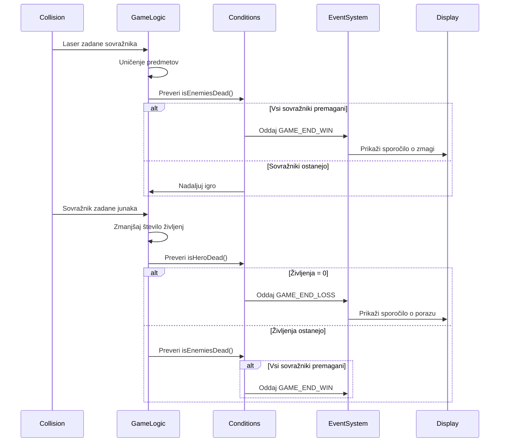
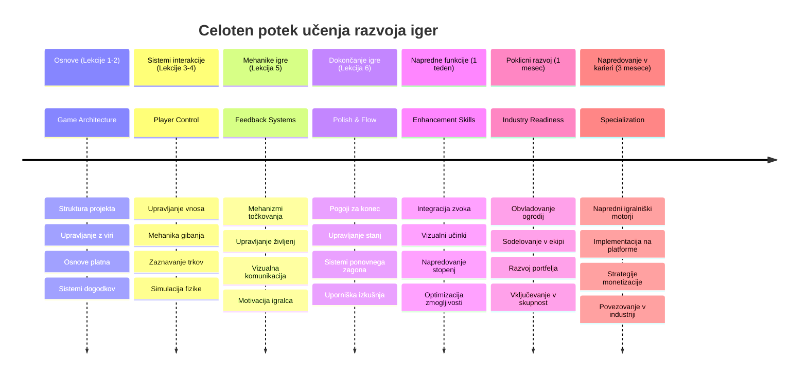

<!--
CO_OP_TRANSLATOR_METADATA:
{
  "original_hash": "a4b78043f4d64bf3ee24e0689b8b391d",
  "translation_date": "2026-01-07T10:05:31+00:00",
  "source_file": "6-space-game/6-end-condition/README.md",
  "language_code": "sl"
}
-->
# Ustvarjanje vesoljske igre, 6. del: Konec in ponovni začetek


Vsaka odlična igra potrebuje jasne pogoje za konec in tekoč mehanizem za ponovni začetek. Ustvarili ste impresivno vesoljsko igro z gibanjem, bojem in točkovanjem – zdaj je čas, da dodate zadnje dele, ki jo naredijo popolno.

Vaša igra trenutno teče v nedogled, podobno kot Voyagerjevi sondi, ki jih je NASA lansirala leta 1977 – še vedno potujeta po vesolju desetletja pozneje. Medtem ko je to dovoljeno za vesoljske raziskave, igre potrebujejo določene končne točke, da ustvarijo zadovoljive izkušnje.

Danes bomo udejanjili prave pogoje za zmago/poraz in sistem ponovnega zagona. Do konca te lekcije boste imeli zaključeno igro, ki jo lahko igralci dokončajo in ponovno zaigrajo, tako kot klasične arkadne igre, ki so zaznamovale ta medij.


## Predpredavalni kviz

[Predpredavalni kviz](https://ff-quizzes.netlify.app/web/quiz/39)

## Razumevanje pogojev za konec igre

Kdaj bi se morala vaša igra končati? To temeljno vprašanje oblikuje zasnovo iger že od zgodnjih arkadnih časov. Pac-Man se konča, ko vas ujamejo duhovi ali počistite vse pikice, medtem ko se Space Invaders konča, ko nezemljani dosežejo dno ali jih vse uničite.

Kot ustvarjalec igre določate pogoje za zmago in poraz. Za našo vesoljsko igro so tukaj preizkušeni pristopi, ki ustvarjajo zabavno igranje:


- **Uničenih je bilo `N` sovražnih ladij**: Pogosto, če igro razdelite na različne nivoje, morate uničiti `N` sovražnih ladij, da dokončate nivo
- **Vaša ladja je bila uničena**: Obstajajo igre, kjer izgubite, če je vaša ladja uničena. Pogost pristop je tudi koncept življenj. Vsakič, ko je vaša ladja uničena, izgubite eno življenje. Ko so vsi življenja porabljena, potem izgubite igro.
- **Zbrali ste `N` točk**: Še en pogost pogoj za konec je zbrati določeno število točk. Kako pridobivate točke, je vaša odločitev, pogosto pa se točke dodelijo za različne aktivnosti, kot je uničenje sovražne ladje ali zbiranje predmetov, ki *padejo* ob uničenju.
- **Dokončanje nivoja**: To lahko vključuje več pogojev, kot so `X` uničenih sovražnih ladij, `Y` zbranih točk ali morda, da je bil zbran določen predmet.

## Izvedba funkcionalnosti ponovnega zagona igre

Dobre igre spodbujajo ponovno igranje z gladkimi mehanizmi za ponovni začetek. Ko igralci dokončajo igro (ali doživijo poraz), želijo pogosto takoj poskusiti znova – bodisi za izboljšanje svojih rezultatov ali napredovanje.


Tetris to popolnoma ponazori: ko vaši bloki dosežejo vrh, lahko takoj začnete novo igro brez zapletenih menijev. Zgradili bomo podoben sistem ponovnega zagona, ki čisto ponastavi stanje igre in igralce hitro spravi nazaj v akcijo.

✅ **Razmislek**: Pomislite na igre, ki ste jih igrali. Pod kakšnimi pogoji se končajo in kako vas pozovejo k ponovnemu zagonu? Kaj naredi izkušnjo ponovnega zagona tekočo in kaj frustrirajočo?

## Kaj boste ustvarili

Izvedli boste zadnje funkcije, ki vaš projekt spremenijo v celovito igralno izkušnjo. Ti elementi ločijo polirane igre od osnovnih prototipov.

**Danes dodajamo naslednje:**

1. **Pogoj za zmago**: Uničite vse sovražnike in doživite pravo praznovanje (zaslužili ste si ga!)
2. **Pogoj za poraz**: Ko izgubite vsa življenja, vas pričaka zaslon s porazom
3. **Mehanizem za ponovni začetek**: Pritisnite Enter, da takoj znova začnete – ena igra nikoli ni dovolj
4. **Upravljanje stanja**: Čista plošča vsakič – brez preostalih sovražnikov ali čudnih napak iz prejšnje igre

## Začetek

Pripravimo vaše razvojno okolje. Morali bi imeti pripravljene vse datoteke vaše vesoljske igre iz prejšnjih lekcij.

**Vaš projekt naj bo videti nekako tako:**

```bash
-| assets
  -| enemyShip.png
  -| player.png
  -| laserRed.png
  -| life.png
-| index.html
-| app.js
-| package.json
```

**Zaženite razvojni strežnik:**

```bash
cd your-work
npm start
```

**Ta ukaz:**
- Zažene lokalni strežnik na `http://localhost:5000`
- Pravilno streže vaše datoteke
- Samodejno osveži ob spremembah

Odprite `http://localhost:5000` v brskalniku in preverite, da vaša igra teče. Morali bi se lahko premikali, streljali in interagirali s sovražniki. Ko je to potrjeno, nadaljujemo z izvedbo.

> 💡 **Nasvet**: Da se izognete opozorilom v Visual Studio Code, deklarirajte `gameLoopId` na vrhu datoteke kot `let gameLoopId;` namesto znotraj funkcije `window.onload`. To sledi sodobnim JavaScript praksam deklariranja spremenljivk.


## Koraki izvedbe

### 1. korak: Ustvarite funkcije za sledenje pogojem za konec

Potrebujemo funkcije, ki bodo spremljale, kdaj se igra mora končati. Tako kot senzorji na Mednarodni vesoljski postaji, ki nepremično nadzorujejo kritične sisteme, bodo te funkcije nenehno preverjale stanje igre.

```javascript
function isHeroDead() {
  return hero.life <= 0;
}

function isEnemiesDead() {
  const enemies = gameObjects.filter((go) => go.type === "Enemy" && !go.dead);
  return enemies.length === 0;
}
```

**Tukaj se dogaja pod pokrovom:**
- **Preverja**, ali je naš junak brez življenj (auč!)
- **Šteje**, koliko sovražnikov je še živih in aktivnih
- **Vrne** `true`, ko je bojišče očiščeno sovražnikov
- **Uporablja** preprosto logiko resnično/neresnično za jasnost
- **Filtrira** vse igralne objekte, da najde preživele

### 2. korak: Posodobite obravnavo dogodkov za pogoje konca

Sedaj bomo te preglede stanja povezali z dogodkovnim sistemom igre. Vsakič, ko pride do trka, bo igra ocenila, ali sproži pogoj za konec. Tako dobimo takojšen odziv na ključne dogodke.


```javascript
eventEmitter.on(Messages.COLLISION_ENEMY_LASER, (_, { first, second }) => {
    first.dead = true;
    second.dead = true;
    hero.incrementPoints();

    if (isEnemiesDead()) {
      eventEmitter.emit(Messages.GAME_END_WIN);
    }
});

eventEmitter.on(Messages.COLLISION_ENEMY_HERO, (_, { enemy }) => {
    enemy.dead = true;
    hero.decrementLife();
    if (isHeroDead())  {
      eventEmitter.emit(Messages.GAME_END_LOSS);
      return; // izguba pred zmago
    }
    if (isEnemiesDead()) {
      eventEmitter.emit(Messages.GAME_END_WIN);
    }
});

eventEmitter.on(Messages.GAME_END_WIN, () => {
    endGame(true);
});
  
eventEmitter.on(Messages.GAME_END_LOSS, () => {
  endGame(false);
});
```

**Tukaj se dogaja:**
- **Laser zadel sovražnika**: Oba izgineva, dobite točke in preverimo, če ste zmagali
- **Sovražnik zadel vas**: Izgubite življenje in preverimo, če ste še živi
- **Pameten vrstni red**: Najprej preverimo poraz (noben ne želi hkrati zmagati in izgubiti!)
- **Takojšnji odziv**: Ko se zgodi nekaj pomembnega, o tem igra takoj ve

### 3. korak: Dodajte nove konstante za sporočila

Potrebovali boste dodati nove tipe sporočil v svoj objekt `Messages`. Te konstante pomagajo ohranjati skladnost in preprečujejo tipkarske napake v sistemu dogodkov.

```javascript
GAME_END_LOSS: "GAME_END_LOSS",
GAME_END_WIN: "GAME_END_WIN",
```

**V zgornjem smo:**
- **Dodali** konstante za dogodke konca igre za boljšo skladnost
- **Uporabljali** opisna imena, ki jasno kažejo namen dogodka
- **Sledili** obstoječi konvenciji poimenovanja tipov sporočil

### 4. korak: Izvedite kontrole za ponovni začetek

Zdaj dodajte tipkovne kontrole, ki igralcem omogočajo ponovni začetek igre. Tipka Enter je naravna izbira, saj je pogosto povezana z potrjevanjem dejanj in začetkom novih iger.

**Dodajte zaznavanje tipke Enter v vaš obstoječi `keydown` poslušalec:**

```javascript
else if(evt.key === "Enter") {
   eventEmitter.emit(Messages.KEY_EVENT_ENTER);
}
```

**Dodajte novo konstanto za sporočilo:**

```javascript
KEY_EVENT_ENTER: "KEY_EVENT_ENTER",
```

**Kaj morate vedeti:**
- **Razširja** vaš trenutni sistem za obravnavo tipkovnih dogodkov
- **Uporablja** tipko Enter kot sprožilec za ponovni začetek za intuitivno uporabo
- **Pošilja** prilagojen dogodek, ki ga lahko drugi deli vaše igre poslušajo
- **Ohranja** isti vzorec kot preostale tipkovne nastavitve

### 5. korak: Ustvarite sistem prikaza sporočil

Vaša igra mora jasno komunicirati rezultate igralcem. Ustvarili bomo sistem sporočil, ki prikaže vrste zmag in porazov z barvno kodiranim besedilom, podobno kot terminalski vmesniki zgodnjih računalnikov, kjer je zelena pomenila uspeh, rdeča pa napake.

**Ustvarite funkcijo `displayMessage()`:**

```javascript
function displayMessage(message, color = "red") {
  ctx.font = "30px Arial";
  ctx.fillStyle = color;
  ctx.textAlign = "center";
  ctx.fillText(message, canvas.width / 2, canvas.height / 2);
}
```

**Korak za korakom, tukaj se dogaja:**
- **Nastavi** velikost pisave in družino za jasno, berljivo besedilo
- **Uporabi** barvni parameter z "rdečo" kot privzeto za opozorila
- **Centrira** besedilo horizontalno in vertikalno na platnu
- **Uporablja** sodobne privzete parametre JavaScripta za barvne možnosti
- **Izkorišča** 2D kontekst platna za neposredno risanje besedila

**Ustvarite funkcijo `endGame()`:**

```javascript
function endGame(win) {
  clearInterval(gameLoopId);

  // Nastavite zamik, da zagotovite dokončanje vseh čakajočih upodobitev
  setTimeout(() => {
    ctx.clearRect(0, 0, canvas.width, canvas.height);
    ctx.fillStyle = "black";
    ctx.fillRect(0, 0, canvas.width, canvas.height);
    if (win) {
      displayMessage(
        "Victory!!! Pew Pew... - Press [Enter] to start a new game Captain Pew Pew",
        "green"
      );
    } else {
      displayMessage(
        "You died !!! Press [Enter] to start a new game Captain Pew Pew"
      );
    }
  }, 200)  
}
```

**Kaj ta funkcija počne:**
- **Zmrzne** vse na mestu – ni več premikajočih ladij ali laserjev
- **Vzame** majhno pavzo (200ms), da zadnji okvir dokonča risanje
- **Počisti** zaslon in ga pobarva črno za dramatičen učinek
- **Prikaže** različna sporočila za zmagovalce in poražence
- **Barvno kodira** novice – zeleno za dobro, rdeče za... no, ne tako dobro
- **Pove** igralcem, kako se hitro ponovno vključiti

### 🔄 **Pedagoški pregled**
**Upravljanje stanja igre**: Pred izvedbo ponastavitve poskrbite, da razumete:
- ✅ Kako pogoji za konec ustvarjajo jasne cilje igranja
- ✅ Zakaj je vizualna povratna informacija bistvena za razumevanje igralca
- ✅ Pomen pravilnega čiščenja za preprečevanje puščanja pomnilnika
- ✅ Kako arhitektura, ki temelji na dogodkih, omogoča čiste prehode stanja

**Hitri samopreizkus**: Kaj bi se zgodilo, če pri ponastavitvi ne bi odstranili poslušalcev dogodkov?
*Odgovor: Puščanje pomnilnika in podvojeni dogodkovni upravljalci povzročajo nepredvidljivo vedenje*

**Načela oblikovanja iger**: Sedaj izvajate:
- **Jasne cilje**: Igralci natančno vedo, kaj pomeni zmaga in poraz
- **Takojšnji odziv**: Spremembe stanja igre se sporočajo takoj
- **Nadzor uporabnika**: Igralci lahko ponovno začnejo, ko želijo
- **Zanesljivost sistema**: Pravilno čiščenje preprečuje hrošče in težave z zmogljivostjo

### 6. korak: Izvedite funkcijo ponastavitve igre

Sistem ponastavitve mora popolnoma počistiti trenutno stanje igre in inicializirati novo igranje. To zagotavlja čist začetek brez preostalih podatkov iz prejšnje igre.

**Ustvarite funkcijo `resetGame()`:**

```javascript
function resetGame() {
  if (gameLoopId) {
    clearInterval(gameLoopId);
    eventEmitter.clear();
    initGame();
    gameLoopId = setInterval(() => {
      ctx.clearRect(0, 0, canvas.width, canvas.height);
      ctx.fillStyle = "black";
      ctx.fillRect(0, 0, canvas.width, canvas.height);
      drawPoints();
      drawLife();
      updateGameObjects();
      drawGameObjects(ctx);
    }, 100);
  }
}
```

**Razložimo vsak del:**
- **Preveri**, ali zanka igre trenutno teče, preden ponastavi
- **Počisti** obstoječo zanko igre, da ustavi vse trenutne aktivnosti
- **Odstrani** vse poslušalce dogodkov, da prepreči puščanje pomnilnika
- **Ponovno inicializira** stanje igre z novimi objekti in spremenljivkami
- **Zažene** novo zanko igre z vsemi potrebnimi funkcijami
- **Ohranja** interval 100ms za enotno zmogljivost igre

**Dodajte obravnavo tipke Enter v funkcijo `initGame()`:**

```javascript
eventEmitter.on(Messages.KEY_EVENT_ENTER, () => {
  resetGame();
});
```

**Dodajte metodo `clear()` v svojo razred EventEmitter:**

```javascript
clear() {
  this.listeners = {};
}
```

**Ključne točke:**
- **Poveže** pritisk tipke Enter s funkcijo ponovnega zagona igre
- **Registrira** tega poslušalca med inicializacijo igre
- **Nudi** čist način za odstranitev vseh poslušalcev pri ponastavitvi
- **Preprečuje** puščanje pomnilnika z čiščenjem upravljalcev med igrami
- **Ponastavi** objekt poslušalcev na prazen za svežo inicializacijo

## Čestitamo! 🎉

👽 💥 🚀 Uspešno ste zgradili popolno igro od začetka do konca. Tako kot programerji, ki so ustvarili prve video igre v 70. letih prejšnjega stoletja, ste preoblikovali vrstice kode v interaktivno izkušnjo s pravimi mehanikami igre in povratnimi informacijami za uporabnika. 🚀 💥 👽

**Dosegli ste:**
- **Izvedli** popolne pogoje za zmago in poraz z uporabniško povratno informacijo
- **Ustvarili** nemoten sistem ponovnega zagona za neprekinjeno igranje
- **Oblikovali** jasno vizualno komunikacijo stanja igre
- **Upravili** kompleksna stanja igre in čiščenje
- **Sestavili** vse dele v skladno, igrivo celoto

### 🔄 **Pedagoški pregled**
**Celovit sistem razvoja iger**: Praznujte mojstrstvo celotnega razvojnega cikla igre:
- ✅ Kako pogoji za konec ustvarjajo zadovoljive igralne izkušnje?
- ✅ Zakaj je pravilno upravljanje stanja ključno za stabilnost igre?
- ✅ Kako vizualna povratna informacija izboljša razumevanje igralca?
- ✅ Kakšno vlogo ima sistem ponovnega zagona pri zadržanju igralcev?

**Obvladovanje sistema**: Vaša popolna igra prikazuje:
- **Full-Stack razvoj iger**: Od grafike do vhodov in upravljanja stanja
- **Profesionalno arhitekturo**: Dogodkovno usmerjeni sistemi s pravim čiščenjem
- **Oblikovanje uporabniške izkušnje**: Jasna povratna informacija in intuitivne kontrole
- **Optimizacijo zmogljivosti**: Učinkovito upodabljanje in upravljanje pomnilnika
- **Poliranost in popolnost**: Vse podrobnosti, zaradi katerih igra deluje dovršeno

**Veščine, pripravljene za industrijo**: Uvedli ste:
- **Arhitekturo zanke igre**: Sistemi v realnem času z enotno zmogljivostjo
- **Programiranje, usmerjeno na dogodke**: Ločeni sistemi, ki učinkovito skalirajo
- **Upravljanje stanja**: Kompleksno upravljanje podatkov in življenjskega cikla
- **Oblikovanje uporabniškega vmesnika**: Jasna komunikacija in odzivne kontrole
- **Testiranje in odpravljanje napak**: Iterativni razvoj in reševanje problemov

### ⚡ **Kaj lahko naredite v naslednjih 5 minutah**
- [ ] Zaigrajte svojo popolno igro in preizkusite vse pogoje zmage in poraza
- [ ] Eksperimentirajte z različnimi parametri pogojev za konec
- [ ] Dodajte izjave console.log za sledenje spremembam stanja igre
- [ ] Delite igro s prijatelji in zberite povratne informacije

### 🎯 **Kaj lahko dosežete v tem enem letu**
- [ ] Dokončajte izboljšano vesoljsko igro z več nivoji in napredovanjem
- [ ] Dodajte napredne funkcije, kot so povečave, različni tipi sovražnikov in posebna orožja
- [ ] Ustvarite sistem visokih rezultatov s trajnim shranjevanjem
- [ ] Oblikujte uporabniške vmesnike za menije, nastavitve in možnosti igre
- [ ] Optimizirajte zmogljivost za različne naprave in brskalnike
- [ ] Objavite igro na spletu in jo delite z skupnostjo
### 🌟 **Vaša mesečna kariera razvoja iger**
- [ ] Ustvarite več popolnih iger, raziskujte različne zvrsti in mehanike
- [ ] Naučite se naprednih ogrodij za razvoj iger, kot so Phaser ali Three.js
- [ ] Prispevajte k odprtokodnim projektom razvoja iger
- [ ] Študirajte principe oblikovanja iger in psihologijo igralcev
- [ ] Ustvarite portfelj, ki prikazuje vaše sposobnosti razvoja iger
- [ ] Povežite se s skupnostjo razvijalcev iger in nadaljujte z učenjem

## 🎯 Vaš celovit časovni načrt za obvladovanje razvoja iger


### 🛠️ Povzetek vašega celovitega nabora orodij za razvoj iger

Po zaključku celotne serije vesoljskih iger ste zdaj obvladali:
- **Arhitekturo iger**: Sisteme, ki temeljijo na dogodkih, zanke iger in upravljanje stanja
- **Programiranje grafike**: Canvas API, upodabljanje sprite-ov in vizualne učinke
- **Vhodne sisteme**: Upravljanje tipkovnice, zaznavanje trkov in odzivni krmilniki
- **Oblikovanje iger**: Povratne informacije igralcev, sistemi napredovanja in mehanike angažiranosti
- **Optimizacijo zmogljivosti**: Učinkovito upodabljanje, upravljanje pomnilnika in nadzor hitrosti sličic
- **Uporabniško izkušnjo**: Jasna komunikacija, intuitivni krmilniki in podrobnosti za dovršenost
- **Profesionalne vzorce**: Čista koda, tehnike odpravljanja napak in organizacija projektov

**Praktične rabe v resničnem svetu**: Vaše veščine razvoja iger neposredno uporabite za:
- **Interaktivne spletne aplikacije**: Dinamični vmesniki in sistemi v realnem času
- **Vizualizacijo podatkov**: Animirani grafi in interaktivna grafika
- **Izobraževalno tehnologijo**: Gamifikacijo in privlačne učne izkušnje
- **Mobilni razvoj**: Interakcije na dotik in optimizacijo zmogljivosti
- **Simulacijsko programsko opremo**: Fizikalni motorji in modeliranje v realnem času
- **Kreativne industrije**: Interaktivna umetnost, zabava in digitalne izkušnje

**Pridobljene profesionalne veščine**: Zdaj lahko:
- **Arhitekturirate** kompleksne interaktivne sisteme od začetka
- **Odpravljate napake** v aplikacijah v realnem času z uporabo sistematičnih pristopov
- **Optimizirate** zmogljivost za tekoče uporabniške izkušnje
- **Oblikujete** privlačne uporabniške vmesnike in vzorce interakcij
- **Sodelujete** učinkovito na tehničnih projektih z ustrezno organizacijo kode

**Obvladani koncepti razvoja iger**:
- **Sistemi v realnem času**: Zanke iger, upravljanje hitrosti sličic in zmogljivost
- **Arhitektura, ki temelji na dogodkih**: Ločeni sistemi in prenos sporočil
- **Upravljanje stanja**: Kompleksno upravljanje podatkov in življenjski cikel
- **Programiranje uporabniškega vmesnika**: Canvas grafika in odziven dizajn
- **Teorija oblikovanja iger**: Psihologija igralcev in mehanike angažiranosti

**Naslednja stopnja**: Pripravljeni ste raziskati napredna ogrodja za igre, 3D grafiko, večigralske sisteme ali se preusmeriti v profesionalne vloge razvoja iger!

🌟 **Dosežek odklenjen**: Zaključili ste celotno pot razvoja igre in ustvarili interaktivno izkušnjo profesionalne kakovosti iz nič!

**Dobrodošli v skupnost razvijalcev iger!** 🎮✨

## GitHub Copilot Agent izziv 🚀

Uporabite način Agenta za dokončanje naslednjega izziva:

**Opis:** Izboljšajte vesoljsko igro z implementacijo sistema napredovanja stopenj z naraščajočo težavnostjo in bonus funkcijami.

**Navodilo:** Ustvarite sistem več stopenj vesoljske igre, kjer ima vsaka stopnja več sovražnih ladij z večjo hitrostjo in zdravjem. Dodajte točkovni množevalnik, ki se povečuje s stopnjami, in implementirajte power-upe (kot so hitra paljba ali ščit), ki se naključno pojavljajo ob uničenju sovražnikov. Vključite bonus za dokončano stopnjo in na zaslonu prikažite trenutno stopnjo poleg že obstoječih točk in življenj.

Več o [načinu agenta](https://code.visualstudio.com/blogs/2025/02/24/introducing-copilot-agent-mode) izveste tukaj.

## 🚀 Neobvezni izziv za izboljšavo

**Dodajte zvok vaši igri**: Izboljšajte svojo igralno izkušnjo z implementacijo zvočnih učinkov! Razmislite o dodajanju zvoka za:

- **Laserje** ob streljanju igralca
- **Unicenje sovraznikov** ob zadevanju ladij
- **Poškodbe junaka** ko igralec prejme udarce
- **Zmagovalna glasba** ob zmagi v igri
- **Zvok poraza** ob izgubi igre

**Primer implementacije zvoka:**

```javascript
// Ustvari zvočne objekte
const laserSound = new Audio('assets/laser.wav');
const explosionSound = new Audio('assets/explosion.wav');

// Predvajaj zvoke med dogodki v igri
function playLaserSound() {
  laserSound.currentTime = 0; // Ponastavi na začetek
  laserSound.play();
}
```

**Kaj morate vedeti:**
- **Ustvarja** zvočne objekte za različne zvočne učinke
- **Ponastavi** `currentTime`, kar omogoča zvočne učinke hitre paljbe
- **Upravlja** politike samodejnega predvajanja brskalnika s sprožitvijo zvokov preko uporabniških interakcij
- **Upravljanje** glasnosti in časa za boljšo igralno izkušnjo

> 💡 **Viri za učenje**: Raziskujte ta [zvočni peskovnik](https://www.w3schools.com/jsref/tryit.asp?filename=tryjsref_audio_play), da se naučite več o implementaciji zvoka v JavaScript igrah.

## Kviz po predavanju

[Kviz po predavanju](https://ff-quizzes.netlify.app/web/quiz/40)

## Pregled & samostojno učenje

Vaša naloga je ustvariti novo vzorčno igro, zato raziskujte nekatere zanimive igre, da vidite, kakšno igro bi lahko ustvarili.

## Naloga

[Ustvarite vzorčno igro](assignment.md)

---

<!-- CO-OP TRANSLATOR DISCLAIMER START -->
**Opozarilo**:  
Ta dokument je bil preveden z uporabo AI prevajalske storitve [Co-op Translator](https://github.com/Azure/co-op-translator). Čeprav si prizadevamo za natančnost, vas opozarjamo, da lahko avtomatizirani prevodi vsebujejo napake ali netočnosti. Izvirni dokument v njegovem izvirnem jeziku velja za pristno in dokončno referenco. Za ključne informacije priporočamo strokoven človeški prevod. Nismo odgovorni za morebitne nesporazume ali napačne interpretacije, ki izhajajo iz uporabe tega prevoda.
<!-- CO-OP TRANSLATOR DISCLAIMER END -->