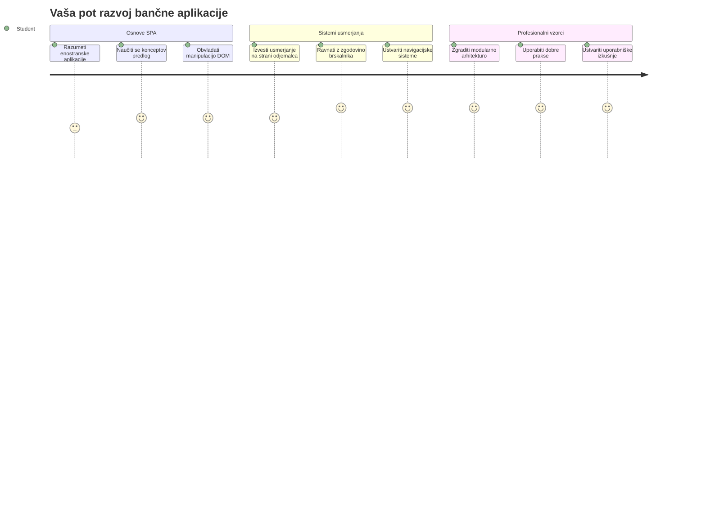
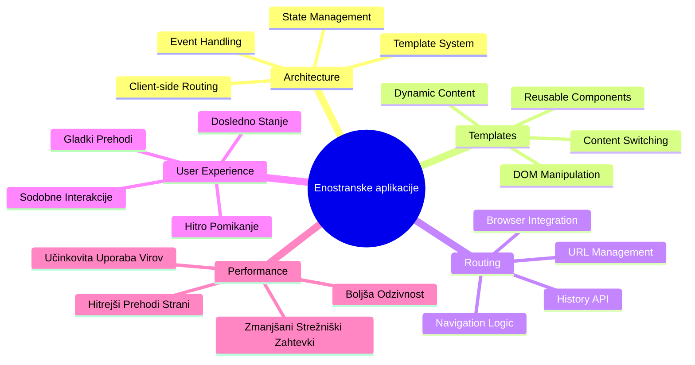
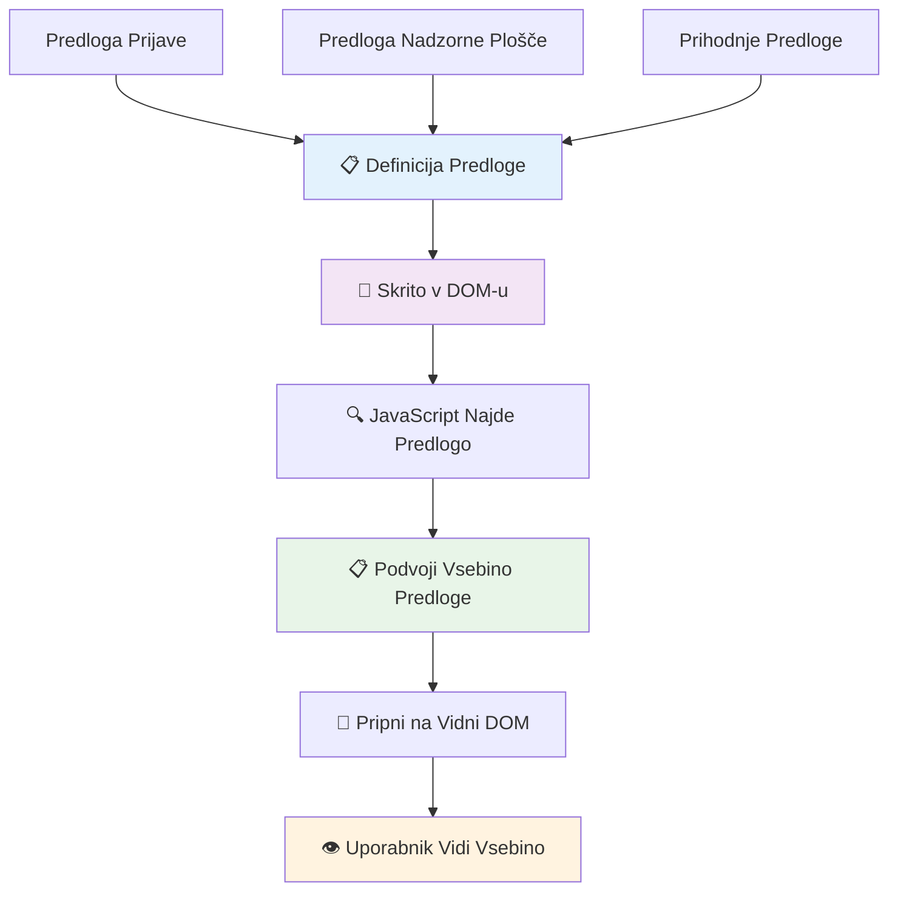
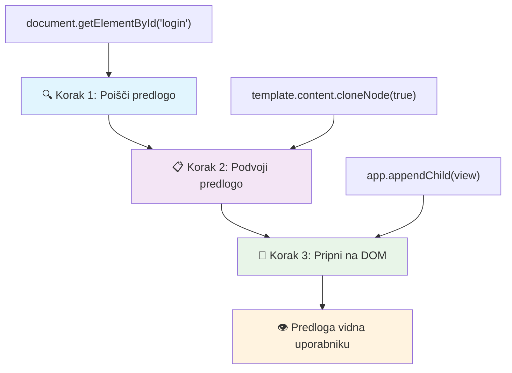
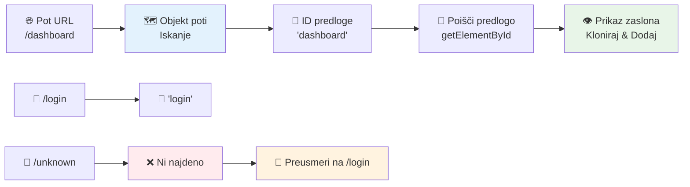
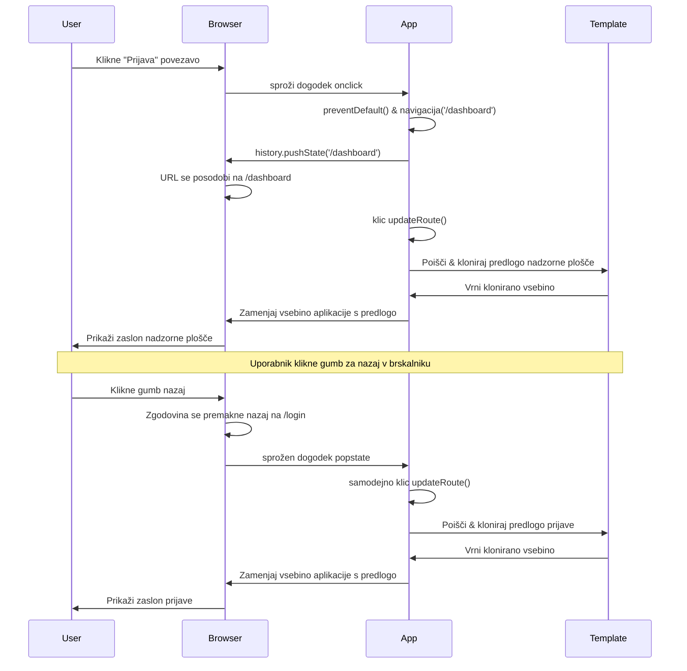
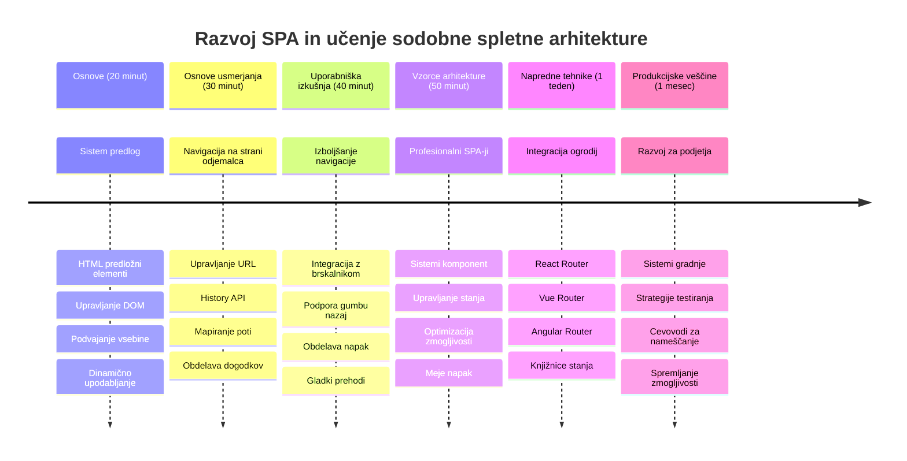

<!--
CO_OP_TRANSLATOR_METADATA:
{
  "original_hash": "351678bece18f07d9daa987a881fb062",
  "translation_date": "2026-01-07T10:21:41+00:00",
  "source_file": "7-bank-project/1-template-route/README.md",
  "language_code": "sl"
}
-->
# Izdelava bančne aplikacije 1. del: HTML predloge in poti v spletni aplikaciji


Ko je Apollo 11 leta 1969 s pomočjo krmilnega računalnika navigiral do lune, je moral preklapljati med različnimi programi, ne da bi znova zagnal celoten sistem. Sodobne spletne aplikacije delujejo podobno – spremenijo, kar vidite, brez ponovnega nalaganja vsega od začetka. To omogoča gladko in odzivno izkušnjo, ki jo danes uporabniki pričakujejo.

Za razliko od tradicionalnih spletnih mest, ki za vsak klik naložijo celotno stran, sodobne spletne aplikacije posodobijo le tiste dele, ki jih je treba spremeniti. Ta pristop, podobno kot nadzor misije, ki preklaplja med različnimi zasloni ob ohranjanju stalne komunikacije, ustvarja tekočo izkušnjo, ki smo je navajeni.

Tukaj je, kaj povzroči tako dramatično razliko:

| Tradicionalne večstranske aplikacije | Sodobne enostranske aplikacije |
|--------------------------------------|--------------------------------|
| **Navigacija** | Polno ponovno nalaganje vsakega zaslona | Trenutno preklapljanje vsebine |
| **Zmiganljivost** | Počasnejše zaradi prenosa celotnega HTML | Hitrejše z delnimi posodobitvami |
| **Uporabniška izkušnja** | Motene utripajoče strani | Gladki, aplikaciji podobni prehodi |
| **Deljenje podatkov** | Težavno med stranmi | Enostavno upravljanje stanja |
| **Razvoj** | Več HTML datotek za vzdrževanje | Ena HTML z dinamičnimi predlogami |

**Razumevanje razvoja:**
- **Tradicionalne aplikacije** zahtevajo strežniške zahtevke za vsako navigacijo
- **Sodobni SPA** naložijo enkrat in dinamično posodabljajo vsebino s pomočjo JavaScript
- **Pričakovanja uporabnikov** zdaj zahtevajo takojšnje in nemotene interakcije
- **Prednosti zmogljivosti** vključujejo manjšo porabo pasovne širine in hitrejše odzive

V tej lekciji bomo zgradili bančno aplikacijo z več zasloni, ki tekoče sodelujejo. Tako kot znanstveniki uporabljajo modularne instrumente, ki jih je mogoče preurejati za različne eksperimente, bomo uporabili HTML predloge kot ponovno uporabne komponente, ki se prikažejo po potrebi.

Delali bomo s HTML predlogami (ponovno uporabnimi načrti za različne zaslone), JavaScript usmerjanjem (sistem, ki preklaplja med zasloni) in zgodovinskim API-jem brskalnika (ki ohranja gumb za nazaj delujoč). To so iste osnovne tehnike, ki jih uporabljajo ogrodja, kot so React, Vue in Angular.

Na koncu boste imeli delujočo bančno aplikacijo, ki prikazuje profesionalna načela enostranske aplikacije.


## Predpredavalni kviz

[Predpredavalni kviz](https://ff-quizzes.netlify.app/web/quiz/41)

### Kaj boste potrebovali

Potrebovali bomo lokalni spletni strežnik za testiranje naše bančne aplikacije – brez skrbi, lažje kot se sliši! Če še nimate nastavljenega, samo namestite [Node.js](https://nodejs.org) in zaženite `npx lite-server` v mapi projekta. Ta priročen ukaz zažene lokalni strežnik in samodejno odpre vašo aplikacijo v brskalniku.

### Priprava

Na vašem računalniku ustvarite mapo z imenom `bank` in v njej datoteko z imenom `index.html`. Začeli bomo s tem HTML [boilerplate](https://en.wikipedia.org/wiki/Boilerplate_code):

```html
<!DOCTYPE html>
<html lang="en">
  <head>
    <meta charset="UTF-8">
    <meta name="viewport" content="width=device-width, initial-scale=1.0">
    <title>Bank App</title>
  </head>
  <body>
    <!-- This is where you'll work -->
  </body>
</html>
```

**Tukaj je, kaj ta boilerplate zagotavlja:**
- **Vzpostavlja** strukturo HTML5 dokumenta s pravilno DOCTYPE deklaracijo
- **Nastavi** kodiranje znakov na UTF-8 za podporo mednarodnemu besedilu
- **Omogoča** odziven dizajn z oznako viewport za mobilno združljivost
- **Nastavi** opisni naslov, ki se pojavi na zavihku brskalnika
- **Ustvari** čisto telo, kjer bomo gradili našo aplikacijo

> 📁 **Predogled strukture projekta**
> 
> **Do konca te lekcije bo vaš projekt vseboval:**
> ```
> bank/
> ├── index.html      <!-- Main HTML with templates -->
> ├── app.js          <!-- Routing and navigation logic -->
> └── style.css       <!-- (Optional for future lessons) -->
> ```
> 
> **Odgovornosti datotek:**
> - **index.html**: Vsebuje vse predloge in zagotavlja strukturo aplikacije
> - **app.js**: Upravljanje usmerjanja, navigacije in predlog
> - **Predloge**: Določajo uporabniški vmesnik za prijavo, nadzorno ploščo in druge zaslone

---

## HTML predloge

Predloge rešujejo temeljni problem spletnega razvoja. Ko je Gutenberg v 1440-ih izumil tisk s premičnimi tipi, je spoznal, da namesto rezljanja celih strani lahko ustvari ponovno uporabne črkovne bloke in jih po potrebi sestavi. HTML predloge delujejo po istem principu – namesto da ustvarjate ločene HTML datoteke za vsak zaslon, definirate ponavljajoče se strukture, ki jih lahko prikažete, kadar jih potrebujete.


Predstavljajte si predloge kot načrte za različne dele vaše aplikacije. Tako kot arhitekt ustvari en načrt in ga večkrat uporabi, namesto da nariše natančno enake sobe, tudi mi ustvarimo predloge enkrat in jih po potrebi uporabimo. Brskalnik te predloge skriva, dokler jih JavaScript ne aktivira.

Če želite ustvariti več zaslonov za spletno stran, bi bila ena rešitev ustvariti eno HTML datoteko za vsak zaslon, ki ga želite prikazati. Vendar ta rešitev prinaša nekaj nevšečnosti:

- Ob preklopu zaslona morate ponovno naložiti celoten HTML, kar je lahko počasi.
- Težko je deliti podatke med različnimi zasloni.

Drugi pristop je imeti samo eno HTML datoteko in definirati več [HTML predlog](https://developer.mozilla.org/docs/Web/HTML/Element/template) z elementom `<template>`. Predloga je ponovno uporabni blok HTML, ki ga brskalnik ne prikaže, vendar ga je treba ob zagonu programa z JavaScript aktivirati.

### Začnimo z gradnjo

Ustvarili bomo bančno aplikacijo z dvema glavnim zaslonoma: prijavno stranjo in nadzorno ploščo. Najprej dodajmo rezervirano mesto v telo HTML – tu se bodo prikazovali vsi naši različni zasloni:

```html
<div id="app">Loading...</div>
```

**Razumevanje tega rezerviranega mesta:**
- **Ustvari** vsebnik z ID-jem "app", kjer se bodo prikazali vsi zasloni
- **Prikaže** sporočilo o nalaganju, dokler JavaScript ne inicializira prvega zaslona
- **Nudi** eno točko priključitve za dinamično vsebino
- **Omogoča** enostavno ciljanje iz JavaScript s `document.getElementById()`

> 💡 **Profesionalni nasvet**: Ker bomo vsebino tega elementa zamenjali, lahko dodamo sporočilo ali indikator nalaganja, ki se prikaže med nalaganjem aplikacije.

Nato pod to dodajmo HTML predlogo za prijavni zaslon. Za zdaj bomo tam dali le naslov in odsek z povezavo, ki jo bomo uporabili za navigacijo.

```html
<template id="login">
  <h1>Bank App</h1>
  <section>
    <a href="/dashboard">Login</a>
  </section>
</template>
```

**Razčlenitev te prijavne predloge:**
- **Določi** predlogo z enoličnim ID-jem "login" za ciljanje iz JavaScript
- **Vključuje** glavni naslov, ki določa blagovno znamko aplikacije
- **Vsebuje** semantični element `<section>` za skupino povezanih vsebin
- **Nudi** navigacijsko povezavo, ki bo uporabnike vodila na nadzorno ploščo

Nato dodamo še eno HTML predlogo za stran nadzorne plošče. Ta stran bo vsebovala različne oddelke:

- Glavo z naslovom in povezavo za odjavo
- Trenutno stanje bančnega računa
- Seznam transakcij, prikazan v tabeli

```html
<template id="dashboard">
  <header>
    <h1>Bank App</h1>
    <a href="/login">Logout</a>
  </header>
  <section>
    Balance: 100$
  </section>
  <section>
    <h2>Transactions</h2>
    <table>
      <thead>
        <tr>
          <th>Date</th>
          <th>Object</th>
          <th>Amount</th>
        </tr>
      </thead>
      <tbody></tbody>
    </table>
  </section>
</template>
```

**Razumimo vsak del te nadzorne plošče:**
- **Strukturira** stran s semantičnim elementom `<header>` z navigacijo
- **Prikaže** naslov aplikacije dosledno na vseh zaslonih za blagovno znamko
- **Nudi** povezavo za odjavo, ki nas vrne na prijavni zaslon
- **Prikaže** trenutno stanje računa v namenskem odseku
- **Organizira** podatke o transakcijah v pravilno strukturirani HTML tabeli
- **Določi** glave stolpcev za Datum, Predmet in Znesek
- **Pusti** telo tabele prazno za dinamični vnos vsebine kasneje

> 💡 **Profesionalni nasvet**: Pri ustvarjanju HTML predlog, če želite videti, kako izgleda, lahko oznake `<template>` in `</template>` komentirate z `<!-- -->`.

### 🔄 **Pedagoški pregled**
**Razumevanje sistema predlog:** Pred implementacijo JavaScript poskrbite, da razumete:
- ✅ Kako se predloge razlikujejo od običajnih HTML elementov
- ✅ Zakaj predloge ostanejo skrite, dokler jih JavaScript ne aktivira
- ✅ Pomen semantične HTML strukture v predlogah
- ✅ Kako predloge omogočajo ponovno uporabo UI komponent

**Hitri samopreizkus:** Kaj se zgodi, če odstranite oznake `<template>` iz HTML-a?
*Odgovor: Vsebina postane takoj vidna in izgubi funkcionalnost predloge*

**Prednosti arhitekture:** Predloge nudijo:
- **Ponovno uporabnost**: Ena definicija, večkratne instance
- **Zmiganljivost**: Brez podvajanja razčlenjevanja HTML
- **Vzdržljivost**: Centralizirana struktura UI
- **Prilagodljivost**: Dinamično preklapljanje vsebine

✅ Zakaj menite, da predlogam dodeljujemo atribut `id`? Ali bi lahko uporabili kaj drugega, npr. razrede?

## Oživitve predlog z JavaScript

Zdaj moramo predloge narediti funkcionalne. Tako kot 3D tiskalnik vzame digitalni načrt in ustvari fizični predmet, JavaScript vzame naše skrite predloge in ustvari vidne, interaktivne elemente, ki jih uporabniki lahko vidijo in uporabljajo.

Postopek sledi trem doslednim korakom, ki tvorijo osnovo sodobnega spletnega razvoja. Ko enkrat razumete ta vzorec, ga boste prepoznali v številnih ogrodjih in knjižnicah.

Če poskusite trenutno HTML datoteko v brskalniku, boste videli, da se zatakne na prikazu `Loading...`. To je zato, ker moramo dodati nekaj JavaScript kode, da predloge HTML ustvarimo in prikažemo.

Ustvarjanje instance predloge običajno poteka v 3 korakih:

1. Pridobite element predloge v DOM-u, na primer z [`document.getElementById`](https://developer.mozilla.org/docs/Web/API/Document/getElementById).
2. Klonirajte element predloge s pomočjo [`cloneNode`](https://developer.mozilla.org/docs/Web/API/Node/cloneNode).
3. Pripnite ga v DOM pod vidni element, na primer s [`appendChild`](https://developer.mozilla.org/docs/Web/API/Node/appendChild).


**Vizualna razčlenitev postopka:**
- **Korak 1** najde skrito predlogo v strukturi DOM
- **Korak 2** ustvari delovno kopijo, ki jo lahko varno spreminjamo
- **Korak 3** vstavi kopijo v vidni del strani
- **Rezultat** je funkcionalen zaslon, s katerim lahko uporabniki interagirajo

✅ Zakaj moramo klonirati predlogo, preden jo pripnemo v DOM? Kaj mislite, kaj bi se zgodilo, če bi ta korak preskočili?

### Naloga

Ustvarite novo datoteko `app.js` v mapi projekta in jo uvozite v `<head>` delu vaše HTML datoteke:

```html
<script src="app.js" defer></script>
```

**Razumevanje uvoza skripte:**
- **Poveže** JavaScript datoteko z našim HTML dokumentom
- **Uporabi** atribut `defer`, da zagotovi, da se skripta izvrši po razčlenitvi HTML
- **Omogoča** dostop do vseh DOM elementov, ker so polno naloženi pred izvajanjem skripte
- **Sledi** sodobnim najboljšim praksam nalaganja skripte in zmiganljivosti

Zdaj v `app.js` ustvarimo novo funkcijo `updateRoute`:

```js
function updateRoute(templateId) {
  const template = document.getElementById(templateId);
  const view = template.content.cloneNode(true);
  const app = document.getElementById('app');
  app.innerHTML = '';
  app.appendChild(view);
}
```

**Korak za korakom, kaj se dogaja:**
- **Najde** element predloge z uporabo njegovega edinstvenega ID-ja
- **Ustvari** globoko kopijo vsebine predloge z `cloneNode(true)`
- **Poišče** vsebnik aplikacije, kjer se bo vsebina prikazala
- **Počisti** obstoječo vsebino v vsebniku aplikacije
- **Vstavi** klonirano vsebino predloge v vidni DOM

Sedaj pokličite to funkcijo s katero izmed predlog in poglejte rezultat.

```js
updateRoute('login');
```

**Kaj ta klic funkcije doseže:**
- **Aktivira** login predlogo z posredovanjem njenega ID-ja kot parameter
- **Prikaže**, kako programatsko preklapljati med različnimi zasloni aplikacije
- **Prikaže** prijavni zaslon namesto sporočila "Loading..."

✅ Kakšen je namen kode `app.innerHTML = '';`? Kaj se zgodi brez nje?

## Ustvarjanje poti

Usmerjanje je v bistvu povezovanje URL-jev z ustrezno vsebino. Pomislite, kako so zgodnji telefonski operaterji uporabljali centralke za povezovanje klicev – sprejeli so dohodno zahtevo in jo usmerili na pravilen cilj. Spletno usmerjanje deluje podobno, vzame URL zahtevo in določi, katero vsebino prikazati.


Tradicionalno so spletni strežniki to obravnavali tako, da so za različne URL-je strežili različne HTML datoteke. Ker gradimo enostransko aplikacijo, moramo to usmerjanje obravnavati sami z JavaScript. Ta pristop nam daje več nadzora nad uporabniško izkušnjo in zmiganljivostjo.


**Razumevanje poteka usmerjanja:**
- **Spremembe URL** sprožijo iskanje v naši konfiguraciji poti
- **Veljavne poti** se preslikajo na specifične ID-je predlog za prikaz
- **Neveljavne poti** sprožijo nadomestno vedenje, da preprečijo pokvarjene stanje
- **Izris predlog** poteka po naučenem trikoraku

Ko govorimo o spletni aplikaciji, *usmerjanje* imenujemo namen preslikave **URL**-jev na specifične zaslone, ki jih je treba prikazati. Na spletnem mestu z več HTML datotekami se to izvaja samodejno, saj so poti datotek odsevane v URL-jih. Na primer, s temi datotekami v vaši mapi projekta:

```
mywebsite/index.html
mywebsite/login.html
mywebsite/admin/index.html
```

Če ustvarite spletni strežnik s `mywebsite` kot korenom, bo preslikava URL-jev naslednja:

```
https://site.com            --> mywebsite/index.html
https://site.com/login.html --> mywebsite/login.html
https://site.com/admin/     --> mywebsite/admin/index.html
```

Vendar za našo spletno aplikacijo uporabljamo eno HTML datoteko, ki vsebuje vse zaslone, zato nam privzeto vedenje ne pomaga. To karto moramo ustvariti ročno in s pomočjo JavaScript posodobiti prikazano predlogo.

### Naloga

Uporabili bomo enostaven objekt za implementacijo [mape](https://en.wikipedia.org/wiki/Associative_array) med URL potmi in našimi predlogami. Dodajte ta objekt na vrh vaše datoteke `app.js`.

```js
const routes = {
  '/login': { templateId: 'login' },
  '/dashboard': { templateId: 'dashboard' },
};
```

**Razumevanje te konfiguracije poti:**
- **Določa** preslikavo med URL potmi in identifikatorji predlog
- **Uporablja** sintakso objekta, kjer so ključi URL poti, vrednosti pa informacije o predlogi
- **Omogoča** enostavno iskanje, katero predlogo prikazati za vsak URL
- **Nudi** razširljivo strukturo za dodajanje novih poti v prihodnosti
Zdaj nekoliko spremenimo funkcijo `updateRoute`. Namesto da neposredno posredujemo `templateId` kot argument, ga želimo pridobiti tako, da najprej pogledamo trenutni URL, nato pa uporabimo naš zemljevid za dobitev ustrezne vrednosti ID predloge. Uporabimo lahko [`window.location.pathname`](https://developer.mozilla.org/docs/Web/API/Location/pathname) za pridobitev samo dela poti iz URL.

```js
function updateRoute() {
  const path = window.location.pathname;
  const route = routes[path];

  const template = document.getElementById(route.templateId);
  const view = template.content.cloneNode(true);
  const app = document.getElementById('app');
  app.innerHTML = '';
  app.appendChild(view);
}
```

**Razčlenitev dogajanja tukaj:**
- **Pridobi** trenutni naslov poti iz URL brskalnika z uporabo `window.location.pathname`
- **Poišče** ustrezno konfiguracijo poti v našem objektu routes
- **Pridobi** ID predloge iz konfiguracije poti
- **Sledi** istemu postopku prikaza predloge kot prej
- **Ustvari** dinamičen sistem, ki se odziva na spremembe URL

Tukaj smo preslikali poti, ki smo jih deklarirali, na ustrezno predlogo. Poskusi lahko, da deluje pravilno, tako da ročno spremeniš URL v svojem brskalniku.

✅ Kaj se zgodi, če v URL vpišeš neznano pot? Kako bi to lahko rešili?

## Dodajanje navigacije

Ko imamo določeno usmerjanje (routing), morajo uporabniki imeti način, da se premikajo po aplikaciji. Tradicionalne spletne strani ob kliku na povezave znova naložijo celotne strani, medtem ko želimo posodobiti tako URL kot vsebino brez osvežitve strani. To ustvari bolj gladko izkušnjo, podobno kot pri namiznih aplikacijah, ki prehajajo med različnimi pogledi.

Moramo uskladiti dve stvari: posodobitev URL brskalnika, da lahko uporabniki označijo strani in delijo povezave, ter prikaz ustrezne vsebine. Ko je izvedeno pravilno, to ustvari neprekinjeno navigacijo, ki jo uporabniki pričakujejo od modernih aplikacij.


### 🔄 **Pedagoški pregled**
**Arhitektura enostranske aplikacije (SPA)**: Preveri svoje razumevanje celotnega sistema:
- ✅ Kako se usmerjanje na strani odjemalca razlikuje od tradicionalnega usmerjanja na strani strežnika?
- ✅ Zakaj je API History ključen za pravilno navigacijo SPA?
- ✅ Kako predloge omogočajo dinamično vsebino brez osvežitve strani?
- ✅ Kakšno vlogo ima upravljanje dogodkov pri prestrezanju navigacije?

**Integracija sistema**: Tvoja SPA prikazuje:
- **Upravljanje predlog**: Ponovno uporabni UI komponenti z dinamično vsebino
- **Usmerjanje na strani odjemalca**: Upravljanje URL brez poizvedb na strežnik
- **Dogodkovno usmerjena arhitektura**: Odzivna navigacija in uporabniški vnosi
- **Integracija z brskalnikom**: Pravilna podpora zgodovini in gumbom za nazaj/naprej
- **Optimizacija zmogljivosti**: Hitri prehodi in zmanjšana obremenitev strežnika

**Profesionalni vzorci**: Uvedel si:
- **Ločitev model/pogled (Model-View)**: Predloge ločene od aplikacijske logike
- **Upravljanje stanja**: Sinhronizacija stanja URL s prikazano vsebino
- **Postopno izboljševanje**: JavaScript izboljša osnovno funkcionalnost HTML
- **Uporabniška izkušnja**: Gladka navigacija, podobna aplikaciji, brez osvežitev strani

> � **Arhitekturni vpogled**: Komponente navigacijskega sistema
>
> **Kar gradiš:**
> - **🔄 Upravljanje URL**: Posodablja naslovno vrstico brskalnika brez osvežitve strani
> - **📋 Sistem predlog**: Dinamično menja vsebino glede na trenutno pot  
> - **📚 Integracija zgodovine**: Ohranitev funkcionalnosti gumbov nazaj/naprej
> - **🛡️ Upravljanje napak**: Prijazne ponovitve za neveljavne ali manjkajoče poti
>
> **Kako komponente delujejo skupaj:**
> - **Poslušajo** na navigacijske dogodke (kliki, spremembe zgodovine)
> - **Posodabljajo** URL z uporabo API zgodovine
> - **Prikazujejo** ustrezno predlogo za novo pot
> - **Ohranjajo** neprekinjeno uporabniško izkušnjo vse skupaj

Naslednji korak za našo aplikacijo je dodati možnost navigacije med stranmi brez ročne spremembe URL. To pomeni dve stvari:

  1. Posodobitev trenutnega URL
  2. Posodobitev prikazane predloge glede na novi URL

Drugi del smo že uredili s funkcijo `updateRoute`, zato moramo ugotoviti, kako posodobiti trenutni URL.

Uporabiti bomo morali JavaScript in bolj natančno [`history.pushState`](https://developer.mozilla.org/docs/Web/API/History/pushState), ki dovoljuje posodobitev URL in ustvarjanje novega vnosa v zgodovino brskanja brez ponovnega nalaganja HTML.

> ⚠️ **Pomembna opomba**: Čeprav je HTML element za povezave [`<a href>`](https://developer.mozilla.org/docs/Web/HTML/Element/a) sam po sebi uporaben za ustvarjanje hiperpovezav na različne URL-je, bo privzeto povzročil ponovno nalaganje HTML strani. Zato je potrebno preprečiti to vedenje, ko upravljamo usmerjanje z lastnim JavaScriptom, z uporabo funkcije preventDefault() na dogodku klika.

### Naloga

Ustvarimo novo funkcijo, ki jo lahko uporabimo za navigacijo v naši aplikaciji:

```js
function navigate(path) {
  window.history.pushState({}, path, path);
  updateRoute();
}
```

**Razumevanje te navigacijske funkcije:**
- **Posodablja** URL brskalnika na novo pot z `history.pushState`
- **Doda** nov vnos v zgodovino brskalnika za pravilno podporo gumbom nazaj/naprej
- **Sproži** funkcijo `updateRoute()` za prikaz ustrezne predloge
- **Ohranja** izkušnjo enostranske aplikacije brez osvežitve strani

Ta metoda najprej posodobi trenutni URL glede na dano pot, nato posodobi predlogo. Lastnost `window.location.origin` vrne koren URL, kar nam omogoča ponovno sestavo celotnega URL iz dane poti.

Zdaj, ko imamo to funkcijo, bomo rešili problem, če pot ni v nobeni definirani poti. Spremenili bomo funkcijo `updateRoute` tako, da doda možnost preusmeritve na eno od obstoječih poti, če ne najdemo ujemanja.

```js
function updateRoute() {
  const path = window.location.pathname;
  const route = routes[path];

  if (!route) {
    return navigate('/login');
  }

  const template = document.getElementById(route.templateId);
  const view = template.content.cloneNode(true);
  const app = document.getElementById('app');
  app.innerHTML = '';
  app.appendChild(view);
}
```

**Ključne točke za zapomniti:**
- **Preveri**, če pot obstaja za trenutno pot
- **Preusmeri** na prijavno stran, če je dostop do neveljavne poti
- **Nudi** varovalni mehanizem, ki preprečuje poškodovano navigacijo
- **Zagotavlja**, da uporabniki vedno vidijo veljaven zaslon, tudi ob nepravilnih URL-jih

Če ne najdemo poti, bomo zdaj preusmerili na `login` stran.

Zdaj ustvarimo funkcijo za pridobivanje URL-ja ob kliku na povezavo in preprečevanje privzetega vedenja brskalnika:

```js
function onLinkClick(event) {
  event.preventDefault();
  navigate(event.target.href);
}
```

**Razčlenitev upravljalca klika:**
- **Prepreči** privzeto vedenje povezave brskalnika z uporabo `preventDefault()`
- **Pridobi** cilj URL iz elementa kliknjene povezave
- **Pokliče** našo lastno navigacijsko funkcijo namesto ponovnega nalaganja strani
- **Ohranja** gladko izkušnjo enostranske aplikacije

```html
<a href="/dashboard" onclick="onLinkClick(event)">Login</a>
...
<a href="/login" onclick="onLinkClick(event)">Logout</a>
```

**Kaj dosega ta povezava z onclick:**
- **Povezuje** vsako povezavo z našim prilagojenim navigacijskim sistemom
- **Posreduje** klik dogodek naši funkciji `onLinkClick` za obdelavo
- **Omogoča** gladko navigacijo brez osvežitve strani
- **Ohranja** pravilno strukturo URL, ki jo uporabniki lahko označijo ali delijo

Atribut [`onclick`](https://developer.mozilla.org/docs/Web/API/GlobalEventHandlers/onclick) poveže dogodek `click` z JavaScript kodo, tukaj s klicem funkcije `navigate()`.

Poskusi klikniti na te povezave, zdaj bi moral biti sposoben navigirati med različnimi zasloni tvoje aplikacije.

✅ Metoda `history.pushState` je del HTML5 standarda in je podprta v [vseh sodobnih brskalnikih](https://caniuse.com/?search=pushState). Če razvijaš spletno aplikacijo za starejše brskalnike, obstaja trik: z uporabo [hash (`#`)](https://en.wikipedia.org/wiki/URI_fragment) pred potjo lahko implementiraš usmerjanje, ki deluje z običajnimi povezavami in ne povzroči osvežitve strani, saj je bil namen hasha ustvariti notranje povezave znotraj strani.

## Delovanje gumbov Nazaj in Naprej

Gumbi nazaj in naprej so temeljni za spletno brskanje, podobno kot lahko kontrolorji misij NASA pregledajo prejšnja stanja sistema med vesoljskimi misijami. Uporabniki pričakujejo, da ti gumbi delujejo, če ne, to poruši pričakovano izkušnjo brskanja.

Naša enostranska aplikacija potrebuje dodatno konfiguracijo za podporo tega. Brskalnik vodi sklad zgodovine (ki smo ga polnili z `history.pushState`), vendar mora se naša aplikacija odzvati na navigacijo skozi to zgodovino tako, da posodobi prikazano vsebino.


**Ključne točke interakcije:**
- **Uporabniške akcije** sprožijo navigacijo preko klikov ali gumbov brskalnika
- **Aplikacija prestreza** klike na povezave, da prepreči osvežitev strani
- **API zgodovine** upravlja spremembe URL in sklad zgodovine brskalnika
- **Predloge** zagotavljajo strukturo vsebine za vsak zaslon
- **Poslušalci dogodkov** zagotavljajo odzivnost aplikacije na vse vrste navigacij

Uporaba `history.pushState` ustvarja nove vnose v zgodovini brskalnika. To lahko preveriš tako, da pritisneš in držiš *gumb nazaj* v brskalniku, kjer boš videl nekaj takega:


Če poskusiš nekajkrat klikniti gumb nazaj, boš videl, da se trenutni URL spreminja in da je zgodovina posodobljena, ampak ista predloga se še vedno prikazuje.

To je zato, ker aplikacija ne ve, da mora vsakič, ko se zgodovina spremeni, poklicati `updateRoute()`. Če pogledaš dokumentacijo [`history.pushState`](https://developer.mozilla.org/docs/Web/API/History/pushState), vidiš, da, če se stanje spremeni - kar pomeni, da smo prešli na drugačen URL - je sprožen dogodek [`popstate`](https://developer.mozilla.org/docs/Web/API/Window/popstate_event). Uporabili ga bomo za odpravo tega problema.

### Naloga

Da zagotovimo, da je prikazana predloga vedno posodobljena, ko se spremeni zgodovina brskalnika, bomo dodali novo funkcijo, ki kliče `updateRoute()`. To bomo naredili na dnu datoteke `app.js`:

```js
window.onpopstate = () => updateRoute();
updateRoute();
```

**Razumevanje te integracije zgodovine:**
- **Posluša** dogodke `popstate`, ki se sprožijo, ko uporabniki navigirajo z gumbi brskalnika
- **Uporablja** arrow funkcijo za jedrnat zapis upravljalca dogodkov
- **Samodejno kliče** `updateRoute()` vsakič, ko se stanje zgodovine spremeni
- **Inicializira** aplikacijo tako, da ob prvem nalaganju strani pokliče `updateRoute()`
- **Zagotavlja**, da se pravilna predloga prikaže ne glede na način navigacije uporabnika

> 💡 **Nasvet strokovnjaka**: Tukaj smo uporabili [arrow funkcijo](https://developer.mozilla.org/docs/Web/JavaScript/Reference/Functions/Arrow_functions) za deklaracijo upravljalca dogodka `popstate`, ker je bolj jedrnata, a navadna funkcija bi delovala enako.

Tukaj je video za osvežitev znanja o arrow funkcijah:

[](https://youtube.com/watch?v=OP6eEbOj2sc "Arrow Functions")

> 🎥 Klikni na sliko zgoraj za video o arrow funkcijah.

Zdaj poskusi uporabiti gumbe nazaj in naprej v svojem brskalniku in preveri, da se prikazana pot ta čas pravilno posodablja.

### ⚡ **Kaj lahko narediš v naslednjih 5 minutah**
- [ ] Preizkusi navigacijo svoje bančne aplikacije z gumbi za nazaj/naprej brskalnika
- [ ] Ročno vtipkaj različne URL-je v naslovno vrstico in preizkusi usmerjanje
- [ ] Odpri orodja za razvijalce brskalnika in preglej, kako se predloge klonirajo v DOM
- [ ] Eksperimentiraj z dodajanjem console.log izpisov za sledenje pretoku usmerjanja

### 🎯 **Kaj lahko dosežeš v tej uri**
- [ ] Dokončaj kviz po lekciji in razumi koncepte arhitekture SPA
- [ ] Dodaj CSS oblikovanje, da tvoje bančne aplikacije predloge izgledajo profesionalno
- [ ] Izvedi izziv strani 404 z ustreznim upravljanjem napak
- [ ] Ustvari izziv strani za vsebine s dodatno funkcionalnostjo usmerjanja
- [ ] Dodaj stanja nalaganja in prehode med menjavami predlog

### 📅 **Tvoja tedenska pot razvoja SPA**
- [ ] Dokončaj celotno bančno aplikacijo z obrazci, upravljanjem podatkov in vzdrževanjem
- [ ] Dodaj napredne funkcije usmerjanja, kot so parametri poti in gnezdene poti
- [ ] Uvedi varovanje navigacije in usmerjanje na podlagi avtentikacije
- [ ] Ustvari ponovno uporabne komponente predlog in knjižnico komponent
- [ ] Dodaj animacije in prehode za gladjo uporabniško izkušnjo
- [ ] Namesti svojo SPA na gostiteljsko platformo in pravilno nastavi usmerjanje

### 🌟 **Tvoje mesečno mojstrstvo Frontend arhitekture**
- [ ] Ustvari kompleksne SPA z modernimi ogrodji, kot so React, Vue ali Angular
- [ ] Nauči se naprednih vzorcev in knjižnic za upravljanje stanja
- [ ] Obvladaj orodja za gradnjo in razvojne delovne tokove za razvoj SPA
- [ ] Izvedi Progressive Web App funkcije in funkcionalnost brez povezave
- [ ] Študiraj tehnike optimizacije zmogljivosti za velike SPA
- [ ] Prispevaj k odprtokodnim SPA projektom in deli svoje znanje

## 🎯 Tvoj časovni načrt za mojstrstvo enostranske aplikacije


### 🛠️ Povzetek orodij za razvoj tvoje SPA

Po končani lekciji zdaj obvladaš:
- **Arhitekturo predlog**: Ponovno uporabni HTML elementi z dinamičnim upodabljanjem vsebine
- **Usmerjanje na strani odjemalca**: Upravljanje URL in navigacijo brez osvežitev strani
- **Integracijo brskalnika**: Uporaba API zgodovine in podpora gumbom nazaj/naprej
- **Dogodkovno usmerjene sisteme**: Upravljanje navigacije in uporabniških interakcij
- **Manipulacijo DOM**: Kloniranje predlog, zamenjava vsebine in upravljanje elementov
- **Upravljanje napak**: Prijazne ponovitve za neveljavne poti in manjkajočo vsebino
- **Vzorce zmogljivosti**: Učinkovito nalaganje in upodabljanje vsebine

**Uporabe v resničnem svetu**: Tvoje veščine razvoja SPA se neposredno uporabljajo pri:
- **Sodobnih spletnih aplikacijah**: React, Vue, Angular in drugih ogrodjih
- **Progressive Web Apps**: Aplikacije sposobne delovanja brez povezave z izkušnjo podobno aplikacijam
- **Poslovnih nadzornih ploščah**: Kompleksne poslovne aplikacije z več pogledi
- **E-trgovinah**: Katalogi izdelkov, nakupovalne košarice in postopki plačila
- **Upravljanju vsebin**: Dinamično ustvarjanje in urejanje vsebine
- **Mobilnem razvoju**: Hibridne aplikacije z uporabo spletnih tehnologij

**Pridobljene profesionalne veščine**: Zdaj lahko:
- **Arhitektura** enostranskih aplikacij z ustrezno ločitvijo skrbi
- **Implementacija** usmerjevalnih sistemov na strani odjemalca, ki se prilagajajo kompleksnosti aplikacije
- **Odpravljanje napak** zapletenih poti navigacije z uporabo orodij za razvijalce brskalnika
- **Optimizacija** zmogljivosti aplikacije z učinkovitim upravljanjem predlog
- **Oblikovanje** uporabniških izkušenj, ki delujejo domače in odzivno

**Obvladani koncepti razvoja sprednjega dela:**
- **Arhitektura komponent**: ponovljive vzorce uporabniškega vmesnika in sisteme predlog
- **Sinhronizacija stanja**: upravljanje stanja URL in zgodovine brskalnika
- **Programiranje, ki temelji na dogodkih**: upravljanje uporabniške interakcije in navigacije
- **Optimizacija zmogljivosti**: učinkovita manipulacija DOM in nalaganje vsebin
- **Oblikovanje uporabniške izkušnje**: gladki prehodi in intuitivna navigacija

**Naslednja stopnja**: Pripravljen si za raziskovanje sodobnih ogrodij za sprednji del, naprednega upravljanja stanja ali gradnjo zahtevnih poslovnih aplikacij!

🌟 **Dosežek odklenjen**: Zgradil si profesionalno podlago enostranske aplikacije s sodobnimi vzorci spletne arhitekture!

---

## Izazov agenta GitHub Copilot 🚀

Uporabi način Agent, da izpolniš naslednji izziv:

**Opis:** Izboljšaj bančno aplikacijo z implementacijo upravljanja napak in predloge strani 404 za neveljavne poti, kar izboljša uporabniško izkušnjo pri navigaciji na neobstoječe strani.

**Navodilo:** Ustvari novo HTML predlogo z id "not-found", ki prikazuje prijazno stran z napako 404 s stiliranjem. Nato prilagodi JavaScript logiko usmerjevalnika, da prikaže to predlogo, ko uporabniki dostopajo do neveljavnih URL-jev, in dodaj gumb "Pojdi domov", ki vodi nazaj na prijavno stran.

Več o [načinu agenta](https://code.visualstudio.com/blogs/2025/02/24/introducing-copilot-agent-mode) preberi tukaj.

## 🚀 Izziv

Dodaj novo predlogo in pot za tretjo stran, ki prikazuje zasluge za to aplikacijo.

**Cilji izziva:**
- **Ustvari** novo HTML predlogo z ustrezno vsebinsko strukturo
- **Dodaj** novo pot v objekt konfiguracije poti
- **Vključi** navigacijske povezave na in s strani zaslug
- **Preizkusi**, da vsa navigacija pravilno deluje z zgodovino brskalnika

## Kvizi po predavanju

[Kviz po predavanju](https://ff-quizzes.netlify.app/web/quiz/42)

## Pregled in samostojno učenje

Usmerjanje je ena izmed presenetljivo zahtevnih del spletnega razvoja, zlasti ko splet prehaja od vedenja osvežitve strani k osvežitvi strani enostranske aplikacije. Preberi nekaj o tem, [kako storitev Azure Static Web App](https://docs.microsoft.com/azure/static-web-apps/routes/?WT.mc_id=academic-77807-sagibbon) obravnava usmerjanje. Ali lahko pojasniš, zakaj so nekatere odločitve opisane v tem dokumentu potrebne?

**Dodatni viri za učenje:**
- **Razišči**, kako priljubljena ogrodja, kot sta React Router in Vue Router, izvajajo usmerjanje na strani odjemalca
- **Raziskuj** razlike med usmerjanjem na osnovi hash in usmerjanjem z API zgodovine
- **Nauči se** o upodabljanju na strežniški strani (SSR) in kako to vpliva na usmerjevalne strategije
- **Preuči**, kako progresivne spletne aplikacije (PWA) obravnavajo usmerjanje in navigacijo

## Naloga

[Izboljšaj usmerjanje](assignment.md)

---

<!-- CO-OP TRANSLATOR DISCLAIMER START -->
**Omejitev odgovornosti**:
Ta dokument je bil preveden z uporabo AI prevajalske storitve [Co-op Translator](https://github.com/Azure/co-op-translator). Čeprav si prizadevamo za natančnost, vas opozarjamo, da avtomatizirani prevodi lahko vsebujejo napake ali netočnosti. Izvirni dokument v izvirnem jeziku se šteje kot avtoritativni vir. Za ključne informacije priporočamo strokovni človeški prevod. Za morebitne nesporazume ali napačne interpretacije, ki izhajajo iz uporabe tega prevoda, ne prevzemamo odgovornosti.
<!-- CO-OP TRANSLATOR DISCLAIMER END -->