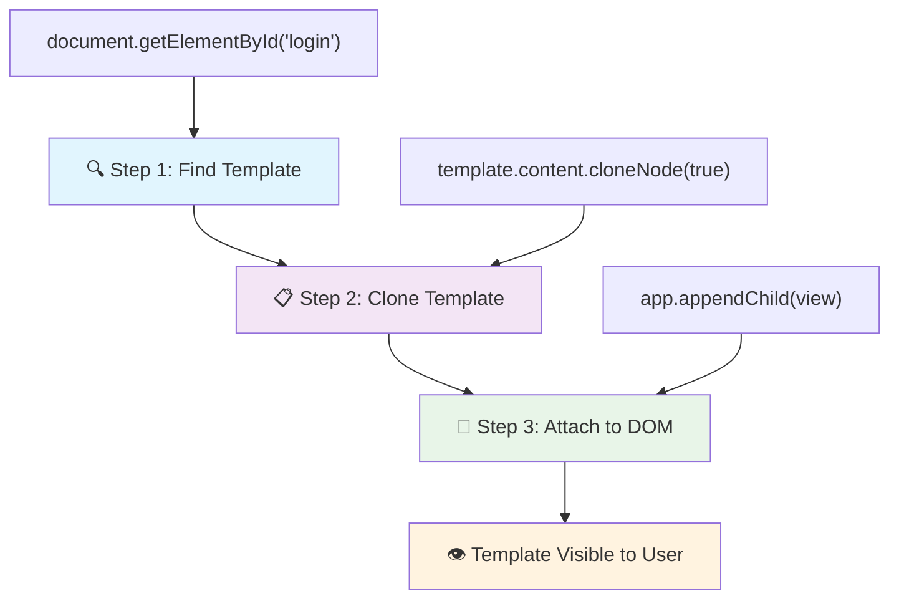
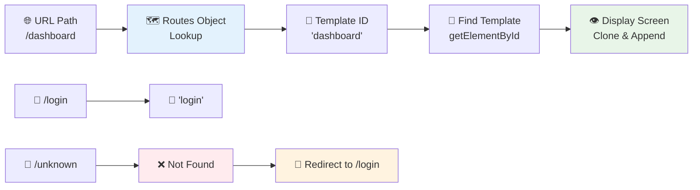
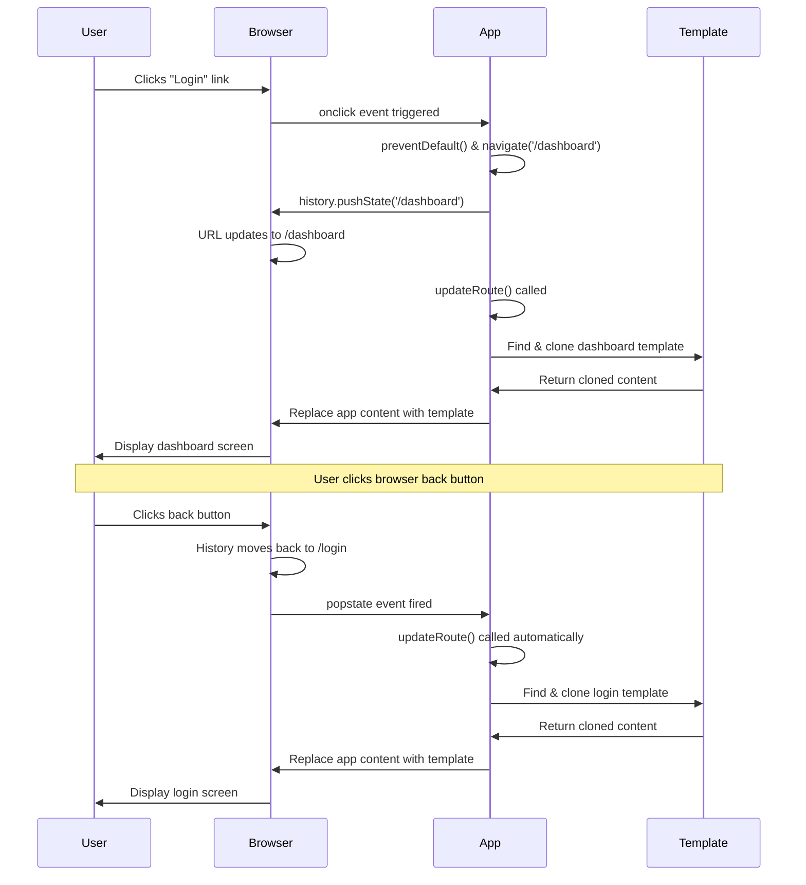
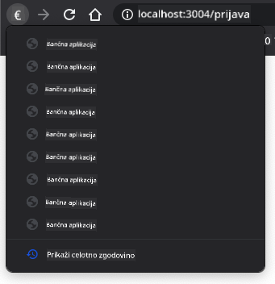

<!--
CO_OP_TRANSLATOR_METADATA:
{
  "original_hash": "5d259f6962464ad91e671083aa0398f4",
  "translation_date": "2025-10-25T00:37:16+00:00",
  "source_file": "7-bank-project/1-template-route/README.md",
  "language_code": "sl"
}
-->
# Izdelava bančne aplikacije, 1. del: HTML predloge in poti v spletni aplikaciji

Ko je računalnik za vodenje misije Apollo 11 leta 1969 navigiral na Luno, je moral preklapljati med različnimi programi, ne da bi ponovno zagnal celoten sistem. Sodobne spletne aplikacije delujejo podobno – spreminjajo, kar vidite, brez ponovnega nalaganja vsega od začetka. To ustvarja gladko in odzivno izkušnjo, ki jo uporabniki danes pričakujejo.

Za razliko od tradicionalnih spletnih strani, ki za vsako interakcijo ponovno naložijo celotne strani, sodobne spletne aplikacije posodabljajo le dele, ki jih je treba spremeniti. Ta pristop, podobno kot pri misijskem nadzoru, ki preklaplja med različnimi prikazi ob ohranjanju stalne komunikacije, ustvarja tekočo izkušnjo, ki smo jo vajeni.

Tukaj je, kaj naredi razliko tako dramatično:

| Tradicionalne večstranske aplikacije | Sodobne enostranske aplikacije |
|--------------------------------------|--------------------------------|
| **Navigacija** | Polno nalaganje strani za vsak zaslon | Takojšnje preklapljanje vsebine |
| **Zmogljivost** | Počasnejše zaradi celotnega prenosa HTML | Hitrejše s parcialnimi posodobitvami |
| **Uporabniška izkušnja** | Utripi strani | Gladki, aplikaciji podobni prehodi |
| **Deljenje podatkov** | Težavno med stranmi | Enostavno upravljanje stanja |
| **Razvoj** | Več HTML datotek za vzdrževanje | Ena HTML datoteka z dinamičnimi predlogami |

**Razumevanje evolucije:**
- **Tradicionalne aplikacije** zahtevajo strežniške zahteve za vsako navigacijsko dejanje
- **Sodobne SPA** se naložijo enkrat in dinamično posodabljajo vsebino z uporabo JavaScripta
- **Pričakovanja uporabnikov** zdaj favorizirajo takojšnje, brezšivne interakcije
- **Prednosti zmogljivosti** vključujejo zmanjšano porabo pasovne širine in hitrejše odzive

V tej lekciji bomo izdelali bančno aplikacijo z več zasloni, ki se gladko povezujejo. Tako kot znanstveniki uporabljajo modularne instrumente, ki jih je mogoče prekonfigurirati za različne eksperimente, bomo uporabili HTML predloge kot ponovno uporabne komponente, ki jih je mogoče prikazati po potrebi.

Delali boste z HTML predlogami (ponovno uporabni načrti za različne zaslone), JavaScript usmerjanjem (sistem, ki preklaplja med zasloni) in zgodovinskim API-jem brskalnika (ki ohranja delovanje gumba za nazaj, kot je pričakovano). To so iste osnovne tehnike, ki jih uporabljajo ogrodja, kot so React, Vue in Angular.

Na koncu boste imeli delujočo bančno aplikacijo, ki prikazuje profesionalna načela enostranskih aplikacij.

## Predhodni kviz

[Predhodni kviz](https://ff-quizzes.netlify.app/web/quiz/41)

### Kaj boste potrebovali

Za testiranje naše bančne aplikacije bomo potrebovali lokalni spletni strežnik – brez skrbi, to je lažje, kot se sliši! Če ga še nimate nastavljenega, preprosto namestite [Node.js](https://nodejs.org) in zaženite `npx lite-server` iz vaše projektne mape. Ta priročen ukaz zažene lokalni strežnik in samodejno odpre vašo aplikacijo v brskalniku.

### Priprava

Na vašem računalniku ustvarite mapo z imenom `bank` in v njej datoteko z imenom `index.html`. Začeli bomo s tem [osnovnim HTML](https://en.wikipedia.org/wiki/Boilerplate_code):

```html
<!DOCTYPE html>
<html lang="en">
  <head>
    <meta charset="UTF-8">
    <meta name="viewport" content="width=device-width, initial-scale=1.0">
    <title>Bank App</title>
  </head>
  <body>
    <!-- This is where you'll work -->
  </body>
</html>
```

**Kaj zagotavlja ta osnovna predloga:**
- **Vzpostavi** strukturo dokumenta HTML5 z ustrezno deklaracijo DOCTYPE
- **Nastavi** kodiranje znakov na UTF-8 za podporo mednarodnim besedilom
- **Omogoči** odzivno oblikovanje z meta oznako viewport za mobilno združljivost
- **Določi** opisni naslov, ki se prikaže na zavihku brskalnika
- **Ustvari** čist razdelek telesa, kjer bomo zgradili našo aplikacijo

> 📁 **Predogled strukture projekta**
> 
> **Na koncu te lekcije bo vaš projekt vseboval:**
> ```
> bank/
> ├── index.html      <!-- Main HTML with templates -->
> ├── app.js          <!-- Routing and navigation logic -->
> └── style.css       <!-- (Optional for future lessons) -->
> ```
> 
> **Odgovornosti datotek:**
> - **index.html**: Vsebuje vse predloge in zagotavlja strukturo aplikacije
> - **app.js**: Upravlja usmerjanje, navigacijo in upravljanje predlog
> - **Predloge**: Določajo uporabniški vmesnik za prijavo, nadzorno ploščo in druge zaslone

---

## HTML predloge

Predloge rešujejo temeljni problem pri razvoju spletnih aplikacij. Ko je Gutenberg v 1440-ih izumil premično tiskarsko tehniko, je ugotovil, da namesto rezljanja celotnih strani lahko ustvari ponovno uporabne črkovne bloke in jih razporedi po potrebi. HTML predloge delujejo na istem principu – namesto da ustvarimo ločene HTML datoteke za vsak zaslon, definiramo ponovno uporabne strukture, ki jih je mogoče prikazati po potrebi.

Predstavljajte si predloge kot načrte za različne dele vaše aplikacije. Tako kot arhitekt ustvari en načrt in ga uporabi večkrat, namesto da bi znova risal identične sobe, mi ustvarimo predloge enkrat in jih po potrebi uporabimo. Brskalnik te predloge drži skrite, dokler jih JavaScript ne aktivira.

Če želite ustvariti več zaslonov za spletno stran, bi bila ena rešitev ustvariti eno HTML datoteko za vsak zaslon, ki ga želite prikazati. Vendar pa ta rešitev prinaša nekaj nevšečnosti:

- Celoten HTML je treba ponovno naložiti ob preklopu zaslona, kar je lahko počasno.
- Težko je deliti podatke med različnimi zasloni.

Drugi pristop je, da imamo samo eno HTML datoteko in definiramo več [HTML predlog](https://developer.mozilla.org/docs/Web/HTML/Element/template) z uporabo elementa `<template>`. Predloga je ponovno uporaben HTML blok, ki ga brskalnik ne prikaže, in ga je treba ob času izvajanja instancirati z uporabo JavaScripta.

### Zgradimo to

Ustvarili bomo bančno aplikacijo z dvema glavnima zaslonoma: stranjo za prijavo in nadzorno ploščo. Najprej dodajmo element za označbo v telo našega HTML – tukaj se bodo prikazali vsi naši različni zasloni:

```html
<div id="app">Loading...</div>
```

**Razumevanje te označbe:**
- **Ustvari** vsebnik z ID-jem "app", kjer bodo prikazani vsi zasloni
- **Prikaže** sporočilo o nalaganju, dokler JavaScript ne inicializira prvega zaslona
- **Zagotavlja** eno montažno točko za našo dinamično vsebino
- **Omogoča** enostavno ciljanje iz JavaScripta z uporabo `document.getElementById()`

> 💡 **Nasvet**: Ker bo vsebina tega elementa zamenjana, lahko vanj postavimo sporočilo o nalaganju ali indikator, ki bo prikazan med nalaganjem aplikacije.

Nato dodajmo spodaj HTML predlogo za stran za prijavo. Za zdaj bomo vanjo postavili samo naslov in razdelek, ki vsebuje povezavo, ki jo bomo uporabili za navigacijo.

```html
<template id="login">
  <h1>Bank App</h1>
  <section>
    <a href="/dashboard">Login</a>
  </section>
</template>
```

**Razčlenitev te predloge za prijavo:**
- **Določi** predlogo z edinstvenim identifikatorjem "login" za ciljanje z JavaScriptom
- **Vključuje** glavni naslov, ki vzpostavlja blagovno znamko aplikacije
- **Vsebuje** semantični element `<section>` za združevanje povezanih vsebin
- **Ponuja** navigacijsko povezavo, ki bo uporabnike usmerila na nadzorno ploščo

Nato dodamo še eno HTML predlogo za stran nadzorne plošče. Ta stran bo vsebovala različne razdelke:

- Glavo z naslovom in povezavo za odjavo
- Trenutno stanje bančnega računa
- Seznam transakcij, prikazan v tabeli

```html
<template id="dashboard">
  <header>
    <h1>Bank App</h1>
    <a href="/login">Logout</a>
  </header>
  <section>
    Balance: 100$
  </section>
  <section>
    <h2>Transactions</h2>
    <table>
      <thead>
        <tr>
          <th>Date</th>
          <th>Object</th>
          <th>Amount</th>
        </tr>
      </thead>
      <tbody></tbody>
    </table>
  </section>
</template>
```

**Razumevanje vsakega dela te nadzorne plošče:**
- **Strukturira** stran z semantičnim elementom `<header>`, ki vsebuje navigacijo
- **Prikazuje** naslov aplikacije dosledno na vseh zaslonih za blagovno znamko
- **Ponuja** povezavo za odjavo, ki vodi nazaj na zaslon za prijavo
- **Prikazuje** trenutno stanje računa v namenskem razdelku
- **Organizira** podatke o transakcijah z uporabo ustrezno strukturirane HTML tabele
- **Določa** glave tabele za stolpce Datum, Predmet in Znesek
- **Pusti** telo tabele prazno za kasnejšo dinamično injekcijo vsebine

> 💡 **Nasvet**: Ko ustvarjate HTML predloge, če želite videti, kako bo videti, lahko zakomentirate vrstice `<template>` in `</template>` z uporabo `<!-- -->`.

✅ Zakaj mislite, da uporabljamo `id` atribute na predlogah? Bi lahko uporabili kaj drugega, kot so razredi?

## Oživitev predlog z JavaScriptom

Zdaj moramo narediti naše predloge funkcionalne. Tako kot 3D tiskalnik vzame digitalni načrt in ustvari fizični objekt, JavaScript vzame naše skrite predloge in ustvari vidne, interaktivne elemente, ki jih uporabniki lahko vidijo in uporabljajo.

Postopek sledi trem doslednim korakom, ki tvorijo osnovo sodobnega spletnega razvoja. Ko razumete ta vzorec, ga boste prepoznali v številnih ogrodjih in knjižnicah.

Če poskusite trenutno HTML datoteko v brskalniku, boste videli, da se zatakne pri prikazovanju `Loading...`. To je zato, ker moramo dodati nekaj JavaScript kode za instanciranje in prikaz HTML predlog.

Instanciranje predloge se običajno izvede v 3 korakih:

1. Pridobite element predloge v DOM, na primer z [`document.getElementById`](https://developer.mozilla.org/docs/Web/API/Document/getElementById).
2. Klonirajte element predloge z uporabo [`cloneNode`](https://developer.mozilla.org/docs/Web/API/Node/cloneNode).
3. Pripnite ga na DOM pod vidnim elementom, na primer z uporabo [`appendChild`](https://developer.mozilla.org/docs/Web/API/Node/appendChild).



**Vizualna razčlenitev postopka:**
- **Korak 1** poišče skrito predlogo v strukturi DOM
- **Korak 2** ustvari delujočo kopijo, ki jo je mogoče varno spremeniti
- **Korak 3** vstavi kopijo v vidno območje strani
- **Rezultat** je funkcionalen zaslon, s katerim lahko uporabniki interagirajo

✅ Zakaj moramo klonirati predlogo, preden jo pripnemo na DOM? Kaj mislite, da bi se zgodilo, če bi ta korak preskočili?

### Naloga

Ustvarite novo datoteko z imenom `app.js` v vaši projektni mapi in uvozite to datoteko v razdelek `<head>` vašega HTML:

```html
<script src="app.js" defer></script>
```

**Razumevanje tega uvoza skripte:**
- **Poveže** JavaScript datoteko z našim HTML dokumentom
- **Uporablja** atribut `defer`, da zagotovi, da se skripta zažene po zaključku razčlenjevanja HTML
- **Omogoča** dostop do vseh DOM elementov, saj so popolnoma naloženi pred izvajanjem skripte
- **Sledi** sodobnim najboljšim praksam za nalaganje skript in zmogljivost

Zdaj v `app.js` ustvarimo novo funkcijo `updateRoute`:

```js
function updateRoute(templateId) {
  const template = document.getElementById(templateId);
  const view = template.content.cloneNode(true);
  const app = document.getElementById('app');
  app.innerHTML = '';
  app.appendChild(view);
}
```

**Korak za korakom, kaj se dogaja:**
- **Poišče** element predloge z uporabo njegovega edinstvenega ID-ja
- **Ustvari** globoko kopijo vsebine predloge z uporabo `cloneNode(true)`
- **Najde** vsebnik aplikacije, kjer bo vsebina prikazana
- **Počisti** obstoječo vsebino iz vsebnika aplikacije
- **Vstavi** klonirano vsebino predloge v vidni DOM

Zdaj pokličite to funkcijo z eno od predlog in si oglejte rezultat.

```js
updateRoute('login');
```

**Kaj doseže ta klic funkcije:**
- **Aktivira** predlogo za prijavo s posredovanjem njenega ID-ja kot parametra
- **Prikaže** kako programsko preklapljati med različnimi zasloni aplikacije
- **Prikaže** zaslon za prijavo namesto sporočila "Loading..."

✅ Kakšen je namen te kode `app.innerHTML = '';`? Kaj se zgodi brez nje?

## Ustvarjanje poti

Usmerjanje je v bistvu povezovanje URL-jev s pravo vsebino. Pomislite, kako so zgodnji telefonski operaterji uporabljali preklopne plošče za povezovanje klicev – vzeli bi dohodno zahtevo in jo usmerili na pravilno destinacijo. Spletno usmerjanje deluje podobno, saj vzame zahtevo URL in določi, katero vsebino prikazati.

Tradicionalno so spletni strežniki to obravnavali tako, da so za različne URL-je servirali različne HTML datoteke. Ker gradimo enostransko aplikacijo, moramo to usmerjanje obravnavati sami z JavaScriptom. Ta pristop nam daje več nadzora nad uporabniško izkušnjo in zmogljivostjo.



**Razumevanje toka usmerjanja:**
- **Spremembe URL-ja** sprožijo iskanje v naši konfiguraciji poti
- **Veljavne poti** se preslikajo na specifične ID-je predlog za upodabljanje
- **Neveljavne poti** sprožijo nadomestno vedenje, da preprečijo zlomljena stanja
- **Upodabljanje predlog** sledi prej naučenemu postopku v treh korakih

Ko govorimo o spletni aplikaciji, imenujemo *Usmerjanje* namero preslikave **URL-jev** na specifične zaslone, ki naj bi bili prikazani. Na spletni strani z več HTML datotekami se to izvede samodejno, saj se poti datotek odražajo v URL-ju. Na primer, z naslednjimi datotekami v vaši projektni mapi:

```
mywebsite/index.html
mywebsite/login.html
mywebsite/admin/index.html
```

Če ustvarite spletni strežnik z `mywebsite` kot koren, bo preslikava URL-jev:

```
https://site.com            --> mywebsite/index.html
https://site.com/login.html --> mywebsite/login.html
https://site.com/admin/     --> mywebsite/admin/index.html
```

Vendar pa za našo spletno aplikacijo uporabljamo eno HTML datoteko, ki vsebuje vse zaslone, zato nam to privzeto vedenje ne bo pomagalo. To preslikavo moramo ustvariti ročno in posodobiti prikazano predlogo z uporabo JavaScripta.

### Naloga

Uporabili bomo preprost objekt za implementacijo [zemljevida](https://en.wikipedia.org/wiki/Associative_array) med URL potmi in našimi predlogami. Dodajte ta objekt na vrh vaše datoteke `app.js`.

```js
const routes = {
  '/login': { templateId: 'login' },
  '/dashboard': { templateId: 'dashboard' },
};
```

**Razumevanje te konfiguracije poti:**
- **Določi** preslikavo med URL potmi in identifikatorji predlog
- **Uporablja** sintakso objekta, kjer so ključi URL poti, vrednosti pa vsebujejo informacije o predlogah
- **Omogoča** enostavno iskanje, katero predlogo prikazati za kateri URL
- **Ponuja** razširljivo strukturo za dodajanje novih poti v prihodnosti

Zdaj nekoliko spremenimo funkcijo `updateRoute`. Namesto da neposredno posredujemo `templateId` kot argument, želimo najprej pogledati trenutni URL, nato pa uporabiti naš zemljevid za pridobitev ustrezne vrednosti ID-ja predloge. Uporabimo lahko [`window.location.pathname`](https://developer.mozilla.org/docs/Web/API/Location/pathname) za pridobitev samo dela poti iz URL-ja.

```js
function updateRoute() {
  const path = window.location.pathname;
  const route = routes[path];

  const template = document.getElementById(route.templateId);
  const view = template.content.cloneNode(true);
  const app = document.getElementById('app');
  app.innerHTML = '';
  app.appendChild(view);
}
```

**Razčlenitev, kaj se tukaj dogaja:**
- **Izvleče** trenutno pot iz URL-ja brskalnika z uporabo `window.location.pathname`
- **Poišče** ustrezno konfiguracijo poti v našem objektu poti
- **Pridobi** ID predloge iz konfiguracije poti
- **Sledi** istemu postopku upodabljanja predloge kot prej
- **Ustvari** dinamičen sistem, ki se odziva na spremembe URL-ja

Tukaj smo preslikali poti, ki smo jih deklarirali, na ustrezne predloge. Lahko preverite, da deluje pravilno, tako da ročno spremenite URL v vašem brskalniku.
✅ Kaj se zgodi, če vnesete neznano pot v URL? Kako bi to lahko rešili?

## Dodajanje navigacije

Ko je usmerjanje vzpostavljeno, uporabniki potrebujejo način za navigacijo po aplikaciji. Tradicionalne spletne strani ob kliku na povezave ponovno naložijo celotne strani, vendar želimo posodobiti tako URL kot vsebino brez osveževanja strani. To ustvari bolj gladko izkušnjo, podobno kot namizne aplikacije preklapljajo med različnimi pogledi.

Usklajevati moramo dve stvari: posodabljanje URL-ja brskalnika, da lahko uporabniki shranijo strani med zaznamke in delijo povezave, ter prikaz ustrezne vsebine. Če je to pravilno izvedeno, omogoča brezhibno navigacijo, ki jo uporabniki pričakujejo od sodobnih aplikacij.

> 🏗️ **Vpogled v arhitekturo**: Komponente navigacijskega sistema
>
> **Kaj gradite:**
> - **🔄 Upravljanje URL-ja**: Posodablja naslovno vrstico brskalnika brez ponovnega nalaganja strani
> - **📋 Sistem predlog**: Dinamično zamenjuje vsebino glede na trenutno pot  
> - **📚 Integracija zgodovine**: Ohranja funkcionalnost gumbov za nazaj/naprej v brskalniku
> - **🛡️ Obvladovanje napak**: Elegantne rešitve za neveljavne ali manjkajoče poti
>
> **Kako komponente delujejo skupaj:**
> - **Posluša** dogodke navigacije (kliki, spremembe zgodovine)
> - **Posodablja** URL z uporabo History API
> - **Prikazuje** ustrezno predlogo za novo pot
> - **Ohranja** brezhibno uporabniško izkušnjo

Naslednji korak za našo aplikacijo je dodati možnost navigacije med stranmi, ne da bi morali ročno spreminjati URL. To vključuje dve stvari:

  1. Posodabljanje trenutnega URL-ja
  2. Posodabljanje prikazane predloge glede na nov URL

Za drugi del smo že poskrbeli s funkcijo `updateRoute`, zato moramo ugotoviti, kako posodobiti trenutni URL.

Uporabiti bomo morali JavaScript, natančneje [`history.pushState`](https://developer.mozilla.org/docs/Web/API/History/pushState), ki omogoča posodabljanje URL-ja in ustvarjanje novega vnosa v zgodovini brskanja, brez ponovnega nalaganja HTML-ja.

> ⚠️ **Pomembna opomba**: Čeprav se lahko HTML element sidra [`<a href>`](https://developer.mozilla.org/docs/Web/HTML/Element/a) sam po sebi uporablja za ustvarjanje hiperpovezav na različne URL-je, bo privzeto povzročil ponovno nalaganje HTML-ja. To vedenje je treba preprečiti pri obravnavi usmerjanja s prilagojenim JavaScriptom, z uporabo funkcije preventDefault() na dogodku klika.

### Naloga

Ustvarimo novo funkcijo, ki jo lahko uporabimo za navigacijo v naši aplikaciji:

```js
function navigate(path) {
  window.history.pushState({}, path, path);
  updateRoute();
}
```

**Razumevanje te navigacijske funkcije:**
- **Posodablja** URL brskalnika na novo pot z uporabo `history.pushState`
- **Dodaja** nov vnos v zgodovino brskalnika za pravilno podporo gumbov za nazaj/naprej
- **Sproži** funkcijo `updateRoute()` za prikaz ustrezne predloge
- **Ohranja** izkušnjo enostranske aplikacije brez ponovnega nalaganja strani

Ta metoda najprej posodobi trenutni URL glede na podano pot, nato pa posodobi predlogo. Lastnost `window.location.origin` vrne koren URL-ja, kar nam omogoča, da iz podane poti rekonstruiramo celoten URL.

Zdaj, ko imamo to funkcijo, se lahko lotimo problema, ki ga imamo, če pot ne ustreza nobeni določeni poti. Funkcijo `updateRoute` bomo spremenili tako, da dodamo rezervno možnost za eno od obstoječih poti, če ne najdemo ujemanja.

```js
function updateRoute() {
  const path = window.location.pathname;
  const route = routes[path];

  if (!route) {
    return navigate('/login');
  }

  const template = document.getElementById(route.templateId);
  const view = template.content.cloneNode(true);
  const app = document.getElementById('app');
  app.innerHTML = '';
  app.appendChild(view);
}
```

**Ključne točke za zapomniti:**
- **Preveri**, ali pot obstaja za trenutni URL
- **Preusmeri** na stran za prijavo, ko je dostopana neveljavna pot
- **Nudi** rezervni mehanizem, ki preprečuje prekinjeno navigacijo
- **Zagotavlja**, da uporabniki vedno vidijo veljaven zaslon, tudi pri napačnih URL-jih

Če poti ni mogoče najti, bomo zdaj preusmerili na stran `login`.

Zdaj ustvarimo funkcijo za pridobivanje URL-ja, ko je povezava kliknjena, in za preprečitev privzetega vedenja povezave v brskalniku:

```js
function onLinkClick(event) {
  event.preventDefault();
  navigate(event.target.href);
}
```

**Razčlenitev tega upravljalnika klikov:**
- **Prepreči** privzeto vedenje povezave v brskalniku z uporabo `preventDefault()`
- **Izvleče** ciljni URL iz kliknjenega elementa povezave
- **Pokliče** našo prilagojeno funkcijo za navigacijo namesto ponovnega nalaganja strani
- **Ohranja** gladko izkušnjo enostranske aplikacije

```html
<a href="/dashboard" onclick="onLinkClick(event)">Login</a>
...
<a href="/login" onclick="onLinkClick(event)">Logout</a>
```

**Kaj doseže ta vezava onclick:**
- **Povezuje** vsako povezavo z našim prilagojenim navigacijskim sistemom
- **Posreduje** dogodek klika naši funkciji `onLinkClick` za obdelavo
- **Omogoča** gladko navigacijo brez ponovnega nalaganja strani
- **Ohranja** pravilno strukturo URL-ja, ki jo lahko uporabniki shranijo med zaznamke ali delijo

Atribut [`onclick`](https://developer.mozilla.org/docs/Web/API/GlobalEventHandlers/onclick) poveže dogodek `click` z JavaScript kodo, tukaj klic funkcije `navigate()`.

Poskusite klikniti na te povezave, zdaj bi morali biti sposobni navigirati med različnimi zasloni vaše aplikacije.

✅ Metoda `history.pushState` je del standarda HTML5 in je implementirana v [vseh sodobnih brskalnikih](https://caniuse.com/?search=pushState). Če gradite spletno aplikacijo za starejše brskalnike, obstaja trik, ki ga lahko uporabite namesto tega API-ja: z uporabo [hasha (`#`)](https://en.wikipedia.org/wiki/URI_fragment) pred potjo lahko implementirate usmerjanje, ki deluje z običajno navigacijo sidra in ne ponovno naloži strani, saj je njegov namen ustvarjanje notranjih povezav znotraj strani.

## Omogočanje delovanja gumbov za nazaj in naprej

Gumbi za nazaj in naprej so temeljni za brskanje po spletu, podobno kot NASA-jevi kontrolorji misij lahko pregledajo prejšnja stanja sistema med vesoljskimi misijami. Uporabniki pričakujejo, da ti gumbi delujejo, in ko ne, to poruši pričakovano izkušnjo brskanja.

Naša enostranska aplikacija potrebuje dodatno konfiguracijo, da to podpira. Brskalnik vzdržuje zgodovinski sklad (ki smo ga dodajali z `history.pushState`), vendar ko uporabniki navigirajo skozi to zgodovino, mora naša aplikacija ustrezno reagirati z posodabljanjem prikazane vsebine.



**Ključne točke interakcije:**
- **Dejanja uporabnika** sprožijo navigacijo prek klikov ali gumbov brskalnika
- **Aplikacija prestreže** klike povezav, da prepreči ponovno nalaganje strani
- **History API** upravlja spremembe URL-ja in zgodovinski sklad brskalnika
- **Predloge** zagotavljajo strukturo vsebine za vsak zaslon
- **Poslušalci dogodkov** zagotavljajo, da aplikacija reagira na vse vrste navigacije

Uporaba `history.pushState` ustvari nove vnose v zgodovini navigacije brskalnika. To lahko preverite tako, da držite *gumb za nazaj* v brskalniku, prikazati bi se moralo nekaj takega:



Če nekajkrat kliknete na gumb za nazaj, boste videli, da se trenutni URL spreminja in zgodovina se posodablja, vendar se ista predloga še naprej prikazuje.

To je zato, ker aplikacija ne ve, da moramo poklicati `updateRoute()` vsakič, ko se zgodovina spremeni. Če si ogledate dokumentacijo [`history.pushState`](https://developer.mozilla.org/docs/Web/API/History/pushState), lahko vidite, da če se stanje spremeni - kar pomeni, da smo se premaknili na drug URL - se sproži dogodek [`popstate`](https://developer.mozilla.org/docs/Web/API/Window/popstate_event). To bomo uporabili za odpravo te težave.

### Naloga

Da zagotovimo, da se prikazana predloga posodobi, ko se zgodovina brskalnika spremeni, bomo na dnu datoteke `app.js` dodali novo funkcijo, ki kliče `updateRoute()`:

```js
window.onpopstate = () => updateRoute();
updateRoute();
```

**Razumevanje te integracije zgodovine:**
- **Posluša** dogodke `popstate`, ki se zgodijo, ko uporabniki navigirajo z gumbi brskalnika
- **Uporablja** funkcijo puščice za jedrnato sintakso upravljalnika dogodkov
- **Samodejno kliče** `updateRoute()` vsakič, ko se stanje zgodovine spremeni
- **Inicializira** aplikacijo z klicem `updateRoute()` ob prvem nalaganju strani
- **Zagotavlja**, da se pravilna predloga prikaže ne glede na način navigacije uporabnikov

> 💡 **Nasvet**: Tukaj smo uporabili [funkcijo puščice](https://developer.mozilla.org/docs/Web/JavaScript/Reference/Functions/Arrow_functions) za deklaracijo našega upravljalnika dogodkov `popstate` zaradi jedrnatosti, vendar bi enako delovala tudi običajna funkcija.

Tukaj je osvežitveni video o funkcijah puščice:

[](https://youtube.com/watch?v=OP6eEbOj2sc "Funkcije puščice")

> 🎥 Kliknite zgornjo sliko za video o funkcijah puščice.

Zdaj poskusite uporabiti gumbe za nazaj in naprej v vašem brskalniku ter preverite, ali se prikazana pot tokrat pravilno posodobi.

---

## Izziv GitHub Copilot Agent 🚀

Uporabite način Agent za dokončanje naslednjega izziva:

**Opis:** Izboljšajte bančno aplikacijo z implementacijo obravnave napak in predloge za stran 404 za neveljavne poti, s čimer izboljšate uporabniško izkušnjo pri navigaciji na neobstoječe strani.

**Navodilo:** Ustvarite novo HTML predlogo z id-jem "not-found", ki prikazuje uporabniku prijazno stran z napako 404 in stilizacijo. Nato spremenite logiko usmerjanja v JavaScriptu, da prikaže to predlogo, ko uporabniki navigirajo na neveljavne URL-je, ter dodajte gumb "Pojdi na začetno stran", ki vodi nazaj na stran za prijavo.

Več o [načinu Agent](https://code.visualstudio.com/blogs/2025/02/24/introducing-copilot-agent-mode) si preberite tukaj.

## 🚀 Izziv

Dodajte novo predlogo in pot za tretjo stran, ki prikazuje zasluge za to aplikacijo.

**Cilji izziva:**
- **Ustvarite** novo HTML predlogo z ustrezno strukturo vsebine
- **Dodajte** novo pot v vašo konfiguracijsko objektno usmerjanje
- **Vključite** navigacijske povezave do in iz strani z zaslugami
- **Preverite**, da vsa navigacija pravilno deluje z zgodovino brskalnika

## Kviz po predavanju

[Kviz po predavanju](https://ff-quizzes.netlify.app/web/quiz/42)

## Pregled in samostojno učenje

Usmerjanje je eden od presenetljivo zahtevnih delov spletnega razvoja, še posebej, ko se splet premika od vedenja osveževanja strani k enostranskim aplikacijam. Preberite nekaj o [tem, kako storitev Azure Static Web App](https://docs.microsoft.com/azure/static-web-apps/routes/?WT.mc_id=academic-77807-sagibbon) obravnava usmerjanje. Ali lahko razložite, zakaj so nekatere odločitve, opisane v tem dokumentu, potrebne?

**Dodatni viri za učenje:**
- **Raziskujte**, kako priljubljeni ogrodji, kot sta React Router in Vue Router, implementirata usmerjanje na strani odjemalca
- **Raziskujte** razlike med usmerjanjem na osnovi hasha in usmerjanjem z History API
- **Učite se** o strežniškem upodabljanju (SSR) in kako vpliva na strategije usmerjanja
- **Raziskujte**, kako progresivne spletne aplikacije (PWAs) obravnavajo usmerjanje in navigacijo

## Naloga

[Izboljšajte usmerjanje](assignment.md)

---

**Omejitev odgovornosti**:  
Ta dokument je bil preveden z uporabo storitve za prevajanje AI [Co-op Translator](https://github.com/Azure/co-op-translator). Čeprav si prizadevamo za natančnost, vas prosimo, da upoštevate, da lahko avtomatizirani prevodi vsebujejo napake ali netočnosti. Izvirni dokument v njegovem maternem jeziku naj se šteje za avtoritativni vir. Za ključne informacije priporočamo profesionalni človeški prevod. Ne prevzemamo odgovornosti za morebitna nesporazumevanja ali napačne razlage, ki izhajajo iz uporabe tega prevoda.