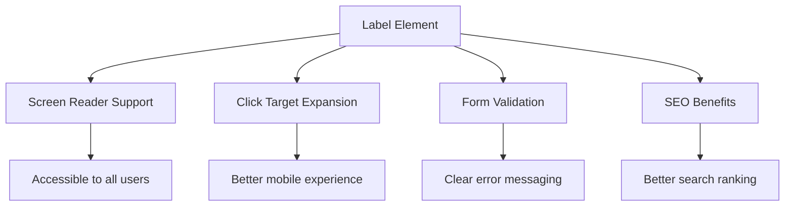
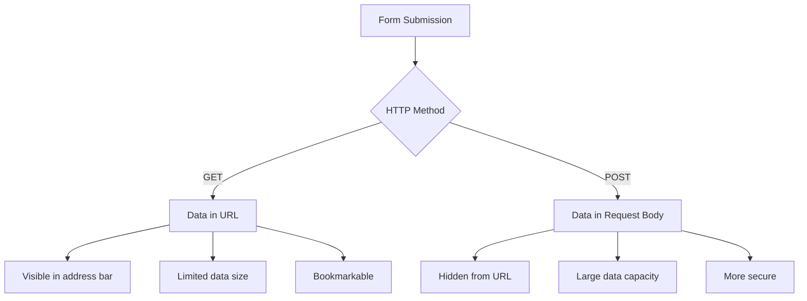
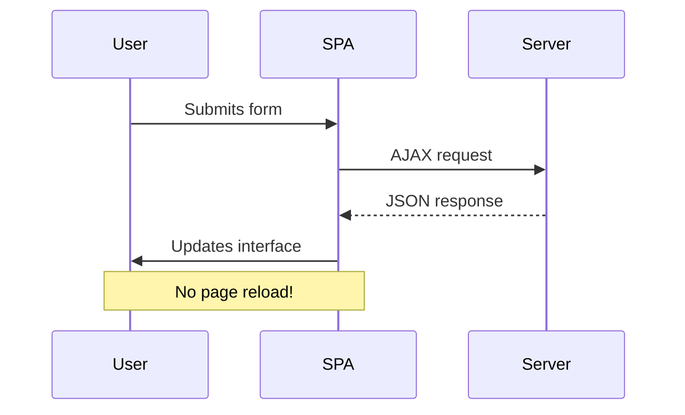
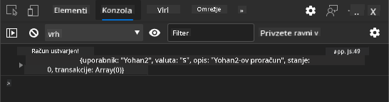
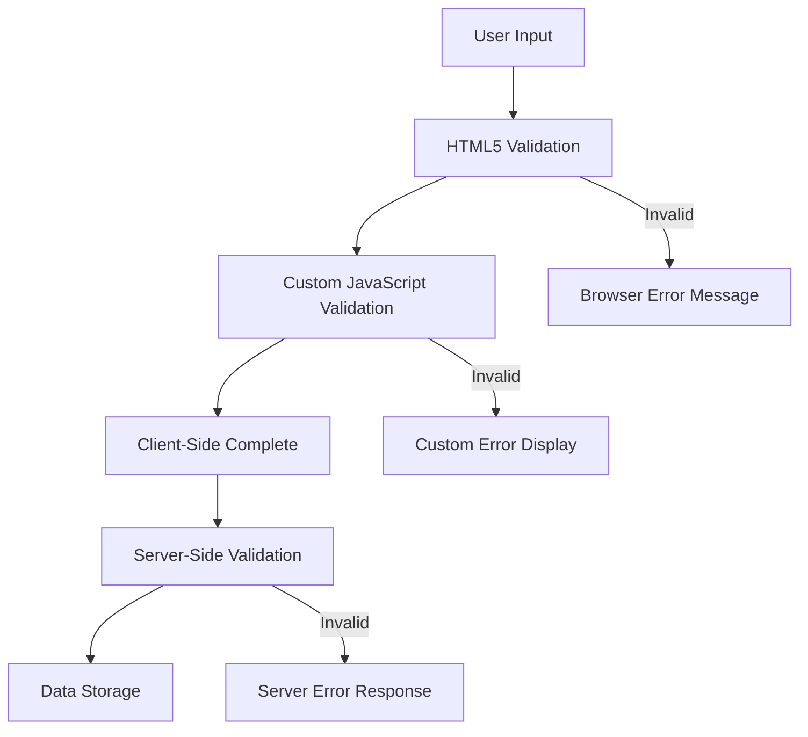
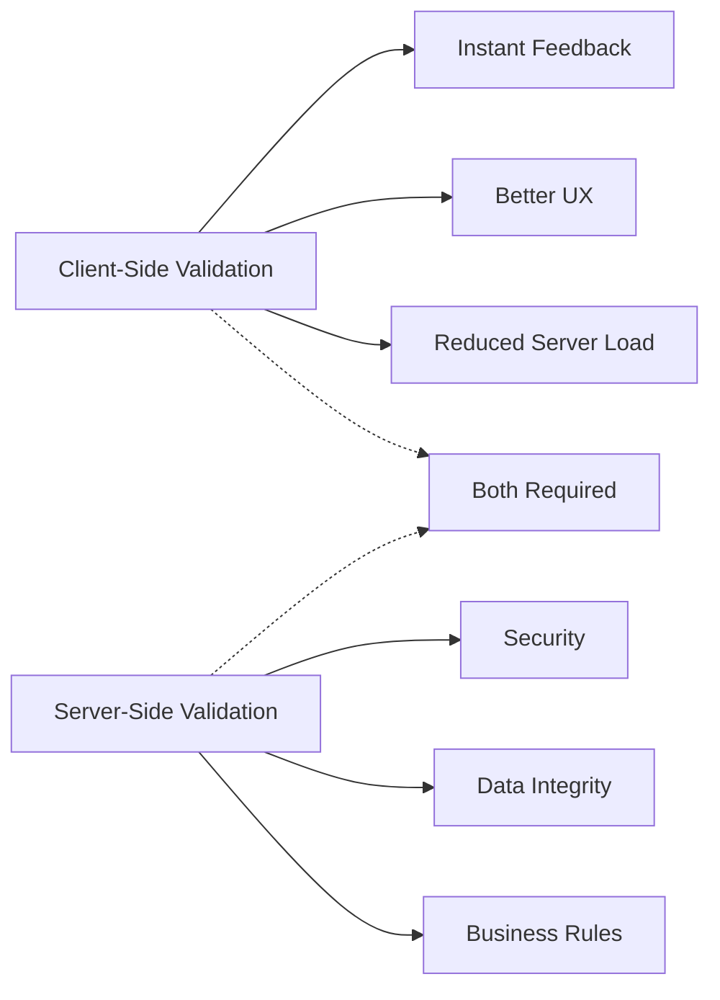
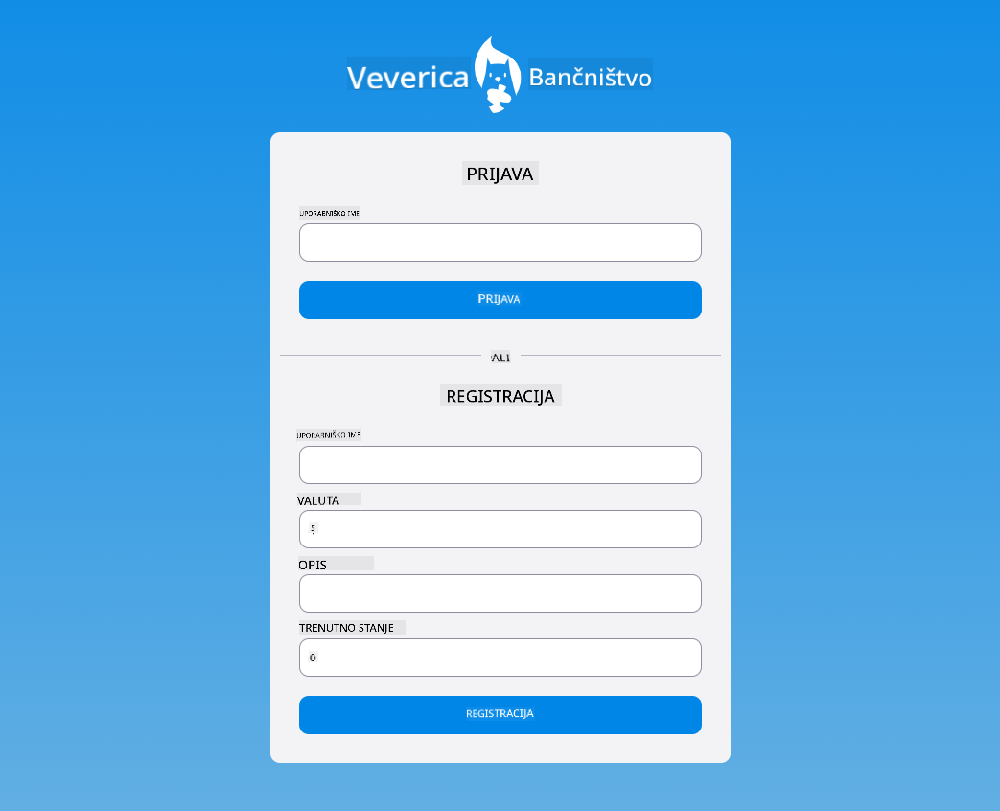

<!--
CO_OP_TRANSLATOR_METADATA:
{
  "original_hash": "b24f28fc46dd473aa9080f174182adde",
  "translation_date": "2025-10-25T00:39:03+00:00",
  "source_file": "7-bank-project/2-forms/README.md",
  "language_code": "sl"
}
-->
# Izdelava bančne aplikacije, 2. del: Oblikovanje obrazca za prijavo in registracijo

## Predhodni kviz

[Predhodni kviz](https://ff-quizzes.netlify.app/web/quiz/43)

Ste že kdaj izpolnili obrazec na spletu, ki je zavrnil vaš e-poštni naslov zaradi napačnega formata? Ali pa ste izgubili vse podatke, ko ste kliknili na gumb za pošiljanje? Vsi smo se že srečali s takšnimi frustrirajočimi izkušnjami.

Obrazci so most med uporabniki in funkcionalnostjo vaše aplikacije. Tako kot skrbni protokoli, ki jih uporabljajo kontrolorji zračnega prometa za varno usmerjanje letal, dobro zasnovani obrazci zagotavljajo jasne povratne informacije in preprečujejo drage napake. Slabo zasnovani obrazci pa lahko uporabnike odvrnejo hitreje kot napačna komunikacija na prometnem letališču.

V tej lekciji bomo vašo statično bančno aplikacijo spremenili v interaktivno aplikacijo. Naučili se boste oblikovati obrazce, ki preverjajo vnos uporabnika, komunicirajo s strežniki in zagotavljajo koristne povratne informacije. Pomislite na to kot na gradnjo nadzornega vmesnika, ki uporabnikom omogoča navigacijo po funkcijah vaše aplikacije.

Na koncu boste imeli popoln sistem za prijavo in registracijo z validacijo, ki uporabnike vodi k uspehu namesto frustracijam.

## Predpogoji

Preden začnemo z oblikovanjem obrazcev, se prepričajmo, da imate vse pravilno nastavljeno. Ta lekcija se nadaljuje tam, kjer smo končali prejšnjo, zato če ste preskočili naprej, se morda želite vrniti in najprej urediti osnove.

### Zahtevana nastavitev

| Komponenta | Status | Opis |
|------------|--------|------|
| [HTML predloge](../1-template-route/README.md) | ✅ Zahtevano | Osnovna struktura bančne aplikacije |
| [Node.js](https://nodejs.org) | ✅ Zahtevano | JavaScript okolje za strežnik |
| [Bank API strežnik](../api/README.md) | ✅ Zahtevano | Zaledna storitev za shranjevanje podatkov |

> 💡 **Nasvet za razvoj**: Hkrati boste zagnali dva ločena strežnika – enega za vašo sprednjo bančno aplikacijo in drugega za zaledni API. Ta nastavitev odraža resnično razvojno okolje, kjer sprednje in zaledne storitve delujejo neodvisno.

### Konfiguracija strežnika

**Vaše razvojno okolje bo vključevalo:**
- **Strežnik sprednjega dela**: Strežnik za vašo bančno aplikacijo (običajno vrata `3000`)
- **Strežnik zalednega API-ja**: Upravljanje shranjevanja in pridobivanja podatkov (vrata `5000`)
- **Oba strežnika** lahko delujeta hkrati brez konfliktov

**Testiranje povezave z API-jem:**
```bash
curl http://localhost:5000/api
# Expected response: "Bank API v1.0.0"
```

**Če vidite odgovor z različico API-ja, ste pripravljeni nadaljevati!**

---

## Razumevanje HTML obrazcev in kontrol

HTML obrazci so način, kako uporabniki komunicirajo z vašo spletno aplikacijo. Pomislite nanje kot na telegrafski sistem, ki je v 19. stoletju povezoval oddaljene kraje – so komunikacijski protokol med namenom uporabnika in odzivom aplikacije. Ko so premišljeno zasnovani, ujamejo napake, usmerjajo formatiranje vnosa in zagotavljajo koristne predloge.

Sodobni obrazci so bistveno bolj sofisticirani kot osnovni besedilni vnosi. HTML5 je uvedel specializirane tipe vnosov, ki samodejno obravnavajo validacijo e-pošte, formatiranje številk in izbiro datumov. Te izboljšave koristijo tako dostopnosti kot mobilni uporabniški izkušnji.

### Osnovni elementi obrazca

**Gradniki, ki jih potrebuje vsak obrazec:**

```html
<!-- Basic form structure -->
<form id="userForm" method="POST">
  <label for="username">Username</label>
  <input id="username" name="username" type="text" required>
  
  <button type="submit">Submit</button>
</form>
```

**Kaj ta koda počne:**
- **Ustvari** vsebnik obrazca z edinstvenim identifikatorjem
- **Določi** HTTP metodo za pošiljanje podatkov
- **Poveže** oznake z vnosi za dostopnost
- **Določi** gumb za pošiljanje obrazca

### Sodobni tipi vnosov in atributi

| Tip vnosa | Namen | Primer uporabe |
|-----------|-------|----------------|
| `text` | Splošni besedilni vnos | `<input type="text" name="username">` |
| `email` | Validacija e-pošte | `<input type="email" name="email">` |
| `password` | Skriti vnos besedila | `<input type="password" name="password">` |
| `number` | Številčni vnos | `<input type="number" name="balance" min="0">` |
| `tel` | Telefonske številke | `<input type="tel" name="phone">` |

> 💡 **Prednost HTML5**: Uporaba specifičnih tipov vnosov omogoča samodejno validacijo, ustrezne mobilne tipkovnice in boljšo podporo dostopnosti brez dodatnega JavaScripta!

### Tipi gumbov in vedenje

```html
<!-- Different button behaviors -->
<button type="submit">Save Data</button>     <!-- Submits the form -->
<button type="reset">Clear Form</button>    <!-- Resets all fields -->
<button type="button">Custom Action</button> <!-- No default behavior -->
```

**Kaj počne vsak tip gumba:**
- **Gumbi za pošiljanje**: Sprožijo pošiljanje obrazca in pošljejo podatke na določeno točko
- **Gumbi za ponastavitev**: Povrnejo vsa polja obrazca v začetno stanje
- **Običajni gumbi**: Nimajo privzetega vedenja, zahtevajo prilagojen JavaScript za funkcionalnost

> ⚠️ **Pomembna opomba**: Element `<input>` je samozapiralni in ne potrebuje zaključnega taga. Sodobna najboljša praksa je pisanje `<input>` brez poševnice.

### Oblikovanje obrazca za prijavo

Zdaj bomo ustvarili praktičen obrazec za prijavo, ki prikazuje sodobne prakse oblikovanja HTML obrazcev. Začeli bomo z osnovno strukturo in jo postopoma izboljšali z dostopnostjo in validacijo.

```html
<template id="login">
  <h1>Bank App</h1>
  <section>
    <h2>Login</h2>
    <form id="loginForm" novalidate>
      <div class="form-group">
        <label for="username">Username</label>
        <input id="username" name="user" type="text" required 
               autocomplete="username" placeholder="Enter your username">
      </div>
      <button type="submit">Login</button>
    </form>
  </section>
</template>
```

**Razčlenitev dogajanja:**
- **Strukturira** obrazec s semantičnimi elementi HTML5
- **Združuje** povezane elemente z uporabo `div` vsebnikov z ustreznimi razredi
- **Povezuje** oznake z vnosi z uporabo atributov `for` in `id`
- **Vključuje** sodobne atribute, kot so `autocomplete` in `placeholder`, za boljšo uporabniško izkušnjo
- **Dodaja** `novalidate` za obravnavo validacije z JavaScriptom namesto privzetih nastavitev brskalnika

### Pomen ustreznih oznak

**Zakaj so oznake pomembne za sodoben spletni razvoj:**



**Kaj dosežejo ustrezne oznake:**
- **Omogočajo** bralnikom zaslona, da jasno napovejo polja obrazca
- **Razširijo** klikabilno območje (klik na oznako osredotoči vnos)
- **Izboljšajo** mobilno uporabniško izkušnjo z večjimi ciljnimi območji
- **Podpirajo** validacijo obrazca z smiselnimi sporočili o napakah
- **Povečajo** SEO z dodajanjem semantičnega pomena elementom obrazca

> 🎯 **Cilj dostopnosti**: Vsak vnos obrazca naj ima povezano oznako. Ta preprosta praksa naredi vaše obrazce dostopne vsem, vključno z uporabniki z invalidnostjo, in izboljša izkušnjo za vse uporabnike.

### Oblikovanje obrazca za registracijo

Obrazec za registracijo zahteva bolj podrobne informacije za ustvarjanje popolnega uporabniškega računa. Zgradimo ga s sodobnimi funkcijami HTML5 in izboljšano dostopnostjo.

```html
<hr/>
<h2>Register</h2>
<form id="registerForm" novalidate>
  <div class="form-group">
    <label for="user">Username</label>
    <input id="user" name="user" type="text" required 
           autocomplete="username" placeholder="Choose a username">
  </div>
  
  <div class="form-group">
    <label for="currency">Currency</label>
    <input id="currency" name="currency" type="text" value="$" 
           required maxlength="3" placeholder="USD, EUR, etc.">
  </div>
  
  <div class="form-group">
    <label for="description">Account Description</label>
    <input id="description" name="description" type="text" 
           maxlength="100" placeholder="Personal savings, checking, etc.">
  </div>
  
  <div class="form-group">
    <label for="balance">Starting Balance</label>
    <input id="balance" name="balance" type="number" value="0" 
           min="0" step="0.01" placeholder="0.00">
  </div>
  
  <button type="submit">Create Account</button>
</form>
```

**V zgornjem primeru smo:**
- **Organizirali** vsako polje v vsebnikih div za boljše oblikovanje in postavitev
- **Dodali** ustrezne atribute `autocomplete` za podporo samodejnemu izpolnjevanju brskalnika
- **Vključili** koristno besedilo za vnos, ki usmerja uporabnika
- **Nastavili** smiselne privzete vrednosti z atributom `value`
- **Uporabili** validacijske atribute, kot so `required`, `maxlength` in `min`
- **Uporabili** `type="number"` za polje stanja z decimalno podporo

### Raziskovanje tipov vnosov in vedenja

**Sodobni tipi vnosov zagotavljajo izboljšano funkcionalnost:**

| Funkcija | Prednost | Primer |
|----------|----------|--------|
| `type="number"` | Številčna tipkovnica na mobilnih napravah | Lažji vnos stanja |
| `step="0.01"` | Nadzor decimalne natančnosti | Omogoča centimetrsko natančnost pri valutah |
| `autocomplete` | Samodejno izpolnjevanje brskalnika | Hitrejše izpolnjevanje obrazca |
| `placeholder` | Kontekstualni namigi | Usmerja pričakovanja uporabnika |

> 🎯 **Izziv dostopnosti**: Poskusite navigirati po obrazcih samo z uporabo tipkovnice! Uporabite `Tab` za premikanje med polji, `Space` za označevanje polj in `Enter` za pošiljanje. Ta izkušnja vam pomaga razumeti, kako uporabniki bralnikov zaslona interagirajo z vašimi obrazci.

## Razumevanje metod pošiljanja obrazcev

Ko nekdo izpolni vaš obrazec in klikne na pošlji, morajo ti podatki nekam iti – običajno na strežnik, ki jih lahko shrani. Obstaja nekaj različnih načinov, kako se to lahko zgodi, in poznavanje, katerega uporabiti, vam lahko prihrani nekaj težav kasneje.

Poglejmo, kaj se dejansko zgodi, ko nekdo klikne na gumb za pošiljanje.

### Privzeto vedenje obrazca

Najprej opazujmo, kaj se zgodi pri osnovnem pošiljanju obrazca:

**Testirajte svoje trenutne obrazce:**
1. Kliknite na gumb *Registriraj* v vašem obrazcu
2. Opazujte spremembe v naslovni vrstici brskalnika
3. Opazite, kako se stran osveži in podatki se pojavijo v URL-ju


### Primerjava HTTP metod



**Razumevanje razlik:**

| Metoda | Primer uporabe | Lokacija podatkov | Raven varnosti | Omejitev velikosti |
|--------|----------------|-------------------|----------------|--------------------|
| `GET` | Iskalne poizvedbe, filtri | Parametri URL-ja | Nizka (vidno) | ~2000 znakov |
| `POST` | Uporabniški računi, občutljivi podatki | Telo zahteve | Višja (skrito) | Brez praktične omejitve |

**Razumevanje temeljnih razlik:**
- **GET**: Dodaja podatke obrazca v URL kot parametre poizvedbe (primerno za iskalne operacije)
- **POST**: Vključuje podatke v telo zahteve (nujno za občutljive informacije)
- **Omejitve GET**: Omejitve velikosti, vidni podatki, trajna zgodovina brskalnika
- **Prednosti POST**: Velika kapaciteta podatkov, zaščita zasebnosti, podpora za nalaganje datotek

> 💡 **Najboljša praksa**: Uporabite `GET` za iskalne obrazce in filtre (pridobivanje podatkov), uporabite `POST` za registracijo uporabnikov, prijavo in ustvarjanje podatkov.

### Konfiguracija pošiljanja obrazca

Konfigurirajmo vaš obrazec za registracijo, da pravilno komunicira z zalednim API-jem z uporabo metode POST:

```html
<form id="registerForm" action="//localhost:5000/api/accounts" 
      method="POST" novalidate>
```

**Kaj ta konfiguracija počne:**
- **Usmerja** pošiljanje obrazca na vašo API točko
- **Uporablja** metodo POST za varno prenos podatkov
- **Vključuje** `novalidate` za obravnavo validacije z JavaScriptom

### Testiranje pošiljanja obrazca

**Sledite tem korakom za testiranje vašega obrazca:**
1. **Izpolnite** obrazec za registracijo s svojimi podatki
2. **Kliknite** gumb "Ustvari račun"
3. **Opazujte** odziv strežnika v vašem brskalniku


**Kaj bi morali videti:**
- **Brskalnik preusmeri** na URL API točke
- **JSON odgovor**, ki vsebuje podatke o vašem novem računu
- **Potrditev strežnika**, da je bil račun uspešno ustvarjen

> 🧪 **Čas za eksperiment**: Poskusite se ponovno registrirati z istim uporabniškim imenom. Kakšen odgovor dobite? To vam pomaga razumeti, kako strežnik obravnava podvojene podatke in pogoje napak.

### Razumevanje JSON odgovorov

**Ko strežnik uspešno obdela vaš obrazec:**
```json
{
  "user": "john_doe",
  "currency": "$",
  "description": "Personal savings",
  "balance": 100,
  "id": "unique_account_id"
}
```

**Ta odgovor potrjuje:**
- **Ustvari** nov račun z vašimi določenimi podatki
- **Dodeli** edinstven identifikator za prihodnje reference
- **Vrne** vse podatke o računu za preverjanje
- **Navaja** uspešno shranjevanje v bazo podatkov

## Sodobno upravljanje obrazcev z JavaScriptom

Tradicionalno pošiljanje obrazcev povzroča popolno osvežitev strani, podobno kot so zgodnje vesoljske misije zahtevale popolne sistemske ponovne zagon za korekcije poti. Ta pristop moti uporabniško izkušnjo in izgubi stanje aplikacije.

Upravljanje obrazcev z JavaScriptom deluje kot neprekinjeni navigacijski sistemi, ki jih uporabljajo sodobne vesoljske ladje – omogoča sprotne prilagoditve brez izgube konteksta navigacije. Lahko prestrežemo pošiljanje obrazcev, zagotovimo takojšnje povratne informacije, elegantno obravnavamo napake in posodobimo vmesnik glede na odgovore strežnika, hkrati pa ohranimo uporabnikovo pozicijo v aplikaciji.

### Zakaj se izogniti osvežitvam strani?



**Prednosti upravljanja obrazcev z JavaScriptom:**
- **Ohranja** stanje aplikacije in kontekst uporabnika
- **Zagotavlja** takojšnje povratne informacije in indikatorje nalaganja
- **Omogoča** dinamično obravnavo napak in validacijo
- **Ustvarja** gladke, aplikaciji podobne uporabniške izkušnje
- **Omogoča** pogojno logiko na podlagi odgovorov strežnika

### Prehod iz tradicionalnih na sodobne obrazce

**Izzivi tradicionalnega pristopa:**
- **Preusmeri** uporabnike stran od vaše aplikacije
- **Izgubi** trenutno stanje aplikacije in kontekst
- **Zahteva** popolne osvežitve strani za preproste operacije
- **Nudi** omejen nadzor nad povratnimi informacijami uporabnika

**Prednosti sodobnega pristopa z JavaScriptom:**
- **Ohranja** uporabnike znotraj vaše aplikacije
- **Ohranja** vse stanje aplikacije in podatke
- **Omogoča** sprotno validacijo in povratne informacije
- **Podpira** progresivno izboljšanje in dostopnost

### Implementacija upravljanja obrazcev z JavaScriptom

Zamenjajmo tradicionalno pošiljanje obrazcev s sodobnim upravljanjem dogodkov v JavaScriptu:

```html
<!-- Remove the action attribute and add event handling -->
<form id="registerForm" method="POST" novalidate>
```

**Dodajte logiko registracije v vašo datoteko `app.js`:**

```javascript
// Modern event-driven form handling
function register() {
  const registerForm = document.getElementById('registerForm');
  const formData = new FormData(registerForm);
  const data = Object.fromEntries(formData);
  const jsonData = JSON.stringify(data);
  
  console.log('Form data prepared:', data);
}

// Attach event listener when the page loads
document.addEventListener('DOMContentLoaded', () => {
  const registerForm = document.getElementById('registerForm');
  registerForm.addEventListener('submit', (event) => {
    event.preventDefault(); // Prevent default form submission
    register();
  });
});
```

**Razčlenitev dogajanja:**
- **Prepreči** privzeto pošiljanje obrazca z uporabo `event.preventDefault()`
- **Pridobi** element obrazca z uporabo sodobne izbire DOM
- **Izvleče** podatke obrazca z uporabo zmogljivega API-ja `FormData`
- **Pretvori** FormData v navaden objekt z `Object.fromEntries()`
- **Serializira** podatke v JSON format za komunikacijo s strežnikom
- **Zapiše** obdelane podatke za odpravljanje napak in preverjanje

### Razumevanje API-ja FormData

**API FormData omogoča zmogljivo upravljanje obrazcev:**

```javascript
// Example of what FormData captures
const formData = new FormData(registerForm);

// FormData automatically captures:
// {
//   "user": "john_doe",
//   "currency": "$", 
//   "description": "Personal account",
//   "balance": "100"
// }
```

**Prednosti API-ja FormData:**
- **Celovito zbiranje**: Zajame vse elemente obrazca, vključno z besedilom, datotekami in kompleksnimi vnosi
- **Zavedanje tipov**: Samodejno obravnava različne
- **Ponuja** podrobna sporočila o napakah za odpravljanje težav
- **Vrača** dosledno podatkovno strukturo za uspešne in neuspešne primere

### Moč sodobnega Fetch API

**Prednosti Fetch API v primerjavi s starejšimi metodami:**

| Funkcija | Prednost | Implementacija |
|----------|----------|----------------|
| Na osnovi obljub | Čista asinhrona koda | `await fetch()` |
| Prilagoditev zahtev | Popoln nadzor nad HTTP | Glave, metode, telo |
| Obdelava odgovorov | Prilagodljivo razčlenjevanje podatkov | `.json()`, `.text()`, `.blob()` |
| Obdelava napak | Celovito zajemanje napak | Bloki try/catch |

> 🎥 **Več o tem**: [Vadnica o Async/Await](https://youtube.com/watch?v=YwmlRkrxvkk) - Razumevanje asinhronih vzorcev JavaScripta za sodoben spletni razvoj.

**Ključni koncepti za komunikacijo s strežnikom:**
- **Asinhrone funkcije** omogočajo zaustavitev izvajanja za čakanje na odgovore strežnika
- **Ključna beseda await** omogoča, da asinhrona koda izgleda kot sinhrona
- **Fetch API** omogoča sodobne, na obljubah temelječe HTTP zahteve
- **Obdelava napak** zagotavlja, da vaša aplikacija ustrezno reagira na težave z omrežjem

### Dokončanje funkcije za registracijo

Združimo vse skupaj v popolno, za produkcijo pripravljeno funkcijo za registracijo:

```javascript
async function register() {
  const registerForm = document.getElementById('registerForm');
  const submitButton = registerForm.querySelector('button[type="submit"]');
  
  try {
    // Show loading state
    submitButton.disabled = true;
    submitButton.textContent = 'Creating Account...';
    
    // Process form data
    const formData = new FormData(registerForm);
    const jsonData = JSON.stringify(Object.fromEntries(formData));
    
    // Send to server
    const result = await createAccount(jsonData);
    
    if (result.error) {
      console.error('Registration failed:', result.error);
      alert(`Registration failed: ${result.error}`);
      return;
    }
    
    console.log('Account created successfully!', result);
    alert(`Welcome, ${result.user}! Your account has been created.`);
    
    // Reset form after successful registration
    registerForm.reset();
    
  } catch (error) {
    console.error('Unexpected error:', error);
    alert('An unexpected error occurred. Please try again.');
  } finally {
    // Restore button state
    submitButton.disabled = false;
    submitButton.textContent = 'Create Account';
  }
}
```

**Ta izboljšana implementacija vključuje:**
- **Ponuja** vizualne povratne informacije med oddajo obrazca
- **Onemogoči** gumb za oddajo, da prepreči podvojene oddaje
- **Obravnava** tako pričakovane kot nepričakovane napake
- **Prikaže** uporabniku prijazna sporočila o uspehu in napakah
- **Ponastavi** obrazec po uspešni registraciji
- **Obnovi** stanje uporabniškega vmesnika ne glede na izid

### Testiranje vaše implementacije

**Odprite orodja za razvijalce v brskalniku in preizkusite registracijo:**

1. **Odprite** konzolo brskalnika (F12 → zavihek Console)
2. **Izpolnite** obrazec za registracijo
3. **Kliknite** "Ustvari račun"
4. **Opazujte** sporočila v konzoli in povratne informacije uporabnika



**Kaj bi morali videti:**
- **Stanje nalaganja** se prikaže na gumbu za oddajo
- **Konzolna sporočila** prikazujejo podrobne informacije o procesu
- **Sporočilo o uspehu** se prikaže, ko je ustvarjanje računa uspešno
- **Obrazec se samodejno ponastavi** po uspešni oddaji

> 🔒 **Varnostni vidik**: Trenutno podatki potujejo prek HTTP, kar ni varno za produkcijo. V resničnih aplikacijah vedno uporabljajte HTTPS za šifriranje prenosa podatkov. Več o [varnosti HTTPS](https://en.wikipedia.org/wiki/HTTPS) in zakaj je ključna za zaščito uporabniških podatkov.

## Celovita validacija obrazcev

Validacija obrazcev preprečuje frustrirajočo izkušnjo odkrivanja napak šele po oddaji. Tako kot večkratni varnostni sistemi na Mednarodni vesoljski postaji, učinkovita validacija uporablja več plasti varnostnih preverjanj.

Optimalen pristop združuje validacijo na ravni brskalnika za takojšnje povratne informacije, validacijo z JavaScriptom za izboljšano uporabniško izkušnjo in validacijo na strežniku za varnost in celovitost podatkov. Ta redundanca zagotavlja tako zadovoljstvo uporabnikov kot zaščito sistema.

### Razumevanje plasti validacije



**Strategija večplastne validacije:**
- **HTML5 validacija**: Takojšnje preverjanje na ravni brskalnika
- **JavaScript validacija**: Prilagojena logika in uporabniška izkušnja
- **Validacija na strežniku**: Končno preverjanje varnosti in celovitosti podatkov
- **Progresivna izboljšava**: Deluje tudi, če je JavaScript onemogočen

### HTML5 atributi za validacijo

**Sodobna orodja za validacijo:**

| Atribut | Namen | Primer uporabe | Obnašanje brskalnika |
|---------|-------|----------------|-----------------------|
| `required` | Obvezna polja | `<input required>` | Prepreči prazno oddajo |
| `minlength`/`maxlength` | Omejitve dolžine besedila | `<input maxlength="20">` | Uveljavlja omejitve znakov |
| `min`/`max` | Številski razponi | `<input min="0" max="1000">` | Preverja meje števil |
| `pattern` | Pravila po meri (regex) | `<input pattern="[A-Za-z]+">` | Ujemanje specifičnih formatov |
| `type` | Validacija tipa podatkov | `<input type="email">` | Validacija specifična za format |

### CSS za stiliziranje validacije

**Ustvarite vizualne povratne informacije za stanja validacije:**

```css
/* Valid input styling */
input:valid {
  border-color: #28a745;
  background-color: #f8fff9;
}

/* Invalid input styling */
input:invalid {
  border-color: #dc3545;
  background-color: #fff5f5;
}

/* Focus states for better accessibility */
input:focus:valid {
  box-shadow: 0 0 0 0.2rem rgba(40, 167, 69, 0.25);
}

input:focus:invalid {
  box-shadow: 0 0 0 0.2rem rgba(220, 53, 69, 0.25);
}
```

**Kaj dosežejo ti vizualni namigi:**
- **Zeleni robovi**: Označujejo uspešno validacijo, kot zelene luči v kontrolnem centru
- **Rdeči robovi**: Opozarjajo na napake pri validaciji, ki zahtevajo pozornost
- **Označevanje fokusa**: Zagotavlja jasen vizualni kontekst za trenutno lokacijo vnosa
- **Dosledno stiliziranje**: Ustvari predvidljive vzorce vmesnika, ki se jih uporabniki lahko naučijo

> 💡 **Nasvet**: Uporabite CSS psevdorazreda `:valid` in `:invalid` za takojšnje vizualne povratne informacije med tipkanjem, kar ustvari odziven in koristen vmesnik.

### Implementacija celovite validacije

Izboljšajmo vaš obrazec za registracijo z robustno validacijo, ki zagotavlja odlično uporabniško izkušnjo in kakovost podatkov:

```html
<form id="registerForm" method="POST" novalidate>
  <div class="form-group">
    <label for="user">Username <span class="required">*</span></label>
    <input id="user" name="user" type="text" required 
           minlength="3" maxlength="20" 
           pattern="[a-zA-Z0-9_]+" 
           autocomplete="username"
           title="Username must be 3-20 characters, letters, numbers, and underscores only">
    <small class="form-text">Choose a unique username (3-20 characters)</small>
  </div>
  
  <div class="form-group">
    <label for="currency">Currency <span class="required">*</span></label>
    <input id="currency" name="currency" type="text" required 
           value="$" maxlength="3" 
           pattern="[A-Z$€£¥₹]+" 
           title="Enter a valid currency symbol or code">
    <small class="form-text">Currency symbol (e.g., $, €, £)</small>
  </div>
  
  <div class="form-group">
    <label for="description">Account Description</label>
    <input id="description" name="description" type="text" 
           maxlength="100" 
           placeholder="Personal savings, checking, etc.">
    <small class="form-text">Optional description (up to 100 characters)</small>
  </div>
  
  <div class="form-group">
    <label for="balance">Starting Balance</label>
    <input id="balance" name="balance" type="number" 
           value="0" min="0" step="0.01" 
           title="Enter a positive number for your starting balance">
    <small class="form-text">Initial account balance (minimum $0.00)</small>
  </div>
  
  <button type="submit">Create Account</button>
</form>
```

**Razumevanje izboljšane validacije:**
- **Združuje** indikatorje obveznih polj z uporabnimi opisi
- **Vključuje** atribute `pattern` za validacijo formatov
- **Ponuja** atribute `title` za dostopnost in orodja
- **Dodaja** pomožno besedilo za usmerjanje uporabniškega vnosa
- **Uporablja** semantično HTML strukturo za boljšo dostopnost

### Napredna pravila validacije

**Kaj doseže vsako pravilo validacije:**

| Polje | Pravila validacije | Koristi za uporabnika |
|-------|--------------------|-----------------------|
| Uporabniško ime | `required`, `minlength="3"`, `maxlength="20"`, `pattern="[a-zA-Z0-9_]+"` | Zagotavlja veljavne, unikatne identifikatorje |
| Valuta | `required`, `maxlength="3"`, `pattern="[A-Z$€£¥₹]+"` | Sprejema običajne simbole valut |
| Stanje | `min="0"`, `step="0.01"`, `type="number"` | Preprečuje negativna stanja |
| Opis | `maxlength="100"` | Razumna omejitev dolžine |

### Testiranje obnašanja validacije

**Preizkusite te scenarije validacije:**
1. **Oddajte** obrazec z praznimi obveznimi polji
2. **Vnesite** uporabniško ime, krajše od 3 znakov
3. **Poskusite** posebne znake v polju za uporabniško ime
4. **Vnesite** negativno stanje zneska


**Kaj boste opazili:**
- **Brskalnik prikaže** naravna sporočila o validaciji
- **Spremembe stiliziranja** na podlagi stanj `:valid` in `:invalid`
- **Oddaja obrazca** je preprečena, dokler vse validacije ne uspejo
- **Fokus se samodejno** premakne na prvo neveljavno polje

### Validacija na strani odjemalca vs. strežnika



**Zakaj potrebujete obe plasti:**
- **Validacija na strani odjemalca**: Ponuja takojšnje povratne informacije in izboljša uporabniško izkušnjo
- **Validacija na strežniku**: Zagotavlja varnost in obravnava kompleksna poslovna pravila
- **Kombiniran pristop**: Ustvari robustne, uporabniku prijazne in varne aplikacije
- **Progresivna izboljšava**: Deluje tudi, ko je JavaScript onemogočen

> 🛡️ **Varnostni opomnik**: Nikoli ne zaupajte samo validaciji na strani odjemalca! Zlonamerni uporabniki lahko obidejo preverjanja na strani odjemalca, zato je validacija na strežniku ključna za varnost in celovitost podatkov.

---

---

## Izziv GitHub Copilot Agent 🚀

Uporabite način Agent za dokončanje naslednjega izziva:

**Opis:** Izboljšajte obrazec za registracijo s celovito validacijo na strani odjemalca in povratnimi informacijami za uporabnika. Ta izziv vam bo pomagal vaditi validacijo obrazcev, obravnavo napak in izboljšanje uporabniške izkušnje z interaktivnimi povratnimi informacijami.

**Navodilo:** Ustvarite popoln sistem validacije obrazca za registracijo, ki vključuje: 1) Povratne informacije o validaciji v realnem času za vsako polje med tipkanjem, 2) Prilagojena sporočila o validaciji, ki se prikažejo pod vsakim poljem za vnos, 3) Polje za potrditev gesla z validacijo ujemanja, 4) Vizualne indikatorje (kot so zelene kljukice za veljavna polja in rdeča opozorila za neveljavna), 5) Gumb za oddajo, ki postane omogočen šele, ko vse validacije uspejo. Uporabite HTML5 atribute za validacijo, CSS za stiliziranje stanj validacije in JavaScript za interaktivno obnašanje.

Več o [načinu Agent](https://code.visualstudio.com/blogs/2025/02/24/introducing-copilot-agent-mode) si preberite tukaj.

## 🚀 Izziv

Prikažite sporočilo o napaki v HTML, če uporabnik že obstaja.

Tukaj je primer, kako lahko izgleda končna stran za prijavo po nekaj stiliziranja:



## Kviz po predavanju

[Kviz po predavanju](https://ff-quizzes.netlify.app/web/quiz/44)

## Pregled in samostojno učenje

Razvijalci so postali zelo kreativni pri svojih prizadevanjih za gradnjo obrazcev, še posebej glede strategij validacije. Spoznajte različne tokove obrazcev z ogledom [CodePen](https://codepen.com); ali lahko najdete zanimive in navdihujoče obrazce?

## Naloga

[Stilizirajte svojo bančno aplikacijo](assignment.md)

---

**Omejitev odgovornosti**:  
Ta dokument je bil preveden z uporabo storitve za prevajanje AI [Co-op Translator](https://github.com/Azure/co-op-translator). Čeprav si prizadevamo za natančnost, vas prosimo, da upoštevate, da lahko avtomatizirani prevodi vsebujejo napake ali netočnosti. Izvirni dokument v njegovem maternem jeziku naj se šteje za avtoritativni vir. Za ključne informacije priporočamo profesionalni človeški prevod. Ne odgovarjamo za morebitna nesporazumevanja ali napačne razlage, ki izhajajo iz uporabe tega prevoda.